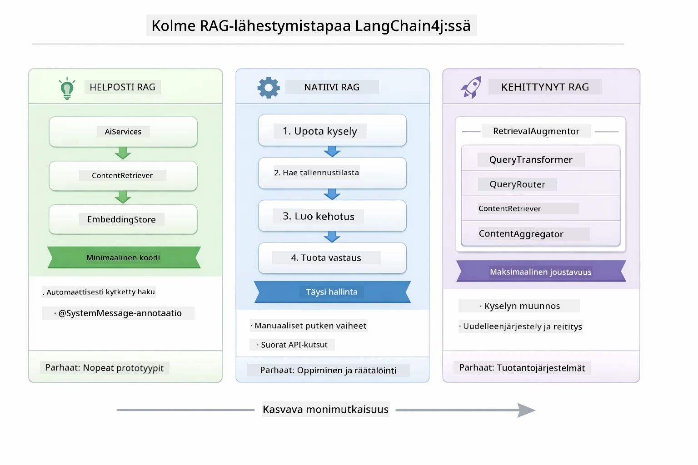
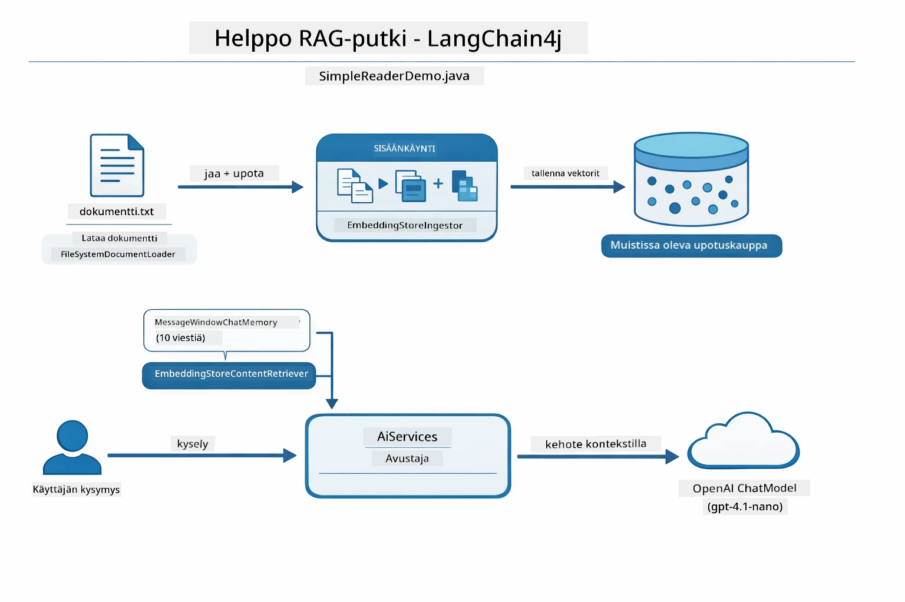
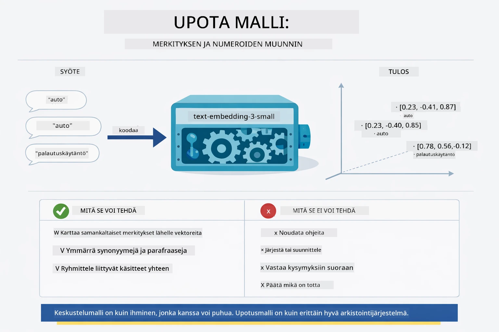
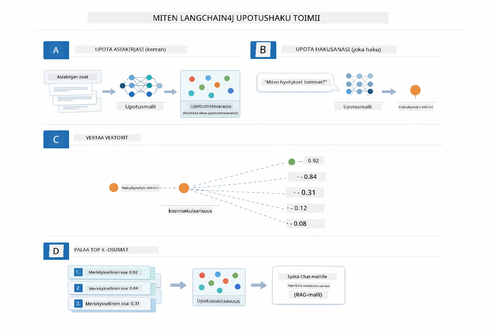
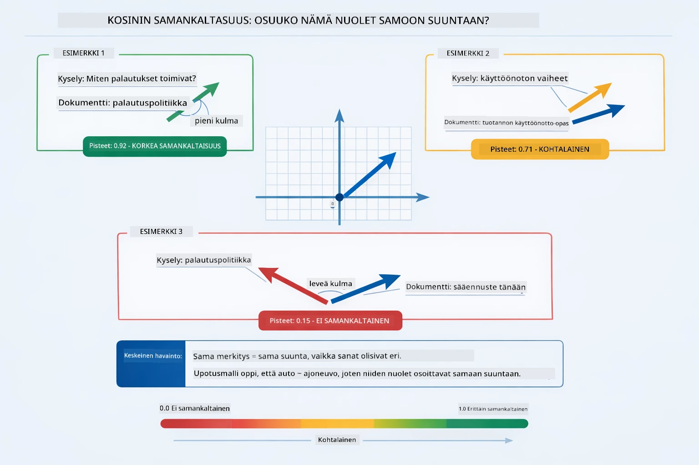
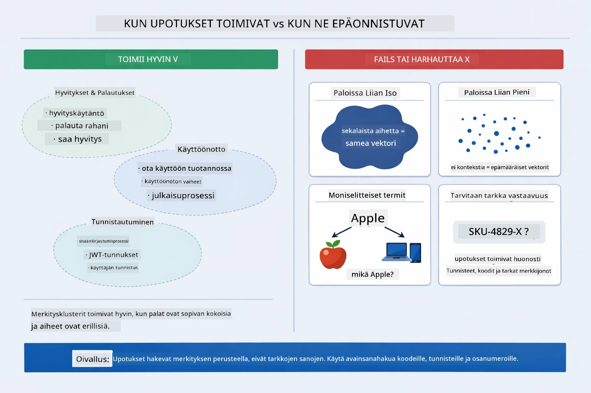

# Moduuli 03: RAG (Retrieval-Augmented Generation)

## Sisällys

- [Video- läpikäynti](../../../03-rag)
- [Mitä opit](../../../03-rag)
- [Esivaatimukset](../../../03-rag)
- [RAG:n ymmärtäminen](../../../03-rag)
  - [Mikä RAG-lähestymistapa tätä opetusohjelmaa käyttää?](../../../03-rag)
- [Kuinka se toimii](../../../03-rag)
  - [Dokumentin käsittely](../../../03-rag)
  - [Upotusten luominen](../../../03-rag)
  - [Semanttinen haku](../../../03-rag)
  - [Vastauksen generointi](../../../03-rag)
- [Sovelluksen suorittaminen](../../../03-rag)
- [Sovelluksen käyttäminen](../../../03-rag)
  - [Dokumentin lähettäminen](../../../03-rag)
  - [Kysymysten esittäminen](../../../03-rag)
  - [Lähdeviitteiden tarkistaminen](../../../03-rag)
  - [Kokeile kysymyksiä](../../../03-rag)
- [Keskeiset käsitteet](../../../03-rag)
  - [Pilkunteon strategia](../../../03-rag)
  - [Samanlaisuuspisteet](../../../03-rag)
  - [Muistissa säilytys](../../../03-rag)
  - [Kontekstikehyksen hallinta](../../../03-rag)
- [Milloin RAG on merkityksellinen](../../../03-rag)
- [Seuraavat askeleet](../../../03-rag)

## Video- läpikäynti

Katso tämä live-istunto, joka selittää miten aloittaa tämän moduulin kanssa:

<a href="https://www.youtube.com/watch?v=_olq75ZH_eY"></a>

## Mitä opit

Edellisissä moduuleissa opit käymään keskusteluja tekoälyn kanssa ja jäsentämään kehotteesi tehokkaasti. Mutta siinä on perustavanlaatuinen rajoitus: kielimallit tietävät vain sen, mitä ne oppivat koulutuksen aikana. Ne eivät voi vastata kysymyksiin yrityksesi käytännöistä, projektidokumentaatiostasi tai mistään tiedoista, joita niille ei ole opetettu.

RAG (Retrieval-Augmented Generation) ratkaisee tämän ongelman. Sen sijaan, että mallille yritettäisiin opettaa tietosi (mikä on kallista ja epäkäytännöllistä), sille annetaan kyky etsiä dokumenteistasi. Kun joku esittää kysymyksen, järjestelmä löytää oleellisen tiedon ja sisällyttää sen kehotteeseen. Malli vastaa sitten haetun kontekstin perusteella.

Ajattele RAG:ia mallille annettuna viitetietokirjastona. Kun kysyt kysymyksen, järjestelmä:

1. **Käyttäjän kysely** – Esität kysymyksen
2. **Upotus** – Muuntaa kysymyksen vektoriksi
3. **Vektori-haku** – Löytää samankaltaisia dokumenttipalasia
4. **Kontekstin kokoaminen** – Lisää olennaiset palat kehotteeseen
5. **Vastaus** – LLM tuottaa vastauksen kontekstin perusteella

Tämä perustaa mallin vastaukset todellisiin tietoihisi sen sijaan, että luottaisi sen koulutustietoon tai keksisi vastauksia.

## Esivaatimukset

- Suoritettu [Moduuli 00 - Nopeasti alkuun](../00-quick-start/README.md) (yllä mainitun Easy RAG -esimerkin osalta)
- Suoritettu [Moduuli 01 - Johdanto](../01-introduction/README.md) (Azure OpenAI -resurssit käyttöönotettu, mukaan lukien `text-embedding-3-small` upotusmalli)
- Juurikansiossa `.env`-tiedosto Azure-tunnuksilla (luotu `azd up` -komennolla Moduulissa 01)

> **Huom:** Jos et ole suorittanut Moduulia 01, seuraa ensin siellä olevia käyttöönotto-ohjeita. `azd up` -komento ottaa käyttöön GPT-chat-mallin ja upotusmallin, jota tämä moduuli käyttää.

## RAG:n ymmärtäminen

Alla oleva kaavio havainnollistaa ydinkäsitettä: sen sijaan että luottaisi mallin koulutusdataan yksinään, RAG antaa sille viitetietokirjaston dokumenteistasi konsultoitavaksi ennen vastauksen luontia.


*Tämä kaavio näyttää eron tavallisen LLM:n (joka arvaa koulutusdatan perusteella) ja RAG-parannetun LLM:n välillä (joka keskustelee ensin dokumenttisi kanssa).*

Näin vaiheet yhdistyvät päästä päähän. Käyttäjän kysymys kulkee neljän vaiheen läpi — upotus, vektori-haku, kontekstin kokoaminen ja vastauksen generointi — jokainen edellisen päälle rakennettu:


*Tämä kaavio näyttää päätä päähän RAG-putken — käyttäjän kysely kulkee upotuksen, vektori-haun, kontekstin kokoamisen ja vastauksen generoinnin läpi.*

Loput tästä moduulista käyvät läpi kukin vaiheen yksityiskohtaisesti, mukana koodi jota voit ajaa ja muokata.

### Mikä RAG-lähestymistapa tätä opetusohjelmaa käyttää?

LangChain4j tarjoaa kolme tapaa toteuttaa RAG, kukin eri abstraktiotason kanssa. Alla oleva kaavio vertaa niitä rinnakkain:



*Tämä kaavio vertaa kolmea LangChain4j:n RAG-lähestymistapaa — Easy, Native ja Advanced — näyttäen niiden keskeiset osat ja milloin käyttää kutakin.*

| Lähestymistapa | Toiminto | Vaihtokauppa |
|---|---|---|
| **Easy RAG** | Kytkee kaiken automaattisesti `AiServices`- ja `ContentRetriever`-komponenttien kautta. Annoit rajapinnan, liität hakijan, ja LangChain4j hoitaa upotuksen, haun ja kehotteen kokoamisen taustalla. | Vähäinen koodi, mutta et näe mitä kussakin vaiheessa tapahtuu. |
| **Native RAG** | Kutsut itse upotusmallia, haet tietovarastosta, rakennat kehotteen ja generoit vastauksen — yksi eksplisiittinen vaihe kerrallaan. | Enemmän koodia, mutta jokainen vaihe näkyy ja on muokattavissa. |
| **Advanced RAG** | Käyttää `RetrievalAugmentor`-kehystä, jossa on liitettävissä olevia kyselynmuuntimia, reitittimiä, uudelleenjärjestelijöitä ja sisällönlisääjiä tuotantokelpoisiin putkiin. | Maksimaalinen joustavuus, mutta huomattavasti monimutkaisempi. |

**Tämä opetusohjelma käyttää Native-lähestymistapaa.** RAG-putken jokainen vaihe — kyselyn upotus, vektoritietovaraston haku, kontekstin kokoaminen ja vastauksen generointi — on kirjoitettu eksplisiittisesti tiedostossa [`RagService.java`](../../../03-rag/src/main/java/com/example/langchain4j/rag/service/RagService.java). Tämä on tarkoituksellista: oppimateriaalina on tärkeämpää, että näet ja ymmärrät jokaisen vaiheen kuin että koodi olisi minimoitu. Kun olet tottunut siihen, miten osat sopivat yhteen, voit siirtyä Easy RAG:iin nopeille prototyypeille tai Advanced RAG:iin tuotantojärjestelmille.

> **💡 Oletko jo nähnyt Easy RAG:in toiminnassa?** [Nopeasti alkuun -moduuli](../00-quick-start/README.md) sisältää dokumentti Q&A -esimerkin ([`SimpleReaderDemo.java`](../../../00-quick-start/src/main/java/com/example/langchain4j/quickstart/SimpleReaderDemo.java)), joka käyttää Easy RAG -lähestymistapaa — LangChain4j hoitaa automaattisesti upotuksen, haun ja kehotteen kokoamisen. Tämä moduuli ottaa seuraavan askeleen avaamalla kyseisen putken, jotta voit nähdä ja hallita jokaista vaihetta itse.



*Tämä kaavio näyttää Easy RAG -putken `SimpleReaderDemo.java`-tiedostosta. Vertaa tätä Native-lähestymistapaan tässä moduulissa: Easy RAG piilottaa upotuksen, haun ja kehotteen kokoamisen `AiServices`- ja `ContentRetriever`-komponenttien taakse — lataa dokumentti, liitä hakija ja saat vastaukset. Tämän moduulin Native-lähestymistapa avaa putken siten, että kutsut itse jokaisen vaiheen (upotus, haku, kontekstin kokoaminen, generointi) antaen täyden näkyvyyden ja hallinnan.*

## Kuinka se toimii

Tämän moduulin RAG-putki jakautuu neljään vaiheeseen, jotka suoritetaan peräjälkeen aina kun käyttäjä kysyy jotain. Ensin ladattu dokumentti **jäsennetään ja pilkotaan** hallittaviin osiin. Nuo osat muunnetaan sitten **vektorimuotoisiksi upotuksiksi** ja tallennetaan vertailtaviksi matemaattisesti. Kun kysely saapuu, järjestelmä suorittaa **semanttisen haun** löytääkseen relevantimmat osat ja lopuksi välittää ne kontekstina LLM:lle **vastauksen generointia varten**. Seuraavat osiot käyvät jokaisen vaiheen läpi varsinaisella koodilla ja kaavioilla. Tarkastellaan ensimmäistä vaihetta.

### Dokumentin käsittely

[DocumentService.java](../../../03-rag/src/main/java/com/example/langchain4j/rag/service/DocumentService.java)

Kun lähetät dokumentin, järjestelmä jäsentää sen (PDF tai pelkkä teksti), liittää metatietoja kuten tiedostonimen ja pilkkoo sen osiin — pienempiin palasiin, jotka sopivat hyvin mallin kontekstikehykseen. Nämä palaset lomittuvat hieman, jotta rajakohdissa ei menetetä kontekstia.

```java
// Jäsennä ladattu tiedosto ja kääri se LangChain4j-dokumenttiin
Document document = Document.from(content, metadata);

// Pilko 300 tokenin osiin, joissa on 30 tokenin päällekkäisyys
DocumentSplitter splitter = DocumentSplitters
    .recursive(300, 30);

List<TextSegment> segments = splitter.split(document);
```

Alla oleva kaavio näyttää tämän toiminnan visuaalisesti. Huomaa, miten jokainen pala jakaa joitain tokeneita naapureidensa kanssa — 30-tokenin lomittuminen varmistaa, ettei tärkeä konteksti jää väliin:


*Tämä kaavio näyttää dokumentin pilkkomisen 300-tokenin paloiksi 30-tokenin lomittumisella, säilyttäen kontekstin palojen rajalla.*

> **🤖 Kokeile [GitHub Copilot](https://github.com/features/copilot) Chatin kanssa:** Avaa [`DocumentService.java`](../../../03-rag/src/main/java/com/example/langchain4j/rag/service/DocumentService.java) ja kysy:
> - "Miten LangChain4j pilkkoo dokumentit paloiksi ja miksi lomittuminen on tärkeää?"
> - "Mikä on optimaalinen pilkkujen koko eri dokumenttityypeille ja miksi?"
> - "Miten käsittelen monikielisiä dokumentteja tai erikoismuotoiluja?"

### Upotusten luominen

[LangChainRagConfig.java](../../../03-rag/src/main/java/com/example/langchain4j/rag/config/LangChainRagConfig.java)

Jokainen pala muunnetaan numeeriseen esitykseen, jota kutsutaan upotukseksi — käytännössä merkityksen muuntamiseksi numeroiksi. Upotusmalli ei ole "älykäs" samalla tavalla kuin chat-malli; se ei pysty noudattamaan ohjeita, päättämään tai vastaamaan kysymyksiin. Se voi kuitenkin kartoittaa tekstiä matemaattiseen tilaan, jossa samankaltaiset merkitykset asettuvat lähelle toisiaan — "auto" lähelle "ajoneuvoa", "palautuskäytäntö" lähelle "rahojen palautusta". Ajattele chat-mallia henkilönä, johon voi puhua; upotusmalli on erittäin hyvä arkistointijärjestelmä.



*Tämä kaavio näyttää, miten upotusmalli muuttaa tekstiä numeerisiksi vektoreiksi, sijoittaen samankaltaiset merkitykset — kuten "auto" ja "ajoneuvo" — lähelle toisiaan vektoritilassa.*

```java
@Bean
public EmbeddingModel embeddingModel() {
    return OpenAiOfficialEmbeddingModel.builder()
        .baseUrl(azureOpenAiEndpoint)
        .apiKey(azureOpenAiKey)
        .modelName(azureEmbeddingDeploymentName)
        .build();
}

EmbeddingStore<TextSegment> embeddingStore = 
    new InMemoryEmbeddingStore<>();
```

Alla oleva luokkakaavio näyttää kaksi erillistä virtausta RAG-putkessa ja LangChain4j-luokat, jotka niitä toteuttavat. **Syöttövirta** (ajetaan kerran lähetyksen yhteydessä) pilkkoo dokumentin, upottaa palaset ja tallentaa ne `.addAll()`-metodilla. **Kyselyvirta** (ajetaan aina kun käyttäjä kysyy) upottaa kysymyksen, hakee tietovarastosta `.search()`-metodilla ja välittää löydetyn kontekstin chat-mallille. Molemmat virtaukset kohtaavat yhteisessä `EmbeddingStore<TextSegment>` -rajapinnassa:


*Tämä kaavio näyttää RAG-putken kaksi virtausta — syötön ja kyselyn — ja miten ne yhdistyvät yhteisen EmbeddingStore-rajapinnan kautta.*

Kun upotukset on tallennettu, samankaltainen sisältö ryhmittyy luonnollisesti vektoritilassa. Alla oleva visualisointi näyttää, miten aihepiirit liittyvistä dokumenteista muodostavat lähellä toisiaan olevia pisteitä, mikä mahdollistaa semanttisen haun:


*Tämä visualisointi näyttää, miten aihepiirit, kuten tekniset dokumentit, liiketoimintasäännöt ja usein kysytyt kysymykset, muodostavat erillisiä ryhmiä 3D-vektoritilassa.*

Kun käyttäjä hakee, järjestelmä suorittaa neljä vaihetta: upottaa dokumentit kerran, upottaa haun kysely jokaisella haulla, vertaa kyselyvektoria kaikkiin tallennettuihin vektoreihin kosinisamanlaisuuden avulla ja palauttaa kymmenen parasta tulosta. Alla oleva kaavio esittää jokaisen vaiheen ja mukana olevat LangChain4j-luokat:



*Tämä kaavio näyttää nelivaiheisen upotushakuprosessin: dokumenttien upotus, kyselyn upotus, vektorien vertailu kosinisamanlaisuudella ja top-K-tulosten palautus.*

### Semanttinen haku

[RagService.java](../../../03-rag/src/main/java/com/example/langchain4j/rag/service/RagService.java)

Kun esität kysymyksen, kysymyksesi muutetaan myös upotukseksi. Järjestelmä vertaa kysymyksesi upotusta kaikkien dokumenttipalojen upotuksiin. Se löytää palaset, joilla on samankaltaisin merkitys — ei vain avainsanojen vastaavuus, vaan aito semanttinen samankaltaisuus.

```java
Embedding queryEmbedding = embeddingModel.embed(question).content();

EmbeddingSearchRequest searchRequest = EmbeddingSearchRequest.builder()
    .queryEmbedding(queryEmbedding)
    .maxResults(5)
    .minScore(0.5)
    .build();

EmbeddingSearchResult<TextSegment> searchResult = embeddingStore.search(searchRequest);
List<EmbeddingMatch<TextSegment>> matches = searchResult.matches();

for (EmbeddingMatch<TextSegment> match : matches) {
    String relevantText = match.embedded().text();
    double score = match.score();
}
```

Alla oleva kaavio vertailee semanttista ja perinteistä avainsanahakua. Avainsanahaku "ajoneuvo" -sanalla jää paitsi palasta, joka käsittelee "autoja ja rekkoja", mutta semanttinen haku ymmärtää niiden tarkoittavan samaa ja palauttaa sen korkean pistemäärän yksikkönä:


*Tämä kaavio vertaa avainsanaperusteista hakua semanttiseen hakuun näyttäen miten semanttinen haku löytää käsitteellisesti liittyvää sisältöä, vaikka tarkat avainsanat eivät täsmäisi.*

Taustalla samanlaisuutta mitataan kosinisamanlaisuudella — kysyen käytännössä "osoittavatko nämä kaksi nuolta samaan suuntaan?" Kaksi palaa voi käyttää täysin eri sanoja, mutta jos ne tarkoittavat samaa, niiden vektorit osoittavat samaan suuntaan ja saavat pistemäärän lähelle 1.0:


*Tämä kaavio kuvastaa kosinilähisyyttä sisäkkäisvektorien välisenä kulmana — paremmin linjassa olevat vektorit saavat arvosanan lähempänä 1.0, mikä viittaa korkeampaan semanttiseen samankaltaisuuteen.*

> **🤖 Kokeile [GitHub Copilot](https://github.com/features/copilot) Chatin kanssa:** Avaa [`RagService.java`](../../../03-rag/src/main/java/com/example/langchain4j/rag/service/RagService.java) ja kysy:
> - "Miten samankaltaisuushaku toimii upotusten kanssa ja mikä määrää pistemäärän?"
> - "Minkä samankaltaisuuskynnyksen tulisi olla ja miten se vaikuttaa tuloksiin?"
> - "Miten käsittelen tilanteita, joissa ei löydy relevantteja dokumentteja?"

### Vastauksen generointi

[RagService.java](../../../03-rag/src/main/java/com/example/langchain4j/rag/service/RagService.java)

Merkityksellisimmät palat kootaan rakenteelliseen kehotteeseen, joka sisältää selkeät ohjeet, haetun kontekstin ja käyttäjän kysymyksen. Malli lukee kyseiset palat ja vastaa niiden perusteella — se voi käyttää vain edessään olevaa tietoa, mikä ehkäisee harhakuvien muodostumista.

```java
String context = matches.stream()
    .map(match -> match.embedded().text())
    .collect(Collectors.joining("\n\n"));

String prompt = String.format("""
    Answer the question based on the following context.
    If the answer cannot be found in the context, say so.

    Context:
    %s

    Question: %s

    Answer:""", context, request.question());

String answer = chatModel.chat(prompt);
```

Alla oleva kaavio havainnollistaa tätä kokoamisprosessia — hakuvaiheen parhaiten pisteytetyt palat upotetaan kehotemalliin, ja `OpenAiOfficialChatModel` tuottaa perustellun vastauksen:


*Tämä kaavio näyttää, miten parhaiten pisteytetyt palat kootaan yhteen rakenteelliseen kehotteeseen, mikä mahdollistaa mallin tuottaa perusteltu vastaus datastasi.*

## Sovelluksen käynnistäminen

**Varmista käyttöönotto:**

Varmista, että juurihakemistossa on `.env`-tiedosto, jossa on Azure-valtuustiedot (luotu moduulin 01 aikana):

**Bash:**
```bash
cat ../.env  # Pitäisi näyttää AZURE_OPENAI_ENDPOINT, API_KEY, DEPLOYMENT
```

**PowerShell:**
```powershell
Get-Content ..\.env  # Tulisi näyttää AZURE_OPENAI_ENDPOINT, API_KEY, DEPLOYMENT
```

**Käynnistä sovellus:**

> **Huom:** Jos käynnistit jo kaikki sovellukset käyttämällä `./start-all.sh` moduulista 01, tämä moduuli on jo käynnissä portissa 8081. Voit ohittaa alla olevat käynnistyskomennot ja siirtyä suoraan osoitteeseen http://localhost:8081.

**Vaihtoehto 1: Spring Boot Dashboardin käyttö (suositeltu VS Coden käyttäjille)**

Kehitysympäristö sisältää Spring Boot Dashboard -laajennuksen, joka tarjotaan visuaalisen käyttöliittymän kaikille Spring Boot -sovelluksille. Löydät sen VS Coden vasemman puolen Activity Barista (etsi Spring Boot -kuvake).

Spring Boot Dashboardista voit:
- Näyttää kaikki käytettävissä olevat Spring Boot -sovellukset työtilassa
- Käynnistää/pysäyttää sovelluksia yhdellä napsautuksella
- Tarkastella sovellusten lokeja reaaliajassa
- Valvoa sovellusten tilaa

Klikkaa vain "rag"-kohdan vieressä olevaa play-painiketta käynnistääksesi tämän moduulin, tai käynnistä kaikki moduulit kerralla.


*Tämä kuvakaappaus esittää Spring Boot Dashboardin VS Codessa, jossa voit käynnistää, pysäyttää ja valvoa sovelluksia visuaalisesti.*

**Vaihtoehto 2: Komentosarjojen käyttö**

Käynnistä kaikki web-sovellukset (moduulit 01-04):

**Bash:**
```bash
cd ..  # Juurihakemistosta
./start-all.sh
```

**PowerShell:**
```powershell
cd ..  # Juurihakemistosta
.\start-all.ps1
```

Tai käynnistä pelkkä tämä moduuli:

**Bash:**
```bash
cd 03-rag
./start.sh
```

**PowerShell:**
```powershell
cd 03-rag
.\start.ps1
```

Molemmat skriptit lataavat automaattisesti ympäristömuuttujat juurihakemiston `.env`-tiedostosta ja rakentavat tarvittaessa JAR-tiedostot.

> **Huom:** Jos haluat rakentaa kaikki moduulit manuaalisesti ennen käynnistämistä:
>
> **Bash:**
> ```bash
> cd ..  # Go to root directory
> mvn clean package -DskipTests
> ```
>
> **PowerShell:**
> ```powershell
> cd ..  # Go to root directory
> mvn clean package -DskipTests
> ```

Avaa selaimellasi http://localhost:8081.

**Sovelluksen pysäyttäminen:**

**Bash:**
```bash
./stop.sh  # Vain tämä moduuli
# Tai
cd .. && ./stop-all.sh  # Kaikki moduulit
```

**PowerShell:**
```powershell
.\stop.ps1  # Tämä moduuli vain
# Tai
cd ..; .\stop-all.ps1  # Kaikki moduulit
```

## Sovelluksen käyttö

Sovellus tarjoaa verkkokäyttöliittymän dokumenttien lataamista ja kysymyksiä varten.

<a href="images/rag-homepage.png"></a>

*Tämä kuvakaappaus esittää RAG-sovellusliittymän, jossa lataat dokumentteja ja esität kysymyksiä.*

### Dokumentin lataaminen

Aloita lataamalla dokumentti — TXT-tiedostot toimivat parhaiten testauksessa. Tässä hakemistossa on `sample-document.txt`, joka sisältää tietoa LangChain4j:n ominaisuuksista, RAG-toteutuksesta ja parhaista käytännöistä — täydellinen järjestelmän testaamiseen.

Järjestelmä käsittelee dokumenttisi, jakaa sen paloiksi ja luo kullekin palalle upotukset. Tämä tapahtuu automaattisesti latauksen yhteydessä.

### Kysy kysymyksiä

Esitä nyt tarkkoja kysymyksiä dokumentin sisällöstä. Kokeile jotain faktapohjaista, joka on selvästi esitetty dokumentissa. Järjestelmä hakee relevantit palat, sisällyttää ne kehotteeseen ja tuottaa vastauksen.

### Tarkista lähdeviitteet

Huomaa, että jokainen vastaus sisältää lähdeviitteitä samankaltaisuuspisteillä. Nämä pisteet (0–1) kertovat, kuinka relevantti kukin pala oli kysymykseesi nähden. Korkeammat pisteet tarkoittavat parempia osumia. Tämä antaa sinun varmistaa vastauksen alkuperäisen aineiston perusteella.

<a href="images/rag-query-results.png"></a>

*Tämä kuvakaappaus esittää hakutulokset, generoidun vastauksen, lähdeviitteet ja kunkin haetun palan relevanssipisteet.*

### Kokeile erilaisia kysymyksiä

Kokeile erilaisia kysymystyyppejä:
- Tarkat faktat: "Mikä on pääaihe?"
- Vertailut: "Mikä on ero X:n ja Y:n välillä?"
- Yhteenvedot: "Tiivistä keskeiset kohdat Z:stä"

Seuraa, miten relevanssipisteet muuttuvat sen mukaan, miten hyvin kysymyksesi vastaa dokumentin sisältöä.

## Keskeiset käsitteet

### Paloitusstrategia

Dokumentit jaetaan 300 tokenin paloihin, joissa on 30 tokenin päällekkäisyys. Tämä tasapaino varmistaa, että jokainen pala sisältää riittävästi kontekstia ollakseen merkityksellinen, mutta pysyy riittävän pienenä, jotta useampi pala mahtuu kehotteeseen.

### Samankaltaisuuspisteet

Jokaiselle haetulle palalle annetaan samankaltaisuuspiste 0:n ja 1:n välillä, joka kuvaa kuinka hyvin se vastaa käyttäjän kysymystä. Alla oleva kaavio visualisoi pistemäärien vaihteluvälin ja miten järjestelmä käyttää niitä tulosten suodattamiseen:


*Tämä kaavio näyttää pistemäärien vaihteluvälin 0:sta 1:een, ja minimikynnyksen 0,5, joka suodattaa pois epäolennaiset palat.*

Pisteet vaihtelevat välillä 0–1:
- 0.7-1.0: Erittäin relevantti, tarkka osuma
- 0.5-0.7: Relevantti, hyvä konteksti
- Alle 0.5: Suodatettu pois, liian erilainen

Järjestelmä hakee vain palat, jotka ovat minimikynnyksen yläpuolella laadun varmistamiseksi.

Upotukset toimivat hyvin, kun merkitykset ryhmittyvät selkeästi, mutta niillä on sokeita kohtia. Alla oleva kaavio näyttää yleiset virhetapaukset — liian suuret palat tuottavat epäselviä vektoreita, liian pienet palat puuttuvat kontekstista, monitulkintaiset termit osoittavat useisiin ryhmiin, ja täsmähaku (ID:t, osanumero) ei toimi upotusten kanssa lainkaan:



*Tämä kaavio esittää yleisiä upotusvirheitä: liian suuret palat, liian pienet palat, monitulkintaiset termit jotka osoittavat useisiin ryhmiin, sekä täsmähaku (esim. ID:t).*

### Muistissa säilytys

Tämä moduuli käyttää yksinkertaisuuden vuoksi muistissa olevaa tallennustilaa. Kun käynnistät sovelluksen uudelleen, ladatut dokumentit katoavat. Tuotantojärjestelmät käyttävät pysyviä vektoritietokantoja, kuten Qdrant tai Azure AI Search.

### Konteksti-ikkunan hallinta

Jokaisella mallilla on maksimimäärä kontekstitilaa. Et voi sisällyttää jokaista palaa suuresta dokumentista. Järjestelmä hakee top N relevantimpia paloja (oletuksena 5) pysyäkseen rajoissa ja tarjotakseen riittävästi kontekstia tarkkoihin vastauksiin.

## Milloin RAG on tärkeä

RAG ei aina ole oikea lähestymistapa. Alla oleva päätösohje auttaa sinua tunnistamaan, milloin RAG tuottaa lisäarvoa, kun taas yksinkertaisemmat menetelmät — kuten sisällön suora sisällyttäminen kehotteeseen tai mallin sisäiseen tietoon luottaminen — riittävät:


*Tämä kaavio näyttää päätösohjeen, milloin RAG tuottaa lisäarvoa ja milloin yksinkertaisemmat menetelmät ovat riittäviä.*

**Käytä RAGia, kun:**
- Vastaat kysymyksiin omista dokumenteista
- Tiedot muuttuvat usein (käytännöt, hinnat, tekniset tiedot)
- Tarkkuus vaatii lähteen ilmoittamista
- Sisältö on liian laaja mahtumaan yhteen kehotteeseen
- Tarvitset varmistettavia, perusteltuja vastauksia

**Älä käytä RAGia, kun:**
- Kysymykset vaativat mallin jo tuntemaa yleistä tietoa
- Tarvitaan reaaliaikaista dataa (RAG toimii ladatuilla dokumenteilla)
- Sisältö on sen verran pientä, että se mahtuu suoraan kehotteeseen

## Seuraavat askeleet

**Seuraava moduuli:** [04-tools - AI Agents with Tools](../04-tools/README.md)

---

**Navigointi:** [← Edellinen: Moduuli 02 - Kehoteinsinöörityö](../02-prompt-engineering/README.md) | [Takaisin pääsivulle](../README.md) | [Seuraava: Moduuli 04 - Työkalut →](../04-tools/README.md)

---

<!-- CO-OP TRANSLATOR DISCLAIMER START -->
**Vastuuvapauslauseke**:
Tämä asiakirja on käännetty käyttämällä tekoälypohjaista käännöspalvelua [Co-op Translator](https://github.com/Azure/co-op-translator). Pyrimme tarkkuuteen, mutta otathan huomioon, että automaattiset käännökset saattavat sisältää virheitä tai epätarkkuuksia. Alkuperäinen asiakirja sen omalla kielellä tulisi pitää virallisena lähteenä. Tärkeiden tietojen osalta suositellaan ammattimaista ihmiskäännöstä. Emme ole vastuussa tämän käännöksen käytöstä aiheutuvista väärinymmärryksistä tai tulkinnoista.
<!-- CO-OP TRANSLATOR DISCLAIMER END -->