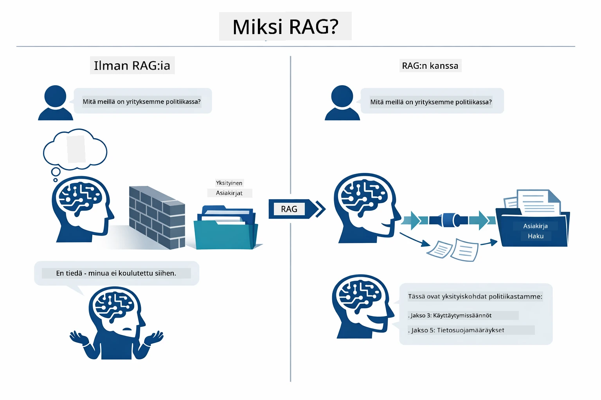
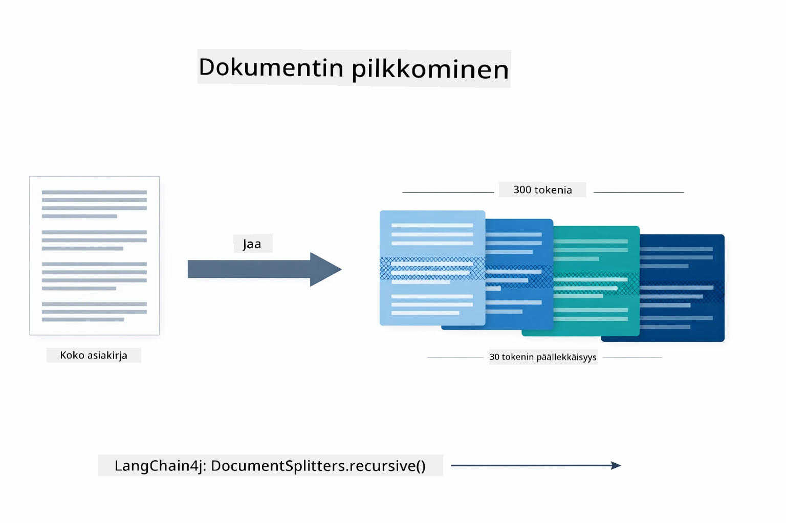
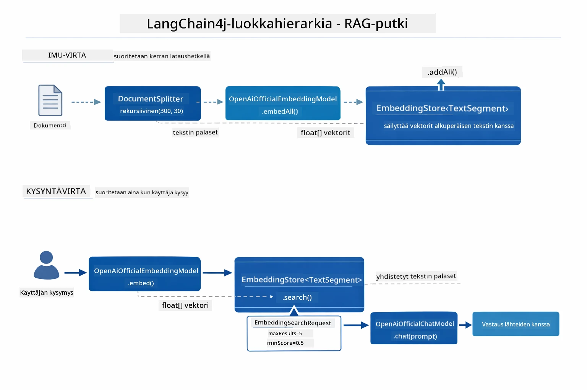
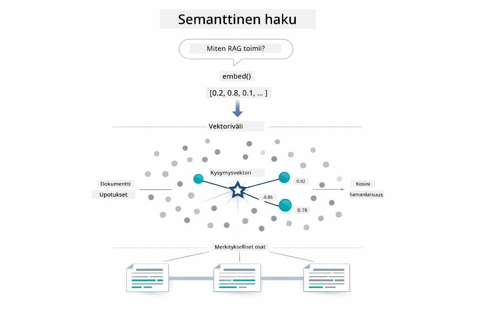
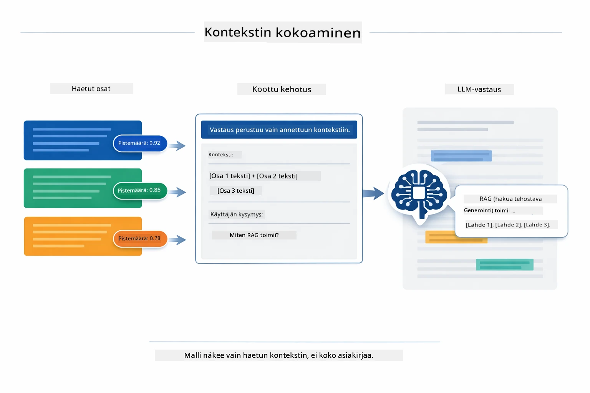
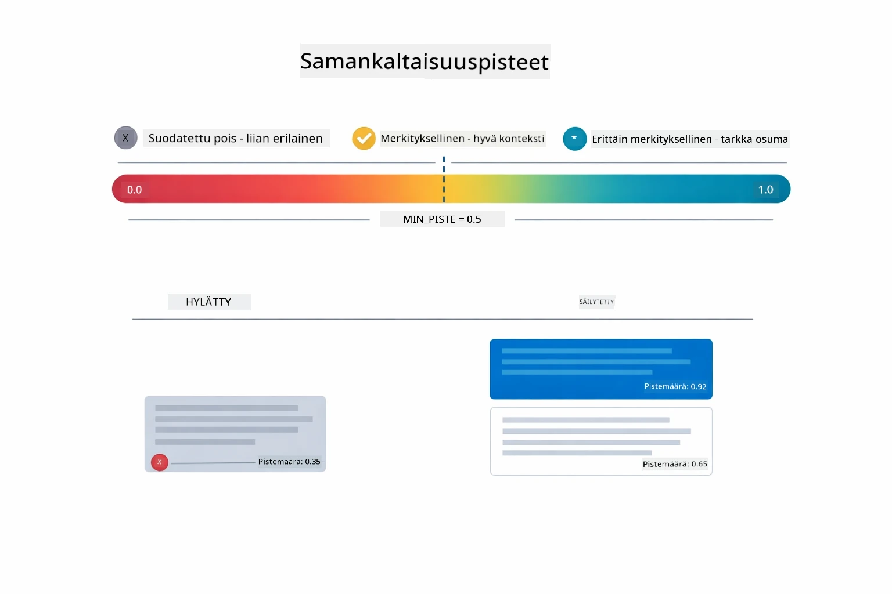
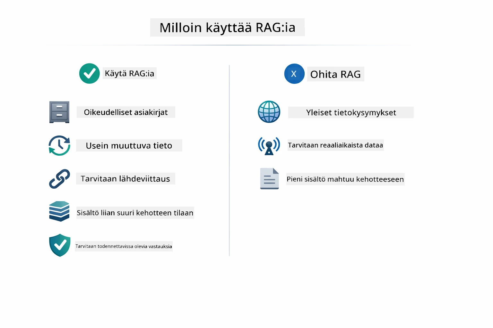

# Moduuli 03: RAG (Hakua täydentävä generointi)

## Sisällysluettelo

- [Mitä opit](../../../03-rag)
- [RAG:n ymmärtäminen](../../../03-rag)
- [Esivaatimukset](../../../03-rag)
- [Kuinka se toimii](../../../03-rag)
  - [Dokumentin käsittely](../../../03-rag)
  - [Upotusten luominen](../../../03-rag)
  - [Semanttinen haku](../../../03-rag)
  - [Vastausten generointi](../../../03-rag)
- [Sovelluksen käynnistäminen](../../../03-rag)
- [Sovelluksen käyttö](../../../03-rag)
  - [Dokumentin lataaminen](../../../03-rag)
  - [Kysyminen](../../../03-rag)
  - [Lähdeviitteiden tarkistaminen](../../../03-rag)
  - [Kokeile kysymyksiä](../../../03-rag)
- [Keskeiset käsitteet](../../../03-rag)
  - [Pilkkomisstrategia](../../../03-rag)
  - [Samankaltaisuuspisteet](../../../03-rag)
  - [Muistissa oleva tallennus](../../../03-rag)
  - [Kontekstin hallinta](../../../03-rag)
- [Milloin RAG on tärkeä](../../../03-rag)
- [Seuraavat askeleet](../../../03-rag)

## Mitä opit

Edellisissä moduuleissa opit käymään keskusteluja tekoälyn kanssa ja rakentamaan kehotteesi tehokkaasti. Mutta on yksi perusrajoitus: kielimallit tietävät vain sen, mitä ne oppivat koulutuksen aikana. Ne eivät voi vastata kysymyksiin yrityksesi käytännöistä, projektidokumentaatiosta tai mistään muusta tiedosta, johon niitä ei ole koulutettu.

RAG (Hakua täydentävä generointi) ratkaisee tämän ongelman. Sen sijaan, että yrittäisit opettaa mallille tietoa (joka on kallista ja epäkäytännöllistä), annat sille kyvyn hakea tietoa dokumenteistasi. Kun joku esittää kysymyksen, järjestelmä löytää relevanttia tietoa ja liittää sen kehotteeseen. Malli vastaa tämän haetun kontekstin perusteella.

Ajattele RAG:ia mallin viitetietokirjastona. Kun kysyt kysymyksen, järjestelmä:

1. **Käyttäjän kysely** – Kysyt kysymyksen
2. **Upotus** – Muuntaa kysymyksesi vektoriksi
3. **Vektorihaku** – Löytää samankaltaiset dokumenttipalaset
4. **Kontekstin kokoaminen** – Lisää asiaankuuluvat palaset kehotteeseen
5. **Vastaus** – LLM tuottaa vastauksen kontekstin perusteella

Näin malli saa vastauksensa perustuen todelliseen aineistoosi sen sijaan, että se luottaisi vain koulutusdataansa tai keksisi vastauksia.

## RAG:n ymmärtäminen

Alla oleva kaavio havainnollistaa ydinkonseptin: sen sijaan, että luottaisi pelkkään mallin koulutusdataan, RAG antaa sille viitetietokirjaston dokumenteistasi, joihin se voi tutustua ennen vastauksen muodostamista.



Näin osat yhdistyvät kokonaisuudeksi. Käyttäjän kysymys kulkee neljän vaiheen läpi — upotus, vektorihaku, kontekstin kokoaminen ja vastauksen generointi — jokainen rakentuu edellisen päälle:


Tämän moduulin loput osat käyvät läpi jokaisen vaiheen yksityiskohtaisesti, mukana on koodia, jota voit suorittaa ja muokata.

## Esivaatimukset

- Moduuli 01 suoritettu (Azure OpenAI -resurssit asennettu)
- Juurikansiossa `.env`-tiedosto Azure-tunnuksilla (luotu `azd up` -komennolla Moduulissa 01)

> **Huom:** Jos et ole vielä suorittanut Moduulia 01, seuraa ensin siellä annettuja asennusohjeita.

## Kuinka se toimii

### Dokumentin käsittely

[DocumentService.java](../../../03-rag/src/main/java/com/example/langchain4j/rag/service/DocumentService.java)

Kun lataat dokumentin, järjestelmä jäsentää sen (PDF tai pelkkä teksti), liittää metatietoja kuten tiedostonimen ja pilkkoo sen palasiin — pienempiin osiin, jotka sopivat mukavasti mallin kontekstin ikkunaan. Nämä palat limittyvät hieman, jotta konteksti ei katoa rajapinnoissa.

```java
// Jäsennä ladattu tiedosto ja kääri se LangChain4j-dokumenttiin
Document document = Document.from(content, metadata);

// Jaa 300-tokenin paloihin, joissa on 30-tokenin päällekkäisyys
DocumentSplitter splitter = DocumentSplitters
    .recursive(300, 30);

List<TextSegment> segments = splitter.split(document);
```

Alla oleva kaavio näyttää tämän visuaalisesti. Huomaa, että jokainen pala jakaa joitakin tokeneita naapureidensa kanssa — 30 tokenin limittyminen takaa, ettei tärkeä konteksti jää katveeseen:



> **🤖 Kokeile [GitHub Copilot](https://github.com/features/copilot) Chatilla:** Avaa [`DocumentService.java`](../../../03-rag/src/main/java/com/example/langchain4j/rag/service/DocumentService.java) ja kysy:
> - "Miten LangChain4j pilkkoo dokumentit palasiksi ja miksi limittyminen on tärkeää?"
> - "Mikä on optimaalinen palan koko eri dokumenttityypeille ja miksi?"
> - "Miten käsittelen dokumentteja, joissa on useita kieliä tai erityismuotoiluja?"

### Upotusten luominen

[LangChainRagConfig.java](../../../03-rag/src/main/java/com/example/langchain4j/rag/config/LangChainRagConfig.java)

Jokainen pala muunnetaan numeeriseksi esitykseksi, jota kutsutaan upotukseksi – pohjimmiltaan matemaattiseksi sormenjäljeksi, joka vangitsee tekstin merkityksen. Samankaltainen teksti tuottaa samankaltaisia upotuksia.

```java
@Bean
public EmbeddingModel embeddingModel() {
    return OpenAiOfficialEmbeddingModel.builder()
        .baseUrl(azureOpenAiEndpoint)
        .apiKey(azureOpenAiKey)
        .modelName(azureEmbeddingDeploymentName)
        .build();
}

EmbeddingStore<TextSegment> embeddingStore = 
    new InMemoryEmbeddingStore<>();
```

Luokkakaavio alla näyttää, miten nämä LangChain4j-komponentit yhdistyvät. `OpenAiOfficialEmbeddingModel` muuntaa tekstin vektoreiksi, `InMemoryEmbeddingStore` pitää vektorit niiden alkuperäisen `TextSegment`-datan kanssa, ja `EmbeddingSearchRequest` hallitsee hakua kuten `maxResults` ja `minScore`:



Kun upotukset on tallennettu, samankaltainen sisältö ryhmittyy luonnollisesti yhteen vektorivälilyöntiin. Alla oleva visualisointi näyttää, miten saman aihepiirin dokumentit päätyvät lähellä toisiaan oleviksi pisteiksi, mikä mahdollistaa semanttisen haun:


### Semanttinen haku

[RagService.java](../../../03-rag/src/main/java/com/example/langchain4j/rag/service/RagService.java)

Kun esität kysymyksen, siitäkin luodaan upotus. Järjestelmä vertaa kysymyksesi upotusta kaikkien dokumenttipalojen upotuksiin. Se löytää palat, joiden merkitykset ovat lähimpänä — ei vain avainsanojen osumista, vaan oikeaa semanttista samankaltaisuutta.

```java
Embedding queryEmbedding = embeddingModel.embed(question).content();

EmbeddingSearchRequest searchRequest = EmbeddingSearchRequest.builder()
    .queryEmbedding(queryEmbedding)
    .maxResults(5)
    .minScore(0.5)
    .build();

EmbeddingSearchResult<TextSegment> searchResult = embeddingStore.search(searchRequest);
List<EmbeddingMatch<TextSegment>> matches = searchResult.matches();

for (EmbeddingMatch<TextSegment> match : matches) {
    String relevantText = match.embedded().text();
    double score = match.score();
}
```

Alla oleva kaavio vertaa semanttista hakua perinteiseen avainsanahakuun. Avainsanahaku "ajoneuvo" ohittaa palan, joka käsittelee "autoja ja rekkoja", mutta semanttinen haku ymmärtää, että ne tarkoittavat samaa asiaa ja palauttaa sen hyvinä osumina:



> **🤖 Kokeile [GitHub Copilot](https://github.com/features/copilot) Chatilla:** Avaa [`RagService.java`](../../../03-rag/src/main/java/com/example/langchain4j/rag/service/RagService.java) ja kysy:
> - "Miten samankaltaisuushaku toimii upotusten kanssa ja mikä määrittää pisteen?"
> - "Mikä samankaltaisuuskynnys pitäisi asettaa ja miten se vaikuttaa tuloksiin?"
> - "Miten toimin, jos sopivia dokumentteja ei löydy?"

### Vastausten generointi

[RagService.java](../../../03-rag/src/main/java/com/example/langchain4j/rag/service/RagService.java)

Merkityksellisimmät palat kootaan rakenteelliseksi kehotteeksi, joka sisältää selkeät ohjeet, haetun kontekstin ja käyttäjän kysymyksen. Malli lukee nimenomaiset palat ja vastaa niiden perusteella — se voi käyttää vain sitä, mikä on sen edessä, mikä estää hallusinaatiot.

```java
String context = matches.stream()
    .map(match -> match.embedded().text())
    .collect(Collectors.joining("\n\n"));

String prompt = String.format("""
    Answer the question based on the following context.
    If the answer cannot be found in the context, say so.

    Context:
    %s

    Question: %s

    Answer:""", context, request.question());

String answer = chatModel.chat(prompt);
```

Alla oleva kaavio näyttää tämän kokoamisen toiminnassa — hakuvaiheen parhaiten pisteytetyt palat upotetaan kehotteeseen ja `OpenAiOfficialChatModel` generoi perustellun vastauksen:



## Sovelluksen käynnistäminen

**Varmista asennus:**

Varmista, että juuri-hakemistossa on `.env`-tiedosto Azure-tunnuksilla (luotu moduulissa 01):
```bash
cat ../.env  # Tulisi näyttää AZURE_OPENAI_ENDPOINT, API_KEY, DEPLOYMENT
```

**Käynnistä sovellus:**

> **Huom:** Jos olet jo käynnistänyt kaikki sovellukset komennolla `./start-all.sh` moduulissa 01, tämä moduuli pyörii jo portissa 8081. Voit ohittaa seuraavat käynnistyskomennot ja mennä suoraan osoitteeseen http://localhost:8081.

**Vaihtoehto 1: Spring Boot Dashboardin käyttäminen (suositeltu VS Code -käyttäjille)**

Kehityskontti sisältää Spring Boot Dashboard -laajennuksen, joka tarjoaa visuaalisen käyttöliittymän hallita kaikkia Spring Boot -sovelluksia. Löydät sen VS Coden vasemmalta sivupalkista Spring Boot -kuvakkeen alta.

Spring Boot Dashboardista voit:
- Näyttää kaikki työtilassa olevat Spring Boot -sovellukset
- Käynnistää/pysäyttää sovelluksia yhdellä klikkauksella
- Katsoa sovelluslokit reaaliajassa
- Seurata sovelluksen tilaa

Klikkaa vain pelipainiketta "rag" kohdalta käynnistääksesi tämän moduulin, tai käynnistä kaikki moduulit kerralla.


**Vaihtoehto 2: Komentosarjojen käyttäminen**

Käynnistä kaikki web-sovellukset (moduulit 01-04):

**Bash:**
```bash
cd ..  # Juurihakemistosta
./start-all.sh
```

**PowerShell:**
```powershell
cd ..  # Juurihakemistosta
.\start-all.ps1
```

Tai käynnistä vain tämä moduuli:

**Bash:**
```bash
cd 03-rag
./start.sh
```

**PowerShell:**
```powershell
cd 03-rag
.\start.ps1
```

Molemmat skriptit lataavat automaattisesti ympäristömuuttujat juuren `.env`-tiedostosta ja rakentavat JAR-tiedostot, jos niitä ei ole vielä olemassa.

> **Huom:** Jos haluat koota kaikki moduulit käsin ennen käynnistystä:
>
> **Bash:**
> ```bash
> cd ..  # Go to root directory
> mvn clean package -DskipTests
> ```
>
> **PowerShell:**
> ```powershell
> cd ..  # Go to root directory
> mvn clean package -DskipTests
> ```

Avaa selain ja mene osoitteeseen http://localhost:8081.

**Pysäyttääksesi:**

**Bash:**
```bash
./stop.sh  # Vain tämä moduuli
# Tai
cd .. && ./stop-all.sh  # Kaikki moduulit
```

**PowerShell:**
```powershell
.\stop.ps1  # Tämä moduuli vain
# Tai
cd ..; .\stop-all.ps1  # Kaikki moduulit
```


## Sovelluksen käyttö

Sovellus tarjoaa web-käyttöliittymän dokumenttien lataukseen ja kysymysten esittämiseen.

<a href="images/rag-homepage.png"></a>

*RAG-sovellusliittymä - lataa dokumentteja ja esitä kysymyksiä*

### Dokumentin lataaminen

Aloita lataamalla dokumentti – TXT-tiedostot toimivat parhaiten testaamiseen. Tässä hakemistossa on esimerkkidokumentti `sample-document.txt`, joka sisältää tietoa LangChain4j:n ominaisuuksista, RAG-toteutuksesta ja parhaista käytännöistä – täydellinen järjestelmän testaamiseen.

Järjestelmä käsittelee dokumenttisi, pilkkoo sen palasiin ja luo upotukset jokaiselle palalle. Tämä tapahtuu automaattisesti latauksen yhteydessä.

### Kysyminen

Esitä nyt kohdennettuja kysymyksiä dokumentin sisällöstä. Kokeile faktoja, jotka on selvästi esitetty dokumentissa. Järjestelmä etsii asiaankuuluvat palat, sisällyttää ne kehotteeseen ja generoi vastauksen.

### Lähdeviitteiden tarkistaminen

Huomaa, että jokainen vastaus sisältää lähdeviitteet samankaltaisuuspisteineen. Nämä pisteet (0–1) näyttävät, kuinka relevantti kukin pala oli kysymykseesi. Korkeammat pisteet tarkoittavat parempia osumia. Tämä antaa sinulle mahdollisuuden varmistaa vastaus lähdemateriaalista.

<a href="images/rag-query-results.png"></a>

*Kyselyn tulokset näyttävät vastauksen lähdeviitteineen ja merkityspiisteineen*

### Kokeile kysymyksiä

Kokeile erilaisia kysymyksiä:
- Tarkat faktat: "Mikä on pääaihe?"
- Vertailut: "Mikä on ero X:n ja Y:n välillä?"
- Yhteenvetot: "Tiivistä tärkeimmät kohdat Z:stä"

Katso, miten merkityspiisteet muuttuvat sen mukaan, kuinka hyvin kysymyksesi vastaa dokumentin sisältöä.

## Keskeiset käsitteet

### Pilkkomisstrategia

Dokumentit pilkotaan 300 tokenin palasiksi, joissa on 30 tokenin limittyminen. Tämä tasapaino varmistaa, että kullekin palalle on riittävästi kontekstia ollakseen merkityksellinen, mutta pala pysyy tarpeeksi pienenä, jotta kehotteeseen mahtuu useampi pala.

### Samankaltaisuuspisteet

Jokaiselle haetulle palalle annetaan samankaltaisuuspiste 0:n ja 1:n välillä, joka ilmaisee kuinka tiiviisti se vastaa käyttäjän kysymystä. Alla oleva kaavio visualisoi pisteiden alueita ja miten järjestelmä käyttää niitä tulosten suodattamiseen:



Pisteet vaihtelevat 0:sta 1:een:
- 0.7–1.0: Erittäin relevantti, tarkka osuma
- 0.5–0.7: Relevantti, hyvä konteksti
- Alle 0.5: Suodatettu pois, liian erilainen

Järjestelmä hakee vain yli minimikynnyksen olevat palat laadun varmistamiseksi.

### Muistissa oleva tallennus

Tässä moduulissa käytetään yksinkertaisuuden vuoksi muistissa olevaa tallennusta. Kun käynnistät sovelluksen uudelleen, ladatut dokumentit katoavat. Tuotantojärjestelmissä käytetään pysyviä vektoripankkeja kuten Qdrant tai Azure AI Search.

### Kontekstin hallinta

Jokaisella mallilla on enimmäiskonteksti-ikkuna. Et voi sisällyttää kaikkia paloja suuressa dokumentissa. Järjestelmä hakee ylimmän N määrän relevantteja paloja (oletus 5) pysyäkseen rajoissa ja tarjotakseen riittävästi kontekstia tarkkoihin vastauksiin.

## Milloin RAG on tärkeä

RAG ei ole aina oikea ratkaisu. Alla oleva ohje auttaa sinua päättämään, milloin RAG tuo lisäarvoa verrattuna yksinkertaisempiin lähestymistapoihin – kuten sisällön suoraan kehotteeseen lisäämiseen tai mallin sisäisten tietojen hyödyntämiseen:



**Käytä RAG:ia, kun:**
- Vastaaminen kysymyksiin omaan käyttöön tarkoitetuista asiakirjoista  
- Tiedot muuttuvat usein (käytännöt, hinnat, tekniset tiedot)  
- Tarkkuus vaatii lähdeviittaukset  
- Sisältö on liian laaja mahtuakseen yhteen kehotteeseen  
- Tarvitset varmennettavia, perusteltuja vastauksia  

**Älä käytä RAG:ia, kun:**  
- Kysymykset vaativat yleistä tietoa, joka mallilla on jo ennestään  
- Tarvitaan reaaliaikaista tietoa (RAG toimii ladatuilla asiakirjoilla)  
- Sisältö on riittävän pientä sisällytettäväksi suoraan kehotteisiin  

## Seuraavat askeleet  

**Seuraava moduuli:** [04-tools - AI Agents with Tools](../04-tools/README.md)  

---  

**Navigointi:** [← Edellinen: Moduuli 02 - Prompt Engineering](../02-prompt-engineering/README.md) | [Takaisin pääsivulle](../README.md) | [Seuraava: Moduuli 04 - Tools →](../04-tools/README.md)

---

<!-- CO-OP TRANSLATOR DISCLAIMER START -->
**Vastuuvapauslauseke**:  
Tämä asiakirja on käännetty käyttämällä tekoälypohjaista käännöspalvelua [Co-op Translator](https://github.com/Azure/co-op-translator). Vaikka pyrimme tarkkuuteen, huomioithan, että automaattikäännöksessä saattaa esiintyä virheitä tai epätarkkuuksia. Alkuperäistä asiakirjaa sen alkuperäiskielellä tulee pitää ensisijaisena ja auktoritatiivisena lähteenä. Tärkeissä tiedoissa suositellaan ammattimaista ihmiskäännöstä. Emme ole vastuussa tämän käännöksen käytöstä mahdollisesti aiheutuvista väärinkäsityksistä tai tulkinnoista.
<!-- CO-OP TRANSLATOR DISCLAIMER END -->