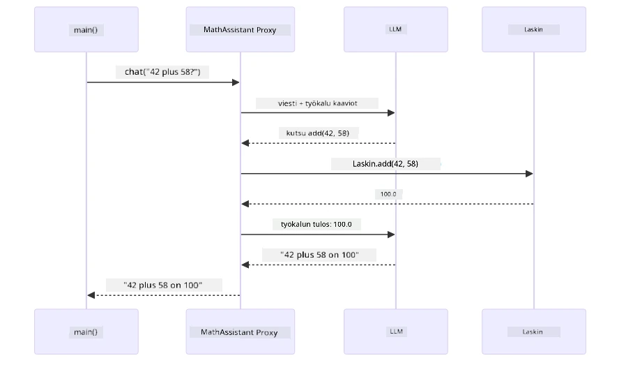
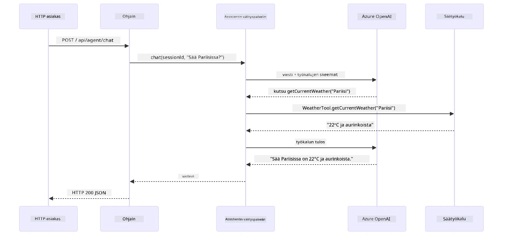

# Moduuli 04: AI-agentit työkaluilla

## Sisällysluettelo

- [Mitä opit](../../../04-tools)
- [Esivaatimukset](../../../04-tools)
- [AI-agenttien ymmärtäminen työkaluilla](../../../04-tools)
- [Työkalujen kutsumisen toimintaperiaate](../../../04-tools)
  - [Työkalujen määritelmät](../../../04-tools)
  - [Päätöksenteko](../../../04-tools)
  - [Suoritus](../../../04-tools)
  - [Vastauksen generointi](../../../04-tools)
  - [Arkkitehtuuri: Spring Bootin automaattinen langoittaminen](../../../04-tools)
- [Työkaluketjutus](../../../04-tools)
- [Sovelluksen ajaminen](../../../04-tools)
- [Sovelluksen käyttö](../../../04-tools)
  - [Kokeile yksinkertaista työkalun käyttöä](../../../04-tools)
  - [Testaa työkaluketjutus](../../../04-tools)
  - [Katso keskustelun kulku](../../../04-tools)
  - [Kokeile erilaisia pyyntöjä](../../../04-tools)
- [Keskeiset käsitteet](../../../04-tools)
  - [ReAct-malli (Päättely ja toiminta)](../../../04-tools)
  - [Työkalukuvaukset ovat tärkeitä](../../../04-tools)
  - [Istunnon hallinta](../../../04-tools)
  - [Virheiden käsittely](../../../04-tools)
- [Saatavilla olevat työkalut](../../../04-tools)
- [Milloin käyttää työkalupohjaisia agenteja](../../../04-tools)
- [Työkalut vs RAG](../../../04-tools)
- [Seuraavat askeleet](../../../04-tools)

## Mitä opit

Tähän asti olet oppinut käymään keskusteluja tekoälyn kanssa, rakentamaan kehotteita tehokkaasti ja liittämään vastaukset dokumentteihisi. Mutta on vielä perustavanlaatuinen rajoitus: kielimallit voivat vain generoida tekstiä. Ne eivät voi tarkistaa säätä, suorittaa laskelmia, tehdä tietokantakyselyjä tai olla vuorovaikutuksessa ulkoisten järjestelmien kanssa.

Työkalut muuttavat tämän. Antamalla mallille käytettäväksi funktioita, joita se voi kutsua, muutat sen tekstigeneraattorista agentiksi, joka voi suorittaa toimintoja. Malli päättää, milloin se tarvitsee työkalua, mitä työkalua käyttää ja mitä parametreja välittää. Koodisi suorittaa funktion ja palauttaa tuloksen. Malli sisällyttää tuloksen vastaukseensa.

## Esivaatimukset

- Suoritettu [Moduuli 01 - Johdanto](../01-introduction/README.md) (Azure OpenAI -resurssit otettu käyttöön)
- Suositellaan aiempien moduulien suorittamista (tämä moduuli viittaa [RAG-käsitteisiin Moduuli 03:sta](../03-rag/README.md) työkalujen ja RAG:n vertailussa)
- `.env`-tiedosto juurihakemistossa Azure-tunnuksilla (luotu moduulissa 01 komennolla `azd up`)

> **Huom:** Jos et ole vielä suorittanut moduulia 01, seuraa ensin siellä olevia käyttöönotto-ohjeita.

## AI-agenttien ymmärtäminen työkaluilla

> **📝 Huom:** Tässä moduulissa termillä "agentit" tarkoitetaan tekoälyavustajia, joihin on lisätty työkalujen kutsumismahdollisuudet. Tämä eroaa **Agenttisen AI:n** malleista (autonomiset agentit, joilla on suunnittelu-, muisti- ja monivaiheinen päättely), joita käsittelemme [Moduulissa 05: MCP](../05-mcp/README.md).

Ilman työkaluja kielimalli voi vain generoida tekstiä koulutusaineistostaan. Kysy siitä nykyistä säätä, niin sen on arvattava. Anna sille työkalut, niin se voi kutsua sää-API:ta, suorittaa laskelmia tai tehdä tietokantakyselyjä — ja punoa todelliset tulokset vastaukseen.


*Ilman työkaluja malli voi vain arvata — työkaluilla se voi kutsua API:ita, suorittaa laskelmia ja palauttaa reaaliaikaista dataa.*

Työkalujen kanssa toimiva AI-agentti seuraa **Päättely ja Toiminta (ReAct)** -mallia. Malli ei vain vastaa — se miettii, mitä tarvitsee, toimii kutsumalla työkalua, tarkkailee tulosta ja päättää sitten, toimiiko uudelleen vai antaa lopullisen vastauksen:

1. **Päättele** — Agentti analysoi käyttäjän kysymyksen ja määrittää tarvitsemansa tiedon
2. **Toimi** — Agentti valitsee oikean työkalun, luo oikeat parametrit ja kutsuu sitä
3. **Tarkkaile** — Agentti vastaanottaa työkalun tuloksen ja arvioi sen
4. **Toista tai Vastaa** — Jos tarvitaan lisää tietoa, agentti palaa vaiheeseen 1; muuten se koostaa luonnollisen kielen vastauksen


*ReAct-sykli — agentti päättelee mitä tehdä, toimii kutsumalla työkalua, tarkkailee tulosta ja toistaa, kunnes voi antaa lopullisen vastauksen.*

Tämä tapahtuu automaattisesti. Määrittelet työkalut ja niiden kuvaukset. Malle hoitaa päätöksenteon siitä, milloin ja miten niitä käytetään.

## Työkalujen kutsumisen toimintaperiaate

### Työkalujen määritelmät

[WeatherTool.java](../../../04-tools/src/main/java/com/example/langchain4j/agents/tools/WeatherTool.java) | [TemperatureTool.java](../../../04-tools/src/main/java/com/example/langchain4j/agents/tools/TemperatureTool.java)

Määrität funktiot selkeillä kuvauksilla ja parametrien spesifikaatioilla. Malli näkee nämä kuvaukset järjestelmäkehotteessaan ja ymmärtää, mitä kukin työkalu tekee.

```java
@Component
public class WeatherTool {
    
    @Tool("Get the current weather for a location")
    public String getCurrentWeather(@P("Location name") String location) {
        // Säähautlogiikkasi
        return "Weather in " + location + ": 22°C, cloudy";
    }
}

@AiService
public interface Assistant {
    String chat(@MemoryId String sessionId, @UserMessage String message);
}

// Avustaja yhdistetään automaattisesti Spring Bootilla:
// - ChatModel-palvelu
// - Kaikki @Component-luokkien @Tool-metodit
// - ChatMemoryProvider istunnon hallintaan
```

Alla oleva kaavio avaa jokaisen annotaation ja näyttää, miten kukin osa auttaa AI:ta ymmärtämään, milloin kutsua työkalua ja mitä argumentteja välittää:


*Työkalumääritelmän anatomia — @Tool kertoo AI:lle, milloin käyttää työtä, @P kuvaa kunkin parametrin ja @AiService langoittaa kaiken yhteen käynnistyksen yhteydessä.*

> **🤖 Kokeile GitHub Copilot Chatilla:** Avaa [`WeatherTool.java`](../../../04-tools/src/main/java/com/example/langchain4j/agents/tools/WeatherTool.java) ja kysy:
> - "Miten integroit oikean sää-API:n kuten OpenWeatherMapin mallin valesään sijaan?"
> - "Mikä tekee työkalukuvauksesta hyvän, joka auttaa AI:ta käyttämään sitä oikein?"
> - "Miten käsittelen API-virheitä ja rajoituksia työkalujen toteutuksessa?"

### Päätöksenteko

Kun käyttäjä kysyy "Mikä on sää Seattlessa?", malli ei satunnaisesti valitse työkalua. Se vertaa käyttäjän aietta jokaiseen käytettävissä olevaan työkalukuvaukseen, pisteyttää ne merkityksen mukaan ja valitsee parhaan. Se luo rakenteellisen funktion kutsun oikeilla parametreilla — tässä tapauksessa asettaen `location` arvoksi `"Seattle"`.

Jos mikään työkalu ei vastaa käyttäjän pyyntöön, malli vastaa omien tietojensa pohjalta. Jos useampi työkalu sopii, se valitsee täsmällisimmän.


*Malli arvioi jokaista saatavilla olevaa työkalua käyttäjän aietta vastaan ja valitsee sopivimman — siksi selkeiden ja täsmällisten kuvauksien kirjoittaminen on tärkeää.*

### Suoritus

[AgentService.java](../../../04-tools/src/main/java/com/example/langchain4j/agents/service/AgentService.java)

Spring Boot langoittaa julistavat `@AiService`-rajapinnat kaikkien rekisteröityjen työkalujen kanssa, ja LangChain4j suorittaa työkalukutsut automaattisesti. Kulissien takana työkalukutsu kulkee kuuden vaiheen läpi — käyttäjän luonnollisen kielen kysymyksestä aina luonnollisen kielen vastaukseen asti:


*Päätepisteestä toiseen kulku — käyttäjä esittää kysymyksen, malli valitsee työkalun, LangChain4j suorittaa sen, ja malli sulauttaa tuloksen luontevaan vastaukseen.*

Jos olet ajanut [ToolIntegrationDemo](../../../00-quick-start/src/main/java/com/example/langchain4j/quickstart/ToolIntegrationDemo.java) -esimerkin moduulissa 00, olet jo nähnyt tämän mallin toiminnassa — `Calculator`-työkalut kutsuttiin samalla tavalla. Alla oleva järjestelmäkaavio näyttää tarkalleen, mitä demon aikana tapahtui:



*Työkalukutsukierros Quick Start -demon aikana — `AiServices` lähettää viestisi ja työkaluskeemat LLM:lle, LLM vastaa funktion kutsulla kuten `add(42, 58)`, LangChain4j suorittaa paikallisesti `Calculator`-metodin, ja palauttaa tuloksen lopullista vastausta varten.*

> **🤖 Kokeile GitHub Copilot Chatilla:** Avaa [`AgentService.java`](../../../04-tools/src/main/java/com/example/langchain4j/agents/service/AgentService.java) ja kysy:
> - "Miten ReAct-malli toimii ja miksi se on tehokas AI-agenteille?"
> - "Miten agentti päättää, mitä työkalua käyttää ja missä järjestyksessä?"
> - "Mitä tapahtuu, jos työkalun suoritus epäonnistuu — miten virheet tulisi käsitellä luotettavasti?"

### Vastauksen generointi

Malli vastaanottaa säädatan ja muotoilee sen luonnollisen kielen vastaukseksi käyttäjälle.

### Arkkitehtuuri: Spring Bootin automaattinen langoittaminen

Tämä moduuli käyttää LangChain4j:n Spring Boot -integraatiota julistavilla `@AiService`-rajapinnoilla. Käynnistyksessä Spring Boot löytää kaikki `@Component`-luokat, joissa on `@Tool`-metodeja, ChatModel-siementen ja ChatMemoryProviderin — ja langoittaa ne kaikki yhteen `Assistant`-rajapintaan ilman turhaa koodia.


*@AiService-rajapinta yhdistää ChatModelin, työkalukomponentit ja muistinhallinnan — Spring Boot hoitaa langoitukset automaattisesti.*

Tässä kokonainen pyyntöelinkaari sekvenssikaaviona — HTTP-pyynnöstä kontrollerin, palvelun ja automaattisesti langoidun proxyn kautta työkalun suoritukseen ja takaisin:



*Koko Spring Boot -pyyntöelinkaari — HTTP-pyyntö kulkee kontrollerin ja palvelun kautta automaattisesti langoidulle Assistant-proxylle, joka orkestroi LLM ja työkalukutsut.*

Keskeiset edut:

- **Spring Bootin automaattinen langoittaminen** — ChatModel ja työkalut injektoidaan automaattisesti
- **@MemoryId-malli** — Automaattinen istuntopohjainen muistin hallinta
- **Yksi instanssi** — Assistant luodaan kerran ja sitä käytetään uudelleen paremman suorituskyvyn vuoksi
- **Tyyppiturvallinen suoritus** — Java-metodit kutsutaan suoraan tyyppimuunnoksin
- **Monivaiheinen hallinta** — Käsittelee työkaluketjuttamisen automaattisesti
- **Ei turhaa koodia** — Ei manuaalisia `AiServices.builder()`-kutsuja tai muistihashmapeja

Vaihtoehtoiset tavat (manuaalinen `AiServices.builder()`) vaativat enemmän koodia eikä hyödynnä Spring Bootin integraatiota yhtä hyvin.

## Työkaluketjutus

**Työkaluketjutus** — Työkalupohjaisten agenttien todellinen voima näkyy, kun yksittäinen kysymys vaatii useamman työkalun. Kysy "Millainen on Seattle'n sää Fahrenheit-asteina?" ja agentti ketjuttaa automaattisesti kaksi työkalua: ensin se kutsuu `getCurrentWeather` saadakseen lämpötilan celsiusasteina, sitten se siirtää arvon `celsiusToFahrenheit`-funktiolle muunnosta varten — kaikki yhdessä keskustelukierrossa.


*Työkaluketjutus käytännössä — agentti kutsuu ensin getCurrentWeatherin, sen jälkeen putkittaa celsius-tuloksen celsiusToFahrenheitille ja antaa yhdistetyn vastauksen.*

**Tyylikkäät virhetilanteet** — Kysy säätä kaupungissa, jota ei ole väärennösaineistossa. Työkalu palauttaa virheviestin, ja AI selittää, ettei voi auttaa sen sijaan, että kaatuisi. Työkalut epäonnistuvat turvallisesti. Alla oleva kaavio vertaa näitä kahta lähestymistapaa — kun virheenkäsittely on kunnossa, agentti pysäyttää poikkeuksen ja vastaa avuliaasti; ilman sitä koko sovellus kaatuu:


*Kun työkalu epäonnistuu, agentti pysäyttää virheen ja vastaa avuliaalla selityksellä sen sijaan, että kaatuisi.*

Tämä tapahtuu yhdessä keskustelukierrossa. Agentti orkestroi useita työkalukutsuja itsenäisesti.

## Sovelluksen ajaminen

**Varmista käyttöönotto:**

Varmista, että `.env`-tiedosto on olemassa juurihakemistossa Azure-tunnuksillasi (luotu moduulin 01 aikana). Aja tämä moduulihakemistosta (`04-tools/`):

**Bash:**
```bash
cat ../.env  # Tulisi näyttää AZURE_OPENAI_ENDPOINT, API_KEY, DEPLOYMENT
```

**PowerShell:**
```powershell
Get-Content ..\.env  # Tulisi näyttää AZURE_OPENAI_ENDPOINT, API_KEY, DEPLOYMENT
```

**Käynnistä sovellus:**

> **Huom:** Jos olet jo käynnistänyt kaikki sovellukset komennolla `./start-all.sh` juurihakemistosta (kuten moduulissa 01 kuvattu), tämä moduuli on jo käynnissä portissa 8084. Voit ohittaa alla olevat käynnistyskomennot ja siirtyä suoraan osoitteeseen http://localhost:8084.

**Vaihtoehto 1: Spring Boot Dashboardin käyttö (suositeltu VS Code -käyttäjille)**

Kehityssäiliössä on Spring Boot Dashboard -laajennus, joka tarjoaa visuaalisen käyttöliittymän kaikkien Spring Boot -sovellusten hallintaan. Löydät sen VS Coden vasemman laidan Activity Barista (etsi Spring Boot -ikonia).

Spring Boot Dashboardista voit:
- Näyttää kaikki käytettävissä olevat Spring Boot -sovellukset työtilassa
- Käynnistää/pysäyttää sovelluksia yhdellä klikkauksella
- Tarkastella sovelluslokeja reaaliajassa
- Valvoa sovelluksen tilaa

Klikkaa vain "tools"-kohdan vieressä olevaa toistopainiketta käynnistääksesi tämän moduulin tai käynnistä kaikki moduulit kerralla.

Tältä Spring Boot Dashboard näyttää VS Codessa:


*Spring Boot Dashboard VS Codessa — käynnistä, pysäytä ja valvo kaikkia moduuleja yhdestä paikasta*

**Vaihtoehto 2: Kuoriskriptien käyttö**

Käynnistä kaikki web-sovellukset (moduulit 01-04):

**Bash:**
```bash
cd ..  # Juurikansiosta
./start-all.sh
```

**PowerShell:**
```powershell
cd ..  # Juurihakemistosta
.\start-all.ps1
```

Tai käynnistä vain tämä moduuli:

**Bash:**
```bash
cd 04-tools
./start.sh
```

**PowerShell:**
```powershell
cd 04-tools
.\start.ps1
```

Molemmat skriptit lataavat automaattisesti ympäristömuuttujat juurihakemiston `.env`-tiedostosta ja rakentavat JAR-tiedostot, jos niitä ei ole olemassa.

> **Huom:** Jos haluat rakentaa kaikki moduulit manuaalisesti ennen käynnistämistä:
>
> **Bash:**
> ```bash
> cd ..  # Go to root directory
> mvn clean package -DskipTests
> ```
>
> **PowerShell:**
> ```powershell
> cd ..  # Go to root directory
> mvn clean package -DskipTests
> ```

Avaa selaimessasi osoite http://localhost:8084.

**Pysäyttääksesi:**

**Bash:**
```bash
./stop.sh  # Tämä moduuli vain
# Tai
cd .. && ./stop-all.sh  # Kaikki moduulit
```

**PowerShell:**
```powershell
.\stop.ps1  # Vain tämä moduuli
# Tai
cd ..; .\stop-all.ps1  # Kaikki moduulit
```

## Sovelluksen käyttö

Sovellus tarjoaa verkkokäyttöliittymän, jonka kautta voit olla vuorovaikutuksessa tekoälyagentin kanssa, jolla on pääsy sää- ja lämpötilamuunnostyökaluihin. Tässä miltä käyttöliittymä näyttää — se sisältää pikaesimerkkejä ja keskustelupaneelin pyyntöjen lähettämistä varten:

<a href="images/tools-homepage.png"></a>

*AI Agent Tools -käyttöliittymä - pikaiset esimerkit ja keskustelukäyttöliittymä työkalujen kanssa vuorovaikutukseen*

### Kokeile yksinkertaista työkalun käyttöä

Aloita suoraviivaisella pyynnöllä: "Muuta 100 astetta Fahrenheitista Celsius-asteiksi". Agentti tunnistaa tarvitsevan lämpötilamuunnostyökalua, kutsuu sitä oikeilla parametreilla ja palauttaa tuloksen. Huomaa, miten luonnolliselta tämä tuntuu – sinun ei tarvinnut määrittää, mitä työkalua käyttää tai miten sitä kutsutaan.

### Testaa työkaluketjutus

Kokeile nyt jotakin monimutkaisempaa: "Mikä on sää Seattlessa ja muunna se Fahrenheitiksi?" Katso, miten agentti etenee vaiheittain. Se hakee ensin sään (joka palauttaa Celsius-asteet), tunnistaa tarvitsevansa muuntaa Fahrenheit-asteiksi, kutsuu muunnostyökalua ja yhdistää molemmat tulokset yhdeksi vastaukseksi.

### Katso keskustelun kulku

Keskustelukäyttöliittymä tallentaa keskusteluhistorian, joten voit käydä usean vaiheen vuoropuhelua. Näet kaikki aiemmat kyselyt ja vastaukset, mikä helpottaa keskustelun seuraamista ja ymmärtää, miten agentti rakentaa kontekstia useiden vaihdosten aikana.

<a href="images/tools-conversation-demo.png"></a>

*Monivaiheinen keskustelu, jossa tehdään yksinkertaisia muunnoksia, kyselyjä säästä ja työkaluketjutuksia*

### Kokeile erilaisia pyyntöjä

Kokeile erilaisia yhdistelmiä:
- Sääkyselyt: "Mikä on sää Tokiossa?"
- Lämpötilamuunnokset: "Mikä on 25°C Kelvin-asteina?"
- Yhdistetyt pyynnöt: "Tarkista sää Pariisissa ja kerro, onko siellä yli 20°C"

Huomaa, miten agentti tulkitsee luonnollista kieltä ja muuntaa sen sopiviksi työkalukutsuiksi.

## Keskeiset käsitteet

### ReAct-malli (Päättely ja toiminta)

Agentti vaihtaa päättelyn (päätöksenteko) ja toiminnan (työkalujen käyttö) välillä. Tämä malli mahdollistaa itsenäisen ongelmanratkaisun pelkän käskyihin vastaamisen sijaan.

### Tyyppikuvaukset ratkaisevat

Työkalujen kuvausten laatu vaikuttaa suoraan siihen, miten hyvin agentti käyttää niitä. Selkeät, tarkat kuvaukset auttavat mallia ymmärtämään, milloin ja miten kutakin työkalua tulee kutsua.

### Istunnon hallinta

`@MemoryId`-annotaatio mahdollistaa automaattisen istuntokohtaisen muistin hallinnan. Jokaiselle istuntotunnukselle luodaan oma `ChatMemory`-instanssi, jota hallinnoi `ChatMemoryProvider`-bean, joten useat käyttäjät voivat olla vuorovaikutuksessa agentin kanssa samanaikaisesti ilman, että heidän keskustelunsa sekoittuvat. Seuraava kaavio näyttää, miten käyttäjät ohjataan erillisiin muistikauppoihin istuntotunnuksen perusteella:


*Jokainen istuntotunnus vastaa erillistä keskusteluhistoriaa — käyttäjät eivät koskaan näe toistensa viestejä.*

### Virheiden käsittely

Työkalut voivat epäonnistua — rajapinnat voivat aikakatketa, parametrit voivat olla virheellisiä, ulkoiset palvelut voivat olla poissa käytöstä. Tuotantoagenttien täytyy pystyä käsittelemään virheitä, jotta malli voi selittää ongelmat tai kokeilla vaihtoehtoja sen sijaan, että koko sovellus kaatuu. Kun työkalu aiheuttaa poikkeuksen, LangChain4j sieppaa sen ja palauttaa virheviestin mallille, joka voi sitten selittää ongelman luonnollisella kielellä.

## Saatavilla olevat työkalut

Alla oleva kaavio näyttää laajan ekosysteemin työkaluista, joita voit rakentaa. Tämä moduuli esittelee sää- ja lämpötilatyökaluja, mutta sama `@Tool`-malli toimii mille tahansa Java-metodille — tietokantahausta maksuprosessointiin.


*Mikä tahansa @Tool-annotaatiolla merkitty Java-metodi on tekoälyn käytettävissä — malli laajenee tietokantoihin, rajapintoihin, sähköpostiin, tiedostojen käsittelyyn ja muihin.*

## Milloin käyttää työkalupohjaisia agenteja

Kaikki pyynnöt eivät tarvitse työkaluja. Päätös perustuu siihen, tarvitseeko tekoäly olla vuorovaikutuksessa ulkoisten järjestelmien kanssa vai voiko se vastata omien tietojensa perusteella. Seuraava opas tiivistää, milloin työkalut ovat hyödyllisiä ja milloin ne ovat tarpeettomia:


*Pikapäätösopas — työkalut ovat reaaliaikaisia tietoja, laskelmia ja toimintoja varten; yleinen tieto ja luovat tehtävät eivät tarvitse niitä.*

## Työkalut vs RAG

Moduulit 03 ja 04 laajentavat kumpikin tekoälyn kykyjä, mutta perusteellisesti eri tavoin. RAG antaa mallille pääsyn **tietoon** hakemalla dokumentteja. Työkalut antavat mallille kyvyn suorittaa **toimintoja** kutsumalla funktioita. Alla oleva kaavio vertaa näitä kahta lähestymistapaa rinnakkain — miten molemmat työnkulut toimivat ja mitä kompromisseja niihin liittyy:


*RAG hakee tietoa staattisista dokumenteista — Työkalut suorittavat toimintoja ja hakevat dynaamista, reaaliaikaista dataa. Monet tuotantojärjestelmät yhdistävät molemmat.*

Käytännössä monet tuotantojärjestelmät yhdistävät molemmat lähestymistavat: RAG vastauksien perustana dokumentaatioon ja Työkalut live-datan hakemiseen tai toimintojen suorittamiseen.

## Seuraavat askeleet

**Seuraava moduuli:** [05-mcp - Model Context Protocol (MCP)](../05-mcp/README.md)

---

**Navigointi:** [← Edellinen: Moduuli 03 - RAG](../03-rag/README.md) | [Takaisin pääsivulle](../README.md) | [Seuraava: Moduuli 05 - MCP →](../05-mcp/README.md)

---

<!-- CO-OP TRANSLATOR DISCLAIMER START -->
**Vastuuvapauslauseke**:
Tämä asiakirja on käännetty käyttämällä tekoälypohjaista käännöspalvelua [Co-op Translator](https://github.com/Azure/co-op-translator). Vaikka pyrimme tarkkuuteen, huomioithan, että automaattikäännöksissä saattaa esiintyä virheitä tai epätarkkuuksia. Alkuperäistä asiakirjaa sen alkuperäisellä kielellä tulee pitää virallisena lähteenä. Tärkeissä asioissa suositellaan ammattimaista ihmiskäännöstä. Emme ole vastuussa tästä käännöksestä aiheutuvista väärinkäsityksistä tai tulkinnoista.
<!-- CO-OP TRANSLATOR DISCLAIMER END -->