# Moduuli 04: AI-agentit työkaluilla

## Sisällysluettelo

- [Mitä opit](../../../04-tools)
- [Esivaatimukset](../../../04-tools)
- [AI-agenttien ymmärtäminen työkaluilla](../../../04-tools)
- [Miten työkalukutsut toimivat](../../../04-tools)
  - [Työkalujen määrittelyt](../../../04-tools)
  - [Päätöksenteko](../../../04-tools)
  - [Suoritus](../../../04-tools)
  - [Vastauksen luonti](../../../04-tools)
  - [Arkkitehtuuri: Spring Bootin automaattinen kytkentä](../../../04-tools)
- [Työkaluketjutus](../../../04-tools)
- [Sovelluksen käynnistäminen](../../../04-tools)
- [Sovelluksen käyttäminen](../../../04-tools)
  - [Kokeile yksinkertaista työkalun käyttöä](../../../04-tools)
  - [Testaa työkaluketjutusta](../../../04-tools)
  - [Näe keskustelun kulku](../../../04-tools)
  - [Kokeile erilaisia pyyntöjä](../../../04-tools)
- [Keskeiset käsitteet](../../../04-tools)
  - [ReAct-malli (Päättele ja toimi)](../../../04-tools)
  - [Työkalujen kuvaukset ovat tärkeitä](../../../04-tools)
  - [Istunnon hallinta](../../../04-tools)
  - [Virheiden käsittely](../../../04-tools)
- [Saatavilla olevat työkalut](../../../04-tools)
- [Milloin käyttää työkalupohjaisia agenteja](../../../04-tools)
- [Työkalut vs RAG](../../../04-tools)
- [Seuraavat askeleet](../../../04-tools)

## Mitä opit

Tähän asti olet oppinut käymään keskusteluja tekoälyn kanssa, jäsentämään kehotteita tehokkaasti ja perustamaan vastaukset dokumentteihisi. Mutta perusrajoitus on edelleen olemassa: kielimallit voivat vain luoda tekstiä. Ne eivät voi tarkistaa säätä, suorittaa laskelmia, kysyä tietokantoja tai olla vuorovaikutuksessa ulkoisten järjestelmien kanssa.

Työkalut muuttavat tämän. Antamalla mallille pääsyn kutsuttaviin toimintoihin, muutat sen tekstinluojasta agentiksi, joka voi tehdä toimintoja. Malli päättää, milloin se tarvitsee työkalun, mitä työkalua käyttää ja mitä parametreja välittää. Koodisi suorittaa funktion ja palauttaa tuloksen. Malli liittää tuloksen vastaukseensa.

## Esivaatimukset

- Moduuli 01 suoritettuna (Azure OpenAI -resurssit käyttöön otettuna)
- `.env`-tiedosto juurihakemistossa, jossa on Azure-tunnistetiedot (luotu `azd up` -komennolla Moduulissa 01)

> **Huom:** Jos et ole vielä suorittanut Moduulia 01, seuraa siellä olevia asennusohjeita ensin.

## AI-agenttien ymmärrys työkaluilla

> **📝 Huom:** Tässä moduulissa termi "agentit" viittaa työkutsujilla varustettuihin tekoälyavustajiin. Tämä eroaa **Agentic AI** -malleista (autonomiset agentit, joilla on suunnittelu, muisti ja monivaiheinen päättely), joita käsittelemme [Moduulissa 05: MCP](../05-mcp/README.md).

Ilman työkaluja kielimalli voi vain tuottaa tekstiä koulutusaineistostaan. Kysy siltä nykyistä säätä, ja sen täytyy arvailla. Anna sille työkaluja, ja se voi kutsua sää-API:a, tehdä laskelmia tai kysyä tietokantaa — ja liittää nämä todelliset tulokset vastaukseensa.

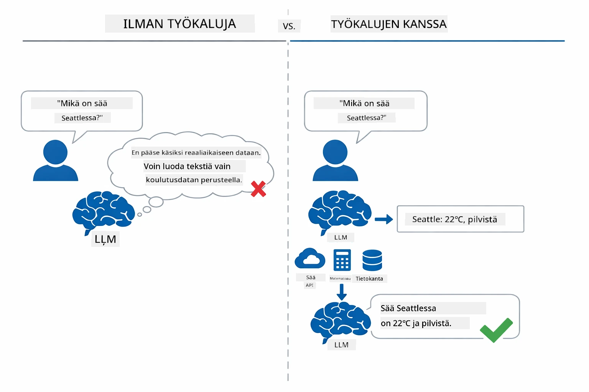

*Ilman työkaluja malli arvaa — työkaluilla se voi kutsua API:a, suorittaa laskelmia ja palauttaa reaaliaikaista dataa.*

Tekoälyagentti, joka käyttää työkaluja, noudattaa **Päättele ja toimi (ReAct)** -mallia. Malli ei vain vastaa — se miettii, mitä se tarvitsee, toimii kutsumalla työkalun, tarkkailee tulosta ja päättää sitten, toimiiko uudelleen vai antaa lopullisen vastauksen:

1. **Päättely** — Agentti analysoi käyttäjän kysymyksen ja määrittää tarvittavan tiedon
2. **Toiminta** — Agentti valitsee oikean työkalun, luo oikeat parametrit ja kutsuu sitä
3. **Havainnointi** — Agentti vastaanottaa työkalun tuloksen ja arvioi sen
4. **Toisto tai vastaus** — Jos tarvitaan lisätietoa, agentti palaa vaiheeseen 1; muuten se muodostaa luonnollisen kielen vastauksen

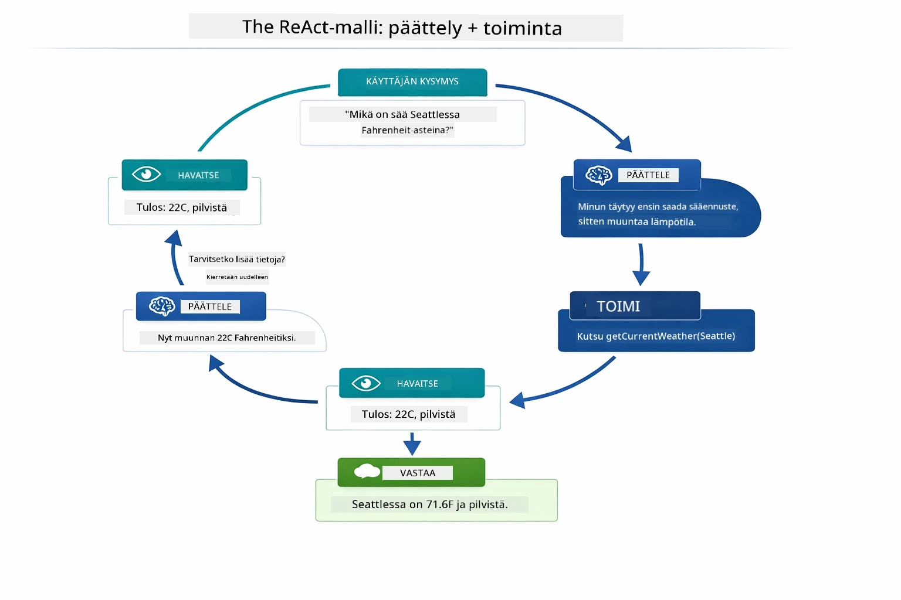

*ReAct-sykli — agentti pohtii mitä tehdä, toimittaa kutsumalla työkalua, havainnoi tuloksen ja toistaa, kunnes voi antaa lopullisen vastauksen.*

Tämä tapahtuu automaattisesti. Määrittelet työkalut ja niiden kuvaukset. Malli hoitaa päätöksenteon siitä, milloin ja miten työkaluja käytetään.

## Miten työkalukutsut toimivat

### Työkalujen määrittelyt

[WeatherTool.java](../../../04-tools/src/main/java/com/example/langchain4j/agents/tools/WeatherTool.java) | [TemperatureTool.java](../../../04-tools/src/main/java/com/example/langchain4j/agents/tools/TemperatureTool.java)

Määrittelet funktiot selkeillä kuvauksilla ja parametrien erittelyillä. Malli näkee nämä kuvaukset järjestelmäkehotteessaan ja ymmärtää, mitä kukin työkalu tekee.

```java
@Component
public class WeatherTool {
    
    @Tool("Get the current weather for a location")
    public String getCurrentWeather(@P("Location name") String location) {
        // Säähautologiasi
        return "Weather in " + location + ": 22°C, cloudy";
    }
}

@AiService
public interface Assistant {
    String chat(@MemoryId String sessionId, @UserMessage String message);
}

// Avustaja on automaattisesti liitetty Spring Bootilla:
// - ChatModel bean
// - Kaikki @Tool -menetelmät @Component-luokista
// - ChatMemoryProvider istunnon hallintaan
```

Alla oleva kaavio selittää jokaisen annotaation ja näyttää, miten jokainen osa auttaa tekoälyä ymmärtämään, milloin kutsua työkalua ja mitä argumentteja välittää:

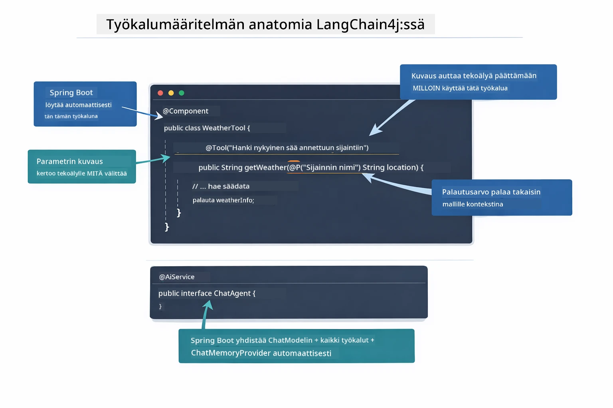

*Työkalumäärittelyn anatomia — @Tool kertoo tekoälylle, milloin sitä käytetään, @P kuvaa jokaisen parametrin ja @AiService kytkee kaiken käynnistyksessä yhteen.*

> **🤖 Kokeile [GitHub Copilot](https://github.com/features/copilot) Chatin kanssa:** Avaa [`WeatherTool.java`](../../../04-tools/src/main/java/com/example/langchain4j/agents/tools/WeatherTool.java) ja kysy:
> - "Miten voisin integroida oikean sää-API:n kuten OpenWeatherMapin mallidatan sijaan?"
> - "Mikä tekee hyvästä työkalukuvauksesta, joka auttaa tekoälyä käyttämään sitä oikein?"
> - "Miten käsittelen API-virheet ja raja-arvot työkalun toteutuksissa?"

### Päätöksenteko

Kun käyttäjä kysyy "Mikä on sää Seattlessa?", malli ei valitse työkalua satunnaisesti. Se vertaa käyttäjän tarkoitusta kaikkiin käytettävissä oleviin työkalukuvaustensa avulla, pisteyttää ne sopivuuden mukaan ja valitsee parhaan vastaavuuden. Se sitten muodostaa rakenteellisen funktiokutsun oikeilla parametreilla — tässä tapauksessa asettaa `location` arvoksi `"Seattle"`.

Jos mikään työkalu ei sovi käyttäjän pyyntöön, malli vastaa omien tietojensa perusteella. Jos useampi työkalu sopii, se valitsee spesifisimmän.

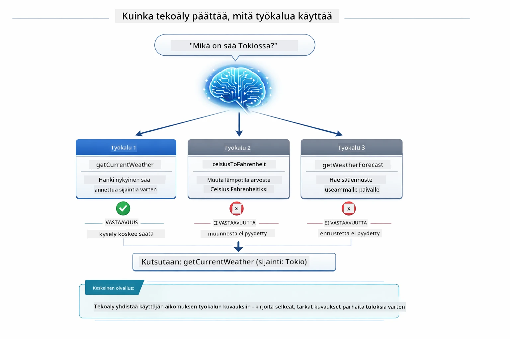

*Malli arvioi jokaista käytettävissä olevaa työkalua käyttäjän tarkoituksen osalta ja valitsee parhaan vastaavuuden — siksi on tärkeää kirjoittaa selkeät ja täsmälliset työkalukuvaukset.*

### Suoritus

[AgentService.java](../../../04-tools/src/main/java/com/example/langchain4j/agents/service/AgentService.java)

Spring Boot kytkee automaattisesti deklaratiivisen `@AiService`-rajapinnan kaikkiin rekisteröityihin työkaluihin, ja LangChain4j suorittaa työkalukutsut automaattisesti. Taustalla täydellinen työkalukutsu kulkee kuuden vaiheen läpi — käyttäjän luonnollisen kielen kysymyksestä takaisin luonnollisen kielen vastaukseen:

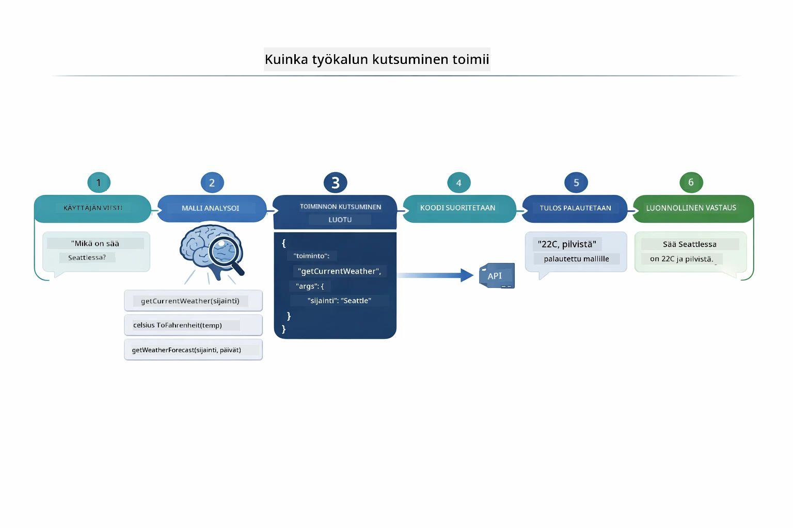

*Loppuun asti kulkeva prosessi — käyttäjä kysyy, malli valitsee työkalun, LangChain4j suorittaa sen, ja malli liittää tuloksen luonnolliseen vastaukseen.*

> **🤖 Kokeile [GitHub Copilot](https://github.com/features/copilot) Chatin kanssa:** Avaa [`AgentService.java`](../../../04-tools/src/main/java/com/example/langchain4j/agents/service/AgentService.java) ja kysy:
> - "Miten ReAct-malli toimii ja miksi se on tehokas tekoälyagenteille?"
> - "Miten agentti päättää, mitä työkalua käyttää ja missä järjestyksessä?"
> - "Mitä tapahtuu, jos työkalun suoritus epäonnistuu — miten virheet kannattaa käsitellä luotettavasti?"

### Vastauksen luonti

Malli vastaanottaa säätiedot ja muotoilee ne käyttäjälle luonnollisessa kielessä.

### Arkkitehtuuri: Spring Bootin automaattinen kytkentä

Tämä moduuli käyttää LangChain4j:n Spring Boot -integraatiota, jossa declaratiiviset `@AiService`-rajapinnat liitetään käynnistyksessä. Spring Boot löytää kaikki `@Component`-annotaatiolla merkityt `@Tool`-metodit, ChatModel-beanin ja ChatMemoryProviderin — ja kytkee ne kaikki yhdeksi `Assistant`-rajapinnaksi ilman boilerplate-koodia.

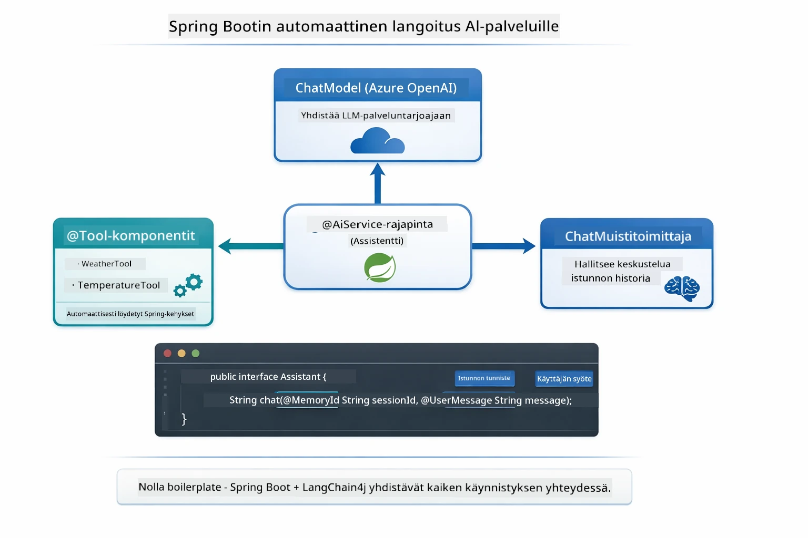

*@AiService-rajapinta yhdistää ChatModelin, työkalukomponentit ja muistin tarjoajan — Spring Boot huolehtii kaikesta kytkennästä automaattisesti.*

Tämän lähestymistavan keskeiset hyödyt:

- **Spring Bootin automaattinen kytkentä** — ChatModel ja työkalut injektoidaan automaattisesti
- **@MemoryId-malli** — Automaattinen istuntokohtainen muistin hallinta
- **Yksi instanssi** — Assistant luodaan kerran ja käytetään uudelleen suorituskyvyn parantamiseksi
- **Tyyppiturvallinen suoritus** — Java-metodit kutsutaan suoraan tyyppikonversiolla
- **Monikierros-orkestrointi** — Hoitaa työkaluketjut automaattisesti
- **Ei boilerplate-koodia** — Ei manuaalisia `AiServices.builder()` -kutsuja tai muistirakenteita

Vaihtoehtoiset lähestymistavat (manuaalinen `AiServices.builder()`) vaativat enemmän koodia ja eivät hyödynnä Spring Bootin integraatiota.

## Työkaluketjutus

**Työkaluketjutus** — Työkalupohjaisten agenttien todellinen voima tulee esiin, kun yksi kysymys vaatii useiden työkalujen käyttöä. Kysy "Mikä on säät Seattlessa Fahrenheit-asteina?" ja agentti ketjuttaa automaattisesti kaksi työkalua: ensin se kutsuu `getCurrentWeather` saadakseen lämpötilan celsiusasteina, sitten syöttää arvon `celsiusToFahrenheit`-työkaluun muunnosta varten — kaikki yhdessä keskustelukierrossa.

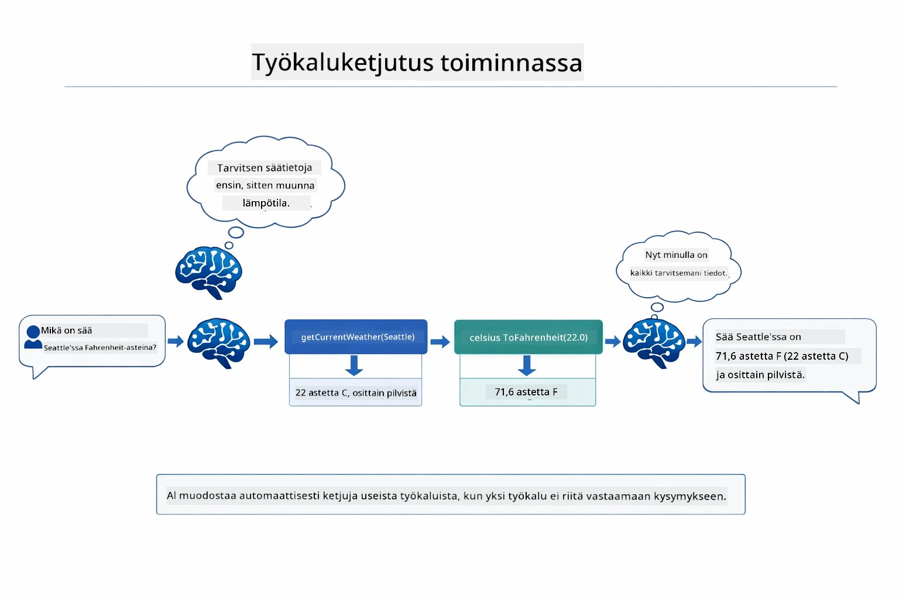

*Työkaluketjutus käytännössä — agentti kutsuu ensin getCurrentWeatherin, sitten ohjaa celsius-vastauksen celsiusToFahrenheit-työkaluun ja antaa yhdistetyn vastauksen.*

Näin se näyttää käynnissä olevassa sovelluksessa — agentti ketjuttaa kaksi työkalukutsua yhdessä keskustelukierrossa:

<a href="images/tool-chaining.png"></a>

*Todellinen sovellustulos — agentti ketjuttaa automaattisesti getCurrentWeather → celsiusToFahrenheit yhdessä kierrossa.*

**Hienovaraiset virhetilanteet** — Kysy säästä kaupungissa, joka ei ole mock-datassa. Työkalu palauttaa virheilmoituksen, ja tekoäly selittää, ettei se pysty auttamaan, sen sijaan että se kaatuisi. Työkalut epäonnistuvat turvallisesti.

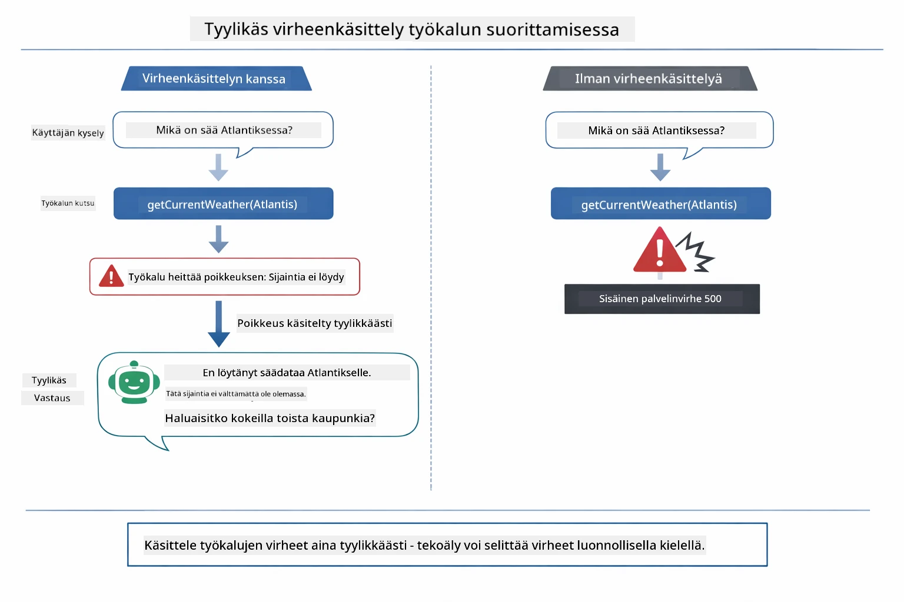

*Kun työkalu epäonnistuu, agentti kaappaa virheen ja vastaa hyödyllisellä selityksellä kaatumisen sijaan.*

Tämä tapahtuu yksittäisessä keskustelukierrossa. Agentti orkestroi useita työkalukutsuja itsenäisesti.

## Sovelluksen käynnistäminen

**Varmista asennus:**

Tarkista, että `.env`-tiedosto on juurihakemistossa Azure-tunnistetietoineen (luotu Moduulissa 01):
```bash
cat ../.env  # Tulisi näyttää AZURE_OPENAI_ENDPOINT, API_KEY, DEPLOYMENT
```

**Käynnistä sovellus:**

> **Huom:** Jos olet jo käynnistänyt kaikki sovellukset komennolla `./start-all.sh` Moduulissa 01, tämä moduuli on jo käynnissä portissa 8084. Voit ohittaa allaolevat käynnistyskomennot ja mennä suoraan osoitteeseen http://localhost:8084.

**Vaihtoehto 1: Spring Boot Dashboardin käyttäminen (suositeltu VS Code -käyttäjille)**

Kehityssäiliö sisältää Spring Boot Dashboard -lisäosan, joka tarjoaa visuaalisen käyttöliittymän kaikkien Spring Boot -sovellusten hallintaan. Löydät sen VS Coden vasemman laidassa Activity Barista (etsi Spring Boot -kuvake).

Dashboardista voit:
- Näyttää työtilan kaikki Spring Boot -sovellukset
- Käynnistää/pysäyttää sovelluksia yhdellä klikkauksella
- Katsoa sovelluslokeja reaaliaikaisesti
- Valvoa sovellusten tilaa

Klikkaa "tools"-kohdan vieressä olevaa toistopainiketta käynnistääksesi tämän moduulin, tai käynnistä kaikki moduulit kerralla.


**Vaihtoehto 2: Shell-skriptien käyttäminen**

Käynnistä kaikki web-sovellukset (moduulit 01-04):

**Bash:**
```bash
cd ..  # Juurikansiosta
./start-all.sh
```

**PowerShell:**
```powershell
cd ..  # Juurihakemistosta
.\start-all.ps1
```

Tai käynnistä vain tämä moduuli:

**Bash:**
```bash
cd 04-tools
./start.sh
```

**PowerShell:**
```powershell
cd 04-tools
.\start.ps1
```

Molemmat skriptit lataavat automaattisesti ympäristömuuttujat juurihakemiston `.env`-tiedostosta ja rakentavat JAR-tiedostot, jos niitä ei ole olemassa.

> **Huom:** Jos haluat rakentaa moduulit manuaalisesti ennen käynnistystä:
>
> **Bash:**
> ```bash
> cd ..  # Go to root directory
> mvn clean package -DskipTests
> ```
>
> **PowerShell:**
> ```powershell
> cd ..  # Go to root directory
> mvn clean package -DskipTests
> ```

Avaa selaimessa http://localhost:8084.

**Pysäyttääksesi:**

**Bash:**
```bash
./stop.sh  # Vain tämä moduuli
# Tai
cd .. && ./stop-all.sh  # Kaikki moduulit
```

**PowerShell:**
```powershell
.\stop.ps1  # Tämä moduuli vain
# Tai
cd ..; .\stop-all.ps1  # Kaikki moduulit
```

## Sovelluksen käyttäminen

Sovellus tarjoaa web-käyttöliittymän, jossa voit olla vuorovaikutuksessa tekoälyagentin kanssa, jolla on pääsy säätä ja lämpötilan muunnosta tekeviin työkaluihin.

<a href="images/tools-homepage.png"></a>

*Tekoälyagentin työkalut -käyttöliittymä – nopeita esimerkkejä ja chat-käyttöliittymä työkalujen kanssa keskusteluun*

### Kokeile yksinkertaista työkalun käyttöä
Aloita yksinkertaisella pyynnöllä: "Muunna 100 astetta Fahrenheitista Celsiukseen". Agentti tunnistaa, että se tarvitsee lämpötilan muunnostyökalun, kutsuu sitä oikeilla parametreilla ja palauttaa tuloksen. Huomaa, kuinka luonnolliselta tämä tuntuu – et määritellyt, mitä työkalua käyttää tai miten sitä kutsutaan.

### Työkaluketjutuksen testaus

Kokeile nyt monimutkaisempaa: "Mikä on sää Seattlessä ja muunna se Fahrenheit-asteiksi?" Katso, kuinka agentti etenee vaiheittain. Se hakee ensin sään (joka palauttaa Celsius-asteet), tunnistaa tarvitsevansa muunnoksen Fahrenheitiksi, kutsuu muunnostyökalua ja yhdistää molemmat tulokset yhdeksi vastaukseksi.

### Katso keskustelun kulkua

Chat-käyttöliittymä ylläpitää keskustelun historiaa, jolloin voit käydä monivuoroista dialogia. Näet kaikki edelliset kysymykset ja vastaukset, mikä tekee keskustelun seuraamisesta ja agentin kontekstin muodostamisen ymmärtämisestä helppoa useiden vuorojen yli.

<a href="images/tools-conversation-demo.png"></a>

*Monivuoroinen keskustelu, jossa näytetään yksinkertaisia muunnoksia, säähakuja ja työkaluketjutusta*

### Kokeile erilaisia pyyntöjä

Testaa eri yhdistelmiä:
- Säähakuja: "Millainen sää on Tokiossa?"
- Lämpötilan muunnoksia: "Mikä on 25 °C Kelvin-asteina?"
- Yhdistettyjä kyselyitä: "Tarkista sää Pariisissa ja kerro, onko se yli 20 °C"

Huomaa, kuinka agentti tulkitsee luonnollista kieltä ja sovittaa sen sopiviin työkalukutsuihin.

## Keskeiset käsitteet

### ReAct-malli (päättely ja toiminta)

Agentti vuorottelee päättelyn (päätöksenteon) ja toiminnan (työkalujen käytön) välillä. Tämä malli mahdollistaa itsenäisen ongelmanratkaisun pelkän ohjeiden noudattamisen sijaan.

### Työkalukuvausten merkitys

Työkalukuvausten laatu vaikuttaa suoraan siihen, kuinka hyvin agentti osaa käyttää niitä. Selkeät, tarkat kuvaukset auttavat mallia ymmärtämään, milloin ja miten kutakin työkalua kutsutaan.

### Istunnon hallinta

`@MemoryId` -annotaatio mahdollistaa automaattisen istuntopohjaisen muistinhallinnan. Kullekin istunto-ID:lle luodaan oma `ChatMemory`-instanssi, jota hallinnoi `ChatMemoryProvider`-bean, joten useat käyttäjät voivat keskustella agentin kanssa samanaikaisesti ilman että keskustelut sekoittuvat.

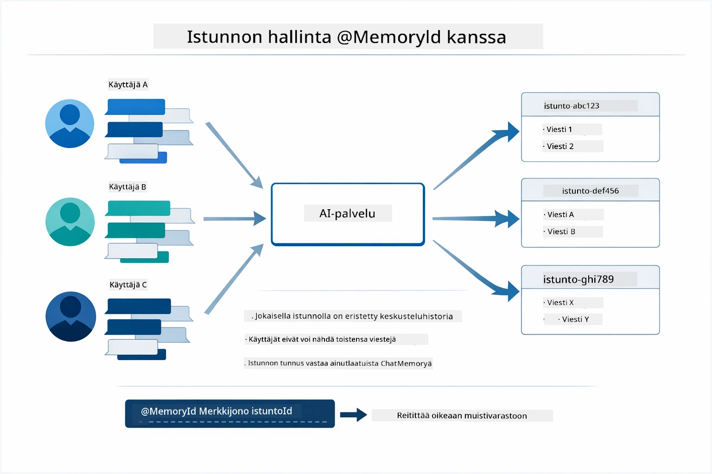

*Jokainen istunto-ID karttuu eristettyyn keskusteluhistoriaan — käyttäjät eivät koskaan näe toistensa viestejä.*

### Virheiden käsittely

Työkalut voivat epäonnistua – API:t aikakatkaistaan, parametrit voivat olla virheellisiä, ulkoiset palvelut eivät vastaa. Tuotantoagenttien täytyy osata käsitellä virheitä, jotta malli voi selittää ongelmat tai kokeilla vaihtoehtoja sen sijaan, että koko sovellus kaatuu. Kun työkalu heittää poikkeuksen, LangChain4j nappaa sen ja välittää virheilmoituksen takaisin mallille, joka voi sitten luonnollisella kielellä selittää ongelman.

## Saatavilla olevat työkalut

Alla oleva kaavio esittelee laajan työkaluekosysteemin, jota voit rakentaa. Tämä moduuli demonstroi säähän ja lämpötilaan liittyviä työkaluja, mutta sama `@Tool`-malli toimii minkä tahansa Java-metodin kanssa — tietokantakyselyistä maksujen käsittelyyn.

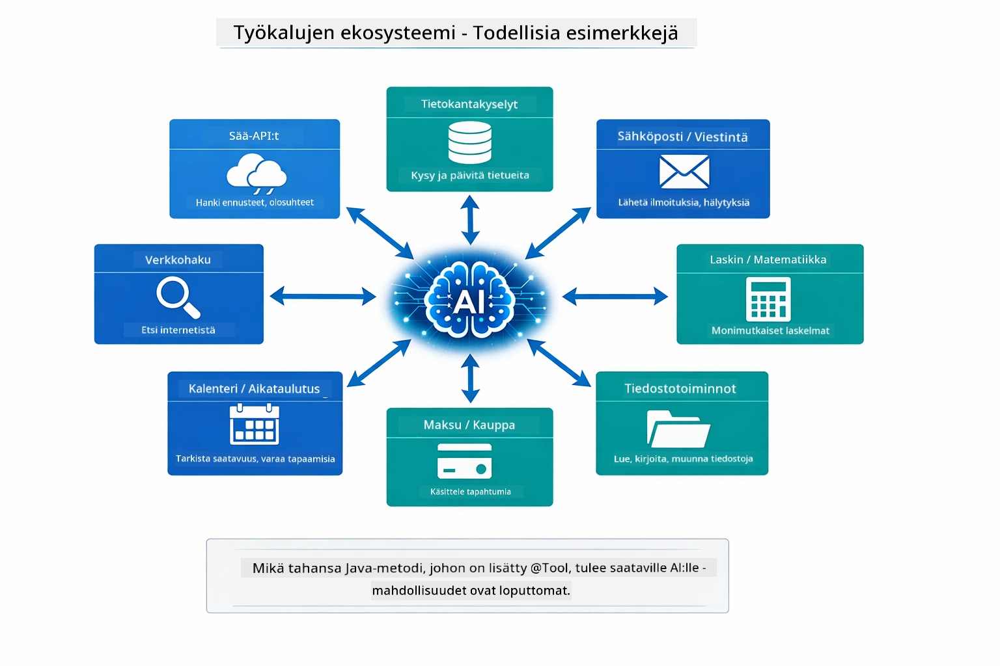

*Mikä tahansa Java-metodi, johon on lisätty @Tool-annotaatio, tulee käytettäväksi tekoälyn kanssa — malli laajenee tietokantoihin, API:hin, sähköposteihin, tiedostotoimintoihin ja muuhun.*

## Milloin käyttää työkalupohjaisia agenteja

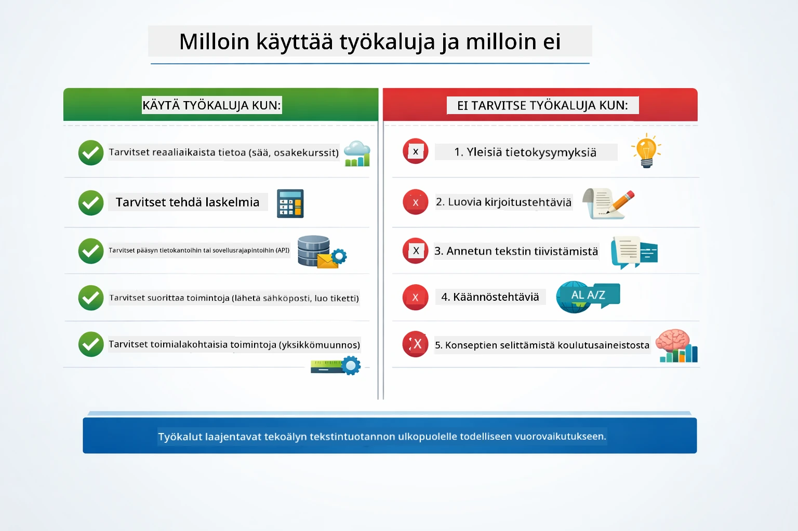

*Nopea päätöksenteko-opas — työkalut ovat tarkoitettu reaaliaikaiseen dataan, laskelmiin ja toimintoihin; yleinen tietämys ja luovat tehtävät eivät tarvitse niitä.*

**Käytä työkaluja, kun:**
- Vastauksissa tarvitaan reaaliaikaista dataa (sää, osakekurssit, inventaario)
- Tarvitset laskutoimituksia yksinkertaisen matematiikan ulkopuolelta
- Pääsy tietokantoihin tai API:hin
- Toimintojen suorittaminen (sähköpostien lähettäminen, tiketöinti, tietueiden päivitys)
- Useiden datalähteiden yhdistäminen

**Älä käytä työkaluja, kun:**
- Kysymykset voidaan vastata yleisen tiedon perusteella
- Vastaus on puhtaasti keskustelullinen
- Työkalun viive tekisi käyttökokemuksesta liian hitaan

## Työkalut vs RAG

Moduulit 03 ja 04 laajentavat molemmat tekoälyn kykyjä, mutta periaatteellisesti eri tavoin. RAG antaa mallille pääsyn **tietämykseen** hakemalla dokumentteja. Työkalut antavat mallille mahdollisuuden tehdä **toimia** kutsumalla funktioita.

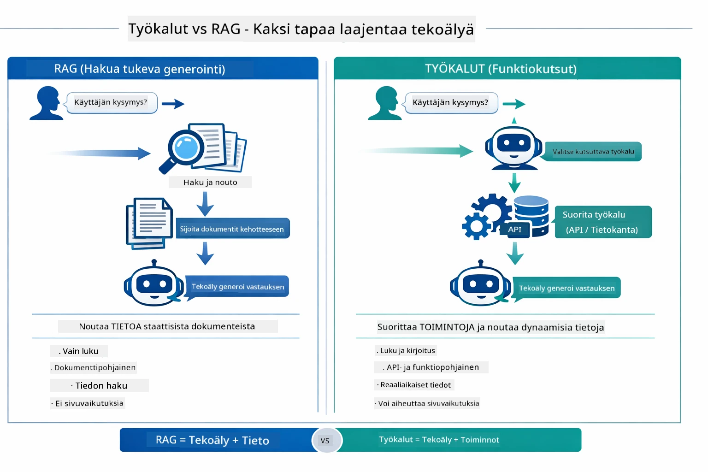

*RAG hakee tietoa staattisista dokumenteista — työkalut suorittavat toimintoja ja noutavat dynaamista, reaaliaikaista dataa. Monet tuotantojärjestelmät yhdistävät molemmat.*

Käytännössä monet tuotantojärjestelmät yhdistävät molemmat lähestymistavat: RAG vastauksien perustaksi dokumentaatioon ja työkalut live-datan hakuun tai toimintojen suorittamiseen.

## Seuraavat askeleet

**Seuraava moduuli:** [05-mcp - Model Context Protocol (MCP)](../05-mcp/README.md)

---

**Navigointi:** [← Edellinen: Moduuli 03 - RAG](../03-rag/README.md) | [Takaisin pääsivulle](../README.md) | [Seuraava: Moduuli 05 - MCP →](../05-mcp/README.md)

---

<!-- CO-OP TRANSLATOR DISCLAIMER START -->
**Vastuuvapauslauseke**:
Tämä asiakirja on käännetty tekoälypohjaisella käännöspalvelulla [Co-op Translator](https://github.com/Azure/co-op-translator). Vaikka pyrimme tarkkuuteen, automaattikäännökset saattavat sisältää virheitä tai epätarkkuuksia. Alkuperäinen asiakirja sen alkuperäiskielellä on määräävä lähde. Tärkeissä tiedoissa suositellaan ammattimaista ihmiskäännöstä. Emme ole vastuussa tämän käännöksen käytöstä johtuvista väärinymmärryksistä tai virhetulkintatilanteista.
<!-- CO-OP TRANSLATOR DISCLAIMER END -->