# Module 05: Mallikontekstiprotokolla (MCP)

## Sisällysluettelo

- [Mitä opit](../../../05-mcp)
- [Mikä on MCP?](../../../05-mcp)
- [Miten MCP toimii](../../../05-mcp)
- [Agenttimoduuli](../../../05-mcp)
- [Esimerkkien suorittaminen](../../../05-mcp)
  - [Esivaatimukset](../../../05-mcp)
- [Nopea aloitus](../../../05-mcp)
  - [Tiedostotoiminnot (Stdio)](../../../05-mcp)
  - [Valvoja-agentti](../../../05-mcp)
    - [Demonstration suorittaminen](../../../05-mcp)
    - [Miten valvoja toimii](../../../05-mcp)
    - [Vastausstrategiat](../../../05-mcp)
    - [Tulosteen ymmärtäminen](../../../05-mcp)
    - [Agenttimoduulin ominaisuuksien selitys](../../../05-mcp)
- [Keskeiset käsitteet](../../../05-mcp)
- [Onnittelut!](../../../05-mcp)
  - [Mitä seuraavaksi?](../../../05-mcp)

## Mitä opit

Olet rakentanut keskustelevaa tekoälyä, hallinnut kehotteita, perustanut vastaukset dokumentteihin ja luonut agentteja työkaluilla. Mutta kaikki nuo työkalut oli räätälöity juuri sinun sovellustasi varten. Entä jos voisit antaa tekoälyllesi pääsyn standardoituun työkaluekosysteemiin, jonka kuka tahansa voi luoda ja jakaa? Tässä moduulissa opit tekemään juuri niin Model Context Protocolin (MCP) ja LangChain4j:n agenttimoduulin avulla. Näytämme ensin yksinkertaisen MCP-tiedostonlukijan ja sitten, miten se helposti integroituu edistyneisiin agenttiprosesseihin Supervisor Agent -mallin avulla.

## Mikä on MCP?

Model Context Protocol (MCP) tarjoaa juuri tämän – standardoidun tavan tekoälysovelluksille löytää ja käyttää ulkoisia työkaluja. Sen sijaan, että kirjoittaisit mukautettuja integrointeja jokaista tietolähdettä tai palvelua varten, yhdistät MCP-palvelimiin, jotka tarjoavat toimintonsa johdonmukaisessa muodossa. Tekoälyagenttisi voi sitten automaattisesti löytää ja käyttää näitä työkaluja.


*Ennen MCP:tä: Monimutkaiset pisteestä pisteeseen integroitumiset. MCP:n jälkeen: Yksi protokolla, loputtomat mahdollisuudet.*

MCP ratkaisee perusongelman tekoälyn kehityksessä: jokainen integraatio on räätälöity. Haluatko käyttää GitHubia? Oma koodisi. Haluatko lukea tiedostoja? Oma koodisi. Haluatko tehdä kyselyjä tietokantaan? Oma koodisi. Eikä mikään näistä integroidu muihin tekoälysovelluksiin.

MCP standardoi tämän. MCP-palvelin esittelee työkalut selkeillä kuvauksilla ja skeemoilla. Mikä tahansa MCP-asiakas voi yhdistää, löytää käytettävissä olevat työkalut ja käyttää niitä. Rakenna kerran, käytä kaikkialla.


*Model Context Protocol -arkkitehtuuri – standardoitu työkalujen löytäminen ja suorittaminen*

## Miten MCP toimii

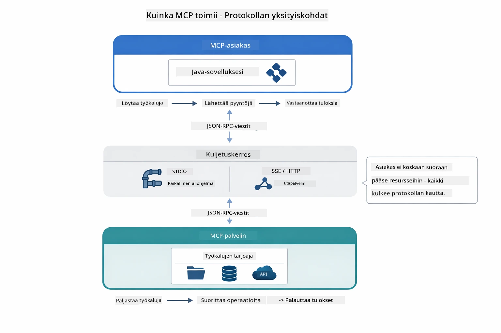

*Miten MCP toimii teknisesti — asiakkaat löytävät työkalut, vaihtavat JSON-RPC-viestejä ja suorittavat operaatioita kuljetuskerroksen kautta.*

**Palvelin-asiakasarkkitehtuuri**

MCP käyttää asiakas-palvelin-mallia. Palvelimet tarjoavat työkaluja – tiedostojen lukemista, tietokantakyselyitä, API-kutsuja. Asiakkaat (tekoälysovelluksesi) yhdistyvät palvelimiin ja käyttävät niiden työkaluja.

Käyttääksesi MCP:tä LangChain4j:ssä, lisää tämä Maven-riippuvuus:

```xml
<dependency>
    <groupId>dev.langchain4j</groupId>
    <artifactId>langchain4j-mcp</artifactId>
    <version>${langchain4j.version}</version>
</dependency>
```

**Työkalujen löytäminen**

Kun asiakkaasi yhdistää MCP-palvelimeen, se kysyy "Mitä työkaluja sinulla on?" Palvelin vastaa listalla käytettävissä olevista työkaluista, jokaisella kuvaus ja parametriskeema. Tekoälyagenttisi voi päättää, mitä työkaluja käyttää käyttäjän pyyntöjen perusteella.

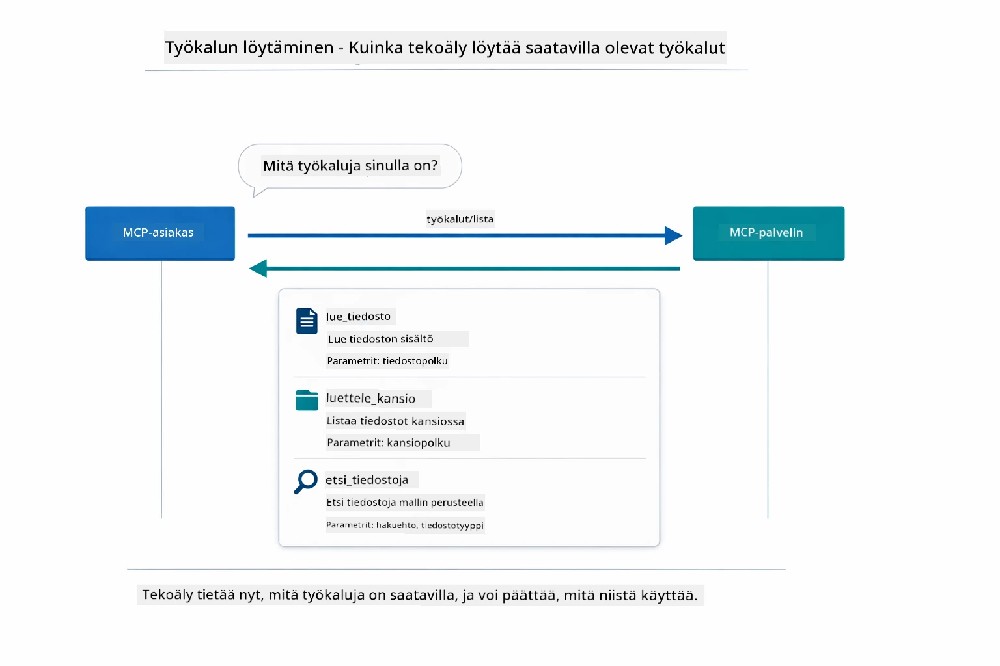

*Tekoäly löytää käytettävissä olevat työkalut käynnistyksen yhteydessä – se tietää nyt, mitä kyvykkyyksiä on saatavilla ja voi päättää, mitä käyttää.*

**Kuljetusmekanismit**

MCP tukee erilaisia kuljetusmekanismeja. Tässä moduulissa demonstroidaan Stdio-kuljetusta paikallisille prosesseille:


*MCP-kuljetusmekanismit: HTTP etäpalvelimille, Stdio paikallisille prosesseille*

**Stdio** – [StdioTransportDemo.java](../../../05-mcp/src/main/java/com/example/langchain4j/mcp/StdioTransportDemo.java)

Paikallisille prosesseille. Sovelluksesi käynnistää palvelimen aliprosessina ja kommunikoi standardin tulon/menon kautta. Hyödyllinen tiedostojärjestelmän käytössä tai komentorivityökaluissa.

```java
McpTransport stdioTransport = new StdioMcpTransport.Builder()
    .command(List.of(
        npmCmd, "exec",
        "@modelcontextprotocol/server-filesystem@2025.12.18",
        resourcesDir
    ))
    .logEvents(false)
    .build();
```

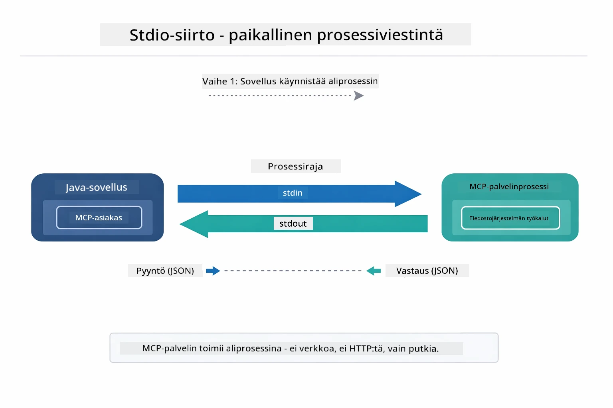

*Stdio-kuljetus käytännössä – sovelluksesi käynnistää MCP-palvelimen lapsiprosessina ja kommunikoi stdin/stdout-putkien kautta.*

> **🤖 Kokeile [GitHub Copilot](https://github.com/features/copilot) Chatin kanssa:** Avaa [`StdioTransportDemo.java`](../../../05-mcp/src/main/java/com/example/langchain4j/mcp/StdioTransportDemo.java) ja kysy:
> - "Miten Stdio-kuljetus toimii ja milloin sitä pitäisi käyttää verrattuna HTTP:hen?"
> - "Miten LangChain4j hallitsee käynnistettyjen MCP-palvelinprosessien elinkaaren?"
> - "Mitkä ovat turvallisuusnäkökohdat, kun annetaan tekoälylle pääsy tiedostojärjestelmään?"

## Agenttimoduuli

Vaikka MCP tarjoaa standardoidut työkalut, LangChain4j:n **agenttimoduuli** tarjoaa deklaratiivisen tavan rakentaa agentteja, jotka orkestroivat niitä työkaluja. `@Agent`-annotaatio ja `AgenticServices` antavat sinun määritellä agenttien käyttäytymisen rajapintojen avulla imperatiivisen koodin sijaan.

Tässä moduulissa tutkitaan **Supervisor Agent** -mallia—edistynyttä agenttiperustaista tekoälysovellusta, jossa "valvoja" agentti päättää dynaamisesti, mitä alitason agentteja kutsutaan käyttäjän pyyntöjen perusteella. Yhdistämme molemmat konseptit antamalla yhdelle alitason agentista MCP:n voimin toimivat tiedostojen käyttökaynnit.

Käyttääksesi agenttimoduulia, lisää tämä Maven-riippuvuus:

```xml
<dependency>
    <groupId>dev.langchain4j</groupId>
    <artifactId>langchain4j-agentic</artifactId>
    <version>${langchain4j.mcp.version}</version>
</dependency>
```

> **⚠️ Kokeellinen:** `langchain4j-agentic`-moduuli on **kokeellinen** ja voi muuttua. Vakaampi tapa rakentaa tekoälyapulaisia on edelleen `langchain4j-core` mukautetuilla työkaluilla (Moduulit 01-04).

## Esimerkkien suorittaminen

### Esivaatimukset

- Java 21+, Maven 3.9+
- Node.js 16+ ja npm (MCP-palvelimille)
- Ympäristömuuttujat määriteltynä `.env`-tiedostossa (projektin juurihakemistosta):
  - `AZURE_OPENAI_ENDPOINT`, `AZURE_OPENAI_API_KEY`, `AZURE_OPENAI_DEPLOYMENT` (kuten Moduulit 01–04)

> **Huom:** Jos et ole vielä määritellyt ympäristömuuttujia, katso ohjeet [Module 00 - Nopea aloitus](../00-quick-start/README.md) tai kopioi `.env.example` tiedostoksi `.env` juurihakemistoon ja täytä arvot.

## Nopea aloitus

**VS Code -käytössä:** Napsauta hiiren oikealla mitä tahansa demo-tiedostoa Explorerissa ja valitse **"Run Java"**, tai käytä ajo- ja vianmääritysikonista löytyviä käynnistyksiä (lisää ensin tunnuksesi `.env`-tiedostoon).

**Mavenin kanssa:** Vaihtoehtoisesti voit ajaa suoraan komentoriviltä alla olevilla komennoilla.

### Tiedostotoiminnot (Stdio)

Tämä demonstroi paikallisiin aliprosesseihin perustuvia työkaluja.

**✅ Ei esivaatimuksia** – MCP-palvelin käynnistyy automaattisesti.

**Käyttämällä käynnistysskriptejä (Suositeltu):**

Skriptit lataavat automaattisesti ympäristömuuttujat juurihakemistossa olevasta `.env`-tiedostosta:

**Bash:**
```bash
cd 05-mcp
chmod +x start-stdio.sh
./start-stdio.sh
```

**PowerShell:**
```powershell
cd 05-mcp
.\start-stdio.ps1
```

**VS Code -käyttö:** Napsauta `StdioTransportDemo.java` tiedostoa hiiren oikealla ja valitse **"Run Java"** (varmista, että `.env`-tiedosto on kunnossa).

Sovellus käynnistää tiedostojärjestelmän MCP-palvelimen automaattisesti ja lukee paikallisen tiedoston. Huomaa, miten aliprosessien hallinta hoidetaan automaattisesti.

**Odotettu tuloste:**
```
Assistant response: The file provides an overview of LangChain4j, an open-source Java library
for integrating Large Language Models (LLMs) into Java applications...
```

### Valvoja-agentti

**Supervisor Agent** -malli on **joustava** agenttipohjaisen tekoälyn muoto. Valvoja käyttää LLM:ää päättäen autonomisesti, mitä agentteja kutsutaan käyttäjän pyynnön perusteella. Seuraavassa esimerkissä yhdistämme MCP:n voimin toimivan tiedostokäytön LLM-agenttiin luodaksemme valvojan ohjaaman tiedoston lukemisen → raportin tekemisen työnkulun.

Demossa `FileAgent` lukee tiedoston MCP:n tiedostojärjestelmätyökaluilla, ja `ReportAgent` luo rakenteellisen raportin, jossa on tiivistelmä (1 lause), 3 keskeistä kohtaa ja suosituksia. Valvoja orkestraa tämän työnkulun automaattisesti:

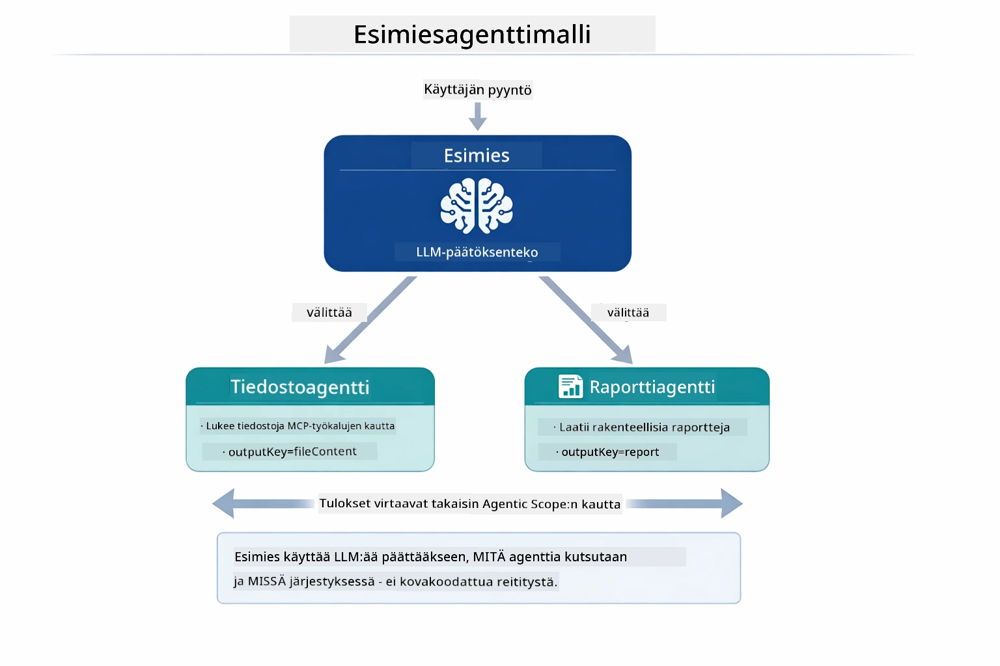

*Valvoja käyttää LLM:ää päättääkseen, mitä agentteja kutsutaan ja missä järjestyksessä — ei tarvetta kovakoodatulle reititykselle.*

Näin konkreettinen työnkulku näyttää tiedostosta raporttiin:

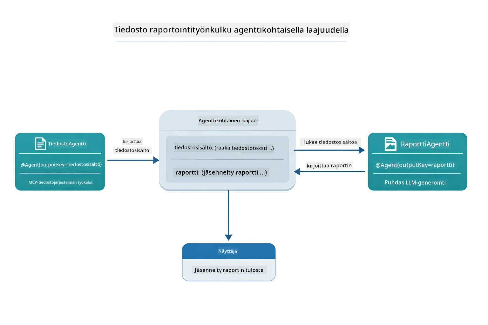

*FileAgent lukee tiedoston MCP-työkaluilla, sitten ReportAgent muuntaa raakasisällön rakenteelliseksi raportiksi.*

Jokainen agentti tallentaa tuloksensa **Agentic Scopeen** (jaettu muisti), jolloin alitason agentit voivat käyttää aiempia tuloksia. Tämä osoittaa, miten MCP-työkalut integroituvat luontevasti agenttiprosesseihin – valvojan ei tarvitse tietää *miten* tiedostot luetaan, vaan vain että `FileAgent` osaa sen tehdä.

#### Demon suorittaminen

Käynnistysskriptit lataavat automaattisesti ympäristömuuttujat juurihakemistossa olevasta `.env`-tiedostosta:

**Bash:**
```bash
cd 05-mcp
chmod +x start-supervisor.sh
./start-supervisor.sh
```

**PowerShell:**
```powershell
cd 05-mcp
.\start-supervisor.ps1
```

**VS Code -käyttö:** Napsauta `SupervisorAgentDemo.java` tiedostoa hiiren oikealla ja valitse **"Run Java"** (varmista, että `.env`-tiedosto on kunnossa).

#### Miten valvoja toimii

```java
// Vaihe 1: FileAgent lukee tiedostoja käyttäen MCP-työkaluja
FileAgent fileAgent = AgenticServices.agentBuilder(FileAgent.class)
        .chatModel(model)
        .toolProvider(mcpToolProvider)  // Sisältää MCP-työkaluja tiedostojen käsittelyyn
        .build();

// Vaihe 2: ReportAgent luo jäsenneltyjä raportteja
ReportAgent reportAgent = AgenticServices.agentBuilder(ReportAgent.class)
        .chatModel(model)
        .build();

// Supervisor ohjaa tiedosto → raportti -työnkulkua
SupervisorAgent supervisor = AgenticServices.supervisorBuilder()
        .chatModel(model)
        .subAgents(fileAgent, reportAgent)
        .responseStrategy(SupervisorResponseStrategy.LAST)  // Palauta lopullinen raportti
        .build();

// Supervisor päättää, mitkä agentit kutsutaan pyynnön perusteella
String response = supervisor.invoke("Read the file at /path/file.txt and generate a report");
```

#### Vastausstrategiat

Kun määrittelet `SupervisorAgent`in, määrittelet, miten se muodostaa lopullisen vastauksen käyttäjälle alitason agenttien saatua tehtävänsä valmiiksi.

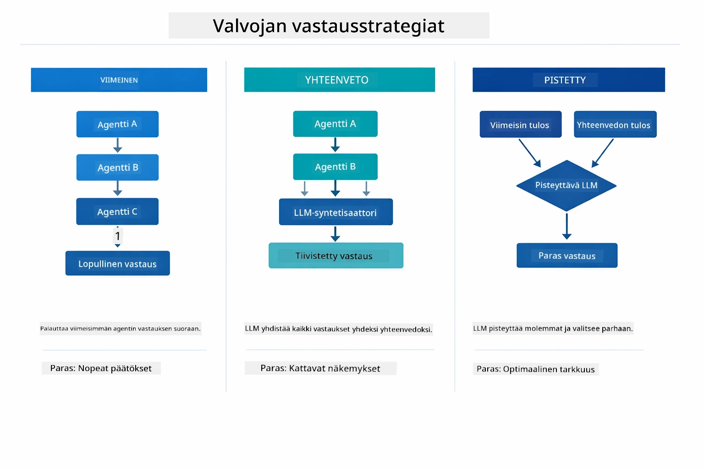

*Kolme strategiaa, joilla valvoja muodostaa lopullisen vastauksen – valitse sen mukaan, haluatko viimeisen agentin tulosteen, yhdistelevän yhteenvedon vai parhaan pistetyn vaihtoehdon.*

Saatavilla olevat strategiat ovat:

| Strategia | Kuvaus |
|----------|-------------|
| **LAST** | Valvoja palauttaa viimeisen kutsutun alitason agentin tai työkalun tuloksen. Tämä on hyödyllistä, kun työnkulun viimeinen agentti on suunniteltu tuottamaan täydellisen, lopullisen vastauksen (esim. "Yhteenveto-agentti" tutkimusprosessissa). |
| **SUMMARY** | Valvoja käyttää omaa sisäistä kielimalliaan (LLM) yhdistelemään yhteenvedon koko vuorovaikutuksesta ja kaikista alitason agenttien tuloksista, ja palauttaa tämän yhteenvedon lopullisena vastauksena. Tämä tarjoaa käyttäjälle selkeän, koottun vastauksen. |
| **SCORED** | Järjestelmä käyttää sisäistä LLM:ää pisteyttämään sekä VIIMEISEN vastauksen että YHTEENVEDON suhteessa alkuperäiseen käyttäjäpyyntöön ja palauttaa korkeamman pistemäärän saanutta vaihtoehtoa. |

Katso [SupervisorAgentDemo.java](../../../05-mcp/src/main/java/com/example/langchain4j/mcp/SupervisorAgentDemo.java) täydellinen toteutus.

> **🤖 Kokeile [GitHub Copilot](https://github.com/features/copilot) Chatin kanssa:** Avaa [`SupervisorAgentDemo.java`](../../../05-mcp/src/main/java/com/example/langchain4j/mcp/SupervisorAgentDemo.java) ja kysy:
> - "Miten valvoja päättää, mitä agentteja kutsua?"
> - "Mikä on ero Supervisor- ja Sekventiaalisen työnkulun välillä?"
> - "Miten voin muokata valvojan suunnittelukäyttäytymistä?"

#### Tulosteen ymmärtäminen

Kun suoritat demon, näet rakenteellisen katsauksen, miten valvoja orkestroi useita agentteja. Tässä mitä kukin osa tarkoittaa:

```
======================================================================
  FILE → REPORT WORKFLOW DEMO
======================================================================

This demo shows a clear 2-step workflow: read a file, then generate a report.
The Supervisor orchestrates the agents automatically based on the request.
```

**Otsikko** esittelee työnkulun käsitteen: kohdennettu putki tiedoston lukemisesta raportin tuottamiseen.

```
--- WORKFLOW ---------------------------------------------------------
  ┌─────────────┐      ┌──────────────┐
  │  FileAgent  │ ───▶ │ ReportAgent  │
  │ (MCP tools) │      │  (pure LLM)  │
  └─────────────┘      └──────────────┘
   outputKey:           outputKey:
   'fileContent'        'report'

--- AVAILABLE AGENTS -------------------------------------------------
  [FILE]   FileAgent   - Reads files via MCP → stores in 'fileContent'
  [REPORT] ReportAgent - Generates structured report → stores in 'report'
```

**Työnkulun kaavio** näyttää tiedon kulun agenttien välillä. Jokaisella agentilla on tietty rooli:
- **FileAgent** lukee tiedostoja MCP-työkaluilla ja tallentaa raakasisällön `fileContent`-muuttujaan
- **ReportAgent** käyttää tätä sisältöä ja tuottaa rakenteellisen raportin `report`-muuttujaan

```
--- USER REQUEST -----------------------------------------------------
  "Read the file at .../file.txt and generate a report on its contents"
```

**Käyttäjän pyyntö** näyttää tehtävän. Valvoja jäsentää tämän ja päättää kutsua FileAgent → ReportAgent.

```
--- SUPERVISOR ORCHESTRATION -----------------------------------------
  The Supervisor decides which agents to invoke and passes data between them...

  +-- STEP 1: Supervisor chose -> FileAgent (reading file via MCP)
  |
  |   Input: .../file.txt
  |
  |   Result: LangChain4j is an open-source, provider-agnostic Java framework for building LLM...
  +-- [OK] FileAgent (reading file via MCP) completed

  +-- STEP 2: Supervisor chose -> ReportAgent (generating structured report)
  |
  |   Input: LangChain4j is an open-source, provider-agnostic Java framew...
  |
  |   Result: Executive Summary...
  +-- [OK] ReportAgent (generating structured report) completed
```

**Valvojan orkestrointi** näyttää kahden vaiheen työnkulun toiminnassa:
1. **FileAgent** lukee tiedoston MCP:n kautta ja tallentaa sisällön
2. **ReportAgent** vastaanottaa sisällön ja luo rakenteellisen raportin

Valvoja teki nämä päätökset **itsenäisesti** käyttäjän pyynnön perusteella.

```
--- FINAL RESPONSE ---------------------------------------------------
Executive Summary
...

Key Points
...

Recommendations
...

--- AGENTIC SCOPE (Data Flow) ----------------------------------------
  Each agent stores its output for downstream agents to consume:
  * fileContent: LangChain4j is an open-source, provider-agnostic Java framework...
  * report: Executive Summary...
```

#### Agenttimoduulin ominaisuuksien selitys

Esimerkki näyttää useita agenttimoduulin edistyneitä ominaisuuksia. Tarkastellaan tarkemmin Agentic Scopea ja Agent Listener -kuuntelijoita.

**Agentic Scope** näyttää jaetun muistin, johon agentit tallensivat tulokset käyttäen `@Agent(outputKey="...")`. Tämä sallii:
- Myöhempien agenttien käyttää aiempien agenttien tuloksia
- Valvojan koota lopullisen vastauksen
- Sinun tarkastella, mitä kukin agentti on tuottanut

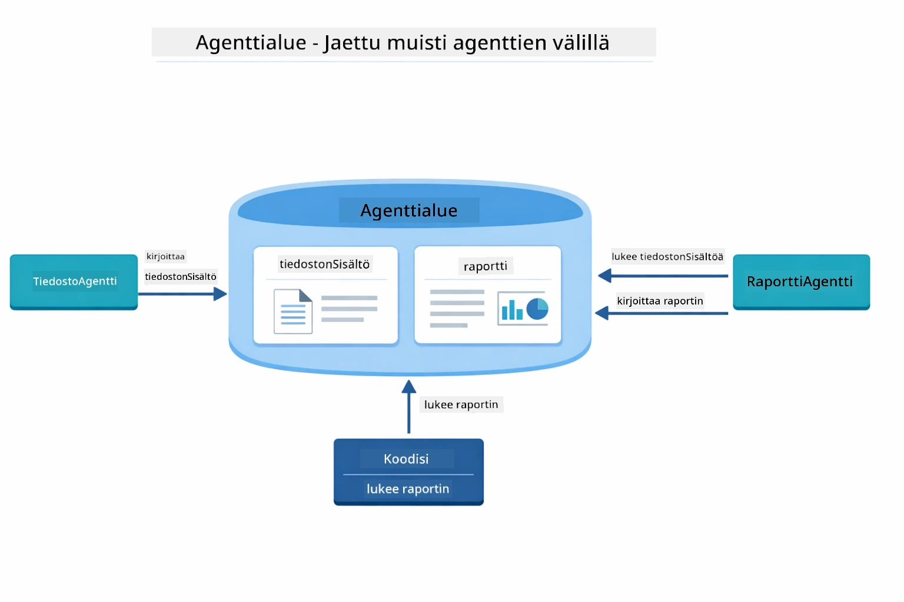

*Agentic Scope toimii jaettuna muistina – FileAgent kirjoittaa `fileContent`-kenttää, ReportAgent lukee sen ja kirjoittaa `report`-kenttää, ja koodisi lukee lopputuloksen.*

```java
ResultWithAgenticScope<String> result = supervisor.invokeWithAgenticScope(request);
AgenticScope scope = result.agenticScope();
String fileContent = scope.readState("fileContent");  // Raakatiedot tiedostosta FileAgent
String report = scope.readState("report");            // Rakenteinen raportti ReportAgentilta
```

**Agent Listenerit** mahdollistavat agenttien suorituksen seurannan ja virheenkorjauksen. Demon askel askeleelta tuloste tulee AgentListenerilta, joka kuuntelee jokaisen agenttikutsun:
- **beforeAgentInvocation** - Kutsutaan, kun valvoja valitsee agentin, jolloin näet, mikä agentti valittiin ja miksi
- **afterAgentInvocation** - Kutsutaan, kun agentti suorittaa tehtävän, näyttäen sen tuloksen
- **inheritedBySubagents** - Kun tosi, kuulija valvoo kaikkia agentteja hierarkiassa

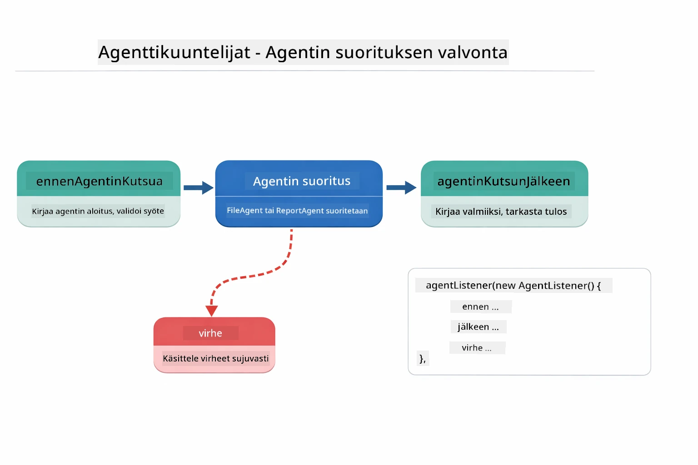

*Agenttien kuuntelijat liittyvät suorituksen elinkaareen — valvovat, kun agentit alkavat, päättyvät tai kohtaavat virheitä.*

```java
AgentListener monitor = new AgentListener() {
    private int step = 0;
    
    @Override
    public void beforeAgentInvocation(AgentRequest request) {
        step++;
        System.out.println("  +-- STEP " + step + ": " + request.agentName());
    }
    
    @Override
    public void afterAgentInvocation(AgentResponse response) {
        System.out.println("  +-- [OK] " + response.agentName() + " completed");
    }
    
    @Override
    public boolean inheritedBySubagents() {
        return true; // Levitä kaikille aliagenteille
    }
};
```

Valvojakuviota laajemmin `langchain4j-agentic`-moduuli tarjoaa useita tehokkaita työnkulkujen kuvioita ja ominaisuuksia:

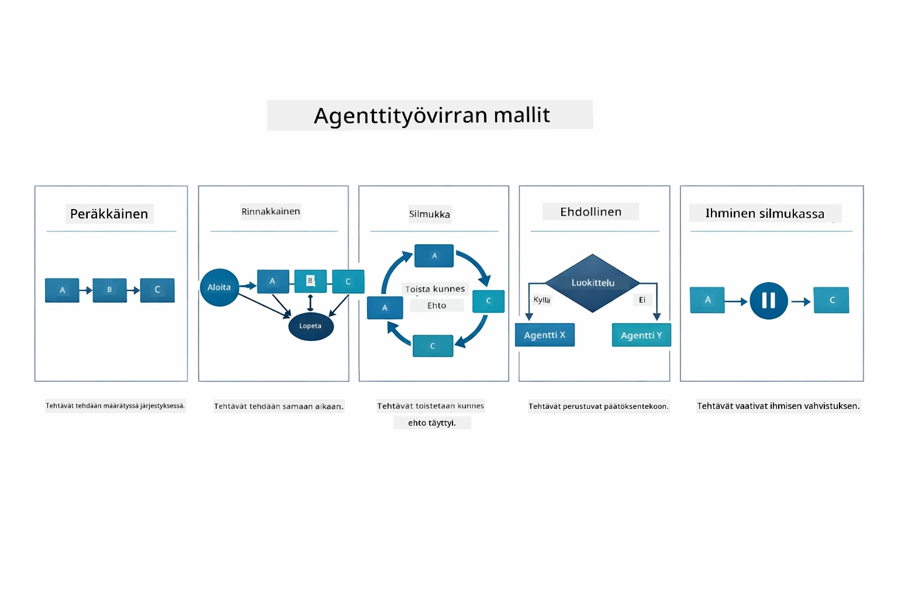

*Viisi työnkulun kuviota agenttien orkestrointiin — yksinkertaisista peräkkäisistä putkistoista ihmisen hyväksyntää vaativiin työnkulkuihin.*

| Kuvio | Kuvaus | Käyttötapaus |
|---------|-------------|----------|
| **Peräkkäinen** | Suorita agentit järjestyksessä, tulos virtaa seuraavalle | Putkistot: tutkimus → analyysi → raportti |
| **Rinnakkainen** | Suorita agentit samanaikaisesti | Riippumattomat tehtävät: sää + uutiset + osakkeet |
| **Silmukka** | Toista, kunnes ehto täyttyy | Laadunarviointi: hio kunnes pistemäärä ≥ 0,8 |
| **Ehdollinen** | Reititä ehtojen perusteella | Luokittelu → ohjaa asiantuntija-agentille |
| **Ihminen-silmukassa** | Lisää ihmisen tarkistuspisteitä | Hyväksyntätyönkulut, sisällön tarkistus |

## Keskeiset käsitteet

Nyt kun olet tutustunut MCP:hen ja agentic-moduuliin käytännössä, kerrataan milloin käyttää kumpaakin lähestymistapaa.

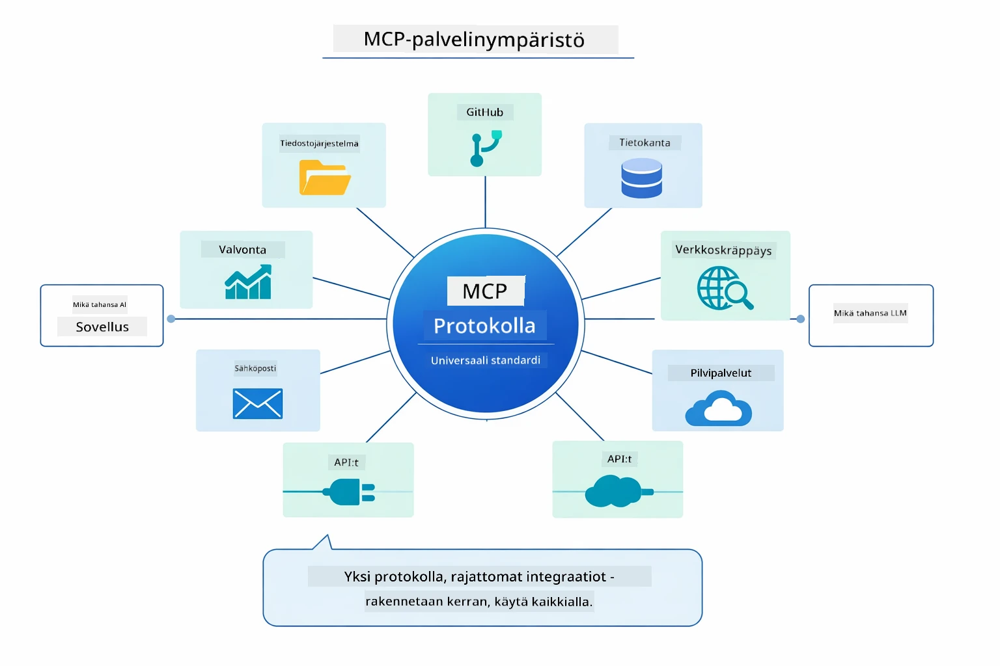

*MCP rakentaa universaalin protokollaekosysteemin — mikä tahansa MCP-yhteensopiva palvelin toimii minkä tahansa MCP-yhteensopivan asiakkaan kanssa mahdollistaen työkalujen jakamisen sovellusten välillä.*

**MCP** on ihanteellinen, kun haluat hyödyntää olemassa olevia työkaluekoksia, rakentaa työkaluja, joita useat sovellukset voivat jakaa, integroida kolmannen osapuolen palveluita standardiprotokollilla tai vaihtaa työkaluimplementointeja ilman koodimuutoksia.

**Agentic-moduuli** sopii parhaiten, kun haluat deklaratiiviset agenttimäärittelyt `@Agent`-annotaatioilla, tarvitset työnkulkujen orkestrointia (peräkkäinen, silmukka, rinnakkainen), suosittelet rajapintapohjaista agenttisuunnittelua imperatiivisen koodin sijaan tai yhdistät useita agentteja, jotka jakavat tuloksia `outputKey`-avaimen kautta.

**Valvoja-agenttimalli** loistaa, kun työnkulku ei ole ennalta ennustettavissa ja haluat LLM:n tekevän päätökset, kun sinulla on useita erikoistuneita agentteja, jotka tarvitsevat dynaamista orkestrointia, kun rakennat keskustelujärjestelmiä, jotka ohjaavat eri kyvykkyyksiin, tai kun haluat joustavimman, adaptiivisimman agenttikäytöksen.

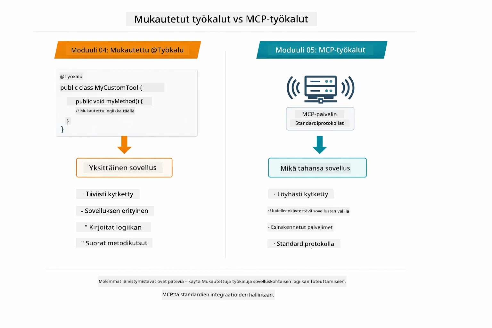

*Milloin käyttää mukautettuja @Tool-menetelmiä vs MCP-työkaluja — mukautetut työkalut sovelluskohtaiselle logiikalle täydellä tyyppiturvallisuudella, MCP-työkalut standardoiduille integraatioille, jotka toimivat sovellusten välillä.*

## Onnittelut!

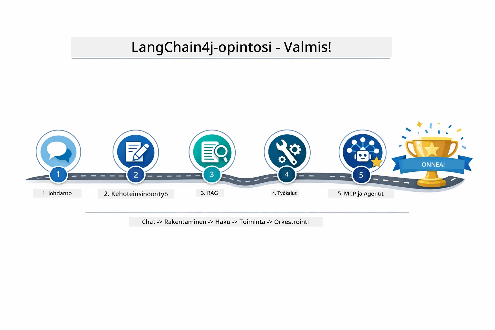

*Oppimismatka kaikkien viiden moduulin läpi — perustason chatista MCP-vetoisiin agenttijärjestelmiin.*

Olet suorittanut LangChain4j for Beginners -kurssin. Olet oppinut:

- Kuinka rakentaa keskusteleva tekoäly muistilla (Moduuli 01)
- Kehoteengineering-malleja eri tehtäviin (Moduuli 02)
- Kuinka perustaa vastaukset dokumentteihisi RAG:n avulla (Moduuli 03)
- Perus tekoälyagenttien (avustajien) luomisen mukautetuilla työkaluilla (Moduuli 04)
- Standardoitujen työkalujen integroinnin LangChain4j MCP- ja Agentic-moduuleihin (Moduuli 05)

### Mitä seuraavaksi?

Suorittamisen jälkeen tutustu [Testausoppaaseen](../docs/TESTING.md) nähdäksesi LangChain4j:n testauskonsepteja käytännössä.

**Viralliset resurssit:**
- [LangChain4j-dokumentaatio](https://docs.langchain4j.dev/) - Kattavat oppaat ja API-viite
- [LangChain4j GitHub](https://github.com/langchain4j/langchain4j) - Lähdekoodi ja esimerkit
- [LangChain4j-oppaat](https://docs.langchain4j.dev/tutorials/) - Askellusohjeita eri käyttötapauksiin

Kiitos kurssin suorittamisesta!

---

**Navigointi:** [← Edellinen: Moduuli 04 - Työkalut](../04-tools/README.md) | [Takaisin päävalikkoon](../README.md)

---

<!-- CO-OP TRANSLATOR DISCLAIMER START -->
**Vastuuvapauslauseke**:
Tämä asiakirja on käännetty käyttämällä tekoälypohjaista käännöspalvelua [Co-op Translator](https://github.com/Azure/co-op-translator). Pyrimme tarkkuuteen, mutta huomioithan, että automaattikäännöksissä saattaa esiintyä virheitä tai epätarkkuuksia. Alkuperäistä asiakirjaa sen alkuperäiskielellä tulee pitää ensisijaisena lähteenä. Tärkeissä asioissa suositellaan ammattimaista ihmiskäännöstä. Emme ole vastuussa tämän käännöksen käytöstä aiheutuvista väärinymmärryksistä tai tulkinnoista.
<!-- CO-OP TRANSLATOR DISCLAIMER END -->