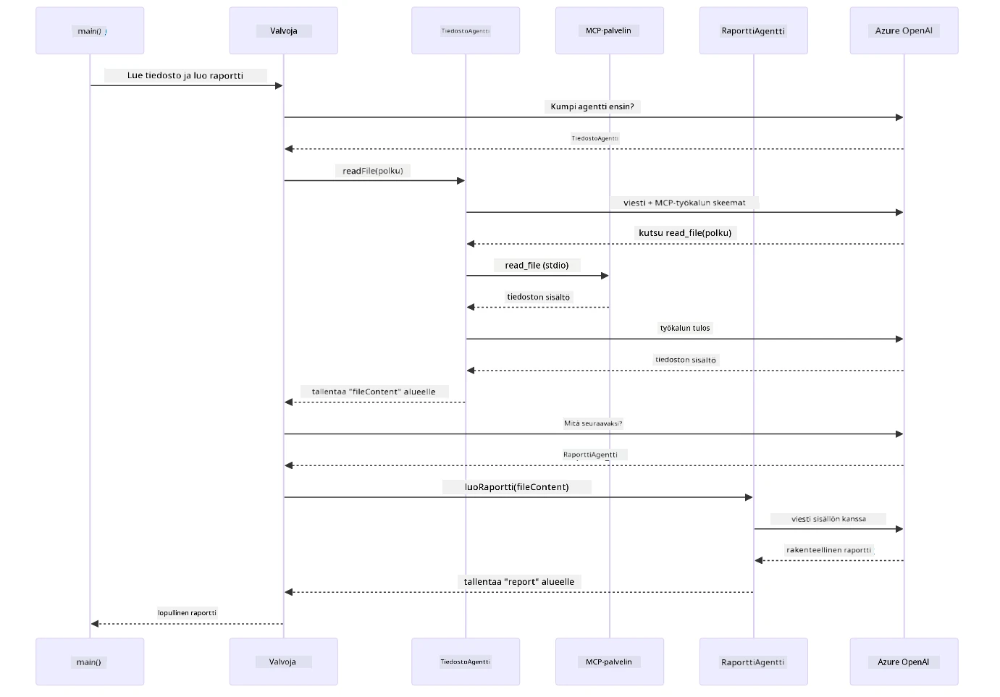

# Module 05: Model Context Protocol (MCP)

## Table of Contents

- [Video Walkthrough](../../../05-mcp)
- [What You'll Learn](../../../05-mcp)
- [What is MCP?](../../../05-mcp)
- [How MCP Works](../../../05-mcp)
- [The Agentic Module](../../../05-mcp)
- [Running the Examples](../../../05-mcp)
  - [Prerequisites](../../../05-mcp)
- [Quick Start](../../../05-mcp)
  - [File Operations (Stdio)](../../../05-mcp)
  - [Supervisor Agent](../../../05-mcp)
    - [Running the Demo](../../../05-mcp)
    - [How the Supervisor Works](../../../05-mcp)
    - [How FileAgent Discovers MCP Tools at Runtime](../../../05-mcp)
    - [Response Strategies](../../../05-mcp)
    - [Understanding the Output](../../../05-mcp)
    - [Explanation of Agentic Module Features](../../../05-mcp)
- [Key Concepts](../../../05-mcp)
- [Congratulations!](../../../05-mcp)
  - [What's Next?](../../../05-mcp)

## Video Walkthrough

Katso tämä live-sessio, joka selittää, miten pääset alkuun tämän moduulin kanssa:

<a href="https://www.youtube.com/watch?v=O_J30kZc0rw"></a>

## What You'll Learn

Olet rakentanut keskustelevaa tekoälyä, hallinnut kehotteita, juurruttanut vastaukset dokumentteihin ja luonut työkaluja sisältäviä agenteja. Mutta kaikki nämä työkalut olivat räätälöityjä sovellustasi varten. Entä jos voisit antaa tekoälyllesi pääsyn standardoitujen työkalujen ekosysteemiin, jonka kuka tahansa voi luoda ja jakaa? Tässä moduulissa opit tekemään juuri sen Model Context Protocolin (MCP) ja LangChain4j:n agentti-moduulin avulla. Esittelemme ensin yksinkertaisen MCP-tiedostonlukijan ja sitten näytämme, miten se helposti integroidaan kehittyneisiin agenttiprosesseihin käyttäen Supervisor Agent -mallia.

## What is MCP?

Model Context Protocol (MCP) tarjoaa juuri sen – standardoidun tavan tekoälysovelluksille löytää ja käyttää ulkoisia työkaluja. Sen sijaan, että kirjoittaisit räätälöityjä integraatioita jokaista tietolähdettä tai palvelua varten, yhdistyt MCP-palvelimiin, jotka tarjoavat ominaisuutensa yhtenäisessä muodossa. Tekoälyagenttisi voi sitten automaattisesti löytää ja käyttää näitä työkaluja.

Seuraava kaavio näyttää eron — ilman MCP:tä jokainen integraatio vaatii räätälöidyn pisteestä pisteeseen kytkennän; MCP:llä yksi protokolla yhdistää sovelluksesi mihin tahansa työkaluun:


*Ennen MCP:tä: monimutkaisia pisteestä pisteeseen integraatioita. MCP:n jälkeen: yksi protokolla, loputtomat mahdollisuudet.*

MCP ratkaisee perustavanlaatuisen ongelman tekoälyn kehityksessä: jokainen integraatio on räätälöity. Haluat käyttää GitHubia? Räätälöity koodi. Haluat lukea tiedostoja? Räätälöity koodi. Haluat kysyä tietokantaa? Räätälöity koodi. Eikä mikään näistä integraatioista toimi muiden tekoälysovellusten kanssa.

MCP standardisoi tämän. MCP-palvelin tarjoaa työkalut selkeillä kuvauksilla ja skeemoilla. Mikä tahansa MCP-asiakas voi yhdistyä, löytää saatavilla olevat työkalut ja käyttää niitä. Rakenna kerran, käytä kaikkialla.

Seuraava kaavio havainnollistaa tätä arkkitehtuuria — yksi MCP-asiakas (tekoälysovelluksesi) yhdistyy moniin MCP-palvelimiin, joista jokainen tarjoaa oman työkalusarjansa standardoidun protokollan kautta:


*Model Context Protocol -arkkitehtuuri – standardoitu työkalujen löytäminen ja suoritus*

## How MCP Works

Taustalla MCP käyttää kerroksellista arkkitehtuuria. Java-sovelluksesi (MCP-asiakas) löytää saatavilla olevat työkalut, lähettää JSON-RPC-pyyntöjä kuljetuskerroksen (Stdio tai HTTP) kautta ja MCP-palvelin suorittaa toiminnot ja palauttaa tulokset. Seuraava kaavio purkaa tämän protokollan jokaisen kerroksen:


*Kuinka MCP toimii taustalla — asiakkaat löytävät työkaluja, vaihtavat JSON-RPC-viestejä ja suorittavat toimenpiteitä kuljetuskerroksen kautta.*

**Palvelin-asiakas arkkitehtuuri**

MCP käyttää asiakas-palvelin mallia. Palvelimet tarjoavat työkaluja – tiedostojen lukemista, tietokantakyselyitä, API-kutsuja. Asiakkaat (tekoälysovelluksesi) yhdistyvät palvelimiin ja käyttävät heidän työkalujaan.

Käyttääksesi MCP:tä LangChain4j:n kanssa, lisää tämä Maven-riippuvuus:

```xml
<dependency>
    <groupId>dev.langchain4j</groupId>
    <artifactId>langchain4j-mcp</artifactId>
    <version>${langchain4j.version}</version>
</dependency>
```

**Työkalujen löytäminen**

Kun asiakas yhdistyy MCP-palvelimeen, se kysyy "Millaisia työkaluja sinulla on?" Palvelin vastaa saatavilla olevien työkalujen listalla, joissa on kuvaukset ja parametrien skeemat. Tekoälyagenttisi voi sitten päättää, mitä työkaluja käyttää käyttäjän pyyntöjen perusteella. Seuraava kaavio näyttää tämän kädenpuristuksen — asiakas lähettää `tools/list` -pyynnön ja palvelin palauttaa käytettävissä olevat työkalunsa kuvauksineen ja parametrien skeemineen:


*Tekoäly löytää saatavilla olevat työkalut käynnistyksen yhteydessä — se tietää nyt, mitä ominaisuuksia on saatavilla ja voi päättää, mitä käyttää.*

**Kuljetusmekanismit**

MCP tukee erilaisia kuljetusmekanismeja. Kaksi vaihtoehtoa ovat Stdio (paikalliselle aliprosessiviestinnälle) ja Streamable HTTP (etäpalvelimille). Tämä moduuli demonstroi Stdio-kuljetusta:


*MCP-kuljetusmekanismit: HTTP etäpalvelimille, Stdio paikallisprosesseille*

**Stdio** - [StdioTransportDemo.java](../../../05-mcp/src/main/java/com/example/langchain4j/mcp/StdioTransportDemo.java)

Paikallisiin prosesseihin. Sovelluksesi käynnistää palvelimen aliprosessina ja kommunikoi standardin syötteen/ulostulon kautta. Hyödyllistä tiedostojärjestelmän käyttöön tai komentorivityökaluihin.

```java
McpTransport stdioTransport = new StdioMcpTransport.Builder()
    .command(List.of(
        npmCmd, "exec",
        "@modelcontextprotocol/server-filesystem@2025.12.18",
        resourcesDir
    ))
    .logEvents(false)
    .build();
```

`@modelcontextprotocol/server-filesystem` -palvelin tarjoaa seuraavat työkalut, kaikki eristettynä määrittelemiesi hakemistojen rajojen sisälle:

| Työkalu | Kuvaus |
|------|-------------|
| `read_file` | Lukee yksittäisen tiedoston sisällön |
| `read_multiple_files` | Lukee useita tiedostoja yhdellä kutsulla |
| `write_file` | Luo tai kirjoittaa tiedoston ylikirjoittaen |
| `edit_file` | Tekee kohdennettuja etsi-ja-korvaa-muutoksia |
| `list_directory` | Listaa tiedostot ja hakemistot polussa |
| `search_files` | Etsii rekursiivisesti tiedostoja, jotka vastaavat mallia |
| `get_file_info` | Hakee tiedoston metatiedot (koko, aikaleimat, käyttöoikeudet) |
| `create_directory` | Luo hakemiston (mukaan lukien yläkansiot) |
| `move_file` | Siirtää tai nimeää tiedoston tai hakemiston uudelleen |

Seuraava kaavio näyttää, miten Stdio-kuljetus toimii ajonaikaisesti — Java-sovelluksesi käynnistää MCP-palvelimen aliprosessina ja ne kommunikoivat stdin/stdout-putkien kautta, ilman verkkoa tai HTTP:tä:


*Stdio-kuljetus toiminnassa — sovelluksesi käynnistää MCP-palvelimen aliprosessina ja kommunikaatio tapahtuu stdin/stdout-putkien kautta.*

> **🤖 Kokeile [GitHub Copilot](https://github.com/features/copilot) Chat:n kanssa:** Avaa [`StdioTransportDemo.java`](../../../05-mcp/src/main/java/com/example/langchain4j/mcp/StdioTransportDemo.java) ja kysy:
> - "Miten Stdio-kuljetus toimii ja milloin sitä tulisi käyttää HTTP:n sijaan?"
> - "Miten LangChain4j hallinnoi MCP-palvelinprosessien elinkaarta?"
> - "Mitkä ovat tietoturvariskit antaessani tekoälyn käyttää tiedostojärjestelmää?"

## The Agentic Module

Vaikka MCP tarjoaa standardoituja työkaluja, LangChain4j:n **agentti-moduuli** tarjoaa deklaratiivisen tavan rakentaa agenteja, jotka orkestroivat näitä työkaluja. `@Agent`-annotaatio ja `AgenticServices` antavat sinun määritellä agenttien käyttäytymisen rajapintojen avulla sen sijaan, että kirjoittaisit imperatiivista koodia.

Tässä moduulissa tutustut **Supervisor Agent** -malliin — kehittyneeseen agenttipohjaiseen tekoälyyn, jossa "valvoja"-agentti päättää dynaamisesti, mitä alikomentoja kutsutaan käyttäjän pyyntöjen perusteella. Yhdistämme molemmat käsitteet antamalla yhdelle alikomentajistamme MCP-vetoisen tiedostopääsykyvyn.

Käyttääksesi agentti-moduulia, lisää tämä Maven-riippuvuus:

```xml
<dependency>
    <groupId>dev.langchain4j</groupId>
    <artifactId>langchain4j-agentic</artifactId>
    <version>${langchain4j.mcp.version}</version>
</dependency>
```
> **Huom:** `langchain4j-agentic`-moduuli käyttää erillistä versio-ominaisuutta (`langchain4j.mcp.version`), koska sen julkaisu on eri aikataululla kuin LangChain4j:n ydinkirjastot.

> **⚠️ Kokeellinen:** `langchain4j-agentic`-moduuli on **kokeellinen** ja voi muuttua. Vakaa tapa rakentaa tekoälyavustajia on edelleen `langchain4j-core` käyttäen räätälöityjä työkaluja (Moduuli 04).

## Running the Examples

### Prerequisites

- Suoritettu [Module 04 - Tools](../04-tools/README.md) (tämä moduuli rakentuu räätälöityjen työkalujen käsitteille ja vertaa niitä MCP-työkaluihin)
- Juureen `.env` tiedosto Azure-tunnuksilla (luotu `azd up` -komennolla Moduulissa 01)
- Java 21+, Maven 3.9+
- Node.js 16+ ja npm (MCP-palvelimia varten)

> **Huom:** Jos et ole vielä määrittänyt ympäristömuuttujiasi, katso [Module 01 - Introduction](../01-introduction/README.md) käyttöönotto-ohjeita (`azd up` luo `.env` tiedoston automaattisesti), tai kopioi `.env.example` tiedostoksi `.env` juurihakemistoon ja täytä arvosi.

## Quick Start

**VS Codea käyttäen:** Napsauta hiiren oikealla missä tahansa demotiedostossa Explorerissa ja valitse **"Run Java"**, tai käytä Run and Debug -paneelin käynnistyskonfiguraatioita (varmista ensin, että `.env` tiedostosi on konfiguroitu Azure-tunnuksilla).

**Mavenea käyttäen:** Vaihtoehtoisesti voit suorittaa komentoja komentoriviltä alla olevien esimerkkien mukaisesti.

### File Operations (Stdio)

Tämä demonstroi paikallisia aliprosessipohjaisia työkaluja.

**✅ Ei vaadi ennakkoasetuksia** — MCP-palvelin käynnistyy automaattisesti.

**Käynnistyskomentosarjojen käyttäminen (Suositeltu):**

Käynnistyskomentosarjat lataavat automaattisesti ympäristömuuttujat juurihakemistossa olevasta `.env` tiedostosta:

**Bash:**
```bash
cd 05-mcp
chmod +x start-stdio.sh
./start-stdio.sh
```

**PowerShell:**
```powershell
cd 05-mcp
.\start-stdio.ps1
```

**VS Codella:** Napsauta hiiren oikealla `StdioTransportDemo.java` tiedostoa ja valitse **"Run Java"** (varmista, että `.env` tiedosto on konfiguroitu).

Sovellus käynnistää tiedostojärjestelmä MCP-palvelimen automaattisesti ja lukee paikallisen tiedoston. Huomaa, miten aliprosessin hallinta hoidetaan puolestasi.

**Odotettu tulos:**
```
Assistant response: The file provides an overview of LangChain4j, an open-source Java library
for integrating Large Language Models (LLMs) into Java applications...
```

### Supervisor Agent

**Supervisor Agent -malli** on **joustava** agenttipohjainen tekoälymuoto. Valvoja käyttää LLM:ää automaattisesti päättääkseen, mitä agentteja kutsutaan käyttäjän pyynnön perusteella. Seuraavassa esimerkissä yhdistämme MCP-vetoisen tiedostopääsyn LLM-agenttiin luodaksemme valvotun tiedoston lukeminen → raportointi -työnkulun.

Demonissa `FileAgent` lukee tiedoston MCP-tiedostojärjestelmätyökaluilla ja `ReportAgent` muodostaa rakenteellisen raportin, johon sisältyy tiivistelmä (1 lause), 3 pääkohtaa ja suosituksia. Supervisor ohjaa tämän prosessin automaattisesti:


*Valvoja käyttää LLM:ää päättääkseen, mitä agentteja kutsua ja missä järjestyksessä — kovakoodattua reititystä ei tarvita.*

Näin konkreettinen työnkulku näyttää tiedostosta raporttiin prosessissa:


*FileAgent lukee tiedoston MCP-työkalujen kautta, sitten ReportAgent muokkaa raakasisällöstä rakenteellisen raportin.*

Seuraava sekvenssikaavio kuvaa koko Supervisorin orkestroinnin — MCP-palvelimen käynnistämisestä, Supervisorin autonomiseen agenttien valintaan, stdio:n kautta tapahtuviin työkalukutsuihin ja loppuraporttiin:



*Valvoja kutsuu autonomisesti FileAgentia (joka käyttää MCP-palvelinta stdio:n yli tiedoston lukemiseen), sitten ReportAgentia rakenteellisen raportin tekemiseen — jokainen agentti tallentaa tuloksensa jaetulle Agentic Scope:lle.*

Jokainen agentti tallentaa tuloksensa **Agentic Scope**:iin (jaettu muisti), joka mahdollistaa aiempien tulosten lukemisen seuraaville agenteille. Tämä osoittaa, miten MCP-työkalut integroituvat saumattomasti agenttiprosesseihin — Valvojan ei tarvitse tietää *miten* tiedostot luetaan, vain että `FileAgent` osaa sen.

#### Running the Demo

Käynnistyskomentosarjat lataavat automaattisesti ympäristömuuttujat juurihakemiston `.env` tiedostosta:

**Bash:**
```bash
cd 05-mcp
chmod +x start-supervisor.sh
./start-supervisor.sh
```

**PowerShell:**
```powershell
cd 05-mcp
.\start-supervisor.ps1
```

**VS Codella:** Napsauta hiiren oikealla `SupervisorAgentDemo.java` tiedostoa ja valitse **"Run Java"** (varmista, että `.env` tiedosto on konfiguroitu).

#### How the Supervisor Works

Ennen agenttien rakentamista sinun täytyy yhdistää MCP-kuljetus asiakas-proxyyn ja kääriä se `ToolProvider`-tyyppiseksi. Näin MCP-palvelimen työkalut tulevat saataville agenteillesi:

```java
// Luo MCP-asiakas kuljetuksesta
McpClient mcpClient = new DefaultMcpClient.Builder()
        .transport(stdioTransport)
        .build();

// Kääri asiakas ToolProvideriksi — tämä yhdistää MCP-työkalut LangChain4j:hin
ToolProvider mcpToolProvider = McpToolProvider.builder()
        .mcpClients(List.of(mcpClient))
        .build();
```

Nyt voit injektoida `mcpToolProvider`-instanssin mihin tahansa agenttiin, joka tarvitsee MCP-työkaluja:

```java
// Vaihe 1: FileAgent lukee tiedostoja käyttäen MCP-työkaluja
FileAgent fileAgent = AgenticServices.agentBuilder(FileAgent.class)
        .chatModel(model)
        .toolProvider(mcpToolProvider)  // Sisältää MCP-työkalut tiedostojen käsittelyyn
        .build();

// Vaihe 2: ReportAgent luo jäsenneltyjä raportteja
ReportAgent reportAgent = AgenticServices.agentBuilder(ReportAgent.class)
        .chatModel(model)
        .build();

// Supervisor ohjaa tiedosto → raportti -työnkulun
SupervisorAgent supervisor = AgenticServices.supervisorBuilder()
        .chatModel(model)
        .subAgents(fileAgent, reportAgent)
        .responseStrategy(SupervisorResponseStrategy.LAST)  // Palauta lopullinen raportti
        .build();

// Supervisor päättää, mitä agenteja kutsutaan pyynnön perusteella
String response = supervisor.invoke("Read the file at /path/file.txt and generate a report");
```

#### How FileAgent Discovers MCP Tools at Runtime

Saatat miettiä: **mistä `FileAgent` tietää, miten npm:n tiedostojärjestelmätyökaluja käytetään?** Vastaus on, että se ei tiedä — **LLM** selvittää sen ajonaikaisesti työkalujen skeemojen perusteella.
`FileAgent`-rajapinta on vain **kehotemäärittely**. Siinä ei ole kovakoodattua tietoa `read_file`, `list_directory` tai mistään muusta MCP-työkalusta. Näin tapahtuu päästä päähän:

1. **Palvelin käynnistyy:** `StdioMcpTransport` käynnistää `@modelcontextprotocol/server-filesystem` npm-paketin aliprosessina  
2. **Työkalujen löytyminen:** `McpClient` lähettää `tools/list` JSON-RPC -pyynnön palvelimelle, joka vastaa työkalu- nimillä, kuvauksilla ja parametrikaavoilla (esim. `read_file` — *"Lue tiedoston koko sisältö"* — `{ path: string }`)  
3. **Kaavan injektointi:** `McpToolProvider` käärii nämä löydetyt kaavat ja tarjoaa ne LangChain4j:lle  
4. **LLM tekee päätöksen:** Kun `FileAgent.readFile(path)` kutsutaan, LangChain4j lähettää järjestelmäviestin, käyttäjäviestin **ja työkalukaavojen listan** LLM:lle. LLM lukee työkalun kuvaukset ja muodostaa työkalukutsun (esim. `read_file(path="/some/file.txt")`)  
5. **Suoritus:** LangChain4j kaappaa työkalukutsun, ohjaa sen MCP-asiakkaan kautta takaisin Node.js aliprosessille, saa tuloksen ja syöttää sen takaisin LLM:lle

Tämä on sama [Tool Discovery](../../../05-mcp) -mekanismi kuin aiemmin kuvattu, mutta sovellettuna nimenomaan agentin työnkulkuun. `@SystemMessage` ja `@UserMessage` -annotaatiot ohjaavat LLM:n toimintaa, kun taas injektoitu `ToolProvider` antaa sille **mahdollisuudet** — LLM yhdistää ne ajonaikaisesti.

> **🤖 Kokeile [GitHub Copilot](https://github.com/features/copilot) Chatilla:** Avaa [`FileAgent.java`](../../../05-mcp/src/main/java/com/example/langchain4j/mcp/agents/FileAgent.java) ja kysy:  
> - "Mistä tämä agentti tietää, mitä MCP-työkalua kutsua?"  
> - "Mitä tapahtuisi, jos poistan ToolProviderin agentin rakentajasta?"  
> - "Miten työkalukaavat välitetään LLM:lle?"

#### Vastausstrategiat

Kun määrität `SupervisorAgent`-agenttia, päätät, miten se muotoilee lopullisen vastauksensa käyttäjälle alagenttien suoritettua tehtävänsä. Alla oleva kaavio esittää kolme saatavilla olevaa strategiaa — LAST palauttaa suoraan viimeisen agentin tuloksen, SUMMARY tiivistää kaikki tulokset LLM:llä ja SCORED valitsee paremman pisteytyksen saaneen vastauksen alkuperäiseen pyyntöön verrattuna:


*Kolme tapaa, joilla Supervisor muotoilee lopullisen vastauksensa — valitse haluatko viimeisen agentin tuloksen, tiivistelmävastauksen vai parhaiten pisteytyneen vaihtoehdon.*

Saatavilla olevat strategiat ovat:

| Strategia | Kuvaus |
|----------|-------------|
| **LAST** | Supervisor palauttaa viimeisen alagentin tai kutsutun työkalun tuloksen. Tämä on hyödyllistä, kun työnkulun viimeinen agentti on erityisesti suunniteltu tuottamaan täydellinen lopullinen vastaus (esim. "Yhteenveto-agentti" tutkimusputkessa). |
| **SUMMARY** | Supervisor käyttää omaa sisäistä kielimalliaan (LLM) tiivistääkseen koko vuorovaikutuksen ja kaikkien alagenttien tulokset yhteen, ja palauttaa tämän tiivistelmän lopullisena vastauksena. Tämä tarjoaa käyttäjälle selkeän yhteenvedon. |
| **SCORED** | Järjestelmä käyttää sisäistä LLM:ää pisteyttämään sekä LAST-vastauksen että SUMMARY- tiivistelmän alkuperäiseen käyttäjäpyyntöön nähden ja palauttaa paremman pisteytyksen saaneen vastauksen. |

Katso täydellinen toteutus tiedostosta [SupervisorAgentDemo.java](../../../05-mcp/src/main/java/com/example/langchain4j/mcp/SupervisorAgentDemo.java).

> **🤖 Kokeile [GitHub Copilot](https://github.com/features/copilot) Chatilla:** Avaa [`SupervisorAgentDemo.java`](../../../05-mcp/src/main/java/com/example/langchain4j/mcp/SupervisorAgentDemo.java) ja kysy:  
> - "Miten Supervisor päättää, mitä agentteja kutsua?"  
> - "Mikä ero on Supervisor- ja Sequential-työnkulkumalleilla?"  
> - "Miten voin muokata Supervisorin suunnittelukäyttäytymistä?"

#### Tuloksen ymmärtäminen

Käynnistäessäsi demon näet rakenteellisen läpikäynnin siitä, miten Supervisor orkestroi useita agentteja. Tässä mitä kukin osio tarkoittaa:

```
======================================================================
  FILE → REPORT WORKFLOW DEMO
======================================================================

This demo shows a clear 2-step workflow: read a file, then generate a report.
The Supervisor orchestrates the agents automatically based on the request.
```
  
**Otsikko** esittelee työnkulun käsitteen: kohdennettu putki tiedostonlukuun ja raportin generointiin.

```
--- WORKFLOW ---------------------------------------------------------
  ┌─────────────┐      ┌──────────────┐
  │  FileAgent  │ ───▶ │ ReportAgent  │
  │ (MCP tools) │      │  (pure LLM)  │
  └─────────────┘      └──────────────┘
   outputKey:           outputKey:
   'fileContent'        'report'

--- AVAILABLE AGENTS -------------------------------------------------
  [FILE]   FileAgent   - Reads files via MCP → stores in 'fileContent'
  [REPORT] ReportAgent - Generates structured report → stores in 'report'
```
  
**Työnkulun kaavio** näyttää datan kulun agenttien välillä. Jokaisella agentilla on oma roolinsa:  
- **FileAgent** lukee tiedostot MCP-työkalujen avulla ja tallentaa raakadatan `fileContent`-muuttujaan  
- **ReportAgent** käyttää tuota sisältöä ja tuottaa jäsennellyn raportin `report`-muuttujaan

```
--- USER REQUEST -----------------------------------------------------
  "Read the file at .../file.txt and generate a report on its contents"
```
  
**Käyttäjäpyyntö** näyttää tehtävän. Supervisor jäsentää tämän ja päättää kutsua FileAgent → ReportAgent.

```
--- SUPERVISOR ORCHESTRATION -----------------------------------------
  The Supervisor decides which agents to invoke and passes data between them...

  +-- STEP 1: Supervisor chose -> FileAgent (reading file via MCP)
  |
  |   Input: .../file.txt
  |
  |   Result: LangChain4j is an open-source, provider-agnostic Java framework for building LLM...
  +-- [OK] FileAgent (reading file via MCP) completed

  +-- STEP 2: Supervisor chose -> ReportAgent (generating structured report)
  |
  |   Input: LangChain4j is an open-source, provider-agnostic Java framew...
  |
  |   Result: Executive Summary...
  +-- [OK] ReportAgent (generating structured report) completed
```
  
**Supervisorin orkestrointi** näyttää 2-vaiheisen työnkulun:  
1. **FileAgent** lukee tiedoston MCP:n kautta ja tallentaa sisällön  
2. **ReportAgent** saa sisällön ja generoi rakenteellisen raportin

Supervisor teki nämä päätökset **itsenäisesti** käyttäjän pyynnön pohjalta.

```
--- FINAL RESPONSE ---------------------------------------------------
Executive Summary
...

Key Points
...

Recommendations
...

--- AGENTIC SCOPE (Data Flow) ----------------------------------------
  Each agent stores its output for downstream agents to consume:
  * fileContent: LangChain4j is an open-source, provider-agnostic Java framework...
  * report: Executive Summary...
```
  
#### Agenttisen moduulin ominaisuuksien selitys

Esimerkki demonstroi useita agenttisen moduulin edistyneitä ominaisuuksia. Tarkastellaanpa lähemmin Agentic Scopea ja Agentkuuntelijoita.

**Agentic Scope** näyttää jaetun muistin, johon agentit tallensivat tuloksensa `@Agent(outputKey="...")` avulla. Tämä mahdollistaa:  
- Myöhempien agenttien pääsyn aikaisempien agenttien tuloksiin  
- Supervisorin kyvyn tehdä lopullinen vastaus yhtenäistetysti  
- Sinun tarkastella, mitä kukin agentti tuotti

Alla oleva kaavio näyttää, miten Agentic Scope toimii jaettuna muistina tiedostosta raporttiin työnkulussa — FileAgent kirjoittaa tuloksen avaimella `fileContent`, ReportAgent lukee sen ja kirjoittaa oman tuloksensa avaimella `report`:


*Agentic Scope toimii jaettuna muistina — FileAgent kirjoittaa `fileContent`, ReportAgent lukee sen ja kirjoittaa `report`, ja koodisi lukee lopullisen tuloksen.*

```java
ResultWithAgenticScope<String> result = supervisor.invokeWithAgenticScope(request);
AgenticScope scope = result.agenticScope();
String fileContent = scope.readState("fileContent");  // Raakatiedot tiedostosta FileAgent
String report = scope.readState("report");            // Jäsennelty raportti ReportAgentilta
```
  
**Agentkuuntelijat** mahdollistavat agentin suorituksen seurannan ja virheenkorjauksen. Demon vaiheittainen tulostus tulee AgentListeneriltä, joka kytkeytyy jokaisen agenttikutsun yhteyteen:  
- **beforeAgentInvocation** – Kutsutaan, kun Supervisor valitsee agentin. Näet, mikä agentti valittiin ja miksi  
- **afterAgentInvocation** – Kutsutaan, kun agentti on suorittanut, näyttää sen tuloksen  
- **inheritedBySubagents** – Jos tosi, kuuntelija valvoo kaikki hierarkiassa olevat agentit

Seuraava kaavio näyttää agenttikuuntelijan koko elinkaaren, mukaan lukien miten `onError`-metodi käsittelee virheet agentin suorituksen aikana:


*Agentkuuntelijat liittyvät suorituksen elinkaareen — seuraa, milloin agentit alkavat, valmistuvat tai kohtaavat virheitä.*

```java
AgentListener monitor = new AgentListener() {
    private int step = 0;
    
    @Override
    public void beforeAgentInvocation(AgentRequest request) {
        step++;
        System.out.println("  +-- STEP " + step + ": " + request.agentName());
    }
    
    @Override
    public void afterAgentInvocation(AgentResponse response) {
        System.out.println("  +-- [OK] " + response.agentName() + " completed");
    }
    
    @Override
    public boolean inheritedBySubagents() {
        return true; // Levitä kaikille ala-agenteille
    }
};
```
  
Supervisor-mallin lisäksi `langchain4j-agentic`-moduuli tarjoaa useita tehokkaita työnkulku-malleja. Alla oleva kaavio esittää kaikki viisi — yksinkertaisista peräkkäisistä putkista ihmisen käsittelyyn vaativiin hyväksyntätyönkulkuihin:


*Viisi työnkulkumallia agenttien orkestrointiin — yksinkertaisista peräkkäisistä putkistoista ihmisen hyväksyntätyönkulkuihin.*

| Malle | Kuvaus | Käyttötapaus |
|---------|-------------|----------|
| **Sequential** | Suorita agentit järjestyksessä, tulos etenee seuraavalle | Putket: tutkimus → analyysi → raportti |
| **Parallel** | Suorita agentit rinnakkain | Itsenäiset tehtävät: sää + uutiset + osakkeet |
| **Loop** | Toista, kunnes ehto täyttyy | Laadun pisteytys: paranna kunnes piste ≥ 0.8 |
| **Conditional** | Reititä ehtojen mukaan | Luokitus → reititä erikoisagentille |
| **Human-in-the-Loop** | Lisää ihmisen tarkistuskohtia | Hyväksyntätyönkulut, sisällön tarkastus |

## Keskeiset käsitteet

Nyt kun olet tutustunut MCP:hen ja agenttiseen moduuliin käytännössä, tiivistetään milloin kumpaakin kannattaa käyttää.

Yksi MCP:n suurimmista eduista on sen kasvava ekosysteemi. Alla oleva kaavio näyttää, miten yksi yleinen protokolla yhdistää AI-sovelluksesi monenlaisiin MCP-palvelimiin — tiedostojärjestelmästä ja tietokannoista GitHubiin, sähköpostiin, web-scrapingiin ja muuhun:


*MCP luo universaalin protokollaekosysteemin — mikä tahansa MCP-yhteensopiva palvelin toimii minkä tahansa MCP-yhteensopivan asiakkaan kanssa, mahdollistaen työkalujen jakamisen sovellusten välillä.*

**MCP** on ihanteellinen, kun haluat hyödyntää olemassa olevia työkalu-ekosysteemejä, rakentaa työkaluja, joita useampi sovellus voi jakaa, integroida kolmannen osapuolen palveluja standardeilla protokollilla tai vaihtaa työkalujen toteutuksia vaihtamatta koodia.

**Agenttinen moduuli** sopii parhaiten, kun tarvitset deklaratiivisia agenttimäärittelyjä `@Agent`-annotaatioilla, työnkulun orkestrointia (peräkkäinen, silmukka, rinnakkainen), pidät rajapintapohjaisesta agenttisuunnittelusta imperatiivisen koodin sijaan, tai yhdistät useita agentteja, jotka jakavat tuloksia `outputKey`:n avulla.

**Supervisor Agent -malli** loistaa, kun työnkulku ei ole ennakoitavissa etukäteen ja haluat LLM:n päättävän, kun sinulla on useita erikoistuneita agentteja, jotka tarvitsevat dynaamista orkestrointia, kun rakennat keskustelujärjestelmiä, jotka reitittävät eri kyvykkyyksille, tai kun haluat joustavimman ja adaptiivisimman agenttikäyttäytymisen.

Auttaaksemme päättämään mukautettujen `@Tool`-metodien (Moduuli 04) ja MCP-työkalujen (tämä moduuli) välillä, seuraava vertailu korostaa keskeiset kompromissit — mukautetut työkalut tarjoavat tiukan sidonnan ja täydellisen tyyppiturvan sovelluskohtaiselle logiikalle, kun taas MCP-työkalut ovat standardoituja, uudelleenkäytettäviä integraatioita:


*Milloin käyttää mukautettuja @Tool-metodeja vs MCP-työkaluja — mukautetut työkalut sovelluskohtaiselle logiikalle täydellä tyyppiturvalla, MCP-työkalut standardoiduille integraatioille jotka toimivat sovellusten välillä.*

## Onnittelut!

Olet käynyt läpi kaikki viisi LangChain4j alkeiskurssin moduulia! Tässä katsaus koko oppimismatkaasi — peruskeskusteluista aina MCP-vetoisiin agenttisiin järjestelmiin:


*Oppimismatkasi kaikkien viiden moduulin läpi — peruskeskusteluista MCP-vetoisiin agenttisiin järjestelmiin.*

Olet suorittanut LangChain4j for Beginners -kurssin. Olet oppinut:

- Kuinka rakentaa muistilla varustettua keskustelevaa tekoälyä (Moduuli 01)  
- Kehoteinsinöörin malleja erilaisiin tehtäviin (Moduuli 02)  
- Vastauksen perustamista omiin dokumentteihisi RAG:n avulla (Moduuli 03)  
- Perusagenttien (avustajien) luomisen mukautetuilla työkaluilla (Moduuli 04)  
- Standardoitujen työkalujen integroinnin LangChain4j:n MCP- ja Agentic-moduuleilla (Moduuli 05)

### Mitä seuraavaksi?

Moduulien suorittamisen jälkeen tutustu [Testing Guide](../docs/TESTING.md) -oppaaseen nähdäksesi LangChain4j:n testauskäsitteet käytännössä.

**Viralliset resurssit:**  
- [LangChain4j Documentation](https://docs.langchain4j.dev/) – Kattavat oppaat ja API-viite  
- [LangChain4j GitHub](https://github.com/langchain4j/langchain4j) – Lähdekoodi ja esimerkit  
- [LangChain4j Tutorials](https://docs.langchain4j.dev/tutorials/) – Askeltavia tutoriaaleja eri käyttötapauksiin

Kiitos, että suoritit tämän kurssin!

---

**Navigointi:** [← Edellinen: Moduuli 04 - Työkalut](../04-tools/README.md) | [Takaisin alkuun](../README.md)

---

<!-- CO-OP TRANSLATOR DISCLAIMER START -->
**Vastuuvapauslauseke**:  
Tämä asiakirja on käännetty käyttäen tekoälypohjaista käännöspalvelua [Co-op Translator](https://github.com/Azure/co-op-translator). Vaikka pyrimme tarkkuuteen, ota huomioon, että automaattiset käännökset saattavat sisältää virheitä tai epätarkkuuksia. Alkuperäinen asiakirja sen alkuperäiskielellä on katsottava auktoriteettiseksi lähteeksi. Tärkeissä asioissa suositellaan ammattilaisen tekemää inhimillistä käännöstä. Emme ole vastuussa mahdollisista väärinymmärryksistä tai virhetulkinnoista, jotka johtuvat tämän käännöksen käytöstä.
<!-- CO-OP TRANSLATOR DISCLAIMER END -->