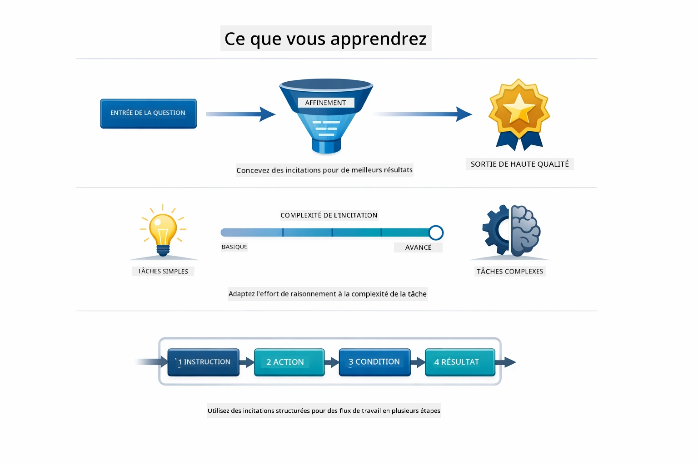
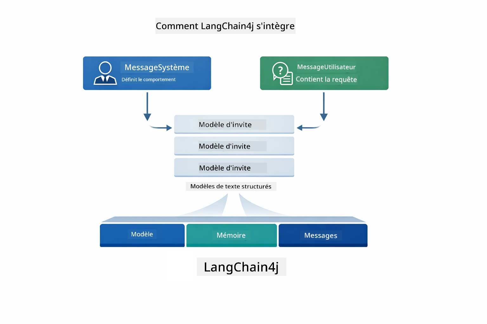
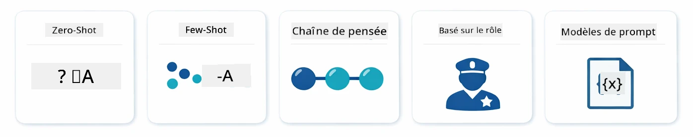
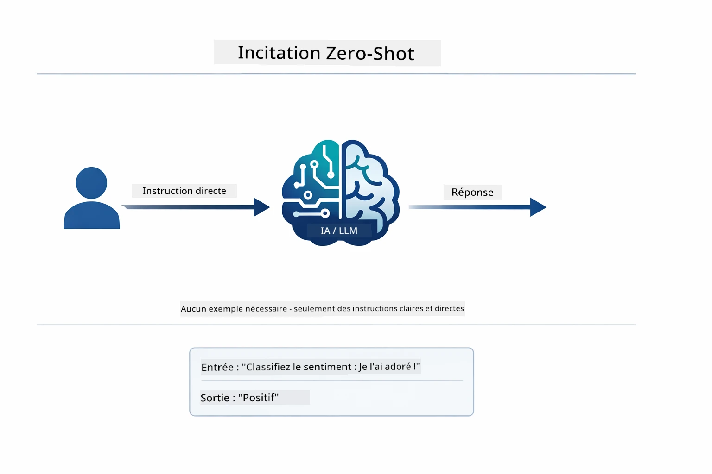
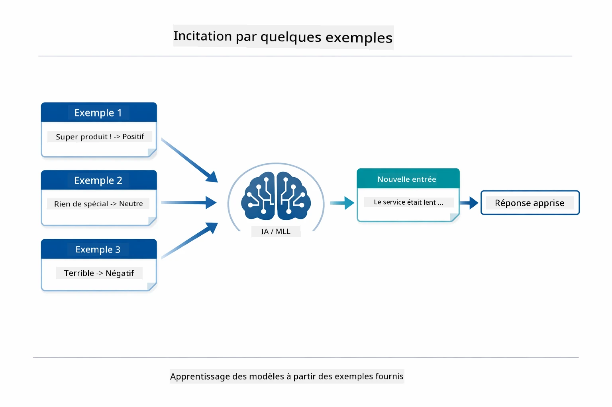
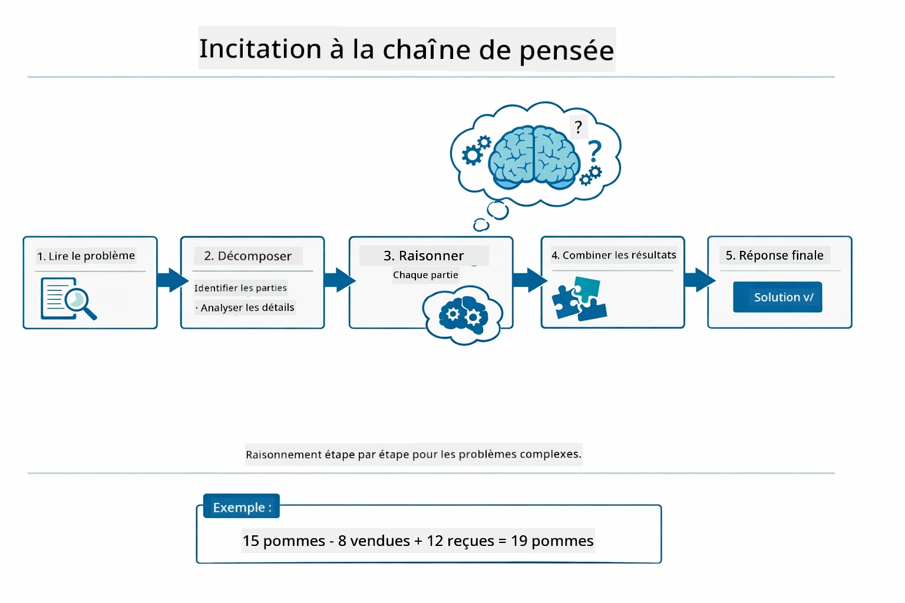
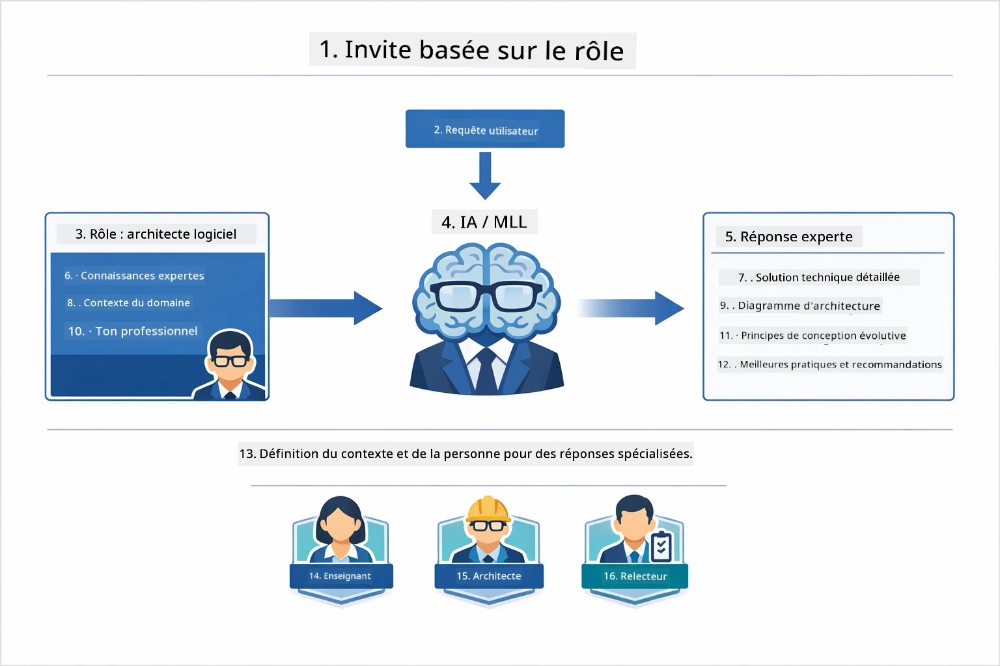
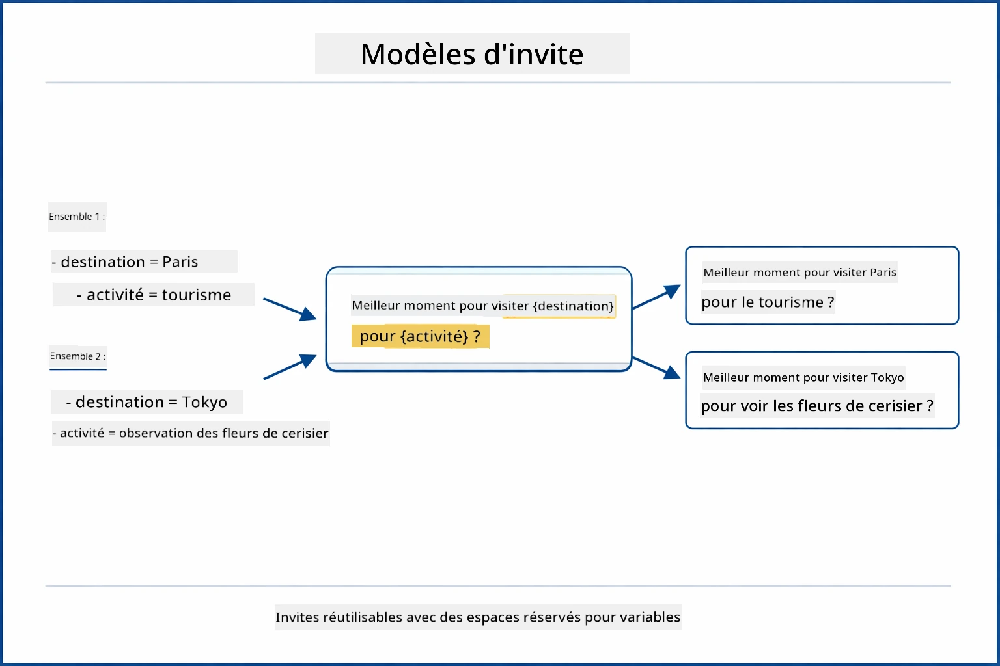
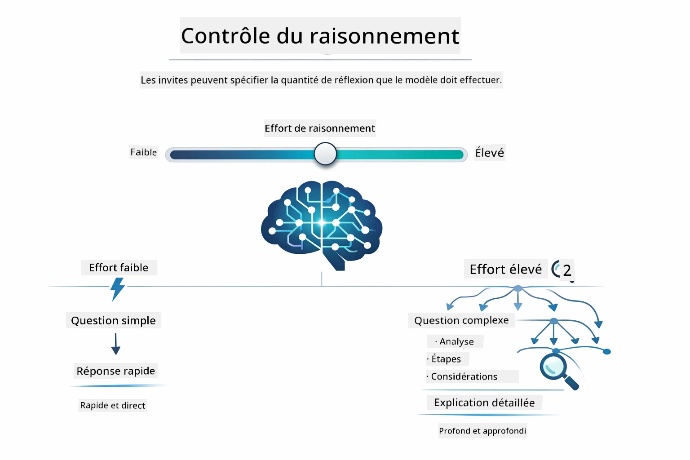

# Module 02 : Ingénierie des Prompts avec GPT-5.2

## Table des Matières

- [Ce que vous apprendrez](../../../02-prompt-engineering)
- [Pré-requis](../../../02-prompt-engineering)
- [Comprendre l’ingénierie des prompts](../../../02-prompt-engineering)
- [Fondamentaux de l’ingénierie des prompts](../../../02-prompt-engineering)
  - [Prompting Zero-Shot](../../../02-prompt-engineering)
  - [Prompting Few-Shot](../../../02-prompt-engineering)
  - [Chaîne de pensée](../../../02-prompt-engineering)
  - [Prompting par rôle](../../../02-prompt-engineering)
  - [Modèles de prompts](../../../02-prompt-engineering)
- [Modèles avancés](../../../02-prompt-engineering)
- [Utilisation des ressources Azure existantes](../../../02-prompt-engineering)
- [Captures d’écran de l’application](../../../02-prompt-engineering)
- [Exploration des modèles](../../../02-prompt-engineering)
  - [Faible vs forte volonté](../../../02-prompt-engineering)
  - [Exécution de tâches (préambules d’outils)](../../../02-prompt-engineering)
  - [Code auto-réflexif](../../../02-prompt-engineering)
  - [Analyse structurée](../../../02-prompt-engineering)
  - [Chat multi-tours](../../../02-prompt-engineering)
  - [Raisonnement étape par étape](../../../02-prompt-engineering)
  - [Sortie contrainte](../../../02-prompt-engineering)
- [Ce que vous apprenez vraiment](../../../02-prompt-engineering)
- [Étapes suivantes](../../../02-prompt-engineering)

## Ce que vous apprendrez



Dans le module précédent, vous avez vu comment la mémoire permet une IA conversationnelle et utilisé les modèles GitHub pour des interactions basiques. Maintenant, nous nous concentrons sur la manière de poser vos questions — les prompts eux-mêmes — en utilisant GPT-5.2 d’Azure OpenAI. La façon dont vous structurez vos prompts impacte fortement la qualité des réponses obtenues. Nous commençons par un rappel des techniques fondamentales de prompting, puis passons à huit modèles avancés qui tirent pleinement parti des capacités de GPT-5.2.

Nous utilisons GPT-5.2 car il introduit un contrôle du raisonnement — vous pouvez indiquer au modèle combien de réflexion faire avant de répondre. Cela rend plus évidentes les différentes stratégies de prompt et vous aide à comprendre quand utiliser chaque approche. Nous bénéficierons également des limites de taux moins strictes d'Azure pour GPT-5.2 comparé aux modèles GitHub.

## Pré-requis

- Module 01 terminé (ressources Azure OpenAI déployées)
- Fichier `.env` dans le répertoire racine avec les identifiants Azure (créé par `azd up` dans le Module 01)

> **Note :** si vous n’avez pas terminé le Module 01, suivez d’abord les instructions de déploiement de ce module.

## Comprendre l’ingénierie des prompts


L’ingénierie des prompts consiste à concevoir du texte d’entrée qui vous donne systématiquement les résultats souhaités. Ce n’est pas seulement poser des questions — c’est structurer les requêtes pour que le modèle comprenne exactement ce que vous voulez et comment le délivrer.

Pensez-y comme donner des instructions à un collègue. « Corrige le bug » est vague. « Corrige l’exception de pointeur nul dans UserService.java ligne 45 en ajoutant une vérification de null » est précis. Les modèles de langage fonctionnent de la même manière — la spécificité et la structure comptent.



LangChain4j fournit l’infrastructure — connexions au modèle, mémoire et types de messages — tandis que les modèles de prompt sont juste du texte soigneusement structuré que vous envoyez via cette infrastructure. Les éléments clés sont `SystemMessage` (qui définit le comportement et le rôle de l’IA) et `UserMessage` (qui porte votre requête réelle).

## Fondamentaux de l’ingénierie des prompts



Avant de plonger dans les modèles avancés de ce module, passons en revue cinq techniques fondamentales de prompting. Ce sont les blocs de construction que tout ingénieur de prompt doit connaître. Si vous avez déjà travaillé le [module de démarrage rapide](../00-quick-start/README.md#2-prompt-patterns), vous les avez vus en action — voici le cadre conceptuel qui les sous-tend.

### Prompting Zero-Shot

L’approche la plus simple : donnez au modèle une instruction directe sans exemples. Le modèle s’appuie entièrement sur son entraînement pour comprendre et exécuter la tâche. Cela fonctionne bien pour des requêtes simples où le comportement attendu est évident.



*Instruction directe sans exemples — le modèle déduit la tâche à partir de l’instruction seule*

```java
String prompt = "Classify this sentiment: 'I absolutely loved the movie!'";
String response = model.chat(prompt);
// Réponse : "Positif"
```

**Quand utiliser :** classifications simples, questions directes, traductions, ou toute tâche pouvant être traitée sans indication supplémentaire.

### Prompting Few-Shot

Fournissez des exemples montrant le modèle à suivre. Il apprend le format entrée-sortie attendu à partir de vos exemples et l’applique aux nouvelles entrées. Cela améliore considérablement la cohérence pour les tâches où le format ou comportement désiré n’est pas évident.



*Apprentissage par exemples — le modèle identifie le modèle et l’applique aux entrées nouvelles*

```java
String prompt = """
    Classify the sentiment as positive, negative, or neutral.
    
    Examples:
    Text: "This product exceeded my expectations!" → Positive
    Text: "It's okay, nothing special." → Neutral
    Text: "Waste of money, very disappointed." → Negative
    
    Now classify this:
    Text: "Best purchase I've made all year!"
    """;
String response = model.chat(prompt);
```

**Quand utiliser :** classifications personnalisées, formatage cohérent, tâches spécifiques au domaine, ou quand les résultats zero-shot sont incohérents.

### Chaîne de pensée

Demandez au modèle de montrer son raisonnement étape par étape. Au lieu de sauter directement à une réponse, le modèle décompose le problème et travaille chaque partie explicitement. Cela améliore la précision sur les mathématiques, la logique et le raisonnement à plusieurs étapes.



*Raisonnement étape par étape — décomposer les problèmes complexes en étapes logiques explicites*

```java
String prompt = """
    Problem: A store has 15 apples. They sell 8 apples and then 
    receive a shipment of 12 more apples. How many apples do they have now?
    
    Let's solve this step-by-step:
    """;
String response = model.chat(prompt);
// Le modèle montre : 15 - 8 = 7, puis 7 + 12 = 19 pommes
```

**Quand utiliser :** problèmes mathématiques, énigmes logiques, débogage, ou toute tâche où montrer le processus de raisonnement améliore précision et confiance.

### Prompting par rôle

Définissez une persona ou un rôle pour l’IA avant de poser votre question. Cela fournit un contexte qui façonne le ton, la profondeur et le focus de la réponse. Un « architecte logiciel » donnera des conseils différents d’un « développeur junior » ou d’un « auditeur sécurité ».



*Définir le contexte et la persona — une même question reçoit une réponse différente selon le rôle attribué*

```java
String prompt = """
    You are an experienced software architect reviewing code.
    Provide a brief code review for this function:
    
    def calculate_total(items):
        total = 0
        for item in items:
            total = total + item['price']
        return total
    """;
String response = model.chat(prompt);
```

**Quand utiliser :** revues de code, tutorat, analyse spécifique au domaine, ou pour des réponses adaptées à un niveau d’expertise ou perspective particulière.

### Modèles de prompts

Créez des prompts réutilisables avec des variables. Au lieu d’écrire un nouveau prompt chaque fois, définissez un modèle une fois et remplissez avec des valeurs différentes. La classe `PromptTemplate` de LangChain4j facilite cela avec la syntaxe `{{variable}}`.



*Prompts réutilisables avec variables — un modèle, plusieurs usages*

```java
PromptTemplate template = PromptTemplate.from(
    "What's the best time to visit {{destination}} for {{activity}}?"
);

Prompt prompt = template.apply(Map.of(
    "destination", "Paris",
    "activity", "sightseeing"
));

String response = model.chat(prompt.text());
```

**Quand utiliser :** requêtes répétées avec différentes entrées, traitement en lot, construction de workflows IA réutilisables, ou quand la structure du prompt reste la même mais que les données changent.

---

Ces cinq fondamentaux vous offrent un outil solide pour la plupart des tâches de prompting. La suite de ce module s’appuie dessus avec **huit modèles avancés** qui exploitent le contrôle du raisonnement, l’auto-évaluation et les capacités de sortie structurée de GPT-5.2.

## Modèles avancés

Avec les fondamentaux en place, passons aux huit modèles avancés qui rendent ce module unique. Tous les problèmes ne nécessitent pas la même approche. Certaines questions réclament des réponses rapides, d’autres une réflexion approfondie. Certaines demandent un raisonnement visible, d’autres veulent juste des résultats. Chaque modèle ci-dessous est optimisé pour un scénario différent — et le contrôle du raisonnement de GPT-5.2 accentue encore plus ces différences.


*Vue d’ensemble des huit modèles d’ingénierie des prompts et leurs cas d’usage*



*Le contrôle du raisonnement de GPT-5.2 vous permet de spécifier combien le modèle doit réfléchir — de la réponse rapide et directe à l’exploration approfondie*


*Approches de raisonnement à faible volonté (rapide, direct) vs forte volonté (approfondie, exploratoire)*

**Faible volonté (Rapide & ciblé)** - Pour des questions simples où vous voulez des réponses rapides et directes. Le modèle effectue un raisonnement minimal — maximum 2 étapes. Utilisez ceci pour calculs, recherches, ou questions simples.

```java
String prompt = """
    <context_gathering>
    - Search depth: very low
    - Bias strongly towards providing a correct answer as quickly as possible
    - Usually, this means an absolute maximum of 2 reasoning steps
    - If you think you need more time, state what you know and what's uncertain
    </context_gathering>
    
    Problem: What is 15% of 200?
    
    Provide your answer:
    """;

String response = chatModel.chat(prompt);
```

> 💡 **Explorez avec GitHub Copilot :** Ouvrez [`Gpt5PromptService.java`](../../../02-prompt-engineering/src/main/java/com/example/langchain4j/prompts/service/Gpt5PromptService.java) et demandez :
> - « Quelle est la différence entre les modèles de prompting à faible volonté et à forte volonté ? »
> - « Comment les balises XML dans les prompts aident-elles à structurer la réponse de l’IA ? »
> - « Quand dois-je utiliser les modèles d’auto-réflexion vs les instructions directes ? »

**Forte volonté (Approfondi & complet)** - Pour des problèmes complexes nécessitant une analyse approfondie. Le modèle explore en détail et montre un raisonnement détaillé. Utilisez ceci pour la conception système, décisions d’architecture ou recherches complexes.

```java
String prompt = """
    Analyze this problem thoroughly and provide a comprehensive solution.
    Consider multiple approaches, trade-offs, and important details.
    Show your analysis and reasoning in your response.
    
    Problem: Design a caching strategy for a high-traffic REST API.
    """;

String response = chatModel.chat(prompt);
```

**Exécution de tâche (Progrès étape par étape)** - Pour les workflows à plusieurs étapes. Le modèle fournit un plan initial, décrit chaque étape pendant l’exécution, puis donne un résumé. Utilisez ceci pour migrations, implémentations ou tout processus multi-étapes.

```java
String prompt = """
    <task_execution>
    1. First, briefly restate the user's goal in a friendly way
    
    2. Create a step-by-step plan:
       - List all steps needed
       - Identify potential challenges
       - Outline success criteria
    
    3. Execute each step:
       - Narrate what you're doing
       - Show progress clearly
       - Handle any issues that arise
    
    4. Summarize:
       - What was completed
       - Any important notes
       - Next steps if applicable
    </task_execution>
    
    <tool_preambles>
    - Always begin by rephrasing the user's goal clearly
    - Outline your plan before executing
    - Narrate each step as you go
    - Finish with a distinct summary
    </tool_preambles>
    
    Task: Create a REST endpoint for user registration
    
    Begin execution:
    """;

String response = chatModel.chat(prompt);
```

Le prompting de chaîne de pensée demande explicitement au modèle de montrer son raisonnement, améliorant la précision pour les tâches complexes. La décomposition étape par étape aide humains et IA à comprendre la logique.

> **🤖 Essayez avec le chat [GitHub Copilot](https://github.com/features/copilot) :** Posez des questions sur ce modèle :
> - « Comment adapterais-je le modèle d’exécution de tâche pour des opérations de longue durée ? »
> - « Quelles sont les bonnes pratiques pour structurer les préambules d’outils dans des applications en production ? »
> - « Comment capturer et afficher les mises à jour d’étape intermédiaires dans une UI ? »


*Planifier → Exécuter → Résumer pour les workflows multi-étapes*

**Code auto-réflexif** - Pour générer du code de qualité production. Le modèle produit du code suivant les standards de production avec gestion correcte des erreurs. Utilisez ceci pour construire de nouvelles fonctionnalités ou services.

```java
String prompt = """
    Generate Java code with production-quality standards: Create an email validation service
    Keep it simple and include basic error handling.
    """;

String response = chatModel.chat(prompt);
```


*Boucle d’amélioration itérative - générer, évaluer, identifier les problèmes, améliorer, répéter*

**Analyse structurée** - Pour une évaluation cohérente. Le modèle passe en revue le code selon un cadre fixe (correction, pratiques, performance, sécurité, maintenabilité). Utilisez ceci pour revues de code ou évaluations de qualité.

```java
String prompt = """
    <analysis_framework>
    You are an expert code reviewer. Analyze the code for:
    
    1. Correctness
       - Does it work as intended?
       - Are there logical errors?
    
    2. Best Practices
       - Follows language conventions?
       - Appropriate design patterns?
    
    3. Performance
       - Any inefficiencies?
       - Scalability concerns?
    
    4. Security
       - Potential vulnerabilities?
       - Input validation?
    
    5. Maintainability
       - Code clarity?
       - Documentation?
    
    <output_format>
    Provide your analysis in this structure:
    - Summary: One-sentence overall assessment
    - Strengths: 2-3 positive points
    - Issues: List any problems found with severity (High/Medium/Low)
    - Recommendations: Specific improvements
    </output_format>
    </analysis_framework>
    
    Code to analyze:
    ```
    public List getUsers() {
        return database.query("SELECT * FROM users");
    }
    ```
    Provide your structured analysis:
    """;

String response = chatModel.chat(prompt);
```

> **🤖 Essayez avec le chat [GitHub Copilot](https://github.com/features/copilot) :** Posez des questions sur l’analyse structurée :
> - « Comment personnaliser le cadre d’analyse pour différents types de revues de code ? »
> - « Quelle est la meilleure façon d’analyser et d’agir sur une sortie structurée de manière programmatique ? »
> - « Comment assurer une cohérence des niveaux de gravité entre différentes sessions de revue ? »


*Cadre pour des revues de code cohérentes avec niveaux de gravité*

**Chat multi-tours** - Pour des conversations nécessitant un contexte. Le modèle se souvient des messages précédents et s’appuie dessus. Utilisez ceci pour sessions d’aide interactives ou Q&A complexes.

```java
ChatMemory memory = MessageWindowChatMemory.withMaxMessages(10);

memory.add(UserMessage.from("What is Spring Boot?"));
AiMessage aiMessage1 = chatModel.chat(memory.messages()).aiMessage();
memory.add(aiMessage1);

memory.add(UserMessage.from("Show me an example"));
AiMessage aiMessage2 = chatModel.chat(memory.messages()).aiMessage();
memory.add(aiMessage2);
```


*Comment le contexte de conversation s’accumule sur plusieurs tours jusqu’à atteindre la limite de tokens*

**Raisonnement étape par étape** - Pour des problèmes nécessitant une logique visible. Le modèle montre un raisonnement explicite pour chaque étape. Utilisez ceci pour problèmes mathématiques, énigmes logiques ou quand vous souhaitez comprendre le processus de réflexion.

```java
String prompt = """
    <instruction>Show your reasoning step-by-step</instruction>
    
    If a train travels 120 km in 2 hours, then stops for 30 minutes,
    then travels another 90 km in 1.5 hours, what is the average speed
    for the entire journey including the stop?
    """;

String response = chatModel.chat(prompt);
```


*Décomposer les problèmes en étapes logiques explicites*

**Sortie contrainte** - Pour des réponses avec des exigences de format spécifiques. Le modèle respecte strictement les règles de format et longueur. Utilisez ceci pour résumés ou quand vous avez besoin d’une structure de sortie précise.

```java
String prompt = """
    <constraints>
    - Exactly 100 words
    - Bullet point format
    - Technical terms only
    </constraints>
    
    Summarize the key concepts of machine learning.
    """;

String response = chatModel.chat(prompt);
```


*Imposer des exigences spécifiques de format, longueur et structure*

## Utilisation des ressources Azure existantes

**Vérifier le déploiement :**

Assurez-vous que le fichier `.env` existe dans le répertoire racine avec les identifiants Azure (créé durant le Module 01) :
```bash
cat ../.env  # Doit afficher AZURE_OPENAI_ENDPOINT, API_KEY, DEPLOYMENT
```

**Démarrer l’application :**

> **Note :** Si vous avez déjà démarré toutes les applications avec `./start-all.sh` depuis le Module 01, ce module est déjà en cours d’exécution sur le port 8083. Vous pouvez passer les commandes de démarrage ci-dessous et aller directement sur http://localhost:8083.

**Option 1 : Utilisation du Spring Boot Dashboard (recommandé pour les utilisateurs VS Code)**

Le conteneur de développement inclut l’extension Spring Boot Dashboard, qui fournit une interface visuelle pour gérer toutes les applications Spring Boot. Vous pouvez la trouver dans la barre d’activité à gauche dans VS Code (cherchez l’icône Spring Boot).
Depuis le Spring Boot Dashboard, vous pouvez :
- Voir toutes les applications Spring Boot disponibles dans l’espace de travail
- Démarrer/arrêter les applications en un seul clic
- Visualiser les journaux d’application en temps réel
- Surveiller le statut de l’application

Cliquez simplement sur le bouton lecture à côté de "prompt-engineering" pour démarrer ce module, ou lancez tous les modules en même temps.


**Option 2 : Utilisation des scripts shell**

Démarrer toutes les applications web (modules 01-04) :

**Bash :**
```bash
cd ..  # Depuis le répertoire racine
./start-all.sh
```

**PowerShell :**
```powershell
cd ..  # Depuis le répertoire racine
.\start-all.ps1
```

Ou démarrer juste ce module :

**Bash :**
```bash
cd 02-prompt-engineering
./start.sh
```

**PowerShell :**
```powershell
cd 02-prompt-engineering
.\start.ps1
```

Les deux scripts chargent automatiquement les variables d’environnement depuis le fichier `.env` racine et construiront les JARs s’ils n’existent pas.

> **Note :** Si vous préférez construire tous les modules manuellement avant de démarrer :
>
> **Bash :**
> ```bash
> cd ..  # Go to root directory
> mvn clean package -DskipTests
> ```
>
> **PowerShell :**
> ```powershell
> cd ..  # Go to root directory
> mvn clean package -DskipTests
> ```

Ouvrez http://localhost:8083 dans votre navigateur.

**Pour arrêter :**

**Bash :**
```bash
./stop.sh  # Ce module uniquement
# Ou
cd .. && ./stop-all.sh  # Tous les modules
```

**PowerShell :**
```powershell
.\stop.ps1  # Ce module seulement
# Ou
cd ..; .\stop-all.ps1  # Tous les modules
```

## Captures d’écran de l’application


*Le tableau de bord principal montrant les 8 patrons de prompt engineering avec leurs caractéristiques et cas d’utilisation*

## Exploration des patrons

L’interface web vous permet d’expérimenter différentes stratégies de prompt. Chaque patron résout des problèmes différents - essayez-les pour voir quand chaque approche est la plus efficace.

### Faible vs Haute Implication

Posez une question simple comme « Quelle est 15 % de 200 ? » en utilisant Faible Implication. Vous obtiendrez une réponse instantanée et directe. Maintenant, posez quelque chose de complexe comme « Concevoir une stratégie de cache pour une API à fort trafic » avec Haute Implication. Regardez comment le modèle ralentit et fournit un raisonnement détaillé. Même modèle, même structure de question – mais le prompt lui indique combien de réflexion faire.


*Calcul rapide avec un raisonnement minimal*


*Stratégie de cache complète (2,8 Mo)*

### Exécution de tâches (Préambules d’outil)

Les workflows à étapes multiples bénéficient d’une planification en amont et d’une narration des progrès. Le modèle décrit ce qu’il va faire, narre chaque étape, puis résume les résultats.


*Création d’un endpoint REST avec narration étape par étape (3,9 Mo)*

### Code auto-réfléchi

Essayez « Créez un service de validation d’email ». Au lieu de simplement générer du code puis s’arrêter, le modèle génère, évalue selon des critères de qualité, identifie les faiblesses et améliore. Vous le verrez itérer jusqu’à ce que le code respecte les standards de production.


*Service complet de validation d’email (5,2 Mo)*

### Analyse structurée

Les revues de code nécessitent des cadres d’évaluation cohérents. Le modèle analyse le code en utilisant des catégories fixes (correction, pratiques, performance, sécurité) avec des niveaux de gravité.


*Revue de code basée sur un cadre structuré*

### Chat multi-tours

Demandez « Qu’est-ce que Spring Boot ? » puis suivez immédiatement avec « Montre-moi un exemple ». Le modèle se souvient de votre première question et vous donne un exemple Spring Boot spécifique. Sans mémoire, cette deuxième question serait trop vague.


*Conservation du contexte entre les questions*

### Raisonnement étape par étape

Choisissez un problème de maths et essayez-le avec Raisonnement étape par étape et Faible Implication. La faible implication vous donne juste la réponse - rapide mais opaque. Le raisonnement étape par étape vous montre chaque calcul et décision.


*Problème mathématique avec étapes explicites*

### Sortie contrainte

Quand vous avez besoin de formats spécifiques ou de nombres de mots, ce patron impose un respect strict. Essayez de générer un résumé de exactement 100 mots en format liste à puces.


*Résumé d’apprentissage machine avec contrôle du format*

## Ce que vous apprenez vraiment

**L’effort de raisonnement change tout**

GPT-5.2 vous permet de contrôler l’effort de calcul via vos prompts. Un faible effort signifie des réponses rapides avec une exploration minimale. Un effort élevé signifie que le modèle prend son temps pour réfléchir profondément. Vous apprenez à ajuster l’effort à la complexité de la tâche – ne perdez pas de temps sur les questions simples, mais ne vous précipitez pas non plus sur les décisions complexes.

**La structure guide le comportement**

Vous remarquez les balises XML dans les prompts ? Elles ne sont pas décoratives. Les modèles suivent plus fiablement des instructions structurées que du texte libre. Quand vous avez besoin de processus multi-étapes ou de logique complexe, la structure aide le modèle à suivre où il en est et ce qui vient ensuite.


*Anatomie d’un prompt bien structuré avec sections claires et organisation style XML*

**Qualité par auto-évaluation**

Les patrons auto-réfléchissants fonctionnent en rendant explicites les critères de qualité. Au lieu d’espérer que le modèle « fasse juste », vous lui dites exactement ce que signifie « juste » : logique correcte, gestion des erreurs, performance, sécurité. Le modèle peut alors évaluer sa propre sortie et s’améliorer. Cela transforme la génération de code d’une loterie en un processus.

**Le contexte est fini**

Les conversations multi-tours fonctionnent en incluant l’historique des messages à chaque requête. Mais il y a une limite – chaque modèle a un nombre maximum de tokens. Au fur et à mesure que les conversations grandissent, vous aurez besoin de stratégies pour garder le contexte pertinent sans atteindre ce plafond. Ce module vous montre comment fonctionne la mémoire ; plus tard, vous apprendrez quand résumer, quand oublier et quand récupérer.

## Étapes suivantes

**Module suivant :** [03-rag - RAG (Retrieval-Augmented Generation)](../03-rag/README.md)

---

**Navigation :** [← Précédent : Module 01 - Introduction](../01-introduction/README.md) | [Retour au principal](../README.md) | [Suivant : Module 03 - RAG →](../03-rag/README.md)

---

<!-- CO-OP TRANSLATOR DISCLAIMER START -->
**Avertissement** :  
Ce document a été traduit à l'aide du service de traduction automatique [Co-op Translator](https://github.com/Azure/co-op-translator). Bien que nous nous efforcions d'assurer l'exactitude, veuillez noter que les traductions automatisées peuvent contenir des erreurs ou des inexactitudes. Le document original dans sa langue d'origine doit être considéré comme la source faisant foi. Pour les informations critiques, il est recommandé de recourir à une traduction professionnelle humaine. Nous ne saurions être tenus responsables des malentendus ou des interprétations erronées résultant de l'utilisation de cette traduction.
<!-- CO-OP TRANSLATOR DISCLAIMER END -->