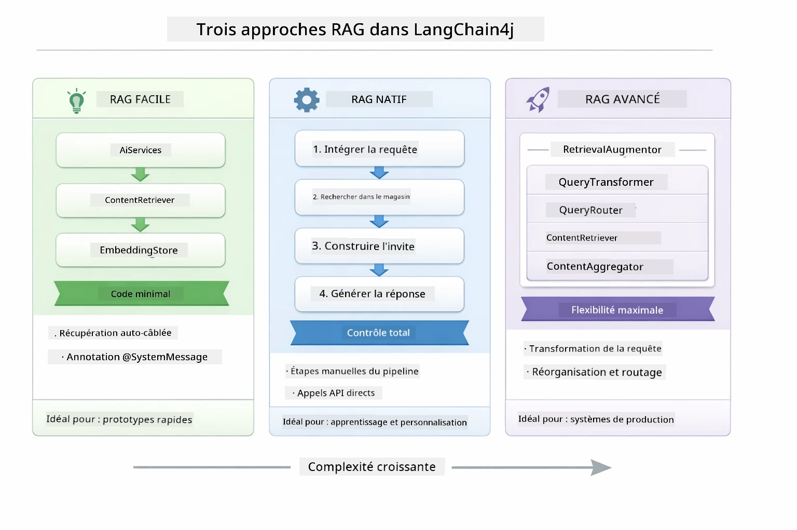
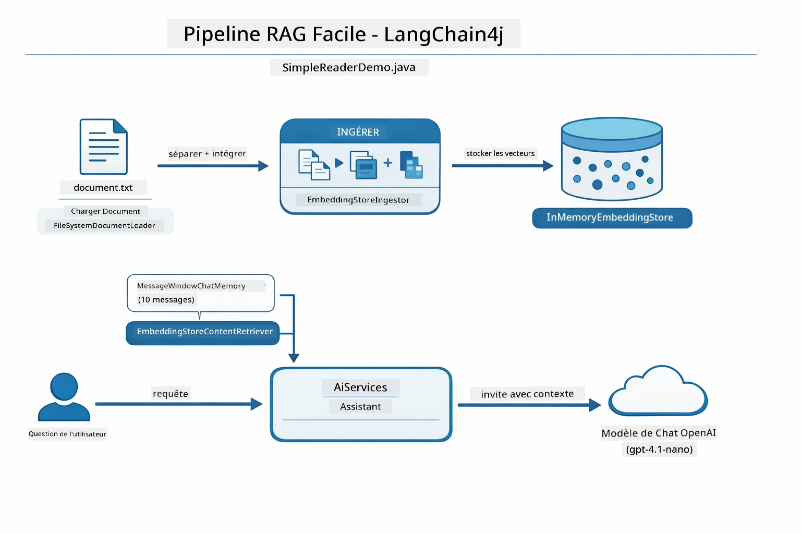
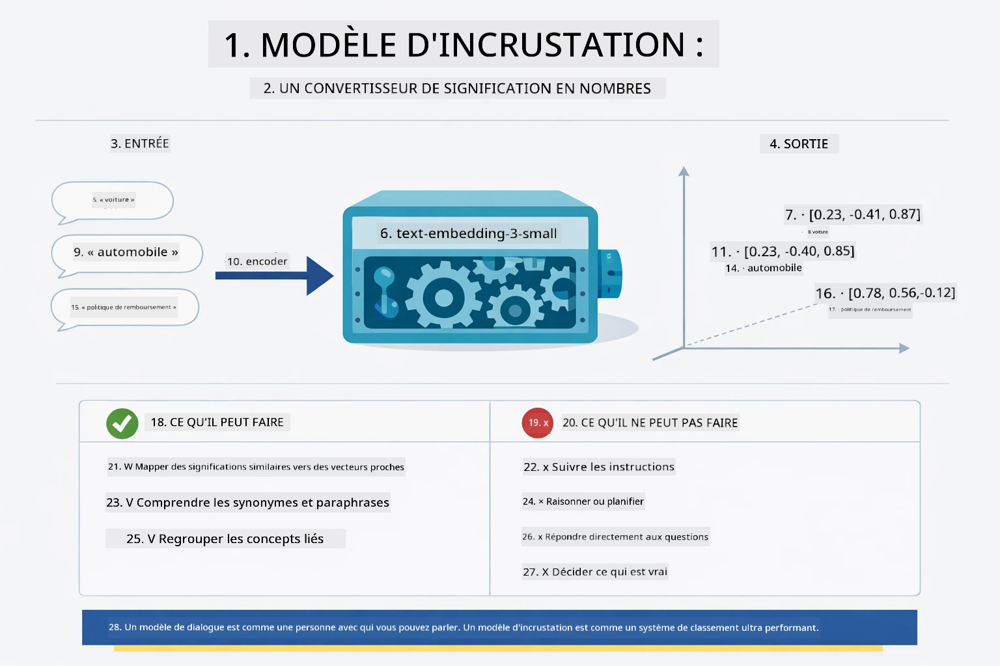
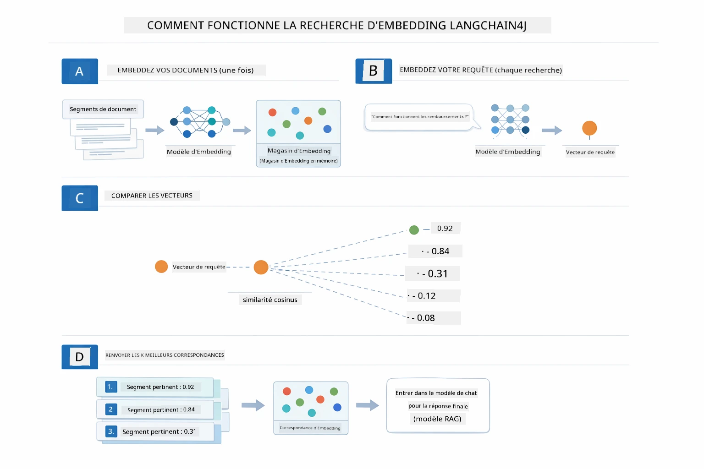
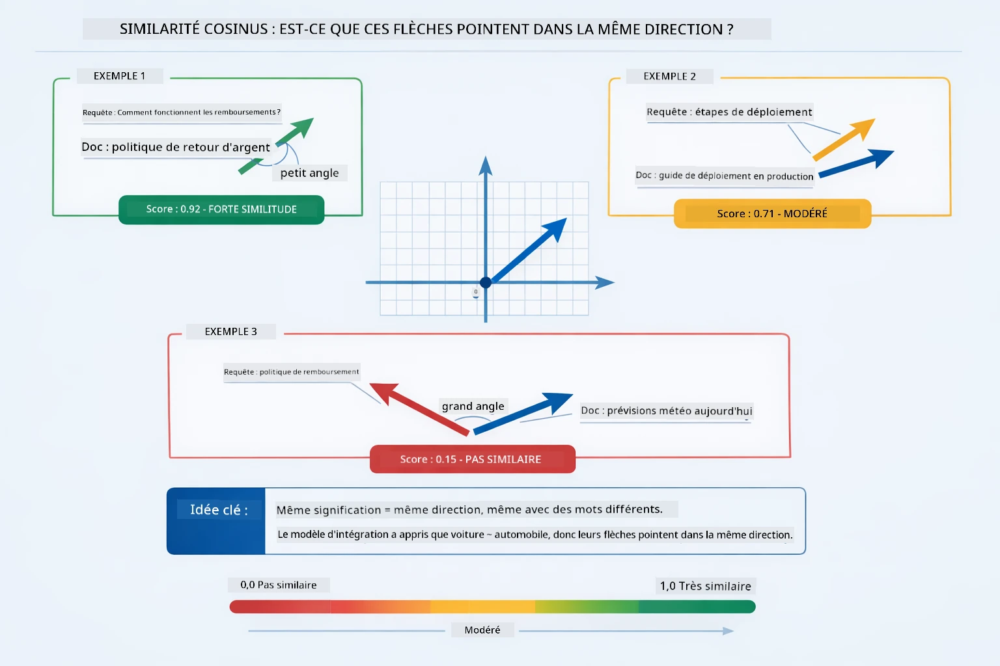
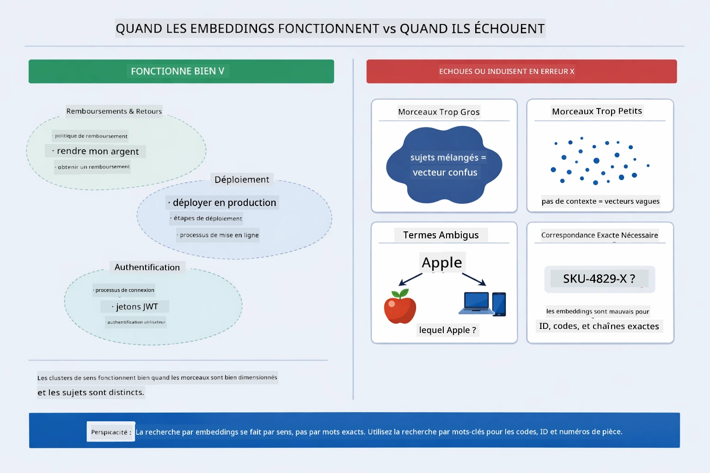

# Module 03 : RAG (Génération Augmentée par la Recherche)

## Table des matières

- [Présentation vidéo](../../../03-rag)
- [Ce que vous apprendrez](../../../03-rag)
- [Prérequis](../../../03-rag)
- [Comprendre le RAG](../../../03-rag)
  - [Quelle approche RAG ce tutoriel utilise-t-il ?](../../../03-rag)
- [Comment ça marche](../../../03-rag)
  - [Traitement des documents](../../../03-rag)
  - [Création d’embeddings](../../../03-rag)
  - [Recherche sémantique](../../../03-rag)
  - [Génération de réponses](../../../03-rag)
- [Exécuter l’application](../../../03-rag)
- [Utiliser l’application](../../../03-rag)
  - [Télécharger un document](../../../03-rag)
  - [Poser des questions](../../../03-rag)
  - [Vérifier les références sources](../../../03-rag)
  - [Expérimenter avec les questions](../../../03-rag)
- [Concepts clés](../../../03-rag)
  - [Stratégie de découpage](../../../03-rag)
  - [Scores de similarité](../../../03-rag)
  - [Stockage en mémoire](../../../03-rag)
  - [Gestion de la fenêtre contextuelle](../../../03-rag)
- [Quand le RAG compte](../../../03-rag)
- [Étapes suivantes](../../../03-rag)

## Présentation vidéo

Regardez cette session en direct qui vous explique comment démarrer avec ce module : [RAG avec LangChain4j - Session en direct](https://www.youtube.com/watch?v=_olq75ZH_eY)

## Ce que vous apprendrez

Dans les modules précédents, vous avez appris à dialoguer avec l’IA et à structurer efficacement vos prompts. Mais il existe une limitation fondamentale : les modèles de langage ne connaissent que ce qu’ils ont appris pendant leur entraînement. Ils ne peuvent pas répondre à des questions sur les politiques de votre entreprise, votre documentation projet ou toute information sur laquelle ils n’ont pas été formés.

Le RAG (Génération Augmentée par la Recherche) résout ce problème. Plutôt que d’essayer d’apprendre vos informations au modèle (ce qui est coûteux et peu pratique), vous lui donnez la capacité de rechercher dans vos documents. Lorsqu’on pose une question, le système trouve les informations pertinentes et les intègre dans le prompt. Le modèle répond alors en se basant sur ce contexte récupéré.

Pensez au RAG comme à donner au modèle une bibliothèque de référence. Quand vous posez une question, le système :

1. **Requête utilisateur** – Vous posez une question  
2. **Embedding** – Convertit votre question en vecteur  
3. **Recherche vectorielle** – Trouve des morceaux de documents similaires  
4. **Assemblage du contexte** – Ajoute les morceaux pertinents au prompt  
5. **Réponse** – Le LLM génère une réponse basée sur ce contexte

Cela ancre les réponses du modèle dans vos données réelles au lieu de se fier uniquement à ses connaissances d’entraînement ou d’inventer des réponses.

## Prérequis

- Avoir complété le [Module 00 - Démarrage rapide](../00-quick-start/README.md) (pour l’exemple Easy RAG mentionné ci-dessus)  
- Avoir complété le [Module 01 - Introduction](../01-introduction/README.md) (ressources Azure OpenAI déployées, y compris le modèle d’embedding `text-embedding-3-small`)  
- Fichier `.env` dans le répertoire racine avec les identifiants Azure (créé par `azd up` dans le Module 01)

> **Note :** Si vous n’avez pas encore terminé le Module 01, suivez d’abord les instructions de déploiement là-bas. La commande `azd up` déploie à la fois le modèle de chat GPT et le modèle d’embedding utilisé par ce module.

## Comprendre le RAG

Le schéma ci-dessous illustre le concept central : au lieu de se fier uniquement aux données d’entraînement du modèle, le RAG lui fournit une bibliothèque de références contenant vos documents à consulter avant de générer chaque réponse.


*Ce schéma montre la différence entre un LLM standard (qui devine à partir des données d’entraînement) et un LLM amélioré par RAG (qui consulte d’abord vos documents).*

Voici comment les composants s’enchaînent de bout en bout. La question de l’utilisateur passe par quatre étapes — embedding, recherche vectorielle, assemblage du contexte, et génération de réponse — chacune s’appuyant sur la précédente :


*Ce schéma montre le pipeline complet du RAG — la requête utilisateur passe par embedding, recherche vectorielle, assemblage du contexte, puis génération de la réponse.*

Le reste de ce module détaille chaque étape avec du code que vous pouvez exécuter et modifier.

### Quelle approche RAG ce tutoriel utilise-t-il ?

LangChain4j propose trois façons d’implémenter le RAG, chacune avec un niveau d’abstraction différent. Le schéma ci-dessous les compare côte à côte :



*Ce schéma compare les trois approches RAG de LangChain4j — Easy, Native, et Advanced — montrant leurs composants clés et quand les utiliser.*

| Approche | Ce qu’elle fait | Compromis |
|---|---|---|
| **Easy RAG** | Connecte tout automatiquement via `AiServices` et `ContentRetriever`. Vous annotez une interface, liez un récupérateur, et LangChain4j gère en coulisses embedding, recherche, et assemblage du prompt. | Moins de code, mais vous ne voyez pas ce qui se passe à chaque étape. |
| **Native RAG** | Vous appelez le modèle d’embedding, recherchez dans le store, construisez le prompt, et générez la réponse vous-même — une étape explicite à la fois. | Plus de code, mais chaque étape est visible et modifiable. |
| **Advanced RAG** | Utilise le framework `RetrievalAugmentor` avec des transformateurs de requêtes, routeurs, re-classeurs, et injecteurs de contenu plug-and-play pour des pipelines prêts pour la production. | Flexibilité maximale, mais complexité nettement accrue. |

**Ce tutoriel utilise l’approche Native.** Chaque étape du pipeline RAG — embedding de la requête, recherche dans le vector store, assemblage du contexte, et génération de la réponse — est explicitement écrite dans [`RagService.java`](../../../03-rag/src/main/java/com/example/langchain4j/rag/service/RagService.java). C’est intentionnel : en tant que ressource pédagogique, il est plus important que vous voyiez et compreniez chaque étape que d’avoir un code minimaliste. Une fois à l’aise avec la combinaison des pièces, vous pouvez passer à Easy RAG pour des prototypes rapides ou Advanced RAG pour des systèmes de production.

> **💡 Vous avez déjà vu Easy RAG en action ?** Le [module Démarrage rapide](../00-quick-start/README.md) inclut un exemple de Q&R Document ([`SimpleReaderDemo.java`](../../../00-quick-start/src/main/java/com/example/langchain4j/quickstart/SimpleReaderDemo.java)) qui utilise l’approche Easy RAG — LangChain4j gère automatiquement embedding, recherche, et assemblage du prompt. Ce module fait un pas de plus en ouvrant ce pipeline pour que vous puissiez voir et contrôler chaque étape vous-même.



*Ce schéma montre le pipeline Easy RAG de `SimpleReaderDemo.java`. Comparez-le à l’approche Native utilisée dans ce module : Easy RAG cache embedding, récupération et assemblage du prompt derrière `AiServices` et `ContentRetriever` — vous chargez un document, liez un récupérateur, et obtenez des réponses. L’approche Native de ce module ouvre le pipeline pour que vous appeliez chaque étape (embedding, recherche, assemblage du contexte, génération) vous-même, avec pleine visibilité et contrôle.*

## Comment ça marche

Le pipeline RAG dans ce module se divise en quatre étapes qui s’exécutent en séquence chaque fois qu’un utilisateur pose une question. D’abord, un document téléchargé est **analysé et découpé en morceaux** gérables. Ces morceaux sont ensuite convertis en **embeddings vectoriels** et stockés pour comparaison mathématique. Lorsqu'une requête arrive, le système effectue une **recherche sémantique** pour trouver les morceaux les plus pertinents, puis les transmet comme contexte au LLM pour la **génération de réponse**. Les sections ci-dessous détaillent chaque étape avec le code réel et des schémas. Regardons la première étape.

### Traitement des documents

[DocumentService.java](../../../03-rag/src/main/java/com/example/langchain4j/rag/service/DocumentService.java)

Lorsque vous téléversez un document, le système l’analyse (PDF ou texte simple), ajoute des métadonnées telles que le nom de fichier, puis le découpe en morceaux — petites portions qui tiennent confortablement dans la fenêtre contextuelle du modèle. Ces morceaux se chevauchent légèrement pour ne pas perdre de contexte aux limites.

```java
// Analyser le fichier téléchargé et l'encapsuler dans un Document LangChain4j
Document document = Document.from(content, metadata);

// Diviser en blocs de 300 jetons avec un chevauchement de 30 jetons
DocumentSplitter splitter = DocumentSplitters
    .recursive(300, 30);

List<TextSegment> segments = splitter.split(document);
```
  
Le schéma ci-dessous montre comment cela se passe visuellement. Notez que chaque morceau partage certains tokens avec ses voisins — le chevauchement de 30 tokens garantit qu’aucun contexte important ne se perd entre les mailles du filet :


*Ce schéma montre un document découpé en morceaux de 300 tokens avec un chevauchement de 30 tokens, préservant le contexte aux limites des morceaux.*

> **🤖 Essayez avec [GitHub Copilot](https://github.com/features/copilot) Chat :** Ouvrez [`DocumentService.java`](../../../03-rag/src/main/java/com/example/langchain4j/rag/service/DocumentService.java) et demandez :  
> - « Comment LangChain4j découpe-t-il les documents en morceaux et pourquoi le chevauchement est-il important ? »  
> - « Quelle est la taille optimale des morceaux pour différents types de documents et pourquoi ? »  
> - « Comment gérer les documents en plusieurs langues ou avec une mise en forme spéciale ? »

### Création d’embeddings

[LangChainRagConfig.java](../../../03-rag/src/main/java/com/example/langchain4j/rag/config/LangChainRagConfig.java)

Chaque morceau est converti en une représentation numérique appelée embedding — essentiellement un convertisseur de sens en nombres. Le modèle d’embedding n’est pas « intelligent » comme un modèle de chat ; il ne suit pas d’instructions, ne raisonne pas, ni ne répond aux questions. Ce qu’il fait, c’est mapper le texte dans un espace mathématique où les sens similaires se rapprochent — « voiture » proche de « automobile », « politique de remboursement » proche de « rendre mon argent ». Pensez à un modèle de chat comme une personne avec qui vous pouvez parler ; un modèle d’embedding est un système de classement ultra-efficace.



*Ce schéma montre comment un modèle d’embedding convertit le texte en vecteurs numériques, plaçant des significations similaires — comme « voiture » et « automobile » — près les unes des autres dans l’espace vectoriel.*

```java
@Bean
public EmbeddingModel embeddingModel() {
    return OpenAiOfficialEmbeddingModel.builder()
        .baseUrl(azureOpenAiEndpoint)
        .apiKey(azureOpenAiKey)
        .modelName(azureEmbeddingDeploymentName)
        .build();
}

EmbeddingStore<TextSegment> embeddingStore = 
    new InMemoryEmbeddingStore<>();
```
  
Le diagramme de classes ci-dessous montre les deux flux séparés dans un pipeline RAG et les classes LangChain4j qui les implémentent. Le **flux d’ingestion** (exécuté une fois au moment du téléchargement) découpe le document, embedde les morceaux, et les stocke via `.addAll()`. Le **flux de requête** (exécuté à chaque question utilisateur) embedde la question, recherche dans le store via `.search()`, et transmet le contexte trouvé au modèle de chat. Les deux flux se rejoignent sur l’interface commune `EmbeddingStore<TextSegment>` :


*Ce schéma montre les deux flux dans un pipeline RAG — ingestion et requête — et comment ils se connectent via un EmbeddingStore partagé.*

Une fois les embeddings stockés, les contenus similaires se regroupent naturellement dans l’espace vectoriel. La visualisation ci-dessous montre comment les documents portant sur des sujets liés deviennent des points rapprochés, ce qui rend la recherche sémantique possible :


*Cette visualisation montre comment des documents liés se regroupent en 3D dans l’espace vectoriel, avec des sujets comme Documentation technique, Règles métier, et FAQ formant des groupes distincts.*

Quand un utilisateur recherche, le système suit quatre étapes : embedder les documents une fois, embedder la requête à chaque recherche, comparer le vecteur de la requête à tous les vecteurs stockés avec la similarité cosinus, et retourner les K meilleurs morceaux. Le schéma ci-dessous explique chaque étape et les classes LangChain4j impliquées :



*Ce schéma montre le processus de recherche en 4 étapes : embedder les documents, embedder la requête, comparer les vecteurs avec similarité cosinus, et retourner les meilleurs résultats.*

### Recherche sémantique

[RagService.java](../../../03-rag/src/main/java/com/example/langchain4j/rag/service/RagService.java)

Quand vous posez une question, votre question devient aussi un embedding. Le système compare l’embedding de votre question à tous les embeddings des morceaux de documents. Il trouve les morceaux ayant les significations les plus similaires — pas seulement des mots-clés correspondants, mais une vraie similarité sémantique.

```java
Embedding queryEmbedding = embeddingModel.embed(question).content();

EmbeddingSearchRequest searchRequest = EmbeddingSearchRequest.builder()
    .queryEmbedding(queryEmbedding)
    .maxResults(5)
    .minScore(0.5)
    .build();

EmbeddingSearchResult<TextSegment> searchResult = embeddingStore.search(searchRequest);
List<EmbeddingMatch<TextSegment>> matches = searchResult.matches();

for (EmbeddingMatch<TextSegment> match : matches) {
    String relevantText = match.embedded().text();
    double score = match.score();
}
```
  
Le schéma ci-dessous contraste la recherche sémantique avec la recherche par mot-clé classique. Une recherche par mot-clé sur « véhicule » ne trouve pas un morceau parlant de « voitures et camions », mais la recherche sémantique comprend qu’ils signifient la même chose et le retourne comme correspondance très pertinente :


*Ce schéma compare la recherche basée sur les mots-clés avec la recherche sémantique, montrant comment la recherche sémantique récupère du contenu conceptuellement lié même si les mots-clés exacts diffèrent.*

Sous le capot, la similarité est mesurée avec la similarité cosinus — en demandant essentiellement « est-ce que ces deux flèches pointent dans la même direction ? » Deux morceaux peuvent utiliser des mots complètement différents, mais s’ils ont la même signification leurs vecteurs pointent dans la même direction et ont un score proche de 1,0 :



*Ce schéma illustre la similarité cosinus comme étant l’angle entre deux vecteurs d’embedding — des vecteurs plus alignés obtiennent un score proche de 1,0, indiquant une similarité sémantique plus élevée.*
> **🤖 Essayez avec [GitHub Copilot](https://github.com/features/copilot) Chat :** Ouvrez [`RagService.java`](../../../03-rag/src/main/java/com/example/langchain4j/rag/service/RagService.java) et demandez :
> - "Comment fonctionne la recherche de similarité avec les embeddings et qu'est-ce qui détermine le score ?"
> - "Quel seuil de similarité devrais-je utiliser et comment cela influence-t-il les résultats ?"
> - "Comment gérer les cas où aucun document pertinent n'est trouvé ?"

### Génération de réponse

[RagService.java](../../../03-rag/src/main/java/com/example/langchain4j/rag/service/RagService.java)

Les morceaux les plus pertinents sont assemblés dans une invite structurée qui inclut des instructions explicites, le contexte récupéré et la question de l'utilisateur. Le modèle lit ces morceaux spécifiques et répond en se basant sur ces informations — il ne peut utiliser que ce qui est devant lui, ce qui évite les hallucinations.

```java
String context = matches.stream()
    .map(match -> match.embedded().text())
    .collect(Collectors.joining("\n\n"));

String prompt = String.format("""
    Answer the question based on the following context.
    If the answer cannot be found in the context, say so.

    Context:
    %s

    Question: %s

    Answer:""", context, request.question());

String answer = chatModel.chat(prompt);
```

Le schéma ci-dessous montre cet assemblage en action — les morceaux avec les meilleurs scores de l'étape de recherche sont injectés dans le modèle d'invite, et `OpenAiOfficialChatModel` génère une réponse fondée :


*Ce schéma montre comment les morceaux avec les meilleurs scores sont assemblés dans une invite structurée, permettant au modèle de générer une réponse fondée à partir de vos données.*

## Exécuter l'application

**Vérifiez le déploiement :**

Assurez-vous que le fichier `.env` existe à la racine avec les identifiants Azure (créés lors du Module 01) :

**Bash :**
```bash
cat ../.env  # Devrait afficher AZURE_OPENAI_ENDPOINT, API_KEY, DEPLOYMENT
```

**PowerShell :**
```powershell
Get-Content ..\.env  # Devrait afficher AZURE_OPENAI_ENDPOINT, API_KEY, DEPLOYMENT
```

**Démarrez l'application :**

> **Note :** Si vous avez déjà démarré toutes les applications avec `./start-all.sh` du Module 01, ce module fonctionne déjà sur le port 8081. Vous pouvez ignorer les commandes de démarrage ci-dessous et accéder directement à http://localhost:8081.

**Option 1 : Utilisation du Spring Boot Dashboard (recommandé pour les utilisateurs VS Code)**

Le conteneur de développement inclut l'extension Spring Boot Dashboard, qui fournit une interface visuelle pour gérer toutes les applications Spring Boot. Vous la trouverez dans la barre d'activités à gauche de VS Code (cherchez l'icône Spring Boot).

Depuis le Spring Boot Dashboard, vous pouvez :
- Voir toutes les applications Spring Boot disponibles dans l'espace de travail
- Démarrer/arrêter les applications d'un simple clic
- Visualiser les logs des applications en temps réel
- Surveiller le statut des applications

Cliquez simplement sur le bouton lecture à côté de "rag" pour lancer ce module, ou démarrez tous les modules en même temps.


*Cette capture montre le tableau de bord Spring Boot dans VS Code, où vous pouvez démarrer, arrêter et surveiller les applications visuellement.*

**Option 2 : Utilisation des scripts shell**

Démarrez toutes les applications web (modules 01-04) :

**Bash :**
```bash
cd ..  # Depuis le répertoire racine
./start-all.sh
```

**PowerShell :**
```powershell
cd ..  # Depuis le répertoire racine
.\start-all.ps1
```

Ou démarrez seulement ce module :

**Bash :**
```bash
cd 03-rag
./start.sh
```

**PowerShell :**
```powershell
cd 03-rag
.\start.ps1
```

Les deux scripts chargent automatiquement les variables d'environnement à partir du fichier `.env` racine et compileront les JARs s'ils n'existent pas.

> **Note :** Si vous préférez compiler tous les modules manuellement avant de démarrer :
>
> **Bash :**
> ```bash
> cd ..  # Go to root directory
> mvn clean package -DskipTests
> ```
>
> **PowerShell :**
> ```powershell
> cd ..  # Go to root directory
> mvn clean package -DskipTests
> ```

Ouvrez http://localhost:8081 dans votre navigateur.

**Pour arrêter :**

**Bash :**
```bash
./stop.sh  # Ce module uniquement
# Ou
cd .. && ./stop-all.sh  # Tous les modules
```

**PowerShell :**
```powershell
.\stop.ps1  # Ce module seulement
# Ou
cd ..; .\stop-all.ps1  # Tous les modules
```

## Utilisation de l'application

L'application offre une interface web pour le téléchargement de documents et la pose de questions.

<a href="images/rag-homepage.png"></a>

*Cette capture montre l'interface de l'application RAG où vous téléchargez des documents et posez des questions.*

### Télécharger un document

Commencez par télécharger un document — les fichiers TXT sont les meilleurs pour les tests. Un `sample-document.txt` est fourni dans ce répertoire, contenant des informations sur les fonctionnalités de LangChain4j, l'implémentation RAG et les meilleures pratiques — parfait pour tester le système.

Le système traite votre document, le découpe en morceaux, et crée des embeddings pour chaque morceau. Cela se fait automatiquement lors du téléchargement.

### Poser des questions

Posez maintenant des questions spécifiques sur le contenu du document. Essayez quelque chose de factuel clairement indiqué dans le document. Le système recherche les morceaux pertinents, les inclut dans l'invite, puis génère une réponse.

### Vérifiez les références de source

Remarquez que chaque réponse inclut des références de source avec des scores de similarité. Ces scores (de 0 à 1) montrent à quel point chaque morceau correspondait à votre question. Des scores plus élevés signifient de meilleures correspondances. Cela vous permet de vérifier la réponse par rapport à la source.

<a href="images/rag-query-results.png"></a>

*Cette capture montre les résultats de la requête avec la réponse générée, les références sources et les scores de pertinence pour chaque morceau récupéré.*

### Expérimentez avec les questions

Essayez différents types de questions :
- Faits spécifiques : "Quel est le sujet principal ?"
- Comparaisons : "Quelle est la différence entre X et Y ?"
- Résumés : "Résumez les points clés à propos de Z"

Observez comment les scores de pertinence changent selon la correspondance entre votre question et le contenu du document.

## Concepts clés

### Stratégie de découpage en morceaux

Les documents sont découpés en morceaux de 300 tokens avec un chevauchement de 30 tokens. Cet équilibre garantit que chaque morceau a suffisamment de contexte pour être significatif tout en restant assez petit pour inclure plusieurs morceaux dans une invite.

### Scores de similitude

Chaque morceau récupéré est accompagné d'un score de similarité entre 0 et 1, indiquant son degré de correspondance avec la question de l'utilisateur. Le schéma ci-dessous visualise les plages de scores et comment le système les utilise pour filtrer les résultats :


*Ce schéma montre les plages de scores de 0 à 1, avec un seuil minimum de 0,5 filtrant les morceaux non pertinents.*

Les scores vont de 0 à 1 :
- 0,7-1,0 : Très pertinent, correspondance exacte
- 0,5-0,7 : Pertinent, bon contexte
- En dessous de 0,5 : Filtré, trop dissemblable

Le système récupère uniquement les morceaux au-dessus du seuil minimum pour garantir la qualité.

Les embeddings fonctionnent bien quand les significations forment des clusters clairs, mais ont leurs limites. Le schéma ci-dessous montre les modes d’échec courants — des morceaux trop volumineux produisent des vecteurs flous, des morceaux trop petits manquent de contexte, des termes ambigus pointent vers plusieurs clusters, et les recherches exactes (ID, numéros de pièces) ne fonctionnent pas du tout avec les embeddings :



*Ce schéma montre les modes d’échec courants des embeddings : morceaux trop grands, trop petits, termes ambigus pointant vers plusieurs clusters, et recherches exactes comme les IDs.*

### Stockage en mémoire

Ce module utilise un stockage en mémoire pour plus de simplicité. Lorsque vous redémarrez l’application, les documents téléchargés sont perdus. Les systèmes en production utilisent des bases de données vectorielles persistantes comme Qdrant ou Azure AI Search.

### Gestion de la fenêtre de contexte

Chaque modèle a une fenêtre de contexte maximale. Vous ne pouvez pas inclure tous les morceaux d’un document volumineux. Le système récupère les N morceaux les plus pertinents (par défaut 5) pour rester dans les limites tout en fournissant suffisamment de contexte pour des réponses précises.

## Quand RAG est utile

RAG n’est pas toujours la bonne approche. Le guide décisionnel ci-dessous vous aide à déterminer quand RAG apporte de la valeur par rapport aux approches plus simples — comme inclure le contenu directement dans l’invite ou se fier aux connaissances intégrées du modèle :


*Ce schéma montre un guide décisionnel pour savoir quand RAG apporte de la valeur par rapport aux approches plus simples.*

**Utilisez RAG lorsque :**
- Vous répondez à des questions sur des documents propriétaires
- Les informations changent fréquemment (politiques, prix, spécifications)
- La précision nécessite une attribution des sources
- Le contenu est trop volumineux pour tenir dans une seule invite
- Vous avez besoin de réponses vérifiables et fondées

**N’utilisez pas RAG lorsque :**
- Les questions nécessitent des connaissances générales que le modèle possède déjà
- Des données en temps réel sont nécessaires (RAG fonctionne sur des documents chargés)
- Le contenu est suffisamment petit pour être inclus directement dans les invites

## Prochaines étapes

**Module suivant :** [04-tools - Agents IA avec outils](../04-tools/README.md)

---

**Navigation :** [← Précédent : Module 02 - Ingénierie des invites](../02-prompt-engineering/README.md) | [Retour à l’accueil](../README.md) | [Suivant : Module 04 - Outils →](../04-tools/README.md)

---

<!-- CO-OP TRANSLATOR DISCLAIMER START -->
**Avertissement** :  
Ce document a été traduit à l’aide du service de traduction automatique [Co-op Translator](https://github.com/Azure/co-op-translator). Bien que nous fassions de notre mieux pour assurer l’exactitude, veuillez noter que les traductions automatisées peuvent contenir des erreurs ou des inexactitudes. Le document original dans sa langue d’origine doit être considéré comme la source faisant foi. Pour toute information critique, il est recommandé de recourir à une traduction professionnelle réalisée par un humain. Nous déclinons toute responsabilité en cas de malentendus ou de mauvaises interprétations résultant de l’utilisation de cette traduction.
<!-- CO-OP TRANSLATOR DISCLAIMER END -->