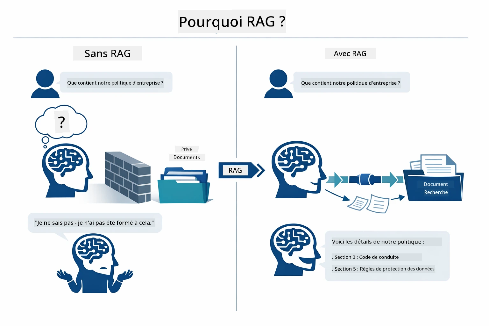
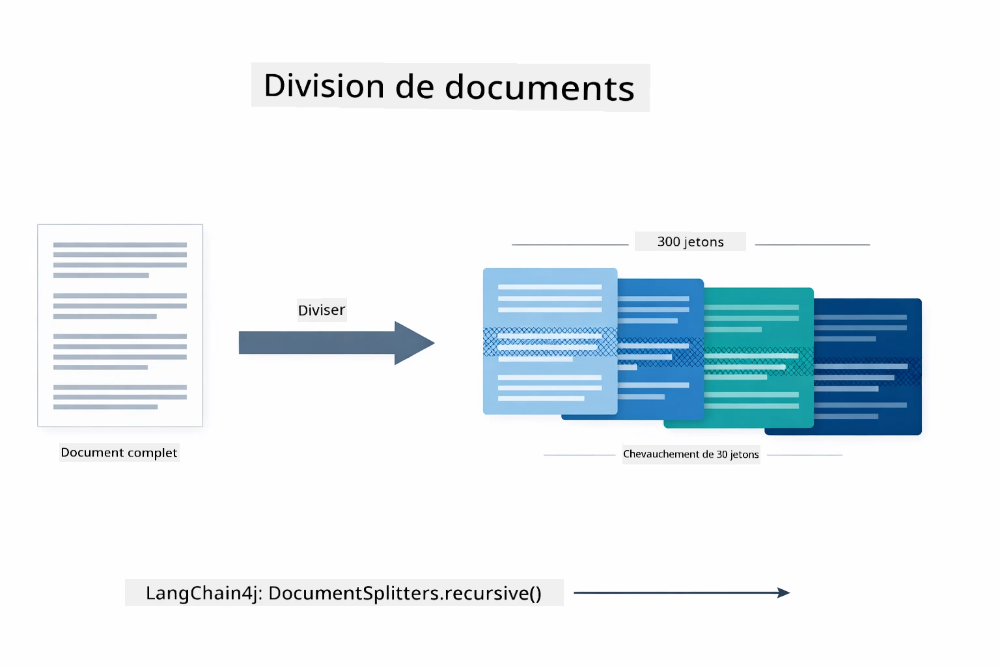
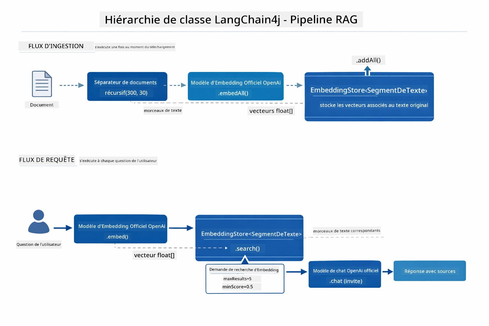
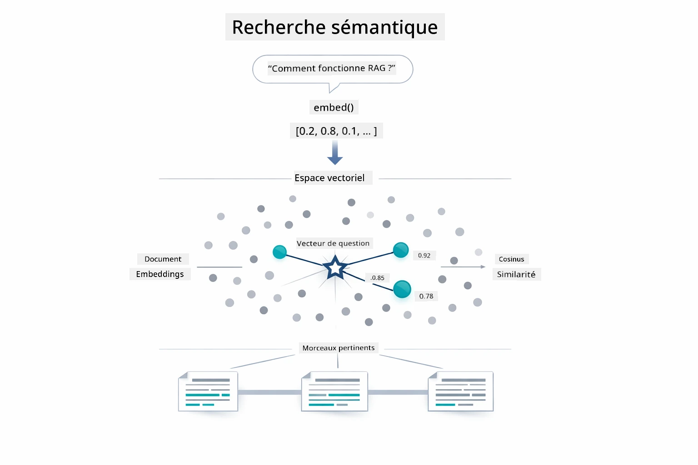
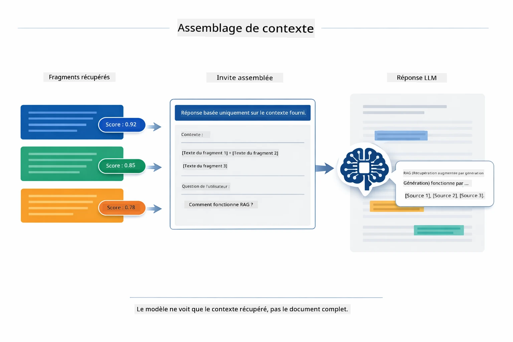
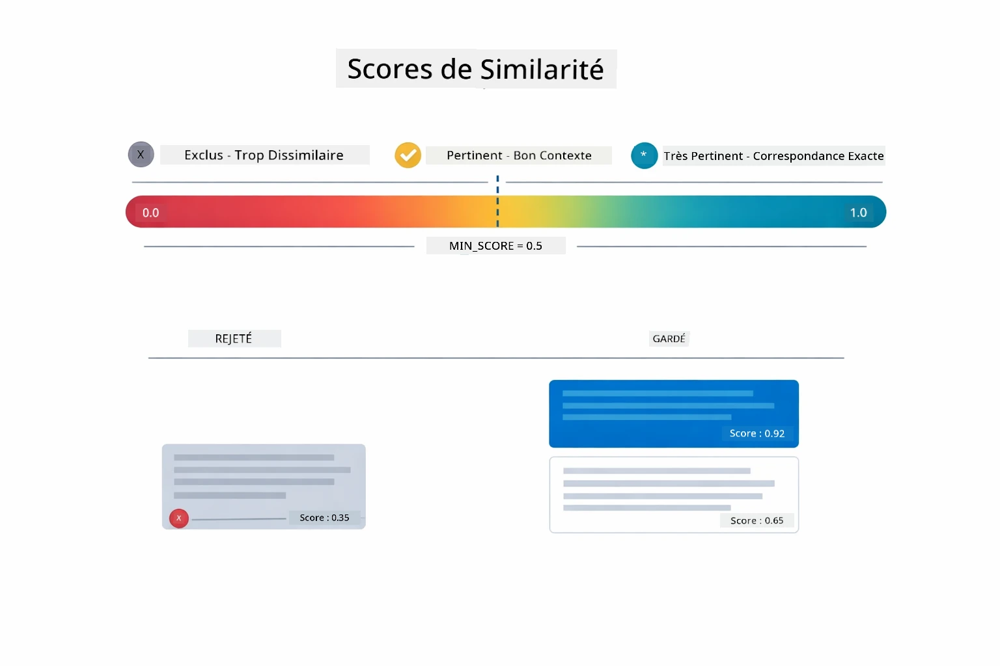
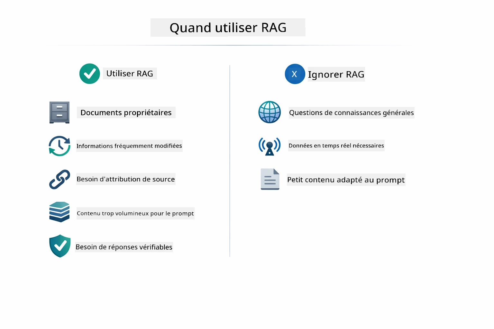

# Module 03 : RAG (Retrieval-Augmented Generation)

## Table des matières

- [Ce que vous allez apprendre](../../../03-rag)
- [Comprendre RAG](../../../03-rag)
- [Prérequis](../../../03-rag)
- [Comment ça fonctionne](../../../03-rag)
  - [Traitement des documents](../../../03-rag)
  - [Création des embeddings](../../../03-rag)
  - [Recherche sémantique](../../../03-rag)
  - [Génération de réponses](../../../03-rag)
- [Exécuter l’application](../../../03-rag)
- [Utilisation de l’application](../../../03-rag)
  - [Télécharger un document](../../../03-rag)
  - [Poser des questions](../../../03-rag)
  - [Vérifier les références sources](../../../03-rag)
  - [Expérimenter avec les questions](../../../03-rag)
- [Concepts clés](../../../03-rag)
  - [Stratégie de découpage](../../../03-rag)
  - [Scores de similarité](../../../03-rag)
  - [Stockage en mémoire](../../../03-rag)
  - [Gestion de la fenêtre de contexte](../../../03-rag)
- [Quand RAG est utile](../../../03-rag)
- [Étapes suivantes](../../../03-rag)

## Ce que vous allez apprendre

Dans les modules précédents, vous avez appris à converser avec l’IA et à structurer efficacement vos invites. Mais il existe une limitation fondamentale : les modèles de langage ne savent que ce qu’ils ont appris pendant leur entraînement. Ils ne peuvent pas répondre aux questions sur les politiques internes de votre entreprise, la documentation de votre projet, ou toute information dont ils n’ont pas été entraînés.

RAG (Retrieval-Augmented Generation) résout ce problème. Plutôt que d’essayer d’enseigner vos informations au modèle (ce qui est coûteux et peu pratique), vous lui donnez la capacité de rechercher dans vos documents. Lorsqu’une question est posée, le système trouve les informations pertinentes et les inclut dans l’invite. Le modèle répond alors en se basant sur ce contexte récupéré.

Pensez à RAG comme donnant au modèle une bibliothèque de référence. Lorsque vous posez une question, le système :

1. **Requête utilisateur** - Vous posez une question  
2. **Embedding** - Convertit votre question en vecteur  
3. **Recherche vectorielle** - Trouve des fragments de documents similaires  
4. **Assemblage du contexte** - Ajoute les fragments pertinents à l’invite  
5. **Réponse** - Le LLM génère une réponse basée sur le contexte  

Cela ancre les réponses du modèle dans vos données réelles au lieu de s’appuyer uniquement sur les connaissances d’entraînement ou produire des réponses inventées.

## Comprendre RAG

Le schéma ci-dessous illustre le concept central : au lieu de s’appuyer uniquement sur les données d’entraînement du modèle, RAG lui fournit une bibliothèque de référence de vos documents à consulter avant de générer chaque réponse.



Voici comment les différentes parties s’enchaînent de bout en bout. Une question d’utilisateur traverse quatre étapes — embedding, recherche vectorielle, assemblage du contexte, et génération de réponse — chacune s’appuyant sur la précédente :


Le reste de ce module explique chaque étape en détail, avec du code que vous pouvez exécuter et modifier.

## Prérequis

- Module 01 complété (ressources Azure OpenAI déployées)  
- Fichier `.env` à la racine avec les identifiants Azure (créé via `azd up` dans le Module 01)  

> **Note :** Si vous n’avez pas encore terminé le Module 01, suivez d’abord les instructions de déploiement correspondantes.

## Comment ça fonctionne

### Traitement des documents

[DocumentService.java](../../../03-rag/src/main/java/com/example/langchain4j/rag/service/DocumentService.java)

Lorsque vous téléchargez un document, le système l’analyse (PDF ou texte brut), y attache des métadonnées comme le nom du fichier, puis le découpe en fragments — des morceaux plus petits qui tiennent confortablement dans la fenêtre de contexte du modèle. Ces fragments se chevauchent légèrement pour ne pas perdre de contexte aux frontières.

```java
// Analyser le fichier téléchargé et l'encapsuler dans un Document LangChain4j
Document document = Document.from(content, metadata);

// Diviser en morceaux de 300 tokens avec un chevauchement de 30 tokens
DocumentSplitter splitter = DocumentSplitters
    .recursive(300, 30);

List<TextSegment> segments = splitter.split(document);
```
  
Le schéma ci-dessous illustre visuellement ce fonctionnement. Notez comment chaque fragment partage certains tokens avec ses voisins — le chevauchement de 30 tokens garantit qu’aucun contexte important ne tombe entre les mailles du filet :



> **🤖 Essayez avec [GitHub Copilot](https://github.com/features/copilot) Chat :** Ouvrez [`DocumentService.java`](../../../03-rag/src/main/java/com/example/langchain4j/rag/service/DocumentService.java) et demandez :  
> - "Comment LangChain4j découpe-t-il les documents en fragments et pourquoi le chevauchement est-il important ?"  
> - "Quelle est la taille optimale des fragments pour différents types de documents et pourquoi ?"  
> - "Comment gérer les documents multilingues ou avec une mise en forme spéciale ?"

### Création des embeddings

[LangChainRagConfig.java](../../../03-rag/src/main/java/com/example/langchain4j/rag/config/LangChainRagConfig.java)

Chaque fragment est converti en une représentation numérique appelée embedding — essentiellement une empreinte mathématique qui capture le sens du texte. Des textes similaires produisent des embeddings similaires.

```java
@Bean
public EmbeddingModel embeddingModel() {
    return OpenAiOfficialEmbeddingModel.builder()
        .baseUrl(azureOpenAiEndpoint)
        .apiKey(azureOpenAiKey)
        .modelName(azureEmbeddingDeploymentName)
        .build();
}

EmbeddingStore<TextSegment> embeddingStore = 
    new InMemoryEmbeddingStore<>();
```
  
Le diagramme de classes ci-dessous montre comment ces composants LangChain4j sont connectés. `OpenAiOfficialEmbeddingModel` convertit le texte en vecteurs, `InMemoryEmbeddingStore` stocke les vecteurs avec les données originales du `TextSegment`, et `EmbeddingSearchRequest` contrôle les paramètres de récupération comme `maxResults` et `minScore` :



Une fois les embeddings stockés, les contenus similaires se regroupent naturellement dans l’espace vectoriel. La visualisation ci-dessous montre comment les documents traitant de sujets connexes deviennent des points proches, ce qui rend la recherche sémantique possible :


### Recherche sémantique

[RagService.java](../../../03-rag/src/main/java/com/example/langchain4j/rag/service/RagService.java)

Lorsque vous posez une question, celle-ci est aussi convertie en embedding. Le système compare l’embedding de votre question avec tous ceux des fragments de documents. Il trouve les fragments aux sens les plus proches — pas seulement des mots-clés correspondants, mais une réelle similarité sémantique.

```java
Embedding queryEmbedding = embeddingModel.embed(question).content();

EmbeddingSearchRequest searchRequest = EmbeddingSearchRequest.builder()
    .queryEmbedding(queryEmbedding)
    .maxResults(5)
    .minScore(0.5)
    .build();

EmbeddingSearchResult<TextSegment> searchResult = embeddingStore.search(searchRequest);
List<EmbeddingMatch<TextSegment>> matches = searchResult.matches();

for (EmbeddingMatch<TextSegment> match : matches) {
    String relevantText = match.embedded().text();
    double score = match.score();
}
```
  
Le diagramme ci-dessous compare la recherche sémantique à la recherche traditionnelle par mots-clés. Une recherche par mot-clé sur « vehicle » rate un fragment parlant de « cars and trucks », mais la recherche sémantique comprend qu’ils signifient la même chose et le retourne comme une correspondance de haute qualité :



> **🤖 Essayez avec [GitHub Copilot](https://github.com/features/copilot) Chat :** Ouvrez [`RagService.java`](../../../03-rag/src/main/java/com/example/langchain4j/rag/service/RagService.java) et demandez :  
> - "Comment fonctionne la recherche de similarité avec les embeddings et qu’est-ce qui détermine le score ?"  
> - "Quel seuil de similarité devrais-je utiliser et comment cela affecte-t-il les résultats ?"  
> - "Comment gérer les cas où aucun document pertinent n’est trouvé ?"

### Génération de réponses

[RagService.java](../../../03-rag/src/main/java/com/example/langchain4j/rag/service/RagService.java)

Les fragments les plus pertinents sont assemblés dans une invite structurée qui contient des instructions explicites, le contexte récupéré, et la question de l’utilisateur. Le modèle lit ces fragments spécifiques et répond en se basant uniquement sur ces informations — il ne peut utiliser que ce qu’il a devant lui, ce qui évite les hallucinations.

```java
String context = matches.stream()
    .map(match -> match.embedded().text())
    .collect(Collectors.joining("\n\n"));

String prompt = String.format("""
    Answer the question based on the following context.
    If the answer cannot be found in the context, say so.

    Context:
    %s

    Question: %s

    Answer:""", context, request.question());

String answer = chatModel.chat(prompt);
```
  
Le schéma ci-dessous montre cet assemblage en action — les fragments les mieux notés lors de la recherche sont injectés dans le modèle de prompt, et `OpenAiOfficialChatModel` génère une réponse ancrée :



## Exécuter l’application

**Vérifier le déploiement :**

Assurez-vous que le fichier `.env` existe à la racine avec les identifiants Azure (créé lors du Module 01) :  
```bash
cat ../.env  # Devrait afficher AZURE_OPENAI_ENDPOINT, API_KEY, DEPLOYMENT
```
  
**Démarrer l’application :**

> **Note :** Si vous avez déjà démarré toutes les applications avec `./start-all.sh` depuis le Module 01, ce module est déjà en cours d’exécution sur le port 8081. Vous pouvez ignorer les commandes de démarrage ci-dessous et accéder directement à http://localhost:8081.

**Option 1 : Utilisation du Spring Boot Dashboard (recommandé pour les utilisateurs de VS Code)**

Le conteneur de développement inclut l’extension Spring Boot Dashboard, qui fournit une interface visuelle pour gérer toutes les applications Spring Boot. Vous la trouverez dans la barre d’activités à gauche dans VS Code (cherchez l’icône Spring Boot).

Depuis le Spring Boot Dashboard, vous pouvez :  
- Voir toutes les applications Spring Boot disponibles dans l’espace de travail  
- Démarrer/arrêter les applications en un clic  
- Consulter les logs en temps réel  
- Surveiller l’état des applications  

Cliquez simplement sur le bouton de lecture à côté de "rag" pour lancer ce module, ou démarrez tous les modules en même temps.


**Option 2 : Utilisation des scripts shell**

Démarrez toutes les applications web (modules 01-04) :

**Bash :**  
```bash
cd ..  # Depuis le répertoire racine
./start-all.sh
```
  
**PowerShell :**  
```powershell
cd ..  # Depuis le répertoire racine
.\start-all.ps1
```
  
Ou démarrez uniquement ce module :

**Bash :**  
```bash
cd 03-rag
./start.sh
```
  
**PowerShell :**  
```powershell
cd 03-rag
.\start.ps1
```
  
Les deux scripts chargent automatiquement les variables d’environnement depuis le fichier `.env` à la racine et compilent les JARs s’ils n’existent pas.

> **Note :** Si vous préférez compiler manuellement tous les modules avant de démarrer :  
>  
> **Bash :**  
> ```bash
> cd ..  # Go to root directory
> mvn clean package -DskipTests
> ```
>  
> **PowerShell :**  
> ```powershell
> cd ..  # Go to root directory
> mvn clean package -DskipTests
> ```
  
Ouvrez http://localhost:8081 dans votre navigateur.

**Pour arrêter :**

**Bash :**  
```bash
./stop.sh  # Ce module uniquement
# Ou
cd .. && ./stop-all.sh  # Tous les modules
```
  
**PowerShell :**  
```powershell
.\stop.ps1  # Ce module seulement
# Ou
cd ..; .\stop-all.ps1  # Tous les modules
```
  
## Utilisation de l’application

L’application fournit une interface web pour le téléchargement de documents et la pose de questions.

<a href="images/rag-homepage.png"></a>

*Interface de l’application RAG – téléchargez des documents et posez des questions*

### Télécharger un document

Commencez par télécharger un document – les fichiers TXT sont les plus adaptés pour les tests. Un fichier `sample-document.txt` est fourni dans ce répertoire, contenant des informations sur les fonctionnalités de LangChain4j, l’implémentation de RAG, et les meilleures pratiques – idéal pour tester le système.

Le système traite votre document, le découpe en fragments, et crée des embeddings pour chaque fragment. Cela se fait automatiquement à l’importation.

### Poser des questions

Posez maintenant des questions spécifiques sur le contenu du document. Essayez quelque chose de factuel et clairement énoncé dans le document. Le système recherche les fragments pertinents, les inclut dans l’invite, et génère une réponse.

### Vérifier les références sources

Chaque réponse inclut des références sources avec des scores de similarité. Ces scores (de 0 à 1) indiquent la pertinence de chaque fragment par rapport à votre question. Plus le score est élevé, meilleure est la correspondance. Cela vous permet de vérifier la réponse par rapport à la source.

<a href="images/rag-query-results.png"></a>

*Résultats de la requête affichant la réponse avec références sources et scores de pertinence*

### Expérimenter avec les questions

Essayez différents types de questions :  
- Faits précis : "Quel est le sujet principal ?"  
- Comparaisons : "Quelle est la différence entre X et Y ?"  
- Résumés : "Résumez les points clés concernant Z"  

Observez comment les scores de pertinence évoluent selon la qualité de la correspondance entre votre question et le contenu des documents.

## Concepts clés

### Stratégie de découpage

Les documents sont divisés en fragments de 300 tokens avec un chevauchement de 30 tokens. Ce compromis garantit que chaque fragment contient suffisamment de contexte pour être significatif tout en restant suffisamment petit pour permettre d’en inclure plusieurs dans une invite.

### Scores de similarité

Chaque fragment récupéré est accompagné d’un score de similarité compris entre 0 et 1, indiquant à quel point il correspond à la question de l’utilisateur. Le diagramme ci-dessous visualise les plages de score et comment le système les utilise pour filtrer les résultats :



Les scores varient de 0 à 1 :  
- 0.7-1.0 : Très pertinent, correspondance exacte  
- 0.5-0.7 : Pertinent, bon contexte  
- En dessous de 0.5 : Filtré, trop dissemblable  

Le système ne récupère que les fragments au-dessus du seuil minimum pour garantir la qualité.

### Stockage en mémoire

Ce module utilise un stockage en mémoire pour la simplicité. Lorsque vous redémarrez l’application, les documents téléchargés sont perdus. En production, on utilise des bases de données vectorielles persistantes comme Qdrant ou Azure AI Search.

### Gestion de la fenêtre de contexte

Chaque modèle a une taille maximale de fenêtre de contexte. Vous ne pouvez pas inclure tous les fragments d’un gros document. Le système récupère les N fragments les plus pertinents (par défaut 5) pour rester dans les limites tout en fournissant un contexte suffisant pour des réponses précises.

## Quand RAG est utile

RAG n’est pas toujours la bonne approche. Le guide de décision ci-dessous vous aide à déterminer quand RAG apporte une valeur ajoutée par rapport à des approches plus simples — comme inclure directement le contenu dans l’invite ou compter sur les connaissances intégrées du modèle :



**Utilisez RAG lorsque :**
- Répondre aux questions concernant des documents propriétaires  
- Les informations changent fréquemment (politiques, prix, spécifications)  
- La précision nécessite une attribution des sources  
- Le contenu est trop volumineux pour tenir dans un seul prompt  
- Vous avez besoin de réponses vérifiables et fondées  

**Ne pas utiliser RAG lorsque :**  
- Les questions nécessitent des connaissances générales que le modèle possède déjà  
- Des données en temps réel sont nécessaires (RAG fonctionne avec des documents téléchargés)  
- Le contenu est suffisamment petit pour être inclus directement dans les prompts  

## Étapes suivantes

**Module suivant :** [04-tools - Agents IA avec Outils](../04-tools/README.md)

---

**Navigation :** [← Précédent : Module 02 - Ingénierie de prompt](../02-prompt-engineering/README.md) | [Retour au principal](../README.md) | [Suivant : Module 04 - Outils →](../04-tools/README.md)

---

<!-- CO-OP TRANSLATOR DISCLAIMER START -->
**Avertissement** :  
Ce document a été traduit à l’aide du service de traduction automatique [Co-op Translator](https://github.com/Azure/co-op-translator). Bien que nous nous efforcions d’assurer l’exactitude, veuillez noter que les traductions automatiques peuvent contenir des erreurs ou des inexactitudes. Le document original dans sa langue native doit être considéré comme la source faisant foi. Pour les informations critiques, une traduction professionnelle réalisée par un humain est recommandée. Nous déclinons toute responsabilité en cas de malentendus ou de mauvaises interprétations résultant de l’utilisation de cette traduction.
<!-- CO-OP TRANSLATOR DISCLAIMER END -->