# Module 04 : Agents IA avec Outils

## Table des Matières

- [Ce que vous allez apprendre](../../../04-tools)
- [Prérequis](../../../04-tools)
- [Comprendre les Agents IA avec Outils](../../../04-tools)
- [Comment fonctionne l'appel d'outil](../../../04-tools)
  - [Définitions des outils](../../../04-tools)
  - [Prise de décision](../../../04-tools)
  - [Exécution](../../../04-tools)
  - [Génération de la réponse](../../../04-tools)
  - [Architecture : Auto-wiring Spring Boot](../../../04-tools)
- [Chaînage d'outils](../../../04-tools)
- [Lancer l'application](../../../04-tools)
- [Utilisation de l'application](../../../04-tools)
  - [Essayez une utilisation simple des outils](../../../04-tools)
  - [Testez le chaînage d'outils](../../../04-tools)
  - [Voir le déroulement de la conversation](../../../04-tools)
  - [Expérimentez avec différentes requêtes](../../../04-tools)
- [Concepts clés](../../../04-tools)
  - [Pattern ReAct (Reasoning and Acting)](../../../04-tools)
  - [Les descriptions d'outils sont importantes](../../../04-tools)
  - [Gestion des sessions](../../../04-tools)
  - [Gestion des erreurs](../../../04-tools)
- [Outils disponibles](../../../04-tools)
- [Quand utiliser des agents basés sur des outils](../../../04-tools)
- [Outils vs RAG](../../../04-tools)
- [Prochaines étapes](../../../04-tools)

## Ce que vous allez apprendre

Jusqu'ici, vous avez appris à dialoguer avec l'IA, structurer efficacement les prompts et ancrer les réponses dans vos documents. Mais il y a encore une limitation fondamentale : les modèles de langage ne peuvent générer que du texte. Ils ne peuvent pas vérifier la météo, effectuer des calculs, interroger des bases de données ou interagir avec des systèmes externes.

Les outils changent cela. En donnant au modèle accès à des fonctions qu'il peut appeler, vous le transformez d'un générateur de texte en un agent capable d'agir. Le modèle décide quand il a besoin d'un outil, quel outil utiliser et quels paramètres passer. Votre code exécute la fonction et retourne le résultat. Le modèle intègre ce résultat dans sa réponse.

## Prérequis

- Module 01 complété (ressources Azure OpenAI déployées)  
- Fichier `.env` à la racine avec les identifiants Azure (créé par `azd up` dans le Module 01)

> **Note :** Si vous n'avez pas encore complété le Module 01, suivez d'abord les instructions de déploiement là-bas.

## Comprendre les Agents IA avec Outils

> **📝 Note :** Le terme « agents » dans ce module fait référence aux assistants IA enrichis de capacités d'appel d'outils. Cela diffère des patterns **Agentic AI** (agents autonomes avec planification, mémoire et raisonnement multi-étapes) que nous aborderons dans [Module 05 : MCP](../05-mcp/README.md).

Sans outils, un modèle de langage ne peut générer que du texte issu de ses données d'entraînement. Demandez-lui la météo actuelle, il doit deviner. Donnez-lui des outils, il peut appeler une API météo, effectuer des calculs ou interroger une base de données — puis intégrer ces résultats réels dans sa réponse.

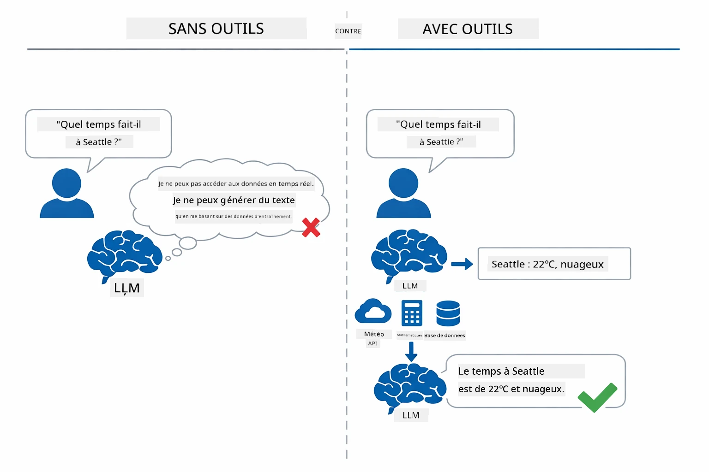

*Sans outils, le modèle ne fait que deviner — avec des outils, il peut appeler des API, effectuer des calculs et fournir des données en temps réel.*

Un agent IA avec outils suit un pattern **Reasoning and Acting (ReAct)**. Le modèle ne se contente pas de répondre — il réfléchit à ce dont il a besoin, agit en appelant un outil, observe le résultat, puis décide s'il doit agir à nouveau ou fournir la réponse finale :

1. **Reasonner** — L'agent analyse la question de l'utilisateur et détermine les informations dont il a besoin  
2. **Agir** — L'agent choisit le bon outil, génère les paramètres corrects et l'appelle  
3. **Observer** — L'agent reçoit la sortie de l'outil et évalue le résultat  
4. **Répéter ou répondre** — Si plus de données sont nécessaires, l'agent boucle ; sinon, il compose une réponse en langage naturel  

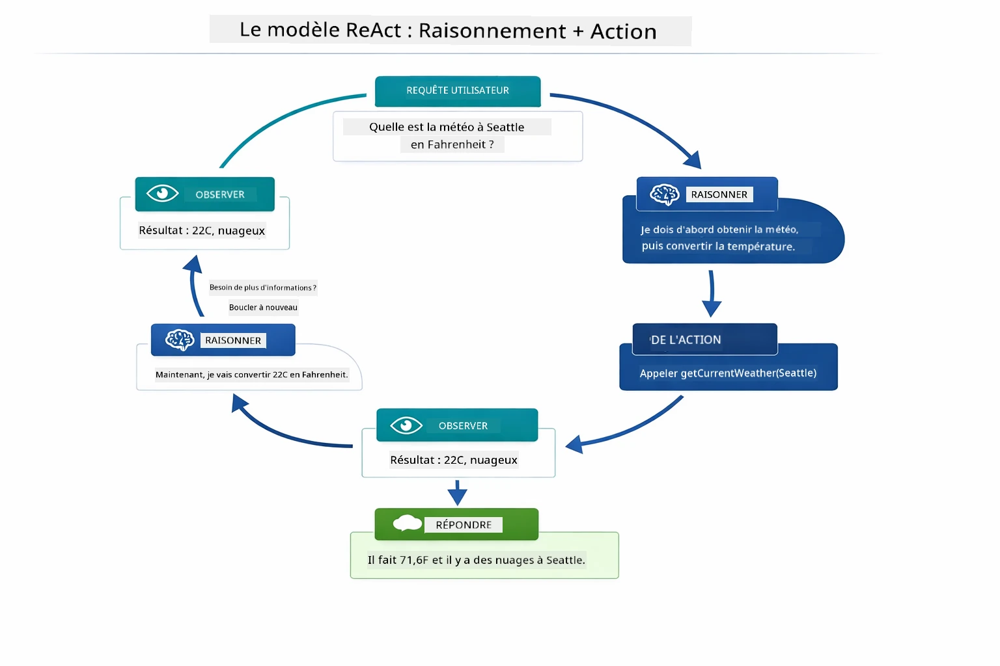

*Le cycle ReAct — l'agent raisonne sur ce qu'il doit faire, agit en appelant un outil, observe le résultat et boucle jusqu'à pouvoir donner la réponse finale.*

Cela se fait automatiquement. Vous définissez les outils et leurs descriptions. Le modèle gère la prise de décision sur quand et comment les utiliser.

## Comment fonctionne l'appel d'outil

### Définitions des outils

[WeatherTool.java](../../../04-tools/src/main/java/com/example/langchain4j/agents/tools/WeatherTool.java) | [TemperatureTool.java](../../../04-tools/src/main/java/com/example/langchain4j/agents/tools/TemperatureTool.java)

Vous définissez des fonctions avec des descriptions claires et des spécifications de paramètres. Le modèle voit ces descriptions dans son prompt système et comprend ce que chaque outil fait.

```java
@Component
public class WeatherTool {
    
    @Tool("Get the current weather for a location")
    public String getCurrentWeather(@P("Location name") String location) {
        // Votre logique de recherche météo
        return "Weather in " + location + ": 22°C, cloudy";
    }
}

@AiService
public interface Assistant {
    String chat(@MemoryId String sessionId, @UserMessage String message);
}

// L'assistant est automatiquement configuré par Spring Boot avec :
// - Bean ChatModel
// - Toutes les méthodes @Tool des classes @Component
// - ChatMemoryProvider pour la gestion de session
```
  
Le diagramme ci-dessous détaille chaque annotation et montre comment chaque élément aide l'IA à comprendre quand appeler l'outil et quels arguments passer :

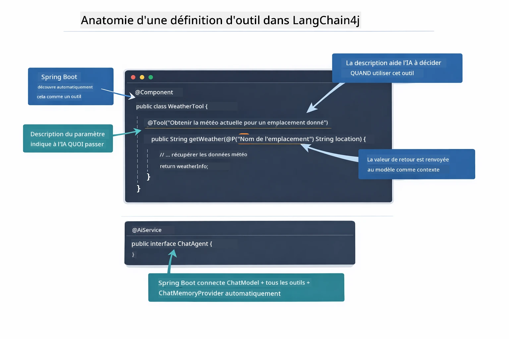

*Anatomie d'une définition d'outil — @Tool indique à l'IA quand l'utiliser, @P décrit chaque paramètre, et @AiService assemble tout au démarrage.*

> **🤖 Essayez avec le Chat [GitHub Copilot](https://github.com/features/copilot) :** Ouvrez [`WeatherTool.java`](../../../04-tools/src/main/java/com/example/langchain4j/agents/tools/WeatherTool.java) et demandez :  
> - "Comment intégrer une vraie API météo comme OpenWeatherMap au lieu de données factices ?"  
> - "Qu'est-ce qui fait une bonne description d'outil pour aider l'IA à bien l'utiliser ?"  
> - "Comment gérer les erreurs d'API et les limites de requêtes dans les implémentations d'outils ?"

### Prise de décision

Quand un utilisateur demande « Quelle est la météo à Seattle ? », le modèle ne choisit pas un outil au hasard. Il compare l'intention de l'utilisateur à chaque description d'outil à sa disposition, attribue un score de pertinence à chacun, et sélectionne la meilleure correspondance. Il génère alors un appel de fonction structuré avec les bons paramètres — dans ce cas, `location` à `"Seattle"`.

Si aucun outil ne correspond à la requête, le modèle répond à partir de ses propres connaissances. Si plusieurs outils conviennent, il choisit le plus spécifique.

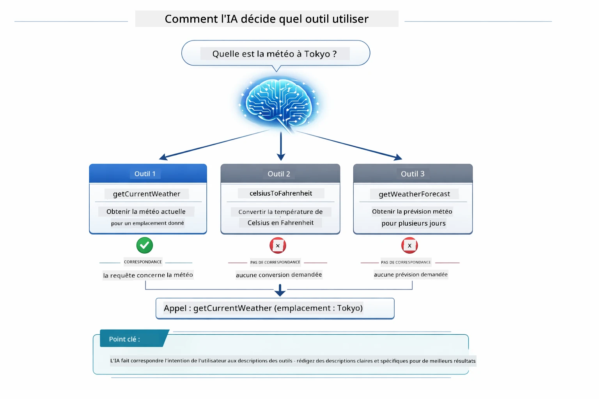

*Le modèle évalue chaque outil disponible par rapport à l'intention de l'utilisateur et choisit la meilleure correspondance — d'où l'importance d'écrire des descriptions d'outils claires et précises.*

### Exécution

[AgentService.java](../../../04-tools/src/main/java/com/example/langchain4j/agents/service/AgentService.java)

Spring Boot injecte automatiquement l'interface déclarative `@AiService` avec tous les outils enregistrés, et LangChain4j exécute les appels d'outils automatiquement. En coulisses, un appel d'outil complet suit six étapes — depuis la question en langage naturel de l'utilisateur jusqu'à une réponse également en langage naturel :

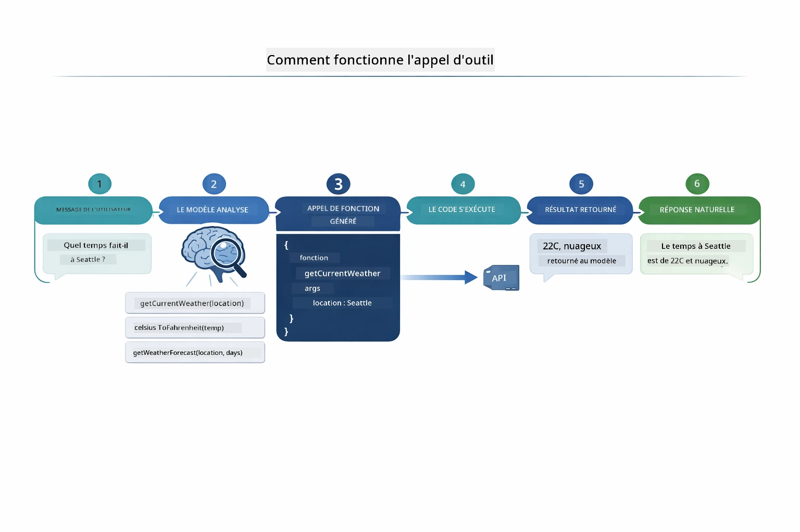

*Le flux bout en bout — l'utilisateur pose une question, le modèle sélectionne un outil, LangChain4j l'exécute, et le modèle intègre le résultat dans une réponse naturelle.*

> **🤖 Essayez avec le Chat [GitHub Copilot](https://github.com/features/copilot) :** Ouvrez [`AgentService.java`](../../../04-tools/src/main/java/com/example/langchain4j/agents/service/AgentService.java) et demandez :  
> - "Comment fonctionne le pattern ReAct et pourquoi est-il efficace pour les agents IA ?"  
> - "Comment l'agent décide quel outil utiliser et dans quel ordre ?"  
> - "Que se passe-t-il si l'exécution d'un outil échoue - comment gérer les erreurs de manière robuste ?"

### Génération de la réponse

Le modèle reçoit les données météo et les formate en une réponse en langage naturel pour l'utilisateur.

### Architecture : Auto-wiring Spring Boot

Ce module utilise l’intégration LangChain4j avec Spring Boot via des interfaces déclaratives `@AiService`. Au démarrage, Spring Boot découvre chaque `@Component` contenant des méthodes `@Tool`, votre bean `ChatModel` et le `ChatMemoryProvider` — puis les connecte tous ensemble dans une seule interface `Assistant` sans aucun code boilerplate.

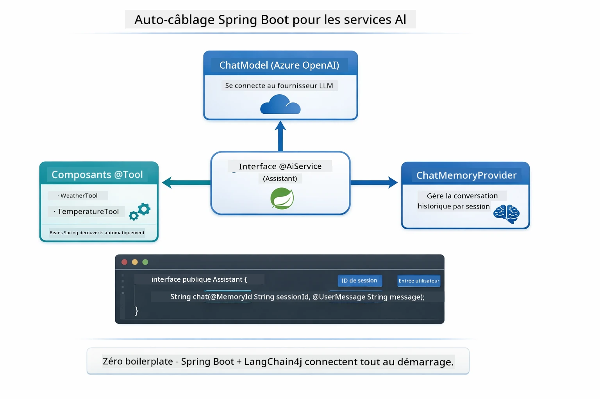

*L'interface @AiService relie le ChatModel, les composants outils et le fournisseur de mémoire — Spring Boot gère automatiquement tout le câblage.*

Les principaux avantages de cette approche :

- **Auto-wiring Spring Boot** — Injection automatique de ChatModel et des outils  
- **Pattern @MemoryId** — Gestion automatique de la mémoire basée sur la session  
- **Instance unique** — Assistant créé une fois et réutilisé pour de meilleures performances  
- **Exécution typée** — Appels directs aux méthodes Java avec conversion de types  
- **Orchestration multi-tours** — Gère automatiquement le chaînage d'outils  
- **Zéro boilerplate** — Pas d'appels manuels à `AiServices.builder()` ni HashMap mémoire  

Les approches alternatives (usage manuel de `AiServices.builder()`) nécessitent plus de code et ne bénéficient pas des avantages de l’intégration Spring Boot.

## Chaînage d'outils

**Chaînage d'outils** — La vraie puissance des agents basés sur les outils apparaît lorsqu'une seule question nécessite plusieurs outils. Demandez « Quelle est la météo à Seattle en Fahrenheit ? » et l'agent enchaîne automatiquement deux outils : il appelle d'abord `getCurrentWeather` pour obtenir la température en Celsius, puis transmet cette valeur à `celsiusToFahrenheit` pour la conversion — tout cela en un seul tour de conversation.

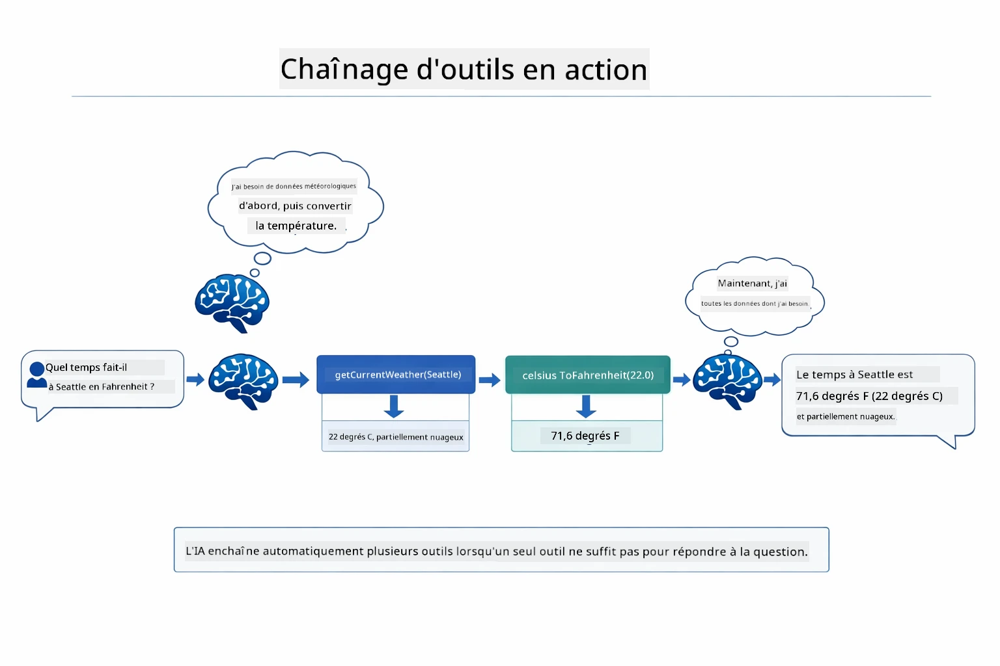

*Chaînage d'outils en action — l'agent appelle d'abord getCurrentWeather, puis transmet le résultat Celsius à celsiusToFahrenheit, et fournit une réponse combinée.*

Voici à quoi cela ressemble dans l’application en fonctionnement — l'agent enchaîne deux appels d'outils en un seul tour de conversation :

<a href="images/tool-chaining.png"></a>

*Sortie réelle de l'application — l'agent enchaîne automatiquement getCurrentWeather → celsiusToFahrenheit en un seul tour.*

**Échecs maîtrisés** — Demandez la météo dans une ville qui n’est pas dans les données factices. L’outil renvoie un message d’erreur, et l’IA explique qu’elle ne peut pas aider au lieu de planter. Les outils échouent en toute sécurité.

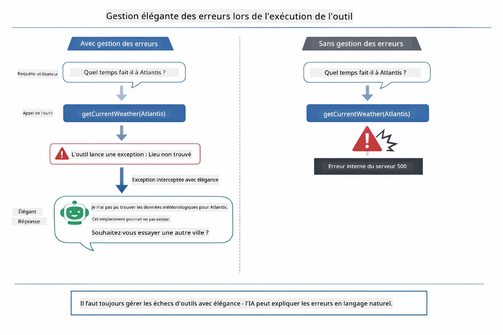

*Quand un outil échoue, l'agent intercepte l'erreur et répond avec une explication utile au lieu de planter.*

Cela se produit en un seul tour de conversation. L’agent orchestre plusieurs appels d’outils de manière autonome.

## Lancer l'application

**Vérifiez le déploiement :**

Assurez-vous que le fichier `.env` existe à la racine avec les identifiants Azure (créé pendant le Module 01) :  
```bash
cat ../.env  # Devrait afficher AZURE_OPENAI_ENDPOINT, API_KEY, DEPLOYMENT
```
  
**Démarrez l'application :**

> **Note :** Si vous avez déjà démarré toutes les applications avec `./start-all.sh` du Module 01, ce module tourne déjà sur le port 8084. Vous pouvez sauter les commandes de démarrage ci-dessous et aller directement sur http://localhost:8084.

**Option 1 : Utiliser le Spring Boot Dashboard (recommandé pour les utilisateurs VS Code)**

Le container de développement inclut l'extension Spring Boot Dashboard, qui offre une interface visuelle pour gérer toutes les applications Spring Boot. Vous la trouverez dans la barre d'activité à gauche de VS Code (icône Spring Boot).

Depuis le Spring Boot Dashboard, vous pouvez :  
- Voir toutes les applications Spring Boot disponibles dans l’espace de travail  
- Démarrer/arrêter les applications d’un clic  
- Consulter les logs d’application en temps réel  
- Surveiller l’état des applications  

Cliquez simplement sur le bouton lecture à côté de "tools" pour démarrer ce module, ou démarrez tous les modules en une fois.


**Option 2 : Utiliser des scripts shell**

Démarrez toutes les applications web (modules 01-04) :

**Bash :**  
```bash
cd ..  # Depuis le répertoire racine
./start-all.sh
```
  
**PowerShell :**  
```powershell
cd ..  # Depuis le répertoire racine
.\start-all.ps1
```
  
Ou démarrez uniquement ce module :

**Bash :**  
```bash
cd 04-tools
./start.sh
```
  
**PowerShell :**  
```powershell
cd 04-tools
.\start.ps1
```
  
Les deux scripts chargent automatiquement les variables d’environnement depuis le fichier `.env` racine et construiront les JARs s’ils n’existent pas.

> **Note :** Si vous préférez construire manuellement tous les modules avant de démarrer :  
>  
> **Bash :**  
> ```bash
> cd ..  # Go to root directory
> mvn clean package -DskipTests
> ```
  
> **PowerShell :**  
> ```powershell
> cd ..  # Go to root directory
> mvn clean package -DskipTests
> ```
  
Ouvrez http://localhost:8084 dans votre navigateur.

**Pour arrêter :**

**Bash :**  
```bash
./stop.sh  # Ce module seulement
# Ou
cd .. && ./stop-all.sh  # Tous les modules
```
  
**PowerShell :**  
```powershell
.\stop.ps1  # Seulement ce module
# Ou
cd ..; .\stop-all.ps1  # Tous les modules
```
  
## Utilisation de l'application

L'application fournit une interface web où vous pouvez interagir avec un agent IA ayant accès aux outils météo et conversion de température.

<a href="images/tools-homepage.png"></a>

*Interface des outils Agent IA - exemples rapides et interface de chat pour interagir avec les outils*

### Essayez une utilisation simple des outils
Commencez par une demande simple : « Convertir 100 degrés Fahrenheit en Celsius ». L'agent reconnaît qu'il a besoin de l'outil de conversion de température, l'appelle avec les bons paramètres et renvoie le résultat. Remarquez à quel point cela semble naturel — vous n'avez pas spécifié quel outil utiliser ni comment l'appeler.

### Tester l’enchaînement des outils

Essayez maintenant quelque chose de plus complexe : « Quel temps fait-il à Seattle et convertis-le en Fahrenheit ? » Observez comment l'agent procède en étapes. Il récupère d'abord la météo (qui retourne en Celsius), reconnaît qu'il doit convertir en Fahrenheit, appelle l'outil de conversion, puis combine les deux résultats en une seule réponse.

### Voir le déroulement de la conversation

L'interface de chat conserve l'historique des conversations, vous permettant d’avoir des échanges à plusieurs tours. Vous pouvez voir toutes les requêtes et réponses précédentes, ce qui facilite le suivi de la conversation et la compréhension de la manière dont l'agent construit le contexte au fil des échanges multiples.

<a href="images/tools-conversation-demo.png"></a>

*Conversation multi-tours montrant de simples conversions, recherches météo et enchaînement d’outils*

### Expérimentez avec différentes requêtes

Essayez différentes combinaisons :
- Recherches météo : « Quel temps fait-il à Tokyo ? »
- Conversions de température : « Quel est 25°C en Kelvin ? »
- Requêtes combinées : « Vérifie la météo à Paris et dis-moi s’il fait plus de 20°C »

Remarquez comment l'agent interprète le langage naturel et le traduit en appels d’outils appropriés.

## Concepts clés

### Modèle ReAct (Raisonnement et Action)

L'agent alterne entre raisonnement (décider quoi faire) et action (utiliser des outils). Ce modèle permet une résolution de problèmes autonome plutôt que de simplement répondre à des instructions.

### Les descriptions d’outils sont importantes

La qualité des descriptions de vos outils influence directement la capacité de l’agent à les utiliser. Des descriptions claires et spécifiques aident le modèle à comprendre quand et comment appeler chaque outil.

### Gestion des sessions

L’annotation `@MemoryId` permet une gestion automatique de la mémoire basée sur la session. Chaque identifiant de session reçoit sa propre instance de `ChatMemory`, gérée par le bean `ChatMemoryProvider`, ce qui permet à plusieurs utilisateurs d’interagir avec l’agent simultanément sans que leurs conversations ne se mélangent.

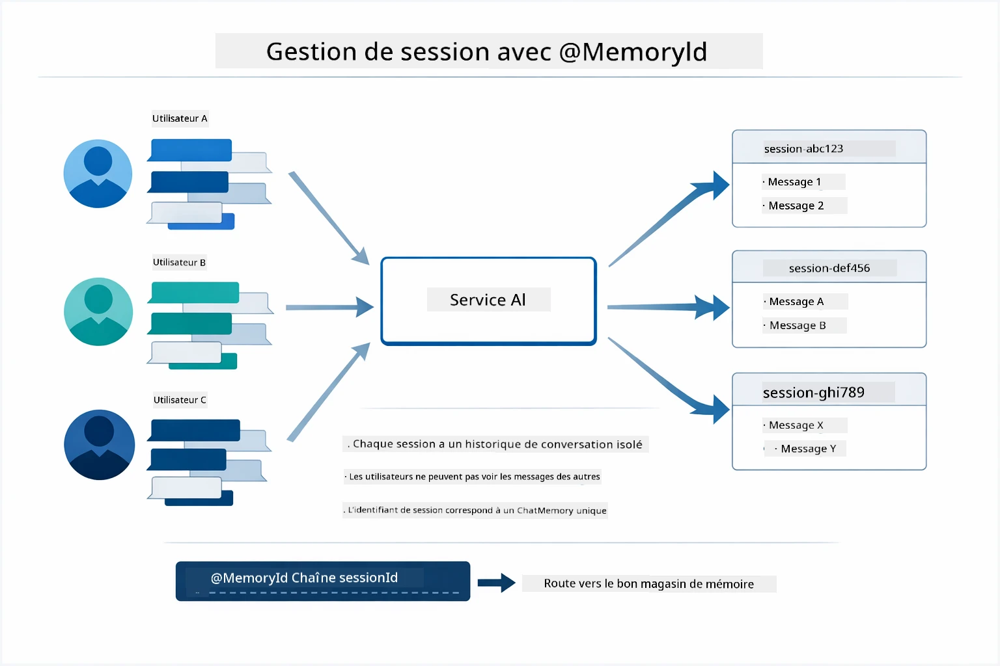

*Chaque ID de session correspond à un historique de conversation isolé — les utilisateurs ne voient jamais les messages des autres.*

### Gestion des erreurs

Les outils peuvent échouer — des API peuvent expirer, des paramètres être invalides, ou des services externes tomber en panne. Les agents en production ont besoin de gestion d’erreurs pour que le modèle puisse expliquer les problèmes ou essayer des alternatives au lieu de faire planter toute l’application. Lorsqu’un outil lance une exception, LangChain4j la capture et transmet le message d’erreur au modèle, qui peut alors expliquer le problème en langage naturel.

## Outils disponibles

Le schéma ci-dessous montre le large écosystème d’outils que vous pouvez construire. Ce module démontre des outils météo et de température, mais le même modèle `@Tool` fonctionne pour n’importe quelle méthode Java — des requêtes en base de données au traitement de paiements.

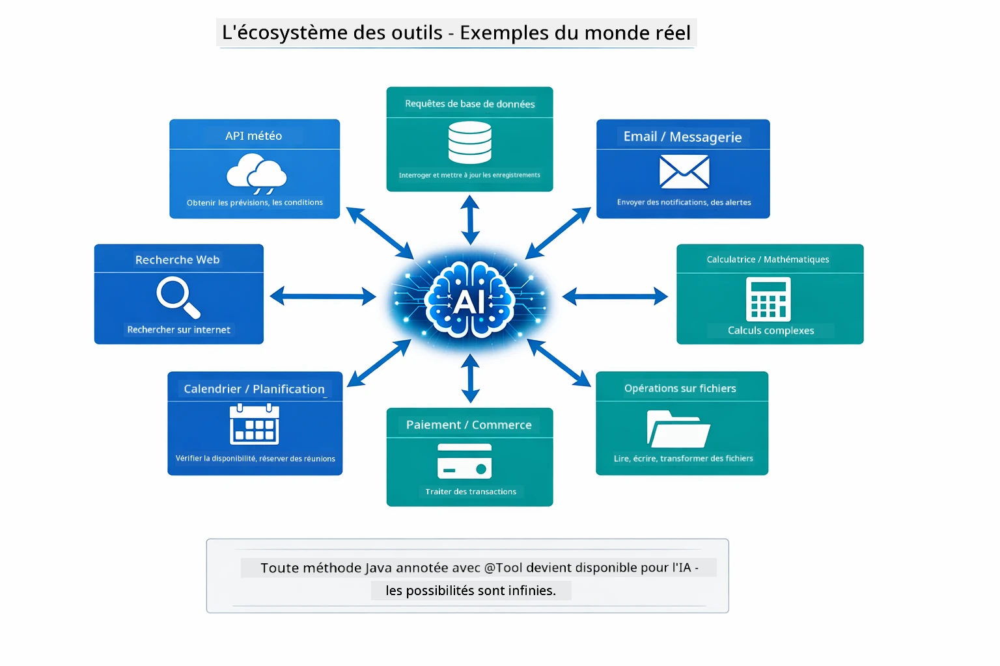

*Toute méthode Java annotée avec @Tool devient disponible pour l’IA — le modèle s’étend aux bases de données, APIs, emails, opérations sur fichiers, et plus.*

## Quand utiliser des agents basés sur des outils

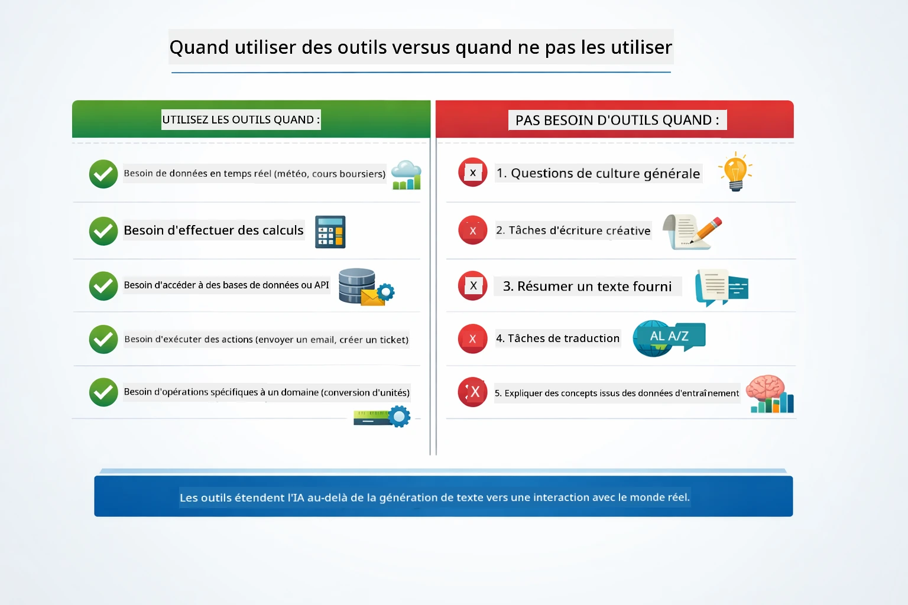

*Un guide rapide — les outils servent pour des données en temps réel, calculs et actions ; la connaissance générale et les tâches créatives n’en ont pas besoin.*

**Utilisez des outils lorsque :**
- La réponse exige des données en temps réel (météo, cours boursiers, inventaire)
- Vous devez réaliser des calculs plus complexes que des mathématiques simples
- Accéder à des bases de données ou des APIs
- Exécuter des actions (envoyer des emails, créer des tickets, mettre à jour des enregistrements)
- Combiner plusieurs sources de données

**N’utilisez pas d’outils lorsque :**
- Les questions peuvent être répondues grâce à des connaissances générales
- La réponse est purement conversationnelle
- La latence des outils rendrait l’expérience trop lente

## Outils vs RAG

Les modules 03 et 04 étendent tous deux les capacités de l’IA, mais d’une manière fondamentalement différente. Le RAG donne au modèle accès à la **connaissance** via la récupération de documents. Les outils donnent au modèle la capacité d’effectuer des **actions** en appelant des fonctions.

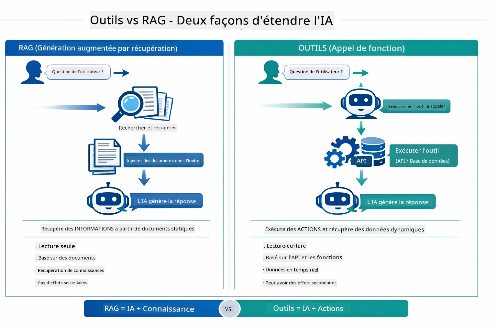

*Le RAG récupère des informations dans des documents statiques — les outils exécutent des actions et récupèrent des données dynamiques et en temps réel. Beaucoup de systèmes de production combinent les deux.*

En pratique, de nombreux systèmes de production combinent les deux approches : le RAG pour ancrer les réponses dans votre documentation, et les outils pour récupérer des données en direct ou effectuer des opérations.

## Étapes suivantes

**Module suivant :** [05-mcp - Model Context Protocol (MCP)](../05-mcp/README.md)

---

**Navigation :** [← Précédent : Module 03 - RAG](../03-rag/README.md) | [Retour au principal](../README.md) | [Suivant : Module 05 - MCP →](../05-mcp/README.md)

---

<!-- CO-OP TRANSLATOR DISCLAIMER START -->
**Avertissement** :  
Ce document a été traduit à l'aide du service de traduction automatique [Co-op Translator](https://github.com/Azure/co-op-translator). Bien que nous nous efforcions d'assurer l'exactitude, veuillez noter que les traductions automatisées peuvent contenir des erreurs ou des inexactitudes. Le document original dans sa langue native doit être considéré comme la source faisant autorité. Pour des informations critiques, une traduction professionnelle réalisée par un humain est recommandée. Nous déclinons toute responsabilité en cas de malentendus ou de mauvaises interprétations résultant de l'utilisation de cette traduction.
<!-- CO-OP TRANSLATOR DISCLAIMER END -->