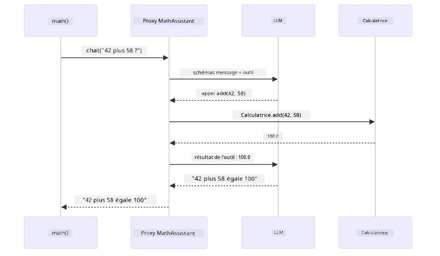
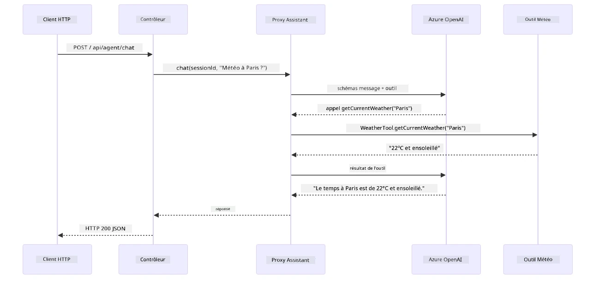

# Module 04 : Agents IA avec Outils

## Table des matières

- [Ce que vous apprendrez](../../../04-tools)
- [Prérequis](../../../04-tools)
- [Comprendre les agents IA avec outils](../../../04-tools)
- [Comment fonctionne l'appel d'outils](../../../04-tools)
  - [Définitions des outils](../../../04-tools)
  - [Prise de décision](../../../04-tools)
  - [Exécution](../../../04-tools)
  - [Génération de réponse](../../../04-tools)
  - [Architecture : Auto-câblage Spring Boot](../../../04-tools)
- [Chaînage d'outils](../../../04-tools)
- [Lancer l'application](../../../04-tools)
- [Utiliser l'application](../../../04-tools)
  - [Essayer l'utilisation simple d'outils](../../../04-tools)
  - [Tester le chaînage d'outils](../../../04-tools)
  - [Voir le flux de conversation](../../../04-tools)
  - [Expérimenter avec différentes requêtes](../../../04-tools)
- [Concepts clés](../../../04-tools)
  - [Motif ReAct (Reasoning and Acting)](../../../04-tools)
  - [Les descriptions d'outils comptent](../../../04-tools)
  - [Gestion des sessions](../../../04-tools)
  - [Gestion des erreurs](../../../04-tools)
- [Outils disponibles](../../../04-tools)
- [Quand utiliser des agents basés sur des outils](../../../04-tools)
- [Outils vs RAG](../../../04-tools)
- [Étapes suivantes](../../../04-tools)

## Ce que vous apprendrez

Jusqu'à présent, vous avez appris à converser avec l'IA, structurer efficacement des prompts et ancrer les réponses dans vos documents. Mais il existe encore une limitation fondamentale : les modèles de langage peuvent seulement générer du texte. Ils ne peuvent pas vérifier la météo, effectuer des calculs, interroger des bases de données ou interagir avec des systèmes externes.

Les outils changent cela. En donnant au modèle accès à des fonctions qu'il peut appeler, vous le transformez d'un générateur de texte en un agent capable d'agir. Le modèle décide quand il a besoin d'un outil, quel outil utiliser et quels paramètres passer. Votre code exécute la fonction et retourne le résultat. Le modèle intègre ce résultat dans sa réponse.

## Prérequis

- Avoir terminé le [Module 01 - Introduction](../01-introduction/README.md) (ressources Azure OpenAI déployées)
- Avoir terminé les modules précédents recommandés (ce module fait référence aux [concepts RAG du Module 03](../03-rag/README.md) dans la comparaison Outils vs RAG)
- Fichier `.env` à la racine avec les identifiants Azure (créé par `azd up` dans le Module 01)

> **Note :** Si vous n'avez pas terminé le Module 01, suivez d'abord les instructions de déploiement là-bas.

## Comprendre les agents IA avec outils

> **📝 Note :** Le terme « agents » dans ce module désigne des assistants IA enrichis avec des capacités d'appel d'outils. Ceci est différent des patterns **Agentic AI** (agents autonomes avec planification, mémoire et raisonnement multi-étapes) que nous couvrirons dans [Module 05 : MCP](../05-mcp/README.md).

Sans outils, un modèle de langage peut seulement générer du texte à partir de ses données d'entraînement. Demandez-lui la météo actuelle, il devra deviner. Donnez-lui des outils, et il peut appeler une API météo, effectuer des calculs, ou interroger une base de données — puis intégrer ces résultats réels dans sa réponse.


*Sans outils, le modèle peut seulement deviner — avec des outils, il peut appeler des API, faire des calculs et fournir des données en temps réel.*

Un agent IA avec outils suit un motif **Reasoning and Acting (ReAct)**. Le modèle ne fait pas que répondre — il réfléchit à ce dont il a besoin, agit en appelant un outil, observe le résultat, puis décide s'il doit agir à nouveau ou livrer la réponse finale :

1. **Raisonner** — L'agent analyse la question de l'utilisateur et détermine les informations nécessaires
2. **Agir** — L'agent sélectionne l'outil adéquat, génère les bons paramètres et l'appelle
3. **Observer** — L'agent reçoit la sortie de l'outil et évalue le résultat
4. **Répéter ou Répondre** — Si plus de données sont nécessaires, l'agent boucle; sinon, il compose une réponse en langage naturel


*Le cycle ReAct — l'agent réfléchit à ce qu'il doit faire, agit en appelant un outil, observe le résultat, et boucle jusqu'à pouvoir délivrer la réponse finale.*

Cela se passe automatiquement. Vous définissez les outils et leurs descriptions. Le modèle gère la prise de décision quant au moment et à la manière de les utiliser.

## Comment fonctionne l'appel d'outils

### Définitions des outils

[WeatherTool.java](../../../04-tools/src/main/java/com/example/langchain4j/agents/tools/WeatherTool.java) | [TemperatureTool.java](../../../04-tools/src/main/java/com/example/langchain4j/agents/tools/TemperatureTool.java)

Vous définissez des fonctions avec des descriptions claires et des spécifications de paramètres. Le modèle voit ces descriptions dans son prompt système et comprend ce que chaque outil fait.

```java
@Component
public class WeatherTool {
    
    @Tool("Get the current weather for a location")
    public String getCurrentWeather(@P("Location name") String location) {
        // Votre logique de recherche météo
        return "Weather in " + location + ": 22°C, cloudy";
    }
}

@AiService
public interface Assistant {
    String chat(@MemoryId String sessionId, @UserMessage String message);
}

// L'assistant est automatiquement configuré par Spring Boot avec :
// - Bean ChatModel
// - Toutes les méthodes @Tool des classes @Component
// - ChatMemoryProvider pour la gestion des sessions
```

Le diagramme ci-dessous détaille chaque annotation et montre comment chacune aide l'IA à comprendre quand appeler l'outil et quels arguments passer :


*Anatomie d'une définition d'outil — @Tool indique à l'IA quand l'utiliser, @P décrit chaque paramètre, et @AiService connecte tout au démarrage.*

> **🤖 Essayez avec [GitHub Copilot](https://github.com/features/copilot) Chat :** Ouvrez [`WeatherTool.java`](../../../04-tools/src/main/java/com/example/langchain4j/agents/tools/WeatherTool.java) et demandez :
> - « Comment intégrerais-je une vraie API météo comme OpenWeatherMap plutôt que des données factices ? »
> - « Qu'est-ce qui fait une bonne description d'outil qui aide l'IA à l'utiliser correctement ? »
> - « Comment gérer les erreurs d'API et les limites de requêtes dans les implémentations d'outils ? »

### Prise de décision

Quand un utilisateur demande « Quelle est la météo à Seattle ? », le modèle ne choisit pas un outil au hasard. Il compare l'intention de l'utilisateur avec chaque description d'outil à sa disposition, évalue leur pertinence, et sélectionne la meilleure correspondance. Il génère ensuite un appel de fonction structuré avec les bons paramètres — ici, en fixant `location` à `"Seattle"`.

Si aucun outil ne correspond à la demande, le modèle répond avec ses propres connaissances. S'il y a plusieurs correspondances, il choisit le plus spécifique.


*Le modèle évalue chaque outil disponible par rapport à l'intention de l'utilisateur et sélectionne la meilleure correspondance — c'est pourquoi écrire des descriptions claires et spécifiques est important.*

### Exécution

[AgentService.java](../../../04-tools/src/main/java/com/example/langchain4j/agents/service/AgentService.java)

Spring Boot injecte automatiquement l'interface déclarative `@AiService` avec tous les outils enregistrés, et LangChain4j exécute les appels d'outils automatiquement. En coulisses, un appel complet d'outil traverse six étapes — de la question en langage naturel de l'utilisateur jusqu'à la réponse finale en langage naturel :


*Le flux de bout en bout — l'utilisateur pose une question, le modèle sélectionne un outil, LangChain4j l'exécute, et le modèle intègre le résultat dans une réponse naturelle.*

Si vous avez lancé le [ToolIntegrationDemo](../../../00-quick-start/src/main/java/com/example/langchain4j/quickstart/ToolIntegrationDemo.java) dans le Module 00, vous avez déjà vu ce pattern en action — les outils `Calculator` ont été appelés de la même manière. Le diagramme de séquence ci-dessous montre exactement ce qui s'est passé lors de cette démo :



*La boucle d'appel d'outil du démo Quick Start — `AiServices` envoie votre message et les schémas d'outils au LLM, le LLM répond avec un appel de fonction comme `add(42, 58)`, LangChain4j exécute localement la méthode `Calculator`, et transmet le résultat pour la réponse finale.*

> **🤖 Essayez avec [GitHub Copilot](https://github.com/features/copilot) Chat :** Ouvrez [`AgentService.java`](../../../04-tools/src/main/java/com/example/langchain4j/agents/service/AgentService.java) et demandez :
> - « Comment fonctionne le pattern ReAct et pourquoi est-il efficace pour les agents IA ? »
> - « Comment l'agent décide quel outil utiliser et dans quel ordre ? »
> - « Que se passe-t-il si l'exécution d'un outil échoue - comment gérer robuste­ment les erreurs ? »

### Génération de réponse

Le modèle reçoit les données météo et les formate en une réponse en langage naturel pour l'utilisateur.

### Architecture : Auto-câblage Spring Boot

Ce module utilise l'intégration Spring Boot de LangChain4j avec des interfaces déclaratives `@AiService`. Au démarrage, Spring Boot découvre chaque `@Component` contenant des méthodes `@Tool`, votre bean `ChatModel` et le `ChatMemoryProvider` — puis les connecte tous en une interface `Assistant` avec zéro code récurrent.


*L'interface @AiService relie le ChatModel, les composants outils et le fournisseur de mémoire — Spring Boot gère automatiquement tout le câblage.*

Voici le cycle complet de la requête sous forme de diagramme de séquence — de la requête HTTP, via le contrôleur, le service et le proxy auto-câblé, jusqu'à l'exécution de l'outil et retour :



*Le cycle complet de la requête Spring Boot — la requête HTTP passe par le contrôleur et le service vers le proxy Assistant auto-câblé, qui orchestre automatiquement les appels LLM et outils.*

Avantages clés de cette approche :

- **Auto-câblage Spring Boot** — injection automatique du ChatModel et des outils
- **Pattern @MemoryId** — gestion automatique de la mémoire basée sur la session
- **Instance unique** — Assistant créé une fois et réutilisé pour de meilleures performances
- **Exécution typée** — méthodes Java appelées directement avec conversion de types
- **Orchestration multi-tours** — gestion automatique du chaînage d'outils
- **Zéro code récurrent** — pas d'appels manuels à `AiServices.builder()` ou HashMap mémoire

Les approches alternatives (constructions manuelles avec `AiServices.builder()`) demandent plus de code et perdent les avantages de l'intégration Spring Boot.

## Chaînage d'outils

**Chaînage d'outils** — La vraie puissance des agents basés sur les outils se révèle quand une seule question nécessite plusieurs outils. Demandez « Quelle est la météo à Seattle en Fahrenheit ? » et l'agent enchaîne automatiquement deux outils : d'abord il appelle `getCurrentWeather` pour obtenir la température en Celsius, puis il transmet cette valeur à `celsiusToFahrenheit` pour la conversion — tout cela dans un seul tour de conversation.


*Chaînage d'outils en action — l'agent appelle d'abord getCurrentWeather, puis passe le résultat en Celsius à celsiusToFahrenheit, et délivre une réponse combinée.*

**Échecs gracieux** — Demandez la météo dans une ville absente des données factices. L'outil retourne un message d'erreur, et l'IA explique qu'elle ne peut pas aider au lieu de planter. Les outils échouent en sécurité. Le diagramme ci-dessous oppose les deux approches — avec une gestion correcte des erreurs, l'agent intercepte l'exception et répond de façon aidante, alors que sans celle-ci l'application entière plante :


*Quand un outil échoue, l'agent intercepte l'erreur et répond avec une explication utile plutôt que de planter.*

Cela se déroule en un seul tour de conversation. L'agent orchestre plusieurs appels d'outils de façon autonome.

## Lancer l'application

**Vérifiez le déploiement :**

Assurez-vous que le fichier `.env` existe à la racine avec les identifiants Azure (créé durant le Module 01). Lancez ceci depuis le répertoire du module (`04-tools/`) :

**Bash :**
```bash
cat ../.env  # Devrait afficher AZURE_OPENAI_ENDPOINT, API_KEY, DEPLOYMENT
```

**PowerShell :**
```powershell
Get-Content ..\.env  # Devrait afficher AZURE_OPENAI_ENDPOINT, API_KEY, DEPLOYMENT
```

**Démarrer l'application :**

> **Note :** Si vous avez déjà démarré toutes les applications avec `./start-all.sh` depuis la racine (comme décrit dans le Module 01), ce module est déjà en fonctionnement sur le port 8084. Vous pouvez sauter les commandes de démarrage ci-dessous et aller directement à http://localhost:8084.

**Option 1 : Utiliser le Spring Boot Dashboard (recommandé pour les utilisateurs VS Code)**

Le conteneur de développement inclut l'extension Spring Boot Dashboard, qui fournit une interface visuelle pour gérer toutes les applications Spring Boot. Vous la trouverez dans la barre d'activités à gauche dans VS Code (cherchez l'icône Spring Boot).

Depuis le Spring Boot Dashboard, vous pouvez :
- Voir toutes les applications Spring Boot disponibles dans l'espace de travail
- Démarrer/arrêter les applications d’un clic
- Voir les logs des applications en temps réel
- Surveiller l’état des applications

Cliquez simplement sur le bouton de démarrage à côté de « tools » pour lancer ce module, ou lancez tous les modules d’un coup.

Voici à quoi ressemble le Spring Boot Dashboard dans VS Code :


*Le Spring Boot Dashboard dans VS Code — démarrer, arrêter et surveiller tous les modules depuis un seul emplacement*

**Option 2 : Utiliser des scripts shell**

Démarrez toutes les applications web (modules 01-04) :

**Bash :**
```bash
cd ..  # Depuis le répertoire racine
./start-all.sh
```

**PowerShell :**
```powershell
cd ..  # Depuis le répertoire racine
.\start-all.ps1
```

Ou démarrez juste ce module :

**Bash :**
```bash
cd 04-tools
./start.sh
```

**PowerShell :**
```powershell
cd 04-tools
.\start.ps1
```

Les deux scripts chargent automatiquement les variables d'environnement depuis le fichier racine `.env` et construiront les JARs s'ils n'existent pas.

> **Note :** Si vous préférez construire manuellement tous les modules avant de commencer :
>
> **Bash :**
> ```bash
> cd ..  # Go to root directory
> mvn clean package -DskipTests
> ```
>
> **PowerShell :**
> ```powershell
> cd ..  # Go to root directory
> mvn clean package -DskipTests
> ```

Ouvrez http://localhost:8084 dans votre navigateur.

**Pour arrêter :**

**Bash :**
```bash
./stop.sh  # Seulement ce module
# Ou
cd .. && ./stop-all.sh  # Tous les modules
```

**PowerShell :**
```powershell
.\stop.ps1  # Ce module uniquement
# Ou
cd ..; .\stop-all.ps1  # Tous les modules
```

## Utilisation de l'application

L'application fournit une interface web où vous pouvez interagir avec un agent IA qui a accès à des outils météo et de conversion de température. Voici à quoi ressemble l'interface — elle inclut des exemples de démarrage rapide et un panel de chat pour envoyer des requêtes :

<a href="images/tools-homepage.png"></a>

*L'interface des outils de l'agent IA - exemples rapides et interface de chat pour interagir avec les outils*

### Essayez un usage simple des outils

Commencez par une requête simple : « Convertir 100 degrés Fahrenheit en Celsius ». L'agent reconnaît qu'il a besoin de l'outil de conversion de température, l'appelle avec les bons paramètres, et retourne le résultat. Remarquez à quel point c'est naturel - vous n'avez pas précisé quel outil utiliser ni comment l'appeler.

### Testez l'enchaînement d'outils

Essayez maintenant quelque chose de plus complexe : « Quel temps fait-il à Seattle et convertis-le en Fahrenheit ? » Regardez l'agent procéder étape par étape. Il obtient d'abord la météo (qui renvoie en Celsius), reconnaît qu'il doit convertir en Fahrenheit, appelle l'outil de conversion, puis combine les deux résultats en une seule réponse.

### Voir le déroulement de la conversation

L'interface de chat maintient l'historique des conversations, vous permettant d'avoir des interactions à plusieurs tours. Vous pouvez voir toutes les requêtes et réponses précédentes, ce qui facilite le suivi de la conversation et la compréhension de la façon dont l'agent construit le contexte au fil des échanges.

<a href="images/tools-conversation-demo.png"></a>

*Conversation à plusieurs tours montrant des conversions simples, des consultations météo, et l'enchaînement d'outils*

### Expérimentez avec différentes requêtes

Essayez diverses combinaisons :
- Consultations météo : « Quel temps fait-il à Tokyo ? »
- Conversions de température : « Quelle est la température de 25 °C en Kelvin ? »
- Requêtes combinées : « Vérifie la météo à Paris et dis-moi si elle est au-dessus de 20 °C »

Remarquez comment l'agent interprète le langage naturel et le mappe à des appels d'outils appropriés.

## Concepts clés

### Modèle ReAct (Raisonnement et Action)

L'agent alterne entre raisonnement (décider quoi faire) et action (utiliser des outils). Ce modèle permet une résolution de problème autonome plutôt que de simplement répondre à des instructions.

### Les descriptions d'outils comptent

La qualité de vos descriptions d'outils influence directement la façon dont l'agent les utilise. Des descriptions claires et spécifiques aident le modèle à comprendre quand et comment appeler chaque outil.

### Gestion des sessions

L'annotation `@MemoryId` permet une gestion automatique de la mémoire basée sur la session. Chaque ID de session obtient sa propre instance `ChatMemory` gérée par le bean `ChatMemoryProvider`, de sorte que plusieurs utilisateurs peuvent interagir avec l'agent simultanément sans que leurs conversations ne se mélangent. Le diagramme suivant montre comment plusieurs utilisateurs sont dirigés vers des mémoires isolées en fonction de leurs IDs de session :


*Chaque ID de session correspond à un historique de conversation isolé — les utilisateurs ne voient jamais les messages des autres.*

### Gestion des erreurs

Les outils peuvent échouer — les APIs peuvent timeout, les paramètres être invalides, les services externes tomber en panne. Les agents de production ont besoin d'une gestion des erreurs pour que le modèle puisse expliquer les problèmes ou essayer des alternatives plutôt que de faire planter toute l'application. Quand un outil lance une exception, LangChain4j la capture et renvoie le message d'erreur au modèle, qui peut alors expliquer le problème en langage naturel.

## Outils disponibles

Le diagramme ci-dessous montre l'écosystème large des outils que vous pouvez construire. Ce module démontre des outils météo et de température, mais le même modèle `@Tool` fonctionne pour n'importe quelle méthode Java — des requêtes de base de données aux traitements de paiement.


*Toute méthode Java annotée avec @Tool devient disponible pour l'IA — le modèle s'étend aux bases de données, APIs, emails, opérations sur fichiers, et plus encore.*

## Quand utiliser des agents basés sur des outils

Toutes les requêtes ne nécessitent pas d'outils. La décision dépend de si l'IA doit interagir avec des systèmes externes ou peut répondre avec ses propres connaissances. Le guide suivant résume quand les outils apportent de la valeur et quand ils sont inutiles :


*Un guide de décision rapide — les outils sont pour les données en temps réel, les calculs et les actions ; les connaissances générales et tâches créatives n'en ont pas besoin.*

## Outils vs RAG

Les modules 03 et 04 étendent tous deux ce que l'IA peut faire, mais de façons fondamentalement différentes. RAG donne au modèle accès à la **connaissance** en récupérant des documents. Les outils donnent la capacité de prendre des **actions** en appelant des fonctions. Le diagramme ci-dessous compare ces deux approches côte à côte — du fonctionnement de chaque workflow aux compromis entre eux :


*RAG récupère des informations à partir de documents statiques — les outils exécutent des actions et récupèrent des données dynamiques en temps réel. Beaucoup de systèmes de production combinent les deux.*

En pratique, beaucoup de systèmes de production combinent les deux approches : RAG pour ancrer les réponses dans votre documentation, et Outils pour récupérer des données en direct ou effectuer des opérations.

## Prochaines étapes

**Module suivant :** [05-mcp - Protocole de Contexte de Modèle (MCP)](../05-mcp/README.md)

---

**Navigation :** [← Précédent : Module 03 - RAG](../03-rag/README.md) | [Retour au principal](../README.md) | [Suivant : Module 05 - MCP →](../05-mcp/README.md)

---

<!-- CO-OP TRANSLATOR DISCLAIMER START -->
**Avertissement** :  
Ce document a été traduit à l’aide du service de traduction automatique [Co-op Translator](https://github.com/Azure/co-op-translator). Bien que nous fassions tout notre possible pour assurer l’exactitude, veuillez noter que les traductions automatisées peuvent contenir des erreurs ou des inexactitudes. Le document original dans sa langue native doit être considéré comme la source faisant autorité. Pour des informations critiques, il est recommandé de recourir à une traduction professionnelle réalisée par un humain. Nous ne pouvons être tenus responsables de tout malentendu ou mauvaise interprétation résultant de l’utilisation de cette traduction.
<!-- CO-OP TRANSLATOR DISCLAIMER END -->