# Module 05 : Protocole de Contexte Modèle (MCP)

## Table des Matières

- [Présentation Vidéo](../../../05-mcp)
- [Ce que vous allez apprendre](../../../05-mcp)
- [Qu'est-ce que le MCP ?](../../../05-mcp)
- [Comment fonctionne le MCP](../../../05-mcp)
- [Le module agentique](../../../05-mcp)
- [Exécution des exemples](../../../05-mcp)
  - [Prérequis](../../../05-mcp)
- [Démarrage rapide](../../../05-mcp)
  - [Opérations sur les fichiers (Stdio)](../../../05-mcp)
  - [Agent superviseur](../../../05-mcp)
    - [Exécution de la démo](../../../05-mcp)
    - [Comment fonctionne le superviseur](../../../05-mcp)
    - [Comment FileAgent découvre les outils MCP à l’exécution](../../../05-mcp)
    - [Stratégies de réponse](../../../05-mcp)
    - [Comprendre la sortie](../../../05-mcp)
    - [Explication des fonctionnalités du module agentique](../../../05-mcp)
- [Concepts clés](../../../05-mcp)
- [Félicitations !](../../../05-mcp)
  - [Et après ?](../../../05-mcp)

## Présentation Vidéo

Regardez cette session live qui explique comment démarrer avec ce module :

<a href="https://www.youtube.com/watch?v=O_J30kZc0rw"></a>

## Ce que vous allez apprendre

Vous avez construit une IA conversationnelle, maîtrisé les prompts, ancré les réponses dans des documents, et créé des agents avec des outils. Mais tous ces outils étaient faits sur mesure pour votre application spécifique. Et si vous pouviez donner à votre IA un accès à un écosystème standardisé d’outils que chacun peut créer et partager ? Dans ce module, vous apprendrez justement comment faire cela avec le Model Context Protocol (MCP) et le module agentique de LangChain4j. Nous présenterons d’abord un simple lecteur de fichiers MCP, puis montrerons comment l’intégrer facilement dans des workflows agentiques avancés utilisant le modèle d’Agent superviseur.

## Qu'est-ce que le MCP ?

Le Model Context Protocol (MCP) offre exactement cela – un moyen standard pour les applications IA de découvrir et utiliser des outils externes. Au lieu d’écrire des intégrations personnalisées pour chaque source de données ou service, vous vous connectez à des serveurs MCP qui exposent leurs capacités dans un format cohérent. Votre agent IA peut alors découvrir et utiliser ces outils automatiquement.

Le schéma ci-dessous montre la différence — sans MCP, chaque intégration nécessite un câblage point à point personnalisé ; avec MCP, un seul protocole relie votre application à n’importe quel outil :


*Avant MCP : intégrations complexes point à point. Après MCP : un protocole, des possibilités infinies.*

Le MCP résout un problème fondamental dans le développement IA : chaque intégration est personnalisée. Vous voulez accéder à GitHub ? Code personnalisé. Lire des fichiers ? Code personnalisé. Interroger une base de données ? Code personnalisé. Et aucune de ces intégrations ne fonctionne avec d’autres applications IA.

Le MCP standardise cela. Un serveur MCP expose des outils avec des descriptions claires et des schémas. N’importe quel client MCP peut se connecter, découvrir les outils disponibles, et les utiliser. On construit une fois, on utilise partout.

Le schéma ci-dessous illustre cette architecture — un seul client MCP (votre application IA) se connecte à plusieurs serveurs MCP, chacun exposant son propre ensemble d’outils via le protocole standard :


*Architecture du Model Context Protocol - découverte et exécution d’outils standardisées*

## Comment fonctionne le MCP

Sous le capot, le MCP utilise une architecture en couches. Votre application Java (le client MCP) découvre les outils disponibles, envoie des requêtes JSON-RPC via une couche de transport (Stdio ou HTTP), et le serveur MCP exécute les opérations et retourne les résultats. Le diagramme suivant détaille chaque couche de ce protocole :

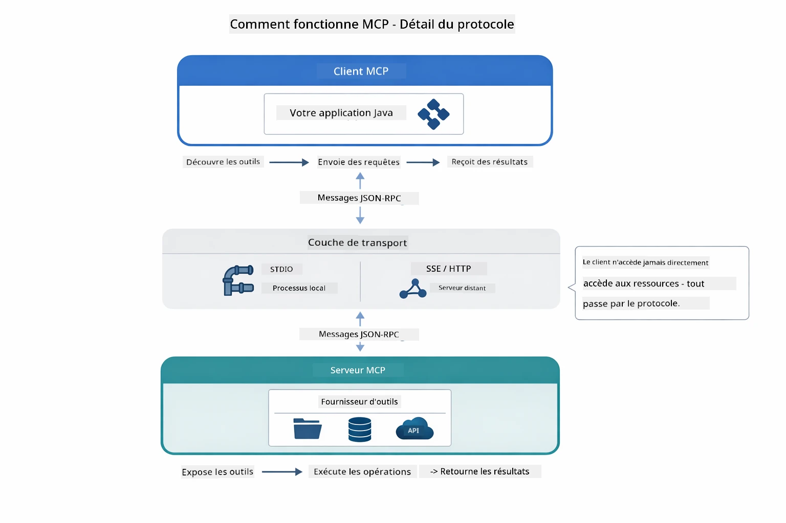

*Fonctionnement interne du MCP — les clients découvrent les outils, échangent des messages JSON-RPC, et exécutent des opérations via une couche de transport.*

**Architecture Client-Serveur**

Le MCP utilise un modèle client-serveur. Les serveurs fournissent des outils — lecture de fichiers, interrogation de bases de données, appels d’API. Les clients (votre application IA) se connectent aux serveurs et utilisent leurs outils.

Pour utiliser MCP avec LangChain4j, ajoutez cette dépendance Maven :

```xml
<dependency>
    <groupId>dev.langchain4j</groupId>
    <artifactId>langchain4j-mcp</artifactId>
    <version>${langchain4j.version}</version>
</dependency>
```

**Découverte d’outils**

Lorsque votre client se connecte à un serveur MCP, il demande « Quels outils avez-vous ? ». Le serveur répond avec une liste d’outils disponibles, chacun avec des descriptions et des schémas de paramètres. Votre agent IA peut alors décider quels outils utiliser en fonction des requêtes utilisateur. Le diagramme ci-dessous illustre cette négociation — le client envoie une requête `tools/list` et le serveur retourne ses outils disponibles avec descriptions et schémas :

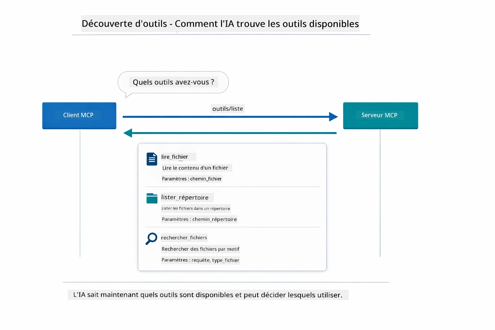

*L'IA découvre les outils disponibles au démarrage — elle sait maintenant quelles capacités sont accessibles et peut décider lesquelles utiliser.*

**Mécanismes de transport**

Le MCP supporte différents mécanismes de transport. Les deux options sont Stdio (pour communication avec sous-processus local) et HTTP Streamable (pour serveurs distants). Ce module démontre le transport Stdio :


*Mécanismes de transport MCP : HTTP pour serveurs distants, Stdio pour processus locaux*

**Stdio** - [StdioTransportDemo.java](../../../05-mcp/src/main/java/com/example/langchain4j/mcp/StdioTransportDemo.java)

Pour les processus locaux. Votre application lance un serveur en sous-processus et communique via les flux d’entrée/sortie standard. Utile pour l’accès filesystem ou les outils en ligne de commande.

```java
McpTransport stdioTransport = new StdioMcpTransport.Builder()
    .command(List.of(
        npmCmd, "exec",
        "@modelcontextprotocol/server-filesystem@2025.12.18",
        resourcesDir
    ))
    .logEvents(false)
    .build();
```

Le serveur `@modelcontextprotocol/server-filesystem` expose les outils suivants, tous isolés dans les répertoires que vous spécifiez :

| Outil | Description |
|------|-------------|
| `read_file` | Lire le contenu d’un fichier unique |
| `read_multiple_files` | Lire plusieurs fichiers en un appel |
| `write_file` | Créer ou écraser un fichier |
| `edit_file` | Faire des modifications ciblées de type chercher-remplacer |
| `list_directory` | Lister les fichiers et dossiers d’un chemin |
| `search_files` | Rechercher récursivement des fichiers correspondant à un motif |
| `get_file_info` | Obtenir les métadonnées d’un fichier (taille, horodatages, permissions) |
| `create_directory` | Créer un répertoire (y compris les parents) |
| `move_file` | Déplacer ou renommer un fichier ou répertoire |

Le diagramme suivant montre le fonctionnement du transport Stdio à l’exécution — votre application Java lance le serveur MCP comme un processus enfant et ils communiquent via les tubes stdin/stdout, sans network ni HTTP impliqués :

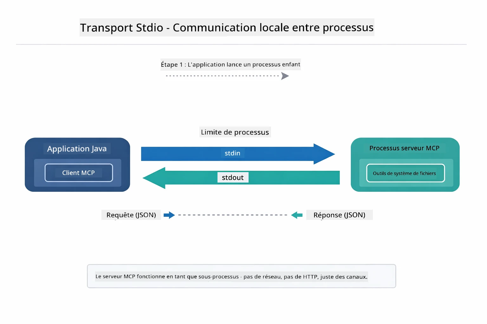

*Transport Stdio en action — votre application lance le serveur MCP en processus enfant et communique via les tubes stdin/stdout.*

> **🤖 Essayez avec [GitHub Copilot](https://github.com/features/copilot) Chat :** Ouvrez [`StdioTransportDemo.java`](../../../05-mcp/src/main/java/com/example/langchain4j/mcp/StdioTransportDemo.java) et demandez :
> - « Comment fonctionne le transport Stdio et quand devrais-je l’utiliser plutôt que HTTP ? »
> - « Comment LangChain4j gère-t-il le cycle de vie des processus serveurs MCP lancés ? »
> - « Quelles sont les implications de sécurité d’un accès AI au système de fichiers ? »

## Le module agentique

Alors que le MCP fournit des outils standardisés, le module **agentique** de LangChain4j offre une manière déclarative de construire des agents orchestrant ces outils. L’annotation `@Agent` et `AgenticServices` vous permettent de définir le comportement agent via des interfaces plutôt que du code impératif.

Dans ce module, vous explorerez le modèle d’**Agent superviseur** — une approche agentique avancée où un agent « superviseur » décide dynamiquement quels sous-agents invoquer en fonction des requêtes utilisateur. Nous combinerons les deux concepts en donnant à un de nos sous-agents des capacités d’accès aux fichiers propulsées par MCP.

Pour utiliser le module agentique, ajoutez cette dépendance Maven :

```xml
<dependency>
    <groupId>dev.langchain4j</groupId>
    <artifactId>langchain4j-agentic</artifactId>
    <version>${langchain4j.mcp.version}</version>
</dependency>
```

> **Note :** Le module `langchain4j-agentic` utilise une propriété de version distincte (`langchain4j.mcp.version`) car il est publié sur un calendrier différent des bibliothèques principales LangChain4j.

> **⚠️ Expérimental :** Le module `langchain4j-agentic` est **expérimental** et sujet à modification. La manière stable de construire des assistants IA reste `langchain4j-core` avec des outils personnalisés (Module 04).

## Exécution des exemples

### Prérequis

- Module [04 - Outils](../04-tools/README.md) terminé (ce module s’appuie sur les concepts d’outils personnalisés et les compare avec les outils MCP)
- Fichier `.env` à la racine contenant les identifiants Azure (créé par `azd up` dans le Module 01)
- Java 21+, Maven 3.9+
- Node.js 16+ et npm (pour les serveurs MCP)

> **Note :** Si vous n’avez pas encore configuré vos variables d’environnement, voyez le [Module 01 - Introduction](../01-introduction/README.md) pour les instructions de déploiement (`azd up` crée automatiquement le fichier `.env`), ou copiez `.env.example` en `.env` à la racine et remplissez vos valeurs.

## Démarrage rapide

**Avec VS Code :** Cliquez droit sur n’importe quel fichier de démonstration dans l’Explorateur et choisissez **« Run Java »**, ou utilisez les configurations de lancement depuis le panneau Exécuter et Déboguer (assurez-vous d’abord que votre fichier `.env` est bien configuré avec les identifiants Azure).

**Via Maven :** Vous pouvez aussi exécuter depuis la ligne de commande avec les exemples ci-dessous.

### Opérations sur les fichiers (Stdio)

Cela démontre des outils basés sur des sous-processus locaux.

**✅ Aucun prérequis nécessaire** — le serveur MCP est lancé automatiquement.

**Utilisation des scripts de démarrage (recommandé) :**

Les scripts de démarrage chargent automatiquement les variables d’environnement depuis le fichier `.env` à la racine :

**Bash :**
```bash
cd 05-mcp
chmod +x start-stdio.sh
./start-stdio.sh
```

**PowerShell :**
```powershell
cd 05-mcp
.\start-stdio.ps1
```

**Avec VS Code :** Clic droit sur `StdioTransportDemo.java` et choisissez **« Run Java »** (assurez-vous que votre fichier `.env` est configuré).

L’application lance automatiquement un serveur MCP filesystem et lit un fichier local. Notez comment la gestion du sous-processus est prise en charge pour vous.

**Sortie attendue :**
```
Assistant response: The file provides an overview of LangChain4j, an open-source Java library
for integrating Large Language Models (LLMs) into Java applications...
```

### Agent superviseur

Le modèle d’**agent superviseur** est une forme **flexible** d’IA agentique. Un superviseur utilise un LLM pour décider de manière autonome quels agents invoquer selon la demande utilisateur. Dans l’exemple suivant, nous combinons l’accès fichier propulsé par MCP avec un agent LLM pour créer un workflow supervisé lire-fichier → rapport.

Dans la démo, `FileAgent` lit un fichier avec les outils MCP filesystem, et `ReportAgent` génère un rapport structuré avec un résumé exécutif (1 phrase), 3 points clés, et des recommandations. Le superviseur orchestre ce flux automatiquement :

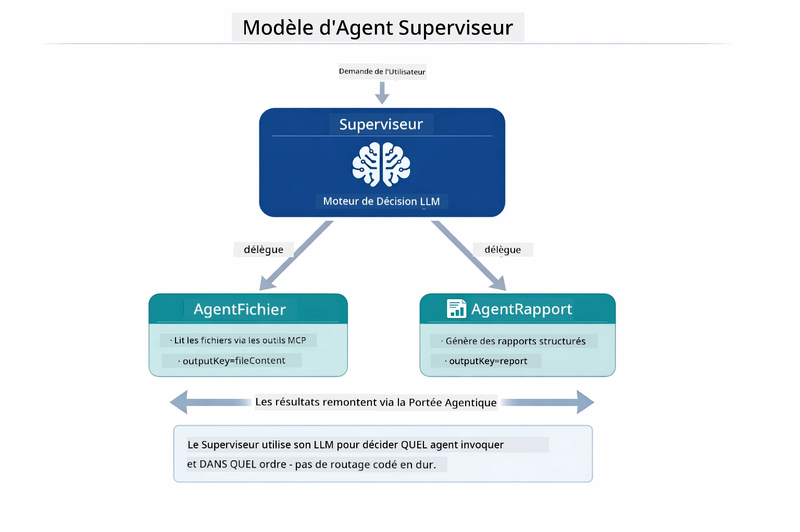

*Le superviseur utilise son LLM pour décider quels agents invoquer et dans quel ordre — aucun routage codé en dur nécessaire.*

Voici à quoi ressemble le workflow concret de notre pipeline fichier-vers-rapport :

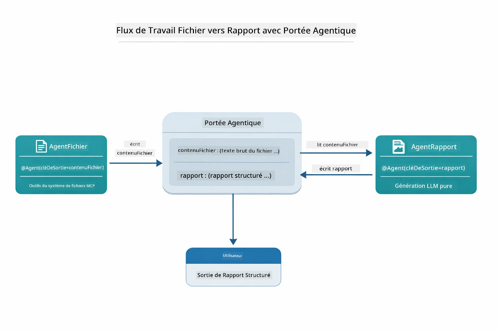

*FileAgent lit le fichier via les outils MCP, puis ReportAgent transforme le contenu brut en rapport structuré.*

Le diagramme de séquence suivant trace l’orchestration complète du superviseur — du lancement du serveur MCP, à la sélection autonome des agents par le superviseur, aux appels d’outils via stdio, jusqu’au rapport final :

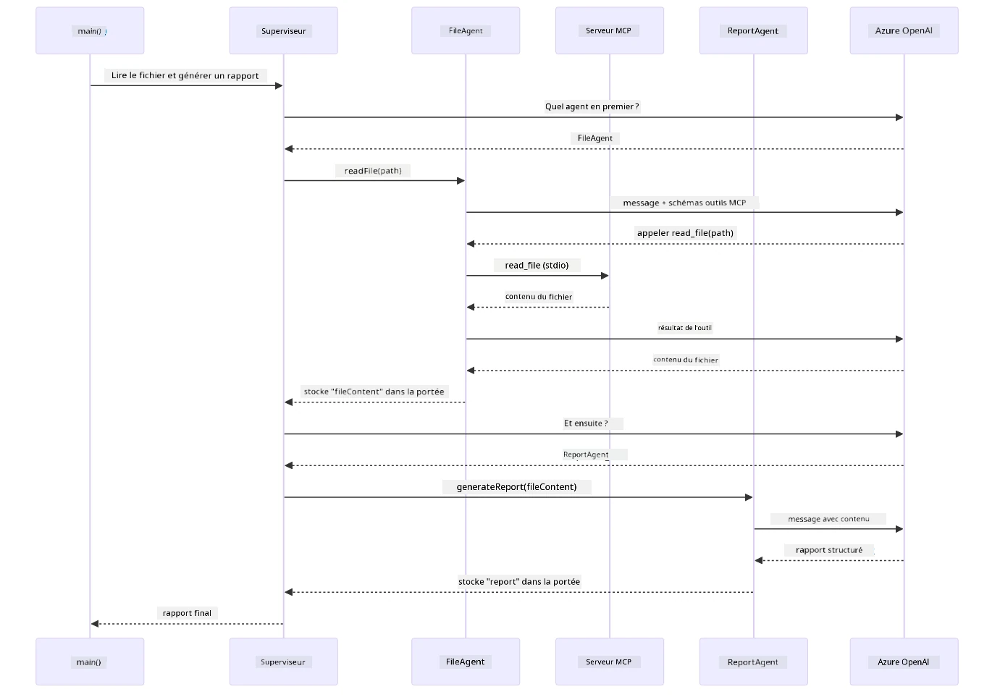

*Le superviseur invoque de manière autonome FileAgent (qui appelle le serveur MCP via stdio pour lire le fichier), puis invoque ReportAgent pour générer un rapport structuré — chaque agent stocke sa sortie dans l’Agentic Scope partagé.*

Chaque agent stocke sa sortie dans le **Agentic Scope** (mémoire partagée), permettant aux agents en aval d’accéder aux résultats précédents. Cela montre comment les outils MCP s’intègrent parfaitement dans les workflows agentiques — le superviseur n’a pas besoin de savoir *comment* les fichiers sont lus, il suffit que `FileAgent` sache le faire.

#### Exécution de la démo

Les scripts de démarrage chargent automatiquement les variables d’environnement depuis le fichier `.env` à la racine :

**Bash :**
```bash
cd 05-mcp
chmod +x start-supervisor.sh
./start-supervisor.sh
```

**PowerShell :**
```powershell
cd 05-mcp
.\start-supervisor.ps1
```

**Avec VS Code :** Clic droit sur `SupervisorAgentDemo.java` et choisissez **« Run Java »** (assurez-vous que votre fichier `.env` est configuré).

#### Comment fonctionne le superviseur

Avant de construire les agents, vous devez connecter le transport MCP à un client et le wrapper en `ToolProvider`. Voici comment les outils du serveur MCP deviennent accessibles à vos agents :

```java
// Créer un client MCP à partir du transport
McpClient mcpClient = new DefaultMcpClient.Builder()
        .transport(stdioTransport)
        .build();

// Envelopper le client en tant que ToolProvider — cela permet de connecter les outils MCP à LangChain4j
ToolProvider mcpToolProvider = McpToolProvider.builder()
        .mcpClients(List.of(mcpClient))
        .build();
```

Vous pouvez maintenant injecter `mcpToolProvider` dans tout agent nécessitant des outils MCP :

```java
// Étape 1 : FileAgent lit les fichiers en utilisant les outils MCP
FileAgent fileAgent = AgenticServices.agentBuilder(FileAgent.class)
        .chatModel(model)
        .toolProvider(mcpToolProvider)  // Dispose des outils MCP pour les opérations sur fichiers
        .build();

// Étape 2 : ReportAgent génère des rapports structurés
ReportAgent reportAgent = AgenticServices.agentBuilder(ReportAgent.class)
        .chatModel(model)
        .build();

// Le Supervisor orchestre le flux de travail fichier → rapport
SupervisorAgent supervisor = AgenticServices.supervisorBuilder()
        .chatModel(model)
        .subAgents(fileAgent, reportAgent)
        .responseStrategy(SupervisorResponseStrategy.LAST)  // Retourner le rapport final
        .build();

// Le Supervisor décide quels agents invoquer en fonction de la demande
String response = supervisor.invoke("Read the file at /path/file.txt and generate a report");
```

#### Comment FileAgent découvre les outils MCP à l’exécution

Vous vous demandez peut-être : **comment `FileAgent` sait-il utiliser les outils npm filesystem ?** La réponse est qu’il ne le sait pas — le **LLM** le découvre à l’exécution grâce aux schémas des outils.
L'interface `FileAgent` est juste une **définition de prompt**. Elle n'a aucune connaissance codée en dur de `read_file`, `list_directory` ou de tout autre outil MCP. Voici ce qui se passe de bout en bout :

1. **Le serveur se lance :** `StdioMcpTransport` démarre le paquet npm `@modelcontextprotocol/server-filesystem` en tant que processus fils.
2. **Découverte des outils :** Le `McpClient` envoie une requête JSON-RPC `tools/list` au serveur, qui répond avec les noms d'outils, descriptions et schémas de paramètres (ex. `read_file` — *"Lire le contenu complet d’un fichier"* — `{ path: string }`).
3. **Injection des schémas :** `McpToolProvider` encapsule ces schémas découverts et les rend disponibles à LangChain4j.
4. **Décision du LLM :** Lorsqu'on appelle `FileAgent.readFile(path)`, LangChain4j envoie le message système, le message utilisateur, **et la liste des schémas d’outils** au LLM. Ce dernier lit les descriptions des outils et génère un appel d’outil (ex. `read_file(path="/some/file.txt")`).
5. **Exécution :** LangChain4j intercepte l’appel d’outil, le route via le client MCP vers le sous-processus Node.js, récupère le résultat, et le transmet au LLM.

C’est le même mécanisme de [Découverte des Outils](../../../05-mcp) décrit plus haut, mais appliqué spécifiquement au workflow agent. Les annotations `@SystemMessage` et `@UserMessage` guident le comportement du LLM, tandis que le `ToolProvider` injecté lui donne les **capacités** — le LLM fait le pont entre les deux à l'exécution.

> **🤖 Essayez avec [GitHub Copilot](https://github.com/features/copilot) Chat :** Ouvrez [`FileAgent.java`](../../../05-mcp/src/main/java/com/example/langchain4j/mcp/agents/FileAgent.java) et demandez :
> - « Comment cet agent sait-il quel outil MCP appeler ? »
> - « Que se passerait-il si je retirais le ToolProvider du builder de l'agent ? »
> - « Comment les schémas des outils sont-ils transmis au LLM ? »

#### Stratégies de Réponse

Lorsque vous configurez un `SupervisorAgent`, vous spécifiez comment il doit formuler sa réponse finale à l’utilisateur après que les sous-agents ont terminé leurs tâches. Le schéma ci-dessous montre les trois stratégies disponibles — LAST renvoie directement la sortie de l’agent final, SUMMARY synthétise toutes les sorties via un LLM, et SCORED choisit la réponse ayant la meilleure note par rapport à la requête originale :

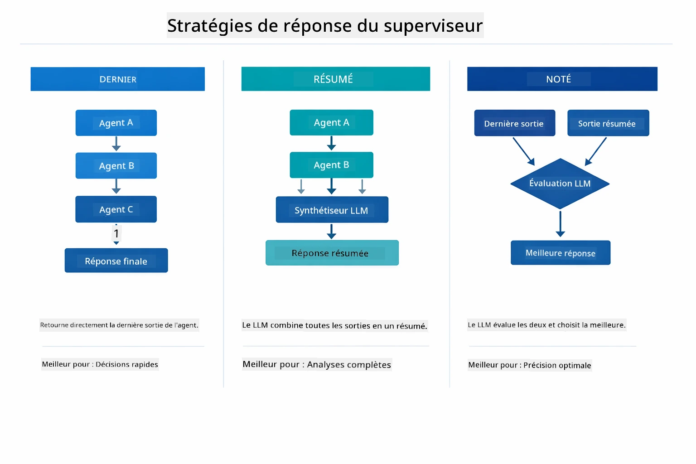

*Trois stratégies pour la formulation de la réponse finale du Supervisor — choisissez selon que vous souhaitez la sortie du dernier agent, un résumé synthétisé, ou l’option ayant le meilleur score.*

Les stratégies disponibles sont :

| Stratégie | Description |
|----------|-------------|
| **LAST** | Le superviseur renvoie la sortie du dernier sous-agent ou outil appelé. Utile quand l’agent final du workflow est spécifiquement conçu pour produire la réponse complète finale (ex. un "Agent de Résumé" dans un pipeline de recherche). |
| **SUMMARY** | Le superviseur utilise son propre modèle linguistique interne (LLM) pour synthétiser un résumé de toute l’interaction et des sorties des sous-agents, puis renvoie ce résumé comme réponse finale. Cela fournit une réponse propre et agrégée à l’utilisateur. |
| **SCORED** | Le système utilise un LLM interne pour évaluer à la fois la réponse LAST et le SUMMARY de l’interaction par rapport à la requête utilisateur originale, et renvoie celle qui obtient la meilleure note. |

Voir [SupervisorAgentDemo.java](../../../05-mcp/src/main/java/com/example/langchain4j/mcp/SupervisorAgentDemo.java) pour l’implémentation complète.

> **🤖 Essayez avec [GitHub Copilot](https://github.com/features/copilot) Chat :** Ouvrez [`SupervisorAgentDemo.java`](../../../05-mcp/src/main/java/com/example/langchain4j/mcp/SupervisorAgentDemo.java) et demandez :
> - « Comment le Supervisor décide-t-il quels agents invoquer ? »
> - « Quelle est la différence entre les patterns Supervisor et Sequential ? »
> - « Comment puis-je personnaliser le comportement de planification du Supervisor ? »

#### Comprendre la Sortie

Quand vous lancez la démo, vous verrez un déroulé structuré de la façon dont le Supervisor orchestre plusieurs agents. Voici ce que chaque section signifie :

```
======================================================================
  FILE → REPORT WORKFLOW DEMO
======================================================================

This demo shows a clear 2-step workflow: read a file, then generate a report.
The Supervisor orchestrates the agents automatically based on the request.
```
  
**L'en-tête** présente le concept du workflow : une pipeline ciblée de la lecture de fichiers à la génération de rapports.

```
--- WORKFLOW ---------------------------------------------------------
  ┌─────────────┐      ┌──────────────┐
  │  FileAgent  │ ───▶ │ ReportAgent  │
  │ (MCP tools) │      │  (pure LLM)  │
  └─────────────┘      └──────────────┘
   outputKey:           outputKey:
   'fileContent'        'report'

--- AVAILABLE AGENTS -------------------------------------------------
  [FILE]   FileAgent   - Reads files via MCP → stores in 'fileContent'
  [REPORT] ReportAgent - Generates structured report → stores in 'report'
```
  
**Diagramme du Workflow** montre le flux de données entre les agents. Chaque agent a un rôle spécifique :  
- **FileAgent** lit les fichiers via les outils MCP et stocke le contenu brut dans `fileContent`  
- **ReportAgent** consomme ce contenu et produit un rapport structuré dans `report`

```
--- USER REQUEST -----------------------------------------------------
  "Read the file at .../file.txt and generate a report on its contents"
```
  
**Requête Utilisateur** montre la tâche. Le Supervisor l’analyse et décide d’invoquer FileAgent → ReportAgent.

```
--- SUPERVISOR ORCHESTRATION -----------------------------------------
  The Supervisor decides which agents to invoke and passes data between them...

  +-- STEP 1: Supervisor chose -> FileAgent (reading file via MCP)
  |
  |   Input: .../file.txt
  |
  |   Result: LangChain4j is an open-source, provider-agnostic Java framework for building LLM...
  +-- [OK] FileAgent (reading file via MCP) completed

  +-- STEP 2: Supervisor chose -> ReportAgent (generating structured report)
  |
  |   Input: LangChain4j is an open-source, provider-agnostic Java framew...
  |
  |   Result: Executive Summary...
  +-- [OK] ReportAgent (generating structured report) completed
```
  
**Orchestration du Supervisor** montre le déroulement en 2 étapes :  
1. **FileAgent** lit le fichier via MCP et stocke le contenu  
2. **ReportAgent** reçoit ce contenu et génère un rapport structuré

Le Supervisor a pris ces décisions **de manière autonome** basé sur la requête utilisateur.

```
--- FINAL RESPONSE ---------------------------------------------------
Executive Summary
...

Key Points
...

Recommendations
...

--- AGENTIC SCOPE (Data Flow) ----------------------------------------
  Each agent stores its output for downstream agents to consume:
  * fileContent: LangChain4j is an open-source, provider-agnostic Java framework...
  * report: Executive Summary...
```
  
#### Explication des Fonctionnalités du Module Agentic

L'exemple démontre plusieurs fonctionnalités avancées du module agentic. Regardons de plus près Agentic Scope et les Agent Listeners.

**Agentic Scope** montre la mémoire partagée où les agents ont stocké leurs résultats via `@Agent(outputKey="...")`. Cela permet :  
- Aux agents ultérieurs d’accéder aux sorties des agents précédents  
- Au Supervisor de synthétiser une réponse finale  
- À vous d’inspecter ce que chaque agent a produit

Le diagramme ci-dessous montre comment Agentic Scope fonctionne comme mémoire partagée dans le workflow fichier-vers-rapport — FileAgent écrit sa sortie sous la clé `fileContent`, ReportAgent la lit et écrit sa propre sortie sous `report` :

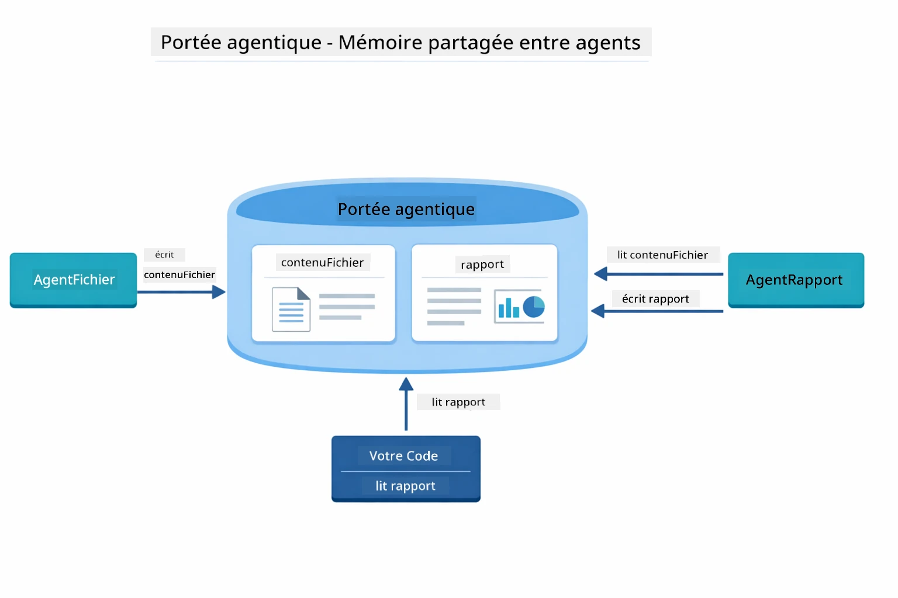

*Agentic Scope agit comme mémoire partagée — FileAgent écrit `fileContent`, ReportAgent le lit et écrit `report`, et votre code lit le résultat final.*

```java
ResultWithAgenticScope<String> result = supervisor.invokeWithAgenticScope(request);
AgenticScope scope = result.agenticScope();
String fileContent = scope.readState("fileContent");  // Données brutes du fichier de FileAgent
String report = scope.readState("report");            // Rapport structuré de ReportAgent
```
  
**Agent Listeners** permettent de surveiller et déboguer l’exécution des agents. La sortie pas à pas que vous voyez dans la démo provient d’un AgentListener qui s’accroche à chaque invocation d’agent :  
- **beforeAgentInvocation** — appelé quand le Supervisor sélectionne un agent, vous permettant de voir quel agent a été choisi et pourquoi  
- **afterAgentInvocation** — appelé à la fin d’une exécution d’agent, affichant son résultat  
- **inheritedBySubagents** — lorsqu’à true, le listener surveille tous les agents de la hiérarchie

Le diagramme suivant montre le cycle complet de vie d’un Agent Listener, incluant la gestion des erreurs via `onError` lors de l’exécution de l’agent :

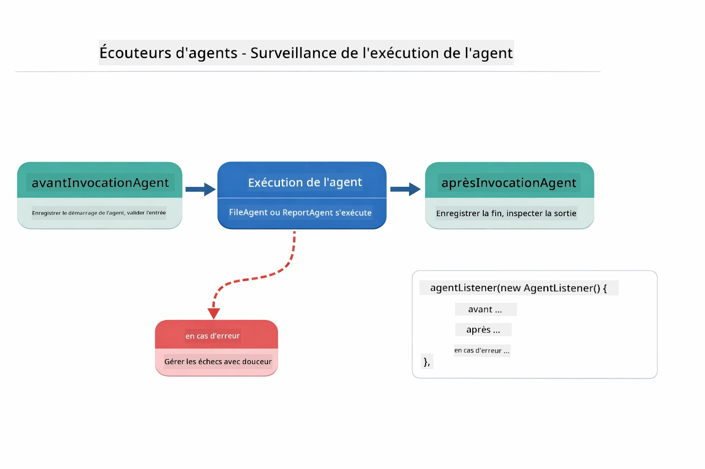

*Les Agent Listeners s’intègrent au cycle d’exécution — surveillez quand les agents démarrent, terminent ou rencontrent des erreurs.*

```java
AgentListener monitor = new AgentListener() {
    private int step = 0;
    
    @Override
    public void beforeAgentInvocation(AgentRequest request) {
        step++;
        System.out.println("  +-- STEP " + step + ": " + request.agentName());
    }
    
    @Override
    public void afterAgentInvocation(AgentResponse response) {
        System.out.println("  +-- [OK] " + response.agentName() + " completed");
    }
    
    @Override
    public boolean inheritedBySubagents() {
        return true; // Propager à tous les sous-agents
    }
};
```
  
Au-delà du pattern Supervisor, le module `langchain4j-agentic` fournit plusieurs patterns puissants pour les workflows. Le diagramme ci-dessous montre les cinq — depuis des pipelines séquentiels simples jusqu’aux workflows d’approbation humains :

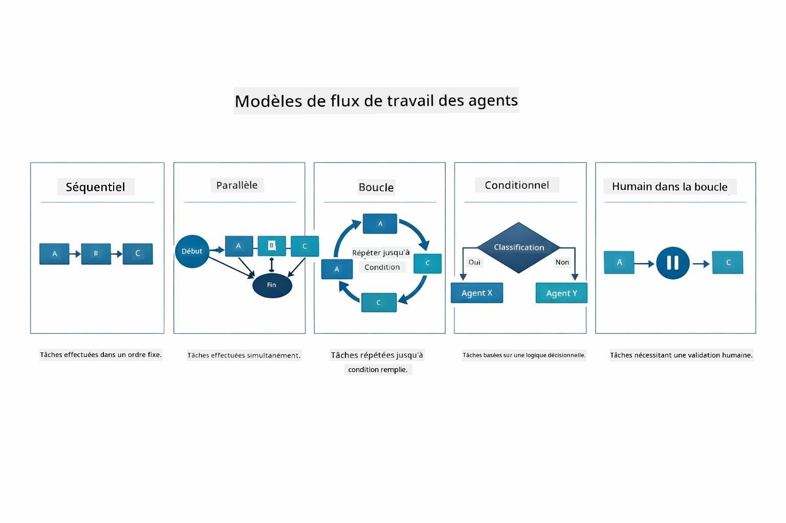

*Cinq patterns de workflows pour orchestrer des agents — des pipelines séquentiels simples aux workflows d’approbation avec intervention humaine.*

| Pattern | Description | Cas d’Usage |
|---------|-------------|-------------|
| **Sequential** | Exécution des agents en ordre, la sortie coule vers le suivant | Pipelines : recherche → analyse → rapport |
| **Parallel** | Exécution simultanée d’agents | Tâches indépendantes : météo + actualités + bourse |
| **Loop** | Itération jusqu’à satisfaction d’une condition | Évaluation qualité : affiner jusqu’à score ≥ 0,8 |
| **Conditional** | Routage selon conditions | Classification → routage vers agent spécialiste |
| **Human-in-the-Loop** | Ajout de points de contrôle humains | Workflows d’approbation, relecture de contenu |

## Concepts Clés

Maintenant que vous avez exploré MCP et le module agentic en action, résumons quand utiliser chaque approche.

Un des grands avantages de MCP est son écosystème en pleine croissance. Le diagramme ci-dessous montre comment un protocole universel unique connecte votre application IA à une grande variété de serveurs MCP — de l’accès filesystem et base de données jusqu’à GitHub, email, scraping web, et plus encore :

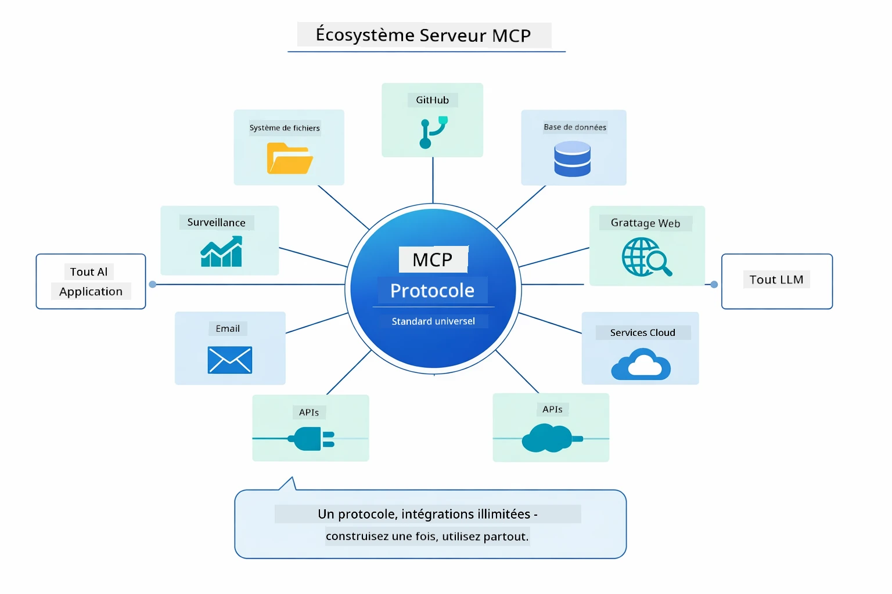

*MCP crée un écosystème de protocole universel — tout serveur compatible MCP fonctionne avec tout client compatible MCP, permettant le partage d’outils entre applications.*

**MCP** est idéal lorsque vous voulez exploiter des écosystèmes d’outils existants, construire des outils que plusieurs applications peuvent partager, intégrer des services tiers avec des protocoles standard, ou remplacer des implémentations d’outils sans changer de code.

**Le Module Agentic** fonctionne le mieux lorsque vous souhaitez des définitions agent déclaratives avec annotations `@Agent`, avez besoin d’orchestration de workflows (séquentiel, boucle, parallèle), préférez la conception par interfaces plutôt que par code impératif, ou combinez plusieurs agents partageant des sorties via `outputKey`.

**Le pattern Supervisor Agent** est idéal quand le workflow n’est pas prévisible à l’avance et que vous voulez que le LLM décide, quand vous avez plusieurs agents spécialisés nécessitant une orchestration dynamique, pour construire des systèmes conversationnels routant vers différentes capacités, ou pour obtenir un comportement d’agent très flexible et adaptatif.

Pour vous aider à choisir entre les méthodes personnalisées `@Tool` du Module 04 et les outils MCP de ce module, ce comparatif ci-dessous met en évidence les compromis clés — les outils personnalisés offrent un couplage fort et une sécurité de types complète pour la logique spécifique, tandis que les outils MCP proposent des intégrations standardisées et réutilisables :

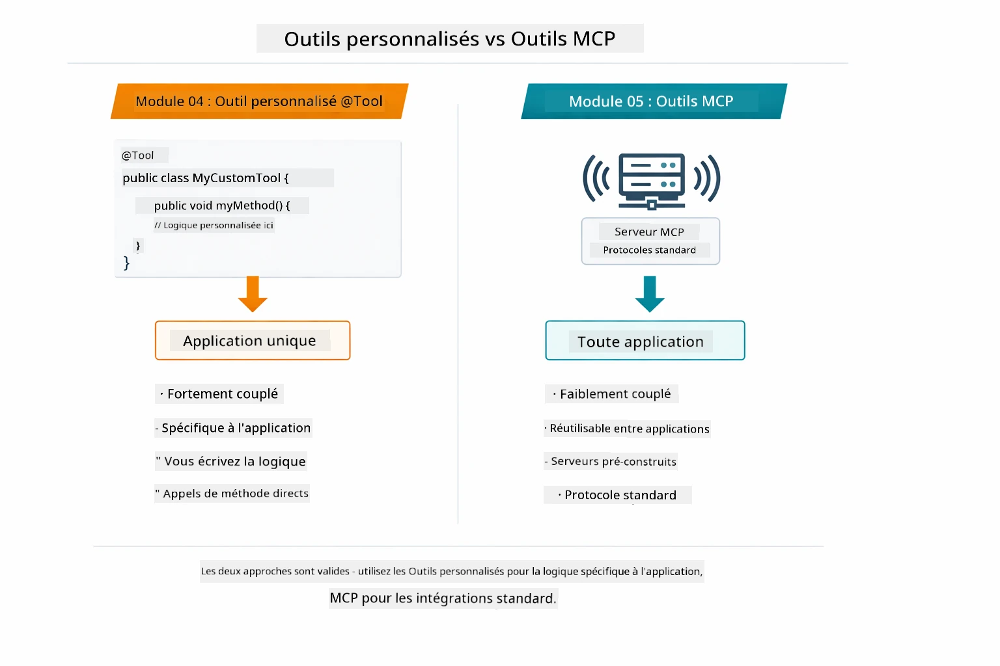

*Quand utiliser des méthodes custom @Tool vs des outils MCP — des outils custom pour la logique spécifique avec sécurité forte de types, des outils MCP pour des intégrations standardisées fonctionnant à travers les applications.*

## Félicitations !

Vous avez terminé les cinq modules du cours LangChain4j pour débutants ! Voici un aperçu du parcours complet que vous avez réalisé — du chat basique jusqu’aux systèmes agentic alimentés par MCP :

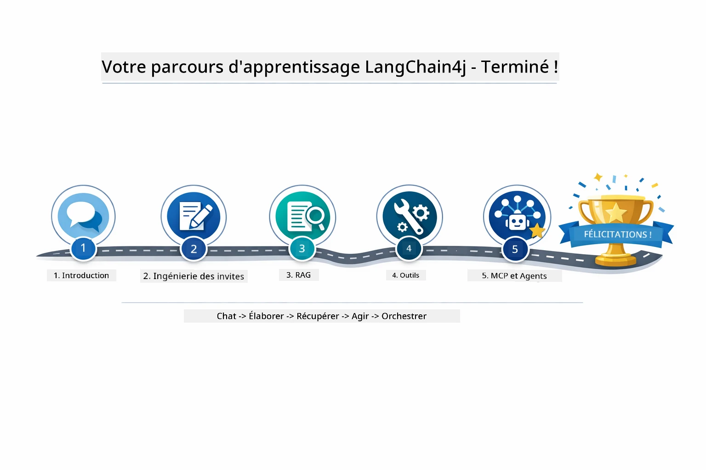

*Votre parcours d’apprentissage complet à travers les cinq modules — du chat basique aux systèmes agentic propulsés par MCP.*

Vous avez appris :

- Construire des IA conversationnelles avec mémoire (Module 01)  
- Modèles d’ingénierie de prompts pour différentes tâches (Module 02)  
- Ancrer les réponses dans vos documents avec RAG (Module 03)  
- Créer des agents IA basiques (assistants) avec outils personnalisés (Module 04)  
- Intégrer des outils standardisés avec les modules LangChain4j MCP et Agentic (Module 05)  

### Et après ?

Après avoir terminé les modules, explorez le [Guide de Test](../docs/TESTING.md) pour voir les concepts de test LangChain4j en action.

**Ressources Officielles :**  
- [Documentation LangChain4j](https://docs.langchain4j.dev/) — Guides complets et référence API  
- [LangChain4j GitHub](https://github.com/langchain4j/langchain4j) — Code source et exemples  
- [Tutoriels LangChain4j](https://docs.langchain4j.dev/tutorials/) — Tutoriels pas à pas pour divers cas d'usage  

Merci d'avoir suivi ce cours !

---

**Navigation :** [← Précédent : Module 04 - Outils](../04-tools/README.md) | [Retour au début](../README.md)

---

<!-- CO-OP TRANSLATOR DISCLAIMER START -->
**Avertissement** :  
Ce document a été traduit à l’aide du service de traduction automatique [Co-op Translator](https://github.com/Azure/co-op-translator). Bien que nous nous efforcions d’assurer l’exactitude, veuillez noter que les traductions automatisées peuvent contenir des erreurs ou des inexactitudes. Le document original dans sa langue d’origine doit être considéré comme la source faisant foi. Pour des informations cruciales, il est recommandé de recourir à une traduction professionnelle réalisée par un humain. Nous ne saurions être tenus responsables de tout malentendu ou interprétation erronée résultant de l’utilisation de cette traduction.
<!-- CO-OP TRANSLATOR DISCLAIMER END -->