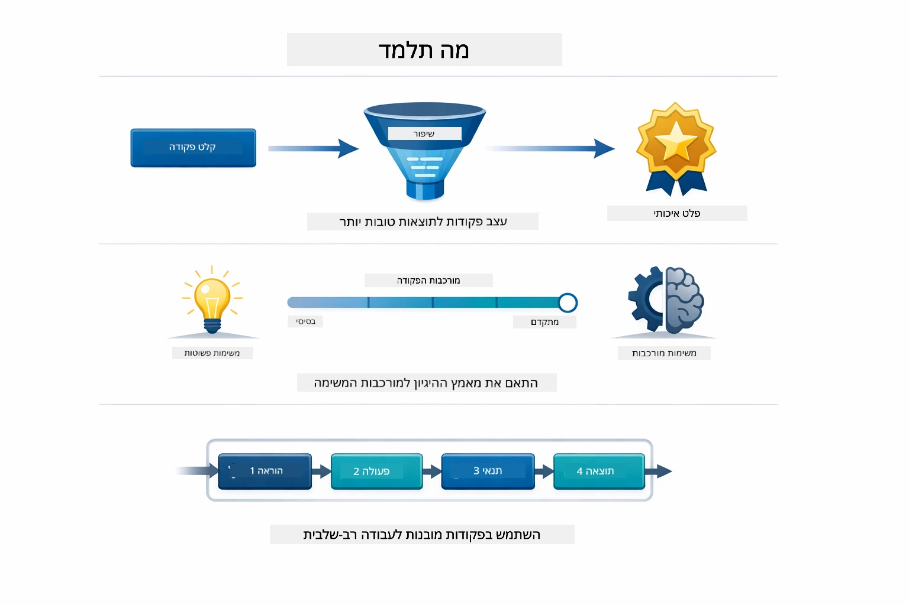
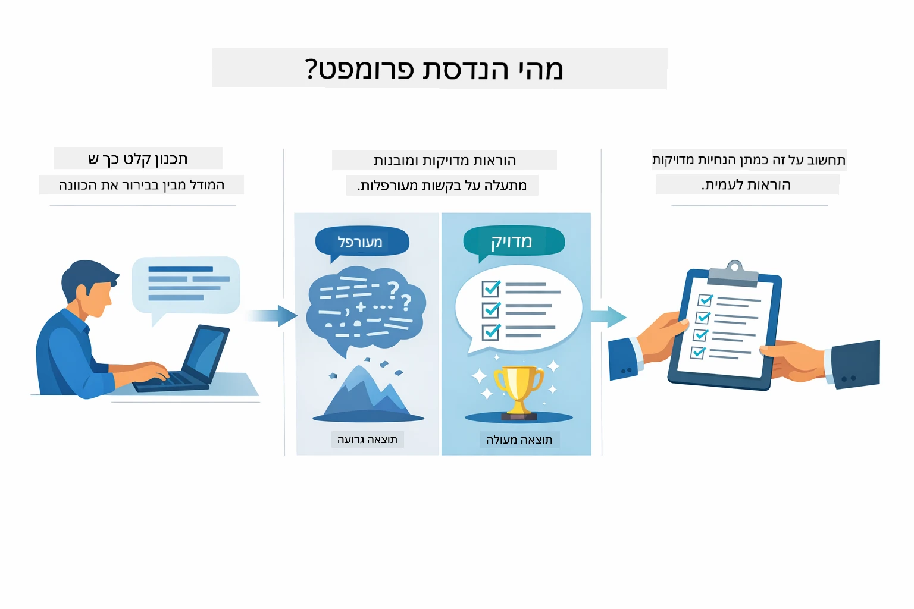
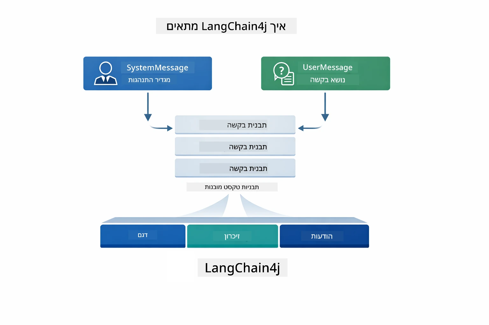
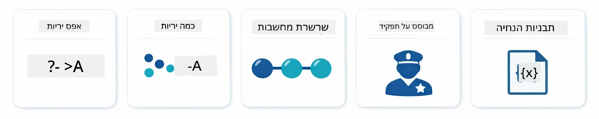
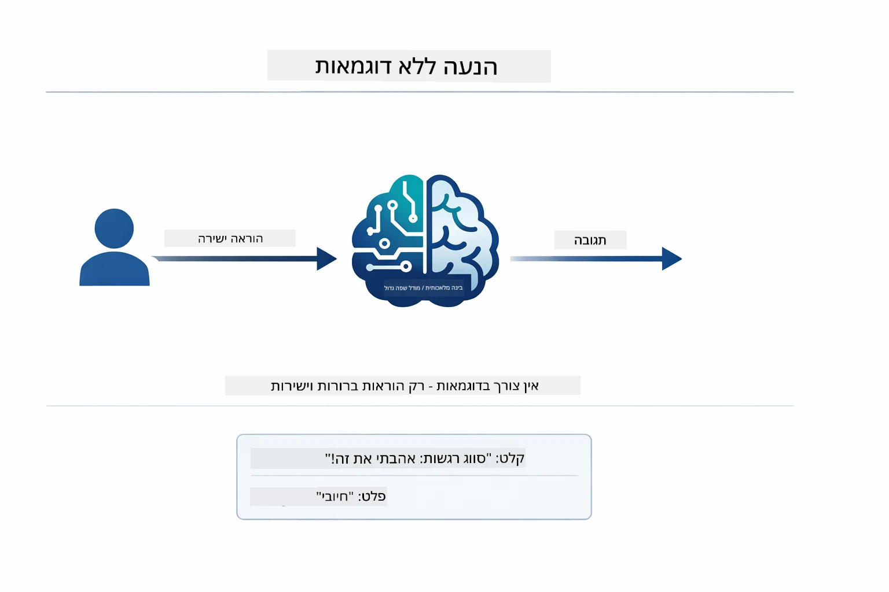
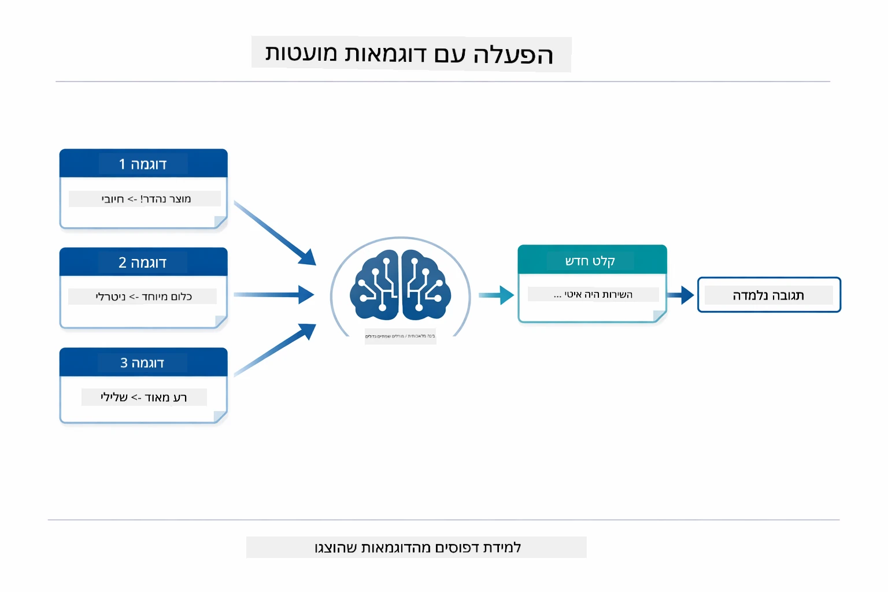
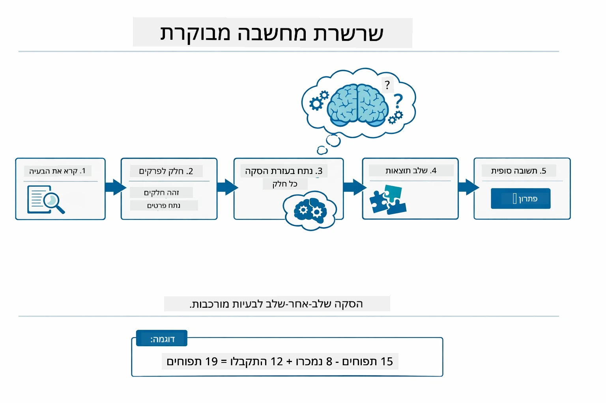
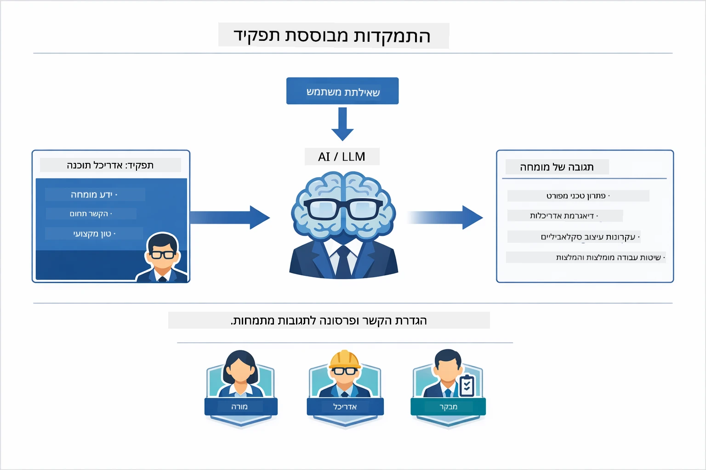
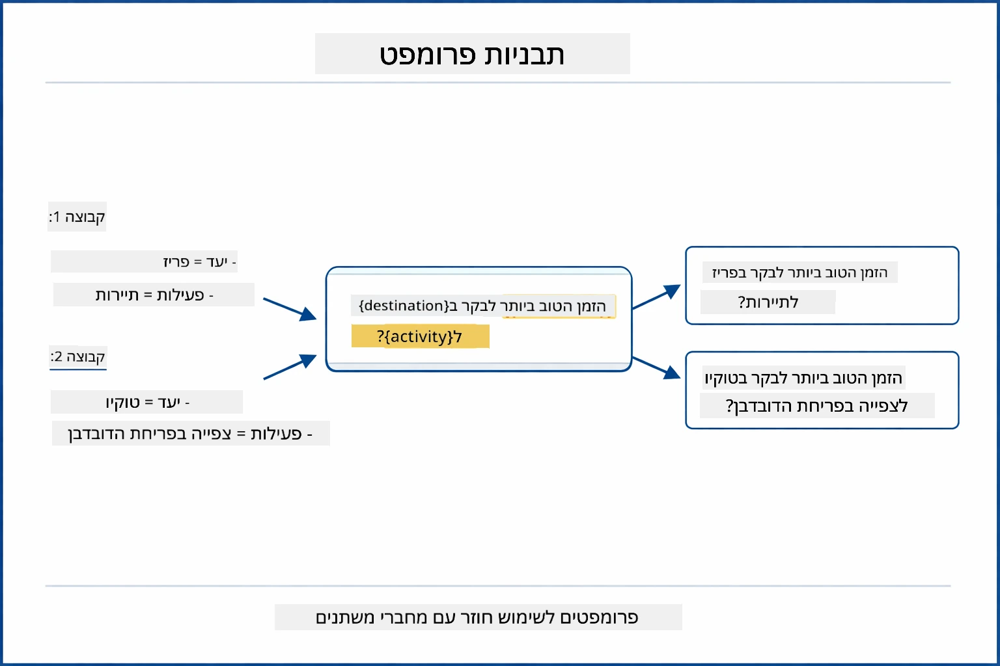
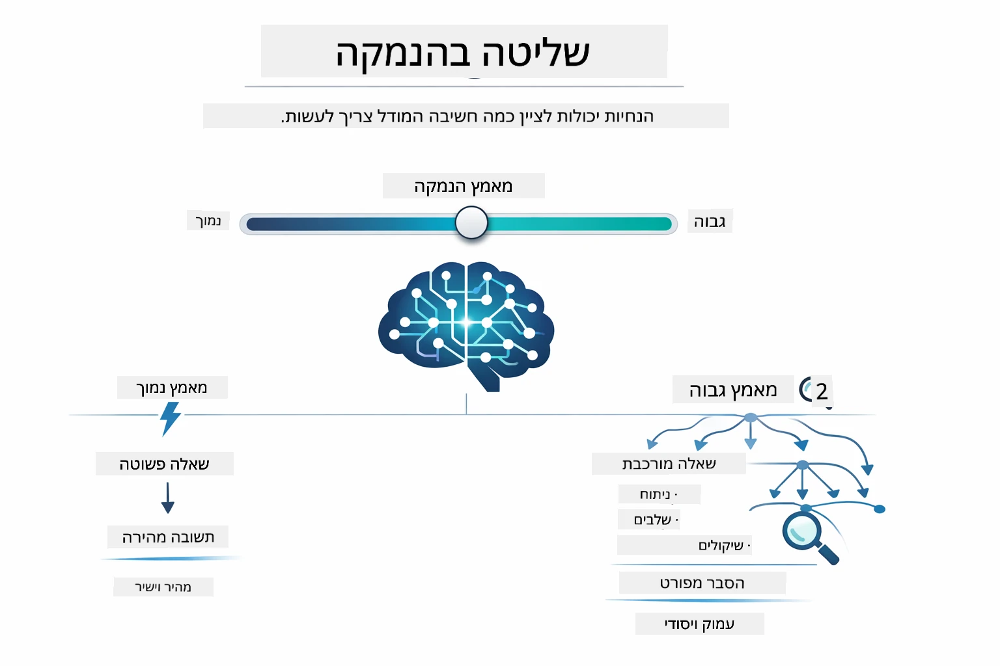

# מודול 02: הנדסת פרומפטים עם GPT-5.2

## תוכן העניינים

- [סרטון הדרכה](../../../02-prompt-engineering)
- [מה תלמדו](../../../02-prompt-engineering)
- [דרישות מוקדמות](../../../02-prompt-engineering)
- [הבנת הנדסת פרומפטים](../../../02-prompt-engineering)
- [יסודות הנדסת פרומפטים](../../../02-prompt-engineering)
  - [פרומפטינג זירו-שוט](../../../02-prompt-engineering)
  - [פרומפטינג פייו-שוט](../../../02-prompt-engineering)
  - [שרשרת מחשבה](../../../02-prompt-engineering)
  - [פרומפטינג מבוסס תפקיד](../../../02-prompt-engineering)
  - [תבניות פרומפטים](../../../02-prompt-engineering)
- [תבניות מתקדמות](../../../02-prompt-engineering)
- [שימוש במשאבי Azure קיימים](../../../02-prompt-engineering)
- [צילום מסך של האפליקציה](../../../02-prompt-engineering)
- [חקירת התבניות](../../../02-prompt-engineering)
  - [רצון נמוך מול גבוה](../../../02-prompt-engineering)
  - [ביצוע משימות (פתיחי כלים)](../../../02-prompt-engineering)
  - [קוד המשתקף לעצמו](../../../02-prompt-engineering)
  - [ניתוח מובנה](../../../02-prompt-engineering)
  - [שיחה רב-סיבובית](../../../02-prompt-engineering)
  - [הסקת מסקנות שלב-אחר-שלב](../../../02-prompt-engineering)
  - [פלט מוגבל](../../../02-prompt-engineering)
- [מה אתם באמת לומדים](../../../02-prompt-engineering)
- [השלבים הבאים](../../../02-prompt-engineering)

## סרטון הדרכה

צפו במפגש חי המסביר כיצד להתחיל עם מודול זה:

<a href="https://www.youtube.com/live/PJ6aBaE6bog?si=LDshyBrTRodP-wke"></a>

## מה תלמדו



במודול הקודם ראיתם כיצד זיכרון מאפשר בינה שיחית ושמעתם להשתמש בדגמי GitHub לאינטראקציות בסיסיות. כעת נתמקד באופן שבו אתם שואלים שאלות — כלומר הפרומפטים עצמם — תוך שימוש ב-GPT-5.2 של Azure OpenAI. האופן שבו אתם מבנים את הפרומפטים משפיע דרמטית על איכות התגובות שאתם מקבלים. נתחיל בסקירה של הטכניקות הבסיסיות לפרומפטינג, ולאחר מכן נעבור לשמונה תבניות מתקדמות שמנצלות באופן מלא את יכולות GPT-5.2.

נשתמש ב-GPT-5.2 מפני שהוא מציג שליטה בהסקת מסקנות - אתם יכולים להגיד למודל כמה לחשוב לפני התגובה. זה מבהיר אסטרטגיות פרומפט שונות ועוזר להבין מתי להשתמש בכל אחת מהן. כמו כן, נרוויח מהמגבלות פחות מחמירות של Azure ביחס ל-GPT-5.2 לעומת דגמי GitHub.

## דרישות מוקדמות

- השלמת מודול 01 (משאבי Azure OpenAI מושקעים)
- קובץ `.env` בתיקיית השורש עם אישורי Azure (נוצר על ידי `azd up` במודול 01)

> **הערה:** אם לא השלמת את מודול 01, עקוב אחר הוראות ההשקה שם תחילה.

## הבנת הנדסת פרומפטים



הנדסת פרומפטים עוסקת בתכנון טקסט קלט שמקבל באופן עקבי את התוצאות שאתם צריכים. זה לא רק לשאול שאלות - זה למבנה בקשות כך שהמודל יבין בדיוק מה אתם רוצים וכיצד לספק זאת.

תחשבו על זה כמו מתן הוראות לעמית לעבודה. "תקן את הבאג" זה לא ברור. "תקן את חריגת המצב null pointer ב-UserService.java שורה 45 על ידי הוספת בדיקת null" זו הוראה ספציפית. דגמי שפה פועלים באותה הדרך - חשיבות למפורטות ולמבנה.



LangChain4j מספק את התשתית — חיבורי מודל, זיכרון וסוגי הודעות — בעוד שתבניות פרומפט הן פשוט טקסט מובנה היטב שאתם שולחים דרך התשתית הזו. אבני הבניין המרכזיות הן `SystemMessage` (שמגדיר את התנהגות ותפקיד ה-AI) ו-`UserMessage` (שנושא את בקשתכם בפועל).

## יסודות הנדסת פרומפטים



לפני שנצלול לתבניות המתקדמות במודול זה, נעבור על חמש טכניקות פרומפטינג מבוססות יסוד. אלה אבני הבניין שכל מהנדס פרומפט צריך להכיר. אם כבר עבדתם במודול [Quick Start](../00-quick-start/README.md#2-prompt-patterns), ראיתם אותן בפעולה — הנה המסגרת המושגית שמאחוריהן.

### פרומפטינג זירו-שוט

הגישה הפשוטה ביותר: הענק למודל הוראה ישירה ללא דוגמאות. המודל מסתמך כולו על האימון שלו להבנת וביצוע המשימה. זה עובד טוב לבקשות פשוטות שבהן ההתנהגות המצופה ברורה.



*הוראה ישירה ללא דוגמאות — המודל מפיק את המשימה רק מההוראה*

```java
String prompt = "Classify this sentiment: 'I absolutely loved the movie!'";
String response = model.chat(prompt);
// תגובה: "חיובי"
```
  
**מתי להשתמש:** סיווגים פשוטים, שאלות ישירות, תרגומים או כל משימה שהמודל יכול להתמודד איתה ללא הדרכה נוספת.

### פרומפטינג פייו-שוט

ספק דוגמאות שמדגימות את התבנית שברצונך שהמודל יעקוב אחריה. המודל לומד את פורמט הקלט-פלט הצפוי מהדוגמאות ומיישם אותו על קלטים חדשים. זה משפר דרמטית את העקביות במשימות שבהן הפורמט או ההתנהגות הרצויים אינם ברורים.



*לומד מדוגמאות — המודל מזהה את התבנית ומיישם אותה על קלטים חדשים*

```java
String prompt = """
    Classify the sentiment as positive, negative, or neutral.
    
    Examples:
    Text: "This product exceeded my expectations!" → Positive
    Text: "It's okay, nothing special." → Neutral
    Text: "Waste of money, very disappointed." → Negative
    
    Now classify this:
    Text: "Best purchase I've made all year!"
    """;
String response = model.chat(prompt);
```
  
**מתי להשתמש:** סיווגים מותאמים, עיצוב עקבי, משימות תחום ספציפיות, או כאשר תוצאות זירו-שוט אינן עקביות.

### שרשרת מחשבה

בקש מהמודל להראות את הסקת המסקנות שלו שלב אחרי שלב. במקום לקפוץ ישר לתשובה, המודל מפרק את הבעיה ועובד על כל חלק במפורש. זה משפר את הדיוק במשימות מתמטיות, לוגיקה והסקת מסקנות רב-שלבית.



*הסקת מסקנות שלב-אחר-שלב — פירוק בעיות מורכבות לצעדים לוגיים מפורשים*

```java
String prompt = """
    Problem: A store has 15 apples. They sell 8 apples and then 
    receive a shipment of 12 more apples. How many apples do they have now?
    
    Let's solve this step-by-step:
    """;
String response = model.chat(prompt);
// המודל מראה: 15 - 8 = 7, ואז 7 + 12 = 19 תפוחים
```
  
**מתי להשתמש:** בעיות מתמטיות, חידות לוגיות, איתור שגיאות, או כל משימה שבה הצגת תהליך ההסקה משפרת את הדיוק והאמינות.

### פרומפטינג מבוסס תפקיד

קבע פרסונה או תפקיד ל-AI לפני שאילת השאלה. זה מספק הקשר שמעצבים את הטון, העומק והפוקוס בתגובה. "ארכיטקט תוכנה" נותן עצות שונות מ"מפתח זוטר" או "מבקר אבטחה".



*הגדרת הקשר ופרסונה — אותה שאלה מקבלת תגובה שונה בהתאם לתפקיד שהוקצה*

```java
String prompt = """
    You are an experienced software architect reviewing code.
    Provide a brief code review for this function:
    
    def calculate_total(items):
        total = 0
        for item in items:
            total = total + item['price']
        return total
    """;
String response = model.chat(prompt);
```
  
**מתי להשתמש:** סקירת קוד, הדרכה, ניתוח תחום ספציפי, או כאשר יש צורך בתגובות מותאמות לרמת מומחיות או נקודת מבט מסוימת.

### תבניות פרומפטים

צור פרומפטים חוזרים שניתנים לשימוש עם משתנים דינמיים. במקום לכתוב פרומפט חדש בכל פעם, הגדר תבנית פעם אחת ומלא ערכים שונים. מחלקת `PromptTemplate` של LangChain4j עושה זאת קל באמצעות תחביר `{{variable}}`.



*פרומפטים לשימוש חוזר עם משתנים דינמיים — תבנית אחת, שימושים רבים*

```java
PromptTemplate template = PromptTemplate.from(
    "What's the best time to visit {{destination}} for {{activity}}?"
);

Prompt prompt = template.apply(Map.of(
    "destination", "Paris",
    "activity", "sightseeing"
));

String response = model.chat(prompt.text());
```
  
**מתי להשתמש:** שאילתות חוזרות עם קלטים שונים, עיבוד אצווה, בניית זרימות עבודה חוזרות של AI, או כל תרחיש שבו מבנה הפרומפט נשאר זהה אך הנתונים משתנים.

---

חמשת היסודות האלה מספקים לכם ערכת כלים איתנה ברוב משימות הפרומפטינג. שאר המודול מבוסס עליהם וכולל **שמונה תבניות מתקדמות** שמנצילות את שליטת ההסקה, הערכה עצמית, ויכולות הפלט המובנה של GPT-5.2.

## תבניות מתקדמות

כעת, לאחר שסקרנו את היסודות, נעבור לשמונה התבניות המתקדמות שהופכות מודול זה לייחודי. לא כל הבעיות דורשות את האותה גישה. יש שאלות שצריכות תשובות מהירות, אחרות דורשות חשיבה עמוקה. יש כאלה שצריכות הסבר נראה לעין, ואחרות רק תוצאות. כל תבנית בהמשך מותאמת לתרחיש שונה — ושליטת ההסקה של GPT-5.2 מדגישה את ההבדלים הללו.


*סקירה כללית של שמונת תבניות הנדסת הפרומפטים ושימושיהן*



*שליטת ההסקה של GPT-5.2 מאפשרת לכם לציין כמה לחשוב המודל - מתשובות מהירות ישירות ועד חיפוש מעמיק*

**רצון נמוך (מהיר וממוקד)** - לשאלות פשוטות שבהן רוצים תשובות מהירות וישירות. המודל מבצע הסקה מינימלית - מקסימום 2 שלבים. השתמשו בזה לחישובים, חיפושים או שאלות פשוטות.

```java
String prompt = """
    <context_gathering>
    - Search depth: very low
    - Bias strongly towards providing a correct answer as quickly as possible
    - Usually, this means an absolute maximum of 2 reasoning steps
    - If you think you need more time, state what you know and what's uncertain
    </context_gathering>
    
    Problem: What is 15% of 200?
    
    Provide your answer:
    """;

String response = chatModel.chat(prompt);
```
  
> 💡 **חקור עם GitHub Copilot:** פתח את [`Gpt5PromptService.java`](../../../02-prompt-engineering/src/main/java/com/example/langchain4j/prompts/service/Gpt5PromptService.java) ושאל:  
> - "מה ההבדל בין תבניות פרומפטינג של רצון נמוך לעומת רצון גבוה?"  
> - "כיצד תגי XML בפרומפטים עוזרים במבנה תגובת ה-AI?"  
> - "מתי כדאי להשתמש בתבניות השתקפות עצמית מול הוראות ישירות?"

**רצון גבוה (עמוק ומקיף)** - לבעיות מורכבות שבהן רוצים ניתוח מעמיק. המודל חוקר לעומק ומציג הסבר מפורט. השתמשו בזה לתכנון מערכות, החלטות ארכיטקטוניות, או מחקר מורכב.

```java
String prompt = """
    Analyze this problem thoroughly and provide a comprehensive solution.
    Consider multiple approaches, trade-offs, and important details.
    Show your analysis and reasoning in your response.
    
    Problem: Design a caching strategy for a high-traffic REST API.
    """;

String response = chatModel.chat(prompt);
```
  
**ביצוע משימות (התקדמות שלב אחרי שלב)** - זרימות עבודה רב-שלביות. המודל מספק תוכנית מראש, מתאר כל שלב במהלך העבודה, ואז מסכם. השתמשו בזה למיגרציות, יישומים, או כל תהליך רב-שלבי.

```java
String prompt = """
    <task_execution>
    1. First, briefly restate the user's goal in a friendly way
    
    2. Create a step-by-step plan:
       - List all steps needed
       - Identify potential challenges
       - Outline success criteria
    
    3. Execute each step:
       - Narrate what you're doing
       - Show progress clearly
       - Handle any issues that arise
    
    4. Summarize:
       - What was completed
       - Any important notes
       - Next steps if applicable
    </task_execution>
    
    <tool_preambles>
    - Always begin by rephrasing the user's goal clearly
    - Outline your plan before executing
    - Narrate each step as you go
    - Finish with a distinct summary
    </tool_preambles>
    
    Task: Create a REST endpoint for user registration
    
    Begin execution:
    """;

String response = chatModel.chat(prompt);
```
  
פרומפטינג שרשרת-מחשבה מבקש במפורש מהמודל להראות את תהליך הסקת המסקנות שלו, ומשפר את הדיוק במשימות מורכבות. הפירוק שלב אחרי שלב עוזר הן לבני אדם והן ל-AI להבין את הלוגיקה.

> **🤖 נסה עם [GitHub Copilot](https://github.com/features/copilot) Chat:** שאל על תבנית זו:  
> - "איך אוכל להתאים את תבנית ביצוע המשימות לפעולות ארוכות טווח?"  
> - "מהן שיטות העבודה הטובות ביותר למבני פתיחי כלים באפליקציות פרודקשן?"  
> - "איך ניתן ללכוד ולהציג עדכוני התקדמות ביניים בממשק המשתמש?"


*תכנון → ביצוע → סיכום לזרימות עבודה רב-שלביות*

**קוד המשתקף לעצמו** - ליצירת קוד באיכות פרודקשן. המודל מייצר קוד עם קווי הנחיה לטיפול בשגיאות. השתמשו בזה כאשר בונים תכונות או שירותים חדשים.

```java
String prompt = """
    Generate Java code with production-quality standards: Create an email validation service
    Keep it simple and include basic error handling.
    """;

String response = chatModel.chat(prompt);
```
  


*לולאת שיפור איטרטיבית - יצירה, הערכה, זיהוי בעיות, שיפור, חזרה*

**ניתוח מובנה** - להערכות עקביות. המודל סוקר קוד במסגרת קבועה (נכונות, שיטות, ביצועים, אבטחה, תחזוקה). השתמשו בזה לסקירת קוד והערכת איכות.

```java
String prompt = """
    <analysis_framework>
    You are an expert code reviewer. Analyze the code for:
    
    1. Correctness
       - Does it work as intended?
       - Are there logical errors?
    
    2. Best Practices
       - Follows language conventions?
       - Appropriate design patterns?
    
    3. Performance
       - Any inefficiencies?
       - Scalability concerns?
    
    4. Security
       - Potential vulnerabilities?
       - Input validation?
    
    5. Maintainability
       - Code clarity?
       - Documentation?
    
    <output_format>
    Provide your analysis in this structure:
    - Summary: One-sentence overall assessment
    - Strengths: 2-3 positive points
    - Issues: List any problems found with severity (High/Medium/Low)
    - Recommendations: Specific improvements
    </output_format>
    </analysis_framework>
    
    Code to analyze:
    ```
    public List getUsers() {
        return database.query("SELECT * FROM users");
    }
    ```
    Provide your structured analysis:
    """;

String response = chatModel.chat(prompt);
```
  
> **🤖 נסה עם [GitHub Copilot](https://github.com/features/copilot) Chat:** שאל על ניתוח מובנה:  
> - "כיצד ניתן להתאים את מסגרת הניתוח לסוגים שונים של סקירות קוד?"  
> - "מה הדרך הטובה ביותר לפרש ולפעול על פלט מובנה בתכנות?"  
> - "כיצד להבטיח רמות חומרה עקביות במפגשי סקירה שונים?"


*מסגרת לסקירות קוד עקביות עם רמות חומרה*

**שיחה רב-סיבובית** - לשיחות שדורשות הקשר. המודל זוכר הודעות קודמות ובונה עליהן. השתמשו בזה למפגשי עזרה אינטראקטיביים או שאלות מורכבות.

```java
ChatMemory memory = MessageWindowChatMemory.withMaxMessages(10);

memory.add(UserMessage.from("What is Spring Boot?"));
AiMessage aiMessage1 = chatModel.chat(memory.messages()).aiMessage();
memory.add(aiMessage1);

memory.add(UserMessage.from("Show me an example"));
AiMessage aiMessage2 = chatModel.chat(memory.messages()).aiMessage();
memory.add(aiMessage2);
```
  


*כיצד מצטבר הקשר בשיחה על פני סיבובים מרובים עד לגבול הטוקנים*

**הסקת מסקנות שלב-אחר-שלב** - לבעיות שדורשות לוגיקה נראית לעין. המודל מציג הסברים מפורשים לכל שלב. השתמשו בזה לבעיות מתמטיות, חידות לוגיות, או כאשר רוצים להבין את תהליך החשיבה.

```java
String prompt = """
    <instruction>Show your reasoning step-by-step</instruction>
    
    If a train travels 120 km in 2 hours, then stops for 30 minutes,
    then travels another 90 km in 1.5 hours, what is the average speed
    for the entire journey including the stop?
    """;

String response = chatModel.chat(prompt);
```
  


*פירוק בעיות לצעדים לוגיים מפורשים*

**פלט מוגבל** - לתגובות עם דרישות פורמט ספציפיות. המודל מקפיד על כללי פורמט ואורך. השתמשו בזה לסיכומים או כאשר נדרש מבנה פלט מדויק.

```java
String prompt = """
    <constraints>
    - Exactly 100 words
    - Bullet point format
    - Technical terms only
    </constraints>
    
    Summarize the key concepts of machine learning.
    """;

String response = chatModel.chat(prompt);
```
  


*אכיפת דרישות פורמט, אורך ומבנה ספציפיות*

## שימוש במשאבי Azure קיימים

**וודא פריסה:**

וודא שקובץ `.env` קיים בתיקיית השורש עם אישורי Azure (נוצר במהלך מודול 01):  
```bash
cat ../.env  # צריך להציג את AZURE_OPENAI_ENDPOINT, API_KEY, DEPLOYMENT
```
  
**הפעל את האפליקציה:**

> **הערה:** אם כבר הפעלת את כל האפליקציות עם `./start-all.sh` מתוך מודול 01, מודול זה כבר רץ על פורט 8083. ניתן לדלג על פקודות ההפעלה למטה ולעבור ישירות לכתובת http://localhost:8083.
**אפשרות 1: שימוש בלוח הבקרה של Spring Boot (מומלץ למשתמשי VS Code)**

מיכל הפיתוח כולל את תוסף Spring Boot Dashboard, שמספק ממשק חזותי לניהול כל אפליקציות Spring Boot. ניתן למצוא אותו בסרגל הפעילות בצד שמאל של VS Code (חפש את סמל Spring Boot).

מלוח הבקרה של Spring Boot, ניתן:
- לראות את כל אפליקציות Spring Boot הזמינות בסביבת העבודה
- להתחיל/להפסיק אפליקציות בלחיצה אחת
- לצפות בלוגים של האפליקציה בזמן אמת
- לנטר את מצב האפליקציה

פשוט לחץ על כפתור ההפעלה שליד "prompt-engineering" כדי להפעיל את המודול הזה, או הפעל את כל המודולים בבת אחת.


**אפשרות 2: שימוש בסקריפטים של שורת הפקודה**

הפעל את כל אפליקציות האינטרנט (מודולים 01-04):

**Bash:**
```bash
cd ..  # מתיקיית השורש
./start-all.sh
```

**PowerShell:**
```powershell
cd ..  # מספריית השורש
.\start-all.ps1
```

או הפעל רק את המודול הזה:

**Bash:**
```bash
cd 02-prompt-engineering
./start.sh
```

**PowerShell:**
```powershell
cd 02-prompt-engineering
.\start.ps1
```

שני הסקריפטים טוענים אוטומטית משתני סביבה מקובץ ה-`.env` השורשי ויבנו את קבצי ה-JAR אם הם לא קיימים.

> **הערה:** אם אתה מעדיף לבנות את כל המודולים באופן ידני לפני ההפעלה:
>
> **Bash:**
> ```bash
> cd ..  # Go to root directory
> mvn clean package -DskipTests
> ```
>
> **PowerShell:**
> ```powershell
> cd ..  # Go to root directory
> mvn clean package -DskipTests
> ```

פתח את http://localhost:8083 בדפדפן שלך.

**כדי לעצור:**

**Bash:**
```bash
./stop.sh  # רק מודול זה
# או
cd .. && ./stop-all.sh  # כל המודולים
```

**PowerShell:**
```powershell
.\stop.ps1  # רק את המודול הזה
# או
cd ..; .\stop-all.ps1  # כל המודולים
```

## צילומי מסך של האפליקציה


*לוח הבקרה הראשי המציג את כל 8 תבניות הנדסת פרומפט עם המאפיינים ומקרי השימוש שלהן*

## חקירת התבניות

הממשק האינטרנטי מאפשר לך להתנסות באסטרטגיות הפנייה שונות. כל תבנית פותרת בעיות שונות – נסה אותן כדי לראות מתי כל גישה מתבלטת.

> **הערה: סטרימינג לעומת לא סטרימינג** — בכל עמוד תבנית יש שני כפתורים: **🔴 זרם תגובה (חי)** ואפשרות **ללא סטרימינג**. הסטרימינג משתמש ב-Server-Sent Events (SSE) להצגת הטוקנים בזמן אמת בזמן שהמודל מייצר אותם, כך שאתה רואה את ההתקדמות מיידית. אפשרות ללא סטרימינג מחכה לתגובה המלאה לפני הצגתה. לפרומפטים שמעוררים חשיבה עמוקה (למשל High Eagerness, Self-Reflecting Code), הקריאה ללא סטרימינג יכולה לקחת זמן רב מאוד – לפעמים דקות – ללא משוב נראה. **השתמש בסטרימינג כשאתה מתנסה בפרומפטים מורכבים** כדי שתוכל לראות את עבודת המודל ולהימנע מהתרשמות שהבקשה התנתקה.
>
> **הערה: דרישת דפדפן** — תכונת הסטרימינג משתמשת ב-API Fetch Streams (`response.body.getReader()`) שדורש דפדפן מלא (Chrome, Edge, Firefox, Safari). היא **לא** עובדת בדפדפן הפשוט המובנה של VS Code, משום שה-webview שלו לא תומך ב-ReadableStream API. אם אתה משתמש בדפדפן הפשוט, כפתורי ללא סטרימינג יפעלו כרגיל – רק כפתורי הסטרימינג מושפעים. פתח את `http://localhost:8083` בדפדפן חיצוני לחוויה מלאה.

### Eagerness נמוך לעומת גבוה

שאל שאלה פשוטה כמו "מהו 15% מ-200?" עם Eagerness נמוך. תקבל תשובה מיידית וישירה. עכשיו שאל משהו מורכב כמו "עצב אסטרטגיית מטמון ל-API בעל תנועה גבוהה" עם Eagerness גבוה. לחץ על **🔴 זרם תגובה (חי)** וצפה בהסבר המפורט שמתפתח טוקן אחר טוקן. אותו מודל, אותה מבנה שאלה – אבל הפרומפט מורה כמה לחשוב.

### ביצוע משימות (פתיחי כלים)

זרימות עבודה רב-שלביות נהנות מתכנון מוקדם וסיפור התקדמות. המודל מציג מראש מה יעשה, מספר כל שלב, ואז מסכם תוצאות.

### קוד עם השתקפות עצמית

נסה "צור שירות אימות אימייל". במקום רק לכתוב קוד ולעצור, המודל מייצר, מעריך לפי קריטריונים של איכות, מזהה חולשות ומשפר. תראה אותו חוזר על עצמו עד שהקוד עומד בסטנדרטים של הפקה.

### ניתוח מובנה

ביקורות קוד דורשות מסגרות הערכה קבועות. המודל מנתח קוד באמצעות קטגוריות קבועות (נכונות, פרקטיקות, ביצועים, אבטחה) עם דרגות חומרה.

### שיחה רב-פעמים

שאל "מה זה Spring Boot?" ואז מיד המשך עם "הראה לי דוגמה". המודל זוכר את השאלה הראשונה ונותן לך דוגמה ספציפית ל-Spring Boot. בלי זיכרון, השאלה השנייה הייתה עמומה מדי.

### הסקת מסקנות שלב אחר שלב

בחר בעיית מתמטיקה ונסה אותה עם הסקת מסקנות שלב אחר שלב ועם Eagerness נמוך. Eagerness נמוך פשוט נותן לך את התשובה – מהיר אך לא ברור. שלב-אחר-שלב מראה לך כל חישוב והחלטה.

### פלט מוגבל

כשאתה צריך פורמטים או ספירות מילים ספציפיות, תבנית זו מחייבת ציות קפדני. נסה לייצר סיכום עם בדיוק 100 מילים בפורמט נקודות.

## מה שאתה באמת לומד

**מאמץ הסקה משנה את הכל**

GPT-5.2 מאפשר לך לשלוט במאמץ החישובי דרך הפרומפטים שלך. מאמץ נמוך משמעותו תגובות מהירות עם מינימום חקירה. מאמץ גבוה משמעו שהמודל לוקח זמן לחשוב לעומק. אתה לומד להתאים את המאמץ למורכבות המשימה – אל תבזבז זמן על שאלות פשוטות, אך אל תמהר בהחלטות מורכבות.

**מבנה מדריך התנהגות**

שמעת על תגיות XML בפרומפטים? הן לא רק לקישוט. מודלים עוקבים אחרי הוראות מובנות בצורה אמינה יותר מטקסט חופשי. כשאתה צריך תהליכים רב-שלביים או לוגיקה מורכבת, מבנה מסייע למודל לעקוב היכן הוא ומה הבא.


*אנטומיה של פרומפט מובנה היטב עם סעיפים ברורים וארגון בסגנון XML*

**איכות דרך הערכה עצמית**

התבניות ההשתקפותיות עובדות על ידי הצגת קריטריוני איכות במפורש. במקום לקוות שהמודל "יעשה נכון", אתה אומר לו בדיוק מה זה "נכון": לוגיקה נכונה, טיפול בשגיאות, ביצועים, אבטחה. המודל יכול אז להעריך את הפלט שלו ולשפר. זה הופך את יצירת הקוד מלוטו לתהליך.

**קונטקסט הוא מוגבל**

שיחות רב-סבביות עובדות על ידי הכללת היסטוריית ההודעות עם כל בקשה. אך יש גבול – לכל מודל יש מספר טוקנים מקסימלי. ככל שהשיחות גדלות, תצטרך אסטרטגיות לשמור על קונטקסט רלוונטי מבלי להגיע לתקרה זו. המודול הזה מראה לך איך הזיכרון עובד; בהמשך תלמד מתי לסכם, מתי לשכוח ומתי להחזיר.

## צעדים הבאים

**המודול הבא:** [03-rag - RAG (Retrieval-Augmented Generation)](../03-rag/README.md)

---

**ניווט:** [← קודם: מודול 01 - מבוא](../01-introduction/README.md) | [חזרה לעיקרי](../README.md) | [הבא: מודול 03 - RAG →](../03-rag/README.md)

---

<!-- CO-OP TRANSLATOR DISCLAIMER START -->
**כתב ויתור**:  
מסמך זה תורגם באמצעות שירות תרגום מבוסס בינה מלאכותית [Co-op Translator](https://github.com/Azure/co-op-translator). למרות שאנו שואפים לדיוק, יש לקחת בחשבון כי תרגומים אוטומטיים עלולים להכיל שגיאות או אי-דיוקים. יש לראות במסמך המקורי בשפת המקור כמקור הסמכותי. למידע חשוב, מומלץ לפנות לתרגום מקצועי בידי אדם. איננו אחראים לכל אי-הבנות או פרשנויות מוטעות הנובעות מהשימוש בתרגום זה.
<!-- CO-OP TRANSLATOR DISCLAIMER END -->