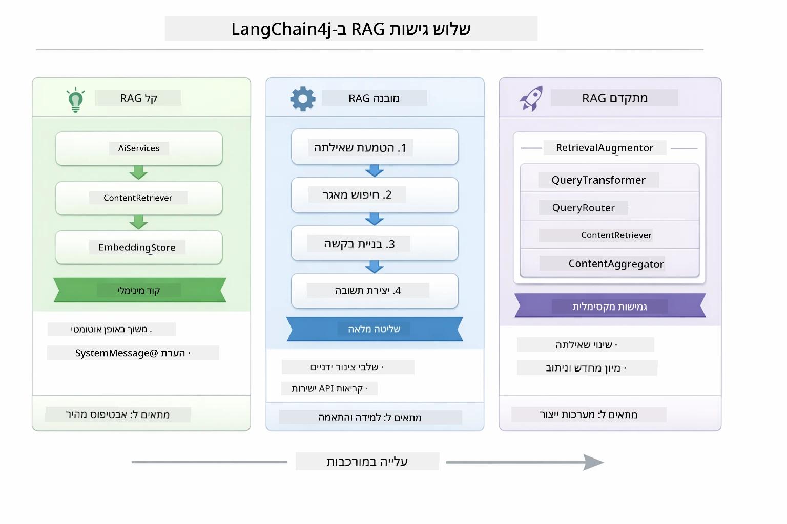
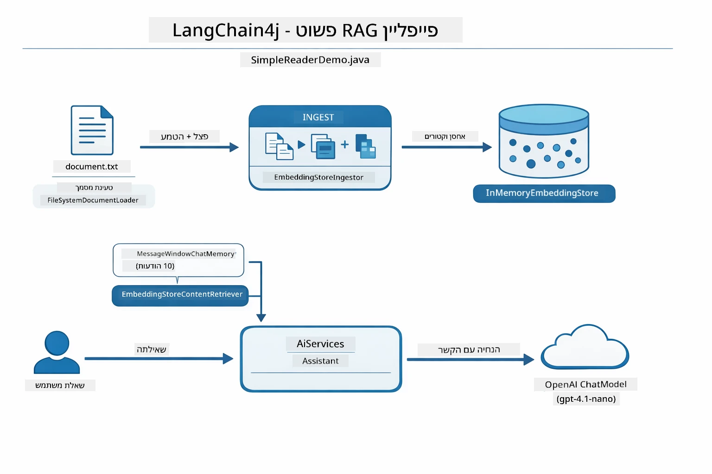
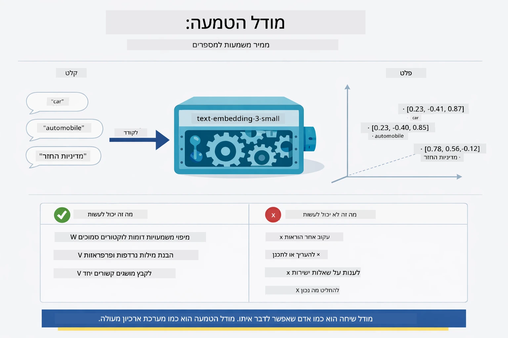
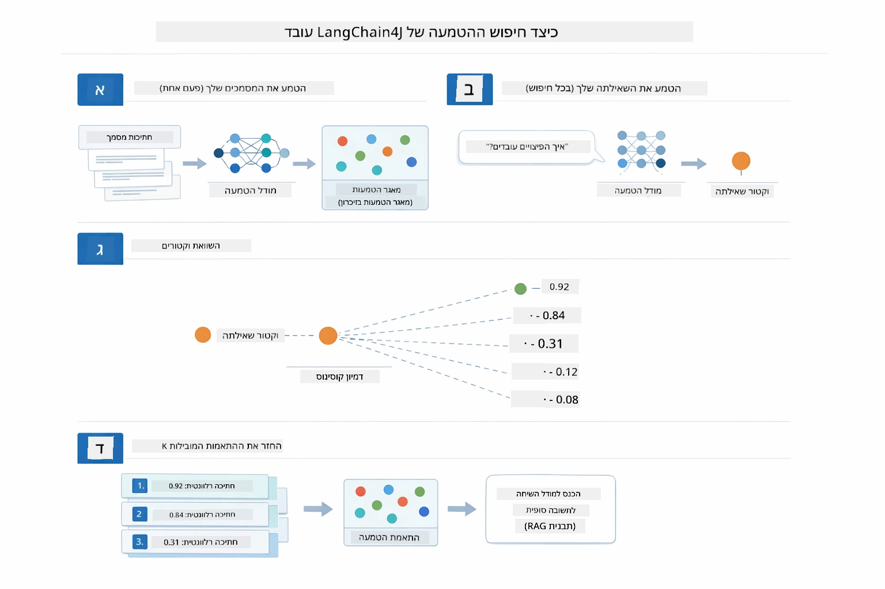
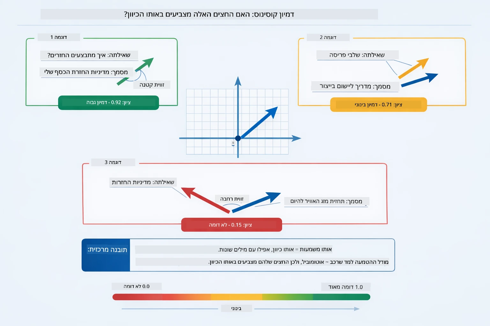
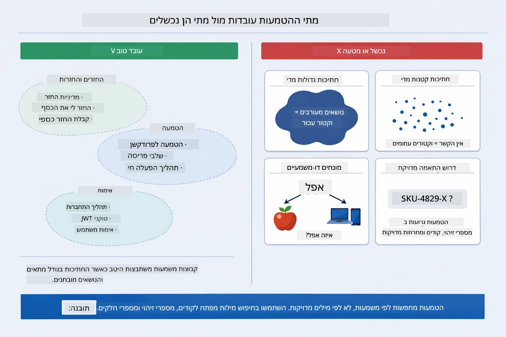

# מודול 03: RAG (הפקה משודרגת עם שליפה)

## תוכן עניינים

- [סרטון הדרכה](../../../03-rag)
- [מה תלמדו](../../../03-rag)
- [דרישות מוקדמות](../../../03-rag)
- [הבנת RAG](../../../03-rag)
  - [איזה גישת RAG משתמשים במדריך זה?](../../../03-rag)
- [איך זה עובד](../../../03-rag)
  - [עיבוד מסמכים](../../../03-rag)
  - [יצירת התאמות](../../../03-rag)
  - [חיפוש סמנטי](../../../03-rag)
  - [הפקת תשובות](../../../03-rag)
- [הרצת האפליקציה](../../../03-rag)
- [שימוש באפליקציה](../../../03-rag)
  - [העלאת מסמך](../../../03-rag)
  - [שאל שאלות](../../../03-rag)
  - [בדוק הפניות מקורות](../../../03-rag)
  - [ניסוי עם שאלות](../../../03-rag)
- [מושגים מרכזיים](../../../03-rag)
  - [אסטרטגיית פירוק ליחידות](../../../03-rag)
  - [נקודות דמיון](../../../03-rag)
  - [אחסון בזיכרון](../../../03-rag)
  - [ניהול חלון הקשר](../../../03-rag)
- [מתי RAG חשוב](../../../03-rag)
- [שלבים הבאים](../../../03-rag)

## סרטון הדרכה

צפו בסשן חי זה שמסביר כיצד להתחיל עם מודול זה: [RAG עם LangChain4j - סשן חי](https://www.youtube.com/watch?v=_olq75ZH_eY)

## מה תלמדו

במודולים הקודמים, למדתם כיצד לנהל שיחות עם בינה מלאכותית ולבנות את הפקדותיכם בצורה יעילה. אבל יש מגבלה בסיסית: מודלי השפה יודעים רק מה שלמדו במהלך האימון. הם לא יכולים לענות על שאלות לגבי המדיניות של החברה שלכם, תיעוד הפרויקטים שלכם או כל מידע שאינם אומנו עליו.

RAG (הפקה משודרגת עם שליפה) פותרת את הבעיה הזו. במקום לנסות ללמד את המודל את המידע שלכם (מה שיקר ובלתי מעשי), אתם נותנים לו את היכולת לחפש בתוך המסמכים שלכם. כאשר מישהו שואל שאלה, המערכת מוצאת מידע רלוונטי ומוסיפה אותו לפקודה. המודל אז עונה בהתבסס על ההקשר שנשלף.

חשבו על RAG כמתן ספריית התייחסות למודל. כאשר אתם שואלים שאלה, המערכת:

1. **שאילתת משתמש** - אתם שואלים שאלה
2. **הטמעה** - ממירה את השאלה שלכם לווקטור
3. **חיפוש וקטור** - מוצאת יחידות מסמך דומות
4. **הרכבת הקשר** - מוסיפה את היחידות הרלוונטיות לפקודה
5. **תגובה** - המודל מחולל תשובה בהתבסס על ההקשר

זה מייחס את תגובות המודל לנתונים האמיתיים שלכם במקום להסתמך על ידע האימון שלו או להמציא תשובות.

## דרישות מוקדמות

- השלמת [מודול 00 - התחלה מהירה](../00-quick-start/README.md) (לדוגמת Easy RAG המופיעה למעלה)
- השלמת [מודול 01 - מבוא](../01-introduction/README.md) (משאבי Azure OpenAI הותקנו, כולל מודל ההטמעה `text-embedding-3-small`)
- קובץ `.env` בספריית השורש עם אישורי Azure (נוצר על ידי `azd up` במודול 01)

> **הערה:** אם לא השלמתם את מודול 01, עקבו תחילה אחר הוראות הפריסה שם. הפקודה `azd up` מפעילה גם את מודל הצ'אט GPT וגם את מודל ההטמעה המשמש במודול זה.

## הבנת RAG

הדיאגרמה למטה ממחישה את הרעיון המרכזי: במקום להסתמך רק על נתוני האימון של המודל, RAG נותנת לו ספריית התייחסות של המסמכים שלכם להתייעצות לפני יצירת כל תשובה.


*דיאגרמה זו מראה את ההבדל בין מודל שפה סטנדרטי (הניחושים מבוססי נתוני האימון) לבין מודל שפה משודרג ב-RAG (המבצע התייעצות עם המסמכים שלכם קודם).*

כך מתחברים כל החלקים מקצה לקצה. שאלה של משתמש עוברת דרך ארבעה שלבים — הטמעה, חיפוש וקטורי, הרכבת הקשר, והפקת תשובה — שכל שלב בונה על הקודם:


*דיאגרמה זו מציגה את צינור RAG מקצה לקצה — שאילתת משתמש זורמת דרך הטמעה, חיפוש וקטורי, הרכבת הקשר, והפקת תשובה.*

שאר המודול מלווה בכל שלב בפירוט, עם קוד שניתן להריץ ולשנות.

### איזה גישת RAG משתמשים במדריך זה?

LangChain4j מציע שלוש דרכים ליישם RAG, כל אחת עם רמת הפשטה שונה. הדיאגרמה למטה משווה אותן זו לצד זו:



*דיאגרמה זו משווה בין שלוש גישות RAG ב-LangChain4j — Easy, Native, ו-Advanced — ומציגה את המרכיבים המרכזיים שלהם ומתי להשתמש בכל אחת.*

| גישה | מה היא עושה | פשרה |
|---|---|---|
| **Easy RAG** | מחברת את הכול אוטומטית דרך `AiServices` ו-`ContentRetriever`. אתם מסמנים ממשק, מחברים שליפה, ו-LangChain4j מטפל בהטמעה, חיפוש והרכבת פקודה ברקע. | מינימום קוד, אבל לא רואים מה קורה בכל שלב. |
| **Native RAG** | אתם קוראים למודל ההטמעה, מחפשים בחנות, בונים את הפקודה ומייצרים את התשובה בעצמכם — צעד מפורש אחד בכל פעם. | יותר קוד, אבל כל שלב נראה וניתן לשנות. |
| **Advanced RAG** | משתמש במסגרת `RetrievalAugmentor` עם משנים לשאילתות, ראוטרים, סידורים מחדש, ומזרקים לתוכן, לצנרת ברמת ייצור. | גמישות מקסימלית, אבל מורכבות משמעותית. |

**מדריך זה משתמש בגישת Native.** כל שלב בצינור RAG — הטמעת השאלה, חיפוש בחנות הווקטורים, הרכבת ההקשר והפקת התשובה — כתובים במפורש בקובץ [`RagService.java`](../../../03-rag/src/main/java/com/example/langchain4j/rag/service/RagService.java). זה מכוון: כמקור למידה, חשוב יותר שתראו ותבינו כל שלב מאשר שהקוד יהיה מקוצר. ברגע שתהיו נוחים עם הקישור בין החלקים, תוכלו לעבור ל-Easy RAG לפרוטוטיפים מהירים או ל-Advanced RAG למערכות ייצור.

> **💡 כבר ראיתם Easy RAG בפעולה?** מודול [התחלה מהירה](../00-quick-start/README.md) כולל דוגמת שאלות-תשובות למסמך ([`SimpleReaderDemo.java`](../../../00-quick-start/src/main/java/com/example/langchain4j/quickstart/SimpleReaderDemo.java)) שמשתמשת בגישת Easy RAG — LangChain4j מטפל בהטמעה, חיפוש והרכבת פקודה אוטומטית. מודול זה עושה את הצעד הבא בפיצוח הצינור כך שתוכלו לראות ולשלוט בכל שלב בעצמכם.



*דיאגרמה זו מראה את צינור Easy RAG מ-`SimpleReaderDemo.java`. השוו זאת לגישה Native שמשתמשים בה במודול זה: Easy RAG מסתיר את ההטמעה, השליפה והרכבת הפקודה מאחורי `AiServices` ו-`ContentRetriever` — אתם טוענים מסמך, מחברים שליפה, ומקבלים תשובות. הגישה Native במודול זה פותחת את הצינור כך שאתם קוראים לכל שלב בעצמכם (הטמעה, חיפוש, הרכבת הקשר, הפקה), ומאפשרת לכם שליטה מלאה וראות מלאה.*

## איך זה עובד

צינור RAG במודול זה מתפרק לארבעה שלבים שרצים ברצף בכל פעם שמשתמש שואל שאלה. תחילה, המסמך שהועלה **מפורק ליחידות** שמאפשרות טיפול נוח. היחידות האלו מומרות ל**הטמעות וקטוריות** ונשמרות כדי שניתן יהיה להשוות ביניהן מתמטית. כששאילתה מגיעה, המערכת מבצעת **חיפוש סמנטי** כדי למצוא את היחידות הרלוונטיות, ולבסוף מעבירה אותן כ"הקשר" למודל השפה להפקת **תשובה**. הקטעים הבאים מראים כל שלב עם קוד ודיאגרמות. נתחיל בצעד הראשון.

### עיבוד מסמכים

[DocumentService.java](../../../03-rag/src/main/java/com/example/langchain4j/rag/service/DocumentService.java)

כשאתם מעלים מסמך, המערכת מנתחת אותו (PDF או טקסט רגיל), מצמידה מטא-נתונים כמו שם הקובץ, ומפצלת אותו ליחידות — חתיכות קטנות שמתאימות בנוחות לחלון ההקשר של המודל. היחידות חופפות במעט כדי שלא יאבד הקשר בגבולות.

```java
// פרסס את הקובץ שהועלה ועטוף אותו במסמך LangChain4j
Document document = Document.from(content, metadata);

// חלק לחתיכות של 300 תווים עם חפיפה של 30 תווים
DocumentSplitter splitter = DocumentSplitters
    .recursive(300, 30);

List<TextSegment> segments = splitter.split(document);
```
  
הדיאגרמה למטה מציגה זאת ויזואלית. שימו לב שכל יחידה חולקת כמה טוקנים עם השכנים שלה — חפיפה של 30 טוקנים מבטיחה שלא ייגמר הקשר חשוב בין החתיכות:


*דיאגרמה זו מראה מסמך המחולק ליחידות של 300 טוקנים עם חפיפה של 30 טוקנים, לשמירה על ההקשר בגבולות היחידות.*

> **🤖 נסו עם [GitHub Copilot](https://github.com/features/copilot) צ'אט:** פתחו את [`DocumentService.java`](../../../03-rag/src/main/java/com/example/langchain4j/rag/service/DocumentService.java) ושאלו:  
> - "איך LangChain4j מפצל מסמכים ליחידות ולמה החפיפה חשובה?"  
> - "מה גודל היחידה האופטימלי לסוגי מסמכים שונים ולמה?"  
> - "איך מטפלים במסמכים בשפות שונות או עם עיצובים מיוחדים?"

### יצירת התאמות

[LangChainRagConfig.java](../../../03-rag/src/main/java/com/example/langchain4j/rag/config/LangChainRagConfig.java)

כל יחידה מומרת לייצוג מספרי שנקרא הטמעה — למעשה ממיר משמעות למספרים. מודל ההטמעה אינו "חכם" כמו מודל צ'אט; הוא לא יכול לבצע הנחיות, להסיק מסקנות או לענות על שאלות. מה שהוא יכול לעשות הוא למפות טקסט למרחב מתמטי שבו משמעויות דומות קרובות זו לזו — "רכב" ליד "אוטומוביל," "מדיניות החזרות" ליד "החזר לי את הכסף." חשבו על מודל צ'אט כאדם שאפשר לדבר איתו; מודל הטמעה הוא מערכת תיוג מצוינת במיוחד.



*דיאגרמה זו מראה כיצד מודל הטמעה ממיר טקסט לווקטורים מספריים, וממקם משמעויות דומות — כמו "רכב" ו"אוטומוביל" — קרוב זו לזו במרחב הווקטורי.*

```java
@Bean
public EmbeddingModel embeddingModel() {
    return OpenAiOfficialEmbeddingModel.builder()
        .baseUrl(azureOpenAiEndpoint)
        .apiKey(azureOpenAiKey)
        .modelName(azureEmbeddingDeploymentName)
        .build();
}

EmbeddingStore<TextSegment> embeddingStore = 
    new InMemoryEmbeddingStore<>();
```
  
דיאגרמת הכיתות למטה מראה את שני הזרמים הצמודים בצינור RAG ואת כיתות LangChain4j המבצעות אותם. **זרם הנטילה** (רץ חד-פעמית בהעלאה) מפרק את המסמך, מטמיע את היחידות, ושומר אותן בעזרת `.addAll()`. **זרם השאילתה** (רץ בכל פעם שמשתמש שואל) מטמיע את השאלה, מחפש באמצעות `.search()`, ומעביר את ההקשר התואם למודל הצ'אט. שני הזרמים נפגשים בממשק המשותף `EmbeddingStore<TextSegment>`:


*דיאגרמה זו מראה את שני הזרמים בצינור RAG — נטילה ושאילתה — ואיך הם מתקשרים דרך EmbeddingStore משותף.*

כשההטמעות נשמרות, תוכן דומה מתאסף באופן טבעי יחד במרחב הווקטורי. הוויזואליזציה למטה מראה כיצד מסמכים בנושא דומה מסתדרים כנקודות סמוכות, וזה מה שמאפשר חיפוש סמנטי:


*תמונה זו מציגה איך מסמכים קשורים מקבצים יחד במרחב וקטורי תלת-ממדי, עם נושאים כמו מסמכים טכניים, כללי עסקים ו-FAQ forming groups ברורים.*

כשהמשתמש מחפש, המערכת מבצעת ארבעה שלבים: הטמעת המסמכים פעם אחת, הטמעת השאילתה בכל חיפוש, השוואת וקטור השאילתה לכל הווקטורים השמורים באמצעות דמיון קוסינוס, והחזרת הטופ-K יחידות עם הציון הגבוה ביותר. הדיאגרמה למטה ממחישה כל שלב וכיתות LangChain4j המעורבות:



*דיאגרמה זו מציגה את תהליך החיפוש בארבעה שלבים: הטמעת המסמכים, הטמעת השאילתה, השוואת וקטורים בדמיון קוסינוס והחזרת תוצאות טופ-K.*

### חיפוש סמנטי

[RagService.java](../../../03-rag/src/main/java/com/example/langchain4j/rag/service/RagService.java)

כשאתם שואלים שאלה, גם היא נחשבת כהטמעה. המערכת משווה את ההטמעה של השאלה שלכם לכל ההטמעות של יחידות המסמכים. היא מוצאת את היחידות עם המשמעויות הדומות ביותר - לא רק מילות מפתח תואמות, אלא דמיון סמנטי אמיתי.

```java
Embedding queryEmbedding = embeddingModel.embed(question).content();

EmbeddingSearchRequest searchRequest = EmbeddingSearchRequest.builder()
    .queryEmbedding(queryEmbedding)
    .maxResults(5)
    .minScore(0.5)
    .build();

EmbeddingSearchResult<TextSegment> searchResult = embeddingStore.search(searchRequest);
List<EmbeddingMatch<TextSegment>> matches = searchResult.matches();

for (EmbeddingMatch<TextSegment> match : matches) {
    String relevantText = match.embedded().text();
    double score = match.score();
}
```
  
הדיאגרמה למטה משווה בין חיפוש סמנטי לחיפוש מילת מפתח מסורתי. חיפוש מילת מפתח ל"vehicle" מפספס יחידה על "cars and trucks," אבל החיפוש הסמנטי מבין שזה אותו דבר ומחזיר את היחידה עם ציון גבוה:


*דיאגרמה זו משווה בין חיפוש מבוסס מילות מפתח לבין חיפוש סמנטי, ומראה כיצד החיפוש הסמנטי מחזיר תוכן קשור רעיונית גם כאשר מילות המפתח אינן תואמות במדויק.*

מתחת למכסה המנוע, הדמיון נמדד באמצעות דמיון קוסינוס — בעצם שואל "האם שני החצים האלה מצביעים לאותו כיוון?" שתי יחידות יכולות להשתמש במילים שונות לחלוטין, אבל אם הן אומרות את אותו הדבר, כיווני הווקטורים שלהן תואמים והציון קרוב ל-1.0:



*דיאגרמה זו ממחישה את דמיון הקוסינוס כזווית בין וקטורי ההטמעה — וקטורים יותר מכוונים מכוונים זה לזה מקבלים ציון קרוב יותר ל-1.0, המצביע על דמיון סמנטי גבוה.*
> **🤖 נסה עם [GitHub Copilot](https://github.com/features/copilot) Chat:** פתח את [`RagService.java`](../../../03-rag/src/main/java/com/example/langchain4j/rag/service/RagService.java) ושאל:
> - "איך עובדת חיפוש דמיון עם האמבדים ומה קובע את הציון?"
> - "איזה סף דמיון עליי להשתמש ואיך זה משפיע על התוצאות?"
> - "איך להתמודד עם מקרים שבהם לא נמצאו מסמכים רלוונטיים?"

### יצירת תשובה

[RagService.java](../../../03-rag/src/main/java/com/example/langchain4j/rag/service/RagService.java)

החתיכות הרלוונטיות ביותר מורכבות לפרומפט מובנה הכולל הנחיות מפורשות, ההקשר שהושג, ושאלת המשתמש. המודל קורא את החתיכות הספציפיות הללו ועונה בהתבסס על המידע הזה — הוא יכול להשתמש רק במה שנמצא לפניו, מה שמונע הזיות.

```java
String context = matches.stream()
    .map(match -> match.embedded().text())
    .collect(Collectors.joining("\n\n"));

String prompt = String.format("""
    Answer the question based on the following context.
    If the answer cannot be found in the context, say so.

    Context:
    %s

    Question: %s

    Answer:""", context, request.question());

String answer = chatModel.chat(prompt);
```

הדיאגרמה מטה מראה את ההרכבה הזו בפעולה — החתיכות עם הציון הגבוה ביותר משלב החיפוש מוזרקות לתבנית הפרומפט, ו-`OpenAiOfficialChatModel` מייצר תשובה מבוססת:


*דיאגרמה זו מראה כיצד החתיכות עם הציון הגבוה ביותר מורכבות לפרומפט מובנה, ומאפשרת למודל לייצר תשובה מבוססת מהנתונים שלך.*

## הפעלת היישום

**אשר את ההתקנה:**

ודא שקובץ `.env` קיים בתיקיית השורש עם האישורים של Azure (נוצר במהלך מודול 01):

**Bash:**
```bash
cat ../.env  # צריך להציג את AZURE_OPENAI_ENDPOINT, API_KEY, DEPLOYMENT
```

**PowerShell:**
```powershell
Get-Content ..\.env  # צריך להציג את AZURE_OPENAI_ENDPOINT, API_KEY, DEPLOYMENT
```

**הפעל את היישום:**

> **הערה:** אם כבר הפעלת את כל היישומים באמצעות `./start-all.sh` ממודול 01, מודול זה כבר רץ על פורט 8081. ניתן לדלג על פקודות ההפעלה שלמטה ולעבור ישירות ל-http://localhost:8081.

**אפשרות 1: שימוש בלוח הבקרה של Spring Boot (מומלץ למשתמשי VS Code)**

מיכל הפיתוח כולל את תוסף לוח הבקרה של Spring Boot, המספק ממשק חזותי לניהול כל יישומי Spring Boot. ניתן למצוא אותו בסרגל הפעילות בצד השמאלי של VS Code (חפש את סמל Spring Boot).

מלוח הבקרה של Spring Boot, תוכל:
- לראות את כל יישומי Spring Boot הזמינים בסביבת העבודה
- להפעיל/להפסיק יישומים בלחיצה אחת
- לצפות ביומני היישום בזמן אמת
- לעקוב אחר מצב היישום

פשוט לחץ על כפתור ההפעלה ליד "rag" כדי להפעיל את המודול הזה, או הפעל את כל המודולים בבת אחת.


*צילום מסך זה מראה את לוח הבקרה של Spring Boot ב-VS Code, שבו ניתן להפעיל, לעצור ולעקוב אחרי יישומים בצורה חזותית.*

**אפשרות 2: שימוש בסקריפטים של shell**

הפעל את כל יישומי הווב (מודולים 01-04):

**Bash:**
```bash
cd ..  # מתיקיית השורש
./start-all.sh
```

**PowerShell:**
```powershell
cd ..  # מתיקיית השורש
.\start-all.ps1
```

או הפעל רק את המודול הזה:

**Bash:**
```bash
cd 03-rag
./start.sh
```

**PowerShell:**
```powershell
cd 03-rag
.\start.ps1
```

שני הסקריפטים טוענים אוטומטית משתני סביבה מהקובץ `.env` בשורש ויבנו את קבצי JAR אם הם לא קיימים.

> **הערה:** אם אתה מעדיף לבנות את כל המודולים ידנית לפני ההפעלה:
>
> **Bash:**
> ```bash
> cd ..  # Go to root directory
> mvn clean package -DskipTests
> ```
>
> **PowerShell:**
> ```powershell
> cd ..  # Go to root directory
> mvn clean package -DskipTests
> ```

פתח את http://localhost:8081 בדפדפן שלך.

**כדי לעצור:**

**Bash:**
```bash
./stop.sh  # רק במודול זה
# או
cd .. && ./stop-all.sh  # כל המודולים
```

**PowerShell:**
```powershell
.\stop.ps1  # רק מודול זה
# או
cd ..; .\stop-all.ps1  # כל המודולים
```

## שימוש ביישום

היישום מספק ממשק ווב להעלאת מסמכים ולשאילת שאלות.

<a href="images/rag-homepage.png"></a>

*צילום מסך זה מראה את ממשק היישום RAG שבו אתה מעלה מסמכים ושואל שאלות.*

### העלאת מסמך

התחל בהעלאת מסמך - קבצי TXT עובדים הכי טוב למבחנים. קובץ `sample-document.txt` מסופק בתיקייה זו ומכיל מידע על תכונות LangChain4j, יישום RAG, ופרקטיקות מומלצות - מושלם לבדיקת המערכת.

המערכת מעבדת את המסמך שלך, מפצלת אותו לקטעים, ויוצרת אמבדינגים לכל קטע. זה קורה אוטומטית עם ההעלאה.

### שאל שאלות

כעת שאל שאלות ספציפיות לגבי תוכן המסמך. נסה משהו עובדתי שמפורש בבירור במסמך. המערכת מחפשת קטעים רלוונטיים, כוללת אותם בפרומפט, ויוצרת תשובה.

### בדוק הפניות למקור

שים לב שכל תשובה כוללת הפניות למקור עם ציוני דמיון. הציונים האלו (מ-0 עד 1) מראים כמה כל קטע רלוונטי לשאלתך. ציונים גבוהים משמעותם התאמות טובות יותר. זה מאפשר לך לאמת את התשובה מול חומר המקור.

<a href="images/rag-query-results.png"></a>

*צילום מסך זה מראה תוצאות שאילתה עם התשובה שנוצרה, הפניות למקור, וציוני רלוונטיות לכל קטע שהושג.*

### התנסה עם שאלות

נסה סוגים שונים של שאלות:
- עובדות ספציפיות: "מה הנושא המרכזי?"
- השוואות: "מה ההבדל בין X ל-Y?"
- סיכומים: "סכם את הנקודות המרכזיות על Z"

צפה כיצד ציוני הרלוונטיות משתנים בהתאם למידת ההתאמה של שאלתך לתוכן המסמך.

## מושגים מרכזיים

### אסטרטגיית פיצול לקטעים

המסמכים מפוצלים לקטעים של 300 תווים עם 30 תווים חפיפה. איזון זה מבטיח שלכל קטע יש מספיק הקשר כדי להיות משמעותי, תוך שמירה על גודל קטן דיו לכלול מספר קטעים בפרומפט.

### ציוני דמיון

כל קטע שהושג מגיע עם ציון דמיון בין 0 ל-1 שמצביע על קרבת התאימות לשאלה של המשתמש. הדיאגרמה מטה מציגה את טווחי הציונים ואיך המערכת משתמשת בהם לסינון תוצאות:


*דיאגרמה זו מראה טווחי ציון מ-0 עד 1, עם סף מינימום של 0.5 שמסנן קטעים לא רלוונטיים.*

הציונים נעים בין 0 ל-1:
- 0.7-1.0: רלוונטי מאוד, התאמה מדויקת
- 0.5-0.7: רלוונטי, הקשר טוב
- מתחת ל-0.5: מסונן, לא דומה מספיק

המערכת מחזירה רק את הקטעים שמעל סף המינימום כדי להבטיח איכות.

אמברדים עובדים טוב כשמשמעות מתקבצת ברור, אך יש להם נקודות עיוורון. הדיאגרמה למטה מראה את מצבי הכישלון הנפוצים — קטעים גדולים מדי מייצרים וקטורים מטושטשים, קטעים קטנים מדי חסרי הקשר, מונחים עמומים מצביעים על מספר מקבצים, וחיפושים של התאמה מדויקת (מספרי זיהוי, חלקים) אינם עובדים כלל עם אמבדינגים:



*דיאגרמה זו מראה מצבי כישלון נפוצים באמבדים: קטעים גדולים מדי, קטעים קטנים מדי, מונחים עמומים שמצביעים על מספר מקבצים, וחיפושים מדויקים כמו מספרי זיהוי.*

### אחסון בזיכרון

מודול זה משתמש באחסון בזיכרון לפשטות. כשהיישום מאופס, המסמכים שהועלו יאבדו. מערכות פרודקשן משתמשות במסדי נתוני וקטורים מתמשכים כמו Qdrant או Azure AI Search.

### ניהול חלון הקשר

לכל מודל יש מגבלת חלון הקשר. אי אפשר לכלול כל קטע ממסמך גדול. המערכת מושכת את חמשת הקטעים הרלוונטיים ביותר (ברירת מחדל 5) כדי להישאר בתוך הגבולות ולספק מספיק הקשר לתשובות מדויקות.

## מתי RAG חשוב

RAG לא תמיד הגישה הנכונה. מדריך ההחלטות למטה עוזר לך לקבוע מתי RAG מוסיף ערך ומתי גישות פשוטות יותר — כמו הכללת התוכן ישירות בפרומפט או הסתמכות על הידע המובנה במודל — מספקות מספיק:


*דיאגרמה זו מראה מדריך החלטה מתי RAG מוסיף ערך ומתי גישות פשוטות דיו.*

**השתמש ב-RAG כאשר:**
- עונים על שאלות לגבי מסמכים קנייניים
- מידע משתנה תדיר (מדיניות, מחירים, מפרטים)
- דיוק דורש שיוך מקור
- התוכן גדול מדי להכנסה בפרומפט יחיד
- נדרשות תשובות מאומתות ומבוססות

**אל תשתמש ב-RAG כאשר:**
- השאלות דורשות ידע כללי שהמודל כבר מכיל
- נדרשת מידע בזמן אמת (RAG עובד על מסמכים שהועלו)
- התוכן קטן דיו להכללה ישירה בפרומפט

## שלבים הבאים

**מודול הבא:** [04-tools - סוכני בינה מלאכותית עם כלים](../04-tools/README.md)

---

**ניווט:** [← קודם: מודול 02 - הנדסת פרומפטים](../02-prompt-engineering/README.md) | [חזרה לעמוד הראשי](../README.md) | [הבא: מודול 04 - כלים →](../04-tools/README.md)

---

<!-- CO-OP TRANSLATOR DISCLAIMER START -->
**כתב ויתור**:
מסמך זה תורגם באמצעות שירות תרגום מבוסס בינה מלאכותית [Co-op Translator](https://github.com/Azure/co-op-translator). למרות שאנו שואפים לדיוק, יש לקחת בחשבון כי תרגומים אוטומטיים עלולים להכיל שגיאות או אי-דיוקים. המסמך המקורי בשפתו המקורית הוא המקור הסמכותי. למידע חשוב, מומלץ לבצע תרגום מקצועי על ידי אדם. אנו לא נושאים באחריות לכל אי-הבנות או פרשנויות שגויות הנובעות משימוש בתרגום זה.
<!-- CO-OP TRANSLATOR DISCLAIMER END -->