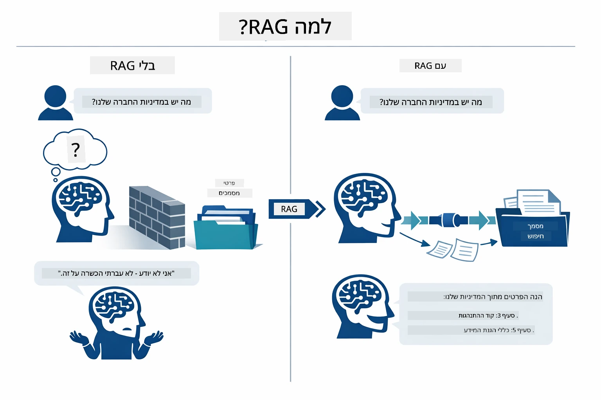
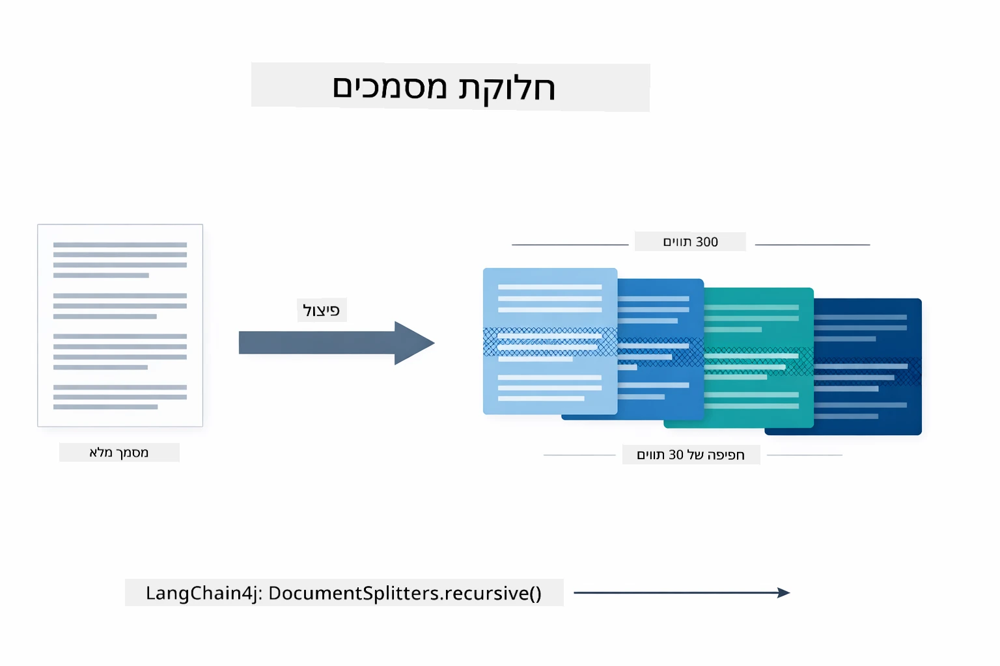
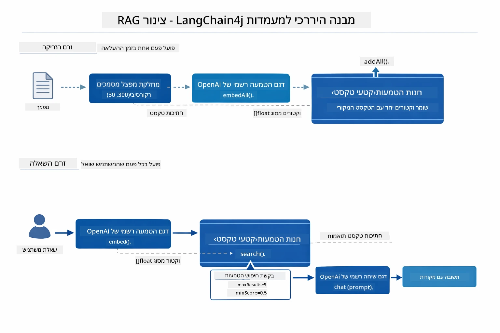
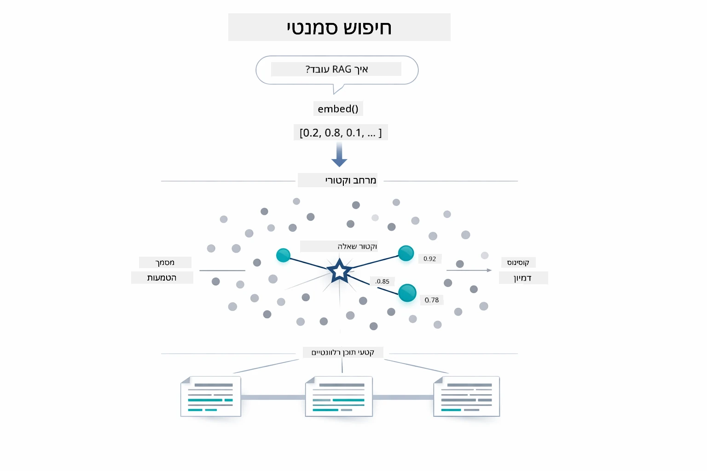
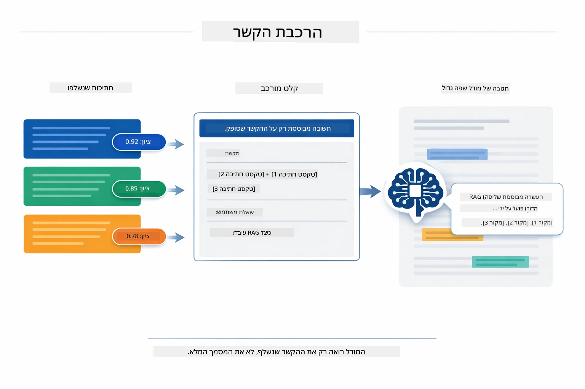
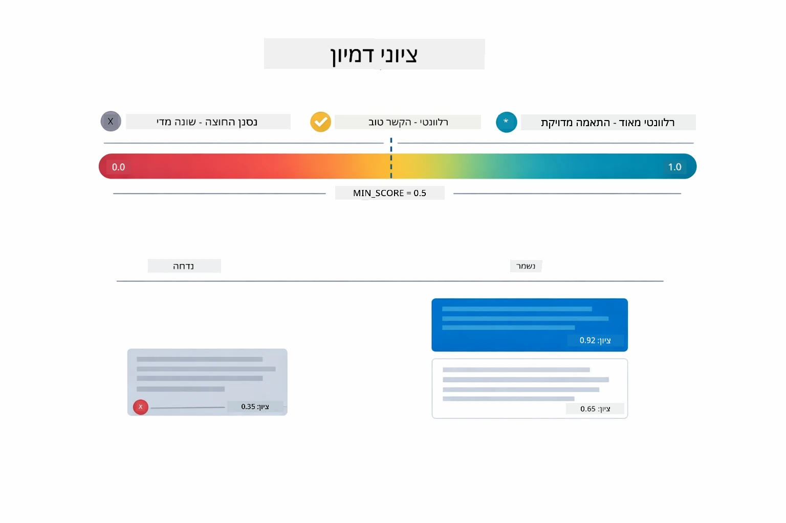
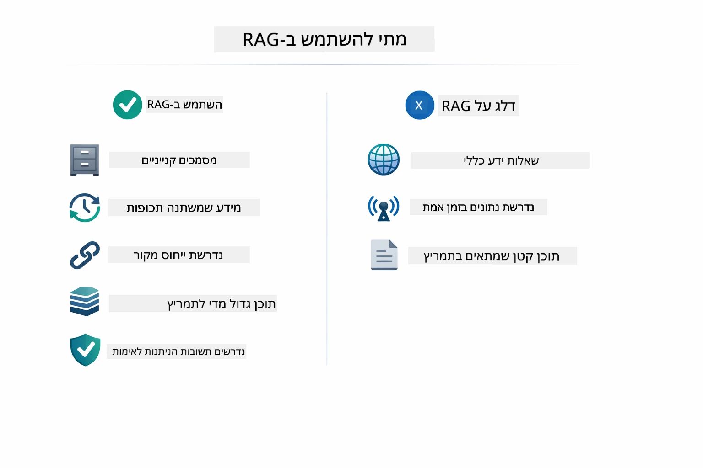

# מודול 03: RAG (הפקה מוגברת על ידי אחזור)

## תוכן עניינים

- [מה תלמד](../../../03-rag)
- [הבנת RAG](../../../03-rag)
- [דרישות מוקדמות](../../../03-rag)
- [איך זה עובד](../../../03-rag)
  - [עיבוד מסמכים](../../../03-rag)
  - [יצירת אמבדינגים](../../../03-rag)
  - [חיפוש סמנטי](../../../03-rag)
  - [יצירת תשובות](../../../03-rag)
- [הרצת היישום](../../../03-rag)
- [שימוש ביישום](../../../03-rag)
  - [העלאת מסמך](../../../03-rag)
  - [שאילת שאלות](../../../03-rag)
  - [בדיקת מקורות](../../../03-rag)
  - [ניסוי עם שאלות](../../../03-rag)
- [מונחים מרכזיים](../../../03-rag)
  - [אסטרטגיית חלוקה לחלקים](../../../03-rag)
  - [ציוני דמיון](../../../03-rag)
  - [אחסון בזיכרון](../../../03-rag)
  - [ניהול חלון הקשר](../../../03-rag)
- [מתי RAG חשוב](../../../03-rag)
- [השלבים הבאים](../../../03-rag)

## מה תלמד

במודולים הקודמים למדת כיצד לשוחח עם בינה מלאכותית ולבנות את הפרומפטים שלך בצורה יעילה. אך יש מגבלה בסיסית: דגמי השפה יודעים רק את מה שלמדו במהלך האימון. הם אינם יכולים לענות על שאלות לגבי מדיניות החברה שלך, תיעוד הפרויקט שלך, או כל מידע עליו הם לא אומנו.

RAG (הפקה מוגברת על ידי אחזור) פותר את הבעיה הזו. במקום לנסות ללמד את המודל את המידע שלך (מה שיקר ובלתי מעשי), אתה נותן לו את היכולת לחפש בתוך המסמכים שלך. כאשר שואלים שאלה, המערכת מוצאת מידע רלוונטי ומשלבת אותו בפרומפט. המודל אז עונה בהתבסס על ההקשר שנתקבל.

תחשוב על RAG כמתן ספריית הפניה למודל. כאשר אתה שואל שאלה, המערכת:

1. **שאילתת משתמש** - אתה שואל שאלה  
2. **אמבדינג** - הופך את השאלה לווקטור  
3. **חיפוש וקטורי** - מוצא חלקי מסמכים דומים  
4. **הרכבת הקשר** - מוסיף חלקים רלוונטיים לפרומפט  
5. **תשובה** - המודל מייצר תשובה בהתבסס על ההקשר  

זה מאשש את תגובות המודל על הנתונים האמיתיים שלך במקום להישען על הידע שנרכש באימון או להמציא תשובות.

## הבנת RAG

הדיאגרמה למטה ממחישה את הרעיון המרכזי: במקום להסתמך רק על נתוני האימון של המודל, RAG נותן לו ספריה של המסמכים שלך לעיין בהם לפני יצירת כל תשובה.



כך החלקים מתחברים מקצה לקצה. שאלת המשתמש עוברת דרך ארבעה שלבים — אמבדינג, חיפוש וקטורי, הרכבת הקשר ויצירת תשובות — שכל אחד מהם בנוי על הקודם:


שאר המודול הזה מתאר את כל שלב בפירוט, עם קוד שניתן להריץ ולשנות.

## דרישות מוקדמות

- השלמת מודול 01 (משאבי Azure OpenAI מופעלים)  
- קובץ `.env` בתיקיית השורש עם פרטי Azure (נוצר על ידי `azd up` במודול 01)  

> **הערה:** אם לא השלמת את מודול 01, עקוב תחילה אחר הוראות ההפעלה שם.

## איך זה עובד

### עיבוד מסמכים

[DocumentService.java](../../../03-rag/src/main/java/com/example/langchain4j/rag/service/DocumentService.java)

כשאתה מעלה מסמך, המערכת מנתחת אותו (PDF או טקסט רגיל), מצרפת מטא-דאטה כמו שם הקובץ, ואז מחלקת אותו לחלקים — חתיכות קטנות שנכנסות בנוחות לחלון ההקשר של המודל. החלקים הללו חופפים במעט כדי לשמור על ההקשר בגבולות.

```java
// פתר את הקובץ שהועלה ועטוף אותו במסמך LangChain4j
Document document = Document.from(content, metadata);

// חלק לחתיכות של 300 תווים עם חפיפה של 30 תווים
DocumentSplitter splitter = DocumentSplitters
    .recursive(300, 30);

List<TextSegment> segments = splitter.split(document);
```
  
הדיאגרמה למטה מראה כיצד זה עובד באופן חזותי. שים לב שכל חלק משתף מעט תווים עם שכניו — חפיפה של 30 תווים מבטיחה שאין אובדן הקשר חשוב בין החלקים:



> **🤖 נסה עם [GitHub Copilot](https://github.com/features/copilot) Chat:** פתח את [`DocumentService.java`](../../../03-rag/src/main/java/com/example/langchain4j/rag/service/DocumentService.java) ושאל:  
> - "איך LangChain4j מחלק מסמכים לחלקים ולמה החפיפה חשובה?"  
> - "מה גודל החתיכה האופטימלי לסוגי מסמכים שונים ולמה?"  
> - "איך לטפל במסמכים בשפות שונות או עם עיצוב מיוחד?"

### יצירת אמבדינגים

[LangChainRagConfig.java](../../../03-rag/src/main/java/com/example/langchain4j/rag/config/LangChainRagConfig.java)

כל חלק מומר לייצוג מספרי שנקרא אמבדינג - טביעת אצבע מתמטית שכוללת את משמעות הטקסט. טקסט דומה מייצר אמבדינגים דומים.

```java
@Bean
public EmbeddingModel embeddingModel() {
    return OpenAiOfficialEmbeddingModel.builder()
        .baseUrl(azureOpenAiEndpoint)
        .apiKey(azureOpenAiKey)
        .modelName(azureEmbeddingDeploymentName)
        .build();
}

EmbeddingStore<TextSegment> embeddingStore = 
    new InMemoryEmbeddingStore<>();
```
  
דיאגרמת הקלאסים למטה מראה כיצד רכיבי LangChain4j הללו מתחברים. `OpenAiOfficialEmbeddingModel` מתרגם טקסט לווקטורים, `InMemoryEmbeddingStore` מחזיק את הווקטורים לצד נתוני `TextSegment` המקוריים שלהם, ו-`EmbeddingSearchRequest` שולט בפרמטרים של אחזור כמו `maxResults` ו-`minScore`:



לאחר שהאמבדינגים נשמרים, תכנים דומים מתמקדים באופן טבעי במרחב הווקטורי. ההמחשה למטה מראה כיצד מסמכים בנושא דומה מופיעים נקודות קרובות, מה שמאפשר חיפוש סמנטי:


### חיפוש סמנטי

[RagService.java](../../../03-rag/src/main/java/com/example/langchain4j/rag/service/RagService.java)

כאשר שואלים שאלה, גם השאלה מומרת לאמבדינג. המערכת משווה את אמבדינג השאלה לאמבדינג של כל חלקי המסמכים. היא מוצאת את החלקים בעלי המשמעות הקרובה ביותר - לא רק מילות מפתח תואמות, אלא דמיון סמנטי ממשי.

```java
Embedding queryEmbedding = embeddingModel.embed(question).content();

EmbeddingSearchRequest searchRequest = EmbeddingSearchRequest.builder()
    .queryEmbedding(queryEmbedding)
    .maxResults(5)
    .minScore(0.5)
    .build();

EmbeddingSearchResult<TextSegment> searchResult = embeddingStore.search(searchRequest);
List<EmbeddingMatch<TextSegment>> matches = searchResult.matches();

for (EmbeddingMatch<TextSegment> match : matches) {
    String relevantText = match.embedded().text();
    double score = match.score();
}
```
  
הדיאגרמה למטה משווה בין חיפוש סמנטי לחיפוש מילות מפתח טיפוסי. חיפוש מילות מפתח על "רכב" מפספס חלק על "מכוניות ומשאיות", אך החיפוש הסמנטי מבין שהם משמעותית זהים ומחזיר אותו כתוצאה עם ציון גבוה:



> **🤖 נסה עם [GitHub Copilot](https://github.com/features/copilot) Chat:** פתח את [`RagService.java`](../../../03-rag/src/main/java/com/example/langchain4j/rag/service/RagService.java) ושאל:  
> - "איך עובד חיפוש דמיון עם אמבדינגים ומה משפיע על הציון?"  
> - "איזה סף דמיון כדאי להשתמש וכיצד זה משפיע על התוצאות?"  
> - "איך להתמודד עם מקרים שבהם אין מסמכים רלוונטיים?"

### יצירת תשובות

[RagService.java](../../../03-rag/src/main/java/com/example/langchain4j/rag/service/RagService.java)

החלקים הרלוונטיים ביותר מרכיבים פרומפט מובנה הכולל הנחיות מפורשות, ההקשר שנשלף, ושאלת המשתמש. המודל קורא את החלקים הספציפיים הללו ועונה בהתבסס עליהם — הוא יכול להשתמש רק במה שנמצא מולי, וכך נמנעת הזיית מידע.

```java
String context = matches.stream()
    .map(match -> match.embedded().text())
    .collect(Collectors.joining("\n\n"));

String prompt = String.format("""
    Answer the question based on the following context.
    If the answer cannot be found in the context, say so.

    Context:
    %s

    Question: %s

    Answer:""", context, request.question());

String answer = chatModel.chat(prompt);
```
  
הדיאגרמה למטה מראה את ההרכבה בפועל — חלקי המסמכים בעלי הציון הגבוה ביותר מהשלב הקודם מוזנים לתבנית הפרומפט, ו-`OpenAiOfficialChatModel` מייצר תשובה מבוססת:



## הרצת היישום

**אימות פריסה:**

וודא שקובץ `.env` קיים בתיקיית השורש עם פרטי Azure (נוצר במהלך מודול 01):  
```bash
cat ../.env  # צריך להציג את AZURE_OPENAI_ENDPOINT, API_KEY, DEPLOYMENT
```
  
**הפעל את היישום:**

> **הערה:** אם כבר הפעלת את כל היישומים דרך `./start-all.sh` במודול 01, מודול זה כבר פועל על הפורט 8081. תוכל לדלג על פקודות ההפעלה למטה ולעבור ישירות ל-http://localhost:8081.

**אפשרות 1: שימוש בלוח הבקרה של Spring Boot (מומלץ למשתמשי VS Code)**

מיכל הפיתוח כולל את תוסף Spring Boot Dashboard, הנותן ממשק ויזואלי לניהול כל יישומי Spring Boot. תוכל למצוא אותו בסרגל הפעילות משמאל ל-VS Code (חפש את סמל Spring Boot).

מ-lוח הבקרה של Spring Boot, תוכל:  
- לראות את כל יישומי Spring Boot הזמינים בסביבת העבודה  
- להפעיל/להפסיק יישומים בלחיצה אחת  
- לצפות בלוגים בזמן אמת  
- לנטר את מצב היישום  

כל שעליך לעשות הוא ללחוץ על כפתור ההפעלה ליד "rag" כדי להתחיל את המודול הזה, או להפעיל את כל המודולים ביחד.


**אפשרות 2: שימוש בסקריפטים shell**

הפעל את כל יישומי האינטרנט (מודולים 01-04):

**Bash:**  
```bash
cd ..  # מתיקיית השורש
./start-all.sh
```
  
**PowerShell:**  
```powershell
cd ..  # מתיקיית השורש
.\start-all.ps1
```
  
או הפעל רק את מודול זה:

**Bash:**  
```bash
cd 03-rag
./start.sh
```
  
**PowerShell:**  
```powershell
cd 03-rag
.\start.ps1
```
  
שני הסקריפטים טוענים אוטומטית משתני סביבה מקובץ `.env` שבשורש ויבנו את קבצי ה-JAR אם אינם קיימים.

> **הערה:** אם אתה מעדיף לבנות את כל המודולים ידנית לפני ההפעלה:  
>
> **Bash:**  
> ```bash
> cd ..  # Go to root directory
> mvn clean package -DskipTests
> ```
>  
> **PowerShell:**  
> ```powershell
> cd ..  # Go to root directory
> mvn clean package -DskipTests
> ```
  
פתח את http://localhost:8081 בדפדפן שלך.

**כדי לעצור:**

**Bash:**  
```bash
./stop.sh  # רק מודול זה
# או
cd .. && ./stop-all.sh  # כל המודולים
```
  
**PowerShell:**  
```powershell
.\stop.ps1  # רק במודול זה
# או
cd ..; .\stop-all.ps1  # כל המודולים
```


## שימוש ביישום

היישום מספק ממשק וובי להעלאת מסמכים ושאילת שאלות.

<a href="images/rag-homepage.png"></a>

*ממשק יישום RAG - העלאת מסמכים ושאילת שאלות*

### העלאת מסמך

התחל בהעלאת מסמך - קבצי TXT עובדים היטב לצרכי בדיקה. ישנו קובץ `sample-document.txt` בספריה זו המכיל מידע על תכונות LangChain4j, יישום RAG ושיטות טובות - מושלם לבדיקת המערכת.

המערכת מעבדת את המסמך שלך, מחלקת אותו לחלקים, ויוצרת אמבדינג לכל חלק. זה קורה אוטומטית בעת ההעלאה.

### שאילת שאלות

כעת שאל שאלות ספציפיות בנוגע לתוכן המסמך. נסה משהו עובדתי שמוצהר בבירור בו. המערכת מחפשת חלקים רלוונטיים, משלבת אותם בפרומפט ויוצרת תשובה.

### בדיקת מקורות

שים לב שכל תשובה כוללת הפניות למקורות עם ציוני דמיון. ציונים אלו (בין 0 ל-1) מראים עד כמה כל חלק היה רלוונטי לשאלתך. ציונים גבוהים מעידים על התאמה טובה יותר. כך תוכל לוודא את התשובה מול החומר המקורי.

<a href="images/rag-query-results.png"></a>

*תוצאות השאילתה כולל תשובה עם הפניות למקורות וציוני רלוונטיות*

### ניסוי עם שאלות

נסה סוגים שונים של שאלות:  
- עובדות ספציפיות: "מה הנושא המרכזי?"  
- השוואות: "מה ההבדל בין X ל-Y?"  
- סיכומים: "סכם את הנקודות המרכזיות לגבי Z"

עקוב כיצד ציוני הרלוונטיות משתנים בהתאם להתאמת השאלה לתוכן המסמך.

## מונחים מרכזיים

### אסטרטגיית חלוקה לחלקים

מסמכים מחולקים לחלקים בגודל של 300 תווים עם חפיפה של 30 תווים. איזון זה מבטיח שלכל חלק יש מספיק הקשר משמעותי תוך שמירה על גודל קטן מספיק לכלול מספר חלקים בפרומפט.

### ציוני דמיון

כל חלק שמוחזר מגיע עם ציון דמיון בין 0 ל-1 שמראה עד כמה הוא תואם לשאלת המשתמש. הדיאגרמה למטה ממחישה את טווחי הציונים ואיך המערכת משתמשת בהם לסינון התוצאות:



הציונים נעים בין 0 ל-1:  
- 0.7-1.0: רלוונטי מאוד, התאמה מדויקת  
- 0.5-0.7: רלוונטי, הקשר טוב  
- מתחת ל-0.5: מסונן, לא דומה מספיק  

המערכת מחזירה רק חלקים עם ציון מעל הסף המינימלי להבטחת איכות.

### אחסון בזיכרון

מודול זה משתמש באחסון בזיכרון לפשטות. בעת הפעלה מחדש של היישום המסמכים שהועלו יאבדו. מערכות ייצור משתמשות במסדי נתונים וקטוריים מתמשכים כמו Qdrant או Azure AI Search.

### ניהול חלון הקשר

לכל מודל יש חלון הקשר מקסימלי. לא ניתן לכלול כל חלקי המסמך הגדול. המערכת שולפת את חמשת החלקים הרלוונטיים ביותר (ברירת מחדל 5) כדי להישאר בגבולות ולספק הקשר מספיק לתשובות מדויקות.

## מתי RAG חשוב

RAG אינו תמיד הגישה הנכונה. מדריך ההחלטה למטה עוזר לך להחליט מתי RAG מוסיף ערך מול מתי דרכי פעולה פשוטות יותר — כמו הכללת התוכן ישירות בפרומפט או הסתמכות על הידע המובנה של המודל — מספיקות:



**השתמש ב-RAG כאשר:**
- מענה על שאלות בנוגע למסמכים קנייניים  
- מידע משתנה לעיתים תכופות (מדיניות, מחירים, מפרטים)  
- דיוק דורש ייחוס למקור  
- התוכן גדול מדי כדי להכיל אותו בפרומפט אחד  
- יש צורך בתשובות שניתן לאמת ולבסס  

**שלא להשתמש ב-RAG כש:**  
- השאלות דורשות ידע כללי שהמודל כבר מחזיק  
- נדרש מידע בזמן אמת (RAG פועל על מסמכים שהועלו)  
- התוכן קטן מספיק כדי לכלול אותו ישירות בפרומפטים  

## הצעדים הבאים  

**המודול הבא:** [04-tools - סוכני בינה מלאכותית עם כלים](../04-tools/README.md)  

---  

**ניווט:** [← הקודם: מודול 02 - הנדסת פרומפט](../02-prompt-engineering/README.md) | [חזרה לעמוד הראשי](../README.md) | [הבא: מודול 04 - כלים →](../04-tools/README.md)

---

<!-- CO-OP TRANSLATOR DISCLAIMER START -->
**כתב אחריות**:  
מסמך זה תורגם באמצעות שירות תרגום מבוסס בינה מלאכותית [Co-op Translator](https://github.com/Azure/co-op-translator). למרות שאנו שואפים לדיוק, יש לקחת בחשבון כי תרגומים אוטומטיים עשויים להכיל טעויות או אי דיוקים. יש להתייחס למסמך המקורי בשפת המקור כמקור הסמכות הרשמי. למידע קריטי מומלץ לבצע תרגום מקצועי באמצעות מתרגם אנושי. אנו לא נושאים באחריות לכל אי הבנות או פרשנויות שגויות הנובעות משימוש בתרגום זה.
<!-- CO-OP TRANSLATOR DISCLAIMER END -->