# מודול 04: סוכני בינה מלאכותית עם כלים

## תוכן עניינים

- [מה תלמדו](../../../04-tools)
- [דרישות מוקדמות](../../../04-tools)
- [הבנת סוכני בינה מלאכותית עם כלים](../../../04-tools)
- [כיצד פועל הקריאה לכלים](../../../04-tools)
  - [הגדרות כלי](../../../04-tools)
  - [קבלת החלטות](../../../04-tools)
  - [ביצוע](../../../04-tools)
  - [יצירת תגובה](../../../04-tools)
  - [ארכיטקטורה: חיבור אוטומטי של Spring Boot](../../../04-tools)
- [שרשור כלים](../../../04-tools)
- [הפעלת היישום](../../../04-tools)
- [שימוש ביישום](../../../04-tools)
  - [נסה שימוש פשוט בכלי](../../../04-tools)
  - [בדוק שרשור כלים](../../../04-tools)
  - [ראה את זרם השיחה](../../../04-tools)
  - [נסו בבקשות שונות](../../../04-tools)
- [מונחים מרכזיים](../../../04-tools)
  - [תבנית ReAct (היסק ופעולה)](../../../04-tools)
  - [חשיבות תיאורי הכלים](../../../04-tools)
  - [ניהול מושב](../../../04-tools)
  - [טיפול בשגיאות](../../../04-tools)
- [כלים זמינים](../../../04-tools)
- [מתי להשתמש בסוכנים מבוססי כלים](../../../04-tools)
- [כלים מול RAG](../../../04-tools)
- [צעדים הבאים](../../../04-tools)

## מה תלמדו

עד כה, למדת כיצד לנהל שיחות עם בינה מלאכותית, לבנות פקודות בקו שיחה ביעילות, ולעגן תגובות במסמכים שלך. אבל עדיין קיימת מגבלה יסודית: דגמי שפה יכולים רק לייצר טקסט. הם לא יכולים לבדוק את מזג האוויר, לבצע חישובים, לשאול במסדי נתונים או לקיים אינטראקציות עם מערכות חיצוניות.

כלים משנים את זה. על ידי מתן גישה למודל לפונקציות שהוא יכול לקרוא להן, אתה הופך אותו מיצרן טקסט לסוכן שיכול לפעול. המודל מחליט מתי הוא צריך כלי, איזה כלי להשתמש, ואילו פרמטרים להעביר. הקוד שלך מבצע את הפונקציה ומחזיר את התוצאה. המודל משלב את התוצאה בתגובה שלו.

## דרישות מוקדמות

- השלמת [מודול 01 - מבוא](../01-introduction/README.md) (משאבי Azure OpenAI מותקנים)
- מומלץ להשלים מודולים קודמים (מודול זה מתייחס ל[מושגי RAG במודול 03](../03-rag/README.md) בהשוואה בין כלים ל-RAG)
- קובץ `.env` בספריית השורש עם אישורי Azure (נוצר באמצעות `azd up` במודול 01)

> **הערה:** אם לא השלמת את מודול 01, עקוב תחילה אחרי הוראות הפריסה שם.

## הבנת סוכני בינה מלאכותית עם כלים

> **📝 הערה:** המונח "סוכנים" במודול זה מתייחס לעוזרי בינה מלאכותית המשודרגים עם יכולת קריאה לכלים. זה שונה מתבניות **Agentic AI** (סוכנים אוטונומיים עם תכנון, זיכרון והיסק רב-שלבי) שנדון ב[מודול 05: MCP](../05-mcp/README.md).

ללא כלים, דגם שפה יכול רק להפיק טקסט מתוך נתוני האימון שלו. תשאל אותו מה מצב מזג האוויר הנוכחי, והוא יצטרך להנחש. תן לו כלים, והוא יכול לקרוא ל-API של מזג האוויר, לבצע חישובים, או לשאול במסד נתונים — ואז לשלב את התוצאות האמיתיות בתגובה שלו.

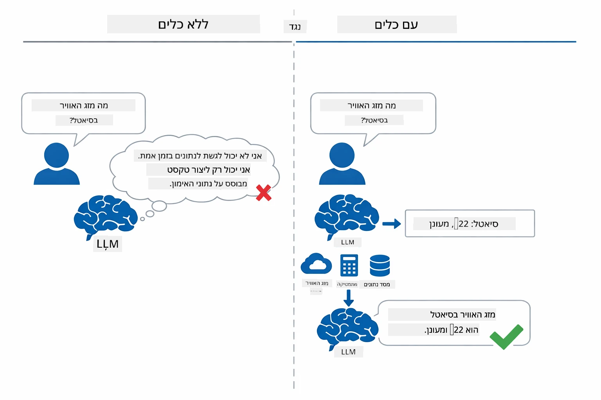

*ללא כלים המודל רק מנחש — עם כלים הוא מסוגל לקרוא ל-API, לבצע חישובים ולהחזיר נתונים בזמן אמת.*

סוכן בינה מלאכותית עם כלים פועל בתבנית **ReAct (היסק ופעולה)**. המודל לא רק מגיב — הוא חושב על מה שהוא צריך, פועל באמצעות קריאה לכלי, מבחין בתוצאה, ואז מחליט אם לפעול שוב או לספק את התשובה הסופית:

1. **היסק** — הסוכן מנתח את שאלה של המשתמש וקובע איזו מידע הוא צריך
2. **פעולה** — הסוכן בוחר את הכלי הנכון, מייצר את הפרמטרים המתאימים, וקורא לו
3. **תצפית** — הסוכן מקבל את פלט הכלי ומעריך את התוצאה
4. **חזור או הגש תשובה** — אם דרוש מידע נוסף, הסוכן חוזר על התהליך; אחרת, הוא מכין תשובה בשפה טבעית

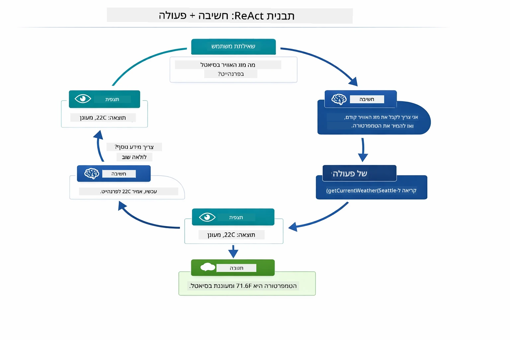

*מחזור ReAct — הסוכן מסתכל מה לעשות, פועל באמצעות קריאה לכלי, מבחין בתוצאה וחוזר עד שהוא יכול לספק את התשובה הסופית.*

זה קורה אוטומטית. אתה מגדיר את הכלים ותיאוריהם. המודל מטפל בקבלת ההחלטות מתי ואיך להשתמש בהם.

## כיצד פועל הקריאה לכלים

### הגדרות כלי

[WeatherTool.java](../../../04-tools/src/main/java/com/example/langchain4j/agents/tools/WeatherTool.java) | [TemperatureTool.java](../../../04-tools/src/main/java/com/example/langchain4j/agents/tools/TemperatureTool.java)

אתה מגדיר פונקציות עם תיאורים ברורים ומפרטי פרמטרים. המודל רואה את התיאורים האלה בפורמט המערכת שלו ומבין מה כל כלי עושה.

```java
@Component
public class WeatherTool {
    
    @Tool("Get the current weather for a location")
    public String getCurrentWeather(@P("Location name") String location) {
        // הלוגיקה שלך לחיפוש מזג האוויר
        return "Weather in " + location + ": 22°C, cloudy";
    }
}

@AiService
public interface Assistant {
    String chat(@MemoryId String sessionId, @UserMessage String message);
}

// העוזר מחובר אוטומטית על ידי Spring Boot עם:
// - Bean של ChatModel
// - כל המתודות המסומנות ב-@Tool מתוך מחלקות המסומנות ב-@Component
// - ספק זיכרון שיחה לניהול מושבים
```
  
התכנית למטה מפרקת כל הערה ומראה כיצד כל חלק מסייע ל-AI להבין מתי לקרוא לכלי ואילו ארגומנטים להעביר:

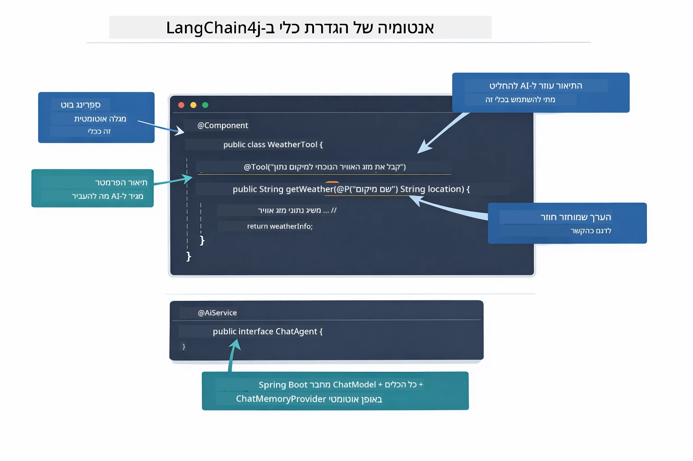

*אנטומיה של הגדרת כלי — @Tool אומר ל-AI מתי להשתמש בו, @P מתאר כל פרמטר, ו-@AiService מחבר הכל יחד בהרצה.*

> **🤖 נסה עם [GitHub Copilot](https://github.com/features/copilot) Chat:** פתח את [`WeatherTool.java`](../../../04-tools/src/main/java/com/example/langchain4j/agents/tools/WeatherTool.java) ושאל:
> - "איך הייתי משלב API אמיתי למזג אוויר כמו OpenWeatherMap במקום נתוני דמה?"
> - "מה הופך תיאור כלי לטוב שעוזר ל-AI להשתמש בו נכון?"
> - "איך מטפלים בשגיאות API ומגבלות בקצב בקריאות לכלים?"

### קבלת החלטות

כשמשתמש שואל "איך מזג האוויר בסיאטל?", המודל לא בוחר כלי באקראי. הוא משווה את כוונת המשתמש לכל תיאור כלי שיש לו, מדרג כל אחד על רלוונטיות, ובוחר את ההתאמה הטובה ביותר. לאחר מכן הוא מייצר קריאה פונקציונלית מובנית עם הפרמטרים הנכונים — במקרה זה, מגדיר את `location` ל-"Seattle".

אם אין כלי שתואם את בקשת המשתמש, המודל חוזר לענות מתוך הידע שלו עצמו. אם יש מספר כלים שתואמים, הוא בוחר את הספציפי ביותר.

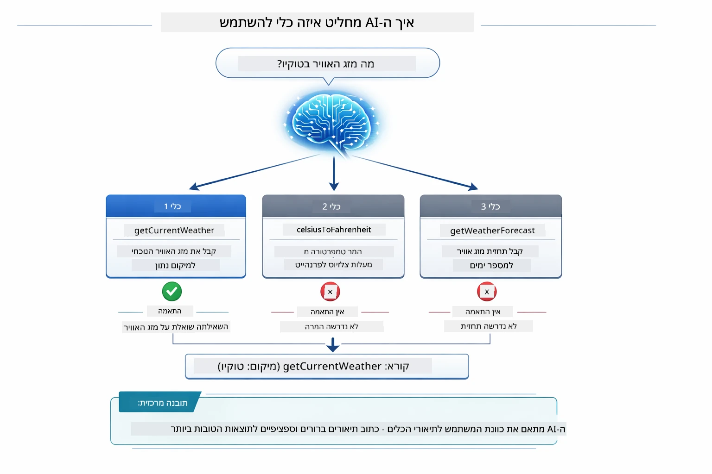

*המודל מעריך כל כלי זמין בהתייחס לכוונת המשתמש ובוחר את ההתאמה הטובה ביותר — לכן חשוב לכתוב תיאורי כלים ברורים וספציפיים.*

### ביצוע

[AgentService.java](../../../04-tools/src/main/java/com/example/langchain4j/agents/service/AgentService.java)

Spring Boot מחבר אוטומטית את ממשק ה-`@AiService` הכריזתי עם כל הכלים הרשומים, ו-LangChain4j מריץ קריאות לכלים אוטומטית. מאחורי הקלעים, זרימת קריאה מלאה לכלי עוברת שישה שלבים — משאלת המשתמש בשפה טבעית ועד תשובה בשפה טבעית:

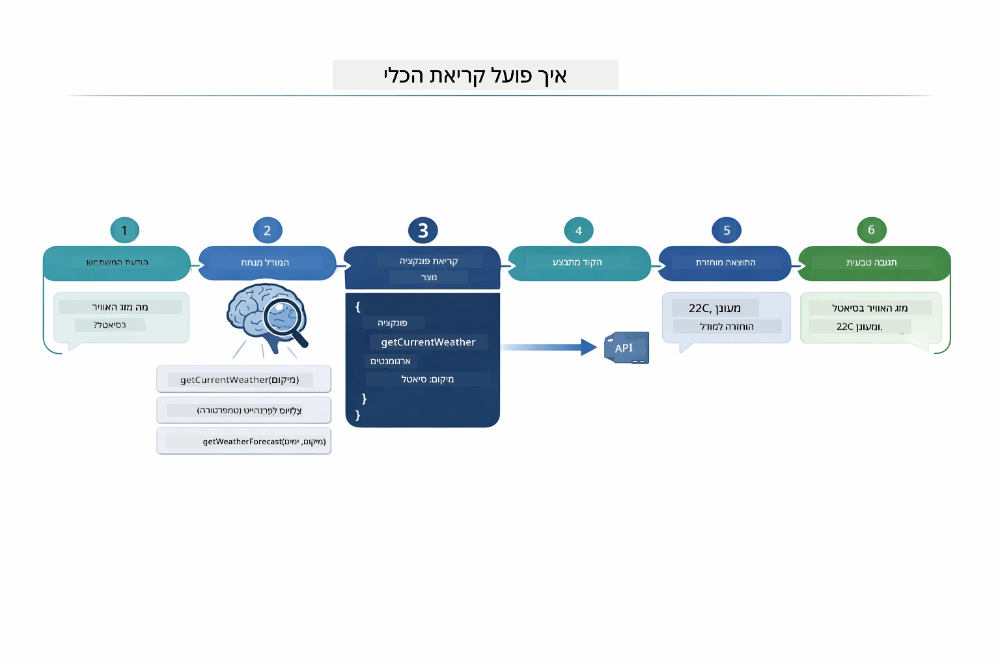

*הזרימה מקצה לקצה — המשתמש שואל שאלה, המודל בוחר כלי, LangChain4j מפעיל אותו, והמודל משלב את התוצאה בתגובה טבעית.*

> **🤖 נסה עם [GitHub Copilot](https://github.com/features/copilot) Chat:** פתח את [`AgentService.java`](../../../04-tools/src/main/java/com/example/langchain4j/agents/service/AgentService.java) ושאל:
> - "איך עובדת תבנית ReAct ולמה היא יעילה לסוכני AI?"
> - "איך הסוכן מחליט איזה כלי להשתמש ובאיזה סדר?"
> - "מה קורה אם הפעלת כלי נכשלת – איך לטפל בשגיאות בצורה עמידה?"

### יצירת תגובה

המודל מקבל את נתוני מזג האוויר ומעצב אותם לתגובה בשפה טבעית עבור המשתמש.

### ארכיטקטורה: חיבור אוטומטי של Spring Boot

מודול זה משתמש באינטגרציה של LangChain4j עם Spring Boot עם ממשקי `@AiService` הכרזתיים. בהפעלה Spring Boot מגלה כל `@Component` שמכיל שיטות `@Tool`, את ה-`ChatModel` שלך ו-`ChatMemoryProvider` — ואז מחבר את כולם לממשק `Assistant` אחד ללא קוד גנרי.

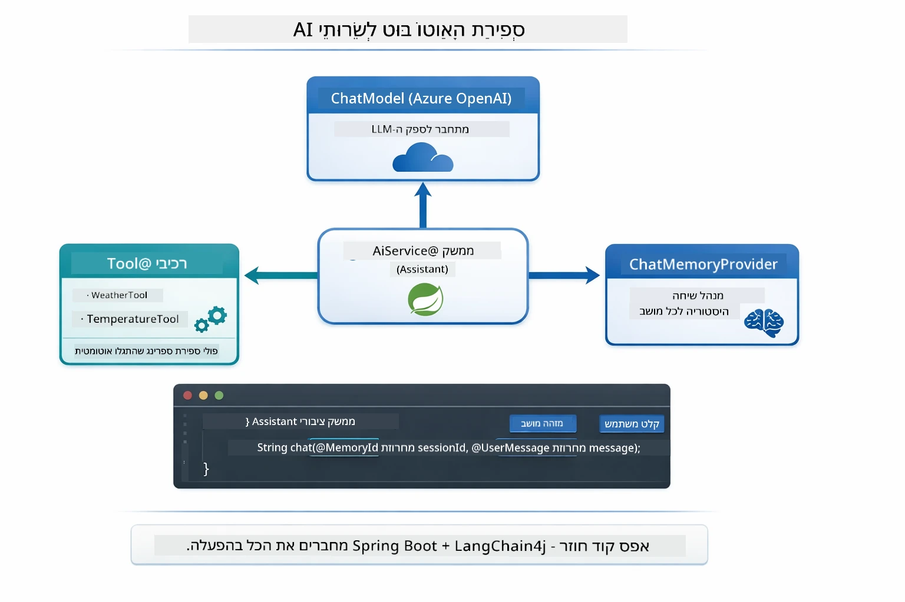

*ממשק @AiService מחבר את ה-ChatModel, רכיבי הכלים, וספק הזיכרון — Spring Boot מטפל בכל החיבור אוטומטית.*

יתרונות מרכזיים בגישה זו:

- **חיבור אוטומטי של Spring Boot** — ChatModel וכלים מוזרקים אוטומטית
- **תבנית @MemoryId** — ניהול זיכרון מבוסס מושב באופן אוטומטי
- **אינסטנס יחיד** — עוזר שנוצר פעם אחת ומשמש שוב לשיפור ביצועים
- **ביצוע בטוח מסוג** — שיטות Java נקראות ישירות עם המרת סוגים
- **תזמור רב סיבובי** — מטפל בשרשור כלים אוטומטית
- **ללא קוד גנרי** — אין קריאות ידניות ל-`AiServices.builder()` או למפות זיכרון

גישות אלטרנטיביות (ידניות עם `AiServices.builder()`) דורשות יותר קוד וחסרות את יתרונות האינטגרציה של Spring Boot.

## שרשור כלים

**שרשור כלים** — העוצמה האמיתית של סוכנים מבוססי כלים מופיעה כאשר שאלה בודדת דורשת שימוש ביותר כלים. תשאל "מה מזג האוויר בסיאטל בפארנהייט?" והסוכן ישרשר אוטומטית שני כלים: תחילה הוא קורא ל-`getCurrentWeather` כדי לקבל את הטמפרטורה בצלזיוס, ואז מעביר את הערך ל-`celsiusToFahrenheit` להמרה — הכל בסיבוב שיחה יחיד.

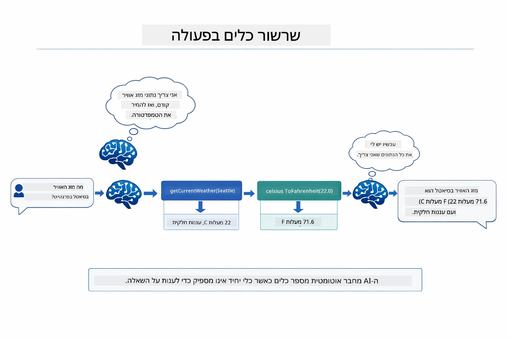

*שרשור כלים בפעולה — הסוכן קורא קודם ל-getCurrentWeather, ואז מזין את התוצאה בצלזיוס ל-celsiusToFahrenheit, ומציג תשובה משולבת.*

**כישלונות אלגנטיים** — בקש מזג אוויר לעיר שאינה קיימת בנתוני הדמה. הכלי מחזיר הודעת שגיאה, וה-AI מסביר שהוא לא יכול לעזור במקום לקרוס. כלים כושלים בצורה בטוחה. התרשים למטה מראה ניגוד בין שתי הגישות — עם טיפול נכון בשגיאות, הסוכן לוכד את החריגה ומגיב בצורה מועילה, ואילו בלעדיו היישום כולו קורס:

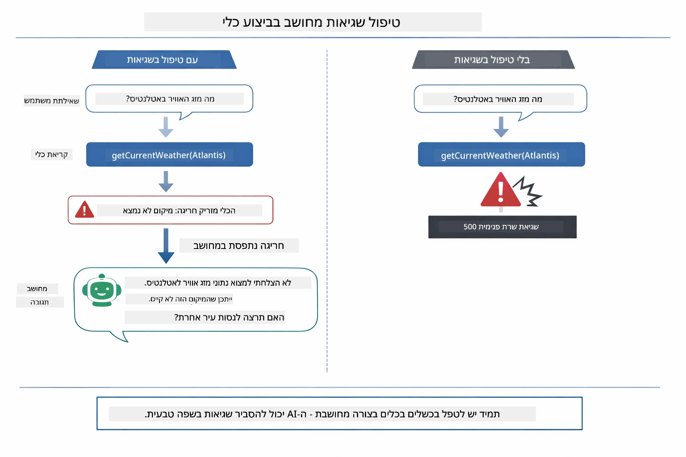

*כשכלי נכשל, הסוכן לוכד את השגיאה ומגיב בהסבר מועיל במקום לקרוס.*

זה קורה בסיבוב שיחה אחד. הסוכן מתזמר קריאות לכלים רבות באופן אוטונומי.

## הפעלת היישום

**ודא פריסה:**

וודא שקובץ `.env` קיים בספריית השורש עם אישורי Azure (נוצר במהלך מודול 01). הרץ זאת מספריית המודול (`04-tools/`):

**Bash:**
```bash
cat ../.env  # צריך להציג AZURE_OPENAI_ENDPOINT, API_KEY, DEPLOYMENT
```
  
**PowerShell:**
```powershell
Get-Content ..\.env  # צריך להציג את AZURE_OPENAI_ENDPOINT, API_KEY, DEPLOYMENT
```
  
**הפעל את היישום:**

> **הערה:** אם כבר הפעלת את כל היישומים באמצעות `./start-all.sh` מספריית השורש (כמפורט במודול 01), מודול זה כבר רץ על פורט 8084. ניתן לדלג על פקודות ההפעלה למטה ולגשת ישירות ל-http://localhost:8084.

**אפשרות 1: שימוש ב-Spring Boot Dashboard (מומלץ למשתמשי VS Code)**

מיכל הפיתוח כולל את תוסף Spring Boot Dashboard, המספק ממשק חזותי לניהול כל יישומי Spring Boot. תוכל למצוא אותו בסרגל הפעילות בצד שמאל של VS Code (חפש את סמל ה-Spring Boot).

מ-Spring Boot Dashboard, אתה יכול:
- לראות את כל יישומי Spring Boot הזמינים בסביבת העבודה
- להפעיל/לכבות יישומים בלחיצה אחת
- לצפות ביומני היישום בזמן אמת
- לעקוב אחרי מצב היישום

פשוט לחץ על כפתור ההפעלה ליד "tools" כדי להפעיל את המודול הזה, או הפעל את כל המודולים בבת אחת.

כך נראה Spring Boot Dashboard ב-VS Code:


*Spring Boot Dashboard ב-VS Code — הפעלה, עצירה ומעקב של כל המודולים במקום אחד*

**אפשרות 2: שימוש בסקריפטים shell**

הפעל את כל היישומים הרשתיים (מודולים 01-04):

**Bash:**
```bash
cd ..  # מתיקיית השורש
./start-all.sh
```
  
**PowerShell:**
```powershell
cd ..  # מתיקיית השורש
.\start-all.ps1
```
  
או הפעל רק את המודול הזה:

**Bash:**
```bash
cd 04-tools
./start.sh
```
  
**PowerShell:**
```powershell
cd 04-tools
.\start.ps1
```
  
שני הסקריפטים טוענים אוטומטית משתני סביבה מקובץ `.env` בשורש ויבנו את ארכיוני JAR אם אינם קיימים.

> **הערה:** אם אתה מעדיף לבנות את כל המודולים ידנית לפני ההפעלה:
>
> **Bash:**
> ```bash
> cd ..  # Go to root directory
> mvn clean package -DskipTests
> ```
  
> **PowerShell:**
> ```powershell
> cd ..  # Go to root directory
> mvn clean package -DskipTests
> ```
  
פתח את http://localhost:8084 בדפדפן שלך.

**להפסקה:**

**Bash:**
```bash
./stop.sh  # מודול זה בלבד
# או
cd .. && ./stop-all.sh  # כל המודולים
```
  
**PowerShell:**
```powershell
.\stop.ps1  # רק במודול זה
# או
cd ..; .\stop-all.ps1  # כל המודולים
```
  
## שימוש ביישום

היישום מספק ממשק רשת שבו ניתן לתקשר עם סוכן בינה מלאכותית שיש לו גישה לכלי מזג אוויר והמרת טמפרטורה. כך נראה הממשק — כולל דוגמאות התחלה מהירה ופאנל שיחה לשליחת בקשות:
<a href="images/tools-homepage.png"></a>

*ממשק כלי סוכן ה-AI - דוגמאות מהירות וממשק שיחה לאינטראקציה עם כלים*

### נסה שימוש פשוט בכלים

התחל עם בקשה פשוטה: "המר 100 מעלות פרנהייט לצלזיוס". הסוכן מזהה שהוא צריך את כלי המרת הטמפרטורה, מפעיל אותו עם הפרמטרים הנכונים ומחזיר את התוצאה. שים לב כמה זה מרגיש טבעי - לא ציינת איזה כלי להשתמש או איך להפעילו.

### בדוק שרשור כלים

עכשיו נסה משהו יותר מורכב: "מה מזג האוויר בסיאטל והמר אותו לפרנהייט?" צפה בסוכן פועל בשלבים. הוא תחילה מקבל את מזג האוויר (שמחזיר צלזיוס), מזהה שהוא צריך להמיר לפרנהייט, מפעיל את כלי ההמרה ומשלב את שתי התוצאות לתגובה אחת.

### ראה את זרימת השיחה

ממשק השיחה שומר היסטוריית שיחות, ומאפשר לך לנהל אינטראקציות מרובות סבבים. אתה יכול לראות את כל השאלות והתשובות הקודמות, מה שמקל לעקוב אחרי השיחה ולהבין איך הסוכן בונה הקשר לאורך מספר חילופי דברים.

<a href="images/tools-conversation-demo.png"></a>

*שיחה מרובת סבבים המציגה המרות פשוטות, בדיקות מזג אוויר, ושרשור כלים*

### נסה שילובים שונים של בקשות

נסה שילובים שונים:
- בדיקות מזג אוויר: "מה מזג האוויר בטוקיו?"
- המרות טמפרטורות: "כמה זה 25°C בקלווין?"
- שאילתות משולבות: "בדוק את מזג האוויר בפריז ואומר לי אם מעל 20°C"

שים לב איך הסוכן מפרש שפה טבעית ומתאים אותה לקריאות כלים מתאימות.

## מושגים מרכזיים

### תבנית ReAct (היסק ופעולה)

הסוכן מתחלף בין היסק (קבלת החלטות מה לעשות) ופעולה (שימוש בכלים). תבנית זו מאפשרת פתרון בעיות אוטונומי במקום רק תגובה להוראות.

### תיאורי כלים חשובים

איכות תיאורי הכלים משפיעה ישירות על האופן שבו הסוכן משתמש בהם. תיאורים ברורים ומדויקים עוזרים לדגם להבין מתי וכיצד לקרוא לכל כלי.

### ניהול מושבים

ההערה `@MemoryId` מאפשרת ניהול זכרון מבוסס מושב אוטומטי. כל מזהה מושב מקבל מופע `ChatMemory` מנוהל על ידי ה-bean `ChatMemoryProvider`, כך שמשתמשים מרובים יכולים לעבוד עם הסוכן בו-זמנית בלי שהשיחות שלהם יתערבבו. התרשים הבא מראה איך מספר משתמשים מנותבים אל חנויות זכרון מבודדות לפי מזהי המושבים שלהם:

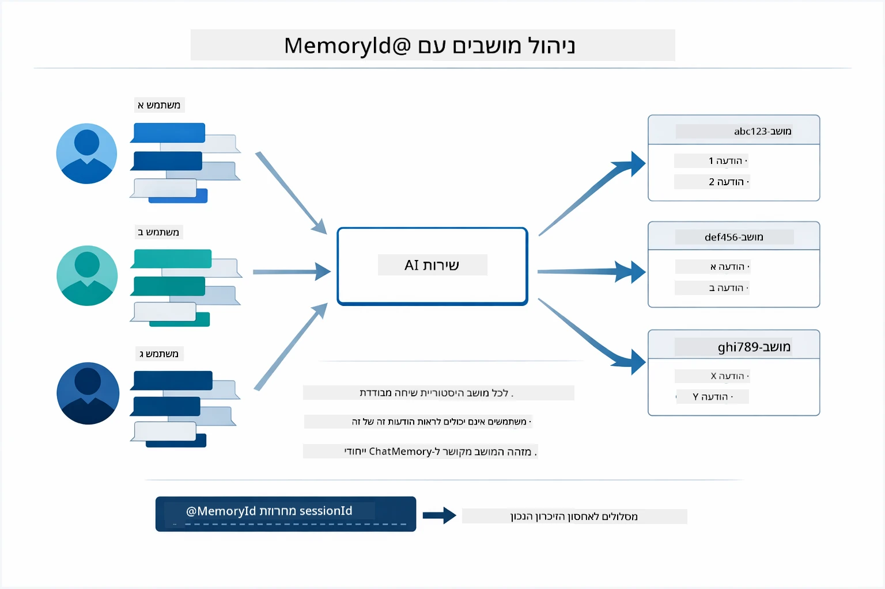

*כל מזהה מושב מקושר להיסטוריית שיחות מבודדת — משתמשים אינם רואים את ההודעות של אחרים.*

### טיפול בשגיאות

כלים יכולים להיכשל — חיבורים ל-API מתנגשים, פרמטרים עלולים להיות לא תקינים, שירותים חיצוניים נופלים. סוכני ייצור צריכים טיפול בשגיאות כך שהדגם יוכל להסביר בעיות או לנסות אלטרנטיבות במקום לקרוס כולו. כשכלי זורק חריגה, LangChain4j תופס את זה ומזין את הודעת השגיאה בחזרה לדגם, שמסוגל להסביר את הבעיה בשפה טבעית.

## כלים זמינים

התרשים למטה מציג את האקוסיסטמה הרחבה של כלים שניתן לבנות. המודול מדגים כלים של מזג אוויר וטמפרטורה, אבל אותה תבנית `@Tool` עובדת עם כל שיטת Java — משאילתות בסיס נתונים ועד עיבוד תשלומים.

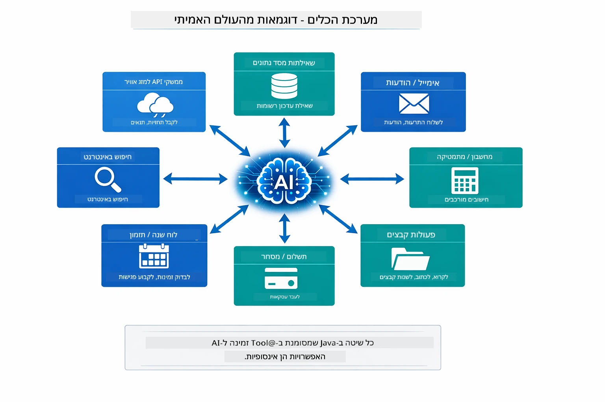

*כל שיטת Java המסומנת ב-@Tool זמינה ל-AI — התבנית מתרחבת לבסיסי נתונים, APIs, דוא"ל, פעולות קבצים ועוד.*

## מתי להשתמש בסוכנים מבוססי כלים

לא כל בקשה דורשת כלים. ההחלטה נובעת מהאם ה-AI צריך אינטראקציה עם מערכות חיצוניות או יכול לענות מתוך הידע שלו. המדריך הבא מסכם מתי כלים מוסיפים ערך ומתי הם מיותרים:

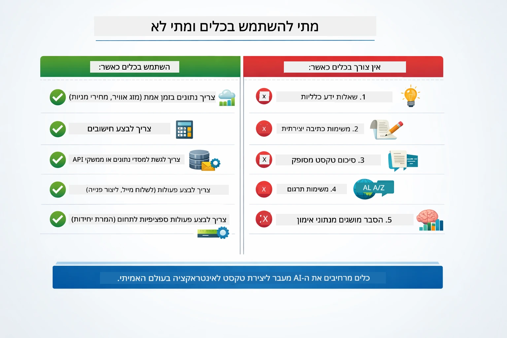

*מדריך החלטה מהיר — כלים מיועדים לנתונים בזמן אמת, חישובים ופעולות; ידע כללי ומשימות יצירתיות אינם זקוקים להם.*

## כלים לעומת RAG

מודולים 03 ו-04 מרחיבים את מה שה-AI יכול לעשות, אבל בדרכים שונות באופן יסודי. RAG נותן לדגם גישה ל**ידע** באמצעות שליפת מסמכים. כלים נותנים לדגם את היכולת לבצע **פעולות** דרך קריאת פונקציות. התרשים למטה משווה בין שתי הגישות זו לצד זו — מהאופן שבו כל זרימת עבודה פועלת ועד לתחומי הסיכון שביניהם:

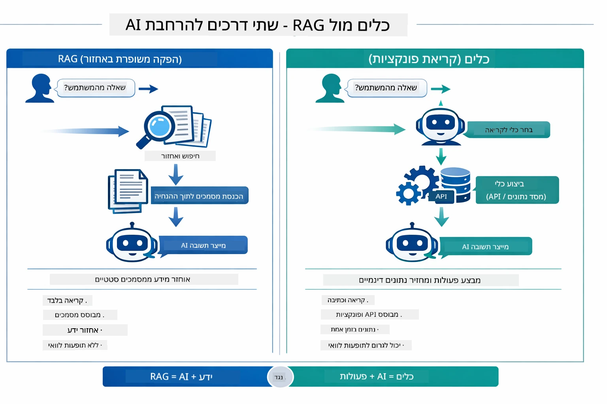

*RAG שולף מידע ממסמכים סטטיים — כלים מבצעים פעולות ומביאים נתונים דינמיים, בזמן אמת. מערכות ייצור רבות משלבות את שתיהן.*

בעשייה, מערכות ייצור רבות משלבות את שתי הגישות: RAG לאבטח תשובות בתיעוד שלך, וכלים לשליפת נתונים חיים או ביצוע פעולות.

## הצעדים הבאים

**המודול הבא:** [05-mcp - פרוטוקול הקשר מודל (MCP)](../05-mcp/README.md)

---

**ניווט:** [← קודם: מודול 03 - RAG](../03-rag/README.md) | [חזרה לעמוד הראשי](../README.md) | [הבא: מודול 05 - MCP →](../05-mcp/README.md)

---

<!-- CO-OP TRANSLATOR DISCLAIMER START -->
**כתב ויתור**:  
מסמך זה תורגם באמצעות שירות תרגום מבוסס בינה מלאכותית [Co-op Translator](https://github.com/Azure/co-op-translator). בעוד שאנו שואפים לדיוק, יש לקחת בחשבון שתרגומים אוטומטיים עלולים להכיל שגיאות או אי-דיוקים. יש להתייחס למסמך המקורי בשפת המקור כמקור הסמכותי. למידע קריטי, מומלץ לבצע תרגום מקצועי על ידי אדם. אנו לא אחראים לכל אי-הבנות או פרשנויות שגויות הנובעות משימוש בתרגום זה.
<!-- CO-OP TRANSLATOR DISCLAIMER END -->