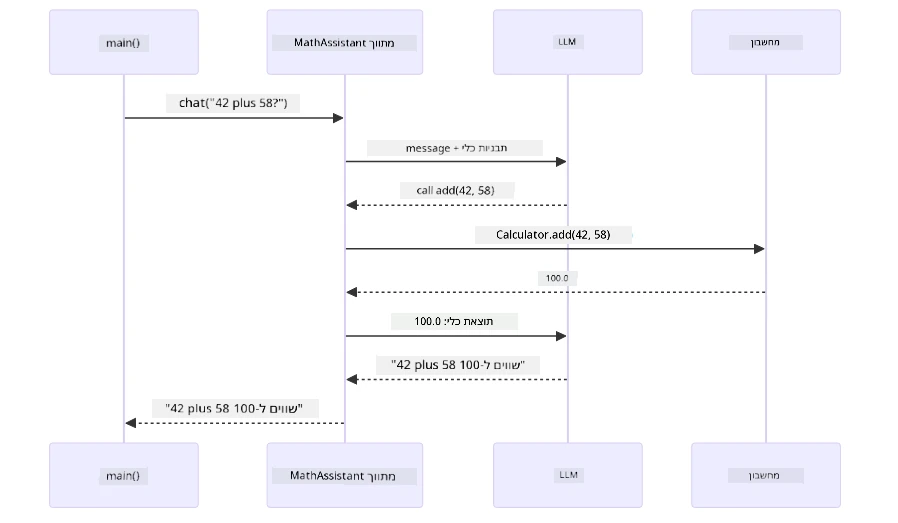
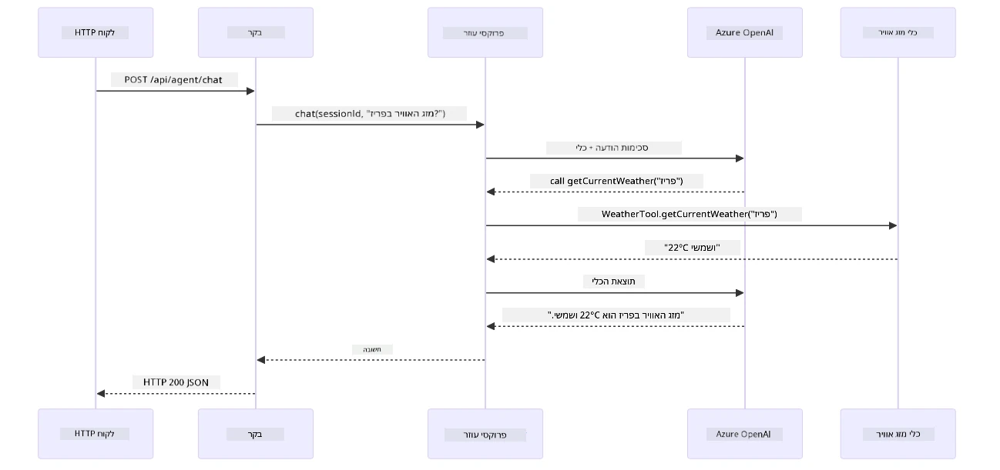

# מודול 04: סוכני AI עם כלים

## תוכן העניינים

- [מה תלמדו](../../../04-tools)
- [דרישות מוקדמות](../../../04-tools)
- [הבנת סוכני AI עם כלים](../../../04-tools)
- [איך עובדת קריאה לכלים](../../../04-tools)
  - [הגדרות כלים](../../../04-tools)
  - [קבלת החלטות](../../../04-tools)
  - [ביצוע](../../../04-tools)
  - [יצירת תגובה](../../../04-tools)
  - [ארכיטקטורה: Spring Boot חיבור אוטומטי](../../../04-tools)
- [שרשור כלים](../../../04-tools)
- [הרצת האפליקציה](../../../04-tools)
- [שימוש באפליקציה](../../../04-tools)
  - [נסו שימוש פשוט בכלי](../../../04-tools)
  - [בדקו שרשור כלים](../../../04-tools)
  - [ראו זרימת שיחה](../../../04-tools)
  - [נסו בקשות שונות](../../../04-tools)
- [מושגים מרכזיים](../../../04-tools)
  - [תבנית ReAct (היגיון ופעולה)](../../../04-tools)
  - [חשיבות תיאורי הכלים](../../../04-tools)
  - [ניהול סשן](../../../04-tools)
  - [טיפול בשגיאות](../../../04-tools)
- [כלים זמינים](../../../04-tools)
- [מתי משתמשים בסוכנים מבוססי כלים](../../../04-tools)
- [כלים מול RAG](../../../04-tools)
- [השלבים הבאים](../../../04-tools)

## מה תלמדו

עד כה למדת איך לנהל שיחות עם AI, לבנות פרומפטים בצורה יעילה, ולבסס תגובות במסמכים שלך. אבל יש עדיין מגבלה יסודית: דגמי שפה יכולים רק ליצור טקסט. הם לא יכולים לבדוק מזג אוויר, לבצע חישובים, לשאול מסדי נתונים או לתקשר עם מערכות חיצוניות.

כלים משנים את זה. על ידי מתן גישה למודל לפונקציות שהוא יכול לקרוא להן, אתה הופך אותו מיצרן טקסט לסוכן שיכול לבצע פעולות. המודל מחליט מתי הוא צריך כלי, איזה כלי להשתמש, ואילו פרמטרים להעביר. הקוד שלך מבצע את הפונקציה ומחזיר את התוצאה. המודל משלב את התוצאה בתגובה שלו.

## דרישות מוקדמות

- השלמת [מודול 01 - מבוא](../01-introduction/README.md) (משאבי Azure OpenAI פרוסים)
- מומלץ להשלים מודולים קודמים (מודול זה מתייחס ל[מושגי RAG ממודול 03](../03-rag/README.md) בהשוואה בין כלים ל-RAG)
- קובץ `.env` בתיקייה הראשית עם אישורי Azure (נוצר על ידי `azd up` במודול 01)

> **הערה:** אם לא השלמת את מודול 01, עקוב אחר הוראות הפריסה שם קודם.

## הבנת סוכני AI עם כלים

> **📝 הערה:** המונח "סוכנים" במודול זה מתייחס לעוזרי AI המורחבים עם יכולות קריאה לכלים. זה שונה מתבניות **Agentic AI** (סוכנים אוטונומיים עם תכנון, זיכרון, והיגיון רב-שלבי) שנעסוק בהם ב-[מודול 05: MCP](../05-mcp/README.md).

בלי כלים, מודל שפה יכול לייצר טקסט בלבד מתוך נתוני האימון שלו. תשאל אותו לגבי מזג אוויר נוכחי, והוא צריך לנחש. תיתן לו כלים, והוא יכול לקרוא API למזג אוויר, לבצע חישובים, או לשאול מסד נתונים — ואז לשלב את התוצאות האמיתיות בתגובה שלו.


*בלי כלים המודל רק מנחש — עם כלים הוא יכול לקרוא ל-APIs, להריץ חישובים ולהחזיר נתונים בזמן אמת.*

סוכן AI עם כלים פועל על פי תבנית **Reasoning and Acting (ReAct)**. המודל לא רק מגיב — הוא חושב מה הוא צריך, פועל על ידי קריאה לכלי, מתבונן בתוצאה, ואז מחליט אם לפעול שוב או לתת את התשובה הסופית:

1. **היגיון** — הסוכן מנתח את שאלת המשתמש ומחליט איזה מידע הוא צריך
2. **פעולה** — הסוכן בוחר את הכלי הנכון, מייצר את הפרמטרים המתאימים, וקורא לו
3. **התבוננות** — הסוכן מקבל פלט מהכלי ומעריך את התוצאה
4. **חזרה או תגובה** — אם נדרשת עוד מידע, הסוכן חוזר על התהליך; אחרת, הוא מחבר תשובה בשפה טבעית


*מחזור ReAct — הסוכן מבין מה פעולה עליו לעשות, מפעיל כלי, מתבונן בתוצאה, וחוזר על כך עד שניתן לספק תשובה סופית.*

זה מתרחש אוטומטית. אתה מגדיר את הכלים ואת תיאוריהם. המודל מטפל בקבלת ההחלטות מתי ואיך להשתמש בהם.

## איך עובדת קריאה לכלים

### הגדרות כלים

[WeatherTool.java](../../../04-tools/src/main/java/com/example/langchain4j/agents/tools/WeatherTool.java) | [TemperatureTool.java](../../../04-tools/src/main/java/com/example/langchain4j/agents/tools/TemperatureTool.java)

אתה מגדיר פונקציות עם תיאורים ברורים והגדרות פרמטרים. המודל רואה תיאורים אלו בפרומפט המערכת שלו ומבין מה כל כלי עושה.

```java
@Component
public class WeatherTool {
    
    @Tool("Get the current weather for a location")
    public String getCurrentWeather(@P("Location name") String location) {
        // הלוגיקה שלך לחיפוש מזג האוויר
        return "Weather in " + location + ": 22°C, cloudy";
    }
}

@AiService
public interface Assistant {
    String chat(@MemoryId String sessionId, @UserMessage String message);
}

// העוזר מחובר אוטומטית על ידי Spring Boot עם:
// - ביט ChatModel
// - כל שיטות @Tool מתוך מחלקות @Component
// - ספק ChatMemory לניהול מושבים
```

הדיאגרמה הבאה מפרקת כל אנוטציה ומראה איך כל חלק עוזר ל-AI להבין מתי לקרוא לכלי ואילו ארגומנטים להעביר:


*אנטומיה של הגדרת כלי — @Tool מורה ל-AI מתי להשתמש בו, @P מתאר כל פרמטר, ו-@AiService מחבר הכל יחד בעת ההפעלה.*

> **🤖 נסה עם [GitHub Copilot](https://github.com/features/copilot) צ׳אט:** פתח את [`WeatherTool.java`](../../../04-tools/src/main/java/com/example/langchain4j/agents/tools/WeatherTool.java) ושאל:
> - "איך אפשר לשלב API אמיתי למזג אוויר כמו OpenWeatherMap במקום נתוני מורך?"
> - "מה עושה תיאור כלי טוב שעוזר ל-AI להשתמש בו נכון?"
> - "איך אפשר לטפל בשגיאות API ומגבלות קצב קריאה ביישומי כלים?"

### קבלת החלטות

כשמשתמש שואל "מה מזג האוויר בסיאטל?", המודל לא בוחר כלי אקראי. הוא משווה את כוונת המשתמש אל מול תיאורי כלים שלכלים שיש לו גישה אליהם, מדרג כל אחד לפי רלוונטיות, ובוחר את ההתאמה הטובה ביותר. המודל יוצר קריאה לפונקציה מסודרת עם הפרמטרים הנכונים — במקרה זה, מגדיר `location` כ-`"Seattle"`.

אם אין כלי שמתאים לבקשת המשתמש, המודל חוזר לענות מתוך הידע שלו. אם יש מספר כלים מתאימים, הוא בוחר את הספציפי ביותר.


*המודל מעריך כל כלי זמין לפי כוונת המשתמש ובוחר את ההתאמה הטובה ביותר — לכן חשוב לכתוב תיאורי כלים ברורים ומפורטים.*

### ביצוע

[AgentService.java](../../../04-tools/src/main/java/com/example/langchain4j/agents/service/AgentService.java)

Spring Boot מחבר אוטומטית את הממשק ההצהרתי `@AiService` עם כל הכלים הרשומים, ו-LangChain4j מבצע קריאות לכלים אוטומטית. מאחורי הקלעים, קריאת כלי עוברת שישה שלבים — משאלת שפה טבעית של המשתמש ועד לתשובה בשפה טבעית:


*הזרימה מקצה לקצה — המשתמש שואל שאלה, המודל בוחר כלי, LangChain4j מבצע אותו, והמודל משלב את התוצאה בתגובה טבעית.*

אם הרצת את [ToolIntegrationDemo](../../../00-quick-start/src/main/java/com/example/langchain4j/quickstart/ToolIntegrationDemo.java) במודול 00, כבר ראית תבנית זו בפעולה — הכלים `Calculator` נקראו באותה הדרך. הדיאגרמת רצף שלמטה מראה בדיוק מה קרה מתחת למכסה בזמן הדמו ההוא:



*לולאת קריאת הכלים מהדמו Quick Start — `AiServices` שולח את ההודעה ואת סכימות הכלים ל-LLM, ה-LLM משיב בקריאה לפונקציה כמו `add(42, 58)`, LangChain4j מפעיל מקומית את המתודה `Calculator`, ומחזיר את התוצאה לתשובה הסופית.*

> **🤖 נסה עם [GitHub Copilot](https://github.com/features/copilot) צ׳אט:** פתח את [`AgentService.java`](../../../04-tools/src/main/java/com/example/langchain4j/agents/service/AgentService.java) ושאל:
> - "איך תבנית ReAct עובדת ולמה היא יעילה לסוכני AI?"
> - "איך הסוכן מחליט איזה כלי להשתמש ובאיזה סדר?"
> - "מה קורה אם ביצוע כלי נכשל - איך צריך לטפל בשגיאות באופן יציב?"

### יצירת תגובה

המודל מקבל את נתוני מזג האוויר ומעבד אותם לתגובה בשפה טבעית עבור המשתמש.

### ארכיטקטורה: Spring Boot חיבור אוטומטי

מודול זה משתמש באינטגרציה של LangChain4j עם Spring Boot עם ממשקי `@AiService` הצהרתיים. בעת ההפעלה, Spring Boot מגלה כל `@Component` שמכיל מתודות עם `@Tool`, את ה-`ChatModel` שלך, ואת `ChatMemoryProvider` — ואז מחבר את כולם לממשק `Assistant` אחד עם אפס בוליור.


*ממשק @AiService מחבר את ה-ChatModel, רכיבי הכלים וספק הזיכרון — Spring Boot מטפל בכל החיבורים אוטומטית.*

להלן מחזור החיים המלא של בקשה כדיאגרמת רצף — מבקשת HTTP דרך הקונטרולר, השרת, והפרוקסי המחובר אוטומטית, ועד לביצוע הכלי והחזרה:



*מחזור החיים המלא של בקשת Spring Boot — בקשת HTTP זורמת דרך הקונטרולר והשירות לפרוקסי Assistant המחובר אוטומטית, שמרכז את ה-LLM וקריאות הכלים.*

יתרונות מרכזיים בשיטה זו:

- **חיבור אוטומטי ב-Spring Boot** — ChatModel וכלים מוזרקים אוטומטית
- **תבנית @MemoryId** — ניהול זיכרון מבוסס סשן אוטומטי
- **מופע יחיד** — Assistant נוצר פעם אחת ומשומש מחדש לביצועים טובים יותר
- **ביצוע בטוח טיפוס** — קריאה ישירה למתודות ג׳אווה עם המרת טיפוסים
- **תזמור רב-פניות** — מטפל בשרשור כלים אוטומטית
- **אפס בוליור** — אין צורך בקריאות ידניות ל-`AiServices.builder()` או מפות זיכרון

גישות חלופיות (קריאה ידנית ל-`AiServices.builder()`) דורשות יותר קוד ומפספסות יתרונות אינטגרציית Spring Boot.

## שרשור כלים

**שרשור כלים** — הכוח האמיתי של סוכנים מבוססי כלים מורגש כששאלה אחת דורשת מספר כלים. תשאל "מה מזג האוויר בסיאטל בפרנהייט?" והסוכן שרשר אוטומטית שני כלים: תחילה יקרא ל-`getCurrentWeather` כדי לקבל טמפרטורה בצלזיוס, ואז יעביר ערך זה ל-`celsiusToFahrenheit` להמרה — הכל בתוך סיבוב שיחה אחד.


*שרשור כלים בפעולה — הסוכן קורא ל-getCurrentWeather תחילה, ואז מעביר את תוצאת הצלזיוס ל-celsiusToFahrenheit, ומספק תשובה משולבת.*

**כשלונות מתונים** — תשאל לגבי מזג אוויר בעיר שאינה במידע מורך. הכלי מחזיר הודעת שגיאה, וה-AI מסביר שהוא לא יכול לעזור במקום לקרוס. כלים נכשלו בצורה בטוחה. הדיאגרמה מטה מציגה את הגישות השונות — עם טיפול שגיאות נכון, הסוכן תופס את החריגה ומגיב בעזרה, ואילו בלי זה כל האפליקציה קורסת:


*כשכלי נכשל, הסוכן תופס את השגיאה ומגיב עם הסבר מועיל במקום לקרוס.*

זה קורה בתוך סיבוב שיחה אחד. הסוכן מנוהל אוטונומית עם קריאות רב-כלים.

## הרצת האפליקציה

**וודאו הפריסה:**

ודאו שקובץ `.env` קיים בתיקייה הראשית עם אישורי Azure (נוצר במהלך מודול 01). הריצו זאת מתיקיית המודול (`04-tools/`):

**Bash:**
```bash
cat ../.env  # צריך להציג את AZURE_OPENAI_ENDPOINT, API_KEY, DEPLOYMENT
```

**PowerShell:**
```powershell
Get-Content ..\.env  # אמור להציג AZURE_OPENAI_ENDPOINT, API_KEY, DEPLOYMENT
```

**הפעילו את האפליקציה:**

> **הערה:** אם כבר התחלתם את כל האפליקציות עם `./start-all.sh` מהתיקייה הראשית (כמתואר במודול 01), מודול זה כבר פועל על פורט 8084. אפשר לדלג על פקודות ההפעלה וללכת ישירות אל http://localhost:8084.

**אפשרות 1: שימוש בלוח הבקרה של Spring Boot (מומלץ למשתמשי VS Code)**

מיכל הפיתוח כולל את תוסף Spring Boot Dashboard, המספק ממשק ויזואלי לניהול כל אפליקציות ה-Spring Boot. אפשר למצוא אותו בסרגל הפעילויות בצד שמאל של VS Code (חפשו את סמל Spring Boot).

ממשק Spring Boot Dashboard מאפשר:
- לראות את כל אפליקציות Spring Boot הזמינות בסביבת העבודה
- להפעיל/להפסיק אפליקציות בלחיצה אחת
- לצפות ביומני האפליקציה בזמן אמת
- לנטר את מצב האפליקציה

פשוט לחצו על כפתור ההפעלה ליד "tools" כדי להפעיל את המודול, או להפעיל את כל המודולים בבת אחת.

כך נראה לוח הבקרה של Spring Boot ב-VS Code:


*לוח בקרה Spring Boot ב-VS Code — התחילו, עצרו ונטרו את כל המודולים ממקום אחד*

**אפשרות 2: שימוש בסקריפטי shell**

הפעל את כל אפליקציות הרשת (מודולים 01-04):

**Bash:**
```bash
cd ..  # מתיקיית השורש
./start-all.sh
```

**PowerShell:**
```powershell
cd ..  # מספריית השורש
.\start-all.ps1
```

או הפעל רק את המודול הזה:

**Bash:**
```bash
cd 04-tools
./start.sh
```

**PowerShell:**
```powershell
cd 04-tools
.\start.ps1
```

שני הסקריפטים טוענים אוטומטית משתני סביבה מקובץ השורש `.env` ויבנו את קבצי ה-JAR אם הם לא קיימים.

> **הערה:** אם תרצו לבנות את כל המודולים ידנית לפני התחלת הרצה:
>
> **Bash:**
> ```bash
> cd ..  # Go to root directory
> mvn clean package -DskipTests
> ```
>
> **PowerShell:**
> ```powershell
> cd ..  # Go to root directory
> mvn clean package -DskipTests
> ```

פתחו את http://localhost:8084 בדפדפן שלכם.

**להפסיק:**

**Bash:**
```bash
./stop.sh  # מודול זה בלבד
# או
cd .. && ./stop-all.sh  # כל המודולים
```

**PowerShell:**
```powershell
.\stop.ps1  # מודול זה בלבד
# או
cd ..; .\stop-all.ps1  # כל המודולים
```

## שימוש באפליקציה

האפליקציה מספקת ממשק ווב שבו תוכלו לתקשר עם סוכן AI שיש לו גישה לכלי מזג אוויר והמרת טמפרטורה. כך נראית הממשק — הוא כולל דוגמאות הפעלה מהירה ולוח שיחה למשלוח בקשות:

<a href="images/tools-homepage.png"></a>

*ממשק כלים של סוכן AI - דוגמאות מהירות וממשק שיחה לאינטראקציה עם כלים*

### נסו שימוש פשוט בכלי

התחילו עם בקשה פשוטה: "המר 100 מעלות פרנהייט לצלזיוס". הסוכן מזהה שהוא צריך את כלי ההמרת טמפרטורה, קורא לו עם הפרמטרים המתאימים ומחזיר את התוצאה. שימו לב כמה זה טבעי - לא ציינתם איזה כלי להשתמש או איך לקרוא לו.

### נסו שרשור כלים

כעת נסו משהו מורכב יותר: "מה מזג האוויר בסיאטל והמר זאת לפרנהייט?" צפו בסוכן עובד על זה בשלבים. הוא קודם מקבל את מזג האוויר (שמוחזר בצלזיוס), מזהה שהוא צריך להמיר לפרנהייט, קורא לכלי ההמרה, ומשלב את שתי התוצאות בתגובה אחת.

### ראו זרימת שיחה

ממשק השיחה שומר היסטוריית שיחות, ומאפשר לנהל אינטראקציות מרובות סבבים. תוכלו לראות את כל השאלות והתשובות הקודמות, מה שמקל לעקוב ולראות איך הסוכן בונה הקשר לאורך חילופי המסרים.

<a href="images/tools-conversation-demo.png"></a>

*שיחה מרובת סבבים המציגה המרות פשוטות, בדיקות מזג אוויר ושרשור כלים*

### נסו שאילתות שונות

נסו שילובים שונים:
- בדיקות מזג אוויר: "מה מזג האוויר בטוקיו?"
- המרות טמפרטורה: "כמה זה 25°C בקלווין?"
- שאילתות משולבות: "בדוק את מזג האוויר בפריז ואמר לי אם מעל 20°C"

שימו לב כיצד הסוכן מפרש שפה טבעית וממפה לקריאות כלים מתאימות.

## מושגים מרכזיים

### דפוס ReAct (הגיון ופעולה)

הסוכן מתחלף בין הגיון (החלטה מה לעשות) לפעולה (שימוש בכלים). דפוס זה מאפשר פתרון בעיות עצמאי במקום רק תגובה לפקודות.

### תיאורי כלים חשובים

איכות תיאורי הכלים ישירות משפיעה על איכות השימוש בהם על ידי הסוכן. תיאורים ברורים ומפורטים מסייעים למודל להבין מתי וכיצד לקרוא לכל כלי.

### ניהול סשן

האנוטציה `@MemoryId` מאפשרת ניהול זיכרון מבוסס סשן באופן אוטומטי. לכל מזהה סשן מוקצה מופע `ChatMemory` מנוהל על ידי ה`ChatMemoryProvider`, כך שמשתמשים מרובים יכולים לתקשר עם הסוכן בו זמנית מבלי שהשיחות יתערבבו. התרשים הבא מראה איך משתמשים מרובים מנותבים לאגירות זיכרון מבודדות לפי מזהי הסשן:


*כל מזהה סשן מקשר להיסטוריית שיחה מבודדת — משתמשים אף פעם לא רואים את ההודעות של האחרים.*

### טיפול בשגיאות

כלים עלולים להיכשל — API-ים עלולים להיגמר בזמן, פרמטרים לא תקינים, שירותים חיצוניים לא זמינים. סוכני ייצור צריכים טיפול בשגיאות כדי שהמודל יוכל להסביר בעיות או לנסות חלופות במקום לקרוס כל האפליקציה. כשכלי זורק חריגה, LangChain4j תופס את השגיאה ומחזיר את ההודעה למודל, שיכול להסביר את הבעיה בשפה טבעית.

## כלים זמינים

התרשים שלמטה מראה את האקוסיסטם הרחב של הכלים שניתן לבנות. מודול זה מדגים כלים למזג אוויר וטמפרטורה, אבל דפוס `@Tool` זהה עובד לכל שיטת Java — משאילתות למסד נתונים, עיבוד תשלומים ועוד.


*כל שיטת Java המסומנת ב-@Tool זמינה ל-AI — הדפוס מתרחב למסדי נתונים, API-ים, דוא"ל, פעולות קבצים ועוד.*

## מתי להשתמש בסוכנים מבוססי כלים

לא כל בקשה דורשת כלים. ההחלטה היא אם ה-AI צריך אינטראקציה עם מערכות חיצוניות או יכול לענות מהידע הפנימי שלו. המדריך הבא מסכם מתי כלים מוסיפים ערך ומתי הם מיותרים:


*מדריך החלטה מהיר — כלים לנתונים בזמן אמת, חישובים ופעולות; משימות ידע כללי ויצירתיות אינן זקוקות להם.*

## כלים לעומת RAG

מודולים 03 ו-04 מרחיבים את מה שה-AI יכול לעשות, אך בדרכים יסודיות שונות. RAG נותן למודל גישה ל**ידע** על ידי שליפת מסמכים. כלים נותנים למודל את היכולת לבצע **פעולות** על ידי קריאת פונקציות. התרשים הבא משווה בין שתי הגישות לצדדים — מהלך העבודה וכיצד מתבצעים הפשרות ביניהן:


*RAG מחפש מידע במסמכים סטטיים — כלים מבצעים פעולות ומושכים נתונים דינמיים בזמן אמת. מערכות ייצור רבות משלבות את שניהם.*

למעשה, מערכות ייצור רבות משלבות את שתי הגישות: RAG להטמעת תשובות בתיעוד שלכם, וכלים לקבלת נתונים חיים או ביצוע פעולות.

## הצעדים הבאים

**מודול הבא:** [05-mcp - פרוטוקול הקשר מודל (MCP)](../05-mcp/README.md)

---

**ניווט:** [← הקודם: מודול 03 - RAG](../03-rag/README.md) | [חזרה לעמוד הראשי](../README.md) | [הבא: מודול 05 - MCP →](../05-mcp/README.md)

---

<!-- CO-OP TRANSLATOR DISCLAIMER START -->
**הצהרת אחריות**:
מסמך זה תורגם באמצעות שירות תרגום מבוסס בינה מלאכותית [Co-op Translator](https://github.com/Azure/co-op-translator). אנו שואפים לדיוק, אך יש לקחת בחשבון כי תרגומים אוטומטיים עלולים לכלול טעויות או אי-דיוקים. המסמך המקורי בשפת המקור שלו נחשב למקור הסמכותי. למידע קריטי מומלץ לפנות לתרגום מקצועי ממומחה אנושי. אנו לא נושאים באחריות לכל אי-הבנה או פרשנות שגויה הנובעת משימוש בתרגום זה.
<!-- CO-OP TRANSLATOR DISCLAIMER END -->