# מודול 05: פרוטוקול הקשר מודל (MCP)

## תוכן עניינים

- [מה תלמדו](../../../05-mcp)
- [מהו MCP?](../../../05-mcp)
- [איך MCP עובד](../../../05-mcp)
- [מודול סוכניות](../../../05-mcp)
- [הרצת הדוגמאות](../../../05-mcp)
  - [דרישות מוקדמות](../../../05-mcp)
- [התחלה מהירה](../../../05-mcp)
  - [פעולות על קבצים (Stdio)](../../../05-mcp)
  - [סוכן מפקח](../../../05-mcp)
    - [הרצת ההדגמה](../../../05-mcp)
    - [איך המפקח עובד](../../../05-mcp)
    - [איך FileAgent מוצא כלים של MCP בזמן ריצה](../../../05-mcp)
    - [אסטרטגיות תגובה](../../../05-mcp)
    - [הבנת הפלט](../../../05-mcp)
    - [הסבר על תכונות מודול סוכניות](../../../05-mcp)
- [מושגים מרכזיים](../../../05-mcp)
- [ברכות!](../../../05-mcp)
  - [מה הלאה?](../../../05-mcp)

## מה תלמדו

בניתם בינה מלאכותית שיחה, התמציתם בפרומפטים, יישבתם תגובות למסמכים, ויצרתם סוכנים עם כלים. אך כל הכלים האלה היו מותאמים במיוחד לאפליקציה הספציפית שלכם. מה אם תוכלו להעניק לבינה שלכם גישה לאקוסיסטם סטנדרטי של כלים שכל אחד יכול ליצור ולשתף? במודול זה תלמדו לעשות זאת בדיוק באמצעות פרוטוקול הקשר מודל (MCP) ומודול הסוכניות של LangChain4j. קודם נציג קורא קבצים פשוט של MCP ואז נראה כיצד הוא משתלב בקלות בזרימות עבודה סוכניות מתקדמות באמצעות דפוס סוכן מפקח.

## מהו MCP?

פרוטוקול הקשר מודל (MCP) מספק בדיוק את זה — דרך סטנדרטית ליישומי בינה מלאכותית לגלות ולהשתמש בכלים חיצוניים. במקום לכתוב אינטגרציות מותאמות אישית עבור כל מקור נתונים או שירות, אתם מתחברים לשרתי MCP החושפים את היכולות שלהם בפורמט עקבי. הסוכן הבינה שלכם יכול אז לגלות ולהשתמש בכלים אלה באופן אוטומטי.

הדיאגרמה למטה מראה את ההבדל — ללא MCP, כל אינטגרציה דורשת חיבור נקודה לנקודה מותאם אישית; עם MCP, פרוטוקול אחד מחבר את האפליקציה שלכם לכל כלי:


*לפני MCP: אינטגרציות מורכבות נקודה לנקודה. אחרי MCP: פרוטוקול אחד, אפשרויות אינסופיות.*

MCP פותר בעיה יסודית בפיתוח בינה מלאכותית: כל אינטגרציה היא מותאמת אישית. רוצים לגשת ל-GitHub? קוד מותאם. רוצים לקרוא קבצים? קוד מותאם. רוצים לשאול מסד נתונים? קוד מותאם. ואף אחת מהאינטגרציות האלה לא עובדת עם יישומי בינה מלאכותית אחרים.

MCP מסטנדרט זאת. שרת MCP חושף כלים עם תיאורים ברורים וסקימות. כל לקוח MCP יכול להתחבר, לגלות כלים זמינים, ולהשתמש בהם. בנו פעם אחת, השתמשו בכל מקום.

הדיאגרמה למטה ממחישה את הארכיטקטורה הזו — לקוח MCP בודד (אפליקציית הבינה שלכם) מתחבר למספר שרתי MCP, כל אחד חושף את קבוצת הכלים שלו דרך הפרוטוקול הסטנדרטי:


*ארכיטקטורת פרוטוקול הקשר מודל - גילוי כלים סטנדרטי וביצוע*

## איך MCP עובד

מתחת לפני השטח, MCP משתמש בארכיטקטורה בשכבות. אפליקציית Java שלכם (לקוח MCP) מגלה כלים זמינים, שולחת בקשות JSON-RPC דרך שכבת תעבורה (Stdio או HTTP), ושרת MCP מבצע פעולות ומחזיר תוצאות. הדיאגרמה הבאה מפרקת כל שכבה בפרוטוקול זה:

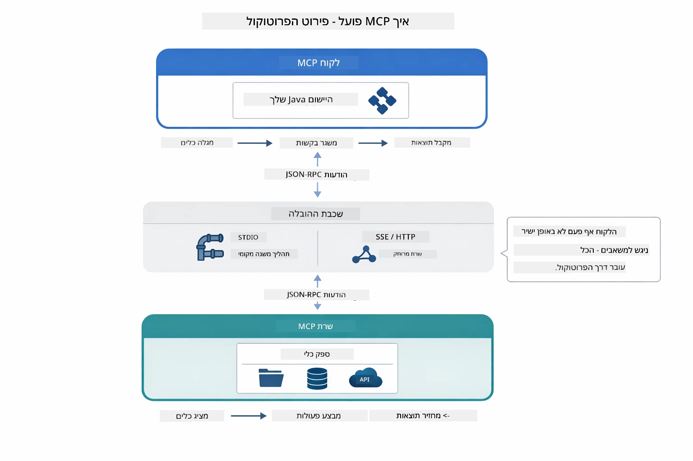

*איך MCP עובד תחת השטח — הלקוחות מגלים כלים, מחליפים הודעות JSON-RPC, ומבצעים פעולות דרך שכבת תעבורה.*

**ארכיטקטורת שרת-לקוח**

MCP משתמש במודל שרת-לקוח. השרתים מספקים כלים - קריאת קבצים, חיפוש במסד נתונים, קריאות API. הלקוחות (אפליקציית הבינה שלכם) מתחברים לשרתים ומשתמשים בכלים שלהם.

כדי להשתמש ב-MCP עם LangChain4j, הוסיפו את התלות הבאה Maven:

```xml
<dependency>
    <groupId>dev.langchain4j</groupId>
    <artifactId>langchain4j-mcp</artifactId>
    <version>${langchain4j.version}</version>
</dependency>
```

**גילוי כלים**

כשלקוח שלכם מתחבר לשרת MCP, הוא שואל "אילו כלים יש לך?" השרת משיב עם רשימת כלים זמינים, כל אחד עם תיאורים וסקימות פרמטרים. סוכן הבינה שלכם יכול אז להחליט אילו כלים להשתמש על בסיס בקשות המשתמש. הדיאגרמה למטה מראה את לחיצת היד — הלקוח שולח בקשת `tools/list` והשרת מחזיר את הכלים הזמינים עם תיאורים וסקימות פרמטרים:

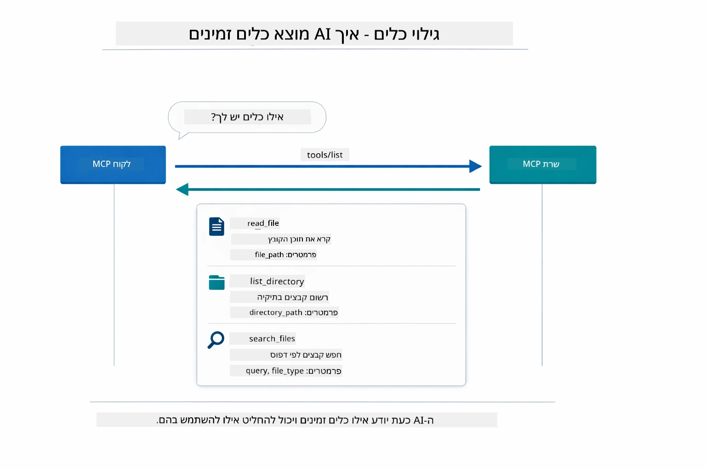

*הבינה מגלה כלים זמינים בזמן ההפעלה — כעת היא יודעת אילו יכולות זמינות ויכולה להחליט אילו מהם להשתמש.*

**מנגנוני תעבורה**

MCP תומך במנגנוני תעבורה שונים. שתי האפשרויות הן Stdio (לתקשורת תת-תהליך מקומית) ו-Streamable HTTP (לשרתים מרוחקים). במודול זה מוצג תעבורת Stdio:


*מנגנוני תעבורה של MCP: HTTP לשרתים מרוחקים, Stdio לתהליכים מקומיים*

**Stdio** - [StdioTransportDemo.java](../../../05-mcp/src/main/java/com/example/langchain4j/mcp/StdioTransportDemo.java)

לתהליכים מקומיים. האפליקציה שלכם מפעילה שרת כתת-תהליך ותקשרת דרכו דרך קלט/פלט סטנדרטי. שימושי לגישה למערכת הקבצים או לכלים שורת פקודה.

```java
McpTransport stdioTransport = new StdioMcpTransport.Builder()
    .command(List.of(
        npmCmd, "exec",
        "@modelcontextprotocol/server-filesystem@2025.12.18",
        resourcesDir
    ))
    .logEvents(false)
    .build();
```


שרת `@modelcontextprotocol/server-filesystem` חושף את הכלים הבאים, כולם מוגבלים לתיקיות שתציינו:

| כלי | תיאור |
|------|-------------|
| `read_file` | קריאת תוכן של קובץ יחיד |
| `read_multiple_files` | קריאת מספר קבצים בשיחה אחת |
| `write_file` | יצירה או החלפה של קובץ |
| `edit_file` | עריכת חיפוש והחלפה ממוקדת |
| `list_directory` | רשימת קבצים ותיקיות בנתיב |
| `search_files` | חיפוש רקורסיבי אחר קבצים התואמים לתבנית |
| `get_file_info` | קבלת מטא-נתוני קובץ (גודל, תאריכים, הרשאות) |
| `create_directory` | יצירת תיקיה (כולל תיקיות אב) |
| `move_file` | העברה או שינוי שם של קובץ או תיקיה |

הדיאגרמה הבאה מציגה כיצד תעבורת Stdio פועלת בזמן ריצה — האפליקציה שלכם מפעילה את שרת MCP כתהליך ילד והם מתקשרים דרך צינורות stdin/stdout, ללא רשת או HTTP:

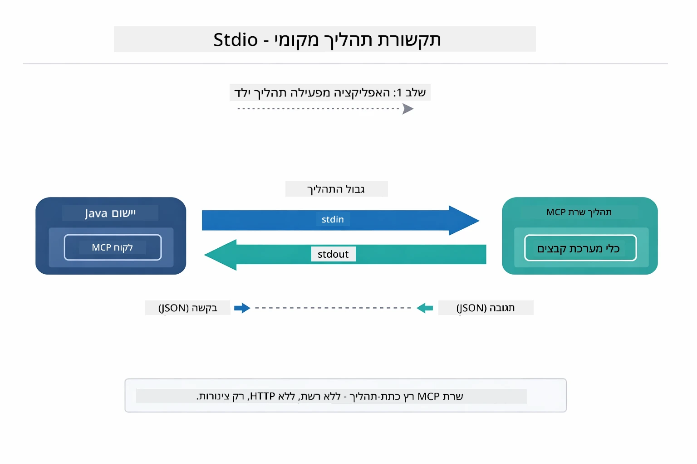

*תעבורת Stdio בפעולה — האפליקציה מפעילה את שרת MCP כתהליך ילד ומתקשרת דרך צינורות stdin/stdout.*

> **🤖 נסו עם [GitHub Copilot](https://github.com/features/copilot) Chat:** פתחו את [`StdioTransportDemo.java`](../../../05-mcp/src/main/java/com/example/langchain4j/mcp/StdioTransportDemo.java) ושאלו:
> - "איך תעבורת Stdio עובדת ומתי כדאי להשתמש בה במקום HTTP?"
> - "איך LangChain4j מנהלת את מחזור החיים של תהליכי שרת MCP מופעלים?"
> - "מהן ההשלכות האבטחתיות של מתן גישה של בינה מלאכותית למערכת הקבצים?"

## מודול סוכניות

בעוד ש-MCP מספק כלים סטנדרטיים, מודול **הסוכניות** של LangChain4j מספק דרך הצהרתית לבנות סוכנים שמאורגנים סביב אלו הכלים. ההערה `@Agent` ו-`AgenticServices` מאפשרים להגדיר התנהגות סוכן דרך ממשקים ולא באמצעות קוד אימפראטיבי.

במודול זה תחקור את דפוס **סוכן מפקח** — גישה מתקדמת בסוכניות בינה מלאכותית שבה סוכן "מפקח" מחליט בצורה דינמית אילו תתי סוכנים להפעיל על פי בקשות המשתמש. נשלב את שני המושגים על ידי מתן יכולות גישה לקבצים מופעלות MCP לאחד מתתי-הסוכנים שלנו.

כדי להשתמש במודול הסוכנויות, הוסיפו את התלות הבאה Maven:

```xml
<dependency>
    <groupId>dev.langchain4j</groupId>
    <artifactId>langchain4j-agentic</artifactId>
    <version>${langchain4j.mcp.version}</version>
</dependency>
```


> **הערה:** מודול `langchain4j-agentic` משתמש בתכונת גרסה נפרדת (`langchain4j.mcp.version`) משום שהוא יוצא בשלב שונה מספריות הליבה של LangChain4j.

> **⚠️ ניסיוני:** מודול `langchain4j-agentic` הוא **ניסיוני** ועשוי להשתנות. הדרך היציבה לבנות עוזרי בינה מלאכותית נותרה `langchain4j-core` עם כלים מותאמים (מודול 04).

## הרצת הדוגמאות

### דרישות מוקדמות

- השלמת [מודול 04 - כלים](../04-tools/README.md) (מודול זה בונה על מושגי כלים מותאמים ומשווה אותם עם כלים של MCP)
- קובץ `.env` בספריית השורש עם אישורי Azure (נוצר על ידי `azd up` במודול 01)
- Java 21+, Maven 3.9+
- Node.js 16+ ו-npm (לשרתי MCP)

> **הערה:** אם עדיין לא הגדירו משתני סביבה, ראו [מודול 01 - מבוא](../01-introduction/README.md) להוראות פריסה (`azd up` יוצר את קובץ `.env` אוטומטית), או העתקו `.env.example` ל-`.env` בספריית השורש ומלאו את הערכים שלכם.

## התחלה מהירה

**בשימוש VS Code:** פשוט לחצו קליק ימני על כל קובץ הדגמה בחלון ה-Explorer ובחרו **"Run Java"**, או השתמשו בהגדרות ההפעלה בלוח Run and Debug (וודאו שקובץ `.env` שלכם מוגדר עם אישורי Azure קודם).

**בשימוש Maven:** לחלופין, תוכלו להריץ מהשורת פקודה לפי הדוגמאות למטה.

### פעולות על קבצים (Stdio)

זה מדגים כלים מבוססי תת-תהליך מקומי.

**✅ אין דרישות מוקדמות** - שרת MCP מופעל אוטומטית.

**בשימוש עם סקריפטים התחלתיים (מומלץ):**

הסקריפטים הטעונים אוטומטית משתני סביבה מקובץ ה-.env בשורש:

**Bash:**
```bash
cd 05-mcp
chmod +x start-stdio.sh
./start-stdio.sh
```

**PowerShell:**
```powershell
cd 05-mcp
.\start-stdio.ps1
```

**בשימוש VS Code:** לחצו קליק ימני על `StdioTransportDemo.java` ובחרו **"Run Java"** (ודאו שקובץ `.env` מוגדר).

האפליקציה מפעילה שרת MCP של מערכת הקבצים אוטומטית וקוראת קובץ מקומי. שימו לב לאופן ניהול תת-ההליך.

**פלט צפוי:**
```
Assistant response: The file provides an overview of LangChain4j, an open-source Java library
for integrating Large Language Models (LLMs) into Java applications...
```


### סוכן מפקח

דפוס **סוכן מפקח** הוא צורת סוכנות **גמישה** בבינה מלאכותית. המפקח משתמש ב-LLM כדי להחליט עצמונית אילו סוכנים להפעיל בהתבסס על בקשת המשתמש. בדוגמה הבאה, נשלב גישה לקבצים עם כלים מופעלים MCP עם סוכן LLM ליצירת זרימת עבודה של קריאת קובץ → הפקת דוח.

בהדגמה, `FileAgent` קורא קובץ באמצעות כלים של מערכת הקבצים ב-MCP, ו-`ReportAgent` מייצר דוח מובנה עם סיכום מנהלי (משפט אחד), 3 נקודות מפתח, וגם המלצות. המפקח מארגן את הזרימה הזו באופן אוטומטי:

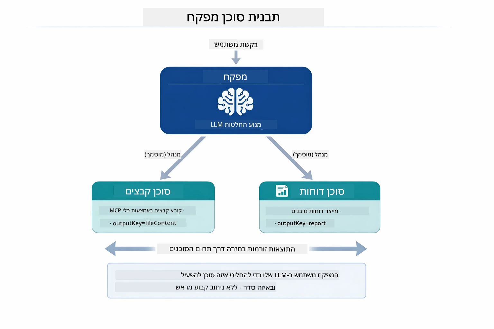

*המפקח משתמש ב-LLM שלו כדי להחליט אילו סוכנים להפעיל ובאיזה סדר — אין צורך בניתוב מקודד.*

הנה כיצד הזרימה הקונקרטית נראית עבור צינור קובץ לדוח שלנו:

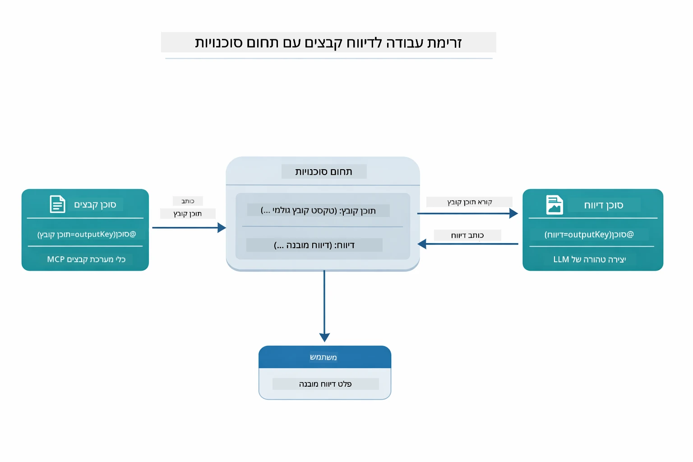

*FileAgent קורא את הקובץ דרך כלים במ MCP, לאחר מכן ReportAgent ממיר את התוכן הגולמי לדוח מובנה.*

דיאגרמת רצף הבאה מתארת את האורקסטרציה המלאה של המפקח — מהפעלת שרת MCP, דרך בחירת סוכנים אוטונומית של המפקח, לקריאות כלים דרך stdio והדוח הסופי:

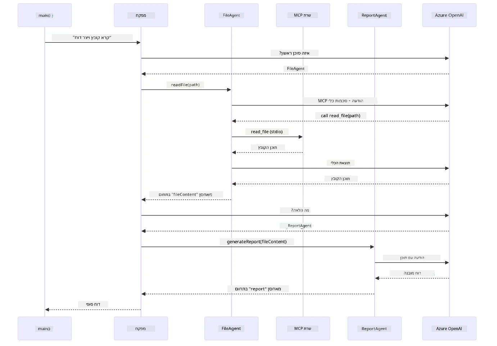

*המפקח מפעיל באופן עצמאי את FileAgent (שקורא את השרת MCP דרך stdio כדי לקרוא את הקובץ), ואז מפעיל את ReportAgent ליצירת דוח מובנה — כל סוכן שומר את הפלט שלו בזיכרון Agentic Scope משותף.*

כל סוכן שומר את הפלט שלו ב-**Agentic Scope** (זיכרון משותף), המאפשר לסוכנים הבאים לגשת לתוצאות הקודמות. זה מדגים כיצד כלים של MCP משתלבים באופן חלק בזרימות עבודה סוכניות — המפקח לא צריך לדעת *איך* הקבצים נקראים, רק ש-`FileAgent` יכול לעשות זאת.

#### הרצת ההדגמה

הסקריפטים הטעונים אוטומטית משתני סביבה מקובץ ה-.env בשורש:

**Bash:**
```bash
cd 05-mcp
chmod +x start-supervisor.sh
./start-supervisor.sh
```

**PowerShell:**
```powershell
cd 05-mcp
.\start-supervisor.ps1
```

**בשימוש VS Code:** לחצו קליק ימני על `SupervisorAgentDemo.java` ובחרו **"Run Java"** (וודאו שקובץ `.env` מוגדר).

#### איך המפקח עובד

לפני בניית סוכנים, יש לחבר את תעבורת MCP ללקוח ולעטוף אותו כ-`ToolProvider`. כך כלים של שרת MCP הופכים לזמינים לסוכנים שלכם:

```java
// צור לקוח MCP מהתחבורה
McpClient mcpClient = new DefaultMcpClient.Builder()
        .transport(stdioTransport)
        .build();

// עטוף את הלקוח כספק כלי — זה מחבר כלי MCP ל-LangChain4j
ToolProvider mcpToolProvider = McpToolProvider.builder()
        .mcpClients(List.of(mcpClient))
        .build();
```


כעת תוכלו להזריק `mcpToolProvider` לכל סוכן שצריך כלים של MCP:

```java
// שלב 1: FileAgent קורא קבצים באמצעות כלי MCP
FileAgent fileAgent = AgenticServices.agentBuilder(FileAgent.class)
        .chatModel(model)
        .toolProvider(mcpToolProvider)  // כולל כלי MCP לפעולות קבצים
        .build();

// שלב 2: ReportAgent מייצר דוחות מובנים
ReportAgent reportAgent = AgenticServices.agentBuilder(ReportAgent.class)
        .chatModel(model)
        .build();

// המפקח מארגן את זרימת העבודה מקובץ לדוח
SupervisorAgent supervisor = AgenticServices.supervisorBuilder()
        .chatModel(model)
        .subAgents(fileAgent, reportAgent)
        .responseStrategy(SupervisorResponseStrategy.LAST)  // מחזיר את הדוח הסופי
        .build();

// המפקח מחליט אילו סוכנים להפעיל בהתאם לבקשה
String response = supervisor.invoke("Read the file at /path/file.txt and generate a report");
```


#### איך FileAgent מוצא כלים של MCP בזמן ריצה

ייתכן ותתהו: **איך `FileAgent` יודע להשתמש בכלי מערכת הקבצים של npm?** התשובה היא שהוא לא — ה-**LLM** מפענח זאת בזמן ריצה באמצעות סקימות הכלים.

ממשק `FileAgent` הוא פשוט **הגדרת פרומפט**. אין לו ידע מקודד מראש על `read_file`, `list_directory` או כל כלי MCP אחר. להלן מה שקורה מקצה לקצה:
1. **שרת יוצר תהליכים:** `StdioMcpTransport` משיק את חבילת ה-npm `@modelcontextprotocol/server-filesystem` כתהליך בן
2. **גילוי כלי:** ה-`McpClient` שולח בקשת JSON-RPC בשם `tools/list` לשרת, שמחזיר שמות כלים, תיאורים, ותבניות פרמטרים (למשל, `read_file` — *"קרא את תוכן הקובץ בשלמותו"* — `{ path: string }`)
3. **הזרקת תבניות:** `McpToolProvider` עוטף את תבניות הכלים שזוהו ומשמש אותן ל-LangChain4j
4. **החלטת ה-LLM:** כשקוראים ל-`FileAgent.readFile(path)`, LangChain4j שולח את הודעת המערכת, הודעת המשתמש, **ורשימת תבניות הכלים** אל ה-LLM. ה-LLM קורא את תיאורי הכלים ומייצר קריאת כלי (למשל, `read_file(path="/some/file.txt")`)
5. **הרצה:** LangChain4j קולט את קריאת הכלי, מנתב אותה דרך לקוח MCP חזרה לתת התהליך של Node.js, מקבל את התוצאה ומעביר אותה ל-LLM

זוהי אותה מנגנון [גילוי כלים](../../../05-mcp) שתואר למעלה, אך מיושם באופן ספציפי במסגרת זרימת העבודה של הסוכן. ההערות `@SystemMessage` ו-`@UserMessage` מדריכות את התנהגות ה-LLM, בעוד ש-`ToolProvider` המוזרק נותן לו את ה**יכולות** — ה-LLM משלב בין השניים בזמן הריצה.

> **🤖 נסה עם הצ׳אט של [GitHub Copilot](https://github.com/features/copilot):** פתח את [`FileAgent.java`](../../../05-mcp/src/main/java/com/example/langchain4j/mcp/agents/FileAgent.java) ושאל:
> - "איך הסוכן הזה יודע איזה כלי MCP לקרוא?"
> - "מה יקרה אם אני אוסר את ה-ToolProvider מבונה הסוכן?"
> - "איך תבניות הכלים מועברות ל-LLM?"

#### אסטרטגיות תגובה

כאשר מגדירים `SupervisorAgent`, מגדירים כיצד עליו לנסח את התשובה הסופית למשתמש לאחר שהסוכנים המשניים סיימו את משימותיהם. התרשים למטה מציג את שלוש האסטרטגיות הזמינות — LAST מחזיר את הפלט הסופי של הסוכן האחרון ישירות, SUMMARY מסנתז את כל הפלטים דרך LLM, ו-SCORED בוחר את זה עם הדירוג הגבוה יותר בהתייחס לבקשה המקורית:

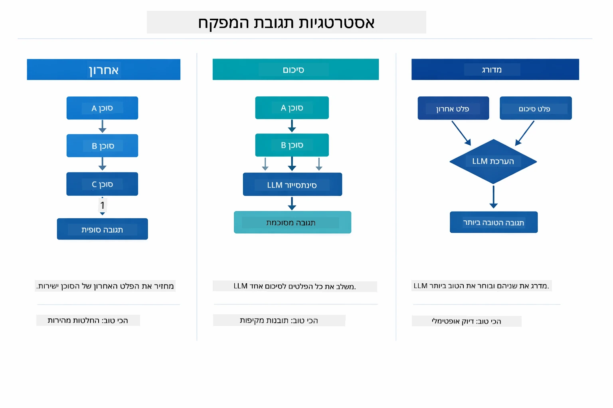

*שלוש אסטרטגיות לאופן שבו המפקח מנסח את התגובה הסופית — בחר לפי אם אתה רוצה את פלט הסוכן האחרון, סיכום מסונתז, או האופציה המדורגת ביותר.*

האסטרטגיות הזמינות הן:

| אסטרטגיה | תיאור |
|----------|-------|
| **LAST** | המפקח מחזיר את הפלט של הסוכן או הכלי האחרון שהופעל. זה שימושי כאשר הסוכן הסופי בזרימת העבודה מתוכנן במיוחד להפיק את התשובה הסופית והשלמה (למשל, "סוכן סיכום" בצינור מחקר). |
| **SUMMARY** | המפקח משתמש ב-LLM הפנימי שלו כדי לסנתז סיכום של כל האינטראקציה וכל הפלטים של הסוכנים המשניים, ואז מחזיר סיכום זה כתשובה הסופית. זה מספק תשובה מאוחדת ונקייה למשתמש. |
| **SCORED** | המערכת משתמשת ב-LLM פנימי כדי לדרג הן את תגובת ה-LAST והן את הסיכום (SUMMARY) של האינטראקציה מול הבקשה המקורית, ומחזירה את הפלט שקיבל את הדירוג הגבוה ביותר. |

עיין ב-[SupervisorAgentDemo.java](../../../05-mcp/src/main/java/com/example/langchain4j/mcp/SupervisorAgentDemo.java) למימוש המלא.

> **🤖 נסה עם הצ׳אט של [GitHub Copilot](https://github.com/features/copilot):** פתח את [`SupervisorAgentDemo.java`](../../../05-mcp/src/main/java/com/example/langchain4j/mcp/SupervisorAgentDemo.java) ושאל:
> - "איך המפקח מחליט איזה סוכנים להפעיל?"
> - "מה ההבדל בין המפקח לבין תבניות זרימת עבודה רצופות?"
> - "איך ניתן להתאים אישית את התכנון של המפקח?"

#### הבנת הפלט

כאשר תריץ את ההדגמה, תראה מדריך מובנה כיצד המפקח מארגן כמה סוכנים. הנה מה שכל חלק משמעותי:

```
======================================================================
  FILE → REPORT WORKFLOW DEMO
======================================================================

This demo shows a clear 2-step workflow: read a file, then generate a report.
The Supervisor orchestrates the agents automatically based on the request.
```
  
**כותרת** מציגה את רעיון זרימת העבודה: צינור ממוקד מקריאת קבצים להפקת דוחות.

```
--- WORKFLOW ---------------------------------------------------------
  ┌─────────────┐      ┌──────────────┐
  │  FileAgent  │ ───▶ │ ReportAgent  │
  │ (MCP tools) │      │  (pure LLM)  │
  └─────────────┘      └──────────────┘
   outputKey:           outputKey:
   'fileContent'        'report'

--- AVAILABLE AGENTS -------------------------------------------------
  [FILE]   FileAgent   - Reads files via MCP → stores in 'fileContent'
  [REPORT] ReportAgent - Generates structured report → stores in 'report'
```
  
**תרשים זרימת עבודה** מציג את זרימת המידע בין הסוכנים. לכל סוכן תפקיד ספציפי:
- **FileAgent** קורא קבצים באמצעות כלי MCP ושומר את התוכן הגולמי במשתנה `fileContent`
- **ReportAgent** צורך את התוכן הזה ומפיק דוח מובנה במשתנה `report`

```
--- USER REQUEST -----------------------------------------------------
  "Read the file at .../file.txt and generate a report on its contents"
```
  
**בקשת המשתמש** מציגה את המשימה. המפקח מפרש זאת ומחליט להפעיל FileAgent → ReportAgent.

```
--- SUPERVISOR ORCHESTRATION -----------------------------------------
  The Supervisor decides which agents to invoke and passes data between them...

  +-- STEP 1: Supervisor chose -> FileAgent (reading file via MCP)
  |
  |   Input: .../file.txt
  |
  |   Result: LangChain4j is an open-source, provider-agnostic Java framework for building LLM...
  +-- [OK] FileAgent (reading file via MCP) completed

  +-- STEP 2: Supervisor chose -> ReportAgent (generating structured report)
  |
  |   Input: LangChain4j is an open-source, provider-agnostic Java framew...
  |
  |   Result: Executive Summary...
  +-- [OK] ReportAgent (generating structured report) completed
```
  
**תזמור המפקח** מציג את זרימת הפעולות בשני שלבים:
1. **FileAgent** קורא את הקובץ דרך MCP ושומר את התוכן
2. **ReportAgent** מקבל את התוכן ומפיק דוח מבנה

המפקח קיבל החלטות אלו **באופן עצמאי** על פי בקשת המשתמש.

```
--- FINAL RESPONSE ---------------------------------------------------
Executive Summary
...

Key Points
...

Recommendations
...

--- AGENTIC SCOPE (Data Flow) ----------------------------------------
  Each agent stores its output for downstream agents to consume:
  * fileContent: LangChain4j is an open-source, provider-agnostic Java framework...
  * report: Executive Summary...
```
  
#### הסבר על תכונות מודול Agentic

הדוגמה מדגימה כמה תכונות מתקדמות של מודול Agentic. נעמיק ב-Agentic Scope ו-Agent Listeners.

**Agentic Scope** מציג את הזיכרון המשותף שבו הסוכנים שמרו את תוצאותיהם באמצעות `@Agent(outputKey="...")`. זה מאפשר:
- לסוכנים מאוחרים לקרוא את פלטי הסוכנים הקודמים
- למפקח לסנתז תגובה סופית
- לך לבדוק מה כל סוכן הפיק

התרשים למטה מציג כיצד Agentic Scope פועל כזיכרון משותף בזרימת העבודה קובץ-לדוח — FileAgent כותב את הפלט תחת המפתח `fileContent`, ReportAgent קורא אותו וכותב את הפלט שלו תחת `report`:

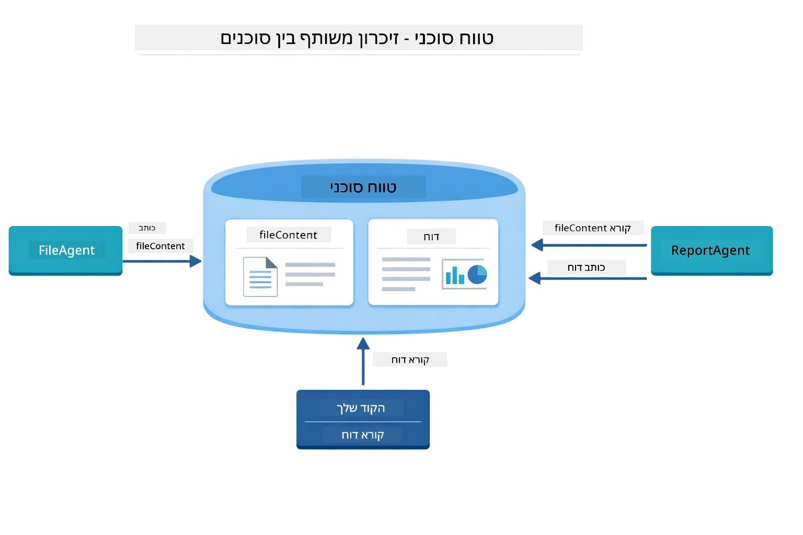

*Agentic Scope פועל כזיכרון משותף — FileAgent כותב `fileContent`, ReportAgent קורא אותו וכותב `report`, והקוד שלך קורא את התוצאה הסופית.*

```java
ResultWithAgenticScope<String> result = supervisor.invokeWithAgenticScope(request);
AgenticScope scope = result.agenticScope();
String fileContent = scope.readState("fileContent");  // נתוני קובץ גלם מ-FileAgent
String report = scope.readState("report");            // דוח מובנה מ-ReportAgent
```
  
**Agent Listeners** מאפשרים מעקב ואבחון הפעלת סוכנים. הפלט שלב-אחר-שלב שאתה רואה בהדגמה מגיע מ-AgentListener שמתחבר לכל קריאת סוכן:
- **beforeAgentInvocation** - נקרא כשמפקח בוחר סוכן, ומאפשר לך לראות איזה סוכן נבחר ולמה
- **afterAgentInvocation** - נקרא כשסוכן מסיים, ומציג את התוצאה שלו
- **inheritedBySubagents** - כשפעיל, מאזין לכל הסוכנים בהיררכיה

התרשים הבא מציג את כל מחזור החיים של Agent Listener, כולל כיצד `onError` מטפל בכשלים במהלך ריצת הסוכן:

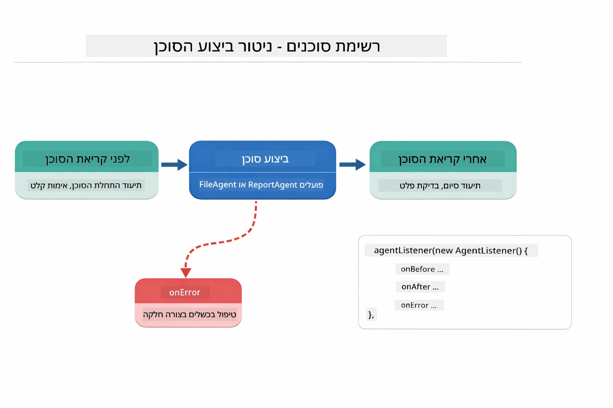

*Agent Listeners מתחברים למחזור חיי ההרצה — מנטרים מתי סוכנים מתחילים, מסיימים, או חווים שגיאות.*

```java
AgentListener monitor = new AgentListener() {
    private int step = 0;
    
    @Override
    public void beforeAgentInvocation(AgentRequest request) {
        step++;
        System.out.println("  +-- STEP " + step + ": " + request.agentName());
    }
    
    @Override
    public void afterAgentInvocation(AgentResponse response) {
        System.out.println("  +-- [OK] " + response.agentName() + " completed");
    }
    
    @Override
    public boolean inheritedBySubagents() {
        return true; // להפיץ לכל תתי-הסוכנים
    }
};
```
  
מעבר לדפוס המפקח, מודול `langchain4j-agentic` מספק כמה תבניות זרימת עבודה חזקות. התרשים למטה מראה את כולן — מצינורות פשוטות ברצף ועד לאישורי עבודה עם מעורבות אדם:

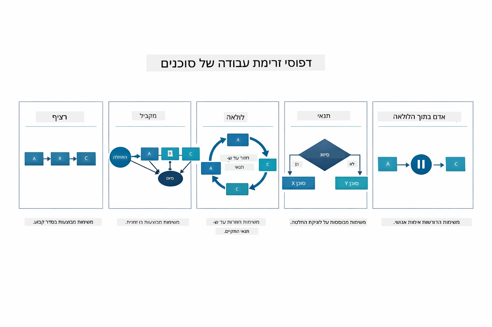

*חמש תבניות זרימת עבודה לארגון סוכנים — מצינורות פשוטות לברצף ועד אישורי עבודה עם מעורבות אדם.*

| תבנית | תיאור | מקרה שימוש |
|---------|-------------|----------|
| **Sequential** | הפעל סוכנים בסדר, הפלט זורם לסוכן הבא | צינורות: מחקר → ניתוח → דוח |
| **Parallel** | הרץ סוכנים במקביל | מטלות עצמאיות: מזג אוויר + חדשות + מניות |
| **Loop** | חזור עד שהתקיים תנאי | דירוג איכות: שפר עד שציון ≥ 0.8 |
| **Conditional** | נהל מסלול לפי תנאים | סיווג → נועד לסוכן מומחה |
| **Human-in-the-Loop** | הוסף נקודות בדיקה אנושיות | תהליכי אישור, סקירת תוכן |

## מושגים מרכזיים

כעת, לאחר שחקרת את MCP ואת מודול Agentic בפועל, נסכם מתי להשתמש בכל גישה.

אחת היתרונות הגדולים של MCP היא האקוסיסטם המתרחב שלה. התרשים למטה מראה כיצד פרוטוקול אוניברסלי יחיד מחבר את אפליקציית ה-AI שלך למגוון שרתי MCP — מגישה למערכת קבצים ומסד נתונים ועד GitHub, דואר אלקטרוני, סריקת רשת ועוד:

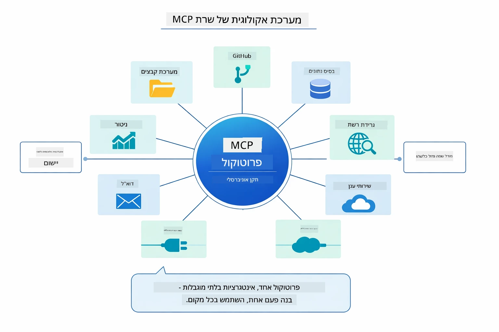

*MCP יוצר אקוסיסטם של פרוטוקול אוניברסלי — כל שרת תואם MCP עובד עם כל לקוח תואם MCP, מה שמאפשר שיתוף כלים בין אפליקציות.*

**MCP** אידיאלי כאשר אתה רוצה לנצל אקוסיסטמים קיימים של כלים, לבנות כלים שמספר אפליקציות יכולות לשתף, לשלב שירותי צד שלישי עם פרוטוקולים סטנדרטיים, או להחליף מימושי כלים בלי לשנות קוד.

**מודול Agentic** עובד הכי טוב כשאתה רוצה הגדרות סוכנים דקלרטיביות עם הערות `@Agent`, צריך תזמור זרימת עבודה (רציף, לולאה, במקביל), מעדיף עיצוב סוכן מבוסס ממשק על פני קוד אימפרטיבי, או משלב כמה סוכנים שמשתפים פלטים דרך `outputKey`.

**דפוס סוכן מפקח** זוהר כשזרימת העבודה אינה צפויה מראש ואתה רוצה שה-LLM יחליט, כשיש לך כמה סוכנים מתמחים שדורשים תזמור דינמי, כשאתה בונה מערכות שיחה שמנתבות ליכולות שונות, או כשאתה רוצה את ההתנהגות הגמישה והמתאימה ביותר לסוכן.

כדי לסייע לך לבחור בין שיטות `@Tool` מותאמות אישית מהמודול 04 לבין כלי MCP מהמודול הזה, ההשוואה הבאה מדגישה את ההבדלים המרכזיים — כלים מותאמים אישית נותנים לך חיבור הדוק ובטיחות טיפוס מלאה עבור לוגיקה ספציפית לאפליקציה, בעוד שכלי MCP מציעים אינטגרציות סטנדרטיות ורב-פעמיות:

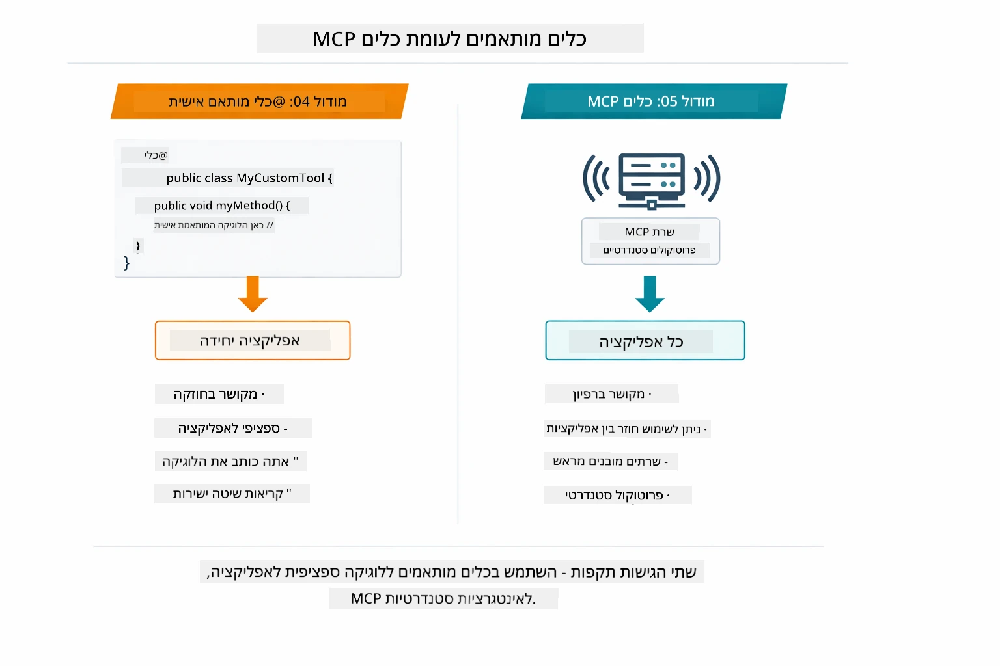

*מתי להשתמש בשיטות @Tool מותאמות מול כלי MCP — כלים מותאמים ללוגיקה ספציפית עם בטיחות טיפוס מלא, כלי MCP לאינטגרציות סטנדרטיות שעובדות בין אפליקציות.*

## מזל טוב!

השלמת את כל חמישה המודולים של קורס LangChain4j למתחילים! הנה מבט על מסלול הלמידה השלם שהשלמת — מצ׳אט בסיסי ועד מערכות Agentic מונעות MCP:

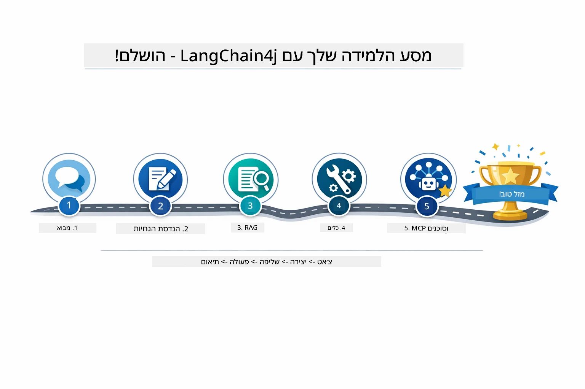

*מסלול הלמידה שלך דרך כל חמישה המודולים — מצ׳אט בסיסי למערכות Agentic מונעות MCP.*

השלמת את קורס LangChain4j למתחילים. הצלחת ללמוד:

- איך לבנות AI שיחתי עם זיכרון (מודול 01)
- דפוסי הנדסת הנחיות למשימות שונות (מודול 02)
- עיגון תגובות במסמכים שלך עם RAG (מודול 03)
- יצירת סוכני AI בסיסיים (עוזרים) עם כלים מותאמים אישית (מודול 04)
- שילוב כלים סטנדרטיים עם מודולי LangChain4j MCP ו-Agentic (מודול 05)

### מה הלאה?

אחרי שהשלמת את המודולים, חקור את [מדריך הבדיקות](../docs/TESTING.md) כדי לראות קונספטים של בדיקות LangChain4j בפועל.

**משאבים רשמיים:**  
- [תיעוד LangChain4j](https://docs.langchain4j.dev/) - מדריכים מקיפים ו-reference ל-API  
- [GitHub של LangChain4j](https://github.com/langchain4j/langchain4j) - קוד מקור ודוגמאות  
- [מדריכי LangChain4j](https://docs.langchain4j.dev/tutorials/) - מדריכים צעד-אחר-צעד למגוון מקרים

תודה שהשלמת את הקורס!

---

**ניווט:** [← קודם: מודול 04 - כלים](../04-tools/README.md) | [חזרה לעיקרי](../README.md)

---

<!-- CO-OP TRANSLATOR DISCLAIMER START -->
**כתב ויתור**:  
מסמך זה תורגם באמצעות שירות תרגום מבוסס בינה מלאכותית [Co-op Translator](https://github.com/Azure/co-op-translator). למרות שאנו שואפים לדיוק, יש להיות מודעים לכך שתרגומים אוטומטיים עשויים להכיל שגיאות או אי דיוקים. המסמך המקורי בשפת המקור שלו מהווה את המקור הסמכותי. למידע קריטי מומלץ להיעזר בתרגום מקצועי של בני אדם. איננו אחראים לכל אי הבנה או פרשנות שגויה הנובעת משימוש בתרגום זה.
<!-- CO-OP TRANSLATOR DISCLAIMER END -->