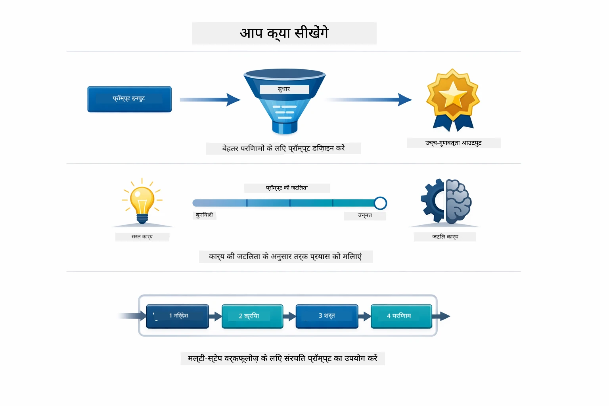
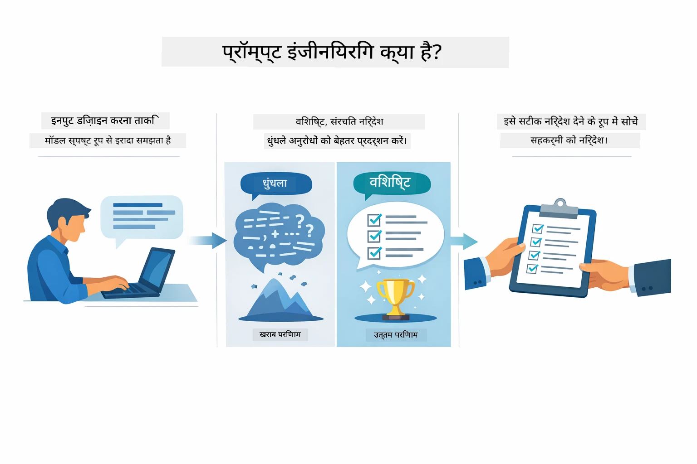
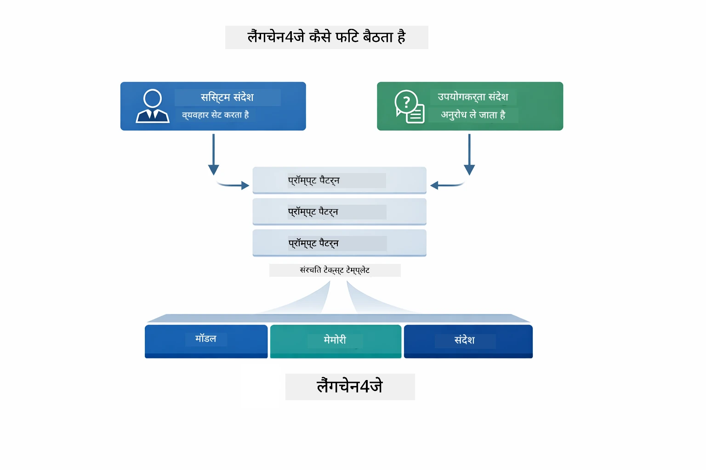
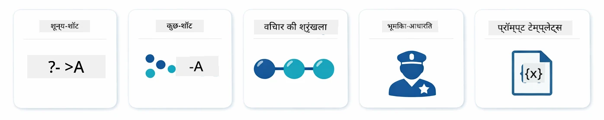
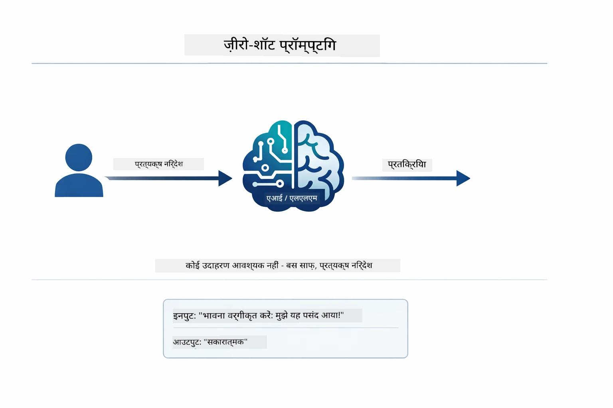
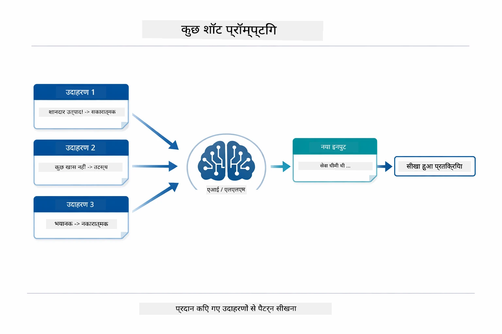
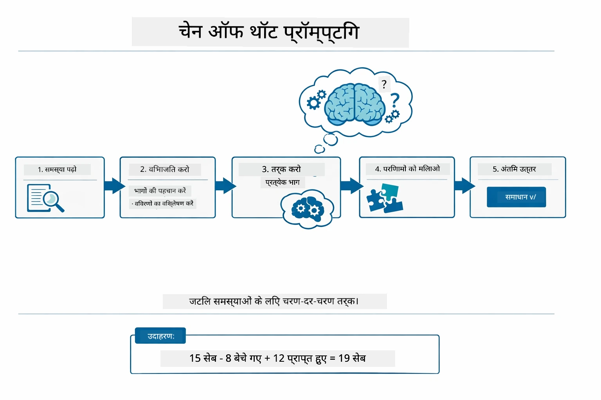
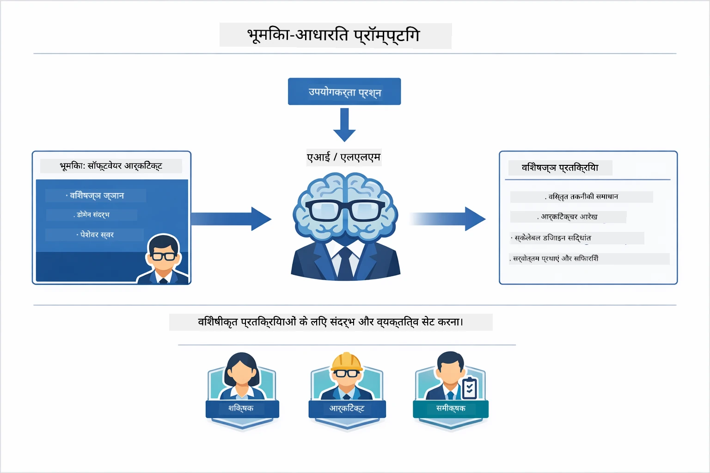
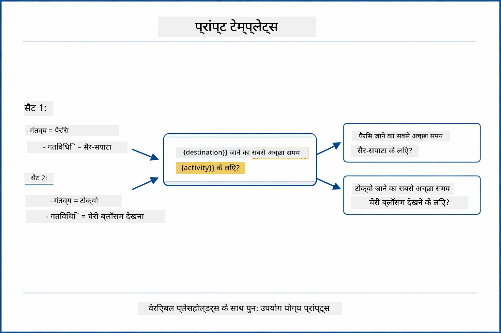
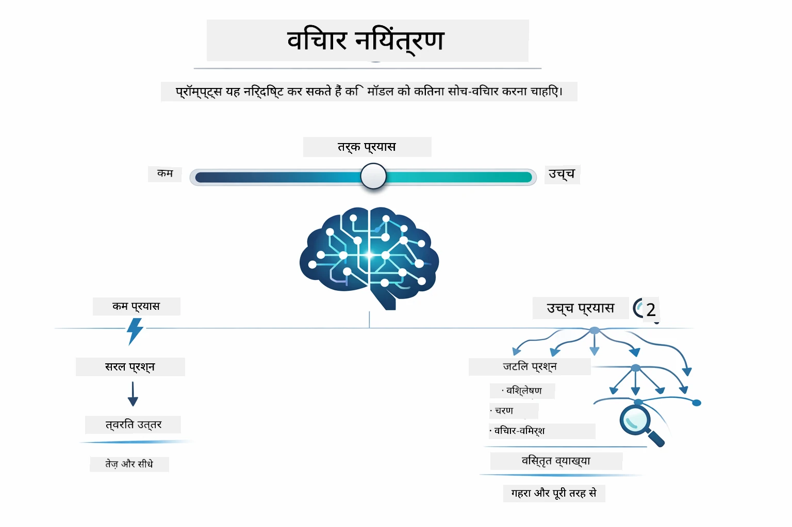

# मोड्यूल 02: GPT-5.2 के साथ प्रॉम्प्ट इंजीनियरिंग

## विषय सूची

- [आप क्या सीखेंगे](../../../02-prompt-engineering)
- [पूर्वापेक्षाएँ](../../../02-prompt-engineering)
- [प्रॉम्प्ट इंजीनियरिंग को समझना](../../../02-prompt-engineering)
- [प्रॉम्प्ट इंजीनियरिंग के मूल सिद्धांत](../../../02-prompt-engineering)
  - [ज़ीरो-शॉट प्रॉम्प्टिंग](../../../02-prompt-engineering)
  - [फ़्यू-शॉट प्रॉम्प्टिंग](../../../02-prompt-engineering)
  - [चेन ऑफ़ थॉट](../../../02-prompt-engineering)
  - [रोल-आधारित प्रॉम्प्टिंग](../../../02-prompt-engineering)
  - [प्रॉम्प्ट टेम्प्लेट्स](../../../02-prompt-engineering)
- [एडवांस्ड पैटर्न](../../../02-prompt-engineering)
- [मौजूदा Azure संसाधनों का उपयोग](../../../02-prompt-engineering)
- [एप्लिकेशन स्क्रीनशॉट](../../../02-prompt-engineering)
- [पैटर्न का अन्वेषण](../../../02-prompt-engineering)
  - [कम बनाम अधिक उत्साह](../../../02-prompt-engineering)
  - [टास्क निष्पादन (टूल प्रीअंबल्स)](../../../02-prompt-engineering)
  - [स्वयं-प्रतिबिंबित कोड](../../../02-prompt-engineering)
  - [संरचित विश्लेषण](../../../02-prompt-engineering)
  - [मल्टी-टर्न चैट](../../../02-prompt-engineering)
  - [चरण-दर-चरण तर्क](../../../02-prompt-engineering)
  - [सीमित आउटपुट](../../../02-prompt-engineering)
- [आप वास्तव में क्या सीख रहे हैं](../../../02-prompt-engineering)
- [अगले कदम](../../../02-prompt-engineering)

## आप क्या सीखेंगे



पिछले मोड्यूल में, आपने देखा कि मेमोरी कैसे संवादात्मक AI को सक्षम बनाती है और GitHub Models का उपयोग करके बुनियादी इंटरैक्शन किए। अब हम इस बात पर ध्यान केंद्रित करेंगे कि आप कैसे प्रश्न पूछते हैं — यानी प्रॉम्प्ट्स का स्वयं — Azure OpenAI के GPT-5.2 का उपयोग करते हुए। आप अपने प्रॉम्प्ट्स को जिस प्रकार संरचित करते हैं उससे मिलने वाले उत्तरों की गुणवत्ता पर बड़ा प्रभाव पड़ता है। हम मूलभूत प्रॉम्प्टिंग तकनीकों की पुनरावृत्ति से शुरू करेंगे, फिर GPT-5.2 की पूर्ण क्षमताओं का लाभ उठाने वाले आठ उन्नत पैटर्न पर जाएंगे।

हम GPT-5.2 का उपयोग करेंगे क्योंकि यह तर्क नियंत्रण (reasoning control) पेश करता है - आप मॉडल को बता सकते हैं कि उत्तर देने से पहले कितना सोच-विचार करना है। इससे विभिन्न प्रॉम्प्टिंग रणनीतियां और स्पष्ट हो जाती हैं और आपको यह समझने में मदद मिलती है कि कब कौन-सा तरीका उपयोग करना है। साथ ही, GPT-5.2 के लिए Azure की कम रेट लिमिट GitHub Models की तुलना में सुविधाजनक है।

## पूर्वापेक्षाएँ

- मोड्यूल 01 पूरा किया हुआ (Azure OpenAI संसाधन तैनात)
- रूट डायरेक्टरी में `.env` फ़ाइल Azure प्रमाण पत्रों के साथ (मॉड्यूल 01 में `azd up` द्वारा बनाई गई)

> **नोट:** यदि आपने मोड्यूल 01 पूरा नहीं किया है, तो पहले वहां दिए गए तैनाती निर्देशों का पालन करें।

## प्रॉम्प्ट इंजीनियरिंग को समझना



प्रॉम्प्ट इंजीनियरिंग उस इनपुट टेक्स्ट को डिज़ाइन करने के बारे में है जो लगातार आपको वह परिणाम देता है जिसकी आपको ज़रूरत है। यह केवल प्रश्न पूछने के बारे में नहीं है - यह ऐसे अनुरोधों की संरचना करने के बारे में है जिससे मॉडल ठीक समझ सके कि आप क्या चाहते हैं और उसे कैसे प्रदान करना है।

इसे ऐसे समझिए जैसे आप किसी सहकर्मी को निर्देश दे रहे हों। "बग ठीक करो" अस्पष्ट है। "UserService.java की लाइन 45 में नल चेक जोड़कर नल पॉइंटर एक्सेप्शन ठीक करो" विशिष्ट है। भाषा मॉडल भी इसी तरह काम करते हैं - विशिष्टता और संरचना मायने रखती है।



LangChain4j अवसंरचना प्रदान करता है — मॉडल कनेक्शन, मेमोरी, और संदेश प्रकार — जबकि प्रॉम्प्ट पैटर्न केवल वह सावधानीपूर्वक संरचित टेक्स्ट है जिसे आप उस अवसंरचना के माध्यम से भेजते हैं। महत्वपूर्ण निर्माण खंड हैं `SystemMessage` (जो AI के व्यवहार और भूमिका को सेट करता है) और `UserMessage` (जो आपका वास्तविक अनुरोध लेकर आता है)।

## प्रॉम्प्ट इंजीनियरिंग के मूल सिद्धांत



इस मोड्यूल के उन्नत पैटर्न में जाने से पहले, आइए पांच बुनियादी प्रॉम्प्टिंग तकनीकों की समीक्षा करें। ये वे निर्माण खंड हैं जिन्हें हर प्रॉम्प्ट इंजीनियर को जानना चाहिए। यदि आपने पहले ही [क्विक स्टार्ट मोड्यूल](../00-quick-start/README.md#2-prompt-patterns) पूरा कर लिया है, तो आपने इन्हें क्रियान्वित होते देखा होगा — यहाँ इनके पीछे का सिद्धांतात्मक ढांचा है।

### ज़ीरो-शॉट प्रॉम्प्टिंग

सबसे सरल तरीका: मॉडल को सीधे निर्देश दें बिना कोई उदाहरण दिए। मॉडल पूरी तरह से अपने प्रशिक्षण पर निर्भर करता है ताकि कार्य को समझ सके और पूरा कर सके। यह सीधे, साफ़-सुथरे अनुरोधों के लिए अच्छा काम करता है जहाँ अपेक्षित व्यवहार स्पष्ट होता है।



*कोई उदाहरण न देकर सीधे निर्देश — मॉडल सिर्फ निर्देश से कार्य का अनुमान लगाता है*

```java
String prompt = "Classify this sentiment: 'I absolutely loved the movie!'";
String response = model.chat(prompt);
// प्रतिक्रिया: "सकारात्मक"
```

**कब उपयोग करें:** सरल वर्गीकरण, सीधे प्रश्न, अनुवाद, या कोई भी कार्य जिसे मॉडल बिना अतिरिक्त मार्गदर्शन के संभाल सकता है।

### फ़्यू-शॉट प्रॉम्प्टिंग

ऐसे उदाहरण दें जो मॉडल को उस पैटर्न को समझाएं जिसे आपको अपनाना है। मॉडल आपके उदाहरणों से अपेक्षित इनपुट-आउटपुट प्रारूप सीखता है और उसे नए इनपुट पर लागू करता है। इससे उन कार्यों के लिए स्थिरता में काफी सुधार होता है जहां वांछित प्रारूप या व्यवहार स्पष्ट नहीं होता।



*उदाहरणों से सीखना — मॉडल पैटर्न को पहचानता है और नए इनपुट पर लागू करता है*

```java
String prompt = """
    Classify the sentiment as positive, negative, or neutral.
    
    Examples:
    Text: "This product exceeded my expectations!" → Positive
    Text: "It's okay, nothing special." → Neutral
    Text: "Waste of money, very disappointed." → Negative
    
    Now classify this:
    Text: "Best purchase I've made all year!"
    """;
String response = model.chat(prompt);
```

**कब उपयोग करें:** कस्टम वर्गीकरण, सुसंगत स्वरूपण, डोमेन-विशिष्ट कार्य, या जब ज़ीरो-शॉट परिणाम असंगत हों।

### चेन ऑफ़ थॉट

मॉडल से चरण-दर-चरण अपने तर्क बताने के लिए कहें। तुरंत उत्तर देने के बजाय, मॉडल समस्या को टुकड़ों में तोड़ता है और प्रत्येक भाग पर स्पष्ट रूप से काम करता है। इससे गणित, तर्कशक्ति और बहु-चरण तर्क कार्यों की सटीकता बढ़ती है।



*चरण-दर-चरण तर्क — जटिल समस्याओं को स्पष्ट तार्किक चरणों में तोड़ना*

```java
String prompt = """
    Problem: A store has 15 apples. They sell 8 apples and then 
    receive a shipment of 12 more apples. How many apples do they have now?
    
    Let's solve this step-by-step:
    """;
String response = model.chat(prompt);
// मॉडल दिखाता है: 15 - 8 = 7, फिर 7 + 12 = 19 सेब
```

**कब उपयोग करें:** गणित की समस्याएं, तर्क पहेलियां, डिबगिंग, या कोई भी कार्य जहाँ तर्क प्रक्रिया दिखाने से सटीकता और विश्वास बढ़ता है।

### रोल-आधारित प्रॉम्प्टिंग

अपने प्रश्न पूछने से पहले AI के लिए एक व्यक्तित्व या भूमिका निर्धारित करें। यह संदर्भ प्रदान करता है जो उत्तर के स्वर, गहराई, और फोकस को आकार देता है। "सॉफ्टवेयर आर्किटेक्ट" "जूनियर डेवलपर" या "सिक्योरिटी ऑडिटर" से अलग सलाह देता है।



*संदर्भ और व्यक्तित्व सेट करना — समान प्रश्न को अलग-अलग भूमिकाओं में अलग जवाब मिलता है*

```java
String prompt = """
    You are an experienced software architect reviewing code.
    Provide a brief code review for this function:
    
    def calculate_total(items):
        total = 0
        for item in items:
            total = total + item['price']
        return total
    """;
String response = model.chat(prompt);
```

**कब उपयोग करें:** कोड समीक्षा, ट्यूटोरियल, डोमेन-विशिष्ट विश्लेषण, या जब आपको किसी विशेष विशेषज्ञता स्तर या दृष्टिकोण के अनुसार उत्तर चाहिए।

### प्रॉम्प्ट टेम्प्लेट्स

चरों (variables) के प्लेसहोल्डर के साथ पुन: प्रयोज्य प्रॉम्प्ट बनाएं। हर बार नया प्रॉम्प्ट लिखने के बजाय, एक बार टेम्प्लेट परिभाषित करें और अलग-अलग मान भरें। LangChain4j का `PromptTemplate` क्लास इसे `{{variable}}` सिंटैक्स के साथ आसान बनाता है।



*प्लेसहोल्डर के साथ पुन: इस्तेमाल योग्य प्रॉम्प्ट्स — एक टेम्प्लेट, कई उपयोग*

```java
PromptTemplate template = PromptTemplate.from(
    "What's the best time to visit {{destination}} for {{activity}}?"
);

Prompt prompt = template.apply(Map.of(
    "destination", "Paris",
    "activity", "sightseeing"
));

String response = model.chat(prompt.text());
```

**कब उपयोग करें:** अलग-अलग इनपुट्स के साथ बार-बार प्रश्न, बैच प्रोसेसिंग, पुन: प्रयोज्य AI वर्कफ़्लोज़ बनाना, या कोई भी स्थिति जहाँ प्रॉम्प्ट की संरचना समान रहती है लेकिन डेटा बदलता है।

---

ये पांच मूल बातें आपको अधिकांश प्रॉम्प्टिंग कार्यों के लिए एक मजबूत टूलकिट देती हैं। इस मोड्यूल का शेष भाग उन पर आधारित आठ **उन्नत पैटर्न** प्रदान करता है जो GPT-5.2 के तर्क नियंत्रण, आत्म-मूल्यांकन, और संरचित आउटपुट क्षमताओं का उपयोग करते हैं।

## एडवांस्ड पैटर्न

मूल सिद्धांतों को कवर करने के बाद, चलिए उन आठ उन्नत पैटर्न्स पर चलते हैं जो इस मोड्यूल को अनूठा बनाते हैं। सभी समस्याओं के लिए एक समान दृष्टिकोण नहीं चाहिए होता। कुछ प्रश्नों का त्वरित उत्तर चाहिए तो कुछ गहन सोच। कुछ में स्पष्ट तर्क चाहिए, कुछ में केवल परिणाम। प्रत्येक नीचे दिया गया पैटर्न किसी विशेष स्थिति के लिए अनुकूलित है — और GPT-5.2 का तर्क नियंत्रण अंतर को और भी स्पष्ट करता है।


*आठ प्रॉम्प्ट इंजीनियरिंग पैटर्न्स और उनके उपयोग के मामलों का अवलोकन*



*GPT-5.2 का तर्क नियंत्रण आपको बताता है कि मॉडल को कितना सोच-विचार करना चाहिए — तेज़ सीधे जवाब से लेकर गहन अन्वेषण तक*


*कम उत्साह (तेज़, सीधे) बनाम उच्च उत्साह (गहन, खोजी) तर्क दृष्टिकोण*

**कम उत्साह (त्वरित और केंद्रित)** - सरल प्रश्नों के लिए जहाँ आप तेज, सीधे उत्तर चाहते हैं। मॉडल न्यूनतम तर्क करता है - अधिकतम 2 चरण। इसे गणना, खोज, या सीधे प्रश्नों के लिए उपयोग करें।

```java
String prompt = """
    <reasoning_effort>low</reasoning_effort>
    <instruction>maximum 2 reasoning steps</instruction>
    
    What is 15% of 200?
    """;

String response = chatModel.chat(prompt);
```

> 💡 **GitHub Copilot के साथ अन्वेषण करें:** [`Gpt5PromptService.java`](../../../02-prompt-engineering/src/main/java/com/example/langchain4j/prompts/service/Gpt5PromptService.java) खोलें और पूछें:
> - "कम उत्साह और अधिक उत्साह प्रॉम्प्टिंग पैटर्न में क्या अंतर है?"
> - "प्रॉम्प्ट्स में XML टैग AI के जवाब को कैसे संरचित करने में मदद करते हैं?"
> - "स्वयं प्रतिबिंब पैटर्न कब उपयोग करने चाहिए और सीधे निर्देश कब?"

**उच्च उत्साह (गहन और व्यापक)** - जटिल समस्याओं के लिए जहाँ आप व्यापक विश्लेषण चाहते हैं। मॉडल पूरी तरह से खोज करता है और विस्तृत तर्क दिखाता है। इसे सिस्टम डिज़ाइन, आर्किटेक्चर निर्णय, या जटिल शोध के लिए उपयोग करें।

```java
String prompt = """
    <reasoning_effort>high</reasoning_effort>
    <instruction>explore thoroughly, show detailed reasoning</instruction>
    
    Design a caching strategy for a high-traffic REST API.
    """;

String response = chatModel.chat(prompt);
```

**टास्क निष्पादन (चरण-दर-चरण प्रगति)** - बहु-चरणीय वर्कफ़्लोज़ के लिए। मॉडल एक पूर्व योजना देता है, काम करते हुए प्रत्येक चरण का वर्णन करता है, फिर सारांश प्रस्तुत करता है। इसे माइग्रेशन, कार्यान्वयन, या किसी भी मल्टी-स्टेप प्रक्रिया के लिए उपयोग करें।

```java
String prompt = """
    <task>Create a REST endpoint for user registration</task>
    <preamble>Provide an upfront plan</preamble>
    <narration>Narrate each step as you work</narration>
    <summary>Summarize what was accomplished</summary>
    """;

String response = chatModel.chat(prompt);
```

चेन-ऑफ़-थॉट प्रॉम्प्टिंग मॉडल से स्पष्ट तर्क प्रक्रिया दिखाने के लिए कहता है, जो जटिल कार्यों में सटीकता बढ़ाता है। चरण-दर-चरण विश्लेषण मानव और AI दोनों को तर्क समझने में मदद करता है।

> **🤖 [GitHub Copilot](https://github.com/features/copilot) चैट के साथ प्रयास करें:** इस पैटर्न के बारे में पूछें:
> - "मैं लंबी प्रक्रिया वाले ऑपरेशनों के लिए टास्क निष्पादन पैटर्न कैसे अनुकूलित करूं?"
> - "उत्पादक अनुप्रयोगों में टूल प्रीअंबल्स संरचना के लिए सर्वोत्तम अभ्यास क्या हैं?"
> - "मैं UI में मध्यवर्ती प्रगति अपडेट को कैप्चर और प्रदर्शित कैसे कर सकता हूँ?"


*बहु-चरणीय कार्यों के लिए योजना → निष्पादन → सारांश वर्कफ़्लो*

**स्वयं-प्रतिबिंबित कोड** - उत्पादन गुणवत्ता कोड बनाने के लिए। मॉडल कोड जनरेट करता है, गुणवत्ता मानदंडों के खिलाफ जांचता है, और पुनरावृत्तिपूर्वक सुधार करता है। इसे नई सुविधाएं या सेवाएं बनाते समय उपयोग करें।

```java
String prompt = """
    <task>Create an email validation service</task>
    <quality_criteria>
    - Correct logic and error handling
    - Best practices (clean code, proper naming)
    - Performance optimization
    - Security considerations
    </quality_criteria>
    <instruction>Generate code, evaluate against criteria, improve iteratively</instruction>
    """;

String response = chatModel.chat(prompt);
```


*पुनरावृत्त विकास चक्र - जनरेट करें, मूल्यांकन करें, समस्याएँ पहचानें, सुधार करें, दोहराएं*

**संरचित विश्लेषण** - सुसंगत मूल्यांकन के लिए। मॉडल एक निश्चित फ्रेमवर्क (सहीपन, अभ्यास, प्रदर्शन, सुरक्षा) का उपयोग करते हुए कोड समीक्षा करता है। इसे कोड समीक्षा या गुणवत्ता आकलन के लिए उपयोग करें।

```java
String prompt = """
    <code>
    public List getUsers() {
        return database.query("SELECT * FROM users");
    }
    </code>
    
    <framework>
    Evaluate using these categories:
    1. Correctness - Logic and functionality
    2. Best Practices - Code quality
    3. Performance - Efficiency concerns
    4. Security - Vulnerabilities
    </framework>
    """;

String response = chatModel.chat(prompt);
```

> **🤖 [GitHub Copilot](https://github.com/features/copilot) चैट के साथ प्रयास करें:** संरचित विश्लेषण के बारे में पूछें:
> - "मैं विभिन्न प्रकार की कोड समीक्षा के लिए विश्लेषण फ्रेमवर्क को कैसे अनुकूलित कर सकता हूँ?"
> - "संरचित आउटपुट को प्रोग्रामेटिकली पार्स और उपयोग करने का सर्वोत्तम तरीका क्या है?"
> - "मैं विभिन्न समीक्षा सत्रों में सुसंगत गंभीरता स्तर कैसे सुनिश्चित करूं?"


*चार-श्रेणी फ्रेमवर्क सुसंगत कोड समीक्षा के लिए गंभीरता स्तर के साथ*

**मल्टी-टर्न चैट** - संदर्भ की आवश्यकता वाली बातचीत के लिए। मॉडल पिछली संदेशों को याद रखता है और उस पर निर्माण करता है। इसे इंटरैक्टिव सहायता सत्र या जटिल प्रश्नोत्तर के लिए उपयोग करें।

```java
ChatMemory memory = MessageWindowChatMemory.withMaxMessages(10);

memory.add(UserMessage.from("What is Spring Boot?"));
AiMessage aiMessage1 = chatModel.chat(memory.messages()).aiMessage();
memory.add(aiMessage1);

memory.add(UserMessage.from("Show me an example"));
AiMessage aiMessage2 = chatModel.chat(memory.messages()).aiMessage();
memory.add(aiMessage2);
```


*कैसे बातचीत का संदर्भ कई टर्न में जमा होता है जब तक कि टोकन सीमा तक पहुँचता है*

**चरण-दर-चरण तर्क** - उन समस्याओं के लिए जहाँ स्पष्ट तार्किक प्रक्रिया चाहिए। मॉडल प्रत्येक चरण के लिए स्पष्ट तर्क दिखाता है। इसे गणित की समस्याओं, तर्क पहेलियों, या सोच प्रक्रिया को समझने के लिए उपयोग करें।

```java
String prompt = """
    <instruction>Show your reasoning step-by-step</instruction>
    
    If a train travels 120 km in 2 hours, then stops for 30 minutes,
    then travels another 90 km in 1.5 hours, what is the average speed
    for the entire journey including the stop?
    """;

String response = chatModel.chat(prompt);
```


*समस्याओं को स्पष्ट तार्किक चरणों में तोड़ना*

**सीमित आउटपुट** - विशिष्ट प्रारूप आवश्यकताओं वाले उत्तरों के लिए। मॉडल सख्ती से प्रारूप और लंबाई नियमों का पालन करता है। इसे सारांशों या तब उपयोग करें जब आपको सटीक आउटपुट संरचना चाहिए।

```java
String prompt = """
    <constraints>
    - Exactly 100 words
    - Bullet point format
    - Technical terms only
    </constraints>
    
    Summarize the key concepts of machine learning.
    """;

String response = chatModel.chat(prompt);
```


*विशिष्ट प्रारूप, लंबाई और संरचना आवश्यकताओं को लागू करना*

## मौजूदा Azure संसाधनों का उपयोग

**तैनाती सत्यापित करें:**

रूट डायरेक्टरी में `.env` फ़ाइल Azure प्रमाणपत्रों के साथ सुनिश्चित करें (मॉड्यूल 01 के दौरान बनाई गई):
```bash
cat ../.env  # AZURE_OPENAI_ENDPOINT, API_KEY, DEPLOYMENT दिखाना चाहिए
```

**एप्लिकेशन शुरू करें:**

> **नोट:** यदि आपने पहले से सभी एप्लिकेशन `./start-all.sh` का उपयोग करते हुए शुरू कर दिए हैं (मोड्यूल 01 से), तो यह मोड्यूल पहले से ही पोर्ट 8083 पर चल रहा है। आप नीचे दिए गए स्टार्ट कमांड छोड़ कर सीधे http://localhost:8083 पर जा सकते हैं।

**विकल्प 1: Spring Boot Dashboard का उपयोग (VS Code उपयोगकर्ताओं के लिए अनुशंसित)**

डेव कंटेनर में Spring Boot Dashboard एक्सटेंशन शामिल है, जो सभी Spring Boot एप्लिकेशन को प्रबंधित करने के लिए एक विजुअल इंटरफ़ेस प्रदान करता है। आप इसे VS Code के Activity Bar में बाएं तरफ (Spring Boot आइकन देखें) पा सकते हैं।
Spring Boot डैशबोर्ड से, आप कर सकते हैं:
- वर्कस्पेस में उपलब्ध सभी Spring Boot एप्लिकेशन देखें
- एक क्लिक में एप्लिकेशन शुरू/रोकें
- एप्लिकेशन लॉग को रियल-टाइम में देखें
- एप्लिकेशन स्थिति की निगरानी करें

सिर्फ "prompt-engineering" के पास प्ले बटन पर क्लिक करें इस मॉड्यूल को शुरू करने के लिए, या सभी मॉड्यूल एक साथ शुरू करें।


**विकल्प 2: शेल स्क्रिप्ट्स का उपयोग करना**

सभी वेब एप्लिकेशन (मॉड्यूल 01-04) शुरू करें:

**Bash:**
```bash
cd ..  # रूट निर्देशिका से
./start-all.sh
```

**PowerShell:**
```powershell
cd ..  # रूट डायरेक्टरी से
.\start-all.ps1
```

या केवल इस मॉड्यूल को शुरू करें:

**Bash:**
```bash
cd 02-prompt-engineering
./start.sh
```

**PowerShell:**
```powershell
cd 02-prompt-engineering
.\start.ps1
```

दोनों स्क्रिप्ट्स अपने आप रूट `.env` फ़ाइल से पर्यावरण चर लोड करती हैं और यदि JAR मौजूद नहीं हैं तो उन्हें बनाएंगी।

> **ध्यान दें:** यदि आप सभी मॉड्यूल को मैन्युअली बनाना पसंद करते हैं शुरू करने से पहले:
>
> **Bash:**
> ```bash
> cd ..  # Go to root directory
> mvn clean package -DskipTests
> ```
>
> **PowerShell:**
> ```powershell
> cd ..  # Go to root directory
> mvn clean package -DskipTests
> ```

अपने ब्राउज़र में http://localhost:8083 खोलें।

**रोकने के लिए:**

**Bash:**
```bash
./stop.sh  # केवल यह मॉड्यूल
# या
cd .. && ./stop-all.sh  # सभी मॉड्यूल
```

**PowerShell:**
```powershell
.\stop.ps1  # केवल यह मॉड्यूल
# या
cd ..; .\stop-all.ps1  # सभी मॉड्यूल्स
```

## एप्लिकेशन स्क्रीनशॉट


*मुख्य डैशबोर्ड जो सभी 8 प्रॉम्प्ट इंजीनियरिंग पैटर्न उनके गुणों और उपयोग मामलों के साथ दिखाता है*

## पैटर्न्स की खोज

वेब इंटरफ़ेस आपको विभिन्न प्रॉम्प्टिंग रणनीतियों के साथ प्रयोग करने देता है। प्रत्येक पैटर्न अलग समस्याओं को हल करता है - इन्हें आज़माएं यह देखने के लिए कि कब कौन सा तरीका बेहतर काम करता है।

### कम बनाम उच्च उत्सुकता

कम उत्सुकता के साथ "15% का 200 क्या है?" जैसे सरल प्रश्न पूछें। आपको तुरंत, सीधे उत्तर मिलेगा। अब उच्च उत्सुकता के साथ कुछ जटिल पूछें जैसे "एक उच्च ट्रैफिक API के लिए कॅशिंग रणनीति डिज़ाइन करें"। देखें कि मॉडल कैसे धीमा होता है और विस्तृत तर्क देता है। एक ही मॉडल, समान प्रश्न संरचना - लेकिन प्रॉम्प्ट इस बात को बताता है कि इसे कितना सोचना है।


*कम से कम तर्क के साथ त्वरित गणना*


*समग्र कॅशिंग रणनीति (2.8MB)*

### कार्य निष्पादन (टूल प्रीएम्बल्स)

बहु-चरणी वर्कफ़्लोज़ को अग्रिम योजना और प्रगति कथन से लाभ मिलता है। मॉडल बताता है कि वह क्या करेगा, प्रत्येक चरण को सुनाता है, फिर परिणामों का सारांश प्रस्तुत करता है।


*चरण-दर-चरण कथन के साथ REST एंडपॉइंट बनाना (3.9MB)*

### आत्म-प्रतिबिंबित कोड

"एक ईमेल सत्यापन सेवा बनाएं" आज़माएं। केवल कोड उत्पन्न करने और रुकने के बजाय, मॉडल उत्पन्न करता है, गुणवत्ता मानदंडों के विरुद्ध मूल्यांकन करता है, कमजोरियों की पहचान करता है, और सुधार करता है। आप देखेंगे कि यह तब तक पुनरावृत्ति करता है जब तक कोड उत्पादन मानकों को पूरा नहीं करता।


*पूर्ण ईमेल सत्यापन सेवा (5.2MB)*

### संरचित विश्लेषण

कोड समीक्षाओं को सुसंगत मूल्यांकन फ्रेमवर्क की आवश्यकता होती है। मॉडल निर्धारित वर्गों (सहीपन, अभ्यास, प्रदर्शन, सुरक्षा) के साथ कड़ीपन स्तरों के अनुसार कोड का विश्लेषण करता है।


*फ्रेमवर्क-आधारित कोड समीक्षा*

### बहु-टर्न चैट

पूछें "Spring Boot क्या है?" फिर तुरंत "मुझे एक उदाहरण दिखाओ" के साथ फॉलो अप करें। मॉडल आपके पहले प्रश्न को याद रखता है और आपको विशेष रूप से Spring Boot उदाहरण देता है। मेमोरी के बिना, दूसरा प्रश्न बहुत अस्पष्ट होता।


*प्रश्नों के बीच संदर्भ संरक्षण*

### चरण-दर-चरण तर्क

एक गणित की समस्या चुनें और इसे दोनों चरण-दर-चरण तर्क और कम उत्सुकता के साथ आज़माएं। कम उत्सुकता आपको केवल उत्तर देती है - तेज लेकिन अस्पष्ट। चरण-दर-चरण आपको हर गणना और निर्णय दिखाता है।


*स्पष्ट चरणों के साथ गणित की समस्या*

### प्रतिबंधित आउटपुट

जब आपको विशिष्ट स्वरूप या शब्द गणना की आवश्यकता होती है, यह पैटर्न कड़ाई से पालन करता है। ठीक 100 शब्दों में बुलेट पॉइंट स्वरूप में सारांश उत्पन्न करने का प्रयास करें।


*स्वरूप नियंत्रण के साथ मशीन लर्निंग सारांश*

## आप वास्तव में क्या सीख रहे हैं

**तर्क प्रयास सब कुछ बदलता है**

GPT-5.2 आपको अपने प्रॉम्प्ट्स के माध्यम से कंप्यूटेशनल प्रयास नियंत्रित करने देता है। कम प्रयास का मतलब है त्वरित उत्तर और न्यूनतम अन्वेषण। उच्च प्रयास का मतलब है मॉडल को गहराई से सोचने के लिए समय देना। आप सीख रहे हैं कि प्रयास को कार्य की जटिलता के साथ मिलाएं - सरल प्रश्नों पर समय बर्बाद न करें, लेकिन जटिल निर्णयों को भी जल्दबाजी न करें।

**संरचना व्यवहार को मार्गदर्शित करती है**

क्या आपने प्रॉम्प्ट्स में XML टैग देखे? ये सजावट नहीं हैं। मॉडल स्वतंत्र पाठ की तुलना में संरचित निर्देशों का अधिक विश्वसनीयता से पालन करते हैं। जब आपको बहु-चरण प्रक्रियाएं या जटिल तर्क चाहिए, तो संरचना मॉडल को पता रखने में मदद करती है कि वह कहाँ है और अगला क्या है।


*स्पष्ट अनुभागों और XML-शैली संगठन के साथ एक अच्छी संरचित प्रॉम्प्ट की संरचना*

**स्व-मूल्यांकन के माध्यम से गुणवत्ता**

स्व-प्रतिबिंबित पैटर्न गुणवत्ता मानदंडों को स्पष्ट बनाकर काम करते हैं। "मॉडल सही करेगा" की आशा करने के बजाय, आप उसे स्पष्ट रूप से बताते हैं कि "सही" का अर्थ क्या है: सही तर्क, त्रुटि हैंडलिंग, प्रदर्शन, सुरक्षा। फिर मॉडल अपनी आउटपुट का मूल्यांकन कर सकता है और सुधार कर सकता है। यह कोड उत्पादन को लॉटरी से प्रक्रिया में बदल देता है।

**संदर्भ सीमित है**

बहु-टर्न वार्तालाप प्रत्येक अनुरोध के साथ संदेश इतिहास शामिल करके काम करता है। लेकिन सीमा होती है - प्रत्येक मॉडल का अधिकतम टोकन गणना होती है। जैसे-जैसे बातचीत बढ़ती है, आपको प्रासंगिक संदर्भ बनाए रखने के लिए रणनीतियों की आवश्यकता होगी बिना उस सीमा को पार किए। यह मॉड्यूल आपको दिखाता है कि मेमोरी कैसे काम करती है; बाद में आप सीखेंगे कि कब सारांशित करना है, कब भूलना है, और कब पुनः प्राप्त करना है।

## अगले कदम

**अगला मॉड्यूल:** [03-rag - RAG (रिट्रीवल-ऑगमेंटेड जेनरेशन)](../03-rag/README.md)

---

**नेविगेशन:** [← पिछला: मॉड्यूल 01 - परिचय](../01-introduction/README.md) | [मुख पृष्ठ पर वापस](../README.md) | [अगला: मॉड्यूल 03 - RAG →](../03-rag/README.md)

---

<!-- CO-OP TRANSLATOR DISCLAIMER START -->
**अस्वीकरण**:  
इस दस्तावेज़ का अनुवाद एआई अनुवाद सेवा [Co-op Translator](https://github.com/Azure/co-op-translator) का उपयोग करके किया गया है। जबकि हम सटीकता के लिए प्रयासरत हैं, कृपया ध्यान रखें कि स्वचालित अनुवाद में त्रुटियाँ या असंगतियाँ हो सकती हैं। मूल दस्तावेज़ अपनी मूल भाषा में सर्वोच्च स्रोत माना जाना चाहिए। महत्वपूर्ण जानकारी के लिए, पेशेवर मानव अनुवाद की सलाह दी जाती है। इस अनुवाद के उपयोग से उत्पन्न किसी भी गलतफहमी या गलत व्याख्या के लिए हम उत्तरदायी नहीं हैं।
<!-- CO-OP TRANSLATOR DISCLAIMER END -->