# Module 03: RAG (रिट्रीवल-अगमेंटेड जेनरेशन)

## Table of Contents

- [Video Walkthrough](../../../03-rag)
- [What You'll Learn](../../../03-rag)
- [Prerequisites](../../../03-rag)
- [Understanding RAG](../../../03-rag)
  - [Which RAG Approach Does This Tutorial Use?](../../../03-rag)
- [How It Works](../../../03-rag)
  - [Document Processing](../../../03-rag)
  - [Creating Embeddings](../../../03-rag)
  - [Semantic Search](../../../03-rag)
  - [Answer Generation](../../../03-rag)
- [Run the Application](../../../03-rag)
- [Using the Application](../../../03-rag)
  - [Upload a Document](../../../03-rag)
  - [Ask Questions](../../../03-rag)
  - [Check Source References](../../../03-rag)
  - [Experiment with Questions](../../../03-rag)
- [Key Concepts](../../../03-rag)
  - [Chunking Strategy](../../../03-rag)
  - [Similarity Scores](../../../03-rag)
  - [In-Memory Storage](../../../03-rag)
  - [Context Window Management](../../../03-rag)
- [When RAG Matters](../../../03-rag)
- [Next Steps](../../../03-rag)

## Video Walkthrough

इस लाइव सेशन को देखें जो इस मॉड्यूल के साथ शुरू करने का तरीका बताता है:

<a href="https://www.youtube.com/watch?v=_olq75ZH_eY"></a>

## What You'll Learn

पिछले मॉड्यूल में, आपने सीखा कि AI के साथ बातचीत कैसे करनी है और अपने प्रॉम्प्ट को प्रभावी ढंग से कैसे संरचित करना है। लेकिन एक बुनियादी सीमा है: भाषा मॉडल केवल वही जानते हैं जो उन्होंने प्रशिक्षण के दौरान सीखा है। वे आपकी कंपनी की नीतियों, आपके प्रोजेक्ट डॉक्यूमेंटेशन, या किसी भी ऐसी जानकारी के बारे में सवालों का जवाब नहीं दे सकते जिन पर उन्हें प्रशिक्षित नहीं किया गया है।

RAG (रिट्रीवल-अगमेंटेड जेनरेशन) इस समस्या को हल करता है। मॉडल को आपकी जानकारी सिखाने की बजाय (जो महंगा और अव्यवहारिक है), आप इसे अपने दस्तावेजों के माध्यम से खोज करने की क्षमता देते हैं। जब कोई प्रश्न करता है, तो सिस्टम प्रासंगिक जानकारी खोजता है और उसे प्रॉम्प्ट में शामिल करता है। मॉडल तब उस प्राप्त संदर्भ के आधार पर जवाब देता है।

RAG को ऐसा सोचें जैसे मॉडल को एक संदर्भ पुस्तकालय देना। जब आप कोई प्रश्न पूछते हैं, तो सिस्टम:

1. **यूजर क्वेरी** - आप प्रश्न पूछते हैं
2. **एम्बेडिंग** - आपके प्रश्न को वेक्टर में बदलता है
3. **वेक्टर खोज** - समान दस्तावेज़ के टुकड़े खोजता है
4. **संदर्भ असेंबली** - प्रॉम्प्ट में प्रासंगिक टुकड़े जोड़ता है
5. **प्रतिक्रिया** - संदर्भ के आधार पर LLM जवाब उत्पन्न करता है

यह मॉडल के जवाबों को उसके प्रशिक्षण ज्ञान पर भरोसा करने के बजाय आपके वास्तविक डेटा पर आधारित बनाता है।

## Prerequisites

- पूरा किया हुआ [Module 00 - Quick Start](../00-quick-start/README.md) (उदाहरण के लिए ऊपर Easy RAG उदाहरण के लिए)
- पूरा किया हुआ [Module 01 - Introduction](../01-introduction/README.md) (Azure OpenAI संसाधन तैनात किए गए, जिसमें `text-embedding-3-small` एम्बेडिंग मॉडल शामिल है)
- रूट डायरेक्टरी में `.env` फ़ाइल Azure क्रेडेंशियल्स के साथ (Module 01 में `azd up` द्वारा बनाई गई)

> **Note:** यदि आपने Module 01 पूरा नहीं किया है, तो पहले वहाँ के तैनाती निर्देशों का पालन करें। `azd up` कमांड GPT चैट मॉडल और इस मॉड्यूल द्वारा उपयोग किए जाने वाले एम्बेडिंग मॉडल दोनों को तैनात करता है।

## Understanding RAG

नीचे दिया गया आरेख मूल अवधारणा को दर्शाता है: मॉडल के प्रशिक्षण डेटा पर केवल निर्भर रहने के बजाय, RAG इसे प्रत्येक उत्तर उत्पन्न करने से पहले आपके दस्तावेजों की एक संदर्भ पुस्तकालय देता है।

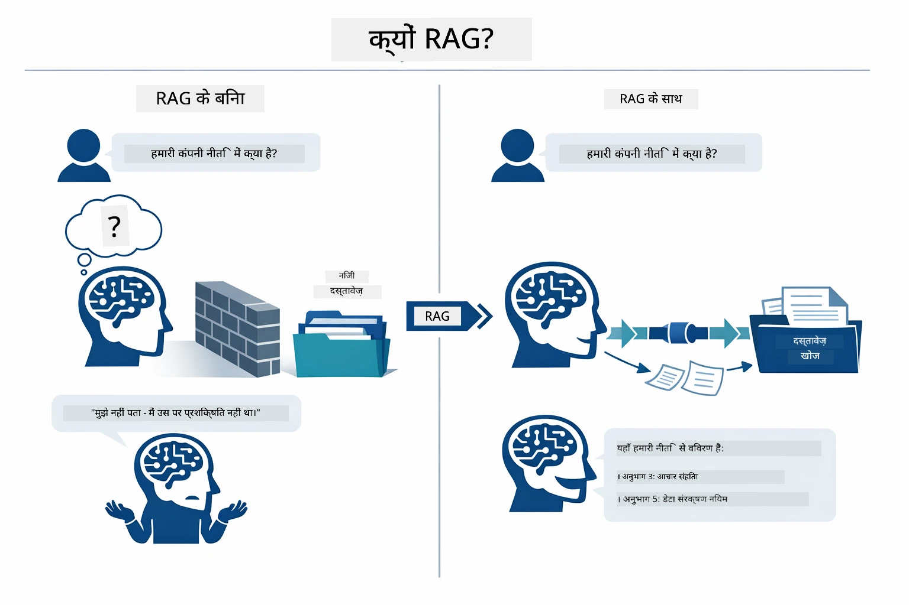

*यह आरेख एक सामान्य LLM (जो प्रशिक्षण डेटा से अनुमान लगाता है) और एक RAG-एन्हांस्ड LLM (जो पहले आपके दस्तावेजों से सलाह लेता है) के बीच का अंतर दिखाता है।*

यहाँ सेम पूरी प्रक्रिया कैसे जुड़ी है, उपयोगकर्ता के प्रश्न चार चरणों से गुजरते हैं — एम्बेडिंग, वेक्टर खोज, संदर्भ असेंबली, और उत्तर उत्पादन — प्रत्येक पिछले चरण पर आधारित:


*यह आरेख पूरे RAG पाइपलाइन को दिखाता है — एक उपयोगकर्ता प्रश्न एम्बेडिंग, वेक्टर खोज, संदर्भ असेंबली, और उत्तर उत्पादन से होकर गुजरता है।*

बाकी इस मॉड्यूल में हर चरण को विस्तार से समझाया गया है, जिसमें आप चालना और संशोधित कर सकते हैं कोड भी शामिल है।

### Which RAG Approach Does This Tutorial Use?

LangChain4j RAG को लागू करने के तीन तरीके प्रदान करता है, प्रत्येक अलग-अलग स्तर की अमूर्तता के साथ। नीचे का आरेख इन्हें साइड-बाय-साइड तुलना करता है:

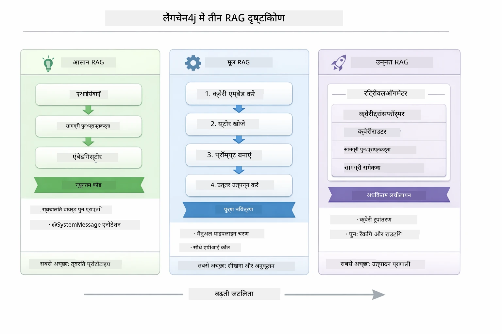

*यह आरेख तीन LangChain4j RAG दृष्टिकोणों — Easy, Native, और Advanced — की तुलना करता है, उनके प्रमुख घटक और उपयोग कब करें दिखाते हुए।*

| दृष्टिकोण | यह क्या करता है | ट्रेड-ऑफ |
|---|---|---|
| **Easy RAG** | सब कुछ स्वचालित रूप से `AiServices` और `ContentRetriever` के माध्यम से जोड़ता है। आप एक इंटरफ़ेस एनोटेट करते हैं, एक रिट्रीवर अटैच करते हैं, और LangChain4j एम्बेडिंग, खोज, और प्रॉम्प्ट असेंबली को बैकग्राउंड में संभालता है। | न्यूनतम कोड, लेकिन आप हर चरण में क्या हो रहा है यह नहीं देख पाते। |
| **Native RAG** | आप स्वयं एम्बेडिंग मॉडल कॉल करते हैं, स्टोर में खोज करते हैं, प्रॉम्प्ट बनाते हैं, और उत्तर उत्पन्न करते हैं — एक-एक स्पष्ट चरण में। | अधिक कोड, लेकिन हर चरण दिखाई देता है और संशोधित किया जा सकता है। |
| **Advanced RAG** | `RetrievalAugmentor` फ्रेमवर्क का उपयोग करता है जिसमें प्लग-इन योग्य क्वेरी ट्रांसफॉर्मर, राउटर, री-रैंकर्स, और सामग्री इंजेक्टर होते हैं जो उत्पादन-ग्रेड पाइपलाइंस के लिए। | अधिकतम लचीलापन, लेकिन काफी जटिलता। |

**यह ट्यूटोरियल Native दृष्टिकोण का उपयोग करता है।** RAG पाइपलाइन का हर चरण — क्वेरी को एम्बेड करना, वेक्टर स्टोर खोजना, संदर्भ जोड़ना, और उत्तर उत्पन्न करना — [`RagService.java`](../../../03-rag/src/main/java/com/example/langchain4j/rag/service/RagService.java) में स्पष्ट रूप से लिखा गया है। यह जानबूझकर किया गया है: एक सीखने वाले संसाधन के रूप में, यह महत्वपूर्ण है कि आप हर चरण को देखें और समझें बजाय इसके कि कोड कम किया जाए। जब आप समझ जाएं कि ये हिस्से कैसे मिलते हैं, तो आप Easy RAG का उपयोग करके जल्दी प्रोटोटाइप बना सकते हैं या उत्पादन प्रणाली के लिए Advanced RAG पर जा सकते हैं।

> **💡 पहले से Easy RAG देखा है?** [Quick Start मॉड्यूल](../00-quick-start/README.md) में एक Document Q&A उदाहरण शामिल है ([`SimpleReaderDemo.java`](../../../00-quick-start/src/main/java/com/example/langchain4j/quickstart/SimpleReaderDemo.java)) जो Easy RAG दृष्टिकोण का उपयोग करता है — LangChain4j स्वचालित रूप से एम्बेडिंग, खोज, और प्रॉम्प्ट असेंबली संभालता है। यह मॉड्यूल अगला कदम है जो उस पाइपलाइन को खोलता है ताकि आप हर चरण को खुद देख सकें और नियंत्रित कर सकें।

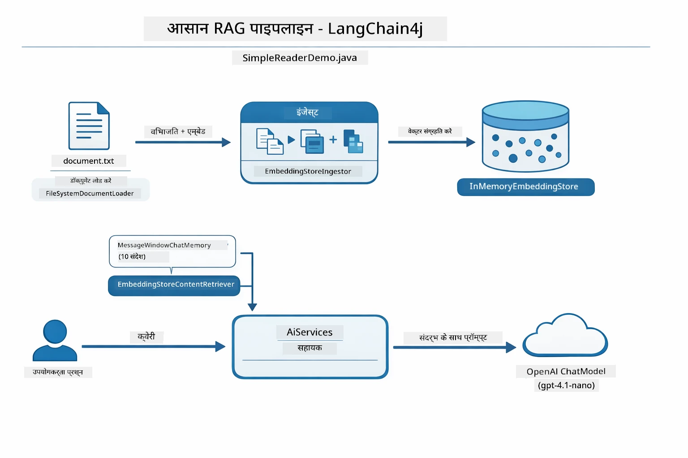

*यह आरेख `SimpleReaderDemo.java` से Easy RAG पाइपलाइन दिखाता है। इसे इस मॉड्यूल के Native दृष्टिकोण के साथ तुलना करें: Easy RAG एम्बेडिंग, रिट्रीवल, और प्रॉम्प्ट असेंबली को `AiServices` और `ContentRetriever` के पीछे छिपा देता है — आप एक दस्तावेज़ लोड करते हैं, रिट्रीवर अटैच करते हैं, और जवाब पाते हैं। इस मॉड्यूल में Native दृष्टिकोण उस पाइपलाइन को खोलता है ताकि आप हर चरण (एम्बेड, खोज, संदर्भ जोड़ना, उत्पन्न करना) को खुद कॉल करें, पूर्ण दृश्यता और नियंत्रण के साथ।*

## How It Works

इस मॉड्यूल में RAG पाइपलाइन चार चरणों में टूटती है जो हर बार उपयोगकर्ता प्रश्न पूछने पर क्रम से चलती हैं। सबसे पहले, एक अपलोड किया हुआ दस्तावेज़ **पार्स और चंक्स** में विभाजित किया जाता है जो प्रबंधनीय हिस्से हैं। फिर उन चंक्स को **वेक्टर एम्बेडिंग** में बदला जाता है और संग्रहीत किया जाता है ताकि उनकी गणितीय तुलना की जा सके। जब कोई क्वेरी आती है, तो सिस्टम एक **सेमांटिक सर्च** करता है ताकि सबसे प्रासंगिक चंक्स मिल सकें, और अंत में उन्हें संदर्भ के रूप में LLM को **उत्तर निर्माण** के लिए पास करता है। नीचे के सेक्शन प्रत्येक चरण को कोड और आरेखों के साथ समझाते हैं। पहले चरण को देखें।

### Document Processing

[DocumentService.java](../../../03-rag/src/main/java/com/example/langchain4j/rag/service/DocumentService.java)

जब आप कोई दस्तावेज़ अपलोड करते हैं, सिस्टम उसे पार्स करता है (PDF या साधारण टेक्स्ट), फ़ाइलनाम जैसे मेटाडेटा जोड़ता है, और फिर उसे चंक्स में तोड़ता है — छोटे टुकड़े जो मॉडल की संदर्भ विंडो में आराम से फिट हो जाते हैं। ये चंक्स थोड़ा ओवरलैप करते हैं ताकि सीमाओं पर संदर्भ न खोएं।

```java
// अपलोड की गई फ़ाइल को पार्स करें और इसे LangChain4j दस्तावेज़ में लपेटें
Document document = Document.from(content, metadata);

// 30-टोकन ओवरलैप के साथ 300-टोकन के चंक्स में विभाजित करें
DocumentSplitter splitter = DocumentSplitters
    .recursive(300, 30);

List<TextSegment> segments = splitter.split(document);
```

नीचे का आरेख दिखाता है कि यह प्रक्रिया विज़ुअली कैसे काम करती है। ध्यान दें कि हर चंक अपने पड़ोसी के कुछ टोकन साझा करता है — 30-टोकन ओवरलैप यह सुनिश्चित करता है कि कोई महत्वपूर्ण संदर्भ बीच में न छूटे:

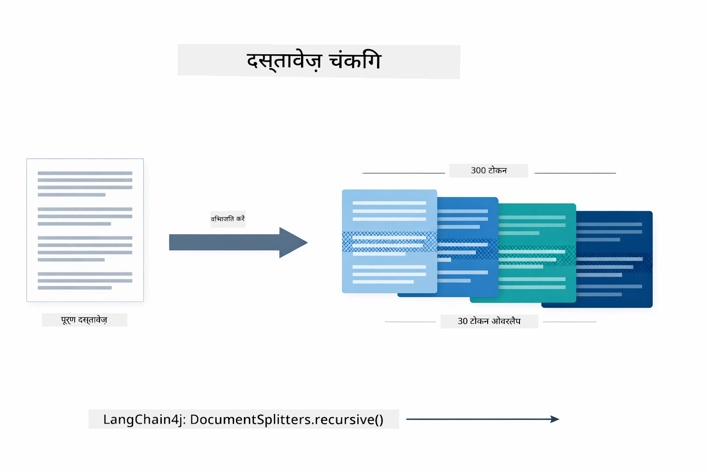

*यह आरेख दिखाता है कि एक दस्तावेज़ को 300-टोकन के चंक्स में 30-टोकन ओवरलैप के साथ तोड़ा जाता है, चंक सीमाओं पर संदर्भ संरक्षित करते हुए।*

> **🤖 [GitHub Copilot](https://github.com/features/copilot) चैट के साथ आज़माएँ:** [`DocumentService.java`](../../../03-rag/src/main/java/com/example/langchain4j/rag/service/DocumentService.java) खोलें और पूछें:
> - "LangChain4j कैसे दस्तावेज़ों को चंक्स में बाँटता है और ओवरलैप क्यों महत्वपूर्ण है?"
> - "विभिन्न दस्तावेज़ प्रकारों के लिए आदर्श चंक आकार क्या है और क्यों?"
> - "मैं बहुभाषी या विशेष स्वरूपण वाले दस्तावेजों को कैसे संभालूं?"

### Creating Embeddings

[LangChainRagConfig.java](../../../03-rag/src/main/java/com/example/langchain4j/rag/config/LangChainRagConfig.java)

प्रत्येक चंक को एक संख्यात्मक प्रतिनिधित्व में बदला जाता है जिसे एम्बेडिंग कहा जाता है — मूल रूप से अर्थ से संख्याओं में कन्वर्टर। एम्बेडिंग मॉडल "बुद्धिमान" नहीं है जैसे चैट मॉडल होता है; यह निर्देशों का पालन नहीं कर सकता, तर्क नहीं कर सकता, या प्रश्नों का जवाब नहीं दे सकता। जो यह कर सकता है वह है टेक्स्ट को एक गणितीय स्थान में मैप करना जहाँ समान अर्थ नज़दीक आ जाते हैं — "कार" के नज़दीक "ऑटोमोबाइल", "रिफंड पॉलिसी" के नज़दीक "मेरा पैसा वापस"। चैट मॉडल को आप एक व्यक्ति के रूप में सोचें जिससे बात हो सकती है; एम्बेडिंग मॉडल एक अत्यंत अच्छी फ़ाइलिंग प्रणाली है।

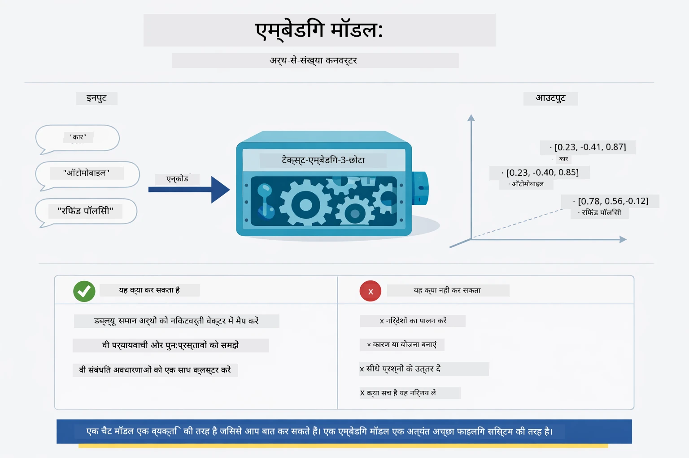

*यह आरेख दिखाता है कि एक एम्बेडिंग मॉडल टेक्स्ट को संख्यात्मक वेक्टर में कैसे बदलता है, जिससे समान अर्थ वाले शब्द — जैसे "कार" और "ऑटोमोबाइल" — वेक्टर स्पेस में एक दूसरे के करीब आते हैं।*

```java
@Bean
public EmbeddingModel embeddingModel() {
    return OpenAiOfficialEmbeddingModel.builder()
        .baseUrl(azureOpenAiEndpoint)
        .apiKey(azureOpenAiKey)
        .modelName(azureEmbeddingDeploymentName)
        .build();
}

EmbeddingStore<TextSegment> embeddingStore = 
    new InMemoryEmbeddingStore<>();
```

नीचे का क्लास आरेख RAG पाइपलाइन के दो अलग फ्लो और LangChain4j क्लासेस को दिखाता है जो इन्हें लागू करते हैं। **इन्गेस्टन फ्लो** (अपलोड समय पर एक बार चलता है) दस्तावेज़ को विभाजित करता है, चंक्स को एम्बेड करता है, और `.addAll()` के माध्यम से स्टोर करता है। **क्वेरी फ्लो** (हर बार उपयोगकर्ता पूछता है) प्रश्न को एम्बेड करता है, `.search()` के माध्यम से स्टोर में खोज करता है, और मिलाए गए संदर्भ को चैट मॉडल को पास करता है। दोनों फ्लो साझा `EmbeddingStore<TextSegment>` इंटरफ़ेस पर मिलते हैं:

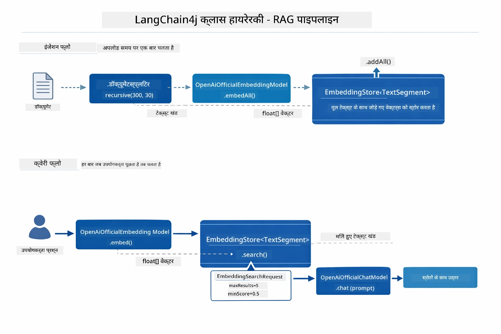

*यह आरेख RAG पाइपलाइन के दोनों फ्लो — इन्गेस्टन और क्वेरी — और कैसे वे साझा EmbeddingStore के माध्यम से जुड़े होते हैं दिखाता है।*

एक बार एम्बेडिंग स्टोर हो जाने के बाद, समान सामग्री स्वाभाविक रूप से वेक्टर स्पेस में समूह बनाती है। नीचे का विज़ुअलाइज़ेशन दिखाता है कि संबंधित विषयों पर आधारित दस्तावेज़ निकट बिंदुओं के रूप में कैसे समाप्त होते हैं, जो सेमांटिक खोज को संभव बनाता है:


*यह विज़ुअलाइज़ेशन दिखाता है कि संबंधित दस्तावेज़ 3D वेक्टर स्पेस में कैसे समूह बनाते हैं, जैसे Technical Docs, Business Rules, और FAQs विभिन्न समूह बनाते हैं।*

जब उपयोगकर्ता खोज करता है, सिस्टम चार चरणों का पालन करता है: दस्तावेज़ों को एक बार एम्बेड करना, क्वेरी को हर खोज पर एम्बेड करना, कोसाइन सादृश्यता का उपयोग कर सभी संग्रहीत वेक्टरों से तुलना करना, और शीर्ष-K उच्चतम स्कोर प्राप्त चंक लौटाना। नीचे के आरेख में हर चरण और जुड़े LangChain4j वर्गों को दिखाया गया है:

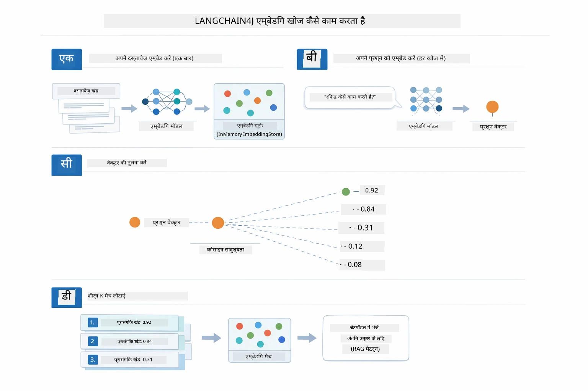

*यह आरेख चार-चरणीय एम्बेडिंग खोज प्रक्रिया दिखाता है: दस्तावेज़ एम्बेड करना, क्वेरी एम्बेड करना, वेक्टरों की कोसाइन सादृश्यता से तुलना करना, और शीर्ष-K परिणाम लौटाना।*

### Semantic Search

[RagService.java](../../../03-rag/src/main/java/com/example/langchain4j/rag/service/RagService.java)

जब आप प्रश्न पूछते हैं, आपका प्रश्न भी एक एम्बेडिंग बन जाता है। सिस्टम आपके प्रश्न के एम्बेडिंग की तुलना दस्तावेज़ के सभी चंक्स के एम्बेडिंग से करता है। यह सबसे समान अर्थ वाले चंक्स ढूंढ़ता है - केवल मिलते-जुलते कीवर्ड नहीं, बल्कि वास्तविक सेमांटिक समानता।

```java
Embedding queryEmbedding = embeddingModel.embed(question).content();

EmbeddingSearchRequest searchRequest = EmbeddingSearchRequest.builder()
    .queryEmbedding(queryEmbedding)
    .maxResults(5)
    .minScore(0.5)
    .build();

EmbeddingSearchResult<TextSegment> searchResult = embeddingStore.search(searchRequest);
List<EmbeddingMatch<TextSegment>> matches = searchResult.matches();

for (EmbeddingMatch<TextSegment> match : matches) {
    String relevantText = match.embedded().text();
    double score = match.score();
}
```

नीचे का आरेख सेमांटिक खोज और पारंपरिक कीवर्ड खोज की तुलना करता है। "vehicle" के लिए कीवर्ड खोज "cars and trucks" के बारे में एक चंक चूक जाती है, लेकिन सेमांटिक खोज समझती है कि वे समान अर्थ रखते हैं और इसे उच्च स्कोर वाला मैच के रूप में लौटाती है:

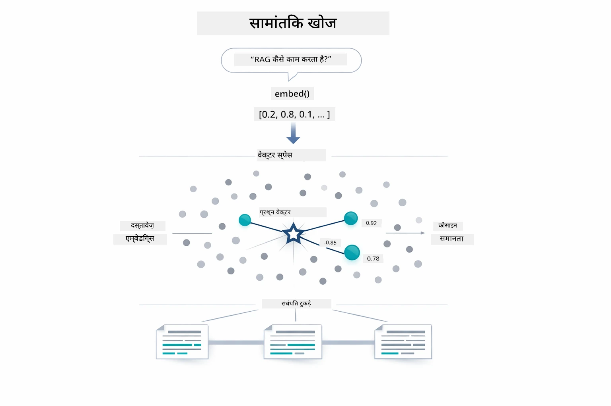

*यह आरेख कीवर्ड-आधारित खोज की तुलना सेमांटिक खोज से करता है, जो दिखाता है कि सेमांटिक खोज कैसे अवधारणात्मक रूप से संबंधित सामग्री वापस लाती है भले ही सटीक कीवर्ड भिन्न हों।*

अंदरूनी तौर पर, सादृश्यता को कोसाइन सादृश्यता का उपयोग करके मापा जाता है — मूल रूप से यह पूछना कि "क्या ये दो तीर एक ही दिशा में इशारा कर रहे हैं?" दो चंक पूरी तरह से भिन्न शब्दों का उपयोग कर सकते हैं, लेकिन यदि वे समान अर्थ रखते हैं तो उनके वेक्टर समान दिशा में होंगे और स्कोर 1.0 के करीब होगा:

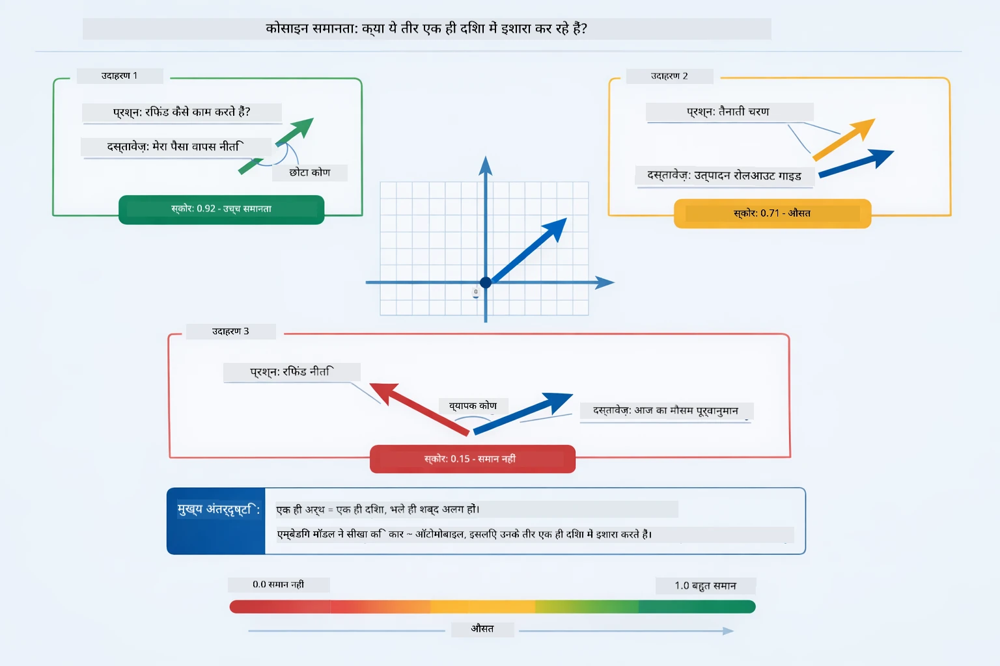
*यह आरेख एम्बेडिंग वेक्टरों के बीच कोण के रूप में कॉसाइन सादृश्यता को दर्शाता है — अधिक संरेखित वेक्टर 1.0 के करीब स्कोर करते हैं, जो उच्चतम सैमान्टिक समानता को दर्शाता है।*

> **🤖 [GitHub Copilot](https://github.com/features/copilot) चैट के साथ प्रयास करें:** [`RagService.java`](../../../03-rag/src/main/java/com/example/langchain4j/rag/service/RagService.java) खोलें और पूछें:
> - "एम्बेडिंग के साथ समानता खोज कैसे काम करती है और स्कोर क्या निर्धारित करता है?"
> - "मुझे किस समानता थ्रेशोल्ड का उपयोग करना चाहिए और यह परिणामों को कैसे प्रभावित करता है?"
> - "जब कोई प्रासंगिक दस्तावेज़ नहीं मिलते तो मैं कैसे संभालूं?"

### उत्तर उत्पादन

[RagService.java](../../../03-rag/src/main/java/com/example/langchain4j/rag/service/RagService.java)

सबसे प्रासंगिक खंडों को संरचित प्रॉम्प्ट में एक साथ जोड़ा जाता है जिसमें स्पष्ट निर्देश, पुनः प्राप्त संदर्भ और उपयोगकर्ता का प्रश्न शामिल होता है। मॉडल उन विशिष्ट खंडों को पढ़ता है और उस जानकारी के आधार पर उत्तर देता है — यह केवल वही उपयोग कर सकता है जो उसके सामने है, जिससे भ्रम की संभावना कम हो जाती है।

```java
String context = matches.stream()
    .map(match -> match.embedded().text())
    .collect(Collectors.joining("\n\n"));

String prompt = String.format("""
    Answer the question based on the following context.
    If the answer cannot be found in the context, say so.

    Context:
    %s

    Question: %s

    Answer:""", context, request.question());

String answer = chatModel.chat(prompt);
```

नीचे दिया गया आरेख इस संयोजन को क्रियान्वित दिखाता है — खोज चरण के शीर्ष स्कोर वाले खंड प्रॉम्प्ट टेम्पलेट में शामिल किए जाते हैं, और `OpenAiOfficialChatModel` एक प्रमाणिक उत्तर उत्पन्न करता है:

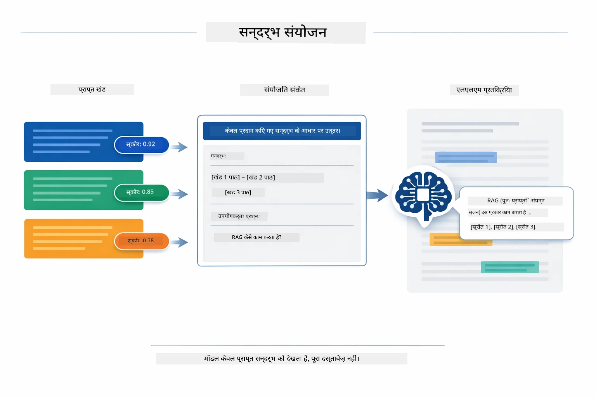

*यह आरेख दर्शाता है कि कैसे शीर्ष स्कोर वाले खंडों को संरचित प्रॉम्प्ट में जोड़ा जाता है, जिससे मॉडल आपके डेटा से प्रमाणिक उत्तर उत्पन्न कर सकता है।*

## एप्लिकेशन चलाएं

**डिप्लॉयमेंट सत्यापित करें:**

सुनिश्चित करें कि रूट डायरेक्टरी में `.env` फ़ाइल मौजूद है जिसमें Azure प्रमाण-पत्र हैं (Module 01 के दौरान बनाई गई):

**Bash:**
```bash
cat ../.env  # AZURE_OPENAI_ENDPOINT, API_KEY, DEPLOYMENT दिखाना चाहिए
```

**PowerShell:**
```powershell
Get-Content ..\.env  # AZURE_OPENAI_ENDPOINT, API_KEY, DEPLOYMENT दिखाने चाहिए
```

**एप्लिकेशन शुरू करें:**

> **टिप्पणी:** यदि आपने सभी एप्लिकेशन पहले ही `./start-all.sh` से Module 01 के अंतर्गत शुरू कर दिए हैं, तो यह मॉड्यूल पहले से ही पोर्ट 8081 पर चल रहा है। आप नीचे के स्टार्ट कमांड छोड़ सकते हैं और सीधे http://localhost:8081 पर जा सकते हैं।

**विकल्प 1: Spring Boot डैशबोर्ड का उपयोग (VS Code उपयोगकर्ताओं के लिए अनुशंसित)**

डेव कंटेनर में Spring Boot डैशबोर्ड एक्सटेंशन शामिल है, जो सभी Spring Boot एप्लिकेशन प्रबंधित करने के लिए एक दृश्य इंटरफ़ेस प्रदान करता है। आप इसे VS Code के बाईं ओर Activity Bar में देख सकते हैं (Spring Boot आइकन देखें)।

Spring Boot डैशबोर्ड से, आप:
- कार्यक्षेत्र में उपलब्ध सभी Spring Boot एप्लिकेशन देख सकते हैं
- एक क्लिक से एप्लिकेशन शुरू/बंद कर सकते हैं
- रीयल-टाइम में एप्लिकेशन लॉग देख सकते हैं
- एप्लिकेशन की स्थिति निगरानी कर सकते हैं

"rag" के सामने प्ले बटन पर क्लिक करें इस मॉड्यूल को शुरू करने के लिए, या सभी मॉड्यूल एक साथ शुरू करें।


*यह स्क्रीनशॉट VS Code में Spring Boot डैशबोर्ड दिखाता है, जहां आप एप्लिकेशन को दृष्टिगत रूप से शुरू, बंद और मॉनिटर कर सकते हैं।*

**विकल्प 2: शेल स्क्रिप्ट का उपयोग करें**

सभी वेब एप्लिकेशन (मॉड्यूल 01-04) शुरू करें:

**Bash:**
```bash
cd ..  # रूट निर्देशिका से
./start-all.sh
```

**PowerShell:**
```powershell
cd ..  # रूट डायरेक्टरी से
.\start-all.ps1
```

या केवल इस मॉड्यूल को शुरू करें:

**Bash:**
```bash
cd 03-rag
./start.sh
```

**PowerShell:**
```powershell
cd 03-rag
.\start.ps1
```

दोनों स्क्रिप्ट स्वतः रूट `.env` फ़ाइल से पर्यावरण चर लोड करते हैं और यदि जार फाइल मौजूद नहीं हैं तो उन्हें बनाते हैं।

> **टिप्पणी:** यदि आप स्टार्ट करने से पहले सभी मॉड्यूल मैनुअल रूप से बनाना चाहते हैं:
>
> **Bash:**
> ```bash
> cd ..  # Go to root directory
> mvn clean package -DskipTests
> ```
>
> **PowerShell:**
> ```powershell
> cd ..  # Go to root directory
> mvn clean package -DskipTests
> ```

अपने ब्राउज़र में http://localhost:8081 खोलें।

**रोकने के लिए:**

**Bash:**
```bash
./stop.sh  # केवल यह मॉड्यूल
# या
cd .. && ./stop-all.sh  # सभी मॉड्यूल
```

**PowerShell:**
```powershell
.\stop.ps1  # केवल यह मॉड्यूल
# या
cd ..; .\stop-all.ps1  # सभी मॉड्यूल्स
```

## एप्लिकेशन का उपयोग

एप्लिकेशन दस्तावेज़ अपलोडिंग और प्रश्न पूछने के लिए एक वेब इंटरफ़ेस प्रदान करता है।

<a href="images/rag-homepage.png"></a>

*यह स्क्रीनशॉट RAG एप्लिकेशन इंटरफ़ेस दिखाता है जहां आप दस्तावेज़ अपलोड करते हैं और प्रश्न पूछते हैं।*

### दस्तावेज़ अपलोड करें

दस्तावेज़ अपलोड करके शुरू करें - परीक्षण के लिए TXT फ़ाइलें सबसे अच्छी हैं। इस डायरेक्टरी में `sample-document.txt` दिया गया है जिसमें LangChain4j फीचर्स, RAG कार्यान्वयन, और सर्वोत्तम प्रथाओं की जानकारी है - जो सिस्टम को टेस्ट करने के लिए उपयुक्त है।

सिस्टम आपके दस्तावेज़ को प्रोसेस करता है, इसे खंडों में विभाजित करता है, और प्रत्येक खंड के लिए एम्बेडिंग बनाता है। यह ऑटोमैटिक रूप से तब होता है जब आप अपलोड करते हैं।

### प्रश्न पूछें

अब दस्तावेज़ सामग्री के बारे में विशिष्ट प्रश्न पूछें। कोई ऐसा तथ्यात्मक प्रश्न पूछें जो स्पष्ट रूप से दस्तावेज़ में उल्लिखित हो। सिस्टम प्रासंगिक खंड खोजता है, उन्हें प्रॉम्प्ट में शामिल करता है और उत्तर उत्पन्न करता है।

### स्रोत संदर्भ जांचें

ध्यान दें कि प्रत्येक उत्तर में स्रोत संदर्भ होते हैं जिनके साथ समानता स्कोर होते हैं। ये स्कोर (0 से 1 तक) दिखाते हैं कि प्रत्येक खंड आपके प्रश्न के लिए कितना प्रासंगिक था। उच्च स्कोर बेहतर मेल को दर्शाते हैं। यह आपको स्रोत सामग्री के विरुद्ध उत्तर पुष्टि करने देता है।

<a href="images/rag-query-results.png"></a>

*यह स्क्रीनशॉट क्वेरी परिणाम दिखाता है जिसमें उत्पन्न उत्तर, स्रोत संदर्भ, और प्रत्येक पुनः प्राप्त खंड के लिए प्रासंगिकता स्कोर शामिल हैं।*

### प्रश्नों के साथ प्रयोग करें

अलग-अलग प्रकार के प्रश्न आज़माएं:
- विशिष्ट तथ्य: "मुख्य विषय क्या है?"
- तुलना: "X और Y में क्या अंतर है?"
- सारांश: "Z के प्रमुख बिंदुओं का सारांश दें"

देखें कि आपकी प्रश्न और दस्तावेज़ सामग्री की मेल के आधार पर प्रासंगिकता स्कोर कैसे बदलते हैं।

## प्रमुख अवधारणाएँ

### खंडन रणनीति

दस्तावेज़ों को 300-टोकन के खंडों में विभाजित किया जाता है जिनमें 30 टोकन का ओवरलैप होता है। यह संतुलन सुनिश्चित करता है कि प्रत्येक खंड में पर्याप्त संदर्भ हो जो अर्थपूर्ण हो और साथ ही इतना छोटा हो कि कई खंड एक प्रॉम्प्ट में शामिल किए जा सकें।

### समानता स्कोर

प्रत्येक पुनः प्राप्त खंड के साथ एक समानता स्कोर (0 से 1 के बीच) होता है जो दिखाता है कि वह उपयोगकर्ता के प्रश्न के कितने निकट मेल खाता है। नीचे दिया गया आरेख स्कोर दायरे को और इसे सिस्टम किस तरह फ़िल्टर के लिए उपयोग करता है, दिखाता है:

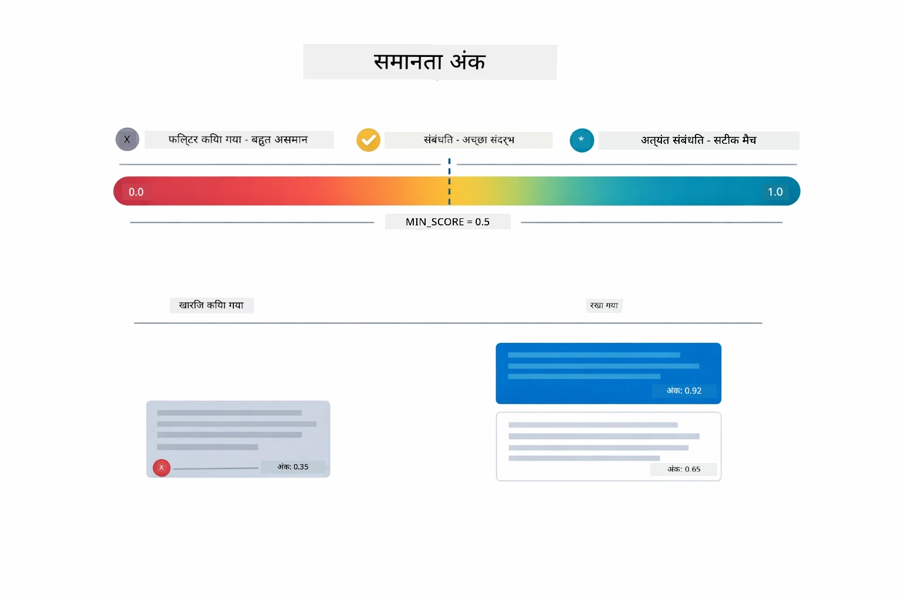

*यह आरेख 0 से 1 के स्कोर दायरे को दिखाता है, जिसमें न्यूनतम थ्रेशोल्ड 0.5 है जो अप्रासंगिक खंडों को अलग करता है।*

स्कोर 0 से 1 तक होते हैं:
- 0.7-1.0: अत्यंत प्रासंगिक, सटीक मेल
- 0.5-0.7: प्रासंगिक, अच्छा संदर्भ
- 0.5 से नीचे: फ़िल्टर किए गए, बहुत असमान

सिस्टम केवल न्यूनतम थ्रेशोल्ड से ऊपर के खंडों को पुनः प्राप्त करता है ताकि गुणवत्ता सुनिश्चित हो सके।

जब अर्थ स्पष्ट रूप से समूहित होता है, तो एम्बेडिंग अच्छी तरह काम करते हैं, लेकिन इनकी सीमाएँ भी हैं। नीचे का आरेख सामान्य विफलता मोड दिखाता है — बहुत बड़े खंड धुंधले वेक्टर बनाते हैं, बहुत छोटे खंड संदर्भहीन होते हैं, अस्पष्ट शब्द कई समूहों की ओर संकेत करते हैं, और सटीक मैच खोज (आईडी, पार्ट नंबर्स) एम्बेडिंग के साथ बिल्कुल काम नहीं करती:

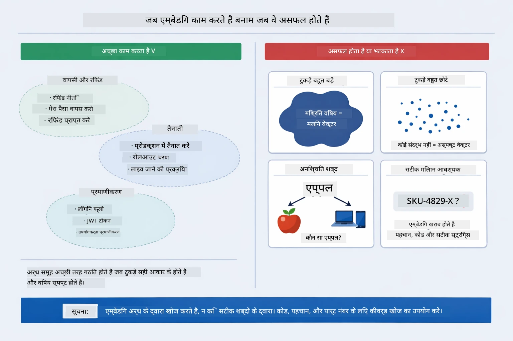

*यह आरेख सामान्य एम्बेडिंग failure मोड दिखाता है: बहुत बड़े खंड, बहुत छोटे खंड, अस्पष्ट शब्द जो कई समूहों की ओर संकेत करते हैं, और आईडी जैसे सटीक मैच लुकअप।*

### इन-मेमोरी स्टोरेज

यह मॉड्यूल सरलता के लिए इन-मेमोरी संग्रहण का उपयोग करता है। जब आप एप्लिकेशन पुनः आरंभ करते हैं, तो अपलोड किए गए दस्तावेज़ खो जाते हैं। उत्पादन प्रणालियाँ Qdrant या Azure AI Search जैसे सतत वेक्टर डेटाबेस का उपयोग करती हैं।

### संदर्भ विंडो प्रबंधन

प्रत्येक मॉडल की अधिकतम संदर्भ विंडो होती है। आप बड़े दस्तावेज़ के सभी खंड शामिल नहीं कर सकते। सिस्टम अधिकतम N (डिफ़ॉल्ट 5) सबसे प्रासंगिक खंड पुनः प्राप्त करता है ताकि सीमा के भीतर रहते हुए पर्याप्त संदर्भ मिल सके और सही उत्तर प्रदान किए जा सकें।

## जब RAG महत्वपूर्ण हो

RAG हमेशा सही विकल्प नहीं होता। नीचे दिया गया निर्णय मार्गदर्शक बताता है कि कब RAG मूल्य जोड़ता है और कब सरल तरीके — जैसे सीधे प्रॉम्प्ट में सामग्री शामिल करना या मॉडल के अंतर्निहित ज्ञान पर निर्भर रहना — पर्याप्त होते हैं:

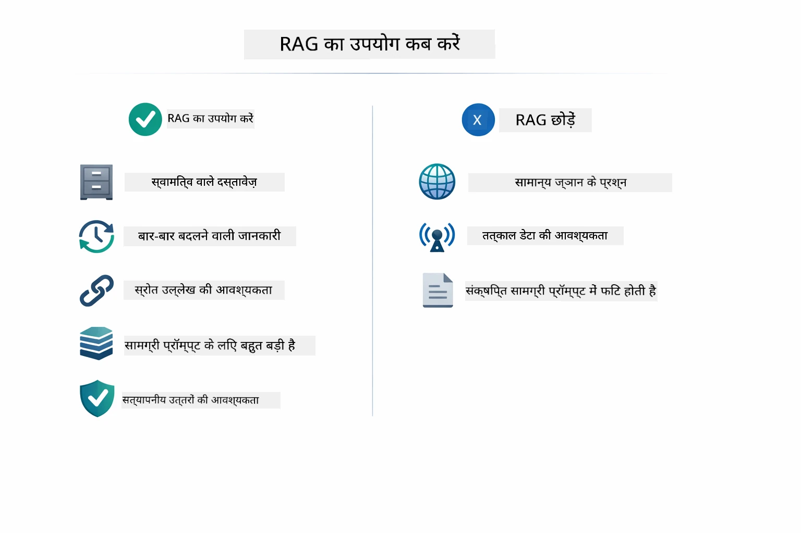

*यह आरेख निर्णय मार्गदर्शक दिखाता है कि कब RAG मूल्य जोड़ता है और कब सरल तरीके पर्याप्त होते हैं।*

**RAG का उपयोग करें जब:**
- स्वामित्व वाले दस्तावेज़ों के प्रश्नों का उत्तर देना हो
- जानकारी अक्सर बदलती हो (नीतियाँ, मूल्य, विनिर्देशन)
- सटीकता के लिए स्रोत संदर्भ आवश्यक हो
- सामग्री इतनी बड़ी हो कि एक प्रॉम्प्ट में फिट न हो पाए
- आपको सत्यापन योग्य, प्रमाणित उत्तर चाहिए

**RAG का उपयोग न करें जब:**
- प्रश्न सामान्य ज्ञान मांगते हों जो मॉडल के पास पहले से हो
- वास्तविक समय के डेटा की आवश्यकता हो (RAG अपलोड किए गए दस्तावेज़ों पर काम करता है)
- सामग्री इतनी छोटी हो कि सीधे प्रॉम्प्ट में शामिल की जा सके

## अगले कदम

**अगला मॉड्यूल:** [04-tools - AI एजेंट्स टूल्स के साथ](../04-tools/README.md)

---

**नेविगेशन:** [← पिछला: Module 02 - Prompt Engineering](../02-prompt-engineering/README.md) | [मुख्य पृष्ठ पर वापस जाएं](../README.md) | [अगला: Module 04 - Tools →](../04-tools/README.md)

---

<!-- CO-OP TRANSLATOR DISCLAIMER START -->
**अस्वीकरण**:  
इस दस्तावेज़ का अनुवाद AI अनुवाद सेवा [Co-op Translator](https://github.com/Azure/co-op-translator) का उपयोग करके किया गया है। जबकि हम सटीकता के लिए प्रयासरत हैं, कृपया ध्यान रखें कि स्वचालित अनुवाद में त्रुटियां या गलतियाँ हो सकती हैं। मूल भाषा में दस्तावेज़ को आधिकारिक स्रोत माना जाना चाहिए। महत्वपूर्ण जानकारी के लिए, पेशेवर मानव अनुवाद की सलाह दी जाती है। इस अनुवाद के उपयोग से उत्पन्न किसी भी गलतफहमी या गलत व्याख्या के लिए हम जिम्मेदार नहीं हैं।
<!-- CO-OP TRANSLATOR DISCLAIMER END -->