# मॉड्यूल 04: टूल्स के साथ AI एजेंट्स

## विषय सूची

- [आप क्या सीखेंगे](../../../04-tools)
- [आवश्यकताएं](../../../04-tools)
- [टूल्स के साथ AI एजेंट्स को समझना](../../../04-tools)
- [टूल कॉलिंग कैसे काम करता है](../../../04-tools)
  - [टूल परिभाषाएं](../../../04-tools)
  - [निर्णय लेना](../../../04-tools)
  - [कार्य निष्पादन](../../../04-tools)
  - [प्रतिक्रिया निर्माण](../../../04-tools)
  - [आर्किटेक्चर: स्प्रिंग बूट ऑटो-वायरिंग](../../../04-tools)
- [टूल चेनिंग](../../../04-tools)
- [एप्लिकेशन चलाएं](../../../04-tools)
- [एप्लिकेशन का उपयोग](../../../04-tools)
  - [सरल टूल उपयोग आज़माएं](../../../04-tools)
  - [टूल चेनिंग का परीक्षण करें](../../../04-tools)
  - [संवाद प्रवाह देखें](../../../04-tools)
  - [विभिन्न अनुरोधों के साथ प्रयोग करें](../../../04-tools)
- [मुख्य अवधारणाएं](../../../04-tools)
  - [ReAct पैटर्न (तर्क और क्रिया)](../../../04-tools)
  - [टूल विवरण महत्व रखते हैं](../../../04-tools)
  - [सेशन प्रबंधन](../../../04-tools)
  - [त्रुटि हैंडलिंग](../../../04-tools)
- [उपलब्ध टूल्स](../../../04-tools)
- [कब टूल-आधारित एजेंट्स का उपयोग करें](../../../04-tools)
- [टूल्स vs RAG](../../../04-tools)
- [अगले कदम](../../../04-tools)

## आप क्या सीखेंगे

अब तक, आपने AI के साथ संवाद करना, प्रभावी रूप से प्रॉम्प्ट बनाना और अपनी दस्तावेज़ों में प्रतिक्रियाओं को आधार देना सीखा है। लेकिन अभी भी एक मौलिक सीमा है: भाषा मॉडल केवल टेक्स्ट पैदा कर सकते हैं। वे मौसम की जाँच नहीं कर सकते, गणना नहीं कर सकते, डाटाबेस क्वेरी नहीं कर सकते, या बाहरी प्रणालियों के साथ बातचीत नहीं कर सकते।

टूल्स इसे बदल देते हैं। मॉडल को ऐसे फ़ंक्शन एक्सेस करने के लिए देने से, जिसे वह कॉल कर सकता है, आप इसे केवल टेक्स्ट जनरेटर से एक एजेंट में बदल देते हैं जो क्रियाएं कर सकता है। मॉडल यह तय करता है कि कब उसे टूल की जरूरत है, कौन सा टूल उपयोग करना है, और किन पैरामीटरों को पास करना है। आपका कोड फ़ंक्शन निष्पादित करता है और परिणाम लौटाता है। मॉडल उस परिणाम को अपनी प्रतिक्रिया में सम्मिलित करता है।

## आवश्यकताएं

- [मॉड्यूल 01 - परिचय](../01-introduction/README.md) पूरा किया हो (Azure OpenAI संसाधन तैनात)
- पिछले मॉड्यूल्स की सिफारिश की गई है (यह मॉड्यूल टूल्स vs RAG तुलना में [मॉड्यूल 03 के RAG अवधारणाओं](../03-rag/README.md) का संदर्भ देता है)
- रूट डायरेक्टरी में Azure प्रमाणपत्रों के साथ `.env` फ़ाइल हो (मॉड्यूल 01 में `azd up` द्वारा बनाई गई)

> **नोट:** यदि आपने मॉड्यूल 01 पूरा नहीं किया है, तो पहले वहां के डिप्लॉयमेंट निर्देशों का पालन करें।

## टूल्स के साथ AI एजेंट्स को समझना

> **📝 नोट:** इस मॉड्यूल में "एजेंट्स" शब्द ऐसे AI सहायकों को संदर्भित करता है जिनमें टूल-कॉलिंग क्षमताएं जोड़ी गई हैं। यह उन **Agentic AI** पैटर्न्स (स्वायत्त एजेंट जो योजना, स्मृति, और बहु-चरण तर्क के साथ होते हैं) से अलग है जिन्हें हम [मॉड्यूल 05: MCP](../05-mcp/README.md) में कवर करेंगे।

टूल्स के बिना, कोई भाषा मॉडल केवल अपने प्रशिक्षण डेटा से टेक्स्ट जेनरेट कर सकता है। वर्तमान मौसम पूछो, और उसे अनुमान लगाना पड़ेगा। उसे टूल्स दो, और वह मौसम API कॉल कर सकता है, गणना कर सकता है, या डाटाबेस क्वेरी कर सकता है — फिर इन वास्तविक परिणामों को अपनी प्रतिक्रिया में जोड़ता है।

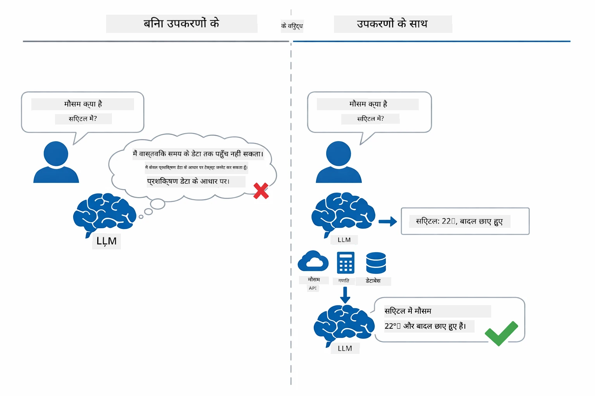

*टूल्स के बिना मॉडल केवल अनुमान लगा सकता है — टूल्स के साथ वह API कॉल कर सकता है, गणना कर सकता है, और वास्तविक समय डेटा वापस ला सकता है।*

एक टूल्स वाले AI एजेंट में एक **तर्क और क्रिया (ReAct)** पैटर्न होता है। मॉडल केवल प्रतिक्रिया नहीं देता — वह सोचता है कि उसे क्या चाहिए, एक टूल कॉल करके कार्य करता है, परिणाम देखता है, और फिर तय करता है कि दोबारा क्रिया करनी है या अंतिम उत्तर देना है:

1. **तर्क करें** — एजेंट उपयोगकर्ता के प्रश्न का विश्लेषण करता है और आवश्यक जानकारी निर्धारित करता है
2. **क्रिया करें** — एजेंट सही टूल चुनता है, सही पैरामीटर उत्पन्न करता है, और उसे कॉल करता है
3. **निरीक्षण करें** — एजेंट टूल के आउटपुट को प्राप्त करता है और परिणाम का मूल्यांकन करता है
4. **दोहराएं या प्रतिक्रिया दें** — यदि अधिक डेटा चाहिए, तो एजेंट लूप में वापस जाता है; अन्यथा, एक प्राकृतिक भाषा उत्तर बनाता है

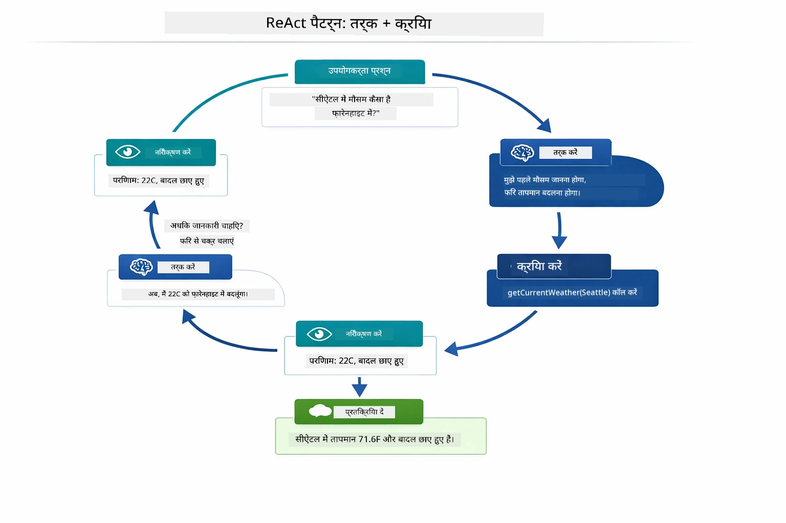

*ReAct चक्र — एजेंट सोचता है कि क्या करना है, टूल कॉल करके कार्रवाई करता है, परिणाम देखता है, और तब तक लूप करता है जब तक अंतिम उत्तर दे सके।*

यह सब स्वचालित होता है। आप टूल्स और उनके विवरण परिभाषित करते हैं। मॉडल निर्णय लेता है कि कब और कैसे उन्हें उपयोग करना है।

## टूल कॉलिंग कैसे काम करता है

### टूल परिभाषाएं

[WeatherTool.java](../../../04-tools/src/main/java/com/example/langchain4j/agents/tools/WeatherTool.java) | [TemperatureTool.java](../../../04-tools/src/main/java/com/example/langchain4j/agents/tools/TemperatureTool.java)

आप फ़ंक्शन्स को स्पष्ट विवरण और पैरामीटर विनिर्देशों के साथ परिभाषित करते हैं। मॉडल इन विवरणों को अपने सिस्टम प्रॉम्प्ट में देखता है और समझता है कि हर टूल क्या करता है।

```java
@Component
public class WeatherTool {
    
    @Tool("Get the current weather for a location")
    public String getCurrentWeather(@P("Location name") String location) {
        // आपका मौसम खोज लॉजिक
        return "Weather in " + location + ": 22°C, cloudy";
    }
}

@AiService
public interface Assistant {
    String chat(@MemoryId String sessionId, @UserMessage String message);
}

// सहायक स्वचालित रूप से Spring Boot द्वारा वायर्ड किया गया है:
// - ChatModel बीन
// - @Component क्लासों से सभी @Tool मेथड्स
// - सत्र प्रबंधन के लिए ChatMemoryProvider
```

नीचे का चित्र प्रत्येक एनोटेशन को तोड़ता है और दिखाता है कि कैसे हर हिस्सा AI को समझने में मदद करता है कि टैूल कब कॉल करनी है और कौन से आर्गुमेंट्स पास करने हैं:

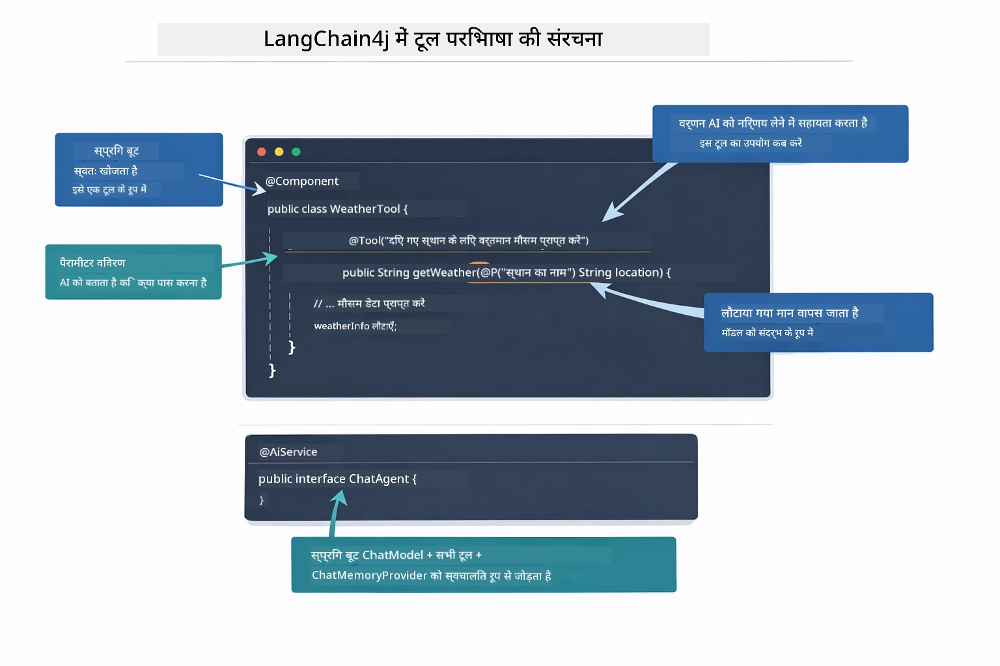

*टूल परिभाषा की संरचना — @Tool AI को बताता है कि कब इसका उपयोग करें, @P हर पैरामीटर को वर्णित करता है, और @AiService स्टार्टअप पर सब कुछ जोड़ता है।*

> **🤖 [GitHub Copilot](https://github.com/features/copilot) चैट के साथ आज़माएं:** [`WeatherTool.java`](../../../04-tools/src/main/java/com/example/langchain4j/agents/tools/WeatherTool.java) खोलें और पूछें:
> - "मैं असली OpenWeatherMap API को मॉक डेटा की जगह कैसे जोड़ूं?"
> - "एक अच्छा टूल विवरण क्या होता है जो AI को इसे सही उपयोग करने में मदद करता है?"
> - "API त्रुटियों और रेट लिमिट्स को टूल इंप्लीमेंटेशन में कैसे संभालें?"

### निर्णय लेना

जब उपयोगकर्ता पूछता है "Seattle में मौसम कैसा है?", तो मॉडल यादृच्छिक रूप से कोई टूल नहीं चुनता। वह हर एक टूल विवरण की तुलना उपयोगकर्ता के इरादे से करता है, प्रासंगिकता के लिए स्कोर करता है, और सबसे अच्छा मेल चुनता है। फिर वह सही पैरामीटर के साथ एक संरचित फ़ंक्शन कॉल उत्पन्न करता है — इस मामले में, `location` को `"Seattle"` सेट करता है।

यदि कोई टूल उपयोगकर्ता की मांग से मेल नहीं खाता, तो मॉडल अपने ज्ञान से जवाब देता है। यदि कई टूल मेल खाते हैं, तो सबसे विशिष्ट चुनता है।

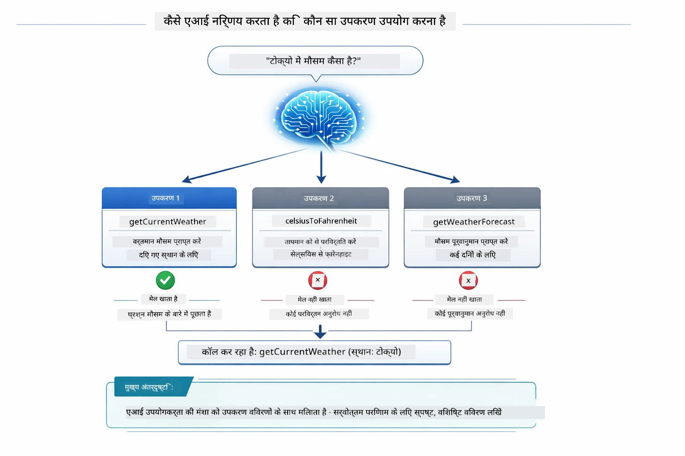

*मॉडल प्रत्येक उपलब्ध टूल को उपयोगकर्ता के इरादे के खिलाफ आंका करता है और सबसे अच्छा मेल चुनता है — इसलिए स्पष्ट, विशिष्ट टूल विवरण लिखना महत्वपूर्ण है।*

### कार्य निष्पादन

[AgentService.java](../../../04-tools/src/main/java/com/example/langchain4j/agents/service/AgentService.java)

स्प्रिंग बूट डिक्लेरेटिव `@AiService` इंटरफेस को सभी रजिस्टर टूल्स के साथ ऑटो-वायर करता है, और LangChain4j टूल कॉल्स को स्वचालित रूप से निष्पादित करता है। पर्दे के पीछे, एक पूर्ण टूल कॉल छह चरणों से गुजरता है — उपयोगकर्ता के प्राकृतिक भाषा प्रश्न से लेकर प्राकृतिक भाषा उत्तर तक:

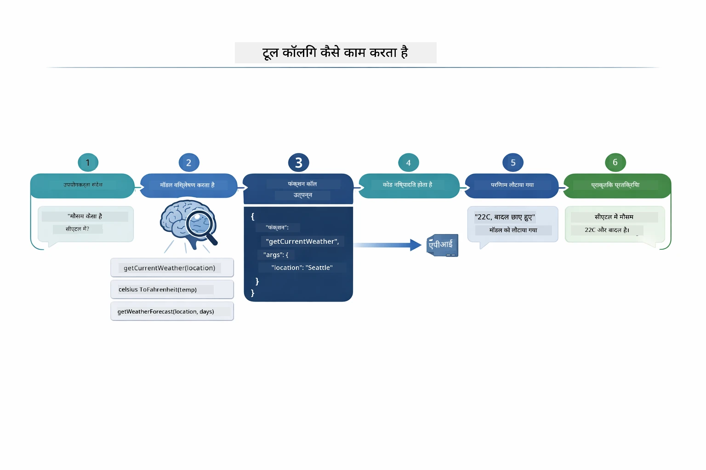

*अंत-से-अंत प्रवाह — उपयोगकर्ता प्रश्न करता है, मॉडल टूल चुनता है, LangChain4j इसे निष्पादित करता है, और मॉडल परिणाम को प्राकृतिक प्रतिक्रिया में जोड़ता है।*

यदि आपने मॉड्यूल 00 में [ToolIntegrationDemo](../../../00-quick-start/src/main/java/com/example/langchain4j/quickstart/ToolIntegrationDemo.java) चलाया है, तो आपने यह पैटर्न पहले ही देखा है — `Calculator` टूल्स को इसी तरह कॉल किया गया था। नीचे अनुक्रम आरेख ठीक दिखाता है कि उस डेमो में क्या हुआ:

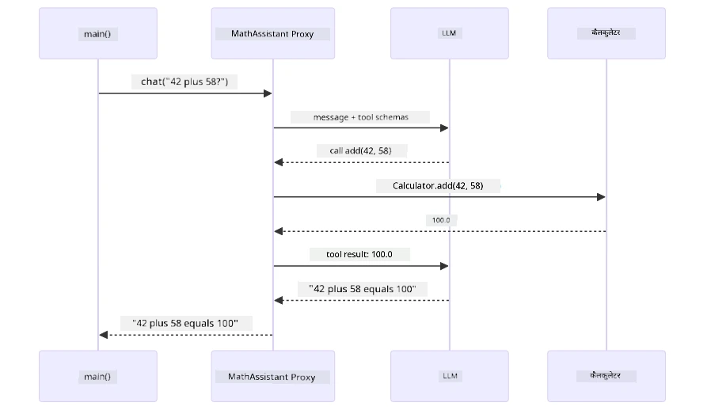

*Quick Start डेमो से टूल-कॉलिंग लूप — `AiServices` आपका संदेश और टूल स्कीमाओं को LLM को भेजता है, LLM `add(42, 58)` जैसे फ़ंक्शन कॉल से जवाब देता है, LangChain4j स्थानीय रूप से `Calculator` मेथड चलाता है, और अंतिम उत्तर के लिए परिणाम वापस भेजता है।*

> **🤖 [GitHub Copilot](https://github.com/features/copilot) चैट के साथ आज़माएं:** [`AgentService.java`](../../../04-tools/src/main/java/com/example/langchain4j/agents/service/AgentService.java) खोलें और पूछें:
> - "ReAct पैटर्न कैसे काम करता है और AI एजेंट्स के लिए यह क्यों प्रभावशाली है?"
> - "एजेंट कैसे निर्णय लेता है कि कौन सा टूल कब और किस क्रम में उपयोग करना है?"
> - "अगर टूल निष्पादन विफल हो जाए तो क्या होता है - त्रुटियों को मजबूती से कैसे संभालूं?"

### प्रतिक्रिया निर्माण

मॉडल मौसम डेटा प्राप्त करता है और इसे उपयोगकर्ता के लिए प्राकृतिक भाषा प्रतिक्रिया में स्वरूपित करता है।

### आर्किटेक्चर: स्प्रिंग बूट ऑटो-वायरिंग

यह मॉड्यूल LangChain4j के स्प्रिंग बूट एकीकरण का उपयोग करता है जिसमें डिक्लेरेटिव `@AiService` इंटरफेस होते हैं। स्टार्टअप पर स्प्रिंग बूट हर `@Component` खोजता है जिसमें `@Tool` मेथड्स हों, आपका `ChatModel` बीन, और `ChatMemoryProvider` — फिर इन्हें एक ही `Assistant` इंटरफेस में बिना अतिरिक्त कोड के जोड़ देता है।

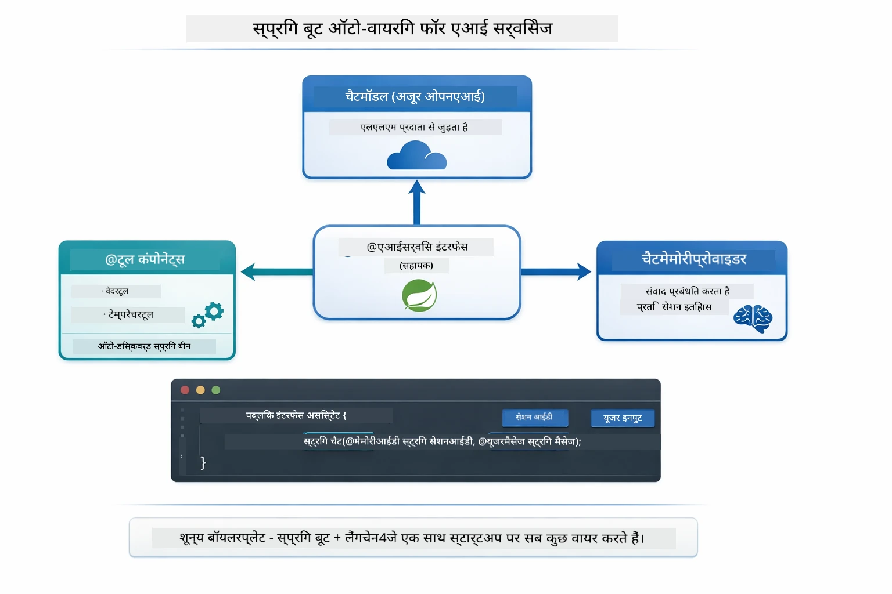

*@AiService इंटरफेस ChatModel, टूल कॉम्पोनेंट्स और मेमोरी प्रदाता को जोड़ता है — स्प्रिंग बूट सभी वायरिंग को स्वचालित रूप से संभालता है।*

यहाँ HTTP अनुरोध से लेकर कंट्रोलर, सर्विस, और ऑटो-वायर प्रॉक्सी के माध्यम से टूल निष्पादन तक पूरी अनुरोध जीवनचक्र को अनुक्रम आरेख के रूप में दिखाया गया है:

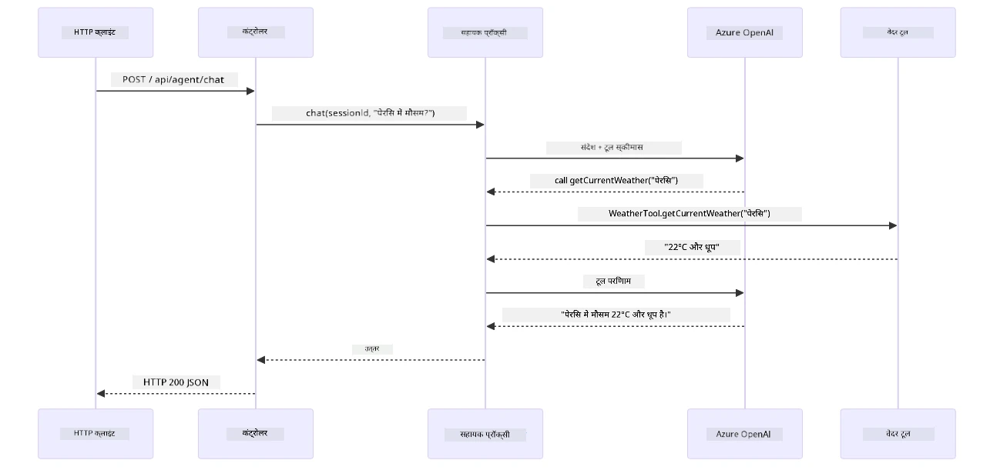

*पूर्ण स्प्रिंग बूट अनुरोध जीवनचक्र — HTTP अनुरोध कंट्रोलर और सर्विस के माध्यम से ऑटो-वायर असिस्टेंट प्रॉक्सी पर जाता है, जो LLM और टूल कॉल्स का स्वतः प्रबंधन करता है।*

इस दृष्टिकोण के मुख्य लाभ:

- **स्प्रिंग बूट ऑटो-वायरिंग** — ChatModel और टूल्स अपने आप इंजेक्ट होते हैं
- **@MemoryId पैटर्न** — स्वचालित सेशन-आधारित मेमोरी प्रबंधन
- **सिंगल इंस्टेंस** — असिस्टेंट एक बार बनता है और बेहतर प्रदर्शन के लिए पुन: उपयोग होता है
- **टाइप-सुरक्षित निष्पादन** — जावा मेथड्स सीधे कॉल होते हैं टाइप कन्वर्जन के साथ
- **मल्टी-टर्न ऑर्केस्ट्रेशन** — टूल चेनिंग को स्वचालित रूप से संभालता है
- **शून्य अतिरिक्त कोड** — मैनुअल `AiServices.builder()` कॉल या मेमोरी HashMap नहीं चाहिए

वैकल्पिक दृष्टिकोण (मैनुअल `AiServices.builder()`) में अधिक कोड की जरूरत होती है और स्प्रिंग बूट इंटीग्रेशन के फायदे नहीं मिलते।

## टूल चेनिंग

**टूल चेनिंग** — टूल-आधारित एजेंट्स की असली ताकत तब दिखती है जब एक सवाल के लिए कई टूल्स की जरूरत होती है। पूछें "Seattle में फ़ारेनहाइट में मौसम कैसा है?" और एजेंट स्वचालित रूप से दो टूल्स को जोड़ता है: पहले यह `getCurrentWeather` कॉल करता है जो तापमान सेल्सियस में देता है, फिर वह मान `celsiusToFahrenheit` को पास करता है — यह सब एक ही बातचीत में।

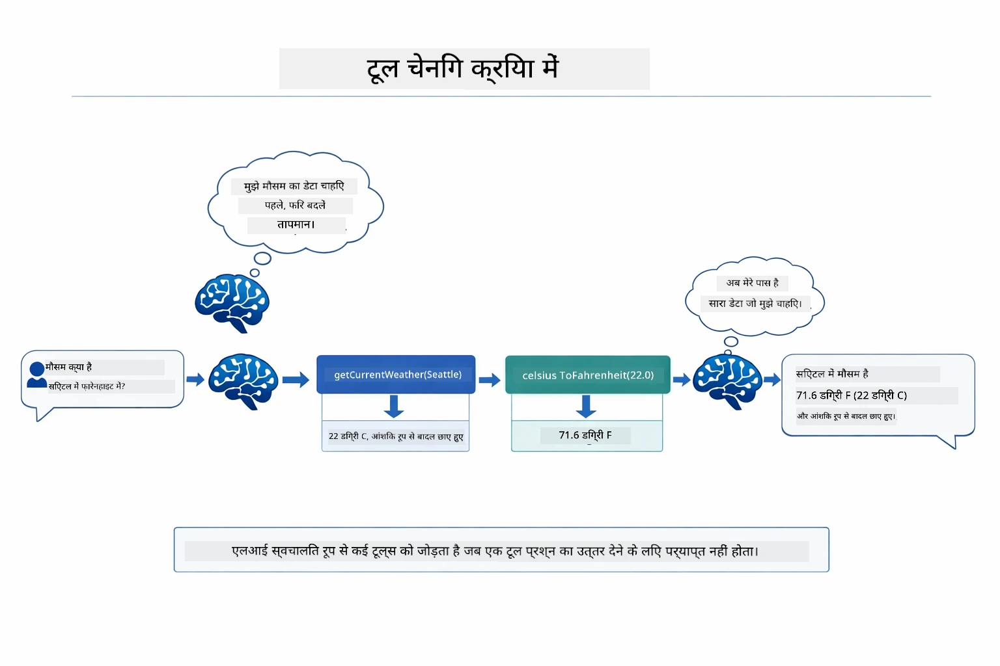

*टूल चेनिंग व्यवहार में — एजेंट पहले getCurrentWeather कॉल करता है, फिर सेल्सियस परिणाम को celsiusToFahrenheit में भेजता है, और संयुक्त उत्तर देता है।*

**सौम्य विफलताएं** — किसी ऐसे शहर का मौसम पूछें जो मॉक डेटा में ना हो। टूल त्रुटि संदेश लौटाता है, और AI बताता है कि मदद नहीं कर सकता बजाय कि क्रैश करने के। टूल्स सुरक्षित रूप से विफल होते हैं। नीचे चित्र दो दृष्टिकोणों का अंतर दिखाता है — सही त्रुटि हैंडलिंग के साथ एजेंट अपवाद पकड़ता है और मददगार प्रतिक्रिया देता है; बिना इसके पूरी एप्लिकेशन क्रैश हो जाती है:

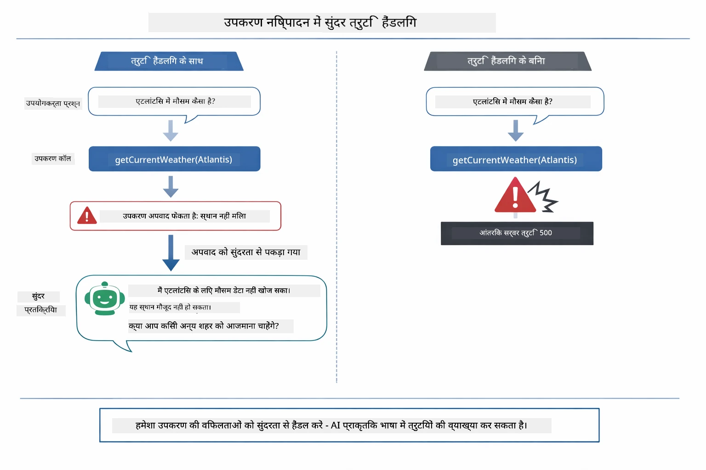

*जब टूल विफल होता है, एजेंट त्रुटि पकड़ता है और क्रैश होने के बजाय मददगार स्पष्टीकरण के साथ प्रतिक्रिया करता है।*

यह एक ही बातचीत में होता है। एजेंट स्वायत्त रूप से कई टूल कॉल्स का प्रबंधन करता है।

## एप्लिकेशन चलाएं

**तैनाती सत्यापित करें:**

सुनिश्चित करें कि `.env` फ़ाइल रूट डायरेक्टरी में है और इसमें Azure प्रमाणपत्र हैं (मॉड्यूल 01 के दौरान बनाई गई)। मॉड्यूल डायरेक्टरी (`04-tools/`) से इसे चलाएं:

**Bash:**
```bash
cat ../.env  # AZURE_OPENAI_ENDPOINT, API_KEY, DEPLOYMENT दिखाना चाहिए
```

**PowerShell:**
```powershell
Get-Content ..\.env  # AZURE_OPENAI_ENDPOINT, API_KEY, DEPLOYMENT दिखाना चाहिए
```

**एप्लिकेशन शुरू करें:**

> **नोट:** यदि आपने पहले से सभी एप्लिकेशन `./start-all.sh` से रूट डायरेक्टरी में शुरू कर दिए हैं (मॉड्यूल 01 में बताया गया), तो यह मॉड्यूल पहले से पोर्ट 8084 पर चल रहा होगा। आप नीचे के स्टार्ट कमांड स्किप करके सीधे http://localhost:8084 पर जा सकते हैं।

**विकल्प 1: स्प्रिंग बूट डैशबोर्ड का उपयोग करना (VS कोड उपयोगकर्ताओं के लिए अनुशंसित)**

डेव कंटेनर में स्प्रिंग बूट डैशबोर्ड एक्सटेंशन शामिल है, जो सभी स्प्रिंग बूट एप्लिकेशन के प्रबंधन के लिए विज़ुअल इंटरफ़ेस प्रदान करता है। आप इसे VS कोड के Activity Bar के बाएं साइड में पाएंगे (स्प्रिंग बूट आइकन देखें)।

स्प्रिंग बूट डैशबोर्ड से आप:
- वर्कस्पेस के सभी उपलब्ध स्प्रिंग बूट एप्लिकेशन देख सकते हैं
- एक क्लिक से एप्लिकेशन शुरू/रोक सकते हैं
- एप्लिकेशन लॉग वास्तविक समय में देख सकते हैं
- एप्लिकेशन की स्थिति मॉनिटर कर सकते हैं

बस "tools" के बगल में प्ले बटन क्लिक करें इस मॉड्यूल को शुरू करने के लिए, या सभी मॉड्यूल एक साथ शुरू करें।

VS कोड में स्प्रिंग बूट डैशबोर्ड कैसा दिखता है, यहां देखें:


*VS कोड में स्प्रिंग बूट डैशबोर्ड — एक जगह से सभी मॉड्यूल शुरू, रोकें, और मॉनिटर करें*

**विकल्प 2: शेल स्क्रिप्ट का उपयोग करना**

सभी वेब एप्लिकेशन (मॉड्यूल 01-04) शुरू करें:

**Bash:**
```bash
cd ..  # रूट निर्देशिका से
./start-all.sh
```

**PowerShell:**
```powershell
cd ..  # रूट डायरेक्ट्री से
.\start-all.ps1
```

या केवल इस मॉड्यूल को शुरू करें:

**Bash:**
```bash
cd 04-tools
./start.sh
```

**PowerShell:**
```powershell
cd 04-tools
.\start.ps1
```

दोनों स्क्रिप्ट स्वचालित रूप से रूट `.env` फ़ाइल से एनवायरनमेंट वेरिएबल्स लोड करते हैं और यदि JAR उपलब्ध नहीं हैं तो उन्हें बनाएंगे।

> **नोट:** यदि आप शुरू करने से पहले सभी मॉड्यूल मैन्युअली बिल्ड करना पसंद करते हैं:
>
> **Bash:**
> ```bash
> cd ..  # Go to root directory
> mvn clean package -DskipTests
> ```
>
> **PowerShell:**
> ```powershell
> cd ..  # Go to root directory
> mvn clean package -DskipTests
> ```

अपने ब्राउज़र में http://localhost:8084 खोलें।

**रोकने के लिए:**

**Bash:**
```bash
./stop.sh  # यह केवल मॉड्यूल
# या
cd .. && ./stop-all.sh  # सभी मॉड्यूल
```

**PowerShell:**
```powershell
.\stop.ps1  # केवल यह मॉड्यूल
# या
cd ..; .\stop-all.ps1  # सभी मॉड्यूल
```

## एप्लिकेशन का उपयोग

एप्लिकेशन एक वेब इंटरफ़ेस प्रदान करता है जहां आप एक AI एजेंट के साथ इंटरैक्ट कर सकते हैं जिसे मौसम और तापमान रूपांतरण उपकरणों तक पहुंच प्राप्त है। इंटरफ़ेस कैसा दिखता है — इसमें क्विक-स्टार्ट उदाहरण और अनुरोध भेजने के लिए चैट पैनल शामिल है:

<a href="images/tools-homepage.png"></a>

*AI एजेंट टूल्स इंटरफ़ेस - टूल्स के साथ इंटरैक्ट करने के लिए त्वरित उदाहरण और चैट इंटरफ़ेस*

### सरल टूल उपयोग आज़माएँ

एक सरल अनुरोध से शुरू करें: "100 डिग्री फ़ारेनहाइट को सेल्सियस में परिवर्तित करें"। एजेंट पहचानता है कि उसे तापमान रूपांतरण टूल की आवश्यकता है, सही पैरामीटर के साथ इसे कॉल करता है, और परिणाम वापस करता है। ध्यान दें कि यह कितना प्राकृतिक लगता है - आपने यह निर्दिष्ट नहीं किया कि कौन सा टूल उपयोग करना है या इसे कैसे कॉल करना है।

### टूल चेनिंग का परीक्षण करें

अब कुछ अधिक जटिल प्रयास करें: "सीएटल में मौसम कैसा है और इसे फ़ारेनहाइट में परिवर्तित करें?" देखें कि एजेंट इसे चरणबद्ध तरीके से कैसे करता है। यह पहले मौसम प्राप्त करता है (जो सेल्सियस में होता है), पहचानता है कि इसे फ़ारेनहाइट में परिवर्तित करना है, रूपांतरण टूल को कॉल करता है, और दोनों परिणामों को एक उत्तर में संयोजित करता है।

### वार्तालाप प्रवाह देखें

चैट इंटरफ़ेस वार्तालाप इतिहास बनाए रखता है, जिससे आप मल्टी-टर्न इंटरैक्शन कर सकते हैं। आप सभी पिछले प्रश्न और उत्तर देख सकते हैं, जिससे वार्तालाप को ट्रैक करना और समझना आसान हो जाता है कि एजेंट कैसे कई विनिमयों के दौरान संदर्भ बनाता है।

<a href="images/tools-conversation-demo.png"></a>

*मल्टी-टर्न वार्तालाप जिसमें सरल रूपांतरण, मौसम खोज, और टूल चेनिंग दिखाया गया है*

### विभिन्न अनुरोधों के साथ प्रयोग करें

विभिन्न संयोजनों का प्रयास करें:
- मौसम की जांच: "टोक्यो में मौसम कैसा है?"
- तापमान रूपांतरण: "25°C को केल्विन में क्या है?"
- सम्मिलित प्रश्न: "पेरिस में मौसम देखें और बताएं कि क्या यह 20°C से ऊपर है"

ध्यान दें कि एजेंट प्राकृतिक भाषा को कैसे पढ़ता है और इसे उपयुक्त टूल कॉल से मेल करता है।

## मुख्य अवधारणाएं

### ReAct पैटर्न (तर्क और कार्य)

एजेंट तर्क (क्या करना है तय करना) और कार्य (टूल का उपयोग करना) के बीच वैकल्पिक रूप से काम करता है। यह पैटर्न स्वायत्त समस्या-समाधान सक्षम बनाता है बजाय केवल निर्देशों का पालन करने के।

### टूल विवरण महत्वपूर्ण हैं

आपके टूल विवरण की गुणवत्ता सीधे प्रभावित करती है कि एजेंट उन्हें कितना अच्छी तरह से उपयोग करता है। स्पष्ट, विशिष्ट विवरण मॉडल को समझने में मदद करते हैं कि कब और कैसे प्रत्येक टूल को कॉल करना है।

### सेशन प्रबंधन

`@MemoryId` एनोटेशन स्वचालित सेशन-आधारित मेमोरी प्रबंधन सक्षम बनाता है। प्रत्येक सेशन आईडी को `ChatMemory` इंस्टेंस मिलता है जिसे `ChatMemoryProvider` बीन्स द्वारा प्रबंधित किया जाता है, जिससे कई उपयोगकर्ता एजेंट के साथ एक साथ बातचीत कर सकते हैं बिना उनके वार्तालाप के मिलाए। निम्न चित्र दिखाता है कि कैसे कई उपयोगकर्ता अपने सेशन आईडी के आधार पर अलग-अलग मेमोरी स्टोर में भेजे जाते हैं:

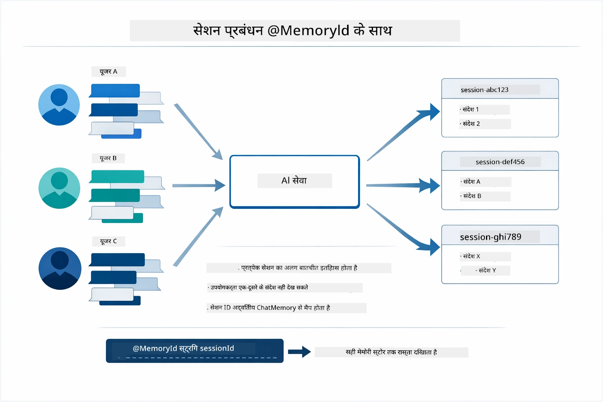

*प्रत्येक सेशन आईडी एक अलग वार्तालाप इतिहास से मेल खाता है — उपयोगकर्ता कभी भी एक-दूसरे के संदेश नहीं देखते।*

### त्रुटि प्रबंधन

टूल्स विफल हो सकते हैं — API टाइमआउट हो, पैरामीटर अवैध हो सकते हैं, बाहरी सेवाएं नीचे जा सकती हैं। प्रोडक्शन एजेंटों को त्रुटि प्रबंधन की आवश्यकता होती है ताकि मॉडल समस्याओं को समझा सके या विकल्पों की कोशिश करे बजाय पूरे एप्लिकेशन को क्रैश करने के। जब कोई टूल Exception फेंकता है, तो LangChain4j उसे पकड़ता है और त्रुटि संदेश मॉडल को वापस भेजता है, जो तब प्राकृतिक भाषा में समस्या समझा सकता है।

## उपलब्ध टूल्स

निम्न आरेख दिखाता है कि आप किन टूल्स का निर्माण कर सकते हैं। यह मॉड्यूल मौसम और तापमान टूल्स प्रदर्शित करता है, लेकिन समान `@Tool` पैटर्न किसी भी जावा मेथड के लिए काम करता है — डेटाबेस क्वेरी से लेकर भुगतान प्रक्रिया तक।

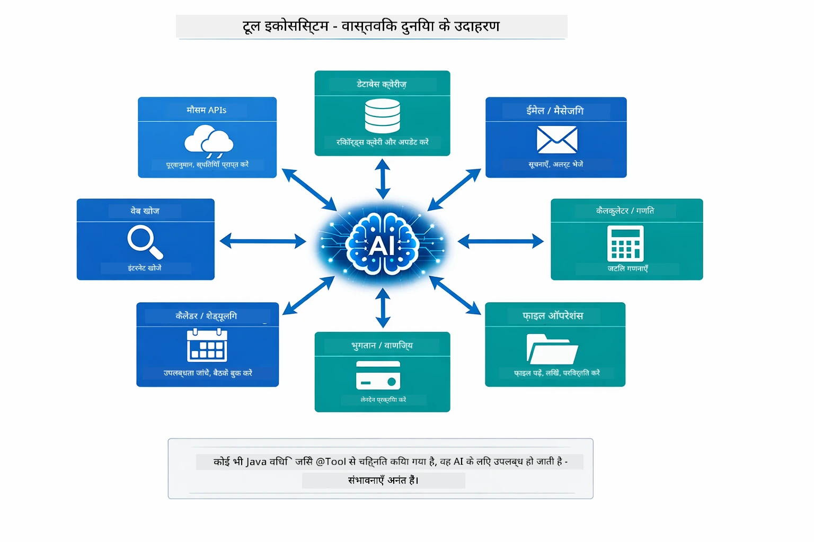

*@Tool एनोटेशन वाले किसी भी जावा मेथड को AI के लिए उपलब्ध कर दिया जाता है — पैटर्न डेटाबेस, API, ईमेल, फ़ाइल संचालन, और अधिक तक विस्तारित होता है।*

## टूल-आधारित एजेंट कब उपयोग करें

हर अनुरोध को टूल्स की आवश्यकता नहीं होती। निर्णय इस बात पर निर्भर करता है कि AI को बाहरी सिस्टम से इंटरैक्ट करने की जरूरत है या वह अपने ही ज्ञान से जवाब दे सकता है। निम्न मार्गदर्शिका सारांशित करती है कि कब टूल्स मूल्य जोड़ते हैं और कब वे अनावश्यक होते हैं:

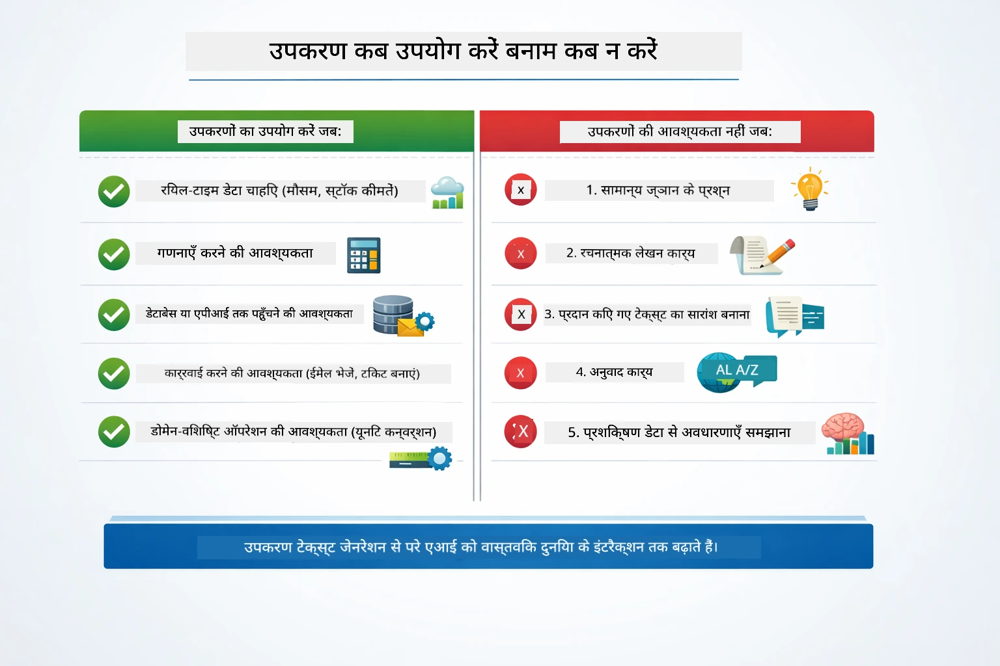

*एक त्वरित निर्णय मार्गदर्शिका — टूल्स रीयल-टाइम डेटा, कैलकुलेशन, और कार्रवाई के लिए हैं; सामान्य ज्ञान और रचनात्मक कार्यों के लिए आवश्यक नहीं।*

## टूल्स बनाम RAG

मॉड्यूल 03 और 04 दोनों AI की क्षमताओं को बढ़ाते हैं, लेकिन मौलिक रूप से अलग तरीके से। RAG मॉडल को **ज्ञान** तक पहुँचा देता है दस्तावेज़ पुनर्प्राप्त करके। टूल्स मॉडल को **कार्रवाई** लेने की क्षमता देते हैं फ़ंक्शन कॉल करके। निम्न आरेख इन दोनों दृष्टिकोणों की तुलना करता है — कैसे प्रत्येक वर्कफ़्लो काम करता है और उनके बीच के समझौते:

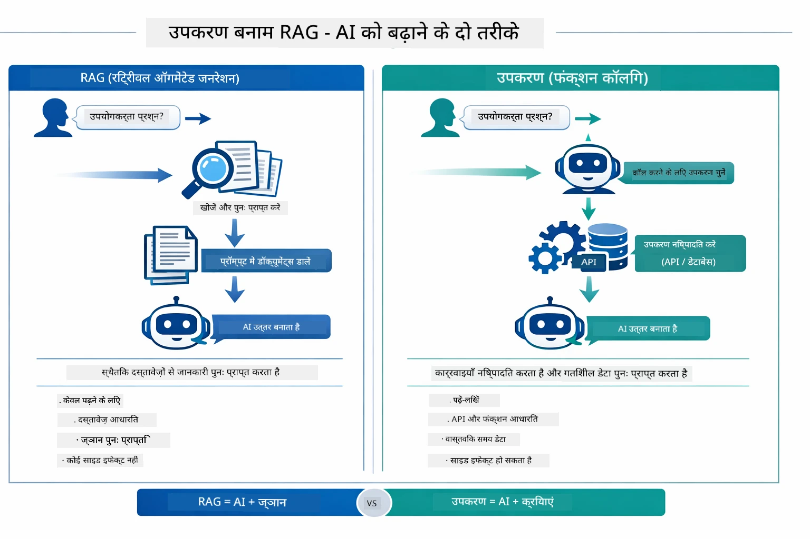

*RAG स्थिर दस्तावेज़ों से सूचनाओं को पुनः प्राप्त करता है — टूल्स क्रियाएं निष्पादित करते हैं और गतिशील, वास्तविक-समय डेटा लाते हैं। कई प्रोडक्शन सिस्टम दोनों का संयोजन करते हैं।*

व्यावहारिक रूप में, कई प्रोडक्शन सिस्टम दोनों दृष्टिकोणों को संयोजित करते हैं: RAG आपके प्रलेखन में उत्तर आधारभूत करने के लिए, और टूल्स लाइव डेटा लाने या संचालन करने के लिए।

## अगले चरण

**अगला मॉड्यूल:** [05-mcp - मॉडल संदर्भ प्रोटोकॉल (MCP)](../05-mcp/README.md)

---

**नेविगेशन:** [← पिछला: मॉड्यूल 03 - RAG](../03-rag/README.md) | [मुख पृष्ठ पर वापस](../README.md) | [अगला: मॉड्यूल 05 - MCP →](../05-mcp/README.md)

---

<!-- CO-OP TRANSLATOR DISCLAIMER START -->
**अस्वीकरण**:
यह दस्तावेज़ AI अनुवाद सेवा [Co-op Translator](https://github.com/Azure/co-op-translator) का उपयोग करके अनुवादित किया गया है। जबकि हम सटीकता के लिए प्रयासरत हैं, कृपया ध्यान दें कि स्वचालित अनुवाद में त्रुटियाँ या गलतियाँ हो सकती हैं। मूल भाषा में मूल दस्तावेज़ को अधिकारिक स्रोत माना जाना चाहिए। महत्वपूर्ण जानकारी के लिए, पेशेवर मानव अनुवाद की सलाह दी जाती है। इस अनुवाद के उपयोग से उत्पन्न किसी भी गलतफहमी या गलत व्याख्या के लिए हम उत्तरदायी नहीं हैं।
<!-- CO-OP TRANSLATOR DISCLAIMER END -->