# Module 05: मॉडल कॉन्टेक्स्ट प्रोटोकॉल (MCP)

## सामग्री सूची

- [आप क्या सीखेंगे](../../../05-mcp)
- [MCP क्या है?](../../../05-mcp)
- [MCP कैसे काम करता है](../../../05-mcp)
- [एजेंटिक मॉड्यूल](../../../05-mcp)
- [उदाहरण चलाना](../../../05-mcp)
  - [पूर्वापेक्षाएँ](../../../05-mcp)
- [त्वरित प्रारंभ](../../../05-mcp)
  - [फ़ाइल संचालन (Stdio)](../../../05-mcp)
  - [सुपरवाइजर एजेंट](../../../05-mcp)
    - [डेमो चलाना](../../../05-mcp)
    - [सुपरवाइजर कैसे काम करता है](../../../05-mcp)
    - [FileAgent रनटाइम पर MCP टूल कैसे खोजता है](../../../05-mcp)
    - [प्रतिक्रिया रणनीतियाँ](../../../05-mcp)
    - [आउटपुट की समझ](../../../05-mcp)
    - [एजेंटिक मॉड्यूल फीचर्स का विवरण](../../../05-mcp)
- [प्रमुख अवधारणाएँ](../../../05-mcp)
- [बधाई हो!](../../../05-mcp)
  - [अगला क्या है?](../../../05-mcp)

## आप क्या सीखेंगे

आपने संवादात्मक AI बनाया है, प्रॉम्प्ट्स को मास्टर किया है, दस्तावेज़ों से प्रतिक्रियाओं को ग्राउंड किया है, और टूल्स के साथ एजेंट बनाए हैं। लेकिन वे सभी टूल्स आपके विशिष्ट एप्लिकेशन के लिए कस्टम बनाए गए थे। क्या होगा यदि आप अपने AI को टूल्स के एक मानकीकृत इकोसिस्टम तक पहुंच दे सकें, जिन्हें कोई भी बना सकता है और साझा कर सकता है? इस मॉड्यूल में, आप Model Context Protocol (MCP) और LangChain4j के एजेंटिक मॉड्यूल के साथ ऐसा करना सीखेंगे। हम पहले एक सरल MCP फ़ाइल रीडर दिखाते हैं और फिर दिखाते हैं कि यह कैसे आसानी से सुपरवाइजर एजेंट पैटर्न का उपयोग करते हुए उन्नत एजेंटिक वर्कफ़्लोज़ में एकीकृत हो जाता है।

## MCP क्या है?

Model Context Protocol (MCP) ठीक यही प्रदान करता है — AI एप्लिकेशन के लिए बाहरी टूल्स खोजने और उपयोग करने का एक मानक तरीका। प्रत्येक डेटा स्रोत या सेवा के लिए कस्टम इंटीग्रेशन लिखने के बजाय, आप MCP सर्वर से जुड़ते हैं जो अपने टूल्स को एक सुसंगत प्रारुप में प्रदर्शित करते हैं। आपका AI एजेंट तब स्वचालित रूप से इन टूल्स को खोज और उपयोग कर सकता है।

नीचे दी गई चित्रात्मक जानकारी दिखाती है — बिना MCP के, हर एकीकरण के लिए कस्टम पॉइंट-टू-पॉइंट कनेक्शन की जरूरत होती है; MCP के साथ, एक प्रोटोकॉल आपके ऐप को किसी भी टूल से जोड़ता है:


*MCP से पहले: जटिल पॉइंट-टू-पॉइंट इंटीग्रेशन। MCP के बाद: एक प्रोटोकॉल, अनंत संभावनाएँ।*

MCP AI विकास में एक मौलिक समस्या का समाधान करता है: हर इंटीग्रेशन कस्टम होता है। GitHub तक पहुंच चाहिए? कस्टम कोड। फ़ाइलें पढ़नी हैं? कस्टम कोड। डेटाबेस क्वेरी करनी है? कस्टम कोड। और ये इंटीग्रेशन अन्य AI एप्लिकेशन के साथ काम नहीं करते।

MCP इसे मानकीकृत करता है। एक MCP सर्वर टूल्स को स्पष्ट विवरण और स्कीमास के साथ एक्सपोज़ करता है। कोई भी MCP क्लाइंट कनेक्ट कर सकता है, उपलब्ध टूल्स खोज सकता है, और उनका उपयोग कर सकता है। एक बार बनाएं, कहीं भी उपयोग करें।

नीचे दिया गया आरेख इस आर्किटेक्चर को दर्शाता है — एक MCP क्लाइंट (आपका AI एप्लिकेशन) कई MCP सर्वर से जुड़ता है, जो मानक प्रोटोकॉल के माध्यम से अपने टूल्स का सेट एक्सपोज़ करते हैं:


*मॉडल कॉन्टेक्स्ट प्रोटोकॉल आर्किटेक्चर - मानकीकृत टूल खोज और निष्पादन*

## MCP कैसे काम करता है

अंदर से, MCP एक परतदार आर्किटेक्चर का उपयोग करता है। आपका Java एप्लिकेशन (MCP क्लाइंट) उपलब्ध टूल्स खोजता है, JSON-RPC अनुरोध ट्रांसपोर्ट लेयर (Stdio या HTTP) के माध्यम से भेजता है, और MCP सर्वर ऑपरेशंस को निष्पादित कर परिणाम लौटाता है। निम्नलिखित आरेख इस प्रोटोकॉल की प्रत्येक परत को दर्शाता है:

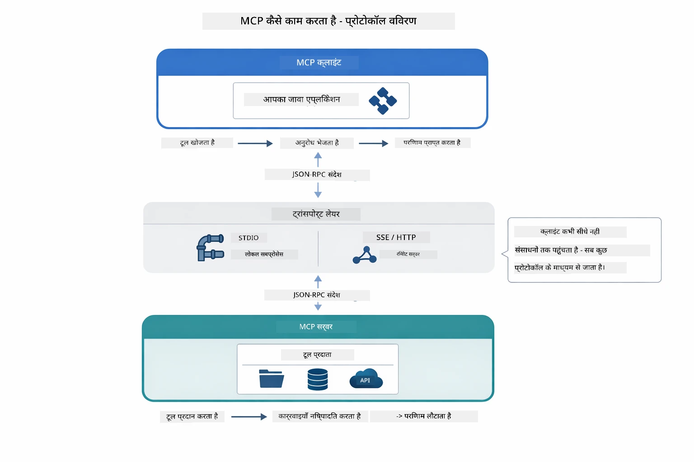

*MCP कैसे काम करता है—क्लाइंट टूल्स खोजते हैं, JSON-RPC संदेशों का आदान-प्रदान करते हैं, और ट्रांसपोर्ट लेयर के जरिए ऑपरेशंस निष्पादित करते हैं।*

**सर्वर-क्लाइंट आर्किटेक्चर**

MCP क्लाइंट-सर्वर मॉडल का उपयोग करता है। सर्वर टूल्स प्रदान करते हैं — फ़ाइल पढ़ना, डेटाबेस क्वेरी करना, APIs कॉल करना। क्लाइंट्स (आपका AI एप्लिकेशन) सर्वर से जुड़ते हैं और उनके टूल्स का उपयोग करते हैं।

LangChain4j के साथ MCP उपयोग करने के लिए, यह Maven डिपेंडेंसी जोड़ें:

```xml
<dependency>
    <groupId>dev.langchain4j</groupId>
    <artifactId>langchain4j-mcp</artifactId>
    <version>${langchain4j.version}</version>
</dependency>
```


**टूल डिस्कवरी**

जब आपका क्लाइंट MCP सर्वर से जुड़ता है, तो वह पूछता है "आपके पास कौन-कौन से टूल्स हैं?" सर्वर उपलब्ध टूल्स की सूची भेजता है, प्रत्येक के विवरण और पैरामीटर स्कीमास के साथ। आपका AI एजेंट तब उपयोगकर्ता के अनुरोध के आधार पर कौन से टूल्स उपयोग करना है, तय कर सकता है। नीचे आरेख में यह हैंडशेक दिखाया गया है — क्लाइंट `tools/list` अनुरोध भेजता है और सर्वर उपलब्ध टूल्स विवरण और स्कीमास के साथ लौटाता है:

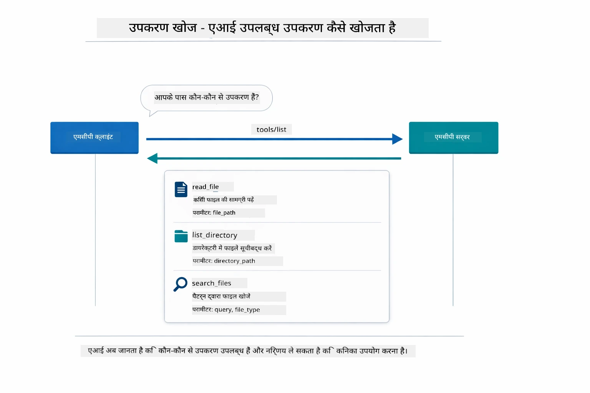

*AI स्टार्टअप पर उपलब्ध टूल्स का पता लगाता है — अब यह जानता है कि कौन-कौन सी क्षमताएँ उपलब्ध हैं और कौन से उपयोग करने हैं।*

**ट्रांसपोर्ट मेकैनिज्म**

MCP विभिन्न ट्रांसपोर्ट मेकैनिज्म का समर्थन करता है। दो विकल्प हैं Stdio (लोकल subprocess संचार के लिए) और Streamable HTTP (दूरस्थ सर्वरों के लिए)। इस मॉड्यूल में Stdio ट्रांसपोर्ट दिखाया गया है:


*MCP ट्रांसपोर्ट मेकैनिज्म: दूरस्थ सर्वरों के लिए HTTP, स्थानीय प्रोसेस के लिए Stdio*

**Stdio** - [StdioTransportDemo.java](../../../05-mcp/src/main/java/com/example/langchain4j/mcp/StdioTransportDemo.java)

स्थानीय प्रक्रियाओं के लिए। आपका एप्लिकेशन एक सर्वर subprocess के रूप में स्पॉन करता है और स्टैण्डर्ड इनपुट/आउटपुट के जरिए संचार करता है। फ़ाइल सिस्टम एक्सेस या कमांड-लाइन टूल्स के लिए उपयोगी।

```java
McpTransport stdioTransport = new StdioMcpTransport.Builder()
    .command(List.of(
        npmCmd, "exec",
        "@modelcontextprotocol/server-filesystem@2025.12.18",
        resourcesDir
    ))
    .logEvents(false)
    .build();
```


`@modelcontextprotocol/server-filesystem` सर्वर निम्नलिखित टूल्स एक्सपोज़ करता है, सभी निर्दिष्ट डायरेक्टरीज तक सैंडबॉक्स्ड:

| टूल | विवरण |
|------|-------------|
| `read_file` | एक फ़ाइल की सामग्री पढ़ें |
| `read_multiple_files` | एक कॉल में कई फ़ाइलें पढ़ें |
| `write_file` | फ़ाइल बनाएं या ओवरराइट करें |
| `edit_file` | टारगेटेड फाइंड-एंड-रिप्लेस संपादन करें |
| `list_directory` | पथ पर फाइलें और डायरेक्टरीज सूचीबद्ध करें |
| `search_files` | पैटर्न से मेल खाने वाली फाइलों की रिकर्सिव खोज |
| `get_file_info` | फ़ाइल मेटाडेटा प्राप्त करें (आकार, टाइमस्टैम्प, अनुमतियाँ) |
| `create_directory` | डायरेक्टरी बनाएं (पैरेंट डायरेक्टरीज सहित) |
| `move_file` | फ़ाइल या डायरेक्टरी को स्थानांतरित या नाम बदलें |

नीचे आरेख दिखाता है कि Stdio ट्रांसपोर्ट रनटाइम पर कैसे काम करता है — आपका Java एप्लिकेशन MCP सर्वर को चाइल्ड प्रोसेस के रूप में स्पॉन करता है और वे stdin/stdout पाइप्स के माध्यम से संचार करते हैं, नेटवर्क या HTTP शामिल नहीं होता:

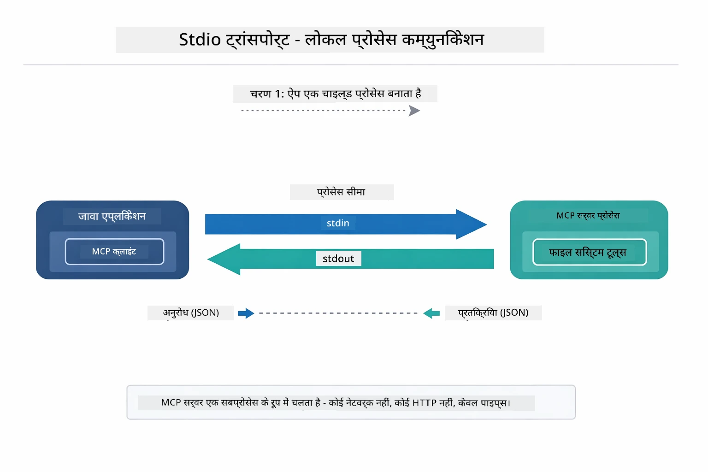

*Stdio ट्रांसपोर्ट सक्रिय — आपका एप्लिकेशन MCP सर्वर को चाइल्ड प्रोसेस के रूप में स्पॉन करता है और stdin/stdout पाइप्स के माध्यम से संवाद करता है।*

> **🤖 [GitHub Copilot](https://github.com/features/copilot) चैट के साथ प्रयास करें:** खोलें [`StdioTransportDemo.java`](../../../05-mcp/src/main/java/com/example/langchain4j/mcp/StdioTransportDemo.java) और पूछें:
> - "Stdio ट्रांसपोर्ट कैसे काम करता है और HTTP के मुकाबले कब उपयोग करना चाहिए?"
> - "LangChain4j स्पॉन किए गए MCP सर्वर प्रक्रियाओं के जीवनचक्र को कैसे प्रबंधित करता है?"
> - "AI को फ़ाइल सिस्टम की पहुंच देने के क्या सुरक्षा निहितार्थ हैं?"

## एजेंटिक मॉड्यूल

जबकि MCP मानकीकृत टूल प्रदान करता है, LangChain4j का **एजेंटिक मॉड्यूल** एजेंट बनाने का एक घोषणात्मक तरीका देता है जो उन टूल्स का समन्वय करता है। `@Agent` एनोटेशन और `AgenticServices` आपको एजेंट व्यवहार इंटरफेस के माध्यम से परिभाषित करने देते हैं बजाय इसके कि आप अनिवारीय कोड लिखें।

इस मॉड्यूल में, आप **सुपरवाइजर एजेंट** पैटर्न का पता लगाएंगे — यह एक उन्नत एजेंटिक AI दृष्टिकोण है जहाँ "सुपरवाइजर" एजेंट उपयोगकर्ता अनुरोध के आधार पर डायनामिक रूप से उप-एजेंट को कॉल करने का फैसला करता है। हम दोनों अवधारणाओं को मिलाकर अपने उप-एजेंट्स में से एक को MCP-संचालित फ़ाइल एक्सेस क्षमताएँ देंगे।

एजेंटिक मॉड्यूल उपयोग करने के लिए यह Maven डिपेंडेंसी जोड़ें:

```xml
<dependency>
    <groupId>dev.langchain4j</groupId>
    <artifactId>langchain4j-agentic</artifactId>
    <version>${langchain4j.mcp.version}</version>
</dependency>
```


> **सूचना:** `langchain4j-agentic` मॉड्यूल एक अलग संस्करण संपत्ति (`langchain4j.mcp.version`) का उपयोग करता है क्योंकि यह मुख्य LangChain4j लाइब्रेरी से अलग रिलीज़ चक्र पर है।

> **⚠️ परीक्षणात्मक:** `langchain4j-agentic` मॉड्यूल **परीक्षणात्मक** है और इसमें बदलाव हो सकते हैं। AI असिस्टेंट बनाने का स्थिर तरीका अभी भी `langchain4j-core` है कस्टम टूल्स के साथ (मॉड्यूल 04)।

## उदाहरण चलाना

### पूर्वापेक्षाएँ

- पूरा किया गया [मॉड्यूल 04 - टूल्स](../04-tools/README.md) (यह मॉड्यूल कस्टम टूल अवधारणाओं पर आधारित है और MCP टूल्स से तुलना करता है)
- रूट डायरेक्टरी में `.env` फ़ाइल जिसमें Azure प्रमाणपत्र हों (मॉड्यूल 01 में `azd up` द्वारा बनाई गई)
- Java 21+, Maven 3.9+
- Node.js 16+ और npm (MCP सर्वरों के लिए)

> **सूचना:** यदि आपने अभी तक अपने पर्यावरण चर सेट नहीं किए हैं, तो [मॉड्यूल 01 - परिचय](../01-introduction/README.md) देखें तैनाती निर्देशों के लिए (`azd up` स्वतः `.env` फ़ाइल बनाता है), या `.env.example` को रूट डायरेक्टरी में `.env` के रूप में कॉपी करें और अपनी मान भरें।

## त्वरित प्रारंभ

**VS Code का उपयोग करते हुए:** एक्सप्लोरर में किसी भी डेमो फ़ाइल पर राइट-क्लिक करें और **"Run Java"** चुनें, या रन और डिबग पैनल से लॉन्च कॉन्फ़िगरेशन का उपयोग करें (सुनिश्चित करें कि आपकी `.env` फ़ाइल पहले Azure क्रेडेंशियल के साथ कॉन्फ़िगर हो)।

**Maven का उपयोग करते हुए:** वैकल्पिक रूप से, आप कमांड लाइन से नीचे दिए गए उदाहरणों के साथ चला सकते हैं।

### फ़ाइल संचालन (Stdio)

यह स्थानीय subprocess-आधारित टूल्स का प्रदर्शन करता है।

**✅ कोई पूर्वापेक्षाएँ आवश्यक नहीं** - MCP सर्वर स्वचालित रूप से स्पॉन होता है।

**स्टार्ट स्क्रिप्ट्स का उपयोग (अनुशंसित):**

स्टार्ट स्क्रिप्ट्स स्वतः रूट `.env` फ़ाइल से पर्यावरण चर लोड करती हैं:

**Bash:**
```bash
cd 05-mcp
chmod +x start-stdio.sh
./start-stdio.sh
```

**PowerShell:**
```powershell
cd 05-mcp
.\start-stdio.ps1
```

**VS Code का उपयोग करते हुए:** `StdioTransportDemo.java` पर राइट-क्लिक करें और **"Run Java"** चुनें (सुनिश्चित करें कि आपकी `.env` फ़ाइल कॉन्फ़िगर है)।

एप्लिकेशन फ़ाइल सिस्टम MCP सर्वर को स्वचालित रूप से स्पॉन करता है और एक स्थानीय फ़ाइल पढ़ता है। देखें कैसे subprocess प्रबंधन आपके लिए संभाला गया है।

**अपेक्षित आउटपुट:**
```
Assistant response: The file provides an overview of LangChain4j, an open-source Java library
for integrating Large Language Models (LLMs) into Java applications...
```


### सुपरवाइजर एजेंट

**सुपरवाइजर एजेंट पैटर्न** एजेंटिक AI का एक **लचीला** रूप है। सुपरवाइजर उपयोगकर्ता के अनुरोध के आधार पर स्वायत्त रूप से तय करता है कि कौन से एजेंट कॉल करने हैं। अगले उदाहरण में, हम MCP-संचालित फ़ाइल एक्सेस को LLM एजेंट के साथ मिलाकर एक नियंत्रित फ़ाइल पढ़ने → रिपोर्ट वर्कफ़्लो बनाएंगे।

डेमो में, `FileAgent` MCP फ़ाइल सिस्टम टूल्स का उपयोग करके एक फ़ाइल पढ़ता है, और `ReportAgent` एक संरचित रिपोर्ट बनाता है जिसमें एक कार्यकारी सारांश (1 वाक्य), 3 मुख्य बिंदु, और सिफारिशें होती हैं। सुपरवाइजर स्वतः इस प्रवाह का समन्वय करता है:

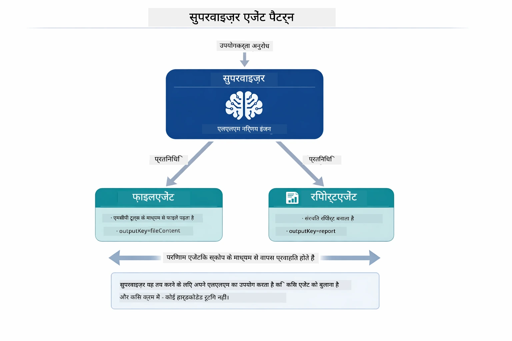

*सुपरवाइजर अपने LLM का उपयोग करता है यह तय करने के लिए कि कौन से एजेंट कॉल करना है और किस क्रम में — कोई हार्डकोडेड रूटिंग आवश्यक नहीं।*

हमारे फ़ाइल-से-रिपोर्ट पाइपलाइन के लिए ठोस कार्यप्रवाह कुछ ऐसा दिखता है:

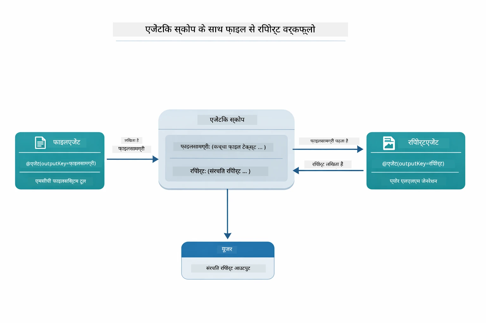

*FileAgent MCP टूल्स के माध्यम से फ़ाइल पढ़ता है, फिर ReportAgent कच्ची सामग्री को संरचित रिपोर्ट में बदलता है।*

निम्न अनुक्रम चित्र पूरे सुपरवाइजर समन्वय को ट्रैक करता है — MCP सर्वर स्पॉन करना, सुपरवाइजर की स्वायत्त एजेंट चयन, स्टडिओ के माध्यम से टूल कॉल और अंतिम रिपोर्ट:

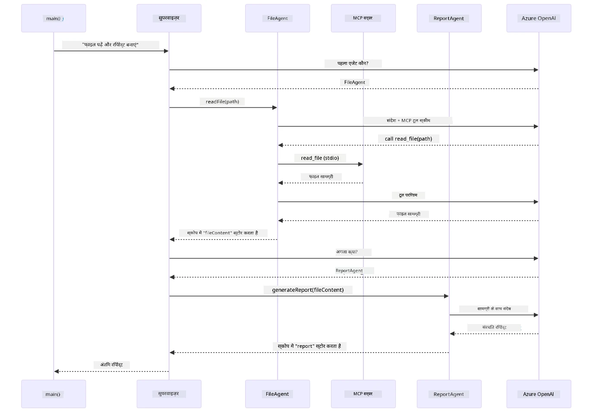

*सुपरवाइजर स्वायत्त रूप से FileAgent को कॉल करता है (जो स्टडिओ पर MCP सर्वर से फ़ाइल पढ़ता है), फिर ReportAgent को एक संरचित रिपोर्ट बनाने के लिए बुलाता है — प्रत्येक एजेंट अपना आउटपुट साझा Agentic Scope में संग्रहित करता है।*

प्रत्येक एजेंट अपना आउटपुट **Agentic Scope** (साझा मेमोरी) में संग्रहित करता है, जो नीचे के एजेंटों को पिछले परिणामों तक पहुंचने की अनुमति देता है। यह दिखाता है कि MCP टूल कैसे एजेंटिक वर्कफ़्लोज़ में सहज रूप से एकीकृत होते हैं — सुपरवाइजर को यह जानने की जरूरत नहीं कि फ़ाइलें कैसे पढ़ी जाती हैं, केवल यह कि `FileAgent` ऐसा कर सकता है।

#### डेमो चलाना

स्टार्ट स्क्रिप्ट्स स्वतः रूट `.env` फ़ाइल से पर्यावरण चर लोड करती हैं:

**Bash:**
```bash
cd 05-mcp
chmod +x start-supervisor.sh
./start-supervisor.sh
```

**PowerShell:**
```powershell
cd 05-mcp
.\start-supervisor.ps1
```

**VS Code का उपयोग करते हुए:** `SupervisorAgentDemo.java` पर राइट-क्लिक करें और **"Run Java"** चुनें (सुनिश्चित करें कि आपकी `.env` फ़ाइल कॉन्फ़िगर है)।

#### सुपरवाइजर कैसे काम करता है

एजेंट बनाने से पहले, आपको MCP ट्रांसपोर्ट को क्लाइंट से कनेक्ट करना होता है और इसे `ToolProvider` के रूप में रैप करना होता है। इससे MCP सर्वर के टूल्स आपके एजेंट्स के लिए उपलब्ध हो जाते हैं:

```java
// ट्रांसपोर्ट से एक MCP क्लाइंट बनाएं
McpClient mcpClient = new DefaultMcpClient.Builder()
        .transport(stdioTransport)
        .build();

// क्लाइंट को एक ToolProvider के रूप में लपेटें — यह MCP टूल्स को LangChain4j में जोड़ता है
ToolProvider mcpToolProvider = McpToolProvider.builder()
        .mcpClients(List.of(mcpClient))
        .build();
```


अब आप `mcpToolProvider` को किसी भी ऐसे एजेंट में इंजेक्ट कर सकते हैं जिसे MCP टूल्स चाहिए:

```java
// चरण 1: FileAgent MCP उपकरणों का उपयोग करके फाइलें पढ़ता है
FileAgent fileAgent = AgenticServices.agentBuilder(FileAgent.class)
        .chatModel(model)
        .toolProvider(mcpToolProvider)  // फाइल ऑपरेशंस के लिए MCP उपकरण हैं
        .build();

// चरण 2: ReportAgent संरचित रिपोर्टें बनाता है
ReportAgent reportAgent = AgenticServices.agentBuilder(ReportAgent.class)
        .chatModel(model)
        .build();

// Supervisor फाइल → रिपोर्ट वर्कफ़्लो का संचालन करता है
SupervisorAgent supervisor = AgenticServices.supervisorBuilder()
        .chatModel(model)
        .subAgents(fileAgent, reportAgent)
        .responseStrategy(SupervisorResponseStrategy.LAST)  // अंतिम रिपोर्ट लौटाएं
        .build();

// अनुरोध के आधार पर Supervisor यह तय करता है कि किन एजेंट्स को बुलाना है
String response = supervisor.invoke("Read the file at /path/file.txt and generate a report");
```


#### FileAgent रनटाइम पर MCP टूल कैसे खोजता है

आप सोच रहे होंगे: **FileAgent को npm फ़ाइल सिस्टम टूल्स का उपयोग करना कैसे पता चलता है?** जवाब है कि उसे पता नहीं होता — **LLM** रनटाइम पर टूल स्कीमास के माध्यम से इसे समझ लेता है।

`FileAgent` इंटरफेस केवल एक **प्रॉम्प्ट परिभाषा** है। इसमें `read_file`, `list_directory`, या किसी अन्य MCP टूल का हार्डकोडेड ज्ञान नहीं है। यहाँ अंत तक क्या होता है:
1. **सर्वर जनरेट करता है:** `StdioMcpTransport` `@modelcontextprotocol/server-filesystem` npm पैकेज को एक चाइल्ड प्रोसेस के रूप में लॉन्च करता है  
2. **टूल खोज:** `McpClient` सर्वर को `tools/list` JSON-RPC अनुरोध भेजता है, जो टूल नाम, विवरण, और पैरामीटर स्कीमास (जैसे, `read_file` — *"एक फ़ाइल की पूरी सामग्री पढ़ें"* — `{ path: string }`) के साथ उत्तर देता है  
3. **स्कीमा इंजेक्शन:** `McpToolProvider` इन खोजे गए स्कीमास को लैंगचेन4जे के लिए उपलब्ध कराता है  
4. **LLM निर्णय लेता है:** जब `FileAgent.readFile(path)` कॉल किया जाता है, तो LangChain4j सिस्टम संदेश, उपयोगकर्ता संदेश, **और टूल स्कीमास की सूची** LLM को भेजता है। LLM टूल विवरण पढ़ता है और एक टूल कॉल जनरेट करता है (जैसे, `read_file(path="/some/file.txt")`)  
5. **निष्पादन:** LangChain4j टूल कॉल को इंटरसेप्ट करता है, इसे MCP क्लाइंट के माध्यम से Node.js सबप्रोसेस पर भेजता है, परिणाम प्राप्त करता है, और इसे LLM को वापस फीड करता है  

यह वही [टूल खोज](../../../05-mcp) तंत्र है जिसका ऊपर वर्णन किया गया है, लेकिन यह विशेष रूप से एजेंट वर्कफ़्लो पर लागू होता है। `@SystemMessage` और `@UserMessage` एनोटेशन LLM के व्यवहार का मार्गदर्शन करते हैं, जबकि इंजेक्शन किया गया `ToolProvider` इसे **कुशलताएं** देता है — LLM रनटाइम पर दोनों के बीच पुल बनाता है।  

> **🤖 [GitHub Copilot](https://github.com/features/copilot) चैट के साथ प्रयास करें:** [`FileAgent.java`](../../../05-mcp/src/main/java/com/example/langchain4j/mcp/agents/FileAgent.java) खोलें और पूछें:  
> - "यह एजेंट किस MCP टूल को कॉल करना जानता है?"  
> - "अगर मैं एजेंट बिल्डर से ToolProvider हटा दूं तो क्या होगा?"  
> - "टूल स्कीमास LLM को कैसे पास होते हैं?"  

#### प्रतिक्रिया रणनीतियाँ  

जब आप `SupervisorAgent` कॉन्फ़िगर करते हैं, तो आप यह निर्दिष्ट करते हैं कि उप-एजेंट के कार्य पूर्ण करने के बाद इसे अंतिम उत्तर कैसे फ़ॉर्म्युलेट करना चाहिए। नीचे दिया गया डायग्राम तीन उपलब्ध रणनीतियाँ दिखाता है — LAST अंतिम एजेंट का आउटपुट सीधे लौटाता है, SUMMARY सभी आउटपुट को LLM के माध्यम से संश्लेषित करता है, और SCORED मूल अनुरोध के विरुद्ध अधिक स्कोर प्राप्त करने वाले विकल्प को चुनता है:  

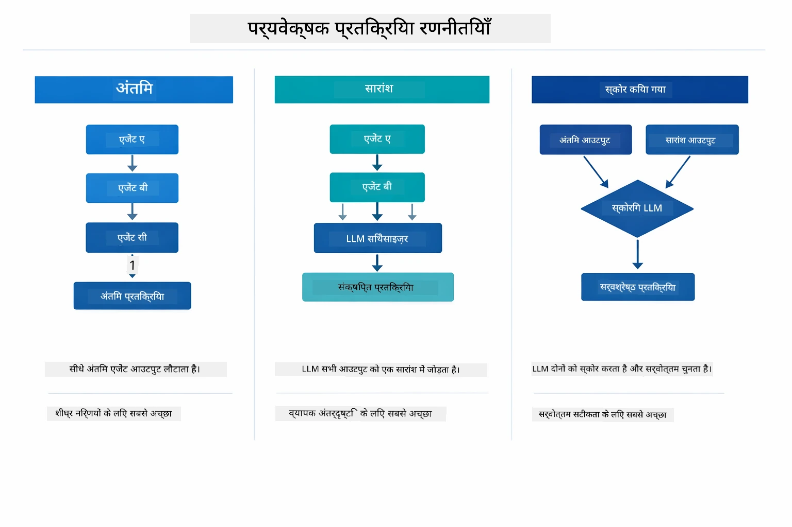  

*तीन रणनीतियाँ कि सुपरवाइजर अंतिम प्रतिक्रिया को कैसे फ़ॉर्म्युलेट करता है — चुनें कि आपको अंतिम एजेंट का आउटपुट चाहिए, संश्लेषित सारांश चाहिए, या सर्वोत्तम स्कोर वाला विकल्प।*  

उपलब्ध रणनीतियाँ हैं:  

| रणनीति | विवरण |  
|----------|-------------|  
| **LAST** | सुपरवाइजर अंतिम उप-एजेंट या टूल द्वारा कॉल किए गए आउटपुट को लौटाता है। यह तब उपयोगी है जब वर्कफ़्लो में अंतिम एजेंट विशेष रूप से पूर्ण, अंतिम उत्तर प्रदान करने के लिए डिज़ाइन किया गया हो (जैसे, अनुसंधान पाइपलाइन में "सारांश एजेंट")। |  
| **SUMMARY** | सुपरवाइजर अपने आंतरिक भाषा मॉडल (LLM) का उपयोग पूरे इंटरैक्शन और सभी उप-एजेंट आउटपुट का संश्लेषण करने के लिए करता है, फिर उस सारांश को अंतिम प्रतिक्रिया के रूप में लौटाता है। यह उपयोगकर्ता को एक साफ़, समेकित उत्तर प्रदान करता है। |  
| **SCORED** | प्रणाली एक आंतरिक LLM का उपयोग करते हुए LAST प्रतिक्रिया और SUMMARY दोनों को मूल उपयोगकर्ता अनुरोध के विरुद्ध स्कोर करती है, और जो भी आउटपुट उच्चतर स्कोर प्राप्त करता है उसे लौटाती है। |  

पूर्ण कार्यान्वयन के लिए [SupervisorAgentDemo.java](../../../05-mcp/src/main/java/com/example/langchain4j/mcp/SupervisorAgentDemo.java) देखें।  

> **🤖 [GitHub Copilot](https://github.com/features/copilot) चैट के साथ प्रयास करें:** [`SupervisorAgentDemo.java`](../../../05-mcp/src/main/java/com/example/langchain4j/mcp/SupervisorAgentDemo.java) खोलें और पूछें:  
> - "सुपरवाइजर यह कैसे तय करता है कि कौन से एजेंट को सक्रिय करना है?"  
> - "सुपरवाइजर और सेक्वेंशियल वर्कफ़्लो पैटर्न में क्या अंतर है?"  
> - "सुपरवाइजर की योजना बनाने के व्यवहार को मैं कैसे कस्टमाइज़ कर सकता हूँ?"  

#### आउटपुट को समझना  

जब आप डेमो चलाते हैं, तो आप देखेंगे कि सुपरवाइजर कैसे कई एजेंटों का समन्वय करता है। यहाँ प्रत्येक अनुभाग का अर्थ है:  

```
======================================================================
  FILE → REPORT WORKFLOW DEMO
======================================================================

This demo shows a clear 2-step workflow: read a file, then generate a report.
The Supervisor orchestrates the agents automatically based on the request.
```
  
**हेडर** वर्कफ़्लो अवधारणा का परिचय देता है: फ़ाइल पढ़ने से रिपोर्ट जनरेशन तक केंद्रित पाइपलाइन।  

```
--- WORKFLOW ---------------------------------------------------------
  ┌─────────────┐      ┌──────────────┐
  │  FileAgent  │ ───▶ │ ReportAgent  │
  │ (MCP tools) │      │  (pure LLM)  │
  └─────────────┘      └──────────────┘
   outputKey:           outputKey:
   'fileContent'        'report'

--- AVAILABLE AGENTS -------------------------------------------------
  [FILE]   FileAgent   - Reads files via MCP → stores in 'fileContent'
  [REPORT] ReportAgent - Generates structured report → stores in 'report'
```
  
**वर्कफ़्लो डायग्राम** एजेंटों के बीच डेटा फ्लो दिखाता है। प्रत्येक एजेंट की विशिष्ट भूमिका है:  
- **FileAgent** MCP टूल्स का उपयोग करके फ़ाइलें पढ़ता है और कच्ची सामग्री `fileContent` में स्टोर करता है  
- **ReportAgent** उस सामग्री का उपभोग करता है और संरचित रिपोर्ट `report` में बनाता है  

```
--- USER REQUEST -----------------------------------------------------
  "Read the file at .../file.txt and generate a report on its contents"
```
  
**उपयोगकर्ता अनुरोध** कार्य दिखाता है। सुपरवाइजर इसे पार्स करता है और FileAgent → ReportAgent को बुलाने का निर्णय लेता है।  

```
--- SUPERVISOR ORCHESTRATION -----------------------------------------
  The Supervisor decides which agents to invoke and passes data between them...

  +-- STEP 1: Supervisor chose -> FileAgent (reading file via MCP)
  |
  |   Input: .../file.txt
  |
  |   Result: LangChain4j is an open-source, provider-agnostic Java framework for building LLM...
  +-- [OK] FileAgent (reading file via MCP) completed

  +-- STEP 2: Supervisor chose -> ReportAgent (generating structured report)
  |
  |   Input: LangChain4j is an open-source, provider-agnostic Java framew...
  |
  |   Result: Executive Summary...
  +-- [OK] ReportAgent (generating structured report) completed
```
  
**सुपरवाइजर संचालन** 2-चरणीय प्रक्रिया दिखाता है:  
1. **FileAgent** MCP के माध्यम से फ़ाइल पढ़ता है और सामग्री स्टोर करता है  
2. **ReportAgent** सामग्री प्राप्त करता है और संरचित रिपोर्ट बनाता है  

सुपरवाइजर ने यह निर्णय **स्वायत्त रूप से** उपयोगकर्ता के अनुरोध के आधार पर लिया।  

```
--- FINAL RESPONSE ---------------------------------------------------
Executive Summary
...

Key Points
...

Recommendations
...

--- AGENTIC SCOPE (Data Flow) ----------------------------------------
  Each agent stores its output for downstream agents to consume:
  * fileContent: LangChain4j is an open-source, provider-agnostic Java framework...
  * report: Executive Summary...
```
  
#### एजेंटिक मॉड्यूल विशेषताओं की व्याख्या  

उदाहरण एजेंटिक मॉड्यूल की कई उन्नत विशेषताओं को दिखाता है। आइए एजेंटिक स्कोप और एजेंट लिसनर्स पर करीब से नज़र डालें।  

**Agentic Scope** साझा मेमोरी दिखाता है जहाँ एजेंटों ने `@Agent(outputKey="...")` का उपयोग करके अपने परिणाम संग्रहीत किए। इससे ये लाभ होते हैं:  
- बाद के एजेंट पहले एजेंटों के आउटपुट तक पहुंच सकते हैं  
- सुपरवाइजर अंतिम प्रतिक्रिया संश्लेषित कर सकता है  
- आप देख सकते हैं कि प्रत्येक एजेंट ने क्या उत्पादन किया  

नीचे का डायग्राम दिखाता है कि एजेंटिक स्कोप फाइल-टू-रिपोर्ट वर्कफ़्लो में साझा मेमोरी के रूप में कैसे काम करता है — FileAgent अपने आउटपुट `fileContent` की कुंजी के अंतर्गत लिखता है, ReportAgent इसे पढ़ता है और अपना आउटपुट `report` की कुंजी के अंतर्गत लिखता है:  

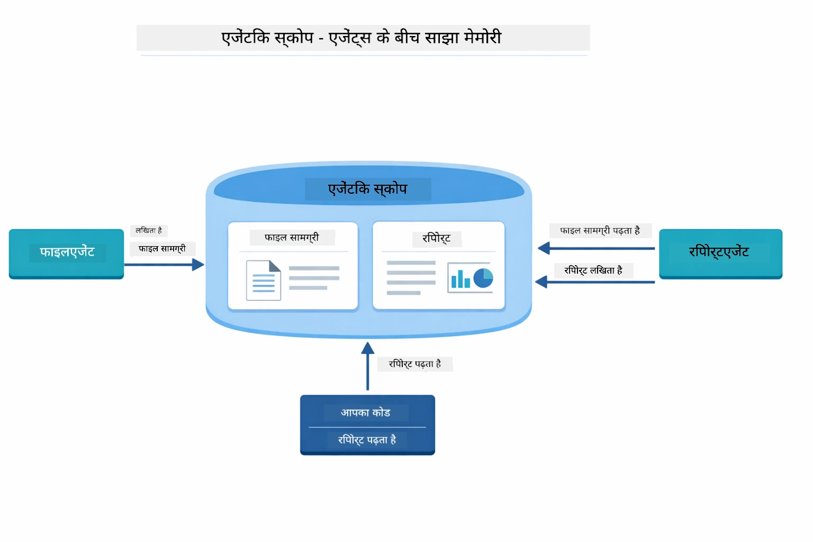  

*Agentic Scope साझा मेमोरी के रूप में कार्य करता है — FileAgent `fileContent` लिखता है, ReportAgent इसे पढ़ता है और `report` लिखता है, और आपका कोड अंतिम परिणाम पढ़ता है।*  

```java
ResultWithAgenticScope<String> result = supervisor.invokeWithAgenticScope(request);
AgenticScope scope = result.agenticScope();
String fileContent = scope.readState("fileContent");  // FileAgent से कच्चा फ़ाइल डेटा
String report = scope.readState("report");            // ReportAgent से संरचित रिपोर्ट
```
  
**Agent Listeners** एजेंट निष्पादन की निगरानी और डिबगिंग सक्षम करते हैं। डेमो में जो चरण-दर-चरण आउटपुट आप देखते हैं वह हर एजेंट कॉल पर हुक किए गए AgentListener से आता है:  
- **beforeAgentInvocation** - उस समय कॉल किया जाता है जब सुपरवाइजर एजेंट चुनता है, जिससे आप देख सकते हैं कि कौन सा एजेंट क्यों चुना गया  
- **afterAgentInvocation** - एक एजेंट पूरा होने पर कॉल किया जाता है, इसका परिणाम दिखाता है  
- **inheritedBySubagents** - जब true होता है, यह लिसनर हायरेरकी के सभी एजेंटों की निगरानी करता है  

नीचे दिया गया डायग्राम पूर्ण एजेंट लिसनर जीवनचक्र दिखाता है, जिसमें `onError` एजेंट निष्पादन के दौरान त्रुटियों को कैसे संभालता है शामिल है:  

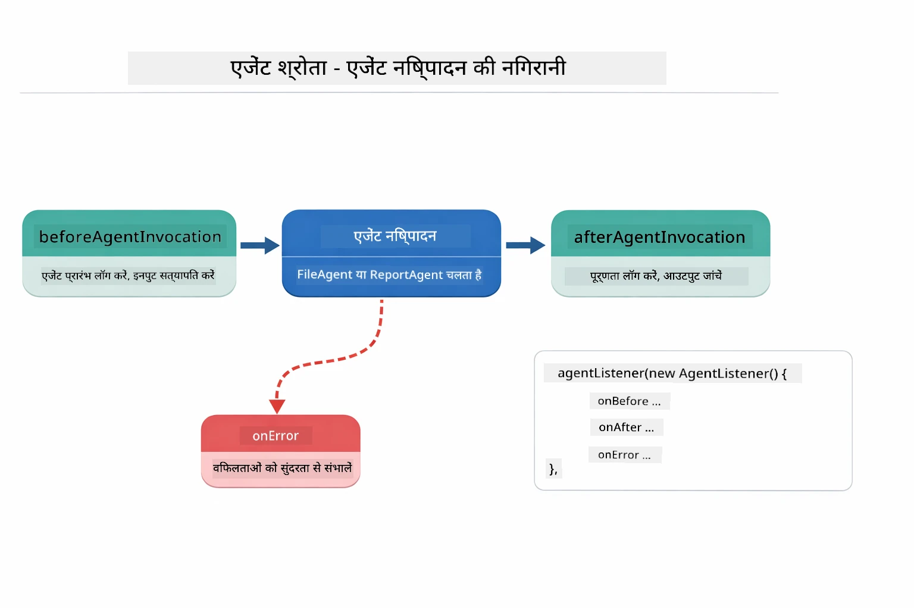  

*Agent Listeners निष्पादन जीवनचक्र में हुक करते हैं — एजेंटों के शुरू होने, पूरा होने, या त्रुटियों का सामना करने पर निगरानी।*  

```java
AgentListener monitor = new AgentListener() {
    private int step = 0;
    
    @Override
    public void beforeAgentInvocation(AgentRequest request) {
        step++;
        System.out.println("  +-- STEP " + step + ": " + request.agentName());
    }
    
    @Override
    public void afterAgentInvocation(AgentResponse response) {
        System.out.println("  +-- [OK] " + response.agentName() + " completed");
    }
    
    @Override
    public boolean inheritedBySubagents() {
        return true; // सभी उप-एजेंटों तक प्रसारित करें
    }
};
```
  
सुपरवाइजर पैटर्न के अलावा, `langchain4j-agentic` मॉड्यूल कई शक्तिशाली वर्कफ़्लो पैटर्न प्रदान करता है। नीचे दिया गया डायग्राम सभी पांच दिखाता है — सरल अनुक्रमिक पाइपलाइनों से लेकर ह्यूमन-इन-द-लूप अनुमोदन वर्कफ़्लोज़ तक:  

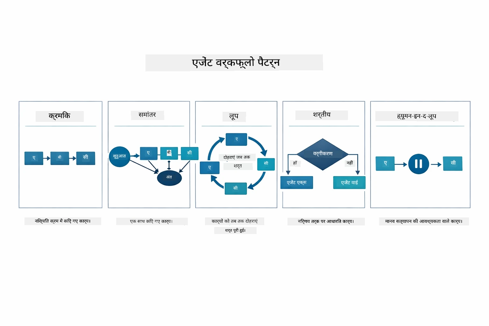  

*एजेंटों के समन्वय के लिए पाँच वर्कफ़्लो पैटर्न — सरल अनुक्रमिक पाइपलाइनों से लेकर ह्यूमन-इन-द-लूप अनुमोदन वर्कफ़्लोज़ तक।*  

| पैटर्न | विवरण | उपयोग केस |  
|---------|-------------|----------|  
| **Sequential** | एजेंटों को क्रम में निष्पादित करें, आउटपुट अगले में प्रवाहित होता है | पाइपलाइन: रिसर्च → विश्लेषण → रिपोर्ट |  
| **Parallel** | एजेंटों को एक साथ चलाएं | स्वतंत्र कार्य: मौसम + समाचार + स्टॉक्स |  
| **Loop** | तब तक पुनरावृत्त करें जब तक शर्त पूरी न हो | गुणवत्ता स्कोरिंग: तब तक सुधारें जब तक स्कोर ≥ 0.8 न हो |  
| **Conditional** | शर्तों के आधार पर मार्गदर्शन करें | वर्गीकरण → विशेषज्ञ एजेंट को मार्गदर्शन |  
| **Human-in-the-Loop** | मानवीय चेकपॉइंट जोड़ें | अनुमोदन वर्कफ़्लोज़, सामग्री समीक्षा |  

## मुख्य अवधारणाएँ  

अब जब आपने MCP और एजेंटिक मॉड्यूल का परीक्षण किया है, तो आइए सारांश करें कि प्रत्येक दृष्टिकोण कब उपयोग करना चाहिए।  

MCP का एक बड़ा लाभ इसका बढ़ता हुआ पारिस्थितिकी तंत्र है। नीचे का डायग्राम दिखाता है कि एक सार्वभौमिक प्रोटोकॉल कैसे आपके AI एप्लिकेशन को विभिन्न MCP सर्वरों से जोड़ता है — फाइल सिस्टम और डेटाबेस एक्सेस से लेकर GitHub, ईमेल, वेब स्क्रैपिंग, और अधिक तक:  

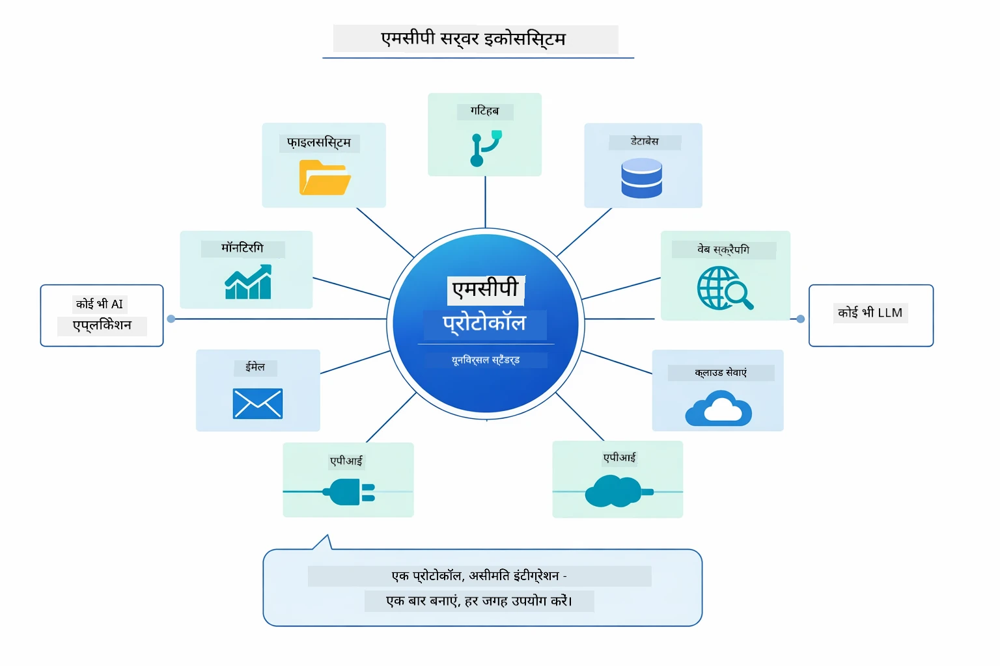  

*MCP एक सार्वभौमिक प्रोटोकॉल पारिस्थितिकी तंत्र बनाता है — कोई भी MCP-अनुकूल सर्वर किसी भी MCP-अनुकूल क्लाइंट के साथ काम करता है, जिससे टूल साझा करना आसान हो जाता है।*  

**MCP** तब आदर्श है जब आप मौजूदा टूल पारिस्थितिक तंत्रों का लाभ उठाना चाहते हैं, ऐसे टूल बनाना चाहते हैं जिन्हें कई एप्लिकेशन साझा कर सकें, थर्ड-पार्टी सेवाओं को मानक प्रोटोकॉल के साथ इंटीग्रेट करना चाहते हैं, या कोड बदले बिना टूल कार्यान्वयन बदलना चाहते हैं।  

**एजेंटिक मॉड्यूल** तब सबसे अच्छा काम करता है जब आप घोषितात्मक एजेंट परिभाषाएं `@Agent` एनोटेशन के साथ चाहते हैं, वर्कफ़्लो समन्वय (अनुक्रमिक, लूप, समानांतर) की जरूरत होती है, आप इंटरफ़ेस-आधारित एजेंट डिज़ाइन पसंद करते हैं बजाय अमान्य कोड के, या आप कई एजेंटों का संयोजन कर रहे हैं जो `outputKey` के माध्यम से आउटपुट साझा करते हैं।  

**सुपरवाइजर एजेंट पैटर्न** तब चमकता है जब वर्कफ़्लो पूर्वानुमानित नहीं होता और आप LLM को निर्णय लेना चाहते हैं, जब आपके पास कई विशेषज्ञ एजेंट होते हैं जिन्हें गतिशील समन्वय की आवश्यकता होती है, जब आप बातचीत प्रणालियाँ बना रहे होते हैं जो विभिन्न क्षमताओं के लिए मार्गदर्शन करती हैं, या जब आप सबसे लचीला, अनुकूल एजेंट व्यवहार चाहते हैं।  

अपने निर्णय में मदद के लिए, कस्टम `@Tool` मेथड्स (मॉड्यूल 04 से) और MCP टूल्स (इस मॉड्यूल से) के बीच तुलना मुख्य अंतर को उजागर करती है — कस्टम टूल आपको ऐप-विशिष्ट लॉजिक के लिए मजबूत टाइप सुरक्षा देते हैं, जबकि MCP टूल मानकीकृत, पुन: उपयोग योग्य इंटीग्रेशन प्रदान करते हैं:  

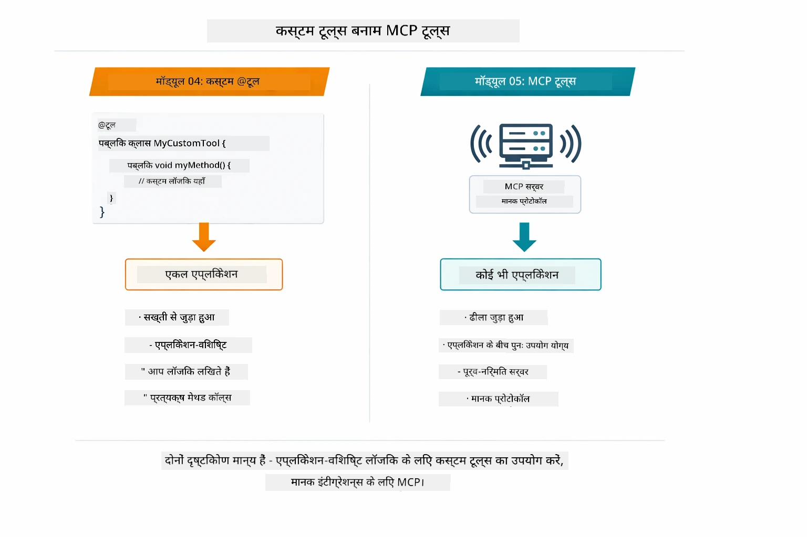  

*कब कस्टम @Tool मेथड्स और कब MCP टूल्स का उपयोग करें — ऐप-विशेष लॉजिक के लिए पूर्ण टाइप सुरक्षा के साथ कस्टम टूल्स, व्यापक ऐप्स में काम करने वाले मानकीकृत इंटीग्रेशन के लिए MCP टूल्स।*  

## बधाई हो!  

आपने LangChain4j for Beginners कोर्स के सभी पाँच मॉड्यूल पूरे कर लिए हैं! यहाँ आपके पूरे सीखने के सफर का एक नजरिया है — बेसिक चैट से लेकर MCP-समर्थित एजेंटिक सिस्टम तक:  

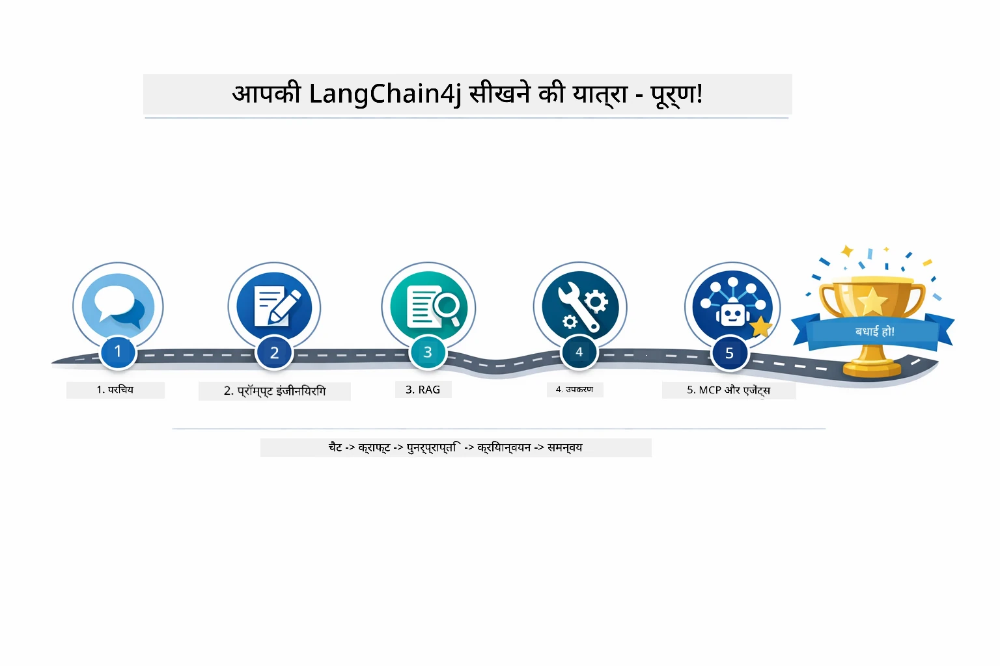  

*आपकी सीखने की यात्रा पांचों मॉड्यूल के माध्यम से — बेसिक चैट से MCP-समर्थित एजेंटिक सिस्टम तक।*  

आपने LangChain4j for Beginners कोर्स पूरा कर लिया है। आपने सीखा:  

- याददाश्त के साथ बातचीत एआई कैसे बनाएं (मॉड्यूल 01)  
- विभिन्न कार्यों के लिए प्रॉम्प्ट इंजीनियरिंग पैटर्न (मॉड्यूल 02)  
- अपने दस्तावेज़ों में उत्तरों को संभावित बनाने के लिए RAG (मॉड्यूल 03)  
- कस्टम टूल्स के साथ बेसिक AI एजेंट बनाना (मॉड्यूल 04)  
- LangChain4j MCP और Agentic मॉड्यूल के साथ मानकीकृत टूल्स का एकीकरण (मॉड्यूल 05)  

### आगे क्या?  

मॉड्यूल पूरा करने के बाद, [Testing Guide](../docs/TESTING.md) देखें ताकि आप LangChain4j परीक्षण अवधारणाओं को वास्तविक में देख सकें।  

**आधिकारिक संसाधन:**  
- [LangChain4j डाक्यूमेंटेशन](https://docs.langchain4j.dev/) — व्यापक गाइड और API संदर्भ  
- [LangChain4j GitHub](https://github.com/langchain4j/langchain4j) — स्रोत कोड और उदाहरण  
- [LangChain4j ट्यूटोरियल](https://docs.langchain4j.dev/tutorials/) — विभिन्न उपयोग मामलों के लिए चरण-दर-चरण ट्यूटोरियल  

इस कोर्स को पूरा करने के लिए धन्यवाद!  

---  

**नेविगेशन:** [← पिछला: मॉड्यूल 04 - टूल्स](../04-tools/README.md) | [मुख्य पृष्ठ पर वापस जाएं](../README.md)

---

<!-- CO-OP TRANSLATOR DISCLAIMER START -->
**अस्वीकरण**:  
यह दस्तावेज़ AI अनुवाद सेवा [Co-op Translator](https://github.com/Azure/co-op-translator) का उपयोग करके अनुवादित किया गया है। हम सटीकता के लिए प्रयासरत हैं, कृपया ध्यान दें कि स्वचालित अनुवाद में त्रुटियाँ या गलतियाँ हो सकती हैं। मूल दस्तावेज़ अपनी मूल भाषा में ही आधिकारिक स्रोत माना जाना चाहिए। महत्वपूर्ण जानकारी के लिए पेशेवर मानवीय अनुवाद की अनुशंसा की जाती है। इस अनुवाद के उपयोग से उत्पन्न किसी भी गलतफहमी या व्याख्या हेतु हम उत्तरदायी नहीं हैं।
<!-- CO-OP TRANSLATOR DISCLAIMER END -->