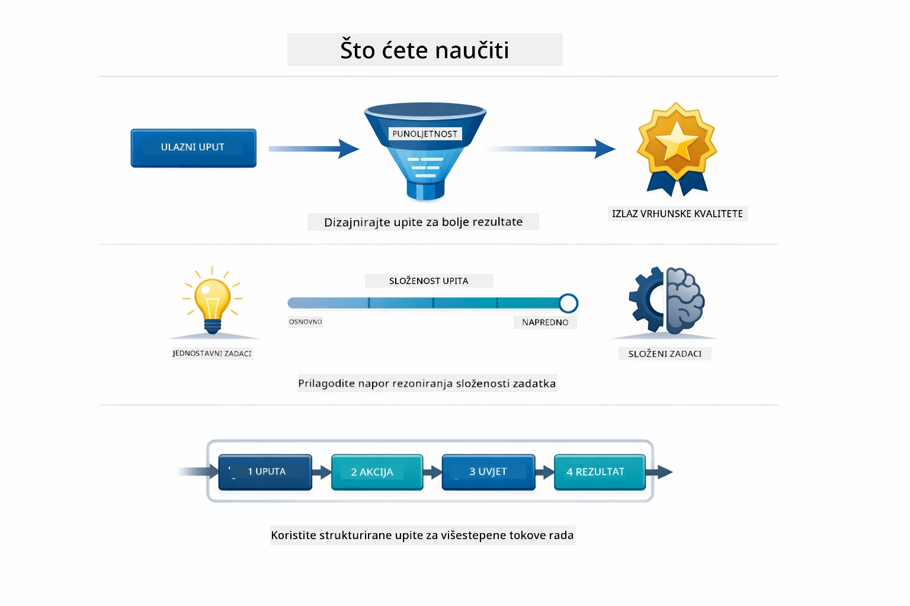
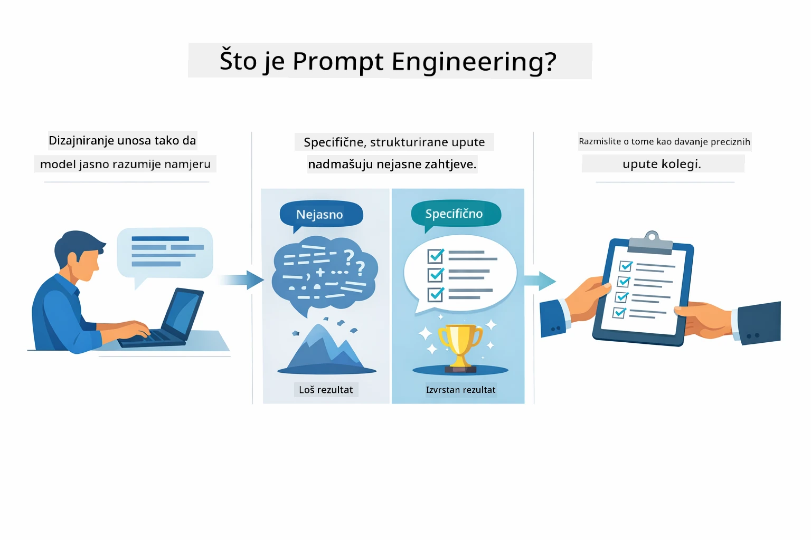
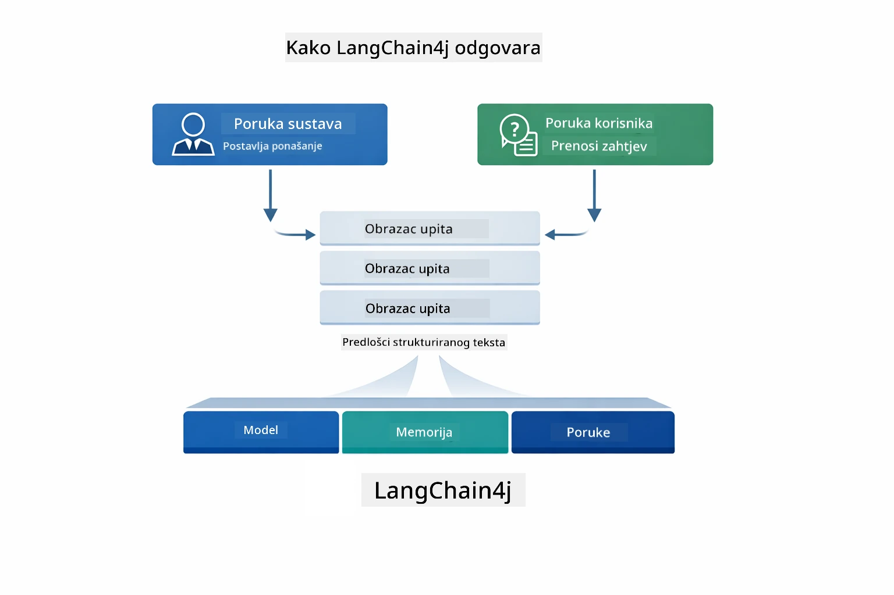
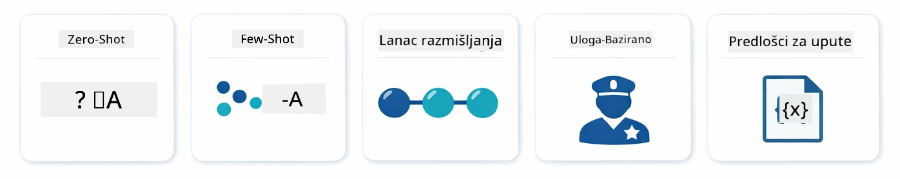
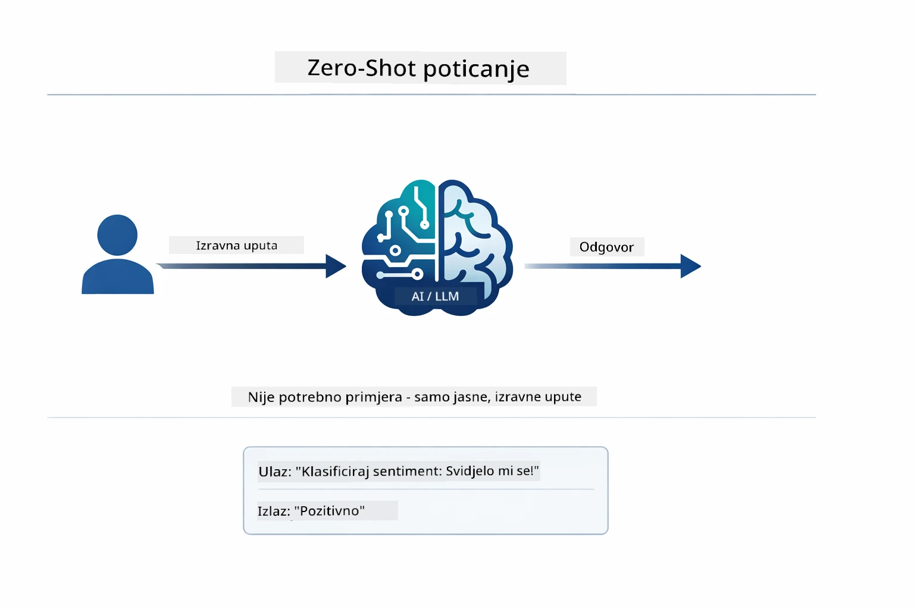
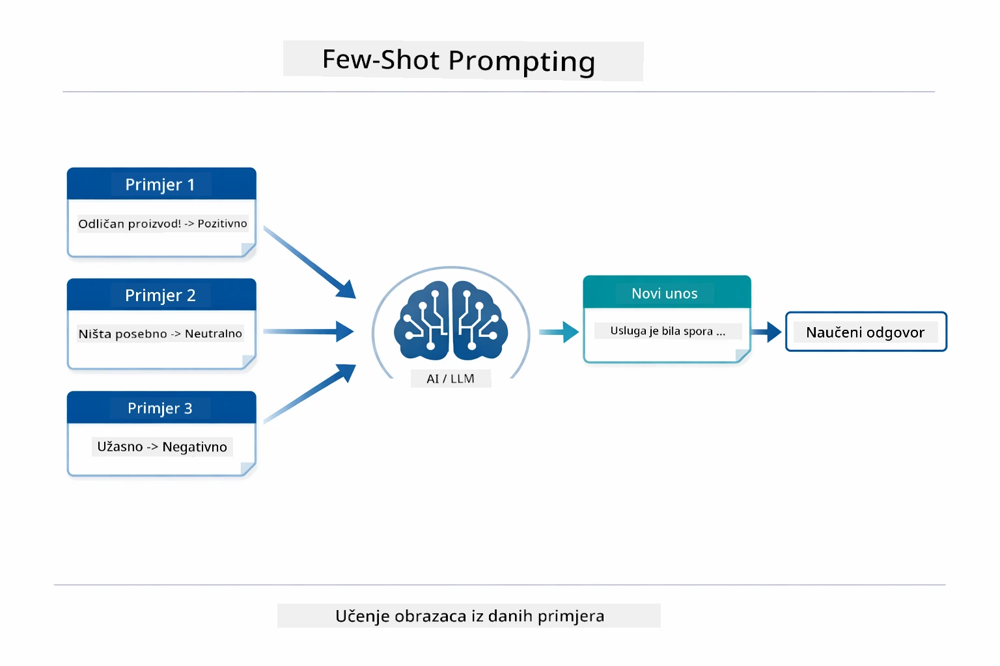
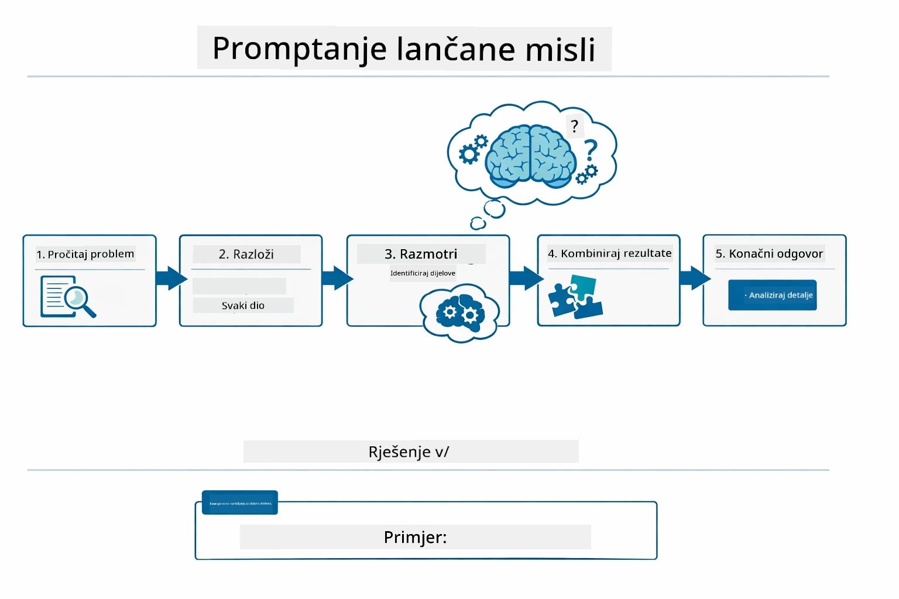
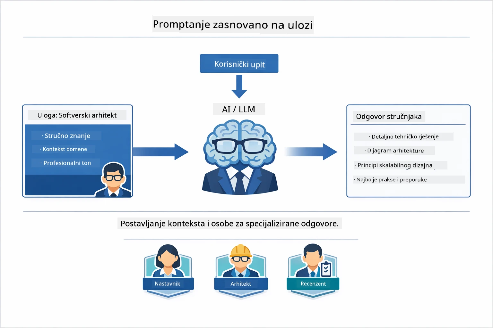
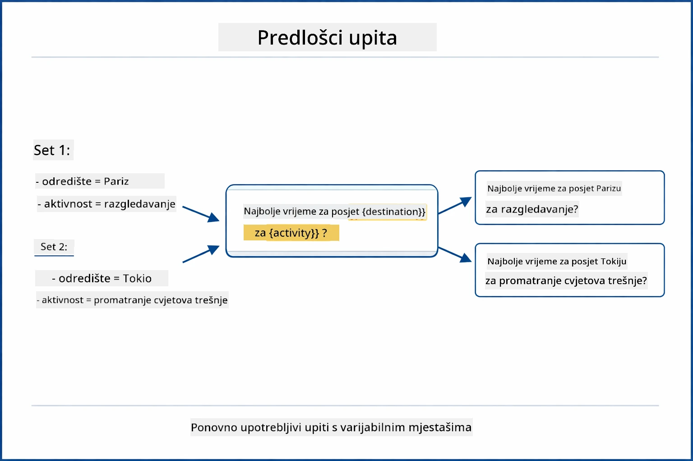
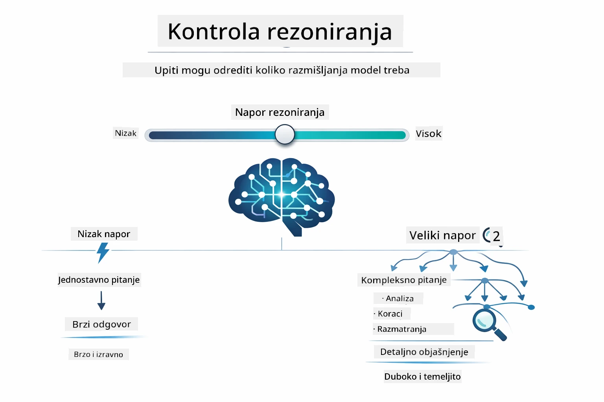

# Modul 02: Inženjering upita s GPT-5.2

## Sadržaj

- [Video vodič](../../../02-prompt-engineering)
- [Što ćete naučiti](../../../02-prompt-engineering)
- [Preduvjeti](../../../02-prompt-engineering)
- [Razumijevanje inženjeringa upita](../../../02-prompt-engineering)
- [Osnove inženjeringa upita](../../../02-prompt-engineering)
  - [Zero-Shot promptiranje](../../../02-prompt-engineering)
  - [Few-Shot promptiranje](../../../02-prompt-engineering)
  - [Lanac razmišljanja](../../../02-prompt-engineering)
  - [Promptiranje temeljeno na ulozi](../../../02-prompt-engineering)
  - [Predlošci upita](../../../02-prompt-engineering)
- [Napredni obrasci](../../../02-prompt-engineering)
- [Korištenje postojećih Azure resursa](../../../02-prompt-engineering)
- [Snimke zaslona aplikacije](../../../02-prompt-engineering)
- [Istraživanje obrazaca](../../../02-prompt-engineering)
  - [Niska vs visoka želja](../../../02-prompt-engineering)
  - [Izvršavanje zadataka (preambli alata)](../../../02-prompt-engineering)
  - [Samoreflektirajući kod](../../../02-prompt-engineering)
  - [Strukturirana analiza](../../../02-prompt-engineering)
  - [Višekratni chat](../../../02-prompt-engineering)
  - [Razumijevanje korak-po-korak](../../../02-prompt-engineering)
  - [Ograničeni izlaz](../../../02-prompt-engineering)
- [Što stvarno učite](../../../02-prompt-engineering)
- [Sljedeći koraci](../../../02-prompt-engineering)

## Video vodič

Pogledajte ovu uživo sesiju koja objašnjava kako započeti s ovim modulom: [Inženjering upita s LangChain4j - uživo sesija](https://www.youtube.com/live/PJ6aBaE6bog?si=LDshyBrTRodP-wke)

## Što ćete naučiti



U prethodnom modulu vidjeli ste kako memorija omogućuje konverzacijski AI i koristili ste GitHub modele za osnovne interakcije. Sada ćemo se usredotočiti na način postavljanja pitanja — same upite — koristeći Azure OpenAI GPT-5.2. Način na koji strukturirate svoje upite dramatično utječe na kvalitetu dobivenih odgovora. Počet ćemo s pregledom osnovnih tehnika promptiranja, a zatim prijeći na osam naprednih obrazaca koji u potpunosti iskorištavaju mogućnosti GPT-5.2.

Koristit ćemo GPT-5.2 jer uvodi kontrolu razmišljanja - možete reći modelu koliko treba razmišljati prije odgovora. To čini različite strategije promptiranja jasnijima i pomaže vam razumjeti kada koristiti svaki pristup. Također ćemo imati koristi od manjih ograničenja rate limita na Azure-u za GPT-5.2 u usporedbi s GitHub modelima.

## Preduvjeti

- Završeni Modul 01 (postavljeni Azure OpenAI resursi)
- `.env` datoteka u glavnom direktoriju s Azure vjerodajnicama (kreirana izvođenjem `azd up` u Modulu 01)

> **Napomena:** Ako niste završili Modul 01, prvo slijedite upute za postavljanje tamo.

## Razumijevanje inženjeringa upita



Inženjering upita odnosi se na oblikovanje ulaznog teksta koji dosljedno donosi rezultate koje trebate. Nije samo o postavljanju pitanja - radi se o strukturiranju zahtjeva tako da model točno razumije što želite i kako to isporučiti.

Razmislite o tome kao davanju uputa kolegi. "Popravi grešku" je nejasno. "Popravi null pointer exception u UserService.java na liniji 45 dodavanjem provjere na null" je specifično. Jezični modeli funkcioniraju na isti način - specifičnost i struktura su važni.



LangChain4j pruža infrastrukturu — veze modela, memoriju i vrste poruka — dok su obrasci upita samo pažljivo strukturirani tekst koji šaljete kroz tu infrastrukturu. Glavni gradivni blokovi su `SystemMessage` (koji postavlja ponašanje i ulogu AI-a) i `UserMessage` (koji nosi vaš stvarni zahtjev).

## Osnove inženjeringa upita



Prije nego što uđemo u napredne obrasce u ovom modulu, pregledajmo pet temeljnih tehnika promptiranja. Oni su gradivni blokovi koje svaki inženjer upita treba poznavati. Ako ste već radili kroz [modul Brzi Start](../00-quick-start/README.md#2-prompt-patterns), već ste ih vidjeli u praksi — ovdje je konceptualni okvir iza njih.

### Zero-Shot promptiranje

Najjednostavniji pristup: dajte modelu izravnu uputu bez primjera. Model se u potpunosti oslanja na svoje treniranje da razumije i izvrši zadatak. Ovo dobro funkcionira za jednostavne zahtjeve gdje je očekivano ponašanje očito.



*Izravna uputa bez primjera — model zaključuje zadatak samo na temelju upute*

```java
String prompt = "Classify this sentiment: 'I absolutely loved the movie!'";
String response = model.chat(prompt);
// Odgovor: "Pozitivno"
```

**Kada koristiti:** Jednostavne klasifikacije, izravna pitanja, prijevodi ili bilo koji zadatak koji model može obaviti bez dodatnih uputa.

### Few-Shot promptiranje

Pružite primjere koji pokazuju obrazac koji želite da model slijedi. Model uči očekivani ulazno-izlazni format iz vaših primjera i primjenjuje ga na nove ulaze. To dramatično poboljšava dosljednost za zadatke kod kojih željeni format ili ponašanje nisu očiti.



*Učenje iz primjera — model prepoznaje obrazac i primjenjuje ga na nove ulaze*

```java
String prompt = """
    Classify the sentiment as positive, negative, or neutral.
    
    Examples:
    Text: "This product exceeded my expectations!" → Positive
    Text: "It's okay, nothing special." → Neutral
    Text: "Waste of money, very disappointed." → Negative
    
    Now classify this:
    Text: "Best purchase I've made all year!"
    """;
String response = model.chat(prompt);
```

**Kada koristiti:** Prilagođene klasifikacije, dosljedno formatiranje, zadatke specifične za domenu ili kada su zero-shot rezultati nedosljedni.

### Lanac razmišljanja

Zatražite od modela da prikaže svoje razmišljanje korak po korak. Umjesto da odmah da odgovor, model razlaže problem i prolazi kroz svaki dio eksplicitno. Ovo poboljšava točnost kod matematičkih, logičkih i višekorakih zadataka.



*Razmišljanje korak po korak — razlaganje složenih problema u eksplicitne logičke korake*

```java
String prompt = """
    Problem: A store has 15 apples. They sell 8 apples and then 
    receive a shipment of 12 more apples. How many apples do they have now?
    
    Let's solve this step-by-step:
    """;
String response = model.chat(prompt);
// Model pokazuje: 15 - 8 = 7, zatim 7 + 12 = 19 jabuka
```

**Kada koristiti:** Matematički problemi, logičke zagonetke, debugiranje ili bilo koji zadatak gdje prikazivanje procesa razmišljanja poboljšava točnost i povjerenje.

### Promptiranje temeljeno na ulozi

Postavite personu ili ulogu AI-u prije nego što postavite pitanje. To pruža kontekst koji oblikuje ton, dubinu i fokus odgovora. "Softverski arhitekt" daje različite savjete od "mlađeg programera" ili "sigurnosnog revizora".



*Postavljanje konteksta i persone — isto pitanje daje različiti odgovor ovisno o dodijeljenoj ulozi*

```java
String prompt = """
    You are an experienced software architect reviewing code.
    Provide a brief code review for this function:
    
    def calculate_total(items):
        total = 0
        for item in items:
            total = total + item['price']
        return total
    """;
String response = model.chat(prompt);
```

**Kada koristiti:** Pregledi koda, tutorstvo, analiza specifična za domenu ili kad trebate odgovore prilagođene određenoj razini stručnosti ili perspektivi.

### Predlošci upita

Kreirajte višekratno upotrebljive upite s varijabilnim mjestima za unos. Umjesto pisanja novog upita svaki put, definirajte predložak jednom i ispunite različite vrijednosti. LangChain4j klasa `PromptTemplate` to olakšava sa sintaksom `{{variable}}`.



*Višekratno upotrebljivi upiti s varijabilnim mjestima — jedan predložak, mnogo primjena*

```java
PromptTemplate template = PromptTemplate.from(
    "What's the best time to visit {{destination}} for {{activity}}?"
);

Prompt prompt = template.apply(Map.of(
    "destination", "Paris",
    "activity", "sightseeing"
));

String response = model.chat(prompt.text());
```

**Kada koristiti:** Ponavljajući zahtjevi s različitim ulazima, grupno procesiranje, izgradnja višekratnih AI tijekova rada ili bilo koji scenarij gdje se struktura upita ne mijenja, ali podaci jesu.

---

Ovih pet osnova daje vam solidan alat za većinu zadataka promptiranja. Ostatak ovog modula gradi na njima s **osam naprednih obrazaca** koji koriste GPT-5.2 kontrolu razmišljanja, samoocjenu i mogućnosti strukturiranog izlaza.

## Napredni obrasci

S osnovama pokrivenim, prijeđimo na osam naprednih obrazaca koji ovaj modul čine jedinstvenim. Nisu svi problemi istog tipa. Neka pitanja zahtijevaju brze odgovore, druga duboko razmišljanje. Neka zahtijevaju vidljivo razmišljanje, a neka samo rezultate. Svaki obrazac je optimiziran za drugačiji scenarij — a GPT-5.2 kontrola razmišljanja čini razlike još jasnijima.


*Pregled osam obrazaca inženjeringa upita i njihove primjene*



*GPT-5.2 kontrola razmišljanja omogućuje vam da specificirate koliko model treba razmišljati — od brzih izravnih odgovora do dubokog istraživanja*

**Niska želja (Brzo i fokusirano)** - Za jednostavna pitanja gdje želite brze, izravne odgovore. Model radi minimalno razmišljanje - maksimalno 2 koraka. Koristite ovo za izračune, pretraživanja ili jednostavna pitanja.

```java
String prompt = """
    <context_gathering>
    - Search depth: very low
    - Bias strongly towards providing a correct answer as quickly as possible
    - Usually, this means an absolute maximum of 2 reasoning steps
    - If you think you need more time, state what you know and what's uncertain
    </context_gathering>
    
    Problem: What is 15% of 200?
    
    Provide your answer:
    """;

String response = chatModel.chat(prompt);
```

> 💡 **Istražite s GitHub Copilot:** Otvorite [`Gpt5PromptService.java`](../../../02-prompt-engineering/src/main/java/com/example/langchain4j/prompts/service/Gpt5PromptService.java) i pitajte:
> - "Koja je razlika između niskog i visokog željenja u obrascima promptiranja?"
> - "Kako XML oznake u upitima pomažu strukturirati AI odgovor?"
> - "Kada koristiti obrasce samorefleksije u odnosu na izravne upute?"

**Visoka želja (Duboko i temeljito)** - Za složene probleme gdje želite sveobuhvatnu analizu. Model detaljno istražuje i prikazuje detaljno razmišljanje. Koristite ovo za dizajn sustava, arhitektonske odluke ili složena istraživanja.

```java
String prompt = """
    Analyze this problem thoroughly and provide a comprehensive solution.
    Consider multiple approaches, trade-offs, and important details.
    Show your analysis and reasoning in your response.
    
    Problem: Design a caching strategy for a high-traffic REST API.
    """;

String response = chatModel.chat(prompt);
```

**Izvršavanje zadataka (progres korak po korak)** - Za višekorake tijekove rada. Model daje unaprijed plan, opisuje svaki korak tijekom rada, zatim daje sažetak. Koristite za migracije, implementacije ili bilo koji višekorak proces.

```java
String prompt = """
    <task_execution>
    1. First, briefly restate the user's goal in a friendly way
    
    2. Create a step-by-step plan:
       - List all steps needed
       - Identify potential challenges
       - Outline success criteria
    
    3. Execute each step:
       - Narrate what you're doing
       - Show progress clearly
       - Handle any issues that arise
    
    4. Summarize:
       - What was completed
       - Any important notes
       - Next steps if applicable
    </task_execution>
    
    <tool_preambles>
    - Always begin by rephrasing the user's goal clearly
    - Outline your plan before executing
    - Narrate each step as you go
    - Finish with a distinct summary
    </tool_preambles>
    
    Task: Create a REST endpoint for user registration
    
    Begin execution:
    """;

String response = chatModel.chat(prompt);
```

Lanac razmišljanja eksplicitno traži od modela da prikaže svoj proces razmišljanja, poboljšavajući točnost za složene zadatke. Razlaganje korak po korak pomaže i ljudima i AI-u razumjeti logiku.

> **🤖 Isprobajte uz [GitHub Copilot](https://github.com/features/copilot) chat:** Pitajte o ovom obrascu:
> - "Kako bih prilagodio obrazac izvršavanja zadataka za dugotrajne operacije?"
> - "Koje su najbolje prakse za strukturiranje preambli alata u produkcijskim aplikacijama?"
> - "Kako mogu snimiti i prikazati ažuriranja srednjeg napretka u korisničkom sučelju?"


*Plan → Izvršenje → Sažetak tijek rada za višekorake zadatke*

**Samoreflektirajući kod** - Za generiranje produkcijski kvalitetnog koda. Model generira kod prema produkcijskim standardima s ispravnim upravljanjem pogreškama. Koristite ovo pri izgradnji novih značajki ili servisa.

```java
String prompt = """
    Generate Java code with production-quality standards: Create an email validation service
    Keep it simple and include basic error handling.
    """;

String response = chatModel.chat(prompt);
```


*Iterativni ciklus poboljšanja - generiraj, ocijeni, identificiraj probleme, poboljšaj, ponovi*

**Strukturirana analiza** - Za dosljednu evaluaciju. Model pregledava kod koristeći fiksni okvir (ispravnost, prakse, performanse, sigurnost, održivost). Koristite za preglede koda ili procjenu kvalitete.

```java
String prompt = """
    <analysis_framework>
    You are an expert code reviewer. Analyze the code for:
    
    1. Correctness
       - Does it work as intended?
       - Are there logical errors?
    
    2. Best Practices
       - Follows language conventions?
       - Appropriate design patterns?
    
    3. Performance
       - Any inefficiencies?
       - Scalability concerns?
    
    4. Security
       - Potential vulnerabilities?
       - Input validation?
    
    5. Maintainability
       - Code clarity?
       - Documentation?
    
    <output_format>
    Provide your analysis in this structure:
    - Summary: One-sentence overall assessment
    - Strengths: 2-3 positive points
    - Issues: List any problems found with severity (High/Medium/Low)
    - Recommendations: Specific improvements
    </output_format>
    </analysis_framework>
    
    Code to analyze:
    ```
    public List getUsers() {
        return database.query("SELECT * FROM users");
    }
    ```
    Provide your structured analysis:
    """;

String response = chatModel.chat(prompt);
```

> **🤖 Isprobajte uz [GitHub Copilot](https://github.com/features/copilot) chat:** Pitajte o strukturiranoj analizi:
> - "Kako mogu prilagoditi okvir analize za različite vrste pregleda koda?"
> - "Koji je najbolji način za parsiranje i programatsko korištenje strukturiranog izlaza?"
> - "Kako osigurati dosljedne razine težine kroz različite sesije pregleda?"


*Okvir za dosljedne preglede koda s razinama težine*

**Višekratni chat** - Za razgovore kojima treba kontekst. Model pamti prethodne poruke i gradi na njima. Koristite ovo za interaktivne sesije pomoći ili složena pitanja i odgovore.

```java
ChatMemory memory = MessageWindowChatMemory.withMaxMessages(10);

memory.add(UserMessage.from("What is Spring Boot?"));
AiMessage aiMessage1 = chatModel.chat(memory.messages()).aiMessage();
memory.add(aiMessage1);

memory.add(UserMessage.from("Show me an example"));
AiMessage aiMessage2 = chatModel.chat(memory.messages()).aiMessage();
memory.add(aiMessage2);
```


*Kako se kontekst razgovora akumulira kroz više okretaja do dosega ograničenja tokena*

**Razumijevanje korak-po-korak** - Za probleme kojima je potrebna vidljiva logika. Model prikazuje eksplicitno razmišljanje za svaki korak. Koristite za matematičke zadatke, logičke zagonetke ili kad trebate razumjeti proces razmišljanja.

```java
String prompt = """
    <instruction>Show your reasoning step-by-step</instruction>
    
    If a train travels 120 km in 2 hours, then stops for 30 minutes,
    then travels another 90 km in 1.5 hours, what is the average speed
    for the entire journey including the stop?
    """;

String response = chatModel.chat(prompt);
```


*Razlaganje problema u eksplicitne logičke korake*

**Ograničeni izlaz** - Za odgovore s specifičnim zahtjevima formata. Model strogo poštuje pravila formata i dužine. Koristite za sažetke ili kad trebate preciznu strukturu izlaza.

```java
String prompt = """
    <constraints>
    - Exactly 100 words
    - Bullet point format
    - Technical terms only
    </constraints>
    
    Summarize the key concepts of machine learning.
    """;

String response = chatModel.chat(prompt);
```


*Nametanje specifičnih zahtjeva formata, dužine i strukture*

## Korištenje postojećih Azure resursa

**Provjera postavljanja:**

Provjerite postoji li `.env` datoteka u glavnom direktoriju s Azure vjerodajnicama (napravljena tijekom Modula 01):
```bash
cat ../.env  # Trebao bi prikazati AZURE_OPENAI_ENDPOINT, API_KEY, DEPLOYMENT
```

**Pokretanje aplikacije:**

> **Napomena:** Ako ste već pokrenuli sve aplikacije koristeći `./start-all.sh` iz Modula 01, ovaj modul već radi na portu 8083. Možete preskočiti naredbe za pokretanje ispod i odmah otići na http://localhost:8083.

**Opcija 1: Korištenje Spring Boot nadzorne ploče (preporučeno za VS Code korisnike)**
Razvojno okruženje sadrži proširenje Spring Boot Dashboard, koje pruža vizualno sučelje za upravljanje svim Spring Boot aplikacijama. Možete ga pronaći na Activity Bar-u s lijeve strane VS Code-a (potražite ikonu Spring Boot).

S Spring Boot Dashboard-a možete:
- Vidjeti sve dostupne Spring Boot aplikacije u radnom prostoru
- Pokrenuti/zaustaviti aplikacije jednim klikom
- Pregledavati aplikacijske zapise u stvarnom vremenu
- Pratiti status aplikacije

Jednostavno kliknite gumb za reprodukciju pored "prompt-engineering" da pokrenete ovaj modul, ili pokrenite sve module odjednom.


**Opcija 2: Korištenje shell skripti**

Pokrenite sve web aplikacije (module 01-04):

**Bash:**
```bash
cd ..  # Iz korijenskog direktorija
./start-all.sh
```

**PowerShell:**
```powershell
cd ..  # Iz korijenskog direktorija
.\start-all.ps1
```

Ili pokrenite samo ovaj modul:

**Bash:**
```bash
cd 02-prompt-engineering
./start.sh
```

**PowerShell:**
```powershell
cd 02-prompt-engineering
.\start.ps1
```

Oba skripta automatski učitavaju varijable okoline iz glavne `.env` datoteke i izgradit će JAR datoteke ako ne postoje.

> **Napomena:** Ako želite ručno izgraditi sve module prije pokretanja:
>
> **Bash:**
> ```bash
> cd ..  # Go to root directory
> mvn clean package -DskipTests
> ```
>
> **PowerShell:**
> ```powershell
> cd ..  # Go to root directory
> mvn clean package -DskipTests
> ```

Otvorite http://localhost:8083 u vašem pregledniku.

**Za zaustavljanje:**

**Bash:**
```bash
./stop.sh  # Samo ovaj modul
# Ili
cd .. && ./stop-all.sh  # Svi moduli
```

**PowerShell:**
```powershell
.\stop.ps1  # Samo ovaj modul
# Ili
cd ..; .\stop-all.ps1  # Svi moduli
```

## Snimke zaslona aplikacije


*Glavna nadzorna ploča koja pokazuje svih 8 obrazaca za prompt engineering sa svojim karakteristikama i slučajevima korištenja*

## Istraživanje obrazaca

Web sučelje omogućuje vam eksperimentiranje s različitim strategijama promptanja. Svaki obrazac rješava različite probleme - isprobajte ih da vidite kada koja metoda najbolje funkcionira.

> **Napomena: Streaming vs non-streaming** — Svaka stranica obrasca nudi dva gumba: **🔴 Stream Response (Live)** i opciju **Ne-streaming**. Streaming koristi Server-Sent Events (SSE) za prikaz tokena u stvarnom vremenu dok model generira odgovor, tako da odmah vidite napredak. Ne-streaming opcija čeka na cijeli odgovor prije prikaza. Za upite koji zahtijevaju duboko razmišljanje (npr. High Eagerness, Self-Reflecting Code), ne-streaming poziv može trajati jako dugo — ponekad i minute — bez vidljive povratne informacije. **Koristite streaming pri eksperimentiranju s složenim promptima** kako biste vidjeli model u radu i izbjegli dojam da je zahtjev istekao.
>
> **Napomena: Zahtjev za preglednikom** — Streaming funkcija koristi Fetch Streams API (`response.body.getReader()`) koji zahtijeva potpuni preglednik (Chrome, Edge, Firefox, Safari). NE radi u ugrađenom Simple Browser-u VS Code-a, jer njegov webview ne podržava ReadableStream API. Ako koristite Simple Browser, gumbi za ne-streaming će i dalje normalno funkcionirati — samo su gumbi za streaming pogođeni. Otvorite `http://localhost:8083` u vanjskom pregledniku za potpuni doživljaj.

### Niska vs Visoka želja (Eagerness)

Postavite jednostavno pitanje poput "Koliko je 15% od 200?" koristeći Nisku želju. Dobit ćete trenutni i izravan odgovor. Sad postavite nešto složenije, poput "Dizajniraj strategiju keširanja za API s velikim prometom" koristeći Visoku želju. Kliknite **🔴 Stream Response (Live)** i promatrajte detaljno razmišljanje modela koje se pojavljuje token po token. Isti model, ista struktura pitanja - ali prompt mu govori koliko razmišljanja treba uložiti.

### Izvršenje zadataka (Preambles alata)

Višestepeni tijekovi rada profitiraju od unaprijed planiranja i naracije napretka. Model opisuje što će učiniti, pripovijeda svaki korak, zatim sažima rezultate.

### Samoreflektirajući kod

Probajte "Izradi servis za provjeru valjanosti emaila". Umjesto da samo generira kod i stane, model generira, procjenjuje prema kriterijima kvalitete, identificira slabosti i poboljšava. Vidjet ćete kako iterira dok kod ne zadovolji proizvodne standarde.

### Struktuirana analiza

Pregledi koda trebaju konzistentne okvire za evaluaciju. Model analizira kod prema fiksnim kategorijama (točnost, prakse, izvedba, sigurnost) s razinama ozbiljnosti.

### Višekratni chat

Pitajte "Što je Spring Boot?" pa odmah nastavite s "Pokaži mi primjer". Model pamti vaše prvo pitanje i daje vam specifičan primjer Spring Boot-a. Bez memorije, drugo pitanje bi bilo previše neodređeno.

### Korak-po-korak razmišljanje

Odaberite matematički problem i isprobajte ga s Korak-po-korak razmišljanjem i Niskom željom. Niska želja samo daje odgovor - brzo ali nejasno. Korak-po-korak pokazuje svaki izračun i odluku.

### Ograničen ispis

Kad trebate specifične formate ili broj riječi, ovaj obrazac strogo provodi pridržavanje. Probajte generirati sažetak s točno 100 riječi u formatu s nabrajanjem.

## Što zapravo učite

**Napori razmišljanja mijenjaju sve**

GPT-5.2 vam dopušta kontrolu računalnih napora kroz vaše promptove. Niski napor znači brze odgovore s minimalnim istraživanjem. Visoki napor znači da model uzima vremena za duboko razmišljanje. Učite kako uskladiti trud i složenost zadatka - nemojte gubiti vrijeme na jednostavna pitanja, ali nemojte ni žuriti s kompleksnim odlukama.

**Struktura vodi ponašanje**

Primjećujete li XML oznake u promptovima? One nisu dekoracija. Modeli pouzdanije slijede strukturirane upute nego slobodni tekst. Kad trebate višestepene procese ili složenu logiku, struktura pomaže modelu pratiti gdje je i što slijedi.


*Anatomija dobro strukturiranog prompta s jasnim dijelovima i XML-stil organizacijom*

**Kvaliteta kroz samoocjenu**

Samoreflektirajući obrasci funkcioniraju tako da eksplicitno definiraju kriterije kvalitete. Umjesto da se nadajte da model "radi ispravno", kažete mu točno što "ispravno" znači: ispravna logika, rukovanje pogreškama, izvedba, sigurnost. Model potom može ocijeniti vlastiti ispis i poboljšati se. Time generiranje koda postaje proces, a ne lutrija.

**Kontekst je ograničen**

Višekratni razgovori rade uključivanjem povijesti poruka u svaki zahtjev. No postoji ograničenje - svaki model ima maksimalan broj tokena. Kako razgovori rastu, trebate strategije za održavanje relevantnog konteksta bez dosezanja tog limita. Ovaj modul pokazuje kako memorija funkcionira; kasnije ćete naučiti kada sažimati, kad zaboraviti, a kad dohvatiti.

## Sljedeći koraci

**Sljedeći modul:** [03-rag - RAG (Retrieval-Augmented Generation)](../03-rag/README.md)

---

**Navigacija:** [← Prethodni: Modul 01 - Uvod](../01-introduction/README.md) | [Natrag na početnu](../README.md) | [Sljedeći: Modul 03 - RAG →](../03-rag/README.md)

---

<!-- CO-OP TRANSLATOR DISCLAIMER START -->
**Odricanje od odgovornosti**:
Ovaj dokument je preveden pomoću AI usluge za prevođenje [Co-op Translator](https://github.com/Azure/co-op-translator). Iako težimo točnosti, molimo imajte na umu da automatski prijevodi mogu sadržavati pogreške ili netočnosti. Izvorni dokument na izvornom jeziku treba smatrati autoritativnim izvorom. Za kritične informacije preporučuje se profesionalni ljudski prijevod. Ne snosimo odgovornost za bilo kakve nesporazume ili pogrešna tumačenja koja proizlaze iz korištenja ovog prijevoda.
<!-- CO-OP TRANSLATOR DISCLAIMER END -->