# Modul 03: RAG (Generiranje uz podršku pretraživanja)

## Sadržaj

- [Video vodič](../../../03-rag)
- [Što ćete naučiti](../../../03-rag)
- [Preduvjeti](../../../03-rag)
- [Razumijevanje RAG-a](../../../03-rag)
  - [Koji RAG pristup koristi ovaj vodič?](../../../03-rag)
- [Kako radi](../../../03-rag)
  - [Obrada dokumenata](../../../03-rag)
  - [Stvaranje uvlaka (embeddings)](../../../03-rag)
  - [Semantičko pretraživanje](../../../03-rag)
  - [Generiranje odgovora](../../../03-rag)
- [Pokreni aplikaciju](../../../03-rag)
- [Korištenje aplikacije](../../../03-rag)
  - [Učitaj dokument](../../../03-rag)
  - [Postavi pitanja](../../../03-rag)
  - [Provjeri izvore referenci](../../../03-rag)
  - [Eksperimentiraj sa pitanjima](../../../03-rag)
- [Ključni pojmovi](../../../03-rag)
  - [Strategija dijeljenja na dijelove (chunking)](../../../03-rag)
  - [Ocjene sličnosti](../../../03-rag)
  - [Pohrana u memoriji](../../../03-rag)
  - [Upravljanje kontekstnim prozorom](../../../03-rag)
- [Kada je RAG važan](../../../03-rag)
- [Sljedeći koraci](../../../03-rag)

## Video vodič

Pogledajte ovu emitiranu sesiju koja objašnjava kako započeti s ovim modulom: [RAG s LangChain4j - Live Session](https://www.youtube.com/watch?v=_olq75ZH_eY)

## Što ćete naučiti

U prethodnim modulima naučili ste kako voditi razgovore s AI-jem i učinkovito strukturirati svoje upite. No postoji osnovno ograničenje: jezični modeli znaju samo ono što su naučili tijekom treniranja. Ne mogu odgovoriti na pitanja o pravilima vaše tvrtke, dokumentaciji vašeg projekta ili bilo kojim informacijama na kojima nisu bili trenirani.

RAG (Generiranje uz podršku pretraživanja) rješava ovaj problem. Umjesto da pokušavate modelu "naučiti" vaše informacije (što je skupo i nepraktično), dajete mu sposobnost pretraživanja vaših dokumenata. Kada netko postavi pitanje, sustav pronalazi relevantne informacije i uključuje ih u upit. Model zatim odgovara na temelju tog dohvaćenog konteksta.

Zamislite RAG kao davanje modelu referentne knjižnice. Kad postavite pitanje, sustav:

1. **Korisnički upit** - Postavljate pitanje  
2. **Embedding** - Pretvara vaše pitanje u vektor  
3. **Vektorsko pretraživanje** - Pronalazi slične dijelove dokumenata  
4. **Sastavljanje konteksta** - Dodaje relevantne dijelove u upit  
5. **Odgovor** - LLM generira odgovor na temelju tog konteksta  

Ovo zasniva odgovore modela na vašim stvarnim podacima umjesto da se oslanja na znanje iz treninga ili da izmišlja odgovore.

## Preduvjeti

- Završeni [Modul 00 - Brzi početak](../00-quick-start/README.md) (za primjer Easy RAG-a referenciran gore)  
- Završeni [Modul 01 - Uvod](../01-introduction/README.md) (postavljeni Azure OpenAI resursi, uključujući `text-embedding-3-small` model za uvlake)  
- `.env` datoteka u korijenskom direktoriju s Azure vjerodajnicama (stvorena pomoću `azd up` u Modulu 01)  

> **Napomena:** Ako niste završili Modul 01, prvo slijedite upute za postavljanje tamo. Naredba `azd up` postavlja i GPT chat model i embedding model koji koristi ovaj modul.

## Razumijevanje RAG-a

Dijagram u nastavku ilustrira osnovni koncept: umjesto oslanjanja samo na podatke o treniranju modela, RAG mu daje referentnu knjižnicu vaših dokumenata za konzultaciju prije generiranja svakog odgovora.

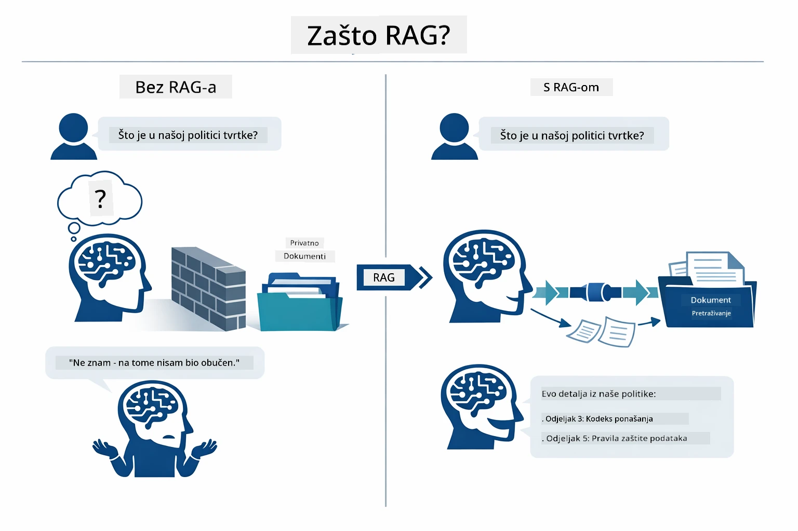

*Ovaj dijagram prikazuje razliku između standardnog LLM-a (koji pogađa iz podataka o treningu) i LLM-a s RAG-om (koji prvo konzultira vaše dokumente).*

Evo kako se dijelovi povezuju od početka do kraja. Korisnikovo pitanje prolazi kroz četiri faze — uvlake, vektorsko pretraživanje, sastavljanje konteksta i generiranje odgovora — gdje će svaka faza graditi na prethodnoj:


*Ovaj dijagram prikazuje RAG pipeline od početka do kraja — korisnički upit prolazi kroz uvlake, vektorsko pretraživanje, sastavljanje konteksta i generiranje odgovora.*

Ostatak ovog modula detaljno prolazi kroz svaku fazu, uz kod koji možete pokrenuti i prilagoditi.

### Koji RAG pristup koristi ovaj vodič?

LangChain4j nudi tri načina za implementaciju RAG-a, svaki s različitom razinom apstrakcije. Dijagram ispod uspoređuje ih jedan uz drugi:

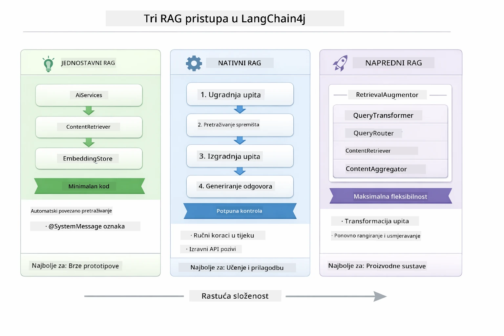

*Ovaj dijagram uspoređuje tri LangChain4j RAG pristupa — Easy, Native i Advanced — prikazujući njihove ključne komponente i kada ih koristiti.*

| Pristup | Što radi | Kompromis |
|---|---|---|
| **Easy RAG** | Automatski povezuje sve kroz `AiServices` i `ContentRetriever`. Anotirate sučelje, dodajete retriever i LangChain4j iza scene upravlja uvlakama, pretraživanjem i sastavljanjem prompta. | Minimalan kod, ali ne vidite što se događa u svakoj fazi. |
| **Native RAG** | Sami pozivate embedding model, pretražujete pohranu, gradite prompt i generirate odgovor — jedan eksplicitan korak po korak. | Više koda, ali svaka faza je vidljiva i izmjenjiva. |
| **Advanced RAG** | Koristi `RetrievalAugmentor` framework s mogući transformatorima upita, routerima, ponovno rangiranjima i injektorima sadržaja za pipelines proizvodne razine. | Maksimalna fleksibilnost, ali znatno veća složenost. |

**Ovaj vodič koristi Native pristup.** Svaki korak RAG pipelinea — uvlake upita, pretraživanje vektorske pohrane, sastavljanje konteksta i generiranje odgovora — napisani su eksplicitno u [`RagService.java`](../../../03-rag/src/main/java/com/example/langchain4j/rag/service/RagService.java). To je namjerno: kao obrazovni resurs, važnije je da vidite i razumijete svaki korak nego da kod bude minimaliziran. Kada se osjećate ugodno s time kako dijelovi funkcioniraju zajedno, možete prijeći na Easy RAG za brze prototipe ili Advanced RAG za proizvodne sustave.

> **💡 Već ste vidjeli Easy RAG u akciji?** Modul [Quick Start](../00-quick-start/README.md) uključuje primjer Document Q&A ([`SimpleReaderDemo.java`](../../../00-quick-start/src/main/java/com/example/langchain4j/quickstart/SimpleReaderDemo.java)) koji koristi Easy RAG pristup — LangChain4j automatski upravlja uvlakama, pretraživanjem i sastavljanjem prompta. Ovaj modul ide korak dalje razotkrivanjem tog pipelinea da sami možete vidjeti i kontrolirati svaku fazu.

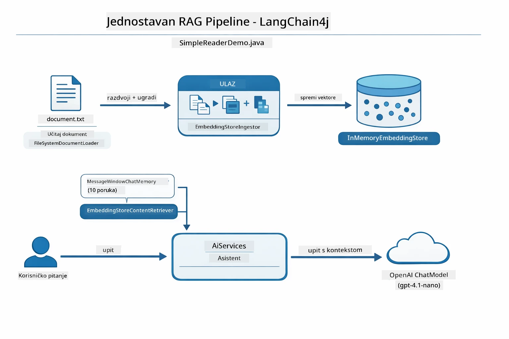

*Ovaj dijagram prikazuje Easy RAG pipeline iz `SimpleReaderDemo.java`. Usporedite ga s Native pristupom koji koristi ovaj modul: Easy RAG skriva uvlake, dohvaćanje i sastavljanje prompta iza `AiServices` i `ContentRetriever` — učitate dokument, dodate retriever i dobijete odgovore. Native pristup u ovom modulu razotkriva pipeline kako biste vi sami pozivali svaku fazu (uvlaka, pretraživanje, sastavljanje konteksta, generiranje), dajući vam potpunu vidljivost i kontrolu.*

## Kako radi

RAG pipeline u ovom modulu razlaže se u četiri faze koje se izvršavaju uzastopno svaki put kad korisnik postavi pitanje. Prvo se učitani dokument **parsira i dijeli na dijelove (chunkove)** koji su lako upravljivi. Ti dijelovi se zatim prenose u **vektorske uvlake (embeddings)** i pohranjuju da bi se mogli matematički uspoređivati. Kad upit stigne, sustav izvodi **semantičko pretraživanje** kako bi pronašao najrelevantnije dijelove, te ih na kraju prosljeđuje kao kontekst LLM-u za **generiranje odgovora**. Sljedeći odlomci detaljno prikazuju svaku fazu s pravim kodom i dijagramima. Pogledajmo prvi korak.

### Obrada dokumenata

[DocumentService.java](../../../03-rag/src/main/java/com/example/langchain4j/rag/service/DocumentService.java)

Kad učitate dokument, sustav ga parsira (PDF ili običan tekst), pridružuje metapodatke poput naziva datoteke, te zatim dijeli na dijelove — manje segmente koji udobno pristaju u kontekstni prozor modela. Ti dijelovi se lagano preklapaju kako ne biste izgubili kontekst na granicama.

```java
// Analizirajte prenesenu datoteku i omotajte je u LangChain4j dokument
Document document = Document.from(content, metadata);

// Podijelite u dijelove od 300 tokena s preklapanjem od 30 tokena
DocumentSplitter splitter = DocumentSplitters
    .recursive(300, 30);

List<TextSegment> segments = splitter.split(document);
```
  
Dijagram u nastavku prikazuje kako to vizualno funkcionira. Primjetite kako svaki dio dijeli neke tokene sa svojim susjedima — 30 tokena preklapanja osigurava da nijedan važan kontekst ne ostane izgubljen na prijelazima:

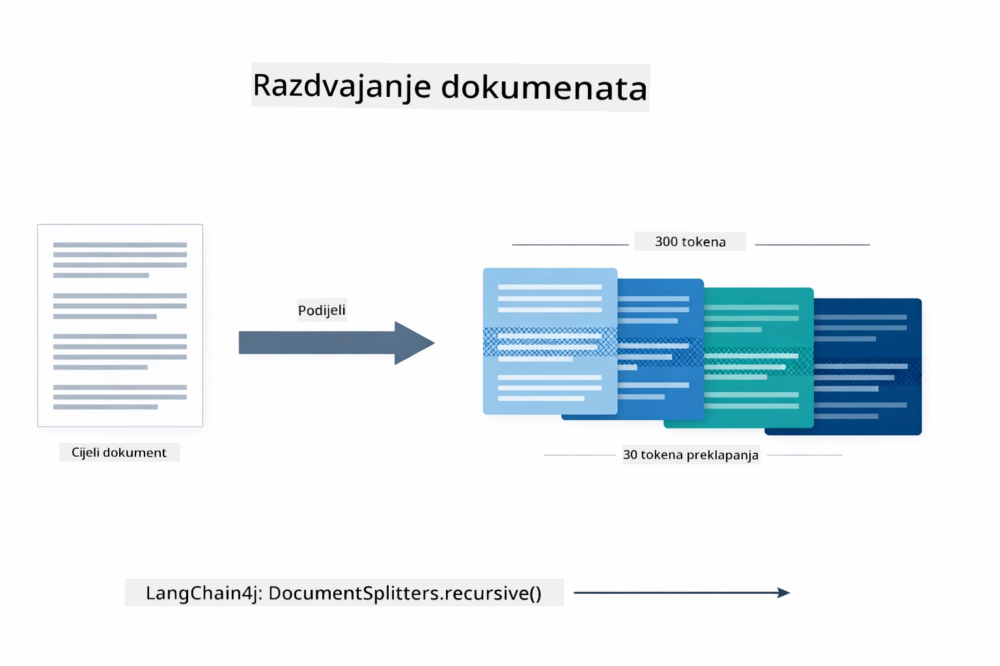

*Ovaj dijagram prikazuje kako se dokument dijeli na dijelove od 300 tokena s 30 tokena preklapanja, što čuva kontekst na granicama dijelova.*

> **🤖 Isprobajte s [GitHub Copilot](https://github.com/features/copilot) Chat:** Otvorite [`DocumentService.java`](../../../03-rag/src/main/java/com/example/langchain4j/rag/service/DocumentService.java) i pitajte:  
> - "Kako LangChain4j dijeli dokumente na dijelove i zašto je važno preklapanje?"  
> - "Koja je optimalna veličina dijelova za različite vrste dokumenata i zašto?"  
> - "Kako rukovati dokumentima na više jezika ili sa specijalnim formatiranjem?"

### Stvaranje uvlaka (embeddings)

[LangChainRagConfig.java](../../../03-rag/src/main/java/com/example/langchain4j/rag/config/LangChainRagConfig.java)

Svaki dio pretvara se u numerički prikaz nazvan uvlaka — zapravo pretvarač značenja u brojeve. Embedding model nije "inteligentan" kao chat model; ne može slijediti upute, rezonirati ili odgovarati na pitanja. Ono što može je mapirati tekst u matematički prostor gdje slična značenja stoje blizu jedno drugome — "auto" blizu "automobil", "pravila povrata novca" blizu "vraćanje novca". Zamislite chat model kao osobu s kojom možete razgovarati; embedding model je ultra-dobar sustav za arhiviranje.

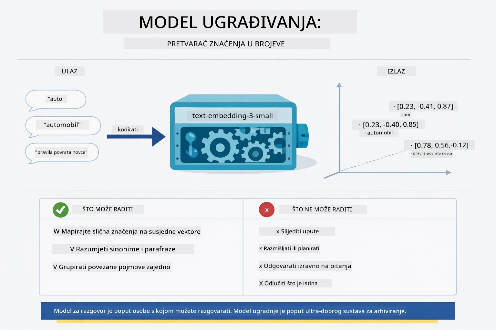

*Ovaj dijagram prikazuje kako embedding model pretvara tekst u numeričke vektore, stavljajući slična značenja — poput "auto" i "automobil" — blizu jedno drugoga u vektorskom prostoru.*

```java
@Bean
public EmbeddingModel embeddingModel() {
    return OpenAiOfficialEmbeddingModel.builder()
        .baseUrl(azureOpenAiEndpoint)
        .apiKey(azureOpenAiKey)
        .modelName(azureEmbeddingDeploymentName)
        .build();
}

EmbeddingStore<TextSegment> embeddingStore = 
    new InMemoryEmbeddingStore<>();
```
  
Dijagram klasa u nastavku prikazuje dva zasebna toka u RAG pipelineu i LangChain4j klase koje ih implementiraju. **Tok unosa** (izvodi se jednom prilikom učitavanja) dijeli dokument, pravi uvlake dijelova i pohranjuje ih putem `.addAll()`. **Tok upita** (izvodi se svaki put kad korisnik pita) pravi uvlaku pitanja, pretražuje pohranu putem `.search()`, te prosljeđuje podudarajući kontekst chat modelu. Oba toka se spajaju preko zajedničkog sučelja `EmbeddingStore<TextSegment>`:

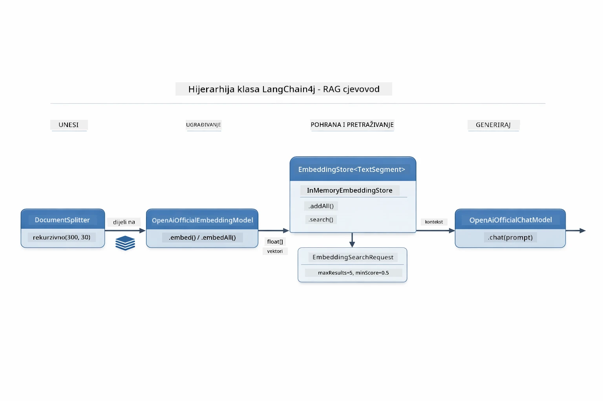

*Ovaj dijagram prikazuje dva toka u RAG pipelineu — unos i upit — i kako se povezuju kroz zajednički EmbeddingStore.*

Kada su uvlake pohranjene, sličan sadržaj se prirodno grupira zajedno u vektorskom prostoru. Vizualizacija u nastavku pokazuje kako dokumenti o povezanim temama završavaju kao obližnje točke, što omogućuje semantičko pretraživanje:


*Ova vizualizacija prikazuje kako se povezani dokumenti grupiraju zajedno u 3D vektorskom prostoru, s temama poput Tehničke dokumentacije, Poslovnih pravila i FAQ-a koje formiraju zasebne skupine.*

Kad korisnik pretražuje, sustav slijedi četiri koraka: jednom uvlaka dokumente, kod svakog pretraživanja uvlaka upit, uspoređuje vektor upita sa svim pohranjenim vektorima koristeći kosinusnu sličnost, i vraća top-K najrelevantnijih dijelova. Dijagram u nastavku prikazuje svaki korak i uključene LangChain4j klase:

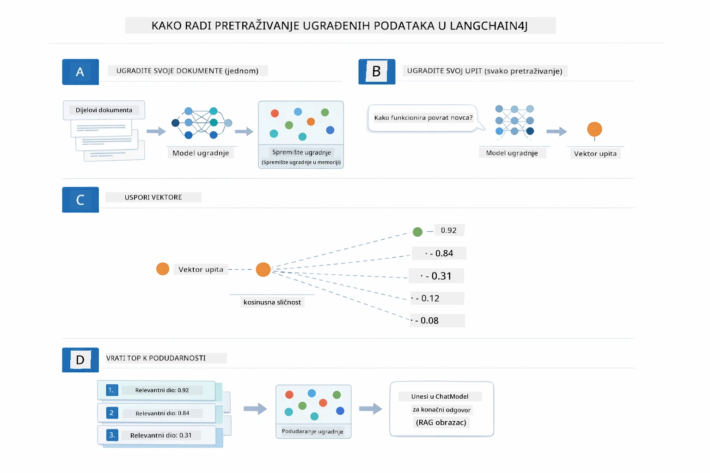

*Ovaj dijagram prikazuje četverokorak procesa pretraživanja uvlaka: uvlaka dokumenata, uvlaka upita, usporedbu vektora kosinusnom sličnosti i vraćanje top-K rezultata.*

### Semantičko pretraživanje

[RagService.java](../../../03-rag/src/main/java/com/example/langchain4j/rag/service/RagService.java)

Kad postavite pitanje, vaše pitanje također postaje uvlaka. Sustav uspoređuje uvlaku vašeg pitanja sa svim uvlakama dijelova dokumenata. Pronalaži dijelove s najsličnijim značenjima - ne samo podudaranjem ključnih riječi, već stvarnom semantičkom sličnosti.

```java
Embedding queryEmbedding = embeddingModel.embed(question).content();

EmbeddingSearchRequest searchRequest = EmbeddingSearchRequest.builder()
    .queryEmbedding(queryEmbedding)
    .maxResults(5)
    .minScore(0.5)
    .build();

EmbeddingSearchResult<TextSegment> searchResult = embeddingStore.search(searchRequest);
List<EmbeddingMatch<TextSegment>> matches = searchResult.matches();

for (EmbeddingMatch<TextSegment> match : matches) {
    String relevantText = match.embedded().text();
    double score = match.score();
}
```
  
Dijagram u nastavku uspoređuje semantičko pretraživanje s tradicionalnim pretraživanjem po ključnim riječima. Pretraživanje klučne riječi za "vozilo" promašuje dio o "autima i kamionima," ali semantičko pretraživanje razumije da znače isto i vraća ga kao visoko ocijenjeni rezultat:

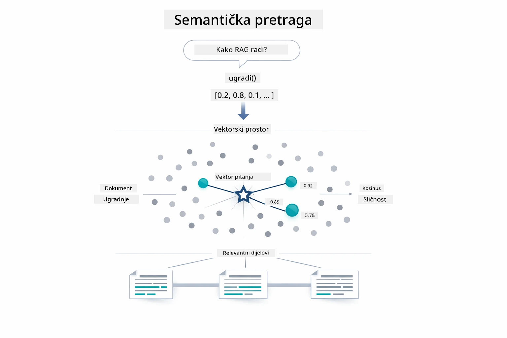

*Ovaj dijagram uspoređuje pretraživanje bazirano na ključnim riječima i semantičko pretraživanje, pokazujući kako semantičko pretraživanje dohvaća konceptualno povezani sadržaj i kad ključne riječi odstupaju.*

Ispod haube, sličnost se mjeri kosinusnom sličnosti — zapravo se pita "pokazuju li ove dvije strelice u istom smjeru?" Dva dijela mogu upotrebljavati potpuno različite riječi, ali ako znače isto, njihovi vektori pokazuju istim smjerom i postižu rezultat blizu 1.0:

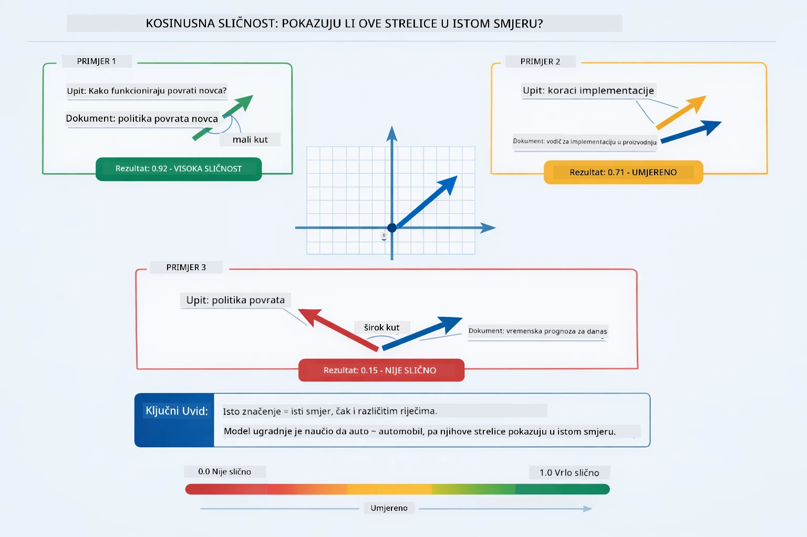

*Ovaj dijagram ilustrira kosinusnu sličnost kao kut između vektora uvlaka — vektori bliže usklađeni ocjenjuju se bliže 1.0, što označava veću semantičku sličnost.*
> **🤖 Isprobajte s [GitHub Copilot](https://github.com/features/copilot) Chat:** Otvorite [`RagService.java`](../../../03-rag/src/main/java/com/example/langchain4j/rag/service/RagService.java) i pitajte:
> - "Kako funkcionira pretraživanje sličnošću s embedinzima i što određuje rezultat?"
> - "Koju prag sličnosti trebam koristiti i kako to utječe na rezultate?"
> - "Kako postupiti u slučaju da se ne pronađu relevantni dokumenti?"

### Generiranje odgovora

[RagService.java](../../../03-rag/src/main/java/com/example/langchain4j/rag/service/RagService.java)

Najrelevantniji dijelovi se sastavljaju u strukturirani prompt koji uključuje eksplicitne upute, dohvaćeni kontekst i pitanje korisnika. Model čita te specifične dijelove i odgovara na temelju tih informacija — može koristiti samo informacije koje su mu date, što sprječava halucinacije.

```java
String context = matches.stream()
    .map(match -> match.embedded().text())
    .collect(Collectors.joining("\n\n"));

String prompt = String.format("""
    Answer the question based on the following context.
    If the answer cannot be found in the context, say so.

    Context:
    %s

    Question: %s

    Answer:""", context, request.question());

String answer = chatModel.chat(prompt);
```

Dijagram ispod prikazuje ovaj proces sastavljanja — dijelovi s najvišim rezultatom iz faze pretraživanja se ubacuju u predložak prompta, a `OpenAiOfficialChatModel` generira utemeljen odgovor:

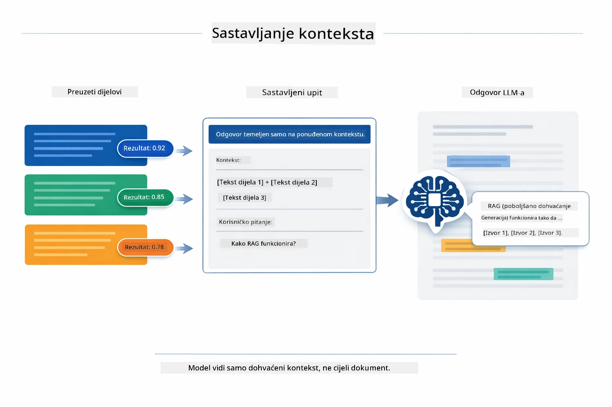

*Ovaj dijagram prikazuje kako se dijelovi s najvišim rezultatom sastavljaju u strukturirani prompt, omogućujući modelu da generira utemeljen odgovor iz vaših podataka.*

## Pokretanje aplikacije

**Provjerite deployment:**

Provjerite postoji li `.env` datoteka u korijenskom direktoriju sa Azure vjerodajnicama (kreiranima u Modul 01):

**Bash:**
```bash
cat ../.env  # Trebalo bi prikazati AZURE_OPENAI_ENDPOINT, API_KEY, DEPLOYMENT
```

**PowerShell:**
```powershell
Get-Content ..\.env  # Trebao bi prikazati AZURE_OPENAI_ENDPOINT, API_KEY, DEPLOYMENT
```

**Pokrenite aplikaciju:**

> **Napomena:** Ako ste već pokrenuli sve aplikacije koristeći `./start-all.sh` iz Modula 01, ovaj modul već radi na portu 8081. Možete preskočiti naredbe za pokretanje u nastavku i odmah otići na http://localhost:8081.

**Opcija 1: Korištenje Spring Boot Dashboarda (Preporučeno za korisnike VS Code-a)**

Razvojno okruženje uključuje ekstenziju Spring Boot Dashboard, koja pruža vizualni sučelje za upravljanje svim Spring Boot aplikacijama. Možete je pronaći u Activity Baru na lijevoj strani VS Code-a (potražite ikonu Spring Boota).

Iz Spring Boot Dashboarda možete:
- Vidjeti sve dostupne Spring Boot aplikacije u radnom prostoru
- Pokrenuti/zaustaviti aplikacije jednim klikom
- Prikazati logove aplikacija u stvarnom vremenu
- Pratiti status aplikacija

Jednostavno kliknite gumb za pokretanje pored "rag" da pokrenete ovaj modul, ili pokrenite sve module odjednom.


*Ovaj screenshot prikazuje Spring Boot Dashboard u VS Code, gdje možete vizualno pokretati, zaustavljati i pratiti aplikacije.*

**Opcija 2: Korištenje shell skripti**

Pokrenite sve web aplikacije (moduli 01-04):

**Bash:**
```bash
cd ..  # Iz korijenskog direktorija
./start-all.sh
```

**PowerShell:**
```powershell
cd ..  # Iz korijenskog direktorija
.\start-all.ps1
```

Ili pokrenite samo ovaj modul:

**Bash:**
```bash
cd 03-rag
./start.sh
```

**PowerShell:**
```powershell
cd 03-rag
.\start.ps1
```

Obje skripte automatski učitavaju varijable okoline iz `.env` datoteke u korijenskom direktoriju i izgradit će JAR-ove ako ne postoje.

> **Napomena:** Ako želite ručno izgraditi sve module prije pokretanja:
>
> **Bash:**
> ```bash
> cd ..  # Go to root directory
> mvn clean package -DskipTests
> ```
>
> **PowerShell:**
> ```powershell
> cd ..  # Go to root directory
> mvn clean package -DskipTests
> ```

Otvorite http://localhost:8081 u svom pregledniku.

**Zaustavljanje:**

**Bash:**
```bash
./stop.sh  # Samo ovaj modul
# Ili
cd .. && ./stop-all.sh  # Svi moduli
```

**PowerShell:**
```powershell
.\stop.ps1  # Samo ovaj modul
# Ili
cd ..; .\stop-all.ps1  # Svi moduli
```

## Korištenje aplikacije

Aplikacija nudi web sučelje za učitavanje dokumenata i postavljanje pitanja.

<a href="images/rag-homepage.png"></a>

*Ovaj screenshot prikazuje RAG sučelje aplikacije gdje učitavate dokumente i postavljate pitanja.*

### Učitavanje dokumenta

Započnite učitavanjem dokumenta — TXT datoteke najbolje funkcioniraju za testiranje. U ovom direktoriju nalazi se `sample-document.txt` koji sadrži informacije o značajkama LangChain4j, implementaciji RAG-a i najboljim praksama — savršeno za testiranje sustava.

Sustav obrađuje vaš dokument, razbija ga u dijelove i za svaki dio kreira embedinge. To se događa automatski nakon učitavanja.

### Postavljanje pitanja

Sada postavite specifična pitanja o sadržaju dokumenta. Probajte nešto činjenično što je jasno navedeno u dokumentu. Sustav traži relevantne dijelove, uključuje ih u prompt i generira odgovor.

### Provjera izvora

Primijetite da svaki odgovor uključuje reference izvora sa skorovima sličnosti. Ti rezultati (od 0 do 1) pokazuju koliko je svaki dio bio relevantan za vaše pitanje. Viši rezultati znače bolje podudaranje. To vam omogućava da provjerite odgovor prema izvornom materijalu.

<a href="images/rag-query-results.png"></a>

*Ovaj screenshot prikazuje rezultate upita s generiranim odgovorom, referencama izvora i skorovima relevantnosti za svaki dohvaćeni dio.*

### Eksperimentirajte s pitanjima

Isprobajte različite vrste pitanja:
- Specifične činjenice: "Koja je glavna tema?"
- Usporedbe: "Koja je razlika između X i Y?"
- Sažetke: "Sažmi ključne točke o Z"

Promatrajte kako se mijenjaju skorovi relevantnosti ovisno o tome koliko vaše pitanje odgovara sadržaju dokumenta.

## Ključni pojmovi

### Strategija razbijanja na dijelove

Dokumenti se razbijaju u dijelove od 300 tokena s preklapanjem od 30 tokena. Ova ravnoteža osigurava da svaki dio ima dovoljno konteksta da bude smislen, a da pritom ostaje dovoljno malen da se u prompt može uključiti više dijelova.

### Skorovi sličnosti

Svaki dohvaćeni dio dolazi sa skorom sličnosti od 0 do 1 koji pokazuje koliko je blisko podudaranje s pitanjem korisnika. Dijagram ispod vizualizira opsege skorova i kako ih sustav koristi za filtriranje rezultata:

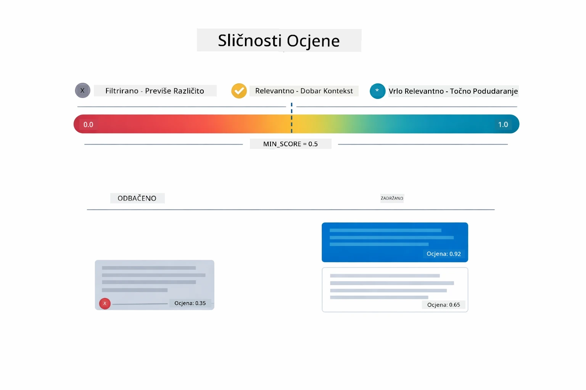

*Ovaj dijagram pokazuje opsege skorova od 0 do 1, s minimalnim pragom od 0.5 koji filtrira irelevantne dijelove.*

Rezultati se kreću od 0 do 1:
- 0.7-1.0: Vrlo relevantno, točno podudaranje
- 0.5-0.7: Relevantno, dobar kontekst
- Ispod 0.5: Filtrirano, previše različito

Sustav dohvaća samo dijelove iznad minimalnog praga da osigura kvalitetu.

Embedinzi dobro funkcioniraju kada značenje jasno klasterira, ali imaju slijepe točke. Dijagram ispod prikazuje uobičajene neuspjehe — dijelovi preveliki proizvode nejasne vektore, premali dijelovi nemaju kontekst, dvosmislene riječi upućuju na više klastera, a pretraživanja po točnom podudaranju (ID-ovi, brojevi dijelova) uopće ne funkcioniraju s embedinzima:

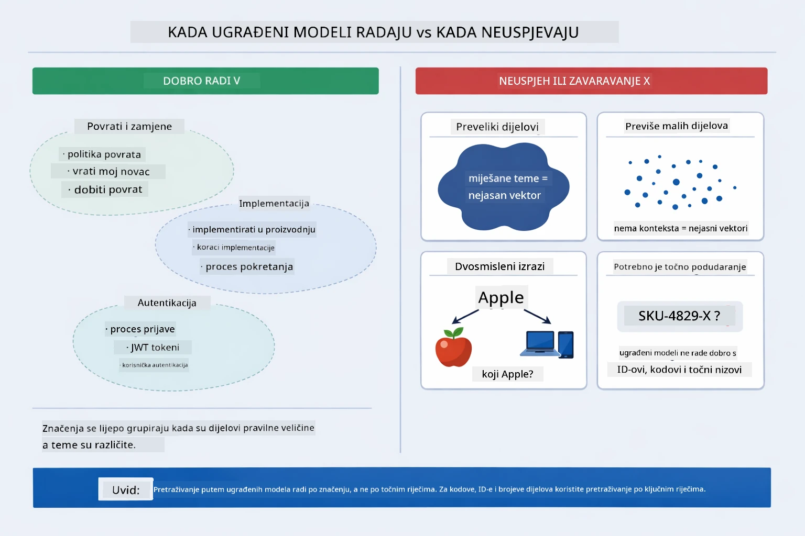

*Ovaj dijagram prikazuje uobičajene načine neuspjeha embedinga: dijelovi preveliki, dijelovi premali, dvosmislene riječi koje upućuju na više klastera, i pretraživanja po točnom podudaranju kao što su ID-ovi.*

### Pohrana u memoriji

Ovaj modul koristi pohranu u memoriji radi jednostavnosti. Kad ponovno pokrenete aplikaciju, učitani dokumenti će biti izgubljeni. Produkcijski sustavi koriste trajne vektorske baze podataka poput Qdrant ili Azure AI Search.

### Upravljanje kontekstnim prozorom

Svaki model ima maksimalni kontekstni prozor. Ne možete uključiti svaki dio velikog dokumenta. Sustav dohvaća top N najrelevantnijih dijelova (zadano 5) da ostane unutar ograničenja, a pritom pruži dovoljno konteksta za točne odgovore.

## Kad je RAG važan

RAG nije uvijek pravi pristup. Donji vodič za odluke pomaže vam odrediti kada RAG dodaje vrijednost, a kada su dovoljni jednostavniji pristupi — poput uključivanja sadržaja direktno u prompt ili oslanjanja na ugrađeno znanje modela:

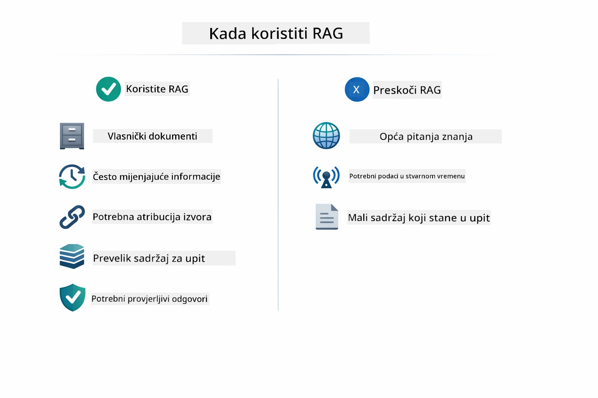

*Ovaj dijagram prikazuje vodič za odluke kada RAG dodaje vrijednost, a kada su dovoljni jednostavniji pristupi.*

**Koristite RAG kada:**
- Odgovarate na pitanja o vlasničkim dokumentima
- Informacije se često mijenjaju (politike, cijene, specifikacije)
- Preciznost zahtijeva navođenje izvora
- Sadržaj je prevelik da stane u jedan prompt
- Trebate provjerljive, utemeljene odgovore

**Nemojte koristiti RAG kada:**
- Pitanja zahtijevaju opće znanje koje model već posjeduje
- Potrebni su podaci u realnom vremenu (RAG radi na učitanim dokumentima)
- Sadržaj je dovoljno malen da se uključi direktno u prompt

## Sljedeći koraci

**Sljedeći modul:** [04-tools - AI agenti s alatima](../04-tools/README.md)

---

**Navigacija:** [← Prethodni: Modul 02 - Inženjerstvo prompta](../02-prompt-engineering/README.md) | [Natrag na početak](../README.md) | [Sljedeći: Modul 04 - Alati →](../04-tools/README.md)

---

<!-- CO-OP TRANSLATOR DISCLAIMER START -->
**Odricanje od odgovornosti**:
Ovaj dokument je preveden pomoću AI prevoditeljskog servisa [Co-op Translator](https://github.com/Azure/co-op-translator). Iako nastojimo osigurati točnost, imajte na umu da automatski prijevodi mogu sadržavati pogreške ili netočnosti. Izvorni dokument na izvornom jeziku treba smatrati autoritativnim izvorom. Za kritične informacije preporučuje se profesionalni ljudski prijevod. Ne snosimo odgovornost za bilo kakva nesporazuma ili pogrešna tumačenja koja proizlaze iz korištenja ovog prijevoda.
<!-- CO-OP TRANSLATOR DISCLAIMER END -->