# Modul 04: AI agenti s alatima

## Sadržaj

- [Što ćete naučiti](../../../04-tools)
- [Preduvjeti](../../../04-tools)
- [Razumijevanje AI agenata s alatima](../../../04-tools)
- [Kako radi pozivanje alata](../../../04-tools)
  - [Definicije alata](../../../04-tools)
  - [Donošenje odluka](../../../04-tools)
  - [Izvršenje](../../../04-tools)
  - [Generiranje odgovora](../../../04-tools)
  - [Arhitektura: Spring Boot automatsko povezivanje](../../../04-tools)
- [Lančanje alata](../../../04-tools)
- [Pokreni aplikaciju](../../../04-tools)
- [Korištenje aplikacije](../../../04-tools)
  - [Isprobaj jednostavnu uporabu alata](../../../04-tools)
  - [Testiraj lančanje alata](../../../04-tools)
  - [Pogledaj tijek razgovora](../../../04-tools)
  - [Eksperimentiraj s različitim zahtjevima](../../../04-tools)
- [Ključni pojmovi](../../../04-tools)
  - [ReAct uzorak (razmišljanje i djelovanje)](../../../04-tools)
  - [Opis alata je važan](../../../04-tools)
  - [Upravljanje sesijom](../../../04-tools)
  - [Rukovanje pogreškama](../../../04-tools)
- [Dostupni alati](../../../04-tools)
- [Kada koristiti agente temeljene na alatima](../../../04-tools)
- [Alati vs RAG](../../../04-tools)
- [Sljedeći koraci](../../../04-tools)

## Što ćete naučiti

Do sada ste naučili kako voditi razgovore s AI, kako učinkovito strukturirati upite i kako temeljiti odgovore na vašim dokumentima. No postoji temeljno ograničenje: jezični modeli mogu generirati samo tekst. Ne mogu provjeriti vremensku prognozu, izračunati, upitavati baze podataka ili komunicirati s vanjskim sustavima.

Alati to mijenjaju. Dajući modelu pristup funkcijama koje može pozvati, pretvarate ga iz generatora teksta u agenta koji može poduzeti radnju. Model odlučuje kada treba alat, koji alat koristiti i koje parametre poslati. Vaš kod izvršava funkciju i vraća rezultat. Model uključuje taj rezultat u svoj odgovor.

## Preduvjeti

- Završeni [Modul 01 - Uvod](../01-introduction/README.md) (Azure OpenAI resursi postavljeni)
- Preporučeno završiti prethodne module (ovaj modul referencira [RAG koncepte iz Modula 03](../03-rag/README.md) u usporedbi Alati vs RAG)
- `.env` datoteka u korijenskom direktoriju s Azure vjerodajnicama (kreirana pomoću `azd up` u Modulu 01)

> **Napomena:** Ako niste završili Modul 01, prvo slijedite tamošnje upute za postavljanje.

## Razumijevanje AI agenata s alatima

> **📝 Napomena:** Termin "agenti" u ovom modulu odnosi se na AI asistente poboljšane mogućnostima pozivanja alata. Ovo se razlikuje od obrazaca **Agentic AI** (autonomni agenti s planiranjem, memorijom i višestupanjskim zaključivanjem) koje ćemo obraditi u [Modulu 05: MCP](../05-mcp/README.md).

Bez alata, jezični model može samo generirati tekst iz podataka na kojima je treniran. Pitajte ga za trenutno vrijeme i on mora nagađati. Dajte mu alate i može pozvati vremenski API, izračunati ili upitati bazu podataka — a zatim upleti te stvarne rezultate u svoj odgovor.

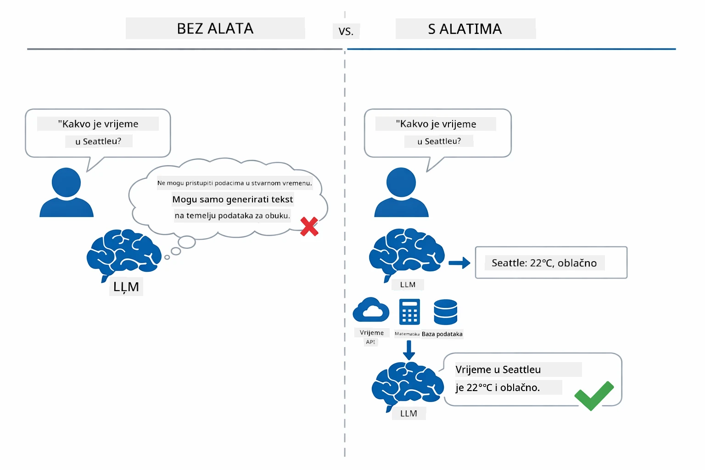

*Bez alata model može samo nagađati — s alatima može pozivati API-je, izračunavati i vraćati podatke u stvarnom vremenu.*

AI agent s alatima slijedi **Razmišljanje i djelovanje (ReAct)** uzorak. Model ne odgovara samo; on razmišlja o tome što treba, djeluje pozivajući alat, promatra rezultat i odlučuje hoće li opet djelovati ili dati konačni odgovor:

1. **Razmišljanje** — Agent analizira korisničko pitanje i određuje koje informacije su mu potrebne
2. **Djelovanje** — Agent odabire pravi alat, generira ispravne parametre i poziva ga
3. **Promatranje** — Agent prima izlaz alata i evaluira rezultat
4. **Ponavljanje ili odgovor** — Ako treba još podataka, agent se vraća koraku; inače sastavlja odgovor prirodnim jezikom

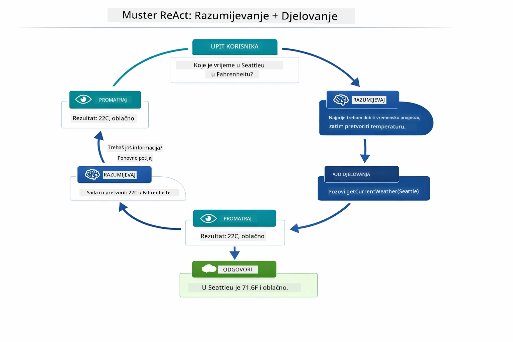

*Ciklus ReAct — agent razmišlja što treba učiniti, djeluje pozivajući alat, promatra rezultat i ponavlja dok ne može dati konačan odgovor.*

Ovo se događa automatski. Definirate alate i njihove opise. Model sam odlučuje kada i kako ih koristiti.

## Kako radi pozivanje alata

### Definicije alata

[WeatherTool.java](../../../04-tools/src/main/java/com/example/langchain4j/agents/tools/WeatherTool.java) | [TemperatureTool.java](../../../04-tools/src/main/java/com/example/langchain4j/agents/tools/TemperatureTool.java)

Definirate funkcije s jasnim opisima i specifikacijama parametara. Model vidi te opise u svom sistemskom promptu i razumije što svaki alat radi.

```java
@Component
public class WeatherTool {
    
    @Tool("Get the current weather for a location")
    public String getCurrentWeather(@P("Location name") String location) {
        // Vaša logika za dohvat podataka o vremenu
        return "Weather in " + location + ": 22°C, cloudy";
    }
}

@AiService
public interface Assistant {
    String chat(@MemoryId String sessionId, @UserMessage String message);
}

// Asistent je automatski povezan putem Spring Boot-a s:
// - ChatModel bean
// - Sve @Tool metode iz @Component klasa
// - ChatMemoryProvider za upravljanje sesijom
```

Dijagram u nastavku razlaže svaku anotaciju i pokazuje kako svaki dio pomaže AI da razumije kada pozvati alat i koje argumente poslati:

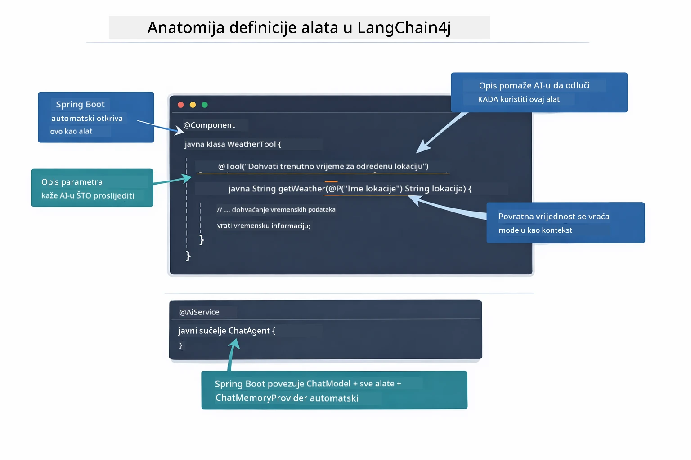

*Anatomija definicije alata — @Tool govori AI kada ga koristiti, @P opisuje svaki parametar, a @AiService povezuje sve zajedno pri pokretanju.*

> **🤖 Isprobajte s [GitHub Copilot](https://github.com/features/copilot) Chat:** Otvorite [`WeatherTool.java`](../../../04-tools/src/main/java/com/example/langchain4j/agents/tools/WeatherTool.java) i pitajte:
> - "Kako bih integrirao stvarni vremenski API poput OpenWeatherMap umjesto lažnih podataka?"
> - "Što čini dobar opis alata koji pomaže AI da ga ispravno koristi?"
> - "Kako se nosim s pogreškama API-ja i ograničenjima u alatima?"

### Donošenje odluka

Kad korisnik pita "Kakvo je vrijeme u Seattleu?", model ne bira alat nasumce. Uspoređuje korisničku namjeru sa svim opisima alata kojima ima pristup, ocjenjuje svaki po relevantnosti i odabire najbolju podudarnost. Potom generira strukturirani poziv funkciji s pravim parametrima — u ovom slučaju, postavljajući `location` na `"Seattle"`.

Ako nijedan alat ne odgovara zahtjevu korisnika, model se vraća odgovaranju iz vlastitog znanja. Ako se više alata podudara, bira najspecifičniji.

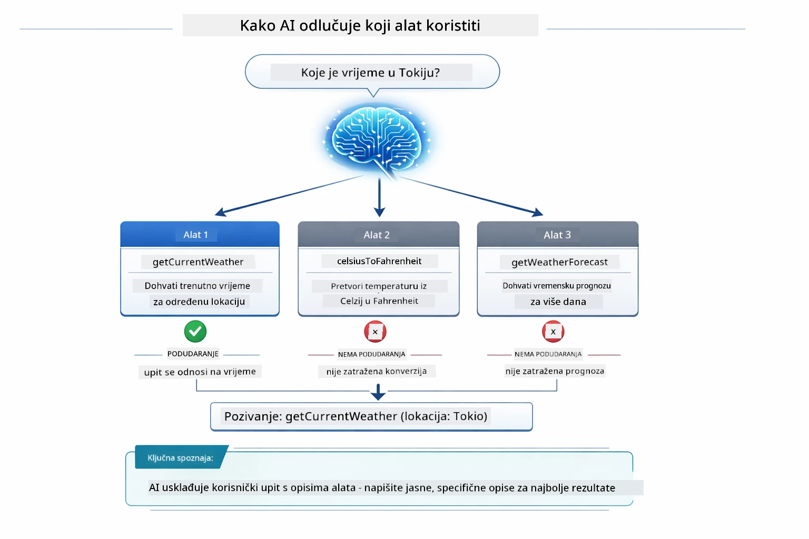

*Model evaluira svaki dostupan alat prema korisničkoj namjeri i bira najbolju podudarnost — zato je važno pisati jasne i specifične opise alata.*

### Izvršenje

[AgentService.java](../../../04-tools/src/main/java/com/example/langchain4j/agents/service/AgentService.java)

Spring Boot automatski povezuje deklarativni `@AiService` sučelje sa svim registriranim alatima, a LangChain4j automatski izvršava pozive alatu. Iza scene, kompletan poziv alatu prolazi kroz šest faza — od korisničkog pitanja prirodnim jezikom sve do konačnog odgovora:

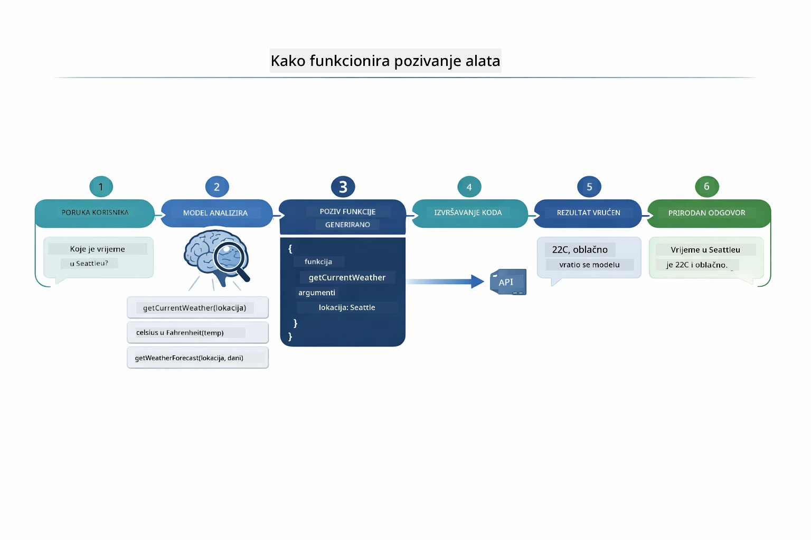

*Cjelokupni tijek — korisnik postavi pitanje, model odabere alat, LangChain4j izvrši alat, a model uplete rezultat u prirodni odgovor.*

Ako ste pokrenuli [ToolIntegrationDemo](../../../00-quick-start/src/main/java/com/example/langchain4j/quickstart/ToolIntegrationDemo.java) u Modulu 00, već ste vidjeli ovaj obrazac u akciji — alati `Calculator` su pozivani na isti način. Sljedeći dijagram sekvenci prikazuje točno što se odvilo tijekom te demonstracije:

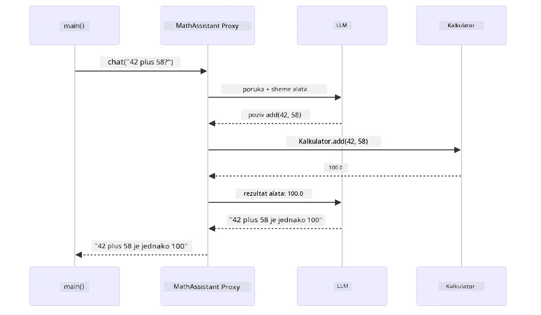

*Petlja pozivanja alata iz Quick Start demonstracije — `AiServices` šalje vašu poruku i šeme alata LLM-u, LLM odgovara pozivom funkcije poput `add(42, 58)`, LangChain4j lokalno izvršava `Calculator` metodu i vraća rezultat za konačni odgovor.*

> **🤖 Isprobajte s [GitHub Copilot](https://github.com/features/copilot) Chat:** Otvorite [`AgentService.java`](../../../04-tools/src/main/java/com/example/langchain4j/agents/service/AgentService.java) i pitajte:
> - "Kako radi ReAct uzorak i zašto je učinkovit za AI agente?"
> - "Kako agent odlučuje koji alat koristiti i kojim redoslijedom?"
> - "Što se događa ako izvršenje alata ne uspije - kako robustno rukovati pogreškama?"

### Generiranje odgovora

Model prima vremenske podatke i formatira ih u prirodni jezični odgovor korisniku.

### Arhitektura: Spring Boot automatsko povezivanje

Ovaj modul koristi LangChain4j integraciju sa Spring Bootom putem deklarativnih `@AiService` sučelja. Pri pokretanju, Spring Boot pronalazi svaki `@Component` koji sadrži `@Tool` metode, vaš `ChatModel` bean i `ChatMemoryProvider` — te sve povezuje u jedno `Assistant` sučelje bez dodatnog koda.

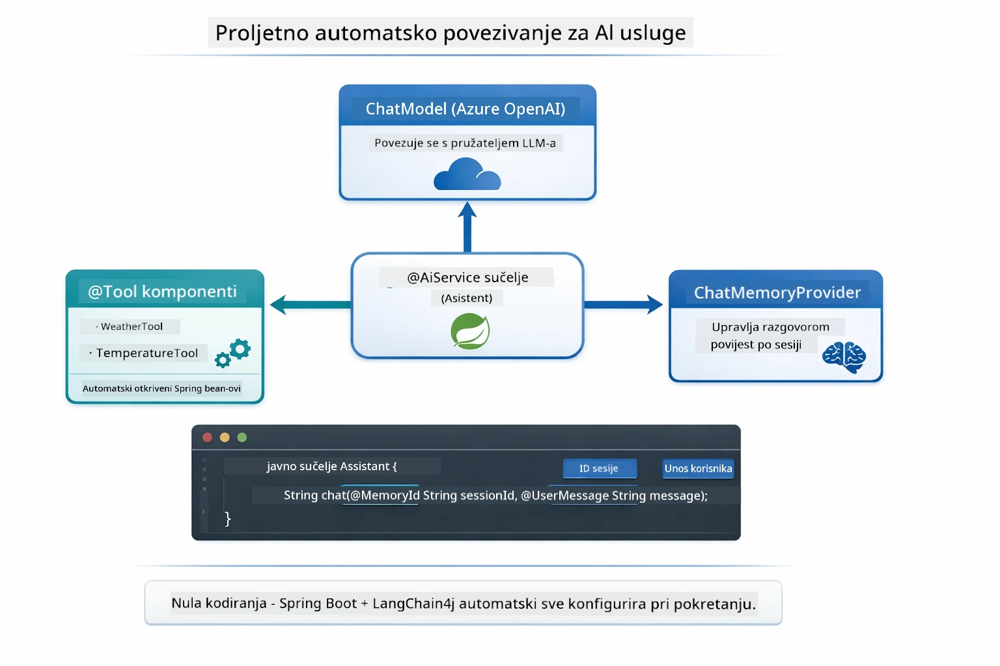

*@AiService sučelje povezuje ChatModel, komponente alata i pružatelja memorije — Spring Boot automatski rješava svu povezanost.*

Evo cijelog tijeka zahtjeva kao dijagram sekvence — od HTTP zahtjeva, kroz controller, servis i automatski povezani proxy, sve do izvršenja alata i natrag:

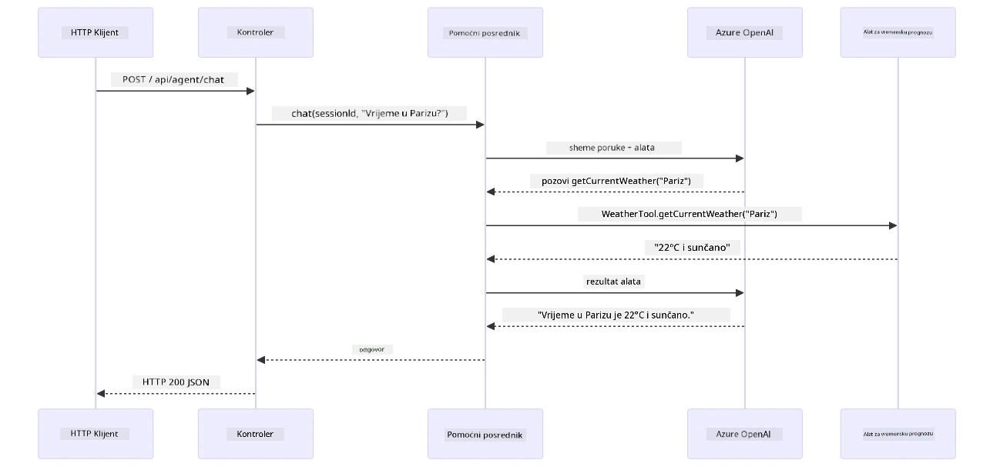

*Cjelokupni tijek zahtjeva u Spring Bootu — HTTP zahtjev prolazi kroz controller i servis do automatski povezanog Assistant proxyja koji orkestrira LLM i pozive alata automatski.*

Ključne prednosti ovog pristupa:

- **Spring Boot automatsko povezivanje** — ChatModel i alati se automatski injektiraju
- **@MemoryId uzorak** — Automatsko upravljanje memorijom po sesiji
- **Jedinstvena instanca** — Assistant se stvara jednom i ponovno koristi radi bolje izvedbe
- **Izvršenje tipova sigurno** — Java metode se pozivaju izravno s konverzijom tipova
- **Orkestracija višestrukih koraka** — Automatski se brine o lančanju alata
- **Nema nepotrebnog koda** — Nema ručnih poziva `AiServices.builder()` ili memorijskih HashMapa

Alternativni pristupi (ručni `AiServices.builder()`) zahtijevaju više koda i ne iskorištavaju prednosti Spring Boot integracije.

## Lančanje alata

**Lančanje alata** — Stvarna snaga agenata temeljenih na alatima dolazi kada jedno pitanje zahtijeva više alata. Pitajte "Kakvo je vrijeme u Seattleu u Fahrenheitima?" i agent automatski spoji dva alata: najprije pozove `getCurrentWeather` da dobije temperaturu u Celzijusima, zatim taj rezultat proslijedi u `celsiusToFahrenheit` za konverziju — sve u jednom razgovoru.

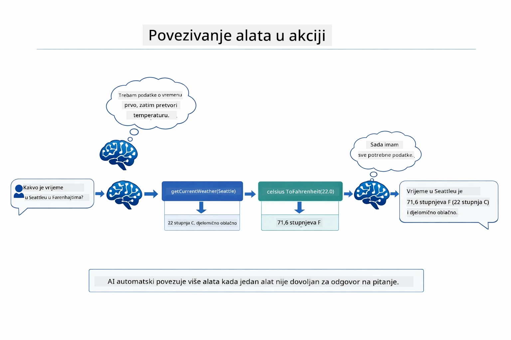

*Lančanje alata u praksi — agent prvo poziva getCurrentWeather, zatim šalje rezultat u Celzijusima u celsiusToFahrenheit i daje objedinjeni odgovor.*

**Graceful neuspjesi** — Pitajte za vrijeme u gradu koji nije u lažnim podacima. Alat vraća poruku o pogrešci, a AI objašnjava da ne može pomoći umjesto da se aplikacija sruši. Alati neuspjehe obrađuju sigurno. Dijagram u nastavku prikazuje kontrast dvaju pristupa — uz ispravno rukovanje pogreškom agent uhvati iznimku i odgovara korisno, dok bez tog rukovanja cijela aplikacija pada:

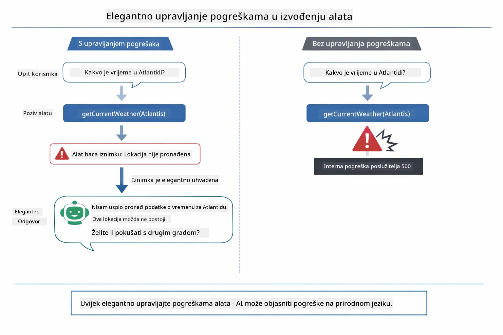

*Kada alat ne uspije, agent uhvati pogrešku i odgovara sa smislenim pojašnjenjem umjesto rušenja.*

Ovo se događa u jednom koraku razgovora. Agent samostalno upravlja pozivima više alata.

## Pokreni aplikaciju

**Provjeri postavljanje:**

Provjeri da `.env` datoteka postoji u korijenskom direktoriju s Azure vjerodajnicama (kreirana tijekom Modula 01). Pokreni ovo iz direktorija modula (`04-tools/`):

**Bash:**
```bash
cat ../.env  # Trebalo bi prikazati AZURE_OPENAI_ENDPOINT, API_KEY, DEPLOYMENT
```

**PowerShell:**
```powershell
Get-Content ..\.env  # Trebalo bi prikazati AZURE_OPENAI_ENDPOINT, API_KEY, DEPLOYMENT
```

**Pokreni aplikaciju:**

> **Napomena:** Ako ste već pokrenuli sve aplikacije s `./start-all.sh` iz korijenskog direktorija (kako je opisano u Modulu 01), ovaj modul već radi na portu 8084. Možete preskočiti naredbe za pokretanje i odmah otići na http://localhost:8084.

**Opcija 1: Korištenje Spring Boot nadzorne ploče (Preporučeno za VS Code korisnike)**

Razvojni kontejner uključuje ekstenziju Spring Boot Dashboard koja pruža vizualno sučelje za upravljanje svim Spring Boot aplikacijama. Možete ju pronaći u Aktivnostnoj traci na lijevoj strani VS Codea (ikona Spring Boota).

Sa Spring Boot nadzornom pločom možete:
- Vidjeti sve dostupne Spring Boot aplikacije u radnom prostoru
- Pokrenuti/zaustaviti aplikacije jednim klikom
- Pratiti zapisnike aplikacije u stvarnom vremenu
- Nadzirati status aplikacije

Samo kliknite gumb za pokretanje uz "tools" da pokrenete ovaj modul, ili pokrenite sve module odjednom.

Evo kako izgleda Spring Boot Dashboard u VS Codeu:


*Spring Boot nadzorna ploča u VS Codeu — pokrenite, zaustavite i pratite sve module na jednom mjestu*

**Opcija 2: Korištenje shell skripti**

Pokrenite sve web aplikacije (module 01-04):

**Bash:**
```bash
cd ..  # Iz korijenskog direktorija
./start-all.sh
```

**PowerShell:**
```powershell
cd ..  # Iz korijenskog direktorija
.\start-all.ps1
```

Ili pokrenite samo ovaj modul:

**Bash:**
```bash
cd 04-tools
./start.sh
```

**PowerShell:**
```powershell
cd 04-tools
.\start.ps1
```

Oba skripta automatski učitavaju varijable okruženja iz korijenske `.env` datoteke i izgradit će JAR datoteke ako ne postoje.

> **Napomena:** Ako želite izgraditi sve module ručno prije pokretanja:
>
> **Bash:**
> ```bash
> cd ..  # Go to root directory
> mvn clean package -DskipTests
> ```
>
> **PowerShell:**
> ```powershell
> cd ..  # Go to root directory
> mvn clean package -DskipTests
> ```

Otvorite http://localhost:8084 u svom pregledniku.

**Za zaustavljanje:**

**Bash:**
```bash
./stop.sh  # Samo ovaj modul
# Ili
cd .. && ./stop-all.sh  # Svi moduli
```

**PowerShell:**
```powershell
.\stop.ps1  # Samo ovaj modul
# Ili
cd ..; .\stop-all.ps1  # Svi moduli
```

## Korištenje aplikacije

Aplikacija pruža web sučelje gdje možete komunicirati s AI agentom koji ima pristup alatima za vremensku prognozu i konverziju temperature. Ovako izgleda sučelje — uključuje primjere za brz početak i panel za chat za slanje zahtjeva:

<a href="images/tools-homepage.png"></a>

*Sučelje AI Agenta za alate - brzi primjeri i chat sučelje za interakciju s alatima*

### Isprobajte jednostavnu upotrebu alata

Počnite s jednostavnim zahtjevom: "Pretvori 100 stupnjeva Fahrenheit u Celzijeve stupnjeve". Agent prepoznaje da treba alat za konverziju temperature, poziva ga s odgovarajućim parametrima i vraća rezultat. Primijetite koliko je to prirodno — niste specificirali koji alat koristiti niti kako ga pozvati.

### Testirajte povezivanje alata

Sada pokušajte nešto složenije: "Kakvo je vrijeme u Seattleu i pretvori ga u Fahrenheit?" Promatrajte kako agent radi korak po korak. Prvo dobiva vremensku prognozu (koja vraća Celzijeve stupnjeve), zatim prepoznaje da treba konvertirati u Fahrenheit, poziva alat za konverziju i kombinira oba rezultata u jedan odgovor.

### Pogledajte tijek razgovora

Chat sučelje održava povijest razgovora, omogućujući višekratnu interakciju. Možete vidjeti sve prethodne upite i odgovore, što olakšava praćenje razgovora i razumijevanje kako agent gradi kontekst kroz više razmjena.

<a href="images/tools-conversation-demo.png"></a>

*Višekratni razgovor koji prikazuje jednostavne konverzije, vremenske preglede i povezivanje alata*

### Eksperimentirajte s različitim zahtjevima

Isprobajte razne kombinacije:
- Pregled vremena: "Kakvo je vrijeme u Tokiju?"
- Konverzije temperature: "Koliko je 25°C u Kelvinima?"
- Kombinirani upiti: "Provjeri vrijeme u Parizu i reci mi je li iznad 20°C"

Primijetite kako agent interpretira prirodni jezik i povezuje ga s odgovarajućim pozivima alata.

## Ključni pojmovi

### ReAct uzorak (razmišljanje i djelovanje)

Agent izmjenjuje razmišljanje (odlučivanje što učiniti) i djelovanje (korištenje alata). Ovaj uzorak omogućuje autonomno rješavanje problema umjesto samo odgovaranja na naredbe.

### Opisi alata su važni

Kvaliteta opisa vaših alata izravno utječe na to koliko dobro ih agent koristi. Jasni, specifični opisi pomažu modelu razumjeti kada i kako pozvati svaki alat.

### Upravljanje sesijama

`@MemoryId` anotacija omogućuje automatsko upravljanje memojijom baziranom na sesiji. Svaki ID sesije dobiva vlastitu `ChatMemory` instancu kojom upravlja `ChatMemoryProvider` bean, tako da više korisnika može interagirati s agentom istovremeno bez da se njihovi razgovori miješaju. Sljedeći dijagram pokazuje kako su višestruki korisnici usmjereni na izolirane memorijske pohrane na temelju svojih ID-jeva sesije:

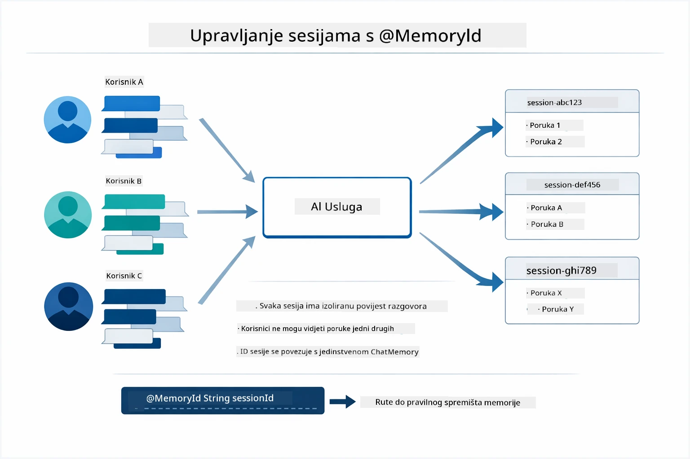

*Svaki ID sesije mapira se na izoliranu povijest razgovora — korisnici nikada ne vide poruke drugih.*

### Obrada pogrešaka

Alati mogu zakašljati — API-ji imaju timeout, parametri mogu biti neispravni, vanjske usluge mogu biti nedostupne. Produkcijski agenti trebaju obradu pogrešaka kako bi model mogao objasniti probleme ili pokušati alternative umjesto da cijela aplikacija padne. Kad alat baci iznimku, LangChain4j ju hvata i prosljeđuje poruku o pogrešci natrag modelu, koji može objasniti problem prirodnim jezikom.

## Dostupni alati

Dijagram ispod pokazuje široki ekosustav alata koje možete izgraditi. Ovaj modul demonstrira alate za vrijeme i temperaturu, ali isti `@Tool` uzorak radi za bilo koju Java metodu — od upita baza podataka do obrade plaćanja.

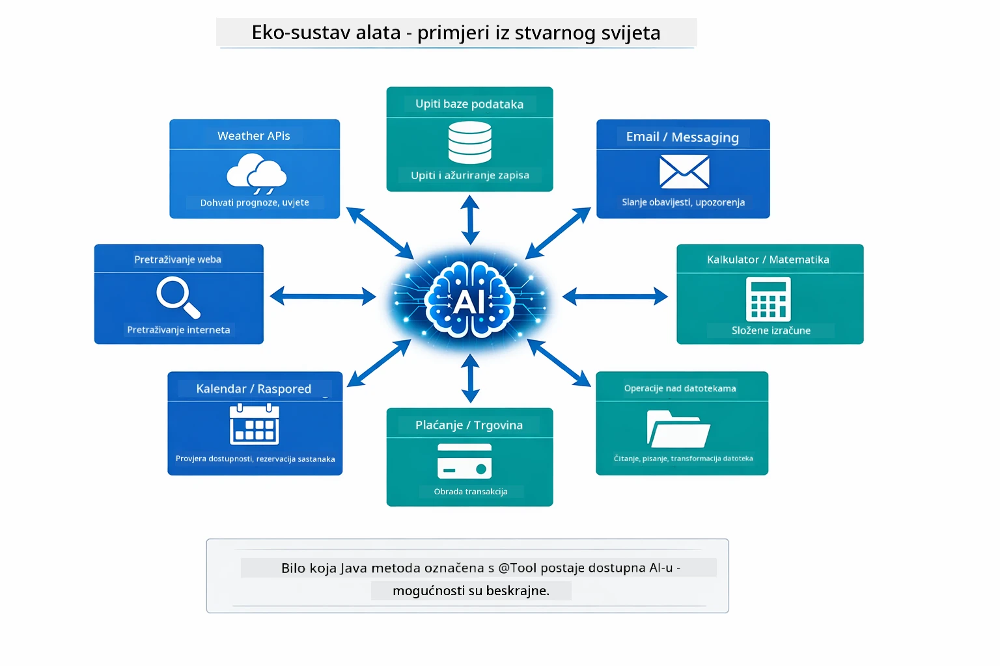

*Bilo koja Java metoda označena s @Tool postaje dostupna AI-u — uzorak se širi na baze podataka, API-je, email, upravljanje datotekama i više.*

## Kada koristiti agente bazirane na alatima

Ne treba svaki zahtjev alate. Odluka ovisi o tome treba li AI komunicirati s vanjskim sustavima ili može odgovarati iz vlastitog znanja. Sljedeći vodič sažima kada alati donose vrijednost, a kada nisu potrebni:

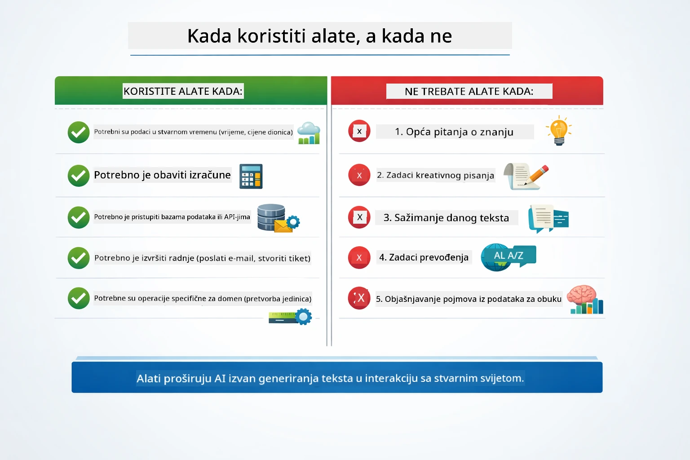

*Brzi vodič za odluku — alati su za realne podatke, izračune i akcije; opće znanje i kreativni zadaci ih ne zahtijevaju.*

## Alati vs RAG

Moduli 03 i 04 oba proširuju što AI može raditi, ali na bitno različite načine. RAG daje modelu pristup **znanju** dohvaćanjem dokumenata. Alati daju modelu mogućnost izvođenja **akcija** pozivanjem funkcija. Dijagram ispod uspoređuje ta dva pristupa jedno pored drugog — od kako svaki radni tijek funkcionira do kompromisa između njih:

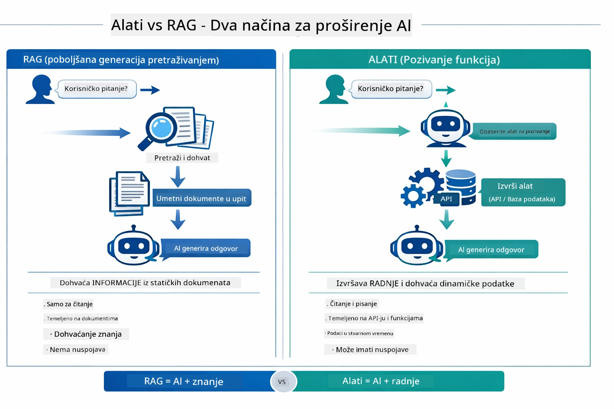

*RAG dohvaća informacije iz statičnih dokumenata — Alati izvršavaju akcije i dohvaćaju dinamične, stvarne podatke. Mnogi produkcijski sustavi kombiniraju oba.*

U praksi, mnogi produkcijski sustavi kombiniraju oba pristupa: RAG za učvršćivanje odgovora u vašoj dokumentaciji, i Alati za dohvat živih podataka ili izvođenje operacija.

## Sljedeći koraci

**Sljedeći modul:** [05-mcp - Model Context Protocol (MCP)](../05-mcp/README.md)

---

**Navigacija:** [← Prethodno: Modul 03 - RAG](../03-rag/README.md) | [Natrag na početnu](../README.md) | [Sljedeće: Modul 05 - MCP →](../05-mcp/README.md)

---

<!-- CO-OP TRANSLATOR DISCLAIMER START -->
**Odricanje od odgovornosti**:  
Ovaj dokument preveden je korištenjem AI prevodilačke usluge [Co-op Translator](https://github.com/Azure/co-op-translator). Iako nastojimo postići točnost, molimo imajte na umu da automatski prijevodi mogu sadržavati pogreške ili netočnosti. Izvorni dokument na izvornom jeziku treba smatrati autoritativnim izvorom. Za važne informacije preporučuje se profesionalni ljudski prijevod. Ne snosimo odgovornost za bilo kakva nesporazuma ili pogrešna tumačenja koja proizlaze iz korištenja ovog prijevoda.
<!-- CO-OP TRANSLATOR DISCLAIMER END -->