# Modul 05: Protokol konteksta modela (MCP)

## Sadržaj

- [Što ćete naučiti](../../../05-mcp)
- [Što je MCP?](../../../05-mcp)
- [Kako MCP radi](../../../05-mcp)
- [Agentni modul](../../../05-mcp)
- [Pokretanje primjera](../../../05-mcp)
  - [Preduvjeti](../../../05-mcp)
- [Brzi početak](../../../05-mcp)
  - [Rad s datotekama (Stdio)](../../../05-mcp)
  - [Nadzorni agent](../../../05-mcp)
    - [Pokretanje demonstracije](../../../05-mcp)
    - [Kako radi nadzornik](../../../05-mcp)
    - [Strategije odgovora](../../../05-mcp)
    - [Razumijevanje izlaza](../../../05-mcp)
    - [Objašnjenje značajki agentnog modula](../../../05-mcp)
- [Ključni pojmovi](../../../05-mcp)
- [Čestitke!](../../../05-mcp)
  - [Što slijedi?](../../../05-mcp)

## Što ćete naučiti

Izgradili ste konverzacijski AI, svladali ste promptove, temeljili odgovore na dokumentima i kreirali agente s alatima. Ali svi ti alati bili su prilagođeni vašoj specifičnoj aplikaciji. Što ako biste AI-ju mogli dati pristup standardiziranom ekosustavu alata koje bilo tko može stvoriti i dijeliti? U ovom modulu naučit ćete kako upravo to postići s Protokolom konteksta modela (MCP) i agentnim modulom LangChain4j. Prvo prikazujemo jednostavan MCP čitač datoteka, a zatim pokazujemo kako se lako integrira u napredne agentne tijekove rada koristeći obrazac Nadzorni agent.

## Što je MCP?

Protokol konteksta modela (MCP) pruža upravo to - standardiziran način da AI aplikacije otkrivaju i koriste vanjske alate. Umjesto pisanja prilagođenih integracija za svaki izvor podataka ili uslugu, spojite se na MCP servere koji izlažu svoje mogućnosti u dosljednom formatu. Vaš AI agent tada može automatski otkriti i koristiti te alate.


*Prije MCP: složene točkaste integracije. Nakon MCP: jedan protokol, beskonačne mogućnosti.*

MCP rješava osnovni problem u razvoju AI-a: svaka integracija je prilagođena. Želite pristup GitHubu? Prilagođeni kod. Želite čitati datoteke? Prilagođeni kod. Želite upit u bazu podataka? Prilagođeni kod. I nijedna od tih integracija ne radi s drugim AI aplikacijama.

MCP to standardizira. MCP server izlaže alate s jasnim opisima i shemama. Bilo koji MCP klijent se može spojiti, otkriti dostupne alate i koristiti ih. Izgradi jednom, koristi svugdje.


*Arhitektura Protokola konteksta modela - standardizirano otkrivanje i izvršenje alata*

## Kako MCP radi

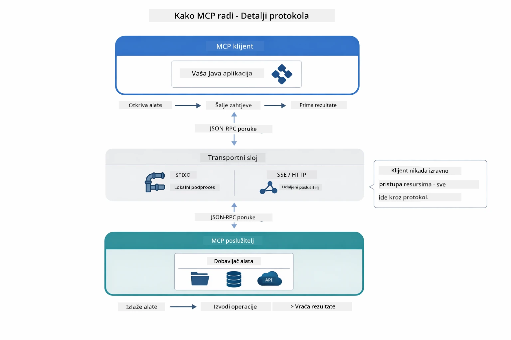

*Kako MCP radi ispod haube — klijenti otkrivaju alate, razmjenjuju JSON-RPC poruke i izvršavaju operacije kroz transportni sloj.*

**Arhitektura poslužitelj-klijent**

MCP koristi model poslužitelj-klijent. Poslužitelji pružaju alate - čitanje datoteka, upite baza podataka, pozive API-ja. Klijenti (vaša AI aplikacija) se spajaju na poslužitelje i koriste njihove alate.

Da biste koristili MCP s LangChain4j, dodajte ovu Maven ovisnost:

```xml
<dependency>
    <groupId>dev.langchain4j</groupId>
    <artifactId>langchain4j-mcp</artifactId>
    <version>${langchain4j.version}</version>
</dependency>
```

**Otkrivanje alata**

Kad se vaš klijent spoji na MCP poslužitelj, pita "Koje alate imate?" Poslužitelj odgovara popisom dostupnih alata, svaki s opisima i parametrima. Vaš AI agent tada može odlučiti koje alate koristiti na temelju korisničkih zahtjeva.

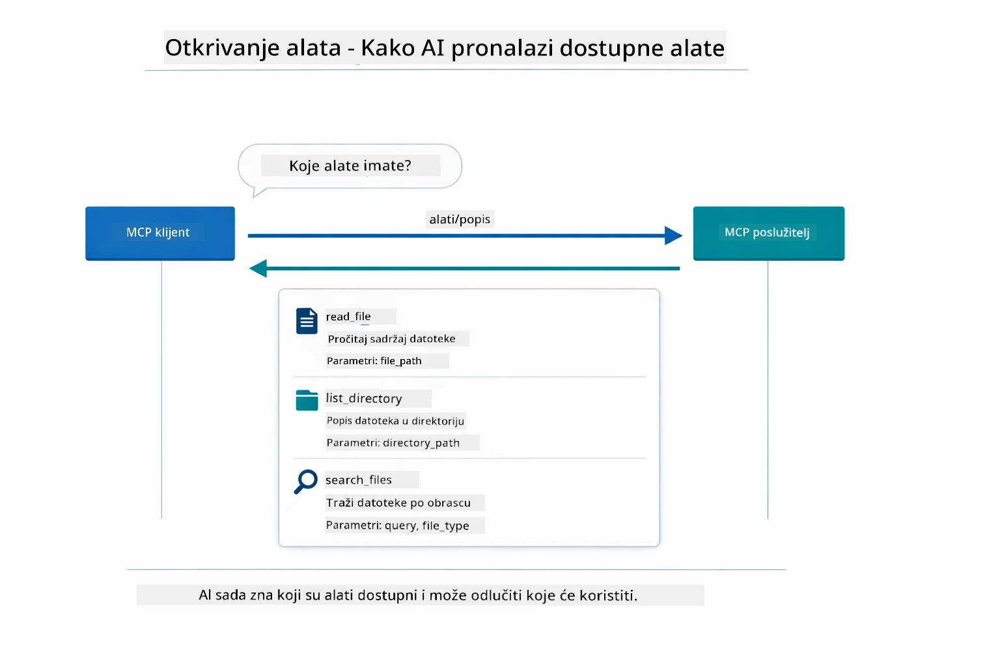

*AI otkriva dostupne alate pri pokretanju — sada zna koje mogućnosti postoje i može odlučiti koje koristiti.*

**Transportni mehanizmi**

MCP podržava različite transportne mehanizme. Ovaj modul demonstrira Stdio transport za lokalne procese:


*Transportni mehanizmi MCP-a: HTTP za udaljene servere, Stdio za lokalne procese*

**Stdio** - [StdioTransportDemo.java](../../../05-mcp/src/main/java/com/example/langchain4j/mcp/StdioTransportDemo.java)

Za lokalne procese. Vaša aplikacija pokreće poslužitelj kao potproces i komunicira putem standardnog ulaza/izlaza. Korisno za pristup datotečnom sustavu ili alatima naredbene linije.

```java
McpTransport stdioTransport = new StdioMcpTransport.Builder()
    .command(List.of(
        npmCmd, "exec",
        "@modelcontextprotocol/server-filesystem@2025.12.18",
        resourcesDir
    ))
    .logEvents(false)
    .build();
```

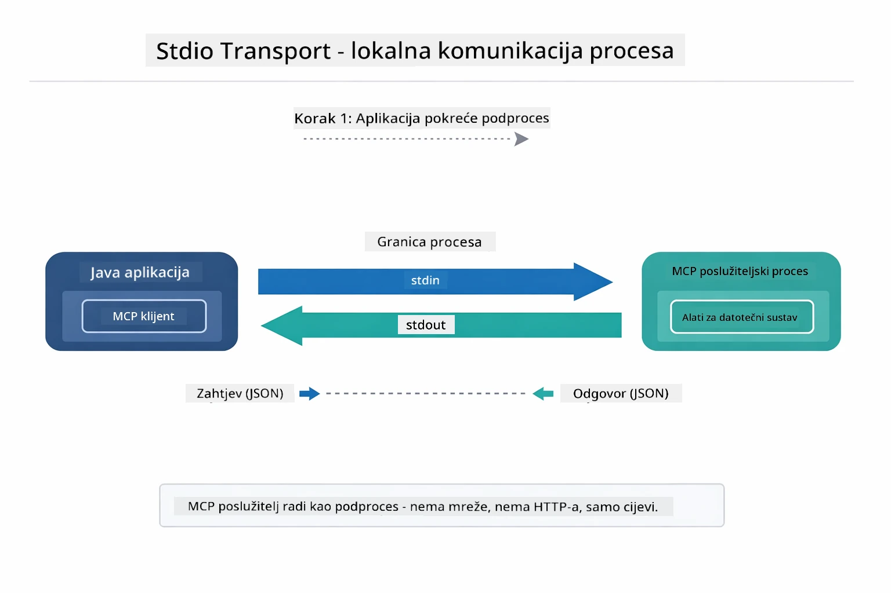

*Stdio transport u akciji — vaša aplikacija pokreće MCP poslužitelj kao dijete procesa i komunicira putem pipova stdin/stdout.*

> **🤖 Isprobajte s [GitHub Copilot](https://github.com/features/copilot) Chat:** Otvorite [`StdioTransportDemo.java`](../../../05-mcp/src/main/java/com/example/langchain4j/mcp/StdioTransportDemo.java) i pitajte:
> - "Kako radi Stdio transport i kada bih ga trebao koristiti umjesto HTTP-a?"
> - "Kako LangChain4j upravlja životnim ciklusom pokrenutih MCP poslužiteljskih procesa?"
> - "Koji su sigurnosni rizici davanja AI pristupa datotečnom sustavu?"

## Agentni modul

Dok MCP pruža standardizirane alate, LangChain4j-ev **agentni modul** pruža deklarativni način izgradnje agenata koji orkestriraju te alate. `@Agent` anotacija i `AgenticServices` omogućuju definiranje ponašanja agenta putem sučelja umjesto imperativnog koda.

U ovom modulu istražit ćete obrazac **Nadzorni agent** — napredni agentni AI pristup gdje "nadzornik" dinamički odlučuje koje pod-agente pozvati temeljem korisničkih zahtjeva. Kombinirat ćemo oba koncepta dajući jednom od naših pod-agenta MCP-pokretane mogućnosti pristupa datotekama.

Da biste koristili agentni modul, dodajte ovu Maven ovisnost:

```xml
<dependency>
    <groupId>dev.langchain4j</groupId>
    <artifactId>langchain4j-agentic</artifactId>
    <version>${langchain4j.mcp.version}</version>
</dependency>
```

> **⚠️ Eksperimentalno:** `langchain4j-agentic` modul je **eksperimentalan** i podložan promjenama. Stabilan način izgradnje AI asistenata i dalje je `langchain4j-core` s prilagođenim alatima (Modul 04).

## Pokretanje primjera

### Preduvjeti

- Java 21+, Maven 3.9+
- Node.js 16+ i npm (za MCP servere)
- Okolišne varijable konfigurirane u `.env` datoteci (iz korijenskog direktorija):
  - `AZURE_OPENAI_ENDPOINT`, `AZURE_OPENAI_API_KEY`, `AZURE_OPENAI_DEPLOYMENT` (isto kao u Modulima 01-04)

> **Napomena:** Ako još niste postavili okolišne varijable, pogledajte [Modul 00 - Brzi početak](../00-quick-start/README.md) za upute ili kopirajte `.env.example` u `.env` u korijenskom direktoriju i upišite svoje vrijednosti.

## Brzi početak

**Koristeći VS Code:** Jednostavno kliknite desnim klikom na bilo koju demo datoteku u Exploreru i odaberite **"Run Java"**, ili koristite konfiguracije pokretanja iz Run and Debug panela (prvo se pobrinite da ste dodali svoj token u `.env` datoteku).

**Koristeći Maven:** Alternativno, možete pokrenuti s naredbenog retka s primjerima u nastavku.

### Rad s datotekama (Stdio)

Ovo demonstrira lokalne alate na bazi potprocesa.

**✅ Nema potrebnih preduvjeta** - MCP server se pokreće automatski.

**Korištenje start skripti (preporučeno):**

Start skripte automatski učitavaju okolišne varijable iz korijenske `.env` datoteke:

**Bash:**
```bash
cd 05-mcp
chmod +x start-stdio.sh
./start-stdio.sh
```

**PowerShell:**
```powershell
cd 05-mcp
.\start-stdio.ps1
```

**Koristeći VS Code:** Kliknite desnim klikom na `StdioTransportDemo.java` i odaberite **"Run Java"** (provjerite da vam je `.env` datoteka konfigurirana).

Aplikacija automatski pokreće MCP poslužitelj za datotečni sustav i čita lokalnu datoteku. Primijetite kako se upravljanje potprocesima odvija za vas.

**Očekivani izlaz:**
```
Assistant response: The file provides an overview of LangChain4j, an open-source Java library
for integrating Large Language Models (LLMs) into Java applications...
```

### Nadzorni agent

Obrazac **Nadzorni agent** je **fleksibilan** oblik agentnog AI-a. Nadzornik koristi LLM da autonomno odluči koje agente pozvati na temelju korisničkog zahtjeva. U sljedećem primjeru kombiniramo MCP-pokretani pristup datotekama s LLM agentom kako bismo kreirali nadzirani tijek rada čitanja datoteka → izvještaja.

U demonstraciji, `FileAgent` čita datoteku koristeći MCP alate datotečnog sustava, a `ReportAgent` generira strukturirani izvještaj s izvršnim sažetkom (1 rečenica), 3 ključne točke i preporuke. Nadzornik orkestrira ovaj tijek automatski:

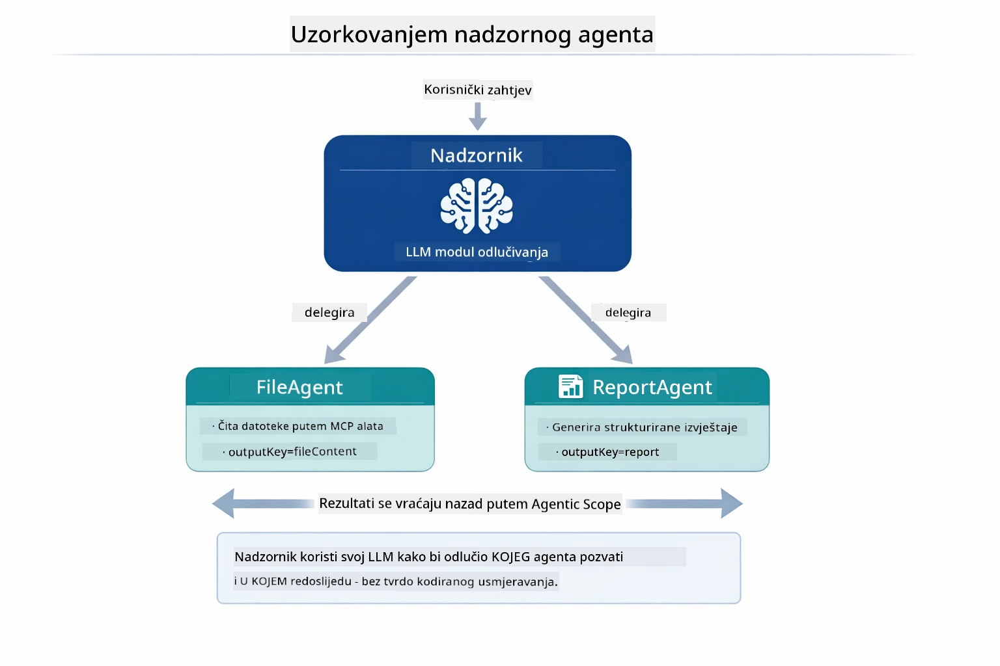

*Nadzornik koristi svoj LLM da odluči koje agente pozvati i kojim redoslijedom — bez hardkodiranog usmjeravanja.*

Evo kako izgleda konkretan tijek rada za naš pipeline od datoteke do izvještaja:

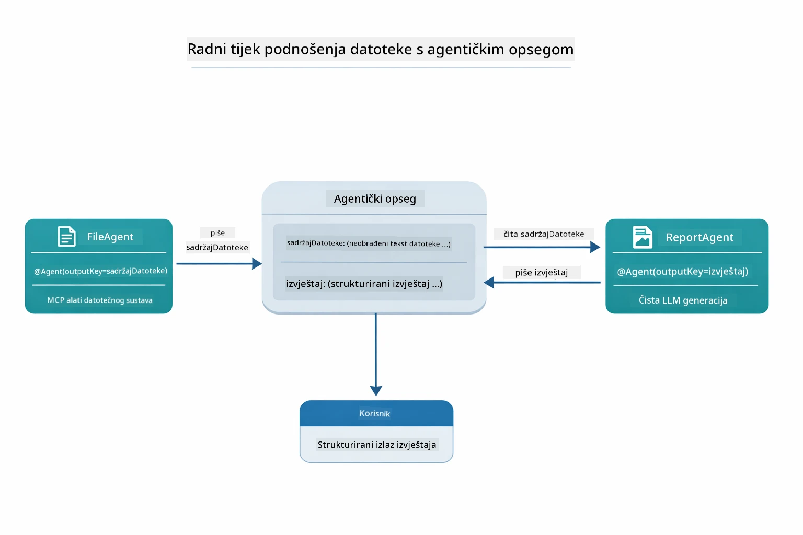

*FileAgent čita datoteku preko MCP alata, zatim ReportAgent pretvara sirovi sadržaj u strukturirani izvještaj.*

Svaki agent sprema svoj izlaz u **Agentni obuhvat** (zajedničku memoriju), čime dopusti sljedećim agentima pristup ranijim rezultatima. Ovo pokazuje kako MCP alati besprijekorno integriraju u agentne tijekove rada — Nadzornik ne mora znati *kako* se datoteke čitaju, samo da to `FileAgent` može obaviti.

#### Pokretanje demonstracije

Start skripte automatski učitavaju okolišne varijable iz korijenske `.env` datoteke:

**Bash:**
```bash
cd 05-mcp
chmod +x start-supervisor.sh
./start-supervisor.sh
```

**PowerShell:**
```powershell
cd 05-mcp
.\start-supervisor.ps1
```

**Koristeći VS Code:** Kliknite desnim klikom na `SupervisorAgentDemo.java` i odaberite **"Run Java"** (provjerite da vam je `.env` datoteka konfigurirana).

#### Kako radi nadzornik

```java
// Korak 1: FileAgent čita datoteke koristeći MCP alate
FileAgent fileAgent = AgenticServices.agentBuilder(FileAgent.class)
        .chatModel(model)
        .toolProvider(mcpToolProvider)  // Ima MCP alate za rad s datotekama
        .build();

// Korak 2: ReportAgent generira strukturirane izvještaje
ReportAgent reportAgent = AgenticServices.agentBuilder(ReportAgent.class)
        .chatModel(model)
        .build();

// Supervisor orkestrira tijek rada datoteka → izvještaj
SupervisorAgent supervisor = AgenticServices.supervisorBuilder()
        .chatModel(model)
        .subAgents(fileAgent, reportAgent)
        .responseStrategy(SupervisorResponseStrategy.LAST)  // Vratite konačni izvještaj
        .build();

// Supervisor odlučuje koje agente pozvati na temelju zahtjeva
String response = supervisor.invoke("Read the file at /path/file.txt and generate a report");
```

#### Strategije odgovora

Kad konfigurirate `SupervisorAgent`, određujete kako bi trebao formulirati konačni odgovor korisniku nakon što pod-agenti završe zadatke.

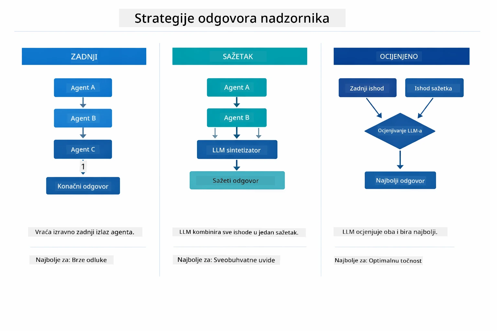

*Tri strategije za način na koji Nadzornik formulira svoj završni odgovor — odaberite prema tome želite li zadnji izlaz agenta, sažetak ili najbolje ocijenjenu opciju.*

Dostupne strategije su:

| Strategija | Opis |
|------------|-------|
| **LAST** | nadzornik vraća izlaz posljednjeg pozvanog pod-agenta ili alata. Korisno je kada je zadnji agent u tijeku rada posebno dizajniran za proizvodnju kompletnog konačnog odgovora (npr. "Agent sažetka" u istraživačkom tijeku). |
| **SUMMARY** | nadzornik koristi vlastiti interni jezični model (LLM) za sintezu sažetka cijele interakcije i svih izlaza pod-agenta, a zatim vraća taj sažetak kao konačni odgovor. Ovo pruža čist, objedinjeni odgovor korisniku. |
| **SCORED** | sustav koristi interni LLM za ocjenjivanje i posljednjeg odgovora (LAST) i sažetka (SUMMARY) u odnosu na originalni korisnički zahtjev, vraćajući onaj izlaz koji je bolje ocijenjen. |

Pogledajte [SupervisorAgentDemo.java](../../../05-mcp/src/main/java/com/example/langchain4j/mcp/SupervisorAgentDemo.java) za cjelovitu implementaciju.

> **🤖 Isprobajte s [GitHub Copilot](https://github.com/features/copilot) Chat:** Otvorite [`SupervisorAgentDemo.java`](../../../05-mcp/src/main/java/com/example/langchain4j/mcp/SupervisorAgentDemo.java) i pitajte:
> - "Kako Nadzornik odlučuje koje agente pozvati?"
> - "Koja je razlika između obrazaca Nadzornik i Sekvencijalni tijek?"
> - "Kako mogu prilagoditi ponašanje planiranja kod Nadzornika?"

#### Razumijevanje izlaza

Kad pokrenete demonstraciju, vidjet ćete strukturirani prikaz kako Nadzornik orkestrira više agenata. Evo što svaki dio znači:

```
======================================================================
  FILE → REPORT WORKFLOW DEMO
======================================================================

This demo shows a clear 2-step workflow: read a file, then generate a report.
The Supervisor orchestrates the agents automatically based on the request.
```

**Zaglavlje** uvodi koncept tijeka rada: usmjereni pipeline od čitanja datoteke do stvaranja izvještaja.

```
--- WORKFLOW ---------------------------------------------------------
  ┌─────────────┐      ┌──────────────┐
  │  FileAgent  │ ───▶ │ ReportAgent  │
  │ (MCP tools) │      │  (pure LLM)  │
  └─────────────┘      └──────────────┘
   outputKey:           outputKey:
   'fileContent'        'report'

--- AVAILABLE AGENTS -------------------------------------------------
  [FILE]   FileAgent   - Reads files via MCP → stores in 'fileContent'
  [REPORT] ReportAgent - Generates structured report → stores in 'report'
```

**Dijagram tijeka rada** prikazuje protok podataka između agenata. Svaki agent ima specifičnu ulogu:
- **FileAgent** čita datoteke koristeći MCP alate i sprema sirovi sadržaj u `fileContent`
- **ReportAgent** koristi taj sadržaj i proizvodi strukturirani izvještaj u `report`

```
--- USER REQUEST -----------------------------------------------------
  "Read the file at .../file.txt and generate a report on its contents"
```

**Korisnički zahtjev** prikazuje zadatak. Nadzornik ga parsira i odlučuje pozvati FileAgent → ReportAgent.

```
--- SUPERVISOR ORCHESTRATION -----------------------------------------
  The Supervisor decides which agents to invoke and passes data between them...

  +-- STEP 1: Supervisor chose -> FileAgent (reading file via MCP)
  |
  |   Input: .../file.txt
  |
  |   Result: LangChain4j is an open-source, provider-agnostic Java framework for building LLM...
  +-- [OK] FileAgent (reading file via MCP) completed

  +-- STEP 2: Supervisor chose -> ReportAgent (generating structured report)
  |
  |   Input: LangChain4j is an open-source, provider-agnostic Java framew...
  |
  |   Result: Executive Summary...
  +-- [OK] ReportAgent (generating structured report) completed
```

**Orkestracija nadzornika** prikazuje 2-koračni tijek u akciji:
1. **FileAgent** čita datoteku preko MCP i sprema sadržaj
2. **ReportAgent** prima sadržaj i generira strukturirani izvještaj

Nadzornik je ove odluke donio **autonomno** temeljem korisničkog zahtjeva.

```
--- FINAL RESPONSE ---------------------------------------------------
Executive Summary
...

Key Points
...

Recommendations
...

--- AGENTIC SCOPE (Data Flow) ----------------------------------------
  Each agent stores its output for downstream agents to consume:
  * fileContent: LangChain4j is an open-source, provider-agnostic Java framework...
  * report: Executive Summary...
```

#### Objašnjenje značajki agentnog modula

Primjer demonstrira nekoliko naprednih značajki agentnog modula. Pogledajmo bliže Agentni obuhvat i Agent slušatelje.

**Agentni obuhvat** prikazuje zajedničku memoriju gdje su agenti spremili svoje rezultate koristeći `@Agent(outputKey="...")`. Ovo omogućuje:
- Kasnijim agentima pristup izlazima ranijih agenata
- Nadzorniku da sintetizira konačni odgovor
- Vama da pregledate što je koji agent proizveo

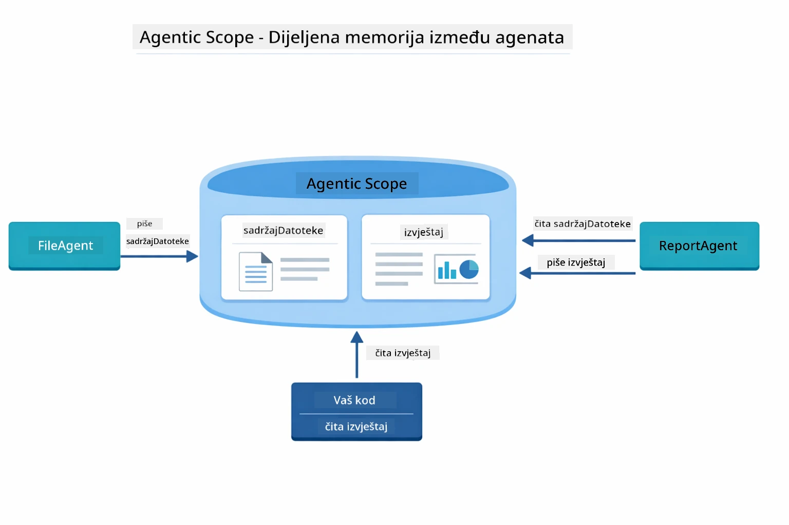

*Agentni obuhvat funkcionira kao zajednička memorija — FileAgent zapisuje `fileContent`, ReportAgent ga čita i zapisuje `report`, a vaš kod čita konačni rezultat.*

```java
ResultWithAgenticScope<String> result = supervisor.invokeWithAgenticScope(request);
AgenticScope scope = result.agenticScope();
String fileContent = scope.readState("fileContent");  // Neobrađeni podaci datoteke s FileAgent
String report = scope.readState("report");            // Strukturirani izvještaj iz ReportAgent
```

**Agent slušatelji** omogućuju praćenje i ispravljanje izvršavanja agenata. Korak-po-korak izlaz koji vidite u demonstraciji dolazi od AgentListener-a koji se veže na svaki poziv agenta:
- **beforeAgentInvocation** - Poziva se kada Supervisor odabere agenta, dopuštajući vam da vidite koji je agent odabran i zašto
- **afterAgentInvocation** - Poziva se kada agent dovrši, prikazujući njegov rezultat
- **inheritedBySubagents** - Kada je true, slušatelj prati sve agente u hijerarhiji

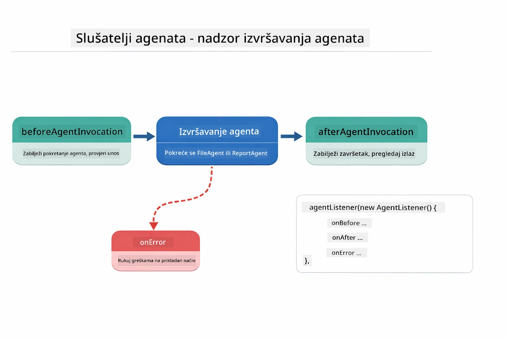

*Agent Listeners se povezuju s ciklusom izvršavanja — prate kada agenti započnu, dovrše ili naiđu na pogreške.*

```java
AgentListener monitor = new AgentListener() {
    private int step = 0;
    
    @Override
    public void beforeAgentInvocation(AgentRequest request) {
        step++;
        System.out.println("  +-- STEP " + step + ": " + request.agentName());
    }
    
    @Override
    public void afterAgentInvocation(AgentResponse response) {
        System.out.println("  +-- [OK] " + response.agentName() + " completed");
    }
    
    @Override
    public boolean inheritedBySubagents() {
        return true; // Propagiraj na sve pod-agente
    }
};
```

Osim obrasca Supervisor, modul `langchain4j-agentic` nudi nekoliko moćnih obrazaca i značajki tijeka rada:

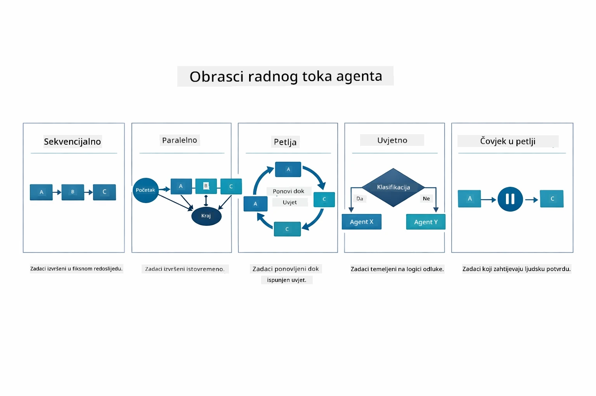

*Pet obrazaca tijeka rada za orkestraciju agenata — od jednostavnih sekvencijskih lanaca do odobravanja uz ljudski nadzor.*

| Pattern | Description | Use Case |
|---------|-------------|----------|
| **Sequential** | Izvršava agente redom, izlaz ide na sljedećeg | Pipeline: istraživanje → analiza → izvještaj |
| **Parallel** | Pokreće agente istovremeno | Nezavisni zadaci: vrijeme + vijesti + dionice |
| **Loop** | Ponavlja dok se ne ispuni uvjet | Ocjenjivanje kvalitete: usavršavanje dok ocjena ≥ 0.8 |
| **Conditional** | Usmjerava prema uvjetima | Klasifikacija → usmjeri specijalistu |
| **Human-in-the-Loop** | Dodaje ljudske provjere | Obrada odobrenja, pregled sadržaja |

## Ključni pojmovi

Sada kad ste istražili MCP i agentic modul u praksi, sažmimo kada koristiti koji pristup.

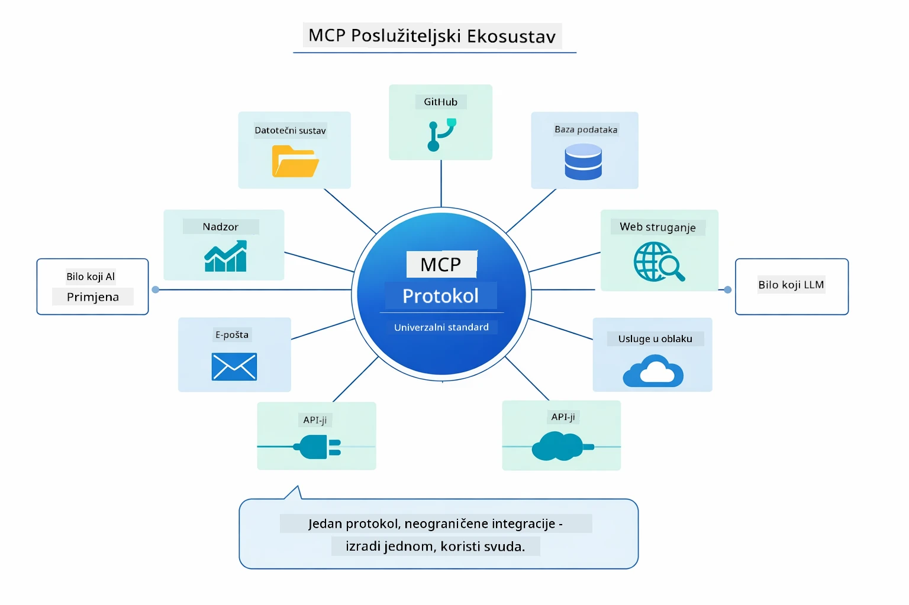

*MCP stvara univerzalni protokolni ekosustav — svaki MCP-kompatibilni poslužitelj radi s bilo kojim MCP-kompatibilnim klijentom, omogućujući dijeljenje alata između aplikacija.*

**MCP** je idealan kada želite iskoristiti postojeće ekosustave alata, graditi alate koje može koristiti više aplikacija, integrirati usluge trećih strana sa standardnim protokolima ili zamijeniti implementacije alata bez mijenjanja koda.

**Agentic Modul** najbolje funkcionira kad želite deklarativne definicije agenata s `@Agent` oznakama, trebate orkestraciju tijeka rada (sekvencijsko, petlja, paralelno), preferirate dizajn agenata temeljen na sučeljima umjesto imperativnog koda, ili kombinirate više agenata koji dijele rezultate preko `outputKey`.

**Supervisor Agent obrazac** je najbolji kada tijek rada nije unaprijed predvidiv i želite da LLM donosi odluke, kada imate više specijaliziranih agenata koji trebaju dinamičku orkestraciju, kada gradite razgovorne sustave koji usmjeravaju prema različitim sposobnostima, ili kada želite najfleksibilnije i prilagodljivo ponašanje agenata.

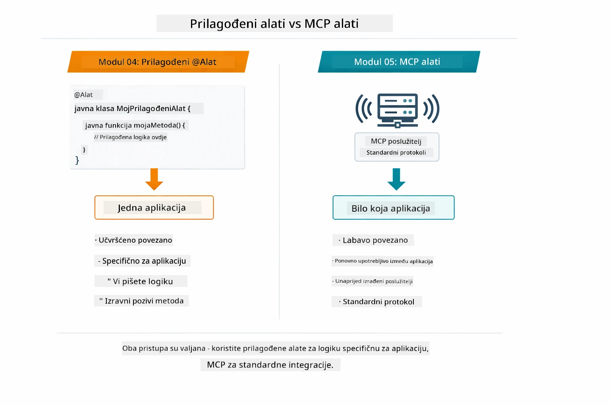

*Kad koristiti prilagođene @Tool metode vs MCP alate — prilagođene alate za logiku specifičnu aplikaciji s potpunom tipnom sigurnošću, MCP alate za standardizirane integracije koje rade kroz aplikacije.*

## Čestitamo!

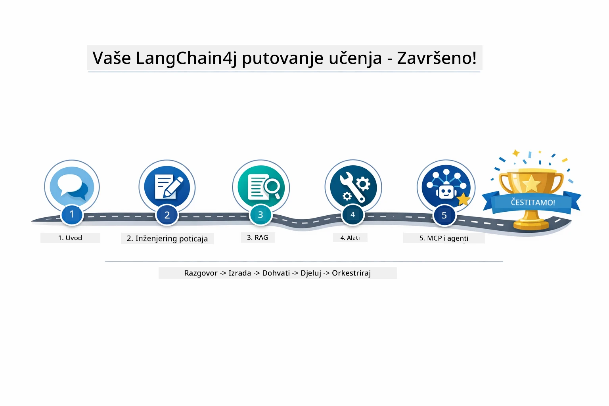

*Vaše putovanje učenjem kroz svih pet modula — od osnovnog chatbota do agentičkih sustava pokretanih MCP-om.*

Završili ste tečaj LangChain4j za početnike. Naučili ste:

- Kako izgraditi konverzacijski AI s memorijom (Modul 01)
- Obrasce za prompt inženjering za različite zadatke (Modul 02)
- Utemeljenje odgovora u vašim dokumentima pomoću RAG-a (Modul 03)
- Kreiranje osnovnih AI agenata (asistenata) s prilagođenim alatima (Modul 04)
- Integraciju standardiziranih alata s LangChain4j MCP i Agentic modulima (Modul 05)

### Što dalje?

Nakon završetka modula, proučite [Vodič za testiranje](../docs/TESTING.md) da vidite pojmove testiranja LangChain4j u akciji.

**Službeni resursi:**
- [LangChain4j Dokumentacija](https://docs.langchain4j.dev/) - Detaljni vodiči i API reference
- [LangChain4j GitHub](https://github.com/langchain4j/langchain4j) - Izvorni kod i primjeri
- [LangChain4j Tutorijali](https://docs.langchain4j.dev/tutorials/) - Korak-po-korak tutorijali za razne primjene

Hvala što ste završili ovaj tečaj!

---

**Navigacija:** [← Prethodno: Modul 04 - Alati](../04-tools/README.md) | [Natrag na početak](../README.md)

---

<!-- CO-OP TRANSLATOR DISCLAIMER START -->
**Odricanje od odgovornosti**:
Ovaj dokument je preveden korištenjem AI usluge za prevođenje [Co-op Translator](https://github.com/Azure/co-op-translator). Iako se trudimo biti precizni, imajte na umu da automatski prijevodi mogu sadržavati pogreške ili netočnosti. Izvorni dokument na njegovom izvornom jeziku treba smatrati službenim i autoritativnim izvorom. Za važne informacije preporučuje se stručno ljudsko prevođenje. Ne snosimo odgovornost za bilo kakve nesporazume ili kriva tumačenja koja proizlaze iz upotrebe ovog prijevoda.
<!-- CO-OP TRANSLATOR DISCLAIMER END -->