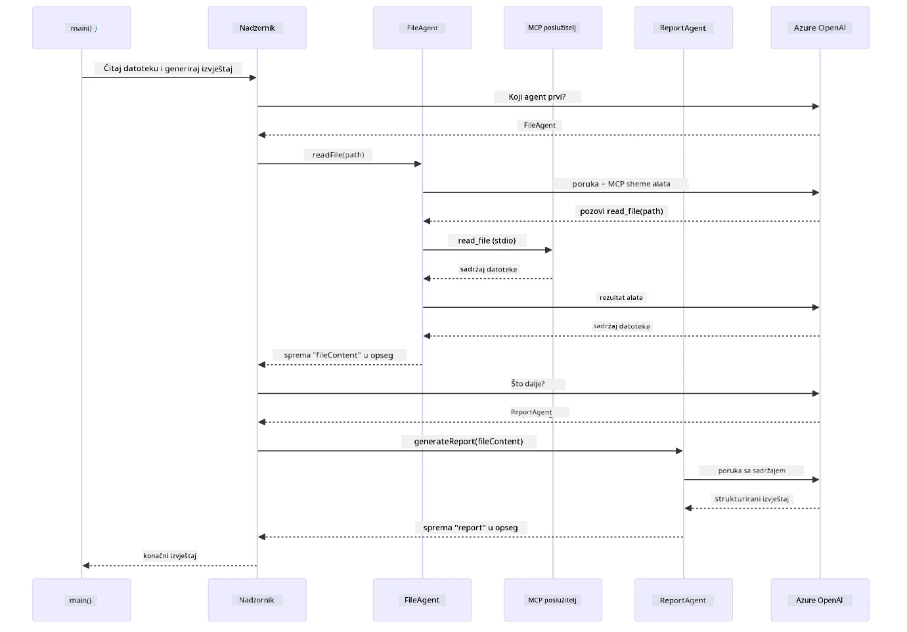

# Modul 05: Protokol modelnog konteksta (MCP)

## Sadržaj

- [Video vodič](../../../05-mcp)
- [Što ćete naučiti](../../../05-mcp)
- [Što je MCP?](../../../05-mcp)
- [Kako MCP radi](../../../05-mcp)
- [Agentni modul](../../../05-mcp)
- [Pokretanje primjera](../../../05-mcp)
  - [Preduvjeti](../../../05-mcp)
- [Brzi početak](../../../05-mcp)
  - [Rad s datotekama (Stdio)](../../../05-mcp)
  - [Nadzorni agent](../../../05-mcp)
    - [Pokretanje demonstracije](../../../05-mcp)
    - [Kako radi nadzorni agent](../../../05-mcp)
    - [Kako FileAgent otkriva MCP alate u izvođenju](../../../05-mcp)
    - [Strategije odgovora](../../../05-mcp)
    - [Razumijevanje izlaza](../../../05-mcp)
    - [Objašnjenje značajki agentnog modula](../../../05-mcp)
- [Ključni pojmovi](../../../05-mcp)
- [Čestitamo!](../../../05-mcp)
  - [Što slijedi?](../../../05-mcp)

## Video vodič

Pogledajte ovu sesiju uživo koja objašnjava kako započeti s ovim modulom:

<a href="https://www.youtube.com/watch?v=O_J30kZc0rw"></a>

## Što ćete naučiti

Izgradili ste razgovornu umjetnu inteligenciju, svladali promptove, povezali odgovore s dokumentima i kreirali agente s alatima. Ali svi ti alati bili su specijalno izrađeni za vašu specifičnu aplikaciju. Što ako biste svojoj AI mogli dati pristup standardiziranom ekosustavu alata koje bilo tko može stvoriti i dijeliti? U ovom modulu naučit ćete upravo to uz Protokol modelnog konteksta (MCP) i agentni modul LangChain4j-a. Prvo pokazujemo jednostavan MCP čitač datoteka, a zatim kako se lako integrira u napredne agentne tokove rada koristeći obrazac Nadzornog agenta.

## Što je MCP?

Protokol modelnog konteksta (MCP) pruža upravo to – standardizirani način za AI aplikacije da otkriju i koriste vanjske alate. Umjesto da pišete prilagođene integracije za svaki izvor podataka ili uslugu, povezujete se s MCP poslužiteljima koji izlažu svoje mogućnosti u dosljednom formatu. Vaš AI agent tada može automatski otkrivati i koristiti te alate.

Dijagram ispod prikazuje razliku – bez MCP-a, svaka integracija zahtijeva prilagođeno povezivanje točka-do-točke; s MCP-om, jedan je protokol povezuje vašu aplikaciju s bilo kojim alatom:


*Prije MCP-a: složene integracije točaka. Nakon MCP-a: jedan protokol, beskonačne mogućnosti.*

MCP rješava osnovni problem u razvoju AI-ja: svaka je integracija prilagođena. Želite pristupiti GitHubu? Prilagođeni kod. Želite čitati datoteke? Prilagođeni kod. Želite upitivati bazu podataka? Prilagođeni kod. I nijedna od tih integracija ne radi s drugim AI aplikacijama.

MCP to standardizira. MCP poslužitelj izlaže alate s jasnim opisima i šemama. Bilo koji MCP klijent se može spojiti, otkriti dostupne alate i koristiti ih. Izgradi jednom, koristi svugdje.

Dijagram ispod ilustrira ovu arhitekturu – jedan MCP klijent (vaša AI aplikacija) povezuje se s više MCP poslužitelja, svaki izlažući svoj set alata kroz standardni protokol:


*Arhitektura protokola modelnog konteksta – standardizirano otkrivanje i izvršavanje alata*

## Kako MCP radi

Ispod haube, MCP koristi slojevitu arhitekturu. Vaša Java aplikacija (MCP klijent) otkriva dostupne alate, šalje JSON-RPC zahtjeve kroz transportni sloj (Stdio ili HTTP), a MCP poslužitelj izvršava operacije i vraća rezultate. Sljedeći dijagram prikazuje svaki sloj ovog protokola:


*Kako MCP radi ispod haube — klijenti otkrivaju alate, razmjenjuju JSON-RPC poruke i izvršavaju operacije preko transportnog sloja.*

**Arhitektura poslužitelj-klijent**

MCP koristi model poslužitelj-klijent. Poslužitelji pružaju alate – čitanje datoteka, upiti baza podataka, pozivanje API-ja. Klijenti (vaša AI aplikacija) se spajaju na poslužitelje i koriste njihove alate.

Za korištenje MCP-a s LangChain4j-om dodajte ovu Maven ovisnost:

```xml
<dependency>
    <groupId>dev.langchain4j</groupId>
    <artifactId>langchain4j-mcp</artifactId>
    <version>${langchain4j.version}</version>
</dependency>
```

**Otkrivanje alata**

Kad se vaš klijent spoji na MCP poslužitelj, pita: "Koje alate imate?" Poslužitelj odgovara listom dostupnih alata, svaki s opisima i šemama parametara. Vaš AI agent tada može odlučiti koje alate koristiti na temelju korisničkih zahtjeva. Dijagram ispod prikazuje ovo rukovanje – klijent šalje zahtjev `tools/list` a poslužitelj vraća svoje dostupne alate s opisima i šemama parametara:


*AI otkriva dostupne alate pri pokretanju — sada zna koje su mogućnosti dostupne i može odlučiti koje će koristiti.*

**Transportni mehanizmi**

MCP podržava različite transportne mehanizme. Dvije opcije su Stdio (za lokalnu komunikaciju podprocesa) i Streamable HTTP (za udaljene poslužitelje). Ovaj modul prikazuje Stdio transport:


*Transportni mehanizmi MCP-a: HTTP za udaljene poslužitelje, Stdio za lokalne procese*

**Stdio** - [StdioTransportDemo.java](../../../05-mcp/src/main/java/com/example/langchain4j/mcp/StdioTransportDemo.java)

Za lokalne procese. Vaša aplikacija pokreće poslužitelj kao podproces i komunicira kroz standardni ulaz/izlaz. Korisno za pristup datotečnom sustavu ili alatima naredbenog retka.

```java
McpTransport stdioTransport = new StdioMcpTransport.Builder()
    .command(List.of(
        npmCmd, "exec",
        "@modelcontextprotocol/server-filesystem@2025.12.18",
        resourcesDir
    ))
    .logEvents(false)
    .build();
```

`@modelcontextprotocol/server-filesystem` poslužitelj izlaže sljedeće alate, svi ograničeni na direktorije koje navedete:

| Alat | Opis |
|------|-------------|
| `read_file` | Čita sadržaj jedne datoteke |
| `read_multiple_files` | Čita više datoteka u jednom pozivu |
| `write_file` | Stvara ili prepisuje datoteku |
| `edit_file` | Ciljano pretraživanje i zamjenu unutar datoteke |
| `list_directory` | Nabraja datoteke i direktorije na putanji |
| `search_files` | Rekurzivno pretražuje datoteke koje odgovaraju obrascu |
| `get_file_info` | Dohvaća metapodatke datoteke (veličina, vrijeme, dopuštenja) |
| `create_directory` | Stvara direktorij (uključujući roditeljske direktorije) |
| `move_file` | Premješta ili preimenuje datoteku ili direktorij |

Sljedeći dijagram prikazuje kako Stdio transport radi u izvođenju – vaša Java aplikacija pokreće MCP poslužitelj kao podproces i oni komuniciraju kroz pipe-ove stdin/stdout, bez mreže ili HTTP-a:


*Stdio transport u akciji — vaša aplikacija pokreće MCP poslužitelj kao podproces i komunicira kroz stdin/stdout pipeove.*

> **🤖 Isprobajte s [GitHub Copilot](https://github.com/features/copilot) Chat:** Otvorite [`StdioTransportDemo.java`](../../../05-mcp/src/main/java/com/example/langchain4j/mcp/StdioTransportDemo.java) i pitajte:
> - "Kako radi Stdio transport i kada ga koristiti umjesto HTTP-a?"
> - "Kako LangChain4j upravlja životnim ciklusom pokrenutih MCP poslužitelja?"
> - "Koje su sigurnosne implikacije davanja AI pristupa datotečnom sustavu?"

## Agentni modul

Dok MCP pruža standardizirane alate, LangChain4j-ev **agentni modul** nudi deklarativan način za gradnju agenata koji orkestriraju te alate. `@Agent` anotacija i `AgenticServices` omogućuju vam definiranje ponašanja agenta kroz sučelja umjesto imperativnog koda.

U ovom modulu istražit ćete obrazac **Nadzorni agent** — napredan agentni pristup gdje nadzorni agent dinamički odlučuje koje pod-agente pozvati na temelju korisničkih zahtjeva. Kombinirat ćemo oba koncepta tako da jednom od naših pod-agenta damo mogućnosti pristupa datotekama putem MCP-a.

Za korištenje agentnog modula dodajte ovu Maven ovisnost:

```xml
<dependency>
    <groupId>dev.langchain4j</groupId>
    <artifactId>langchain4j-agentic</artifactId>
    <version>${langchain4j.mcp.version}</version>
</dependency>
```
> **Napomena:** `langchain4j-agentic` modul koristi zasebnu verzijsku varijablu (`langchain4j.mcp.version`) jer ima drugačiji raspored izdanja od osnovnih LangChain4j knjižnica.

> **⚠️ Eksperimentalno:** `langchain4j-agentic` modul je **eksperimentalan** i podložan promjenama. Stabilan način za izradu AI pomoćnika i dalje je `langchain4j-core` s prilagođenim alatima (Modul 04).

## Pokretanje primjera

### Preduvjeti

- Završeni [Modul 04 - Alati](../04-tools/README.md) (ovaj modul nadograđuje koncepte prilagođenih alata i uspoređuje ih s MCP alatima)
- `.env` datoteka u korijenu s Azure vjerodajnicama (kreirana pomoću `azd up` u Modulu 01)
- Java 21+, Maven 3.9+
- Node.js 16+ i npm (za MCP poslužitelje)

> **Napomena:** Ako još niste postavili svoje varijable okoline, pogledajte [Modul 01 - Uvod](../01-introduction/README.md) za upute o implementaciji (`azd up` automatski stvara `.env` datoteku), ili kopirajte `.env.example` u `.env` u korijenskom direktoriju i upišite svoje vrijednosti.

## Brzi početak

**Koristeći VS Code:** Jednostavno kliknite desnom tipkom miša na bilo koju datoteku demonstracije u Exploreru i odaberite **"Run Java"**, ili koristite konfiguracije iz panela Pokretanja i otklanjanja pogrešaka (prvo se pobrinite da je vaša `.env` datoteka konfigurirana s Azure vjerodajnicama).

**Koristeći Maven:** Alternativno, primjere možete pokrenuti iz naredbenog retka kako je prikazano u nastavku.

### Rad s datotekama (Stdio)

Ovo demonstrira alate bazirane na lokalnim podprocesima.

**✅ Nema potrebnih preduvjeta** - MCP poslužitelj se automatski pokreće.

**Korištenje skripti za pokretanje (preporučeno):**

Skripte za pokretanje automatski učitavaju varijable okoline iz `.env` datoteke u korijenu:

**Bash:**
```bash
cd 05-mcp
chmod +x start-stdio.sh
./start-stdio.sh
```

**PowerShell:**
```powershell
cd 05-mcp
.\start-stdio.ps1
```

**Koristeći VS Code:** Kliknite desnom tipkom na `StdioTransportDemo.java` i odaberite **"Run Java"** (provjerite da je vaša `.env` datoteka konfigurirana).

Aplikacija automatski pokreće MCP poslužitelj za datotečni sustav i čita lokalnu datoteku. Obratite pažnju na upravljanje podprocesima.

**Očekivani izlaz:**
```
Assistant response: The file provides an overview of LangChain4j, an open-source Java library
for integrating Large Language Models (LLMs) into Java applications...
```

### Nadzorni agent

Obrazac **Nadzorni agent** je **fleksibilan** oblik agentne AI. Nadzorni agent koristi LLM da autonomno odluči koje agente pozvati na temelju zahtjeva korisnika. U sljedećem primjeru kombiniramo MCP-alate za pristup datotekama s LLM agentom za izradu nadziranog tijeka rada čitanja datoteke → izvještaja.

U demonstraciji, `FileAgent` čita datoteku koristeći MCP alate datotečnog sustava, a `ReportAgent` generira strukturirani izvještaj s izvršnim sažetkom (1 rečenica), 3 ključne točke i preporuke. Nadzorni agent automatski orkestrira ovaj tijek:


*Nadzorni agent koristi svoj LLM da odluči koje agente pozvati i kojim redoslijedom — bez tvrdog koda za usmjeravanje.*

Evo kako konkretni tijek rada izgleda za naš pipeline datoteka-izvještaj:


`FileAgent` čita datoteku pomoću MCP alata, zatim `ReportAgent` transformira sirovi sadržaj u strukturirani izvještaj.

Sljedeći sekvencijski dijagram prati cjelokupnu nadzornu orkestraciju — od pokretanja MCP poslužitelja, preko autonomnog odabira agenta od strane Nadzornog agenta, do poziva alata preko stdio i finalnog izvještaja:



*Nadzorni agent autonomno poziva FileAgent (koji koristi MCP poslužitelj preko stdio za čitanje datoteke), zatim poziva ReportAgent za generiranje strukturiranog izvještaja — svaki agent pohranjuje svoj izlaz u zajednički Agentni opseg.*

Svaki agent pohranjuje svoj izlaz u **Agentni opseg** (zajednička memorija), dopuštajući agentima nizvodno pristup prethodnim rezultatima. Ovo pokazuje kako MCP alati besprijekorno integriraju agenske tokove rada — Nadzorni agent ne mora znati *kako* se datoteke čitaju, samo da `FileAgent` može to učiniti.

#### Pokretanje demonstracije

Skripte za pokretanje automatski učitavaju varijable okoline iz `.env` datoteke u korijenu:

**Bash:**
```bash
cd 05-mcp
chmod +x start-supervisor.sh
./start-supervisor.sh
```

**PowerShell:**
```powershell
cd 05-mcp
.\start-supervisor.ps1
```

**Koristeći VS Code:** Kliknite desnom tipkom na `SupervisorAgentDemo.java` i odaberite **"Run Java"** (provjerite da je vaša `.env` datoteka konfigurirana).

#### Kako radi nadzorni agent

Prije gradnje agenata, trebate povezati MCP transport s klijentom i omotati ga kao `ToolProvider`. Ovako alate MCP poslužitelja izlažete svojim agentima:

```java
// Stvori MCP klijenta iz transporta
McpClient mcpClient = new DefaultMcpClient.Builder()
        .transport(stdioTransport)
        .build();

// Omotaj klijenta kao ToolProvider — ovo povezuje MCP alate u LangChain4j
ToolProvider mcpToolProvider = McpToolProvider.builder()
        .mcpClients(List.of(mcpClient))
        .build();
```

Sada možete injektirati `mcpToolProvider` u bilo kojeg agenta kojem trebaju MCP alati:

```java
// Korak 1: FileAgent čita datoteke koristeći MCP alate
FileAgent fileAgent = AgenticServices.agentBuilder(FileAgent.class)
        .chatModel(model)
        .toolProvider(mcpToolProvider)  // Ima MCP alate za datotečne operacije
        .build();

// Korak 2: ReportAgent generira strukturirane izvještaje
ReportAgent reportAgent = AgenticServices.agentBuilder(ReportAgent.class)
        .chatModel(model)
        .build();

// Supervisor orkestrira radni tok datoteka → izvještaja
SupervisorAgent supervisor = AgenticServices.supervisorBuilder()
        .chatModel(model)
        .subAgents(fileAgent, reportAgent)
        .responseStrategy(SupervisorResponseStrategy.LAST)  // Vrati konačni izvještaj
        .build();

// Supervisor odlučuje koje agente pozvati na temelju zahtjeva
String response = supervisor.invoke("Read the file at /path/file.txt and generate a report");
```

#### Kako FileAgent otkriva MCP alate u izvođenju

Možda se pitate: **kako `FileAgent` zna kako koristiti npm alate datotečnog sustava?** Odgovor je da ne zna — **LLM** to saznaje u izvođenju preko šema alata.
Sučelje `FileAgent` je samo **definicija prompta**. Nema ugrađeno znanje o `read_file`, `list_directory` ili bilo kojem drugom MCP alatu. Evo što se događa od početka do kraja:

1. **Pokretanje poslužitelja:** `StdioMcpTransport` pokreće `@modelcontextprotocol/server-filesystem` npm paket kao podproces
2. **Otkrivanje alata:** `McpClient` šalje JSON-RPC zahtjev `tools/list` poslužitelju, koji odgovara imenima alata, opisima i šemama parametara (npr. `read_file` — *"Pročitaj kompletan sadržaj datoteke"* — `{ path: string }`)
3. **Umetanje šema:** `McpToolProvider` obavija otkrivene šeme i čini ih dostupnima LangChain4j-u
4. **Odabir LLM-a:** Kada se pozove `FileAgent.readFile(path)`, LangChain4j šalje sistemsku poruku, korisničku poruku **i popis šema alata** LLM-u. LLM pročita opise alata i generira poziv alatu (npr. `read_file(path="/some/file.txt")`)
5. **Izvršenje:** LangChain4j presreće poziv alatu, usmjerava ga kroz MCP klijenta natrag u Node.js podproces, dobiva rezultat i prosljeđuje ga natrag LLM-u

Ovo je isti [mehanizam Otkrivanja Alata](../../../05-mcp) opisan gore, ali specifično primijenjen na agentni tijek rada. Anotacije `@SystemMessage` i `@UserMessage` usmjeravaju ponašanje LLM-a, dok umetnuti `ToolProvider` daje **sposobnosti** — LLM u runtime-u povezuje ta dva.

> **🤖 Isprobajte s [GitHub Copilot](https://github.com/features/copilot) Chat:** Otvorite [`FileAgent.java`](../../../05-mcp/src/main/java/com/example/langchain4j/mcp/agents/FileAgent.java) i pitajte:
> - "Kako ovaj agent zna koji MCP alat pozvati?"
> - "Što bi se dogodilo ako uklonim ToolProvider iz graditelja agenta?"
> - "Kako se šeme alata prosljeđuju LLM-u?"

#### Strategije odgovora

Kada konfigurirate `SupervisorAgent`, specificirate kako treba formulirati svoj konačni odgovor korisniku nakon što pod-agenti završe svoje zadatke. Dijagram ispod prikazuje tri dostupne strategije — LAST vraća konačni izlaz posljednjeg agenta izravno, SUMMARY sintetizira sve izlaze preko LLM-a, a SCORED bira onaj s višim rezultatom u odnosu na prvobitni zahtjev:


*Tri strategije za formulaciju konačnog odgovora Supervizora — odaberite želite li izlaz posljednjeg agenta, sintetizirani sažetak ili opciju s najboljim rezultatom.*

Dostupne strategije su:

| Strategija | Opis |
|------------|-------------|
| **LAST** | Supervizor vraća izlaz posljednjeg pozvanog pod-agenta ili alata. Korisno kada je zadnji agent u tijeku posebno dizajniran za stvaranje kompletnog, konačnog odgovora (npr. "Agent za sažetak" u istraživačkom procesu). |
| **SUMMARY** | Supervizor koristi vlastiti interni Jezični Model (LLM) za sintetiziranje sažetka cijele interakcije i svih izlaza pod-agenta, te zatim vraća taj sažetak kao konačni odgovor. Ovo pruža čist, objedinjeni odgovor korisniku. |
| **SCORED** | Sustav koristi interni LLM za ocjenjivanje i LAST odgovora i SUMMARY sažetka interakcije u odnosu na izvorni korisnički zahtjev, vraćajući onaj izlaz koji dobije višu ocjenu. |

Pogledajte [SupervisorAgentDemo.java](../../../05-mcp/src/main/java/com/example/langchain4j/mcp/SupervisorAgentDemo.java) za kompletnu implementaciju.

> **🤖 Isprobajte s [GitHub Copilot](https://github.com/features/copilot) Chat:** Otvorite [`SupervisorAgentDemo.java`](../../../05-mcp/src/main/java/com/example/langchain4j/mcp/SupervisorAgentDemo.java) i pitajte:
> - "Kako Supervizor odlučuje koje agente pozvati?"
> - "Koja je razlika između uzorka tijeka rada Supervizora i Sekvencijalnog?"
> - "Kako mogu prilagoditi planiranje Supervizora?"

#### Razumijevanje izlaza

Kada pokrenete demo, vidjet ćete strukturirani pregled kako Supervizor orkestrira više agenata. Evo što svaka sekcija znači:

```
======================================================================
  FILE → REPORT WORKFLOW DEMO
======================================================================

This demo shows a clear 2-step workflow: read a file, then generate a report.
The Supervisor orchestrates the agents automatically based on the request.
```
  
**Zaglavlje** uvodi koncept tijeka rada: fokusirani slijed od čitanja datoteka do generiranja izvještaja.

```
--- WORKFLOW ---------------------------------------------------------
  ┌─────────────┐      ┌──────────────┐
  │  FileAgent  │ ───▶ │ ReportAgent  │
  │ (MCP tools) │      │  (pure LLM)  │
  └─────────────┘      └──────────────┘
   outputKey:           outputKey:
   'fileContent'        'report'

--- AVAILABLE AGENTS -------------------------------------------------
  [FILE]   FileAgent   - Reads files via MCP → stores in 'fileContent'
  [REPORT] ReportAgent - Generates structured report → stores in 'report'
```
  
**Dijagram tijeka rada** prikazuje protok podataka između agenata. Svaki agent ima specifičnu ulogu:  
- **FileAgent** čita datoteke koristeći MCP alate i pohranjuje sirovi sadržaj u `fileContent`  
- **ReportAgent** koristi taj sadržaj i proizvodi strukturirani izvještaj u `report`

```
--- USER REQUEST -----------------------------------------------------
  "Read the file at .../file.txt and generate a report on its contents"
```
  
**Korisnički zahtjev** prikazuje zadatak. Supervizor to analizira i odlučuje pozvati FileAgent → ReportAgent.

```
--- SUPERVISOR ORCHESTRATION -----------------------------------------
  The Supervisor decides which agents to invoke and passes data between them...

  +-- STEP 1: Supervisor chose -> FileAgent (reading file via MCP)
  |
  |   Input: .../file.txt
  |
  |   Result: LangChain4j is an open-source, provider-agnostic Java framework for building LLM...
  +-- [OK] FileAgent (reading file via MCP) completed

  +-- STEP 2: Supervisor chose -> ReportAgent (generating structured report)
  |
  |   Input: LangChain4j is an open-source, provider-agnostic Java framew...
  |
  |   Result: Executive Summary...
  +-- [OK] ReportAgent (generating structured report) completed
```
  
**Orkestracija Supervizora** prikazuje dvofazni tijek u akciji:  
1. **FileAgent** čita datoteku preko MCP-a i pohranjuje sadržaj  
2. **ReportAgent** prima sadržaj i generira strukturirani izvještaj

Supervizor je te odluke donio **autonomno** na temelju korisničkog zahtjeva.

```
--- FINAL RESPONSE ---------------------------------------------------
Executive Summary
...

Key Points
...

Recommendations
...

--- AGENTIC SCOPE (Data Flow) ----------------------------------------
  Each agent stores its output for downstream agents to consume:
  * fileContent: LangChain4j is an open-source, provider-agnostic Java framework...
  * report: Executive Summary...
```
  
#### Objašnjenje značajki Agentnog modula

Primjer demonstrira nekoliko naprednih značajki agentnog modula. Pogledajmo bliže Agentic Scope i Agent Listeners.

**Agentic Scope** prikazuje zajedničku memoriju gdje agenti pohranjuju rezultate pomoću `@Agent(outputKey="...")`. Ovo omogućava:  
- Kasnijim agentima pristup rezultatima ranijih agenata  
- Supervizoru da sintetizira konačni odgovor  
- Pregled što je svaki agent generirao

Dijagram ispod prikazuje kako Agentic Scope funkcionira kao zajednička memorija u tijeku rada datoteka-izvještaja — FileAgent zapisuje svoj izlaz pod ključem `fileContent`, ReportAgent ga čita i zapisuje svoj izlaz pod `report`:


*Agentic Scope funkcionira kao zajednička memorija — FileAgent zapisuje `fileContent`, ReportAgent to čita i zapisuje `report`, a vaš kod čita konačni rezultat.*

```java
ResultWithAgenticScope<String> result = supervisor.invokeWithAgenticScope(request);
AgenticScope scope = result.agenticScope();
String fileContent = scope.readState("fileContent");  // Sirovi podatci datoteke od FileAgenta
String report = scope.readState("report");            // Strukturirani izvještaj od ReportAgenta
```
  
**Agent Listeners** omogućuju nadzor i ispravljanje pogrešaka tijekom izvođenja agenata. Korak-po-korak izlaz koji vidite u demou dolazi od AgentListenera koji se zakači na svaku izvedbu agenta:  
- **beforeAgentInvocation** - Poziva se kada Supervizor odabere agenta, omogućujući vam da vidite koji je agent izabran i zašto  
- **afterAgentInvocation** - Poziva se kada agent završi, prikazujući njegov rezultat  
- **inheritedBySubagents** - Ako je true, slušač nadzire sve agente u hijerarhiji

Sljedeći dijagram prikazuje cijeli životni ciklus Agent Listener-a, uključujući kako `onError` rješava pogreške tijekom izvođenja agenata:


*Agent Listeners prate životni ciklus izvođenja — nadziru početak, završetak ili pogreške agenata.*

```java
AgentListener monitor = new AgentListener() {
    private int step = 0;
    
    @Override
    public void beforeAgentInvocation(AgentRequest request) {
        step++;
        System.out.println("  +-- STEP " + step + ": " + request.agentName());
    }
    
    @Override
    public void afterAgentInvocation(AgentResponse response) {
        System.out.println("  +-- [OK] " + response.agentName() + " completed");
    }
    
    @Override
    public boolean inheritedBySubagents() {
        return true; // Proširi na sve pod-agente
    }
};
```
  
Osim Supervizorskog uzorka, `langchain4j-agentic` modul pruža nekoliko moćnih uzoraka tijeka rada. Dijagram ispod prikazuje sve pet — od jednostavnih sekvencijalnih procesa do tijekova rada s ljudskim nadzorom:


*Pet uzoraka tijeka rada za orkestriranje agenata — od jednostavnih sekvencijalnih procesa do tijekova rada s ljudskim nadzorom.*

| Uzorak | Opis | Primjena |
|--------|-------|----------|
| **Sekvencijalni** | Izvršava agente redom, izlaz ide u sljedeći | Procesi: istraživanje → analiza → izvještaj |
| **Paralelni** | Pokreće agente simultano | Nezavisni zadaci: vrijeme + vijesti + dionice |
| **Petlja** | Ponavlja dok se ne ispuni uvjet | Ocjena kvalitete: rafiniranje dok rezultat ≥ 0.8 |
| **Uvjetni** | Usmjerava na temelju uvjeta | Klasifikacija → usmjeravanje ekspertu |
| **Ljudski u petlji** | Dodaje ljudske provjere | Tijekovi rada odobrenja, pregled sadržaja |

## Ključni pojmovi

Sad kad ste upoznali MCP i agentni modul u praksi, sažmimo kada koristiti koji pristup.

Jedna od najvećih prednosti MCP-a je njegova rastuća ekosustavnost. Dijagram ispod prikazuje kako jedinstveni univerzalni protokol povezuje vašu AI aplikaciju s raznovrsnim MCP poslužiteljima — od pristupa datotečnim sustavima i bazama podataka do GitHub-a, e-pošte, web scraping-a i drugih:


*MCP stvara ekosustav univerzalnog protokola — svaki MCP-kompatibilni poslužitelj radi s bilo kojim MCP-kompatibilnim klijentom, omogućujući dijeljenje alata između aplikacija.*

**MCP** je idealan kada želite iskoristiti postojeće ekosustave alata, izgraditi alate koje mogu koristiti više aplikacija, integrirati usluge trećih strana standardiziranim protokolima, ili zamijeniti implementacije alata bez mijenjanja koda.

**Agentni Modul** najbolje funkcionira kada želite deklarativne definicije agenata s `@Agent` anotacijama, trebate orkestraciju tijeka rada (sekvencijalno, petlja, paralelno), preferirate dizajn agenata baziran na sučeljima umjesto imperativnog koda, ili kombinirate više agenata koji dijele izlaze preko `outputKey`.

**Uzork Supervizorskog Agenta** blista kada tijek rada nije predvidljiv unaprijed i želite da LLM odlučuje, kada imate više specijaliziranih agenata koji trebaju dinamičku orkestraciju, kad gradite konverzacijske sustave koji usmjeravaju na različite sposobnosti, ili kada želite najfleksibilnije, prilagodljivo ponašanje agenta.

Da vam pomognemo odlučiti između prilagođenih `@Tool` metoda iz Modula 04 i MCP alata iz ovog modula, slijedeća usporedba ističe ključne kompromise — prilagođeni alati daju čvrstu povezanost i potpunu tipiziranu sigurnost za specifičnu logiku aplikacije, dok MCP alati nude standardizirane, ponovno upotrebljive integracije:


*Kad koristiti prilagođene @Tool metode vs MCP alate — prilagođeni alati za logiku specifičnu za aplikaciju s potpunom tipiziranom sigurnošću, MCP alati za standardizirane integracije koje rade među aplikacijama.*

## Čestitamo!

Prošli ste kroz svih pet modula tečaja LangChain4j za početnike! Evo pregleda cijelog vašeg puta učenja — od osnovnog chata do agentnih sustava pokretanih MCP-om:


*Vaš put učenja kroz svih pet modula — od osnovnog chata do agentnih sustava pokretanih MCP-om.*

Završili ste tečaj LangChain4j za početnike. Naučili ste:

- Kako graditi konverzacijski AI s memorijom (Modulo 01)  
- Uzorke inženjerstva prompta za različite zadatke (Modulo 02)  
- Utemeljenje odgovora u vašim dokumentima pomoću RAG-a (Modulo 03)  
- Izradu osnovnih AI agenata (asistenata) s prilagođenim alatima (Modulo 04)  
- Integraciju standardiziranih alata s LangChain4j MCP i agentnim modulima (Modulo 05)

### Što slijedi?

Nakon dovršetka modula, istražite [Vodič za testiranje](../docs/TESTING.md) da vidite koncepte testiranja LangChain4j u praksi.

**Službeni resursi:**  
- [LangChain4j Dokumentacija](https://docs.langchain4j.dev/) - Sveobuhvatni vodiči i API referenca  
- [LangChain4j GitHub](https://github.com/langchain4j/langchain4j) - Izvorni kod i primjeri  
- [LangChain4j Tutorijali](https://docs.langchain4j.dev/tutorials/) - Korak-po-korak tutorijali za različite slučajeve upotrebe

Hvala što ste dovršili ovaj tečaj!

---

**Navigacija:** [← Prethodno: Modul 04 - Alati](../04-tools/README.md) | [Natrag na početak](../README.md)

---

<!-- CO-OP TRANSLATOR DISCLAIMER START -->
**Napomena o odricanju od odgovornosti**:  
Ovaj dokument preveden je pomoću AI prevodilačke usluge [Co-op Translator](https://github.com/Azure/co-op-translator). Iako težimo točnosti, imajte na umu da automatizirani prijevodi mogu sadržavati greške ili netočnosti. Izvorni dokument na izvornom jeziku treba smatrati autoritativnim izvorom. Za kritične informacije preporučuje se profesionalni ljudski prijevod. Ne snosimo odgovornost za bilo kakva nesporazuma ili kriva tumačenja koja proizlaze iz korištenja ovog prijevoda.
<!-- CO-OP TRANSLATOR DISCLAIMER END -->