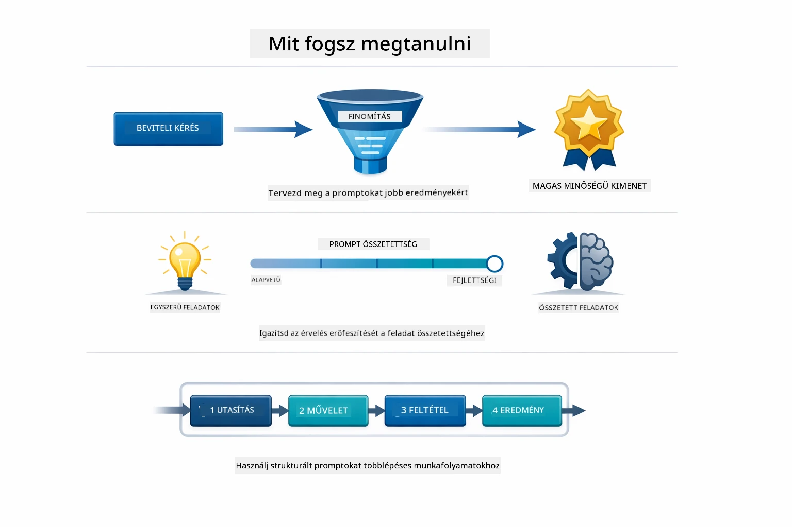
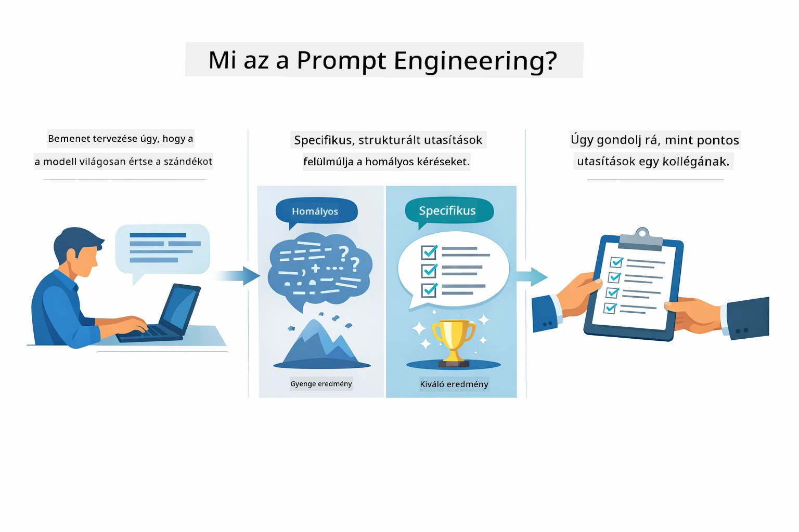
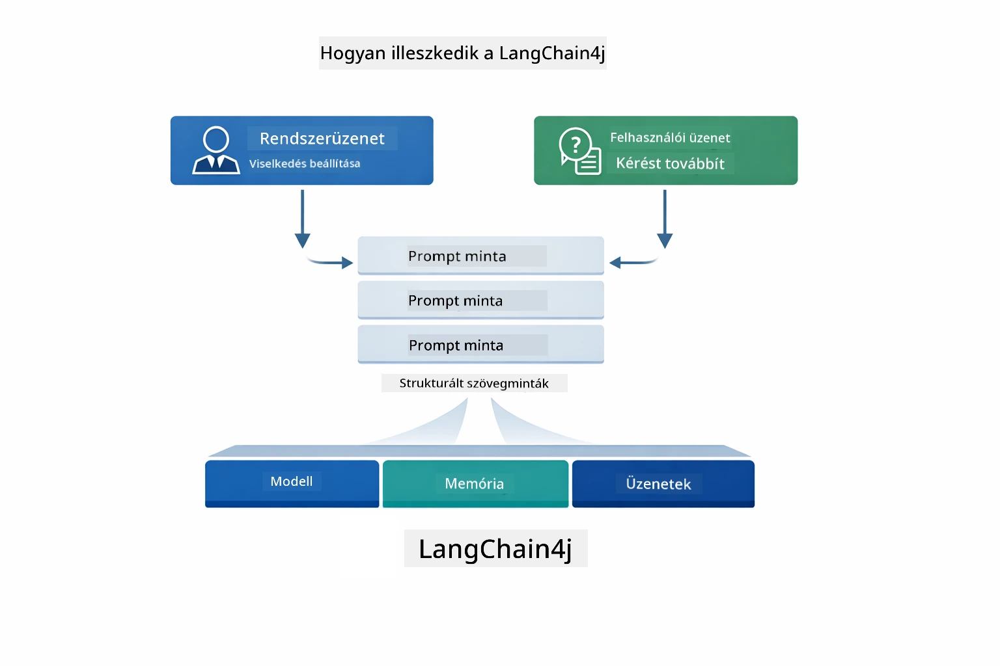
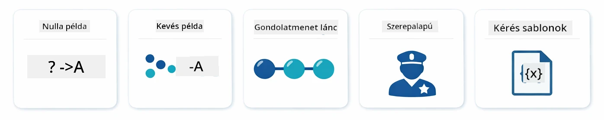
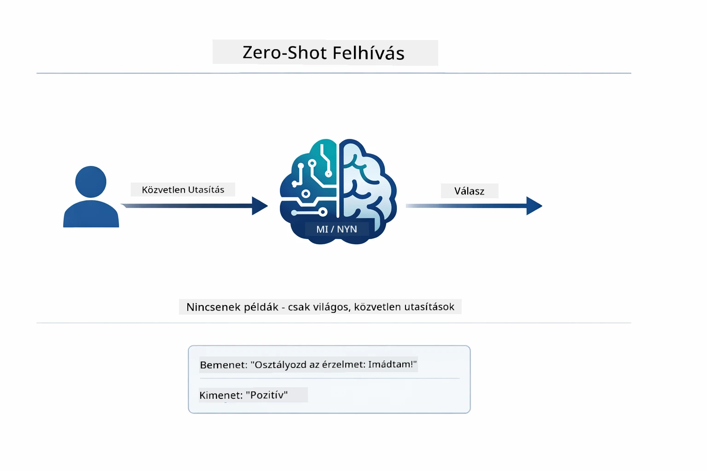
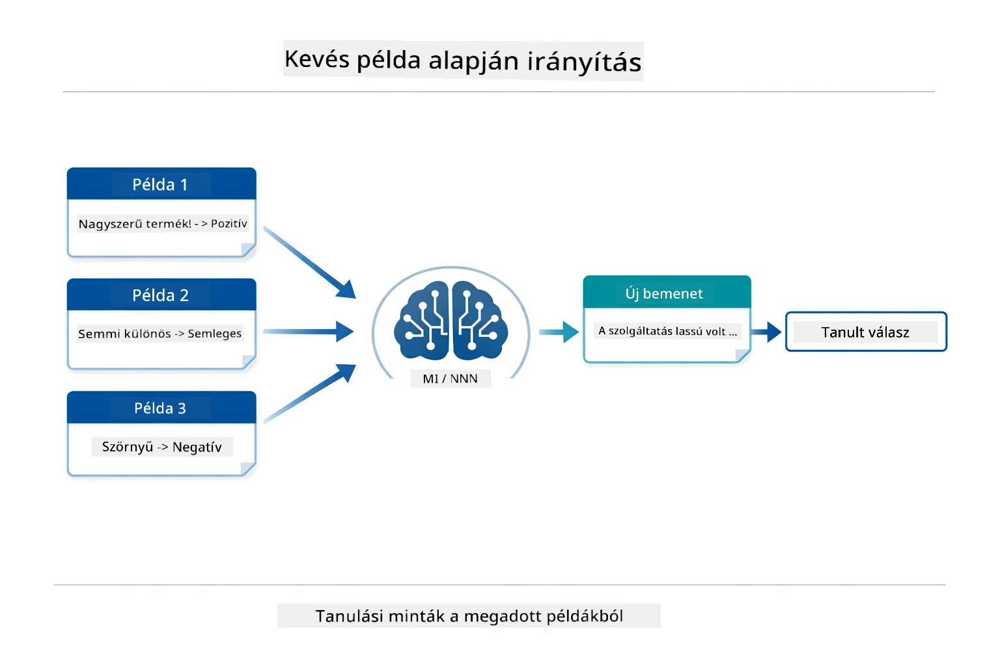
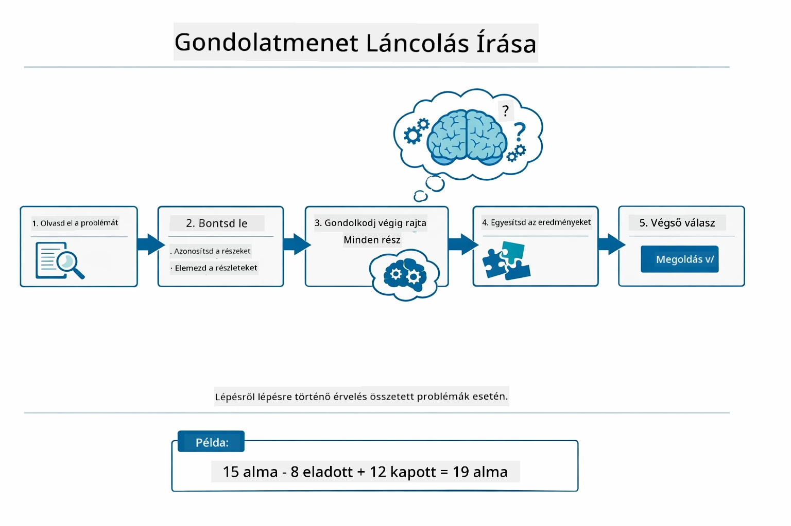
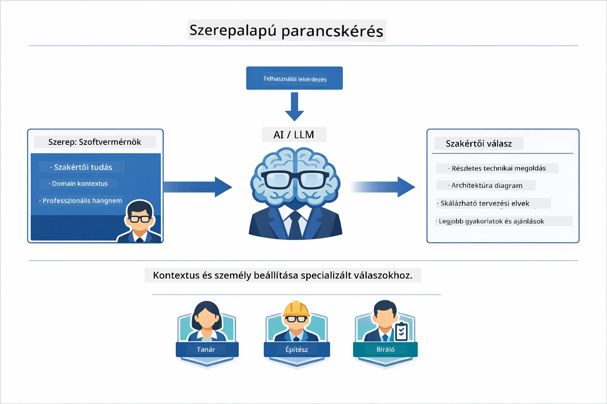
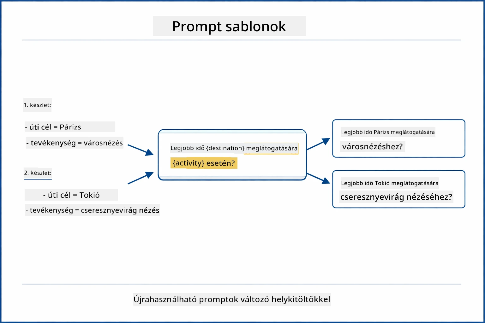
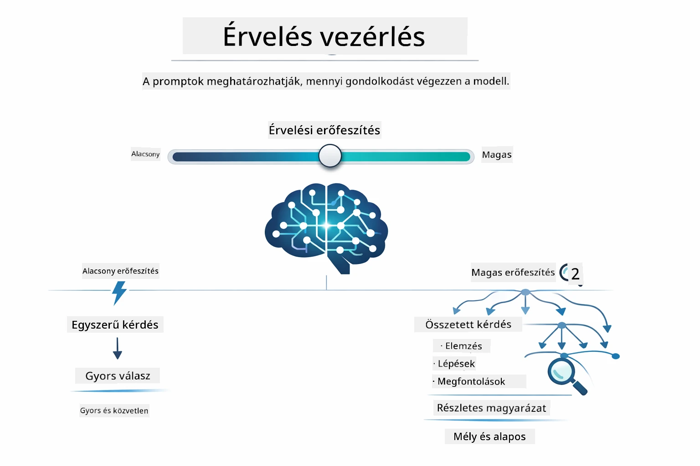

# Modul 02: Prompt Tervezés GPT-5.2-vel

## Tartalomjegyzék

- [Videós bemutató](../../../02-prompt-engineering)
- [Mit fogsz megtanulni](../../../02-prompt-engineering)
- [Előfeltételek](../../../02-prompt-engineering)
- [A prompt tervezés megértése](../../../02-prompt-engineering)
- [A prompt tervezés alapjai](../../../02-prompt-engineering)
  - [Zero-Shot Prompting](../../../02-prompt-engineering)
  - [Few-Shot Prompting](../../../02-prompt-engineering)
  - [Chain of Thought](../../../02-prompt-engineering)
  - [Szerepalapú promptolás](../../../02-prompt-engineering)
  - [Prompt sablonok](../../../02-prompt-engineering)
- [Haladó minták](../../../02-prompt-engineering)
- [Meglévő Azure erőforrások használata](../../../02-prompt-engineering)
- [Alkalmazás képernyőképek](../../../02-prompt-engineering)
- [A minták felfedezése](../../../02-prompt-engineering)
  - [Alacsony vs magas lelkesedés](../../../02-prompt-engineering)
  - [Feladat végrehajtás (Eszköz bevezetők)](../../../02-prompt-engineering)
  - [Önreflektáló kód](../../../02-prompt-engineering)
  - [Strukturált elemzés](../../../02-prompt-engineering)
  - [Többszöri fordulós chat](../../../02-prompt-engineering)
  - [Lépésről lépésre gondolkodás](../../../02-prompt-engineering)
  - [Korlátozott kimenet](../../../02-prompt-engineering)
- [Mit is tanulsz valójában](../../../02-prompt-engineering)
- [Következő lépések](../../../02-prompt-engineering)

## Videós bemutató

Nézd meg ezt az élő bemutatót, amely elmagyarázza, hogyan kezdj neki ennek a modulnak: [Prompt Engineering with LangChain4j - Live Session](https://www.youtube.com/live/PJ6aBaE6bog?si=LDshyBrTRodP-wke)

## Mit fogsz megtanulni



Az előző modulban láttad, hogyan teszi lehetővé a memória a beszélgetőgépet, és a GitHub modelleket használtad alapvető interakciókra. Most arra fókuszálunk, hogy hogyan teszel fel kérdéseket – maguk a promptok – az Azure OpenAI GPT-5.2 használatával. A promptjaid felépítése drámaian befolyásolja a válaszok minőségét. Először áttekintjük az alapvető prompt technikákat, majd áttérünk nyolc haladó mintára, amelyek teljes mértékben kihasználják a GPT-5.2 képességeit.

GPT-5.2-t használjuk, mert bevezeti az érvelés vezérlését - megmondhatod a modellnek, mennyit gondolkodjon a válasz előtt. Ez egyértelműbbé teszi a különböző promptolási stratégiákat, és segít megérteni, mikor melyik megközelítést használjuk. Emellett az Azure-nak kevesebb korlátozása van a GPT-5.2-re vonatkozóan a GitHub modellekhez képest.

## Előfeltételek

- A 01-es modul befejezése (Azure OpenAI erőforrások telepítve)
- `.env` fájl a gyökérkönyvtárban az Azure hitelesítő adatokkal (a `azd up` parancs segítségével létrehozva az 01-es modulban)

> **Megjegyzés:** Ha még nem fejezted be az 01-es modult, először kövesd ott a telepítési utasításokat.

## A prompt tervezés megértése



A prompt tervezés lényege olyan bemeneti szöveg megtervezése, amely következetesen eléri a kívánt eredményeket. Nem csak kérdéseket feltenni, hanem olyan kéréseket megfogalmazni, hogy a modell pontosan értse, mit akarsz és hogyan szállítsa azt.

Gondolj rá úgy, mintha egy kollégának adnál utasításokat. A „Javítsd meg a hibát” homályos. A „Javítsd meg a null pointer exception hibát a UserService.java 45. sorában null ellenőrzés hozzáadásával” konkrét. A nyelvi modellek is így működnek – számít a pontosság és a struktúra.



A LangChain4j biztosítja az infrastruktúrát — modellkapcsolatok, memória és üzenettípusok — míg a prompt minták csak gondosan felépített szöveg, amit ezen keresztülküldesz. A kulcs elemek a `SystemMessage` (ami beállítja az AI viselkedését és szerepét) és a `UserMessage` (ami tartalmazza a tényleges kérésedet).

## A prompt tervezés alapjai



Mielőtt belevágnánk a modul haladó mintáiba, tekintsük át az öt alapvető promptolási technikát. Ezek azok az építőkövek, amelyeket minden prompt mérnöknek ismernie kell. Ha már dolgoztál az [Gyors kezdés modulban](../00-quick-start/README.md#2-prompt-patterns), akkor már láttad őket működés közben — itt a mögöttük álló koncepcionális keretrendszer.

### Zero-Shot Prompting

A legegyszerűbb megközelítés: adj a modellnek egy közvetlen utasítást példák nélkül. A modell kizárólag a képzésére támaszkodik, hogy megértse és végrehajtsa a feladatot. Ez jól működik egyszerű kéréseknél, ahol a várt viselkedés egyértelmű.



*Közvetlen utasítás példák nélkül — a modell csak az utasításból következtet a feladatra*

```java
String prompt = "Classify this sentiment: 'I absolutely loved the movie!'";
String response = model.chat(prompt);
// Válasz: "Pozitív"
```

**Mikor használd:** Egyszerű osztályozások, közvetlen kérdések, fordítások vagy bármilyen feladat, amit a modell további útmutatás nélkül kezelni tud.

### Few-Shot Prompting

Adj példákat, amelyek megmutatják, milyen mintát vársz el a modelltől. A modell megtanulja a bemenet-kimenet formátumot a példáidból, és azt alkalmazza új bemeneteken is. Ez drámaian javítja a következetességet azoknál a feladatoknál, ahol a kívánt formátum vagy viselkedés nem egyértelmű.



*Tanulás példákból — a modell azonosítja a mintát és alkalmazza új bemeneteken*

```java
String prompt = """
    Classify the sentiment as positive, negative, or neutral.
    
    Examples:
    Text: "This product exceeded my expectations!" → Positive
    Text: "It's okay, nothing special." → Neutral
    Text: "Waste of money, very disappointed." → Negative
    
    Now classify this:
    Text: "Best purchase I've made all year!"
    """;
String response = model.chat(prompt);
```

**Mikor használd:** Egyedi osztályozásokhoz, következetes formázáshoz, szakterület-specifikus feladatokhoz vagy ha a zero-shot eredmények nem egységesek.

### Chain of Thought

Kérd meg a modellt, hogy lépésről lépésre mutassa be az érvelését. Ahelyett, hogy azonnal egy válaszra ugrana, a modell lebontja a problémát és minden részt expliciten feldolgoz. Ez javítja a pontosságot matematika, logika és több lépéses érvelési feladatoknál.



*Lépésenkénti érvelés — összetett problémák bontása világos logikai lépésekre*

```java
String prompt = """
    Problem: A store has 15 apples. They sell 8 apples and then 
    receive a shipment of 12 more apples. How many apples do they have now?
    
    Let's solve this step-by-step:
    """;
String response = model.chat(prompt);
// A modell így mutatja: 15 - 8 = 7, majd 7 + 12 = 19 alma
```

**Mikor használd:** Matematikai feladatokhoz, logikai rejtvényekhez, hibakereséshez vagy bármilyen feladathoz, ahol az érvelés bemutatása javítja a pontosságot és a bizalmat.

### Szerepalapú promptolás

Állíts be egy személyiséget vagy szerepet az AI-nak a kérdés feltevése előtt. Ez kontextust ad, amely meghatározza a válasz hangnemét, mélységét és fókuszát. Egy „szoftver architekt” más tanácsot ad, mint egy „junior fejlesztő” vagy „biztonsági auditor”.



*Kontextus és személyiség beállítása — ugyanaz a kérdés eltérő választ kap a hozzárendelt szereptől függően*

```java
String prompt = """
    You are an experienced software architect reviewing code.
    Provide a brief code review for this function:
    
    def calculate_total(items):
        total = 0
        for item in items:
            total = total + item['price']
        return total
    """;
String response = model.chat(prompt);
```

**Mikor használd:** Kódellenőrzésekhez, oktatáshoz, szakterületi elemzésekhez, vagy ha szakértelem szintjéhez vagy szemponthoz igazított válaszokra van szükség.

### Prompt sablonok

Készíts újrahasználható promptokat változó helykitöltőkkel. Ahelyett, hogy minden alkalommal új promptot írnál, egyszer definiáld a sablont, és töltsd fel különböző értékekkel. A LangChain4j `PromptTemplate` osztálya ezt megkönnyíti a `{{variable}}` szintaxissal.



*Újrahasználható promptok változó helykitöltőkkel — egy sablon, sok felhasználás*

```java
PromptTemplate template = PromptTemplate.from(
    "What's the best time to visit {{destination}} for {{activity}}?"
);

Prompt prompt = template.apply(Map.of(
    "destination", "Paris",
    "activity", "sightseeing"
));

String response = model.chat(prompt.text());
```

**Mikor használd:** Ismétlődő lekérdezésekhez különböző bemenetekkel, kötegelt feldolgozáshoz, újrahasználható AI munkafolyamatok építéséhez, vagy bármilyen esetben, ahol a prompt struktúrája változatlan, de az adatok változnak.

---

Ezek az öt alapvető technika szilárd eszköztárat adnak a legtöbb promptolási feladathoz. A modul további része erre épít **nyolc haladó mintával**, amelyek kihasználják a GPT-5.2 érvelés vezérlési, önértékelési és strukturált kimeneti képességeit.

## Haladó minták

Az alapok ismeretében lépjünk tovább a nyolc haladó mintára, amelyek egyedivé teszik ezt a modult. Nem minden problémához ugyanaz a megközelítés szükséges. Egyes kérdések gyors válaszokat igényelnek, mások mély gondolkodást. Egyeseknél szükség van látható érvelésre, másoknál csak az eredményre. Az alábbi minták mindegyike egy-egy eltérő helyzetre van optimalizálva — és a GPT-5.2 érvelés vezérlése még jobban kiemeli a különbségeket.


*A nyolc prompt tervezési minta áttekintése és felhasználási eseteik*



*A GPT-5.2 érvelés vezérlő képessége lehetővé teszi a modell gondolkodásának szabályozását — a gyors direkt válaszoktól a mély elemzésig*

**Alacsony lelkesedés (gyors & fókuszált)** – egyszerű kérdésekhez, ahol gyors, közvetlen válaszokat akarsz. A modell minimális érvelést végez – maximum 2 lépés. Használd ezt számításokhoz, adatlekérdezésekhez vagy egyszerű kérdésekhez.

```java
String prompt = """
    <context_gathering>
    - Search depth: very low
    - Bias strongly towards providing a correct answer as quickly as possible
    - Usually, this means an absolute maximum of 2 reasoning steps
    - If you think you need more time, state what you know and what's uncertain
    </context_gathering>
    
    Problem: What is 15% of 200?
    
    Provide your answer:
    """;

String response = chatModel.chat(prompt);
```

> 💡 **Fedezd fel a GitHub Copilot-tal:** Nyisd meg a [`Gpt5PromptService.java`](../../../02-prompt-engineering/src/main/java/com/example/langchain4j/prompts/service/Gpt5PromptService.java) fájlt, és kérdezd meg:
> - "Mi a különbség az alacsony és magas lelkesedésű prompt minták között?"
> - "Hogyan segítik az XML címkék a promptokon belül az AI válaszának strukturálását?"
> - "Mikor használjam az önreflektáló mintákat a közvetlen utasítások helyett?"

**Magas lelkesedés (mély & alapos)** – komplex problémákhoz, ahol átfogó elemzést szeretnél. A modell alaposan feltárja a témát és részletes érvelést mutat. Használd rendszertervezéshez, architektúra döntésekhez vagy összetett kutatásokhoz.

```java
String prompt = """
    Analyze this problem thoroughly and provide a comprehensive solution.
    Consider multiple approaches, trade-offs, and important details.
    Show your analysis and reasoning in your response.
    
    Problem: Design a caching strategy for a high-traffic REST API.
    """;

String response = chatModel.chat(prompt);
```

**Feladat végrehajtás (lépésenkénti folyamat)** – többlépcsős munkafolyamatokhoz. A modell előre megtervezi a lépéseket, közben narrálja minden lépést, majd összegzést ad. Használd migrációkhoz, implementációkhoz, vagy bármilyen többlépéses folyamathoz.

```java
String prompt = """
    <task_execution>
    1. First, briefly restate the user's goal in a friendly way
    
    2. Create a step-by-step plan:
       - List all steps needed
       - Identify potential challenges
       - Outline success criteria
    
    3. Execute each step:
       - Narrate what you're doing
       - Show progress clearly
       - Handle any issues that arise
    
    4. Summarize:
       - What was completed
       - Any important notes
       - Next steps if applicable
    </task_execution>
    
    <tool_preambles>
    - Always begin by rephrasing the user's goal clearly
    - Outline your plan before executing
    - Narrate each step as you go
    - Finish with a distinct summary
    </tool_preambles>
    
    Task: Create a REST endpoint for user registration
    
    Begin execution:
    """;

String response = chatModel.chat(prompt);
```

A Chain-of-Thought promptolás kifejezetten kéri a modellt, hogy mutassa az érvelési folyamatát, javítva az összetett feladatok pontosságát. A lépésenkénti lebontás segíti az embereket és az AI-t is a logika megértésében.

> **🤖 Próbáld ki a [GitHub Copilot](https://github.com/features/copilot) chaten:** Kérdezd a mintáról:
> - "Hogyan adaptálnám a feladat végrehajtási mintát hosszú futású műveletekhez?"
> - "Mik a legjobb gyakorlatok az eszköz bevezetők strukturálásához éles alkalmazásokban?"
> - "Hogyan lehet közbenső előrehaladási frissítéseket rögzíteni és megjeleníteni a felhasználói felületen?"


*Tervezés → végrehajtás → összegzés munkafolyamat többlépcsős feladatokhoz*

**Önreflektáló kód** – gyártásra kész kód létrehozásához. A modell a gyártási szabványoknak megfelelő, megfelelő hibakezeléssel rendelkező kódot generál. Ezt használd új funkciók vagy szolgáltatások fejlesztéséhez.

```java
String prompt = """
    Generate Java code with production-quality standards: Create an email validation service
    Keep it simple and include basic error handling.
    """;

String response = chatModel.chat(prompt);
```


*Ismétlődő fejlesztési ciklus - generálás, értékelés, hibák azonosítása, javítás, ismétlés*

**Strukturált elemzés** – következetes értékeléshez. A modell egy fix keretrendszerben vizsgálja a kódot (helyesség, gyakorlatok, teljesítmény, biztonság, karbantarthatóság). Használd kódellenőrzésekhez vagy minőségértékeléshez.

```java
String prompt = """
    <analysis_framework>
    You are an expert code reviewer. Analyze the code for:
    
    1. Correctness
       - Does it work as intended?
       - Are there logical errors?
    
    2. Best Practices
       - Follows language conventions?
       - Appropriate design patterns?
    
    3. Performance
       - Any inefficiencies?
       - Scalability concerns?
    
    4. Security
       - Potential vulnerabilities?
       - Input validation?
    
    5. Maintainability
       - Code clarity?
       - Documentation?
    
    <output_format>
    Provide your analysis in this structure:
    - Summary: One-sentence overall assessment
    - Strengths: 2-3 positive points
    - Issues: List any problems found with severity (High/Medium/Low)
    - Recommendations: Specific improvements
    </output_format>
    </analysis_framework>
    
    Code to analyze:
    ```
    public List getUsers() {
        return database.query("SELECT * FROM users");
    }
    ```
    Provide your structured analysis:
    """;

String response = chatModel.chat(prompt);
```

> **🤖 Próbáld ki a [GitHub Copilot](https://github.com/features/copilot) chaten:** Kérdezd a strukturált elemzésről:
> - "Hogyan testre szabhatom az elemzési keretrendszert különböző típusú kódellenőrzésekhez?"
> - "Mi a legjobb módszer a strukturált kimenet programozott feldolgozására és kezelésére?"
> - "Hogyan biztosítható a konzisztens súlyossági szintek különböző leellenőrzési alkalmak között?"


*Keretrendszer következetes kódellenőrzésekhez súlyossági szintekkel*

**Többszöri fordulós chat** – beszélgetésekhez, amelyek kontextust igényelnek. A modell emlékszik a korábbi üzenetekre és azokra épít. Használd interaktív segítségnyújtáshoz vagy összetett kérdés-válasz helyzetekhez.

```java
ChatMemory memory = MessageWindowChatMemory.withMaxMessages(10);

memory.add(UserMessage.from("What is Spring Boot?"));
AiMessage aiMessage1 = chatModel.chat(memory.messages()).aiMessage();
memory.add(aiMessage1);

memory.add(UserMessage.from("Show me an example"));
AiMessage aiMessage2 = chatModel.chat(memory.messages()).aiMessage();
memory.add(aiMessage2);
```


*Hogyan halmozódik fel a párbeszéd kontextusa több fordulón át, amíg el nem éri a token-limitet*

**Lépésről lépésre gondolkodás** – problémákhoz, ahol látható logika szükséges. A modell kifejezetten minden lépéshez megjeleníti az érvelését. Használd matematikai feladatokhoz, logikai rejtvényekhez vagy ha meg akarod érteni a gondolkodási folyamatot.

```java
String prompt = """
    <instruction>Show your reasoning step-by-step</instruction>
    
    If a train travels 120 km in 2 hours, then stops for 30 minutes,
    then travels another 90 km in 1.5 hours, what is the average speed
    for the entire journey including the stop?
    """;

String response = chatModel.chat(prompt);
```


*Problémák bontása explicit logikai lépésekre*

**Korlátozott kimenet** – válaszokhoz, amelyekhez konkrét formátum követelmények tartoznak. A modell szigorúan követi a formátum- és hosszúsági szabályokat. Használd összefoglalókhoz vagy ha pontos kimeneti szerkezetre van szükség.

```java
String prompt = """
    <constraints>
    - Exactly 100 words
    - Bullet point format
    - Technical terms only
    </constraints>
    
    Summarize the key concepts of machine learning.
    """;

String response = chatModel.chat(prompt);
```


*Konkrét formátum, hosszúság és szerkezet követelmények érvényesítése*

## Meglévő Azure erőforrások használata

**Ellenőrizd a telepítést:**

Győződj meg róla, hogy a `.env` fájl létezik a gyökérkönyvtárban az Azure hitelesítő adatokkal (amit az 01-es modul során hoztál létre):
```bash
cat ../.env  # Meg kell jeleníteni az AZURE_OPENAI_ENDPOINT, API_KEY, DEPLOYMENT értékeket
```

**Indítsd el az alkalmazást:**

> **Megjegyzés:** Ha már elindítottad az összes alkalmazást a `./start-all.sh` segítségével az 01-es modulból, ez a modul már fut a 8083-as porton. A lentiekben található indító parancsokat átugorhatod és közvetlenül a http://localhost:8083 oldalra léphetsz.

**1. Opció: Spring Boot Dashboard használata (VS Code felhasználóknak ajánlott)**
A fejlesztői konténer tartalmazza a Spring Boot Dashboard kiterjesztést, amely egy vizuális felületet biztosít az összes Spring Boot alkalmazás kezeléséhez. A VS Code bal oldalán található Tevékenység sávban találod meg (keresd a Spring Boot ikont).

A Spring Boot Dashboard-ról:
- Megtekintheted az összes elérhető Spring Boot alkalmazást a munkaterületen
- Egy kattintással elindíthatod/leállíthatod az alkalmazásokat
- Valós időben megtekintheted az alkalmazás naplóit
- Figyelemmel kísérheted az alkalmazás állapotát

Egyszerűen kattints a "prompt-engineering" melletti lejátszás gombra a modul indításához, vagy indítsd el az összes modult egyszerre.


**2. lehetőség: Shell scriptek használata**

Indítsd el az összes webalkalmazást (01-04 modulok):

**Bash:**
```bash
cd ..  # A gyökérkönyvtárból
./start-all.sh
```

**PowerShell:**
```powershell
cd ..  # Gyökérkönyvtárból
.\start-all.ps1
```

Vagy csak ezt a modult indítsd el:

**Bash:**
```bash
cd 02-prompt-engineering
./start.sh
```

**PowerShell:**
```powershell
cd 02-prompt-engineering
.\start.ps1
```

Mindkét script automatikusan betölti a környezeti változókat a gyökér `.env` fájlból, és felépíti a JAR-okat, ha még nem léteznek.

> **Megjegyzés:** Ha inkább manuálisan szeretnéd felépíteni az összes modult az indítás előtt:
>
> **Bash:**
> ```bash
> cd ..  # Go to root directory
> mvn clean package -DskipTests
> ```
>
> **PowerShell:**
> ```powershell
> cd ..  # Go to root directory
> mvn clean package -DskipTests
> ```

Nyisd meg a http://localhost:8083 címet a böngésződben.

**Leállításhoz:**

**Bash:**
```bash
./stop.sh  # Csak ez a modul
# Vagy
cd .. && ./stop-all.sh  # Minden modul
```

**PowerShell:**
```powershell
.\stop.ps1  # Csak ez a modul
# Vagy
cd ..; .\stop-all.ps1  # Minden modul
```

## Alkalmazás képernyőképek


*A fő irányítópult, amely az összes 8 prompt mérnöki mintát mutatja jellemzőikkel és használati eseteikkel*

## A minták felfedezése

A webes felület lehetővé teszi, hogy különböző promptolási stratégiákkal kísérletezz. Minden minta más-más problémát old meg – próbáld ki őket, hogy lásd, mikor melyik megközelítés működik a legjobban.

> **Megjegyzés: Streaming vs Non-Streaming** — Minden minta oldalon két gomb található: **🔴 Stream Response (Élő)** és egy **Nem streaming** opció. A streaming a Server-Sent Events (SSE) technológiát használja, hogy a modell által generált tokeneket valós időben jelenítse meg, így azonnal látod az előrehaladást. A nem streaming opció megvárja az egész válasz elkészülését, mielőtt megjeleníti azt. Mély gondolkodást igénylő promptoknál (pl. High Eagerness, Self-Reflecting Code) a nem streaming hívás akár hosszú ideig is eltarthat — néha percekig — látható visszajelzés nélkül. **Használd a streaminget, amikor komplex promptokkal kísérletezel**, hogy lásd a modell működését, és elkerüld a kérés időtúllépésének érzetét.
>
> **Megjegyzés: Böngésző követelmény** — A streaming funkció a Fetch Streams API-t (`response.body.getReader()`) használja, amelyhez teljes értékű böngésző (Chrome, Edge, Firefox, Safari) szükséges. Nem működik a VS Code beépített Simple Browserében, mert annak webnézete nem támogatja a ReadableStream API-t. Ha a Simple Browsert használod, a nem streaming gombok továbbra is rendesen működnek — csak a streaming gombok érintettek. Teljes élményért nyisd meg a `http://localhost:8083` oldalt egy külső böngészőben.

### Alacsony vs Magas Eagerness

Tegyél fel egy egyszerű kérdést, például "Mi 15% 200-ból?" Alacsony Eagerness használatával azonnali, közvetlen választ kapsz. Most tegyél fel egy bonyolultabb kérdést, például "Tervezzen egy cache-elési stratégiát egy nagy forgalmú API-hoz" Magas Eagerness használatával. Kattints a **🔴 Stream Response (Élő)** gombra, és nézd, ahogy a modell részletes érvelése tokenenként megjelenik. Ugyanaz a modell, ugyanaz a kérdési szerkezet – de a prompt meghatározza, mennyi gondolkodást fektessen bele.

### Feladatvégrehajtás (Eszköz Előszavak)

Több lépésből álló munkafolyamatok előnyt kapnak, ha előre megtervezik őket és narrálják a folyamatot. A modell felvázolja, mit fog tenni, narrálja az egyes lépéseket, majd összefoglalja az eredményeket.

### Önreflektáló Kód

Próbáld ki a "Készíts egy e-mail érvényesítő szolgáltatást" kérésre. A modell nem csak generál kódot és megáll, hanem generál, értékeli a minőségi kritériumokat, azonosít gyengeségeket, és javítja. Láthatod, ahogy addig iterál, amíg a kód eléri a gyártási színvonalat.

### Strukturált Elemzés

Kódellenőrzésekhez következetes értékelési keretrendszerek szükségesek. A modell rögzített kategóriák szerint elemzi a kódot (helyesség, gyakorlatok, teljesítmény, biztonság) súlyossági szintekkel.

### Többkörös Csevegés

Kérdezd meg: "Mi az a Spring Boot?", majd azonnal kövesd egy "Mutass egy példát" kérdéssel. A modell emlékszik az első kérdésedre, és kifejezetten egy Spring Boot példát ad. Memória nélkül a második kérdés túl homályos lenne.

### Lépésről lépésre érvelés

Válassz egy matematikai feladatot, és próbáld ki egyszerre a Lépésről lépésre érvelés és Alacsony Eagerness módszerekkel. Az alacsony eagerness csak a választ adja meg - gyors, de átláthatatlan. A lépésről lépésre megmutatja minden számítást és döntést.

### Korlátozott Kimenet

Amikor konkrét formátumra vagy szószámra van szükséged, ez a minta szigorúan betartatja az előírásokat. Próbálj meg 100 pontosan szavas összefoglalót létrehozni felsorolásos formátumban.

## Amit Valóban Megtanulsz

**Az érvelési erőfeszítés mindent megváltoztat**

A GPT-5.2 lehetővé teszi, hogy a promptjaiddal szabályozd a számítási erőfeszítést. Az alacsony erőfeszítés gyors válaszokat jelent minimális vizsgálattal. A magas erőfeszítés azt, hogy a modell időt szán a mély gondolkodásra. Megtanulod, hogyan igazítsd az erőfeszítést a feladat összetettségéhez – ne pazarold az időt egyszerű kérdésekre, de ne siess túlzottan összetett döntéseknél sem.

**A struktúra irányítja a viselkedést**

Észrevetted az XML tageket a promptokban? Nem díszítés céljából vannak. A modellek megbízhatóbban követik a strukturált utasításokat, mint a szabad szöveget. Amikor több lépéses folyamatokra vagy összetett logikára van szükség, a struktúra segít a modellnek nyomon követni, hol tart, és mi jön ezután.


*Egy jól strukturált prompt anatómiája világos szakaszokkal és XML-stílusú szervezéssel*

**Minőség önértékeléssel**

Az önreflektáló minták úgy működnek, hogy a minőségi kritériumokat explicitté teszik. Ahelyett, hogy csak remélnéd, hogy a modell "jól csinálja", egyértelműen megmondod neki, mit jelent a "jól": helyes logika, hibakezelés, teljesítmény, biztonság. Így a modell képes értékelni a saját kimenetét és javítani azt. Ez a kódgenerálást egy folyamatként, nem szerencsejátékként kezeli.

**A kontextus véges**

A többkörös beszélgetések úgy működnek, hogy minden kéréshez tartalmazzák az üzenettörténetet. De van egy határ – minden modellnek van maximális token száma. Ahogy nő a beszélgetés, stratégiákra lesz szükséged, hogy a releváns kontextust megőrizd anélkül, hogy elérnéd ezt a határt. Ez a modul megmutatja, hogyan működik a memória; később megtanulod, mikor kell összefoglalni, mikor elfelejteni, és mikor előhívni.

## Következő lépések

**Következő modul:** [03-rag - RAG (Retrieval-Augmented Generation)](../03-rag/README.md)

---

**Navigáció:** [← Előző: 01-es modul - Bevezetés](../01-introduction/README.md) | [Vissza a főoldalra](../README.md) | [Következő: 03-as modul - RAG →](../03-rag/README.md)

---

<!-- CO-OP TRANSLATOR DISCLAIMER START -->
**Figyelmeztetés**:
Ezt a dokumentumot az AI fordító szolgáltatás, a [Co-op Translator](https://github.com/Azure/co-op-translator) segítségével fordítottuk le. Bár pontosságra törekszünk, kérjük, vegye figyelembe, hogy az automatikus fordítások hibákat vagy pontatlanságokat tartalmazhatnak. Az eredeti dokumentum anyanyelvén tekintendő hiteles forrásnak. Kritikus információk esetén professzionális emberi fordítást javaslunk. Nem vállalunk felelősséget annak semmilyen félreértéséért vagy félreértelmezéséért, amely a fordítás használatából ered.
<!-- CO-OP TRANSLATOR DISCLAIMER END -->