# 03. modul: RAG (Retrieval-Augmented Generation)

## Tartalomjegyzék

- [Videós bemutató](../../../03-rag)
- [Mit fogsz megtanulni](../../../03-rag)
- [Előfeltételek](../../../03-rag)
- [A RAG megértése](../../../03-rag)
  - [Melyik RAG megközelítést használja ez az oktatóanyag?](../../../03-rag)
- [Hogyan működik](../../../03-rag)
  - [Dokumentumfeldolgozás](../../../03-rag)
  - [Beágyazások létrehozása](../../../03-rag)
  - [Szemantikus keresés](../../../03-rag)
  - [Válaszgenerálás](../../../03-rag)
- [Az alkalmazás futtatása](../../../03-rag)
- [Az alkalmazás használata](../../../03-rag)
  - [Dokumentum feltöltése](../../../03-rag)
  - [Kérdések feltevése](../../../03-rag)
  - [Forrás hivatkozások ellenőrzése](../../../03-rag)
  - [Kísérletezés kérdésekkel](../../../03-rag)
- [Kulcsfogalmak](../../../03-rag)
  - [Darabolási stratégia](../../../03-rag)
  - [Hasonlósági pontszámok](../../../03-rag)
  - [Memóriabeli tárolás](../../../03-rag)
  - [Kontextusablak kezelése](../../../03-rag)
- [Mikor fontos a RAG](../../../03-rag)
- [Következő lépések](../../../03-rag)

## Videós bemutató

Nézd meg ezt az élő bemutatót, amely elmagyarázza, hogyan kezdhetsz neki ennek a modulnak:

<a href="https://www.youtube.com/watch?v=_olq75ZH_eY"></a>

## Mit fogsz megtanulni

Az előző modulokban megtanultad, hogyan folytass beszélgetéseket az AI-val, és hogyan strukturáld hatékonyan a promptjaidat. De van egy alapvető korlát: a nyelvi modellek csak azt tudják, amit a tanításuk során megtanultak. Nem tudnak válaszolni a cég politikájával, projekt dokumentációval vagy bármilyen olyan információval kapcsolatos kérdésekre, amelyeket nem tanítottak nekik.

A RAG (Retrieval-Augmented Generation) megoldja ezt a problémát. Ahelyett, hogy megpróbálnád megtanítani a modellt az információidra (ami drága és nem praktikus), képessé teszed arra, hogy átkutassa a dokumentumaidat. Amikor valaki kérdez, a rendszer megtalálja a releváns információt, és belefoglalja a promtba. A modell aztán az így visszahozott kontextus alapján válaszol.

Gondolj a RAG-ra úgy, mint amikor egy referencia könyvtárat adsz a modellnek. Amikor kérdezel, a rendszer:

1. **Felhasználói kérdés** – Kérdezel
2. **Beágyazás** – A kérdésedet vektorrá alakítja
3. **Vektoralapú keresés** – Megtalálja a hasonló dokumentumdarabokat
4. **Kontextus összeállítása** – Hozzáadja a releváns darabokat a prompthoz
5. **Válasz** – A nyelvi modell a kontextus alapján válaszol

Ez a megközelítés a modell válaszait a tényleges adataidra alapozza, ahelyett, hogy a tanulási ismereteire hagyatkozna vagy válaszokat kitalálna.

## Előfeltételek

- Befejezett [00. modul – Gyors kezdés](../00-quick-start/README.md) (az Easy RAG példa miatt, amit fent említettünk)
- Befejezett [01. modul – Bevezetés](../01-introduction/README.md) (telepített Azure OpenAI erőforrások, beleértve a `text-embedding-3-small` beágyazó modellt)
- `.env` fájl a gyökérkönyvtárban Azure hitelesítő adatokkal (a 01. modulban az `azd up` parancs által létrehozva)

> **Megjegyzés:** Ha még nem végezted el az 01. modult, először kövesd ott a telepítési utasításokat. Az `azd up` parancs telepíti egyszerre a GPT chat modellt és a beágyazó modellt is, amelyet ez a modul használ.

## A RAG megértése

Az alábbi ábra szemlélteti az alapvető koncepciót: ahelyett, hogy kizárólag a modell tanítási adataira hagyatkoznánk, a RAG egy referencia könyvtárat ad a dokumentumaidról, amelyet megvizsgálhat válaszadás előtt.

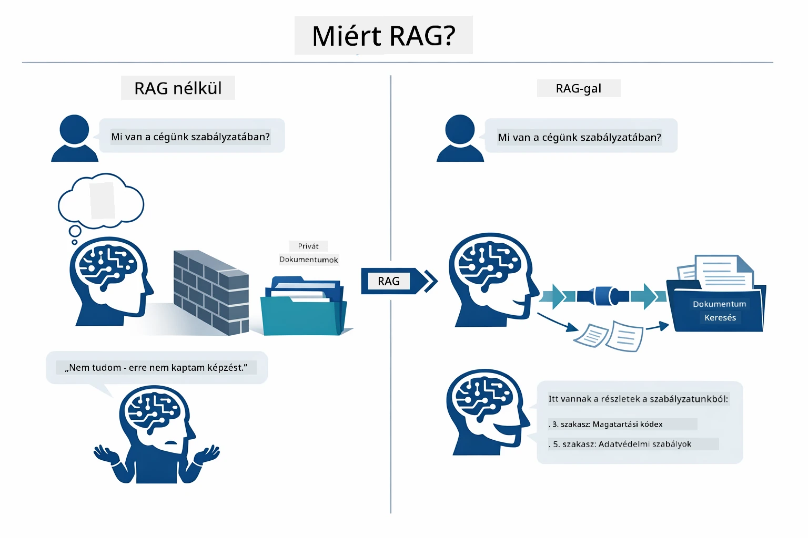

*Ez az ábra a hagyományos LLM (ami a tanítási adatokból tippel) és a RAG-alapú LLM (ami először megvizsgálja a dokumentumaidat) közti különbséget mutatja.*

Így kapcsolódnak össze a részek lépésről lépésre. A felhasználó kérdése négy fázison halad át – beágyazás, vektorkeresés, kontextus összeállítás és válaszgenerálás – mindegyik az előzőre épülve:


*Ez az ábra a RAG teljes folyamatát mutatja – a felhasználói kérdés beágyazásra, vektorkeresésre, kontextus-összeállításra és válaszgenerálásra kerül.*

A modul további része részletesen bemutatja az egyes lépéseket, a futtatható és módosítható kóddal együtt.

### Melyik RAG megközelítést használja ez az oktatóanyag?

A LangChain4j háromféle módot kínál a RAG megvalósítására, mindegyik különböző absztrakciós szinttel. Az alábbi ábra összehasonlítja őket egymás mellett:

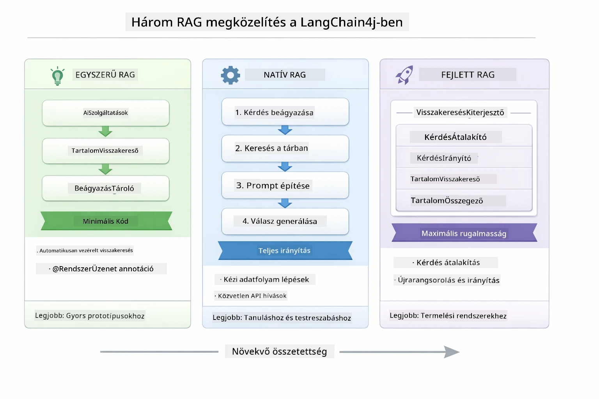

*Ez az ábra a három LangChain4j RAG megközelítést mutatja – Easy, Native, Advanced –, kiemelve főbb összetevőiket és használati területeiket.*

| Megközelítés | Mit csinál | Általános kompromisszum |
|---|---|---|
| **Easy RAG** | Automatikusan összeköti az egészet az `AiServices` és a `ContentRetriever` segítségével. Egy interfészt annotálsz, rácsatolsz egy keresőt, és a LangChain4j kezel mögötte beágyazást, keresést és a prompt összerakását. | Minimális kód, de nem látod, mi történik lépésről lépésre. |
| **Native RAG** | Te magad hívod meg a beágyazó modellt, keresed a tárolót, építed a promptot, és generálod a választ – minden lépést egyértelműen. | Több kód, viszont minden fázis látható és módosítható. |
| **Advanced RAG** | A `RetrievalAugmentor` keretrendszert használja, amelyhez csatlakoztathatsz lekérdezés átalakítókat, irányítókat, újrarangsorolókat és tartalombehúzókat, ipari minőségű pipeline-ok létrehozásához. | Maximális rugalmasság, de jelentősen bonyolultabb. |

**Ez az oktatóanyag a Native megközelítést használja.** A RAG pipeline minden lépése – a kérdés beágyazása, a vektoros tároló keresése, a kontextus összeállítása és a válasz generálása – explicit módon szerepel a [`RagService.java`](../../../03-rag/src/main/java/com/example/langchain4j/rag/service/RagService.java) fájlban. Ez szándékos: oktatási forrásként fontosabb, hogy lásd és megértsd minden lépést, mint hogy a kód a lehető legkisebb legyen. Amint ismered a folyamatot, áttérhetsz az Easy RAG-ra gyors prototípusokhoz vagy az Advanced RAG-ra gyártási rendszerekhez.

> **💡 Láttál már Easy RAG-ot működés közben?** A [Gyors kezdés modul](../00-quick-start/README.md) tartalmaz egy Dokumentum Q&A példát ([`SimpleReaderDemo.java`](../../../00-quick-start/src/main/java/com/example/langchain4j/quickstart/SimpleReaderDemo.java)), amely az Easy RAG megközelítést alkalmazza – a LangChain4j automatikusan kezeli a beágyazást, keresést és prompt összerakást. Ez a modul tovább lép, és felnyitja ezt a pipeline-t, hogy mindegyik lépést lásd és irányítsd magad.

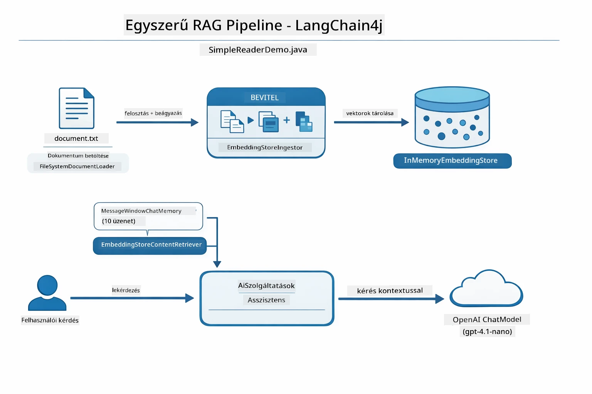

*Ez az ábra a `SimpleReaderDemo.java` Easy RAG pipeline-ját mutatja. Hasonlítsd össze a Native megközelítéssel, amit ebben a modulban használnak: az Easy RAG elrejti a beágyazást, visszakeresést és prompt összerakást az `AiServices` és a `ContentRetriever` mögött – egyszerűen betöltöd a dokumentumot, hozzácsatolsz egy keresőt, és kapsz válaszokat. A Native megközelítés ebben a modulban felnyitja ezt a pipeline-t, így te hívod meg minden lépést (beágyazol, keresel, összeállítasz kontextust, generálsz), teljes átláthatóságot és kontrollt biztosítva.*

## Hogyan működik

Ebben a modulban a RAG pipeline négy lépésre bontva fut végig minden egyes felhasználói kérdésnél. Először egy feltöltött dokumentumot **feldolgoznak és darabolnak kisebb részekre**. Ezeket a részeket aztán **vektoros beágyazásokká alakítják** és eltárolják, hogy matematikailag összehasonlíthatók legyenek. Amikor egy lekérdezés érkezik, a rendszer egy **szemantikus keresést** végez a legrelevánsabb darabok megtalálásához, majd azokat kontextusként átadja a LLM-nek a **válaszgeneráláshoz**. Az alábbi szakaszokban megvizsgáljuk mind a négy lépést a tényleges kóddal és ábrákkal. Nézzük az első lépést.

### Dokumentumfeldolgozás

[DocumentService.java](../../../03-rag/src/main/java/com/example/langchain4j/rag/service/DocumentService.java)

Amikor feltöltesz egy dokumentumot, a rendszer kikutatja annak tartalmát (PDF vagy sima szöveg), hozzácsatol metaadatokat, például a fájlnevet, majd darabokra bontja – kisebb részekre, amelyek kényelmesen elférnek a modell kontextusablakában. Ezek a darabok kismértékben átfedik egymást, hogy ne vesszen el kontextus a határoknál.

```java
// Elemezze a feltöltött fájlt és csomagolja be egy LangChain4j Dokumentumba
Document document = Document.from(content, metadata);

// Ossza 300 tokenes darabokra 30 tokenes átfedéssel
DocumentSplitter splitter = DocumentSplitters
    .recursive(300, 30);

List<TextSegment> segments = splitter.split(document);
```

Az alábbi ábra vizuálisan mutatja ezt a folyamatot. Figyeld meg, hogy az egyes darabok egyes tokeneket megosztanak a szomszédjaikkal – a 30 tokenes átfedés biztosítja, hogy semmi fontos kontextus ne vesszen el az átmeneteknél:

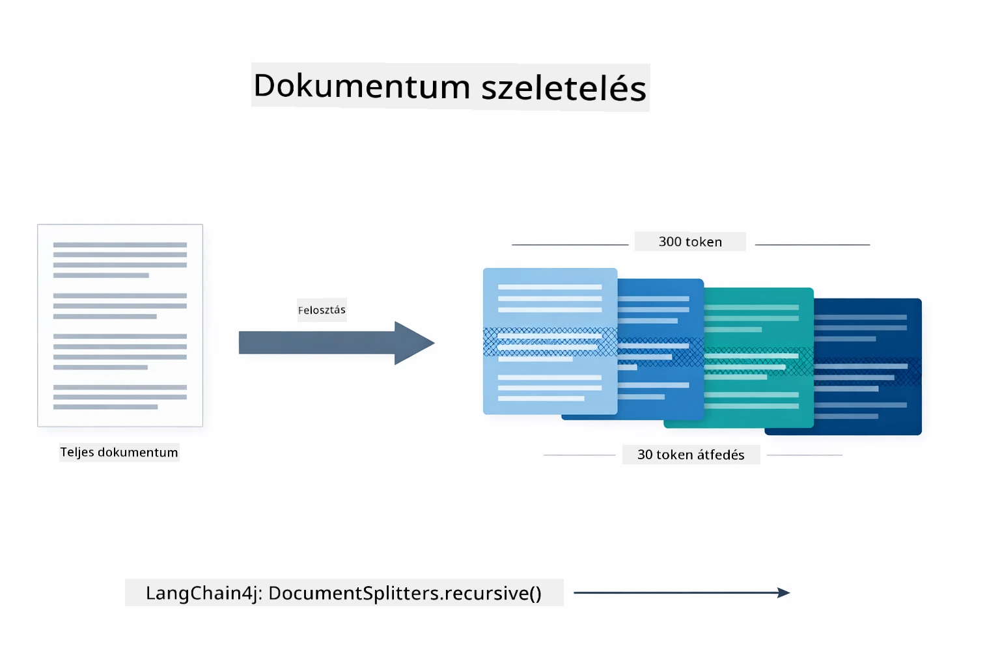

*Ez az ábra azt mutatja be, hogyan bontanak egy dokumentumot 300 tokenes darabokra 30 token átfedéssel, megőrizve a kontextust a darabok határán.*

> **🤖 Próbáld ki [GitHub Copilot](https://github.com/features/copilot) Chattel:** Nyisd meg a [`DocumentService.java`](../../../03-rag/src/main/java/com/example/langchain4j/rag/service/DocumentService.java) fájlt és kérdezd meg:
> - "Hogyan darolja a LangChain4j a dokumentumokat, és miért fontos az átfedés?"
> - "Mi az optimális darabméret különböző dokumentumtípusok esetén és miért?"
> - "Hogyan kezelem a többnyelvű vagy speciális formátumú dokumentumokat?"

### Beágyazások létrehozása

[LangChainRagConfig.java](../../../03-rag/src/main/java/com/example/langchain4j/rag/config/LangChainRagConfig.java)

Minden darabot egy numerikus ábrázolássá alakítanak, amit beágyazásnak nevezünk – lényegében egy jelentést számokká alakító eszköz. A beágyazó modell nem „intelligens” úgy, mint egy chat modell; nem tud utasításokat követni, érvelni vagy kérdésekre válaszolni. Amit tud, az az, hogy a szöveget egy matematikai térbe helyezi, ahol a hasonló jelentések egymáshoz közel landolnak – például az „autó” és a „gépkocsi”, a „visszatérítési szabályzat” és a „pénz visszafizetése” egymás mellett vannak. Gondolj a chat modellre úgy, mint egy emberre, akivel beszélgethetsz; a beágyazó modell egy nagyon jó iratrendszer.

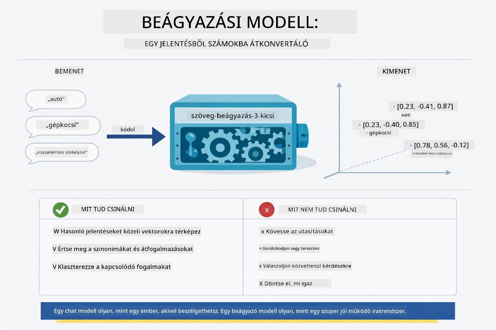

*Ez az ábra azt szemlélteti, hogy egy beágyazó modell hogyan alakítja a szöveget numerikus vektorokká, és helyezi a hasonló jelentéseket – mint az „autó” és a „gépkocsi” – egymáshoz közel a vektortérben.*

```java
@Bean
public EmbeddingModel embeddingModel() {
    return OpenAiOfficialEmbeddingModel.builder()
        .baseUrl(azureOpenAiEndpoint)
        .apiKey(azureOpenAiKey)
        .modelName(azureEmbeddingDeploymentName)
        .build();
}

EmbeddingStore<TextSegment> embeddingStore = 
    new InMemoryEmbeddingStore<>();
```

Az alábbi osztálydiagram a RAG pipeline két külön áramlását és a LangChain4j osztályait mutatja be, amelyek megvalósítják őket. A **betöltési áramlat** (ami egyszer lefut a feltöltéskor) feldarabolja a dokumentumot, beágyazza a darabokat, és eltárolja azokat az `.addAll()` metóduson keresztül. A **lekérdezési áramlat** (ami minden kérdésnél lefut) beágyazza a kérdést, keres a tárolóban az `.search()`-al, és átadja az egyező kontextust a chat modellnek. Mindkét áramlat közös pontja a `EmbeddingStore<TextSegment>` interfész:

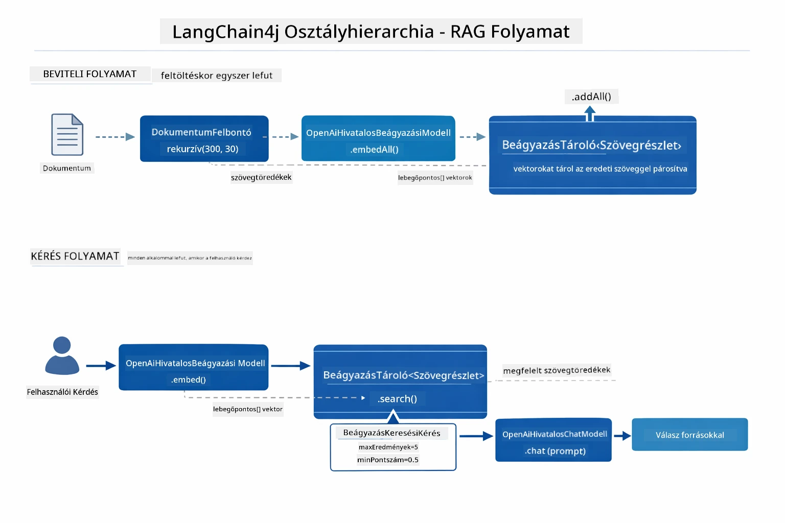

*Ez az ábra a RAG pipeline két áramát mutatja – betöltés és lekérdezés –, és azok összekapcsolódását a közös EmbeddingStore interfészen keresztül.*

Miután a beágyazások eltárolásra kerültek, a hasonló tartalmak természetesen egymáshoz csoportosulnak a vektortérben. Az alábbi vizualizáció megmutatja, hogy a kapcsolódó témák hogyan jelennek meg egymáshoz közeli pontokon, és ez teszi lehetővé a szemantikus keresést:


*Ez a vizualizáció azt mutatja be, hogy hogyan csoportosulnak egymáshoz közeli pontokba a kapcsolódó dokumentumok a 3D vektortérben, külön témákkal, mint Technikai dokumentumok, Üzleti szabályok és Gyakran ismételt kérdések.*

Amikor a felhasználó keres, a rendszer négy lépést követ: egyszer beágyazza a dokumentumokat, keresésenként beágyazza a kérdést, a kérdés vektorát összehasonlítja az összes tárolt vektorral kozinusz hasonlóság alapján, és visszaadja a legjobb K értékű találatot. Az alábbi ábra lépésenként mutatja be a folyamatot és a LangChain4j osztályokat:

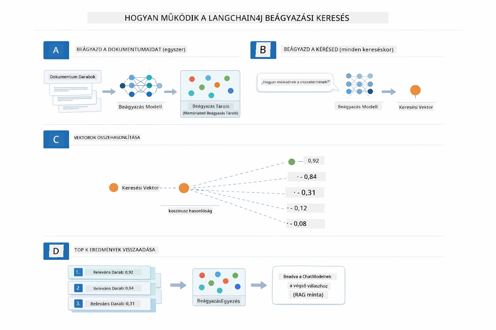

*Ez az ábra a beágyazás alapú keresés négy lépését mutatja: dokumentumok beágyazása, kérdés beágyazása, vektorok összehasonlítása kozinusz hasonlósággal, és a legjobb találatok visszaadása.*

### Szemantikus keresés

[RagService.java](../../../03-rag/src/main/java/com/example/langchain4j/rag/service/RagService.java)

Amikor kérdezel, a kérdésed is beágyazássá válik. A rendszer összehasonlítja a kérdésed beágyazását az összes dokumentumdarab beágyazásával. Megtalálja a leginkább jelentésében hasonló darabokat – nem csak a kulcsszavakat egyezteti, hanem valódi szemantikus hasonlóságot keres.

```java
Embedding queryEmbedding = embeddingModel.embed(question).content();

EmbeddingSearchRequest searchRequest = EmbeddingSearchRequest.builder()
    .queryEmbedding(queryEmbedding)
    .maxResults(5)
    .minScore(0.5)
    .build();

EmbeddingSearchResult<TextSegment> searchResult = embeddingStore.search(searchRequest);
List<EmbeddingMatch<TextSegment>> matches = searchResult.matches();

for (EmbeddingMatch<TextSegment> match : matches) {
    String relevantText = match.embedded().text();
    double score = match.score();
}
```

Az alábbi ábra összehasonlítja a szemantikus keresést a hagyományos kulcsszavas kereséssel. Egy „jármű” kulcsszavas keresés például kihagyhat egy „autók és teherautók” darabot, míg a szemantikus keresés megérti, hogy ugyanazt jelenti, és magas pontszámot ad neki:

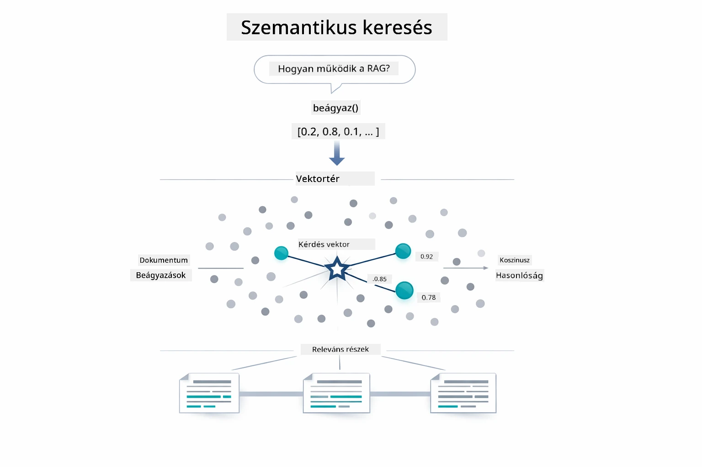

*Ez az ábra összehasonlítja a kulcsszavas keresést a szemantikus kereséssel, bemutatva, hogy a szemantikus keresés képes koncepcionálisan kapcsolódó tartalmakat visszahozni, még ha a kulcsszavak pontosan nem is egyeznek.*

A háttérben a hasonlóságot kozinusz hasonlósággal mérik – lényegében azt kérdezik: „mutatnak ezek a két nyíl ugyanabba az irányba?” Két darab teljesen különböző szavakat használhat, de ha ugyanazt jelentik, a vektoruk ugyanabba az irányba mutat, és a pontszámuk közel lesz az 1,0-hez:

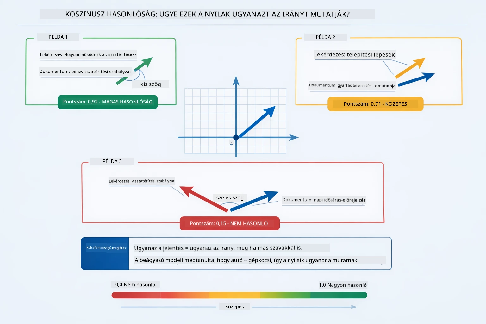
*Ez a diagram a koszinusz hasonlóságot ábrázolja, mint az embed vektorok közötti szöget — a jobban illeszkedő vektorok 1,0-hoz közelebb eső pontszámot kapnak, ami magasabb szemantikai hasonlóságot jelez.*

> **🤖 Próbáld ki a [GitHub Copilot](https://github.com/features/copilot) Chattel:** Nyisd meg a [`RagService.java`](../../../03-rag/src/main/java/com/example/langchain4j/rag/service/RagService.java) fájlt, majd kérdezd:
> - "Hogyan működik a hasonlóság keresés az embedekkel és mi határozza meg a pontszámot?"
> - "Milyen hasonlósági küszöböt használjak, és ez milyen hatással van az eredményekre?"
> - "Hogyan kezeljem azokat az eseteket, amikor nem található releváns dokumentum?"

### Válaszgenerálás

[RagService.java](../../../03-rag/src/main/java/com/example/langchain4j/rag/service/RagService.java)

A legrelevánsabb darabokat összeállítjuk egy strukturált promptba, amely explicit utasításokat, a lekért kontextust és a felhasználó kérdését tartalmazza. A modell ezeket a konkrét darabokat olvassa, és ezek alapján válaszol — csak azt használhatja, ami előtte van, ami megakadályozza a téveszméket.

```java
String context = matches.stream()
    .map(match -> match.embedded().text())
    .collect(Collectors.joining("\n\n"));

String prompt = String.format("""
    Answer the question based on the following context.
    If the answer cannot be found in the context, say so.

    Context:
    %s

    Question: %s

    Answer:""", context, request.question());

String answer = chatModel.chat(prompt);
```

Az alábbi diagram ezt az összeállítást mutatja be működés közben — a keresési lépés top pontszámú darabjait befecskendezik a prompt sablonba, és az `OpenAiOfficialChatModel` generál egy megalapozott választ:

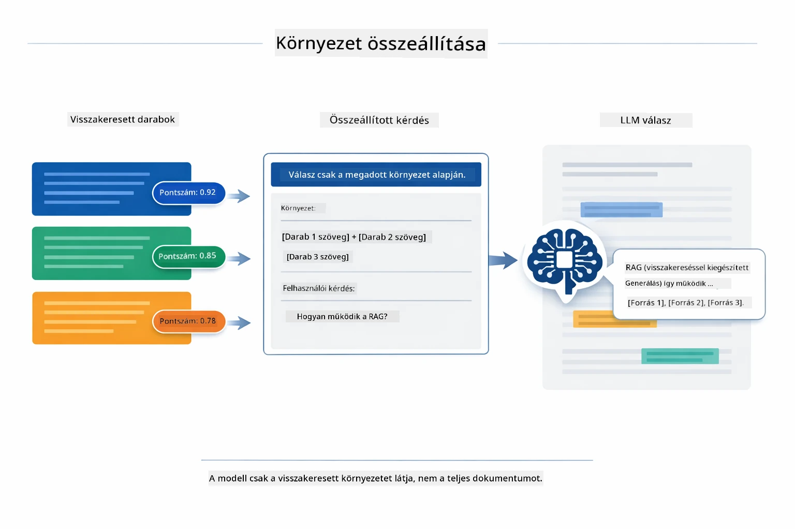

*Ez a diagram azt mutatja, hogyan állítják össze a legjobb pontszámú darabokat egy strukturált promptba, ami lehetővé teszi, hogy a modell megalapozott választ generáljon az adataidból.*

## Az alkalmazás futtatása

**Terjesztés ellenőrzése:**

Győződj meg róla, hogy a gyökérkönyvtárban létezik a `.env` fájl az Azure hitelesítő adataival (amit az 01-es modul alatt hoztál létre):

**Bash:**
```bash
cat ../.env  # Meg kell jeleníteni az AZURE_OPENAI_ENDPOINT, API_KEY, DEPLOYMENT értékeket
```

**PowerShell:**
```powershell
Get-Content ..\.env  # Meg kell jeleníteni az AZURE_OPENAI_ENDPOINT, API_KEY, DEPLOYMENT értékeket
```

**Az alkalmazás indítása:**

> **Megjegyzés:** Ha már elindítottad az összes alkalmazást a `./start-all.sh`-lal az 01-es modulból, ez a modul már fut a 8081-es porton. Ekkor kihagyhatod az alábbi indítási parancsokat és közvetlenül a http://localhost:8081 oldalra léphetsz.

**1. lehetőség: Spring Boot Dashboard használata (VS Code felhasználóknak ajánlott)**

A fejlesztői konténer tartalmazza a Spring Boot Dashboard kiterjesztést, amely vizuális felületet biztosít minden Spring Boot alkalmazás kezeléséhez. Megtalálod a VS Code bal oldali Activity Bar sávjában (keresd a Spring Boot ikont).

A Spring Boot Dashboardból:
- Látod az összes rendelkezésre álló Spring Boot alkalmazást a munkaterületen
- Egy kattintással indíthatod/leállíthatod az alkalmazásokat
- Valós időben nézheted az alkalmazás logjait
- Nyomon követheted az alkalmazás állapotát

Egyszerűen kattints a "rag" nevű modul melletti lejátszás gombra az indításhoz, vagy indítsd el egyszerre az összes modult.


*Ez a képernyőkép a Spring Boot Dashboardot mutatja VS Code-ban, ahol vizuálisan indíthatod, leállíthatod és figyelheted az alkalmazásokat.*

**2. lehetőség: shell scriptek használata**

Indítsd el az összes webalkalmazást (01-04 modulok):

**Bash:**
```bash
cd ..  # A gyökérkönyvtárból
./start-all.sh
```

**PowerShell:**
```powershell
cd ..  # A gyökérkönyvtárból
.\start-all.ps1
```

Vagy csak ezt a modult indítsd el:

**Bash:**
```bash
cd 03-rag
./start.sh
```

**PowerShell:**
```powershell
cd 03-rag
.\start.ps1
```

Mindkét script automatikusan betölti a környezeti változókat a gyökér `.env` fájlból és felépíti a JAR fájlokat, ha még nem léteznek.

> **Megjegyzés:** Ha inkább előbb manuálisan építed fel az összes modult:
>
> **Bash:**
> ```bash
> cd ..  # Go to root directory
> mvn clean package -DskipTests
> ```
>
> **PowerShell:**
> ```powershell
> cd ..  # Go to root directory
> mvn clean package -DskipTests
> ```

Nyisd meg böngészőben a http://localhost:8081 címet.

**Megállításhoz:**

**Bash:**
```bash
./stop.sh  # Csak ez a modul
# Vagy
cd .. && ./stop-all.sh  # Minden modul
```

**PowerShell:**
```powershell
.\stop.ps1  # Csak ez a modul
# Vagy
cd ..; .\stop-all.ps1  # Minden modul
```

## Az alkalmazás használata

Az alkalmazás webes felületet kínál dokumentum feltöltésre és kérdezésre.

<a href="images/rag-homepage.png"></a>

*Ez a képernyőkép a RAG alkalmazás felületét mutatja, ahol dokumentumokat töltesz fel és kérdéseket teszel fel.*

### Dokumentum feltöltése

Kezdd egy dokumentum feltöltésével - a TXT fájlok teszteléshez a legjobbak. Ebben a könyvtárban található egy `sample-document.txt`, amely a LangChain4j funkcióiról, a RAG megvalósításáról és legjobb gyakorlatokról szól — tökéletes a rendszer teszteléséhez.

A rendszer feldolgozza a dokumentumot, darabokra tördel, és minden darabhoz embedeket készít. Ez automatikusan megtörténik a feltöltéskor.

### Kérdések feltevése

Most tegyél fel konkrét kérdéseket a dokumentum tartalmával kapcsolatban. Próbálj meg tényeken alapuló, egyértelműen a dokumentumban szereplő kérdéseket. A rendszer megkeresi a releváns darabokat, beilleszti azokat a promptba, majd választ generál.

### Forrás hivatkozások ellenőrzése

Láthatod, hogy minden válaszhoz tartoznak forráshivatkozások és hasonlósági pontszámok. Ezek a pontszámok (0-tól 1-ig) azt mutatják, mennyire volt releváns az adott darab a kérdésedhez. A magasabb pontszám jobb egyezést jelent. Ez lehetővé teszi, hogy az adott választ ellenőrizd a forrásanyaggal.

<a href="images/rag-query-results.png"></a>

*Ez a képernyőkép lekérdezési eredményeket mutat a generált válasszal, forrás hivatkozásokkal és minden lekért darab relevancia pontszámával.*

### Kísérletezz kérdésekkel

Próbálj ki különböző típusú kérdéseket:
- Konkrét tények: "Mi a fő téma?"
- Összehasonlítások: "Mi a különbség X és Y között?"
- Összefoglalók: "Foglald össze a Z-re vonatkozó kulcspontokat"

Figyeld meg, hogyan változnak a relevancia pontszámok attól függően, mennyire egyezik a kérdésed a dokumentum tartalmával.

## Kulcsfogalmak

### Darabolási stratégia

A dokumentumokat 300 tokenes darabokra osztjuk, 30 token átfedéssel. Ez az egyensúly biztosítja, hogy minden darab elég kontextust tartalmazzon ahhoz, hogy értelmes legyen, miközben elég kicsi marad ahhoz, hogy több darab is beférjen egy promptba.

### Hasonlósági pontszámok

Minden lekért darabhoz tartozik egy 0 és 1 közötti hasonlósági pontszám, amely megmutatja, mennyire illeszkedik a felhasználó kérdéséhez. Az alábbi diagram vizualizálja a pontszám tartományokat és azt, hogy a rendszer hogyan használja ezeket a szűréshez:

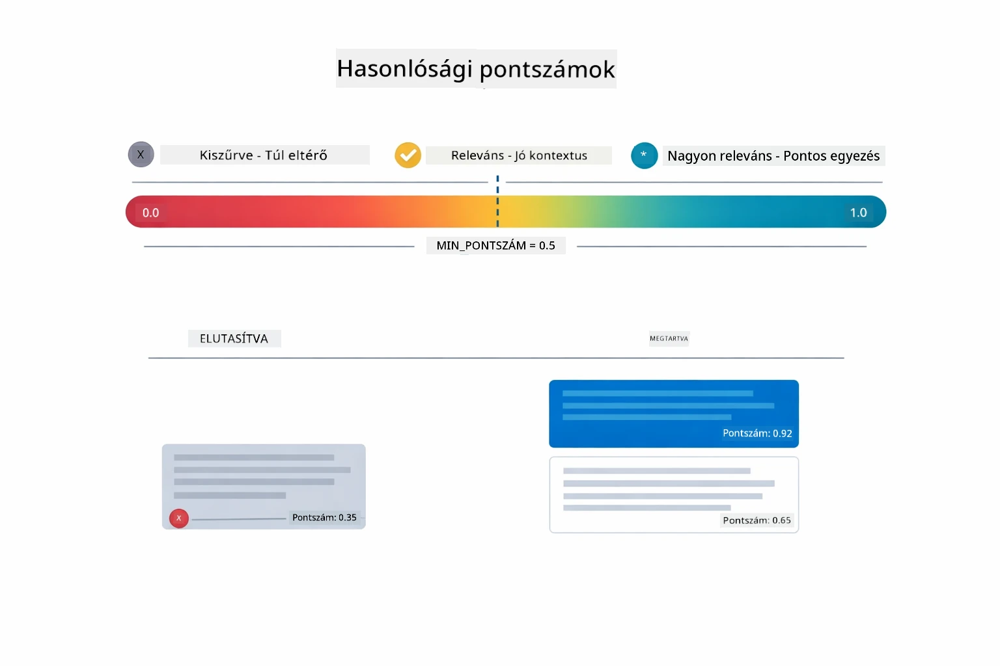

*Ez a diagram pontszám tartományokat mutat 0-tól 1-ig, egy 0,5-ös minimum küszöbbel, amely kiszűri a nem releváns darabokat.*

A pontszámok 0-tól 1-ig terjednek:
- 0,7–1,0: Nagyon releváns, pontos egyezés
- 0,5–0,7: Releváns, jó kontextus
- 0,5 alatt: Kiszűrt, túl eltérő

A rendszer csak a minimum küszöböt meghaladó darabokat hozza vissza a minőség biztosítása érdekében.

Az embedek jól működnek, ha a jelentések tisztán csoportosulnak, de vakfoltjaik vannak. Az alábbi diagram a gyakori hibamódokat mutatja — túl nagy darabok homályos vektorokat eredményeznek, túl kicsik kevés kontextust adnak, homályos kifejezések több klaszterre mutatnak, és a pontos egyezésen alapuló keresések (azonosítók, cikkszámok) egyáltalán nem működnek embedekkel:

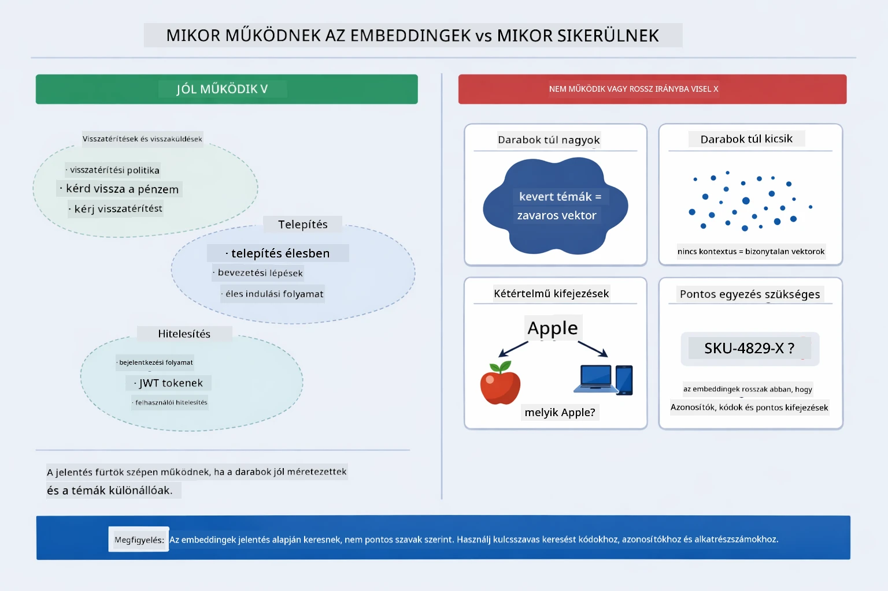

*Ez a diagram a gyakori embed hibamódokat mutatja: túl nagy darabok, túl kicsik, homályos kifejezések több klaszterre mutatnak, valamint pontos egyezésű keresések, mint az azonosítók.*

### Memóriában tárolás

Ez a modul egyszerűség kedvéért memóriában tárolja az adatokat. Az alkalmazás újraindításakor a feltöltött dokumentumok elvesznek. Éles környezetben perzisztens vektoralapú adatbázisokat, mint a Qdrant vagy Azure AI Search használnak.

### Kontextusablak kezelése

Minden modellnek van egy maximális kontextusablaka. Nem tudsz minden darabot beletenni egy nagy dokumentumból. A rendszer a legrelevánsabb N darabot hozza vissza (alapértelmezett 5), hogy a korlátokon belül maradjon, miközben elég kontextust ad pontos válaszokhoz.

## Mikor fontos a RAG

A RAG nem mindig a megfelelő megoldás. Az alábbi döntési útmutató segít eldönteni, mikor ad hozzá értéket a RAG, és mikor elég egyszerűbb megközelítéseket alkalmazni — például a tartalom közvetlen beillesztése a promptba vagy a modell beépített tudására hagyatkozás:

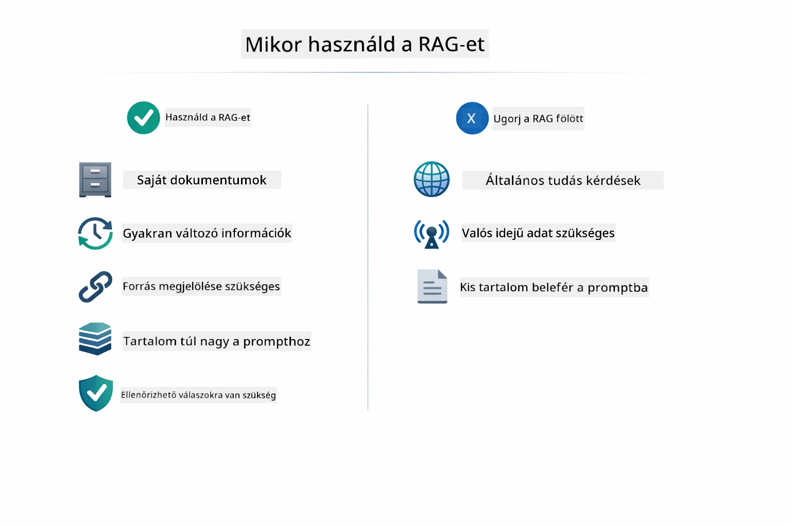

*Ez a diagram egy döntési útmutatót mutat, mikor ad hozzá értéket a RAG, és mikor elegendőek az egyszerűbb megközelítések.*

**Használd a RAG-et, amikor:**
- Saját dokumentumokról kérdezel
- Az információ gyakran változik (szabályzatok, árak, specifikációk)
- A pontossághoz forráshivatkozás szükséges
- A tartalom túl nagy ahhoz, hogy egy promptba beférjen
- Verifikálható, megalapozott válaszokra van szükség

**Ne használd a RAG-et, amikor:**
- A kérdésekhez a modell már rendelkezik általános ismerettel
- Valós idejű adatra van szükség (a RAG feltöltött dokumentumokon működik)
- A tartalom elég kicsi ahhoz, hogy közvetlenül beilleszd a promptba

## Következő lépések

**Következő modul:** [04-tools - AI ügynökök eszközökkel](../04-tools/README.md)

---

**Navigáció:** [← Előző: 02-es modul - Prompt tervezés](../02-prompt-engineering/README.md) | [Vissza a főoldalra](../README.md) | [Következő: 04-es modul - Eszközök →](../04-tools/README.md)

---

<!-- CO-OP TRANSLATOR DISCLAIMER START -->
**Jogi nyilatkozat**:  
Ez a dokumentum az AI fordító szolgáltatás, a [Co-op Translator](https://github.com/Azure/co-op-translator) használatával készült. Míg törekszünk a pontosságra, kérjük, vegye figyelembe, hogy az automatikus fordítások hibákat vagy pontatlanságokat tartalmazhatnak. Az eredeti dokumentum az anyanyelvén tekintendő hiteles forrásnak. Fontos információk esetén professzionális emberi fordítás igénylése ajánlott. Nem vállalunk felelősséget az ebből eredő félreértésekért vagy téves értelmezésekért.
<!-- CO-OP TRANSLATOR DISCLAIMER END -->