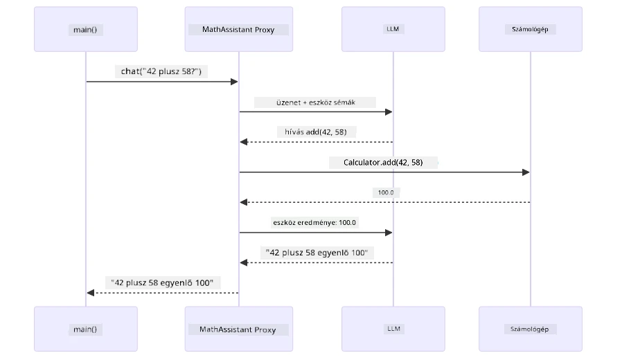
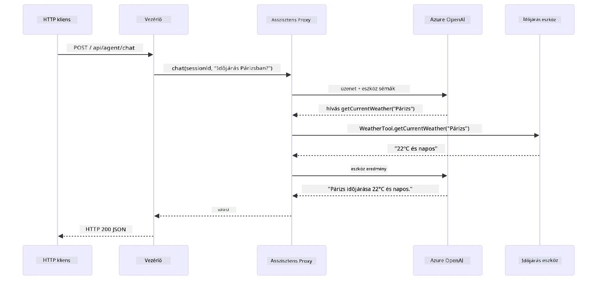

# 04. modul: AI ügynökök eszközökkel

## Tartalomjegyzék

- [Videós bemutató](../../../04-tools)
- [Mit tanulsz meg](../../../04-tools)
- [Előfeltételek](../../../04-tools)
- [AI ügynökök megértése eszközökkel](../../../04-tools)
- [Hogyan működik az eszközhívás](../../../04-tools)
  - [Eszközdefiníciók](../../../04-tools)
  - [Döntéshozatal](../../../04-tools)
  - [Végrehajtás](../../../04-tools)
  - [Válaszgenerálás](../../../04-tools)
  - [Architektúra: Spring Boot automatikus bekötés](../../../04-tools)
- [Eszközláncolás](../../../04-tools)
- [Az alkalmazás futtatása](../../../04-tools)
- [Az alkalmazás használata](../../../04-tools)
  - [Egyszerű eszközhasználat kipróbálása](../../../04-tools)
  - [Eszközláncolás tesztelése](../../../04-tools)
  - [Párbeszédfolyam megtekintése](../../../04-tools)
  - [Különböző kérdések kipróbálása](../../../04-tools)
- [Kulcsfogalmak](../../../04-tools)
  - [ReAct minta (gondolkodás és cselekvés)](../../../04-tools)
  - [Az eszközleírások számítanak](../../../04-tools)
  - [Munkamenet-kezelés](../../../04-tools)
  - [Hibakezelés](../../../04-tools)
- [Elérhető eszközök](../../../04-tools)
- [Mikor használjunk eszközalapú ügynököket](../../../04-tools)
- [Eszközök kontra RAG](../../../04-tools)
- [Következő lépések](../../../04-tools)

## Videós bemutató

Nézd meg ezt az élő részvételű bemutatót, amely elmagyarázza, hogyan kezdj hozzá ehhez a modulhoz:

<a href="https://www.youtube.com/watch?v=O_J30kZc0rw"></a>

## Mit tanulsz meg

Eddig megtanultad, hogyan folytass párbeszédeket az AI-val, hogyan építsd fel hatékonyan a promptokat, és hogyan alapozd válaszaidat a dokumentumaidra. De van egy alapvető korlát: a nyelvi modellek csak szöveget képesek generálni. Nem tudnak időjárást ellenőrizni, számításokat végezni, adatbázisokat lekérdezni vagy külső rendszerekkel kommunikálni.

Az eszközök ezt megváltoztatják. Azáltal, hogy a modell hozzáférhet olyan függvényekhez, amiket meghívhat, szöveggenerátorból olyan ügynökké alakul, amely képes műveleteket végrehajtani. A modell eldönti, mikor kell eszköz, melyik eszközt használja, és milyen paraméterekkel hívja meg. A te kódod végrehajtja a függvényt és visszaadja az eredményt. A modell beépíti ezt az eredményt a válaszába.

## Előfeltételek

- Elvégezted az [01. modul - Bevezetés](../01-introduction/README.md) anyagát (Azure OpenAI erőforrások telepítve)
- Ajánlott a korábbi modulok elvégzése (ez a modul a [03. modul RAG fogalmaira](../03-rag/README.md) hivatkozik az Eszközök kontra RAG összehasonlításban)
- `.env` fájl a gyökérkönyvtárban Azure hitelesítőkkel (amit az `azd up` létrehozott az 01. modulban)

> **Megjegyzés:** Ha még nem végezted el az 01. modult, előbb kövesd ott a telepítési útmutatót.

## AI ügynökök megértése eszközökkel

> **📝 Megjegyzés:** Ebben a modulban az "ügynök" kifejezés olyan AI asszisztenseket jelöl, amelyek eszközhívó képességekkel vannak bővítve. Ez különbözik a **Agentic AI** mintáktól (önálló ügynökök tervezéssel, memóriával és többlépéses érveléssel), amelyeket majd a [05. modulban: MCP](../05-mcp/README.md) tárgyalunk.

Eszközök nélkül a nyelvi modell csak szöveget tud generálni a tanítási adataiból. Ha megkérdezed az aktuális időjárást, csupán találgatnia kell. Ha eszközöket adsz neki, akkor például egy időjárási API-t hívhat meg, számításokat végezhet, vagy lekérdezheti egy adatbázist – majd az így kapott valós eredményeket beépíti a válaszába.


*Eszközök nélkül a modell csak találgat — eszközökkel API-kat hívhat, számításokat végezhet és valós idejű adatokat adhat vissza.*

Az AI ügynök eszközökkel egy **Reasoning and Acting (ReAct)** mintát követ. A modell nem csak válaszol — végiggondolja, mire van szüksége, eszközt hív meg, megfigyeli az eredményt, majd eldönti, hogy újra cselekszik, vagy leadja a végső választ:

1. **Érvelés** — Az ügynök elemzi a felhasználó kérdését, és megállapítja, milyen információra van szüksége
2. **Cselekvés** — Az ügynök kiválasztja a megfelelő eszközt, generálja a helyes paramétereket, és meghívja azt
3. **Megfigyelés** — Kézhez kapja az eszköz eredményét és értékeli azt
4. **Ismétlés vagy válaszadás** — Ha több adat szükséges, visszatér az első ponthoz; ha nem, természetes nyelvű választ fogalmaz meg


*A ReAct ciklus — az ügynök végiggondolja mit tegyen, cselekszik az eszköz meghívásával, megfigyeli az eredményt, és ismétel, amíg végső választ tud adni.*

Ez automatikusan történik. Te definiálod az eszközöket és azok leírásait. A modell dönt az eszközhasználatról, hogy mikor és hogyan alkalmazza őket.

## Hogyan működik az eszközhívás

### Eszközdefiníciók

[WeatherTool.java](../../../04-tools/src/main/java/com/example/langchain4j/agents/tools/WeatherTool.java) | [TemperatureTool.java](../../../04-tools/src/main/java/com/example/langchain4j/agents/tools/TemperatureTool.java)

Függvényeket határozol meg világos leírásokkal és paraméter specifikációkkal. A modell ezeket a leírásokat látja a rendszerüzenetben, és érti, mit csinál az adott eszköz.

```java
@Component
public class WeatherTool {
    
    @Tool("Get the current weather for a location")
    public String getCurrentWeather(@P("Location name") String location) {
        // Az időjárás lekérdezési logikája
        return "Weather in " + location + ": 22°C, cloudy";
    }
}

@AiService
public interface Assistant {
    String chat(@MemoryId String sessionId, @UserMessage String message);
}

// Az asszisztens automatikusan a Spring Boot által van összekötve:
// - ChatModel bean
// - Minden @Tool metódus az @Component osztályokból
// - ChatMemoryProvider a munkamenet kezeléséhez
```

Az alábbi ábra szétbont minden annotációt és megmutatja, hogyan segít mindegyik része az AI-nak megérteni, mikor kell az eszközt hívni és milyen argumentumokat kell átadni:


*Egy eszközdefiníció felépítése — @Tool jelzi az AI-nak, mikor használja, @P írja le az egyes paramétereket, és az @AiService összeköti az egészet az induláskor.*

> **🤖 Próbáld ki a [GitHub Copilot](https://github.com/features/copilot) Chattel:** Nyisd meg a [`WeatherTool.java`](../../../04-tools/src/main/java/com/example/langchain4j/agents/tools/WeatherTool.java) fájlt és kérdezd meg:
> - "Hogyan integrálnék egy valós időjárási API-t, mint az OpenWeatherMap a teszt adatok helyett?"
> - "Mi tesz ki egy jó eszközleírást, ami segíti az AI-t, hogy helyesen használja?"
> - "Hogyan kezeljem az API hibákat és a hívási korlátokat az eszközmegvalósításokban?"

### Döntéshozatal

Ha a felhasználó megkérdezi: „Milyen az időjárás Seattle-ben?”, a modell nem véletlenszerűen választ eszközt. Összehasonlítja a felhasználó szándékát minden eszközleírással, értékeli mindegyik relevanciáját, és a legjobbat választja ki. Ezután generál egy strukturált függvényhívást a megfelelő paraméterekkel – ebben az esetben a `location` értéke `"Seattle"` lesz.

Ha egyik eszköz sem illik, a modell a saját tudására támaszkodva válaszol. Több eszköz esetén a legspecifikusabbat választja.


*A modell minden elérhető eszközt értékel a felhasználói szándék szerint, és a legjobbat választja ki — ezért fontos, hogy világos, specifikus eszközleírásokat írj.*

### Végrehajtás

[AgentService.java](../../../04-tools/src/main/java/com/example/langchain4j/agents/service/AgentService.java)

A Spring Boot automatikusan beköti a deklaratív `@AiService` interfészt az összes regisztrált eszközzel, és a LangChain4j automatikusan végrehajtja az eszköz hívásokat. A háttérben egy teljes eszközhívás hat szakaszon keresztül halad – a felhasználó természetes nyelvű kérdésétől a természetes nyelvű válasz visszaadásáig:


*Végponttól végpontig folyamat — a felhasználó kérdez, a modell eszközt választ, a LangChain4j végrehajtja, és a modell a kapott eredményt beépíti a választba.*

Ha a [ToolIntegrationDemo](../../../00-quick-start/src/main/java/com/example/langchain4j/quickstart/ToolIntegrationDemo.java) példát lefuttattad 00-ban, már láttad ezt a mintát működés közben – a `Calculator` eszközöket ugyanígy hívta meg. Az alábbi szekvencia diagram pontosan megmutatja, mi történt a háttérben a demó során:



*Eszközhívási ciklus a Quick Start demóból — az `AiServices` elküldi az üzenetet és az eszköz sémákat az LLM-nek, az LLM egy függvényhívással válaszol, mint az `add(42, 58)`, a LangChain4j helyben végrehajtja a `Calculator` metódust, majd az eredményt visszacsatolja a végső válaszhoz.*

> **🤖 Próbáld ki a [GitHub Copilot](https://github.com/features/copilot) Chattel:** Nyisd meg az [`AgentService.java`](../../../04-tools/src/main/java/com/example/langchain4j/agents/service/AgentService.java) fájlt és kérdezd meg:
> - "Hogyan működik a ReAct minta és miért hatékony az AI ügynökök számára?"
> - "Hogyan dönt az ügynök, hogy melyik eszközt használja és milyen sorrendben?"
> - "Mi történik, ha egy eszköz végrehajtása meghiúsul – hogyan kezeljem robosztusan a hibákat?"

### Válaszgenerálás

A modell megkapja az időjárási adatokat, és természetes nyelvű választ formáz belőlük a felhasználónak.

### Architektúra: Spring Boot automatikus bekötés

Ez a modul a LangChain4j Spring Boot integrációját használja deklaratív `@AiService` interfészekkel. Induláskor a Spring Boot felfedezi az összes `@Component`-et, melyek `@Tool` metódusokat tartalmaznak, a `ChatModel` bean-t és a `ChatMemoryProvider`-t — majd mindet egyetlen `Assistant` interfészbe kötve összerendezi, mindezt null boilerplate kóddal.


*Az @AiService interfész összekapcsolja a ChatModelt, az eszköz komponenseket és a memória szolgáltatót — a Spring Boot minden bekötést automatikusan elintéz.*

Íme a teljes kérés életciklusa egy szekvencia diagramon – az HTTP kérésből az vezérlőn, szolgáltatáson és az automatikusan kötött proxy-n keresztül az eszköz végrehajtásig és vissza:



*A teljes Spring Boot kéréséletciklus — az HTTP kérés áthalad a vezérlőn és a szolgáltatáson az automatikusan kötött Assistant proxyig, amely automatikusan összehangolja az LLM-et és az eszközhívásokat.*

Az eljárás fő előnyei:

- **Spring Boot automatikus bekötés** — ChatModel és eszközök automatikusan injektálva
- **@MemoryId minta** — Automatikus munkamenet-alapú memória kezelés
- **Egyetlen példány** — Assistant egyszer létrejön és újrafelhasználható, jobb teljesítményért
- **Típusbiztos végrehajtás** — Java metódusok közvetlen hívása típuskonverzióval
- **Multi-turn koordináció** — Eszközláncolást automatikusan kezeli
- **Null boilerplate** — Nincs manuális `AiServices.builder()` hívás vagy memória HashMap

Alternatív megközelítések (manuális `AiServices.builder()`) több kódot igényelnek és nem élvezhetik a Spring Boot integráció előnyeit.

## Eszközláncolás

**Eszközláncolás** — Az eszközalapú ügynökök valós ereje akkor mutatkozik meg, ha egyetlen kérdés több eszközt igényel. Például: „Milyen az időjárás Seattle-ben Fahrenheitben?” Az ügynök automatikusan láncol két eszközt: először meghívja a `getCurrentWeather`-t, hogy megszerezze a Celsius hőmérsékletet, majd ezt az értéket átadja a `celsiusToFahrenheit`-nek a konvertáláshoz — mindez egyetlen beszélgetési körben.


*Eszközláncolás működés közben — az ügynök először hívja a getCurrentWeather-t, majd az így kapott Celsius eredményt átvezeti a celsiusToFahrenheit-nek, és közös választ ad.*

**Zökkenőmentes hibakezelés** — Kérdezz időjárást egy városról, amely nincs a teszt adatok között. Az eszköz hibaüzenetet ad vissza, és az AI elmagyarázza, hogy nem tud segíteni ahelyett, hogy összeomlana. Az eszközök biztonságosan hibáznak. Az alábbi ábra összehasonlítja a két megközelítést — megfelelő hibakezeléssel az ügynök elkapja a kivételt és segítőkész választ ad, hibakezelés nélkül az egész alkalmazás összeomlik:


*Ha egy eszköz hibázik, az ügynök elkapja a hibát és segítőkész magyarázattal válaszol az összeomlás helyett.*

Ez egyetlen beszélgetési körben történik. Az ügynök önállóan koordinál több eszköz hívást.

## Az alkalmazás futtatása

**Telepítés ellenőrzése:**

Győződj meg róla, hogy a `.env` fájl létezik a gyökérkönyvtárban az Azure hitelesítőkkel (az 01. modul során jött létre). Futtasd ezt a modul könyvtárából (`04-tools/`):

**Bash:**
```bash
cat ../.env  # Meg kell jeleníteni az AZURE_OPENAI_ENDPOINT, API_KEY, DEPLOYMENT értékeket
```

**PowerShell:**
```powershell
Get-Content ..\.env  # Meg kell jeleníteni az AZURE_OPENAI_ENDPOINT, API_KEY, DEPLOYMENT értékeket
```

**Alkalmazás indítása:**

> **Megjegyzés:** Ha már elindítottad az összes alkalmazást a gyökérkönyvtárból `./start-all.sh`-al (ahogy az 01. modulban le van írva), akkor ez a modul már fut a 8084-es porton. Az indítási parancsokat ilyenkor kihagyhatod, és közvetlenül a http://localhost:8084 címre mehetsz.

**1. lehetőség: Spring Boot Dashboard használata (VS Code felhasználóknak ajánlott)**

A fejlesztői konténer tartalmazza a Spring Boot Dashboard bővítményt, amely vizuális felületet biztosít az összes Spring Boot alkalmazás kezeléséhez. A VS Code bal oldali Tevékenység sávjában találod (keresd a Spring Boot ikont).

A Spring Boot Dashboard segítségével:
- Megnézheted az összes elérhető Spring Boot alkalmazást a munkaterületen
- Egy kattintással indíthatsz/leállíthatsz alkalmazásokat
- Valós időben láthatod az alkalmazások naplóit
- Figyelemmel kísérheted az alkalmazás állapotát
Egyszerűen kattints a lejátszás gombra a "tools" mellett, hogy elindítsd ezt a modult, vagy indíts el egyszerre minden modult.

Így néz ki a Spring Boot Dashboard a VS Code-ban:


*A Spring Boot Dashboard a VS Code-ban — indítsd, állítsd le és figyeld az összes modult egy helyről*

**2. lehetőség: Shell scriptek használata**

Indítsd el az összes webalkalmazást (a 01-04 modulok):

**Bash:**
```bash
cd ..  # Gyökérkönyvtárból
./start-all.sh
```

**PowerShell:**
```powershell
cd ..  # A gyökérkönyvtárból
.\start-all.ps1
```

Vagy indítsd csak ezt a modult:

**Bash:**
```bash
cd 04-tools
./start.sh
```

**PowerShell:**
```powershell
cd 04-tools
.\start.ps1
```

Mindkét script automatikusan betölti a környezeti változókat a gyökér `.env` állományból, és lefordítja a JAR-okat, ha még nem léteznek.

> **Megjegyzés:** Ha inkább manuálisan akarod lefordítani az összes modult az indítás előtt:
>
> **Bash:**
> ```bash
> cd ..  # Go to root directory
> mvn clean package -DskipTests
> ```

> **PowerShell:**
> ```powershell
> cd ..  # Go to root directory
> mvn clean package -DskipTests
> ```

Nyisd meg a http://localhost:8084 címet a böngésződben.

**Leállításhoz:**

**Bash:**
```bash
./stop.sh  # Csak ez a modul
# Vagy
cd .. && ./stop-all.sh  # Minden modul
```

**PowerShell:**
```powershell
.\stop.ps1  # Csak ez a modul
# Vagy
cd ..; .\stop-all.ps1  # Minden modul
```

## Az alkalmazás használata

Az alkalmazás egy webes felületet biztosít, ahol egy AI ügynökkel kommunikálhatsz, aki rendelkezik időjárás- és hőmérséklet-konvertáló eszközökkel. Íme, így néz ki a felület — tartalmaz gyorsindítási példákat és egy csevegőpanelt a kérések elküldéséhez:

<a href="images/tools-homepage.png"></a>

*Az AI Agent Tools felület – gyors példák és csevegőfelület az eszközökkel való interakcióhoz*

### Próbálj ki egyszerű eszközhasználatot

Kezdj egy egyszerű kérdéssel: „Alakítsd át 100 Fahrenheit fokot Celsiusra.” Az ügynök felismeri, hogy szüksége van a hőmérséklet-konvertáló eszközre, megfelelő paraméterekkel meghívja, és visszaadja az eredményt. Figyeld meg, milyen természetes ez — nem kellett megadnod, hogy melyik eszközt használd vagy hogyan hívd meg.

### Teszteld az eszközök láncolását

Most próbálj valami bonyolultabbat: „Milyen az időjárás Seattle-ben, és alakítsd át Fahrenheitbe?” Nézd meg, hogyan dolgozza fel ezt az ügynök lépésről lépésre. Először lekéri az időjárást (ami Celsiusban ad választ), felismeri, hogy át kell váltani Fahrenheitbe, meghívja a konverziós eszközt, majd egyesíti mindkét eredményt egy válaszba.

### Nézd meg a beszélgetés folyamatát

A csevegőfelület megőrzi a beszélgetés előzményeit, így több lépésből álló interakciókat folytathatsz. Láthatod az összes korábbi kérdést és választ, így könnyű követni a párbeszédet és megérteni, hogyan építi fel az ügynök a kontextust több csere során.

<a href="images/tools-conversation-demo.png"></a>

*Többszörös lépéses beszélgetés egyszerű átváltásokról, időjárás-lekérdezésekről és eszközláncolásról*

### Kísérletezz különféle kérésekkel

Próbálj ki különböző kombinációkat:
- Időjárás lekérdezése: „Milyen az időjárás Tokióban?”
- Hőmérséklet átváltások: „Mennyi 25°C Kelvinben?”
- Összetett kérdések: „Nézd meg az időjárást Párizsban, és mondd meg, ha 20°C fölött van”

Vedd észre, hogyan értelmezi az ügynök a természetes nyelvet, és hogyan kapcsolja össze a megfelelő eszközhívásokkal.

## Kulcsfontosságú fogalmak

### ReAct minta (Gondolkodás és Cselekvés)

Az ügynök váltogat a gondolkodás (döntés, mit tegyen) és a cselekvés (eszközök használata) között. Ez a minta lehetővé teszi az autonóm problémamegoldást az egyszerű utasításokra adott válasz helyett.

### Az eszközleírások jelentősége

Az eszközleírások minősége közvetlenül befolyásolja, hogy az ügynök mennyire jól használja őket. A világos, pontos leírások segítenek a modellnek megérteni, mikor és hogyan hívja meg az adott eszközt.

### Munkamenet-kezelés

Az `@MemoryId` annotáció lehetővé teszi az automatikus munkamenetalapú memória kezelést. Minden munkamenetazonosítóhez saját `ChatMemory` példány tartozik, amit a `ChatMemoryProvider` bean kezel, így több felhasználó egyszerre is kommunikálhat az ügynökkel anélkül, hogy összekeverednének a beszélgetéseik. Az alábbi ábra bemutatja, hogyan irányítódnak a felhasználók elkülönített memóriatárolókhoz az azonosítóik alapján:


*Minden munkamenetazonosítóhoz elkülönített beszélgetési előzmény tartozik — a felhasználók soha nem látják egymás üzeneteit.*

### Hibakezelés

Az eszközök hibázhatnak — az API-k időtúlléphetnek, hibásak lehetnek a paraméterek, leállhatnak külső szolgáltatások. A termelési környezetben az ügynököknek kell hibakezelést biztosítani, hogy a modell meg tudja magyarázni a problémákat vagy alternatívákat próbáljon ahelyett, hogy az egész alkalmazás összeomlik. Ha egy eszköz kivételt dob, a LangChain4j elkapja, és a hibaüzenetet visszaküldi a modellnek, ami természetes nyelven magyarázhatja el a problémát.

## Elérhető eszközök

Az alábbi ábra a használható eszközök széles ökoszisztémáját mutatja be. Ez a modul az időjárás- és hőmérséklet-eszközöket demonstrálja, de ugyanaz az `@Tool` minta bármely Java metódusra alkalmazható — az adatbázis-lekérdezésektől a fizetési feldolgozásig.


*Minden Java metódus, amelyet az @Tool annotációval látsz el, elérhetővé válik az AI számára — a minta kiterjed adatbázisokra, API-kra, e-mailekre, fájlműveletekre és még sok másra.*

## Mikor használjunk eszköz-alapú ügynököket

Nem minden kérés igényli az eszközöket. A döntés azon múlik, hogy az AI-nak szüksége van-e külső rendszerekkel való interakcióra, vagy a saját tudásából válaszolhat-e. Az alábbi útmutató összefoglalja, mikor adnak értéket az eszközök és mikor nincs rájuk szükség:


*Gyors döntési útmutató — az eszközök valós idejű adatokhoz, számításokhoz és műveletekhez valók; az általános tudás és kreatív feladatok nem igénylik őket.*

## Eszközök vs RAG

A 03 és 04 modulok mindegyike kibővíti, hogy az AI mit tud, de alapvetően eltérő módon. A RAG a modellnek ad **ismeretet** azáltal, hogy dokumentumokat keres elő. Az eszközök a modellnek képességet adnak **műveletek végrehajtására** függvényhívásokkal. Az alábbi ábra ezt a két megközelítést hasonlítja össze egymás mellett — a működési módoktól a közöttük lévő kompromisszumokig:


*A RAG statikus dokumentumokból szerez információt — az Eszközök műveleteket hajtanak végre és dinamikus, valós idejű adatokat kérnek le. Sok termelési rendszer mindkettőt kombinálja.*

Gyakorlatban számos termelési rendszer mindkét megközelítést alkalmazza: RAG-ot arra, hogy az válaszokat a dokumentációdban megalapozza, és Eszközöket a valós adatok lekérésére vagy műveletek végrehajtására.

## Következő lépések

**Következő modul:** [05-mcp - Model Context Protocol (MCP)](../05-mcp/README.md)

---

**Navigáció:** [← Előző: 03-as modul - RAG](../03-rag/README.md) | [Vissza a főoldalra](../README.md) | [Következő: 05-ös modul - MCP →](../05-mcp/README.md)

---

<!-- CO-OP TRANSLATOR DISCLAIMER START -->
**Jóváhagyás**:
Ez a dokumentum az AI fordítószolgáltatás, a [Co-op Translator](https://github.com/Azure/co-op-translator) segítségével készült. Bár igyekszünk pontos fordítást biztosítani, kérjük, vegye figyelembe, hogy az automatikus fordítás hibákat vagy pontatlanságokat tartalmazhat. Az eredeti, anyanyelvi dokumentum tekinthető a hiteles forrásnak. Fontos információk esetén professzionális, emberi fordítást javaslunk. Nem vállalunk felelősséget a fordítás használatából eredő félreértésekért vagy téves értelmezésekért.
<!-- CO-OP TRANSLATOR DISCLAIMER END -->