# Module 04: AI ágens eszközökkel

## Tartalomjegyzék

- [Mit tanulhatsz meg](../../../04-tools)
- [Előfeltételek](../../../04-tools)
- [Az AI ágensek megértése eszközökkel](../../../04-tools)
- [Hogyan működik az eszközhívás](../../../04-tools)
  - [Eszközdefiníciók](../../../04-tools)
  - [Döntéshozatal](../../../04-tools)
  - [Végrehajtás](../../../04-tools)
  - [Válaszgenerálás](../../../04-tools)
  - [Architektúra: Spring Boot automatikus bekötés](../../../04-tools)
- [Eszközláncolás](../../../04-tools)
- [Az alkalmazás futtatása](../../../04-tools)
- [Az alkalmazás használata](../../../04-tools)
  - [Egyszerű eszközhasználat kipróbálása](../../../04-tools)
  - [Eszközláncolás tesztelése](../../../04-tools)
  - [A beszélgetés folyamatának megtekintése](../../../04-tools)
  - [Kísérletezés különböző kérésekkel](../../../04-tools)
- [Kulcsfogalmak](../../../04-tools)
  - [ReAct minta (Érvelés és cselekvés)](../../../04-tools)
  - [Az eszközleírások fontossága](../../../04-tools)
  - [Munkamenet-kezelés](../../../04-tools)
  - [Hibakezelés](../../../04-tools)
- [Elérhető eszközök](../../../04-tools)
- [Mikor használjunk eszközalapú ágenseket](../../../04-tools)
- [Eszközök vs RAG](../../../04-tools)
- [Következő lépések](../../../04-tools)

## Mit tanulhatsz meg

Eddig megtanultad, hogyan lehet AI-val beszélgetni, hogyan kell hatékonyan strukturálni a promptokat, és hogyan kell az válaszokat a dokumentumaidhoz kötni. De van egy alapvető korlát: a nyelvi modellek csak szöveget tudnak generálni. Nem tudnak időjárást ellenőrizni, számításokat végezni, adatbázisokat lekérdezni vagy külső rendszerekkel interakcióba lépni.

Az eszközök ezt megváltoztatják. Azáltal, hogy a modellnek hozzáférést adsz olyan funkciókhoz, amelyeket meghívhat, átalakítod a modellt szöveggenerátorból egy olyan ágennsé, amely képes cselekvéseket végrehajtani. A modell eldönti, mikor van szüksége eszközre, melyik eszközt használja és milyen paramétereket ad át. A kódod végrehajtja a függvényt és visszaadja az eredményt. A modell ezt az eredményt beépíti a válaszába.

## Előfeltételek

- Befejezett [Module 01 - Bevezető](../01-introduction/README.md) (Azure OpenAI erőforrások telepítve)
- Ajánlott az előző modulok elvégzése (ez a modul hivatkozik a [RAG koncepciókra a 03-as modulból](../03-rag/README.md) a Tools vs RAG összehasonlításban)
- `.env` fájl a gyökérkönyvtárban Azure hitelesítő adatokkal (a `azd up` által létrehozva az 01-es modulban)

> **Megjegyzés:** Ha még nem fejezted be az 01-es modult, kövesd először ott a telepítési utasításokat.

## Az AI ágensek megértése eszközökkel

> **📝 Megjegyzés:** Ebben a modulban az "ágensek" kifejezés olyan AI asszisztensekre utal, amelyek kibővültek eszköz-hívási képességekkel. Ez eltér az **Agentic AI** mintáktól (önálló ágensek tervezéssel, memóriával és többlépéses érveléssel), amelyeket a [05-ös modulban: MCP](../05-mcp/README.md) fogunk tárgyalni.

Eszközök nélkül a nyelvi modell csak a tanító adataiból képes szöveget generálni. Ha megkérdezed az aktuális időjárást, csak tippel. Ha eszközöket adsz neki, akkor meghívhat egy időjárás-API-t, végezhet számításokat vagy kérdezhet le egy adatbázist – majd a valódi eredményeket beépíti válaszába.

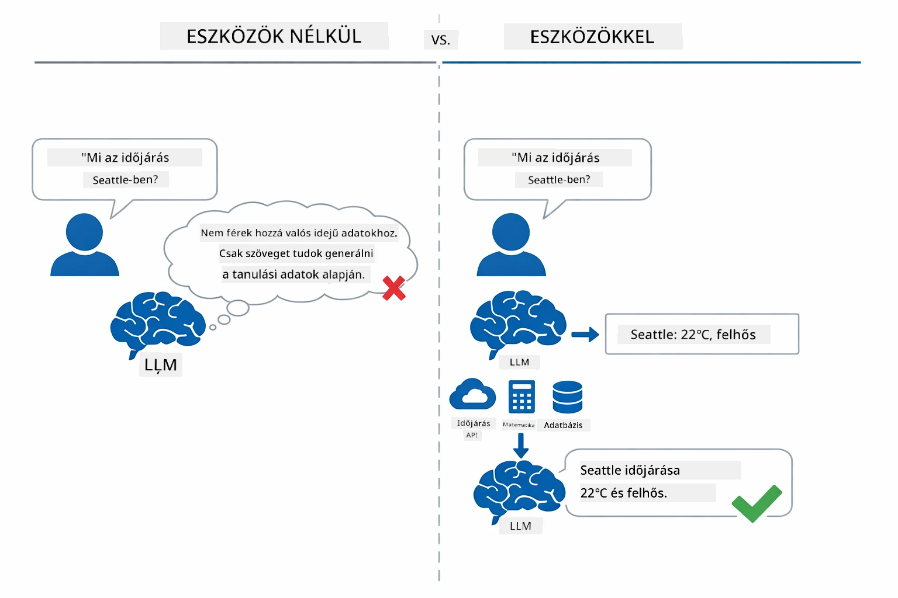

*Eszközök nélkül csak tippel a modell — eszközökkel képes API-kat meghívni, számításokat végezni és valós idejű adatokat visszaadni.*

Az AI ágens eszközökkel egy **Érvelés és Cselekvés (ReAct)** mintát követ. A modell nem csak válaszol – végiggondolja, mire van szüksége, cselekszik eszköz meghívásával, megfigyeli az eredményt, majd eldönti, hogy újra cselekszik vagy átadja a végső választ:

1. **Érvelés** — Az ágens elemzi a felhasználó kérdését és eldönti, milyen információra van szükség
2. **Cselekvés** — Az ágens kiválasztja a megfelelő eszközt, létrehozza a helyes paramétereket és meghívja azt
3. **Megfigyelés** — Az ágens megkapja az eszköz kimenetét és értékeli az eredményt
4. **Ismétlés vagy válaszadás** — Ha további adatra van szükség, visszatér a lépésre; különben természetes nyelvű választ alkot

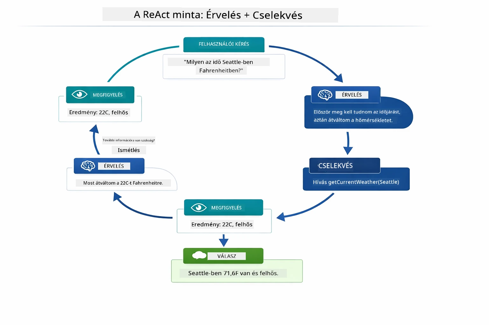

*A ReAct ciklus — az ágens megfontolja, mit kell tennie, eszközt hív meg cselekvésként, megfigyeli az eredményt, és addig ismétel, amíg végső választ nem ad.*

Ez automatikusan történik. Te definiálod az eszközöket és azok leírásait. A modell kezeli a döntéshozatalt, hogy mikor és hogyan használja őket.

## Hogyan működik az eszközhívás

### Eszközdefiníciók

[WeatherTool.java](../../../04-tools/src/main/java/com/example/langchain4j/agents/tools/WeatherTool.java) | [TemperatureTool.java](../../../04-tools/src/main/java/com/example/langchain4j/agents/tools/TemperatureTool.java)

Funkciókat definiálsz világos leírásokkal és paraméter specifikációkkal. A modell ezeket a leírásokat látja a rendszer promptban, és érti, hogy az egyes eszközök mit csinálnak.

```java
@Component
public class WeatherTool {
    
    @Tool("Get the current weather for a location")
    public String getCurrentWeather(@P("Location name") String location) {
        // Az időjárás lekérdezési logikád
        return "Weather in " + location + ": 22°C, cloudy";
    }
}

@AiService
public interface Assistant {
    String chat(@MemoryId String sessionId, @UserMessage String message);
}

// Az asszisztens automatikusan a Spring Boot által van összekötve:
// - ChatModel bean
// - Az összes @Tool metódus @Component osztályokból
// - ChatMemoryProvider a munkamenet-kezeléshez
```

Az alábbi diagram lebont minden annotációt és megmutatja, hogyan segíti minden elem az AI-t abban, hogy tudja, mikor hívja az eszközt és milyen argumentumokat adjon át:

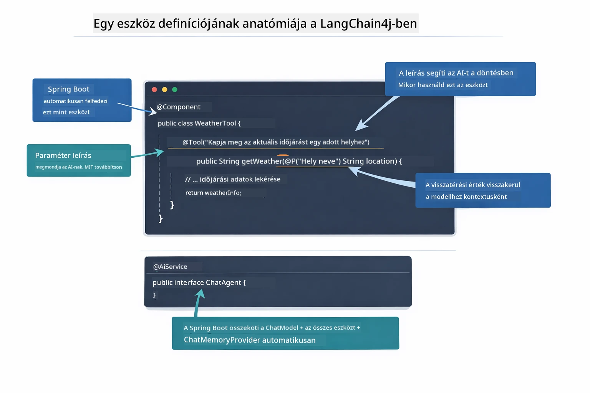

*Eszközdefiníció anatómiája — az @Tool jelzi az AI-nak, mikor használja az eszközt, az @P leírja az egyes paramétereket, az @AiService pedigindításkor mindent összeköt.*

> **🤖 Próbáld ki a [GitHub Copilot](https://github.com/features/copilot) Chat segítségével:** Nyisd meg a [`WeatherTool.java`](../../../04-tools/src/main/java/com/example/langchain4j/agents/tools/WeatherTool.java) fájlt és kérdezd meg:
> - "Hogyan integrálnék egy valódi időjárás API-t, például az OpenWeatherMap-et a mock adatok helyett?"
> - "Mi tesz jó eszközleírást, ami segíti az AI-t a helyes használatban?"
> - "Hogyan kezeljem az API hibákat és a lekérdezési korlátokat az eszköz implementációkban?"

### Döntéshozatal

Amikor a felhasználó megkérdezi: „Milyen az időjárás Seattle-ben?”, a modell nem véletlenszerűen választ eszközt. Összeveti a felhasználó szándékát az összes elérhető eszköz leírásával, pontozza relevancia szerint, és kiválasztja a legmegfelelőbbet. Ezután létrehoz egy strukturált függvényhívást a helyes paraméterekkel — ebben az esetben a `location` beállítása `"Seattle"` értékre.

Ha egyetlen eszköz sem felel meg a kérésnek, a modell a saját tudása alapján válaszol. Ha több eszköz is megfelel, a legspecifikusabbat választja.

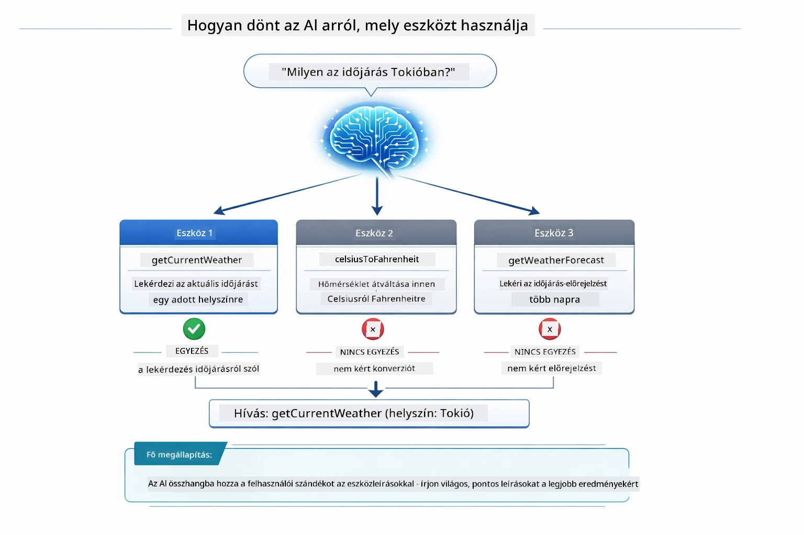

*A modell minden elérhető eszközt értékel a felhasználó szándéka alapján és kiválasztja a legjobb egyezést — ezért fontos, hogy világos és specifikus eszközleírást írjunk.*

### Végrehajtás

[AgentService.java](../../../04-tools/src/main/java/com/example/langchain4j/agents/service/AgentService.java)

A Spring Boot automatikusan összeköti a deklaratív `@AiService` interfészt az összes regisztrált eszközzel, és a LangChain4j automatikusan végrehajtja az eszközhívásokat. A háttérben egy teljes eszközhívás hat lépésen megy végig — a felhasználó természetes nyelvű kérdésétől egészen a természetes nyelvű válaszig:

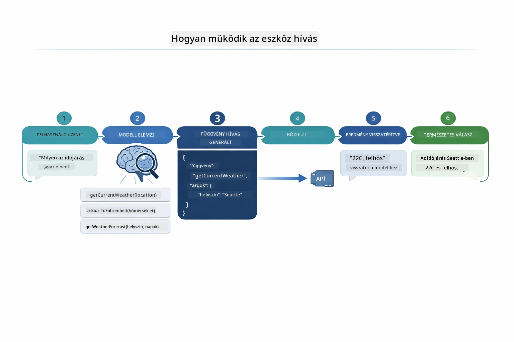

*Az end-to-end folyamat — a felhasználó kérdez, a modell eszközt választ, a LangChain4j végrehajtja, a modell beépíti az eredményt a válaszba.*

> **🤖 Próbáld ki a [GitHub Copilot](https://github.com/features/copilot) Chat segítségével:** Nyisd meg az [`AgentService.java`](../../../04-tools/src/main/java/com/example/langchain4j/agents/service/AgentService.java) fájlt és kérdezd meg:
> - "Hogyan működik a ReAct minta és miért hatékony AI ágenseknél?"
> - "Hogyan dönt az ágens, hogy melyik eszközt használja és milyen sorrendben?"
> - "Mi történik, ha egy eszköz végrehajtás meghiúsul – hogyan kezeljem hatékonyan a hibákat?"

### Válaszgenerálás

A modell megkapja az időjárási adatokat és természetes nyelvű válaszként formázza meg a felhasználónak.

### Architektúra: Spring Boot automatikus bekötés

Ez a modul a LangChain4j Spring Boot integrációját használja deklaratív `@AiService` interfészekkel. Indításkor a Spring Boot felfedezi az összes `@Component`-et, amelyek tartalmaznak `@Tool` metódusokat, a te `ChatModel` bean-edet és a `ChatMemoryProvider`-t — majd mindet egyetlen `Assistant` interfészbe köt össze nulla bohózatráfordítással.

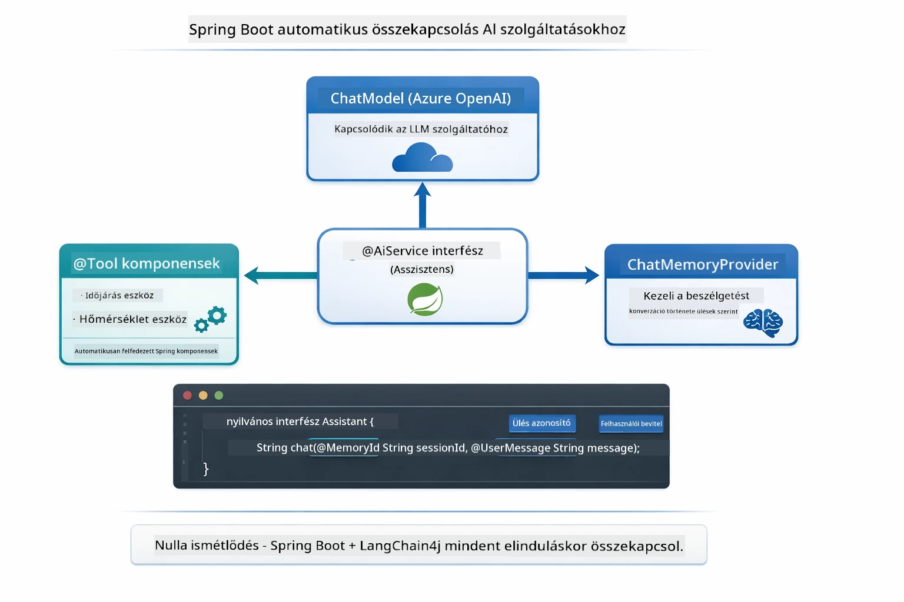

*Az @AiService interfész összekapcsolja a ChatModelt, az eszköz komponenseket és a memória szolgáltatót — a Spring Boot kezeli az összes bekötést automatikusan.*

Ennek a megközelítésnek a kulcs előnyei:

- **Spring Boot automatikus bekötés** — ChatModel és eszközök automatikusan injektálva
- **@MemoryId minta** — Automatikus munkamenet-alapú memória kezelése
- **Egyetlen példány** — Az Assistant egyszer jön létre és újrafelhasználható a jobb teljesítményért
- **Típusbiztos végrehajtás** — Java metódusok közvetlenül hívhatók típuskonverzióval
- **Többkörös koordináció** — Automatikusan kezeli az eszközláncolást
- **Nulla bohózat** — Nincs szükség kézi `AiServices.builder()` hívásokra vagy memória HashMap-re

Alternatív megoldások (kézi `AiServices.builder()`) több kódot igényelnek és hiányzik belőlük a Spring Boot integráció előnye.

## Eszközláncolás

**Eszközláncolás** — Az eszközalapú ágensek igazi ereje akkor mutatkozik meg, ha egy kérdés több eszközt igényel. Ha megkérdezed: „Milyen az időjárás Seattle-ben Fahrenheitben?”, az ágens automatikusan láncol két eszközt: először meghívja a `getCurrentWeather`-t a Celsius hőmérséklet lekéréséhez, majd ezt az értéket átadja a `celsiusToFahrenheit`-nek átváltásra – mindezt egyetlen beszélgetési körben.

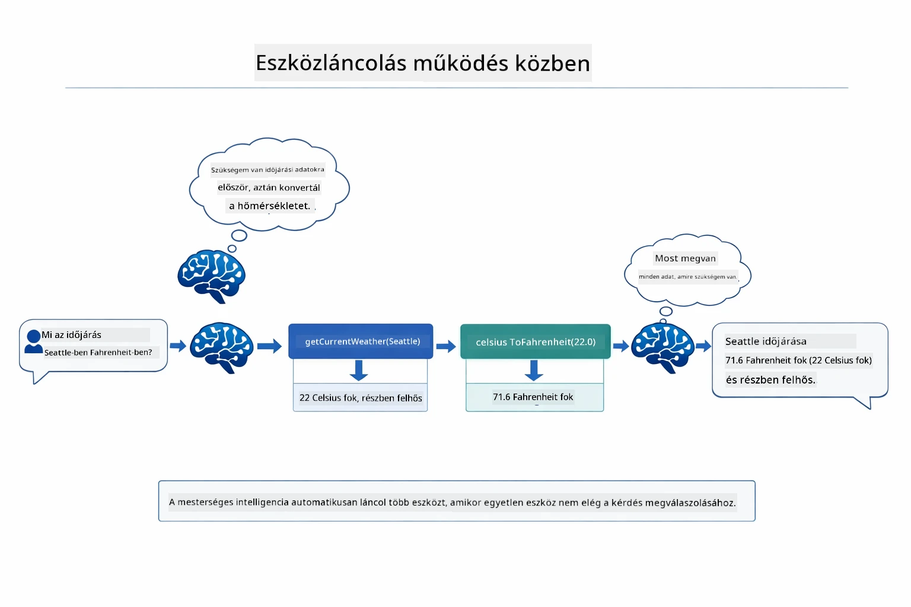

*Eszközláncolás működés közben — az ágens először a getCurrentWeather-t hívja, majd az eredményt átvezeti a celsiusToFahrenheit-nek, és egy komplex választ ad.*

**Elegáns hibakezelés** — Ha egy olyan város időjárását kérdezed, amely nincs a mock adatok között, az eszköz hibát jelez vissza, és az AI magyarázza, hogy nem tud segíteni ahelyett, hogy összeomlana. Az eszközök biztonságosan hibáznak. Az alábbi diagram bemutatja a két megközelítés kontrasztját — helyes hibakezeléssel az ágens elkapja a kivételt és segítőkész választ ad, hibakezelés nélkül az egész alkalmazás összeomlik:

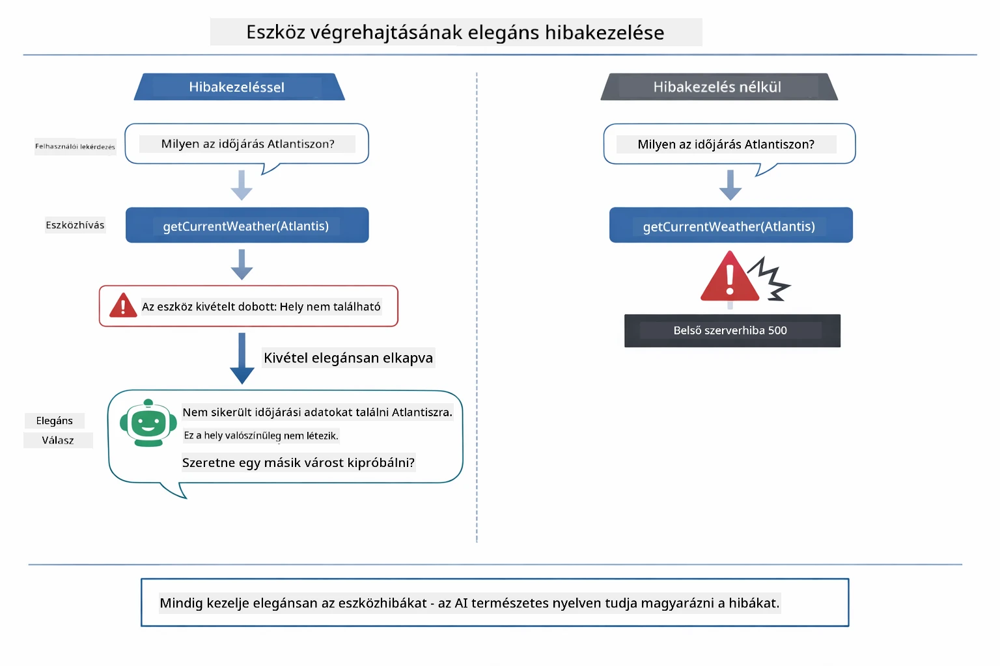

*Amikor eszközhiba történik, az ágens elkapja a hibát és segítőkész magyarázattal válaszol ahelyett, hogy összeomlana.*

Ez egyetlen beszélgetési körben történik. Az ágens önállóan koordinál több eszközhívást.

## Az alkalmazás futtatása

**A telepítés ellenőrzése:**

Győződj meg róla, hogy a `.env` fájl létezik a gyökérkönyvtárban Azure hitelesítő adatokkal (amit az 01-es modul alatt hoztak létre). Futtasd ezt a modul könyvtárából (`04-tools/`):

**Bash:**
```bash
cat ../.env  # Meg kell jeleníteni az AZURE_OPENAI_ENDPOINT, API_KEY, DEPLOYMENT értékeket
```

**PowerShell:**
```powershell
Get-Content ..\.env  # Meg kell jeleníteni az AZURE_OPENAI_ENDPOINT, API_KEY, DEPLOYMENT értékeket
```

**Indítsd el az alkalmazást:**

> **Megjegyzés:** Ha már elindítottad az összes alkalmazást a gyökérből a `./start-all.sh` használatával (ahogy a 01-es modulban leírtuk), akkor ez a modul már fut a 8084-es porton. Kihagyhatod az alábbi indító parancsokat és közvetlenül megnyithatod http://localhost:8084-et.

**1. lehetőség: Spring Boot Dashboard használata (ajánlott VS Code használóknak)**

A fejlesztői konténer tartalmazza a Spring Boot Dashboard bővítményt, amely vizuális felületet biztosít az összes Spring Boot alkalmazás kezeléséhez. Megtalálható a bal oldali tevékenységsávon (keresd a Spring Boot ikont).

A Spring Boot Dashboardból:
- Láthatod az összes rendelkezésre álló Spring Boot alkalmazást a workspace-ben
- Egy kattintással indíthatsz/leállíthatsz alkalmazásokat
- Megnézheted az alkalmazások valós idejű naplóit
- Figyelemmel kísérheted az alkalmazások státuszát

Egyszerűen kattints a play gombra a "tools" mellett a modul elindításához, vagy indítsd el az összes modult egyszerre.

Így néz ki a Spring Boot Dashboard VS Code-ban:


*A Spring Boot Dashboard VS Code-ban — modulok indítása, leállítása és figyelése egy helyről*

**2. lehetőség: shell szkriptek használata**

Indítsd el az összes webalkalmazást (01-04 modulok):

**Bash:**
```bash
cd ..  # A gyökérkönyvtárból
./start-all.sh
```

**PowerShell:**
```powershell
cd ..  # A gyökérkönyvtárból
.\start-all.ps1
```

Vagy csak ezt a modult indítsd el:

**Bash:**
```bash
cd 04-tools
./start.sh
```

**PowerShell:**
```powershell
cd 04-tools
.\start.ps1
```

Mindkét szkript automatikusan betölti a környezeti változókat a gyökér `.env` fájlból, és lefordítja a JAR fájlokat, ha nem léteznek.

> **Megjegyzés:** Ha inkább manuálisan építenéd fel az összes modult az indítás előtt:
>
> **Bash:**
> ```bash
> cd ..  # Go to root directory
> mvn clean package -DskipTests
> ```

> **PowerShell:**
> ```powershell
> cd ..  # Go to root directory
> mvn clean package -DskipTests
> ```

Nyisd meg böngészőben a http://localhost:8084 címet.

**Leállításhoz:**

**Bash:**
```bash
./stop.sh  # Csak ez a modul
# Vagy
cd .. && ./stop-all.sh  # Minden modul
```

**PowerShell:**
```powershell
.\stop.ps1  # Csak ez a modul
# Vagy
cd ..; .\stop-all.ps1  # Minden modul
```

## Az alkalmazás használata

Az alkalmazás egy webes felületet biztosít, ahol egy időjárás- és hőmérséklet átváltó eszközökkel rendelkező AI ágenssel léphetsz kapcsolatba. Így néz ki a felület — tartalmaz gyors kezdő példákat és egy chat panelt a kérések elküldéséhez:
<a href="images/tools-homepage.png"></a>

*Az AI Agent Eszközök felülete – gyors példák és chat felület az eszközökkel való interakcióhoz*

### Egyszerű eszközhasználat kipróbálása

Kezdje egy egyszerű kéréssel: „Alakítsd át a 100 Fahrenheit-fokot Celsiusra”. Az agent felismeri, hogy szüksége van a hőmérséklet átváltó eszközre, megfelelő paraméterekkel meghívja azt, és visszaadja az eredményt. Figyelje meg, milyen természetes érzés – nem kellett megadnia, hogy melyik eszközt használja vagy hogyan hívja meg.

### Eszközláncolás tesztelése

Most próbáljon ki valami összetettebbet: „Milyen az időjárás Seattle-ben, és alakítsd át Fahrenheit-be?” Figyelje, ahogy az agent lépésekben dolgozza fel. Először lekéri az időjárást (ami Celsiusban ad választ), felismeri, hogy át kell alakítani Fahrenheit-be, meghívja az átváltó eszközt, majd egyesíti mindkét eredményt egy válaszban.

### Nézze meg a beszélgetés menetét

A chat felület megőrzi a beszélgetés előzményeit, lehetővé téve a többfordulós interakciókat. Láthat minden korábbi kérdést és választ, így könnyű nyomon követni a beszélgetést és megérteni, hogyan építi fel az agent a kontextust több cserén keresztül.

<a href="images/tools-conversation-demo.png"></a>

*Többfordulós beszélgetés egyszerű átváltásokról, időjárás lekérdezésekről és eszközláncolásról*

### Különböző kérések kipróbálása

Próbáljon ki különféle kombinációkat:
- Időjárás lekérdezések: „Milyen az időjárás Tokióban?”
- Hőmérséklet átváltások: „Mennyi 25°C Kelvinben?”
- Összetett kérdések: „Nézd meg Párizs időjárását, és mondd meg, hogy 20°C felett van-e”

Figyelje meg, hogyan értelmezi az agent a természetes nyelvet, és hogyan kapcsolja össze a megfelelő eszközhívásokkal.

## Főbb fogalmak

### ReAct minta (Érvelés és Cselekvés)

Az agent váltogat az érvelés (eldönti, mit tegyen) és cselekvés (eszközök használata) között. Ez a minta lehetővé teszi az autonóm problémamegoldást, nem csak az utasításokra válaszolást.

### Az eszközleírások fontossága

Az eszközök leírásának minősége közvetlenül befolyásolja, mennyire jól használja az agent őket. Világos, konkrét leírások segítik a modellt megérteni, mikor és hogyan kell meghívni az adott eszközt.

### Munkamenet-kezelés

Az `@MemoryId` annotáció automatikus munkamenet-alapú memóriakezelést tesz lehetővé. Minden munkamenet azonosító saját `ChatMemory` példányt kap, amit a `ChatMemoryProvider` bean kezel, így több felhasználó is egyszerre kommunikálhat az agenttel anélkül, hogy beszélgetéseik összekeverednének. Az alábbi ábra bemutatja, hogyan irányítja a rendszer az egyes munkamenet-azonosítókat elkülönített memória-tárakhoz:

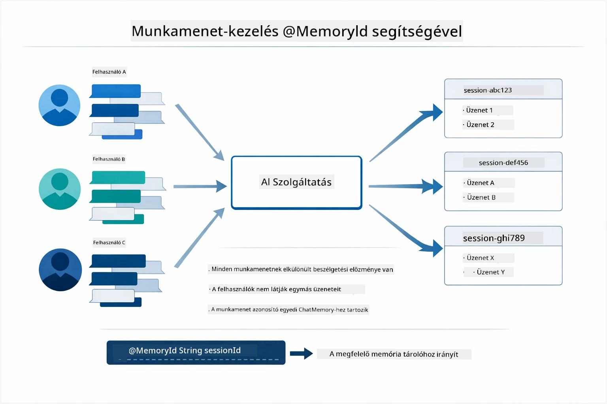

*Minden munkamenet-azonosító egy elkülönített beszélgetési előzményt társít – a felhasználók sosem látják egymás üzeneteit.*

### Hibakezelés

Az eszközök hibázhatnak – API-k időkorlátot léphetnek, paraméterek érvénytelenek lehetnek, külső szolgáltatások leállhatnak. A gyártásban futó agenteknek szükségük van hibakezelésre, hogy a modell képes legyen magyarázatot adni a problémákra vagy alternatívákat próbálni ahelyett, hogy az egész alkalmazás összeomlana. Ha egy eszköz kivételt dob, a LangChain4j elkapja azt, és a hibát visszatáplálja a modellnek, amely így természetes nyelven képes elmagyarázni a problémát.

## Elérhető eszközök

Az alábbi ábra bemutatja az eszközök tág ökoszisztémáját, amelyeket építhet. Ez a modul az időjárás és hőmérséklet eszközöket mutatja be, de ugyanaz az `@Tool` minta bármilyen Java metódusra működik – adatbázis-lekérdezésektől a fizetési folyamatokig.

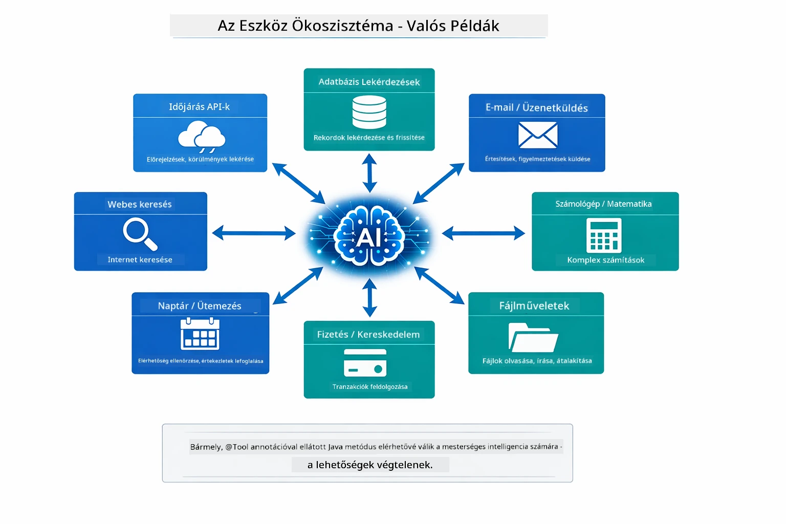

*Bármely @Tool annotációval ellátott Java metódus elérhető az AI számára – a minta kiterjed adatbázisokra, API-kra, e-mailre, fájlműveletekre és még sok másra.*

## Mikor használjunk eszköz-alapú agenteket

Nem minden kérés igényel eszközöket. A döntés attól függ, hogy az AI-nak szüksége van-e külső rendszerekkel való interakcióra vagy saját tudásából tud válaszolni. Az alábbi útmutató összefoglalja, mikor adnak értéket az eszközök, és mikor nem szükségesek:

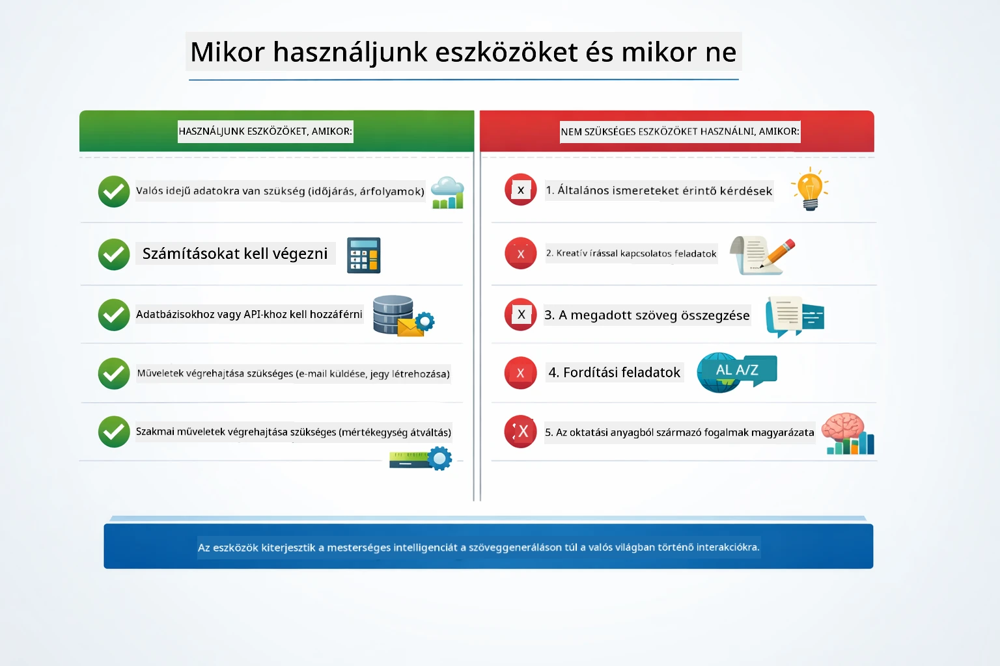

*Gyors döntési útmutató – az eszközök valós idejű adatokhoz, számításokhoz és műveletekhez valók; az általános ismeretek és kreatív feladatok nem igénylik őket.*

## Eszközök vs RAG

A 03-as és 04-es modulok egyaránt bővítik az AI képességeit, de alapvetően eltérő módon. A RAG a modellt látja el **tudással** azáltal, hogy dokumentumokat keres elő. Az eszközök pedig lehetővé teszik, hogy **műveleteket hajtson végre** függvényhívásokkal. Az alábbi ábra összehasonlítja a két megközelítést párhuzamosan – a munkafolyamat működésétől kezdve a köztük lévő kompromisszumokig:

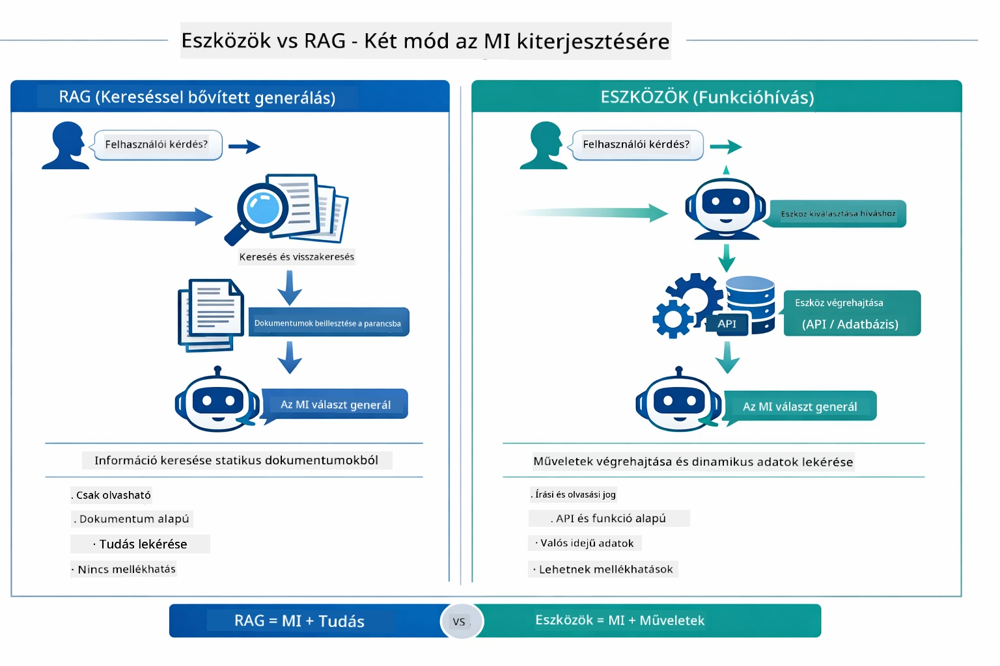

*A RAG statikus dokumentumokból szerzi az információt – az eszközök végrehajtanak műveleteket és dinamikus, valós idejű adatokat szolgáltatnak. Sok gyártási rendszer mindkettőt kombinálja.*

A gyakorlatban sok gyártási rendszer ötvözi mindkét megközelítést: a RAG az válaszok megalapozására az Ön dokumentációjában, az eszközök pedig az élő adatok lekérésére vagy műveletek elvégzésére.

## Következő lépések

**Következő modul:** [05-mcp - Model Context Protocol (MCP)](../05-mcp/README.md)

---

**Navigáció:** [← Előző: Modul 03 - RAG](../03-rag/README.md) | [Vissza a főoldalra](../README.md) | [Következő: Modul 05 - MCP →](../05-mcp/README.md)

---

<!-- CO-OP TRANSLATOR DISCLAIMER START -->
**Nyilatkozat**:  
Ez a dokumentum az AI fordító szolgáltatás, a [Co-op Translator](https://github.com/Azure/co-op-translator) segítségével készült. Bár a pontosságra törekszünk, kérjük, vegye figyelembe, hogy az automatikus fordítások hibákat vagy pontatlanságokat tartalmazhatnak. Az eredeti, anyanyelvi dokumentum tekintendő hivatalos forrásnak. Fontos információk esetén professzionális, emberi fordítást javaslunk. Nem vállalunk felelősséget a fordítás használatából eredő félreértésekért vagy téves értelmezésekért.
<!-- CO-OP TRANSLATOR DISCLAIMER END -->