# 05-ös modul: Modell kontextus protokoll (MCP)

## Tartalomjegyzék

- [Mit fogsz megtanulni](../../../05-mcp)
- [Mi az MCP?](../../../05-mcp)
- [Hogyan működik az MCP](../../../05-mcp)
- [Az Agentic modul](../../../05-mcp)
- [Példák futtatása](../../../05-mcp)
  - [Előfeltételek](../../../05-mcp)
- [Gyors kezdés](../../../05-mcp)
  - [Fájlműveletek (Stdio)](../../../05-mcp)
  - [Felügyelő ügynök](../../../05-mcp)
    - [A demó futtatása](../../../05-mcp)
    - [Hogyan működik a Felügyelő](../../../05-mcp)
    - [Válaszstratégiák](../../../05-mcp)
    - [Az output megértése](../../../05-mcp)
    - [Az Agentic modul funkcióinak magyarázata](../../../05-mcp)
- [Kulcsfogalmak](../../../05-mcp)
- [Gratulálunk!](../../../05-mcp)
  - [Mi a következő lépés?](../../../05-mcp)

## Mit fogsz megtanulni

Beszélgető AI-t építettél, elsajátítottad a promptokat, válaszokat alapozol dokumentumokra, és ügynököket hoztál létre eszközökkel. De ezek az eszközök mind az adott alkalmazásodhoz készültek. Mi lenne, ha az AI-d hozzáférhetne egy szabványosított eszközök ökoszisztémájához, amelyet bárki létrehozhat és megoszthat? Ebben a modulban megtanulod, hogyan valósítsd ezt meg a Model Context Protocol (MCP) és a LangChain4j agentic modul segítségével. Először bemutatunk egy egyszerű MCP fájlolvasót, majd megmutatjuk, hogyan integrálható ez könnyedén fejlett agentic munkafolyamatokba a Felügyelő Ügynök mintával.

## Mi az MCP?

A Model Context Protocol (MCP) pontosan ezt nyújtja – egy szabványos módot arra, hogy AI alkalmazások külső eszközöket fedezzenek fel és használjanak. Egyedi integrációk helyett minden adatforráshoz vagy szolgáltatáshoz, MCP szerverekhez kapcsolódsz, amelyek képességeiket konzisztens formátumban teszik elérhetővé. Az AI ügynököd így automatikusan felfedezheti és használhatja ezeket az eszközöket.


*Az MCP előtt: komplex pont-pont integrációk. Az MCP után: egy protokoll, végtelen lehetőségek.*

Az MCP megoldja az AI fejlesztés egyik alapvető problémáját: minden integráció egyedi. GitHubhoz akarsz hozzáférni? Egyedi kód. Fájlokat olvasnál? Egyedi kód. Adatbázist lekérdeznél? Egyedi kód. És egyik integráció sem működik más AI alkalmazásokkal.

Az MCP ezt szabványosítja. Egy MCP szerver egyértelmű leírásokkal és sémákkal teszi elérhetővé az eszközöket. Bármely MCP kliens csatlakozhat, felfedezheti az eszközöket és használhatja azokat. Egyszer építsd meg, bárhol használd!


*Model Context Protocol architektúra – szabványosított eszközfelderítés és végrehajtás*

## Hogyan működik az MCP

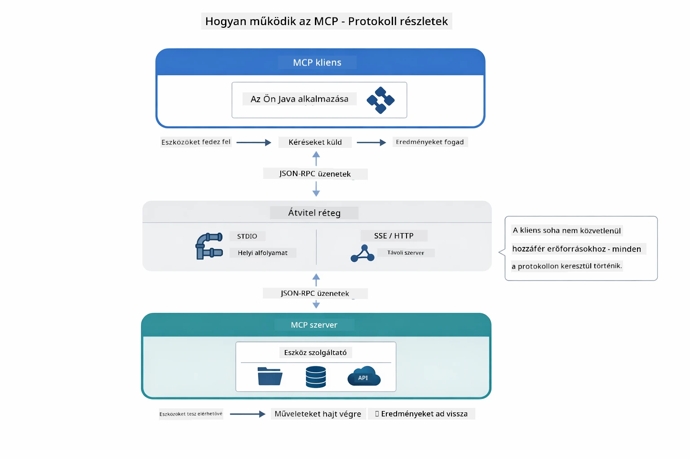

*Az MCP működése a háttérben — kliensek felfedezik az eszközöket, JSON-RPC üzeneteket cserélnek, és egy transzport rétegen keresztül végrehajtják a műveleteket.*

**Szerver-Kliens architektúra**

Az MCP kliens-szerver modellt használ. A szerverek eszközöket biztosítanak – fájlok olvasása, adatbázis lekérdezése, API hívások. A kliensek (az AI alkalmazásod) csatlakoznak a szerverekhez és használják az eszközöket.

Az MCP használatához LangChain4j-vel add hozzá ezt a Maven függőséget:

```xml
<dependency>
    <groupId>dev.langchain4j</groupId>
    <artifactId>langchain4j-mcp</artifactId>
    <version>${langchain4j.version}</version>
</dependency>
```

**Eszközfelderítés**

Amikor a kliensed csatlakozik egy MCP szerverhez, megkérdezi: "Milyen eszközeid vannak?" A szerver egy listával válaszol az elérhető eszközökről, leírásokkal és paraméter sémákkal. Az AI ügynököd így eldöntheti, mely eszközöket használja a felhasználói kérés alapján.

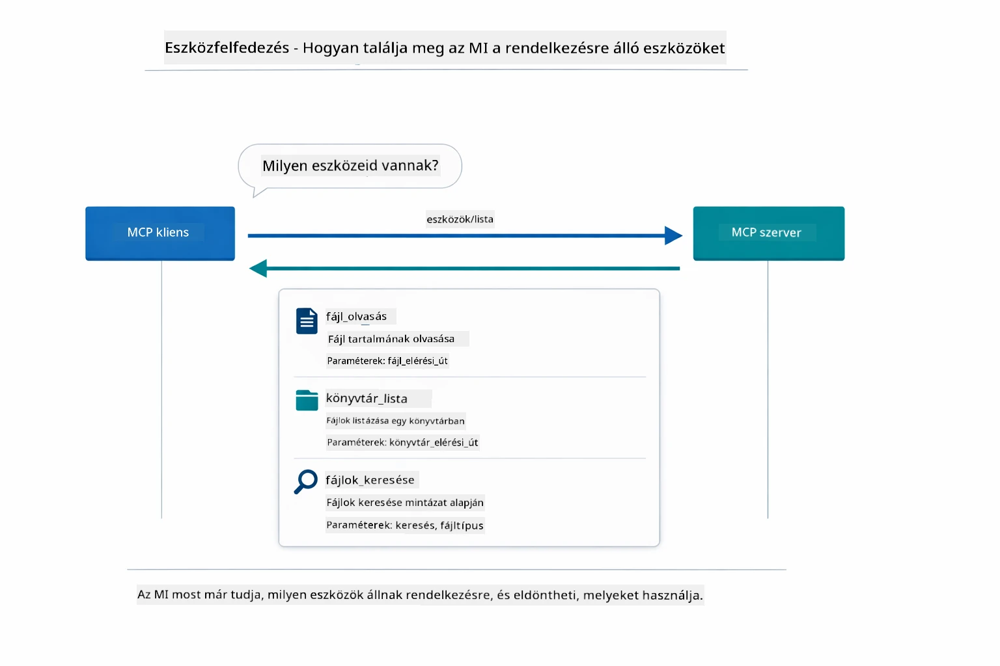

*Az AI indításkor felfedezi az elérhető eszközöket — így tudja, milyen képességek állnak rendelkezésre és dönthet, melyeket használja.*

**Transzport mechanizmusok**

Az MCP több transzport mechanizmust támogat. Ez a modul a helyi folyamatokhoz készült Stdio transzportot mutatja be:


*MCP transzport mechanizmusok: HTTP távoli szerverekhez, Stdio helyi folyamatokhoz*

**Stdio** – [StdioTransportDemo.java](../../../05-mcp/src/main/java/com/example/langchain4j/mcp/StdioTransportDemo.java)

Helyi folyamatokhoz. Az alkalmazás egy szervert indít alfolyamatként és a standard be-/kimeneten kommunikál vele. Hasznos fájlrendszer eléréshez vagy parancssori eszközökhöz.

```java
McpTransport stdioTransport = new StdioMcpTransport.Builder()
    .command(List.of(
        npmCmd, "exec",
        "@modelcontextprotocol/server-filesystem@2025.12.18",
        resourcesDir
    ))
    .logEvents(false)
    .build();
```

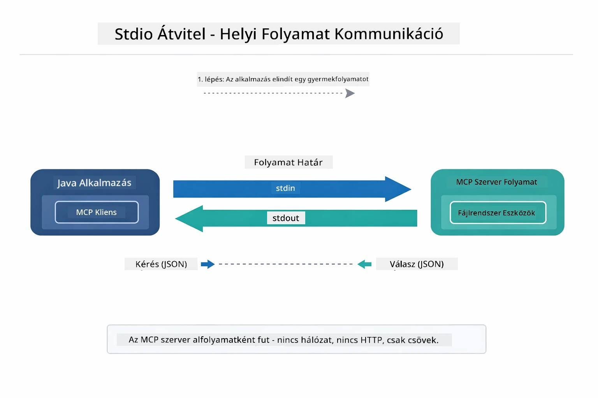

*Stdio transzport működés közben — az alkalmazás a MCP szervert alfolyamatként indítja, stdin/stdout csatornákon keresztül kommunikál.*

> **🤖 Próbáld ki a [GitHub Copilot](https://github.com/features/copilot) Chattel:** Nyisd meg a [`StdioTransportDemo.java`](../../../05-mcp/src/main/java/com/example/langchain4j/mcp/StdioTransportDemo.java) fájlt és kérdezd meg:
> - "Hogyan működik a Stdio transzport és mikor érdemes HTTP helyett használni?"
> - "Hogyan kezeli a LangChain4j a MCP szerver alfolyamatok életciklusát?"
> - "Milyen biztonsági kockázatokat jelent, ha az AI hozzáfér a fájlrendszerhez?"

## Az Agentic modul

Miközben az MCP szabványosított eszközöket biztosít, a LangChain4j **agentic modulja** deklaratív módot nyújt ügynökök építésére, amelyek koordinálják ezeket az eszközöket. Az `@Agent` annotáció és az `AgenticServices` lehetővé teszik az ügynök viselkedésének interfészekkel való definiálását imperatív kód helyett.

Ebben a modulban megismered a **Felügyelő Ügynök** mintát – egy fejlett agentic AI megközelítést, ahol egy „felügyelő” ügynök dinamikusan dönt arról, hogy melyik al-ügynököt hívja meg a felhasználói kérések alapján. Összekapcsoljuk a két koncepciót azzal, hogy egyik al-ügynökünk MCP-vel támogatott fájlhozzáféréssel rendelkezik.

Az agentic modul használatához add hozzá ezt a Maven függőséget:

```xml
<dependency>
    <groupId>dev.langchain4j</groupId>
    <artifactId>langchain4j-agentic</artifactId>
    <version>${langchain4j.mcp.version}</version>
</dependency>
```

> **⚠️ Kísérleti:** A `langchain4j-agentic` modul **kísérleti**, és változhat. Az AI asszisztensek stabil építési módja továbbra is a `langchain4j-core` egyedi eszközökkel (04-es modul).

## Példák futtatása

### Előfeltételek

- Java 21+, Maven 3.9+
- Node.js 16+ és npm (MCP szerverekhez)
- Környezeti változók beállítása `.env` fájlban (a gyökérkönyvtárból):
  - `AZURE_OPENAI_ENDPOINT`, `AZURE_OPENAI_API_KEY`, `AZURE_OPENAI_DEPLOYMENT` (ugyanaz, mint az 01-04-es modulokban)

> **Megjegyzés:** Ha még nem állítottad be a környezeti változókat, tekintsd meg a [00-modul - Gyors kezdés](../00-quick-start/README.md) útmutatót, vagy másold a `.env.example`-t `.env`-nek a gyökérben és töltsd ki a saját adataiddal.

## Gyors kezdés

**VS Code használata esetén:** Egyszerűen kattints jobb egérgombbal bármely demó fájlon a Fájlkezelőben és válaszd a **"Run Java"** opciót, vagy futtasd a konfigurációkat a Futtatás és hibakeresés panelből (előtte győződj meg, hogy a `.env` fájl helyesen be van állítva).

**Maven használatával:** Alternatívaként a parancssorból is futtathatod az alábbi példákat.

### Fájlműveletek (Stdio)

Ez bemutatja helyi alfolyamat alapú eszközöket.

**✅ Nincs szükség előfeltételekre** – az MCP szerver automatikusan elindul.

**Indító szkriptek használata (ajánlott):**

Az indító szkriptek automatikusan betöltik a gyökér `.env` fájl környezeti változóit:

**Bash:**
```bash
cd 05-mcp
chmod +x start-stdio.sh
./start-stdio.sh
```

**PowerShell:**
```powershell
cd 05-mcp
.\start-stdio.ps1
```

**VS Code használata:** Kattints jobb egérgombbal a `StdioTransportDemo.java`-n és válaszd a **"Run Java"** lehetőséget (bizonyosodj meg, hogy a `.env` fájl be van állítva).

Az alkalmazás automatikusan elindítja az MCP fájlrendszer szervert, és beolvas egy helyi fájlt. Figyeld meg, hogyan kezelődik az alfolyamat menedzsment.

**Várt kimenet:**
```
Assistant response: The file provides an overview of LangChain4j, an open-source Java library
for integrating Large Language Models (LLMs) into Java applications...
```

### Felügyelő Ügynök

A **Felügyelő Ügynök minta** egy **rugalmas** agentic AI forma. A Felügyelő egy LLM segítségével önállóan dönt, mely ügynököket hívja meg a felhasználói kérés alapján. A következő példában MCP-vel támogatott fájlhozzáférést kombinálunk egy LLM ügynökkel, hogy egy felügyelt fájlolvasás → jelentés munkafolyamatot hozzunk létre.

A demóban a `FileAgent` fájlokat olvas MCP fájlrendszer eszközökkel, a `ReportAgent` pedig egy strukturált jelentést készít egy vezetői összefoglalóval (1 mondat), 3 kulcsponttal és ajánlásokkal. A Felügyelő automatikusan koordinálja a folyamatot:

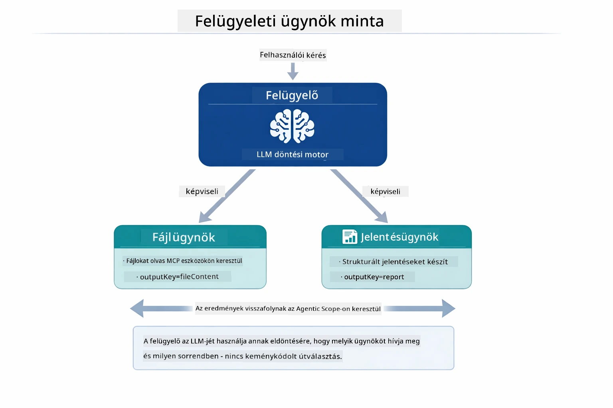

*A Felügyelő az LLM-jét használja, hogy eldöntse, mely ügynököket hívjon meg és milyen sorrendben — nincs szükség keménykódolt útirányításra.*

A fájl → jelentés munkafolyamat konkrét folyamata így néz ki:

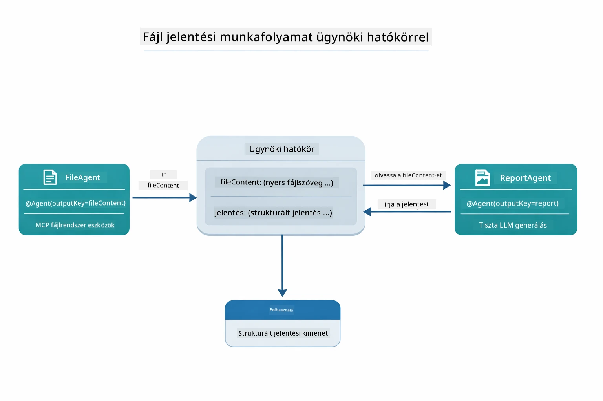

*A FileAgent MCP eszközökkel olvassa a fájlt, majd a ReportAgent az alapanyagot strukturált jelentéssé alakítja.*

Minden ügynök az **Agentic Scope**-ban (megosztott memória) tárolja az outputját, így a későbbi ügynökök hozzáférhetnek az előző eredményekhez. Ez azt példázza, hogy az MCP eszközök zökkenőmentesen integrálódnak az agentic munkafolyamatokba — a Felügyelőnek nem kell tudnia *hogyan* olvassák a fájlokat, csak hogy a `FileAgent` képes rá.

#### A demó futtatása

Az indító szkriptek automatikusan betöltik a gyökér `.env` fájl környezeti változóit:

**Bash:**
```bash
cd 05-mcp
chmod +x start-supervisor.sh
./start-supervisor.sh
```

**PowerShell:**
```powershell
cd 05-mcp
.\start-supervisor.ps1
```

**VS Code használata:** Kattints jobb egérgombbal a `SupervisorAgentDemo.java`-ra és válaszd a **"Run Java"** lehetőséget (bizonyosodj meg, hogy a `.env` fájl be van állítva).

#### Hogyan működik a Felügyelő

```java
// 1. lépés: A FileAgent MCP eszközökkel olvassa be a fájlokat
FileAgent fileAgent = AgenticServices.agentBuilder(FileAgent.class)
        .chatModel(model)
        .toolProvider(mcpToolProvider)  // Tartalmazza az MCP eszközöket fájlműveletekhez
        .build();

// 2. lépés: A ReportAgent strukturált jelentéseket készít
ReportAgent reportAgent = AgenticServices.agentBuilder(ReportAgent.class)
        .chatModel(model)
        .build();

// A Supervisor irányítja a fájl → jelentés munkafolyamatot
SupervisorAgent supervisor = AgenticServices.supervisorBuilder()
        .chatModel(model)
        .subAgents(fileAgent, reportAgent)
        .responseStrategy(SupervisorResponseStrategy.LAST)  // Visszaadja a végső jelentést
        .build();

// A Supervisor dönt arról, mely ügynököket hívja meg a kérés alapján
String response = supervisor.invoke("Read the file at /path/file.txt and generate a report");
```

#### Válaszstratégiák

Amikor konfigurálsz egy `SupervisorAgent`-et, megadod, hogyan fogalmazza meg a végső választ a felhasználónak, miután az al-ügynökök befejezték a feladataikat.

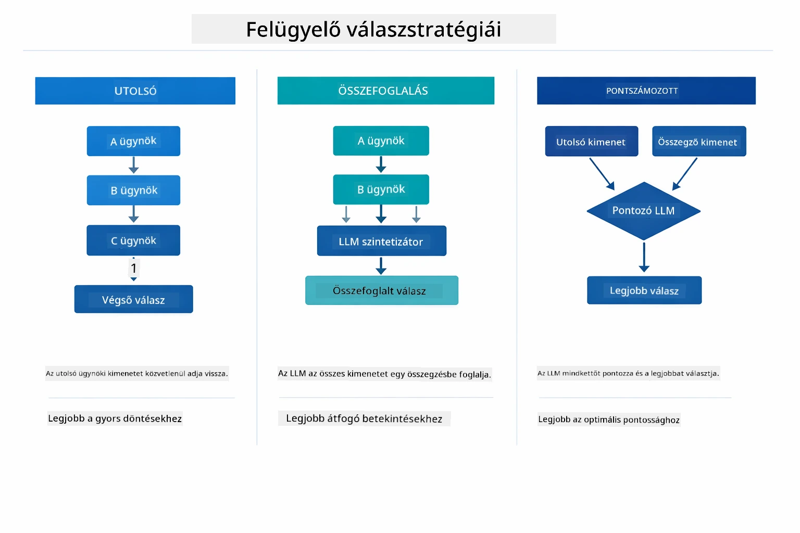

*Három stratégia a Felügyelő végső válaszának megalkotására – válassz attól függően, hogy az utolsó ügynök outputját, egy összesített összefoglalót vagy a legjobban értékelt válasz opciót szeretnéd.*

Az elérhető stratégiák:

| Stratégia | Leírás |
|----------|-------------|
| **LAST** | A felügyelő az utolsó al-ügynök vagy eszköz által adott választ adja vissza. Hasznos, ha a munkafolyamat végső ügynöke kifejezetten a teljes, végső választ adja (pl. kutatási folyamatban egy "Összefoglaló ügynök"). |
| **SUMMARY** | A felügyelő saját beépített nyelvi modelljével (LLM) összeállít egy összefoglalót az egész interakcióról és az összes al-ügynök válaszáról, majd ezt a szintetizált összefoglalót adja vissza végső válaszként. Ez egy tiszta, összefoglalt választ ad a felhasználónak. |
| **SCORED** | A rendszer egy beépített LLM segítségével értékeli az utolsó választ és az összefoglalót a felhasználói kéréshez képest, és azt az outputot adja vissza, amelyik magasabb pontszámot kapott. |

A teljes megvalósítást lásd a [SupervisorAgentDemo.java](../../../05-mcp/src/main/java/com/example/langchain4j/mcp/SupervisorAgentDemo.java) fájlban.

> **🤖 Próbáld ki a [GitHub Copilot](https://github.com/features/copilot) Chattel:** Nyisd meg a [`SupervisorAgentDemo.java`](../../../05-mcp/src/main/java/com/example/langchain4j/mcp/SupervisorAgentDemo.java) fájlt és kérdezd meg:
> - "Hogyan dönt a Felügyelő, mely ügynököket hívjon meg?"
> - "Mi a különbség a Felügyelő és a Szekvenciális munkafolyamat minták között?"
> - "Hogyan testreszabhatom a Felügyelő tervezési viselkedését?"

#### Az output megértése

A demó futtatásakor egy strukturált bemutatót látsz arról, hogyan koordinálja a Felügyelő több ügynök működését. Íme, mit jelentenek az egyes szakaszok:

```
======================================================================
  FILE → REPORT WORKFLOW DEMO
======================================================================

This demo shows a clear 2-step workflow: read a file, then generate a report.
The Supervisor orchestrates the agents automatically based on the request.
```

**A fejléc** bevezeti a munkafolyamat koncepcióját: fókuszált pipeline fájlolvasástól a jelentéskészítésig.

```
--- WORKFLOW ---------------------------------------------------------
  ┌─────────────┐      ┌──────────────┐
  │  FileAgent  │ ───▶ │ ReportAgent  │
  │ (MCP tools) │      │  (pure LLM)  │
  └─────────────┘      └──────────────┘
   outputKey:           outputKey:
   'fileContent'        'report'

--- AVAILABLE AGENTS -------------------------------------------------
  [FILE]   FileAgent   - Reads files via MCP → stores in 'fileContent'
  [REPORT] ReportAgent - Generates structured report → stores in 'report'
```

**Munkafolyamat diagram** mutatja az adatok áramlását az ügynökök között. Minden ügynöknek specifikus szerepe van:
- **FileAgent** MCP eszközökkel olvas fájlokat és a nyers tartalmat a `fileContent` változóba teszi
- **ReportAgent** felhasználja ezt a tartalmat és strukturált jelentést készít a `report` változóba

```
--- USER REQUEST -----------------------------------------------------
  "Read the file at .../file.txt and generate a report on its contents"
```

**Felhasználói kérés** mutatja a feladatot. A Felügyelő ezt elemzi és eldönti, hogy a FileAgent → ReportAgent hívásokat kell végrehajtani.

```
--- SUPERVISOR ORCHESTRATION -----------------------------------------
  The Supervisor decides which agents to invoke and passes data between them...

  +-- STEP 1: Supervisor chose -> FileAgent (reading file via MCP)
  |
  |   Input: .../file.txt
  |
  |   Result: LangChain4j is an open-source, provider-agnostic Java framework for building LLM...
  +-- [OK] FileAgent (reading file via MCP) completed

  +-- STEP 2: Supervisor chose -> ReportAgent (generating structured report)
  |
  |   Input: LangChain4j is an open-source, provider-agnostic Java framew...
  |
  |   Result: Executive Summary...
  +-- [OK] ReportAgent (generating structured report) completed
```

**Felügyelő koordináció** mutatja a 2 lépéses folyamatot:
1. **FileAgent** MCP-n keresztül olvassa a fájlt és eltárolja a tartalmat
2. **ReportAgent** megkapja az adatot és strukturált jelentést generál

A Felügyelő ezt a döntést **önállóan** hozta meg a felhasználói kérés alapján.

```
--- FINAL RESPONSE ---------------------------------------------------
Executive Summary
...

Key Points
...

Recommendations
...

--- AGENTIC SCOPE (Data Flow) ----------------------------------------
  Each agent stores its output for downstream agents to consume:
  * fileContent: LangChain4j is an open-source, provider-agnostic Java framework...
  * report: Executive Summary...
```

#### Az Agentic modul funkcióinak magyarázata

A példa több fejlett agentic modul funkciót is bemutat. Tekintsünk közelebbről az Agentic Scope és az Agent Listeners-re.

**Agentic Scope** a megosztott memória, ahol az ügynökök az `@Agent(outputKey="...")` annotációval tárolták az eredményeket. Ez lehetővé teszi:
- Az utólagos ügynökök hozzáférését a korábbi ügynökök outputjaihoz
- A Felügyelő számára a végső válasz szerkesztését
- Számodra, hogy megnézd, mit produkált egy-egy ügynök

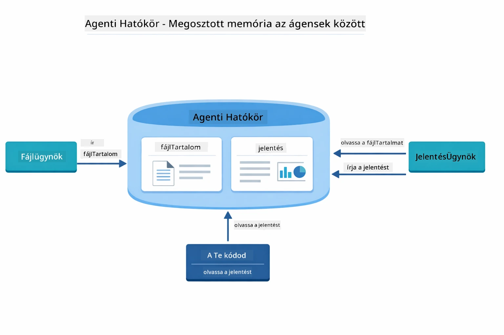

*Az Agentic Scope mint megosztott memória működik — a FileAgent írja a `fileContent`-et, a ReportAgent olvassa azt és írja a `report`-ot, majd a kódod olvassa a végső eredményt.*

```java
ResultWithAgenticScope<String> result = supervisor.invokeWithAgenticScope(request);
AgenticScope scope = result.agenticScope();
String fileContent = scope.readState("fileContent");  // Nyers fájl adatok a FileAgent-től
String report = scope.readState("report");            // Strukturált jelentés a ReportAgent-től
```

**Agent Listeners** lehetővé teszik az ügynök végrehajtásának megfigyelését és hibakeresését. A demóban látható lépésenkénti output egy AgentListenerből származik, amely minden ügynökhívásba be van fűzve:
- **beforeAgentInvocation** - Akkor hívódik meg, amikor a Supervisor kiválaszt egy ügynököt, így láthatod, melyik ügynök került kiválasztásra és miért
- **afterAgentInvocation** - Akkor hívódik meg, amikor egy ügynök befejeződik, megmutatva az eredményét
- **inheritedBySubagents** - Ha igaz, a listener figyeli az összes ügynököt a hierarchiában

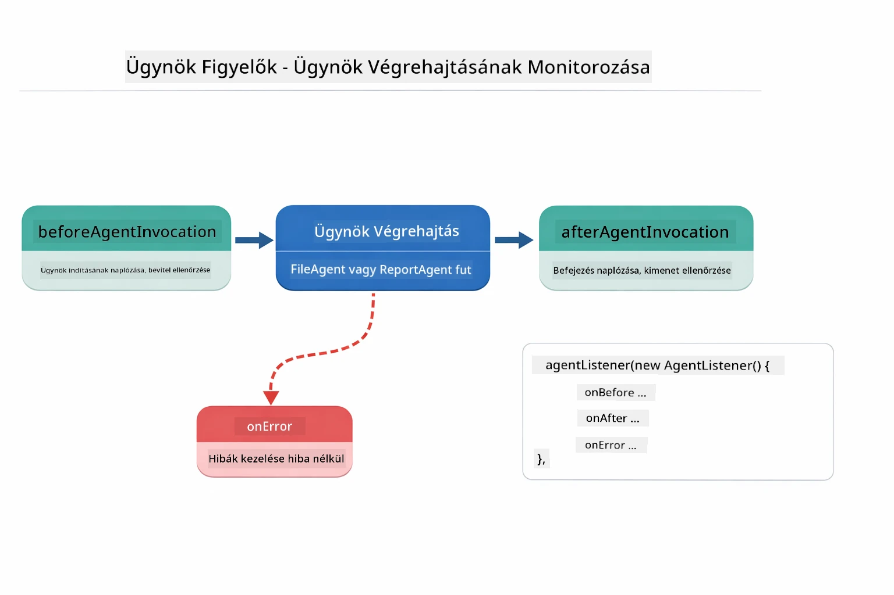

*Az Agent Listeners belépnek a végrehajtási élettartamba — figyelik, mikor indulnak el, fejeződnek be vagy hibáznak az ügynökök.*

```java
AgentListener monitor = new AgentListener() {
    private int step = 0;
    
    @Override
    public void beforeAgentInvocation(AgentRequest request) {
        step++;
        System.out.println("  +-- STEP " + step + ": " + request.agentName());
    }
    
    @Override
    public void afterAgentInvocation(AgentResponse response) {
        System.out.println("  +-- [OK] " + response.agentName() + " completed");
    }
    
    @Override
    public boolean inheritedBySubagents() {
        return true; // Terjessze az összes alügynökhöz
    }
};
```

A Supervisor mintán túl a `langchain4j-agentic` modul számos erőteljes munkafolyamat-mintát és funkciót kínál:

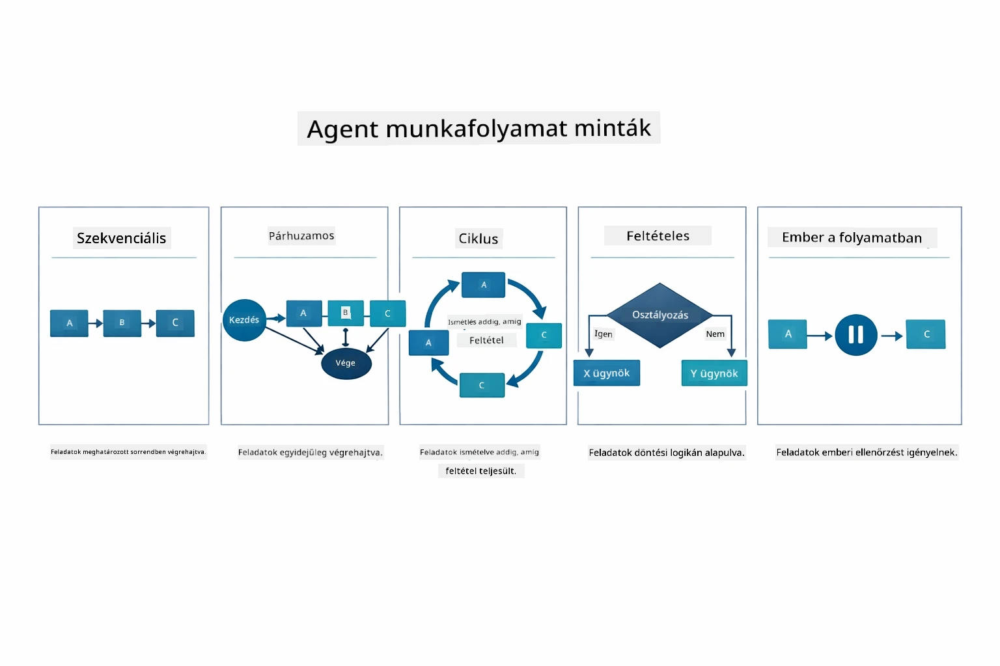

*Öt munkafolyamat-minta az ügynökök koordinálására — az egyszerű szekvenciális csővezetékektől a human-in-the-loop jóváhagyási munkafolyamatokig.*

| Minta | Leírás | Használati eset |
|---------|-------------|----------|
| **Szekvenciális** | Ügynökök végrehajtása sorrendben, a kimenet a következőhöz folyik | Csővezetékek: kutatás → elemzés → jelentés |
| **Párhuzamos** | Ügynökök egyidejű futtatása | Független feladatok: időjárás + hírek + részvények |
| **Ciklus** | Iterálás, amíg a feltétel teljesül | Minőségi értékelés: finomítás, amíg a pont ≥ 0.8 |
| **Feltételes** | Útvonal választása feltételek alapján | Osztályozás → útvonal szakértő ügynökhöz |
| **Human-in-the-Loop** | Emberi ellenőrzési pontok hozzáadása | Jóváhagyási munkafolyamatok, tartalmi áttekintés |

## Kulcsfogalmak

Most, hogy felfedezted az MCP-t és az agentic modult működés közben, foglaljuk össze, mikor melyik megközelítést érdemes használni.

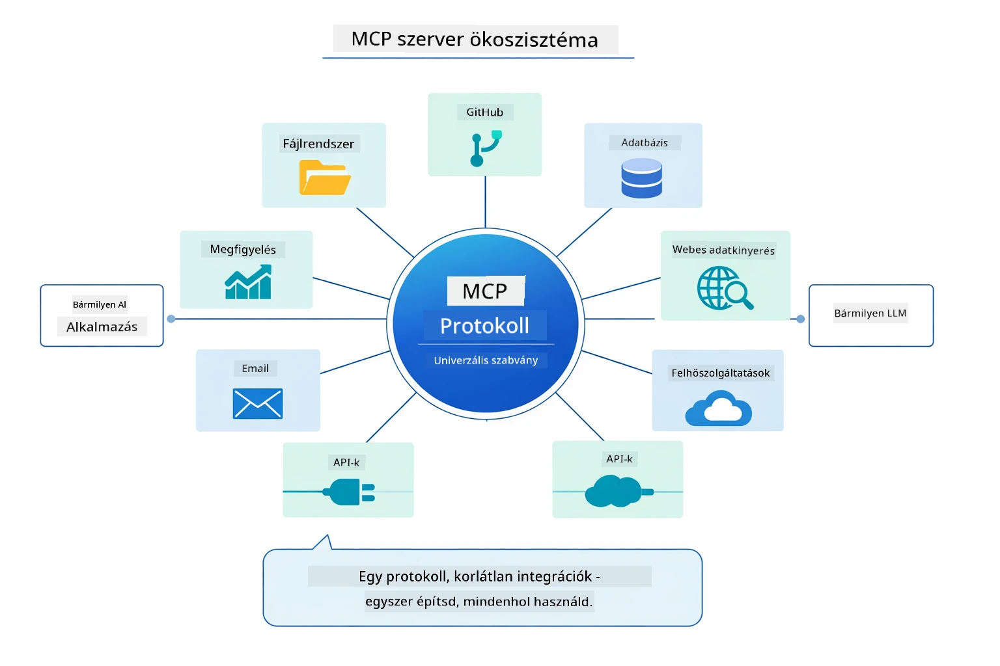

*Az MCP univerzális protokoll ökoszisztémát hoz létre — bármilyen MCP-kompatibilis szerver működik bármilyen MCP-kompatibilis klienssel, lehetővé téve az eszközök megosztását alkalmazások között.*

**MCP** ideális, amikor meglévő eszközöket akarsz kihasználni, olyan eszközöket építesz, amelyeket több alkalmazás megoszthat, harmadik fél szolgáltatásait integrálod szabványos protokollokkal, vagy eszközmegvalósításokat cserélsz anélkül, hogy kódot változtatnál.

**Az Agentic Modul** akkor a legjobb választás, ha deklaratív ügynök definíciókra van szükséged `@Agent` annotációkkal, munkafolyamat koordinálásra (szekvenciális, ciklus, párhuzamos), preferálod az interfész alapú ügynök tervezést az imperatív kód helyett, vagy több, kimeneteket megosztó ügynököt kombinálsz `outputKey` használatával.

**A Supervisor Agent minta** akkor ragyog, amikor a munkafolyamat nem előre kiszámítható és azt szeretnéd, hogy az LLM döntsön, amikor több specializált ügynököd van, amelyek dinamikus koordinációt igényelnek, amikor beszélgető rendszereket építesz, amelyek különböző képességekhez irányítanak, vagy ha a legrugalmasabb, adaptív ügynök viselkedést keresed.

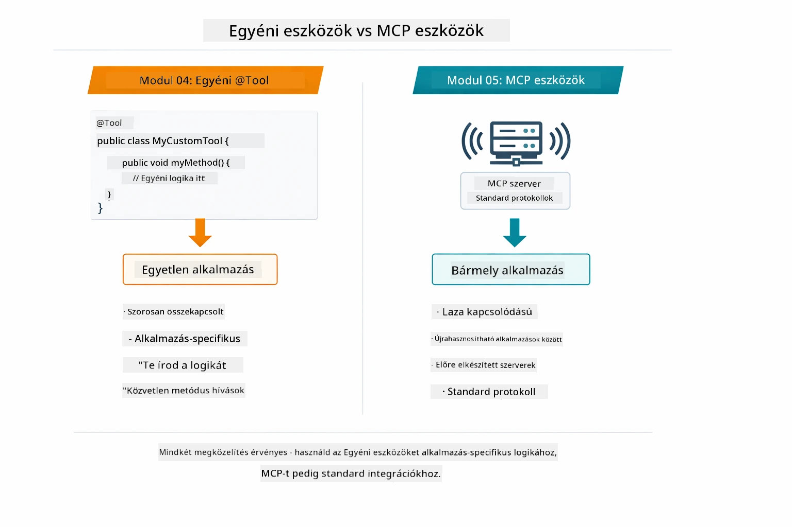

*Mikor használj egyedi @Tool metódusokat vs MCP eszközöket — egyedi eszközök alkalmazásspecifikus logikához teljes típusbiztonsággal, MCP eszközök szabványosított integrációkhoz, amelyek több alkalmazásban működnek.*

## Gratulálunk!

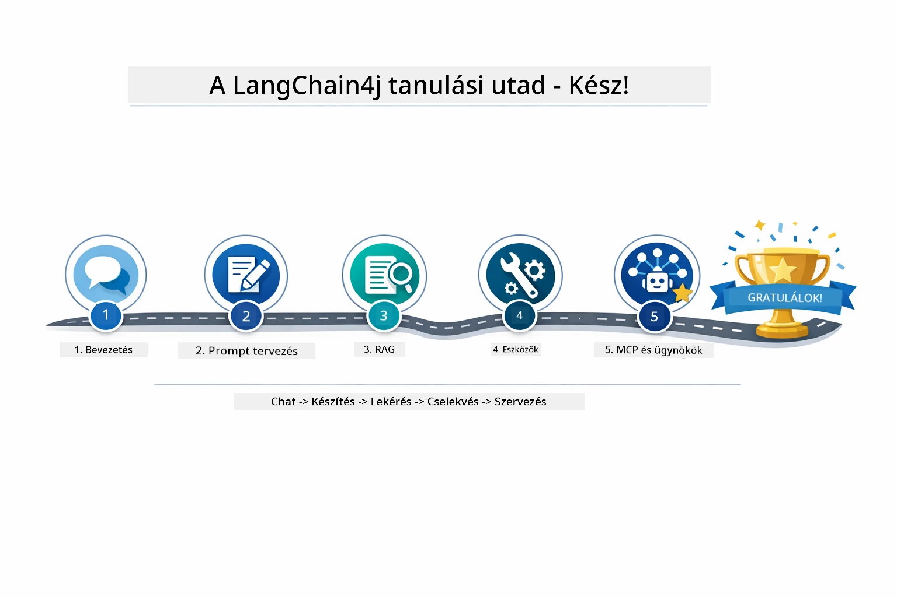

*Az öt modulon át tartó tanulási utad — az alapvető beszélgetéstől az MCP-vel hajtott agentic rendszerekig.*

Befejezted a LangChain4j kezdőknek szóló tanfolyamot. Megtanultad:

- Hogyan építs beszélgető AI-t memóriával (01. modul)
- Különböző feladatokra szóló prompt tervezési mintákat (02. modul)
- Válaszok alátámasztása dokumentumaiddal RAG használatával (03. modul)
- Alap AI ügynökök (asszisztensek) létrehozása egyedi eszközökkel (04. modul)
- Szabványos eszközök integrálása a LangChain4j MCP és Agentic modulokkal (05. modul)

### Mi a következő lépés?

A modulok elvégzése után fedezd fel a [Tesztelési Útmutatót](../docs/TESTING.md), hogy lásd a LangChain4j tesztelési koncepcióit működés közben.

**Hivatalos források:**
- [LangChain4j Dokumentáció](https://docs.langchain4j.dev/) - Átfogó útmutatók és API referenciák
- [LangChain4j GitHub](https://github.com/langchain4j/langchain4j) - Forráskód és példák
- [LangChain4j Oktatóanyagok](https://docs.langchain4j.dev/tutorials/) - Lépésről lépésre oktatóanyagok különféle használati esetekhez

Köszönjük, hogy elvégezted ezt a tanfolyamot!

---

**Navigáció:** [← Előző: 04-es modul - Eszközök](../04-tools/README.md) | [Vissza a főoldalra](../README.md)

---

<!-- CO-OP TRANSLATOR DISCLAIMER START -->
**Jogi nyilatkozat**:
Ezt a dokumentumot az AI fordító szolgáltatás, a [Co-op Translator](https://github.com/Azure/co-op-translator) segítségével fordítottuk le. Bár az pontosságra törekszünk, kérjük, vegye figyelembe, hogy az automatikus fordítások tartalmazhatnak hibákat vagy pontatlanságokat. Az eredeti dokumentum az anyanyelvén tekintendő hiteles forrásnak. Fontos információk esetén szakmai, emberi fordítást javasolt igénybe venni. Nem vállalunk felelősséget semmilyen félreértésért vagy helytelen értelmezésért, amely a fordítás használatából adódik.
<!-- CO-OP TRANSLATOR DISCLAIMER END -->