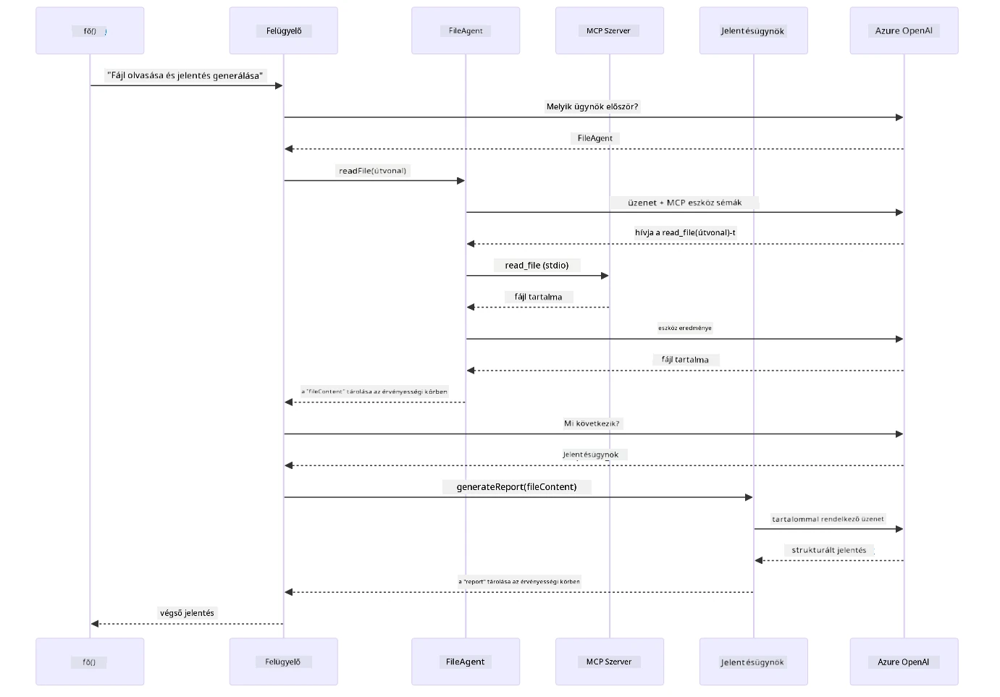

# Modul 05: Model Context Protocol (MCP)

## Tartalomjegyzék

- [Videós bemutató](../../../05-mcp)
- [Mit fogsz megtanulni](../../../05-mcp)
- [Mi az MCP?](../../../05-mcp)
- [Hogyan működik az MCP](../../../05-mcp)
- [Az Agentic modul](../../../05-mcp)
- [A példák futtatása](../../../05-mcp)
  - [Előfeltételek](../../../05-mcp)
- [Gyors indítás](../../../05-mcp)
  - [Fájlműveletek (Stdio)](../../../05-mcp)
  - [Supervisor Agent](../../../05-mcp)
    - [A demo futtatása](../../../05-mcp)
    - [Hogyan működik a Supervisor](../../../05-mcp)
    - [Hogyan ismeri fel a FileAgent az MCP eszközöket futás közben](../../../05-mcp)
    - [Válaszstratégiák](../../../05-mcp)
    - [Az eredmény megértése](../../../05-mcp)
    - [Az Agentic modul funkcióinak magyarázata](../../../05-mcp)
- [Kulcsfogalmak](../../../05-mcp)
- [Gratulálunk!](../../../05-mcp)
  - [Mi következik?](../../../05-mcp)

## Videós bemutató

Nézd meg ezt az élő bemutatót, amely elmagyarázza, hogyan kezdhetsz neki ennek a modulnak:

<a href="https://www.youtube.com/watch?v=O_J30kZc0rw"></a>

## Mit fogsz megtanulni

Beszélgető AI-t építettél, elsajátítottad a promptokat, válaszokat alapoztál dokumentumokra, és eszközökkel ellátott ügynököket hoztál létre. De ezek az eszközök mind a te konkrét alkalmazásodra voltak szabva. Mi lenne, ha az AI-d hozzáférést kapna egy szabványosított eszközökből álló ökoszisztémához, amelyet bárki létrehozhat és megoszthat? Ebben a modulban pontosan ezt tanulod meg a Model Context Protocol (MCP) és a LangChain4j agentic modul segítségével. Először egy egyszerű MCP fájlolvasót mutatunk be, majd megmutatjuk, hogyan integrálható könnyedén fejlett agentic munkafolyamatokba a Supervisor Agent mintával.

## Mi az MCP?

A Model Context Protocol (MCP) pontosan ezt biztosítja – egy szabványos módot arra, hogy az AI alkalmazások külső eszközöket fedezzenek fel és használjanak. Egyedi integrációk helyett minden adatforráshoz vagy szolgáltatáshoz MCP szerverekhez kapcsolódsz, amelyek képességeiket egységes formátumban teszik elérhetővé. Az AI ügynök automatikusan felismerheti és használhatja ezeket az eszközöket.

Az alábbi ábra mutatja a különbséget — MCP nélkül minden integráció egyedi pont-pont összekötést igényel; MCP-vel egyetlen protokoll kapcsolja össze az alkalmazásodat bármely eszközzel:


*Az MCP előtt: bonyolult pont-pont integrációk. Az MCP után: egy protokoll, végtelen lehetőség.*

Az MCP megold egy alapvető problémát az AI fejlesztésben: minden integráció egyedi. GitHubhoz akarsz hozzáférni? Egyedi kód. Fájlokat olvasni? Egyedi kód. Adatbázist lekérdezni? Egyedi kód. Ráadásul ezek az integrációk nem működnek más AI alkalmazásokkal.

Az MCP egységesíti ezt. Egy MCP szerver eszközöket tesz elérhetővé világos leírásokkal és sémákkal. Bármely MCP kliens csatlakozhat, felfedezheti az elérhető eszközöket és használhatja őket. Egyszer építsd fel, bárhol használd.

Az alábbi ábra illusztrálja ezt a felépítést — egyetlen MCP kliens (AI alkalmazásod) több MCP szerverhez csatlakozik, amelyek saját eszközkészletüket teszik elérhetővé a szabványos protokollon keresztül:


*Model Context Protocol architektúra – szabványosított eszközfelismerés és végrehajtás*

## Hogyan működik az MCP

A háttérben az MCP rétegzett architektúrát használ. A Java alkalmazásod (MCP kliens) felismeri az elérhető eszközöket, JSON-RPC kérelmeket küld egy transzport rétegen (Stdio vagy HTTP) keresztül, az MCP szerver végrehajtja a műveleteket és visszaadja az eredményeket. Az alábbi ábra lebontja a protokoll minden rétegét:


*Hogyan működik az MCP a háttérben – a kliensek felismerik az eszközöket, JSON-RPC üzeneteket cserélnek, és műveleteket hajtanak végre egy transzportrétegen keresztül.*

**Szerver-Kliens architektúra**

Az MCP kliens-szerver modellt használ. A szerverek eszközöket biztosítanak — fájlok olvasása, adatbázis lekérdezése, API hívások. A kliensek (AI alkalmazásod) kapcsolódnak a szerverekhez és használják az eszközöket.

Az MCP használatához LangChain4j-vel add hozzá ezt a Maven függőséget:

```xml
<dependency>
    <groupId>dev.langchain4j</groupId>
    <artifactId>langchain4j-mcp</artifactId>
    <version>${langchain4j.version}</version>
</dependency>
```

**Eszközfelismerés**

Amikor az ügyfeled kapcsolódik egy MCP szerverhez, megkérdezi: "Milyen eszközeid vannak?" A szerver válaszol egy elérhető eszközök listájával, mindegyik leírással és paraméter sémákkal. Az AI ügynök ezután eldöntheti, hogy mely eszközöket használja a felhasználói kérések alapján. Az alábbi ábra mutatja ezt a kézfogást — a kliens küld egy `tools/list` kérést, a szerver pedig visszaadja az elérhető eszközeit leírásokkal és paraméter sémákkal:


*Az AI induláskor felismeri az elérhető eszközöket — most már tudja, milyen képességek állnak rendelkezésre és eldöntheti, hogy melyeket használja.*

**Transzport mechanizmusok**

Az MCP különböző transzport mechanizmusokat támogat. A két lehetőség a Stdio (helyi alfolyamat-közti kommunikációhoz) és a Streamable HTTP (távoli szerverekhez). Ez a modul a Stdio transzportot mutatja be:


*MCP transzport mechanizmusok: HTTP távoli szerverekhez, Stdio helyi folyamatokhoz*

**Stdio** - [StdioTransportDemo.java](../../../05-mcp/src/main/java/com/example/langchain4j/mcp/StdioTransportDemo.java)

Helyi folyamatokhoz. Az alkalmazásod egy szervert hoz létre alfolyamatként és a szabványos bemeneten/kimeneten keresztül kommunikál vele. Hasznos fájlrendszer eléréshez vagy parancssori eszközökhöz.

```java
McpTransport stdioTransport = new StdioMcpTransport.Builder()
    .command(List.of(
        npmCmd, "exec",
        "@modelcontextprotocol/server-filesystem@2025.12.18",
        resourcesDir
    ))
    .logEvents(false)
    .build();
```

A `@modelcontextprotocol/server-filesystem` szerver a következő eszközöket teszi elérhetővé, mind sandboxolt a megadott könyvtárakra:

| Eszköz | Leírás |
|------|-------------|
| `read_file` | Egy fájl tartalmának beolvasása |
| `read_multiple_files` | Több fájl egyszeri beolvasása |
| `write_file` | Fájl létrehozása vagy felülírása |
| `edit_file` | Célozott keresés és csere szerkesztések |
| `list_directory` | Fájlok és könyvtárak listázása egy útvonalon |
| `search_files` | Rekurzívan keres fájlokat mintázat alapján |
| `get_file_info` | Fájl metaadatok lekérése (méret, időbélyegek, jogosultságok) |
| `create_directory` | Könyvtár létrehozása (szülőkönyvtárokkal együtt) |
| `move_file` | Fájl vagy könyvtár áthelyezése vagy átnevezése |

Az alábbi ábra szemlélteti a Stdio transzport működését futás közben — a Java alkalmazásod MCP szervert indít alfolyamatként, és a stdin/stdout csöveken keresztül kommunikálnak, hálózat vagy HTTP nélkül:


*Stdio transzport működés közben — az alkalmazás alfolyamatként indítja az MCP szervert és a stdin/stdout csöveken keresztül kommunikálnak.*

> **🤖 Próbáld ki [GitHub Copilot](https://github.com/features/copilot) Chattel:** Nyisd meg a [`StdioTransportDemo.java`](../../../05-mcp/src/main/java/com/example/langchain4j/mcp/StdioTransportDemo.java)-t és kérdezd:
> - "Hogyan működik a Stdio transzport és mikor érdemes HTTP helyett használni?"
> - "Hogyan kezeli a LangChain4j az MCP szerver alfolyamatok életciklusát?"
> - "Milyen biztonsági kockázatai vannak, ha AI hozzáférést kap a fájlrendszerhez?"

## Az Agentic modul

Míg az MCP szabványosított eszközöket biztosít, a LangChain4j **agentic modulja** deklaratív módot nyújt ügynökök építésére, amelyek ezeket az eszközöket koordinálják. A `@Agent` annotáció és az `AgenticServices` lehetővé teszik az ügynök viselkedésének definiálását interfészeken keresztül, nem imperatív kóddal.

Ebben a modulban megismerkedsz a **Supervisor Agent** mintával — egy fejlett agentic AI megközelítéssel, ahol egy "felügyelő" ügynök dinamikusan dönt arról, hogy melyik alügynököt hívja meg a felhasználói kérés alapján. Mindkét koncepciót egyesítjük azzal, hogy az egyik alügynökünk MCP-alapú fájlhozzáférési képességeket kap.

Az agentic modul használatához add hozzá ezt a Maven függőséget:

```xml
<dependency>
    <groupId>dev.langchain4j</groupId>
    <artifactId>langchain4j-agentic</artifactId>
    <version>${langchain4j.mcp.version}</version>
</dependency>
```
> **Megjegyzés:** A `langchain4j-agentic` modul külön verzió property-t (`langchain4j.mcp.version`) használ, mert eltérő ütemezés szerint jelenik meg, mint a LangChain4j magkönyvtárak.

> **⚠️ Kísérleti:** A `langchain4j-agentic` modul **kísérleti**, változhat. Az AI asszisztensek stabil építési módja továbbra is a `langchain4j-core` egyedi eszközökkel (4. modul).

## A példák futtatása

### Előfeltételek

- Befejezett [4. Modul - Eszközök](../04-tools/README.md) (ez a modul az egyedi eszközök koncepciójára épít és összehasonlítja őket az MCP eszközökkel)
- Törekedj arra, hogy a gyökérkönyvtárban legyen egy `.env` fájl Azure hitelesítő adatokkal (az első modulban `azd up` hozza létre)
- Java 21+, Maven 3.9+
- Node.js 16+ és npm (az MCP szerverekhez)

> **Megjegyzés:** Ha még nem állítottad be a környezeti változókat, lásd az [1. modul - Bevezetés](../01-introduction/README.md) telepítési utasításait (`azd up` automatikusan létrehozza a `.env` fájlt), vagy másold a `.env.example`-t `.env`-re a gyökérkönyvtárban és töltsd ki az értékeket.

## Gyors indítás

**VS Code használata:** Egyszerűen kattints jobb gombbal bármelyik demo fájlra a Felfedezőben és válaszd a **"Run Java"** opciót, vagy használd a Run and Debug panel indítási konfigurációit (előtte győződj meg róla, hogy a `.env` fájl megfelelően be van állítva Azure hitelesítőkkel).

**Maven használata:** Alternatívaként parancssorból is futtathatod az alábbi példákat.

### Fájlműveletek (Stdio)

Ez egy helyi alfolyamat alapú eszközök bemutatója.

**✅ Nem szükséges előfeltétel** – az MCP szerver automatikusan elindul.

**Start script-ek használata (ajánlott):**

A start script-ek automatikusan betöltik a környezeti változókat a gyökérkönyvtár `.env` fájljából:

**Bash:**
```bash
cd 05-mcp
chmod +x start-stdio.sh
./start-stdio.sh
```

**PowerShell:**
```powershell
cd 05-mcp
.\start-stdio.ps1
```

**VS Code használata:** Kattints jobb gombbal a `StdioTransportDemo.java`-ra, és válaszd a **"Run Java"** opciót (győződj meg róla, hogy a `.env` fájl be van állítva).

Az alkalmazás automatikusan indít egy fájlrendszer MCP szervert és beolvas egy helyi fájlt. Figyeld meg, hogyan kezeli az alfolyamat menedzsmentet.

**Várt kimenet:**
```
Assistant response: The file provides an overview of LangChain4j, an open-source Java library
for integrating Large Language Models (LLMs) into Java applications...
```

### Supervisor Agent

A **Supervisor Agent minta** egy **rugalmas** agentic AI forma. Egy Supervisor egy LLM-et használ, hogy autonóm módon döntse el, mely ügynököket hívja meg a felhasználó kérésének megfelelően. A következő példában MCP-alapú fájlhozzáférést kombinálunk LLM ügynökkel, hogy felügyelt fájlolvasás → jelentés készítés munkafolyamatot hozzunk létre.

A demóban a `FileAgent` MCP fájlrendszer eszközöket használ egy fájl beolvasására, a `ReportAgent` pedig egy strukturált jelentést készít vezetői összefoglalóval (1 mondat), 3 kulcsponttal és ajánlásokkal. A Supervisor automatikusan koordinálja ezt a folyamatot:


*A Supervisor az LLM-jével dönt arról, hogy melyik ügynököt és milyen sorrendben hívja meg — nincs szükség előre megírt útvonaltervezésre.*

Íme, milyen konkrét munkafolyamatot követ a fájlból-jelentés pipeline:


*A FileAgent beolvassa a fájlt MCP eszközökön keresztül, majd a ReportAgent átalakítja a nyers tartalmat strukturált jelentéssé.*

Az alábbi szekvencia diagram végigköveti a Supervisor teljes koordinációját — az MCP szerver elindításától, a Supervisor önálló ügynökválasztásán át, a Stdio-n keresztüli eszközhívásokig és a végső jelentésig:



*A Supervisor önállóan meghívja a FileAgentet (amely a MCP szervert hívja meg stdio-n keresztül a fájl beolvasására), majd meghívja a ReportAgentet a strukturált jelentés elkészítésére — minden ügynök az eredményét az Agentic Scope-ban tárolja.*

Minden ügynök az eredményét az **Agentic Scope**-ban (megosztott memóriában) tárolja, amely lehetővé teszi, hogy a későbbi ügynökök hozzáférjenek a korábbi eredményekhez. Ez azt mutatja, hogyan integrálódnak az MCP eszközök zökkenőmentesen az agentic munkafolyamatokba — a Supervisor-nak nem kell tudnia, *hogyan* olvassák be a fájlokat, csak azt, hogy a `FileAgent` meg tudja ezt tenni.

#### A demo futtatása

A start script-ek automatikusan betöltik a környezeti változókat a gyökérkönyvtár `.env` fájljából:

**Bash:**
```bash
cd 05-mcp
chmod +x start-supervisor.sh
./start-supervisor.sh
```

**PowerShell:**
```powershell
cd 05-mcp
.\start-supervisor.ps1
```

**VS Code használata:** Kattints jobb gombbal a `SupervisorAgentDemo.java`-ra, és válaszd a **"Run Java"** opciót (győződj meg róla, hogy a `.env` fájl be van állítva).

#### Hogyan működik a Supervisor

Az ügynökök felépítése előtt csatlakoztatni kell az MCP transzportot egy klienshez, és azt egy `ToolProvider`-ként becsomagolni. Így lesznek az MCP szerver eszközei elérhetők az ügynökeid számára:

```java
// MCP kliens létrehozása a transzportból
McpClient mcpClient = new DefaultMcpClient.Builder()
        .transport(stdioTransport)
        .build();

// A kliens becsomagolása ToolProvider-ként — ez hidat képez az MCP eszközök és a LangChain4j között
ToolProvider mcpToolProvider = McpToolProvider.builder()
        .mcpClients(List.of(mcpClient))
        .build();
```

Most már befecskendezheted a `mcpToolProvider`-t bármelyik ügynökbe, amelynek szüksége van MCP eszközökre:

```java
// 1. lépés: A FileAgent fájlokat olvas MCP eszközök segítségével
FileAgent fileAgent = AgenticServices.agentBuilder(FileAgent.class)
        .chatModel(model)
        .toolProvider(mcpToolProvider)  // Rendelkezik MCP eszközökkel fájlműveletekhez
        .build();

// 2. lépés: A ReportAgent strukturált jelentéseket készít
ReportAgent reportAgent = AgenticServices.agentBuilder(ReportAgent.class)
        .chatModel(model)
        .build();

// A Supervisor irányítja a fájl → jelentés munkafolyamatot
SupervisorAgent supervisor = AgenticServices.supervisorBuilder()
        .chatModel(model)
        .subAgents(fileAgent, reportAgent)
        .responseStrategy(SupervisorResponseStrategy.LAST)  // Visszaadja a végső jelentést
        .build();

// A Supervisor dönti el, mely agenteket hívja meg a kérés alapján
String response = supervisor.invoke("Read the file at /path/file.txt and generate a report");
```

#### Hogyan ismeri fel a FileAgent az MCP eszközöket futás közben

Lehet, hogy az a kérdésed, hogy **hogyan tudja a `FileAgent`, hogy miként használja az npm fájlrendszer eszközöket?** A válasz az, hogy nem tudja — a **LLM** futás közben a sémák alapján dönti el.
A `FileAgent` interfész csupán egy **prompt definíció**. Nem tartalmaz előre kódolt tudást a `read_file`, `list_directory` vagy bármely más MCP eszközről. Íme, mi történik a folyamat végpontjától végpontjáig:

1. **A szerver elindul:** A `StdioMcpTransport` elindítja az `@modelcontextprotocol/server-filesystem` npm csomagot gyermekfolyamatként
2. **Eszközfelismerés:** A `McpClient` küld egy `tools/list` JSON-RPC kérést a szervernek, amely eszköznevekkel, leírásokkal és paraméter sémákkal válaszol (pl. `read_file` — *"Egy fájl teljes tartalmának beolvasása"* — `{ path: string }`)
3. **Séma befecskendezés:** A `McpToolProvider` becsomagolja ezeket a felfedezett sémákat, és elérhetővé teszi a LangChain4j számára
4. **LLM dönt:** Amikor a `FileAgent.readFile(path)` hívódik, a LangChain4j elküldi a rendszerüzenetet, a felhasználói üzenetet, **és az eszköz sémák listáját** az LLM-nek. Az LLM elolvassa az eszközleírásokat és generál egy eszközhívást (pl. `read_file(path="/some/file.txt")`)
5. **Végrehajtás:** A LangChain4j elfogja az eszközhívást, az MCP kliensen keresztül visszaküldi a Node.js alfolyamatnak, megkapja az eredményt, és visszatáplálja az LLM-be

Ez ugyanaz a fent említett [Eszközfelismerő](../../../05-mcp) mechanizmus, de kifejezetten az agent munkafolyamatára alkalmazva. Az `@SystemMessage` és `@UserMessage` annotációk irányítják az LLM viselkedését, míg a befecskendezett `ToolProvider` megadja a **képességeket** — az LLM futásidőben köti össze a kettőt.

> **🤖 Próbáld ki [GitHub Copilot](https://github.com/features/copilot) Chattel:** Nyisd meg a [`FileAgent.java`](../../../05-mcp/src/main/java/com/example/langchain4j/mcp/agents/FileAgent.java) fájlt, és kérdezd meg:
> - "Hogyan tudja ez az ügynök, hogy melyik MCP eszközt hívja meg?"
> - "Mi történne, ha eltávolítanám a ToolProvidert az agent builderből?"
> - "Hogyan kerülnek át az eszköz sémák az LLM-be?"

#### Válaszadási Stratégiák

Amikor beállítasz egy `SupervisorAgent`-et, megadod, hogyan fogalmazza meg a végső választ a felhasználó számára a részügynökök feladatainak teljesítése után. Az alábbi ábra három elérhető stratégiát mutat — a LAST közvetlenül a végső ügynök kimenetét adja vissza, a SUMMARY az összes kimenetet egy LLM-en keresztül összegezve szintetizálja, a SCORED pedig kiválasztja a magasabb pontszámmal rendelkező választ az eredeti kérés alapján:


*Három stratégia arra, hogyan alkossa meg a Supervisor a végső válaszát — válassz aszerint, hogy az utolsó ügynök kimenetét, egy szintetizált összefoglalót vagy a legjobb pontszámút szeretnéd.*

Az elérhető stratégiák:

| Stratégia | Leírás |
|----------|-------------|
| **LAST** | A supervisor visszaadja az utolsó hívott alügynök vagy eszköz kimenetét. Ez akkor hasznos, ha a munkafolyamat végén lévő ügynök kifejezetten a teljes végső választ adja (pl. egy "Összefoglaló Ügynök" egy kutatási csővezetékben). |
| **SUMMARY** | A supervisor a saját beépített nyelvi modelljével (LLM) összegez egy összefoglalót a teljes interakcióról és az összes alügynök kimenetéről, majd ezt az összefoglalót adja vissza végső válaszként. Ez tiszta, összesített választ ad a felhasználónak. |
| **SCORED** | A rendszer egy belső LLM-et használ, hogy pontozza az utolsó választ és az összefoglalót az eredeti felhasználói kéréshez képest, majd a magasabb pontszámú eredményt adja vissza. |

Teljes megvalósítás található a [SupervisorAgentDemo.java](../../../05-mcp/src/main/java/com/example/langchain4j/mcp/SupervisorAgentDemo.java) fájlban.

> **🤖 Próbáld ki [GitHub Copilot](https://github.com/features/copilot) Chattel:** Nyisd meg a [`SupervisorAgentDemo.java`](../../../05-mcp/src/main/java/com/example/langchain4j/mcp/SupervisorAgentDemo.java) fájlt, és kérdezd meg:
> - "Hogyan dönt a Supervisor, hogy melyik ügynököt hívja meg?"
> - "Mi a különbség a Supervisor és a Sequential munkafolyamat minták között?"
> - "Hogyan tudom testre szabni a Supervisor tervezési viselkedését?"

#### Az Eredmény Értelmezése

Amikor futtatod a demót, strukturált áttekintést látsz arról, hogyan koordinál több ügynököt a Supervisor. Az alábbiakban szereplő részek jelentése:

```
======================================================================
  FILE → REPORT WORKFLOW DEMO
======================================================================

This demo shows a clear 2-step workflow: read a file, then generate a report.
The Supervisor orchestrates the agents automatically based on the request.
```

**A fejléc** bevezeti a munkafolyamat koncepcióját: egy fókuszált csővezeték a fájl beolvasástól a jelentéskészítésig.

```
--- WORKFLOW ---------------------------------------------------------
  ┌─────────────┐      ┌──────────────┐
  │  FileAgent  │ ───▶ │ ReportAgent  │
  │ (MCP tools) │      │  (pure LLM)  │
  └─────────────┘      └──────────────┘
   outputKey:           outputKey:
   'fileContent'        'report'

--- AVAILABLE AGENTS -------------------------------------------------
  [FILE]   FileAgent   - Reads files via MCP → stores in 'fileContent'
  [REPORT] ReportAgent - Generates structured report → stores in 'report'
```

**A munkafolyamat diagramja** mutatja a adatáramlást az ügynökök között. Minden ügynöknek specifikus szerepe van:
- **FileAgent** fájlokat olvas MCP eszközökkel és a nyers tartalmat tárolja a `fileContent` változóban
- **ReportAgent** felhasználja ezt a tartalmat és strukturált jelentést állít elő a `report` változóban

```
--- USER REQUEST -----------------------------------------------------
  "Read the file at .../file.txt and generate a report on its contents"
```

**Felhasználói kérés** bemutatja a feladatot. A Supervisor feldolgozza és eldönti, hogy meghívja a FileAgent → ReportAgent sorrendet.

```
--- SUPERVISOR ORCHESTRATION -----------------------------------------
  The Supervisor decides which agents to invoke and passes data between them...

  +-- STEP 1: Supervisor chose -> FileAgent (reading file via MCP)
  |
  |   Input: .../file.txt
  |
  |   Result: LangChain4j is an open-source, provider-agnostic Java framework for building LLM...
  +-- [OK] FileAgent (reading file via MCP) completed

  +-- STEP 2: Supervisor chose -> ReportAgent (generating structured report)
  |
  |   Input: LangChain4j is an open-source, provider-agnostic Java framew...
  |
  |   Result: Executive Summary...
  +-- [OK] ReportAgent (generating structured report) completed
```

**Supervisor koordináció** bemutatja a két lépéses folyamatot élesben:
1. **FileAgent** beolvassa a fájlt az MCP-n keresztül és elmenti a tartalmat
2. **ReportAgent** megkapja a tartalmat és jelentést készít

A Supervisor ezeket a döntéseket **önállóan** hozta meg a felhasználói kérés alapján.

```
--- FINAL RESPONSE ---------------------------------------------------
Executive Summary
...

Key Points
...

Recommendations
...

--- AGENTIC SCOPE (Data Flow) ----------------------------------------
  Each agent stores its output for downstream agents to consume:
  * fileContent: LangChain4j is an open-source, provider-agnostic Java framework...
  * report: Executive Summary...
```

#### Az Agentic Modul Funkcióinak Magyarázata

A példa több speciális funkciót is bemutat az agentic modulból. Nézzük meg részletesebben az Agentic Scope-ot és az Agent Listeners-t.

**Agentic Scope** mutatja a megosztott memóriát, ahol az ügynökök az `@Agent(outputKey="...")` annotációval tárolták az eredményeiket. Ez lehetővé teszi:
- Korábbi ügynökök kimenetére való későbbi hozzáférést
- A Supervisor számára a végső válasz szintetizálását
- Számodra pedig, hogy megvizsgáld, mit adott vissza az egyes ügynök

Az alábbi diagram mutatja, hogyan működik az Agentic Scope megosztott memóriaként a fájl-jelentés munkafolyamatban — a FileAgent a `fileContent` kulcs alatt írja az eredményét, a ReportAgent azt olvassa és a `report` kulcs alatt írja a saját eredményét:


*Az Agentic Scope megosztott memóriaként működik — a FileAgent írja a `fileContent`-et, a ReportAgent olvassa ezt és írja a `report`-ot, a kód pedig olvassa a végső eredményt.*

```java
ResultWithAgenticScope<String> result = supervisor.invokeWithAgenticScope(request);
AgenticScope scope = result.agenticScope();
String fileContent = scope.readState("fileContent");  // Nyers fájladatok a FileAgent-től
String report = scope.readState("report");            // Strukturált jelentés a ReportAgent-től
```

**Agent Listeners** lehetővé teszik az ügynökök futásának figyelését és hibakeresését. A bemutatóban látott lépésenkénti kimenet egy olyan AgentListenerből származik, amely az egyes ügynök hívásokba csatlakozik:
- **beforeAgentInvocation** – Meghívódik, amikor a Supervisor kiválaszt egy ügynököt, így láthatod, melyik és miért lett kiválasztva
- **afterAgentInvocation** – Meghívódik, amikor egy ügynök befejeződik, megmutatva az eredményét
- **inheritedBySubagents** – Ha igaz, a listener minden alügynökre kiterjed a hierarchiában

Az alábbi diagram az egész Agent Listener életciklust mutatja, beleértve az `onError` hiba kezelést az ügynök futása közbeni hibák esetén:


*Az Agent Listeners belépnek az ügynökök futásának életciklusába — figyelik az indítást, befejezést és hibák előfordulását.*

```java
AgentListener monitor = new AgentListener() {
    private int step = 0;
    
    @Override
    public void beforeAgentInvocation(AgentRequest request) {
        step++;
        System.out.println("  +-- STEP " + step + ": " + request.agentName());
    }
    
    @Override
    public void afterAgentInvocation(AgentResponse response) {
        System.out.println("  +-- [OK] " + response.agentName() + " completed");
    }
    
    @Override
    public boolean inheritedBySubagents() {
        return true; // Terjessze az összes alügynökhöz
    }
};
```

A Supervisor minta mellett a `langchain4j-agentic` modul több erőteljes munkafolyamat mintát nyújt. Az alábbi diagram az ötöt mutatja be — az egyszerű soros csővezetékektől az ember általi jóváhagyásos munkafolyamatokig:


*Öt munkafolyamat minta az ügynökök koordinálására — az egyszerű soros csővezetékektől az emberi beavatkozásos jóváhagyási folyamatokig.*

| Minta | Leírás | Használati eset |
|---------|-------------|----------|
| **Soros** | Az ügynököket egymás után futtatja, az output továbbáramlik a következőnek | Csővezetékek: kutatás → elemzés → jelentés |
| **Párhuzamos** | Az ügynökök egyszerre futnak | Független feladatok: időjárás + hírek + részvények |
| **Ciklus** | Addig ismétli, amíg a feltétel teljesül | Minőségi pontozás: finomítás amíg pont ≥ 0,8 |
| **Feltételes** | Feltételek alapján irányítja | Osztályozás → szakértői ügynökhöz irányítás |
| **Ember a folyamatban** | Emberi ellenőrzőpontokat ad hozzá | Jóváhagyási folyamatok, tartalmi felülvizsgálat |

## Kulcsfogalmak

Most, hogy megismerkedtél az MCP-vel és az agentic modullal működés közben, összefoglaljuk, mikor melyik megközelítést érdemes használni.

Az MCP egyik legnagyobb előnye a növekvő ökoszisztéma. Az alábbi diagram azt mutatja, hogyan kapcsol egyetlen univerzális protokoll széles körben különböző MCP szervereket — fájlrendszer és adatbázis hozzáféréstől egészen GitHub, email, webes adatkinyerés és egyéb szolgáltatásokig:


*Az MCP egy univerzális protokoll ökoszisztémát hoz létre — bármely MCP-kompatibilis szerver működik bármely MCP-kompatibilis klienssel, lehetővé téve az eszközök megosztását alkalmazások között.*

**MCP** ideális, ha meglévő eszközök ökoszisztémáját akarod kihasználni, olyan eszközöket építeni, amelyeket több alkalmazás is megoszthat, harmadik fél szolgáltatásokat illeszteni szabványos protokollokon keresztül, vagy eszközimplementációkat cserélni anélkül, hogy a kódot módosítanád.

**Az Agentic Modul** akkor a leghatékonyabb, ha deklaratív ügynök definíciókat szeretnél `@Agent` annotációkkal, munkafolyamat koordinációra van szükség (soros, ciklus, párhuzamos), felület alapú ügynök tervezést preferálsz az imperatív kóddal szemben, vagy több ügynököt kombinálsz, akik megosztják az outputokat `outputKey`-n keresztül.

**A Supervisor Agent minta** akkor ragyog, amikor a munkafolyamat előre nem tervezhető, és azt szeretnéd, hogy az LLM döntsön, amikor több specializált ügynököt kell dinamikusan koordinálni, amikor beszélgetős rendszereket építesz, amelyek képességekhez irányítanak, vagy amikor a legflexibilisebb, adaptív ügynök viselkedést szeretnéd.

Ahhoz, hogy segítsen választani az egyedi `@Tool` metódusok (04-es modul) és az MCP eszközök (ez a modul) között, a következő összehasonlítás a fő kompromisszumokat emeli ki — az egyedi eszközök szoros kötést és teljes típusbiztonságot kínálnak az alkalmazás-specifikus logikára, míg az MCP eszközök szabványosított, újrahasznosítható integrációkat nyújtanak:


*Mikor használjunk egyedi @Tool metódusokat vs MCP eszközöket — egyedi eszközök az alkalmazás-specifikus logikához teljes típusbiztonsággal, MCP eszközök szabványosított integrációkhoz több alkalmazás között.*

## Gratulálunk!

Átjutottál a LangChain4j kezdőknek tanfolyam öt modulján! Íme egy áttekintés a teljes megtett tanulási útról — az alap chat-től az MCP-alapú agentic rendszerekig:


*A tanulási utad mind az öt modult átfogja — az alap chat-től az MCP-alapú agentic rendszerekig.*

Teljesítetted a LangChain4j kezdőknek tanfolyamot. Megtanultad:

- Hogyan építs konverzációs AI-t memóriával (01-es modul)
- Prompt tervezési mintákat különböző feladatokhoz (02-es modul)
- Hogyan alapozd meg a válaszokat dokumentumokban RAG-gel (03-as modul)
- Hogyan készíts alap AI ügynököket saját eszközökkel (04-es modul)
- Hogyan integráld a szabványos eszközöket a LangChain4j MCP és Agentic modulokkal (05-ös modul)

### Mi jön most?

A modulok befejezése után fedezd fel a [Tesztelési útmutatót](../docs/TESTING.md), hogy megismerd a LangChain4j tesztelési koncepciókat működés közben.

**Hivatalos források:**
- [LangChain4j Dokumentáció](https://docs.langchain4j.dev/) – Átfogó útmutatók és API referenciák
- [LangChain4j GitHub](https://github.com/langchain4j/langchain4j) – Forráskód és példák
- [LangChain4j Oktatóanyagok](https://docs.langchain4j.dev/tutorials/) – Lépésről lépésre oktatóanyagok különböző esetekhez

Köszönjük, hogy elvégezted ezt a tanfolyamot!

---

**Navigáció:** [← Előző: Modul 04 - Eszközök](../04-tools/README.md) | [Vissza a főoldalra](../README.md)

---

<!-- CO-OP TRANSLATOR DISCLAIMER START -->
**Felelősségkizárás**:
Ez a dokumentum az AI fordító szolgáltatás [Co-op Translator](https://github.com/Azure/co-op-translator) segítségével készült. Bár igyekszünk a pontosságra, kérjük, vegye figyelembe, hogy az automatikus fordítások tartalmazhatnak hibákat vagy pontatlanságokat. Az eredeti dokumentum az adott nyelven tekintendő hiteles forrásnak. Fontos információk esetén szakember által végzett emberi fordítást javaslunk. Nem vállalunk felelősséget az ebből eredő félreértésekért vagy téves értelmezésekért.
<!-- CO-OP TRANSLATOR DISCLAIMER END -->