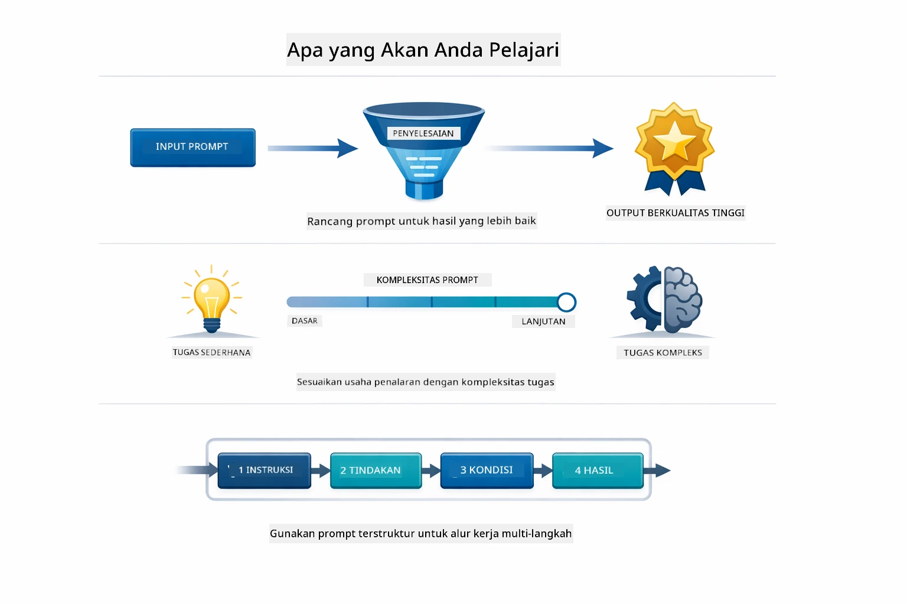
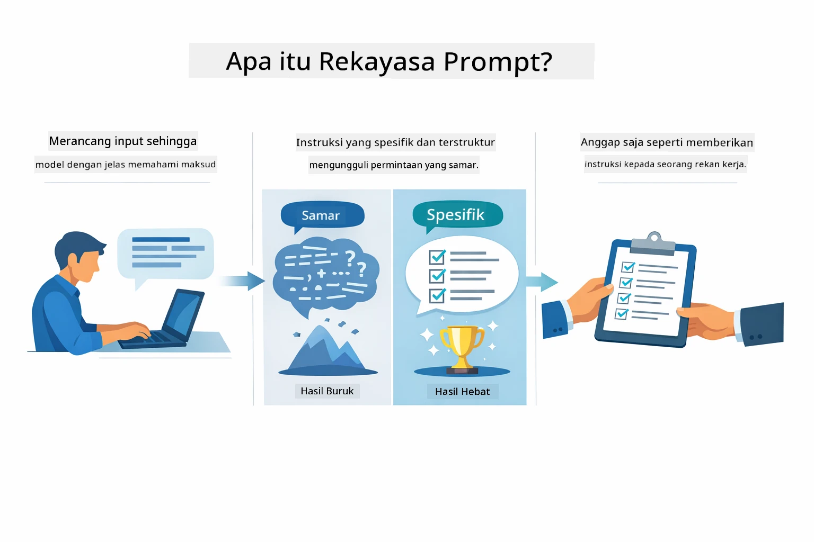
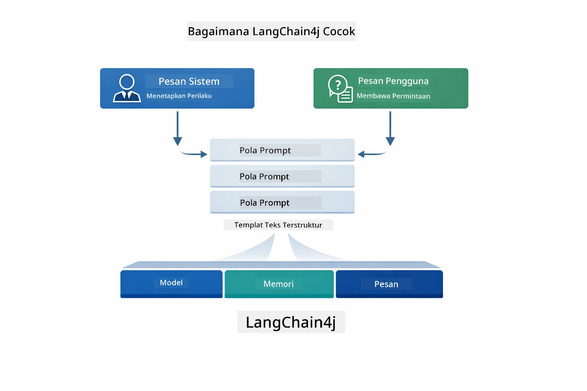
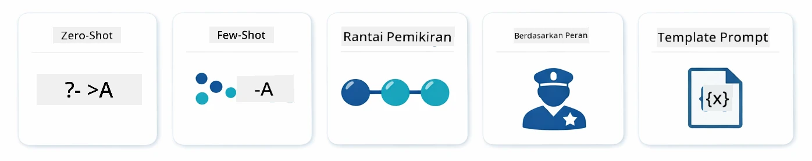
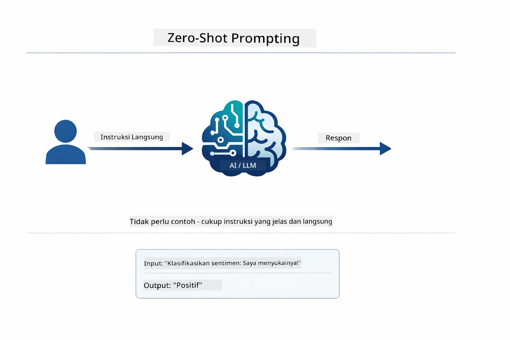
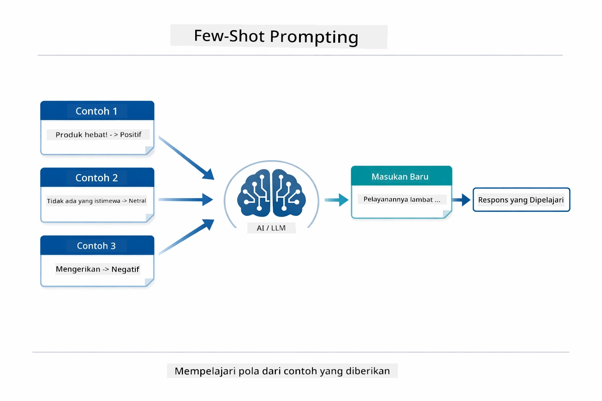
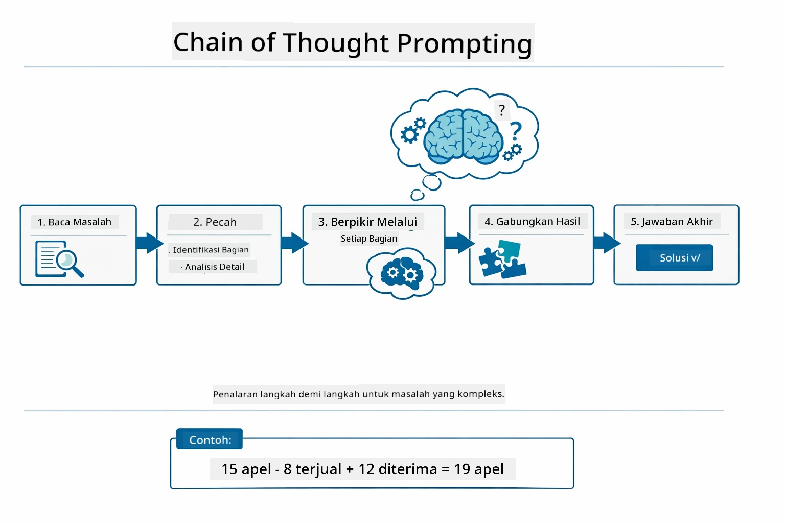
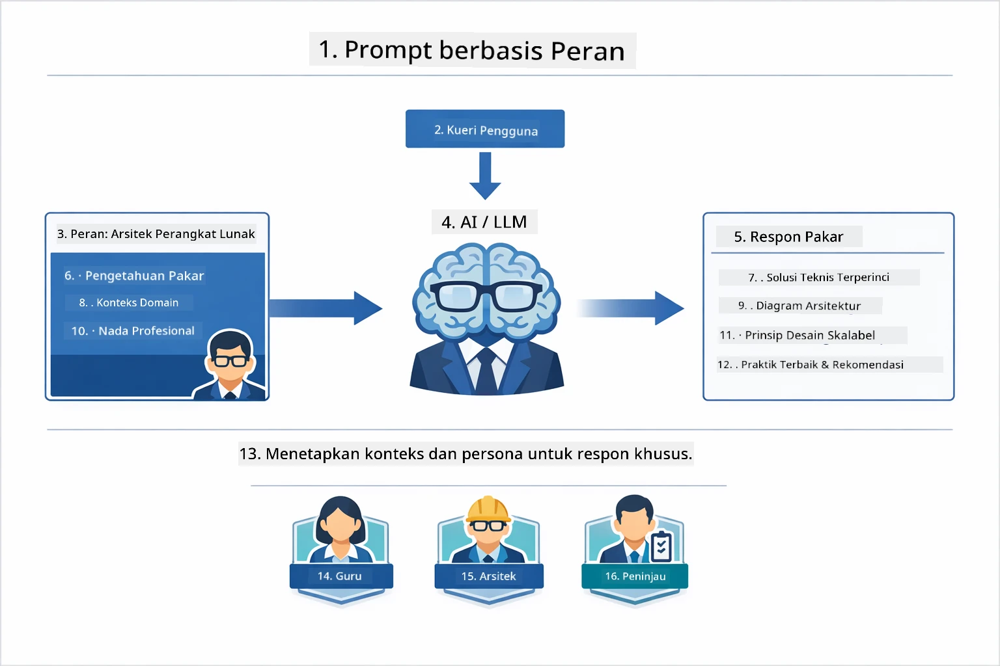
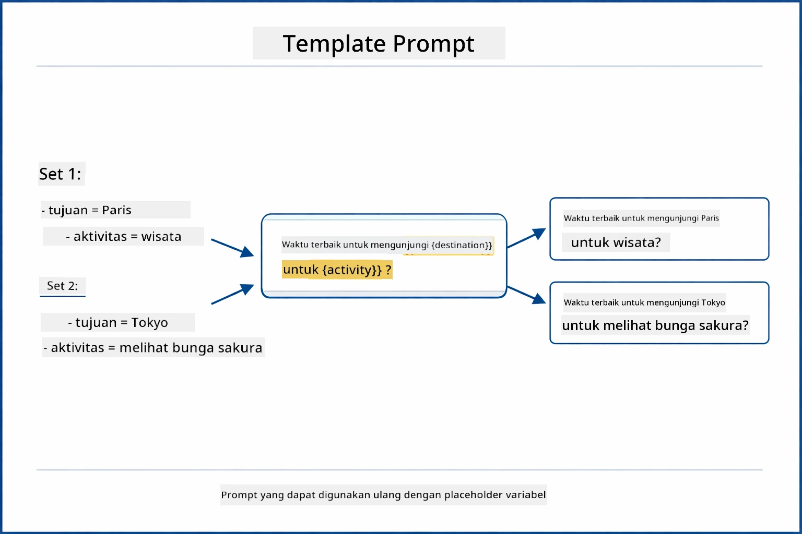
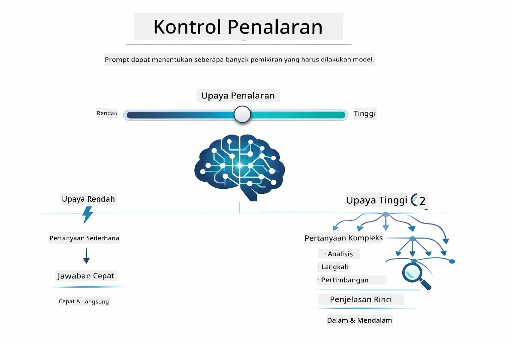

# Modul 02: Rekayasa Prompt dengan GPT-5.2

## Daftar Isi

- [Apa yang Akan Anda Pelajari](../../../02-prompt-engineering)
- [Prasyarat](../../../02-prompt-engineering)
- [Memahami Rekayasa Prompt](../../../02-prompt-engineering)
- [Fundamental Rekayasa Prompt](../../../02-prompt-engineering)
  - [Zero-Shot Prompting](../../../02-prompt-engineering)
  - [Few-Shot Prompting](../../../02-prompt-engineering)
  - [Chain of Thought](../../../02-prompt-engineering)
  - [Role-Based Prompting](../../../02-prompt-engineering)
  - [Prompt Templates](../../../02-prompt-engineering)
- [Pola Lanjutan](../../../02-prompt-engineering)
- [Menggunakan Sumber Daya Azure yang Ada](../../../02-prompt-engineering)
- [Tangkapan Layar Aplikasi](../../../02-prompt-engineering)
- [Mengeksplorasi Pola](../../../02-prompt-engineering)
  - [Eager Rendah vs Tinggi](../../../02-prompt-engineering)
  - [Eksekusi Tugas (Tool Preambles)](../../../02-prompt-engineering)
  - [Kode yang Merefleksikan Diri](../../../02-prompt-engineering)
  - [Analisis Terstruktur](../../../02-prompt-engineering)
  - [Obrolan Multi-Turn](../../../02-prompt-engineering)
  - [Penalaran Langkah-demi-Langkah](../../../02-prompt-engineering)
  - [Output Terbatas](../../../02-prompt-engineering)
- [Apa yang Sebenarnya Anda Pelajari](../../../02-prompt-engineering)
- [Langkah Berikutnya](../../../02-prompt-engineering)

## Apa yang Akan Anda Pelajari



Di modul sebelumnya, Anda melihat bagaimana memori memungkinkan AI percakapan dan menggunakan Model GitHub untuk interaksi dasar. Sekarang kita akan fokus pada cara Anda mengajukan pertanyaan — prompt itu sendiri — menggunakan GPT-5.2 dari Azure OpenAI. Cara Anda menyusun prompt secara dramatis memengaruhi kualitas respons yang Anda dapatkan. Kita mulai dengan tinjauan teknik prompt dasar, lalu melanjutkan ke delapan pola lanjutan yang memanfaatkan sepenuhnya kemampuan GPT-5.2.

Kita menggunakan GPT-5.2 karena memperkenalkan kontrol penalaran - Anda bisa memberitahu model seberapa banyak berpikir sebelum menjawab. Ini membuat berbagai strategi prompting lebih jelas dan membantu Anda memahami kapan menggunakan pendekatan mana. Kita juga mendapatkan keuntungan dari batasan rate Azure yang lebih sedikit untuk GPT-5.2 dibandingkan Model GitHub.

## Prasyarat

- Menyelesaikan Modul 01 (Sumber daya Azure OpenAI sudah dideploy)
- File `.env` di direktori root dengan kredensial Azure (dibuat oleh `azd up` di Modul 01)

> **Catatan:** Jika Anda belum menyelesaikan Modul 01, ikuti instruksi deployment di sana terlebih dahulu.

## Memahami Rekayasa Prompt



Rekayasa prompt adalah tentang merancang teks masukan yang secara konsisten memberikan hasil yang Anda butuhkan. Ini bukan hanya tentang mengajukan pertanyaan - tapi tentang menyusun permintaan sehingga model memahami dengan tepat apa yang Anda inginkan dan bagaimana menyampaikannya.

Anggap saja seperti memberi instruksi pada rekan kerja. "Perbaiki bug" itu samar. "Perbaiki null pointer exception di UserService.java baris 45 dengan menambahkan pemeriksaan null" itu spesifik. Model bahasa bekerja dengan cara yang sama - spesifik dan struktur itu penting.



LangChain4j menyediakan infrastruktur — koneksi model, memori, dan jenis pesan — sementara pola prompt hanyalah teks yang disusun dengan cermat yang Anda kirimkan melalui infrastruktur itu. Blok bangunan kunci adalah `SystemMessage` (yang menetapkan perilaku dan peran AI) dan `UserMessage` (yang membawa permintaan Anda yang sebenarnya).

## Fundamental Rekayasa Prompt



Sebelum menyelami pola lanjutan dalam modul ini, mari kita tinjau lima teknik prompting dasar. Ini adalah blok pembangun yang harus diketahui setiap insinyur prompt. Jika Anda sudah menyelesaikan [modul Quick Start](../00-quick-start/README.md#2-prompt-patterns), Anda sudah melihat mereka beraksi — berikut kerangka konseptual di baliknya.

### Zero-Shot Prompting

Pendekatan paling sederhana: berikan instruksi langsung tanpa contoh. Model sepenuhnya mengandalkan pelatihannya untuk memahami dan menjalankan tugas. Ini bekerja baik untuk permintaan langsung di mana perilaku yang diharapkan jelas.



*Instruksi langsung tanpa contoh — model menyimpulkan tugas hanya dari instruksi*

```java
String prompt = "Classify this sentiment: 'I absolutely loved the movie!'";
String response = model.chat(prompt);
// Respon: "Positif"
```

**Kapan digunakan:** Klasifikasi sederhana, pertanyaan langsung, terjemahan, atau tugas apa pun yang bisa ditangani model tanpa panduan tambahan.

### Few-Shot Prompting

Berikan contoh yang menunjukkan pola yang ingin Anda buat model ikuti. Model belajar format input-output yang diharapkan dari contoh Anda dan menerapkannya ke masukan baru. Ini sangat meningkatkan konsistensi untuk tugas di mana format atau perilaku yang diinginkan tidak jelas.



*Belajar dari contoh — model mengidentifikasi pola dan menerapkannya ke input baru*

```java
String prompt = """
    Classify the sentiment as positive, negative, or neutral.
    
    Examples:
    Text: "This product exceeded my expectations!" → Positive
    Text: "It's okay, nothing special." → Neutral
    Text: "Waste of money, very disappointed." → Negative
    
    Now classify this:
    Text: "Best purchase I've made all year!"
    """;
String response = model.chat(prompt);
```

**Kapan digunakan:** Klasifikasi khusus, format konsisten, tugas domain-spesifik, atau saat hasil zero-shot tidak konsisten.

### Chain of Thought

Minta model menunjukkan proses penalarannya langkah demi langkah. Alih-alih langsung memberikan jawaban, model memecah masalah dan mengerjakan tiap bagian secara eksplisit. Ini meningkatkan akurasi pada matematika, logika, dan tugas penalaran berlapis.



*Penalaran langkah demi langkah — memecah masalah kompleks menjadi langkah logis eksplisit*

```java
String prompt = """
    Problem: A store has 15 apples. They sell 8 apples and then 
    receive a shipment of 12 more apples. How many apples do they have now?
    
    Let's solve this step-by-step:
    """;
String response = model.chat(prompt);
// Model menunjukkan: 15 - 8 = 7, kemudian 7 + 12 = 19 apel
```

**Kapan digunakan:** Masalah matematika, teka-teki logika, debugging, atau tugas yang menunjukkan proses penalaran meningkatkan akurasi dan kepercayaan.

### Role-Based Prompting

Tetapkan persona atau peran untuk AI sebelum bertanya. Ini memberikan konteks yang membentuk nada, kedalaman, dan fokus respons. "Arsitek perangkat lunak" memberi saran berbeda dari "developer junior" atau "auditor keamanan".



*Menetapkan konteks dan persona — pertanyaan sama dapat respons berbeda tergantung peran yang ditetapkan*

```java
String prompt = """
    You are an experienced software architect reviewing code.
    Provide a brief code review for this function:
    
    def calculate_total(items):
        total = 0
        for item in items:
            total = total + item['price']
        return total
    """;
String response = model.chat(prompt);
```

**Kapan digunakan:** Review kode, bimbingan, analisis domain-spesifik, atau saat Anda membutuhkan respons yang disesuaikan dengan tingkat keahlian atau perspektif tertentu.

### Prompt Templates

Buat prompt yang dapat digunakan ulang dengan placeholder variabel. Alih-alih menulis prompt baru setiap saat, definisikan template sekali dan isi nilai berbeda. Kelas `PromptTemplate` LangChain4j mempermudah ini dengan sintaks `{{variable}}`.



*Prompt yang dapat digunakan ulang dengan placeholder variabel — satu template, banyak penggunaan*

```java
PromptTemplate template = PromptTemplate.from(
    "What's the best time to visit {{destination}} for {{activity}}?"
);

Prompt prompt = template.apply(Map.of(
    "destination", "Paris",
    "activity", "sightseeing"
));

String response = model.chat(prompt.text());
```

**Kapan digunakan:** Query berulang dengan input berbeda, pemrosesan batch, membangun workflow AI yang dapat digunakan ulang, atau skenario di mana struktur prompt sama tapi data berubah.

---

Kelima fundamental ini memberi Anda toolkit yang solid untuk sebagian besar tugas prompting. Sisa modul ini membangun di atasnya dengan **delapan pola lanjutan** yang memanfaatkan kontrol penalaran, evaluasi diri, dan kemampuan output terstruktur GPT-5.2.

## Pola Lanjutan

Dengan fundamental tuntas, mari berlanjut ke delapan pola lanjutan yang membuat modul ini unik. Tidak semua masalah membutuhkan pendekatan yang sama. Beberapa pertanyaan butuh jawaban cepat, yang lain butuh pemikiran mendalam. Ada yang butuh penalaran terlihat, ada yang cukup hasil saja. Setiap pola di bawah ini dioptimalkan untuk skenario berbeda — dan kontrol penalaran GPT-5.2 membuat perbedaan ini semakin nyata.


*Ikhtisar delapan pola rekayasa prompt dan kasus penggunaannya*



*Kontrol penalaran GPT-5.2 memungkinkan Anda menentukan seberapa banyak model harus berpikir — dari jawaban cepat langsung sampai eksplorasi mendalam*


*Eager rendah (cepat, langsung) vs eager tinggi (teliti, eksploratif) pendekatan penalaran*

**Eager Rendah (Cepat & Fokus)** - Untuk pertanyaan sederhana di mana Anda menginginkan jawaban cepat dan langsung. Model melakukan penalaran minimal - maksimal 2 langkah. Gunakan ini untuk perhitungan, pencarian, atau pertanyaan langsung.

```java
String prompt = """
    <context_gathering>
    - Search depth: very low
    - Bias strongly towards providing a correct answer as quickly as possible
    - Usually, this means an absolute maximum of 2 reasoning steps
    - If you think you need more time, state what you know and what's uncertain
    </context_gathering>
    
    Problem: What is 15% of 200?
    
    Provide your answer:
    """;

String response = chatModel.chat(prompt);
```

> 💡 **Jelajahi dengan GitHub Copilot:** Buka [`Gpt5PromptService.java`](../../../02-prompt-engineering/src/main/java/com/example/langchain4j/prompts/service/Gpt5PromptService.java) dan tanyakan:
> - "Apa perbedaan pola prompting eager rendah dan eager tinggi?"
> - "Bagaimana tag XML dalam prompt membantu menyusun respons AI?"
> - "Kapan saya harus menggunakan pola refleksi diri vs instruksi langsung?"

**Eager Tinggi (Mendalam & Teliti)** - Untuk masalah kompleks di mana Anda menginginkan analisis menyeluruh. Model mengeksplorasi secara menyeluruh dan menunjukkan penalaran detail. Gunakan ini untuk desain sistem, pengambilan keputusan arsitektur, atau penelitian kompleks.

```java
String prompt = """
    Analyze this problem thoroughly and provide a comprehensive solution.
    Consider multiple approaches, trade-offs, and important details.
    Show your analysis and reasoning in your response.
    
    Problem: Design a caching strategy for a high-traffic REST API.
    """;

String response = chatModel.chat(prompt);
```

**Eksekusi Tugas (Kemajuan Langkah-demi-Langkah)** - Untuk workflow multi-langkah. Model memberikan rencana awal, menceritakan setiap langkah saat berjalan, lalu memberikan ringkasan. Gunakan ini untuk migrasi, implementasi, atau proses multi-langkah apa pun.

```java
String prompt = """
    <task_execution>
    1. First, briefly restate the user's goal in a friendly way
    
    2. Create a step-by-step plan:
       - List all steps needed
       - Identify potential challenges
       - Outline success criteria
    
    3. Execute each step:
       - Narrate what you're doing
       - Show progress clearly
       - Handle any issues that arise
    
    4. Summarize:
       - What was completed
       - Any important notes
       - Next steps if applicable
    </task_execution>
    
    <tool_preambles>
    - Always begin by rephrasing the user's goal clearly
    - Outline your plan before executing
    - Narrate each step as you go
    - Finish with a distinct summary
    </tool_preambles>
    
    Task: Create a REST endpoint for user registration
    
    Begin execution:
    """;

String response = chatModel.chat(prompt);
```

Prompting Chain-of-Thought secara eksplisit meminta model menunjukkan proses penalarannya, meningkatkan akurasi untuk tugas kompleks. Pemecahan langkah demi langkah membantu manusia dan AI memahami logika.

> **🤖 Coba dengan [GitHub Copilot](https://github.com/features/copilot) Chat:** Tanyakan tentang pola ini:
> - "Bagaimana saya menyesuaikan pola eksekusi tugas untuk operasi yang berjalan lama?"
> - "Apa praktik terbaik menyusun tool preambles di aplikasi produksi?"
> - "Bagaimana saya menangkap dan menampilkan pembaruan kemajuan antara di UI?"


*Rencana → Eksekusi → Ringkasan workflow untuk tugas multi-langkah*

**Kode yang Merefleksikan Diri** - Untuk menghasilkan kode berkualitas produksi. Model menghasilkan kode mengikuti standar produksi dengan penanganan error yang tepat. Gunakan ini saat membangun fitur atau layanan baru.

```java
String prompt = """
    Generate Java code with production-quality standards: Create an email validation service
    Keep it simple and include basic error handling.
    """;

String response = chatModel.chat(prompt);
```


*Loop perbaikan iteratif - generate, evaluasi, identifikasi masalah, perbaiki, ulangi*

**Analisis Terstruktur** - Untuk evaluasi konsisten. Model meninjau kode menggunakan kerangka kerja tetap (kebenaran, praktik, performa, keamanan, maintainability). Gunakan ini untuk review kode atau penilaian kualitas.

```java
String prompt = """
    <analysis_framework>
    You are an expert code reviewer. Analyze the code for:
    
    1. Correctness
       - Does it work as intended?
       - Are there logical errors?
    
    2. Best Practices
       - Follows language conventions?
       - Appropriate design patterns?
    
    3. Performance
       - Any inefficiencies?
       - Scalability concerns?
    
    4. Security
       - Potential vulnerabilities?
       - Input validation?
    
    5. Maintainability
       - Code clarity?
       - Documentation?
    
    <output_format>
    Provide your analysis in this structure:
    - Summary: One-sentence overall assessment
    - Strengths: 2-3 positive points
    - Issues: List any problems found with severity (High/Medium/Low)
    - Recommendations: Specific improvements
    </output_format>
    </analysis_framework>
    
    Code to analyze:
    ```
    public List getUsers() {
        return database.query("SELECT * FROM users");
    }
    ```
    Provide your structured analysis:
    """;

String response = chatModel.chat(prompt);
```

> **🤖 Coba dengan [GitHub Copilot](https://github.com/features/copilot) Chat:** Tanyakan tentang analisis terstruktur:
> - "Bagaimana saya menyesuaikan framework analisis untuk berbagai jenis review kode?"
> - "Bagaimana cara terbaik mengurai dan bertindak pada output terstruktur secara programatik?"
> - "Bagaimana saya menjamin konsistensi tingkat keparahan antar sesi review berbeda?"


*Kerangka untuk review kode konsisten dengan tingkat keparahan*

**Obrolan Multi-Turn** - Untuk percakapan yang butuh konteks. Model mengingat pesan sebelumnya dan membangun di atasnya. Gunakan ini untuk sesi bantuan interaktif atau Q&A kompleks.

```java
ChatMemory memory = MessageWindowChatMemory.withMaxMessages(10);

memory.add(UserMessage.from("What is Spring Boot?"));
AiMessage aiMessage1 = chatModel.chat(memory.messages()).aiMessage();
memory.add(aiMessage1);

memory.add(UserMessage.from("Show me an example"));
AiMessage aiMessage2 = chatModel.chat(memory.messages()).aiMessage();
memory.add(aiMessage2);
```


*Bagaimana konteks percakapan terakumulasi selama beberapa giliran hingga mencapai batas token*

**Penalaran Langkah-demi-Langkah** - Untuk masalah yang membutuhkan logika terlihat. Model menunjukkan penalaran eksplisit untuk setiap langkah. Gunakan ini untuk masalah matematika, teka-teki logika, atau saat Anda butuh memahami proses berpikir.

```java
String prompt = """
    <instruction>Show your reasoning step-by-step</instruction>
    
    If a train travels 120 km in 2 hours, then stops for 30 minutes,
    then travels another 90 km in 1.5 hours, what is the average speed
    for the entire journey including the stop?
    """;

String response = chatModel.chat(prompt);
```


*Memecah masalah menjadi langkah logis eksplisit*

**Output Terbatas** - Untuk respons dengan persyaratan format spesifik. Model mengikuti aturan format dan panjang secara ketat. Gunakan ini untuk ringkasan atau saat Anda butuh struktur output presisi.

```java
String prompt = """
    <constraints>
    - Exactly 100 words
    - Bullet point format
    - Technical terms only
    </constraints>
    
    Summarize the key concepts of machine learning.
    """;

String response = chatModel.chat(prompt);
```


*Penegakan persyaratan format, panjang, dan struktur yang spesifik*

## Menggunakan Sumber Daya Azure yang Ada

**Verifikasi deployment:**

Pastikan file `.env` ada di direktori root dengan kredensial Azure (dibuat saat Modul 01):
```bash
cat ../.env  # Harus menampilkan AZURE_OPENAI_ENDPOINT, API_KEY, DEPLOYMENT
```

**Mulai aplikasi:**

> **Catatan:** Jika Anda sudah memulai semua aplikasi menggunakan `./start-all.sh` dari Modul 01, modul ini sudah berjalan di port 8083. Anda dapat melewati perintah start di bawah dan langsung membuka http://localhost:8083.

**Opsi 1: Menggunakan Spring Boot Dashboard (Disarankan untuk pengguna VS Code)**

Dev container menyertakan ekstensi Spring Boot Dashboard, yang menyediakan antarmuka visual untuk mengelola semua aplikasi Spring Boot. Anda bisa menemukannya di Activity Bar di sisi kiri VS Code (cari ikon Spring Boot).
Dari Spring Boot Dashboard, Anda dapat:
- Melihat semua aplikasi Spring Boot yang tersedia di workspace
- Memulai/menghentikan aplikasi dengan satu klik
- Melihat log aplikasi secara real-time
- Memantau status aplikasi

Cukup klik tombol play di sebelah "prompt-engineering" untuk memulai modul ini, atau mulai semua modul sekaligus.


**Opsi 2: Menggunakan skrip shell**

Mulai semua aplikasi web (modul 01-04):

**Bash:**
```bash
cd ..  # Dari direktori root
./start-all.sh
```

**PowerShell:**
```powershell
cd ..  # Dari direktori root
.\start-all.ps1
```

Atau mulai hanya modul ini:

**Bash:**
```bash
cd 02-prompt-engineering
./start.sh
```

**PowerShell:**
```powershell
cd 02-prompt-engineering
.\start.ps1
```

Kedua skrip secara otomatis memuat variabel lingkungan dari berkas `.env` root dan akan membangun JAR jika belum ada.

> **Catatan:** Jika Anda lebih suka membangun semua modul secara manual sebelum memulai:
>
> **Bash:**
> ```bash
> cd ..  # Go to root directory
> mvn clean package -DskipTests
> ```
>
> **PowerShell:**
> ```powershell
> cd ..  # Go to root directory
> mvn clean package -DskipTests
> ```

Buka http://localhost:8083 di browser Anda.

**Untuk menghentikan:**

**Bash:**
```bash
./stop.sh  # Hanya modul ini
# Atau
cd .. && ./stop-all.sh  # Semua modul
```

**PowerShell:**
```powershell
.\stop.ps1  # Hanya modul ini
# Atau
cd ..; .\stop-all.ps1  # Semua modul
```

## Tangkapan Layar Aplikasi


*Dashboard utama yang menampilkan semua 8 pola rekayasa prompt beserta karakteristik dan kasus penggunaannya*

## Menjelajahi Pola

Antarmuka web memungkinkan Anda bereksperimen dengan berbagai strategi prompt. Setiap pola memecahkan masalah yang berbeda - coba mereka untuk melihat kapan masing-masing pendekatan unggul.

### Keinginan Rendah vs Tinggi

Ajukan pertanyaan sederhana seperti "Berapa 15% dari 200?" menggunakan Keinginan Rendah. Anda akan mendapat jawaban langsung dan instan. Sekarang ajukan sesuatu yang kompleks seperti "Rancang strategi caching untuk API dengan trafik tinggi" menggunakan Keinginan Tinggi. Amati bagaimana model melambat dan memberikan penjelasan rinci. Model sama, struktur pertanyaan sama - tetapi prompt memberitahu seberapa banyak pemikiran yang harus dilakukan.


*Perhitungan cepat dengan penalaran minimal*


*Strategi caching komprehensif (2.8MB)*

### Eksekusi Tugas (Preambule Alat)

Alur kerja multi-langkah mendapat manfaat dari perencanaan awal dan narasi progres. Model menguraikan apa yang akan dilakukan, menceritakan tiap langkah, lalu merangkum hasilnya.


*Membuat endpoint REST dengan narasi langkah-demi-langkah (3.9MB)*

### Kode yang Merefleksikan Diri

Coba "Buat layanan validasi email". Alih-alih hanya menghasilkan kode dan berhenti, model menghasilkan, mengevaluasi terhadap kriteria kualitas, mengidentifikasi kelemahan, dan memperbaiki. Anda akan melihat iterasi hingga kode memenuhi standar produksi.


*Layanan validasi email lengkap (5.2MB)*

### Analisis Terstruktur

Review kode membutuhkan kerangka evaluasi yang konsisten. Model menganalisis kode menggunakan kategori tetap (ketepatan, praktik, performa, keamanan) dengan tingkat keparahan.


*Review kode berbasis kerangka*

### Obrolan Multi-Turn

Tanyakan "Apa itu Spring Boot?" lalu segera lanjutkan dengan "Tunjukkan contoh". Model mengingat pertanyaan pertama Anda dan memberikan contoh Spring Boot secara spesifik. Tanpa memori, pertanyaan kedua terlalu samar.


*Pelestarian konteks antar pertanyaan*

### Penalaran Langkah-demi-Langkah

Pilih masalah matematika dan coba dengan Penalaran Langkah-demi-Langkah dan Keinginan Rendah. Keinginan rendah hanya memberi jawaban - cepat tapi tidak transparan. Penalaran langkah-demi-langkah menunjukkan setiap perhitungan dan keputusan.


*Masalah matematika dengan langkah eksplisit*

### Output Terbatas

Ketika Anda membutuhkan format atau jumlah kata tertentu, pola ini menegakkan kepatuhan ketat. Coba buat ringkasan dengan tepat 100 kata dalam format poin-poin.


*Ringkasan machine learning dengan kontrol format*

## Apa yang Sebenarnya Anda Pelajari

**Upaya Penalaran Mengubah Segalanya**

GPT-5.2 membiarkan Anda mengontrol usaha komputasi lewat prompt Anda. Usaha rendah berarti respons cepat dengan eksplorasi minimal. Usaha tinggi berarti model meluangkan waktu untuk berpikir mendalam. Anda belajar mencocokkan usaha dengan kompleksitas tugas - jangan buang waktu pada pertanyaan sederhana, tapi jangan buru-buru dalam keputusan kompleks.

**Struktur Mengarahkan Perilaku**

Perhatikan tag XML dalam prompt? Ini bukan dekorasi. Model mengikuti instruksi terstruktur lebih andal daripada teks bebas. Ketika Anda membutuhkan proses multi-langkah atau logika kompleks, struktur membantu model melacak posisinya dan langkah berikutnya.


*Anatomi prompt yang terstruktur dengan bagian jelas dan organisasi gaya XML*

**Kualitas Melalui Evaluasi Diri**

Pola refleksi diri bekerja dengan membuat kriteria kualitas menjadi eksplisit. Alih-alih berharap model "melakukannya dengan benar", Anda memberitahu apa arti "benar": logika tepat, penanganan kesalahan, performa, keamanan. Model kemudian bisa mengevaluasi outputnya sendiri dan memperbaiki. Ini mengubah pembuatan kode dari lotere menjadi proses.

**Konteks Itu Terbatas**

Percakapan multi-turn bekerja dengan menyertakan riwayat pesan setiap permintaan. Tapi ada batasnya - setiap model punya jumlah token maksimal. Seiring percakapan bertambah, Anda perlu strategi untuk menjaga konteks relevan tanpa melewati batas. Modul ini menunjukkan cara kerja memori; nanti Anda akan belajar kapan harus meringkas, kapan melupakan, dan kapan mengambil kembali.

## Langkah Selanjutnya

**Modul Berikutnya:** [03-rag - RAG (Retrieval-Augmented Generation)](../03-rag/README.md)

---

**Navigasi:** [← Sebelumnya: Modul 01 - Pendahuluan](../01-introduction/README.md) | [Kembali ke Utama](../README.md) | [Selanjutnya: Modul 03 - RAG →](../03-rag/README.md)

---

<!-- CO-OP TRANSLATOR DISCLAIMER START -->
**Penafian**:  
Dokumen ini telah diterjemahkan menggunakan layanan terjemahan AI [Co-op Translator](https://github.com/Azure/co-op-translator). Meskipun kami berusaha untuk akurasi, harap diingat bahwa terjemahan otomatis mungkin mengandung kesalahan atau ketidakakuratan. Dokumen asli dalam bahasa aslinya harus dianggap sebagai sumber yang sahih. Untuk informasi penting, disarankan menggunakan terjemahan profesional oleh manusia. Kami tidak bertanggung jawab atas kesalahpahaman atau kesalahan tafsir yang timbul dari penggunaan terjemahan ini.
<!-- CO-OP TRANSLATOR DISCLAIMER END -->