# Modul 03: RAG (Retrieval-Augmented Generation)

## Daftar Isi

- [Video Walkthrough](../../../03-rag)
- [Apa yang Akan Anda Pelajari](../../../03-rag)
- [Prasyarat](../../../03-rag)
- [Memahami RAG](../../../03-rag)
  - [Pendekatan RAG Mana yang Digunakan Tutorial Ini?](../../../03-rag)
- [Cara Kerjanya](../../../03-rag)
  - [Pemrosesan Dokumen](../../../03-rag)
  - [Membuat Embedding](../../../03-rag)
  - [Pencarian Semantik](../../../03-rag)
  - [Pembuatan Jawaban](../../../03-rag)
- [Menjalankan Aplikasi](../../../03-rag)
- [Menggunakan Aplikasi](../../../03-rag)
  - [Mengunggah Dokumen](../../../03-rag)
  - [Mengajukan Pertanyaan](../../../03-rag)
  - [Memeriksa Referensi Sumber](../../../03-rag)
  - [Bereksperimen dengan Pertanyaan](../../../03-rag)
- [Konsep Kunci](../../../03-rag)
  - [Strategi Chunking](../../../03-rag)
  - [Skor Kesamaan](../../../03-rag)
  - [Penyimpanan Dalam Memori](../../../03-rag)
  - [Manajemen Jendela Konteks](../../../03-rag)
- [Kapan RAG Penting](../../../03-rag)
- [Langkah Selanjutnya](../../../03-rag)

## Video Walkthrough

Tonton sesi langsung ini yang menjelaskan cara memulai dengan modul ini:

<a href="https://www.youtube.com/watch?v=_olq75ZH_eY"></a>

## Apa yang Akan Anda Pelajari

Dalam modul sebelumnya, Anda belajar bagaimana melakukan percakapan dengan AI dan menyusun prompt secara efektif. Namun ada keterbatasan mendasar: model bahasa hanya tahu apa yang mereka pelajari selama pelatihan. Mereka tidak bisa menjawab pertanyaan tentang kebijakan perusahaan Anda, dokumentasi proyek Anda, atau informasi lain yang tidak mereka latih.

RAG (Retrieval-Augmented Generation) memecahkan masalah ini. Alih-alih mencoba mengajari model informasi Anda (yang mahal dan tidak praktis), Anda memberinya kemampuan untuk mencari dokumen Anda. Ketika seseorang mengajukan pertanyaan, sistem menemukan informasi relevan dan menyertakannya dalam prompt. Model kemudian menjawab berdasarkan konteks yang ditemukan tersebut.

Pikirkan RAG seperti memberikan pustaka referensi untuk model. Saat Anda bertanya, sistem melakukan:

1. **Kueri Pengguna** - Anda mengajukan pertanyaan  
2. **Embedding** - Mengubah pertanyaan Anda menjadi vektor  
3. **Pencarian Vektor** - Menemukan potongan dokumen serupa  
4. **Perakitan Konteks** - Menambahkan potongan relevan ke prompt  
5. **Respons** - LLM menghasilkan jawaban berdasarkan konteks  

Ini membuat tanggapan model berlandaskan data nyata Anda alih-alih hanya mengandalkan pengetahuan pelatihan atau mengarang jawaban.

## Prasyarat

- Telah menyelesaikan [Modul 00 - Quick Start](../00-quick-start/README.md) (untuk contoh Easy RAG yang dirujuk di modul ini)  
- Telah menyelesaikan [Modul 01 - Introduction](../01-introduction/README.md) (sumber daya Azure OpenAI sudah diterapkan, termasuk model embedding `text-embedding-3-small`)  
- File `.env` di direktori root dengan kredensial Azure (dibuat oleh `azd up` di Modul 01)  

> **Catatan:** Jika Anda belum menyelesaikan Modul 01, ikuti dulu petunjuk penerapannya di sana. Perintah `azd up` menerapkan model chat GPT dan model embedding yang digunakan modul ini.

## Memahami RAG

Diagram di bawah menggambarkan konsep inti: alih-alih hanya mengandalkan data pelatihan model, RAG memberinya perpustakaan referensi dari dokumen Anda untuk dikonsultasikan sebelum menghasilkan setiap jawaban.

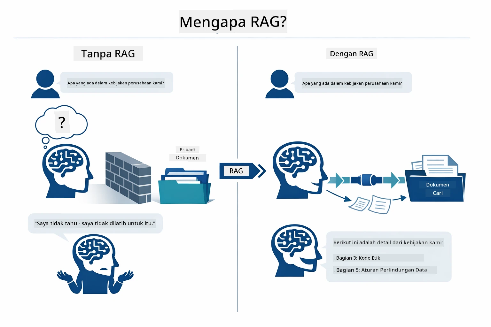

*Diagram ini menunjukkan perbedaan antara LLM standar (yang menebak dari data pelatihan) dan LLM yang ditingkatkan RAG (yang berkonsultasi dengan dokumen Anda terlebih dahulu).*

Berikut bagaimana bagian-bagian itu terhubung dari awal sampai akhir. Pertanyaan pengguna mengalir melalui empat tahap — embedding, pencarian vektor, perakitan konteks, dan pembuatan jawaban — yang masing-masing dibangun dari tahap sebelumnya:


*Diagram ini menunjukkan alur lengkap pipeline RAG — pertanyaan pengguna mengalir melalui embedding, pencarian vektor, perakitan konteks, dan pembuatan jawaban.*

Sisanya dari modul ini memandu tahap demi tahap secara rinci, dengan kode yang dapat Anda jalankan dan modifikasi.

### Pendekatan RAG Mana yang Digunakan Tutorial Ini?

LangChain4j menawarkan tiga cara untuk mengimplementasikan RAG, masing-masing dengan tingkat abstraksi berbeda. Diagram berikut membandingkannya berdampingan:

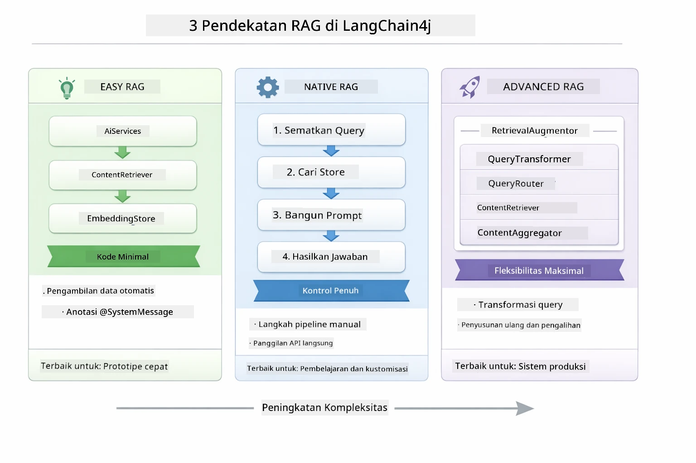

*Diagram ini membandingkan tiga pendekatan RAG LangChain4j — Easy, Native, dan Advanced — menunjukkan komponen utamanya dan kapan digunakan.*

| Pendekatan | Apa yang Dilakukan | Trade-off |
|---|---|---|
| **Easy RAG** | Menghubungkan semuanya secara otomatis melalui `AiServices` dan `ContentRetriever`. Anda anotasi antarmuka, pasang retriever, dan LangChain4j mengatur embedding, pencarian, dan perakitan prompt secara tersembunyi. | Kode minimal, tapi Anda tidak melihat apa yang terjadi setiap tahap. |
| **Native RAG** | Anda memanggil model embedding, mencari ke dalam penyimpanan, membangun prompt, dan membuat jawaban sendiri — satu langkah eksplisit dalam satu waktu. | Lebih banyak kode, tapi setiap tahap terlihat dan dapat dimodifikasi. |
| **Advanced RAG** | Menggunakan framework `RetrievalAugmentor` dengan transformator kueri, router, re-ranker, dan injektor konten yang dapat dipasang untuk pipeline produksi. | Fleksibilitas maksimal, tapi jauh lebih kompleks. |

**Tutorial ini menggunakan pendekatan Native.** Setiap tahap pipeline RAG — embedding kueri, pencarian di vector store, penyusunan konteks, dan pembuatan jawaban — ditulis secara eksplisit dalam [`RagService.java`](../../../03-rag/src/main/java/com/example/langchain4j/rag/service/RagService.java). Ini disengaja: sebagai sumber belajar, lebih penting Anda melihat dan memahami setiap tahap dibandingkan kode yang dipersingkat. Setelah Anda nyaman dengan susunan bagian-bagiannya, Anda bisa beralih ke Easy RAG untuk prototipe cepat atau Advanced RAG untuk sistem produksi.

> **💡 Sudah melihat Easy RAG berjalan?** Modul [Quick Start](../00-quick-start/README.md) mencakup contoh Document Q&A ([`SimpleReaderDemo.java`](../../../00-quick-start/src/main/java/com/example/langchain4j/quickstart/SimpleReaderDemo.java)) yang menggunakan pendekatan Easy RAG — LangChain4j menangani embedding, pencarian, dan perakitan prompt secara otomatis. Modul ini mengambil langkah berikutnya dengan membuka pipeline tersebut agar Anda bisa melihat dan mengontrol setiap tahap secara sendiri.

Diagram berikut menunjukkan pipeline Easy RAG dari contoh Quick Start itu. Perhatikan bagaimana `AiServices` dan `EmbeddingStoreContentRetriever` menyembunyikan semua kompleksitas — Anda memuat dokumen, memasang retriever, dan mendapat jawaban. Pendekatan Native di modul ini membuka setiap langkah tersembunyi tersebut:

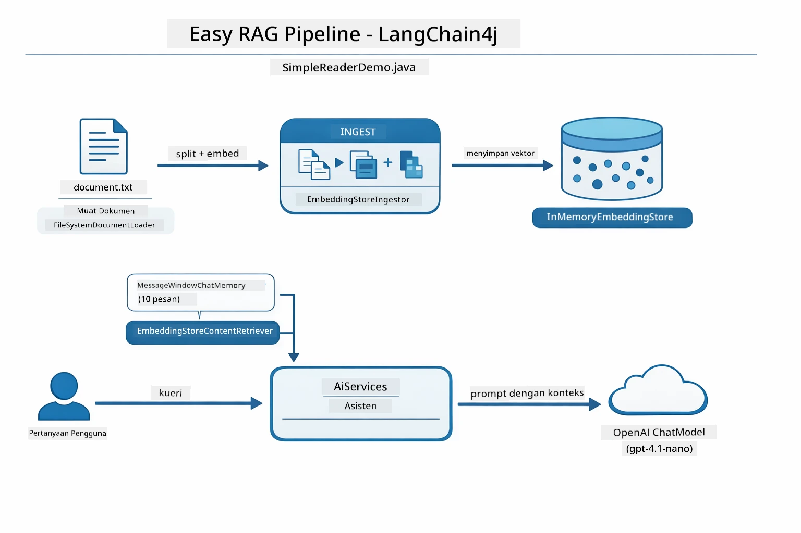

*Diagram ini menunjukkan pipeline Easy RAG dari `SimpleReaderDemo.java`. Bandingkan dengan pendekatan Native yang digunakan modul ini: Easy RAG menyembunyikan embedding, pencarian, dan perakitan prompt di balik `AiServices` dan `ContentRetriever` — Anda memuat dokumen, memasang retriever, dan mendapat jawaban. Pendekatan Native membuka pipeline itu sehingga Anda memanggil setiap tahap (embed, cari, susun konteks, buat jawaban) sendiri, memberikan visibilitas dan kontrol penuh.*

## Cara Kerjanya

Pipeline RAG dalam modul ini terbagi menjadi empat tahap yang berjalan berurutan setiap kali pengguna mengajukan pertanyaan. Pertama, dokumen yang diunggah **diparsing dan dipecah menjadi potongan** yang mudah ditangani. Potongan-potongan tersebut kemudian dikonversi menjadi **embedding vektor** dan disimpan agar bisa dibandingkan secara matematika. Saat kueri datang, sistem melakukan **pencarian semantik** untuk menemukan potongan paling relevan, dan akhirnya melewatkannya sebagai konteks kepada LLM untuk **pembuatan jawaban**. Bagian-bagian berikut menjelaskan setiap tahap dengan kode dan diagram nyata. Mari lihat tahap pertama.

### Pemrosesan Dokumen

[DocumentService.java](../../../03-rag/src/main/java/com/example/langchain4j/rag/service/DocumentService.java)

Saat Anda mengunggah dokumen, sistem memparsingnya (PDF atau teks biasa), menambahkan metadata seperti nama file, lalu memecahnya menjadi potongan — bagian lebih kecil yang muat dengan nyaman dalam jendela konteks model. Potongan ini sedikit tumpang tindih agar konteks pada batas-batas tidak hilang.

```java
// Mengurai file yang diunggah dan membungkusnya dalam Dokumen LangChain4j
Document document = Document.from(content, metadata);

// Membagi menjadi potongan-potongan 300-token dengan tumpang tindih 30-token
DocumentSplitter splitter = DocumentSplitters
    .recursive(300, 30);

List<TextSegment> segments = splitter.split(document);
```
  
Diagram di bawah menunjukkan bagaimana ini bekerja secara visual. Perhatikan bagaimana setiap potongan berbagi beberapa token dengan tetangganya — tumpang tindih 30 token memastikan tidak ada konteks penting yang terlewatkan:

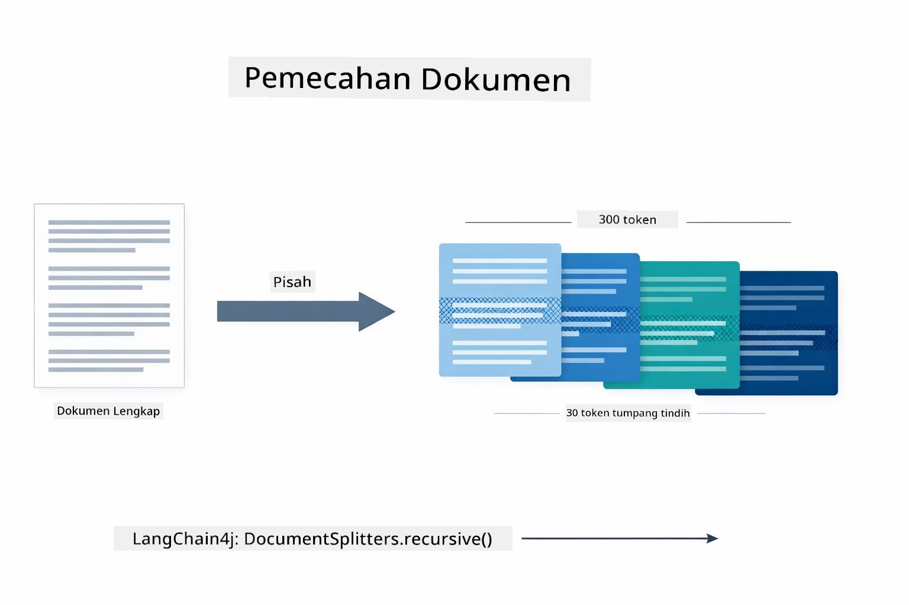

*Diagram ini menunjukkan dokumen dipecah menjadi potongan 300-token dengan tumpang tindih 30-token, menjaga konteks di batas potongan.*

> **🤖 Coba dengan [GitHub Copilot](https://github.com/features/copilot) Chat:** Buka [`DocumentService.java`](../../../03-rag/src/main/java/com/example/langchain4j/rag/service/DocumentService.java) dan tanyakan:  
> - "Bagaimana LangChain4j memecah dokumen menjadi potongan dan mengapa tumpang tindih itu penting?"  
> - "Berapa ukuran potongan optimal untuk berbagai jenis dokumen dan mengapa?"  
> - "Bagaimana menangani dokumen dalam beberapa bahasa atau dengan format khusus?"

### Membuat Embedding

[LangChainRagConfig.java](../../../03-rag/src/main/java/com/example/langchain4j/rag/config/LangChainRagConfig.java)

Setiap potongan dikonversi menjadi representasi numerik yang disebut embedding — pada dasarnya pengubah makna ke angka. Model embedding tidak "cerdas" seperti model chat; ia tidak bisa mengikuti instruksi, bernalar, atau menjawab pertanyaan. Yang bisa dilakukan adalah memetakan teks ke ruang matematis di mana makna serupa berdekatan — "mobil" dekat "automobile", "kebijakan pengembalian" dekat "pengembalian uang saya." Pikirkan model chat sebagai orang yang bisa diajak bicara; model embedding adalah sistem pengarsipan ultra-efisien.

Diagram di bawah memvisualisasikan konsep ini — teks masuk, vektor numerik keluar, dan makna serupa menghasilkan vektor berdekatan:

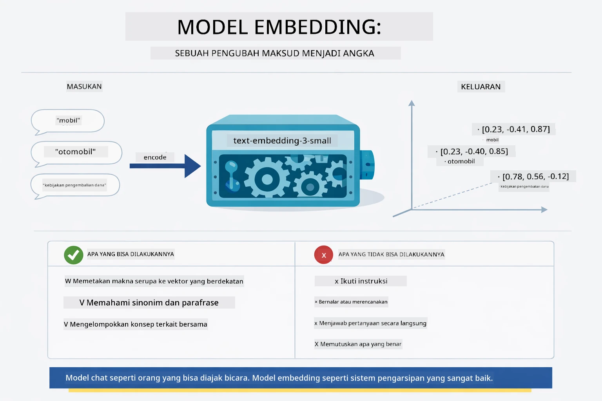

*Diagram ini menunjukkan bagaimana model embedding mengubah teks menjadi vektor numerik, menempatkan makna serupa — seperti "mobil" dan "automobile" — berdekatan dalam ruang vektor.*

```java
@Bean
public EmbeddingModel embeddingModel() {
    return OpenAiOfficialEmbeddingModel.builder()
        .baseUrl(azureOpenAiEndpoint)
        .apiKey(azureOpenAiKey)
        .modelName(azureEmbeddingDeploymentName)
        .build();
}

EmbeddingStore<TextSegment> embeddingStore = 
    new InMemoryEmbeddingStore<>();
```
  
Diagram kelas di bawah menunjukkan dua alur terpisah dalam pipeline RAG dan kelas LangChain4j yang mengimplementasikannya. **Alur ingestasi** (dijalankan sekali saat unggah) memecah dokumen, meng-embed potongan, dan menyimpannya lewat `.addAll()`. **Alur kueri** (dijalankan setiap kali pengguna bertanya) meng-embed pertanyaan, mencari di penyimpanan lewat `.search()`, dan melewatkan konteks yang cocok ke model chat. Kedua alur bertemu di interface `EmbeddingStore<TextSegment>` bersama:

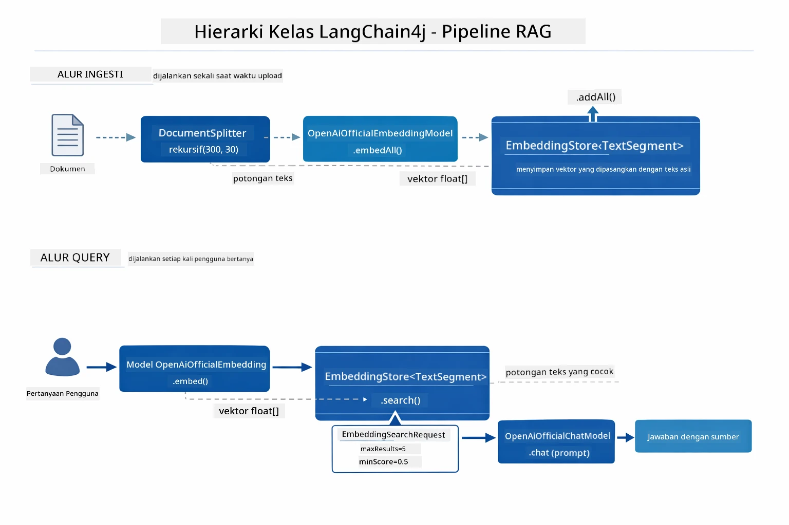

*Diagram ini menunjukkan dua alur dalam pipeline RAG — ingestasi dan kueri — dan bagaimana mereka terhubung melalui EmbeddingStore bersama.*

Setelah embedding disimpan, konten serupa secara alami mengelompok di ruang vektor. Visualisasi di bawah menunjukkan bagaimana dokumen terkait topik berakhir sebagai titik berdekatan, yang memungkinkan pencarian semantik:


*Visualisasi ini menunjukkan bagaimana dokumen terkait mengelompok dalam ruang vektor 3D, dengan topik seperti Dokumen Teknis, Aturan Bisnis, dan FAQ membentuk kelompok berbeda.*

Saat pengguna mencari, sistem mengikuti empat langkah: embedding dokumen sekali, embedding kueri setiap pencarian, membandingkan vektor kueri dengan semua vektor yang disimpan menggunakan kemiripan kosinus, dan mengembalikan potongan dengan skor teratas. Diagram berikut menjelaskan setiap langkah dan kelas LangChain4j yang terlibat:

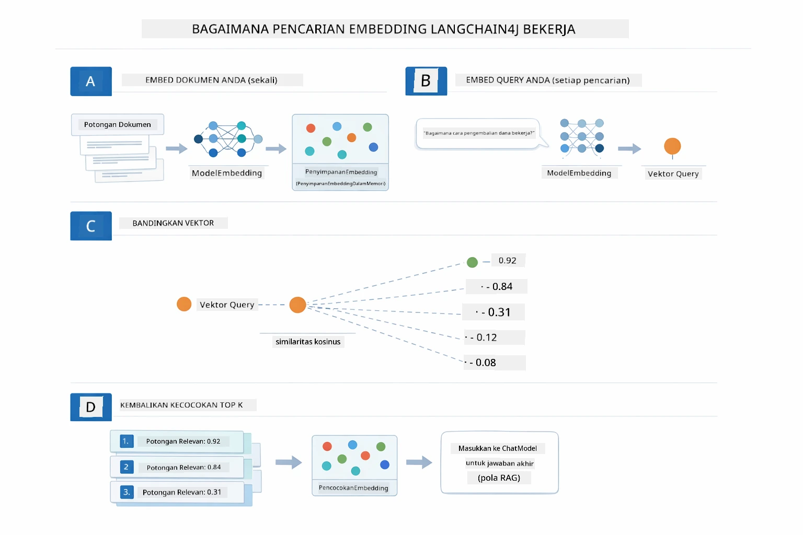

*Diagram ini menunjukkan proses pencarian embedding empat langkah: embed dokumen, embed kueri, bandingkan vektor dengan kemiripan kosinus, dan kembalikan hasil top-K.*

### Pencarian Semantik

[RagService.java](../../../03-rag/src/main/java/com/example/langchain4j/rag/service/RagService.java)

Saat Anda mengajukan pertanyaan, pertanyaan Anda juga diubah menjadi embedding. Sistem membandingkan embedding pertanyaan Anda dengan embedding semua potongan dokumen. Ia menemukan potongan dengan makna paling mirip — bukan hanya kecocokan kata kunci, tapi kemiripan semantik aktual.

```java
Embedding queryEmbedding = embeddingModel.embed(question).content();

EmbeddingSearchRequest searchRequest = EmbeddingSearchRequest.builder()
    .queryEmbedding(queryEmbedding)
    .maxResults(5)
    .minScore(0.5)
    .build();

EmbeddingSearchResult<TextSegment> searchResult = embeddingStore.search(searchRequest);
List<EmbeddingMatch<TextSegment>> matches = searchResult.matches();

for (EmbeddingMatch<TextSegment> match : matches) {
    String relevantText = match.embedded().text();
    double score = match.score();
}
```
  
Diagram di bawah membandingkan pencarian semantik dengan pencarian kata kunci tradisional. Pencarian kata kunci untuk "kendaraan" melewatkan potongan tentang "mobil dan truk," tapi pencarian semantik memahami mereka bermakna sama dan mengembalikannya sebagai hasil dengan skor tinggi:

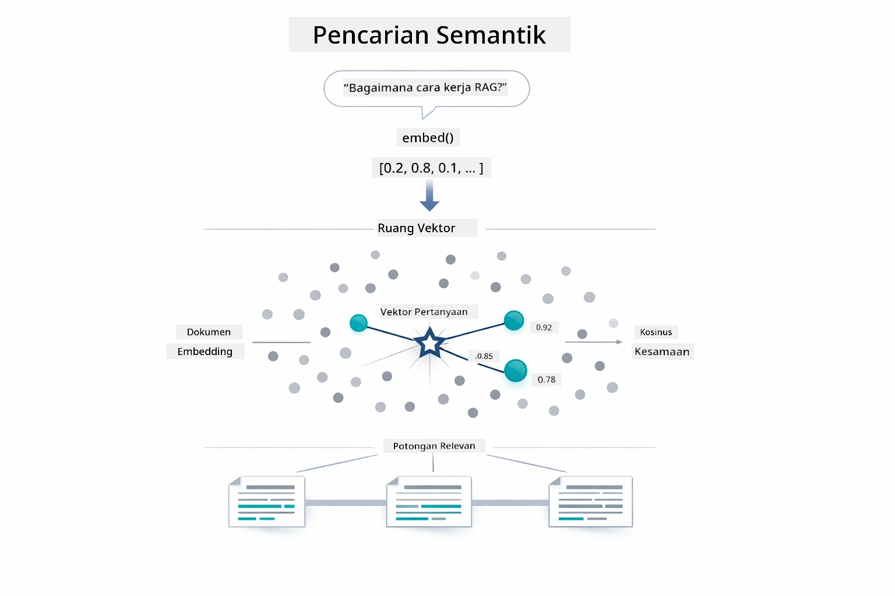

*Diagram ini membandingkan pencarian berbasis kata kunci dengan pencarian semantik, menunjukkan bagaimana pencarian semantik mengambil konten terkait konsep meskipun kata kunci tepat berbeda.*
Di balik layar, kesamaan diukur menggunakan cosine similarity — pada dasarnya menanyakan "apakah dua panah ini menunjuk ke arah yang sama?" Dua potongan bisa menggunakan kata-kata yang benar-benar berbeda, tetapi jika mereka bermakna sama maka vektor mereka menunjuk ke arah yang sama dan skor mendekati 1.0:

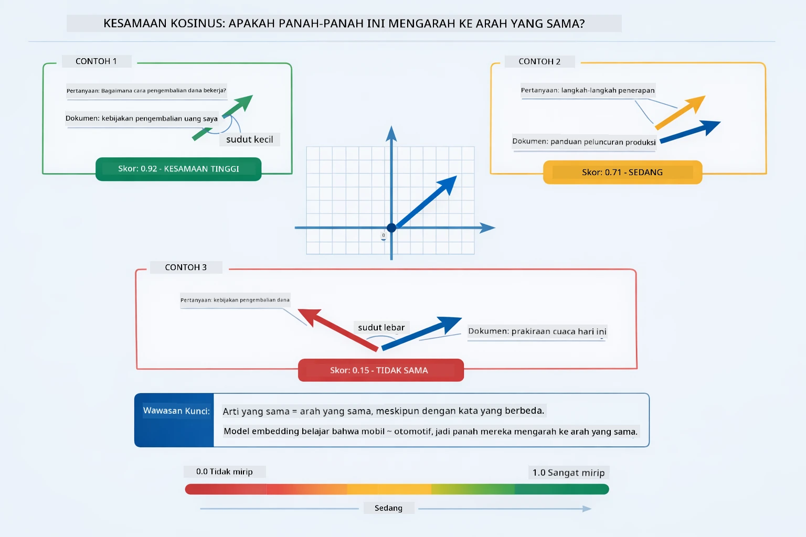

*Diagram ini menggambarkan cosine similarity sebagai sudut antara vektor embedding — vektor yang lebih sejajar mendapat skor mendekati 1.0, yang menunjukkan kesamaan semantik yang lebih tinggi.*

> **🤖 Coba dengan [GitHub Copilot](https://github.com/features/copilot) Chat:** Buka [`RagService.java`](../../../03-rag/src/main/java/com/example/langchain4j/rag/service/RagService.java) dan tanyakan:
> - "Bagaimana cara kerja pencarian kesamaan dengan embeddings dan apa yang menentukan skor?"
> - "Ambang batas kesamaan apa yang harus saya gunakan dan bagaimana pengaruhnya terhadap hasil?"
> - "Bagaimana saya menangani kasus di mana tidak ditemukan dokumen yang relevan?"

### Generasi Jawaban

[RagService.java](../../../03-rag/src/main/java/com/example/langchain4j/rag/service/RagService.java)

Potongan paling relevan dirangkai menjadi prompt terstruktur yang mencakup instruksi eksplisit, konteks yang diambil, dan pertanyaan pengguna. Model membaca potongan spesifik tersebut dan menjawab berdasarkan informasi itu — model hanya dapat menggunakan apa yang ada di depannya, yang mencegah halusinasi.

```java
String context = matches.stream()
    .map(match -> match.embedded().text())
    .collect(Collectors.joining("\n\n"));

String prompt = String.format("""
    Answer the question based on the following context.
    If the answer cannot be found in the context, say so.

    Context:
    %s

    Question: %s

    Answer:""", context, request.question());

String answer = chatModel.chat(prompt);
```

Diagram di bawah menunjukkan perakitan ini dalam aksi — potongan dengan skor tertinggi dari langkah pencarian disisipkan ke dalam template prompt, dan `OpenAiOfficialChatModel` menghasilkan jawaban yang berdasar:

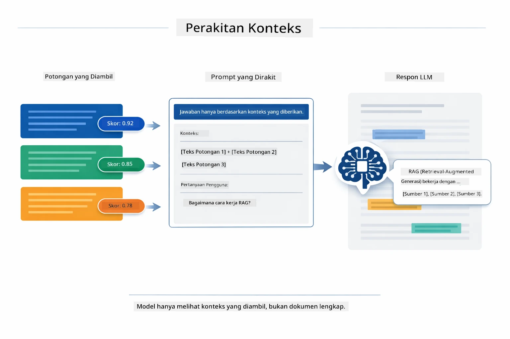

*Diagram ini menunjukkan bagaimana potongan dengan skor tertinggi dirangkai menjadi prompt terstruktur, memungkinkan model menghasilkan jawaban yang berdasar dari data Anda.*

## Menjalankan Aplikasi

**Verifikasi deployment:**

Pastikan file `.env` ada di direktori root dengan kredensial Azure (dibuat selama Modul 01). Jalankan ini dari direktori modul (`03-rag/`):

**Bash:**
```bash
cat ../.env  # Harus menampilkan AZURE_OPENAI_ENDPOINT, API_KEY, DEPLOYMENT
```

**PowerShell:**
```powershell
Get-Content ..\.env  # Harus menampilkan AZURE_OPENAI_ENDPOINT, API_KEY, DEPLOYMENT
```

**Mulai aplikasi:**

> **Catatan:** Jika Anda sudah menjalankan semua aplikasi menggunakan `./start-all.sh` dari direktori root (seperti yang dijelaskan di Modul 01), modul ini sudah berjalan di port 8081. Anda dapat melewati perintah mulai di bawah dan langsung ke http://localhost:8081.

**Opsi 1: Menggunakan Spring Boot Dashboard (Disarankan untuk pengguna VS Code)**

Dev container menyertakan ekstensi Spring Boot Dashboard, yang menyediakan antarmuka visual untuk mengelola semua aplikasi Spring Boot. Anda dapat menemukannya di Activity Bar di sisi kiri VS Code (cari ikon Spring Boot).

Dari Spring Boot Dashboard, Anda dapat:
- Melihat semua aplikasi Spring Boot yang tersedia di workspace
- Memulai/berhenti aplikasi dengan satu klik
- Melihat log aplikasi secara real time
- Memantau status aplikasi

Cukup klik tombol play di samping "rag" untuk memulai modul ini, atau mulai semua modul sekaligus.


*Tangkapan layar ini menunjukkan Spring Boot Dashboard di VS Code, tempat Anda dapat memulai, menghentikan, dan memantau aplikasi secara visual.*

**Opsi 2: Menggunakan skrip shell**

Mulai semua aplikasi web (modul 01-04):

**Bash:**
```bash
cd ..  # Dari direktori root
./start-all.sh
```

**PowerShell:**
```powershell
cd ..  # Dari direktori root
.\start-all.ps1
```

Atau mulai hanya modul ini:

**Bash:**
```bash
cd 03-rag
./start.sh
```

**PowerShell:**
```powershell
cd 03-rag
.\start.ps1
```

Kedua skrip secara otomatis memuat variabel lingkungan dari file `.env` root dan akan membangun file JAR jika belum ada.

> **Catatan:** Jika Anda lebih suka membangun semua modul secara manual sebelum memulai:
>
> **Bash:**
> ```bash
> cd ..  # Go to root directory
> mvn clean package -DskipTests
> ```

> **PowerShell:**
> ```powershell
> cd ..  # Go to root directory
> mvn clean package -DskipTests
> ```

Buka http://localhost:8081 di browser Anda.

**Untuk menghentikan:**

**Bash:**
```bash
./stop.sh  # Modul ini saja
# Atau
cd .. && ./stop-all.sh  # Semua modul
```

**PowerShell:**
```powershell
.\stop.ps1  # Hanya modul ini
# Atau
cd ..; .\stop-all.ps1  # Semua modul
```

## Menggunakan Aplikasi

Aplikasi menyediakan antarmuka web untuk mengunggah dokumen dan mengajukan pertanyaan.

<a href="images/rag-homepage.png"></a>

*Tangkapan layar ini menunjukkan antarmuka aplikasi RAG di mana Anda mengunggah dokumen dan mengajukan pertanyaan.*

### Unggah Dokumen

Mulailah dengan mengunggah dokumen — file TXT paling cocok untuk pengujian. `sample-document.txt` disediakan di direktori ini yang berisi informasi tentang fitur LangChain4j, implementasi RAG, dan praktik terbaik — sempurna untuk pengujian sistem.

Sistem memproses dokumen Anda, memecahnya menjadi potongan-potongan, dan membuat embedding untuk setiap potongan. Ini terjadi secara otomatis saat Anda mengunggah.

### Ajukan Pertanyaan

Sekarang ajukan pertanyaan spesifik tentang isi dokumen. Cobalah sesuatu yang faktual dan jelas tercantum dalam dokumen. Sistem mencari potongan relevan, menyertakannya dalam prompt, dan menghasilkan jawaban.

### Periksa Referensi Sumber

Perhatikan setiap jawaban menyertakan referensi sumber dengan skor kesamaan. Skor ini (0 sampai 1) menunjukkan seberapa relevan setiap potongan terhadap pertanyaan Anda. Skor lebih tinggi berarti kecocokan yang lebih baik. Ini memungkinkan Anda memverifikasi jawaban terhadap bahan sumber.

<a href="images/rag-query-results.png"></a>

*Tangkapan layar ini menunjukkan hasil query dengan jawaban yang dihasilkan, referensi sumber, dan skor relevansi untuk setiap potongan yang diambil.*

### Bereksperimen dengan Pertanyaan

Coba jenis pertanyaan berbeda:
- Fakta spesifik: "Apa topik utama?"
- Perbandingan: "Apa perbedaan antara X dan Y?"
- Ringkasan: "Ringkas poin penting tentang Z"

Perhatikan bagaimana skor relevansi berubah berdasarkan seberapa baik pertanyaan Anda cocok dengan isi dokumen.

## Konsep Kunci

### Strategi Chunking

Dokumen dibagi menjadi potongan 300 token dengan tumpang tindih 30 token. Keseimbangan ini memastikan setiap potongan memiliki konteks cukup untuk bermakna sambil tetap kecil agar beberapa potongan bisa dimasukkan ke dalam prompt.

### Skor Kesamaan

Setiap potongan yang diambil disertai skor kesamaan antara 0 dan 1 yang menunjukkan seberapa dekat kecocokannya dengan pertanyaan pengguna. Diagram di bawah memvisualisasikan rentang skor dan bagaimana sistem menggunakannya untuk menyaring hasil:

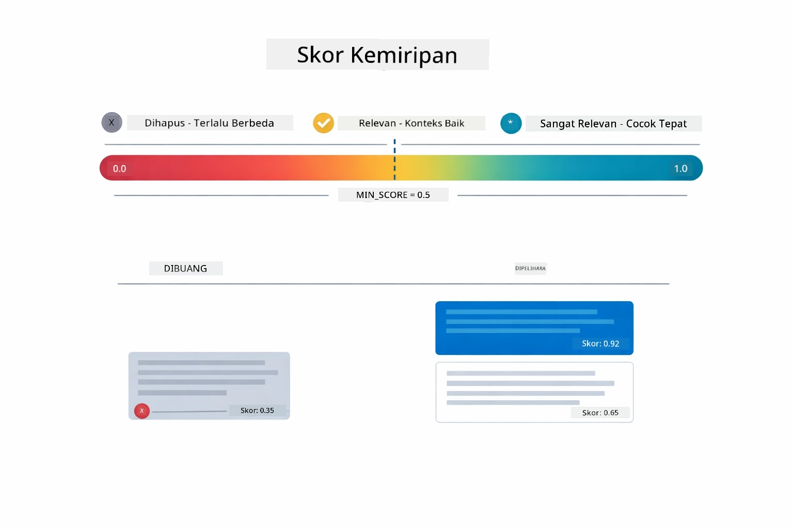

*Diagram ini menunjukkan rentang skor dari 0 sampai 1, dengan ambang minimum 0.5 yang menyaring potongan tidak relevan.*

Skor berkisar dari 0 sampai 1:
- 0.7-1.0: Sangat relevan, cocok persis
- 0.5-0.7: Relevan, konteks baik
- Di bawah 0.5: Disaring, terlalu tidak mirip

Sistem hanya mengambil potongan di atas ambang minimum untuk memastikan kualitas.

Embedding bekerja baik saat makna mengelompok dengan jelas, tetapi memiliki titik buta. Diagram di bawah menggambarkan mode kegagalan umum — potongan terlalu besar menghasilkan vektor kabur, potongan terlalu kecil kurang konteks, istilah ambigu menunjuk ke beberapa klaster, dan pencocokan persis (ID, nomor bagian) sama sekali tidak bekerja dengan embedding:

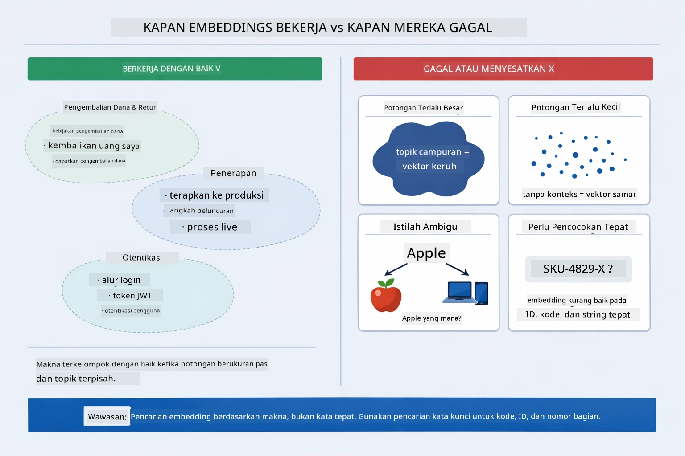

*Diagram ini menunjukkan mode kegagalan embedding umum: potongan terlalu besar, potongan terlalu kecil, istilah ambigu yang menunjuk ke beberapa klaster, dan pencarian kecocokan persis seperti ID.*

### Penyimpanan Dalam Memori

Modul ini menggunakan penyimpanan dalam memori untuk kesederhanaan. Ketika Anda memulai ulang aplikasi, dokumen yang diunggah hilang. Sistem produksi menggunakan database vektor persisten seperti Qdrant atau Azure AI Search.

### Manajemen Jendela Konteks

Setiap model memiliki jendela konteks maksimum. Anda tidak bisa memasukkan semua potongan dari dokumen besar. Sistem mengambil N potongan paling relevan terbanyak (default 5) agar tetap dalam batas sambil menyediakan cukup konteks untuk jawaban akurat.

## Kapan RAG Penting

RAG tidak selalu menjadi pendekatan yang tepat. Panduan keputusan di bawah membantu Anda menentukan kapan RAG menambah nilai dibandingkan kapan pendekatan lebih sederhana — seperti menyertakan konten langsung dalam prompt atau mengandalkan pengetahuan bawaan model — sudah cukup:

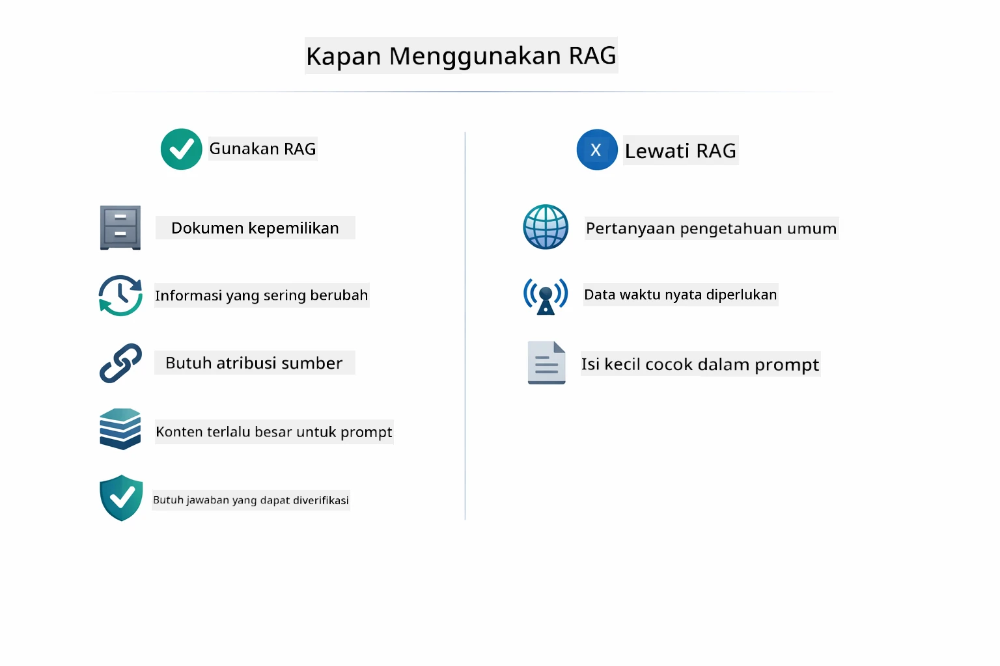

*Diagram ini menunjukkan panduan keputusan kapan RAG menambah nilai versus kapan pendekatan lebih sederhana sudah memadai.*

## Langkah Selanjutnya

**Modul Berikutnya:** [04-tools - Agen AI dengan Tools](../04-tools/README.md)

---

**Navigasi:** [← Sebelumnya: Modul 02 - Prompt Engineering](../02-prompt-engineering/README.md) | [Kembali ke Utama](../README.md) | [Berikutnya: Modul 04 - Tools →](../04-tools/README.md)

---

<!-- CO-OP TRANSLATOR DISCLAIMER START -->
**Penafian**:  
Dokumen ini telah diterjemahkan menggunakan layanan terjemahan AI [Co-op Translator](https://github.com/Azure/co-op-translator). Meskipun kami berupaya mencapai ketepatan, harap diketahui bahwa terjemahan otomatis mungkin mengandung kesalahan atau ketidakakuratan. Dokumen asli dalam bahasa aslinya harus dianggap sebagai sumber yang sahih. Untuk informasi penting, disarankan menggunakan terjemahan manusia profesional. Kami tidak bertanggung jawab atas kesalahpahaman atau salah interpretasi yang timbul dari penggunaan terjemahan ini.
<!-- CO-OP TRANSLATOR DISCLAIMER END -->