# Modul 04: Agen AI dengan Alat

## Daftar Isi

- [Video Walkthrough](../../../04-tools)
- [Apa yang Akan Anda Pelajari](../../../04-tools)
- [Prasyarat](../../../04-tools)
- [Memahami Agen AI dengan Alat](../../../04-tools)
- [Cara Kerja Pemanggilan Alat](../../../04-tools)
  - [Definisi Alat](../../../04-tools)
  - [Pengambilan Keputusan](../../../04-tools)
  - [Eksekusi](../../../04-tools)
  - [Pembuatan Respons](../../../04-tools)
  - [Arsitektur: Spring Boot Auto-Wiring](../../../04-tools)
- [Merangkai Alat](../../../04-tools)
- [Menjalankan Aplikasi](../../../04-tools)
- [Menggunakan Aplikasi](../../../04-tools)
  - [Mencoba Penggunaan Alat Sederhana](../../../04-tools)
  - [Menguji Merangkai Alat](../../../04-tools)
  - [Melihat Alur Percakapan](../../../04-tools)
  - [Bereksperimen dengan Permintaan Berbeda](../../../04-tools)
- [Konsep Kunci](../../../04-tools)
  - [Pola ReAct (Reasoning and Acting)](../../../04-tools)
  - [Deskripsi Alat itu Penting](../../../04-tools)
  - [Manajemen Sesi](../../../04-tools)
  - [Penanganan Kesalahan](../../../04-tools)
- [Alat yang Tersedia](../../../04-tools)
- [Kapan Menggunakan Agen Berbasis Alat](../../../04-tools)
- [Alat vs RAG](../../../04-tools)
- [Langkah Berikutnya](../../../04-tools)

## Video Walkthrough

Tonton sesi langsung ini yang menjelaskan cara memulai dengan modul ini:

<a href="https://www.youtube.com/watch?v=O_J30kZc0rw"></a>

## Apa yang Akan Anda Pelajari

Sejauh ini, Anda sudah belajar bagaimana berinteraksi dengan AI, menyusun prompt secara efektif, dan memberikan dasar jawaban dari dokumen Anda. Namun ada keterbatasan mendasar: model bahasa hanya dapat menghasilkan teks. Model tidak bisa memeriksa cuaca, melakukan perhitungan, mengakses database, atau berinteraksi dengan sistem eksternal.

Alat mengubah hal ini. Dengan memberi model akses ke fungsi yang dapat dipanggil, Anda mengubahnya dari generator teks menjadi agen yang dapat mengambil tindakan. Model memutuskan kapan membutuhkan alat, alat mana yang dipakai, dan parameter apa yang dikirim. Kode Anda mengeksekusi fungsi dan mengembalikan hasilnya. Model menggabungkan hasil tersebut ke dalam responsnya.

## Prasyarat

- Telah menyelesaikan [Modul 01 - Pengantar](../01-introduction/README.md) (sumber daya Azure OpenAI sudah dipasang)
- Disarankan menyelesaikan modul sebelumnya (modul ini merujuk pada [konsep RAG dari Modul 03](../03-rag/README.md) dalam perbandingan Alat vs RAG)
- File `.env` di direktori root berisi kredensial Azure (dibuat oleh `azd up` di Modul 01)

> **Catatan:** Jika Anda belum menyelesaikan Modul 01, ikuti instruksi pemasangan di sana terlebih dahulu.

## Memahami Agen AI dengan Alat

> **📝 Catatan:** Istilah "agen" di modul ini merujuk pada asisten AI yang diperkaya dengan kemampuan pemanggilan alat. Ini berbeda dengan pola **Agentic AI** (agen otonom dengan perencanaan, memori, dan penalaran bertahap) yang akan kita bahas di [Modul 05: MCP](../05-mcp/README.md).

Tanpa alat, model bahasa hanya bisa menghasilkan teks berdasarkan data pelatihannya. Tanya cuaca saat ini, ia hanya menebak. Beri alat, model bisa memanggil API cuaca, melakukan perhitungan, atau mengakses database — lalu menggabungkan hasil nyata itu ke responsnya.

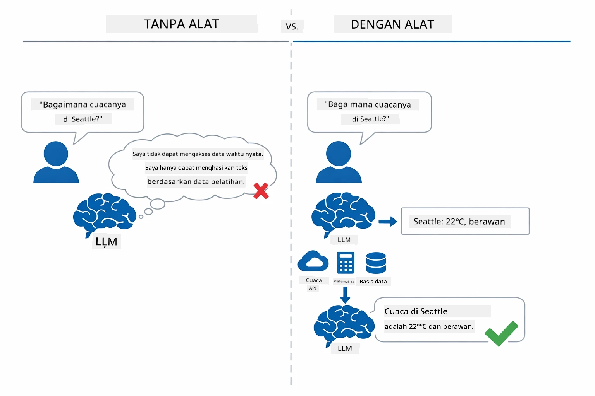

*Tanpa alat model hanya bisa menebak — dengan alat ia dapat memanggil API, melakukan perhitungan, dan mengembalikan data waktu nyata.*

Agen AI dengan alat mengikuti pola **Reasoning and Acting (ReAct)**. Model tidak hanya merespons — ia berpikir tentang apa yang dibutuhkan, bertindak dengan memanggil alat, mengamati hasil, lalu memutuskan apakah bertindak lagi atau memberikan jawaban akhir:

1. **Reason** — Agen menganalisis pertanyaan pengguna dan menentukan informasi yang diperlukan
2. **Act** — Agen memilih alat yang tepat, menghasilkan parameter yang benar, dan memanggilnya
3. **Observe** — Agen menerima output alat dan mengevaluasi hasilnya
4. **Repeat or Respond** — Jika perlu data tambahan, agen mengulang; jika tidak, menyusun jawaban dalam bahasa alami

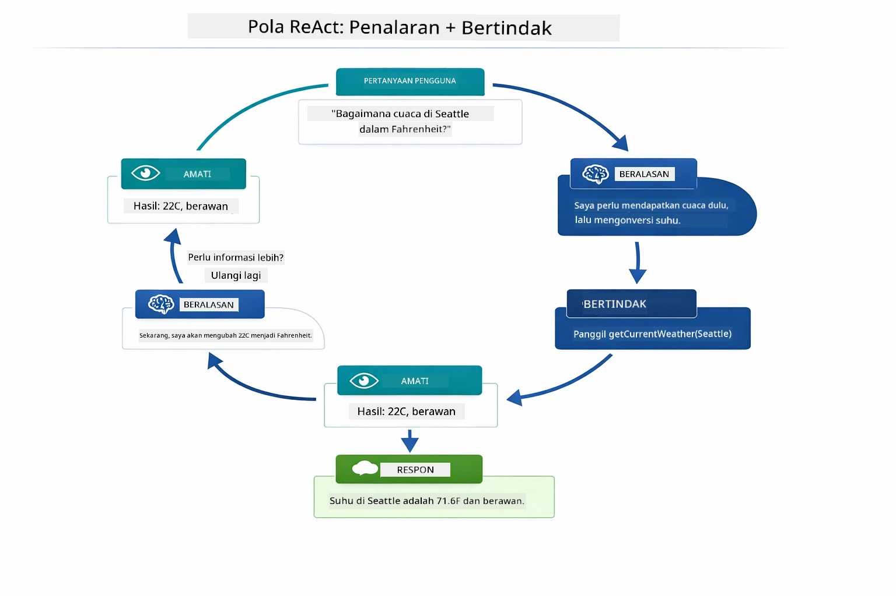

*Siklus ReAct — agen menganalisis aksi yang harus dilakukan, bertindak dengan memanggil alat, mengamati hasil, dan mengulangi hingga dapat memberikan jawaban akhir.*

Ini terjadi secara otomatis. Anda mendefinisikan alat dan deskripsinya. Model menangani pengambilan keputusan kapan dan bagaimana menggunakannya.

## Cara Kerja Pemanggilan Alat

### Definisi Alat

[WeatherTool.java](../../../04-tools/src/main/java/com/example/langchain4j/agents/tools/WeatherTool.java) | [TemperatureTool.java](../../../04-tools/src/main/java/com/example/langchain4j/agents/tools/TemperatureTool.java)

Anda mendefinisikan fungsi dengan deskripsi yang jelas dan spesifikasi parameter. Model melihat deskripsi ini dalam prompt sistem dan memahami fungsi masing-masing alat.

```java
@Component
public class WeatherTool {
    
    @Tool("Get the current weather for a location")
    public String getCurrentWeather(@P("Location name") String location) {
        // Logika pencarian cuaca Anda
        return "Weather in " + location + ": 22°C, cloudy";
    }
}

@AiService
public interface Assistant {
    String chat(@MemoryId String sessionId, @UserMessage String message);
}

// Asisten secara otomatis dihubungkan oleh Spring Boot dengan:
// - Bean ChatModel
// - Semua metode @Tool dari kelas @Component
// - ChatMemoryProvider untuk manajemen sesi
```

Diagram berikut memecah setiap anotasi dan menunjukkan bagaimana setiap bagian membantu AI memahami kapan memanggil alat dan argumen apa yang diberikan:

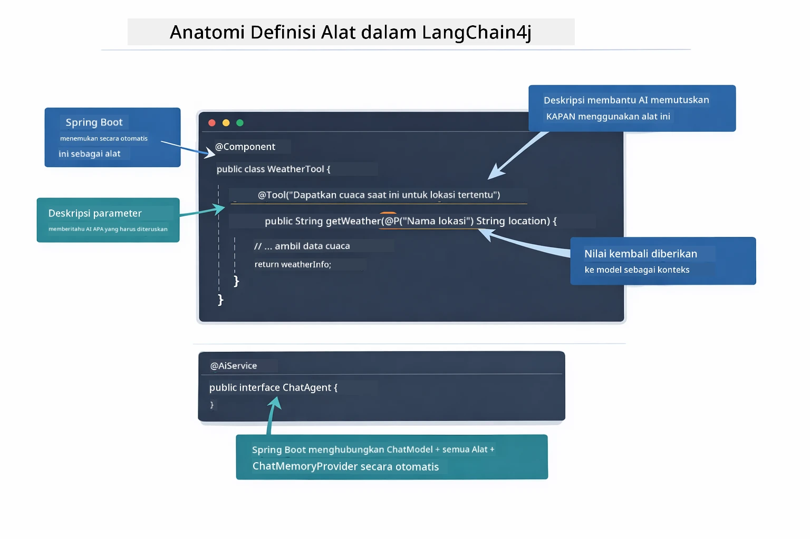

*Anatomi definisi alat — @Tool memberi tahu AI kapan menggunakannya, @P mendeskripsikan setiap parameter, dan @AiService menghubungkan semuanya saat startup.*

> **🤖 Coba dengan [GitHub Copilot](https://github.com/features/copilot) Chat:** Buka [`WeatherTool.java`](../../../04-tools/src/main/java/com/example/langchain4j/agents/tools/WeatherTool.java) dan tanyakan:
> - "Bagaimana saya mengintegrasikan API cuaca nyata seperti OpenWeatherMap menggantikan data tiruan?"
> - "Apa yang membuat deskripsi alat bagus sehingga membantu AI menggunakannya dengan benar?"
> - "Bagaimana menangani kesalahan API dan batasan rate dalam implementasi alat?"

### Pengambilan Keputusan

Saat pengguna bertanya "Bagaimana cuaca di Seattle?", model tidak memilih alat secara acak. Ia membandingkan maksud pengguna dengan setiap deskripsi alat yang tersedia, memberi nilai relevansi, dan memilih yang paling cocok. Kemudian ia menghasilkan panggilan fungsi terstruktur dengan parameter yang tepat — dalam contoh ini, mengatur `location` ke `"Seattle"`.

Jika tidak ada alat yang cocok dengan permintaan pengguna, model kembali menjawab dari pengetahuannya sendiri. Jika ada beberapa alat cocok, model memilih yang paling spesifik.

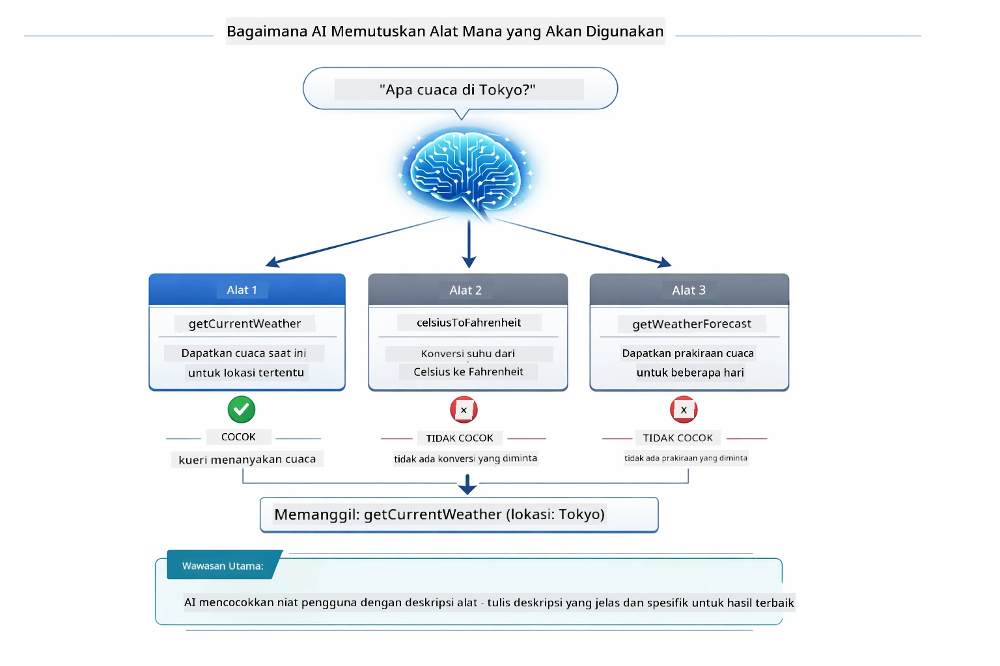

*Model mengevaluasi semua alat tersedia terhadap maksud pengguna dan memilih yang paling cocok — ini sebabnya menulis deskripsi alat yang jelas dan spesifik sangat penting.*

### Eksekusi

[AgentService.java](../../../04-tools/src/main/java/com/example/langchain4j/agents/service/AgentService.java)

Spring Boot secara otomatis mengalirkan interface deklaratif `@AiService` dengan semua alat terdaftar, dan LangChain4j mengeksekusi panggilan alat secara otomatis. Di balik layar, panggilan alat lengkap berjalan melalui enam tahap — dari pertanyaan bahasa alami pengguna sampai jawaban bahasa alami kembali:

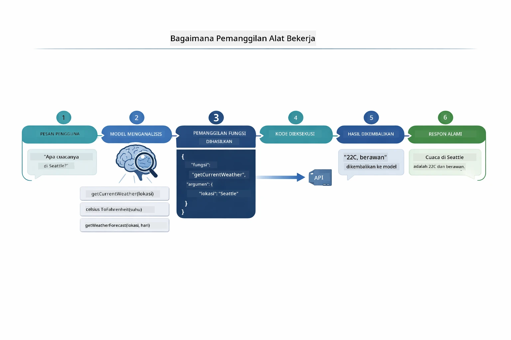

*Alur lengkap — pengguna mengajukan pertanyaan, model memilih alat, LangChain4j mengeksekusi alat, dan model menggabungkan hasilnya ke respons alami.*

Jika Anda menjalankan [ToolIntegrationDemo](../../../00-quick-start/src/main/java/com/example/langchain4j/quickstart/ToolIntegrationDemo.java) di Modul 00, Anda sudah melihat pola ini beraksi — alat `Calculator` juga dipanggil dengan cara yang sama. Diagram urutan di bawah menunjukkan persis apa yang terjadi di balik layar selama demo:

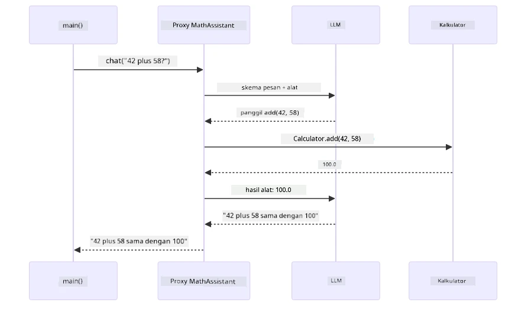

*Loop pemanggilan alat dari demo Quick Start — `AiServices` mengirimkan pesan dan skema alat ke LLM, LLM membalas dengan panggilan fungsi seperti `add(42, 58)`, LangChain4j mengeksekusi metode `Calculator` secara lokal, dan mengembalikan hasil untuk jawaban akhir.*

> **🤖 Coba dengan [GitHub Copilot](https://github.com/features/copilot) Chat:** Buka [`AgentService.java`](../../../04-tools/src/main/java/com/example/langchain4j/agents/service/AgentService.java) dan tanyakan:
> - "Bagaimana pola ReAct bekerja dan mengapa efektif untuk agen AI?"
> - "Bagaimana agen memutuskan alat mana yang digunakan dan dalam urutan apa?"
> - "Apa yang terjadi jika eksekusi alat gagal - bagaimana menangani kesalahan dengan baik?"

### Pembuatan Respons

Model menerima data cuaca dan memformatnya menjadi respons bahasa alami untuk pengguna.

### Arsitektur: Spring Boot Auto-Wiring

Modul ini menggunakan integrasi LangChain4j dengan Spring Boot melalui interface deklaratif `@AiService`. Saat startup, Spring Boot menemukan setiap `@Component` yang memiliki metode `@Tool`, bean `ChatModel`, dan `ChatMemoryProvider` — lalu mengalirkan semuanya ke satu interface `Assistant` tanpa kode boilerplate.

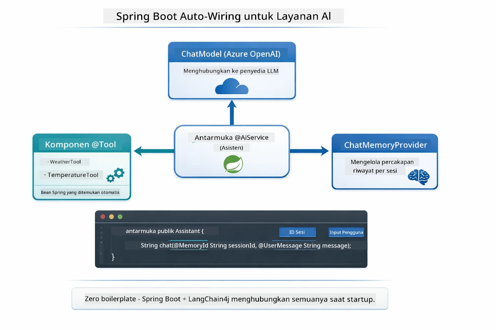

*Interface @AiService menggabungkan ChatModel, komponen alat, dan penyedia memori — Spring Boot menangani pengaliran otomatis.*

Berikut siklus lengkap permintaan sebagai diagram urutan — dari permintaan HTTP lewat controller, service, proxy auto-wired, sampai eksekusi alat dan kembali:

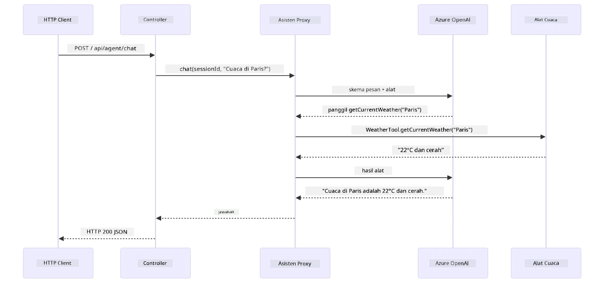

*Siklus lengkap permintaan Spring Boot — permintaan HTTP mengalir melalui controller dan service ke proxy Assistant auto-wired, yang mengorkestrasi LLM dan pemanggilan alat secara otomatis.*

Manfaat utama pendekatan ini:

- **Spring Boot auto-wiring** — ChatModel dan alat otomatis dimasukkan
- **Pola @MemoryId** — Manajemen memori berbasis sesi otomatis
- **Satu instance** — Assistant dibuat sekali dan dipakai ulang untuk kinerja lebih baik
- **Eksekusi tipe aman** — Metode Java dipanggil langsung dengan konversi tipe
- **Orkestrasi multi-putaran** — Menangani perangkainan alat secara otomatis
- **Tanpa boilerplate** — Tidak perlu panggilan manual `AiServices.builder()` atau HashMap memori

Pendekatan alternatif (manual `AiServices.builder()`) membutuhkan kode lebih banyak dan kehilangan manfaat integrasi Spring Boot.

## Merangkai Alat

**Merangkai Alat** — Kekuatan sesungguhnya agen berbasis alat terlihat saat satu pertanyaan memerlukan beberapa alat. Tanya "Bagaimana cuaca di Seattle dalam Fahrenheit?" dan agen secara otomatis menggabungkan dua alat: pertama memanggil `getCurrentWeather` untuk suhu dalam Celsius, lalu meneruskan hasil itu ke `celsiusToFahrenheit` untuk konversi — semua dalam satu langkah percakapan.

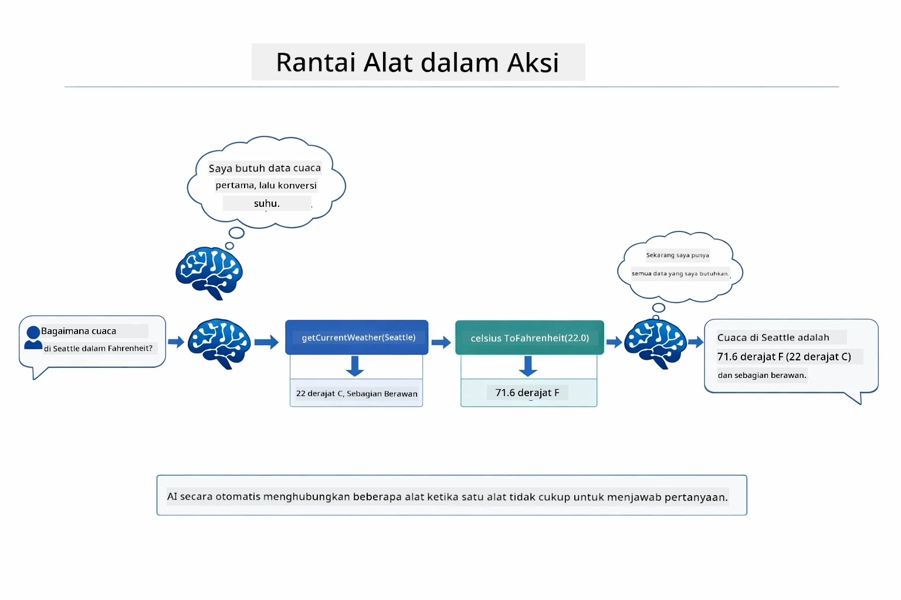

*Merangkai alat sedang berjalan — agen memanggil getCurrentWeather dulu, lalu mengalirkan hasil Celsius ke celsiusToFahrenheit, dan memberikan jawaban gabungan.*

**Penanganan Gagal dengan Anggun** — Tanya cuaca di kota yang tidak ada dalam data tiruan. Alat mengembalikan pesan kesalahan, dan AI menjelaskan bahwa ia tidak bisa membantu daripada mengalami crash. Alat gagal dengan aman. Diagram berikut membandingkan dua pendekatan — dengan penanganan kesalahan yang tepat, agen menangkap pengecualian dan merespon dengan penjelasan, sementara tanpa penanganan aplikasi keseluruhan crash:

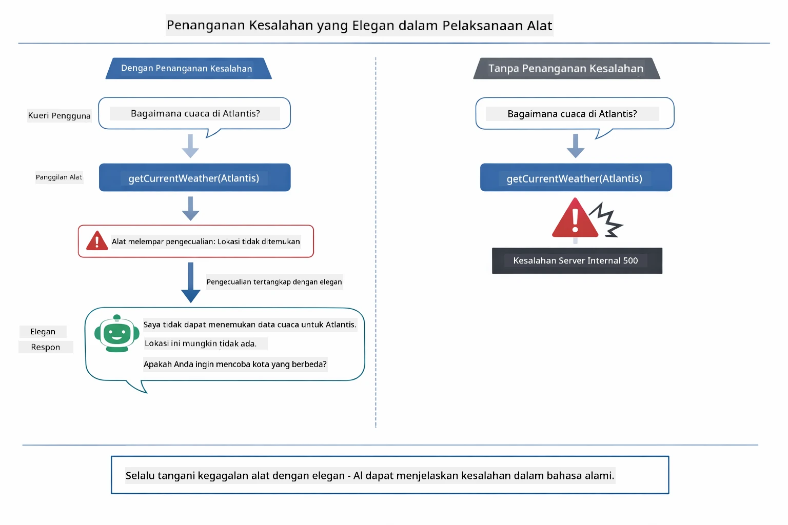

*Saat alat gagal, agen menangkap kesalahan dan merespon dengan penjelasan yang membantu daripada mengalami crash.*

Ini terjadi dalam satu langkah percakapan. Agen mengorkestrasi banyak panggilan alat secara mandiri.

## Menjalankan Aplikasi

**Verifikasi pemasangan:**

Pastikan file `.env` ada di direktori root berisi kredensial Azure (dibuat saat Modul 01). Jalankan ini dari direktori modul (`04-tools/`):

**Bash:**
```bash
cat ../.env  # Harus menampilkan AZURE_OPENAI_ENDPOINT, API_KEY, DEPLOYMENT
```

**PowerShell:**
```powershell
Get-Content ..\.env  # Harus menunjukkan AZURE_OPENAI_ENDPOINT, API_KEY, DEPLOYMENT
```

**Mulai aplikasi:**

> **Catatan:** Jika Anda sudah menjalankan semua aplikasi menggunakan `./start-all.sh` dari direktori root (seperti dijelaskan di Modul 01), modul ini sudah berjalan di port 8084. Anda bisa melewati perintah mulai di bawah dan langsung menuju http://localhost:8084.

**Opsi 1: Menggunakan Spring Boot Dashboard (Disarankan untuk pengguna VS Code)**

Dev container menyertakan ekstensi Spring Boot Dashboard, yang menyediakan antarmuka visual untuk mengelola semua aplikasi Spring Boot. Anda dapat menemukannya di Activity Bar di sisi kiri VS Code (cari ikon Spring Boot).

Dari Spring Boot Dashboard, Anda dapat:
- Melihat semua aplikasi Spring Boot yang tersedia di workspace
- Memulai/menghentikan aplikasi dengan satu klik
- Melihat log aplikasi secara real-time
- Memantau status aplikasi
Cukup klik tombol putar di samping "tools" untuk memulai modul ini, atau mulai semua modul sekaligus.

Ini tampilan Spring Boot Dashboard di VS Code:


*Spring Boot Dashboard di VS Code — mulai, hentikan, dan pantau semua modul dari satu tempat*

**Opsi 2: Menggunakan skrip shell**

Mulai semua aplikasi web (modul 01-04):

**Bash:**
```bash
cd ..  # Dari direktori root
./start-all.sh
```

**PowerShell:**
```powershell
cd ..  # Dari direktori root
.\start-all.ps1
```

Atau mulai hanya modul ini:

**Bash:**
```bash
cd 04-tools
./start.sh
```

**PowerShell:**
```powershell
cd 04-tools
.\start.ps1
```

Kedua skrip secara otomatis memuat variabel lingkungan dari file `.env` di root dan akan membangun JAR jika belum ada.

> **Catatan:** Jika Anda lebih suka membangun semua modul secara manual sebelum memulai:
>
> **Bash:**
> ```bash
> cd ..  # Go to root directory
> mvn clean package -DskipTests
> ```
>
> **PowerShell:**
> ```powershell
> cd ..  # Go to root directory
> mvn clean package -DskipTests
> ```

Buka http://localhost:8084 di peramban Anda.

**Untuk menghentikan:**

**Bash:**
```bash
./stop.sh  # Hanya modul ini
# Atau
cd .. && ./stop-all.sh  # Semua modul
```

**PowerShell:**
```powershell
.\stop.ps1  # Hanya modul ini
# Atau
cd ..; .\stop-all.ps1  # Semua modul
```

## Menggunakan Aplikasi

Aplikasi menyediakan antarmuka web di mana Anda dapat berinteraksi dengan agen AI yang memiliki akses ke alat cuaca dan konversi suhu. Ini tampilan antarmukanya — termasuk contoh cepat mulai dan panel obrolan untuk mengirim permintaan:

<a href="images/tools-homepage.png"></a>

*Antarmuka AI Agent Tools - contoh cepat dan antarmuka obrolan untuk berinteraksi dengan alat*

### Coba Penggunaan Alat Sederhana

Mulai dengan permintaan sederhana: "Konversikan 100 derajat Fahrenheit ke Celsius". Agen mengenali bahwa ia membutuhkan alat konversi suhu, memanggilnya dengan parameter yang benar, dan mengembalikan hasilnya. Perhatikan betapa alami rasanya — Anda tidak menspesifikasikan alat mana yang harus digunakan atau bagaimana memanggilnya.

### Uji Rangkaian Alat

Sekarang coba yang lebih kompleks: "Bagaimana cuaca di Seattle dan konversikan ke Fahrenheit?" Saksikan agen bekerja melalui ini dalam beberapa langkah. Pertama ia mendapatkan cuaca (yang mengembalikan Celsius), mengenali ia perlu mengubah ke Fahrenheit, memanggil alat konversi, dan menggabungkan kedua hasil tersebut menjadi satu respons.

### Lihat Alur Percakapan

Antarmuka obrolan menyimpan riwayat percakapan, memungkinkan Anda melakukan interaksi multi-langkah. Anda dapat melihat semua kueri dan respons sebelumnya, sehingga mudah melacak percakapan dan memahami bagaimana agen membangun konteks melalui beberapa pertukaran.

<a href="images/tools-conversation-demo.png"></a>

*Percakapan multi-langkah yang menunjukkan konversi sederhana, pencarian cuaca, dan rantai alat*

### Eksperimen dengan Berbagai Permintaan

Coba berbagai kombinasi:
- Pencarian cuaca: "Bagaimana cuaca di Tokyo?"
- Konversi suhu: "Berapa 25°C dalam Kelvin?"
- Kueri gabungan: "Periksa cuaca di Paris dan beri tahu jika suhunya di atas 20°C"

Perhatikan bagaimana agen menginterpretasikan bahasa alami dan memetakan ke panggilan alat yang sesuai.

## Konsep Utama

### Pola ReAct (Reasoning and Acting)

Agen bergantian antara berpikir (memutuskan apa yang harus dilakukan) dan bertindak (menggunakan alat). Pola ini memungkinkan pemecahan masalah secara mandiri, bukan hanya merespon instruksi.

### Deskripsi Alat Penting

Kualitas deskripsi alat Anda langsung memengaruhi seberapa baik agen menggunakannya. Deskripsi yang jelas dan spesifik membantu model memahami kapan dan bagaimana memanggil setiap alat.

### Manajemen Sesi

Anotasi `@MemoryId` memungkinkan manajemen memori berbasis sesi secara otomatis. Setiap ID sesi mendapatkan instansi `ChatMemory` sendiri yang dikelola oleh bean `ChatMemoryProvider`, sehingga banyak pengguna dapat berinteraksi dengan agen sekaligus tanpa percakapan mereka bercampur. Diagram berikut menunjukkan bagaimana banyak pengguna diarahkan ke penyimpanan memori terisolasi berdasarkan ID sesi mereka:

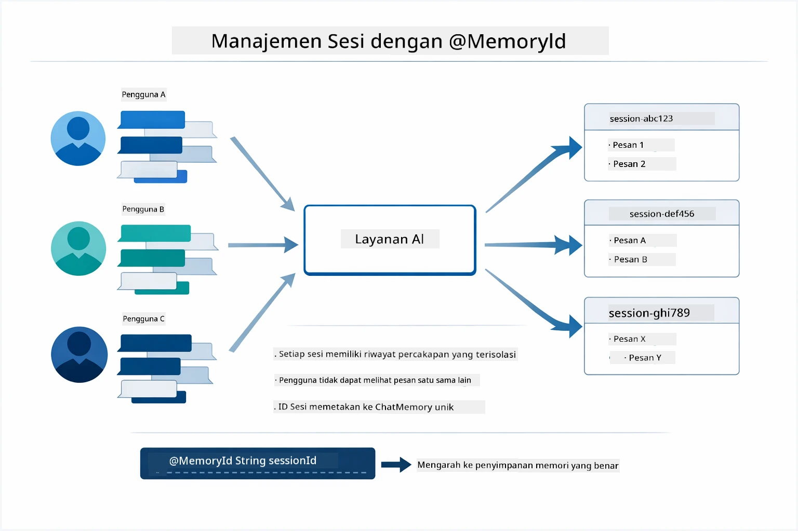

*Setiap ID sesi memetakan ke riwayat percakapan yang terisolasi — pengguna tidak pernah melihat pesan satu sama lain.*

### Penanganan Kesalahan

Alat bisa gagal — API bisa timeout, parameter mungkin tidak valid, layanan eksternal bisa mati. Agen produksi membutuhkan penanganan kesalahan supaya model dapat menjelaskan masalah atau mencoba alternatif daripada membuat aplikasi macet. Saat alat melempar pengecualian, LangChain4j menangkapnya dan mengirimkan pesan kesalahan kembali ke model, yang kemudian dapat menjelaskan masalah dalam bahasa alami.

## Alat yang Tersedia

Diagram di bawah menunjukkan ekosistem luas alat yang dapat Anda bangun. Modul ini mendemonstrasikan alat cuaca dan suhu, tapi pola `@Tool` yang sama berlaku untuk metode Java apa pun — dari kueri basis data hingga pemrosesan pembayaran.

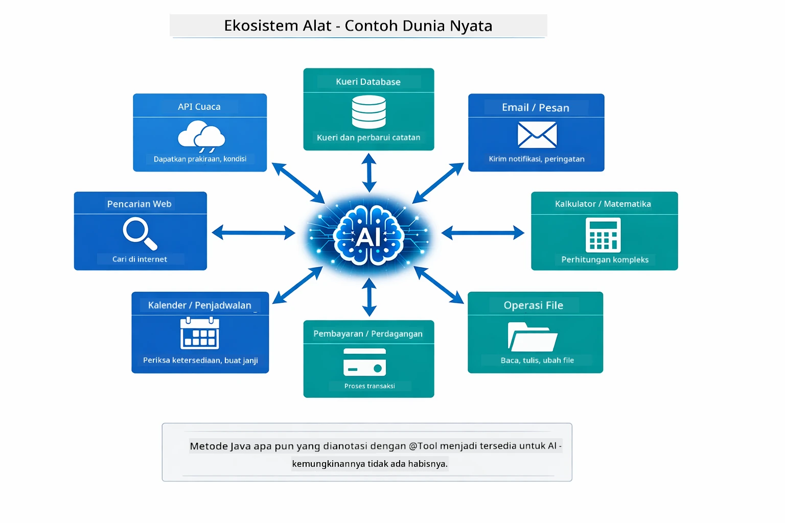

*Metode Java apapun yang dianotasikan dengan @Tool menjadi tersedia untuk AI — pola ini meluas ke database, API, email, operasi file, dan lainnya.*

## Kapan Menggunakan Agen Berbasis Alat

Tidak setiap permintaan membutuhkan alat. Keputusan tergantung apakah AI perlu berinteraksi dengan sistem eksternal atau dapat menjawab dari pengetahuannya sendiri. Panduan berikut merangkum kapan alat memberikan nilai tambah dan kapan tidak diperlukan:

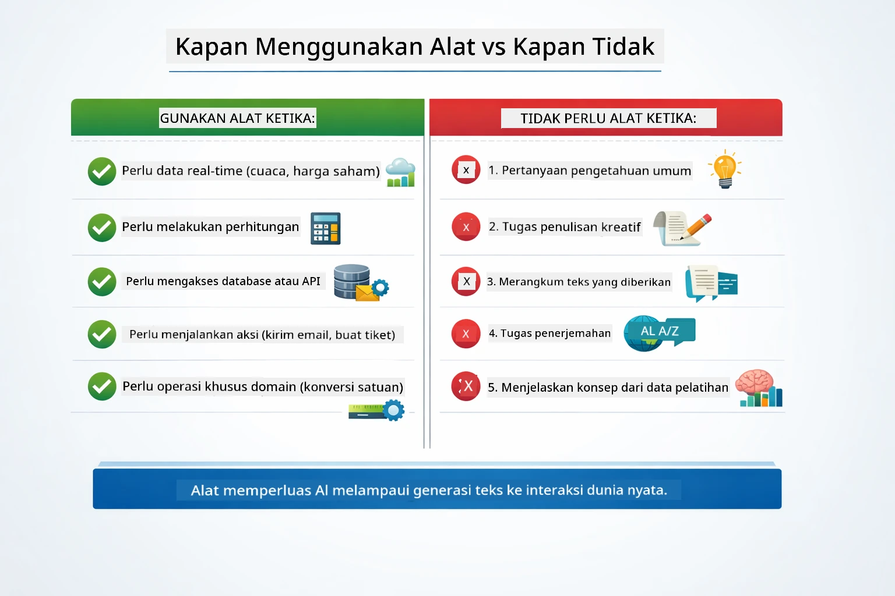

*Panduan keputusan cepat — alat untuk data waktu nyata, perhitungan, dan aksi; pengetahuan umum dan tugas kreatif tidak memerlukannya.*

## Alat vs RAG

Modul 03 dan 04 keduanya memperluas kemampuan AI, tapi dengan cara yang sangat berbeda. RAG memberi model akses ke **pengetahuan** dengan mengambil dokumen. Alat memberi model kemampuan mengambil **aksi** dengan memanggil fungsi. Diagram di bawah membandingkan dua pendekatan ini secara berdampingan — dari cara kerja setiap alur hingga kelebihan dan kekurangannya:

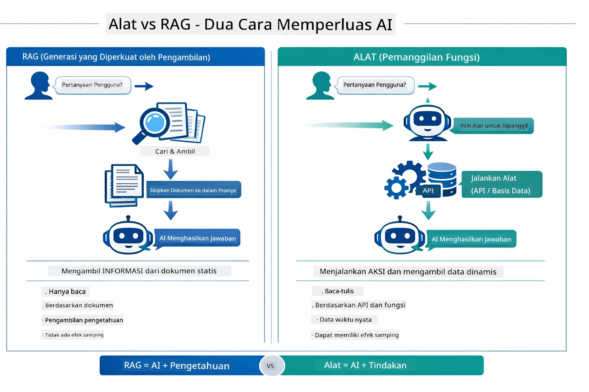

*RAG mengambil informasi dari dokumen statis — Alat menjalankan aksi dan mengambil data dinamis waktu nyata. Banyak sistem produksi menggabungkan keduanya.*

Dalam praktiknya, banyak sistem produksi menggabungkan kedua pendekatan: RAG untuk mendasarkan jawaban pada dokumentasi Anda, dan Alat untuk mengambil data langsung atau melakukan operasi.

## Langkah Selanjutnya

**Modul Berikutnya:** [05-mcp - Model Context Protocol (MCP)](../05-mcp/README.md)

---

**Navigasi:** [← Sebelumnya: Modul 03 - RAG](../03-rag/README.md) | [Kembali ke Utama](../README.md) | [Berikutnya: Modul 05 - MCP →](../05-mcp/README.md)

---

<!-- CO-OP TRANSLATOR DISCLAIMER START -->
**Penafian**:  
Dokumen ini telah diterjemahkan menggunakan layanan terjemahan AI [Co-op Translator](https://github.com/Azure/co-op-translator). Meskipun kami berupaya untuk mencapai akurasi, harap diperhatikan bahwa terjemahan otomatis mungkin mengandung kesalahan atau ketidakakuratan. Dokumen asli dalam bahasa aslinya harus dianggap sebagai sumber yang sahih. Untuk informasi penting, disarankan untuk menggunakan terjemahan manusia profesional. Kami tidak bertanggung jawab atas kesalahpahaman atau kesalahan interpretasi yang timbul dari penggunaan terjemahan ini.
<!-- CO-OP TRANSLATOR DISCLAIMER END -->