# Modul 05: Model Context Protocol (MCP)

## Daftar Isi

- [Apa yang Akan Anda Pelajari](../../../05-mcp)
- [Apa itu MCP?](../../../05-mcp)
- [Bagaimana MCP Bekerja](../../../05-mcp)
- [Modul Agentic](../../../05-mcp)
- [Menjalankan Contoh](../../../05-mcp)
  - [Prasyarat](../../../05-mcp)
- [Mulai Cepat](../../../05-mcp)
  - [Operasi Berkas (Stdio)](../../../05-mcp)
  - [Supervisor Agent](../../../05-mcp)
    - [Menjalankan Demo](../../../05-mcp)
    - [Bagaimana Supervisor Bekerja](../../../05-mcp)
    - [Strategi Respons](../../../05-mcp)
    - [Memahami Output](../../../05-mcp)
    - [Penjelasan Fitur Modul Agentic](../../../05-mcp)
- [Konsep Utama](../../../05-mcp)
- [Selamat!](../../../05-mcp)
  - [Apa Selanjutnya?](../../../05-mcp)

## Apa yang Akan Anda Pelajari

Anda telah membangun AI percakapan, menguasai prompt, menghubungkan respons pada dokumen, dan membuat agen dengan alat. Namun semua alat itu dibangun khusus untuk aplikasi spesifik Anda. Bagaimana jika Anda bisa memberi AI akses ke ekosistem alat standar yang dapat dibuat dan dibagikan siapa saja? Dalam modul ini, Anda akan belajar cara melakukan itu dengan Model Context Protocol (MCP) dan modul agentic LangChain4j. Kami tunjukkan pertama pembaca berkas MCP sederhana lalu bagaimana integrasi mudahnya ke alur kerja agentic tingkat lanjut dengan pola Supervisor Agent.

## Apa itu MCP?

Model Context Protocol (MCP) menyediakan tepat itu - cara standar bagi aplikasi AI untuk menemukan dan menggunakan alat eksternal. Alih-alih menulis integrasi khusus untuk setiap sumber data atau layanan, Anda menghubungkan ke server MCP yang mengekspos kapabilitasnya dalam format konsisten. Agen AI Anda lalu dapat menemukan dan menggunakan alat ini secara otomatis.


*Sebelum MCP: Integrasi titik-ke-titik yang kompleks. Setelah MCP: Satu protokol, kemungkinan tak terbatas.*

MCP memecahkan masalah mendasar dalam pengembangan AI: setiap integrasi bersifat khusus. Ingin akses GitHub? Kode khusus. Ingin membaca berkas? Kode khusus. Ingin kueri database? Kode khusus. Dan tidak satu pun integrasi ini bekerja dengan aplikasi AI lain.

MCP menstandarkan ini. Server MCP mengekspos alat dengan deskripsi jelas dan skema. Klien MCP manapun bisa terhubung, menemukan alat yang tersedia, dan menggunakannya. Bangun sekali, gunakan dimana saja.


*Arsitektur Model Context Protocol - penemuan dan eksekusi alat yang distandarkan*

## Bagaimana MCP Bekerja

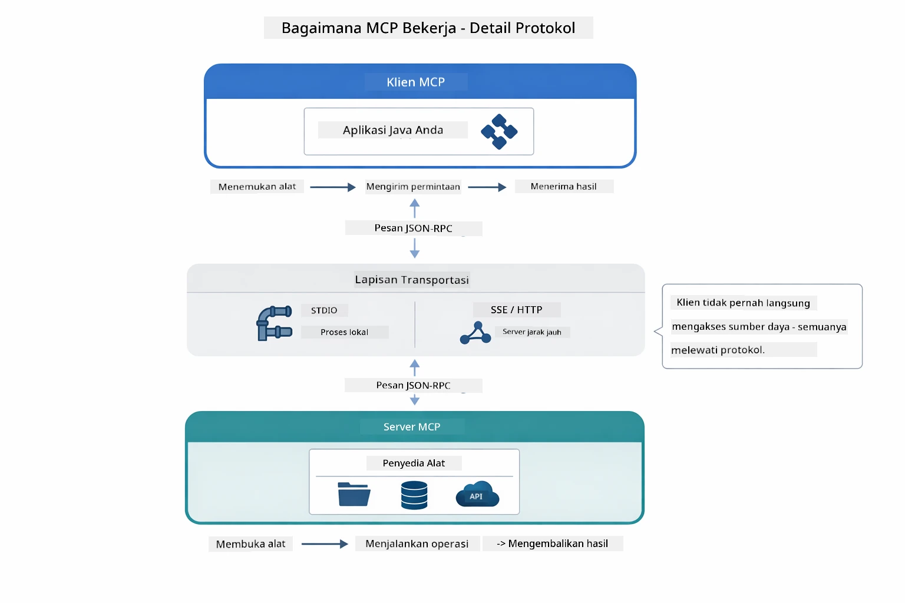

*Bagaimana MCP bekerja dibalik layar — klien menemukan alat, bertukar pesan JSON-RPC, dan menjalankan operasi melalui lapisan transport.*

**Arsitektur Server-Klien**

MCP menggunakan model klien-server. Server menyediakan alat - membaca berkas, kueri database, memanggil API. Klien (aplikasi AI Anda) terhubung ke server dan menggunakan alat mereka.

Untuk menggunakan MCP dengan LangChain4j, tambahkan dependensi Maven ini:

```xml
<dependency>
    <groupId>dev.langchain4j</groupId>
    <artifactId>langchain4j-mcp</artifactId>
    <version>${langchain4j.version}</version>
</dependency>
```

**Penemuan Alat**

Saat klien Anda terhubung ke server MCP, ia bertanya "Alat apa yang Anda miliki?" Server balas dengan daftar alat yang tersedia, masing-masing dengan deskripsi dan skema parameter. Agen AI Anda dapat memutuskan alat mana yang dipakai berdasarkan permintaan pengguna.

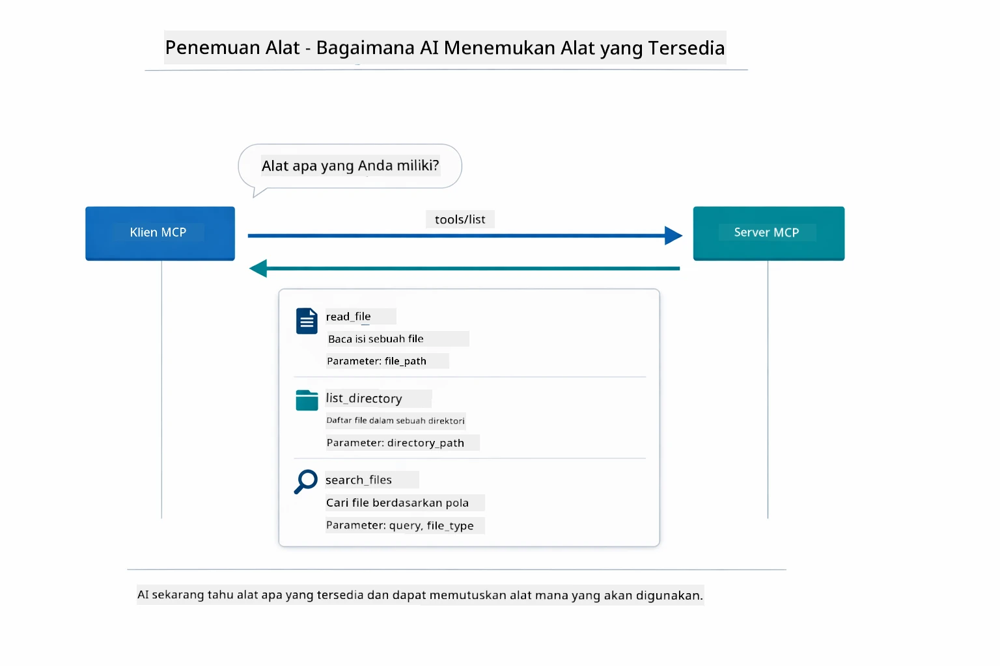

*AI menemukan alat yang tersedia saat startup — kini tahu kemampuan apa yang siap dipakai dan dapat memutuskan mana yang digunakan.*

**Mekanisme Transport**

MCP mendukung berbagai mekanisme transport. Modul ini mendemonstrasikan transport Stdio untuk proses lokal:


*Mekanisme transport MCP: HTTP untuk server jarak jauh, Stdio untuk proses lokal*

**Stdio** - [StdioTransportDemo.java](../../../05-mcp/src/main/java/com/example/langchain4j/mcp/StdioTransportDemo.java)

Untuk proses lokal. Aplikasi Anda membuat server sebagai proses anak dan berkomunikasi lewat input/output standar. Berguna untuk akses filesystem atau alat baris perintah.

```java
McpTransport stdioTransport = new StdioMcpTransport.Builder()
    .command(List.of(
        npmCmd, "exec",
        "@modelcontextprotocol/server-filesystem@2025.12.18",
        resourcesDir
    ))
    .logEvents(false)
    .build();
```

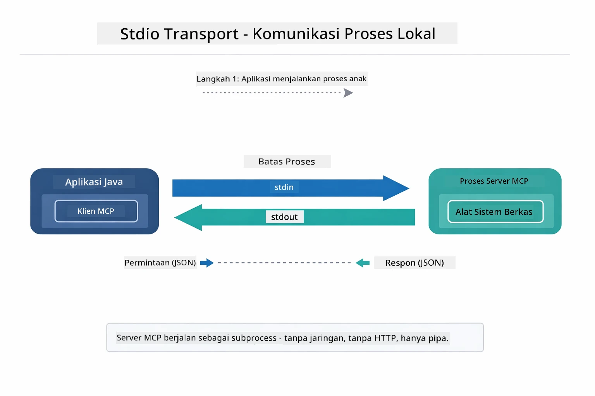

*Transport Stdio dalam aksi — aplikasi Anda membuat server MCP sebagai proses anak dan berkomunikasi melalui pipa stdin/stdout.*

> **🤖 Coba dengan [GitHub Copilot](https://github.com/features/copilot) Chat:** Buka [`StdioTransportDemo.java`](../../../05-mcp/src/main/java/com/example/langchain4j/mcp/StdioTransportDemo.java) dan tanya:
> - "Bagaimana cara kerja transport Stdio dan kapan saya harus menggunakannya dibanding HTTP?"
> - "Bagaimana LangChain4j mengelola siklus hidup proses server MCP yang dibuat?"
> - "Apa implikasi keamanan dari memberi AI akses ke sistem berkas?"

## Modul Agentic

Sementara MCP menyediakan alat yang distandarkan, modul **agentic** LangChain4j menyediakan cara deklaratif membangun agen yang mengatur alat tersebut. Anotasi `@Agent` dan `AgenticServices` membiarkan Anda mendefinisikan perilaku agen lewat antarmuka, bukan kode imperatif.

Dalam modul ini, Anda akan mengeksplor pola **Supervisor Agent** — pendekatan AI agentic lanjutan di mana agen "supervisor" memutuskan secara dinamis sub-agen mana yang dipanggil berdasarkan permintaan pengguna. Kami gabungkan kedua konsep dengan memberi salah satu sub-agen kemampuan akses berkas bertenaga MCP.

Untuk menggunakan modul agentic, tambahkan dependensi Maven ini:

```xml
<dependency>
    <groupId>dev.langchain4j</groupId>
    <artifactId>langchain4j-agentic</artifactId>
    <version>${langchain4j.mcp.version}</version>
</dependency>
```

> **⚠️ Eksperimental:** Modul `langchain4j-agentic` bersifat **eksperimental** dan bisa berubah. Cara stabil membangun asisten AI tetap menggunakan `langchain4j-core` dengan alat kustom (Modul 04).

## Menjalankan Contoh

### Prasyarat

- Java 21+, Maven 3.9+
- Node.js 16+ dan npm (untuk server MCP)
- Variabel lingkungan dikonfigurasi di file `.env` (dari direktori root):
  - `AZURE_OPENAI_ENDPOINT`, `AZURE_OPENAI_API_KEY`, `AZURE_OPENAI_DEPLOYMENT` (sama seperti Modul 01-04)

> **Catatan:** Jika Anda belum mengatur variabel lingkungan, lihat [Modul 00 - Mulai Cepat](../00-quick-start/README.md) untuk petunjuk, atau salin `.env.example` ke `.env` di direktori root dan isi nilainya.

## Mulai Cepat

**Menggunakan VS Code:** Klik kanan pada berkas demo mana pun di Explorer dan pilih **"Run Java"**, atau gunakan konfigurasi peluncuran dari panel Run and Debug (pastikan Anda sudah menambahkan token Anda ke file `.env` terlebih dahulu).

**Menggunakan Maven:** Atau, jalankan dari command line dengan contoh berikut.

### Operasi Berkas (Stdio)

Ini mendemonstrasikan alat berbasis proses anak lokal.

**✅ Tidak perlu prasyarat** - server MCP dibuat otomatis.

**Menggunakan Skrip Mulai (Direkomendasikan):**

Skrip mulai otomatis memuat variabel lingkungan dari file `.env` root:

**Bash:**
```bash
cd 05-mcp
chmod +x start-stdio.sh
./start-stdio.sh
```

**PowerShell:**
```powershell
cd 05-mcp
.\start-stdio.ps1
```

**Menggunakan VS Code:** Klik kanan pada `StdioTransportDemo.java` dan pilih **"Run Java"** (pastikan file `.env` sudah dikonfigurasi).

Aplikasi membuat server MCP filesystem secara otomatis dan membaca berkas lokal. Perhatikan bagaimana pengelolaan proses anak ditangani untuk Anda.

**Output yang diharapkan:**
```
Assistant response: The file provides an overview of LangChain4j, an open-source Java library
for integrating Large Language Models (LLMs) into Java applications...
```

### Supervisor Agent

**Pola Supervisor Agent** adalah bentuk AI agentic yang **fleksibel**. Supervisor menggunakan LLM untuk memutuskan secara mandiri agen mana yang dipanggil berdasarkan permintaan pengguna. Dalam contoh berikut, kami gabungkan akses berkas bertenaga MCP dengan agen LLM untuk membuat alur baca berkas → laporan terawasi.

Dalam demo, `FileAgent` membaca berkas menggunakan alat filesystem MCP, dan `ReportAgent` menghasilkan laporan terstruktur berisi ringkasan eksekutif (1 kalimat), 3 poin kunci, dan rekomendasi. Supervisor mengatur alur ini secara otomatis:

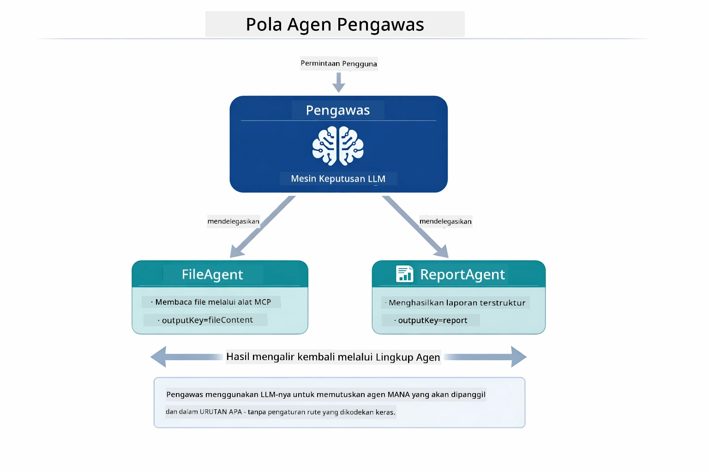

*Supervisor menggunakan LLM-nya untuk menentukan agen mana yang dipanggil dan urutannya — tanpa routing yang dikodekan keras.*

Berikut alur kerja konkret untuk pipeline file-ke-laporan:

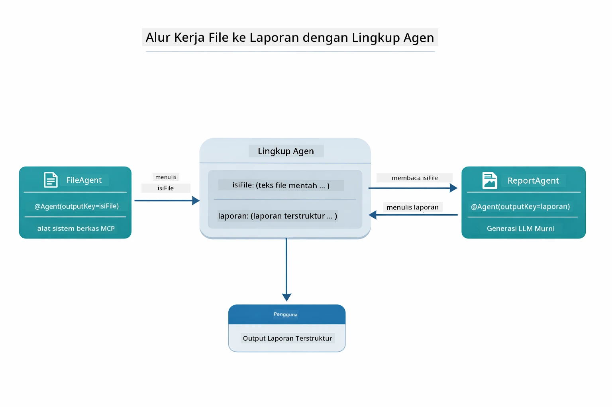

*FileAgent membaca berkas melalui alat MCP, lalu ReportAgent mengubah konten mentah menjadi laporan terstruktur.*

Setiap agen menyimpan hasilnya di **Agentic Scope** (memori bersama), memungkinkan agen berikutnya mengakses hasil sebelumnya. Ini menunjukkan bagaimana alat MCP terintegrasi mulus ke alur agentic — Supervisor tidak perlu tahu *bagaimana* berkas dibaca, cukup bahwa `FileAgent` bisa melakukannya.

#### Menjalankan Demo

Skrip mulai otomatis memuat variabel lingkungan dari file `.env` root:

**Bash:**
```bash
cd 05-mcp
chmod +x start-supervisor.sh
./start-supervisor.sh
```

**PowerShell:**
```powershell
cd 05-mcp
.\start-supervisor.ps1
```

**Menggunakan VS Code:** Klik kanan pada `SupervisorAgentDemo.java` dan pilih **"Run Java"** (pastikan `.env` sudah dikonfigurasi).

#### Bagaimana Supervisor Bekerja

```java
// Langkah 1: FileAgent membaca file menggunakan alat MCP
FileAgent fileAgent = AgenticServices.agentBuilder(FileAgent.class)
        .chatModel(model)
        .toolProvider(mcpToolProvider)  // Memiliki alat MCP untuk operasi file
        .build();

// Langkah 2: ReportAgent menghasilkan laporan terstruktur
ReportAgent reportAgent = AgenticServices.agentBuilder(ReportAgent.class)
        .chatModel(model)
        .build();

// Supervisor mengatur alur kerja file → laporan
SupervisorAgent supervisor = AgenticServices.supervisorBuilder()
        .chatModel(model)
        .subAgents(fileAgent, reportAgent)
        .responseStrategy(SupervisorResponseStrategy.LAST)  // Mengembalikan laporan akhir
        .build();

// Supervisor memutuskan agen mana yang akan dipanggil berdasarkan permintaan
String response = supervisor.invoke("Read the file at /path/file.txt and generate a report");
```

#### Strategi Respons

Saat Anda mengonfigurasi `SupervisorAgent`, Anda menentukan bagaimana ia merumuskan jawaban akhirnya kepada pengguna setelah sub-agen selesai tugasnya.

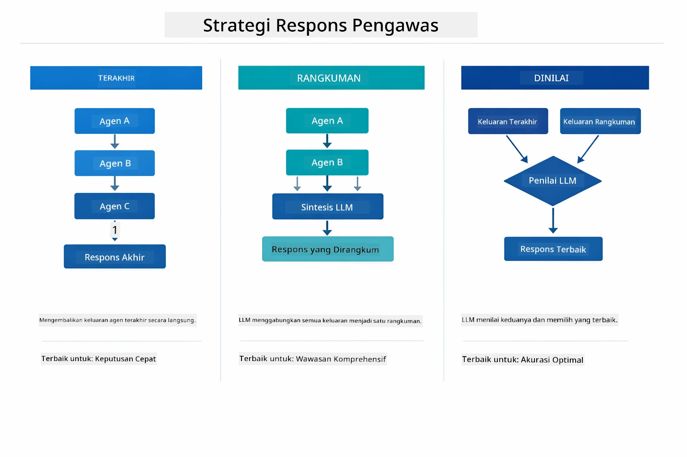

*Tiga strategi untuk bagaimana Supervisor merumuskan respons akhirnya — pilih berdasarkan apakah Anda ingin output agen terakhir, ringkasan sintesis, atau opsi dengan skor terbaik.*

Strategi yang tersedia:

| Strategi | Deskripsi |
|----------|-------------|
| **LAST** | Supervisor mengembalikan output dari sub-agen atau alat terakhir yang dipanggil. Berguna jika agen akhir dalam alur kerja memang dirancang menghasilkan jawaban lengkap dan final (misalnya "Summary Agent" dalam pipeline riset). |
| **SUMMARY** | Supervisor menggunakan Language Model internalnya untuk mensintesis ringkasan dari seluruh interaksi dan semua output sub-agen, lalu mengembalikan ringkasan tersebut sebagai respons akhir. Ini memberikan jawaban teragregasi yang bersih kepada pengguna. |
| **SCORED** | Sistem menggunakan LLM internal untuk memberi skor pada respons LAST dan SUMMARY terhadap permintaan pengguna asli, kemudian mengembalikan output yang mendapat skor tertinggi. |

Lihat [SupervisorAgentDemo.java](../../../05-mcp/src/main/java/com/example/langchain4j/mcp/SupervisorAgentDemo.java) untuk implementasi lengkap.

> **🤖 Coba dengan [GitHub Copilot](https://github.com/features/copilot) Chat:** Buka [`SupervisorAgentDemo.java`](../../../05-mcp/src/main/java/com/example/langchain4j/mcp/SupervisorAgentDemo.java) dan tanya:
> - "Bagaimana Supervisor memutuskan agen mana yang dipanggil?"
> - "Apa perbedaan pola Supervisor dan Sequential workflow?"
> - "Bagaimana cara saya menyesuaikan perilaku rencana Supervisor?"

#### Memahami Output

Saat Anda menjalankan demo, Anda akan melihat panduan terstruktur bagaimana Supervisor mengatur banyak agen. Berikut arti tiap bagian:

```
======================================================================
  FILE → REPORT WORKFLOW DEMO
======================================================================

This demo shows a clear 2-step workflow: read a file, then generate a report.
The Supervisor orchestrates the agents automatically based on the request.
```

**Bagian header** memperkenalkan konsep alur kerja: pipeline terfokus dari baca berkas ke pembuatan laporan.

```
--- WORKFLOW ---------------------------------------------------------
  ┌─────────────┐      ┌──────────────┐
  │  FileAgent  │ ───▶ │ ReportAgent  │
  │ (MCP tools) │      │  (pure LLM)  │
  └─────────────┘      └──────────────┘
   outputKey:           outputKey:
   'fileContent'        'report'

--- AVAILABLE AGENTS -------------------------------------------------
  [FILE]   FileAgent   - Reads files via MCP → stores in 'fileContent'
  [REPORT] ReportAgent - Generates structured report → stores in 'report'
```

**Diagram Alur Kerja** menampilkan aliran data antar agen. Setiap agen punya peran spesifik:
- **FileAgent** membaca berkas dengan alat MCP dan menyimpan konten mentah di `fileContent`
- **ReportAgent** menggunakan konten itu dan menghasilkan laporan terstruktur di `report`

```
--- USER REQUEST -----------------------------------------------------
  "Read the file at .../file.txt and generate a report on its contents"
```

**Permintaan Pengguna** menunjukkan tugasnya. Supervisor memproses ini dan memutuskan memanggil FileAgent → ReportAgent.

```
--- SUPERVISOR ORCHESTRATION -----------------------------------------
  The Supervisor decides which agents to invoke and passes data between them...

  +-- STEP 1: Supervisor chose -> FileAgent (reading file via MCP)
  |
  |   Input: .../file.txt
  |
  |   Result: LangChain4j is an open-source, provider-agnostic Java framework for building LLM...
  +-- [OK] FileAgent (reading file via MCP) completed

  +-- STEP 2: Supervisor chose -> ReportAgent (generating structured report)
  |
  |   Input: LangChain4j is an open-source, provider-agnostic Java framew...
  |
  |   Result: Executive Summary...
  +-- [OK] ReportAgent (generating structured report) completed
```

**Orkestrasi Supervisor** menunjukkan alur 2 langkah secara nyata:
1. **FileAgent** membaca berkas lewat MCP dan menyimpan konten
2. **ReportAgent** menerima konten lalu membuat laporan terstruktur

Supervisor membuat keputusan ini **secara mandiri** berdasarkan permintaan pengguna.

```
--- FINAL RESPONSE ---------------------------------------------------
Executive Summary
...

Key Points
...

Recommendations
...

--- AGENTIC SCOPE (Data Flow) ----------------------------------------
  Each agent stores its output for downstream agents to consume:
  * fileContent: LangChain4j is an open-source, provider-agnostic Java framework...
  * report: Executive Summary...
```

#### Penjelasan Fitur Modul Agentic

Contoh ini menunjukkan beberapa fitur canggih modul agentic. Mari lihat lebih dekat Agentic Scope dan Agent Listeners.

**Agentic Scope** menunjukkan memori bersama tempat agen menyimpan hasilnya memakai `@Agent(outputKey="...")`. Ini memungkinkan:
- Agen berikutnya mengakses output agen sebelumnya
- Supervisor mensintesis respons akhir
- Anda memeriksa apa yang diproduksi tiap agen

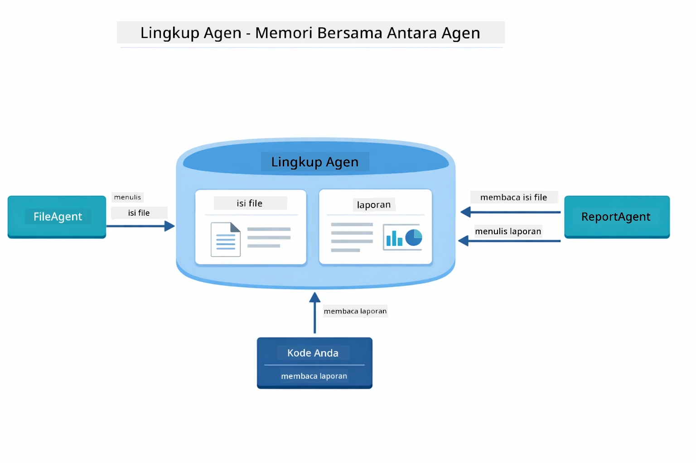

*Agentic Scope berperan sebagai memori bersama — FileAgent menulis `fileContent`, ReportAgent membacanya dan menulis `report`, dan kode Anda membaca hasil akhirnya.*

```java
ResultWithAgenticScope<String> result = supervisor.invokeWithAgenticScope(request);
AgenticScope scope = result.agenticScope();
String fileContent = scope.readState("fileContent");  // Data file mentah dari FileAgent
String report = scope.readState("report");            // Laporan terstruktur dari ReportAgent
```

**Agent Listeners** memungkinkan pemantauan dan debug eksekusi agen. Output langkah demi langkah yang Anda lihat di demo berasal dari AgentListener yang tersambung ke setiap pemanggilan agen:
- **beforeAgentInvocation** - Dipanggil ketika Supervisor memilih agen, memungkinkan Anda melihat agen mana yang dipilih dan mengapa  
- **afterAgentInvocation** - Dipanggil ketika agen selesai, menampilkan hasilnya  
- **inheritedBySubagents** - Jika true, pendengar memantau semua agen dalam hierarki  

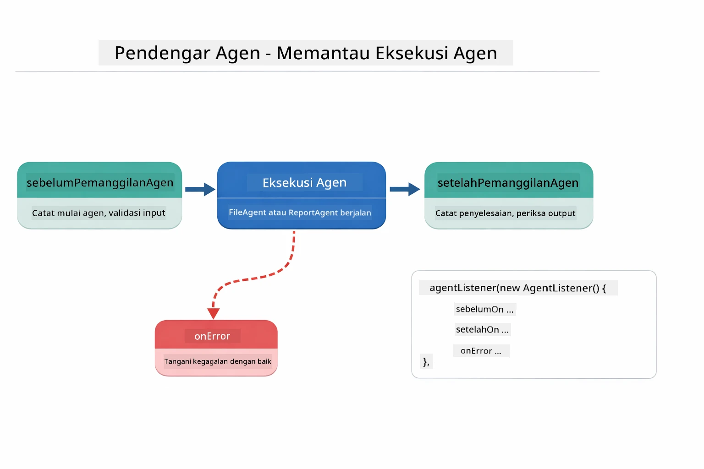

*Pendengar Agen tersambung ke siklus hidup eksekusi — memantau saat agen mulai, selesai, atau mengalami kesalahan.*

```java
AgentListener monitor = new AgentListener() {
    private int step = 0;
    
    @Override
    public void beforeAgentInvocation(AgentRequest request) {
        step++;
        System.out.println("  +-- STEP " + step + ": " + request.agentName());
    }
    
    @Override
    public void afterAgentInvocation(AgentResponse response) {
        System.out.println("  +-- [OK] " + response.agentName() + " completed");
    }
    
    @Override
    public boolean inheritedBySubagents() {
        return true; // Sebarkan ke semua sub-agen
    }
};
```
  
Selain pola Supervisor, modul `langchain4j-agentic` menyediakan beberapa pola dan fitur alur kerja yang kuat:

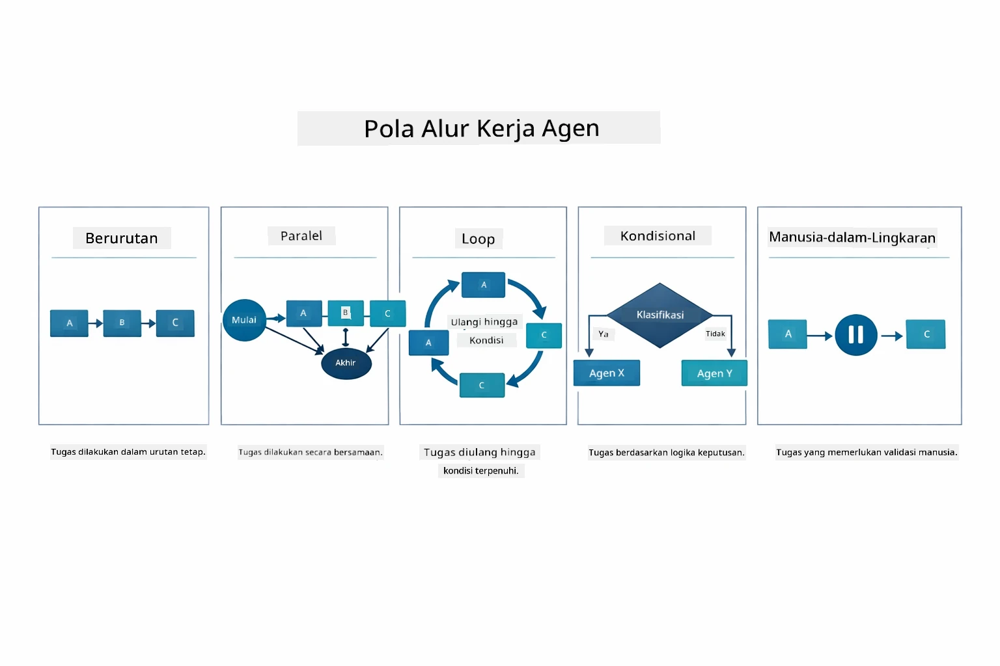

*Lima pola alur kerja untuk mengorkestrasi agen — dari pipeline sederhana berurutan sampai alur kerja persetujuan manusia-dalam-loop.*

| Pola          | Deskripsi                                  | Kasus Penggunaan                              |
|---------------|--------------------------------------------|-----------------------------------------------|
| **Berurutan** | Eksekusi agen secara berurutan, output mengalir ke selanjutnya | Pipeline: riset → analisis → laporan          |
| **Paralel**   | Jalankan agen secara bersamaan             | Tugas independen: cuaca + berita + saham      |
| **Loop**      | Iterasi hingga kondisi terpenuhi            | Penilaian kualitas: perbaiki hingga skor ≥ 0.8|
| **Kondisional** | Rute berdasarkan kondisi                   | Klasifikasi → rute ke agen spesialis          |
| **Manusia-dalam-Loop** | Tambah titik cek manusia               | Alur kerja persetujuan, tinjauan konten        |

## Konsep Utama

Sekarang setelah Anda mengeksplorasi MCP dan modul agentic secara langsung, mari kita rangkum kapan menggunakan masing-masing pendekatan.

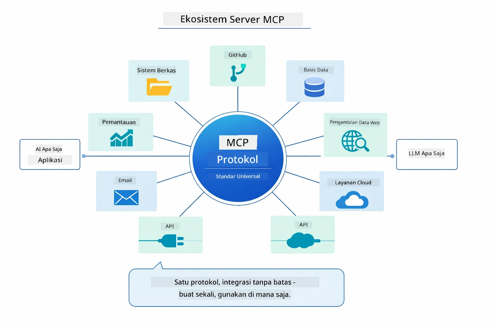

*MCP menciptakan ekosistem protokol universal — setiap server kompatibel MCP dapat bekerja dengan klien kompatibel MCP mana pun, memungkinkan berbagi alat antar aplikasi.*

**MCP** ideal digunakan ketika Anda ingin memanfaatkan ekosistem alat yang sudah ada, membuat alat yang dapat dibagi oleh beberapa aplikasi, mengintegrasikan layanan pihak ketiga dengan protokol standar, atau mengganti implementasi alat tanpa mengubah kode.

**Modul Agentic** paling cocok ketika Anda ingin definisi agen deklaratif dengan anotasi `@Agent`, membutuhkan orkestrasi alur kerja (berurutan, loop, paralel), lebih suka desain agen berbasis antarmuka daripada kode imperatif, atau menggabungkan beberapa agen yang berbagi output melalui `outputKey`.

**Pola Supervisor Agent** unggul ketika alur kerja tidak dapat diprediksi sebelumnya dan Anda ingin LLM yang menentukan, ketika Anda memiliki beberapa agen khusus yang perlu orkestrasi dinamis, saat membangun sistem percakapan yang mengarahkan ke kemampuan berbeda, atau ketika Anda menginginkan perilaku agen paling fleksibel dan adaptif.

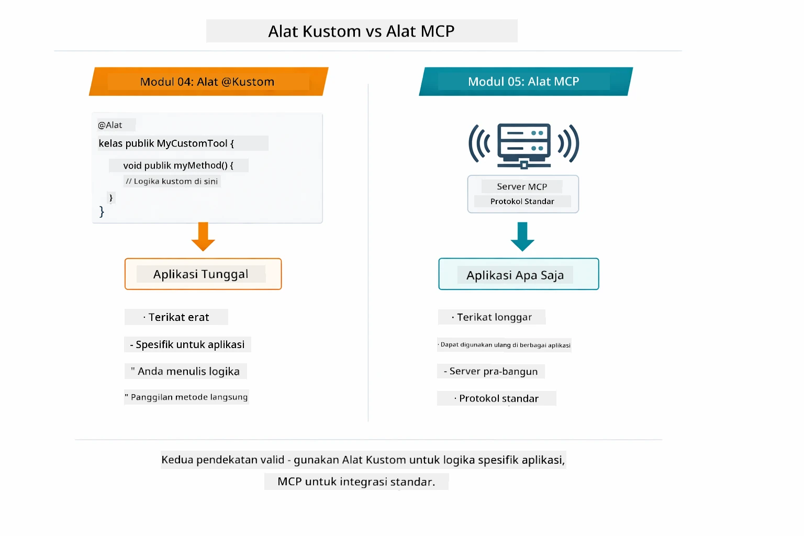

*Kapan menggunakan metode @Tool kustom vs alat MCP — alat kustom untuk logika aplikasi spesifik dengan keamanan tipe penuh, alat MCP untuk integrasi standar yang bekerja lintas aplikasi.*

## Selamat!

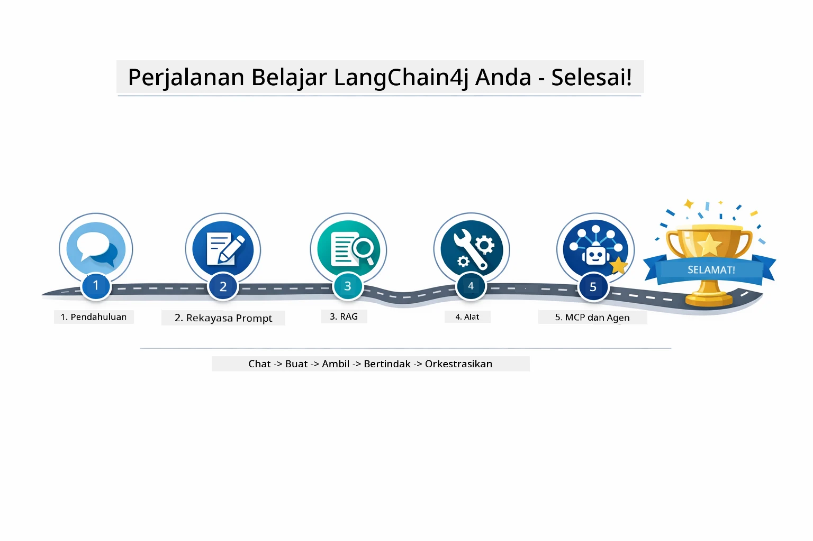

*Perjalanan belajar Anda melalui kelima modul — dari chat dasar sampai sistem agentic bertenaga MCP.*

Anda telah menyelesaikan kursus LangChain4j untuk Pemula. Anda telah belajar:

- Cara membangun AI percakapan dengan memori (Modul 01)  
- Pola rekayasa prompt untuk berbagai tugas (Modul 02)  
- Membumikan respons dalam dokumen Anda dengan RAG (Modul 03)  
- Membuat agen AI dasar (asisten) dengan alat kustom (Modul 04)  
- Mengintegrasikan alat standar dengan modul LangChain4j MCP dan Agentic (Modul 05)  

### Apa Selanjutnya?

Setelah menyelesaikan modul, jelajahi [Panduan Pengujian](../docs/TESTING.md) untuk melihat konsep pengujian LangChain4j secara langsung.

**Sumber Daya Resmi:**  
- [Dokumentasi LangChain4j](https://docs.langchain4j.dev/) - Panduan komprehensif dan referensi API  
- [GitHub LangChain4j](https://github.com/langchain4j/langchain4j) - Kode sumber dan contoh  
- [Tutorial LangChain4j](https://docs.langchain4j.dev/tutorials/) - Tutorial langkah demi langkah untuk berbagai kasus  

Terima kasih telah menyelesaikan kursus ini!

---

**Navigasi:** [← Sebelumnya: Modul 04 - Alat](../04-tools/README.md) | [Kembali ke Utama](../README.md)

---

<!-- CO-OP TRANSLATOR DISCLAIMER START -->
**Penafian**:
Dokumen ini telah diterjemahkan menggunakan layanan terjemahan AI [Co-op Translator](https://github.com/Azure/co-op-translator). Meskipun kami berupaya untuk mencapai akurasi, harap diingat bahwa terjemahan otomatis mungkin mengandung kesalahan atau ketidakakuratan. Dokumen asli dalam bahasa aslinya harus dianggap sebagai sumber yang sahih. Untuk informasi penting, disarankan menggunakan terjemahan profesional oleh manusia. Kami tidak bertanggung jawab atas kesalahpahaman atau salah interpretasi yang timbul dari penggunaan terjemahan ini.
<!-- CO-OP TRANSLATOR DISCLAIMER END -->