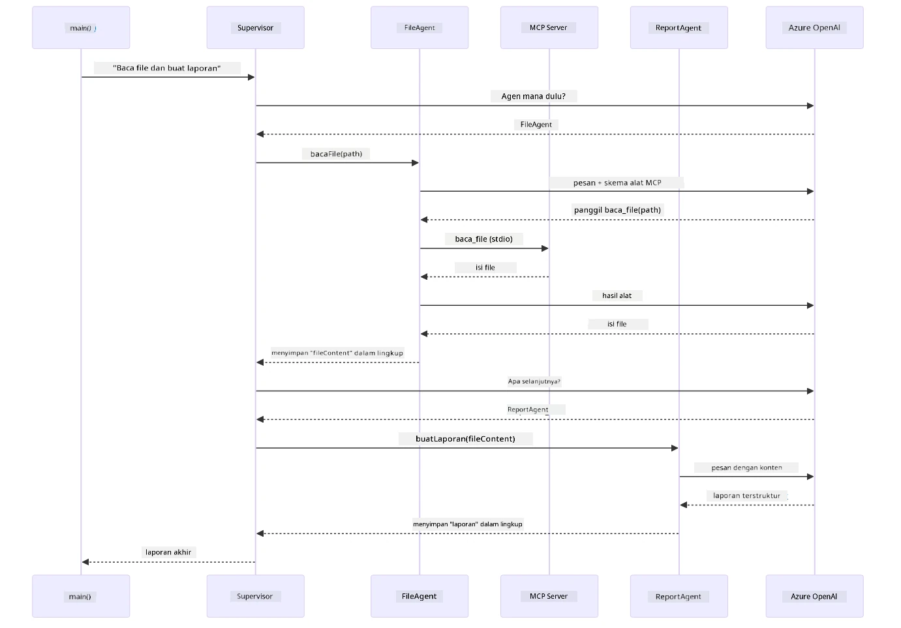

# Module 05: Protokol Konteks Model (MCP)

## Daftar Isi

- [Apa yang Akan Anda Pelajari](../../../05-mcp)
- [Apa itu MCP?](../../../05-mcp)
- [Bagaimana MCP Bekerja](../../../05-mcp)
- [Modul Agentik](../../../05-mcp)
- [Menjalankan Contoh](../../../05-mcp)
  - [Prasyarat](../../../05-mcp)
- [Memulai Cepat](../../../05-mcp)
  - [Operasi Berkas (Stdio)](../../../05-mcp)
  - [Agen Pengawas](../../../05-mcp)
    - [Menjalankan Demo](../../../05-mcp)
    - [Bagaimana Pengawas Bekerja](../../../05-mcp)
    - [Bagaimana FileAgent Menemukan Alat MCP saat Runtime](../../../05-mcp)
    - [Strategi Respon](../../../05-mcp)
    - [Memahami Output](../../../05-mcp)
    - [Penjelasan Fitur Modul Agentik](../../../05-mcp)
- [Konsep Utama](../../../05-mcp)
- [Selamat!](../../../05-mcp)
  - [Apa Selanjutnya?](../../../05-mcp)

## Apa yang Akan Anda Pelajari

Anda telah membangun AI percakapan, menguasai prompt, mendasari respons dalam dokumen, dan membuat agen dengan alat. Namun semua alat tersebut dibuat khusus untuk aplikasi Anda. Bagaimana jika Anda dapat memberikan AI Anda akses ke ekosistem alat standar yang siapa pun dapat buat dan bagikan? Dalam modul ini, Anda akan belajar melakukan hal itu dengan Protokol Konteks Model (MCP) dan modul agentik LangChain4j. Kami pertama-tama menampilkan pembaca berkas MCP sederhana dan kemudian menunjukkan bagaimana mudahnya mengintegrasikannya ke dalam alur kerja agentik tingkat lanjut menggunakan pola Agen Pengawas.

## Apa itu MCP?

Protokol Konteks Model (MCP) menyediakan tepat itu - cara standar bagi aplikasi AI untuk menemukan dan menggunakan alat eksternal. Alih-alih menulis integrasi khusus untuk setiap sumber data atau layanan, Anda menghubungkan ke server MCP yang mengekspos kapabilitas mereka dalam format yang konsisten. Agen AI Anda kemudian dapat menemukan dan menggunakan alat-alat tersebut secara otomatis.

Diagram di bawah menunjukkan perbedaannya — tanpa MCP, setiap integrasi membutuhkan sambungan khusus titik-ke-titik; dengan MCP, satu protokol menghubungkan aplikasi Anda ke alat apa pun:


*Sebelum MCP: Integrasi titik-ke-titik yang kompleks. Setelah MCP: Satu protokol, kemungkinan tanpa batas.*

MCP menyelesaikan masalah mendasar dalam pengembangan AI: setiap integrasi adalah khusus. Ingin mengakses GitHub? Kode khusus. Ingin membaca berkas? Kode khusus. Ingin menanyakan database? Kode khusus. Dan tidak ada dari integrasi ini yang bekerja dengan aplikasi AI lain.

MCP menstandarisasi ini. Server MCP mengekspos alat dengan deskripsi dan skema parameter yang jelas. Klien MCP mana pun dapat terhubung, menemukan alat yang tersedia, dan menggunakannya. Bangun sekali, gunakan di mana-mana.

Diagram di bawah menggambarkan arsitektur ini — satu klien MCP (aplikasi AI Anda) terhubung ke beberapa server MCP, masing-masing mengekspos seperangkat alat mereka sendiri melalui protokol standar:


*Arsitektur Protokol Konteks Model - penemuan dan eksekusi alat yang distandarisasi*

## Bagaimana MCP Bekerja

Di balik layar, MCP menggunakan arsitektur berlapis. Aplikasi Java Anda (klien MCP) menemukan alat yang tersedia, mengirimkan permintaan JSON-RPC melalui lapisan transport (Stdio atau HTTP), dan server MCP menjalankan operasi serta mengembalikan hasil. Diagram berikut memecah setiap lapisan dari protokol ini:


*Cara MCP bekerja di balik layar — klien menemukan alat, bertukar pesan JSON-RPC, dan menjalankan operasi melalui lapisan transport.*

**Arsitektur Server-Klien**

MCP menggunakan model klien-server. Server menyediakan alat - membaca berkas, menanyakan database, memanggil API. Klien (aplikasi AI Anda) menghubungkan ke server dan menggunakan alat mereka.

Untuk menggunakan MCP dengan LangChain4j, tambahkan dependensi Maven ini:

```xml
<dependency>
    <groupId>dev.langchain4j</groupId>
    <artifactId>langchain4j-mcp</artifactId>
    <version>${langchain4j.version}</version>
</dependency>
```

**Penemuan Alat**

Saat klien Anda terhubung ke server MCP, ia bertanya "Alat apa yang kamu miliki?" Server membalas dengan daftar alat tersedia, masing-masing dengan deskripsi dan skema parameter. Agen AI Anda kemudian dapat memutuskan alat mana yang digunakan berdasarkan permintaan pengguna. Diagram di bawah menunjukkan proses ini — klien mengirim permintaan `tools/list` dan server mengembalikan alat yang tersedia dengan deskripsi dan skema parameter:


*AI menemukan alat yang tersedia saat startup — kini mengetahui kapabilitas yang ada dan dapat memutuskan mana yang akan digunakan.*

**Mekanisme Transport**

MCP mendukung berbagai mekanisme transport. Dua opsi adalah Stdio (untuk komunikasi subprocess lokal) dan HTTP Streamable (untuk server jarak jauh). Modul ini mendemonstrasikan transport Stdio:


*Mekanisme transport MCP: HTTP untuk server jarak jauh, Stdio untuk proses lokal*

**Stdio** - [StdioTransportDemo.java](../../../05-mcp/src/main/java/com/example/langchain4j/mcp/StdioTransportDemo.java)

Untuk proses lokal. Aplikasi Anda menjalankan server sebagai subprocess dan berkomunikasi melalui input/output standar. Berguna untuk akses sistem berkas atau alat baris perintah.

```java
McpTransport stdioTransport = new StdioMcpTransport.Builder()
    .command(List.of(
        npmCmd, "exec",
        "@modelcontextprotocol/server-filesystem@2025.12.18",
        resourcesDir
    ))
    .logEvents(false)
    .build();
```

Server `@modelcontextprotocol/server-filesystem` mengekspos alat berikut, semuanya dibatasi pada direktori yang Anda tentukan:

| Alat | Deskripsi |
|------|-----------|
| `read_file` | Membaca isi satu berkas |
| `read_multiple_files` | Membaca beberapa berkas sekaligus |
| `write_file` | Membuat atau menimpa berkas |
| `edit_file` | Membuat edit temukan dan ganti secara tepat |
| `list_directory` | Daftar berkas dan direktori pada sebuah jalur |
| `search_files` | Mencari berkas secara rekursif yang sesuai pola |
| `get_file_info` | Mendapatkan metadata berkas (ukuran, waktu, izin) |
| `create_directory` | Membuat direktori (termasuk direktori induk) |
| `move_file` | Memindahkan atau mengganti nama berkas atau direktori |

Diagram berikut menunjukkan cara kerja transport Stdio saat runtime — aplikasi Java Anda menjalankan server MCP sebagai proses anak dan mereka berkomunikasi melalui pipe stdin/stdout, tanpa jaringan atau HTTP:


*Transport Stdio dalam aksi — aplikasi Anda menjalankan server MCP sebagai proses anak dan berkomunikasi melalui pipe stdin/stdout.*

> **🤖 Coba dengan [GitHub Copilot](https://github.com/features/copilot) Chat:** Buka [`StdioTransportDemo.java`](../../../05-mcp/src/main/java/com/example/langchain4j/mcp/StdioTransportDemo.java) dan tanyakan:
> - "Bagaimana cara kerja transport Stdio dan kapan saya harus menggunakannya dibanding HTTP?"
> - "Bagaimana LangChain4j mengelola siklus hidup proses server MCP yang dijalankan?"
> - "Apa implikasi keamanan memberikan AI akses ke sistem berkas?"

## Modul Agentik

Sementara MCP menyediakan alat yang distandarisasi, modul **agentik** LangChain4j menyediakan cara deklaratif untuk membangun agen yang mengatur alat-alat itu. Anotasi `@Agent` dan `AgenticServices` memungkinkan Anda mendefinisikan perilaku agen melalui antarmuka daripada kode imperatif.

Dalam modul ini, Anda akan mengeksplorasi pola **Agen Pengawas** — pendekatan AI agentik tingkat lanjut di mana agen "pengawas" secara dinamis memutuskan sub-agen mana yang dipanggil berdasarkan permintaan pengguna. Kami menggabungkan kedua konsep tersebut dengan memberikan salah satu sub-agen kita kapabilitas akses berkas berbasis MCP.

Untuk menggunakan modul agentik, tambahkan dependensi Maven ini:

```xml
<dependency>
    <groupId>dev.langchain4j</groupId>
    <artifactId>langchain4j-agentic</artifactId>
    <version>${langchain4j.mcp.version}</version>
</dependency>
```
> **Catatan:** Modul `langchain4j-agentic` menggunakan properti versi terpisah (`langchain4j.mcp.version`) karena dirilis dengan jadwal berbeda dari pustaka utama LangChain4j.

> **⚠️ Eksperimental:** Modul `langchain4j-agentic` adalah **eksperimental** dan dapat berubah. Cara stabil membangun asisten AI tetap dengan `langchain4j-core` dan alat kustom (Modul 04).

## Menjalankan Contoh

### Prasyarat

- Selesai [Modul 04 - Alat](../04-tools/README.md) (modul ini membangun konsep alat kustom dan membandingkannya dengan alat MCP)
- File `.env` di direktori root dengan kredensial Azure (dibuat oleh `azd up` di Modul 01)
- Java 21+, Maven 3.9+
- Node.js 16+ dan npm (untuk server MCP)

> **Catatan:** Jika Anda belum menyiapkan variabel lingkungan, lihat [Modul 01 - Pengantar](../01-introduction/README.md) untuk instruksi deploy (`azd up` membuat file `.env` otomatis), atau salin `.env.example` ke `.env` di direktori root dan isi nilainya.

## Memulai Cepat

**Menggunakan VS Code:** Cukup klik kanan pada file demo mana pun di Explorer dan pilih **"Run Java"**, atau gunakan konfigurasi peluncuran dari panel Run and Debug (pastikan file `.env` Anda sudah dikonfigurasi dengan kredensial Azure terlebih dahulu).

**Menggunakan Maven:** Alternatifnya, Anda bisa menjalankan dari baris perintah dengan contoh di bawah.

### Operasi Berkas (Stdio)

Ini mendemonstrasikan alat berbasis subprocess lokal.

**✅ Tidak perlu prasyarat** - server MCP dijalankan otomatis.

**Menggunakan Skrip Start (Direkomendasikan):**

Skrip start secara otomatis memuat variabel lingkungan dari file `.env` di root:

**Bash:**
```bash
cd 05-mcp
chmod +x start-stdio.sh
./start-stdio.sh
```

**PowerShell:**
```powershell
cd 05-mcp
.\start-stdio.ps1
```

**Menggunakan VS Code:** Klik kanan pada `StdioTransportDemo.java` dan pilih **"Run Java"** (pastikan file `.env` Anda telah dikonfigurasi).

Aplikasi menjalankan server MCP sistem berkas secara otomatis dan membaca berkas lokal. Perhatikan bagaimana manajemen subprocess ditangani untuk Anda.

**Output yang diharapkan:**
```
Assistant response: The file provides an overview of LangChain4j, an open-source Java library
for integrating Large Language Models (LLMs) into Java applications...
```

### Agen Pengawas

**Pola Agen Pengawas** adalah bentuk AI agentik yang **fleksibel**. Seorang Pengawas menggunakan LLM untuk secara otonom memutuskan agen mana yang akan dipanggil berdasarkan permintaan pengguna. Dalam contoh berikut, kita menggabungkan akses berkas berbasis MCP dengan agen LLM untuk membuat alur baca berkas → laporan yang diawasi.

Dalam demo, `FileAgent` membaca berkas menggunakan alat sistem berkas MCP, dan `ReportAgent` menghasilkan laporan terstruktur dengan ringkasan eksekutif (1 kalimat), 3 poin kunci, dan rekomendasi. Pengawas mengatur alur ini secara otomatis:


*Pengawas menggunakan LLM-nya untuk memutuskan agen mana yang dipanggil dan dalam urutan apa — tanpa routing yang dikodekan secara keras.*

Berikut alur kerja konkret untuk pipeline berkas-ke-laporan kita:


*FileAgent membaca berkas via alat MCP, lalu ReportAgent mengubah isi mentah menjadi laporan terstruktur.*

Diagram urutan berikut melacak seluruh orkestra Pengawas — dari menjalankan server MCP, melalui pemilihan agen otonom Pengawas, hingga panggilan alat melalui stdio dan laporan akhir:



*Pengawas secara otonom memanggil FileAgent (yang memanggil server MCP via stdio untuk membaca berkas), lalu memanggil ReportAgent untuk menghasilkan laporan terstruktur — setiap agen menyimpan outputnya di Agentic Scope yang dibagikan.*

Setiap agen menyimpan output di **Agentic Scope** (memori bersama), memungkinkan agen berikutnya mengakses hasil sebelumnya. Ini menunjukkan bagaimana alat MCP terintegrasi mulus ke alur kerja agentik — Pengawas tidak perlu mengetahui *bagaimana* berkas dibaca, hanya bahwa `FileAgent` dapat melakukannya.

#### Menjalankan Demo

Skrip start secara otomatis memuat variabel lingkungan dari file `.env` di root:

**Bash:**
```bash
cd 05-mcp
chmod +x start-supervisor.sh
./start-supervisor.sh
```

**PowerShell:**
```powershell
cd 05-mcp
.\start-supervisor.ps1
```

**Menggunakan VS Code:** Klik kanan pada `SupervisorAgentDemo.java` dan pilih **"Run Java"** (pastikan file `.env` Anda sudah dikonfigurasi).

#### Bagaimana Pengawas Bekerja

Sebelum membangun agen, Anda perlu menyambungkan transport MCP ke klien dan membungkusnya sebagai `ToolProvider`. Begini cara alat server MCP tersedia untuk agen Anda:

```java
// Buat klien MCP dari transportasi
McpClient mcpClient = new DefaultMcpClient.Builder()
        .transport(stdioTransport)
        .build();

// Bungkus klien sebagai ToolProvider — ini menjembatani alat MCP ke dalam LangChain4j
ToolProvider mcpToolProvider = McpToolProvider.builder()
        .mcpClients(List.of(mcpClient))
        .build();
```

Kini Anda dapat menyuntikkan `mcpToolProvider` ke agen mana pun yang memerlukan alat MCP:

```java
// Langkah 1: FileAgent membaca file menggunakan alat MCP
FileAgent fileAgent = AgenticServices.agentBuilder(FileAgent.class)
        .chatModel(model)
        .toolProvider(mcpToolProvider)  // Memiliki alat MCP untuk operasi file
        .build();

// Langkah 2: ReportAgent menghasilkan laporan terstruktur
ReportAgent reportAgent = AgenticServices.agentBuilder(ReportAgent.class)
        .chatModel(model)
        .build();

// Supervisor mengatur alur kerja file → laporan
SupervisorAgent supervisor = AgenticServices.supervisorBuilder()
        .chatModel(model)
        .subAgents(fileAgent, reportAgent)
        .responseStrategy(SupervisorResponseStrategy.LAST)  // Mengembalikan laporan akhir
        .build();

// Supervisor memutuskan agen mana yang akan dipanggil berdasarkan permintaan
String response = supervisor.invoke("Read the file at /path/file.txt and generate a report");
```

#### Bagaimana FileAgent Menemukan Alat MCP saat Runtime

Anda mungkin bertanya: **bagaimana `FileAgent` tahu cara menggunakan alat sistem berkas npm?** Jawabannya adalah tidak tahu — **LLM** yang mengetahuinya saat runtime melalui skema alat.

Interface `FileAgent` hanyalah **definisi prompt**. Ia tidak memiliki pengetahuan terkode keras tentang `read_file`, `list_directory`, atau alat MCP lainnya. Berikut yang terjadi secara menyeluruh:
1. **Server spawns:** `StdioMcpTransport` meluncurkan paket npm `@modelcontextprotocol/server-filesystem` sebagai proses anak  
2. **Penemuan alat:** `McpClient` mengirimkan permintaan JSON-RPC `tools/list` ke server, yang merespons dengan nama alat, deskripsi, dan skema parameter (misalnya, `read_file` — *"Membaca isi lengkap sebuah file"* — `{ path: string }`)  
3. **Injeksi skema:** `McpToolProvider` membungkus skema yang ditemukan ini dan membuatnya tersedia untuk LangChain4j  
4. **Keputusan LLM:** Ketika `FileAgent.readFile(path)` dipanggil, LangChain4j mengirim pesan sistem, pesan pengguna, **dan daftar skema alat** ke LLM. LLM membaca deskripsi alat dan menghasilkan panggilan alat (misalnya, `read_file(path="/some/file.txt")`)  
5. **Eksekusi:** LangChain4j mencegat panggilan alat, mengarahkannya kembali melalui klien MCP ke proses subprocess Node.js, mendapatkan hasilnya, dan mengirimkannya kembali ke LLM  

Ini adalah mekanisme [Penemuan Alat](../../../05-mcp) yang sama seperti dijelaskan di atas, tetapi diterapkan secara khusus pada alur kerja agen. Anotasi `@SystemMessage` dan `@UserMessage` membimbing perilaku LLM, sementara `ToolProvider` yang disuntikkan memberikannya **kapabilitas** — LLM menjembatani keduanya saat runtime.

> **🤖 Coba dengan [GitHub Copilot](https://github.com/features/copilot) Chat:** Buka [`FileAgent.java`](../../../05-mcp/src/main/java/com/example/langchain4j/mcp/agents/FileAgent.java) dan tanyakan:  
> - "Bagaimana agen ini tahu alat MCP mana yang harus dipanggil?"  
> - "Apa yang terjadi jika saya menghapus ToolProvider dari builder agen?"  
> - "Bagaimana skema alat diteruskan ke LLM?"  

#### Strategi Respon

Saat Anda mengonfigurasi `SupervisorAgent`, Anda menentukan bagaimana agen tersebut harus merumuskan jawaban akhirnya kepada pengguna setelah sub-agen menyelesaikan tugas mereka. Diagram di bawah ini menunjukkan tiga strategi yang tersedia — LAST mengembalikan langsung keluaran agen terakhir, SUMMARY mensintesis semua keluaran melalui LLM, dan SCORED memilih yang nilai skornya lebih tinggi terhadap permintaan asli:


*Tiga strategi bagaimana Supervisor merumuskan respons akhirnya — pilih berdasarkan apakah Anda ingin keluaran agen terakhir, ringkasan yang disintesis, atau opsi dengan nilai terbaik.*

Strategi yang tersedia adalah:

| Strategi | Deskripsi |
|----------|-------------|
| **LAST** | Supervisor mengembalikan keluaran dari sub-agen atau alat terakhir yang dipanggil. Ini berguna ketika agen terakhir dalam alur kerja secara khusus dirancang untuk menghasilkan jawaban final yang lengkap (misalnya, "Summary Agent" dalam pipeline penelitian). |  
| **SUMMARY** | Supervisor menggunakan Language Model (LLM) internalnya sendiri untuk mensintesis ringkasan dari seluruh interaksi dan semua keluaran sub-agen, lalu mengembalikan ringkasan tersebut sebagai respons akhir. Ini memberikan jawaban yang bersih dan teragregasi kepada pengguna. |  
| **SCORED** | Sistem menggunakan LLM internal untuk menilai baik respons LAST maupun SUMMARY dari interaksi terhadap permintaan pengguna asli, mengembalikan keluaran yang mendapat nilai lebih tinggi. |  

Lihat [SupervisorAgentDemo.java](../../../05-mcp/src/main/java/com/example/langchain4j/mcp/SupervisorAgentDemo.java) untuk implementasi lengkap.

> **🤖 Coba dengan [GitHub Copilot](https://github.com/features/copilot) Chat:** Buka [`SupervisorAgentDemo.java`](../../../05-mcp/src/main/java/com/example/langchain4j/mcp/SupervisorAgentDemo.java) dan tanyakan:  
> - "Bagaimana Supervisor memutuskan agen mana yang akan dipanggil?"  
> - "Apa perbedaan antara pola workflow Supervisor dan Sequential?"  
> - "Bagaimana saya bisa menyesuaikan perilaku perencanaan Supervisor?"  

#### Memahami Keluaran

Saat Anda menjalankan demo, Anda akan melihat panduan terstruktur tentang bagaimana Supervisor mengorkestrasi beberapa agen. Berikut arti dari setiap bagian:

```
======================================================================
  FILE → REPORT WORKFLOW DEMO
======================================================================

This demo shows a clear 2-step workflow: read a file, then generate a report.
The Supervisor orchestrates the agents automatically based on the request.
```
  
**Header** memperkenalkan konsep alur kerja: pipeline terfokus dari pembacaan file hingga pembuatan laporan.

```
--- WORKFLOW ---------------------------------------------------------
  ┌─────────────┐      ┌──────────────┐
  │  FileAgent  │ ───▶ │ ReportAgent  │
  │ (MCP tools) │      │  (pure LLM)  │
  └─────────────┘      └──────────────┘
   outputKey:           outputKey:
   'fileContent'        'report'

--- AVAILABLE AGENTS -------------------------------------------------
  [FILE]   FileAgent   - Reads files via MCP → stores in 'fileContent'
  [REPORT] ReportAgent - Generates structured report → stores in 'report'
```
  
**Diagram Alur Kerja** menunjukkan aliran data antar agen. Setiap agen memiliki peran spesifik:  
- **FileAgent** membaca file menggunakan alat MCP dan menyimpan konten mentah di `fileContent`  
- **ReportAgent** mengonsumsi konten tersebut dan menghasilkan laporan terstruktur di `report`  

```
--- USER REQUEST -----------------------------------------------------
  "Read the file at .../file.txt and generate a report on its contents"
```
  
**Permintaan Pengguna** menunjukkan tugasnya. Supervisor mem-parsing ini dan memutuskan untuk memanggil FileAgent → ReportAgent.

```
--- SUPERVISOR ORCHESTRATION -----------------------------------------
  The Supervisor decides which agents to invoke and passes data between them...

  +-- STEP 1: Supervisor chose -> FileAgent (reading file via MCP)
  |
  |   Input: .../file.txt
  |
  |   Result: LangChain4j is an open-source, provider-agnostic Java framework for building LLM...
  +-- [OK] FileAgent (reading file via MCP) completed

  +-- STEP 2: Supervisor chose -> ReportAgent (generating structured report)
  |
  |   Input: LangChain4j is an open-source, provider-agnostic Java framew...
  |
  |   Result: Executive Summary...
  +-- [OK] ReportAgent (generating structured report) completed
```
  
**Orkestrasi Supervisor** menunjukkan alur 2-tahap yang berlangsung:  
1. **FileAgent** membaca file melalui MCP dan menyimpan konten  
2. **ReportAgent** menerima konten dan menghasilkan laporan terstruktur  

Supervisor membuat keputusan ini **secara otonom** berdasarkan permintaan pengguna.

```
--- FINAL RESPONSE ---------------------------------------------------
Executive Summary
...

Key Points
...

Recommendations
...

--- AGENTIC SCOPE (Data Flow) ----------------------------------------
  Each agent stores its output for downstream agents to consume:
  * fileContent: LangChain4j is an open-source, provider-agnostic Java framework...
  * report: Executive Summary...
```
  
#### Penjelasan Fitur Modul Agentic

Contoh ini menunjukkan beberapa fitur lanjutan dari modul agentic. Mari kita lihat lebih dekat Agentic Scope dan Agent Listeners.

**Agentic Scope** menunjukkan memori bersama tempat agen menyimpan hasil mereka menggunakan `@Agent(outputKey="...")`. Ini memungkinkan:  
- Agen berikutnya mengakses keluaran agen sebelumnya  
- Supervisor mensintesis respons akhir  
- Anda memeriksa apa yang dihasilkan setiap agen

Diagram di bawah menunjukkan bagaimana Agentic Scope bekerja sebagai memori bersama dalam alur kerja file-ke-laporan — FileAgent menulis keluarannya di bawah kunci `fileContent`, ReportAgent membacanya dan menulis keluarannya sendiri di bawah `report`:


*Agentic Scope bertindak sebagai memori bersama — FileAgent menulis `fileContent`, ReportAgent membacanya dan menulis `report`, dan kode Anda membaca hasil akhirnya.*

```java
ResultWithAgenticScope<String> result = supervisor.invokeWithAgenticScope(request);
AgenticScope scope = result.agenticScope();
String fileContent = scope.readState("fileContent");  // Data file mentah dari FileAgent
String report = scope.readState("report");            // Laporan terstruktur dari ReportAgent
```
  
**Agent Listeners** memungkinkan pemantauan dan debugging eksekusi agen. Keluaran langkah-demi-langkah yang Anda lihat di demo berasal dari AgentListener yang mengait ke setiap pemanggilan agen:  
- **beforeAgentInvocation** - Dipanggil saat Supervisor memilih agen, memungkinkan Anda melihat agen mana yang dipilih dan alasannya  
- **afterAgentInvocation** - Dipanggil saat agen selesai, menampilkan hasilnya  
- **inheritedBySubagents** - Jika true, listener memantau semua agen dalam hierarki

Diagram berikut menunjukkan siklus hidup lengkap Agent Listener, termasuk bagaimana `onError` menangani kegagalan selama eksekusi agen:


*Agent Listeners mengait ke siklus hidup eksekusi — memantau saat agen mulai, selesai, atau mengalami kesalahan.*

```java
AgentListener monitor = new AgentListener() {
    private int step = 0;
    
    @Override
    public void beforeAgentInvocation(AgentRequest request) {
        step++;
        System.out.println("  +-- STEP " + step + ": " + request.agentName());
    }
    
    @Override
    public void afterAgentInvocation(AgentResponse response) {
        System.out.println("  +-- [OK] " + response.agentName() + " completed");
    }
    
    @Override
    public boolean inheritedBySubagents() {
        return true; // Menyebarkan ke semua sub-agen
    }
};
```
  
Selain pola Supervisor, modul `langchain4j-agentic` menyediakan beberapa pola alur kerja yang kuat. Diagram di bawah menunjukkan kelima pola — dari pipeline berurutan sederhana hingga alur kerja persetujuan human-in-the-loop:


*Lima pola alur kerja untuk mengorkestrasi agen — dari pipeline berurutan sederhana hingga alur kerja persetujuan human-in-the-loop.*

| Pola | Deskripsi | Kasus Penggunaan |
|---------|-------------|----------|
| **Sequential** | Jalankan agen secara berurutan, keluaran mengalir ke agen berikutnya | Pipeline: penelitian → analisis → laporan |
| **Parallel** | Jalankan agen secara bersamaan | Tugas independen: cuaca + berita + saham |
| **Loop** | Iterasi sampai kondisi terpenuhi | Penilaian kualitas: perbaiki sampai skor ≥ 0.8 |
| **Conditional** | Rute berdasarkan kondisi | Klasifikasi → rute ke agen spesialis |
| **Human-in-the-Loop** | Tambahkan checkpoint manusia | Alur persetujuan, review konten |

## Konsep Utama

Setelah Anda menjelajahi MCP dan modul agentic secara langsung, mari kita ringkas kapan menggunakan masing-masing pendekatan.

Salah satu keunggulan terbesar MCP adalah ekosistemnya yang terus berkembang. Diagram di bawah menunjukkan bagaimana sebuah protokol universal tunggal menghubungkan aplikasi AI Anda ke berbagai server MCP — mulai dari akses filesystem dan database hingga GitHub, email, web scraping, dan lainnya:


*MCP menciptakan ekosistem protokol universal — server kompatibel MCP manapun bekerja dengan klien kompatibel MCP manapun, memungkinkan berbagi alat lintas aplikasi.*

**MCP** ideal ketika Anda ingin memanfaatkan ekosistem alat yang sudah ada, membuat alat yang dapat dibagi oleh banyak aplikasi, mengintegrasikan layanan pihak ketiga dengan protokol standar, atau mengganti implementasi alat tanpa mengubah kode.

**Modul Agentic** bekerja paling baik ketika Anda menginginkan definisi agen deklaratif dengan anotasi `@Agent`, membutuhkan orkestrasi alur kerja (berurutan, loop, paralel), lebih suka desain agen berbasis antarmuka daripada kode imperatif, atau menggabungkan beberapa agen yang berbagi keluaran melalui `outputKey`.

**Pola Supervisor Agent** menonjol ketika alur kerja tidak dapat diprediksi sebelumnya dan Anda ingin LLM memutuskan, ketika Anda memiliki beberapa agen khusus yang membutuhkan orkestrasi dinamis, saat membangun sistem percakapan yang mengalihkannya ke kapabilitas berbeda, atau saat Anda menginginkan perilaku agen yang paling fleksibel dan adaptif.

Untuk membantu Anda memilih antara metode `@Tool` kustom dari Modul 04 dan alat MCP dari modul ini, perbandingan berikut menyoroti trade-off utama — alat kustom memberikan pengikatan ketat dan keselamatan tipe penuh untuk logika spesifik aplikasi, sementara alat MCP menawarkan integrasi standar dan dapat digunakan ulang:


*Kapan menggunakan metode @Tool kustom vs alat MCP — alat kustom untuk logika aplikasi khusus dengan keselamatan tipe penuh, alat MCP untuk integrasi standar yang dapat dipakai lintas aplikasi.*

## Selamat!

Anda telah menyelesaikan semua lima modul kursus LangChain4j untuk Pemula! Berikut perjalanan belajar lengkap yang telah Anda selesaikan — dari chat dasar hingga sistem agentic bertenaga MCP:


*Perjalanan belajar Anda melalui kelima modul — dari chat dasar hingga sistem agentic bertenaga MCP.*

Anda telah menyelesaikan kursus LangChain4j untuk Pemula. Anda telah belajar:

- Cara membangun AI percakapan dengan memori (Modul 01)  
- Pola rekayasa prompt untuk berbagai tugas (Modul 02)  
- Membumikan respons pada dokumen dengan RAG (Modul 03)  
- Membuat agen AI dasar (asisten) dengan alat kustom (Modul 04)  
- Mengintegrasikan alat standar dengan modul LangChain4j MCP dan Agentic (Modul 05)  

### Apa Selanjutnya?

Setelah menyelesaikan modul-modul ini, jelajahi [Panduan Pengujian](../docs/TESTING.md) untuk melihat konsep pengujian LangChain4j secara langsung.

**Sumber Resmi:**  
- [Dokumentasi LangChain4j](https://docs.langchain4j.dev/) - Panduan lengkap dan referensi API  
- [LangChain4j GitHub](https://github.com/langchain4j/langchain4j) - Kode sumber dan contoh  
- [Tutorial LangChain4j](https://docs.langchain4j.dev/tutorials/) - Tutorial langkah demi langkah untuk berbagai kasus penggunaan  

Terima kasih telah menyelesaikan kursus ini!

---

**Navigasi:** [← Sebelumnya: Modul 04 - Tools](../04-tools/README.md) | [Kembali ke Utama](../README.md)

---

<!-- CO-OP TRANSLATOR DISCLAIMER START -->
**Penafian**:  
Dokumen ini telah diterjemahkan menggunakan layanan terjemahan AI [Co-op Translator](https://github.com/Azure/co-op-translator). Meskipun kami berupaya untuk akurasi, harap diketahui bahwa terjemahan otomatis mungkin mengandung kesalahan atau ketidakakuratan. Dokumen asli dalam bahasa aslinya harus dianggap sebagai sumber yang sahih. Untuk informasi yang penting, disarankan menggunakan terjemahan profesional oleh manusia. Kami tidak bertanggung jawab atas kesalahpahaman atau interpretasi yang salah yang timbul dari penggunaan terjemahan ini.
<!-- CO-OP TRANSLATOR DISCLAIMER END -->