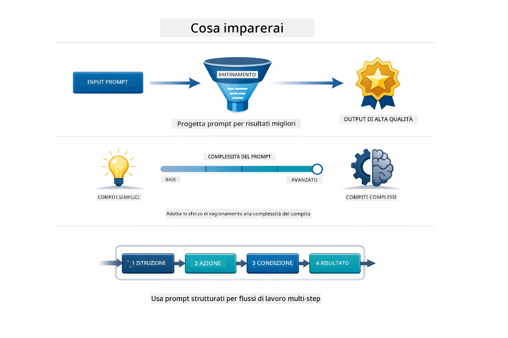
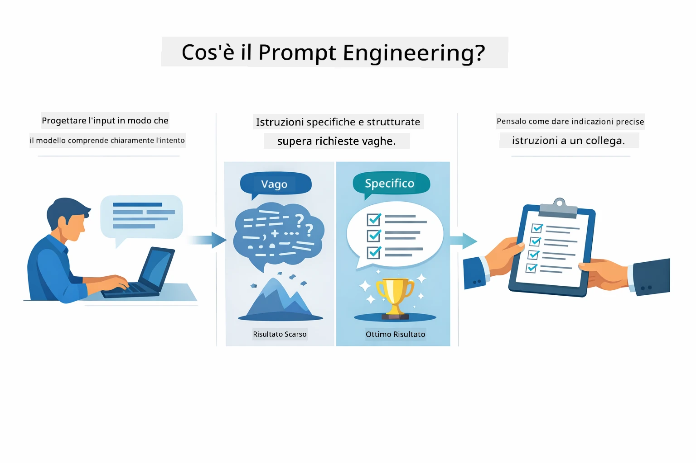
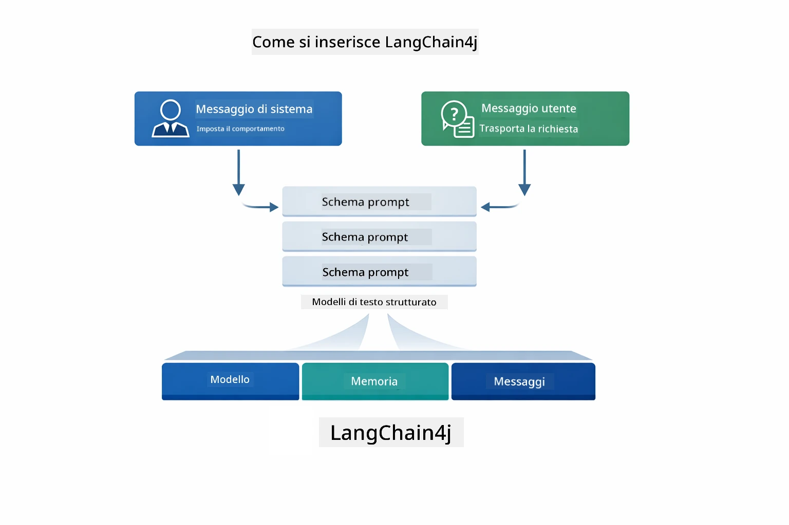
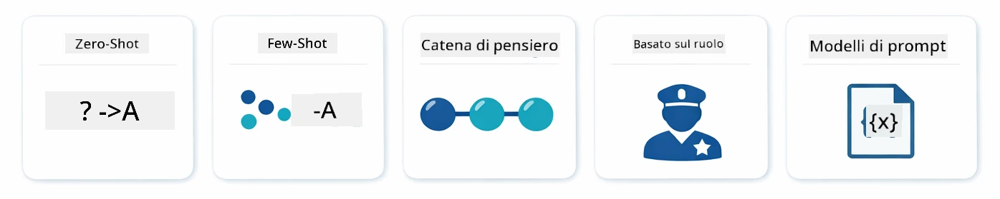
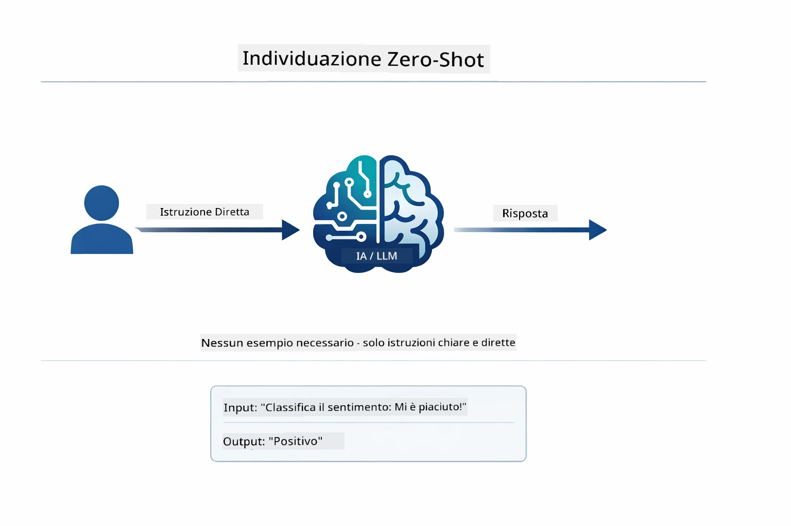
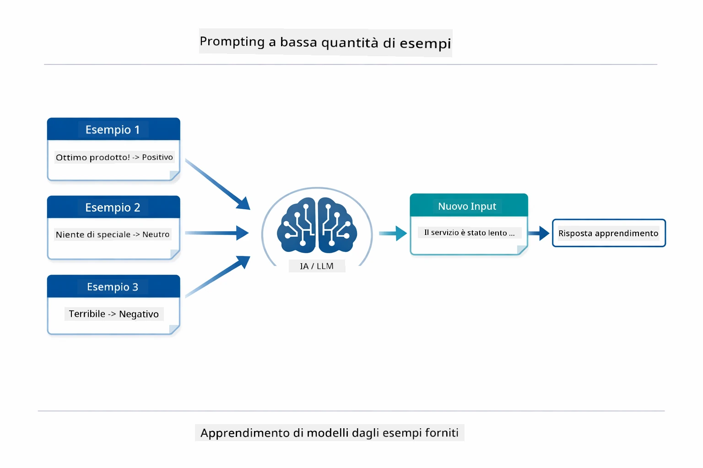
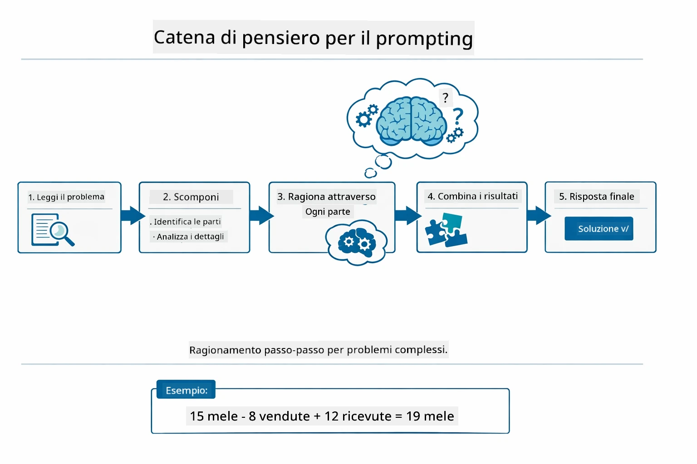
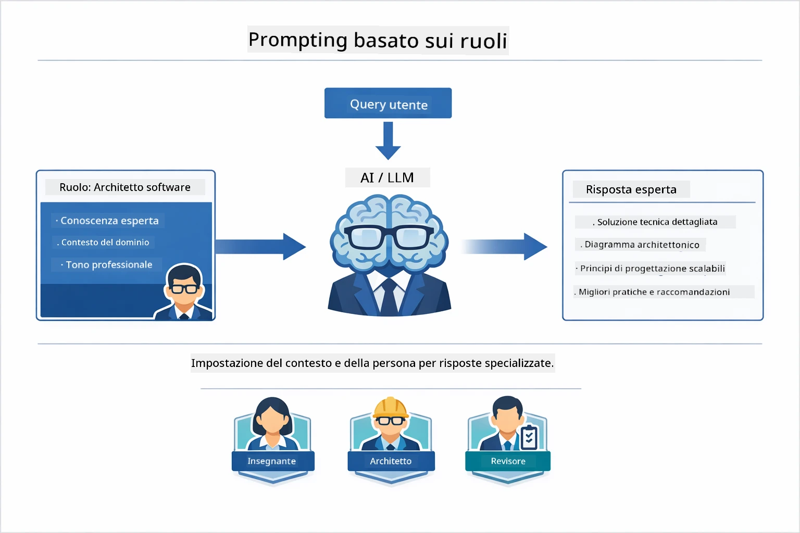
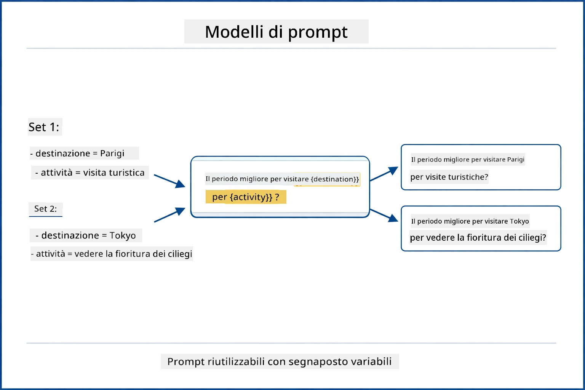
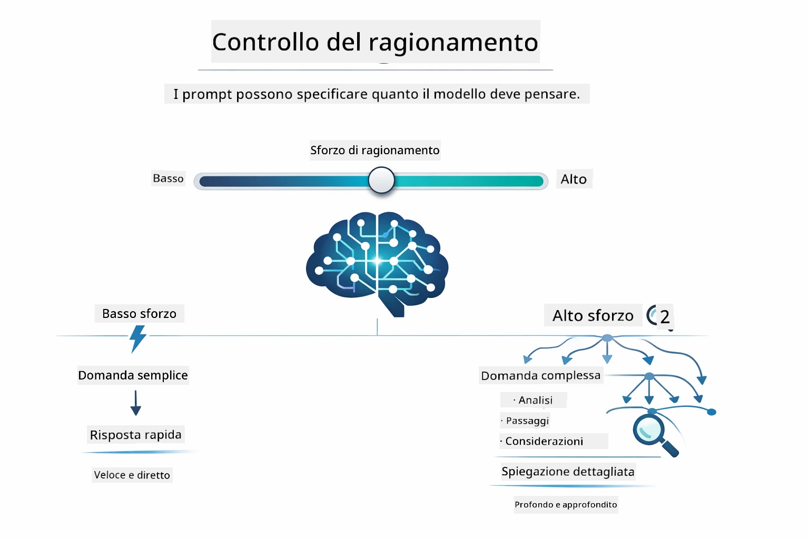

# Modulo 02: Prompt Engineering con GPT-5.2

## Sommario

- [Cosa Imparerai](../../../02-prompt-engineering)
- [Prerequisiti](../../../02-prompt-engineering)
- [Comprendere il Prompt Engineering](../../../02-prompt-engineering)
- [Fondamenti del Prompt Engineering](../../../02-prompt-engineering)
  - [Zero-Shot Prompting](../../../02-prompt-engineering)
  - [Few-Shot Prompting](../../../02-prompt-engineering)
  - [Chain of Thought](../../../02-prompt-engineering)
  - [Role-Based Prompting](../../../02-prompt-engineering)
  - [Prompt Templates](../../../02-prompt-engineering)
- [Pattern Avanzati](../../../02-prompt-engineering)
- [Utilizzo delle Risorse Azure Esistenti](../../../02-prompt-engineering)
- [Screenshot dell'Applicazione](../../../02-prompt-engineering)
- [Esplorare i Pattern](../../../02-prompt-engineering)
  - [Bassa vs Alta Prontezza](../../../02-prompt-engineering)
  - [Esecuzione di Attività (Preludi degli Strumenti)](../../../02-prompt-engineering)
  - [Codice Auto-Riflettente](../../../02-prompt-engineering)
  - [Analisi Strutturata](../../../02-prompt-engineering)
  - [Chat Multi-Turno](../../../02-prompt-engineering)
  - [Ragionamento Passo-Passo](../../../02-prompt-engineering)
  - [Output Vincolato](../../../02-prompt-engineering)
- [Cosa Stai Davvero Imparando](../../../02-prompt-engineering)
- [Passi Successivi](../../../02-prompt-engineering)

## Cosa Imparerai



Nel modulo precedente, hai visto come la memoria abiliti l'IA conversazionale e hai utilizzato i Modelli di GitHub per interazioni di base. Ora ci concentreremo su come fai domande — i prompt stessi — usando GPT-5.2 di Azure OpenAI. Il modo in cui strutturi i tuoi prompt influenza drasticamente la qualità delle risposte che ottieni. Iniziamo con una revisione delle tecniche fondamentali di prompting, quindi passiamo a otto pattern avanzati che sfruttano appieno le capacità di GPT-5.2.

Useremo GPT-5.2 perché introduce il controllo del ragionamento - puoi dire al modello quanto deve pensare prima di rispondere. Questo rende più evidenti le diverse strategie di prompting e ti aiuta a capire quando usare ogni approccio. Beneficeremo anche dei limiti di velocità più ampi di Azure per GPT-5.2 rispetto ai Modelli GitHub.

## Prerequisiti

- Completato il Modulo 01 (risorse Azure OpenAI distribuite)
- File `.env` nella directory root con credenziali Azure (creato da `azd up` nel Modulo 01)

> **Nota:** Se non hai completato il Modulo 01, segui prima le istruzioni di distribuzione lì indicate.

## Comprendere il Prompt Engineering



Il prompt engineering consiste nel progettare un testo di input che ti dia costantemente i risultati di cui hai bisogno. Non si tratta solo di fare domande — si tratta di strutturare richieste affinché il modello capisca esattamente cosa vuoi e come consegnarlo.

Pensalo come dare istruzioni a un collega. "Correggi il bug" è vago. "Correggi l'eccezione null pointer in UserService.java linea 45 aggiungendo un controllo null" è specifico. I modelli linguistici funzionano allo stesso modo — la specificità e la struttura contano.



LangChain4j fornisce l’infrastruttura — connessioni ai modelli, memoria e tipi di messaggi — mentre i pattern di prompt sono solo testo attentamente strutturato che invii attraverso quella infrastruttura. I blocchi chiave sono `SystemMessage` (che imposta il comportamento e il ruolo dell’IA) e `UserMessage` (che porta la tua richiesta effettiva).

## Fondamenti del Prompt Engineering



Prima di immergerci nei pattern avanzati di questo modulo, rivediamo cinque tecniche fondamentali di prompting. Sono i mattoni che ogni prompt engineer dovrebbe conoscere. Se hai già completato il [modulo Quick Start](../00-quick-start/README.md#2-prompt-patterns), li hai già visti in azione — ecco il quadro concettuale dietro di essi.

### Zero-Shot Prompting

L'approccio più semplice: dai al modello un’istruzione diretta senza esempi. Il modello si affida interamente al suo addestramento per comprendere ed eseguire il compito. Funziona bene per richieste semplici dove il comportamento atteso è ovvio.



*Istruzione diretta senza esempi — il modello inferisce il compito solo dall’istruzione*

```java
String prompt = "Classify this sentiment: 'I absolutely loved the movie!'";
String response = model.chat(prompt);
// Risposta: "Positivo"
```

**Quando usarlo:** Classificazioni semplici, domande dirette, traduzioni o qualsiasi compito che il modello può gestire senza ulteriore guida.

### Few-Shot Prompting

Fornisci esempi che mostrano il modello il pattern che vuoi che segua. Il modello apprende il formato input-output atteso dai tuoi esempi e lo applica a nuovi input. Migliora notevolmente la coerenza per compiti in cui il formato o comportamento desiderato non sono ovvi.



*Apprendimento da esempi — il modello identifica il pattern e lo applica ai nuovi input*

```java
String prompt = """
    Classify the sentiment as positive, negative, or neutral.
    
    Examples:
    Text: "This product exceeded my expectations!" → Positive
    Text: "It's okay, nothing special." → Neutral
    Text: "Waste of money, very disappointed." → Negative
    
    Now classify this:
    Text: "Best purchase I've made all year!"
    """;
String response = model.chat(prompt);
```

**Quando usarlo:** Classificazioni personalizzate, formattazioni coerenti, compiti specifici di dominio o quando i risultati zero-shot sono incoerenti.

### Chain of Thought

Chiedi al modello di mostrare il suo ragionamento passo dopo passo. Invece di saltare subito a una risposta, il modello scompone il problema e lavora su ogni parte esplicitamente. Migliora la precisione in matematica, logica e ragionamenti multi-step.



*Ragionamento passo-passo — scomposizione di problemi complessi in passi logici espliciti*

```java
String prompt = """
    Problem: A store has 15 apples. They sell 8 apples and then 
    receive a shipment of 12 more apples. How many apples do they have now?
    
    Let's solve this step-by-step:
    """;
String response = model.chat(prompt);
// Il modello mostra: 15 - 8 = 7, poi 7 + 12 = 19 mele
```

**Quando usarlo:** Problemi matematici, puzzle logici, debugging o qualsiasi compito dove mostrare il processo di ragionamento migliora precisione e fiducia.

### Role-Based Prompting

Imposta una persona o un ruolo per l’IA prima di fare la tua domanda. Fornisce un contesto che definisce il tono, la profondità e il focus della risposta. Un "architetto software" dà consigli diversi rispetto a un "junior developer" o un "security auditor".



*Impostare contesto e persona — la stessa domanda riceve risposte diverse a seconda del ruolo assegnato*

```java
String prompt = """
    You are an experienced software architect reviewing code.
    Provide a brief code review for this function:
    
    def calculate_total(items):
        total = 0
        for item in items:
            total = total + item['price']
        return total
    """;
String response = model.chat(prompt);
```

**Quando usarlo:** Revisioni di codice, tutoraggio, analisi specifiche di dominio o quando ti servono risposte su misura in base a un livello di competenza o prospettiva.

### Prompt Templates

Crea prompt riutilizzabili con segnaposto variabili. Invece di scrivere un nuovo prompt ogni volta, definisci un modello una volta e inserisci diversi valori. La classe `PromptTemplate` di LangChain4j lo rende facile con la sintassi `{{variable}}`.



*Prompt riutilizzabili con segnaposto variabili — un modello, molti usi*

```java
PromptTemplate template = PromptTemplate.from(
    "What's the best time to visit {{destination}} for {{activity}}?"
);

Prompt prompt = template.apply(Map.of(
    "destination", "Paris",
    "activity", "sightseeing"
));

String response = model.chat(prompt.text());
```

**Quando usarlo:** Query ripetute con input differenti, elaborazioni batch, costruzione di workflow IA riutilizzabili o qualsiasi scenario in cui la struttura del prompt rimane la stessa ma cambiano i dati.

---

Questi cinque fondamenti ti forniscono un solido kit per la maggior parte dei compiti di prompting. Il resto del modulo si basa su di essi con **otto pattern avanzati** che sfruttano controllo del ragionamento, auto-valutazione e output strutturato di GPT-5.2.

## Pattern Avanzati

Con i fondamenti coperti, passiamo agli otto pattern avanzati che rendono questo modulo unico. Non tutti i problemi richiedono lo stesso approccio. Alcune domande hanno bisogno di risposte rapide, altre di un pensiero profondo. Alcune richiedono ragionamenti visibili, altre solo risultati. Ogni pattern sotto è ottimizzato per uno scenario diverso — e il controllo del ragionamento di GPT-5.2 rende le differenze ancora più evidenti.


*Panoramica degli otto pattern di prompt engineering e dei loro casi d’uso*



*Il controllo del ragionamento di GPT-5.2 ti permette di specificare quanto deve pensare il modello — da risposte rapide e dirette a esplorazioni approfondite*


*Prontezza bassa (veloce, diretto) vs Prontezza alta (approfondito, esplorativo)*

**Bassa Prontezza (Veloce & Mirato)** - Per domande semplici in cui vuoi risposte rapide e dirette. Il modello fa un ragionamento minimo - massimo 2 passi. Usalo per calcoli, ricerche o domande semplici.

```java
String prompt = """
    <reasoning_effort>low</reasoning_effort>
    <instruction>maximum 2 reasoning steps</instruction>
    
    What is 15% of 200?
    """;

String response = chatModel.chat(prompt);
```

> 💡 **Esplora con GitHub Copilot:** Apri [`Gpt5PromptService.java`](../../../02-prompt-engineering/src/main/java/com/example/langchain4j/prompts/service/Gpt5PromptService.java) e chiedi:
> - "Qual è la differenza tra pattern di prompting a bassa e alta prontezza?"
> - "Come aiutano i tag XML nei prompt a strutturare la risposta dell'IA?"
> - "Quando dovrei usare pattern di auto-riflessione rispetto all’istruzione diretta?"

**Alta Prontezza (Profondo & Approfondito)** - Per problemi complessi dove vuoi un’analisi completa. Il modello esplora approfonditamente e mostra un ragionamento dettagliato. Usalo per progettazione di sistemi, decisioni architetturali o ricerche complesse.

```java
String prompt = """
    <reasoning_effort>high</reasoning_effort>
    <instruction>explore thoroughly, show detailed reasoning</instruction>
    
    Design a caching strategy for a high-traffic REST API.
    """;

String response = chatModel.chat(prompt);
```

**Esecuzione di Attività (Progresso Passo-Passo)** - Per workflow a più passaggi. Il modello fornisce un piano preliminare, narra ogni passo mentre lavora, poi dà un riassunto. Usalo per migrazioni, implementazioni o qualsiasi processo multi-step.

```java
String prompt = """
    <task>Create a REST endpoint for user registration</task>
    <preamble>Provide an upfront plan</preamble>
    <narration>Narrate each step as you work</narration>
    <summary>Summarize what was accomplished</summary>
    """;

String response = chatModel.chat(prompt);
```

Il prompting Chain-of-Thought chiede esplicitamente al modello di mostrare il suo processo di ragionamento, migliorando la precisione in compiti complessi. La scomposizione passo-passo aiuta sia umani che IA a comprendere la logica.

> **🤖 Prova con [GitHub Copilot](https://github.com/features/copilot) Chat:** Chiedi di questo pattern:
> - "Come potrei adattare il pattern di esecuzione di compiti per operazioni a lunga durata?"
> - "Quali sono le migliori pratiche per strutturare i preludi degli strumenti in applicazioni di produzione?"
> - "Come posso catturare e mostrare aggiornamenti di progresso intermedi in un’interfaccia utente?"


*Pianifica → Esegui → Riassumi il workflow per compiti multi-step*

**Codice Auto-Riflettente** - Per generare codice di qualità produzione. Il modello genera codice, lo verifica contro criteri di qualità e lo migliora iterativamente. Usalo quando costruisci nuove funzionalità o servizi.

```java
String prompt = """
    <task>Create an email validation service</task>
    <quality_criteria>
    - Correct logic and error handling
    - Best practices (clean code, proper naming)
    - Performance optimization
    - Security considerations
    </quality_criteria>
    <instruction>Generate code, evaluate against criteria, improve iteratively</instruction>
    """;

String response = chatModel.chat(prompt);
```


*Ciclo di miglioramento iterativo - genera, valuta, identifica problemi, migliora, ripeti*

**Analisi Strutturata** - Per valutazioni coerenti. Il modello rivede il codice usando un framework fisso (correttezza, pratiche, prestazioni, sicurezza). Usalo per revisioni di codice o valutazioni di qualità.

```java
String prompt = """
    <code>
    public List getUsers() {
        return database.query("SELECT * FROM users");
    }
    </code>
    
    <framework>
    Evaluate using these categories:
    1. Correctness - Logic and functionality
    2. Best Practices - Code quality
    3. Performance - Efficiency concerns
    4. Security - Vulnerabilities
    </framework>
    """;

String response = chatModel.chat(prompt);
```

> **🤖 Prova con [GitHub Copilot](https://github.com/features/copilot) Chat:** Chiedi dell’analisi strutturata:
> - "Come posso personalizzare il framework di analisi per diversi tipi di revisioni di codice?"
> - "Qual è il modo migliore per analizzare e agire su output strutturati in modo programmatico?"
> - "Come garantisco livelli di gravità coerenti in sessioni diverse di revisione?"


*Framework a quattro categorie per revisioni di codice coerenti con livelli di severità*

**Chat Multi-Turno** - Per conversazioni che necessitano di contesto. Il modello ricorda i messaggi precedenti e costruisce su di essi. Usalo per sessioni di aiuto interattive o Q&A complessi.

```java
ChatMemory memory = MessageWindowChatMemory.withMaxMessages(10);

memory.add(UserMessage.from("What is Spring Boot?"));
AiMessage aiMessage1 = chatModel.chat(memory.messages()).aiMessage();
memory.add(aiMessage1);

memory.add(UserMessage.from("Show me an example"));
AiMessage aiMessage2 = chatModel.chat(memory.messages()).aiMessage();
memory.add(aiMessage2);
```


*Come il contesto della conversazione si accumula su più turni finché non si raggiunge il limite di token*

**Ragionamento Passo-Passo** - Per problemi che richiedono una logica visibile. Il modello mostra il ragionamento esplicito per ogni passo. Usalo per problemi matematici, puzzle logici o quando devi comprendere il processo mentale.

```java
String prompt = """
    <instruction>Show your reasoning step-by-step</instruction>
    
    If a train travels 120 km in 2 hours, then stops for 30 minutes,
    then travels another 90 km in 1.5 hours, what is the average speed
    for the entire journey including the stop?
    """;

String response = chatModel.chat(prompt);
```


*Scomposizione di problemi in passi logici espliciti*

**Output Vincolato** - Per risposte con requisiti di formato specifici. Il modello segue rigorosamente regole di formato e lunghezza. Usalo per riassunti o quando ti serve una struttura di output precisa.

```java
String prompt = """
    <constraints>
    - Exactly 100 words
    - Bullet point format
    - Technical terms only
    </constraints>
    
    Summarize the key concepts of machine learning.
    """;

String response = chatModel.chat(prompt);
```


*Applicazione rigorosa di requisiti specifici per formato, lunghezza e struttura*

## Utilizzo delle Risorse Azure Esistenti

**Verifica distribuzione:**

Accertati che il file `.env` esista nella directory root con credenziali Azure (creato durante il Modulo 01):
```bash
cat ../.env  # Dovrebbe mostrare AZURE_OPENAI_ENDPOINT, API_KEY, DEPLOYMENT
```

**Avvia l'applicazione:**

> **Nota:** Se hai già avviato tutte le applicazioni usando `./start-all.sh` dal Modulo 01, questo modulo è già in esecuzione sulla porta 8083. Puoi saltare i comandi di avvio qui sotto e andare direttamente su http://localhost:8083.

**Opzione 1: Usare Spring Boot Dashboard (Raccomandato per utenti VS Code)**

Il dev container include l’estensione Spring Boot Dashboard, che offre un’interfaccia visuale per gestire tutte le applicazioni Spring Boot. La trovi nella Barra Attività sulla sinistra di VS Code (cerca l’icona di Spring Boot).
Dal Spring Boot Dashboard, puoi:
- Vedere tutte le applicazioni Spring Boot disponibili nello spazio di lavoro
- Avviare/arrestare le applicazioni con un solo clic
- Visualizzare i log delle applicazioni in tempo reale
- Monitorare lo stato delle applicazioni

Basta cliccare il pulsante play accanto a "prompt-engineering" per avviare questo modulo, oppure avviare tutti i moduli contemporaneamente.


**Opzione 2: Utilizzo di script shell**

Avvia tutte le applicazioni web (moduli 01-04):

**Bash:**
```bash
cd ..  # Dalla directory radice
./start-all.sh
```

**PowerShell:**
```powershell
cd ..  # Dalla directory principale
.\start-all.ps1
```

Oppure avvia solo questo modulo:

**Bash:**
```bash
cd 02-prompt-engineering
./start.sh
```

**PowerShell:**
```powershell
cd 02-prompt-engineering
.\start.ps1
```

Entrambi gli script caricano automaticamente le variabili d'ambiente dal file `.env` radice e compileranno i JAR se non esistono.

> **Nota:** Se preferisci compilare manualmente tutti i moduli prima di avviare:
>
> **Bash:**
> ```bash
> cd ..  # Go to root directory
> mvn clean package -DskipTests
> ```
>
> **PowerShell:**
> ```powershell
> cd ..  # Go to root directory
> mvn clean package -DskipTests
> ```

Apri http://localhost:8083 nel tuo browser.

**Per fermare:**

**Bash:**
```bash
./stop.sh  # Solo questo modulo
# O
cd .. && ./stop-all.sh  # Tutti i moduli
```

**PowerShell:**
```powershell
.\stop.ps1  # Solo questo modulo
# Oppure
cd ..; .\stop-all.ps1  # Tutti i moduli
```

## Screenshot dell'applicazione


*La dashboard principale mostra tutti e 8 i pattern di prompt engineering con le loro caratteristiche e casi d'uso*

## Esplorazione dei pattern

L'interfaccia web ti consente di sperimentare diverse strategie di prompting. Ogni pattern risolve problemi differenti - provali per vedere quando ogni approccio funziona meglio.

### Bassa vs Alta Prontezza

Fai una domanda semplice come "Qual è il 15% di 200?" usando Bassa Prontezza. Otterrai una risposta immediata e diretta. Ora chiedi qualcosa di complesso come "Progetta una strategia di caching per un'API ad alto traffico" usando Alta Prontezza. Guarda come il modello rallenta e fornisce un ragionamento dettagliato. Stesso modello, stessa struttura della domanda - ma il prompt indica quanto pensiero fare.


*Calcolo veloce con ragionamento minimo*


*Strategia di caching completa (2.8MB)*

### Esecuzione di Compiti (Preamboli degli Strumenti)

I flussi di lavoro multi-step beneficiano di una pianificazione anticipata e di una narrazione del progresso. Il modello delinea cosa farà, narra ogni passo, poi riassume i risultati.


*Creazione di un endpoint REST con narrazione passo-passo (3.9MB)*

### Codice Auto-Riflettente

Prova "Crea un servizio di validazione email". Invece di limitarsi a generare codice e fermarsi, il modello genera, valuta rispetto ai criteri di qualità, identifica punti deboli e migliora. Vedrai iterare finché il codice non soddisfa gli standard di produzione.


*Servizio completo di validazione email (5.2MB)*

### Analisi Strutturata

Le revisioni di codice necessitano di framework di valutazione coerenti. Il modello analizza il codice usando categorie fisse (correttezza, pratiche, prestazioni, sicurezza) con livelli di gravità.


*Revisione del codice basata su framework*

### Chat Multi-Turno

Chiedi "Cos’è Spring Boot?" e poi subito dopo "Fammi un esempio". Il modello ricorda la tua prima domanda e ti dà un esempio specifico di Spring Boot. Senza memoria, la seconda domanda sarebbe troppo vaga.


*Preservazione del contesto tra le domande*

### Ragionamento Passo-Passo

Scegli un problema matematico e provalo sia con Ragionamento Passo-Passo che con Bassa Prontezza. La bassa prontezza ti dà solo la risposta - veloce ma opaca. Il ragionamento passo-passo ti mostra ogni calcolo e decisione.


*Problema matematico con passaggi espliciti*

### Output Vincolato

Quando hai bisogno di formati specifici o conteggi di parole, questo pattern impone un'aderenza rigorosa. Prova a generare un riepilogo con esattamente 100 parole in formato elenco puntato.


*Riepilogo di machine learning con controllo del formato*

## Cosa stai davvero imparando

**Lo sforzo nel ragionamento cambia tutto**

GPT-5.2 ti permette di controllare lo sforzo computazionale attraverso i tuoi prompt. Poco sforzo significa risposte rapide con esplorazione minima. Tanto sforzo significa che il modello prende tempo per pensare a fondo. Stai imparando ad adattare lo sforzo alla complessità del compito - non sprecare tempo su domande semplici, ma nemmeno affrettare decisioni complesse.

**La struttura guida il comportamento**

Hai notato i tag XML nei prompt? Non sono decorativi. I modelli seguono istruzioni strutturate più affidabilmente rispetto al testo libero. Quando hai bisogno di processi multi-step o logica complessa, la struttura aiuta il modello a tenere traccia di dove si trova e cosa viene dopo.


*Anatomia di un prompt ben strutturato con sezioni chiare e organizzazione in stile XML*

**Qualità attraverso l'auto-valutazione**

I pattern auto-riflettenti funzionano rendendo espliciti i criteri di qualità. Invece di sperare che il modello "lo faccia bene", gli dici esattamente cosa significa "bene": logica corretta, gestione degli errori, prestazioni, sicurezza. Il modello può quindi valutare il proprio output e migliorare. Questo trasforma la generazione di codice da una lotteria a un processo.

**Il contesto è finito**

Le conversazioni multi-turno funzionano includendo la cronologia dei messaggi ad ogni richiesta. Ma c'è un limite - ogni modello ha un conteggio massimo di token. Quando la conversazione cresce, serviranno strategie per mantenere il contesto rilevante senza superare quel limite. Questo modulo ti mostra come funziona la memoria; più avanti imparerai quando riassumere, quando dimenticare e quando recuperare.

## Prossimi passi

**Modulo successivo:** [03-rag - RAG (Retrieval-Augmented Generation)](../03-rag/README.md)

---

**Navigazione:** [← Precedente: Modulo 01 - Introduzione](../01-introduction/README.md) | [Torna al principale](../README.md) | [Successivo: Modulo 03 - RAG →](../03-rag/README.md)

---

<!-- CO-OP TRANSLATOR DISCLAIMER START -->
**Disclaimer**:
Questo documento è stato tradotto utilizzando il servizio di traduzione AI [Co-op Translator](https://github.com/Azure/co-op-translator). Pur impegnandoci per garantire accuratezza, si prega di essere consapevoli che le traduzioni automatiche potrebbero contenere errori o imprecisioni. Il documento originale nella sua lingua madre deve essere considerato la fonte autorevole. Per informazioni critiche, si raccomanda la traduzione professionale effettuata da un esperto umano. Non siamo responsabili per eventuali malintesi o interpretazioni errate derivanti dall’uso di questa traduzione.
<!-- CO-OP TRANSLATOR DISCLAIMER END -->