# Modulo 03: RAG (Generazione Integrata con Recupero)

## Indice

- [Video Guida](../../../03-rag)
- [Cosa Imparerai](../../../03-rag)
- [Prerequisiti](../../../03-rag)
- [Comprendere RAG](../../../03-rag)
  - [Quale Approccio RAG Usa Questo Tutorial?](../../../03-rag)
- [Come Funziona](../../../03-rag)
  - [Elaborazione del Documento](../../../03-rag)
  - [Creazione degli Embedding](../../../03-rag)
  - [Ricerca Semantica](../../../03-rag)
  - [Generazione della Risposta](../../../03-rag)
- [Esegui l'Applicazione](../../../03-rag)
- [Uso dell'Applicazione](../../../03-rag)
  - [Carica un Documento](../../../03-rag)
  - [Fai Domande](../../../03-rag)
  - [Controlla le Riferimenti alla Fonte](../../../03-rag)
  - [Sperimenta con le Domande](../../../03-rag)
- [Concetti Chiave](../../../03-rag)
  - [Strategia di Scomposizione](../../../03-rag)
  - [Punteggi di Similarità](../../../03-rag)
  - [Memorizzazione in RAM](../../../03-rag)
  - [Gestione della Finestra di Contesto](../../../03-rag)
- [Quando RAG è Importante](../../../03-rag)
- [Prossimi Passi](../../../03-rag)

## Video Guida

Guarda questa sessione dal vivo che spiega come iniziare con questo modulo:

<a href="https://www.youtube.com/watch?v=_olq75ZH_eY"></a>

## Cosa Imparerai

Nei moduli precedenti, hai imparato come conversare con l'IA e strutturare efficacemente i tuoi prompt. Ma c'è una limitazione fondamentale: i modelli di linguaggio conoscono solo ciò che hanno appreso durante l'addestramento. Non possono rispondere a domande sulle politiche della tua azienda, sulla documentazione del tuo progetto o su qualsiasi informazione su cui non sono stati addestrati.

RAG (Generazione Integrata con Recupero) risolve questo problema. Invece di cercare di insegnare al modello le tue informazioni (operazione costosa e poco pratica), gli dai la capacità di cercare nei tuoi documenti. Quando qualcuno fa una domanda, il sistema trova informazioni rilevanti e le include nel prompt. Il modello risponde quindi in base a quel contesto recuperato.

Pensa a RAG come a fornire al modello una biblioteca di riferimento. Quando fai una domanda, il sistema:

1. **Query Utente** - Fai una domanda
2. **Embedding** - Converte la tua domanda in un vettore
3. **Ricerca Vettoriale** - Trova chunk di documenti simili
4. **Assemblaggio del Contesto** - Aggiunge chunk rilevanti al prompt
5. **Risposta** - LLM genera una risposta basata sul contesto

Questo fa sì che le risposte del modello siano radicate nei tuoi dati reali invece di basarsi solo sulla conoscenza dell'addestramento o inventare risposte.

## Prerequisiti

- Aver completato il [Modulo 00 - Quick Start](../00-quick-start/README.md) (per l'esempio Easy RAG citato successivamente in questo modulo)
- Aver completato il [Modulo 01 - Introduzione](../01-introduction/README.md) (risorse Azure OpenAI distribuite, incluso il modello di embedding `text-embedding-3-small`)
- File `.env` nella directory radice con credenziali Azure (creato con `azd up` nel Modulo 01)

> **Nota:** Se non hai completato il Modulo 01, segui prima le istruzioni di distribuzione lì. Il comando `azd up` distribuisce sia il modello chat GPT sia il modello embedding usato da questo modulo.

## Comprendere RAG

Il diagramma qui sotto illustra il concetto fondamentale: invece di affidarsi solo ai dati di addestramento del modello, RAG gli fornisce una biblioteca di riferimento dei tuoi documenti da consultare prima di generare ogni risposta.

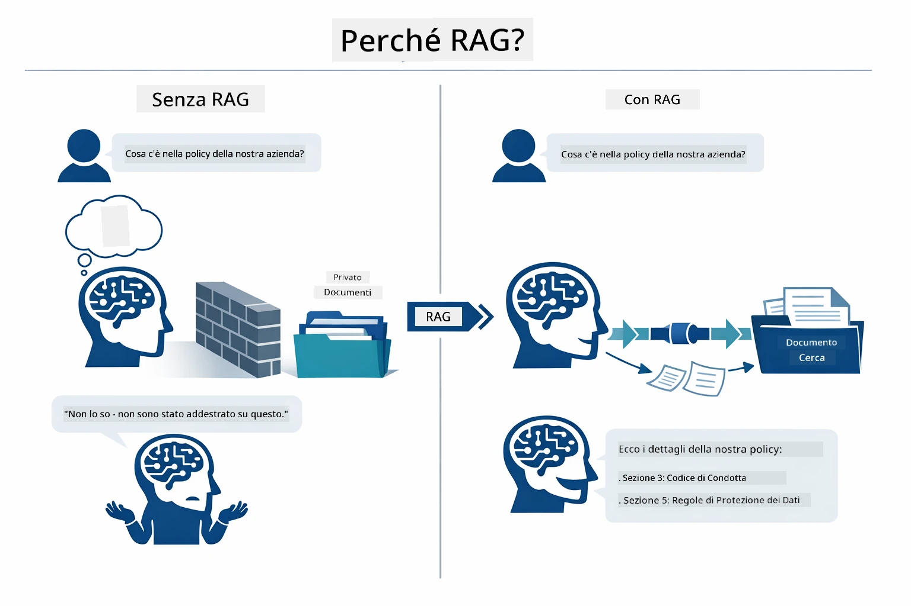

*Questo diagramma mostra la differenza tra un LLM standard (che indovina dai dati di addestramento) e un LLM potenziato con RAG (che consulta prima i tuoi documenti).*

Ecco come i pezzi si connettono end-to-end. La domanda di un utente passa attraverso quattro fasi — embedding, ricerca vettoriale, assemblaggio del contesto e generazione della risposta — ciascuna costruita sulla precedente:


*Questo diagramma mostra la pipeline RAG end-to-end — una query utente passa attraverso embedding, ricerca vettoriale, assemblaggio del contesto e generazione della risposta.*

Il resto di questo modulo illustra ogni fase in dettaglio, con codice che puoi eseguire e modificare.

### Quale Approccio RAG Usa Questo Tutorial?

LangChain4j offre tre modi per implementare RAG, ciascuno con un diverso livello di astrazione. Il diagramma qui sotto li confronta affiancati:

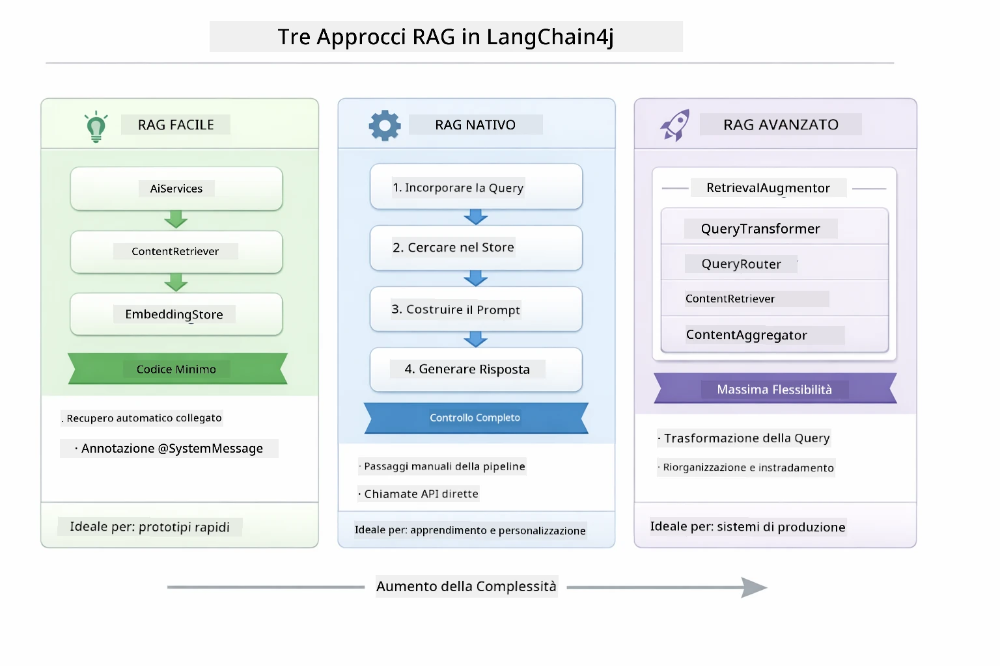

*Questo diagramma confronta i tre approcci RAG di LangChain4j — Easy, Native e Advanced — mostrando i loro componenti chiave e quando usarli.*

| Approccio | Cosa Fa | Compromesso |
|---|---|---|
| **Easy RAG** | Collega tutto automaticamente tramite `AiServices` e `ContentRetriever`. Annoti un'interfaccia, colleghi un retriever, e LangChain4j gestisce embedding, ricerca e assemblaggio prompt dietro le quinte. | Codice minimo, ma non vedi cosa succede a ogni passo. |
| **Native RAG** | Chiami il modello di embedding, cerchi nello store, costruisci il prompt e generi la risposta tu stesso — un passo esplicito per volta. | Più codice, ma ogni fase è visibile e modificabile. |
| **Advanced RAG** | Usa il framework `RetrievalAugmentor` con trasformatori di query pluggabili, router, ri-ordinatori e iniettori di contenuto per pipeline di livello produttivo. | Massima flessibilità, ma complessità significativamente maggiore. |

**Questo tutorial usa l'approccio Native.** Ogni fase della pipeline RAG — embedding della query, ricerca nel vettore store, assemblaggio del contesto e generazione della risposta — è scritta esplicitamente in [`RagService.java`](../../../03-rag/src/main/java/com/example/langchain4j/rag/service/RagService.java). Questo è intenzionale: come risorsa di apprendimento è più importante che tu veda e capisca ogni fase piuttosto che minimizzare il codice. Una volta che ti senti a tuo agio con il funzionamento dei pezzi, puoi passare a Easy RAG per prototipi rapidi o a Advanced RAG per sistemi di produzione.

> **💡 Hai già visto Easy RAG in azione?** Il [modulo Quick Start](../00-quick-start/README.md) include un esempio di Document Q&A ([`SimpleReaderDemo.java`](../../../00-quick-start/src/main/java/com/example/langchain4j/quickstart/SimpleReaderDemo.java)) che usa l'approccio Easy RAG — LangChain4j gestisce automaticamente embedding, ricerca e assemblaggio prompt. Questo modulo fa il passo successivo rompendo quella pipeline per farti vedere e controllare ogni fase da solo.

Il diagramma qui sotto mostra la pipeline Easy RAG di quell'esempio Quick Start. Nota come `AiServices` e `EmbeddingStoreContentRetriever` nascondano tutta la complessità — carichi un documento, colleghi un retriever e ottieni risposte. L'approccio Native in questo modulo apre ognuno di quegli step nascosti:

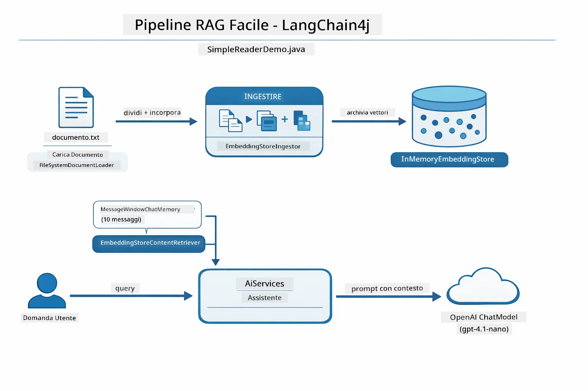

*Questo diagramma mostra la pipeline Easy RAG da `SimpleReaderDemo.java`. Confrontalo con l'approccio Native usato in questo modulo: Easy RAG nasconde embedding, recupero e assemblaggio prompt dietro `AiServices` e `ContentRetriever` — carichi un documento, colleghi un retriever e ottieni risposte. L'approccio Native in questo modulo rompe quella pipeline così chiami ogni fase (embed, ricerca, assemblaggio contesto, generazione) tu stesso, dandoti piena visibilità e controllo.*

## Come Funziona

La pipeline RAG in questo modulo si suddivide in quattro fasi che si eseguono in sequenza ogni volta che un utente fa una domanda. Per prima cosa, un documento caricato viene **analizzato e suddiviso in chunk** gestibili. Quei chunk vengono poi convertiti in **embedding vettoriali** e memorizzati così da poter essere confrontati matematicamente. Quando arriva una query, il sistema esegue una **ricerca semantica** per trovare i chunk più rilevanti, e infine li passa come contesto all'LLM per la **generazione della risposta**. Le sezioni seguenti spiegano ogni fase con codice e diagrammi concreti. Vediamo il primo passo.

### Elaborazione del Documento

[DocumentService.java](../../../03-rag/src/main/java/com/example/langchain4j/rag/service/DocumentService.java)

Quando carichi un documento, il sistema lo analizza (PDF o testo semplice), aggiunge metadati come il nome del file, e poi lo divide in chunk — pezzi più piccoli che stanno comodamente nella finestra di contesto del modello. Questi chunk si sovrappongono leggermente così non perdi il contesto ai confini.

```java
// Analizza il file caricato e incapsulalo in un Documento LangChain4j
Document document = Document.from(content, metadata);

// Dividi in blocchi di 300 token con una sovrapposizione di 30 token
DocumentSplitter splitter = DocumentSplitters
    .recursive(300, 30);

List<TextSegment> segments = splitter.split(document);
```

Il diagramma qui sotto mostra come funziona visivamente. Nota come ogni chunk condivide alcuni token con i suoi vicini — una sovrapposizione di 30 token assicura che nessun contesto importante venga perso:

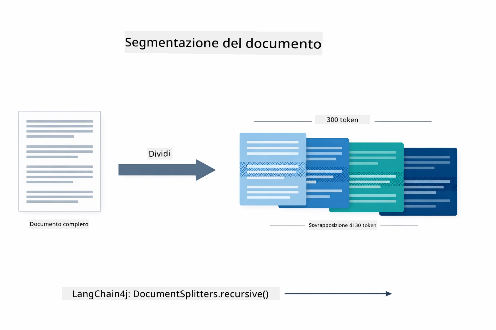

*Questo diagramma mostra un documento suddiviso in chunk da 300 token con sovrapposizione di 30 token, preservando il contesto ai confini dei chunk.*

> **🤖 Prova con [GitHub Copilot](https://github.com/features/copilot) Chat:** Apri [`DocumentService.java`](../../../03-rag/src/main/java/com/example/langchain4j/rag/service/DocumentService.java) e chiedi:
> - "Come divide LangChain4j i documenti in chunk e perché la sovrapposizione è importante?"
> - "Qual è la dimensione ottimale dei chunk per diversi tipi di documento e perché?"
> - "Come gestisco documenti in più lingue o con formattazioni speciali?"

### Creazione degli Embedding

[LangChainRagConfig.java](../../../03-rag/src/main/java/com/example/langchain4j/rag/config/LangChainRagConfig.java)

Ogni chunk viene convertito in una rappresentazione numerica chiamata embedding — essenzialmente un convertitore da significato a numeri. Il modello di embedding non è "intelligente" come un modello chat; non può seguire istruzioni, ragionare o rispondere a domande. Quello che può fare è mappare il testo in uno spazio matematico dove significati simili si trovano vicini — "auto" vicino a "automobile," "politica di rimborso" vicino a "restituisci il mio denaro." Pensa a un modello chat come a una persona con cui puoi parlare; un modello di embedding è un sistema di archiviazione ultra-efficiente.

Il diagramma qui sotto visualizza questo concetto — entra testo, escono vettori numerici, e significati simili producono vettori vicini:

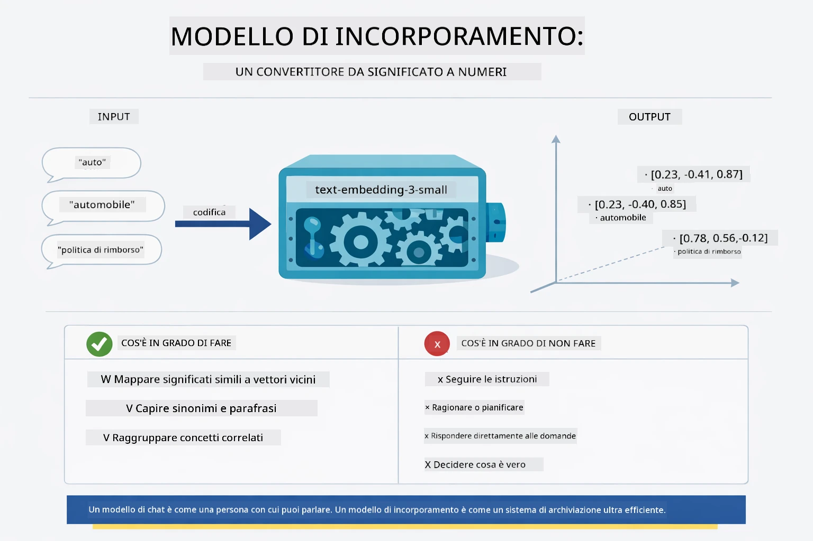

*Questo diagramma mostra come un modello di embedding converte testo in vettori numerici, collocando significati simili — come "auto" e "automobile" — vicini nello spazio vettoriale.*

```java
@Bean
public EmbeddingModel embeddingModel() {
    return OpenAiOfficialEmbeddingModel.builder()
        .baseUrl(azureOpenAiEndpoint)
        .apiKey(azureOpenAiKey)
        .modelName(azureEmbeddingDeploymentName)
        .build();
}

EmbeddingStore<TextSegment> embeddingStore = 
    new InMemoryEmbeddingStore<>();
```

Il diagramma delle classi qui sotto mostra i due flussi separati in una pipeline RAG e le classi LangChain4j che li implementano. Il **flusso di ingestione** (eseguito una volta al caricamento) divide il documento, crea gli embedding dei chunk e li memorizza via `.addAll()`. Il **flusso di query** (eseguito ogni volta che un utente fa una domanda) crea l'embedding della domanda, cerca nello store via `.search()`, e passa il contesto trovato al modello chat. Entrambi i flussi si incontrano all'interfaccia condivisa `EmbeddingStore<TextSegment>`:

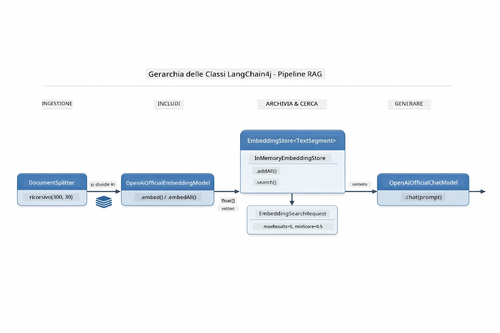

*Questo diagramma mostra i due flussi in una pipeline RAG — ingestione e query — e come si connettono attraverso un EmbeddingStore condiviso.*

Una volta memorizzati gli embedding, contenuti simili si raggruppano naturalmente insieme nello spazio vettoriale. La visualizzazione qui sotto mostra come documenti su argomenti correlati finiscono come punti vicini, rendendo possibile la ricerca semantica:


*Questa visualizzazione mostra come documenti correlati si raggruppano nello spazio vettoriale 3D, con argomenti come Documenti Tecnici, Regole Aziendali e FAQ che formano gruppi distinti.*

Quando un utente effettua una ricerca, il sistema segue quattro passi: embeddare i documenti una volta, embeddare la query a ogni ricerca, confrontare il vettore della query con tutti i vettori memorizzati usando la similarità coseno, e restituire i primi K chunk con punteggio più alto. Il diagramma qui sotto illustra ogni step e le classi LangChain4j coinvolte:

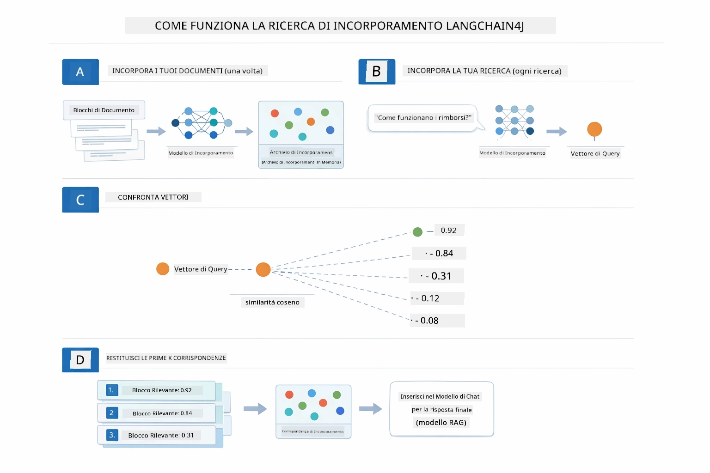

*Questo diagramma mostra il processo di ricerca per embedding in quattro passi: embeddare i documenti, embeddare la query, confrontare i vettori con similarità coseno, e restituire i risultati top-K.*

### Ricerca Semantica

[RagService.java](../../../03-rag/src/main/java/com/example/langchain4j/rag/service/RagService.java)

Quando fai una domanda, anche la tua domanda viene convertita in un embedding. Il sistema confronta l'embedding della tua domanda con quelli di tutti i chunk del documento. Trova i chunk con significati più simili — non solo con parole chiave corrispondenti, ma con reale similarità semantica.

```java
Embedding queryEmbedding = embeddingModel.embed(question).content();

EmbeddingSearchRequest searchRequest = EmbeddingSearchRequest.builder()
    .queryEmbedding(queryEmbedding)
    .maxResults(5)
    .minScore(0.5)
    .build();

EmbeddingSearchResult<TextSegment> searchResult = embeddingStore.search(searchRequest);
List<EmbeddingMatch<TextSegment>> matches = searchResult.matches();

for (EmbeddingMatch<TextSegment> match : matches) {
    String relevantText = match.embedded().text();
    double score = match.score();
}
```

Il diagramma qui sotto mette a confronto la ricerca semantica con la ricerca tradizionale per parole chiave. Una ricerca keyword per "vehicle" perde un chunk su "car and trucks," ma la ricerca semantica capisce che significano la stessa cosa e lo restituisce come risultato di punteggio alto:

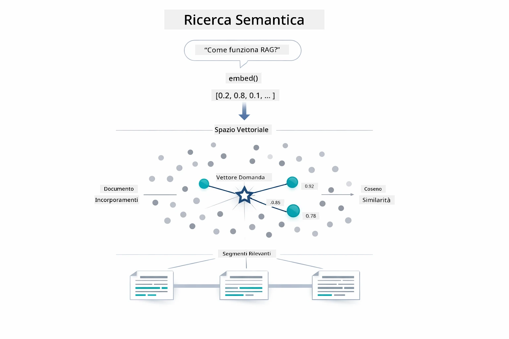

*Questo diagramma confronta la ricerca basata su parole chiave con la ricerca semantica, mostrando come la ricerca semantica recupera contenuti concettualmente correlati anche quando le parole chiave esatte differiscono.*
Sotto il cofano, la similarità è misurata usando la similarità coseno — che in sostanza chiede "queste due frecce puntano nella stessa direzione?" Due chunk possono usare parole completamente diverse, ma se significano la stessa cosa i loro vettori puntano nella stessa direzione e ottengono un punteggio vicino a 1.0:

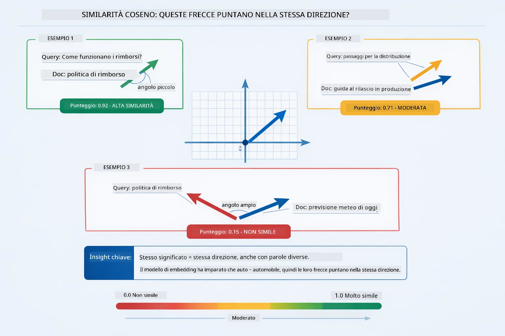

*Questo diagramma illustra la similarità coseno come l'angolo tra vettori di embedding — vettori più allineati ottengono un punteggio più vicino a 1.0, indicando una maggiore similarità semantica.*

> **🤖 Prova con [GitHub Copilot](https://github.com/features/copilot) Chat:** Apri [`RagService.java`](../../../03-rag/src/main/java/com/example/langchain4j/rag/service/RagService.java) e chiedi:
> - "Come funziona la ricerca di similarità con gli embeddings e cosa determina il punteggio?"
> - "Quale soglia di similarità dovrei usare e come influenza i risultati?"
> - "Come gestisco i casi in cui non si trovano documenti rilevanti?"

### Generazione della Risposta

[RagService.java](../../../03-rag/src/main/java/com/example/langchain4j/rag/service/RagService.java)

I chunk più rilevanti sono assemblati in un prompt strutturato che include istruzioni esplicite, il contesto recuperato e la domanda dell'utente. Il modello legge quei chunk specifici e risponde basandosi su quelle informazioni — può usare solo ciò che ha davanti, il che previene allucinazioni.

```java
String context = matches.stream()
    .map(match -> match.embedded().text())
    .collect(Collectors.joining("\n\n"));

String prompt = String.format("""
    Answer the question based on the following context.
    If the answer cannot be found in the context, say so.

    Context:
    %s

    Question: %s

    Answer:""", context, request.question());

String answer = chatModel.chat(prompt);
```

Il diagramma sottostante mostra questa composizione in azione — i chunk con il punteggio più alto dalla fase di ricerca sono inseriti nel template del prompt, e il `OpenAiOfficialChatModel` genera una risposta fondata:

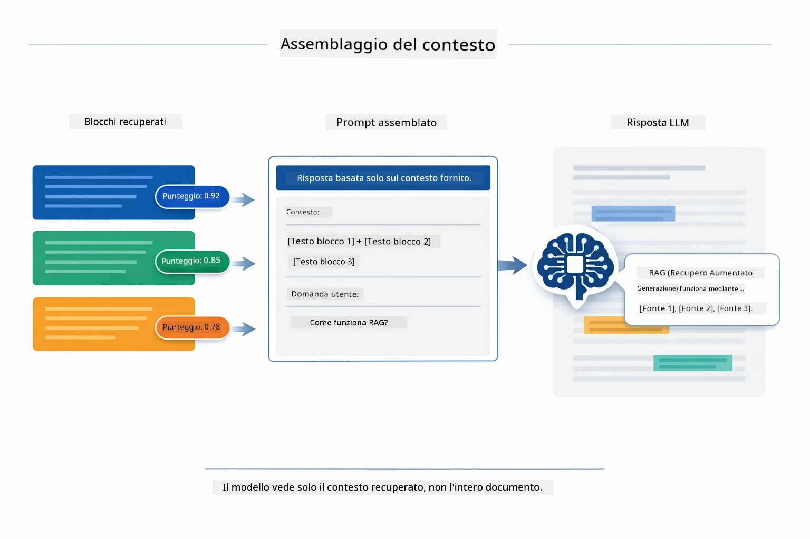

*Questo diagramma mostra come i chunk con il punteggio più alto sono assemblati in un prompt strutturato, permettendo al modello di generare una risposta basata sui tuoi dati.*

## Esegui l'Applicazione

**Verifica il deployment:**

Assicurati che il file `.env` esista nella directory root con le credenziali Azure (create durante il Modulo 01). Esegui questo dalla directory del modulo (`03-rag/`):

**Bash:**
```bash
cat ../.env  # Dovrebbe mostrare AZURE_OPENAI_ENDPOINT, API_KEY, DEPLOYMENT
```

**PowerShell:**
```powershell
Get-Content ..\.env  # Dovrebbe mostrare AZURE_OPENAI_ENDPOINT, API_KEY, DEPLOYMENT
```

**Avvia l'applicazione:**

> **Nota:** Se hai già avviato tutte le applicazioni usando `./start-all.sh` dalla directory root (come descritto nel Modulo 01), questo modulo è già in esecuzione sulla porta 8081. Puoi saltare i comandi di avvio qui sotto e andare direttamente su http://localhost:8081.

**Opzione 1: Usare Spring Boot Dashboard (Consigliato per utenti VS Code)**

Il container di sviluppo include l’estensione Spring Boot Dashboard, che fornisce un'interfaccia visiva per gestire tutte le applicazioni Spring Boot. Puoi trovarla nella Activity Bar a sinistra in VS Code (cerca l’icona di Spring Boot).

Dal Spring Boot Dashboard, puoi:
- Vedere tutte le applicazioni Spring Boot disponibili nello workspace
- Avviare/fermare applicazioni con un solo clic
- Visualizzare i log delle applicazioni in tempo reale
- Monitorare lo stato delle applicazioni

Basta cliccare il pulsante play accanto a "rag" per avviare questo modulo, oppure avviare tutti i moduli insieme.


*Questa schermata mostra il Spring Boot Dashboard in VS Code, dove puoi avviare, fermare e monitorare visivamente le applicazioni.*

**Opzione 2: Usare gli script shell**

Avvia tutte le applicazioni web (moduli 01-04):

**Bash:**
```bash
cd ..  # Dalla directory principale
./start-all.sh
```

**PowerShell:**
```powershell
cd ..  # Dalla directory root
.\start-all.ps1
```

Oppure avvia solo questo modulo:

**Bash:**
```bash
cd 03-rag
./start.sh
```

**PowerShell:**
```powershell
cd 03-rag
.\start.ps1
```

Entrambi gli script caricano automaticamente le variabili d’ambiente dal file `.env` nella root e compileranno i JAR se non esistono.

> **Nota:** Se preferisci compilare manualmente tutti i moduli prima di avviare:
>
> **Bash:**
> ```bash
> cd ..  # Go to root directory
> mvn clean package -DskipTests
> ```
>
> **PowerShell:**
> ```powershell
> cd ..  # Go to root directory
> mvn clean package -DskipTests
> ```

Apri http://localhost:8081 nel browser.

**Per fermare:**

**Bash:**
```bash
./stop.sh  # Solo questo modulo
# O
cd .. && ./stop-all.sh  # Tutti i moduli
```

**PowerShell:**
```powershell
.\stop.ps1  # Solo questo modulo
# O
cd ..; .\stop-all.ps1  # Tutti i moduli
```

## Uso dell'Applicazione

L'applicazione fornisce un'interfaccia web per il caricamento dei documenti e per porre domande.

<a href="images/rag-homepage.png"></a>

*Questa schermata mostra l’interfaccia dell’applicazione RAG dove carichi documenti e poni domande.*

### Carica un Documento

Inizia caricando un documento - i file TXT sono i migliori per i test. Un `sample-document.txt` è fornito in questa directory e contiene informazioni sulle funzionalità di LangChain4j, implementazione RAG e best practices - perfetto per testare il sistema.

Il sistema processa il tuo documento, lo suddivide in chunk e crea embeddings per ogni chunk. Questo avviene automaticamente al caricamento.

### Poni Domande

Ora poni domande specifiche sul contenuto del documento. Prova qualcosa di fattuale che sia chiaramente indicato nel documento. Il sistema cerca chunk rilevanti, li include nel prompt e genera una risposta.

### Verifica le Fonti

Nota che ogni risposta include riferimenti alle fonti con i punteggi di similarità. Questi punteggi (da 0 a 1) mostrano quanto ogni chunk era rilevante per la tua domanda. Punteggi più alti significano corrispondenze migliori. Questo ti permette di verificare la risposta confrontandola con il materiale sorgente.

<a href="images/rag-query-results.png"></a>

*Questa schermata mostra i risultati della query con la risposta generata, i riferimenti alle fonti e i punteggi di rilevanza per ogni chunk recuperato.*

### Sperimenta con le Domande

Prova diversi tipi di domande:
- Fatti specifici: "Qual è l’argomento principale?"
- Confronti: "Qual è la differenza tra X e Y?"
- Sommari: "Riassumi i punti chiave riguardo a Z"

Osserva come cambiano i punteggi di rilevanza in base a quanto la tua domanda corrisponde al contenuto del documento.

## Concetti Chiave

### Strategia di Suddivisione in Chunk

I documenti sono suddivisi in chunk da 300 token con 30 token di sovrapposizione. Questo equilibrio garantisce che ogni chunk abbia abbastanza contesto per essere significativo ma rimanga sufficientemente piccolo per includere più chunk in un prompt.

### Punteggi di Similarità

Ogni chunk recuperato ha un punteggio di similarità compreso tra 0 e 1 che indica quanto si avvicina alla domanda dell’utente. Il diagramma sottostante visualizza gli intervalli di punteggio e come il sistema li usa per filtrare i risultati:

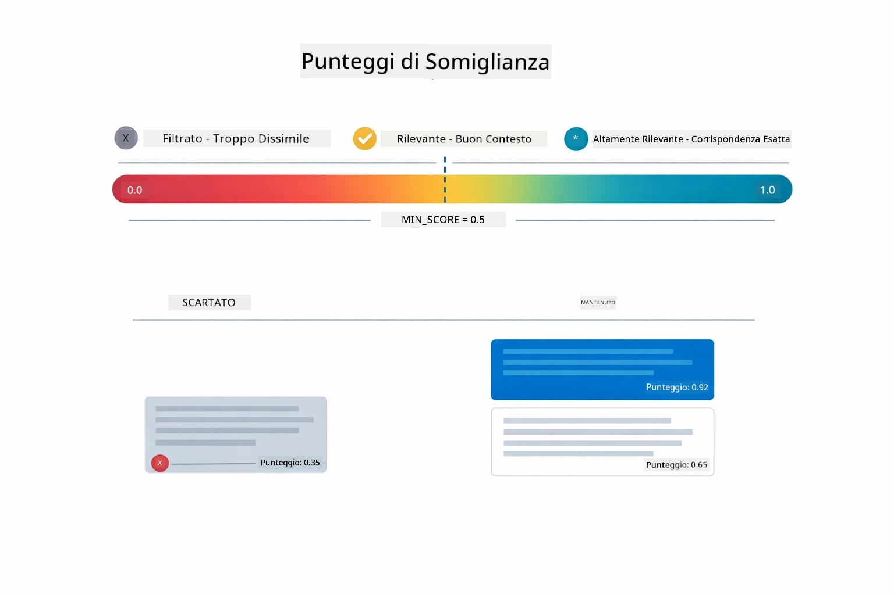

*Questo diagramma mostra gli intervalli di punteggio da 0 a 1, con una soglia minima di 0.5 che filtra i chunk irrilevanti.*

I punteggi variano da 0 a 1:
- 0.7-1.0: Altamente rilevante, corrispondenza esatta
- 0.5-0.7: Rilevante, buon contesto
- Sotto 0.5: Filtrato, troppo dissimile

Il sistema recupera solo chunk sopra la soglia minima per garantire qualità.

Gli embeddings funzionano bene quando i significati si raggruppano chiaramente, ma hanno punti ciechi. Il diagramma sottostante mostra i modi comuni di fallimento — chunk troppo grandi producono vettori confusi, chunk troppo piccoli mancano di contesto, termini ambigui puntano a più cluster, e ricerche esatte (ID, numeri di parte) non funzionano affatto con gli embeddings:

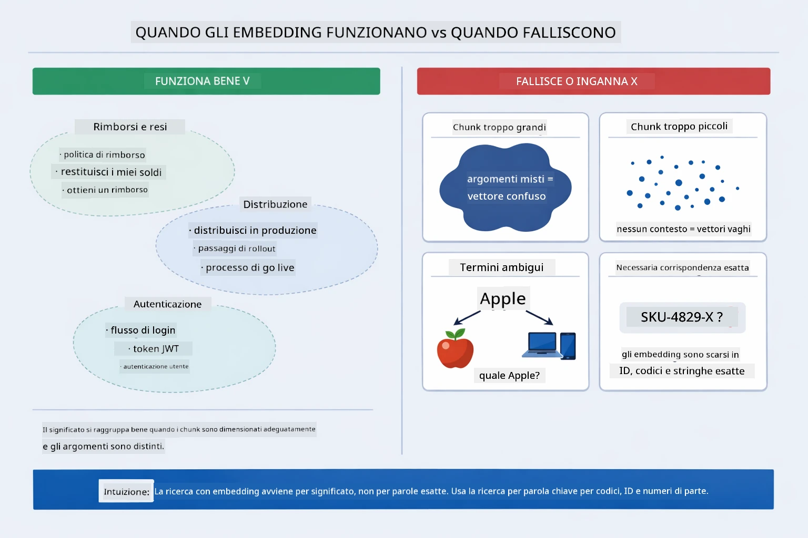

*Questo diagramma mostra i modi comuni di fallimento degli embeddings: chunk troppo grandi, chunk troppo piccoli, termini ambigui che puntano a cluster multipli, e ricerche esatte come ID.*

### Memorizzazione in Memoria

Questo modulo usa una memorizzazione in memoria per semplicità. Quando riavvii l’applicazione, i documenti caricati vanno persi. I sistemi di produzione usano database vettoriali persistenti come Qdrant o Azure AI Search.

### Gestione della Finestra di Contesto

Ogni modello ha una massima finestra di contesto. Non puoi includere ogni chunk da un documento lungo. Il sistema recupera i primi N chunk più rilevanti (default 5) per restare nei limiti fornendo abbastanza contesto per risposte accurate.

## Quando RAG Conta

RAG non è sempre l’approccio giusto. La guida decisionale sottostante ti aiuta a capire quando RAG apporta valore rispetto a quando approcci più semplici — come includere direttamente il contenuto nel prompt o affidarsi alla conoscenza built-in del modello — sono sufficienti:

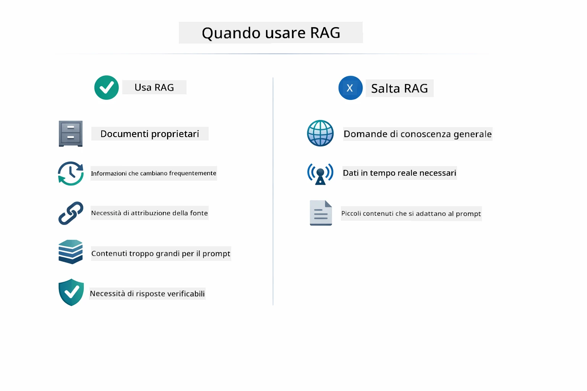

*Questo diagramma mostra una guida decisionale per quando RAG apporta valore rispetto a quando approcci più semplici sono sufficienti.*

## Prossimi Passi

**Modulo Successivo:** [04-tools - AI Agents with Tools](../04-tools/README.md)

---

**Navigazione:** [← Precedente: Modulo 02 - Prompt Engineering](../02-prompt-engineering/README.md) | [Torna al Principale](../README.md) | [Successivo: Modulo 04 - Tools →](../04-tools/README.md)

---

<!-- CO-OP TRANSLATOR DISCLAIMER START -->
**Disclaimer**:
Questo documento è stato tradotto utilizzando il servizio di traduzione automatica [Co-op Translator](https://github.com/Azure/co-op-translator). Pur impegnandoci per garantire accuratezza, si prega di essere consapevoli che le traduzioni automatiche possono contenere errori o imprecisioni. Il documento originale nella sua lingua originale deve essere considerato la fonte autorevole. Per informazioni critiche, si consiglia di utilizzare una traduzione professionale effettuata da un essere umano. Non ci assumiamo alcuna responsabilità per eventuali malintesi o interpretazioni errate derivanti dall’uso di questa traduzione.
<!-- CO-OP TRANSLATOR DISCLAIMER END -->