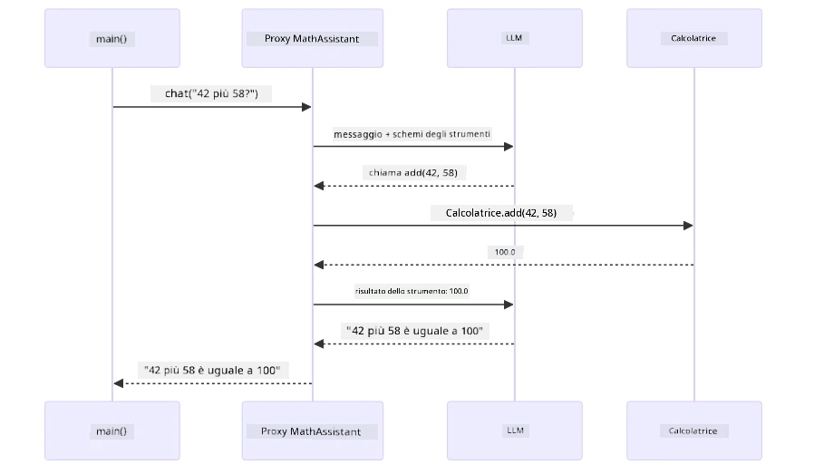
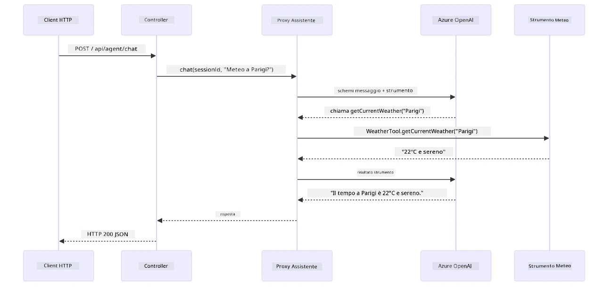

# Modulo 04: Agenti AI con Strumenti

## Indice

- [Cosa Imparerai](../../../04-tools)
- [Prerequisiti](../../../04-tools)
- [Comprendere gli Agenti AI con Strumenti](../../../04-tools)
- [Come Funziona la Chiamata agli Strumenti](../../../04-tools)
  - [Definizioni degli Strumenti](../../../04-tools)
  - [Processo Decisionale](../../../04-tools)
  - [Esecuzione](../../../04-tools)
  - [Generazione della Risposta](../../../04-tools)
  - [Architettura: Auto-Wiring in Spring Boot](../../../04-tools)
- [Catena di Strumenti](../../../04-tools)
- [Esegui l'Applicazione](../../../04-tools)
- [Usare l'Applicazione](../../../04-tools)
  - [Prova un Uso Semplice degli Strumenti](../../../04-tools)
  - [Testa la Catena di Strumenti](../../../04-tools)
  - [Visualizza il Flusso della Conversazione](../../../04-tools)
  - [Sperimenta con Richieste Diverse](../../../04-tools)
- [Concetti Chiave](../../../04-tools)
  - [Pattern ReAct (Ragionare e Agire)](../../../04-tools)
  - [Le Descrizioni Degli Strumenti Sono Importanti](../../../04-tools)
  - [Gestione della Sessione](../../../04-tools)
  - [Gestione degli Errori](../../../04-tools)
- [Strumenti Disponibili](../../../04-tools)
- [Quando Usare Agenti Basati su Strumenti](../../../04-tools)
- [Strumenti vs RAG](../../../04-tools)
- [Passi Successivi](../../../04-tools)

## Cosa Imparerai

Finora hai imparato a conversare con l’AI, strutturare efficacemente i prompt e ancorare le risposte ai tuoi documenti. Ma esiste una limitazione fondamentale: i modelli di linguaggio possono solo generare testo. Non possono controllare il meteo, eseguire calcoli, interrogare database o interagire con sistemi esterni.

Gli strumenti cambiano questo. Fornendo al modello accesso a funzioni che può chiamare, lo trasformi da generatore di testo ad agente capace di agire. Il modello decide quando ha bisogno di uno strumento, quale usare e quali parametri passare. Il tuo codice esegue la funzione e restituisce il risultato. Il modello integra quel risultato nella sua risposta.

## Prerequisiti

- Completato il [Modulo 01 - Introduzione](../01-introduction/README.md) (risorse Azure OpenAI distribuite)
- Completati i moduli precedenti consigliati (questo modulo fa riferimento ai [concetti RAG del Modulo 03](../03-rag/README.md) nel confronto Strumenti vs RAG)
- File `.env` nella directory radice con le credenziali Azure (creato da `azd up` nel Modulo 01)

> **Nota:** Se non hai completato il Modulo 01, segui prima le istruzioni di distribuzione presenti lì.

## Comprendere gli Agenti AI con Strumenti

> **📝 Nota:** Il termine "agenti" in questo modulo si riferisce ad assistenti AI potenziati con capacità di chiamata di strumenti. Questo è diverso dai pattern **Agentic AI** (agenti autonomi con pianificazione, memoria e ragionamento multi-step) che tratteremo nel [Modulo 05: MCP](../05-mcp/README.md).

Senza strumenti, un modello di linguaggio può solo generare testo dai dati di addestramento. Chiedi il meteo attuale e deve indovinare. Fornisci strumenti, e può chiamare un'API meteo, eseguire calcoli o interrogare un database — poi integra quei risultati reali nella sua risposta.


*Senza strumenti il modello può solo indovinare — con gli strumenti può chiamare API, eseguire calcoli e restituire dati in tempo reale.*

Un agente AI con strumenti segue un pattern **Reasoning and Acting (ReAct)**. Il modello non si limita a rispondere — pensa a ciò di cui ha bisogno, agisce chiamando uno strumento, osserva il risultato e poi decide se agire di nuovo o fornire la risposta finale:

1. **Ragiona** — L’agente analizza la domanda dell’utente e determina quali informazioni servono
2. **Agisce** — L’agente seleziona lo strumento corretto, genera i parametri giusti e lo chiama
3. **Osserva** — L’agente riceve l’output dello strumento e valuta il risultato
4. **Ripete o Risponde** — Se servono altri dati, il ciclo si ripete; altrimenti compone una risposta in linguaggio naturale


*Il ciclo ReAct — l'agente ragiona su cosa fare, agisce chiamando uno strumento, osserva il risultato e ripete finché può fornire la risposta finale.*

Questo avviene automaticamente. Definisci gli strumenti e le loro descrizioni. Il modello gestisce il processo decisionale su quando e come usarli.

## Come Funziona la Chiamata agli Strumenti

### Definizioni degli Strumenti

[WeatherTool.java](../../../04-tools/src/main/java/com/example/langchain4j/agents/tools/WeatherTool.java) | [TemperatureTool.java](../../../04-tools/src/main/java/com/example/langchain4j/agents/tools/TemperatureTool.java)

Definisci funzioni con descrizioni chiare e specifiche dei parametri. Il modello vede queste descrizioni nel prompt di sistema e comprende cosa fa ogni strumento.

```java
@Component
public class WeatherTool {
    
    @Tool("Get the current weather for a location")
    public String getCurrentWeather(@P("Location name") String location) {
        // La tua logica di ricerca del meteo
        return "Weather in " + location + ": 22°C, cloudy";
    }
}

@AiService
public interface Assistant {
    String chat(@MemoryId String sessionId, @UserMessage String message);
}

// Assistant è automaticamente configurato da Spring Boot con:
// - Bean ChatModel
// - Tutti i metodi @Tool dalle classi @Component
// - ChatMemoryProvider per la gestione della sessione
```

Il diagramma qui sotto scompone ogni annotazione e mostra come ogni elemento aiuta l’AI a capire quando chiamare lo strumento e quali argomenti passare:


*Anatomia di una definizione di strumento — @Tool dice all’AI quando usarlo, @P descrive ogni parametro, e @AiService collega tutto all’avvio.*

> **🤖 Prova con [GitHub Copilot](https://github.com/features/copilot) Chat:** Apri [`WeatherTool.java`](../../../04-tools/src/main/java/com/example/langchain4j/agents/tools/WeatherTool.java) e chiedi:
> - "Come integrerei una vera API meteo come OpenWeatherMap invece di dati simulati?"
> - "Cosa rende una buona descrizione dello strumento che aiuta l’AI a usarlo correttamente?"
> - "Come gestisco errori API e limiti di chiamate nelle implementazioni degli strumenti?"

### Processo Decisionale

Quando un utente chiede "Che tempo fa a Seattle?", il modello non sceglie uno strumento a caso. Confronta l’intento dell’utente con ogni descrizione di strumento disponibile, assegna un punteggio di rilevanza e seleziona la corrispondenza migliore. Genera poi una chiamata di funzione strutturata con i parametri giusti — in questo caso, impostando `location` a `"Seattle"`.

Se nessuno strumento corrisponde alla richiesta, il modello risponde attingendo alla propria conoscenza. Se più strumenti corrispondono, sceglie il più specifico.


*Il modello valuta ogni strumento disponibile rispetto all’intento dell’utente e seleziona la corrispondenza migliore — ecco perché scrivere descrizioni chiare e specifiche è importante.*

### Esecuzione

[AgentService.java](../../../04-tools/src/main/java/com/example/langchain4j/agents/service/AgentService.java)

Spring Boot collega automaticamente l’interfaccia dichiarativa `@AiService` con tutti gli strumenti registrati, e LangChain4j esegue automaticamente le chiamate agli strumenti. Dietro le quinte, una chiamata completa segue sei fasi — dalla domanda in linguaggio naturale dell’utente fino alla risposta in linguaggio naturale:


*Il flusso end-to-end — l’utente fa una domanda, il modello seleziona uno strumento, LangChain4j lo esegue, e il modello integra il risultato in una risposta naturale.*

Se hai eseguito il [ToolIntegrationDemo](../../../00-quick-start/src/main/java/com/example/langchain4j/quickstart/ToolIntegrationDemo.java) nel Modulo 00, hai già visto questo schema in azione — gli strumenti `Calculator` venivano chiamati nello stesso modo. Il diagramma di sequenza qui sotto mostra esattamente cosa è successo internamente durante quella demo:



*Il ciclo di chiamata dello strumento dalla demo Quick Start — `AiServices` invia il tuo messaggio e gli schemi degli strumenti all’LLM, l’LLM risponde con una chiamata di funzione come `add(42, 58)`, LangChain4j esegue localmente il metodo `Calculator` e restituisce il risultato per la risposta finale.*

> **🤖 Prova con [GitHub Copilot](https://github.com/features/copilot) Chat:** Apri [`AgentService.java`](../../../04-tools/src/main/java/com/example/langchain4j/agents/service/AgentService.java) e chiedi:
> - "Come funziona il pattern ReAct e perché è efficace per gli agenti AI?"
> - "Come decide l'agente quale strumento usare e in quale ordine?"
> - "Cosa succede se l’esecuzione di uno strumento fallisce — come gestire robustamente gli errori?"

### Generazione della Risposta

Il modello riceve i dati meteo e li formatta in una risposta in linguaggio naturale per l’utente.

### Architettura: Auto-Wiring in Spring Boot

Questo modulo usa l’integrazione LangChain4j con Spring Boot tramite interfacce dichiarative `@AiService`. All’avvio Spring Boot scopre ogni `@Component` che contiene metodi `@Tool`, il bean `ChatModel` e il `ChatMemoryProvider` — quindi li collega tutti in una singola interfaccia `Assistant` senza alcun codice boilerplate.


*L’interfaccia @AiService collega ChatModel, componenti degli strumenti e fornitore di memoria — Spring Boot si occupa automaticamente di tutto il wiring.*

Ecco il ciclo completo della richiesta come diagramma di sequenza — dalla richiesta HTTP attraverso controller, servizio e proxy collegato automaticamente, fino all’esecuzione dello strumento e ritorno:



*Il ciclo completo di richiesta Spring Boot — la richiesta HTTP passa attraverso controller e servizio fino al proxy Assistant collegato automaticamente, che orchestra LLM e chiamate agli strumenti.*

I principali vantaggi di questo approccio:

- **Auto-wiring Spring Boot** — ChatModel e strumenti iniettati automaticamente
- **Pattern @MemoryId** — Gestione della memoria sessione-basata automatica
- **Istanza singola** — L’Assistant è creato una volta e riutilizzato per migliori prestazioni
- **Esecuzione type-safe** — Metodi Java chiamati direttamente con conversione tipi
- **Orchestrazione multi-turno** — Gestisce automaticamente la catena di strumenti
- **Zero boilerplate** — Nessuna chiamata manuale a `AiServices.builder()` o mappe di memoria

Approcci alternativi (manuale con `AiServices.builder()`) richiedono più codice e non beneficiano dell’integrazione Spring Boot.

## Catena di Strumenti

**Catena di Strumenti** — Il vero potere degli agenti basati su strumenti si vede quando una singola domanda richiede più strumenti. Chiedi "Che tempo fa a Seattle in Fahrenheit?" e l’agente concatena automaticamente due strumenti: prima chiama `getCurrentWeather` per ottenere la temperatura in Celsius, poi passa quel valore a `celsiusToFahrenheit` per la conversione — tutto in un singolo turno di conversazione.


*Catena di strumenti in azione — l’agente chiama prima getCurrentWeather, poi passa il risultato in Celsius a celsiusToFahrenheit e fornisce una risposta combinata.*

**Gestione Graceful degli Errori** — Chiedi il meteo in una città non presente nei dati simulati. Lo strumento restituisce un messaggio di errore e l’AI spiega che non può aiutare anziché andare in crash. Gli strumenti falliscono in modo sicuro. Il diagramma qui sotto contrappone i due approcci — con corretta gestione errori l’agente cattura l’eccezione e risponde con spiegazioni utili, mentre senza di essa l’intera applicazione si blocca:


*Quando uno strumento fallisce, l’agente cattura l’errore e risponde con una spiegazione utile invece di andare in crash.*

Questo accade in un solo turno di conversazione. L’agente orchestra autonomamente più chiamate agli strumenti.

## Esegui l'Applicazione

**Verifica la distribuzione:**

Assicurati che il file `.env` esista nella directory radice con le credenziali Azure (creato durante il Modulo 01). Esegui questo comando dalla directory del modulo (`04-tools/`):

**Bash:**
```bash
cat ../.env  # Dovrebbe mostrare AZURE_OPENAI_ENDPOINT, API_KEY, DEPLOYMENT
```

**PowerShell:**
```powershell
Get-Content ..\.env  # Dovrebbe mostrare AZURE_OPENAI_ENDPOINT, API_KEY, DEPLOYMENT
```

**Avvia l’applicazione:**

> **Nota:** Se hai già avviato tutte le applicazioni usando `./start-all.sh` dalla directory radice (come descritto nel Modulo 01), questo modulo è già in esecuzione sulla porta 8084. Puoi saltare i comandi di avvio sotto e andare direttamente su http://localhost:8084.

**Opzione 1: Usare la Spring Boot Dashboard (Raccomandata per utenti VS Code)**

Il container di sviluppo include l’estensione Spring Boot Dashboard, che fornisce un’interfaccia visiva per gestire tutte le applicazioni Spring Boot. Puoi trovarla nella barra delle attività sul lato sinistro di VS Code (cerca l’icona Spring Boot).

Dalla Spring Boot Dashboard puoi:
- Vedere tutte le app Spring Boot disponibili nello spazio di lavoro
- Avviare/fermare app con un clic
- Visualizzare i log in tempo reale
- Monitorare lo stato delle applicazioni

Basta cliccare il pulsante play accanto a "tools" per avviare questo modulo, oppure avviare tutti i moduli insieme.

Ecco come appare la Spring Boot Dashboard in VS Code:


*La Spring Boot Dashboard in VS Code — avvia, ferma e monitora tutti i moduli da un’unica interfaccia*

**Opzione 2: Usare gli script shell**

Avvia tutte le applicazioni web (moduli 01-04):

**Bash:**
```bash
cd ..  # Dalla directory radice
./start-all.sh
```

**PowerShell:**
```powershell
cd ..  # Dalla directory radice
.\start-all.ps1
```

Oppure avvia solo questo modulo:

**Bash:**
```bash
cd 04-tools
./start.sh
```

**PowerShell:**
```powershell
cd 04-tools
.\start.ps1
```

Entrambi gli script caricano automaticamente le variabili d'ambiente dal file `.env` nella radice e compileranno i JAR se non esistono.

> **Nota:** Se preferisci compilare manualmente tutti i moduli prima di avviare:
>
> **Bash:**
> ```bash
> cd ..  # Go to root directory
> mvn clean package -DskipTests
> ```
>
> **PowerShell:**
> ```powershell
> cd ..  # Go to root directory
> mvn clean package -DskipTests
> ```

Apri http://localhost:8084 nel tuo browser.

**Per interrompere:**

**Bash:**
```bash
./stop.sh  # Solo questo modulo
# O
cd .. && ./stop-all.sh  # Tutti i moduli
```

**PowerShell:**
```powershell
.\stop.ps1  # Solo questo modulo
# O
cd ..; .\stop-all.ps1  # Tutti i moduli
```

## Uso dell'Applicazione

L'applicazione fornisce un'interfaccia web dove puoi interagire con un agente AI che ha accesso a strumenti per il meteo e la conversione della temperatura. Ecco come appare l'interfaccia — include esempi rapidi e un pannello di chat per inviare richieste:

<a href="images/tools-homepage.png"></a>

*L'interfaccia degli Strumenti Agente AI - esempi rapidi e interfaccia di chat per interagire con gli strumenti*

### Prova l'Uso Semplice degli Strumenti

Inizia con una richiesta semplice: "Converti 100 gradi Fahrenheit in Celsius". L'agente riconosce che ha bisogno dello strumento di conversione della temperatura, lo chiama con i parametri corretti e restituisce il risultato. Nota come tutto questo sembri naturale - non hai specificato quale strumento usare né come chiamarlo.

### Prova a Concatenare gli Strumenti

Ora prova qualcosa di più complesso: "Che tempo fa a Seattle e converti la temperatura in Fahrenheit?" Guarda come l'agente procede per fasi. Prima ottiene il meteo (che restituisce in Celsius), riconosce che deve convertire in Fahrenheit, chiama lo strumento di conversione e combina entrambi i risultati in una sola risposta.

### Vedi il Flusso della Conversazione

L'interfaccia di chat mantiene la cronologia della conversazione, permettendoti di avere interazioni multi-turno. Puoi vedere tutte le domande e risposte precedenti, rendendo facile tracciare la conversazione e capire come l'agente costruisce il contesto attraverso scambi multipli.

<a href="images/tools-conversation-demo.png"></a>

*Conversazione multi-turno che mostra conversioni semplici, ricerche meteo e concatenazione di strumenti*

### Sperimenta con Diverse Richieste

Prova varie combinazioni:
- Ricerche meteo: "Che tempo fa a Tokyo?"
- Conversioni di temperatura: "Quanto sono 25°C in Kelvin?"
- Query combinate: "Controlla il meteo a Parigi e dimmi se è sopra i 20°C"

Nota come l'agente interpreta il linguaggio naturale e lo mappa alle chiamate corrette agli strumenti.

## Concetti Chiave

### Pattern ReAct (Ragionamento e Azione)

L'agente alterna tra ragionamento (decidere cosa fare) e azione (usare gli strumenti). Questo modello permette la risoluzione autonoma dei problemi anziché risposte solo a istruzioni.

### Le Descrizioni degli Strumenti Contano

La qualità delle descrizioni degli strumenti influisce direttamente su come l'agente li utilizza. Descrizioni chiare e specifiche aiutano il modello a capire quando e come chiamare ogni strumento.

### Gestione della Sessione

L'annotazione `@MemoryId` abilita la gestione automatica della memoria basata sulla sessione. Ogni ID di sessione ottiene un'istanza `ChatMemory` gestita dal bean `ChatMemoryProvider`, così più utenti possono interagire simultaneamente con l'agente senza mescolare le loro conversazioni. Il diagramma seguente mostra come più utenti vengono instradati a memorie isolate basate sui loro ID di sessione:


*Ogni ID di sessione mappa a una cronologia di conversazione isolata — gli utenti non vedono mai i messaggi degli altri.*

### Gestione degli Errori

Gli strumenti possono fallire — API che scadono, parametri invalidi, servizi esterni non disponibili. Gli agenti di produzione necessitano di gestione degli errori affinché il modello possa spiegare i problemi o tentare alternative anziché far crashare l'intera applicazione. Quando uno strumento genera un'eccezione, LangChain4j la intercetta e passa il messaggio di errore al modello, che poi può spiegare il problema con linguaggio naturale.

## Strumenti Disponibili

Il diagramma seguente mostra l’ampio ecosistema di strumenti che puoi costruire. Questo modulo dimostra strumenti per il meteo e la temperatura, ma lo stesso pattern `@Tool` funziona per qualsiasi metodo Java — da query di database a processi di pagamento.


*Qualsiasi metodo Java annotato con @Tool diventa disponibile all'AI — il pattern si estende a database, API, email, operazioni su file e altro.*

## Quando Usare Agenti Basati su Strumenti

Non tutte le richieste necessitano strumenti. La decisione dipende dal fatto se l'AI deve interagire con sistemi esterni o può rispondere con le proprie conoscenze. La guida seguente riassume quando gli strumenti aggiungono valore e quando sono superflui:


*Una guida rapida alla decisione — gli strumenti servono per dati in tempo reale, calcoli e azioni; conoscenza generale e compiti creativi non ne hanno bisogno.*

## Strumenti vs RAG

I moduli 03 e 04 estendono entrambi ciò che l'AI può fare, ma in modi fondamentalmente diversi. RAG dà al modello accesso alla **conoscenza** recuperando documenti. Gli strumenti danno al modello la capacità di compiere **azioni** chiamando funzioni. Il diagramma sotto confronta questi due approcci fianco a fianco — da come funziona ogni workflow ai compromessi tra loro:


*RAG recupera informazioni da documenti statici — gli Strumenti eseguono azioni e recuperano dati dinamici in tempo reale. Molti sistemi di produzione combinano entrambi.*

In pratica, molti sistemi di produzione combinano entrambi gli approcci: RAG per ancorare le risposte alla tua documentazione, e Strumenti per recuperare dati live o eseguire operazioni.

## Passi Successivi

**Modulo Successivo:** [05-mcp - Model Context Protocol (MCP)](../05-mcp/README.md)

---

**Navigazione:** [← Precedente: Modulo 03 - RAG](../03-rag/README.md) | [Torna al Principale](../README.md) | [Successivo: Modulo 05 - MCP →](../05-mcp/README.md)

---

<!-- CO-OP TRANSLATOR DISCLAIMER START -->
**Disclaimer**:  
Questo documento è stato tradotto utilizzando il servizio di traduzione automatica [Co-op Translator](https://github.com/Azure/co-op-translator). Pur impegnandoci per garantire accuratezza, si prega di considerare che le traduzioni automatiche possono contenere errori o imprecisioni. Il documento originale nella sua lingua nativa deve essere considerato la fonte autorevole. Per informazioni critiche, si raccomanda una traduzione professionale effettuata da un esperto umano. Non ci assumiamo responsabilità per eventuali fraintendimenti o interpretazioni errate derivanti dall’uso di questa traduzione.
<!-- CO-OP TRANSLATOR DISCLAIMER END -->