# Modulo 04: Agenti AI con Strumenti

## Indice

- [Cosa Imparerai](../../../04-tools)
- [Prerequisiti](../../../04-tools)
- [Comprendere gli Agenti AI con Strumenti](../../../04-tools)
- [Come Funziona la Chiamata agli Strumenti](../../../04-tools)
  - [Definizioni degli Strumenti](../../../04-tools)
  - [Processo Decisionale](../../../04-tools)
  - [Esecuzione](../../../04-tools)
  - [Generazione della Risposta](../../../04-tools)
  - [Architettura: Auto-Wiring di Spring Boot](../../../04-tools)
- [Catena di Strumenti](../../../04-tools)
- [Eseguire l'Applicazione](../../../04-tools)
- [Utilizzare l'Applicazione](../../../04-tools)
  - [Prova l'Uso Semplice dello Strumento](../../../04-tools)
  - [Testa la Catena di Strumenti](../../../04-tools)
  - [Visualizza il Flusso di Conversazione](../../../04-tools)
  - [Sperimenta con Richieste Diverse](../../../04-tools)
- [Concetti Chiave](../../../04-tools)
  - [Pattern ReAct (Ragionare e Agire)](../../../04-tools)
  - [Le Descrizioni degli Strumenti Contano](../../../04-tools)
  - [Gestione della Sessione](../../../04-tools)
  - [Gestione degli Errori](../../../04-tools)
- [Strumenti Disponibili](../../../04-tools)
- [Quando Usare Agenti Basati su Strumenti](../../../04-tools)
- [Strumenti vs RAG](../../../04-tools)
- [Passi Successivi](../../../04-tools)

## Cosa Imparerai

Finora, hai imparato come avere conversazioni con l'AI, strutturare i prompt in modo efficace e basare le risposte sui tuoi documenti. Ma c'è ancora una limitazione fondamentale: i modelli linguistici possono solo generare testo. Non possono controllare il meteo, eseguire calcoli, interrogare database o interagire con sistemi esterni.

Gli strumenti cambiano questo. Dando al modello l'accesso a funzioni che può chiamare, lo trasformi da un generatore di testo a un agente che può compiere azioni. Il modello decide quando ha bisogno di uno strumento, quale strumento usare e quali parametri passare. Il tuo codice esegue la funzione e restituisce il risultato. Il modello incorpora quel risultato nella sua risposta.

## Prerequisiti

- Completato [Modulo 01 - Introduzione](../01-introduction/README.md) (risorse Azure OpenAI distribuite)
- Completati i moduli precedenti consigliati (questo modulo fa riferimento ai [concetti RAG dal Modulo 03](../03-rag/README.md) nel confronto Strumenti vs RAG)
- File `.env` nella directory radice con credenziali Azure (creato da `azd up` nel Modulo 01)

> **Nota:** Se non hai completato il Modulo 01, segui prima le istruzioni di distribuzione lì.

## Comprendere gli Agenti AI con Strumenti

> **📝 Nota:** Il termine "agenti" in questo modulo si riferisce ad assistenti AI potenziati con capacità di chiamata agli strumenti. Questo è diverso dai pattern **Agentic AI** (agenti autonomi con pianificazione, memoria e ragionamento multi-step) che tratteremo nel [Modulo 05: MCP](../05-mcp/README.md).

Senza strumenti, un modello linguistico può solo generare testo dai suoi dati di addestramento. Chiedigli il meteo attuale, e deve indovinare. Dandogli strumenti, può chiamare un'API meteo, eseguire calcoli o interrogare un database — e poi intrecciare quei risultati reali nella sua risposta.

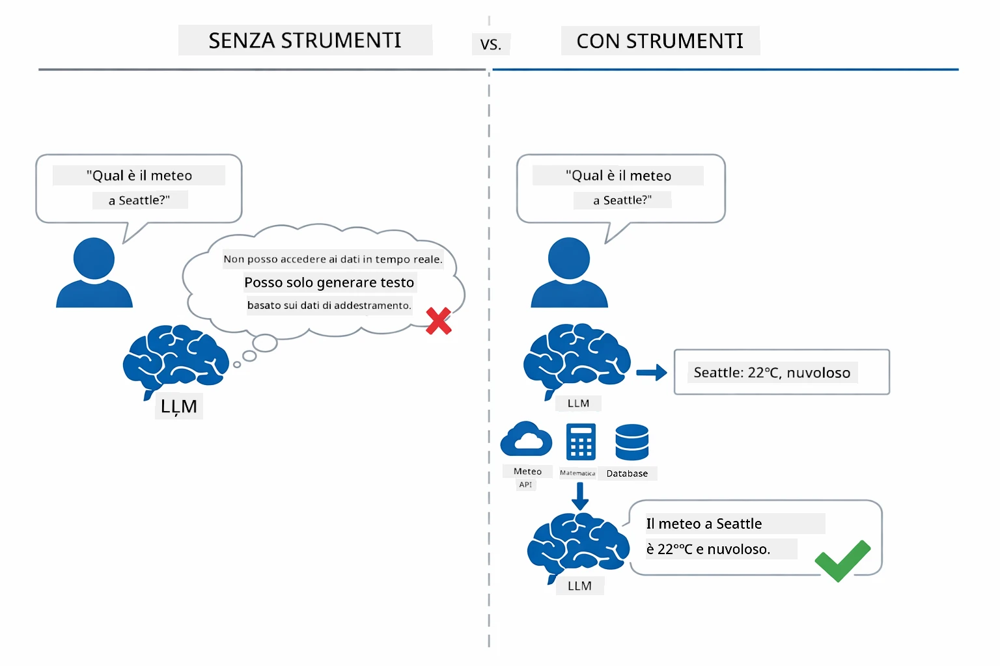

*Senza strumenti il modello può solo indovinare — con gli strumenti può chiamare API, eseguire calcoli e restituire dati in tempo reale.*

Un agente AI con strumenti segue un pattern **Ragionare e Agire (ReAct)**. Il modello non risponde solo — riflette su ciò di cui ha bisogno, agisce chiamando uno strumento, osserva il risultato, e poi decide se agire ancora o fornire la risposta finale:

1. **Ragiona** — L’agente analizza la domanda dell’utente e determina quali informazioni servono
2. **Agisci** — L’agente seleziona lo strumento giusto, genera i parametri corretti e lo chiama
3. **Osserva** — L’agente riceve l’output dello strumento e valuta il risultato
4. **Ripeti o Rispondi** — Se servono altri dati, l’agente ricomincia il ciclo; altrimenti compone una risposta in linguaggio naturale

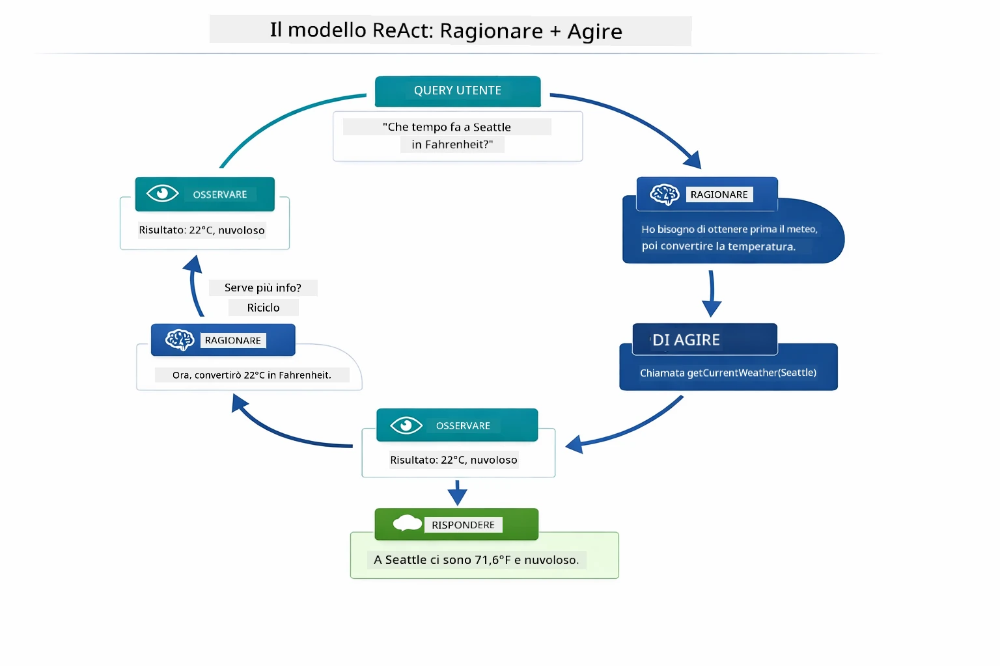

*Il ciclo ReAct — l’agente ragiona su cosa fare, agisce chiamando uno strumento, osserva il risultato e cicla finché può fornire la risposta finale.*

Questo avviene automaticamente. Definisci gli strumenti e le loro descrizioni. Il modello si occupa del processo decisionale su quando e come usarli.

## Come Funziona la Chiamata agli Strumenti

### Definizioni degli Strumenti

[WeatherTool.java](../../../04-tools/src/main/java/com/example/langchain4j/agents/tools/WeatherTool.java) | [TemperatureTool.java](../../../04-tools/src/main/java/com/example/langchain4j/agents/tools/TemperatureTool.java)

Definisci funzioni con descrizioni chiare e specifiche dei parametri. Il modello vede queste descrizioni nel suo prompt di sistema e capisce cosa fa ciascuno strumento.

```java
@Component
public class WeatherTool {
    
    @Tool("Get the current weather for a location")
    public String getCurrentWeather(@P("Location name") String location) {
        // La tua logica di ricerca meteo
        return "Weather in " + location + ": 22°C, cloudy";
    }
}

@AiService
public interface Assistant {
    String chat(@MemoryId String sessionId, @UserMessage String message);
}

// L'assistente è automaticamente configurato da Spring Boot con:
// - bean ChatModel
// - Tutti i metodi @Tool dalle classi @Component
// - ChatMemoryProvider per la gestione della sessione
```

Il diagramma sotto scompone ogni annotazione e mostra come ogni parte aiuta l’AI a capire quando chiamare lo strumento e quali argomenti passare:

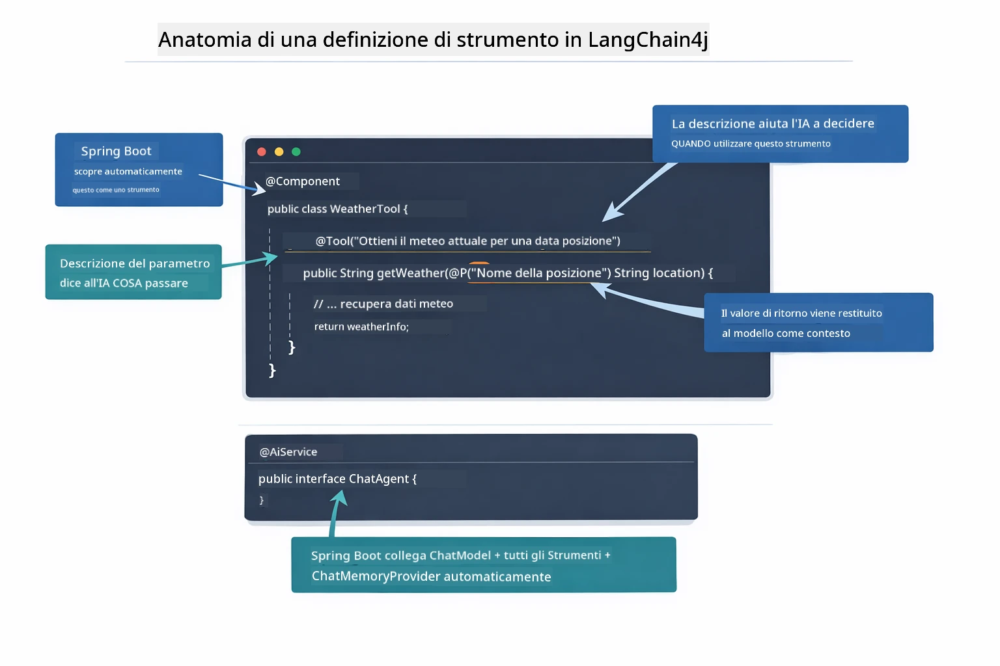

*Anatomia di una definizione di strumento — @Tool dice all’AI quando usarlo, @P descrive ogni parametro, e @AiService collega tutto all’avvio.*

> **🤖 Prova con la chat di [GitHub Copilot](https://github.com/features/copilot):** Apri [`WeatherTool.java`](../../../04-tools/src/main/java/com/example/langchain4j/agents/tools/WeatherTool.java) e chiedi:
> - "Come integrerei una vera API meteo come OpenWeatherMap invece dei dati fittizi?"
> - "Cosa rende una buona descrizione dello strumento che aiuta l’AI a usarlo correttamente?"
> - "Come gestisco gli errori API e i limiti di chiamata nelle implementazioni degli strumenti?"

### Processo Decisionale

Quando un utente chiede "Com'è il tempo a Seattle?", il modello non sceglie uno strumento a caso. Confronta l’intento dell’utente con ogni descrizione degli strumenti a cui ha accesso, valuta la rilevanza e seleziona la corrispondenza migliore. Poi genera una chiamata di funzione strutturata con i parametri giusti — in questo caso, impostando `location` a `"Seattle"`.

Se nessuno strumento corrisponde alla richiesta, il modello risponde con la sua conoscenza. Se più strumenti corrispondono, sceglie quello più specifico.

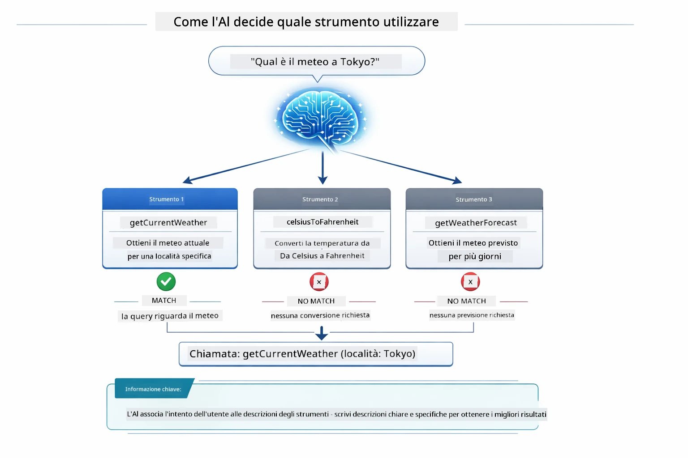

*Il modello valuta ogni strumento disponibile rispetto all’intento dell’utente e seleziona la corrispondenza migliore — per questo scrivere descrizioni chiare e specifiche è importante.*

### Esecuzione

[AgentService.java](../../../04-tools/src/main/java/com/example/langchain4j/agents/service/AgentService.java)

Spring Boot collega automaticamente l’interfaccia dichiarativa `@AiService` con tutti gli strumenti registrati, e LangChain4j esegue le chiamate agli strumenti automaticamente. Dietro le quinte, una chiamata completa allo strumento segue sei fasi — dalla domanda in linguaggio naturale dell’utente fino alla risposta sempre in linguaggio naturale:

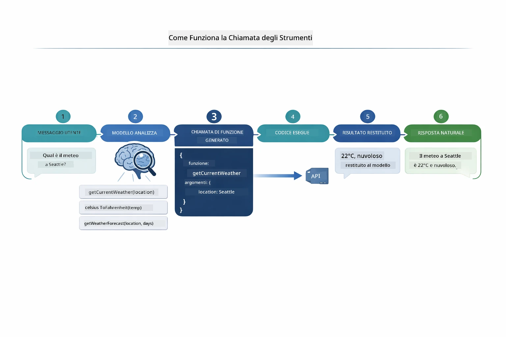

*Il flusso end-to-end — l’utente fa una domanda, il modello seleziona uno strumento, LangChain4j lo esegue, e il modello integra il risultato in una risposta naturale.*

> **🤖 Prova con la chat di [GitHub Copilot](https://github.com/features/copilot):** Apri [`AgentService.java`](../../../04-tools/src/main/java/com/example/langchain4j/agents/service/AgentService.java) e chiedi:
> - "Come funziona il pattern ReAct e perché è efficace per gli agenti AI?"
> - "Come decide l’agente quale strumento usare e in quale ordine?"
> - "Cosa succede se l’esecuzione di uno strumento fallisce - come gestire gli errori in modo robusto?"

### Generazione della Risposta

Il modello riceve i dati meteo e li formatta in una risposta in linguaggio naturale per l’utente.

### Architettura: Auto-Wiring di Spring Boot

Questo modulo utilizza l’integrazione di LangChain4j con Spring Boot tramite interfacce dichiarative `@AiService`. All’avvio Spring Boot scopre ogni `@Component` che contiene metodi `@Tool`, il bean `ChatModel` e il `ChatMemoryProvider` — poi li collega tutti in un’unica interfaccia `Assistant` senza scrivere codice boilerplate.

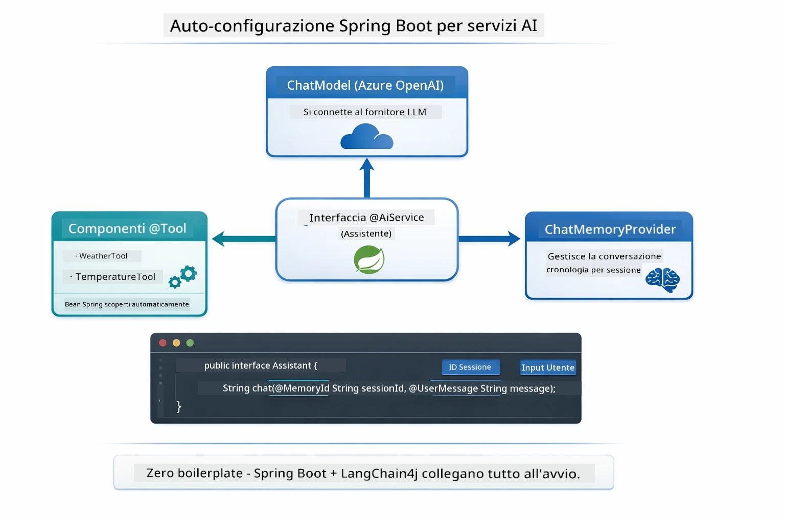

*L’interfaccia @AiService collega ChatModel, componenti degli strumenti e il provider di memoria — Spring Boot gestisce automaticamente il wiring.*

I principali vantaggi di questo approccio:

- **Auto-wiring di Spring Boot** — ChatModel e strumenti iniettati automaticamente
- **Pattern @MemoryId** — Gestione automatica della memoria basata sulla sessione
- **Istanza singola** — Assistant creato una volta e riutilizzato per migliore performance
- **Esecuzione type-safe** — Metodi Java chiamati direttamente con conversione tipi
- **Orchestrazione multi-turn** — Gestisce la catena di strumenti automaticamente
- **Zero boilerplate** — Nessuna chiamata manuale a `AiServices.builder()` o gestione manuale di HashMap memoria

Approcci alternativi (costruzione manuale con `AiServices.builder()`) richiedono più codice e non beneficiano dell’integrazione di Spring Boot.

## Catena di Strumenti

**Catena di Strumenti** — Il vero potere degli agenti basati su strumenti si vede quando una singola domanda richiede più strumenti. Chiedi "Com'è il tempo a Seattle in Fahrenheit?" e l'agente concatena automaticamente due strumenti: prima chiama `getCurrentWeather` per avere la temperatura in Celsius, poi passa quel valore a `celsiusToFahrenheit` per la conversione — tutto in un unico turno di conversazione.

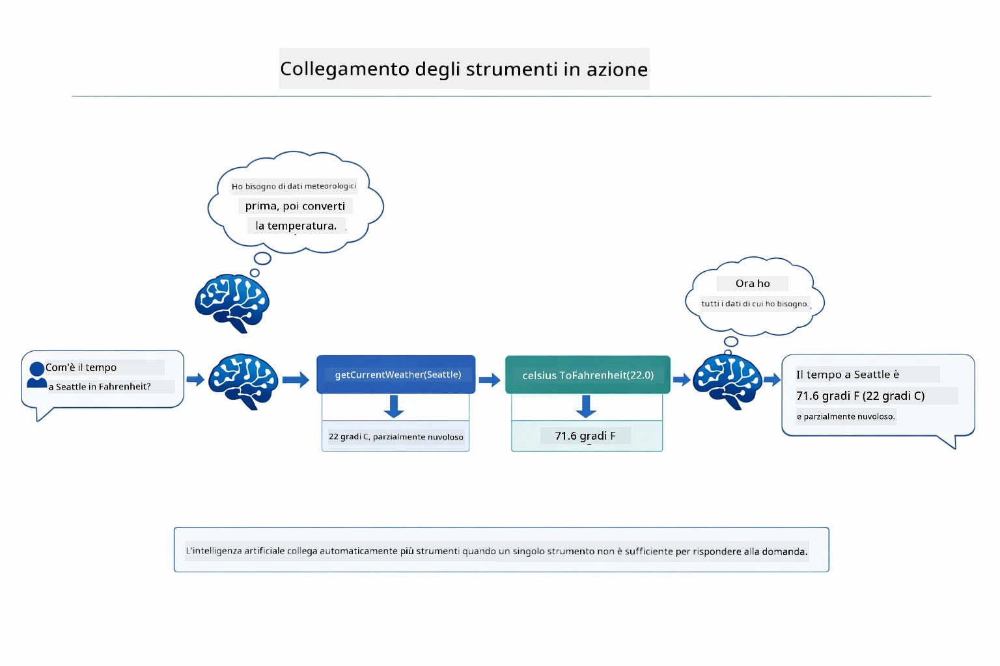

*Catena di strumenti in azione — l’agente chiama prima getCurrentWeather, poi invia il risultato in Celsius a celsiusToFahrenheit, e fornisce una risposta combinata.*

**Fallimenti Gestiti con Eleganza** — Chiedi il meteo per una città non nei dati fittizi. Lo strumento restituisce un messaggio di errore e l’AI spiega che non può aiutare invece di bloccarsi. Gli strumenti falliscono in modo sicuro. Il diagramma sotto confronta i due approcci — con corretta gestione degli errori, l’agente cattura l’eccezione e risponde in modo utile, mentre senza di essa l’intera applicazione crasha:

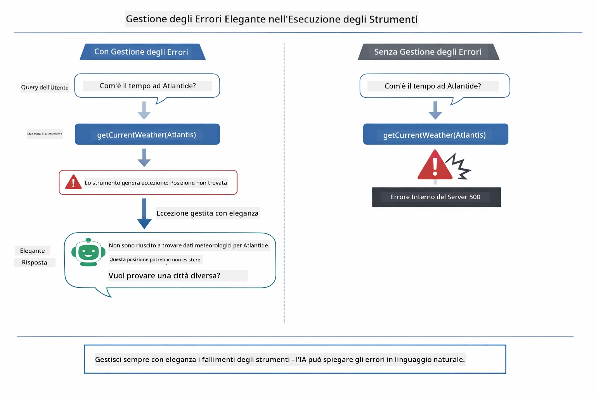

*Quando uno strumento fallisce, l’agente cattura l’errore e risponde con una spiegazione utile invece di bloccarsi.*

Questo avviene in un solo turno di conversazione. L’agente orchestra autonomamente più chiamate a strumenti.

## Eseguire l'Applicazione

**Verifica distribuzione:**

Assicurati che il file `.env` esista nella directory radice con le credenziali Azure (creato durante il Modulo 01). Esegui questo dalla directory del modulo (`04-tools/`):

**Bash:**
```bash
cat ../.env  # Dovrebbe mostrare AZURE_OPENAI_ENDPOINT, API_KEY, DEPLOYMENT
```

**PowerShell:**
```powershell
Get-Content ..\.env  # Dovrebbe mostrare AZURE_OPENAI_ENDPOINT, API_KEY, DEPLOYMENT
```

**Avvia l'applicazione:**

> **Nota:** Se hai già avviato tutte le applicazioni usando `./start-all.sh` dalla directory radice (come descritto nel Modulo 01), questo modulo è già in esecuzione sulla porta 8084. Puoi saltare i comandi di avvio seguenti e andare direttamente su http://localhost:8084.

**Opzione 1: Usare Spring Boot Dashboard (Consigliato per utenti VS Code)**

Il container di sviluppo include l’estensione Spring Boot Dashboard, che fornisce un’interfaccia visuale per gestire tutte le applicazioni Spring Boot. La trovi nella Activity Bar sul lato sinistro di VS Code (cerca l’icona Spring Boot).

Dal Spring Boot Dashboard puoi:
- Vedere tutte le applicazioni Spring Boot disponibili nello spazio di lavoro
- Avviare/fermare applicazioni con un clic
- Visualizzare i log delle applicazioni in tempo reale
- Monitorare lo stato delle applicazioni

Basta cliccare il pulsante play accanto a "tools" per avviare questo modulo, o avviare tutti i moduli contemporaneamente.

Ecco come appare il Spring Boot Dashboard in VS Code:


*Spring Boot Dashboard in VS Code — avvia, ferma e monitora tutti i moduli da un unico posto*

**Opzione 2: Usare script shell**

Avvia tutte le applicazioni web (moduli 01-04):

**Bash:**
```bash
cd ..  # Dalla directory radice
./start-all.sh
```

**PowerShell:**
```powershell
cd ..  # Dalla directory principale
.\start-all.ps1
```

Oppure avvia solo questo modulo:

**Bash:**
```bash
cd 04-tools
./start.sh
```

**PowerShell:**
```powershell
cd 04-tools
.\start.ps1
```

Entrambi gli script caricano automaticamente le variabili di ambiente dal file `.env` radice e compileranno i JAR se non esistono.

> **Nota:** Se preferisci compilare tutti i moduli manualmente prima di avviare:
>
> **Bash:**
> ```bash
> cd ..  # Go to root directory
> mvn clean package -DskipTests
> ```
>
> **PowerShell:**
> ```powershell
> cd ..  # Go to root directory
> mvn clean package -DskipTests
> ```

Apri http://localhost:8084 nel tuo browser.

**Per fermare:**

**Bash:**
```bash
./stop.sh  # Solo questo modulo
# Oppure
cd .. && ./stop-all.sh  # Tutti i moduli
```

**PowerShell:**
```powershell
.\stop.ps1  # Solo questo modulo
# Oppure
cd ..; .\stop-all.ps1  # Tutti i moduli
```

## Utilizzare l'Applicazione

L’applicazione fornisce un’interfaccia web dove puoi interagire con un agente AI che ha accesso agli strumenti meteo e di conversione della temperatura. Ecco come appare l’interfaccia — include esempi per iniziare rapidamente e un pannello chat per inviare richieste:
<a href="images/tools-homepage.png"></a>

*L'interfaccia Strumenti AI Agent - esempi rapidi e interfaccia chat per interagire con gli strumenti*

### Prova l'Uso Semplice dello Strumento

Inizia con una richiesta semplice: "Converti 100 gradi Fahrenheit in Celsius". L'agente riconosce che ha bisogno dello strumento di conversione della temperatura, lo utilizza con i parametri giusti e restituisce il risultato. Nota quanto sia naturale - non hai specificato quale strumento usare né come chiamarlo.

### Testa la Catena di Strumenti

Ora prova qualcosa di più complesso: "Com'è il tempo a Seattle e converti la temperatura in Fahrenheit?" Guarda come l'agente procede in passaggi. Prima ottiene il meteo (che restituisce Celsius), riconosce che deve convertire in Fahrenheit, chiama lo strumento di conversione e combina entrambi i risultati in una risposta.

### Vedi il Flusso della Conversazione

L'interfaccia chat mantiene la cronologia della conversazione, permettendoti di avere interazioni multi-turno. Puoi vedere tutte le query e risposte precedenti, rendendo facile seguire la conversazione e capire come l'agente costruisce il contesto nel corso di più scambi.

<a href="images/tools-conversation-demo.png"></a>

*Conversazione multi-turno che mostra conversioni semplici, consultazioni meteo, e catene di strumenti*

### Sperimenta con Richieste Diverse

Prova varie combinazioni:
- Consultazioni meteo: "Com'è il tempo a Tokyo?"
- Conversioni di temperatura: "Quanto sono 25°C in Kelvin?"
- Query combinate: "Controlla il meteo a Parigi e dimmi se è sopra i 20°C"

Nota come l'agente interpreta il linguaggio naturale e lo mappa alle chiamate appropriate degli strumenti.

## Concetti Chiave

### Pattern ReAct (Ragionamento e Azione)

L'agente alterna tra ragionamento (decidere cosa fare) e azione (usare strumenti). Questo pattern permette una risoluzione autonoma dei problemi invece di limitarsi a rispondere a istruzioni.

### Le Descrizioni degli Strumenti Contano

La qualità delle descrizioni degli strumenti influisce direttamente su quanto bene l'agente li utilizza. Descrizioni chiare e specifiche aiutano il modello a capire quando e come chiamare ciascuno strumento.

### Gestione della Sessione

L'annotazione `@MemoryId` abilita la gestione automatica della memoria basata sulla sessione. Ogni ID sessione ottiene una propria istanza di `ChatMemory` gestita dal bean `ChatMemoryProvider`, così più utenti possono interagire simultaneamente con l'agente senza mescolare le loro conversazioni. Il diagramma seguente mostra come diversi utenti vengano indirizzati a memorie isolate in base ai loro ID sessione:

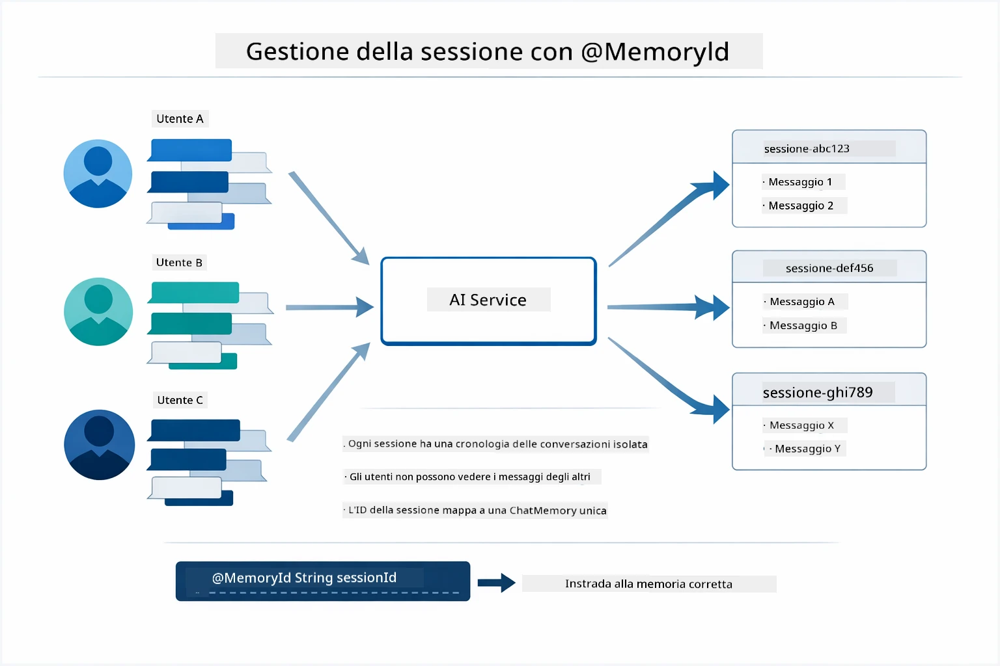

*Ogni ID sessione corrisponde a una cronologia della conversazione isolata — gli utenti non vedono mai i messaggi degli altri.*

### Gestione degli Errori

Gli strumenti possono fallire — API che scadono, parametri invalidi, servizi esterni che vanno giù. Gli agenti in produzione necessitano di gestione degli errori così che il modello possa spiegare problemi o provare alternative invece di far crashare l’intera applicazione. Quando uno strumento genera un’eccezione, LangChain4j la cattura e passa il messaggio di errore al modello, che può quindi spiegare il problema in linguaggio naturale.

## Strumenti Disponibili

Il diagramma sottostante mostra l’ampio ecosistema di strumenti che puoi costruire. Questo modulo dimostra strumenti per meteo e temperatura, ma lo stesso pattern `@Tool` funziona per qualsiasi metodo Java — dalle query al database al processamento pagamenti.

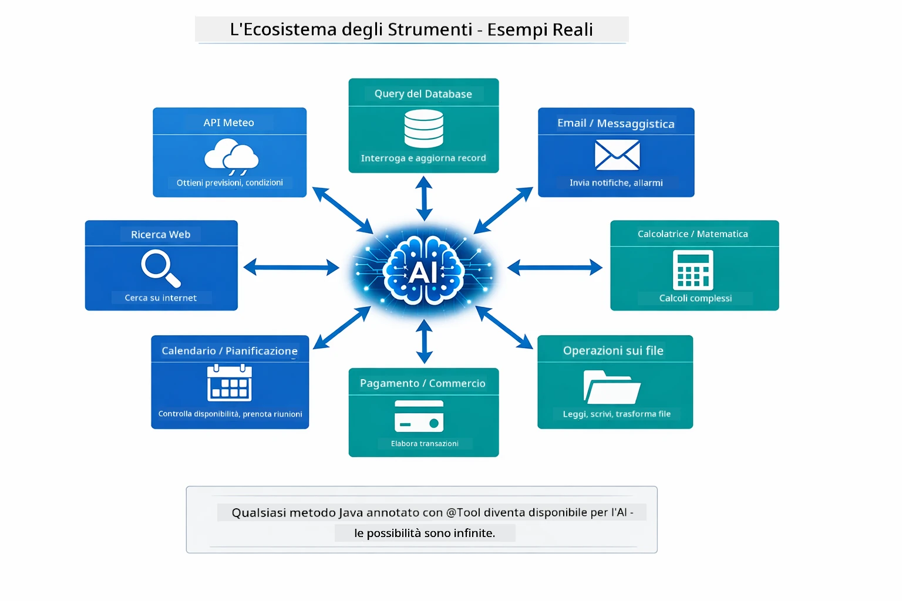

*Qualsiasi metodo Java annotato con @Tool diventa disponibile all'AI — il pattern si estende a database, API, email, operazioni su file, e altro.*

## Quando Usare Agenti Basati su Strumenti

Non tutte le richieste necessitano di strumenti. La decisione dipende dal fatto se l’AI debba interagire con sistemi esterni o possa rispondere con le proprie conoscenze. La guida seguente riassume quando gli strumenti aggiungono valore e quando sono inutili:

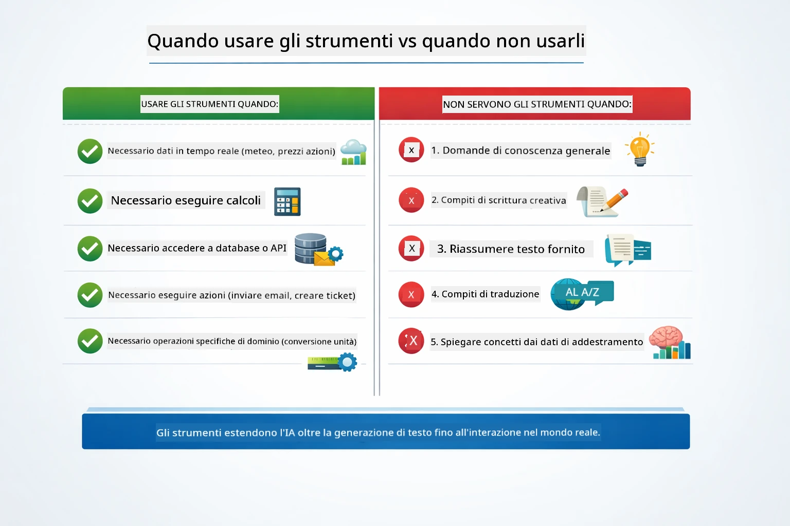

*Una guida rapida alla decisione — gli strumenti sono per dati in tempo reale, calcoli e azioni; la conoscenza generale e compiti creativi non ne hanno bisogno.*

## Strumenti vs RAG

I moduli 03 e 04 estendono entrambi ciò che l'AI può fare, ma in modi fondamentalmente diversi. RAG dà al modello accesso alla **conoscenza** recuperando documenti. Gli strumenti danno al modello la capacità di compiere **azioni** chiamando funzioni. Il diagramma qui sotto confronta questi due approcci fianco a fianco — da come funziona ogni workflow fino ai compromessi tra loro:

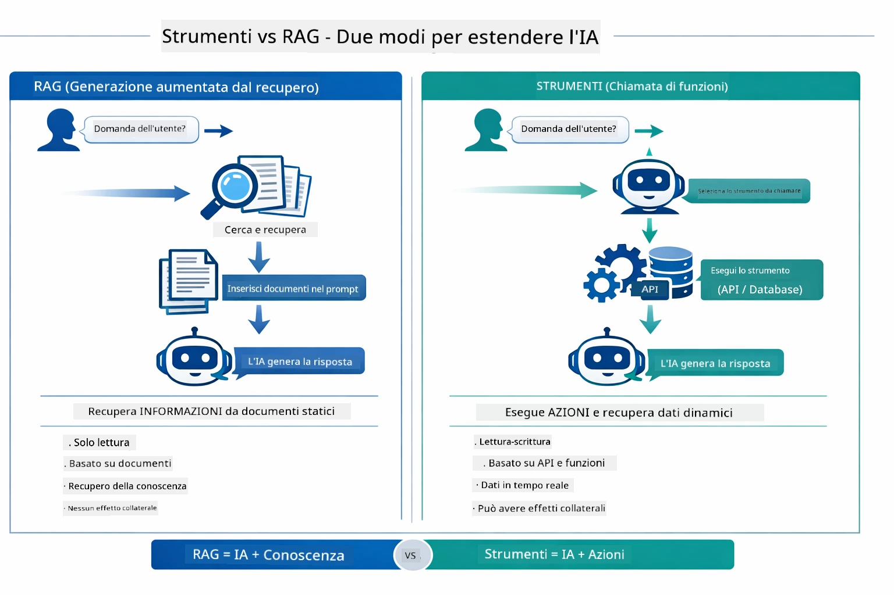

*RAG recupera informazioni da documenti statici — Gli strumenti eseguono azioni e recuperano dati dinamici e in tempo reale. Molti sistemi produttivi combinano entrambi.*

In pratica, molti sistemi produttivi combinano entrambi gli approcci: RAG per ancorare le risposte alla vostra documentazione e Strumenti per recuperare dati live o eseguire operazioni.

## Prossimi Passi

**Prossimo Modulo:** [05-mcp - Protocollo Contesto Modello (MCP)](../05-mcp/README.md)

---

**Navigazione:** [← Precedente: Modulo 03 - RAG](../03-rag/README.md) | [Torna alla Home](../README.md) | [Successivo: Modulo 05 - MCP →](../05-mcp/README.md)

---

<!-- CO-OP TRANSLATOR DISCLAIMER START -->
**Dichiarazione di non responsabilità**:  
Questo documento è stato tradotto utilizzando il servizio di traduzione automatica [Co-op Translator](https://github.com/Azure/co-op-translator). Pur impegnandoci per l’accuratezza, si prega di considerare che le traduzioni automatiche potrebbero contenere errori o imprecisioni. Il documento originale nella sua lingua nativa deve essere considerato la fonte autorevole. Per informazioni critiche, si raccomanda una traduzione professionale umana. Non ci assumiamo alcuna responsabilità per eventuali fraintendimenti o interpretazioni errate derivanti dall’uso di questa traduzione.
<!-- CO-OP TRANSLATOR DISCLAIMER END -->