# Modulo 05: Protocollo del Contesto del Modello (MCP)

## Indice

- [Cosa Imparerai](../../../05-mcp)
- [Cos'è MCP?](../../../05-mcp)
- [Come Funziona MCP](../../../05-mcp)
- [Il Modulo Agentico](../../../05-mcp)
- [Esecuzione degli Esempi](../../../05-mcp)
  - [Prerequisiti](../../../05-mcp)
- [Avvio Rapido](../../../05-mcp)
  - [Operazioni sui File (Stdio)](../../../05-mcp)
  - [Agente Supervisore](../../../05-mcp)
    - [Esecuzione della Demo](../../../05-mcp)
    - [Come Funziona il Supervisore](../../../05-mcp)
    - [Strategie di Risposta](../../../05-mcp)
    - [Comprendere l'Output](../../../05-mcp)
    - [Spiegazione delle Funzionalità del Modulo Agentico](../../../05-mcp)
- [Concetti Chiave](../../../05-mcp)
- [Congratulazioni!](../../../05-mcp)
  - [Cosa Fare Dopo?](../../../05-mcp)

## Cosa Imparerai

Hai costruito un'AI conversazionale, padroneggiato i prompt, basato le risposte su documenti e creato agenti con strumenti. Ma tutti quegli strumenti erano costruiti ad hoc per la tua applicazione specifica. E se potessi dare alla tua AI accesso a un ecosistema standardizzato di strumenti che chiunque può creare e condividere? In questo modulo, imparerai a fare proprio questo con il Protocollo del Contesto del Modello (MCP) e il modulo agentico di LangChain4j. Mostriamo prima un semplice lettore di file MCP e poi come si integra facilmente in workflow agentici avanzati usando il pattern Supervisor Agent.

## Cos'è MCP?

Il Protocollo del Contesto del Modello (MCP) offre esattamente questo: un modo standard per le applicazioni AI di scoprire e usare strumenti esterni. Invece di scrivere integrazioni personalizzate per ogni fonte di dati o servizio, ti connetti a server MCP che espongono le loro capacità in un formato coerente. Il tuo agente AI può quindi scoprire e usare questi strumenti automaticamente.


*Prima di MCP: integrazioni complesse punto-punto. Dopo MCP: un protocollo, infinite possibilità.*

MCP risolve un problema fondamentale nello sviluppo AI: ogni integrazione è personalizzata. Vuoi accedere a GitHub? Codice personalizzato. Vuoi leggere file? Codice personalizzato. Vuoi interrogare un database? Codice personalizzato. E nessuna di queste integrazioni funziona con altre applicazioni AI.

MCP standardizza tutto questo. Un server MCP espone strumenti con descrizioni chiare e schemi. Qualsiasi client MCP può connettersi, scoprire strumenti disponibili e usarli. Costruisci una volta, usa ovunque.


*Architettura del Protocollo del Contesto del Modello – scoperta e esecuzione strumenti standardizzate*

## Come Funziona MCP

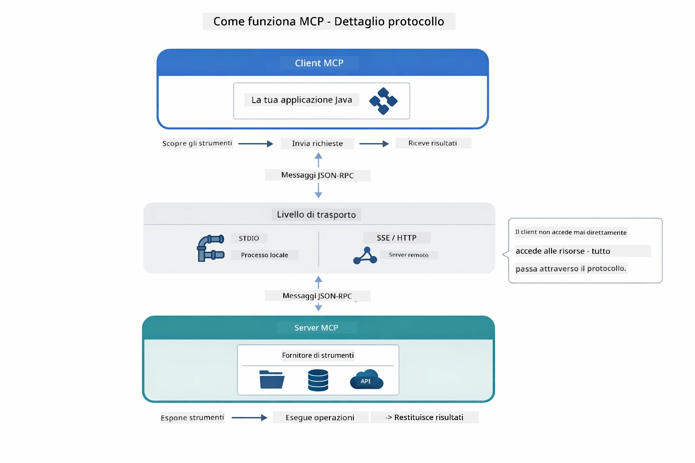

*Come funziona MCP sotto il cofano — i client scoprono strumenti, scambiano messaggi JSON-RPC ed eseguono operazioni tramite uno strato di trasporto.*

**Architettura Server-Client**

MCP usa un modello client-server. I server forniscono strumenti — lettura file, interrogazioni database, chiamate API. I client (la tua applicazione AI) si connettono ai server e usano i loro strumenti.

Per usare MCP con LangChain4j, aggiungi questa dipendenza Maven:

```xml
<dependency>
    <groupId>dev.langchain4j</groupId>
    <artifactId>langchain4j-mcp</artifactId>
    <version>${langchain4j.version}</version>
</dependency>
```

**Scoperta degli Strumenti**

Quando il tuo client si connette a un server MCP, chiede "Quali strumenti hai?" Il server risponde con una lista di strumenti disponibili, ciascuno con descrizioni e schemi dei parametri. Il tuo agente AI può quindi decidere quali strumenti usare in base alle richieste dell'utente.

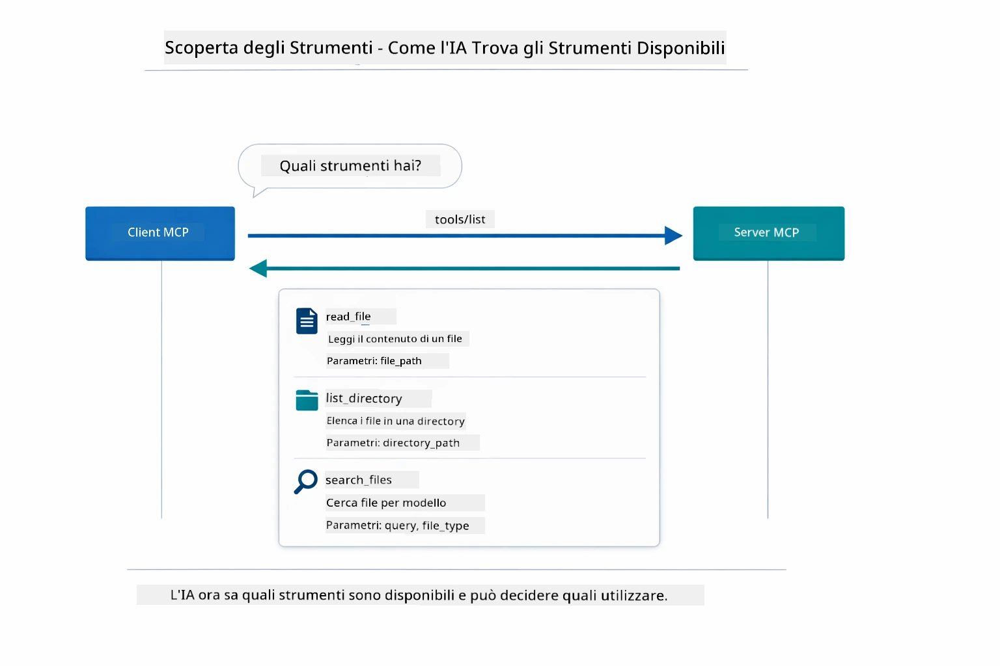

*L’AI scopre gli strumenti disponibili all’avvio — ora conosce le capacità a disposizione e può decidere quali usare.*

**Meccanismi di Trasporto**

MCP supporta diversi meccanismi di trasporto. Questo modulo dimostra il trasporto Stdio per processi locali:


*Meccanismi di trasporto MCP: HTTP per server remoti, Stdio per processi locali*

**Stdio** - [StdioTransportDemo.java](../../../05-mcp/src/main/java/com/example/langchain4j/mcp/StdioTransportDemo.java)

Per processi locali. La tua applicazione lancia un server come sottoprocesso e comunica tramite input/output standard. Utile per accesso al filesystem o strumenti da linea di comando.

```java
McpTransport stdioTransport = new StdioMcpTransport.Builder()
    .command(List.of(
        npmCmd, "exec",
        "@modelcontextprotocol/server-filesystem@2025.12.18",
        resourcesDir
    ))
    .logEvents(false)
    .build();
```

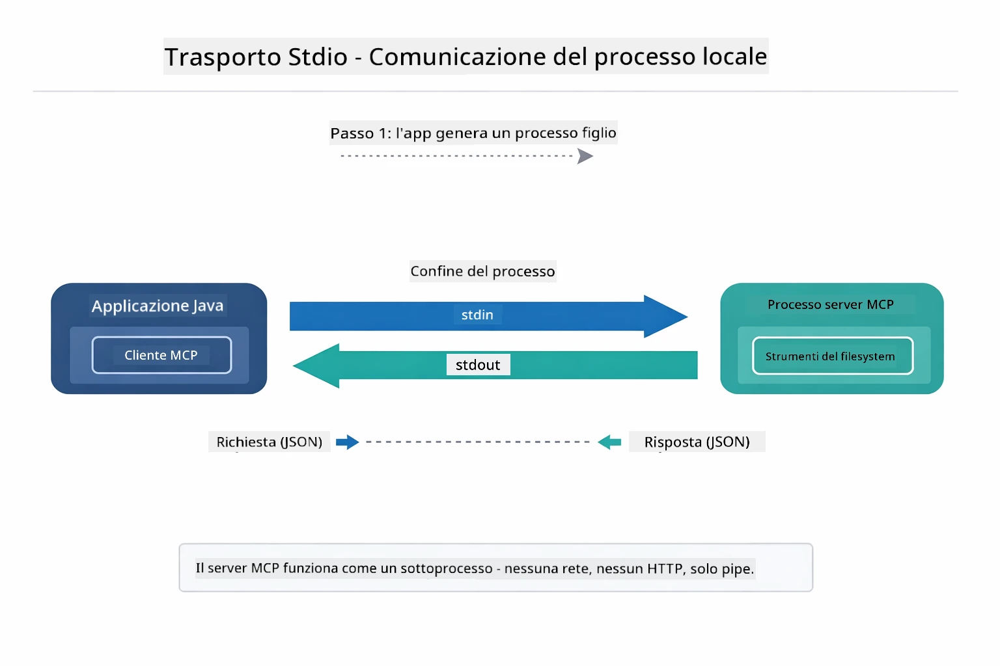

*Trasporto Stdio in azione — la tua applicazione lancia il server MCP come processo figlio e comunica tramite pipe stdin/stdout.*

> **🤖 Prova con [GitHub Copilot](https://github.com/features/copilot) Chat:** Apri [`StdioTransportDemo.java`](../../../05-mcp/src/main/java/com/example/langchain4j/mcp/StdioTransportDemo.java) e chiedi:
> - "Come funziona il trasporto Stdio e quando dovrei usarlo rispetto a HTTP?"
> - "Come gestisce LangChain4j il ciclo di vita dei processi server MCP avviati?"
> - "Quali sono le implicazioni di sicurezza nel dare all’AI accesso al filesystem?"

## Il Modulo Agentico

Mentre MCP fornisce strumenti standardizzati, il modulo **agentico** di LangChain4j offre un modo dichiarativo per costruire agenti che orchestrano quegli strumenti. L’annotazione `@Agent` e `AgenticServices` ti permettono di definire il comportamento dell’agente tramite interfacce invece che codice imperativo.

In questo modulo esplorerai il pattern **Supervisor Agent** — un approccio agentico AI avanzato dove un agente "supervisore" decide dinamicamente quali sotto-agenti invocare in base alle richieste dell’utente. Combineremo entrambi i concetti dando a uno dei nostri sotto-agenti capacità di accesso a file tramite MCP.

Per usare il modulo agentico, aggiungi questa dipendenza Maven:

```xml
<dependency>
    <groupId>dev.langchain4j</groupId>
    <artifactId>langchain4j-agentic</artifactId>
    <version>${langchain4j.mcp.version}</version>
</dependency>
```

> **⚠️ Sperimentale:** Il modulo `langchain4j-agentic` è **sperimentale** e soggetto a cambiamenti. Il modo stabile di costruire assistenti AI rimane `langchain4j-core` con strumenti personalizzati (Modulo 04).

## Esecuzione degli Esempi

### Prerequisiti

- Java 21+, Maven 3.9+
- Node.js 16+ e npm (per server MCP)
- Variabili ambiente configurate nel file `.env` (dalla directory root):
  - `AZURE_OPENAI_ENDPOINT`, `AZURE_OPENAI_API_KEY`, `AZURE_OPENAI_DEPLOYMENT` (uguali ai Moduli 01-04)

> **Nota:** Se non hai ancora configurato le variabili ambiente, vedi [Modulo 00 - Avvio Rapido](../00-quick-start/README.md) per le istruzioni, oppure copia `.env.example` in `.env` nella directory root e inserisci i tuoi valori.

## Avvio Rapido

**Usando VS Code:** Clicca con il tasto destro su qualsiasi file demo nell’Esplora e seleziona **"Run Java"**, oppure usa le configurazioni di lancio dal pannello Esegui e Debug (assicurati di aver aggiunto il tuo token al file `.env` prima).

**Usando Maven:** In alternativa, puoi eseguire da linea di comando con gli esempi seguenti.

### Operazioni sui File (Stdio)

Questo dimostra strumenti basati su sottoprocessi locali.

**✅ Nessun prerequisito richiesto** - il server MCP viene avviato automaticamente.

**Usando gli Script di Avvio (Consigliato):**

Gli script di avvio caricano automaticamente le variabili ambiente dal file `.env` root:

**Bash:**
```bash
cd 05-mcp
chmod +x start-stdio.sh
./start-stdio.sh
```

**PowerShell:**
```powershell
cd 05-mcp
.\start-stdio.ps1
```

**Usando VS Code:** Clicca con il destro su `StdioTransportDemo.java` e seleziona **"Run Java"** (assicurati di aver configurato il file `.env`).

L’applicazione avvia automaticamente un server MCP filesystem e legge un file locale. Nota come la gestione del sottoprocesso è gestita per te.

**Output atteso:**
```
Assistant response: The file provides an overview of LangChain4j, an open-source Java library
for integrating Large Language Models (LLMs) into Java applications...
```


### Agente Supervisore

Il **pattern Supervisor Agent** è una forma **flessibile** di AI agentica. Un Supervisore usa un LLM per decidere autonomamente quali agenti invocare in base alla richiesta dell’utente. Nel prossimo esempio combiniamo l’accesso file basato su MCP con un agente LLM per creare un flusso supervisionato di lettura file → report.

Nella demo, `FileAgent` legge un file usando strumenti MCP filesystem, e `ReportAgent` genera un report strutturato con un sommario esecutivo (1 frase), 3 punti chiave e raccomandazioni. Il Supervisore orchestra questo flusso automaticamente:

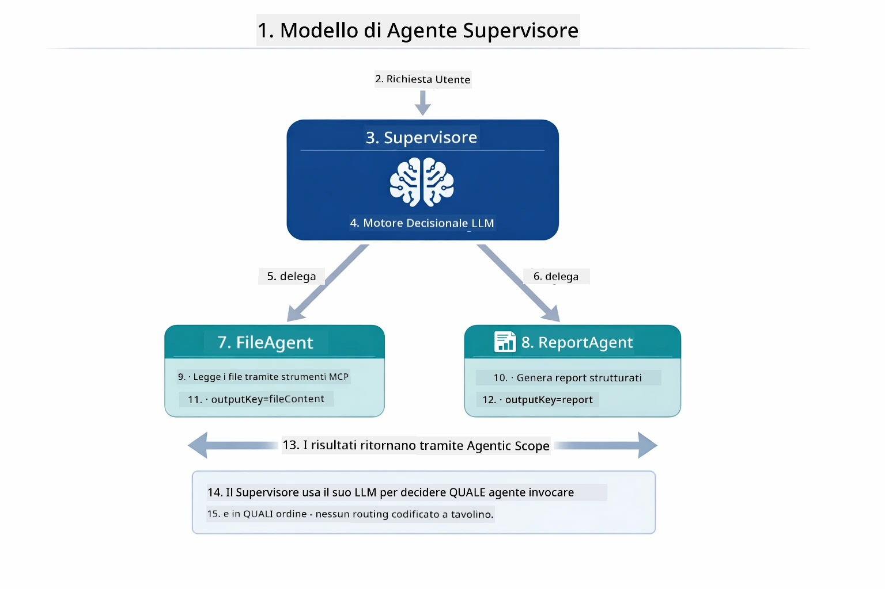

*Il Supervisore usa il suo LLM per decidere quali agenti invocare e in quale ordine — non serve routing hardcoded.*

Questo è il flusso concreto per la nostra pipeline da file a report:

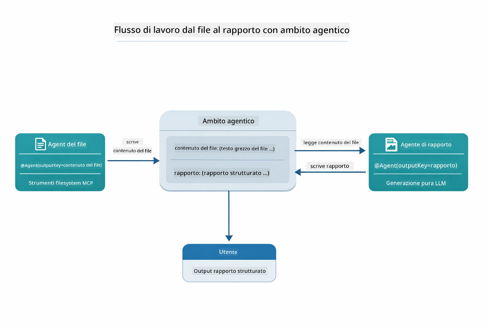

*FileAgent legge il file tramite strumenti MCP, poi ReportAgent trasforma il contenuto grezzo in un report strutturato.*

Ogni agente memorizza il proprio output nell’**Agentic Scope** (memoria condivisa), permettendo agli agenti successivi di accedere ai risultati precedenti. Questo dimostra come gli strumenti MCP si integrano senza problemi nei workflow agentici — il Supervisore non deve sapere *come* vengono letti i file, solo che `FileAgent` può farlo.

#### Esecuzione della Demo

Gli script di avvio caricano automaticamente le variabili ambiente dal file `.env` root:

**Bash:**
```bash
cd 05-mcp
chmod +x start-supervisor.sh
./start-supervisor.sh
```

**PowerShell:**
```powershell
cd 05-mcp
.\start-supervisor.ps1
```

**Usando VS Code:** Clicca con il destro su `SupervisorAgentDemo.java` e seleziona **"Run Java"** (assicurati di aver configurato il file `.env`).

#### Come Funziona il Supervisore

```java
// Passo 1: FileAgent legge i file utilizzando gli strumenti MCP
FileAgent fileAgent = AgenticServices.agentBuilder(FileAgent.class)
        .chatModel(model)
        .toolProvider(mcpToolProvider)  // Ha strumenti MCP per le operazioni sui file
        .build();

// Passo 2: ReportAgent genera report strutturati
ReportAgent reportAgent = AgenticServices.agentBuilder(ReportAgent.class)
        .chatModel(model)
        .build();

// Il Supervisor orchestra il flusso di lavoro file → report
SupervisorAgent supervisor = AgenticServices.supervisorBuilder()
        .chatModel(model)
        .subAgents(fileAgent, reportAgent)
        .responseStrategy(SupervisorResponseStrategy.LAST)  // Restituisce il report finale
        .build();

// Il Supervisor decide quali agenti invocare in base alla richiesta
String response = supervisor.invoke("Read the file at /path/file.txt and generate a report");
```


#### Strategie di Risposta

Quando configuri un `SupervisorAgent`, specifichi come deve formulare la sua risposta finale all’utente dopo che i sotto-agenti hanno completato i loro compiti.

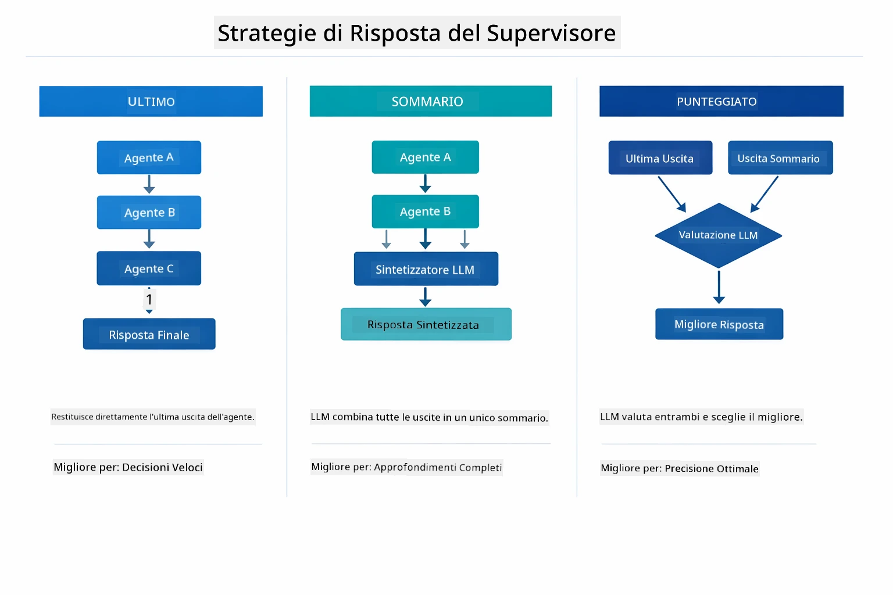

*Tre strategie su come il Supervisore formula la risposta finale — scegli in base a se vuoi l’output dell’ultimo agente, un sommario sintetizzato o l’opzione con punteggio migliore.*

Le strategie disponibili sono:

| Strategia | Descrizione |
|----------|-------------|
| **LAST** | Il supervisore restituisce l'output dell'ultimo sotto-agente o strumento chiamato. Utile quando l’agente finale nel workflow è progettato specificamente per produrre la risposta finale completa (ad esempio, un "Agente Sommario" in una pipeline di ricerca). |
| **SUMMARY** | Il supervisore usa il proprio modello linguistico interno (LLM) per sintetizzare un sommario di tutta l'interazione e di tutti gli output dei sotto-agenti, quindi restituisce quel sommario come risposta finale. Fornisce una risposta aggregata e pulita all'utente. |
| **SCORED** | Il sistema usa un LLM interno per valutare sia la risposta LAST che il sommario SUMMARY rispetto alla richiesta originale dell'utente, restituendo l'output con il punteggio più alto. |

Vedi [SupervisorAgentDemo.java](../../../05-mcp/src/main/java/com/example/langchain4j/mcp/SupervisorAgentDemo.java) per l’implementazione completa.

> **🤖 Prova con [GitHub Copilot](https://github.com/features/copilot) Chat:** Apri [`SupervisorAgentDemo.java`](../../../05-mcp/src/main/java/com/example/langchain4j/mcp/SupervisorAgentDemo.java) e chiedi:
> - "Come decide il Supervisore quali agenti invocare?"
> - "Qual è la differenza tra i pattern Supervisore e Sequential workflow?"
> - "Come posso personalizzare il comportamento di pianificazione del Supervisore?"

#### Comprendere l'Output

Quando esegui la demo, vedrai una guida strutturata su come il Supervisore orchestra più agenti. Ecco cosa significa ogni sezione:

```
======================================================================
  FILE → REPORT WORKFLOW DEMO
======================================================================

This demo shows a clear 2-step workflow: read a file, then generate a report.
The Supervisor orchestrates the agents automatically based on the request.
```


**L’intestazione** introduce il concetto di workflow: una pipeline focalizzata da lettura file a generazione report.

```
--- WORKFLOW ---------------------------------------------------------
  ┌─────────────┐      ┌──────────────┐
  │  FileAgent  │ ───▶ │ ReportAgent  │
  │ (MCP tools) │      │  (pure LLM)  │
  └─────────────┘      └──────────────┘
   outputKey:           outputKey:
   'fileContent'        'report'

--- AVAILABLE AGENTS -------------------------------------------------
  [FILE]   FileAgent   - Reads files via MCP → stores in 'fileContent'
  [REPORT] ReportAgent - Generates structured report → stores in 'report'
```


**Diagramma del Workflow** mostra il flusso dati tra gli agenti. Ogni agente ha un ruolo specifico:
- **FileAgent** legge file usando strumenti MCP e memorizza il contenuto grezzo in `fileContent`
- **ReportAgent** consuma quel contenuto e produce un report strutturato in `report`

```
--- USER REQUEST -----------------------------------------------------
  "Read the file at .../file.txt and generate a report on its contents"
```


**Richiesta Utente** mostra il compito. Il Supervisore la analizza e decide di invocare FileAgent → ReportAgent.

```
--- SUPERVISOR ORCHESTRATION -----------------------------------------
  The Supervisor decides which agents to invoke and passes data between them...

  +-- STEP 1: Supervisor chose -> FileAgent (reading file via MCP)
  |
  |   Input: .../file.txt
  |
  |   Result: LangChain4j is an open-source, provider-agnostic Java framework for building LLM...
  +-- [OK] FileAgent (reading file via MCP) completed

  +-- STEP 2: Supervisor chose -> ReportAgent (generating structured report)
  |
  |   Input: LangChain4j is an open-source, provider-agnostic Java framew...
  |
  |   Result: Executive Summary...
  +-- [OK] ReportAgent (generating structured report) completed
```


**Orchestrazione del Supervisore** mostra il flusso in 2 passaggi in azione:
1. **FileAgent** legge il file tramite MCP e memorizza il contenuto
2. **ReportAgent** riceve il contenuto e genera un report strutturato

Il Supervisore ha preso queste decisioni **autonomamente** in base alla richiesta utente.

```
--- FINAL RESPONSE ---------------------------------------------------
Executive Summary
...

Key Points
...

Recommendations
...

--- AGENTIC SCOPE (Data Flow) ----------------------------------------
  Each agent stores its output for downstream agents to consume:
  * fileContent: LangChain4j is an open-source, provider-agnostic Java framework...
  * report: Executive Summary...
```


#### Spiegazione delle Funzionalità del Modulo Agentico

L’esempio dimostra diverse funzionalità avanzate del modulo agentico. Diamo uno sguardo più da vicino a Agentic Scope e Agent Listeners.

**Agentic Scope** mostra la memoria condivisa dove gli agenti hanno salvato i loro risultati usando `@Agent(outputKey="...")`. Questo permette di:
- Far accedere agli agenti successivi gli output degli agenti precedenti
- Al Supervisore di sintetizzare una risposta finale
- A te di ispezionare cosa ogni agente ha prodotto

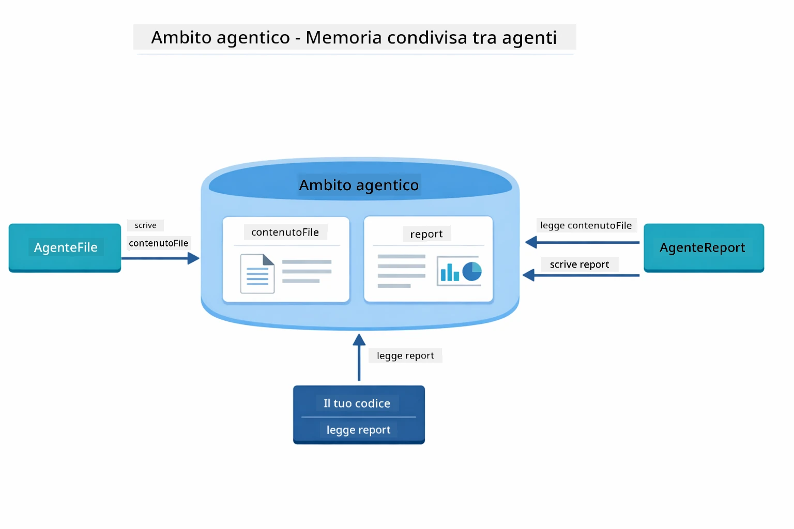

*Agentic Scope agisce come memoria condivisa — FileAgent scrive `fileContent`, ReportAgent la legge e scrive `report`, e il tuo codice legge il risultato finale.*

```java
ResultWithAgenticScope<String> result = supervisor.invokeWithAgenticScope(request);
AgenticScope scope = result.agenticScope();
String fileContent = scope.readState("fileContent");  // Dati grezzi del file da FileAgent
String report = scope.readState("report");            // Rapporto strutturato da ReportAgent
```


**Agent Listeners** permettono di monitorare e fare il debug dell’esecuzione degli agenti. L’output passo-passo che vedi nella demo proviene da un AgentListener che si aggancia a ogni invocazione agente:
- **beforeAgentInvocation** - Chiamato quando il Supervisore seleziona un agente, permettendoti di vedere quale agente è stato scelto e perché
- **afterAgentInvocation** - Chiamato quando un agente completa, mostrando il suo risultato
- **inheritedBySubagents** - Se true, il listener monitora tutti gli agenti nella gerarchia

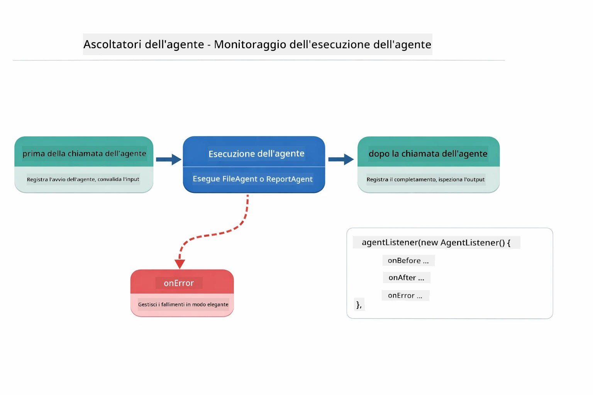

*I Listener degli Agenti si agganciano al ciclo di vita dell'esecuzione — monitorano quando gli agenti iniziano, completano o incontrano errori.*

```java
AgentListener monitor = new AgentListener() {
    private int step = 0;
    
    @Override
    public void beforeAgentInvocation(AgentRequest request) {
        step++;
        System.out.println("  +-- STEP " + step + ": " + request.agentName());
    }
    
    @Override
    public void afterAgentInvocation(AgentResponse response) {
        System.out.println("  +-- [OK] " + response.agentName() + " completed");
    }
    
    @Override
    public boolean inheritedBySubagents() {
        return true; // Propagare a tutti i sotto-agenti
    }
};
```

Oltre al pattern Supervisor, il modulo `langchain4j-agentic` offre diversi potenti pattern di workflow e funzionalità:

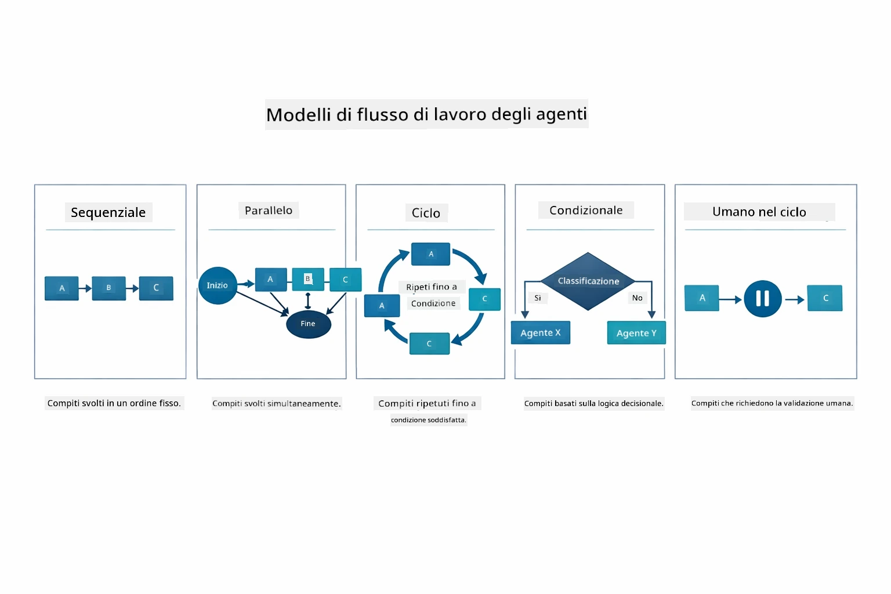

*Cinque pattern di workflow per orchestrare agenti — da pipeline sequenziali semplici a workflow di approvazione con intervento umano.*

| Pattern | Descrizione | Caso d'uso |
|---------|-------------|------------|
| **Sequenziale** | Esegue gli agenti in ordine, l'output fluisce al prossimo | Pipeline: ricerca → analisi → rapporto |
| **Parallelo** | Esegue gli agenti simultaneamente | Compiti indipendenti: meteo + notizie + azioni |
| **Ciclo** | Itera fino al soddisfacimento della condizione | Valutazione qualità: affina fino a punteggio ≥ 0.8 |
| **Condizionale** | Instrada basandosi su condizioni | Classifica → instrada all'agente specialista |
| **Human-in-the-Loop** | Aggiunge checkpoint umani | Workflow di approvazione, revisione contenuti |

## Concetti Chiave

Ora che hai esplorato MCP e il modulo agentic in azione, riassumiamo quando usare ciascun approccio.

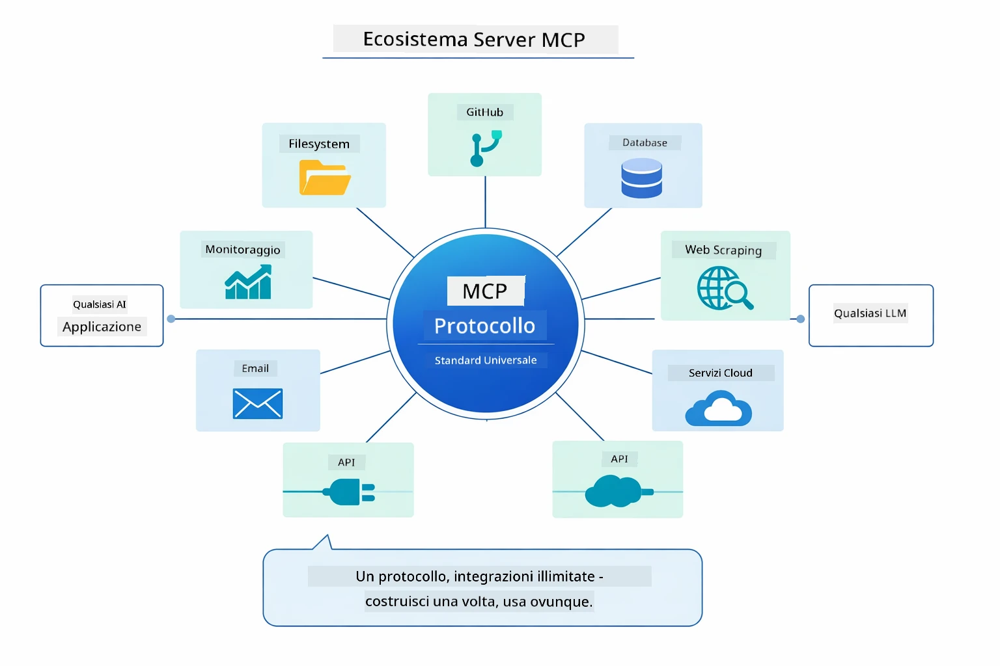

*MCP crea un ecosistema di protocolli universali — qualsiasi server compatibile MCP funziona con qualsiasi client compatibile MCP, abilitando la condivisione di strumenti tra applicazioni.*

**MCP** è ideale quando vuoi sfruttare ecosistemi di strumenti esistenti, costruire strumenti che più applicazioni possono condividere, integrare servizi di terze parti con protocolli standard, o cambiare implementazioni di strumenti senza modificare il codice.

**Il Modulo Agentic** funziona meglio quando vuoi definizioni dichiarative di agenti con annotazioni `@Agent`, necessiti di orchestrazione di workflow (sequenziale, ciclo, parallelo), preferisci un design agenti basato su interfacce anziché codice imperativo, o stai combinando più agenti che condividono output tramite `outputKey`.

**Il pattern Supervisor Agent** brilla quando il workflow non è prevedibile a priori e vuoi che il LLM decida, quando hai più agenti specializzati che necessitano di orchestrazione dinamica, quando costruisci sistemi conversazionali che dirigono a capacità diverse, o quando vuoi il comportamento agente più flessibile e adattivo.

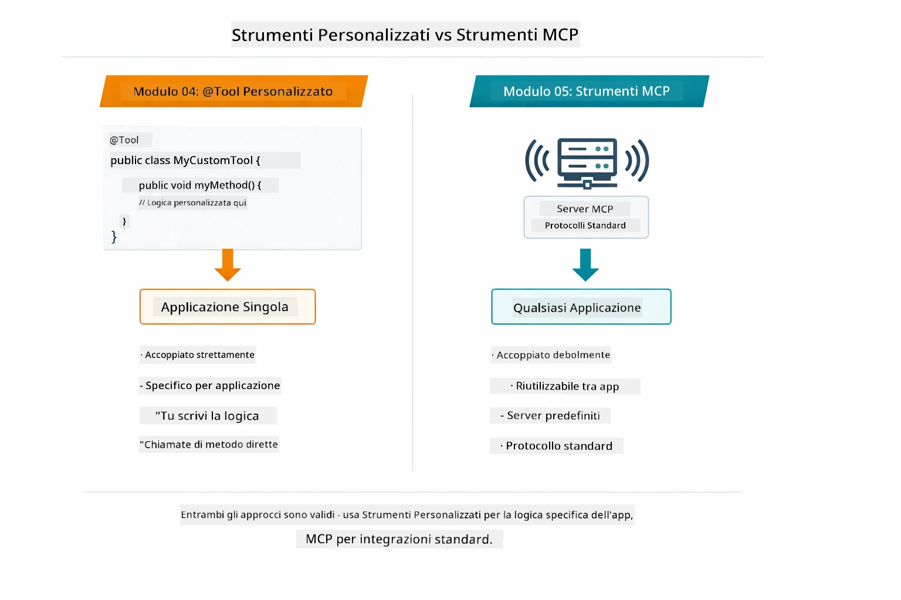

*Quando usare metodi @Tool personalizzati vs strumenti MCP — strumenti personalizzati per logica specifica dell'app con piena sicurezza di tipo, strumenti MCP per integrazioni standardizzate che funzionano in più applicazioni.*

## Congratulazioni!

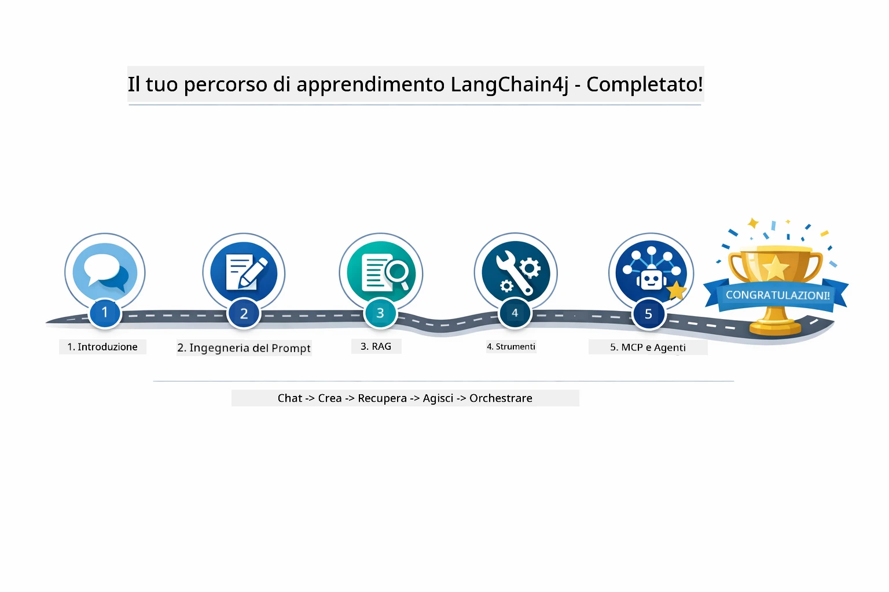

*Il tuo percorso di apprendimento attraverso tutti e cinque i moduli — dalla chat di base ai sistemi agentic basati su MCP.*

Hai completato il corso LangChain4j per Principianti. Hai imparato:

- Come costruire AI conversazionale con memoria (Modulo 01)
- Pattern di prompt engineering per diversi compiti (Modulo 02)
- Fondare risposte nei tuoi documenti con RAG (Modulo 03)
- Creare agenti AI base (assistenti) con strumenti personalizzati (Modulo 04)
- Integrare strumenti standardizzati con i moduli LangChain4j MCP e Agentic (Modulo 05)

### Cosa c'è dopo?

Dopo aver completato i moduli, esplora la [Guida al Testing](../docs/TESTING.md) per vedere i concetti di testing di LangChain4j in azione.

**Risorse ufficiali:**
- [Documentazione LangChain4j](https://docs.langchain4j.dev/) - Guide complete e riferimento API
- [LangChain4j GitHub](https://github.com/langchain4j/langchain4j) - Codice sorgente ed esempi
- [Tutorial LangChain4j](https://docs.langchain4j.dev/tutorials/) - Tutorial passo-passo per vari casi d'uso

Grazie per aver completato questo corso!

---

**Navigazione:** [← Precedente: Modulo 04 - Strumenti](../04-tools/README.md) | [Torna a Principale](../README.md)

---

<!-- CO-OP TRANSLATOR DISCLAIMER START -->
**Disclaimer**:
Questo documento è stato tradotto utilizzando il servizio di traduzione automatica AI [Co-op Translator](https://github.com/Azure/co-op-translator). Pur impegnandoci per garantire l’accuratezza, si prega di notare che le traduzioni automatiche possono contenere errori o imprecisioni. Il documento originale nella sua lingua madre deve essere considerato la fonte autorevole. Per informazioni critiche, è consigliata una traduzione professionale umana. Non siamo responsabili per eventuali malintesi o interpretazioni errate derivanti dall’uso di questa traduzione.
<!-- CO-OP TRANSLATOR DISCLAIMER END -->