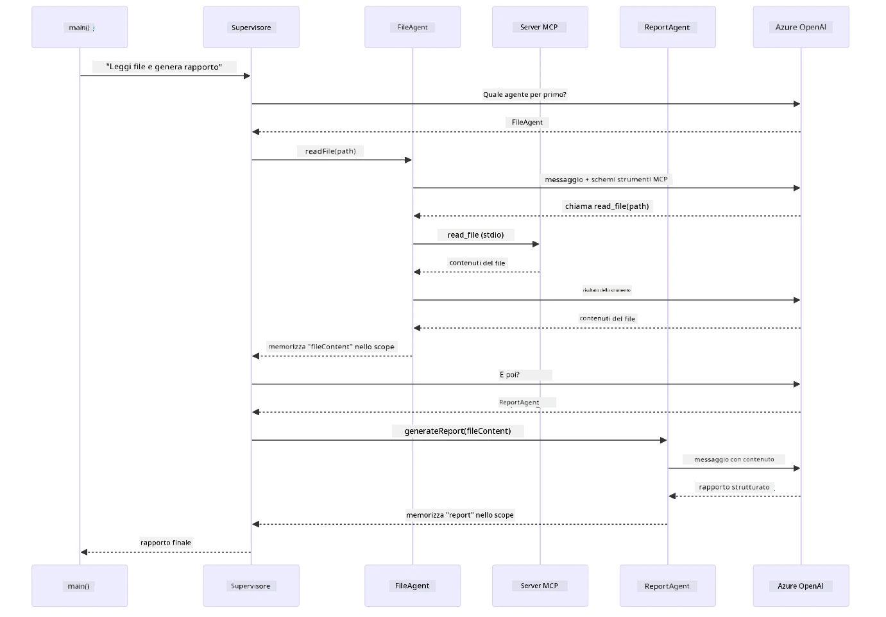

# Modulo 05: Protocollo di Contesto del Modello (MCP)

## Indice

- [Video Esplicativo](../../../05-mcp)
- [Cosa Imparerai](../../../05-mcp)
- [Cos'è MCP?](../../../05-mcp)
- [Come Funziona MCP](../../../05-mcp)
- [Il Modulo Agente](../../../05-mcp)
- [Esecuzione degli Esempi](../../../05-mcp)
  - [Prerequisiti](../../../05-mcp)
- [Avvio Rapido](../../../05-mcp)
  - [Operazioni sui File (Stdio)](../../../05-mcp)
  - [Agente Supervisore](../../../05-mcp)
    - [Esecuzione della Demo](../../../05-mcp)
    - [Come Funziona il Supervisore](../../../05-mcp)
    - [Come FileAgent Scopre gli Strumenti MCP a Runtime](../../../05-mcp)
    - [Strategie di Risposta](../../../05-mcp)
    - [Comprendere l'Uscita](../../../05-mcp)
    - [Spiegazione delle Funzionalità del Modulo Agente](../../../05-mcp)
- [Concetti Chiave](../../../05-mcp)
- [Congratulazioni!](../../../05-mcp)
  - [Cosa Succede Dopo?](../../../05-mcp)

## Video Esplicativo

Guarda questa sessione live che spiega come iniziare con questo modulo:

<a href="https://www.youtube.com/watch?v=O_J30kZc0rw"></a>

## Cosa Imparerai

Hai costruito intelligenze artificiali conversazionali, padroneggiato i prompt, ancorato risposte a documenti e creato agenti con strumenti. Ma tutti questi strumenti erano costruiti su misura per la tua specifica applicazione. E se potessi dare alla tua AI accesso a un ecosistema standardizzato di strumenti che chiunque può creare e condividere? In questo modulo imparerai proprio questo, usando il Model Context Protocol (MCP) e il modulo agente di LangChain4j. Mostriamo prima un semplice lettore di file MCP e poi come si integra facilmente in workflow agentici avanzati usando il modello dell’Agente Supervisore.

## Cos'è MCP?

Il Model Context Protocol (MCP) fornisce esattamente questo: un modo standard per le applicazioni AI di scoprire e utilizzare strumenti esterni. Invece di scrivere integrazioni personalizzate per ogni fonte dati o servizio, ti connetti ai server MCP che espongono le loro capacità in un formato coerente. Il tuo agente AI può così scoprire e usare automaticamente questi strumenti.

Il diagramma sottostante mostra la differenza — senza MCP, ogni integrazione richiede cablaggi personalizzati punto a punto; con MCP, un unico protocollo collega la tua app a qualsiasi strumento:


*Prima di MCP: Integrazioni punto a punto complesse. Dopo MCP: Un protocollo, infinite possibilità.*

MCP risolve un problema fondamentale nello sviluppo AI: ogni integrazione è personalizzata. Vuoi accedere a GitHub? Codice personalizzato. Vuoi leggere file? Codice personalizzato. Vuoi interrogare un database? Codice personalizzato. E nessuna di queste integrazioni funziona con altre applicazioni AI.

MCP standardizza questo. Un server MCP espone strumenti con descrizioni chiare e schemi. Qualsiasi client MCP può connettersi, scoprire gli strumenti disponibili e usarli. Costruisci una volta, usa ovunque.

Il diagramma qui sotto illustra questa architettura — un singolo client MCP (la tua applicazione AI) si connette a più server MCP, ognuno che espone il proprio set di strumenti attraverso il protocollo standard:


*Architettura del Model Context Protocol – scoperta ed esecuzione degli strumenti standardizzata*

## Come Funziona MCP

Nella pratica, MCP usa un’architettura a livelli. La tua applicazione Java (il client MCP) scopre gli strumenti disponibili, invia richieste JSON-RPC tramite un livello di trasporto (Stdio o HTTP) e il server MCP esegue le operazioni e restituisce i risultati. Il diagramma seguente scompone ogni livello di questo protocollo:


*Come funziona MCP sotto il cofano — i client scoprono gli strumenti, scambiano messaggi JSON-RPC ed eseguono operazioni tramite un livello di trasporto.*

**Architettura Server-Client**

MCP usa un modello client-server. I server forniscono gli strumenti — lettura file, interrogazione database, chiamate API. I client (la tua applicazione AI) si connettono ai server e usano i loro strumenti.

Per usare MCP con LangChain4j, aggiungi questa dipendenza Maven:

```xml
<dependency>
    <groupId>dev.langchain4j</groupId>
    <artifactId>langchain4j-mcp</artifactId>
    <version>${langchain4j.version}</version>
</dependency>
```

**Scoperta degli Strumenti**

Quando il tuo client si connette a un server MCP, chiede "Che strumenti hai?" Il server risponde con una lista di strumenti disponibili, ciascuno con descrizioni e schemi dei parametri. Il tuo agente AI può così decidere quali strumenti usare in base alle richieste dell’utente. Il diagramma qui sotto mostra questa stretta di mano — il client invia una richiesta `tools/list` e il server ritorna i suoi strumenti disponibili con descrizioni e schemi parametrici:


*L’AI scopre gli strumenti disponibili all’avvio — ora conosce le capacità disponibili e può decidere quali usare.*

**Meccanismi di Trasporto**

MCP supporta diversi meccanismi di trasporto. Le due opzioni sono Stdio (per comunicazione con processi locali) e HTTP Streamable (per server remoti). Questo modulo dimostra il trasporto Stdio:


*Meccanismi di trasporto MCP: HTTP per server remoti, Stdio per processi locali*

**Stdio** - [StdioTransportDemo.java](../../../05-mcp/src/main/java/com/example/langchain4j/mcp/StdioTransportDemo.java)

Per processi locali. La tua applicazione genera un server come sottoprocesso e comunica tramite input/output standard. Utile per accesso al filesystem o strumenti da linea di comando.

```java
McpTransport stdioTransport = new StdioMcpTransport.Builder()
    .command(List.of(
        npmCmd, "exec",
        "@modelcontextprotocol/server-filesystem@2025.12.18",
        resourcesDir
    ))
    .logEvents(false)
    .build();
```

Il server `@modelcontextprotocol/server-filesystem` espone i seguenti strumenti, tutti confinati alle directory che specifichi:

| Strumento | Descrizione |
|------|-------------|
| `read_file` | Leggi il contenuto di un singolo file |
| `read_multiple_files` | Leggi più file in una sola chiamata |
| `write_file` | Crea o sovrascrivi un file |
| `edit_file` | Effettua modifiche mirate trova-e-sostituisci |
| `list_directory` | Elenca file e directory in un percorso |
| `search_files` | Cerca ricorsivamente file che corrispondono a un modello |
| `get_file_info` | Ottieni metadati file (dimensione, timestamp, permessi) |
| `create_directory` | Crea una directory (incluse le directory genitore) |
| `move_file` | Sposta o rinomina un file o directory |

Il diagramma seguente mostra come funziona il trasporto Stdio a runtime — la tua applicazione Java genera il server MCP come processo figlio e comunicano tramite pipe stdin/stdout, senza alcuna rete o HTTP coinvolti:


*Trasporto Stdio in azione — la tua applicazione genera il server MCP come processo figlio e comunica tramite pipe stdin/stdout.*

> **🤖 Prova con [GitHub Copilot](https://github.com/features/copilot) Chat:** Apri [`StdioTransportDemo.java`](../../../05-mcp/src/main/java/com/example/langchain4j/mcp/StdioTransportDemo.java) e chiedi:
> - "Come funziona il trasporto Stdio e quando usarlo invece di HTTP?"
> - "Come gestisce LangChain4j il ciclo di vita dei processi server MCP generati?"
> - "Quali sono le implicazioni di sicurezza nel dare all’AI accesso al filesystem?"

## Il Modulo Agente

Mentre MCP fornisce strumenti standardizzati, il modulo **agentic** di LangChain4j fornisce un modo dichiarativo per costruire agenti che orchestrano quegli strumenti. L’annotazione `@Agent` e `AgenticServices` ti permettono di definire il comportamento dell’agente tramite interfacce anziché codice imperativo.

In questo modulo esplorerai il modello **Agente Supervisore** — un approccio agentico AI avanzato dove un agente "supervisore" decide dinamicamente quali sotto-agenti invocare basandosi sulle richieste dell’utente. Combineremo entrambi i concetti dando a uno dei nostri sotto-agenti capacità di accesso ai file potenziate da MCP.

Per usare il modulo agente, aggiungi questa dipendenza Maven:

```xml
<dependency>
    <groupId>dev.langchain4j</groupId>
    <artifactId>langchain4j-agentic</artifactId>
    <version>${langchain4j.mcp.version}</version>
</dependency>
```
> **Nota:** Il modulo `langchain4j-agentic` usa una proprietà versione separata (`langchain4j.mcp.version`) perché rilasciato con un calendario diverso dalle librerie core di LangChain4j.

> **⚠️ Sperimentale:** Il modulo `langchain4j-agentic` è **sperimentale** e soggetto a cambiamenti. Il modo stabile per costruire assistenti AI rimane `langchain4j-core` con strumenti personalizzati (Modulo 04).

## Esecuzione degli Esempi

### Prerequisiti

- Completato [Modulo 04 - Tools](../04-tools/README.md) (questo modulo si basa sui concetti di strumenti personalizzati e li confronta con strumenti MCP)
- File `.env` nella directory root con credenziali Azure (creato da `azd up` nel Modulo 01)
- Java 21+, Maven 3.9+
- Node.js 16+ e npm (per i server MCP)

> **Nota:** Se non hai ancora configurato le variabili d’ambiente, vedi [Modulo 01 - Introduzione](../01-introduction/README.md) per le istruzioni di deployment (`azd up` crea automaticamente il file `.env`), oppure copia `.env.example` in `.env` nella directory root e compila i tuoi valori.

## Avvio Rapido

**Usando VS Code:** Fai click destro su qualsiasi file demo nell’Esplora e seleziona **"Run Java"**, oppure usa le configurazioni di avvio dal pannello Run and Debug (assicurati prima che il file `.env` sia configurato con le credenziali Azure).

**Usando Maven:** In alternativa, puoi eseguire dalla linea di comando con gli esempi di seguito.

### Operazioni sui File (Stdio)

Questo dimostra strumenti basati su sottoprocesso locale.

**✅ Nessun prerequisito necessario** - il server MCP viene generato automaticamente.

**Usando gli Script di Avvio (Consigliato):**

Gli script di avvio caricano automaticamente le variabili d’ambiente dal file `.env` in root:

**Bash:**
```bash
cd 05-mcp
chmod +x start-stdio.sh
./start-stdio.sh
```

**PowerShell:**
```powershell
cd 05-mcp
.\start-stdio.ps1
```

**Usando VS Code:** Fai click destro su `StdioTransportDemo.java` e seleziona **"Run Java"** (assicurati che il file `.env` sia configurato).

L’applicazione genera automaticamente un server MCP filesystem e legge un file locale. Nota come la gestione del sottoprocesso sia automatica per te.

**Output atteso:**
```
Assistant response: The file provides an overview of LangChain4j, an open-source Java library
for integrating Large Language Models (LLMs) into Java applications...
```

### Agente Supervisore

Il modello **Agente Supervisore** è una forma **flessibile** di AI agentica. Un Supervisore usa un LLM per decidere autonomamente quali agenti invocare in base alla richiesta dell’utente. Nell’esempio successivo combiniamo l’accesso ai file potenziato da MCP con un agente LLM per creare un workflow di lettura file → report supervisionato.

Nella demo, `FileAgent` legge un file usando gli strumenti filesystem MCP, e `ReportAgent` genera un rapporto strutturato con un sommario esecutivo (1 frase), 3 punti chiave e raccomandazioni. Il Supervisore orchestra questo flusso automaticamente:


*Il Supervisore usa il suo LLM per decidere quali agenti invocare e in quale ordine — niente routing hardcoded.*

Ecco come appare concretamente il flusso del nostro pipeline file → report:


*FileAgent legge il file tramite strumenti MCP, poi ReportAgent trasforma il contenuto grezzo in un report strutturato.*

Il diagramma di sequenza seguente traccia l’intera orchestrazione del Supervisore — dalla generazione del server MCP, passando per la selezione autonoma degli agenti da parte del Supervisore, fino alle chiamate agli strumenti via stdio e al report finale:



*Il Supervisore invoca autonomamente FileAgent (che chiama il server MCP via stdio per leggere il file), poi ReportAgent per generare un report strutturato — ogni agente salva il proprio output nella Agentic Scope condivisa.*

Ogni agente salva il proprio output nella **Agentic Scope** (memoria condivisa), permettendo agli agenti a valle di accedere ai risultati precedenti. Questo dimostra come gli strumenti MCP si integrino perfettamente nei workflow agentici — il Supervisore non deve sapere *come* i file sono letti, solo che `FileAgent` può farlo.

#### Esecuzione della Demo

Gli script di avvio caricano automaticamente le variabili d’ambiente dal file `.env` in root:

**Bash:**
```bash
cd 05-mcp
chmod +x start-supervisor.sh
./start-supervisor.sh
```

**PowerShell:**
```powershell
cd 05-mcp
.\start-supervisor.ps1
```

**Usando VS Code:** Fai click destro su `SupervisorAgentDemo.java` e seleziona **"Run Java"** (assicurati che il file `.env` sia configurato).

#### Come Funziona il Supervisore

Prima di costruire agenti, devi connettere il trasporto MCP a un client e incapsularlo come un `ToolProvider`. Ecco come gli strumenti del server MCP diventano disponibili ai tuoi agenti:

```java
// Crea un client MCP dal trasporto
McpClient mcpClient = new DefaultMcpClient.Builder()
        .transport(stdioTransport)
        .build();

// Avvolgi il client come un ToolProvider — questo collega gli strumenti MCP in LangChain4j
ToolProvider mcpToolProvider = McpToolProvider.builder()
        .mcpClients(List.of(mcpClient))
        .build();
```

Ora puoi iniettare `mcpToolProvider` in qualsiasi agente che abbia bisogno degli strumenti MCP:

```java
// Passo 1: FileAgent legge i file utilizzando gli strumenti MCP
FileAgent fileAgent = AgenticServices.agentBuilder(FileAgent.class)
        .chatModel(model)
        .toolProvider(mcpToolProvider)  // Ha strumenti MCP per le operazioni sui file
        .build();

// Passo 2: ReportAgent genera report strutturati
ReportAgent reportAgent = AgenticServices.agentBuilder(ReportAgent.class)
        .chatModel(model)
        .build();

// Il Supervisore orchestra il flusso di lavoro da file a report
SupervisorAgent supervisor = AgenticServices.supervisorBuilder()
        .chatModel(model)
        .subAgents(fileAgent, reportAgent)
        .responseStrategy(SupervisorResponseStrategy.LAST)  // Restituisce il report finale
        .build();

// Il Supervisore decide quali agenti invocare in base alla richiesta
String response = supervisor.invoke("Read the file at /path/file.txt and generate a report");
```

#### Come FileAgent Scopre gli Strumenti MCP a Runtime

Ti chiedi: **come fa `FileAgent` a sapere come usare gli strumenti npm del filesystem?** La risposta è che non lo sa — è l’**LLM** che lo capisce a runtime tramite gli schemi degli strumenti.
L'interfaccia `FileAgent` è solo una **definizione di prompt**. Non contiene conoscenze hardcoded di `read_file`, `list_directory` o di qualsiasi altro strumento MCP. Ecco cosa succede dall'inizio alla fine:

1. **Server avviato:** `StdioMcpTransport` lancia il pacchetto npm `@modelcontextprotocol/server-filesystem` come processo figlio
2. **Scoperta degli strumenti:** `McpClient` invia una richiesta JSON-RPC `tools/list` al server, che risponde con nomi degli strumenti, descrizioni e schemi dei parametri (es. `read_file` — *"Leggi il contenuto completo di un file"* — `{ path: string }`)
3. **Iniezione degli schemi:** `McpToolProvider` incapsula questi schemi scoperti e li mette a disposizione di LangChain4j
4. **Decisione del LLM:** Quando viene chiamato `FileAgent.readFile(path)`, LangChain4j invia il messaggio di sistema, il messaggio utente, **e la lista degli schemi degli strumenti** al LLM. Il LLM legge le descrizioni degli strumenti e genera una chiamata strumento (es. `read_file(path="/some/file.txt")`)
5. **Esecuzione:** LangChain4j intercetta la chiamata dello strumento, la instrada tramite il client MCP al subprocess Node.js, ottiene il risultato e lo fornisce al LLM

Questo è lo stesso meccanismo di [Tool Discovery](../../../05-mcp) descritto sopra, ma applicato specificamente al flusso di lavoro dell’agente. Le annotazioni `@SystemMessage` e `@UserMessage` guidano il comportamento del LLM, mentre il `ToolProvider` iniettato gli conferisce le **capacità** — il LLM collega i due a runtime.

> **🤖 Prova con [GitHub Copilot](https://github.com/features/copilot) Chat:** Apri [`FileAgent.java`](../../../05-mcp/src/main/java/com/example/langchain4j/mcp/agents/FileAgent.java) e chiedi:
> - "Come fa questo agente a sapere quale strumento MCP chiamare?"
> - "Cosa succede se rimuovo il ToolProvider dal builder dell’agente?"
> - "Come vengono passati gli schemi degli strumenti al LLM?"

#### Strategie di Risposta

Quando configuri un `SupervisorAgent`, specifichi come dovrebbe formulare la risposta finale all'utente dopo che i sotto-agenti hanno completato i loro compiti. Il diagramma sottostante mostra le tre strategie disponibili — LAST restituisce direttamente l’output dell’agente finale, SUMMARY sintetizza tutti gli output tramite un LLM, e SCORED sceglie quello con il punteggio più alto rispetto alla richiesta originale:


*Tre strategie su come il Supervisor formula la risposta finale — scegli in base a se vuoi l’output dell’ultimo agente, un sommario sintetizzato o l’opzione con il punteggio migliore.*

Le strategie disponibili sono:

| Strategia | Descrizione |
|----------|-------------|
| **LAST** | Il supervisor restituisce l'output dell'ultimo sub-agente o strumento chiamato. Utile quando l’agente finale del workflow è progettato specificamente per produrre la risposta completa e finale (es. un "Agente Riassuntivo" in una pipeline di ricerca). |
| **SUMMARY** | Il supervisor utilizza il proprio modello linguistico interno (LLM) per sintetizzare un riassunto di tutta l’interazione e degli output dei sub-agenti, poi restituisce quel riassunto come risposta finale. Offre una risposta pulita e aggregata all’utente. |
| **SCORED** | Il sistema utilizza un LLM interno per valutare sia la risposta LAST che il SUMMARY dell’interazione rispetto alla richiesta originale dell’utente, restituendo l’output con il punteggio più alto. |

Vedi [SupervisorAgentDemo.java](../../../05-mcp/src/main/java/com/example/langchain4j/mcp/SupervisorAgentDemo.java) per l’implementazione completa.

> **🤖 Prova con [GitHub Copilot](https://github.com/features/copilot) Chat:** Apri [`SupervisorAgentDemo.java`](../../../05-mcp/src/main/java/com/example/langchain4j/mcp/SupervisorAgentDemo.java) e chiedi:
> - "Come decide il Supervisor quali agenti invocare?"
> - "Qual è la differenza tra i pattern Supervisor e Sequential workflow?"
> - "Come posso personalizzare il comportamento di pianificazione del Supervisor?"

#### Comprendere l’Output

Quando esegui la demo, vedrai una guida strutturata di come il Supervisor orchestra più agenti. Ecco cosa significa ciascuna sezione:

```
======================================================================
  FILE → REPORT WORKFLOW DEMO
======================================================================

This demo shows a clear 2-step workflow: read a file, then generate a report.
The Supervisor orchestrates the agents automatically based on the request.
```

**L’intestazione** introduce il concetto di workflow: una pipeline mirata dalla lettura del file alla generazione del report.

```
--- WORKFLOW ---------------------------------------------------------
  ┌─────────────┐      ┌──────────────┐
  │  FileAgent  │ ───▶ │ ReportAgent  │
  │ (MCP tools) │      │  (pure LLM)  │
  └─────────────┘      └──────────────┘
   outputKey:           outputKey:
   'fileContent'        'report'

--- AVAILABLE AGENTS -------------------------------------------------
  [FILE]   FileAgent   - Reads files via MCP → stores in 'fileContent'
  [REPORT] ReportAgent - Generates structured report → stores in 'report'
```

**Diagramma del workflow** mostra il flusso di dati tra gli agenti. Ogni agente ha un ruolo specifico:
- **FileAgent** legge i file usando strumenti MCP e memorizza il contenuto grezzo in `fileContent`
- **ReportAgent** usa quel contenuto e produce un report strutturato in `report`

```
--- USER REQUEST -----------------------------------------------------
  "Read the file at .../file.txt and generate a report on its contents"
```

**Richiesta dell’utente** mostra il compito. Il Supervisor la interpreta e decide di invocare FileAgent → ReportAgent.

```
--- SUPERVISOR ORCHESTRATION -----------------------------------------
  The Supervisor decides which agents to invoke and passes data between them...

  +-- STEP 1: Supervisor chose -> FileAgent (reading file via MCP)
  |
  |   Input: .../file.txt
  |
  |   Result: LangChain4j is an open-source, provider-agnostic Java framework for building LLM...
  +-- [OK] FileAgent (reading file via MCP) completed

  +-- STEP 2: Supervisor chose -> ReportAgent (generating structured report)
  |
  |   Input: LangChain4j is an open-source, provider-agnostic Java framew...
  |
  |   Result: Executive Summary...
  +-- [OK] ReportAgent (generating structured report) completed
```

**Orchestrazione del Supervisor** mostra il flusso in 2 passaggi in azione:
1. **FileAgent** legge il file tramite MCP e memorizza il contenuto
2. **ReportAgent** riceve il contenuto e genera un report strutturato

Il Supervisor ha preso queste decisioni **in modo autonomo** basandosi sulla richiesta dell’utente.

```
--- FINAL RESPONSE ---------------------------------------------------
Executive Summary
...

Key Points
...

Recommendations
...

--- AGENTIC SCOPE (Data Flow) ----------------------------------------
  Each agent stores its output for downstream agents to consume:
  * fileContent: LangChain4j is an open-source, provider-agnostic Java framework...
  * report: Executive Summary...
```

#### Spiegazione delle Funzionalità del Modulo Agentic

L’esempio dimostra diverse funzionalità avanzate del modulo agentic. Esaminiamo più da vicino Agentic Scope e Agent Listeners.

**Agentic Scope** mostra la memoria condivisa dove gli agenti memorizzano i loro risultati usando `@Agent(outputKey="...")`. Questo consente:
- Agenti successivi di accedere agli output degli agenti precedenti
- Al Supervisor di sintetizzare una risposta finale
- A te di ispezionare cosa ha prodotto ogni agente

Il diagramma sottostante mostra come Agentic Scope funzioni come memoria condivisa nel workflow da file a report — FileAgent scrive il proprio output sotto la chiave `fileContent`, ReportAgent lo legge e scrive il proprio sotto `report`:


*Agentic Scope agisce come memoria condivisa — FileAgent scrive `fileContent`, ReportAgent lo legge e scrive `report`, e il tuo codice legge il risultato finale.*

```java
ResultWithAgenticScope<String> result = supervisor.invokeWithAgenticScope(request);
AgenticScope scope = result.agenticScope();
String fileContent = scope.readState("fileContent");  // Dati file grezzi da FileAgent
String report = scope.readState("report");            // Rapporto strutturato da ReportAgent
```

**Agent Listeners** consentono di monitorare e fare il debug dell’esecuzione degli agenti. L’output passo-passo che vedi nella demo proviene da un AgentListener che si aggancia a ogni invocazione agente:
- **beforeAgentInvocation** - Chiamato quando il Supervisor seleziona un agente, permettendoti di vedere quale agente è stato scelto e perché
- **afterAgentInvocation** - Chiamato quando un agente termina, mostrando il suo risultato
- **inheritedBySubagents** - Se true, il listener monitora tutti gli agenti nella gerarchia

Il diagramma seguente mostra il ciclo di vita completo degli Agent Listener, incluso come `onError` gestisce gli errori durante l’esecuzione dell’agente:


*Agent Listeners si agganciano al ciclo di vita dell’esecuzione — monitorano quando gli agenti iniziano, terminano o riscontrano errori.*

```java
AgentListener monitor = new AgentListener() {
    private int step = 0;
    
    @Override
    public void beforeAgentInvocation(AgentRequest request) {
        step++;
        System.out.println("  +-- STEP " + step + ": " + request.agentName());
    }
    
    @Override
    public void afterAgentInvocation(AgentResponse response) {
        System.out.println("  +-- [OK] " + response.agentName() + " completed");
    }
    
    @Override
    public boolean inheritedBySubagents() {
        return true; // Propaga a tutti i sotto-agenti
    }
};
```

Oltre al pattern Supervisor, il modulo `langchain4j-agentic` offre diversi pattern di workflow potenti. Il diagramma sotto mostra tutti e cinque — da pipeline semplici sequenziali a workflow di approvazione umana:


*Cinque pattern di workflow per orchestrare agenti — da pipeline sequenziali semplici a workflow di approvazione con intervento umano.*

| Pattern | Descrizione | Caso d’Uso |
|---------|-------------|------------|
| **Sequential** | Esegue gli agenti in ordine, l’output fluisce al successivo | Pipeline: ricerca → analisi → report |
| **Parallel** | Esegue agenti simultaneamente | Compiti indipendenti: meteo + notizie + azioni |
| **Loop** | Itera finché non si soddisfa una condizione | Valutazione qualità: perfeziona fino a punteggio ≥ 0.8 |
| **Conditional** | Instrada in base a condizioni | Classifica → instrada a agente specialista |
| **Human-in-the-Loop** | Aggiunge checkpoint umani | Workflow di approvazione, revisione contenuti |

## Concetti Chiave

Ora che hai esplorato MCP e il modulo agentic in azione, riepiloghiamo quando usare ciascun approccio.

Uno dei maggiori vantaggi di MCP è il suo ecosistema crescente. Il diagramma seguente mostra come un singolo protocollo universale collega la tua applicazione AI a una vasta gamma di server MCP — dall'accesso a filesystem e database a GitHub, email, web scraping e altro:


*MCP crea un ecosistema protocollo universale — qualsiasi server compatibile MCP funziona con qualsiasi client compatibile MCP, abilitando la condivisione di strumenti tra applicazioni.*

**MCP** è ideale quando vuoi sfruttare ecosistemi di strumenti esistenti, costruire strumenti che più applicazioni possano condividere, integrare servizi di terze parti con protocolli standard, o sostituire implementazioni di strumenti senza cambiare codice.

**Il Modulo Agentic** funziona meglio quando vuoi definizioni di agenti dichiarative con annotazioni `@Agent`, hai bisogno di orchestrare workflow (sequenziale, ciclo, parallelo), preferisci progettare agenti tramite interfacce piuttosto che codice imperativo, o combini più agenti che condividono output via `outputKey`.

**Il pattern Supervisor Agent** eccelle quando il workflow non è prevedibile in anticipo e vuoi che il LLM decida, quando hai più agenti specializzati che necessitano di orchestrazione dinamica, quando costruisci sistemi conversazionali che instradano verso capacità diverse, o quando vuoi il comportamento agente più flessibile e adattivo.

Per aiutarti a scegliere tra i metodi `@Tool` personalizzati del Modulo 04 e gli strumenti MCP di questo modulo, il confronto seguente evidenzia i principali compromessi — gli strumenti personalizzati offrono accoppiamento stretto e completa sicurezza del tipo per la logica specifica dell'app, mentre gli strumenti MCP offrono integrazioni standardizzate e riutilizzabili:


*Quando usare metodi @Tool personalizzati vs strumenti MCP — strumenti personalizzati per logica specifica app con sicurezza completa del tipo, strumenti MCP per integrazioni standardizzate che funzionano tra applicazioni.*

## Congratulazioni!

Hai completato tutti e cinque i moduli del corso LangChain4j per Principianti! Ecco uno sguardo al percorso di apprendimento completo che hai completato — da chat di base fino a sistemi agentic potenziati con MCP:


*Il tuo percorso di apprendimento attraverso tutti e cinque i moduli — dalla chat di base ai sistemi agentic potenziati MCP.*

Hai completato il corso LangChain4j per Principianti. Hai imparato:

- Come costruire AI conversazionale con memoria (Modulo 01)
- Pattern di prompt engineering per diverse attività (Modulo 02)
- Ancorare risposte ai tuoi documenti con RAG (Modulo 03)
- Creare agenti AI di base (assistenti) con strumenti personalizzati (Modulo 04)
- Integrare strumenti standardizzati con i moduli LangChain4j MCP e Agentic (Modulo 05)

### Cosa Fare Dopo?

Dopo aver completato i moduli, esplora la [Guida ai Test](../docs/TESTING.md) per vedere i concetti di testing di LangChain4j in azione.

**Risorse Ufficiali:**
- [Documentazione LangChain4j](https://docs.langchain4j.dev/) - Guide complete e riferimento API
- [LangChain4j GitHub](https://github.com/langchain4j/langchain4j) - Codice sorgente ed esempi
- [Tutorial LangChain4j](https://docs.langchain4j.dev/tutorials/) - Tutorial passo-passo per vari casi d’uso

Grazie per aver completato questo corso!

---

**Navigazione:** [← Precedente: Modulo 04 - Tools](../04-tools/README.md) | [Torna al Principale](../README.md)

---

<!-- CO-OP TRANSLATOR DISCLAIMER START -->
**Avvertenza**:  
Questo documento è stato tradotto utilizzando il servizio di traduzione automatica [Co-op Translator](https://github.com/Azure/co-op-translator). Pur impegnandoci per garantire l’accuratezza, si prega di notare che le traduzioni automatiche possono contenere errori o imprecisioni. Il documento originale nella sua lingua natia deve essere considerato la fonte autorevole. Per informazioni critiche, si raccomanda una traduzione professionale eseguita da un esperto umano. Non ci assumiamo alcuna responsabilità per eventuali malintesi o interpretazioni errate derivanti dall’uso di questa traduzione.
<!-- CO-OP TRANSLATOR DISCLAIMER END -->