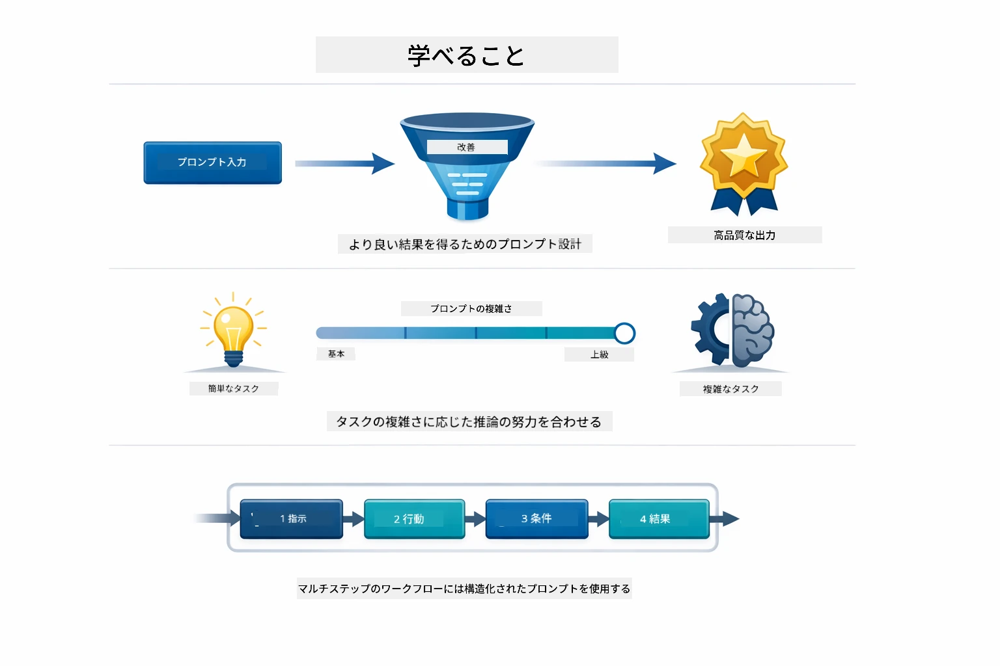
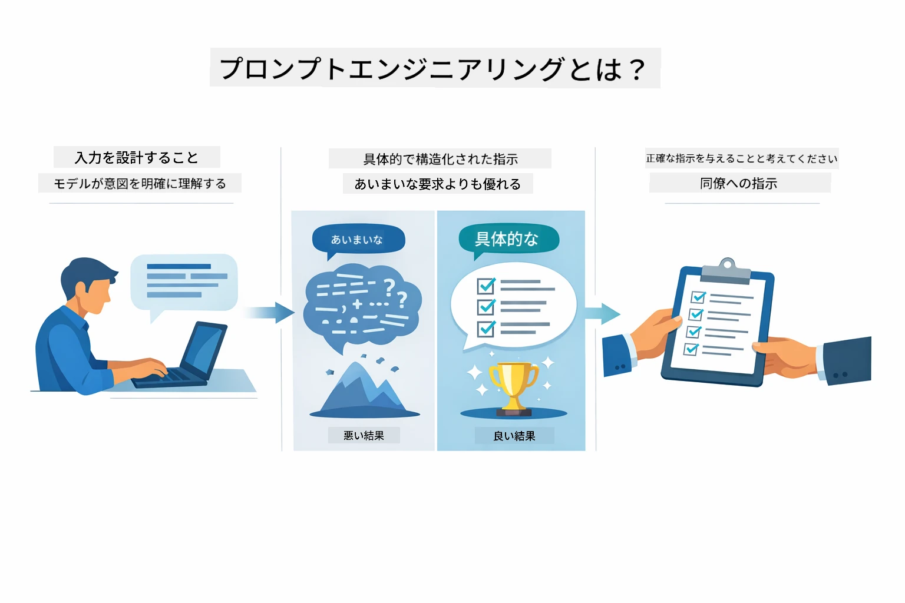
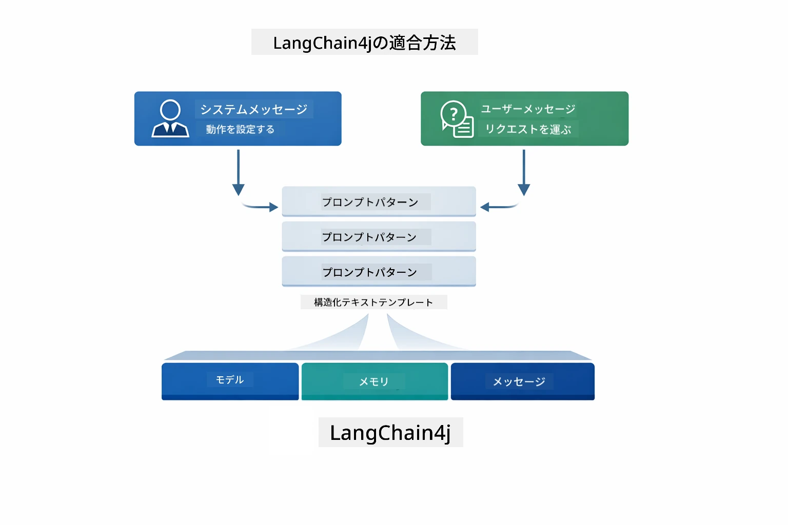
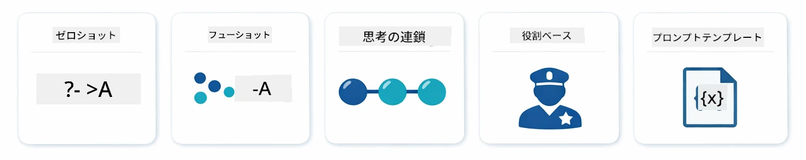
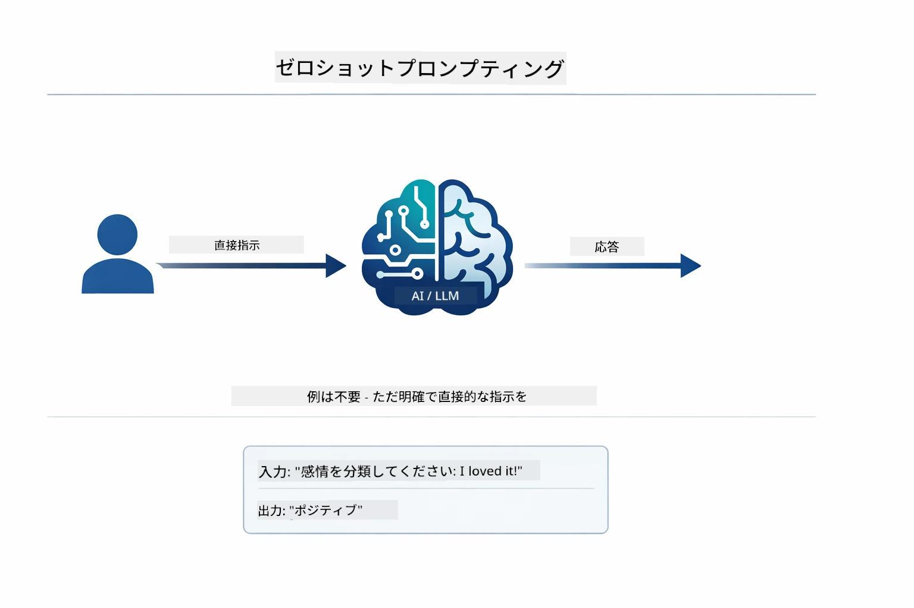
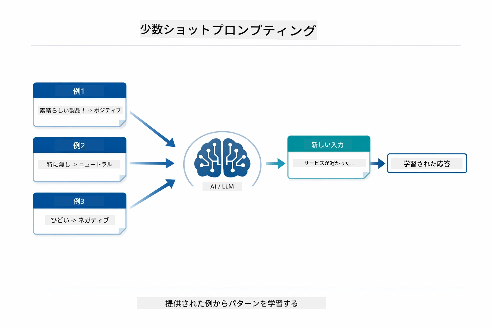
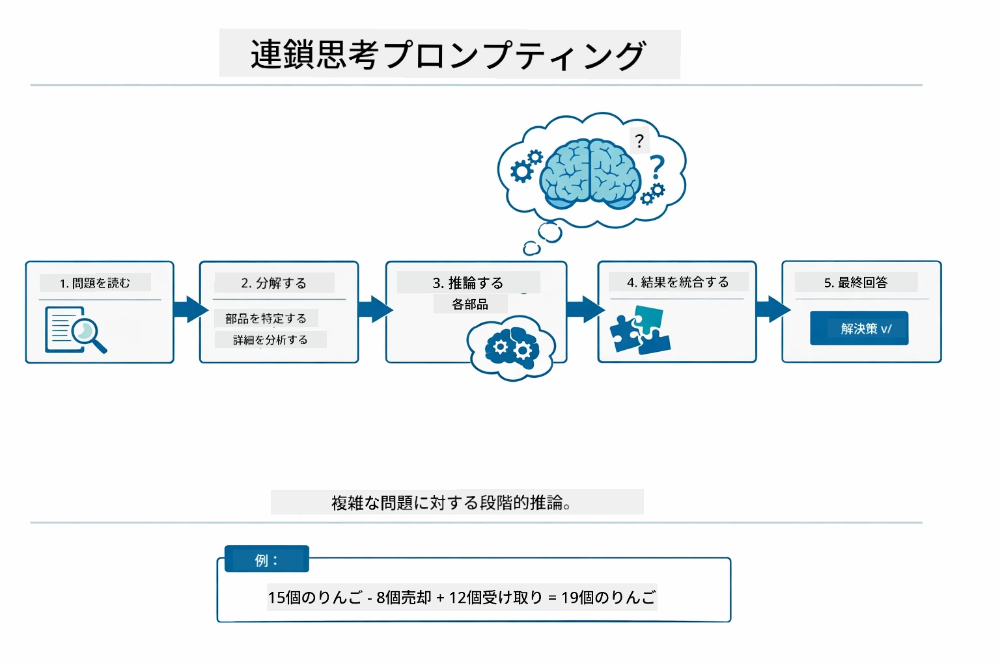
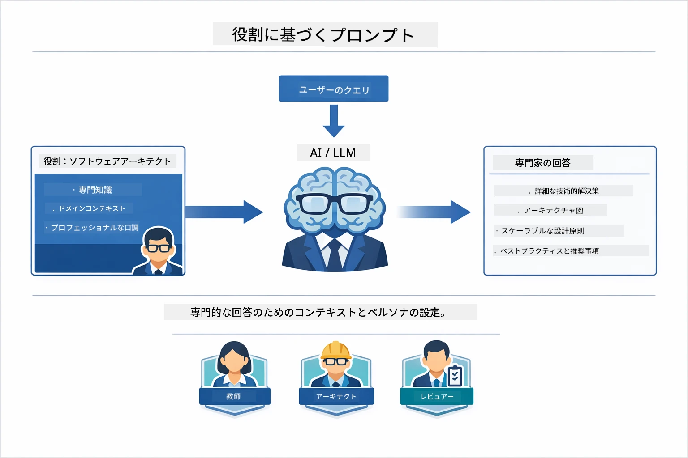
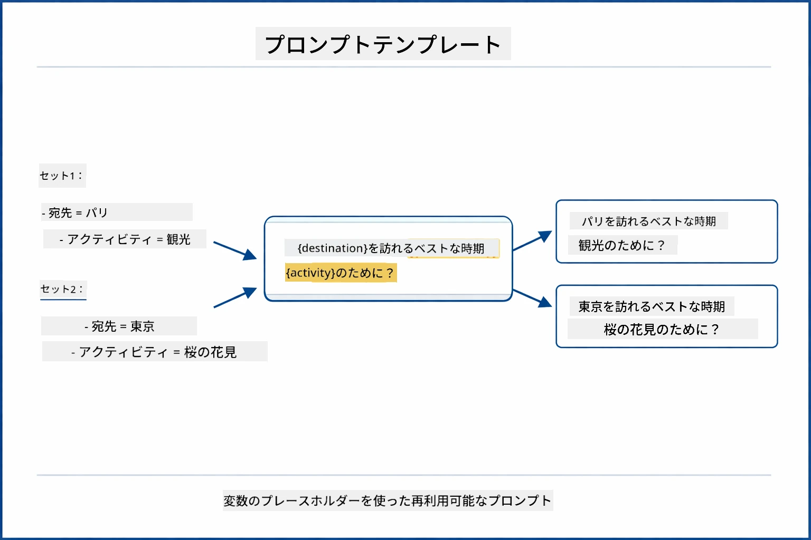
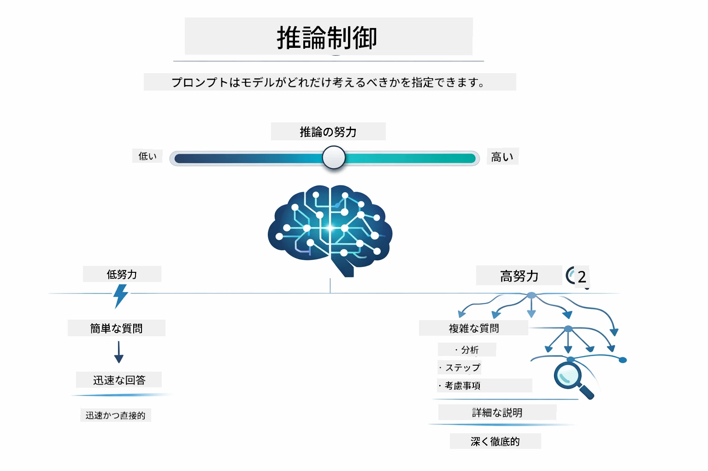

# Module 02: GPT-5.2によるプロンプトエンジニアリング

## 目次

- [学習内容](../../../02-prompt-engineering)
- [前提条件](../../../02-prompt-engineering)
- [プロンプトエンジニアリングの理解](../../../02-prompt-engineering)
- [プロンプトエンジニアリングの基本](../../../02-prompt-engineering)
  - [ゼロショットプロンプト](../../../02-prompt-engineering)
  - [フューショットプロンプト](../../../02-prompt-engineering)
  - [チェーン・オブ・ソート](../../../02-prompt-engineering)
  - [ロールベースプロンプト](../../../02-prompt-engineering)
  - [プロンプトテンプレート](../../../02-prompt-engineering)
- [高度なパターン](../../../02-prompt-engineering)
- [既存のAzureリソースの使用](../../../02-prompt-engineering)
- [アプリケーションのスクリーンショット](../../../02-prompt-engineering)
- [パターンの探求](../../../02-prompt-engineering)
  - [低熱心さ vs 高熱心さ](../../../02-prompt-engineering)
  - [タスク実行（ツール用プレアンブル）](../../../02-prompt-engineering)
  - [自己反省コード](../../../02-prompt-engineering)
  - [構造化分析](../../../02-prompt-engineering)
  - [マルチターンチャット](../../../02-prompt-engineering)
  - [ステップバイステップの推論](../../../02-prompt-engineering)
  - [制約付き出力](../../../02-prompt-engineering)
- [本当に学んでいること](../../../02-prompt-engineering)
- [次のステップ](../../../02-prompt-engineering)

## 学習内容



前のモジュールでは、メモリが会話型AIをどのように可能にするかを学び、GitHub Modelsを使った基本的な対話を体験しました。今回は、Azure OpenAIのGPT-5.2を使って質問の仕方、つまりプロンプト自体に焦点を当てます。プロンプトの構造が回答の質に大きく影響を与えるためです。まず基本的なプロンプト技法を復習し、それからGPT-5.2の能力を最大限に活かす8つの高度なパターンを紹介します。

GPT-5.2を使う理由は「推論制御」が導入されたためで、モデルに回答前の思考量を指示できます。これにより異なるプロンプト戦略の違いが明確になり、いつどの方法を使うべきか理解しやすくなります。さらにGPT-5.2はGitHub Modelsと比べてAzure上のレート制限が緩やかなのでその利点も享受します。

## 前提条件

- Module 01を完了していること（Azure OpenAIリソースがデプロイ済み）
- ルートディレクトリにAzure認証情報を含む`.env`ファイルがあること（Module 01の`azd up`で作成）

> **注意：** Module 01を未実施の場合は、まずそちらのデプロイ手順に従ってください。

## プロンプトエンジニアリングの理解



プロンプトエンジニアリングとは、求める結果を安定的に得るために入力テキストを設計することです。ただ質問を投げるだけでなく、モデルが何をどう出力すべきか理解できるようにリクエストを構造化することを指します。

同僚に指示を出すイメージです。「バグを修正して」だけでは曖昧ですが、「UserService.javaの45行目でnullチェックを追加してNullPointerExceptionを修正してくれ」は具体的です。言語モデルも同様で、具体性と構造が重要です。



LangChain4jはインフラ（モデル接続、メモリ、メッセージタイプ）を提供し、プロンプトパターンはそのインフラを通じて送る細かく設計されたテキストです。基本の構成要素はAIの振る舞いや役割を設定する`SystemMessage`と、実際のリクエストを運ぶ`UserMessage`です。

## プロンプトエンジニアリングの基本



このモジュールの高度なパターンに入る前に、基本となる5つのプロンプト手法を復習しましょう。これはすべてのプロンプトエンジニアが知っておくべき基礎です。[クイックスタートモジュール](../00-quick-start/README.md#2-prompt-patterns)を既に学んだ方は実践済みの内容です。ここではその概念的枠組みを示します。

### ゼロショットプロンプト

最もシンプルな方法です。例なしで直接命令だけ渡します。モデルは訓練データのみを頼りにタスクを理解し実行します。要求が単純で期待される動作が明白な場合に有効です。



*例なしの直接命令 — 命令だけからタスクを推測して実行*

```java
String prompt = "Classify this sentiment: 'I absolutely loved the movie!'";
String response = model.chat(prompt);
// 応答: "肯定的"
```
  
**使う場面：** 単純な分類、直接的な質問、翻訳、あるいは追加指導なしでモデルがこなせるタスク。

### フューショットプロンプト

モデルに従わせたいパターンを示す例を提供します。モデルは例から期待される入出力フォーマットを学び、新しい入力に適用します。望ましい形式や動作が明確でないときに一貫性が飛躍的に向上します。



*例から学習 — パターンを認識し新しい入力に適用*

```java
String prompt = """
    Classify the sentiment as positive, negative, or neutral.
    
    Examples:
    Text: "This product exceeded my expectations!" → Positive
    Text: "It's okay, nothing special." → Neutral
    Text: "Waste of money, very disappointed." → Negative
    
    Now classify this:
    Text: "Best purchase I've made all year!"
    """;
String response = model.chat(prompt);
```
  
**使う場面：** カスタム分類、一貫したフォーマット、ドメイン固有タスク、またはゼロショット結果が不安定な場合。

### チェーン・オブ・ソート

モデルに段階的推論を示させます。回答に飛びつく代わりに問題を分解し、それぞれの部分を明示的に処理します。数学、論理、多段推論における精度を向上させます。



*段階的推論 — 複雑な問題を明示的な論理ステップに分解*

```java
String prompt = """
    Problem: A store has 15 apples. They sell 8 apples and then 
    receive a shipment of 12 more apples. How many apples do they have now?
    
    Let's solve this step-by-step:
    """;
String response = model.chat(prompt);
// モデルは次のように示しています：15 - 8 = 7、次に7 + 12 = 19個のリンゴ
```
  
**使う場面：** 数学問題、論理パズル、デバッグ、推論過程を示すことで精度と信頼度が上がるタスク。

### ロールベースプロンプト

質問する前にAIにペルソナや役割を設定します。これにより返答のトーン、深さ、焦点が形作られます。「ソフトウェアアーキテクト」と「ジュニア開発者」や「セキュリティ監査人」では違うアドバイスをします。



*コンテキストとペルソナ設定 — 同じ質問でも役割によって返答が異なる*

```java
String prompt = """
    You are an experienced software architect reviewing code.
    Provide a brief code review for this function:
    
    def calculate_total(items):
        total = 0
        for item in items:
            total = total + item['price']
        return total
    """;
String response = model.chat(prompt);
```
  
**使う場面：** コードレビュー、指導、ドメイン特化分析、特定レベルや観点に合わせた回答が必要な場合。

### プロンプトテンプレート

変数プレースホルダーを使って再利用可能なプロンプトを作成します。毎回書き直す代わりにテンプレートを1回定義し、異なる値で埋めます。LangChain4jの`PromptTemplate`クラスで`{{variable}}`構文が簡単に使えます。



*変数プレースホルダー付き再利用プロンプト — 1つのテンプレートを多用*

```java
PromptTemplate template = PromptTemplate.from(
    "What's the best time to visit {{destination}} for {{activity}}?"
);

Prompt prompt = template.apply(Map.of(
    "destination", "Paris",
    "activity", "sightseeing"
));

String response = model.chat(prompt.text());
```
  
**使う場面：** 異なる入力で繰り返しクエリを投げる場合、バッチ処理、再利用可能なAIワークフロー構築、プロンプト構造が同じでデータだけ変わるシナリオ。

---

これら5つの基本はほとんどのプロンプト作成タスクに対する堅牢なツールセットを提供します。このモジュールの残りは、GPT-5.2の推論制御、自己評価、構造化出力能力を活かした**8つの高度なパターン**に基づいています。

## 高度なパターン

基本をカバーしたので、このモジュール独自の8つの高度なパターンに移りましょう。すべての問題が同じアプローチを必要としません。質問には迅速な回答が望まれる場合もあれば、じっくり考察が要る場合もあります。推論過程を見せたいこともあれば、結果だけ欲しいこともあります。以下の各パターンは異なるシナリオに最適化されており、GPT-5.2の推論制御によりその違いがさらに際立ちます。


*8つのプロンプトエンジニアリングパターンとユースケースの概要*



*GPT-5.2の推論制御ではどれだけ思考するか指定可能 — 速く直接的な回答から深い探求まで*


*低熱心さ（速く直接的） vs 高熱心さ（丁寧で探究的）な推論アプローチ*

**低熱心さ（速く焦点を絞る）** — 素早く直接的な回答が欲しい単純な質問用。モデルの推論は最小限で最大2ステップまで。計算、参照、単純な質問に使います。

```java
String prompt = """
    <reasoning_effort>low</reasoning_effort>
    <instruction>maximum 2 reasoning steps</instruction>
    
    What is 15% of 200?
    """;

String response = chatModel.chat(prompt);
```
  
> 💡 **GitHub Copilotで探る：** [`Gpt5PromptService.java`](../../../02-prompt-engineering/src/main/java/com/example/langchain4j/prompts/service/Gpt5PromptService.java)を開いて質問してみましょう：
> - 「低熱心さと高熱心さのプロンプトパターンの違いは？」
> - 「プロンプト内のXMLタグはAIの回答構造にどう役立つの？」
> - 「自己反省パターンと直接指示はどんな時に使い分ける？」

**高熱心さ（深く丁寧に）** — 複雑な問題に対し詳細な分析が欲しい場合。モデルは十分に探求し、詳しい推論を示します。システム設計、アーキテクチャ決定、複雑な調査に使います。

```java
String prompt = """
    <reasoning_effort>high</reasoning_effort>
    <instruction>explore thoroughly, show detailed reasoning</instruction>
    
    Design a caching strategy for a high-traffic REST API.
    """;

String response = chatModel.chat(prompt);
```
  
**タスク実行（段階的進行）** — 複数ステップのワークフロー用。モデルは最初に計画を示し、作業中に各ステップを説明、最後にまとめを行います。マイグレーションや実装、多段処理に適用。

```java
String prompt = """
    <task>Create a REST endpoint for user registration</task>
    <preamble>Provide an upfront plan</preamble>
    <narration>Narrate each step as you work</narration>
    <summary>Summarize what was accomplished</summary>
    """;

String response = chatModel.chat(prompt);
```
  
チェーン・オブ・ソートプロンプトは推論過程を示させて複雑な問題の精度を上げます。段階的な分解が人間とAI双方の理解を助けます。

> **🤖 [GitHub Copilot](https://github.com/features/copilot) Chatで試す：** このパターンについて尋ねてみてください
> - 「長時間処理にタスク実行パターンをどう適応する？」
> - 「本番アプリのツール用プレアンブル構造のベストプラクティスは？」
> - 「UIで中間進捗を捕捉・表示するには？」


*計画 → 実行 → まとめのワークフロー（多段タスク向け）*

**自己反省コード** — 本番品質コードの生成に。モデルがコード生成後、品質基準に照らし合わせてチェックし、改良を繰り返します。新機能やサービス開発に適用。

```java
String prompt = """
    <task>Create an email validation service</task>
    <quality_criteria>
    - Correct logic and error handling
    - Best practices (clean code, proper naming)
    - Performance optimization
    - Security considerations
    </quality_criteria>
    <instruction>Generate code, evaluate against criteria, improve iteratively</instruction>
    """;

String response = chatModel.chat(prompt);
```
  


*生成・評価・問題抽出・改良・繰り返しのループ*

**構造化分析** — 一貫した評価のため。モデルが固定の枠組み（正確性、実践遵守、性能、安全性）でコードをレビュー。コードレビューや品質評価に有効。

```java
String prompt = """
    <code>
    public List getUsers() {
        return database.query("SELECT * FROM users");
    }
    </code>
    
    <framework>
    Evaluate using these categories:
    1. Correctness - Logic and functionality
    2. Best Practices - Code quality
    3. Performance - Efficiency concerns
    4. Security - Vulnerabilities
    </framework>
    """;

String response = chatModel.chat(prompt);
```
  
> **🤖 [GitHub Copilot](https://github.com/features/copilot) Chatで試す：** 構造化分析について質問してみましょう
> - 「異なる種類のコードレビュー用に分析フレームワークをカスタマイズするには？」
> - 「構造化された出力をプログラムで解析し活用する最適な方法は？」
> - 「レビューごとに一貫した重要度レベルを維持するには？」


*重症度レベル付きの4カテゴリフレームワークで一貫したコードレビュー*

**マルチターンチャット** — 文脈を必要とする対話用。モデルは過去のメッセージを覚え、それを基に応答を構築。インタラクティブなサポートや複雑なQ&Aに使います。

```java
ChatMemory memory = MessageWindowChatMemory.withMaxMessages(10);

memory.add(UserMessage.from("What is Spring Boot?"));
AiMessage aiMessage1 = chatModel.chat(memory.messages()).aiMessage();
memory.add(aiMessage1);

memory.add(UserMessage.from("Show me an example"));
AiMessage aiMessage2 = chatModel.chat(memory.messages()).aiMessage();
memory.add(aiMessage2);
```
  


*複数ターンで蓄積される会話コンテキスト、トークン制限まで保持*

**ステップバイステップの推論** — 可視化された論理を必要とする問題用。モデルは各段階の推論を明示。数学問題や論理パズル、考え方を理解したい場合に有用。

```java
String prompt = """
    <instruction>Show your reasoning step-by-step</instruction>
    
    If a train travels 120 km in 2 hours, then stops for 30 minutes,
    then travels another 90 km in 1.5 hours, what is the average speed
    for the entire journey including the stop?
    """;

String response = chatModel.chat(prompt);
```
  


*問題を明示的な論理ステップに分解*

**制約付き出力** — 特定のフォーマット要件がある回答用。モデルは形式や長さのルールを厳守。要約や厳密な出力構造が必要な場面に。

```java
String prompt = """
    <constraints>
    - Exactly 100 words
    - Bullet point format
    - Technical terms only
    </constraints>
    
    Summarize the key concepts of machine learning.
    """;

String response = chatModel.chat(prompt);
```
  


*特定のフォーマット、長さ、構造の要件を強制*

## 既存のAzureリソースの使用

**デプロイ確認：**

ルートディレクトリにAzure認証情報の入った`.env`ファイルが存在することを確認（Module 01で作成）：
```bash
cat ../.env  # AZURE_OPENAI_ENDPOINT、API_KEY、DEPLOYMENTを表示する必要があります
```
  
**アプリケーション起動：**

> **注意：** もし既にModule 01の`./start-all.sh`で全アプリを起動済みなら、このモジュールはポート8083で既に動作中です。以下の起動コマンドはスキップして http://localhost:8083 に直接アクセスできます。

**オプション1: Spring Boot Dashboardの使用（VS Codeユーザーに推奨）**

DevコンテナにはSpring Boot Dashboard拡張機能が含まれており、すべてのSpring Bootアプリを視覚的に管理できます。VS Codeの左側のアクティビティバーでSpring Bootアイコンを探してください。
Spring Boot ダッシュボードから、以下のことができます：
- ワークスペース内のすべての利用可能な Spring Boot アプリケーションを確認
- ワンクリックでアプリケーションの起動/停止
- アプリケーションのログをリアルタイムで表示
- アプリケーションの状態を監視

"prompt-engineering" の隣にある再生ボタンをクリックしてこのモジュールを開始するか、すべてのモジュールを一度に開始できます。


**オプション 2：シェルスクリプトを使用する**

すべてのウェブアプリケーション（モジュール 01-04）を起動：

**Bash:**
```bash
cd ..  # ルートディレクトリから
./start-all.sh
```

**PowerShell:**
```powershell
cd ..  # ルートディレクトリから
.\start-all.ps1
```

または、このモジュールだけを起動：

**Bash:**
```bash
cd 02-prompt-engineering
./start.sh
```

**PowerShell:**
```powershell
cd 02-prompt-engineering
.\start.ps1
```

どちらのスクリプトもルートの `.env` ファイルから環境変数を自動的に読み込み、JARが存在しない場合はビルドします。

> **注意:** すべてのモジュールを手動でビルドしてから起動したい場合：
>
> **Bash:**
> ```bash
> cd ..  # Go to root directory
> mvn clean package -DskipTests
> ```
>
> **PowerShell:**
> ```powershell
> cd ..  # Go to root directory
> mvn clean package -DskipTests
> ```

ブラウザで http://localhost:8083 を開いてください。

**停止する場合：**

**Bash:**
```bash
./stop.sh  # このモジュールのみ
# または
cd .. && ./stop-all.sh  # 全てのモジュール
```

**PowerShell:**
```powershell
.\stop.ps1  # このモジュールのみ
# または
cd ..; .\stop-all.ps1  # すべてのモジュール
```

## アプリケーションのスクリーンショット


*8つのプロンプトエンジニアリングパターンとその特徴やユースケースを示すメインダッシュボード*

## パターンの探求

ウェブインターフェースでは、さまざまなプロンプティング戦略を試すことができます。各パターンは異なる問題を解決します。どのアプローチがどんな時に効果的か試してみてください。

### 低イージャネス vs 高イージャネス

「15% of 200は何ですか？」のような単純な質問を低イージャネスで尋ねてみましょう。即座に直接的な答えが得られます。次に「高トラフィックAPIのキャッシュ戦略を設計してください」という複雑な質問を高イージャネスで尋ねてみましょう。モデルがペースを落とし、詳細な推論を提供する様子が分かります。同じモデル、同じ質問構造ですが、プロンプトは思考の深さを指示しています。


*最小限の推論で迅速な計算*


*詳細なキャッシュ戦略（2.8MB）*

### タスク実行（ツールプレアンブル）

複数ステップのワークフローは、事前計画と進捗のナレーションが有効です。モデルは何をするかを概説し、各ステップを説明し、結果をまとめます。


*ステップごとのナレーション付きRESTエンドポイントの作成（3.9MB）*

### 自己反省コード

「メール検証サービスを作成してください」を試してください。単にコードを生成して終わりではなく、モデルは生成したコードを品質基準に照らして評価し、弱点を特定して改善します。コードが製品基準に達するまで繰り返し処理が行われる様子が見られます。


*完全なメール検証サービス（5.2MB）*

### 構造化分析

コードレビューには一貫した評価フレームワークが必要です。モデルは決まったカテゴリ（正確性、プラクティス、性能、セキュリティ）と重大度レベルを使ってコードを分析します。


*フレームワークに基づくコードレビュー*

### マルチターンチャット

「Spring Boot とは何ですか？」と聞き、すぐに「例を見せてください」と続けてください。モデルは最初の質問を覚えており、特定の Spring Boot の例を示します。メモリが無い場合、2つ目の質問はあいまいすぎてしまいます。


*質問を跨いだコンテキストの維持*

### ステップバイステップ推論

数学の問題を選び、ステップバイステップ推論と低イージャネスの両方で試してみましょう。低イージャネスは答えだけを速く返しますが、不透明です。ステップバイステップはすべての計算や判断を見せます。


*明示的にステップを示す数学問題*

### 制約付き出力

特定の形式や単語数が必要な場合、このパターンが厳格に順守を強制します。100語ちょうどの箇条書きで要約を生成してみてください。


*形式制御付き機械学習の要約*

## 本当に学んでいること

**推論の努力がすべてを変える**

GPT-5.2では、プロンプトを通じて計算努力を制御できます。低い努力は高速応答と最小限の探索を意味します。高い努力はモデルが深く考えるため時間がかかります。課題の複雑さに合わせて努力を調整することを学んでいます－単純な質問には時間をかけず、複雑な判断は急がないように。

**構造が行動を導く**

プロンプト内のXMLタグに気づきましたか？装飾ではありません。モデルは自由形式のテキストよりも構造化された指示に従う信頼性が高いです。複数ステップの処理や複雑なロジックが必要な場合、構造がどこにいるか次に何をするかを追跡する手助けになります。


*明確なセクションとXMLスタイルの構成を持つ、よく構造化されたプロンプトの構造*

**自己評価による品質向上**

自己反省パターンは品質基準を明確にすることで機能します。モデルに「正しくやる」ことを期待する代わりに、「正しい」とは何かを正確に伝えます：正確な論理、エラーハンドリング、性能、安全性。モデルは自分の出力を評価して改善できます。これによりコード生成は単なる宝くじではなくプロセスになります。

**コンテキストは有限**

マルチターン会話はメッセージ履歴を含むことで成り立ちますが、上限があります－すべてのモデルには最大トークン数があります。会話が長くなると、関連コンテキストを保ちつつその上限を超えない戦略が必要になります。このモジュールはメモリの仕組みを示し、後のモジュールでいつ要約し、いつ忘れ、いつ参照するかを学びます。

## 次のステップ

**次のモジュール：** [03-rag - RAG (Retrieval-Augmented Generation)](../03-rag/README.md)

---

**ナビゲーション：** [← 前へ: Module 01 - Introduction](../01-introduction/README.md) | [メインへ戻る](../README.md) | [次へ: Module 03 - RAG →](../03-rag/README.md)

---

<!-- CO-OP TRANSLATOR DISCLAIMER START -->
**免責事項**：  
本書類は、AI翻訳サービス「Co-op Translator」（https://github.com/Azure/co-op-translator）を使用して翻訳されました。正確性の確保に努めておりますが、自動翻訳には誤りや不正確な部分が含まれる可能性があります。原文の母国語による文書を権威ある情報源としてご参照ください。重要な情報については、専門の人間翻訳をご利用いただくことを推奨します。本翻訳の利用によって生じたいかなる誤解や誤訳についても、一切の責任を負いかねます。
<!-- CO-OP TRANSLATOR DISCLAIMER END -->