# モジュール 03: RAG (Retrieval-Augmented Generation)

## 目次

- [ビデオウォークスルー](../../../03-rag)
- [学習内容](../../../03-rag)
- [前提条件](../../../03-rag)
- [RAGの理解](../../../03-rag)
  - [このチュートリアルで使うRAGの方式は？](../../../03-rag)
- [仕組み](../../../03-rag)
  - [ドキュメント処理](../../../03-rag)
  - [埋め込みの作成](../../../03-rag)
  - [セマンティックサーチ](../../../03-rag)
  - [回答生成](../../../03-rag)
- [アプリケーションの実行](../../../03-rag)
- [アプリケーションの使い方](../../../03-rag)
  - [ドキュメントのアップロード](../../../03-rag)
  - [質問する](../../../03-rag)
  - [出典の確認](../../../03-rag)
  - [質問で実験](../../../03-rag)
- [重要なコンセプト](../../../03-rag)
  - [チャンク化戦略](../../../03-rag)
  - [類似度スコア](../../../03-rag)
  - [インメモリストレージ](../../../03-rag)
  - [コンテキストウィンドウ管理](../../../03-rag)
- [RAGが重要な理由](../../../03-rag)
- [次のステップ](../../../03-rag)

## ビデオウォークスルー

このモジュールの始め方を解説するライブセッションを視聴してください:

<a href="https://www.youtube.com/watch?v=_olq75ZH_eY"></a>

## 学習内容

前のモジュールでは、AIと対話し、効果的にプロンプトを構築する方法を学びました。しかし根本的な制約があります：言語モデルは訓練時に学んだことしか知りません。あなたの会社の方針やプロジェクトのドキュメント、訓練されていない情報について質問に答えることはできません。

RAG（Retrieval-Augmented Generation）はこの問題を解決します。モデルに情報を直接教えるのではなく（これはコストが高く非現実的です）、文書を検索する能力を与えます。質問が来ると、システムは関連情報を検索し、それをプロンプトに含めます。モデルはその検索されたコンテキストを基に回答します。

RAGをモデルに参照図書館を与えるイメージで考えてください。質問をすると、システムは：

1. **ユーザークエリ** - 質問が入力される
2. **埋め込み** - 質問をベクトルに変換
3. **ベクトル検索** - 類似した文書チャンクを検索
4. **コンテキストの組み立て** - 関連チャンクをプロンプトに追加
5. **回答** - LLMがそのコンテキストを元に回答を生成

これにより、モデルの応答が訓練知識に依存したり、作り話をするのではなく、実際のデータに基づいたものになります。

## 前提条件

- [モジュール 00 - クイックスタート](../00-quick-start/README.md) を完了していること（このモジュールで後述するEasy RAGの例のため）
- [モジュール 01 - イントロダクション](../01-introduction/README.md) を完了していること（Azure OpenAIのリソースがデプロイ済み、`text-embedding-3-small` 埋め込みモデルも含む）
- ルートディレクトリにAzure認証情報を含む `.env` ファイルがあること（モジュール 01 の `azd up` コマンドで作成）

> **注意:** モジュール 01 をまだ完了していない場合は、そこでの展開手順を先に行ってください。`azd up` コマンドはこのモジュールで使うGPTチャットモデルと埋め込みモデルの両方を展開します。

## RAGの理解

下図はコアコンセプトを示しています：モデルの訓練データだけに頼る代わりに、RAGは回答を生成する前に参照するためのあなたのドキュメントのライブラリをモデルに与えます。

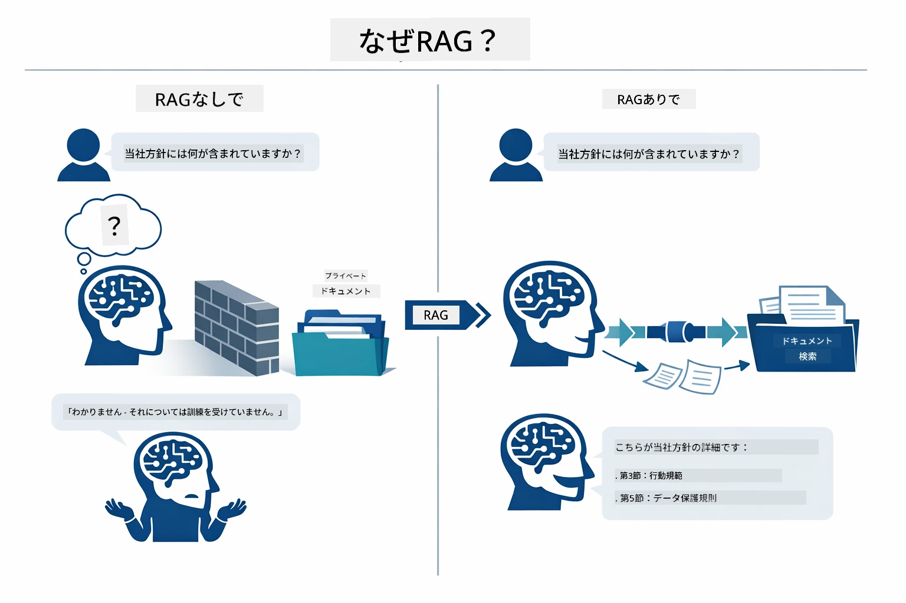

*この図は標準的なLLM（訓練データから推測する）と、RAG強化型LLM（まずあなたのドキュメントを参照する）との違いを示しています。*

全体の流れはこうなります。ユーザーの質問は四つの段階を経ます — 埋め込み、ベクトル検索、コンテキストの組み立て、回答生成 — 各段階が前の段階の出力を踏まえています：


*この図はエンドツーエンドのRAGパイプラインを示しており、ユーザークエリが埋め込み、ベクトル検索、コンテキスト組み立て、回答生成の順に処理されます。*

このモジュールでは、各段階を詳細に解説し、動かして変更できるコードを提供しています。

### このチュートリアルで使うRAGの方式は？

LangChain4jは3つのRAG実装方法を提供しており、それぞれ抽象度が異なります。下図はそれらを並べて比較しています：

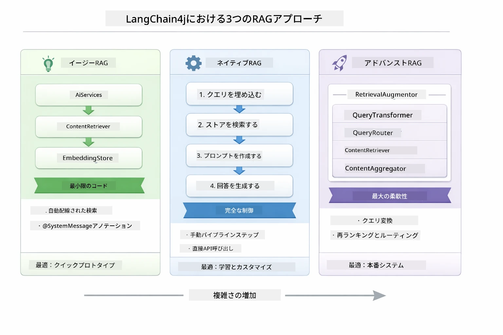

*この図はLangChain4jの3つのRAGアプローチ（Easy, Native, Advanced）を比較し、それぞれの主要コンポーネントと利用タイミングを示しています。*

| 方式 | 概要 | トレードオフ |
|---|---|---|
| **Easy RAG** | `AiServices` と `ContentRetriever` により全てが自動接続されます。インターフェースに注釈を付けてリトリーバーをセットすれば、LangChain4jが背後で埋め込み、検索、プロンプトの組み立てを行います。 | コードは最小限ですが、内部処理は見えません。 |
| **Native RAG** | 自分で埋め込みモデルを呼び出し、ストアを検索して、プロンプトを構築し、回答を生成します — 明示的に一段階ずつ操作します。 | コードは多めですが、各段階を見て変更可能です。 |
| **Advanced RAG** | `RetrievalAugmentor` フレームワークを使い、プラガブルなクエリ変換器、ルーター、再ランキング、コンテンツ注入を組み込んでプロダクションレベルのパイプラインを構築します。 | 柔軟性最大ですが、かなりの複雑さを伴います。 |

**このチュートリアルではNative方式を使います。** RAGパイプラインの各段階 — クエリの埋め込み、ベクトルストア検索、コンテキスト組み立て、回答生成 — は [`RagService.java`](../../../03-rag/src/main/java/com/example/langchain4j/rag/service/RagService.java) に明示的に書かれています。学習教材として、コードを最小化するよりも各段階を見て理解することが重要なためです。仕組みを理解したら、手軽なプロトタイプ用にEasy RAGに移行したり、プロダクション用にAdvanced RAGを使うこともできます。

> **💡 Easy RAGは既に見たことがありますか？** [クイックスタート モジュール](../00-quick-start/README.md) には、Easy RAG方式を使ったドキュメントQ&Aの例（[`SimpleReaderDemo.java`](../../../00-quick-start/src/main/java/com/example/langchain4j/quickstart/SimpleReaderDemo.java)）があります。LangChain4jが埋め込み、検索、プロンプトの組み立てを自動的に行います。このモジュールでは、そのパイプラインを分解して各段階を自分で見て制御できるようにします。

下の図はクイックスタートにあるEasy RAGパイプラインを示しています。`AiServices` と `EmbeddingStoreContentRetriever` は全ての複雑さを隠しており、ドキュメントをロードしてリトリーバーを付ければ回答が得られます。このモジュールのNative方式は、その隠れた各ステップを開きます：

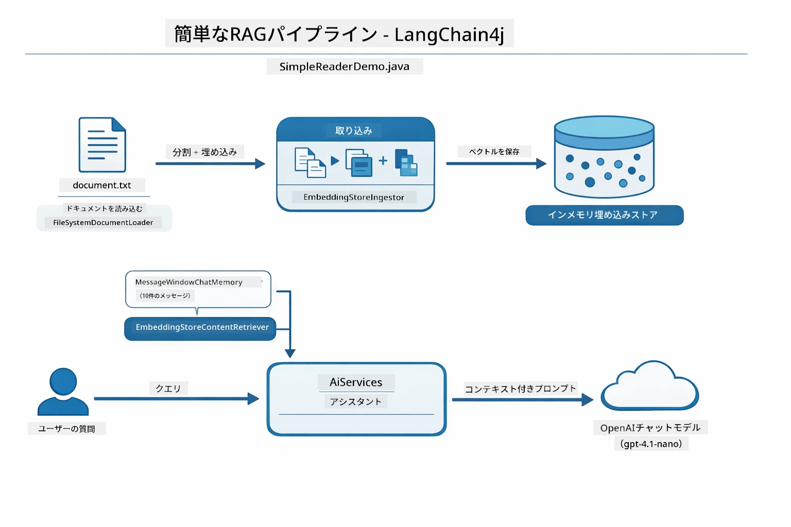

*この図は `SimpleReaderDemo.java` のEasy RAGパイプラインです。Native方式（本モジュール）と比較してください：Easy RAGは `AiServices` と `ContentRetriever` の背後に埋め込み、検索、プロンプト組み立てを隠していますが、Native方式は各段階（埋め込み、検索、コンテキスト組み立て、生成）を自分で呼び出し、完全に可視化・制御できます。*

## 仕組み

このモジュールのRAGパイプラインは、ユーザーが質問をするたびに実行される4つの段階に分かれます。まず、アップロードされたドキュメントは**解析・チャンク化**され、扱いやすいサイズに分割されます。そのチャンクは**ベクトル埋め込み**に変換され、数値的に比較できるよう保存されます。クエリが来ると、システムは**セマンティックサーチ**を行い最も関連するチャンクを見つけ、最後にそれらをコンテキストとしてLLMに渡して**回答を生成**します。以下に各段階のコードと図解で説明します。まずは最初のステップから見てみましょう。

### ドキュメント処理

[DocumentService.java](../../../03-rag/src/main/java/com/example/langchain4j/rag/service/DocumentService.java)

ドキュメントをアップロードすると、システムはそれを解析します（PDFやテキスト）。ファイル名などのメタデータを付与し、モデルのコンテキストウィンドウに収まる小さなチャンクに分割します。チャンクは少し重複しており、境界でコンテキストを失わないようにしています。

```java
// アップロードされたファイルを解析し、LangChain4jドキュメントにラップする
Document document = Document.from(content, metadata);

// 30トークンの重なりを持つ300トークンのチャンクに分割する
DocumentSplitter splitter = DocumentSplitters
    .recursive(300, 30);

List<TextSegment> segments = splitter.split(document);
```

下図は視覚的に表しています。チャンク同士は30トークン分重複しているため、重要なコンテキストが欠落しません：

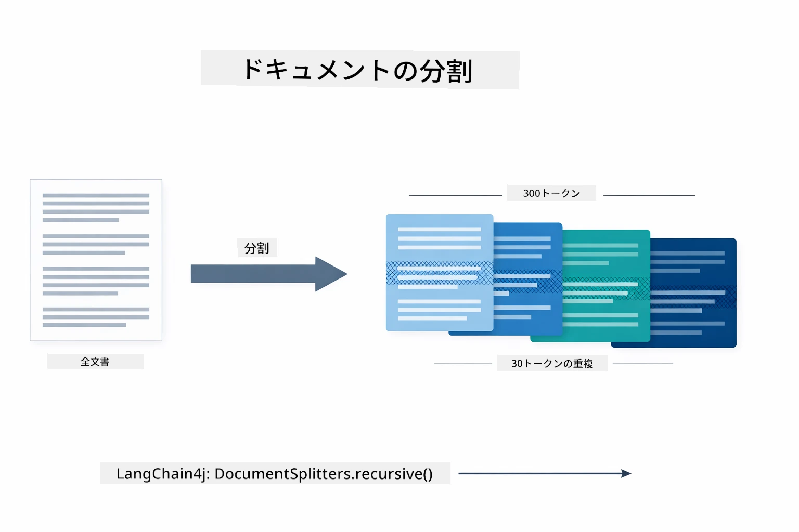

*この図はドキュメントを300トークンずつ、30トークンの重複をもって分割する様子です。チャンク境界のコンテキストが維持されます。*

> **🤖 [GitHub Copilot](https://github.com/features/copilot) Chatで試す:** [`DocumentService.java`](../../../03-rag/src/main/java/com/example/langchain4j/rag/service/DocumentService.java) を開いて質問してください：
> - 「LangChain4jはどうやってドキュメントをチャンクに分けるのか？ なぜ重複が重要なのか？」
> - 「ドキュメントの種類ごとに最適なチャンクサイズは？ なぜそうか？」
> - 「多言語ドキュメントや特殊書式の処理はどうする？」

### 埋め込みの作成

[LangChainRagConfig.java](../../../03-rag/src/main/java/com/example/langchain4j/rag/config/LangChainRagConfig.java)

各チャンクは意味を数値化した埋め込みに変換されます。埋め込みモデルはチャットモデルのように「賢い」わけではありません。指示に従ったり推論したり質問に答えることはできません。代わりに、テキストを数学空間にマッピングし、似た意味が近い位置に来るよう変換します — 「car」と「automobile」が近く、「refund policy」と「return my money」も近くなります。チャットモデルが話せる人なら、埋め込みモデルは超優秀なファイリングシステムと考えられます。

下図はこの概念を示しています — テキストを入力し、数値ベクトルが出力され、似た意味は近いベクトル位置に配置されます：

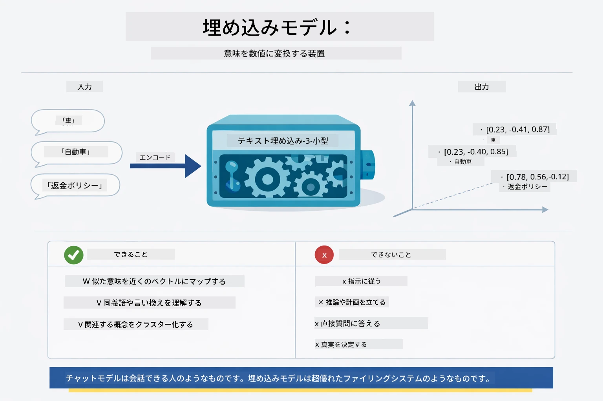

*この図はテキストを数値ベクトルに変換し、「car」と「automobile」のような類似する意味をベクトル空間で近接させる埋め込みモデルの仕組みを示しています。*

```java
@Bean
public EmbeddingModel embeddingModel() {
    return OpenAiOfficialEmbeddingModel.builder()
        .baseUrl(azureOpenAiEndpoint)
        .apiKey(azureOpenAiKey)
        .modelName(azureEmbeddingDeploymentName)
        .build();
}

EmbeddingStore<TextSegment> embeddingStore = 
    new InMemoryEmbeddingStore<>();
```

下図はRAGパイプラインの2つのフローと、それを実装するLangChain4jクラスのクラス図です。**取り込みフロー**（アップロード時に1回実行）はドキュメントを分割しチャンクを埋め込み、`.addAll()`で保存します。**クエリフロー**（毎回質問時に実行）は質問を埋め込み、`.search()`でストアを検索し、マッチしたコンテキストをチャットモデルに渡します。両フローは共通の `EmbeddingStore<TextSegment>` インターフェースで接続します：

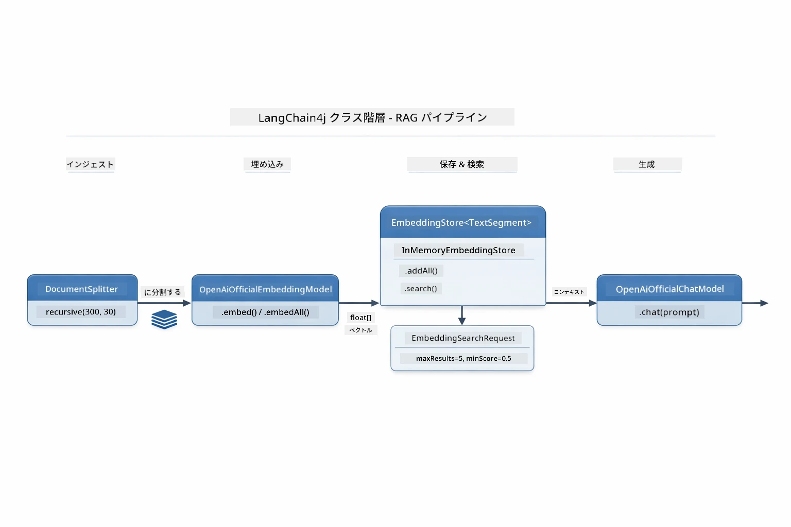

*この図はRAGパイプラインの取り込みフローとクエリフローが、共有のEmbeddingStoreを介して接続される様子を示しています。*

埋め込みが保存されると、類似コンテンツは自然にベクトル空間でクラスタ化されます。下図は関連トピックのドキュメントが近くに集まり、セマンティックサーチが可能になる様子を3Dで示しています：


*この図は「技術文書」「ビジネスルール」「FAQ」など、関連文書が3Dベクトル空間で異なるクラスターを形成する様子を示しています。*

検索時は4つのステップを順に実行します：文書を一度埋め込み、検索時にクエリを埋め込み、コサイン類似度で全ベクトルと比較し、上位K件のチャンクを返す。下図は各ステップと対応するLangChain4jクラスを示しています：

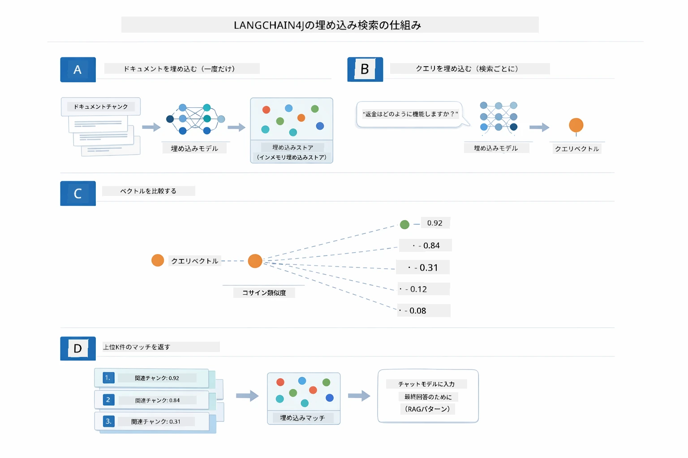

*この図は、文書埋め込み、クエリ埋め込み、コサイン類似度による比較、上位K件の返却という4ステップの埋め込み検索プロセスを示しています。*

### セマンティックサーチ

[RagService.java](../../../03-rag/src/main/java/com/example/langchain4j/rag/service/RagService.java)

質問が入力されると、その質問も埋め込みに変換されます。システムは質問の埋め込みを全文書チャンクの埋め込みと比較し、最も意味的に近いチャンクを見つけます。単なるキーワードの一致ではなく、本当の意味の類似性を考慮します。

```java
Embedding queryEmbedding = embeddingModel.embed(question).content();

EmbeddingSearchRequest searchRequest = EmbeddingSearchRequest.builder()
    .queryEmbedding(queryEmbedding)
    .maxResults(5)
    .minScore(0.5)
    .build();

EmbeddingSearchResult<TextSegment> searchResult = embeddingStore.search(searchRequest);
List<EmbeddingMatch<TextSegment>> matches = searchResult.matches();

for (EmbeddingMatch<TextSegment> match : matches) {
    String relevantText = match.embedded().text();
    double score = match.score();
}
```

下図はセマンティックサーチと従来のキーワード検索を比較しています。キーワード検索で「vehicle」を検索すると「cars and trucks」についてのチャンクは見つかりませんが、セマンティックサーチは意味が同じと理解し、高スコアで返します：

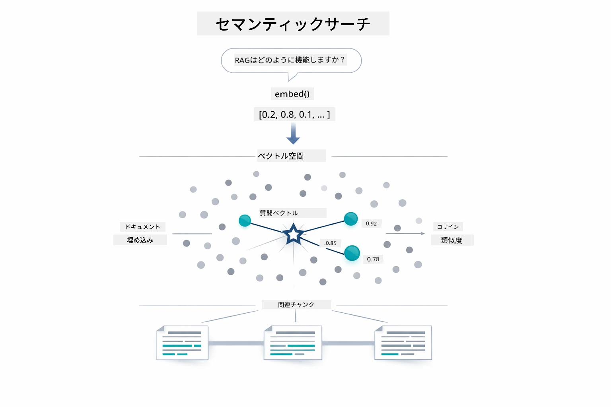

*この図はキーワード検索とセマンティックサーチを比較し、セマンティックサーチがキーワードが異なっていても概念的に関連するコンテンツを取得する様子を示しています。*
内部的には、類似度はコサイン類似度で測定されます。これは本質的に「これら二つの矢印は同じ方向を指しているか？」という問いです。二つのチャンクはまったく異なる言葉を使っていても、意味が同じであればベクトルは同じ方向を指し、スコアは1.0に近づきます：

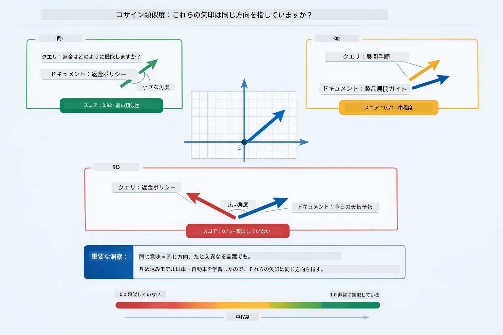

*この図は埋め込みベクトル間の角度としてコサイン類似度を示しています。より整列したベクトルは1.0に近いスコアとなり、より高い意味的類似性を示します。*

> **🤖 [GitHub Copilot](https://github.com/features/copilot) Chatで試す：** [`RagService.java`](../../../03-rag/src/main/java/com/example/langchain4j/rag/service/RagService.java)を開き、以下を尋ねてみてください：
> - 「埋め込みによる類似検索はどのように機能し、スコアは何によって決まるのか？」
> - 「どのような類似度の閾値を使うべきで、結果にどう影響するのか？」
> - 「関連するドキュメントが見つからなかった場合はどう処理するのか？」

### 回答生成

[RagService.java](../../../03-rag/src/main/java/com/example/langchain4j/rag/service/RagService.java)

最も関連性の高いチャンクは、明示的な指示、取得したコンテキスト、ユーザーの質問を含む構造化されたプロンプトに組み込まれます。モデルはこれらの特定のチャンクを読み、その情報に基づいて回答します — モデルは目の前の情報のみを使用できるため、幻覚（hallucination）を防止します。

```java
String context = matches.stream()
    .map(match -> match.embedded().text())
    .collect(Collectors.joining("\n\n"));

String prompt = String.format("""
    Answer the question based on the following context.
    If the answer cannot be found in the context, say so.

    Context:
    %s

    Question: %s

    Answer:""", context, request.question());

String answer = chatModel.chat(prompt);
```

下図はこの組み立ての動作例を示しています — 検索ステップでトップスコアを得たチャンクがプロンプトテンプレートに注入され、`OpenAiOfficialChatModel`が根拠のある回答を生成します：

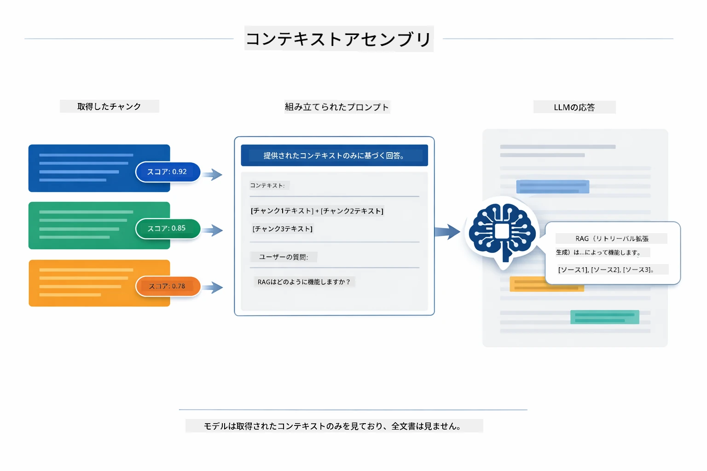

*この図はトップスコアのチャンクが構造化されたプロンプトに組み込まれ、モデルがデータに基づいた回答を生成する様子を示しています。*

## アプリケーションの実行

**デプロイを確認する：**

ルートディレクトリにAzure認証情報を含む`.env`ファイルが存在することを確認してください（モジュール01で作成済み）。モジュールディレクトリ(`03-rag/`)から以下を実行します：

**Bash:**
```bash
cat ../.env  # AZURE_OPENAI_ENDPOINT、API_KEY、DEPLOYMENTを表示する必要があります
```

**PowerShell:**
```powershell
Get-Content ..\.env  # AZURE_OPENAI_ENDPOINT、API_KEY、DEPLOYMENTを表示する必要があります
```

**アプリケーションを起動する：**

> **注意：** もしルートディレクトリから`./start-all.sh`で全アプリケーションを起動済みの場合（モジュール01で説明）、本モジュールは既にポート8081で実行中です。以下の起動コマンドはスキップして http://localhost:8081 へ直接アクセスできます。

**オプション1：Spring Boot Dashboardを使用する（VS Codeユーザーに推奨）**

DevコンテナにはSpring Boot Dashboard拡張機能が含まれており、すべてのSpring Bootアプリケーションを視覚的に管理できます。VS Codeの左側のアクティビティバーでSpring Bootアイコンを探してください。

Spring Boot Dashboardからは以下が可能です：
- ワークスペース内のすべてのSpring Bootアプリケーションを確認
- クリック一つでアプリケーションの起動・停止
- リアルタイムでアプリケーションログを閲覧
- アプリケーションの状態監視

「rag」の横にある再生ボタンをクリックしてこのモジュールを起動するか、すべてのモジュールを一括で起動できます。


*このスクリーンショットはVS CodeのSpring Boot Dashboardで、ここからアプリケーションの起動・停止や監視が行えます。*

**オプション2：シェルスクリプトを使用する**

すべてのWebアプリ（モジュール01〜04）を起動：

**Bash:**
```bash
cd ..  # ルートディレクトリから
./start-all.sh
```

**PowerShell:**
```powershell
cd ..  # ルートディレクトリから
.\start-all.ps1
```

または、このモジュールだけ起動：

**Bash:**
```bash
cd 03-rag
./start.sh
```

**PowerShell:**
```powershell
cd 03-rag
.\start.ps1
```

両方のスクリプトはルートの`.env`ファイルから環境変数を自動で読み込み、必要に応じてJARをビルドします。

> **注意：** もし事前に全モジュールを手動ビルドしたい場合：
>
> **Bash:**
> ```bash
> cd ..  # Go to root directory
> mvn clean package -DskipTests
> ```

> **PowerShell:**
> ```powershell
> cd ..  # Go to root directory
> mvn clean package -DskipTests
> ```

ブラウザで http://localhost:8081 を開きます。

**停止するには：**

**Bash:**
```bash
./stop.sh  # このモジュールのみ
# または
cd .. && ./stop-all.sh  # すべてのモジュール
```

**PowerShell:**
```powershell
.\stop.ps1  # このモジュールのみ
# または
cd ..; .\stop-all.ps1  # すべてのモジュール
```

## アプリケーションの利用方法

このアプリケーションはドキュメントアップロードと質問用のWebインターフェイスを提供します。

<a href="images/rag-homepage.png"></a>

*このスクリーンショットは、ドキュメントをアップロードして質問できるRAGアプリケーションのインターフェイスです。*

### ドキュメントのアップロード

まずドキュメントをアップロードしてください — テスト用にはTXTファイルが最適です。このディレクトリにはLangChain4jの機能、RAGの実装方法、ベストプラクティスが含まれた`sample-document.txt`が用意されており、システムのテストに最適です。

アップロードするとシステムは自動でドキュメントを処理し、チャンクに分割して各チャンクの埋め込みを作成します。

### 質問する

ドキュメント内容に関して具体的な質問をしてみてください。文書中にはっきり記載されている事実に関する質問がおすすめです。システムは関連チャンクを検索し、プロンプトに含めて回答を生成します。

### ソース参照の確認

回答には類似度スコア付きのソース参照が含まれます。スコアは0から1までで、質問に対して各チャンクがどれほど関連しているかを示します。スコアが高いほど関連性が高いことを意味し、回答の元になる情報を検証するのに役立ちます。

<a href="images/rag-query-results.png"></a>

*このスクリーンショットは生成回答、ソース参照、各取得チャンクの関連度スコアを含むクエリ結果を示しています。*

### 質問の実験

様々なタイプの質問を試せます：
- 具体的な事実：「主なテーマは何ですか？」
- 比較：「XとYの違いは何ですか？」
- 要約：「Zについての重要ポイントを要約してください」

質問内容によって関連度スコアがどのように変わるかを観察してください。

## 重要な概念

### チャンク分割戦略

ドキュメントは300トークンごとに分割され、30トークンのオーバーラップがあります。このバランスでチャンクは十分な文脈を持ちつつ小さく保たれ、複数のチャンクをプロンプトに含めやすくなっています。

### 類似度スコア

取得された各チャンクには0から1の間の類似度スコアが付き、質問との類似度を示します。下図はスコアのレンジとシステムがどのようにそれをフィルタリングに使うかを示しています：

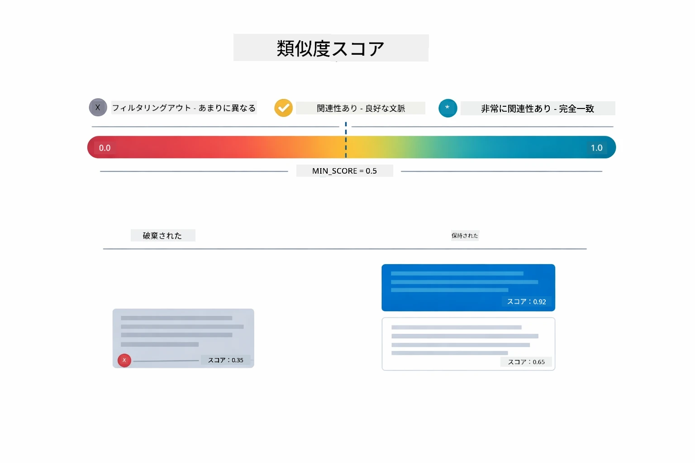

*この図は0から1のスコア範囲と、0.5の最小閾値で無関係なチャンクが除外されることを示しています。*

スコアの範囲は以下の通りです：
- 0.7〜1.0：非常に関連性が高く、完全に一致
- 0.5〜0.7：関連性があり良好な文脈
- 0.5未満：除外、類似度が低すぎる

システムは品質を保証するため、最小閾値以上のチャンクのみを取得します。

埋め込みは意味がクラスタリングできるときに効果的ですが、盲点もあります。下図はよくある失敗例を示しています — 大きすぎるチャンクは曖昧なベクトルを生成し、小さすぎるチャンクは文脈が不足し、曖昧な用語は複数のクラスタを指し、IDや部品番号などの完全一致検索は埋め込みでは機能しません：

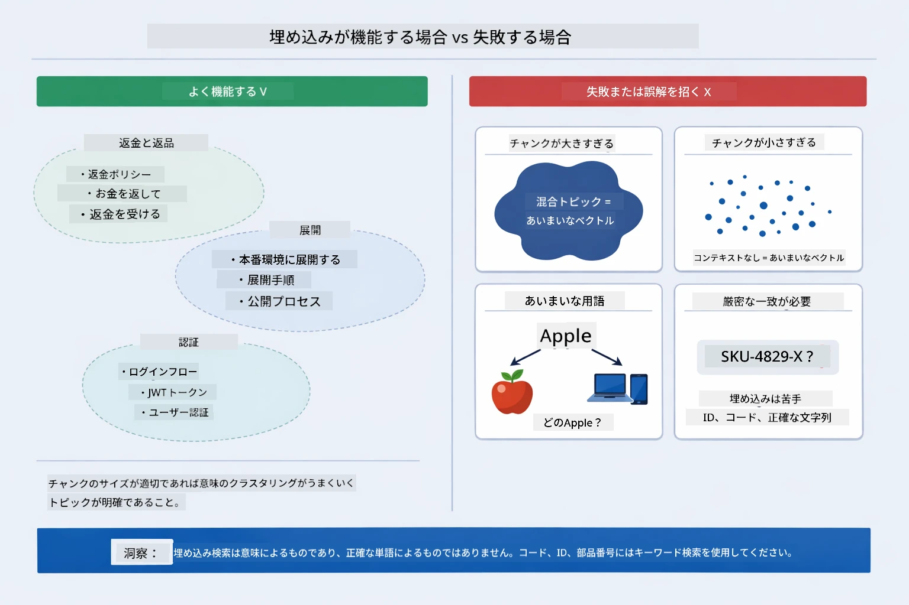

*この図は一般的な埋め込みの失敗モードを示しています：チャンクが大きすぎる、小さすぎる、複数クラスタを指す曖昧な用語、IDのような完全一致検索。*

### メモリ内ストレージ

このモジュールは簡潔さのためにメモリ内ストレージを使用しています。アプリケーションを再起動するとアップロードしたドキュメントは失われます。実際のシステムではQdrantやAzure AI Searchなどの永続的なベクターデータベースを使用します。

### コンテキストウィンドウ管理

各モデルには最大のコンテキストウィンドウがあり、巨大なドキュメントのすべてのチャンクを含めることはできません。システムは関連度の高い上位Nチャンク（デフォルトは5）を取得し、制限内で十分な文脈を提供したうえで正確な回答を可能にします。

## RAGが重要となる場合

RAGはいつも最適なアプローチではありません。下図の意思決定ガイドは、RAGが価値を提供する場合と、直接プロンプトに内容を含めるかモデルの内蔵知識に頼る方が十分な場合の判断に役立ちます：

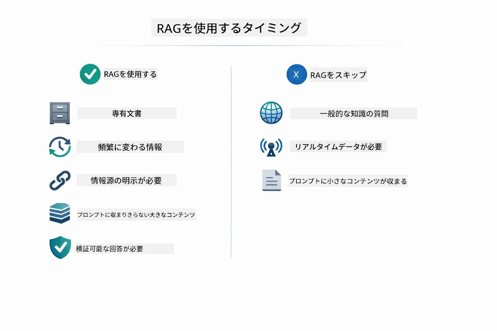

*この図はRAGの価値がある場合と、より単純なアプローチが十分な場合の判断ガイドを示しています。*

## 次のステップ

**次のモジュール：** [04-tools - ツールを使ったAIエージェント](../04-tools/README.md)

---

**ナビゲーション：** [← 前：モジュール02 - プロンプトエンジニアリング](../02-prompt-engineering/README.md) | [メインへ戻る](../README.md) | [次：モジュール04 - ツール →](../04-tools/README.md)

---

<!-- CO-OP TRANSLATOR DISCLAIMER START -->
**免責事項**：
本ドキュメントはAI翻訳サービス「Co-op Translator」（https://github.com/Azure/co-op-translator）を使用して翻訳されました。正確性を期していますが、自動翻訳には誤りや不正確な部分が含まれる場合があります。原文が権威ある情報源とみなされるべきです。重要な情報については、専門の人間による翻訳を推奨します。本翻訳の使用により生じた誤解や解釈の違いについて、一切の責任を負いかねます。
<!-- CO-OP TRANSLATOR DISCLAIMER END -->