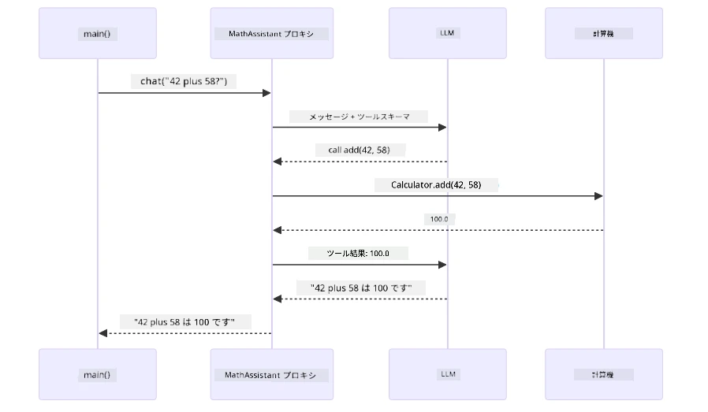
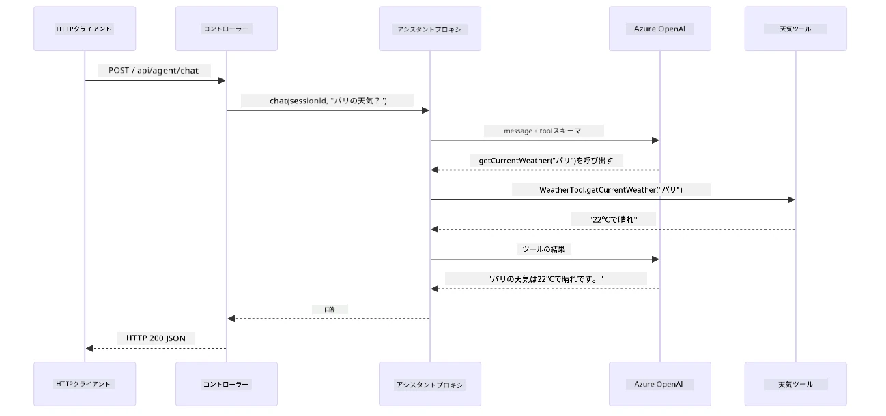

# モジュール 04: ツールを使った AI エージェント

## 目次

- [ビデオウォークスルー](../../../04-tools)
- [学習内容](../../../04-tools)
- [前提条件](../../../04-tools)
- [ツールを使った AI エージェントの理解](../../../04-tools)
- [ツール呼び出しの仕組み](../../../04-tools)
  - [ツール定義](../../../04-tools)
  - [意思決定](../../../04-tools)
  - [実行](../../../04-tools)
  - [応答生成](../../../04-tools)
  - [アーキテクチャ: Spring Boot の自動配線](../../../04-tools)
- [ツールチェイニング](../../../04-tools)
- [アプリケーションの実行](../../../04-tools)
- [アプリケーションの使用方法](../../../04-tools)
  - [簡単なツールの使用を試す](../../../04-tools)
  - [ツールチェイニングをテストする](../../../04-tools)
  - [会話の流れを見る](../../../04-tools)
  - [様々なリクエストを試す](../../../04-tools)
- [重要な概念](../../../04-tools)
  - [ReAct パターン（推論と行動）](../../../04-tools)
  - [ツールの説明が重要](../../../04-tools)
  - [セッション管理](../../../04-tools)
  - [エラー処理](../../../04-tools)
- [利用可能なツール](../../../04-tools)
- [ツールベースエージェントを使うタイミング](../../../04-tools)
- [ツールと RAG の比較](../../../04-tools)
- [次のステップ](../../../04-tools)

## ビデオウォークスルー

以下のライブセッションで、このモジュールの始め方を説明しています：

<a href="https://www.youtube.com/watch?v=O_J30kZc0rw"></a>

## 学習内容

これまでに、AI との会話方法、効果的なプロンプトの構造化、文書に基づいた回答の作成について学びました。しかし根本的な制約があります。言語モデルはテキストしか生成できません。天気の確認、計算、データベースの照会、外部システムとのやり取りはできません。

ツールがこれを変えます。モデルが呼び出せる機能へのアクセスを持つことで、単なるテキスト生成器から行動可能なエージェントに変わります。モデルはツールが必要な時、どのツールを使うか、どのパラメータを渡すかを決定します。コードがその関数を実行し、結果を返します。モデルはその結果を応答に取り込みます。

## 前提条件

- [モジュール 01 - はじめに](../01-introduction/README.md) 完了（Azure OpenAI リソースを展開済み）
- 推奨される前モジュールの完了（本モジュールのツール vs RAG 比較で [モジュール 03 の RAG コンセプト](../03-rag/README.md) を参照）
- ルートディレクトリに Azure 資格情報を含む `.env` ファイルが存在（モジュール 01 の `azd up` で作成）

> **注意:** モジュール 01 をまだ完了していない場合は、まずそこで展開手順に従ってください。

## ツールを使った AI エージェントの理解

> **📝 注意:** 本モジュールの「エージェント」という用語はツール呼び出し機能を強化された AI アシスタントを指します。これは [モジュール 05: MCP](../05-mcp/README.md) で扱う計画、記憶、多段階推論を持つ自律エージェントの **Agentic AI** パターンとは異なります。

ツールがなければ言語モデルは訓練データからのテキストしか生成できません。現在の天気を尋ねても推測するしかありません。ツールがあれば天気APIを呼び出したり、計算を行ったり、データベースを照会し、その実際の結果を応答に織り交ぜられます。


*ツールなしではモデルは推測のみ、ツールありではAPI呼び出しや計算、リアルタイムデータを返せる。*

ツール付き AI エージェントは **Reasoning and Acting (ReAct)** パターンを採用します。モデルは単に応答するだけでなく、必要なものを考え、ツールを呼び出し、結果を観察して、再度行動するか最終回答を出すかを決めます：

1. **Reason（推論）** — ユーザーの質問を分析し必要な情報を判断
2. **Act（行動）** — 適切なツールを選び、正しいパラメータを生成し呼び出す
3. **Observe（観察）** — ツールの出力を受け取り結果を評価
4. **Repeat or Respond（繰り返すか回答）** — さらにデータが必要なら繰り返し、なければ自然言語の回答を作成


*ReAct サイクル — エージェントは何をするか推論し、ツールを呼び行動し、結果を観察して最終回答まで繰り返す。*

これは自動で行われます。あなたはツールと説明文を定義し、モデルがいつどのように使うかの意思決定を行います。

## ツール呼び出しの仕組み

### ツール定義

[WeatherTool.java](../../../04-tools/src/main/java/com/example/langchain4j/agents/tools/WeatherTool.java) | [TemperatureTool.java](../../../04-tools/src/main/java/com/example/langchain4j/agents/tools/TemperatureTool.java)

明確な説明とパラメータ仕様を持つ関数を定義します。モデルはこれらをシステムプロンプトで読み、各ツールの役割を理解します。

```java
@Component
public class WeatherTool {
    
    @Tool("Get the current weather for a location")
    public String getCurrentWeather(@P("Location name") String location) {
        // あなたの天気検索ロジック
        return "Weather in " + location + ": 22°C, cloudy";
    }
}

@AiService
public interface Assistant {
    String chat(@MemoryId String sessionId, @UserMessage String message);
}

// アシスタントはSpring Bootによって自動的に接続されています:
// - ChatModelビーン
// - @Componentクラスのすべての@Toolメソッド
// - セッション管理のためのChatMemoryProvider
```
  
以下の図は各アノテーションの詳細と、それが AI にツール呼び出しや引数指定を理解させる方法を示しています：


*ツール定義の構造 — @Tool はAIにいつ使うか伝え、@P は各パラメータを説明し、@AiService が起動時に全てを組み合わせる。*

> **🤖 [GitHub Copilot](https://github.com/features/copilot) Chat で試す:** [`WeatherTool.java`](../../../04-tools/src/main/java/com/example/langchain4j/agents/tools/WeatherTool.java) を開き、次のように聞いてみましょう：
> - "How would I integrate a real weather API like OpenWeatherMap instead of mock data?"
> - "What makes a good tool description that helps the AI use it correctly?"
> - "How do I handle API errors and rate limits in tool implementations?"

### 意思決定

ユーザーが「シアトルの天気は？」と聞くと、モデルはランダムにツールを選びません。ユーザー意図を全ツール説明と比較し関連度をスコア化、最適なものを選びます。構造化された関数呼び出しを生成し、例えば `location` を `"Seattle"` に設定します。

該当ツールがなければモデル自体の知識で回答し、複数該当すればもっとも具体的なツールを選びます。


*モデルは全ツールをユーザーの意図と照らして評価し最適なものを選択 — だから明確で具体的なツール説明が重要。*

### 実行

[AgentService.java](../../../04-tools/src/main/java/com/example/langchain4j/agents/service/AgentService.java)

Spring Boot が `@AiService` インターフェイスを全ツールで自動ワイヤリングし、LangChain4j がツール呼び出しを自動実行します。背後ではユーザーの自然言語質問から自然言語回答まで6段階のフローがあります：


*エンドツーエンドの流れ — ユーザー質問→モデルがツール選択→LangChain4jが実行→モデルが結果を応答に組み込む。*

モジュール 00 の [ToolIntegrationDemo](../../../00-quick-start/src/main/java/com/example/langchain4j/quickstart/ToolIntegrationDemo.java) を実行していれば、このパターンは既に体験済みです。計算ツール `Calculator` が同様に呼ばれていました。下図はその際の詳細なシーケンス図です：



*クイックスタートのツール呼び出しループ — `AiServices` がメッセージとスキーマをLLMに送り、LLMが `add(42, 58)` のような関数呼び出しで応答、LangChain4j がローカルで実行し結果を返す。*

> **🤖 [GitHub Copilot](https://github.com/features/copilot) Chat で試す:** [`AgentService.java`](../../../04-tools/src/main/java/com/example/langchain4j/agents/service/AgentService.java) を開き、次の質問をしてみましょう：
> - "ReAct パターンはどう機能し、なぜ AI エージェントに効果的なのか？"
> - "エージェントはどのようにツールを選び、その順序はどう決めているのか？"
> - "ツール実行が失敗した場合はどうなるのか？エラーを堅牢に処理するには？"

### 応答生成

モデルは天気データを受け取り、ユーザー向けに自然言語の応答を作成します。

### アーキテクチャ: Spring Boot の自動配線

本モジュールは LangChain4j の Spring Boot 連携を使用し、宣言的な `@AiService` インターフェイスを利用します。起動時に Spring Boot は `@Tool` メソッドを含む全ての `@Component`、あなたの `ChatModel` ビーン、`ChatMemoryProvider` を検出し、ボイラープレートなしで単一の `Assistant` インターフェイスに全て結合します。


*@AiService インターフェイスは ChatModel、ツールコンポーネント、メモリプロバイダーを結びつけ、Spring Boot が全配線を自動で処理。*

以下はリクエストのライフサイクル全体をシーケンス図にしたものです。HTTP リクエストからコントローラー、サービス、Auto-Wired プロキシを経てツール実行、応答までの流れ：



*Spring Boot のリクエストライフサイクル全体 — HTTPリクエストがコントローラー、サービスを通って Auto-Wired Assistant プロキシへ届き、LLM とツール呼び出しを自動で調整。*

この手法の主な利点：

- **Spring Boot 自動配線** — ChatModel とツールを自動注入
- **@MemoryId パターン** — セッションベースのメモリ管理自動化
- **単一インスタンス** — Assistant を一度作成し再利用で性能向上
- **型安全な実行** — Java メソッドを型変換付きで直接呼び出し
- **マルチターン制御** — ツールチェインを自動管理
- **ボイラープレートゼロ** — 手動で `AiServices.builder()` 呼び出し不要

手動で `AiServices.builder()` を使う代替案はコード量が増え、Spring Boot 連携の利点を享受できません。

## ツールチェイニング

**ツールチェイニング** — ツールベースエージェントの真価は、一つの質問に複数ツールを連鎖的に使うところにあります。「シアトルの天気は華氏で？」と聞くと、まず `getCurrentWeather` ツールで摂氏温度を取得し、その後 `celsiusToFahrenheit` ツールに渡して変換します。これが一つの会話ターン内で自動的に行われます。


*ツールチェイニング実例 — まず getCurrentWeather を呼び、摂氏の結果を celsiusToFahrenheit に渡して複合回答を生成。*

**優雅な失敗** — モックデータにない都市の天気を尋ねると、ツールがエラーメッセージを返し、AI はクラッシュせず助けられない旨を説明します。ツールは安全に失敗します。下図はその対比で、適切なエラー処理がある場合は例外をキャッチし丁寧に回答、処理しなければアプリ全体がクラッシュします：


*ツールが失敗した際、例外をキャッチしてクラッシュせず説明を返すのが望ましい挙動。*

これらは一つの会話ターンで自動実行されます。エージェントが複数のツール呼び出しを自律的に調整します。

## アプリケーションの実行

**展開の確認:**

ルートディレクトリに Azure 資格情報を含む `.env` ファイルがあることを確認します（モジュール 01 で作成済み）。次のコマンドをモジュールディレクトリ（`04-tools/`）で実行します：

**Bash:**
```bash
cat ../.env  # AZURE_OPENAI_ENDPOINT、API_KEY、DEPLOYMENTを表示する必要があります
```
  
**PowerShell:**
```powershell
Get-Content ..\.env  # AZURE_OPENAI_ENDPOINT、API_KEY、DEPLOYMENT を表示する必要があります
```
  
**アプリケーションの起動:**

> **注意:** ルートディレクトリで `./start-all.sh` を使いすでに全アプリを起動済みの場合（モジュール 01 参照）、本モジュールはポート8084で既に稼働中です。以下の起動コマンドはスキップし、直接 http://localhost:8084 にアクセスしてください。

**オプション1: Spring Boot ダッシュボードを使う（VS Codeユーザーに推奨）**

Dev コンテナには Spring Boot ダッシュボード拡張が含まれており、全ての Spring Boot アプリケーションを視覚的に管理できます。VS Code の左側アクティビティバーで Spring Boot アイコンを探してください。

Spring Boot ダッシュボードからは以下が可能です：
- ワークスペース内の全 Spring Boot アプリを一覧表示
- クリック一つでアプリの起動・停止
- リアルタイムでのログの閲覧
- アプリケーションの状態監視
「tools」の横にある再生ボタンをクリックするだけで、このモジュールを開始するか、すべてのモジュールを一度に開始できます。

以下は VS Code の Spring Boot ダッシュボードの画面例です:


*VS Code の Spring Boot ダッシュボード — すべてのモジュールを一か所で起動、停止、監視*

**オプション 2: シェルスクリプトを使う**

すべてのウェブアプリケーション（モジュール 01-04）を起動する:

**Bash:**
```bash
cd ..  # ルートディレクトリから
./start-all.sh
```

**PowerShell:**
```powershell
cd ..  # ルートディレクトリから
.\start-all.ps1
```

または、このモジュールだけを起動する:

**Bash:**
```bash
cd 04-tools
./start.sh
```

**PowerShell:**
```powershell
cd 04-tools
.\start.ps1
```

両方のスクリプトは自動的にルートの `.env` ファイルから環境変数を読み込み、JAR が存在しない場合はビルドします。

> **注意:** すべてのモジュールを手動でビルドしてから起動したい場合:
>
> **Bash:**
> ```bash
> cd ..  # Go to root directory
> mvn clean package -DskipTests
> ```
>
> **PowerShell:**
> ```powershell
> cd ..  # Go to root directory
> mvn clean package -DskipTests
> ```

ブラウザで http://localhost:8084 を開いてください。

**停止方法:**

**Bash:**
```bash
./stop.sh  # このモジュールのみ
# または
cd .. && ./stop-all.sh  # すべてのモジュール
```

**PowerShell:**
```powershell
.\stop.ps1  # このモジュールのみ
# または
cd ..; .\stop-all.ps1  # すべてのモジュール
```

## アプリケーションの使い方

このアプリケーションはウェブインターフェイスを提供し、天気情報や温度変換ツールにアクセス可能な AI エージェントと対話できます。以下がインターフェイスの画面です — クイックスタート用の例とリクエスト送信用のチャットパネルが含まれます:

<a href="images/tools-homepage.png"></a>

*AI エージェントツールのインターフェイス — クイック例とツール操作用チャットインターフェイス*

### 簡単なツール使用を試す

まずは単純なリクエストから試してください: 「100度の華氏を摂氏に変換して」。エージェントは温度変換ツールを使う必要があると認識し、適切なパラメータで呼び出して結果を返します。どのツールを使うかや呼び出し方を書かなくても自然に動作する点に注目してください。

### ツールの連鎖をテスト

次に少し複雑な例を試します: 「シアトルの天気を教えて、それを華氏に変換して」。エージェントは段階を追って処理します。まず天気情報を取得（摂氏で返る）、次に華氏に変換する必要があると認識し、変換ツールを呼び出し、両方の結果を一つの回答にまとめます。

### 会話の流れを見る

チャットインターフェイスは会話の履歴を保持し、複数ターンの対話が可能です。過去の問い合わせや回答をすべて確認できるので、会話の文脈がどのように構築されているか追いやすくなっています。

<a href="images/tools-conversation-demo.png"></a>

*複数ターン対話の例 — 単純な変換、天気情報取得、ツール連携の様子*

### いろいろなリクエストを試す

さまざまな組み合わせをお試しください:
- 天気情報確認: 「東京の天気は？」
- 温度変換: 「25℃はケルビンでいくつ？」
- 複合問い合わせ: 「パリの天気を調べて20℃以上か教えて」

エージェントが自然言語を理解し、適切なツール呼び出しにマッピングする様子がわかります。

## 重要な概念

### ReAct パターン（推論と行動）

エージェントは推論（何をすべきか考える）と行動（ツールを使う）を交互に行います。このパターンにより、単なる指示への反応ではなく、自律的な問題解決が可能になります。

### ツールの説明が重要

ツールの説明内容がエージェントの使い方に直接影響します。明確かつ具体的な説明が、いつどのようにツールを呼び出すべきかモデルが理解するのに役立ちます。

### セッション管理

`@MemoryId` アノテーションによって、自動のセッションベースのメモリ管理が可能になります。各セッション ID ごとに `ChatMemory` インスタンスが `ChatMemoryProvider` ビーンによって管理され、複数ユーザーが同時にエージェントと対話しても会話が混ざりません。以下の図は複数ユーザーをセッション ID に基づいた独立メモリーストアにルーティングする仕組みを示しています:


*各セッション ID は独立した会話履歴に対応 — ユーザー同士のメッセージは見えない*

### エラー処理

ツールは失敗することがあります — API のタイムアウト、無効なパラメータ、外部サービスの停止など。実用的なエージェントはエラー処理が必要で、モデルは問題を説明したり代替手段を試すことができ、アプリケーション全体がクラッシュしないようにします。ツールが例外をスローすると LangChain4j がキャッチし、エラーメッセージをモデルに渡し、モデルは自然言語で問題を説明します。

## 利用可能なツール

以下の図は構築可能なツールの広範なエコシステムを示しています。このモジュールでは天気と温度のツールを例示していますが、同じ `@Tool` パターンはあらゆる Java メソッドに適用可能です — データベース問い合わせから支払い処理まで対応します。


*@Tool アノテーションを付けた任意の Java メソッドが AI に利用可能に — パターンはデータベース、API、メール、ファイル操作など拡張可能です。*

## ツールベースのエージェントを使うタイミング

すべてのリクエストにツールが必要なわけではありません。判断基準は AI が外部システムとやりとりする必要があるか、自身の知識だけで回答可能かです。以下のガイドはツールが有用な場合と不要な場合をまとめています:


*簡単な判断ガイド — ツールはリアルタイムデータ、計算、操作を扱う時に使う。一般知識や創造的な作業では不要。*

## ツールと RAG の違い

モジュール 03 と 04 はどちらも AI の機能を拡張しますが、基本的に異なる方法です。RAG はドキュメント検索によってモデルに**知識**へのアクセスを提供します。ツールは関数呼び出しによりモデルが**行動**できるようにします。以下の図はそれぞれのワークフローやトレードオフを並べて比較しています:


*RAG は静的ドキュメントから情報を取得 — ツールは動的かつリアルタイムのデータを操作および取得。多くの本番システムは両者を組み合わせている。*

実際、多くの本番環境では両者を組み合わせます: RAG でドキュメントに基づく回答を生成し、ツールでライブデータ取得や操作を行う形です。

## 次のステップ

**次のモジュール:** [05-mcp - Model Context Protocol (MCP)](../05-mcp/README.md)

---

**ナビゲーション:** [← 前へ: モジュール 03 - RAG](../03-rag/README.md) | [メインへ戻る](../README.md) | [次へ: モジュール 05 - MCP →](../05-mcp/README.md)

---

<!-- CO-OP TRANSLATOR DISCLAIMER START -->
**免責事項**：  
本書類はAI翻訳サービス「Co-op Translator」（https://github.com/Azure/co-op-translator）を使用して翻訳されています。正確性を期しておりますが、自動翻訳には誤りや不正確な部分が含まれる可能性があることをご承知おきください。原文の言語で記載された文書が正式な情報源とみなされます。重要な情報については、専門の人間による翻訳を推奨いたします。本翻訳の使用により生じた誤解や誤訳について、一切の責任を負いかねます。
<!-- CO-OP TRANSLATOR DISCLAIMER END -->