# モジュール 04: ツールを使ったAIエージェント

## 目次

- [学ぶこと](../../../04-tools)
- [前提条件](../../../04-tools)
- [ツール付きAIエージェントの理解](../../../04-tools)
- [ツール呼び出しの仕組み](../../../04-tools)
  - [ツール定義](../../../04-tools)
  - [意思決定](../../../04-tools)
  - [実行](../../../04-tools)
  - [応答生成](../../../04-tools)
  - [アーキテクチャ: Spring Bootのオートワイヤリング](../../../04-tools)
- [ツールチェイニング](../../../04-tools)
- [アプリケーションの起動](../../../04-tools)
- [アプリケーションの使い方](../../../04-tools)
  - [シンプルなツール使用を試す](../../../04-tools)
  - [ツールチェイニングのテスト](../../../04-tools)
  - [会話の流れを見る](../../../04-tools)
  - [異なるリクエストで試す](../../../04-tools)
- [キーポイント](../../../04-tools)
  - [ReActパターン（Reasoning and Acting）](../../../04-tools)
  - [ツール記述の重要性](../../../04-tools)
  - [セッション管理](../../../04-tools)
  - [エラーハンドリング](../../../04-tools)
- [利用可能なツール](../../../04-tools)
- [ツールベースのエージェントを使うべき時](../../../04-tools)
- [ツール vs RAG](../../../04-tools)
- [次のステップ](../../../04-tools)

## 学ぶこと

これまでに、AIとの会話方法、効果的なプロンプトの構成、応答をドキュメントに基づかせる方法を学びました。しかし、根本的な制限があります：言語モデルはテキストしか生成できません。天気を調べたり、計算を実行したり、データベースを問い合わせたり、外部システムと連携することはできません。

ツールがこれを変えます。モデルに呼び出せる関数へのアクセス権を与えることで、単なるテキスト生成器から行動できるエージェントに変わります。モデルはいつツールが必要か、どのツールを使うか、どんなパラメータを渡すかを決定します。あなたのコードが関数を実行して結果を返します。モデルはその結果を応答に組み込みます。

## 前提条件

- モジュール 01を完了している（Azure OpenAI リソースが展開済み）
- ルートディレクトリにAzure認証情報を含む `.env` ファイルが存在する（モジュール 01で `azd up` により作成）

> **注意:** モジュール 01をまだ完了していない場合は、先にそちらの展開手順を行ってください。

## ツール付きAIエージェントの理解

> **📝 注記:** 本モジュールでの「エージェント」はツール呼び出し機能を強化したAIアシスタントを指します。これは、[モジュール 05: MCP](../05-mcp/README.md)で扱う、自律的プランニングや記憶、多段推論を含む**Agentic AI**パターンとは異なります。

ツールがない場合、言語モデルはトレーニングデータからテキストを生成するだけです。現在の天気を尋ねても推測に過ぎません。ツールを与えると、天気APIに問い合わせたり、計算をしたり、データベース検索を行い、その実際の結果を応答に織り込めます。

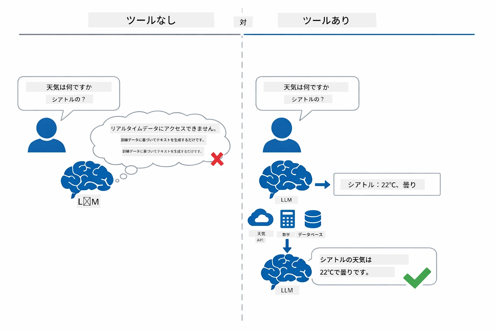

*ツールなしではモデルは推測のみですが、ツールがあればAPI呼び出しや計算を行いリアルタイムデータを返せます。*

ツール付きAIエージェントは**Reasoning and Acting (ReAct)** パターンに従います。モデルは単に応答するだけでなく、必要な情報を考え、ツールを呼び出し、その結果を観察し、さらに動くか答えを返すかを判断します：

1. **推論** — エージェントはユーザーの質問を分析し、必要な情報を特定する
2. **行動** — 適切なツールを選び、正しいパラメータを生成して呼び出す
3. **観察** — ツールの出力を受け取り結果を評価する
4. **繰り返し or 応答** — 追加データが必要ならループし、そうでなければ自然言語で答える

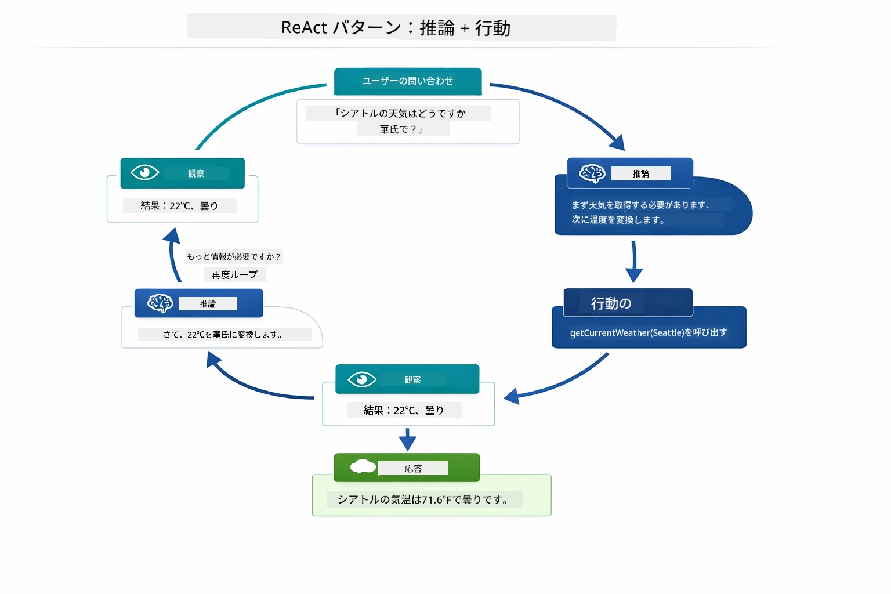

*ReActサイクル — 考慮し、ツールを使い、結果を見て繰り返し、最終回答を導く。*

この処理は自動です。あなたがツールと説明を定義し、モデルがいつどう使うかを判断します。

## ツール呼び出しの仕組み

### ツール定義

[WeatherTool.java](../../../04-tools/src/main/java/com/example/langchain4j/agents/tools/WeatherTool.java) | [TemperatureTool.java](../../../04-tools/src/main/java/com/example/langchain4j/agents/tools/TemperatureTool.java)

関数は明確な説明とパラメータ仕様で定義します。モデルはこれらの説明をシステムプロンプト内で見て、それぞれのツールの用途を理解します。

```java
@Component
public class WeatherTool {
    
    @Tool("Get the current weather for a location")
    public String getCurrentWeather(@P("Location name") String location) {
        // あなたの天気検索ロジック
        return "Weather in " + location + ": 22°C, cloudy";
    }
}

@AiService
public interface Assistant {
    String chat(@MemoryId String sessionId, @UserMessage String message);
}

// アシスタントはSpring Bootによって自動的に接続されています：
// - ChatModel ビーン
// - @Componentクラスのすべての@Toolメソッド
// - セッション管理のためのChatMemoryProvider
```

以下の図は各アノテーションを解説し、モデルがいつツールを呼び、どんな引数を渡すか理解する助けとなる箇所を示しています：

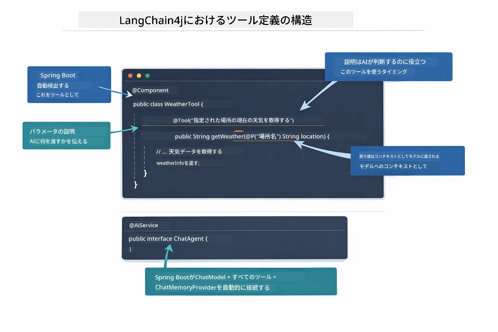

*ツール定義の構造 — @Tool がAIに使用タイミングを指示し、@P が各パラメータを説明、@AiService が起動時に全てを結びつける。*

> **🤖 [GitHub Copilot](https://github.com/features/copilot) チャットで試す:** [`WeatherTool.java`](../../../04-tools/src/main/java/com/example/langchain4j/agents/tools/WeatherTool.java)を開き、質問してみてください：
> - "モックデータの代わりにOpenWeatherMapのような実際の天気APIを統合するには？"
> - "AIが正しく使うために良いツール説明とは何か？"
> - "APIエラーやレート制限に対応する実装はどうする？"

### 意思決定

ユーザーが「シアトルの天気は？」と尋ねたとき、モデルは無作為にツールを選びません。ユーザー意図と全ツール説明を比較し、関連度を評価して最適なツールを選択します。そして構造化された関数呼び出しを生成し、この場合は `location` に `"Seattle"` をセットします。

ツールが一致しなければモデルは自身の知識から回答します。複数マッチがあれば最も具体的なツールを選びます。

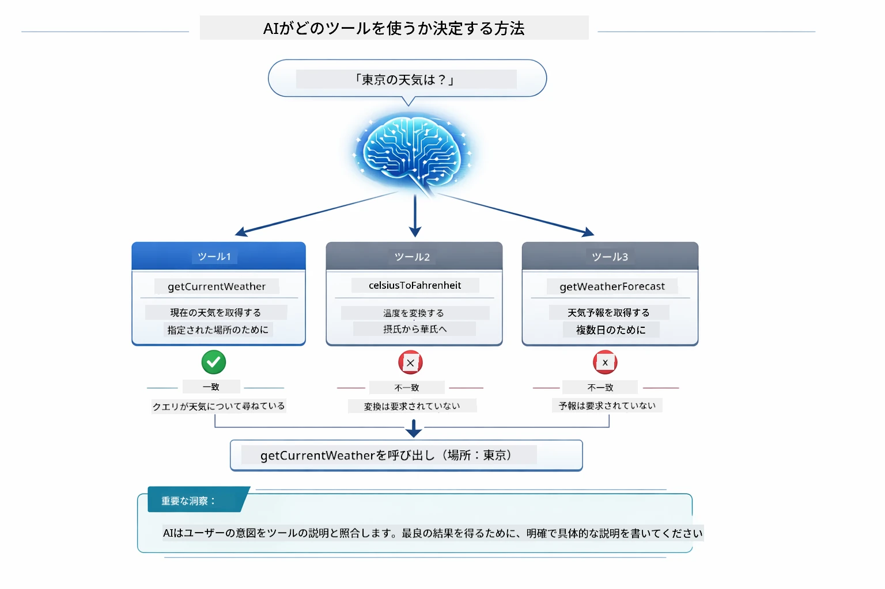

*モデルはすべての利用可能ツールをユーザー意図と比較し最適を選択するため、明確で具体的なツール説明が重要です。*

### 実行

[AgentService.java](../../../04-tools/src/main/java/com/example/langchain4j/agents/service/AgentService.java)

Spring Bootは宣言的な `@AiService` インターフェースを登録済みツールすべてとオートワイヤリングし、LangChain4jがツール呼び出しを自動実行します。裏側では、ユーザーの自然言語質問から自然言語回答まで、ツール呼び出しは6段階を通って流れます：

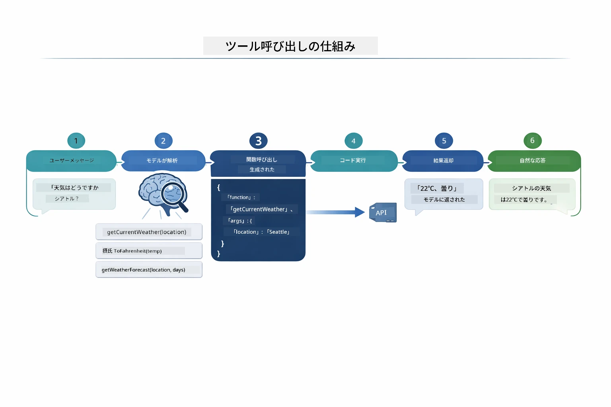

*エンドツーエンドのフロー — ユーザーが質問し、モデルがツールを選び、LangChain4jが実行し、結果を織り込んで自然な応答を生成する。*

> **🤖 [GitHub Copilot](https://github.com/features/copilot) チャットで試す:** [`AgentService.java`](../../../04-tools/src/main/java/com/example/langchain4j/agents/service/AgentService.java)を開き、質問してみてください：
> - "ReActパターンはどう機能し、なぜAIエージェントに効果的？"
> - "エージェントはどのツールをいつ使うかどう決めている？"
> - "ツール実行が失敗したら？エラー処理の堅牢な方法は？"

### 応答生成

モデルは天気データを受け取り、それをユーザー向けの自然言語応答に整形します。

### アーキテクチャ: Spring Bootのオートワイヤリング

このモジュールはLangChain4jのSpring Boot統合を使い、宣言的な `@AiService` インターフェースを利用します。起動時にSpring Bootはすべての `@Tool` メソッドを含む `@Component` 、`ChatModel` ビーン、`ChatMemoryProvider` を検出し、ボイラープレートなしにすべてを1つの `Assistant` インターフェースに結びつけます。

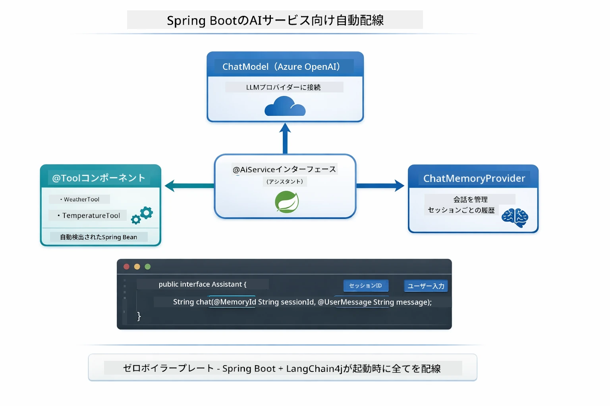

*@AiService インターフェースが ChatModel、ツールコンポーネント、メモリプロバイダを結びつけ、Spring Bootが全てのワイヤリングを自動処理。*

この方法の主な利点：

- **Spring Bootのオートワイヤリング** — ChatModelやツールを自動注入
- **@MemoryIdパターン** — セッション単位のメモリ管理を自動化
- **シングルインスタンス** — Assistantは1度作成、パフォーマンス向上のため再利用
- **型安全な実行** — Javaメソッドを直接呼び出し、型変換も実施
- **マルチターンの調整** — ツールチェイニングを自動管理
- **ボイラープレートゼロ** — 手動の `AiServices.builder()` 呼び出しやメモリHashMapは不要

手動の `AiServices.builder()` アプローチではコード量が増え、Spring Boot統合による恩恵を受けられません。

## ツールチェイニング

**ツールチェイニング** — 単一の質問が複数ツールを必要とする場合、ツール基盤エージェントの真価が発揮されます。「シアトルの天気を華氏で教えて」と訊ねると、エージェントは自動的に2つのツールを連鎖させます：まず `getCurrentWeather` を呼び摂氏温度を得て、それを `celsiusToFahrenheit` に渡して変換し、一つの会話ターンで答えを返します。

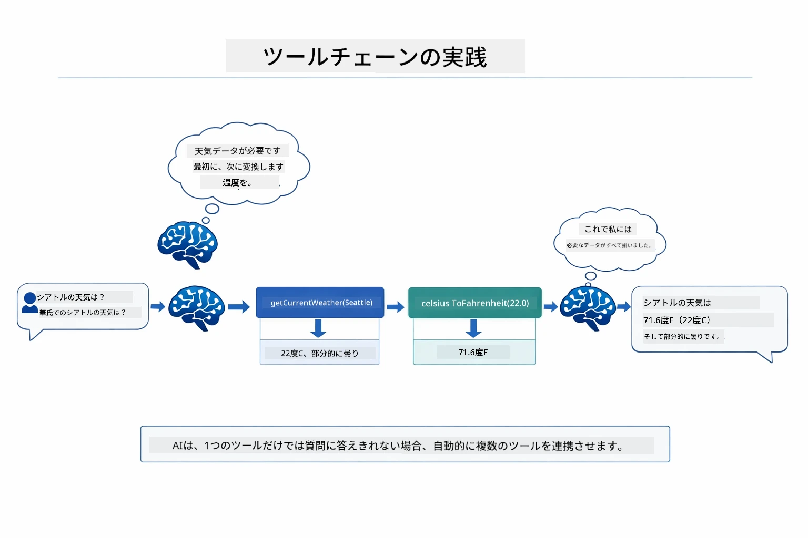

*ツールチェイニングの例 — エージェントが最初に getCurrentWeather を呼び、摂氏結果を celsiusToFahrenheit に渡して結合した回答を返す。*

実際のアプリケーションでは次のように動作し、一つの会話ターンで2つのツール呼び出しを連鎖させています：

<a href="images/tool-chaining.png"></a>

*実アプリケーション出力 — エージェントは getCurrentWeather → celsiusToFahrenheit を1ターンで自動連鎖。*

**安全な失敗処理** — モックデータにない都市の天気を尋ねると、ツールはエラーメッセージを返し、AIはクラッシュせずサポートできない旨を説明します。ツールは安全に失敗します。

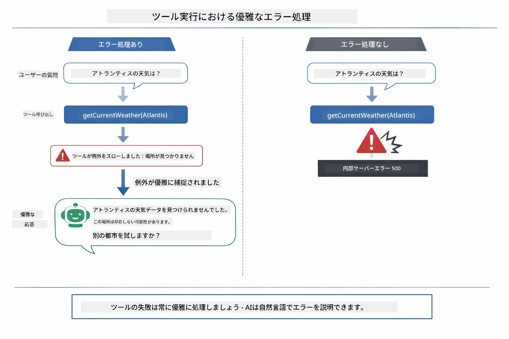

*ツールが失敗した場合、エージェントはエラーをキャッチしクラッシュせず有益な説明で応答。*

これらは単一の会話ターンで行われ、エージェントが複数のツール呼び出しを自主的に調整します。

## アプリケーションの起動

**展開確認:**

ルートディレクトリにAzure認証情報を含む `.env` ファイルが存在することを確認（モジュール 01で作成）：
```bash
cat ../.env  # AZURE_OPENAI_ENDPOINT、API_KEY、DEPLOYMENT を表示する必要があります
```

**アプリケーションの起動:**

> **注意:** モジュール 01から `./start-all.sh` で全アプリを既に起動済みなら、このモジュールはポート8084で稼働中です。下記起動コマンドは不要で http://localhost:8084 に直接アクセスできます。

**オプション1: Spring Bootダッシュボードを使う（VS Codeユーザー推奨）**

開発コンテナにはSpring Bootダッシュボード拡張機能が含まれ、すべてのSpring Bootアプリを視覚的に管理できます。VS Codeの左側アクティビティバーにあるSpring Bootアイコンから開きます。

ダッシュボードで以下が可能：
- ワークスペース内の全Spring Bootアプリ一覧を閲覧
- ワンクリックで起動・停止
- アプリのログをリアルタイム表示
- アプリ状況の監視

「tools」の横の再生ボタンをクリックしてこのモジュールを起動、または全モジュール同時起動も可能です。


**オプション2: シェルスクリプトを使う**

全ウェブアプリ起動（モジュール 01〜04）：

**Bash:**
```bash
cd ..  # ルートディレクトリから
./start-all.sh
```

**PowerShell:**
```powershell
cd ..  # ルートディレクトリから
.\start-all.ps1
```

またはこのモジュールのみ起動：

**Bash:**
```bash
cd 04-tools
./start.sh
```

**PowerShell:**
```powershell
cd 04-tools
.\start.ps1
```

両スクリプトとも、ルート `.env` ファイルから環境変数を自動読み込みし、JARがなければビルドします。

> **注意:** 起動前にすべてのモジュールを手動ビルドしたい場合：
>
> **Bash:**
> ```bash
> cd ..  # Go to root directory
> mvn clean package -DskipTests
> ```

> **PowerShell:**
> ```powershell
> cd ..  # Go to root directory
> mvn clean package -DskipTests
> ```

ブラウザで http://localhost:8084 を開いてください。

**停止方法:**

**Bash:**
```bash
./stop.sh  # このモジュールのみ
# または
cd .. && ./stop-all.sh  # すべてのモジュール
```

**PowerShell:**
```powershell
.\stop.ps1  # このモジュールのみ
# または
cd ..; .\stop-all.ps1  # すべてのモジュール
```

## アプリケーションの使い方

このアプリケーションはウェブインターフェースを提供し、天気と温度変換ツールが使えるAIエージェントと対話できます。

<a href="images/tools-homepage.png"></a>

*AIエージェントツールのインターフェース ― ツール利用の簡単な例とチャットインターフェース*

### シンプルなツール使用を試す
最初は単純なリクエストから始めましょう: 「華氏100度を摂氏に変換してください」。エージェントは温度変換ツールが必要だと認識し、適切なパラメータで呼び出し、結果を返します。どのツールを使うかや呼び出し方を指定していないのに、非常に自然に感じられるでしょう。

### ツールチェーンのテスト

次にもう少し複雑な例を試してください: 「シアトルの天気を教えて、それを華氏に変換してください。」エージェントがこの手順をどのように進めるか見てみましょう。まず天気情報を取得し（摂氏で返される）、華氏に変換する必要があると認識し、変換ツールを呼び出し、両方の結果を一つの応答にまとめます。

### 会話の流れを見る

チャットインターフェースは会話履歴を保持し、複数回のやり取りが可能です。これまでの問い合わせと応答をすべて確認できるので、会話の流れを追いやすく、エージェントがどのように文脈を積み重ねているか理解できます。

<a href="images/tools-conversation-demo.png"></a>

*単純な変換、天気取得、ツールチェーンを示すマルチターン会話*

### さまざまなリクエストを試す

以下のような組み合わせを試してください：
- 天気取得：「東京の天気は？」
- 温度変換：「25°Cはケルビンで何度？」
- 複合クエリ：「パリの天気を調べて、20°C以上か教えて」

エージェントが自然言語をどのように解釈し、適切なツール呼び出しにマッピングするかに注目してください。

## 重要な概念

### ReActパターン（推論と実行）

エージェントは推論（何をすべきか判断）と実行（ツールを使う）を交互に行います。このパターンにより、単なる指示への応答ではなく自律的な問題解決が可能になります。

### ツール説明の重要性

ツールの説明の質が、エージェントがそれらをどれだけうまく使えるかに直結します。明確で具体的な説明は、モデルがいつどのようにツールを呼び出すべきかを理解するのに役立ちます。

### セッション管理

`@MemoryId`アノテーションは自動的なセッションベースのメモリ管理を可能にします。各セッションIDに対して`ChatMemory`インスタンスが`ChatMemoryProvider`ビーントで管理されるため、複数ユーザーが同時にエージェントと対話しても会話が混ざることはありません。

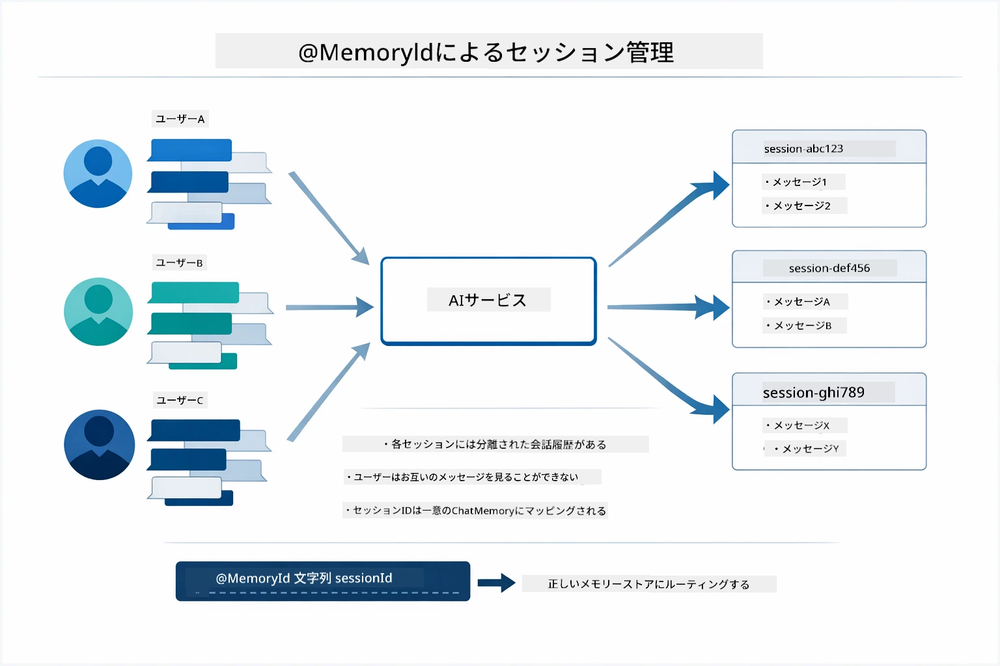

*各セッションIDは独立した会話履歴にマッピングされ、ユーザーは他の人のメッセージを見ることはありません。*

### エラーハンドリング

ツールは失敗することがあります — APIがタイムアウトしたり、パラメータが無効だったり、外部サービスが停止したりします。本番のエージェントはエラーハンドリングを備えており、モデルは問題を説明したり代替案を試みたりできます。ツールが例外を投げると、LangChain4jはそれをキャッチしてエラーメッセージをモデルに返し、自然言語で問題を説明することが可能です。

## 利用可能なツール

下の図は構築可能な広範なツールのエコシステムを示しています。このモジュールでは天気と温度ツールを示していますが、同じ`@Tool`パターンはデータベースクエリから決済処理まであらゆるJavaメソッドに適用できます。

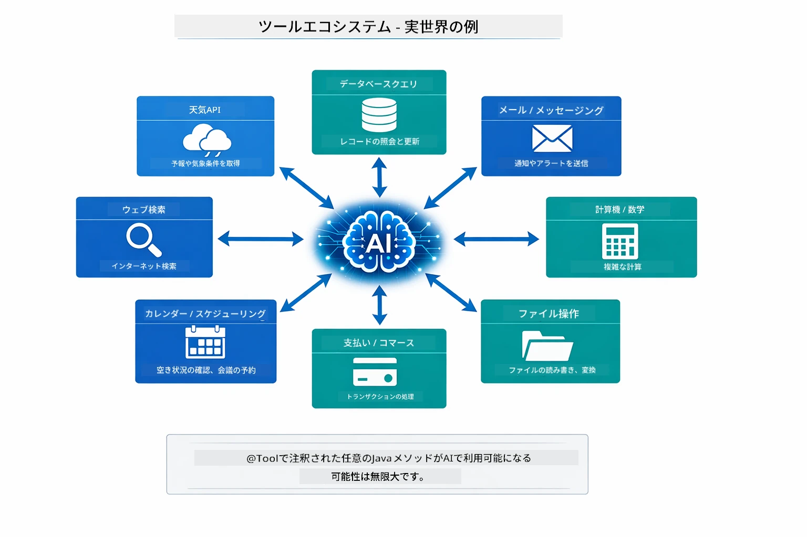

*@Toolで注釈された任意のJavaメソッドがAIに利用可能になり、このパターンはデータベース、API、メール、ファイル操作などに拡張されます。*

## ツールベースのエージェントを使うべきタイミング

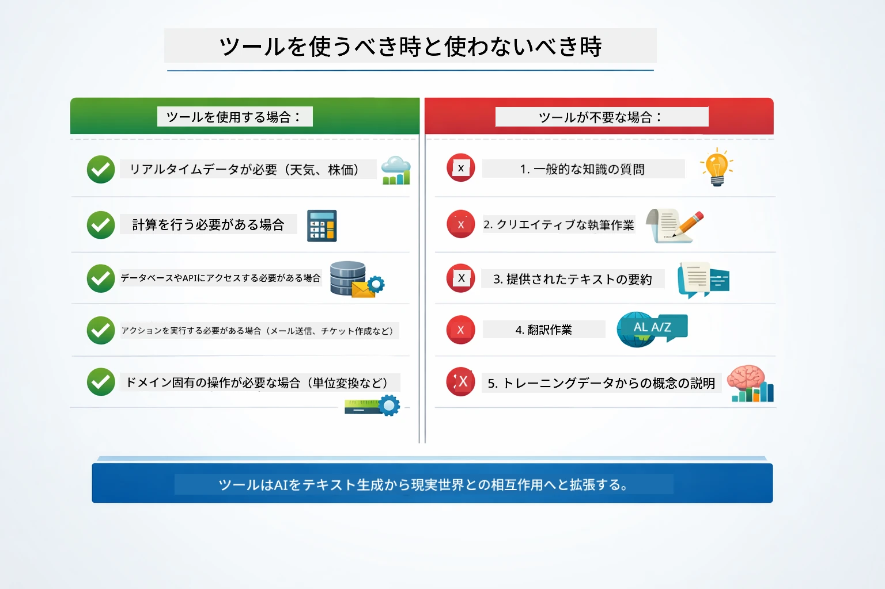

*簡単な判断基準 — ツールはリアルタイムデータ、計算、アクションに適し、一般的知識や創造的なタスクには不要です。*

**ツールを使うべき場合：**
- リアルタイムデータが必要なとき（天気、株価、在庫）
- 単純な数学以上の計算が必要なとき
- データベースやAPIにアクセスするとき
- アクションを実行するとき（メール送信、チケット作成、記録更新）
- 複数のデータソースを組み合わせるとき

**ツールを使わないほうがよい場合：**
- 一般知識で回答できる質問
- 応答が純粋に会話的である場合
- ツールの遅延が体験を遅くしすぎる場合

## ツールとRAGの比較

モジュール03と04はともにAIの能力を拡張しますが、根本的に異なる方法です。RAGはドキュメントを検索してモデルに**知識**へのアクセスを提供します。ツールは関数呼び出しでモデルに**アクション**を実行させる能力を与えます。

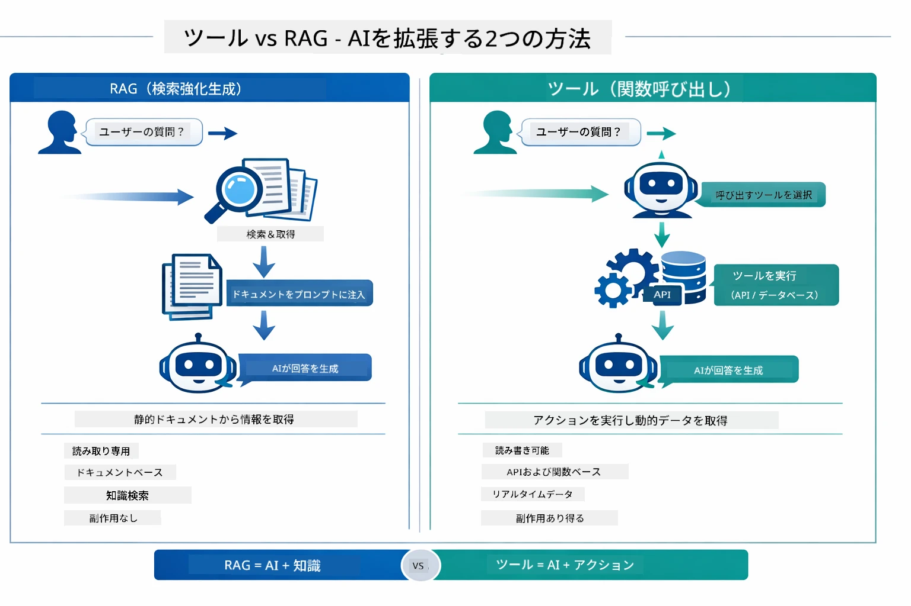

*RAGは静的ドキュメントから情報を取得し、ツールはアクションを実行して動的、リアルタイムなデータを取得します。多くの本番システムは両方を組み合わせています。*

実際には、多くの本番システムは両者を組み合わせて、RAGで回答を自社ドキュメントに基づかせ、ツールでライブデータ取得や操作を行っています。

## 次のステップ

**次のモジュール:** [05-mcp - Model Context Protocol (MCP)](../05-mcp/README.md)

---

**ナビゲーション:** [← 前: モジュール03 - RAG](../03-rag/README.md) | [メインへ戻る](../README.md) | [次: モジュール05 - MCP →](../05-mcp/README.md)

---

<!-- CO-OP TRANSLATOR DISCLAIMER START -->
**免責事項**：  
本書類は、AI翻訳サービス「Co-op Translator」（https://github.com/Azure/co-op-translator）を使用して翻訳されています。正確性の向上に努めておりますが、自動翻訳には誤りや不正確な箇所が含まれる可能性があることをご了承ください。原文（原言語の文書）が正本としての権威ある情報源となります。重要な情報については、専門の人間による翻訳を推奨します。本翻訳の使用により生じたいかなる誤解や誤訳についても、当方は一切の責任を負いかねます。
<!-- CO-OP TRANSLATOR DISCLAIMER END -->