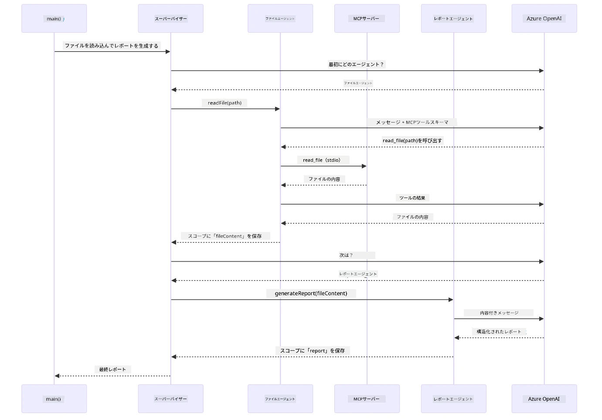

# Module 05: モデルコンテキストプロトコル (MCP)

## 目次

- [ビデオウォークスルー](../../../05-mcp)
- [学べること](../../../05-mcp)
- [MCPとは？](../../../05-mcp)
- [MCPの仕組み](../../../05-mcp)
- [エージェントモジュール](../../../05-mcp)
- [例の実行](../../../05-mcp)
  - [前提条件](../../../05-mcp)
- [クイックスタート](../../../05-mcp)
  - [ファイル操作 (Stdio)](../../../05-mcp)
  - [スーパーバイザーエージェント](../../../05-mcp)
    - [デモの実行](../../../05-mcp)
    - [スーパーバイザーの仕組み](../../../05-mcp)
    - [FileAgentがランタイムでMCPツールを発見する方法](../../../05-mcp)
    - [応答戦略](../../../05-mcp)
    - [出力の理解](../../../05-mcp)
    - [エージェントモジュール機能の説明](../../../05-mcp)
- [主要概念](../../../05-mcp)
- [おめでとうございます！](../../../05-mcp)
  - [次は？](../../../05-mcp)

## ビデオウォークスルー

このモジュールの開始方法を説明するライブセッションをご覧ください：

<a href="https://www.youtube.com/watch?v=O_J30kZc0rw"></a>

## 学べること

これまでに会話型AIを構築し、プロンプトをマスターし、文書に基づいた応答を行い、ツールを組み込んだエージェントを作成しました。しかし、それらのツールはすべて特定のアプリケーション向けにカスタム設計されたものでした。もし、誰でも作成して共有できる標準化されたエコシステムへのアクセスをAIに与えられたらどうでしょう？このモジュールでは、まさにそれをモデル・コンテキスト・プロトコル（MCP）とLangChain4jのエージェントモジュールを使って実現する方法を学びます。まず、シンプルなMCPファイルリーダーを紹介し、その後、Supervisor Agentパターンを用いた高度なエージェントワークフローに簡単に統合する方法を示します。

## MCPとは？

モデルコンテキストプロトコル（MCP）はまさにそれを提供します。AIアプリケーションが外部ツールを発見し利用するための標準的な手段です。各データソースやサービスごとにカスタム統合を書く代わりに、機能を一貫した形式で公開するMCPサーバーに接続します。AIエージェントはそれらのツールを自動的に発見して利用できます。

以下の図は違いを示しています — MCPなしでは各統合がカスタムのポイントツーポイント接続を必要としますが、MCPでは単一のプロトコルでアプリとあらゆるツールが接続されます：


*MCP以前：複雑なポイントツーポイント統合。MCP以降：一つのプロトコルで無限の可能性。*

MCPはAI開発の根本的な問題を解決します：すべての統合がカスタムであること。GitHubにアクセスしたい？カスタムコード。ファイルを読みたい？カスタムコード。データベースに問い合わせたい？カスタムコード。そしてこれらの統合は他のAIアプリケーションと互換性がありません。

MCPはこれを標準化します。MCPサーバーは明確な説明とスキーマを備えたツールを公開し、MCPクライアントは接続して利用可能なツールを発見し利用できます。一度作ればどこでも使えます。

以下の図はこのアーキテクチャを示しています — 単一のMCPクライアント（あなたのAIアプリ）が複数のMCPサーバーに接続し、それぞれが標準プロトコルで自身のツールセットを提供します：


*モデルコンテキストプロトコルのアーキテクチャ - 標準化されたツール発見と実行*

## MCPの仕組み

MCPは内部的に階層化されたアーキテクチャを使用します。Javaアプリケーション（MCPクライアント）が利用可能なツールを発見し、JSON-RPCリクエストをトランスポート層（StdioまたはHTTP）を介して送信し、MCPサーバーが操作を実行して結果を返します。以下の図はこのプロトコルの各層を示しています：


*MCPの内部動作 — クライアントはツールを発見し、JSON-RPCメッセージを交換し、トランスポート層を通じて操作を実行します。*

**サーバークライアントアーキテクチャ**

MCPはクライアント-サーバーモデルを採用します。サーバーはファイル読み取り、データベース問い合わせ、API呼び出しなどのツールを提供し、クライアント（あなたのAIアプリケーション）はそれに接続して利用します。

LangChain4jでMCPを使うには、次のMaven依存関係を追加します：

```xml
<dependency>
    <groupId>dev.langchain4j</groupId>
    <artifactId>langchain4j-mcp</artifactId>
    <version>${langchain4j.version}</version>
</dependency>
```

**ツールの発見**

クライアントがMCPサーバーに接続すると、「どんなツールを持っていますか？」と問い合わせます。サーバーは説明とパラメータスキーマを含む利用可能なツールのリストを返します。AIエージェントはユーザーの要求に応じてどのツールを使うか決めます。以下の図はこのやり取りを示しています — クライアントが`tools/list`要求を送り、サーバーが説明とパラメータスキーマを伴ってツールを返します：


*AIは起動時に利用可能なツールを発見し、どの機能を使うか決めます。*

**トランスポート機構**

MCPは異なるトランスポート機構をサポートします。選択肢はStdio（ローカルサブプロセス間通信）かストリーム可能なHTTP（リモートサーバー用）です。このモジュールではStdioトランスポートを示します：


*MCPのトランスポート機構：リモートサーバーにはHTTP、ローカルプロセスにはStdio*

**Stdio** - [StdioTransportDemo.java](../../../05-mcp/src/main/java/com/example/langchain4j/mcp/StdioTransportDemo.java)

ローカルプロセス用。アプリケーションがサーバーをサブプロセスとして起動し、標準入力/出力を通じて通信します。ファイルシステムアクセスやコマンドラインツールに便利です。

```java
McpTransport stdioTransport = new StdioMcpTransport.Builder()
    .command(List.of(
        npmCmd, "exec",
        "@modelcontextprotocol/server-filesystem@2025.12.18",
        resourcesDir
    ))
    .logEvents(false)
    .build();
```

`@modelcontextprotocol/server-filesystem`サーバーは以下のツールを提供し、すべてユーザーが指定したディレクトリにサンドボックスされています：

| ツール | 説明 |
|------|------|
| `read_file` | 単一ファイルの内容を読み取る |
| `read_multiple_files` | まとめて複数ファイルを読み取る |
| `write_file` | ファイルを新規作成または上書きする |
| `edit_file` | 指定部分の置換編集を行う |
| `list_directory` | 指定パスのファイル・ディレクトリを一覧表示 |
| `search_files` | パターンにマッチするファイルを再帰検索 |
| `get_file_info` | ファイルのメタデータ（サイズ、タイムスタンプ、権限）を取得 |
| `create_directory` | ディレクトリ（親ディレクトリも含む）を作成 |
| `move_file` | ファイルやディレクトリを移動または名前変更 |

以下の図はStdioトランスポートの実行時の動作を示します — JavaアプリはMCPサーバーを子プロセスとして起動し、標準入出力パイプで通信、ネットワークやHTTPは使いません：


*Stdioトランスポートの実際 — アプリがMCPサーバーを子プロセスとして起動し、標準入出力を介して通信。*

> **🤖 [GitHub Copilot](https://github.com/features/copilot) チャットで試す：** [`StdioTransportDemo.java`](../../../05-mcp/src/main/java/com/example/langchain4j/mcp/StdioTransportDemo.java)を開き、次の質問をしてみてください：
> - 「Stdioトランスポートはどのように動作し、HTTPと比べていつ使うべきですか？」
> - 「LangChain4jは起動したMCPサーバープロセスのライフサイクルをどう管理していますか？」
> - 「AIにファイルシステムのアクセス権を与えることのセキュリティ上の意味は？」

## エージェントモジュール

MCPは標準化されたツールを提供しますが、LangChain4jの**エージェントモジュール**はそれらのツールをオーケストレーションするエージェントを宣言的に構築する方法を提供します。`@Agent`アノテーションと`AgenticServices`を使い、命令的コードではなくインターフェイスを通じてエージェントの動作を定義します。

このモジュールでは、**Supervisor Agent**パターンを探ります — ユーザーの要求に基づきサブエージェントを動的に呼び出す高度なエージェントAIアプローチです。MCPツールを用いたファイルアクセス機能を持つサブエージェントを組み合わせます。

エージェントモジュールを使うには、次のMaven依存関係を追加します：

```xml
<dependency>
    <groupId>dev.langchain4j</groupId>
    <artifactId>langchain4j-agentic</artifactId>
    <version>${langchain4j.mcp.version}</version>
</dependency>
```

> **注意：** `langchain4j-agentic`モジュールはコアのLangChain4jライブラリとは別のリリーススケジュールのため、バージョンプロパティ`langchain4j.mcp.version`を使用しています。

> **⚠️ 実験的：** `langchain4j-agentic`モジュールは**実験段階**であり変更される可能性があります。安定版のAIアシスタント構築方法は引き続き`langchain4j-core`とカスタムツール（モジュール04）です。

## 例の実行

### 前提条件

- [モジュール04 - ツール](../04-tools/README.md)を完了（本モジュールはカスタムツールの概念をベースにし、MCPツールと比較して解説）
- ルートディレクトリにAzureの資格情報を設定した `.env` ファイル（モジュール01の`azd up`で作成）
- Java 21以上、Maven 3.9以上
- Node.js 16以上およびnpm（MCPサーバー用）

> **注意：** 環境変数をまだ設定していない場合は、[モジュール01 - はじめに](../01-introduction/README.md)の展開手順を参照してください（`azd up`で`.env`が自動作成されます）。または、`.env.example`をルートにコピーし値を入力してください。

## クイックスタート

**VS Codeを使う場合：** エクスプローラーで任意のデモファイルを右クリックし**「Run Java」**を選択、またはデバッグパネルの起動構成を使います（必ず先に`.env`をAzure資格情報で設定してください）。

**Mavenを使う場合：** 下記の例のようにコマンドラインから実行可能です。

### ファイル操作 (Stdio)

ローカルサブプロセスベースのツールを示します。

**✅ 前提条件不要** - MCPサーバーは自動的に起動されます。

**起動スクリプトの使用（推奨）：**

起動スクリプトはルートの`.env`ファイルから環境変数を自動読み込みします：

**Bash:**
```bash
cd 05-mcp
chmod +x start-stdio.sh
./start-stdio.sh
```

**PowerShell:**
```powershell
cd 05-mcp
.\start-stdio.ps1
```

**VS Codeを使う場合：** `StdioTransportDemo.java`を右クリックして**「Run Java」**を選択（`.env`の設定を確認）。

アプリはファイルシステムMCPサーバーを自動的に起動しローカルファイルを読み取ります。サブプロセス管理が自動化されている点に注目してください。

**期待される出力：**
```
Assistant response: The file provides an overview of LangChain4j, an open-source Java library
for integrating Large Language Models (LLMs) into Java applications...
```

### スーパーバイザーエージェント

**Supervisor Agentパターン**は**柔軟**なエージェントAIの形態です。SupervisorはLLMを使い、ユーザーの要求に応じてどのエージェントを起動するか自律的に決定します。次の例では、MCP経由のファイルアクセス機能とLLMエージェントを組み合わせ、ファイル読み込み→レポート生成のフローを実現します。

デモでは`FileAgent`がMCPのファイルシステムツールを使ってファイルを読み込み、`ReportAgent`がエグゼクティブサマリー（1文）、3つの要点、提言を含む構造化レポートを作成します。Supervisorがこのフローを自動で調整します：


*SupervisorはLLMを使いどのエージェントをどの順番で起動するか決めます — 固定のルーティングコードは不要。*

具体的なワークフローは以下の通りです：


*FileAgentがMCPツールでファイルを読み込み、ReportAgentが生データを構造化レポートに変換。*

次のシーケンス図はSupervisorの全オーケストレーションを追跡します — MCPサーバーの起動からSupervisorによる自律的なエージェント選択、stdio経由のツール呼び出しと最終レポートまで：



*Supervisorは自律的にFileAgentを呼び出し（stdio経由でMCPサーバーと通信してファイルを読み込み）、続いてReportAgentを呼び出し構造化レポートを作成 — 各エージェントは共有のAgentic Scopeに出力を保存。*

各エージェントは**Agentic Scope**（共有メモリ）に結果を保存し、後続エージェントが前の結果にアクセス可能です。これはMCPツールがエージェントワークフローにシームレスに統合できることを示します — Supervisorはファイルの読み方を知る必要はなく、`FileAgent`に任せれば良いのです。

#### デモの実行

起動スクリプトはルートの`.env`から環境変数を自動読み込みします：

**Bash:**
```bash
cd 05-mcp
chmod +x start-supervisor.sh
./start-supervisor.sh
```

**PowerShell:**
```powershell
cd 05-mcp
.\start-supervisor.ps1
```

**VS Codeを使う場合：** `SupervisorAgentDemo.java`を右クリックし**「Run Java」**を選択（`.env`設定を確認）。

#### スーパーバイザーの仕組み

エージェント構築の前に、MCPトランスポートをクライアントに接続し、`ToolProvider`としてラップする必要があります。これによりMCPサーバーのツールがエージェントで利用可能になります：

```java
// トランスポートからMCPクライアントを作成する
McpClient mcpClient = new DefaultMcpClient.Builder()
        .transport(stdioTransport)
        .build();

// クライアントをToolProviderとしてラップする — これによりMCPツールがLangChain4jに橋渡しされる
ToolProvider mcpToolProvider = McpToolProvider.builder()
        .mcpClients(List.of(mcpClient))
        .build();
```

これで`mcpToolProvider`をMCPツールが必要なエージェントに注入できます：

```java
// ステップ1: FileAgentはMCPツールを使ってファイルを読み取ります
FileAgent fileAgent = AgenticServices.agentBuilder(FileAgent.class)
        .chatModel(model)
        .toolProvider(mcpToolProvider)  // ファイル操作のためのMCPツールを持っています
        .build();

// ステップ2: ReportAgentは構造化されたレポートを生成します
ReportAgent reportAgent = AgenticServices.agentBuilder(ReportAgent.class)
        .chatModel(model)
        .build();

// Supervisorはファイル→レポートのワークフローを調整します
SupervisorAgent supervisor = AgenticServices.supervisorBuilder()
        .chatModel(model)
        .subAgents(fileAgent, reportAgent)
        .responseStrategy(SupervisorResponseStrategy.LAST)  // 最終レポートを返します
        .build();

// Supervisorはリクエストに基づいてどのエージェントを呼び出すか決定します
String response = supervisor.invoke("Read the file at /path/file.txt and generate a report");
```

#### FileAgentがランタイムでMCPツールを発見する方法

「**FileAgentはnpmのファイルシステムツールをどうやって使うと知るのか？**」と思うかもしれません。答えは、知らないのです — **LLMがツールのスキーマを通じてランタイムで判断します。**
`FileAgent` インターフェイスは単なる **プロンプト定義** です。`read_file`、`list_directory`、その他の MCP ツールのハードコードされた知識はありません。エンドツーエンドで起きることは次の通りです：

1. **サーバー起動：** `StdioMcpTransport` が `@modelcontextprotocol/server-filesystem` npm パッケージを子プロセスとして起動
2. **ツール検出：** `McpClient` が `tools/list` JSON-RPC リクエストをサーバーに送信し、サーバーはツール名、説明、パラメータスキーマ（例：`read_file` — *「ファイルの全部の内容を読み取る」* — `{ path: string }`）で応答
3. **スキーマ注入：** `McpToolProvider` が発見されたスキーマをラップし、LangChain4j が利用可能にする
4. **LLM判断：** `FileAgent.readFile(path)` が呼ばれると、LangChain4j はシステムメッセージ、ユーザーメッセージ、**ツールスキーマ一覧** を LLM に送信。LLM はツール説明を読み、ツール呼び出しを生成（例：`read_file(path="/some/file.txt")`）
5. **実行：** LangChain4j がツール呼び出しを傍受し、MCP クライアント経由で Node.js サブプロセスにルーティングして結果を取得し、LLM に返す

これは上記で説明した [Tool Discovery](../../../05-mcp) メカニズムと同じですが、エージェントワークフローに特化して適用しています。`@SystemMessage` と `@UserMessage` アノテーションが LLM の挙動を導き、注入された `ToolProvider` が **能力** を与え、LLM は実行時に両者を橋渡しします。

> **🤖 [GitHub Copilot](https://github.com/features/copilot) Chat で試す：** [`FileAgent.java`](../../../05-mcp/src/main/java/com/example/langchain4j/mcp/agents/FileAgent.java) を開き、次を質問してください：
> - 「このエージェントはどのようにしてどの MCP ツールを呼ぶか知っているのか？」
> - 「もし Agent ビルダーから ToolProvider を削除したらどうなるか？」
> - 「ツールスキーマはどうやって LLM に渡されるのか？」

#### 応答戦略

`SupervisorAgent` を設定するとき、サブエージェントがタスクを完了した後、ユーザーへの最終回答をどう形成するか指定します。以下の図は利用可能な3つの戦略を示しています — LAST は最終エージェントの出力を直接返し、SUMMARY はすべての出力を LLM で合成し、SCORED は元のリクエストに対してスコアの高い方を選びます：


*Supervisor が最終応答を形成するための三つの戦略 — 最終エージェントの出力、合成された要約、またはベストスコアの選択から選べます。*

利用可能な戦略は次のとおりです：

| 戦略 | 説明 |
|----------|-------------|
| **LAST** | Supervisor は最後に呼ばれたサブエージェントまたはツールの出力を返します。これは最終エージェントが完全な最終回答を生成するよう設計されている場合に有用です（例：「研究パイプラインでのサマリーエージェント」）。 |
| **SUMMARY** | Supervisor が自身の内部 LLM を使い、全やり取りとサブエージェントの出力を要約し、その要約を最終応答として返します。これによりユーザにはまとまった回答が提供されます。 |
| **SCORED** | システムは内部 LLM を用いて LAST の応答と SUMMARY の要約を元のユーザリクエストに対してスコアリングし、高得点の方を返します。 |

完全な実装は [SupervisorAgentDemo.java](../../../05-mcp/src/main/java/com/example/langchain4j/mcp/SupervisorAgentDemo.java) を参照してください。

> **🤖 [GitHub Copilot](https://github.com/features/copilot) Chat で試す：** [`SupervisorAgentDemo.java`](../../../05-mcp/src/main/java/com/example/langchain4j/mcp/SupervisorAgentDemo.java) を開いて次を質問してください：
> - 「Supervisor はどのようにしてどのエージェントを呼び出すか決めているのか？」
> - 「Supervisor と Sequential ワークフローパターンの違いは何か？」
> - 「Supervisor の計画動作をカスタマイズするにはどうすればよいか？」

#### 出力内容の理解

デモを実行すると、Supervisor が複数エージェントをどのように編成するか構造化されたウォークスルーが表示されます。各セクションの意味は以下の通りです：

```
======================================================================
  FILE → REPORT WORKFLOW DEMO
======================================================================

This demo shows a clear 2-step workflow: read a file, then generate a report.
The Supervisor orchestrates the agents automatically based on the request.
```
  
**ヘッダー** はワークフローの概念を紹介します：ファイル読み取りからレポート生成までのフォーカスされたパイプライン。

```
--- WORKFLOW ---------------------------------------------------------
  ┌─────────────┐      ┌──────────────┐
  │  FileAgent  │ ───▶ │ ReportAgent  │
  │ (MCP tools) │      │  (pure LLM)  │
  └─────────────┘      └──────────────┘
   outputKey:           outputKey:
   'fileContent'        'report'

--- AVAILABLE AGENTS -------------------------------------------------
  [FILE]   FileAgent   - Reads files via MCP → stores in 'fileContent'
  [REPORT] ReportAgent - Generates structured report → stores in 'report'
```
  
**ワークフローダイアグラム** はエージェント間のデータフローを示します。各エージェントには役割があります：  
- **FileAgent** は MCP ツールでファイルを読み、未加工の内容を `fileContent` に保存  
- **ReportAgent** はその内容を取り込み、構造化されたレポートを `report` に出力します

```
--- USER REQUEST -----------------------------------------------------
  "Read the file at .../file.txt and generate a report on its contents"
```
  
**ユーザーリクエスト** はタスクを示します。Supervisor はこれを解析し FileAgent → ReportAgent を呼び出すことに決定。

```
--- SUPERVISOR ORCHESTRATION -----------------------------------------
  The Supervisor decides which agents to invoke and passes data between them...

  +-- STEP 1: Supervisor chose -> FileAgent (reading file via MCP)
  |
  |   Input: .../file.txt
  |
  |   Result: LangChain4j is an open-source, provider-agnostic Java framework for building LLM...
  +-- [OK] FileAgent (reading file via MCP) completed

  +-- STEP 2: Supervisor chose -> ReportAgent (generating structured report)
  |
  |   Input: LangChain4j is an open-source, provider-agnostic Java framew...
  |
  |   Result: Executive Summary...
  +-- [OK] ReportAgent (generating structured report) completed
```
  
**Supervisor オーケストレーション** は2ステップの流れを示します：  
1. **FileAgent** が MCP 経由でファイル読取と内容保存  
2. **ReportAgent** が内容を受け取り構造化されたレポートを生成

Supervisor はユーザーリクエストに基づき **自律的に** これらの判断を行いました。

```
--- FINAL RESPONSE ---------------------------------------------------
Executive Summary
...

Key Points
...

Recommendations
...

--- AGENTIC SCOPE (Data Flow) ----------------------------------------
  Each agent stores its output for downstream agents to consume:
  * fileContent: LangChain4j is an open-source, provider-agnostic Java framework...
  * report: Executive Summary...
```
  
#### エージェンティックモジュール機能の説明

例ではエージェンティックモジュールの高度な機能をいくつか示しています。Agentic Scope と Agent Listeners を詳しく見てみましょう。

**Agentic Scope** はエージェントが `@Agent(outputKey="...")` で保存した結果を共有するメモリです。これにより：  
- 後続のエージェントが先行エージェントの出力にアクセスできる  
- Supervisor が最終応答を合成できる  
- あなたが各エージェントの成果を検査できる

以下の図は、ファイルからレポートへのワークフローにおける Agentic Scope が共有メモリとして機能している様子を示します — FileAgent が `fileContent` キーで書き込み、ReportAgent が読み込み、`report` キーで書き込み：


*Agentic Scope は共有メモリとして機能 — FileAgent は `fileContent` に書き込み、ReportAgent がそれを読み取り自分の出力を `report` に書き込み、その結果をコードが読み取ります。*

```java
ResultWithAgenticScope<String> result = supervisor.invokeWithAgenticScope(request);
AgenticScope scope = result.agenticScope();
String fileContent = scope.readState("fileContent");  // FileAgentからの生ファイルデータ
String report = scope.readState("report");            // ReportAgentからの構造化レポート
```
  
**Agent Listeners** はエージェント実行の監視とデバッグを可能にします。デモで見るステップバイステップの出力は、各エージェント呼び出しにフックした AgentListener によるものです：  
- **beforeAgentInvocation** — Supervisor がエージェントを選んだ際に呼ばれ、どのエージェントが選ばれたか把握可能  
- **afterAgentInvocation** — エージェント完了時に呼ばれ、その結果を表示  
- **inheritedBySubagents** — true にすると階層下すべてのエージェントを監視

以下の図は Agent Listener のライフサイクル全体を示し、`onError` がエージェント実行時の失敗をどう処理するかも含みます：


*Agent Listeners は実行ライフサイクルにフックし、エージェントの開始、完了、エラー発生を監視します。*

```java
AgentListener monitor = new AgentListener() {
    private int step = 0;
    
    @Override
    public void beforeAgentInvocation(AgentRequest request) {
        step++;
        System.out.println("  +-- STEP " + step + ": " + request.agentName());
    }
    
    @Override
    public void afterAgentInvocation(AgentResponse response) {
        System.out.println("  +-- [OK] " + response.agentName() + " completed");
    }
    
    @Override
    public boolean inheritedBySubagents() {
        return true; // すべてのサブエージェントに伝播する
    }
};
```
  
Supervisor パターン以外にも、`langchain4j-agentic` モジュールは強力なワークフローパターンをいくつか提供します。以下の図は単純な順次パイプラインからヒューマンインザループ承認ワークフローまでの5つを示しています：


*エージェントを編成するための5つのワークフローパターン — 単純な順次パイプラインからヒューマンインザループの承認ワークフローまで。*

| パターン | 説明 | 使用例 |
|---------|-------------|----------|
| **Sequential** | エージェントを順に実行し、出力を次に渡す | パイプライン：調査 → 分析 → レポート |
| **Parallel** | エージェントを同時実行 | 独立したタスク：天気 + ニュース + 株価 |
| **Loop** | 条件が満たされるまで繰り返す | 品質スコアリング：スコアが0.8以上になるまで改善 |
| **Conditional** | 条件に基づいてルーティング | 分類 → 専門エージェントに振り分け |
| **Human-in-the-Loop** | 人間のチェックポイントを追加 | 承認ワークフロー、コンテンツレビュー |

## キーコンセプト

MCP とエージェンティックモジュールの実例に触れたところで、それぞれの使いどころをまとめます。

MCP の最大の利点の一つは成長し続けるエコシステムです。以下の図は、単一のユニバーサルプロトコルがファイルシステムやデータベースアクセスから GitHub、メール、ウェブスクレイピングなど多様な MCP サーバーに AI アプリを接続する様子を示しています：


*MCP はユニバーサルプロトコルのエコシステムを形成し、どの MCP対応サーバーもどの MCP対応クライアントとも連携可能で、ツール共有を促進します。*

**MCP** は、既存のツールエコシステムを活用したい場合、複数アプリが共有可能なツールを構築したい場合、標準プロトコルでサードパーティサービスと統合したい場合、またツール実装をコード変更なく差し替えたい場合に最適です。

**エージェンティックモジュール** は、`@Agent` アノテーションによる宣言的なエージェント定義が必要な場合、順次・ループ・並列などワークフローのオーケストレーションが必要な場合、命令型コードよりインターフェイスベースの設計を好む場合、複数エージェント間で `outputKey` を介して出力を共有する場合に向いています。

**Supervisor Agent パターン** は、ワークフローが事前に予測できず LLM に決定させたい場合、専門性の異なる複数エージェントを動的にオーケストレートしたい場合、異なる能力にルーティングする対話型システムを構築したい場合、最も柔軟かつ適応的なエージェント挙動を望む場合に特に効果的です。

04 モジュールのカスタム `@Tool` メソッドと本モジュールの MCP ツールの適用比較では、カスタムツールはアプリ固有のロジックで厳密な結合と型安全性を提供し、MCP ツールは標準化された再利用可能な統合をもたらすという大きなトレードオフがあることがわかります：


*カスタム @Tool メソッドはアプリ固有ロジックに厳密な型安全性を提供、MCP ツールは複数アプリで動作する標準化された統合を提供。*

## おめでとうございます！

LangChain4j for Beginners コースの全5モジュールを修了しました！以下は基本的なチャットから MCP 対応のエージェンティックシステムまでのフル学習の流れです：


*すべての5モジュールを通じた学習の軌跡 — 基本チャットから MCP 対応エージェンティックシステムまで。*

このコースで学んだこと：

- メモリー付き対話型 AI の構築方法（モジュール01）
- さまざまなタスクに適したプロンプトエンジニアリングパターン（モジュール02）
- ドキュメントを基に応答を根拠づける RAG（モジュール03）
- カスタムツールで基本的な AI エージェントの作成（モジュール04）
- 標準化ツールを LangChain4j MCP と Agentic モジュールで統合（モジュール05）

### 次にやること

モジュールを終えた後は、[Testing Guide](../docs/TESTING.md) を見て LangChain4j のテスト概念を実践で確認しましょう。

**公式リソース：**  
- [LangChain4j Documentation](https://docs.langchain4j.dev/) — 包括的なガイドと API リファレンス  
- [LangChain4j GitHub](https://github.com/langchain4j/langchain4j) — ソースコードとサンプル  
- [LangChain4j Tutorials](https://docs.langchain4j.dev/tutorials/) — 用途別のステップバイステップチュートリアル  

ご受講ありがとうございました！

---

**ナビゲーション：** [← 前へ：Module 04 - Tools](../04-tools/README.md) | [メインへ戻る](../README.md)

---

<!-- CO-OP TRANSLATOR DISCLAIMER START -->
**免責事項**：
本書類はAI翻訳サービス「[Co-op Translator](https://github.com/Azure/co-op-translator)」を使用して翻訳されました。正確性には努めておりますが、自動翻訳には誤りや不正確な部分が含まれる場合があります。正式な情報源としては、原文を参照してください。重要な内容については、専門の人間翻訳を推奨します。本翻訳の使用により生じた誤解や誤訳について、当方は一切の責任を負いかねます。
<!-- CO-OP TRANSLATOR DISCLAIMER END -->
