# Module 05: Model Context Protocol (MCP)

## Table of Contents

- [What You'll Learn](../../../05-mcp)
- [What is MCP?](../../../05-mcp)
- [How MCP Works](../../../05-mcp)
- [The Agentic Module](../../../05-mcp)
- [Running the Examples](../../../05-mcp)
  - [Prerequisites](../../../05-mcp)
- [Quick Start](../../../05-mcp)
  - [File Operations (Stdio)](../../../05-mcp)
  - [Supervisor Agent](../../../05-mcp)
    - [Running the Demo](../../../05-mcp)
    - [How the Supervisor Works](../../../05-mcp)
    - [Response Strategies](../../../05-mcp)
    - [Understanding the Output](../../../05-mcp)
    - [Explanation of Agentic Module Features](../../../05-mcp)
- [Key Concepts](../../../05-mcp)
- [Congratulations!](../../../05-mcp)
  - [What's Next?](../../../05-mcp)

## What You'll Learn

あなたは対話型AIを構築し、プロンプトをマスターし、ドキュメントに基づいた応答を作成し、ツールを備えたエージェントを作成しました。しかし、それらのツールはすべてあなたの特定のアプリケーション向けにカスタム構築されたものでした。もし誰もが作成して共有できる標準化されたツールのエコシステムに、あなたのAIがアクセスできるとしたらどうでしょう？このモジュールでは、Model Context Protocol（MCP）とLangChain4jのagenticモジュールを使って、まさにそれを行う方法を学びます。まずシンプルなMCPファイルリーダーを紹介し、次にSupervisor Agentパターンを使用した高度なagenticワークフローへの簡単な統合方法を示します。

## What is MCP?

Model Context Protocol（MCP）はまさにそれを実現します - AIアプリケーションが外部ツールを発見し使用するための標準的な方法を提供します。各データソースやサービス向けにカスタム統合を書く代わりに、一貫したフォーマットでその能力を公開するMCPサーバーに接続します。するとあなたのAIエージェントはこれらのツールを自動的に発見し利用できるようになります。


*MCP以前：複雑なポイントツーポイントの統合。MCP以降：1つのプロトコルで無限の可能性。*

MCPはAI開発の根本的な問題を解決します：すべての統合がカスタムであること。GitHubにアクセスしたい？カスタムコード。ファイルを読みたい？カスタムコード。データベースを照会したい？カスタムコード。そしてこれらの統合は他のAIアプリケーションとは互換性がありません。

MCPはこれを標準化します。MCPサーバーは、明確な説明とスキーマ付きでツールを公開します。どのMCPクライアントも接続し、利用可能なツールを発見し、それを使うことができます。一度構築すれば、どこでも使えます。


*Model Context Protocolのアーキテクチャ - 標準化されたツール発見と実行*

## How MCP Works

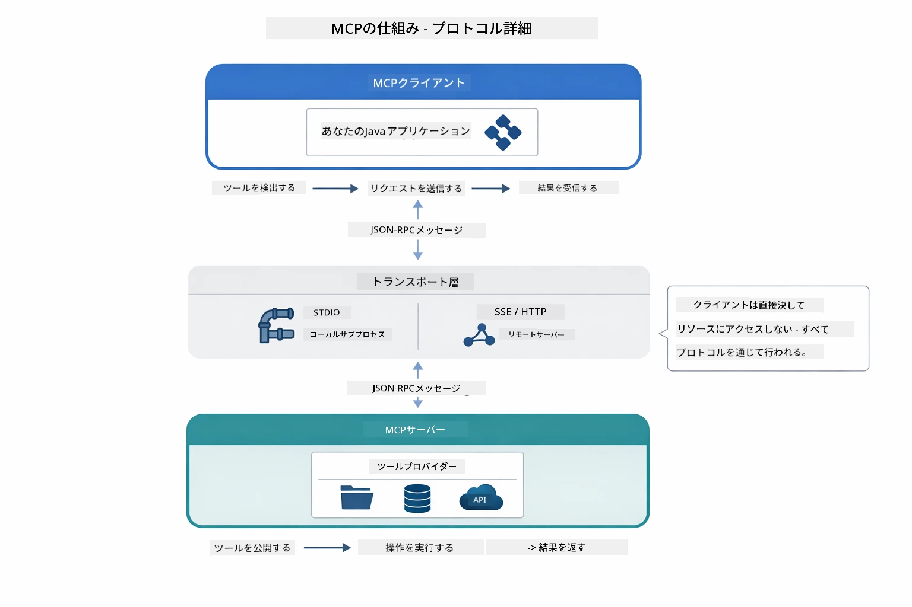

*MCPの仕組み — クライアントがツールを発見し、JSON-RPCメッセージを交換し、トランスポートレイヤーを通じて操作を実行します。*

**サーバークライアントアーキテクチャ**

MCPはクライアント・サーバーモデルを使用します。サーバーはファイルの読み込み、データベース問い合わせ、API呼び出しなどのツールを提供します。クライアント（あなたのAIアプリ）はサーバーに接続し、それらのツールを使います。

LangChain4jでMCPを使うには、以下のMaven依存関係を追加します：

```xml
<dependency>
    <groupId>dev.langchain4j</groupId>
    <artifactId>langchain4j-mcp</artifactId>
    <version>${langchain4j.version}</version>
</dependency>
```

**ツール発見**

クライアントがMCPサーバーに接続すると、「どんなツールがありますか？」と尋ねます。サーバーは利用可能なツールのリストを返します。それにツールの説明やパラメータスキーマが含まれています。AIエージェントはユーザーの要求に応じてどのツールを使うか決定できます。

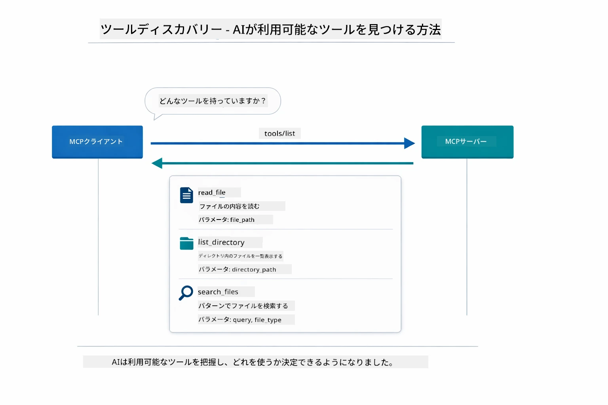

*AIは起動時に利用可能なツールを発見します — どんな機能があるか把握し、使用を決定できます。*

**トランスポートメカニズム**

MCPは複数のトランスポートメカニズムをサポートしています。このモジュールではローカルプロセス用のStdioトランスポートを示します：


*MCPトランスポートメカニズム：リモートサーバー用のHTTP、ローカルプロセス用のStdio*

**Stdio** - [StdioTransportDemo.java](../../../05-mcp/src/main/java/com/example/langchain4j/mcp/StdioTransportDemo.java)

ローカルプロセス用。アプリケーションがサーバーをサブプロセスとして起動し、標準入力/出力で通信します。ファイルシステムアクセスやコマンドラインツールに適しています。

```java
McpTransport stdioTransport = new StdioMcpTransport.Builder()
    .command(List.of(
        npmCmd, "exec",
        "@modelcontextprotocol/server-filesystem@2025.12.18",
        resourcesDir
    ))
    .logEvents(false)
    .build();
```

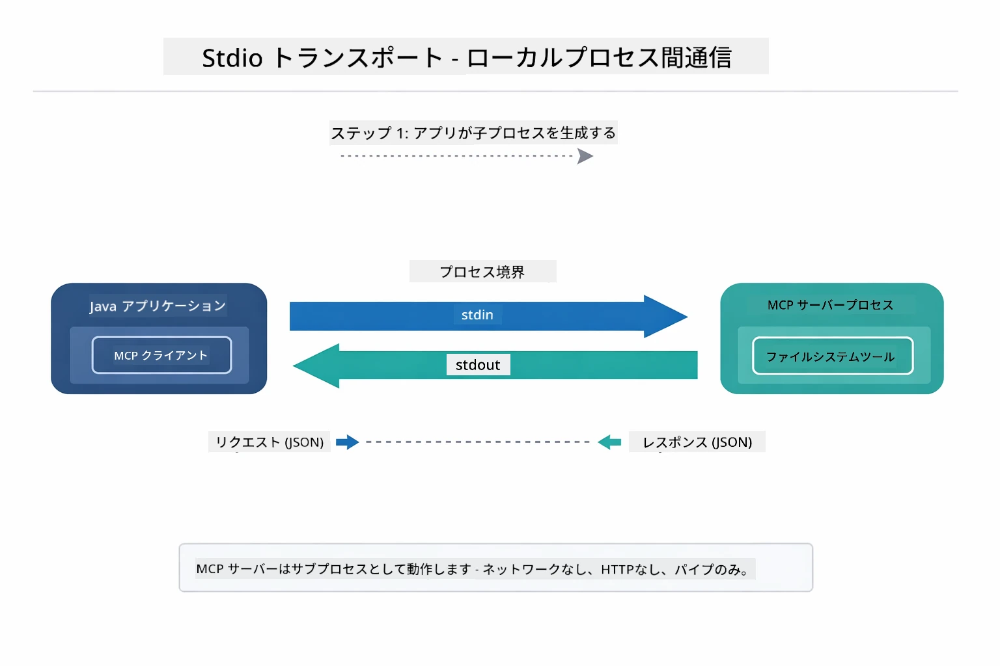

*Stdioトランスポートの動作 — アプリケーションがMCPサーバーを子プロセスとして生成し、stdin/stdoutパイプで通信します。*

> **🤖 [GitHub Copilot](https://github.com/features/copilot) Chatで試してください：** [`StdioTransportDemo.java`](../../../05-mcp/src/main/java/com/example/langchain4j/mcp/StdioTransportDemo.java) を開き、以下を尋ねてみてください：
> - "Stdioトランスポートはどのように機能し、HTTPとの使い分けは？"
> - "LangChain4jは生成されたMCPサーバープロセスのライフサイクルをどう管理している？"
> - "AIにファイルシステムのアクセスを許可するセキュリティ上の懸念は？"

## The Agentic Module

MCPが標準化ツールを提供する一方で、LangChain4jの**agenticモジュール**は、これらのツールをオーケストレーションするエージェントを宣言的に構築する方法を提供します。`@Agent`アノテーションと`AgenticServices`により、命令型コードではなくインターフェースを通じてエージェントの振る舞いを定義できます。

このモジュールでは、ユーザー要求に基づいてサブエージェントを動的に呼び出す「Supervisor Agent」パターンを探ります。MCPによるファイルアクセス機能を備えたサブエージェントを組み合わせて、高度なエージェントAIを構築します。

agenticモジュールを使うには、以下のMaven依存関係を追加します：

```xml
<dependency>
    <groupId>dev.langchain4j</groupId>
    <artifactId>langchain4j-agentic</artifactId>
    <version>${langchain4j.mcp.version}</version>
</dependency>
```

> **⚠️ 実験的:** `langchain4j-agentic`モジュールは**実験的**であり変更の可能性があります。安定したAIアシスタント開発は `langchain4j-core` とカスタムツール（Module 04）が推奨されます。

## Running the Examples

### Prerequisites

- Java 21以上、Maven 3.9以上
- Node.js 16以上とnpm（MCPサーバー用）
- `.env`ファイルに設定された環境変数（ルートディレクトリに配置）：
  - `AZURE_OPENAI_ENDPOINT`、`AZURE_OPENAI_API_KEY`、`AZURE_OPENAI_DEPLOYMENT`（Modules 01-04と同様）

> **Note:** 環境変数が未設定の場合は、[Module 00 - Quick Start](../00-quick-start/README.md)を参照してください。またはルートディレクトリの `.env.example` を `.env` にコピーして値を入力してください。

## Quick Start

**VS Codeを使用する場合：** エクスプローラー内のデモファイルを右クリックして**「Run Java」**を選択するか、実行とデバッグパネルのランチ構成を使います（事前に `.env` ファイルにトークンを追加してください）。

**Mavenを使う場合：** 以下の例のようにコマンドラインから実行できます。

### File Operations (Stdio)

ローカルのサブプロセスベースのツールを実演します。

**✅ 前提条件なし** — MCPサーバーは自動的に起動します。

**スタートスクリプトの使用（推奨）：**

スタートスクリプトはルートの `.env` ファイルから環境変数を自動的に読み込みます：

**Bash:**
```bash
cd 05-mcp
chmod +x start-stdio.sh
./start-stdio.sh
```

**PowerShell:**
```powershell
cd 05-mcp
.\start-stdio.ps1
```

**VS Code使用時：** `StdioTransportDemo.java` を右クリックし **「Run Java」** を選択（`.env` ファイルが設定されていることを確認）。

アプリケーションはファイルシステムMCPサーバーを自動生成し、ローカルファイルを読み込みます。サブプロセスマネジメントが自動で行われる様子に注目してください。

**期待される出力：**
```
Assistant response: The file provides an overview of LangChain4j, an open-source Java library
for integrating Large Language Models (LLMs) into Java applications...
```

### Supervisor Agent

**Supervisor Agentパターン**は**柔軟な**agentic AIの形態です。SupervisorはLLMを使ってユーザーの要求に基づき、どのエージェントを呼び出すか自律的に決定します。次の例では、MCPによるファイルアクセスとLLMエージェントを組み合わせて、監督されたファイル読込→レポート作成のワークフローを実装します。

デモでは、`FileAgent`がMCPファイルシステムツールでファイルを読み、`ReportAgent`が構造化されたレポートを作成します（要約文1文、主要なポイント3つ、提言）。Supervisorがこのフローを自動的にオーケストレーションします：

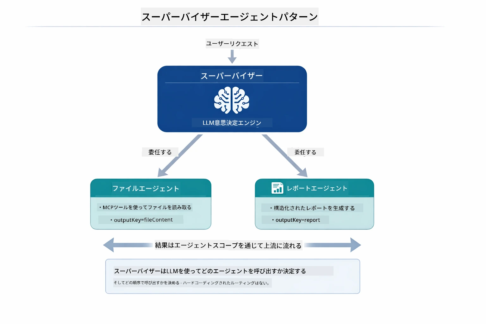

*SupervisorはLLMを使いどのエージェントを呼び出すか、その順序を決定します — ハードコーディングされたルーティングは不要です。*

ファイルからレポート作成までの具体的なワークフローは次の通りです：

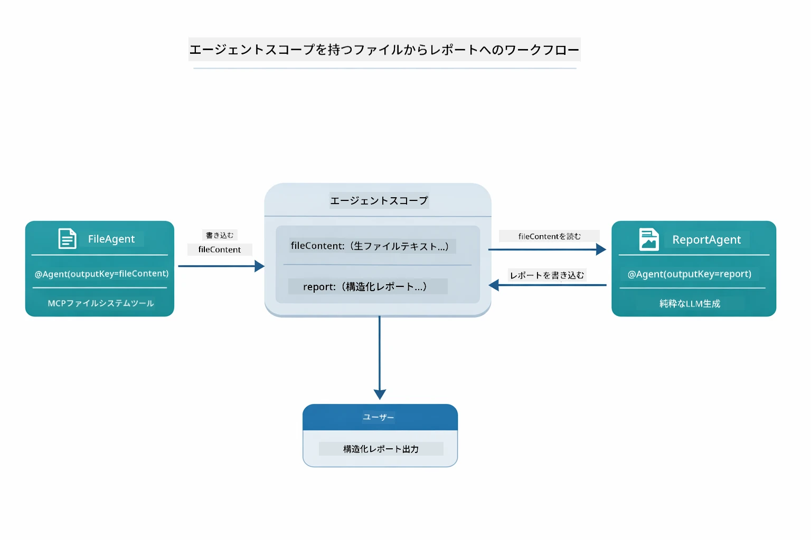

*FileAgentがMCPツールを使いファイルを読み込み、ReportAgentがその内容を構造化されたレポートに変換します。*

各エージェントはその出力を**Agentic Scope**（共有メモリ）に保存し、下流のエージェントが前の結果にアクセス可能にします。これによりMCPツールはagenticワークフローにシームレスに統合されます — Supervisorはファイルの読み方を知らなくても、`FileAgent`がそれを行えることは知っています。

#### Running the Demo

スタートスクリプトはルートの `.env` ファイルから環境変数を自動ロードします：

**Bash:**
```bash
cd 05-mcp
chmod +x start-supervisor.sh
./start-supervisor.sh
```

**PowerShell:**
```powershell
cd 05-mcp
.\start-supervisor.ps1
```

**VS Code使用時：** `SupervisorAgentDemo.java` を右クリックして **「Run Java」** を選択（`.env` ファイルが設定されていることを確認）。

#### How the Supervisor Works

```java
// ステップ1: FileAgentはMCPツールを使ってファイルを読み取ります
FileAgent fileAgent = AgenticServices.agentBuilder(FileAgent.class)
        .chatModel(model)
        .toolProvider(mcpToolProvider)  // ファイル操作のためのMCPツールを持っています
        .build();

// ステップ2: ReportAgentは構造化されたレポートを生成します
ReportAgent reportAgent = AgenticServices.agentBuilder(ReportAgent.class)
        .chatModel(model)
        .build();

// Supervisorはファイルからレポートへのワークフローを管理します
SupervisorAgent supervisor = AgenticServices.supervisorBuilder()
        .chatModel(model)
        .subAgents(fileAgent, reportAgent)
        .responseStrategy(SupervisorResponseStrategy.LAST)  // 最終レポートを返します
        .build();

// Supervisorはリクエストに基づいて呼び出すエージェントを決定します
String response = supervisor.invoke("Read the file at /path/file.txt and generate a report");
```

#### Response Strategies

`SupervisorAgent`を設定する際、サブエージェントがタスクを完了した後、どのように最終回答を作成するかを指定します。

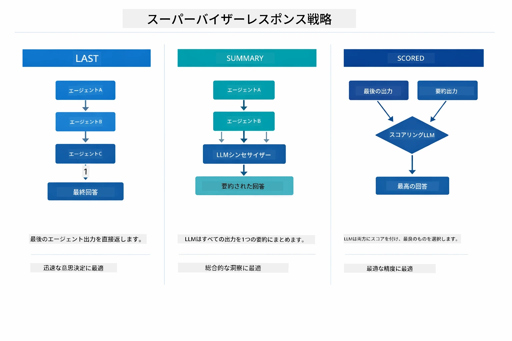

*Supervisorが最終応答を生成する3つの戦略 — 最後のエージェントの出力、総合的な要約、それともスコアが高い方を選択。*

利用可能な戦略は以下の通りです：

| 戦略 | 説明 |
|----------|-------------|
| **LAST** | Supervisorは最後に呼び出されたサブエージェントまたはツールの出力を返します。これにより、ワークフローの最後のエージェントが完全な最終回答を生成する場合に有効です（例：「Summary Agent」が研究パイプラインにある場合など）。 |
| **SUMMARY** | Supervisorは自身の内部LLMを使い、すべてのやりとりとサブエージェントの出力を総合的に要約し、その要約を最終回答として返します。クリーンで集約された回答を提供します。 |
| **SCORED** | システムは内部LLMを使い、「LAST」の出力と「SUMMARY」の両方を元のユーザーリクエストに対してスコアリングし、より高いスコアの方を返します。 |

完全な実装は [SupervisorAgentDemo.java](../../../05-mcp/src/main/java/com/example/langchain4j/mcp/SupervisorAgentDemo.java) を参照してください。

> **🤖 [GitHub Copilot](https://github.com/features/copilot) Chatで試してください：** [`SupervisorAgentDemo.java`](../../../05-mcp/src/main/java/com/example/langchain4j/mcp/SupervisorAgentDemo.java) を開き、以下を尋ねてみてください：
> - "Supervisorはエージェントの呼び出しをどう決定している？"
> - "SupervisorとSequentialワークフローパターンの違いは何？"
> - "Supervisorの計画動作をどうカスタマイズできる？"

#### Understanding the Output

デモを実行すると、Supervisorが複数のエージェントをオーケストレーションする様子を構造的に確認できます。各セクションの意味は次の通りです：

```
======================================================================
  FILE → REPORT WORKFLOW DEMO
======================================================================

This demo shows a clear 2-step workflow: read a file, then generate a report.
The Supervisor orchestrates the agents automatically based on the request.
```

**ヘッダー**はワークフローのコンセプトを紹介します：ファイル読込からレポート生成への集中したパイプライン。

```
--- WORKFLOW ---------------------------------------------------------
  ┌─────────────┐      ┌──────────────┐
  │  FileAgent  │ ───▶ │ ReportAgent  │
  │ (MCP tools) │      │  (pure LLM)  │
  └─────────────┘      └──────────────┘
   outputKey:           outputKey:
   'fileContent'        'report'

--- AVAILABLE AGENTS -------------------------------------------------
  [FILE]   FileAgent   - Reads files via MCP → stores in 'fileContent'
  [REPORT] ReportAgent - Generates structured report → stores in 'report'
```

**ワークフローダイアグラム**はエージェント間のデータフローを示します。各エージェントには特定の役割があります：
- **FileAgent** はMCPツールを使いファイルを読み、生の内容を `fileContent` に保存
- **ReportAgent** はその内容を消費し、構造化されたレポートを `report` に生成

```
--- USER REQUEST -----------------------------------------------------
  "Read the file at .../file.txt and generate a report on its contents"
```

**ユーザー要求**はタスクを示します。Supervisorは解析し、FileAgent → ReportAgentを呼び出すことを決定。

```
--- SUPERVISOR ORCHESTRATION -----------------------------------------
  The Supervisor decides which agents to invoke and passes data between them...

  +-- STEP 1: Supervisor chose -> FileAgent (reading file via MCP)
  |
  |   Input: .../file.txt
  |
  |   Result: LangChain4j is an open-source, provider-agnostic Java framework for building LLM...
  +-- [OK] FileAgent (reading file via MCP) completed

  +-- STEP 2: Supervisor chose -> ReportAgent (generating structured report)
  |
  |   Input: LangChain4j is an open-source, provider-agnostic Java framew...
  |
  |   Result: Executive Summary...
  +-- [OK] ReportAgent (generating structured report) completed
```

**Supervisorのオーケストレーション**で2段階のフローが実行される様子：
1. **FileAgent** がMCP経由でファイルを読み込み、内容を保存
2. **ReportAgent** がその内容を受け取り、構造化レポートを生成

Supervisorはユーザーの要求に基づきこの決定を**自律的に**行いました。

```
--- FINAL RESPONSE ---------------------------------------------------
Executive Summary
...

Key Points
...

Recommendations
...

--- AGENTIC SCOPE (Data Flow) ----------------------------------------
  Each agent stores its output for downstream agents to consume:
  * fileContent: LangChain4j is an open-source, provider-agnostic Java framework...
  * report: Executive Summary...
```

#### Explanation of Agentic Module Features

この例はagenticモジュールのいくつかの高度な機能を示しています。Agentic ScopeとAgent Listenersに注目してみましょう。

**Agentic Scope**はエージェントが `@Agent(outputKey="...")` を使って保存した結果の共有メモリです。これにより：
- 後続のエージェントは前のエージェントの出力にアクセス可能
- Supervisorは最終応答を合成可能
- あなたは各エージェントの生成物を調査可能

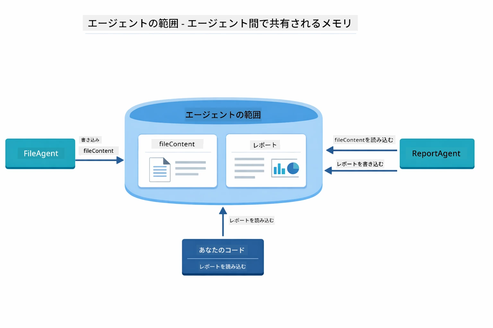

*Agentic Scopeは共有メモリとして機能 — FileAgentが`fileContent`を書き込み、ReportAgentが読み書きし、最終的にあなたのコードが結果を読み取ります。*

```java
ResultWithAgenticScope<String> result = supervisor.invokeWithAgenticScope(request);
AgenticScope scope = result.agenticScope();
String fileContent = scope.readState("fileContent");  // FileAgentからの生ファイルデータ
String report = scope.readState("report");            // ReportAgentからの構造化レポート
```

**Agent Listeners** はエージェントの実行を監視およびデバッグするための機能です。デモで表示されるステップごとの出力は、各エージェント呼び出しにフックしたAgentListenerによるものです。
- **beforeAgentInvocation** - スーパーバイザーがエージェントを選択したときに呼び出され、どのエージェントが選ばれたかとその理由を確認できます
- **afterAgentInvocation** - エージェントが完了したときに呼び出され、その結果が表示されます
- **inheritedBySubagents** - trueの場合、リスナーは階層内のすべてのエージェントを監視します

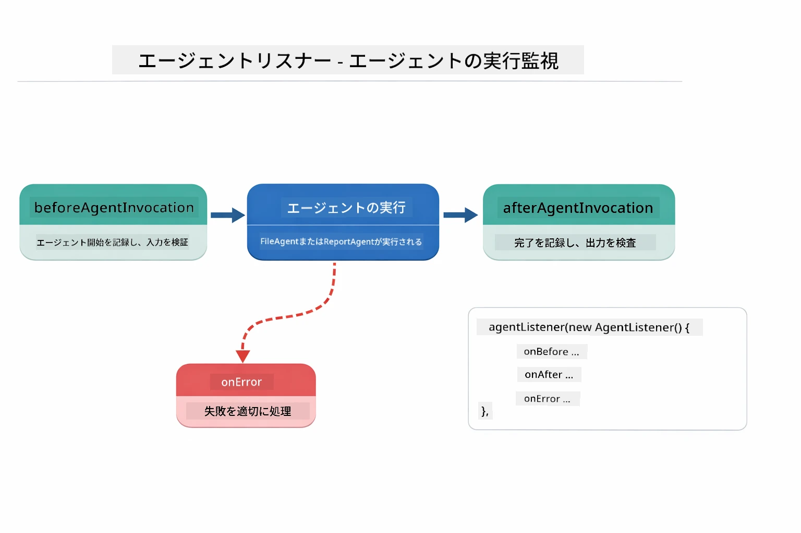

*エージェントリスナーは実行ライフサイクルにフックし、エージェントの開始、完了、エラー発生を監視します。*

```java
AgentListener monitor = new AgentListener() {
    private int step = 0;
    
    @Override
    public void beforeAgentInvocation(AgentRequest request) {
        step++;
        System.out.println("  +-- STEP " + step + ": " + request.agentName());
    }
    
    @Override
    public void afterAgentInvocation(AgentResponse response) {
        System.out.println("  +-- [OK] " + response.agentName() + " completed");
    }
    
    @Override
    public boolean inheritedBySubagents() {
        return true; // すべてのサブエージェントに伝播する
    }
};
```
  
Supervisorパターンを超えて、`langchain4j-agentic`モジュールは強力なワークフローパターンと機能を提供します:

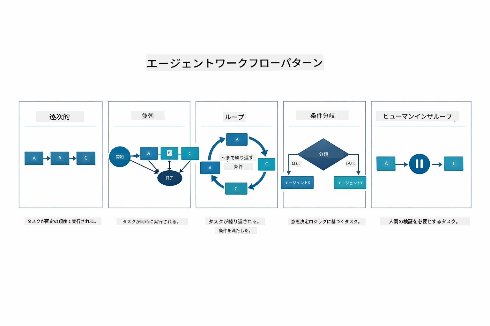

*エージェントのオーケストレーションのための5つのワークフローパターン — 単純な順次パイプラインから人間の介入を含む承認ワークフローまで。*

| パターン | 説明 | 使用例 |
|---------|-------------|----------|
| **順次 (Sequential)** | エージェントを順番に実行し、出力を次に渡す | パイプライン: 研究 → 分析 → 報告 |
| **並行 (Parallel)** | エージェントを同時に実行 | 独立したタスク: 天気 + ニュース + 株価 |
| **ループ (Loop)** | 条件を満たすまで繰り返す | 品質評価: スコアが0.8以上になるまで改善 |
| **条件分岐 (Conditional)** | 条件に基づいてルート分け | 分類 → 専門エージェントへルーティング |
| **人間介入 (Human-in-the-Loop)** | 人間のチェックポイントを追加 | 承認ワークフロー、コンテンツレビュー |

## 重要な概念

MCPとagenticモジュールの実例を見てきたので、それぞれの使い分けをまとめましょう。

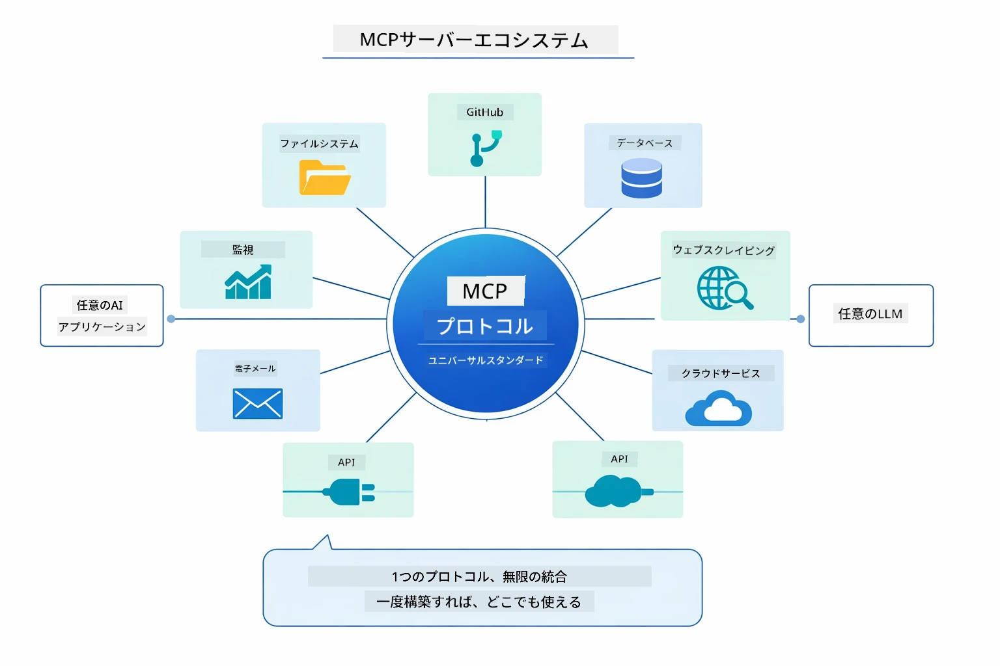

*MCPは普遍的なプロトコルエコシステムを作り出します — MCP対応のサーバーはMCP対応のクライアントと組み合わせ可能で、アプリケーション間でツールを共有できます。*

**MCP** は既存のツールエコシステムを活用したい場合、複数のアプリケーションで共有できるツールを構築したい場合、標準プロトコルでサードパーティサービスと統合したい場合、コードを変えずにツールの実装を差し替えたい場合に最適です。

**Agenticモジュール** は`@Agent`アノテーションで宣言的にエージェントを定義したい場合、ワークフローのオーケストレーション（順次、ループ、並行）が必要な場合、命令的コードよりインターフェースベースのエージェント設計を好む場合、`outputKey`を介して複数エージェントの出力を共有する場合に適しています。

**Supervisorエージェントパターン** はワークフローが事前に予測できずLLMに判断を任せたい場合、複数の専門エージェントを動的にオーケストレーションしたい場合、異なる機能にルート分岐する会話システムを構築する場合、最も柔軟で適応的なエージェント動作を望む場合に光ります。

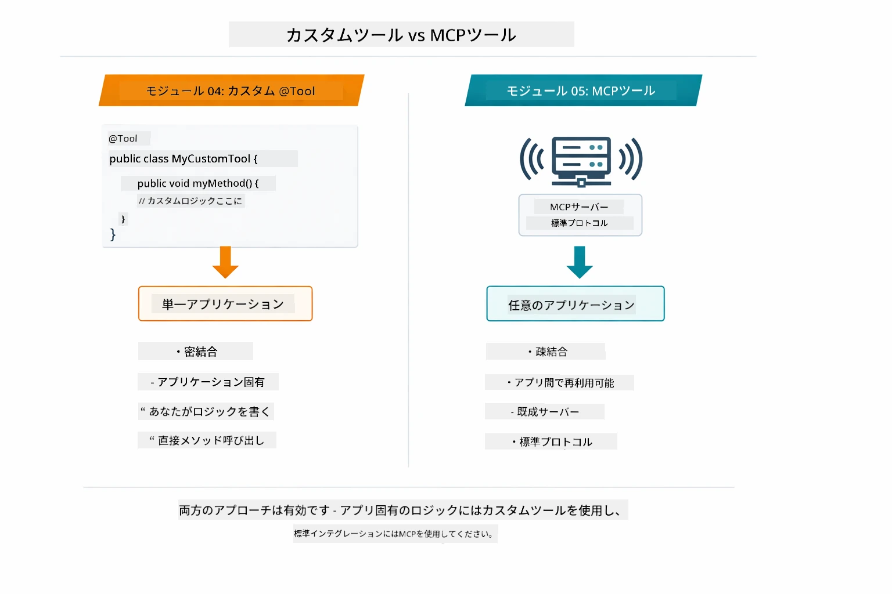

*カスタムの@ToolメソッドとMCPツールの使い分け — アプリ固有のロジックにはフルタイプセーフティのカスタムツールを、アプリ間で共通利用する標準化された統合にはMCPツールを。*

## おめでとうございます！

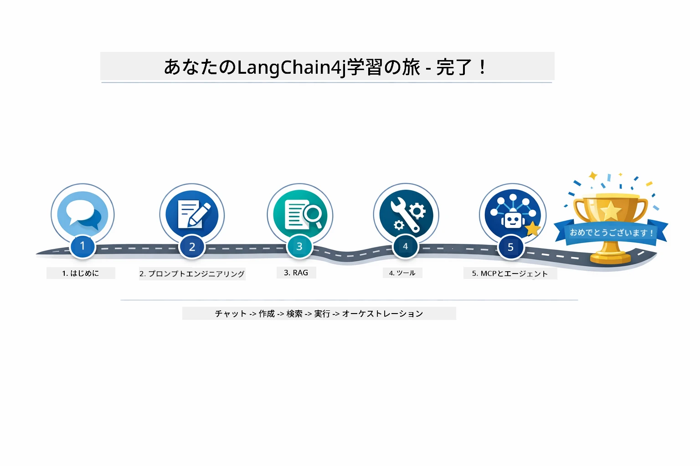

*基本的なチャットからMCP対応のagenticシステムまで、5つのモジュールを通じた学習の旅を終えました。*

LangChain4j for Beginnersコースを修了しました。あなたは以下を習得しました:

- メモリを用いた対話型AIの構築方法（モジュール01）
- 様々なタスク向けのプロンプト設計パターン（モジュール02）
- ドキュメントに基づいた回答生成（RAG）（モジュール03）
- カスタムツールによる基本的なAIエージェント（アシスタント）の作成（モジュール04）
- LangChain4jのMCPおよびAgenticモジュールを使った標準ツールの統合（モジュール05）

### 次にすべきこと

モジュールを完了したら、[Testing Guide](../docs/TESTING.md)でLangChain4jのテスト概念を実際に見てみましょう。

**公式リソース：**
- [LangChain4j ドキュメント](https://docs.langchain4j.dev/) - 詳細なガイドとAPIリファレンス
- [LangChain4j GitHub](https://github.com/langchain4j/langchain4j) - ソースコードと例
- [LangChain4j チュートリアル](https://docs.langchain4j.dev/tutorials/) - 様々なユースケースのステップバイステップチュートリアル

このコースの修了、おめでとうございます！

---

**ナビゲーション：** [← 前へ: モジュール 04 - ツール](../04-tools/README.md) | [メインへ戻る](../README.md)

---

<!-- CO-OP TRANSLATOR DISCLAIMER START -->
**免責事項**：  
本書類はAI翻訳サービス「Co-op Translator」（https://github.com/Azure/co-op-translator）を使用して翻訳されました。正確性を期しておりますが、自動翻訳には誤りや不正確な点が含まれる場合があります。正式な情報源としては、原文の言語によるオリジナルの書類を参照してください。重要な情報については、専門の人間による翻訳を推奨します。本翻訳の使用によって生じたいかなる誤解や誤訳についても、当方は責任を負いかねます。
<!-- CO-OP TRANSLATOR DISCLAIMER END -->